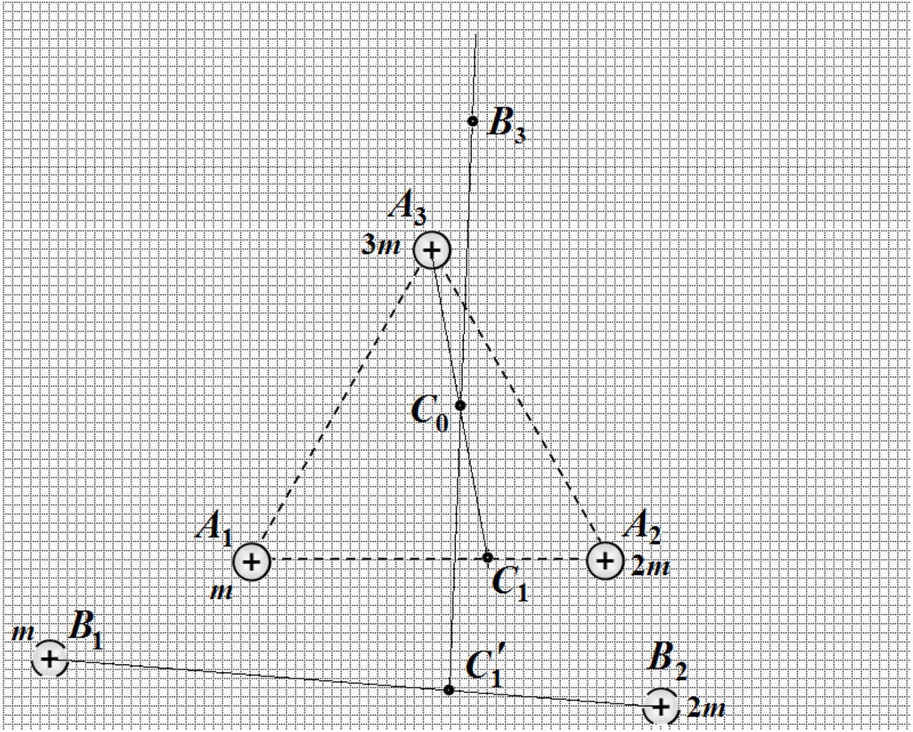

Problem 1. Plotting (7 points)
Problem 1.1
The basic idea is that the center of mass of the whole system remains at rest! First of all, find the center of mass at the initial position: Divide the segment $A _ { 1 } A _ { 2 }$ by the ratio of 2:1 (point $C _ { 1 }$ ); connect $C _ { 1 }$ with point $A _ { 3 }$ and cut segment $C _ { 1 } A _ { 3 }$ into halves (point $C _ { 0 }$ ). The point $C _ { 0 }$ is center of mass of the system. To find the position of the third ball one should do the following: divide the segment $B _ { 1 } B _ { 2 }$ by the ratio of 2:1 (point $C _ { 1 } ^ { \prime }$ ), write down straight line from to the point of the center of mass $C _ { 0 }$, and draw the segment $C _ { 0 } B _ { 3 }$, whose length should be equal to the length of the segment $C _ { 1 } ^ { \prime } C _ { 0 }$. The point $B _ { 3 }$ is the position of third ball!

