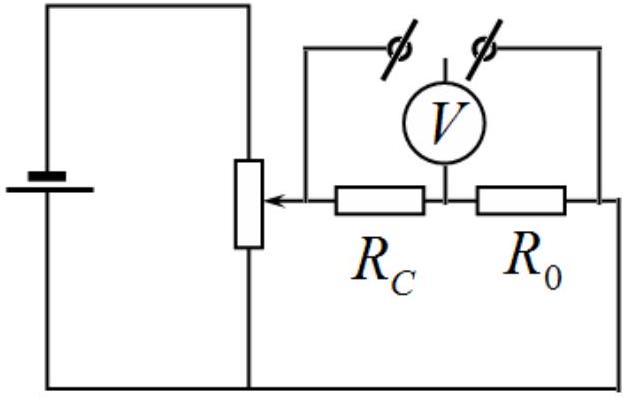
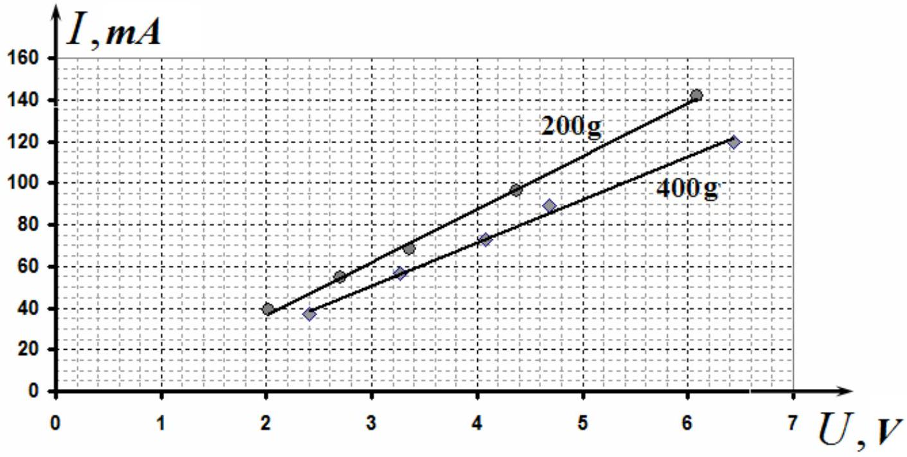
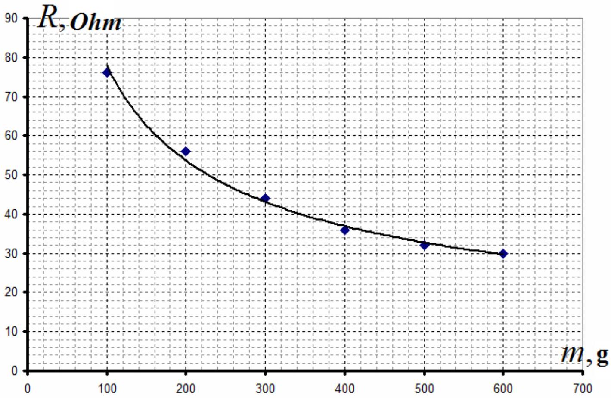
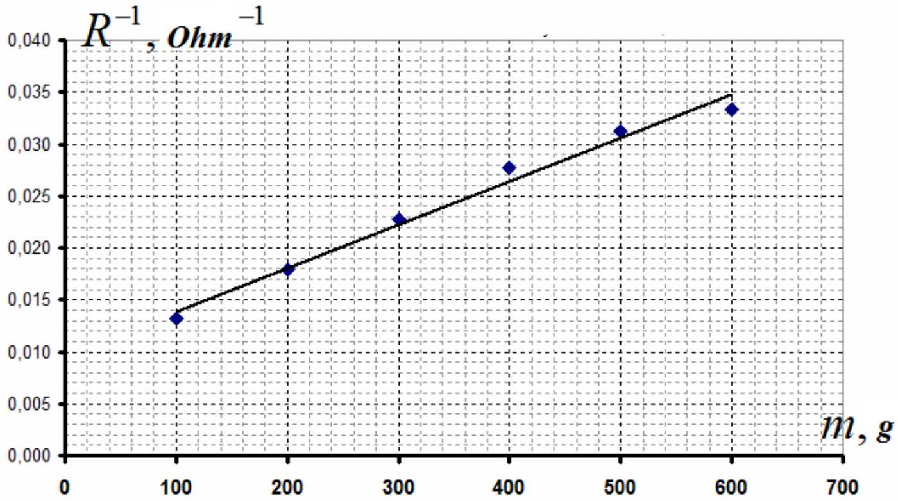
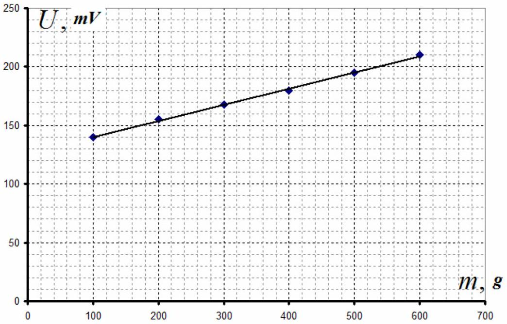

## SOLUTION FOR THE EXPERIMENTAL COMPETITION Coal tablet (15.0 points)   Part 1. Ohm's law ( $\mathbf { 7 . 0 }$ points)

To check whether Ohm's is in power in this caseб the circuit shown on the right should be connected such that the multimiter in voltmiter mode is used to measure the voltage across the tablet $R _ { C }$ and the resistor $R _ { 0 } = 1,0 O h m$. The latter is equal to the electric current.

The results for two given weights are presented in table 1.

Table 1
| $m = 200 g$ |  | $m = 400 g$ |  |
| :--- | :--- | :--- | :--- |
| $U , V$ | I,mA | $U , V$ | I, mA |
| 6,43 | 120,0 | 6,09 | 142,0 |
| 4,69 | 89,0 | 4,37 | 96,0 |
| 4,08 | 72,7 | 3,36 | 68,0 |
| 3,27 | 56,6 | 2,7 | 54,5 |
| 2,41 | 37,0 | 2,02 | 39,2 |

The graphs of the obtained dependences are shown below.

With a high degree of accuracy these dependences are linear which means that the resistance is independent of the voltage and Ohm's law holds.

To calculate the resistances it is required to use the leasrt square method. The result are summarized as follows

$$
\begin{array} { l l }
200 \Gamma - a = ( 21 \pm 2 ) \frac { m A } { V } & b = ( - 10 \pm 11 ) m A ; \\
400 \Gamma - a = ( 25 \pm 2 ) \frac { m A } { V } & b = ( - 10 \pm 8 ) m A
\end{array}
$$

Consequently, the corresponding resistances are found as

$$
R _ { 200 } = \frac { 1 } { a } = ( 47 \pm 5 ) \mathrm { Ohm } \quad R _ { 400 } = \frac { 1 } { a } = ( 40 \pm 3 ) \mathrm { Ohm }
$$

## Part 2. Mechanical stress and resistance (5.0 points)

The resistance can be directly measured by the multimeter. And the results are shown in table 2.

Table 2.
| $m , g$ | R, Ohm | $R ^ { - 1 } , O h m ^ { - 1 }$ |
| :--- | :--- | :--- |
| 100 | 76 | 0,0132 |
| 200 | 56 | 0,0179 |
| 300 | 44 | 0,0227 |
| 400 | 36 | 0,0278 |
| 500 | 32 | 0,0313 |
| 600 | 30 | 0,0333 |

It is seen from the graph above that the dependence is actually inversely proportional. Thus, the conductivity is approximately proportional to the mass of weights.

## Part 3. Designing scales (3.0 points)

The obtained results demonstrate that the current in the circuit shown above is proportional to the mechanical stress on the tablet. That is why the circuit for electronic sales should be the same and the voltage must be measured across the resistor $R _ { 0 }$. The "readings" of the scales as a function of the mechanical stress are presented in table 3 and in the corresponding graph.

Table 3.
| $m , g$ | $U , m V$ |
| :--- | :--- |
| 100 | 140 |
| 200 | 155 |
| 300 | 168 |
| 400 | 180 |
| 500 | 195 |
| 600 | 210 |

Grading scheme
|  | Content | Points | Total |
| :--- | :--- | :--- | :--- |
| 3.1 | The electrical circuit allows one to measure the electric current and the voltage. | 1,0 | 1.0 |
|  | Setting up the mechanical stress according to lever rule | 0,5 | 0,5 |
|  | Taking measurements:   - no less than 5 points for each dependence (3-4.less than 3);   - the voltage up to 6 V (up to 4 V, or less); Linear dependences are obtained | 2×1,0 (2x0,5, 0)   2×0.5 (2×0,25,0) 2×0,25 | 3,5 |
|  | Plotting the graph:   Axis are labeled and ticked, All points are presnt in the graph;   Smooth lines are drawn | 0,1   0.2   0,2 | 0,5 |
|  | Calculation of the resistances: | 1,5 2×0,5   (2x0,4)   (2×0,25)   2×0,25 | 1,5 |
| 2.1 | Taking measuments: (the acceptable range 100-30 Ohm)   - no less than 6 points;   - the resistance decreases/increases at least twice;   - repeated measurements are taken;   - the obtained dependence is inversely proportional; | 3,5 1,5   1,0   0,5   0,5 | 3,5 |
| 2.2 | Plotting the graph   Axis are labeled and ticked,   All points are presnt in the graph;   Smooth lines are drawn | 0,5 0,1   0,2   0,2 |  |
| 2.3 | Linearization is made | 0,5 | 0,5 |
|  | The graph of the linearized dependence | 0,5 | 0,5 |
| 3.1 | The circuit is to measure the current | 1,5 | 1,5 |
|  | Plotting the calibrating graph: no less than 5 points;   Axis are labeled and ticked, All points are presnt in the graph;   Smooth lines are drawn | 0,5   0,5   0,5 |  |
|  | Total | 15 |  |
