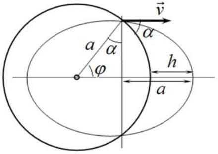
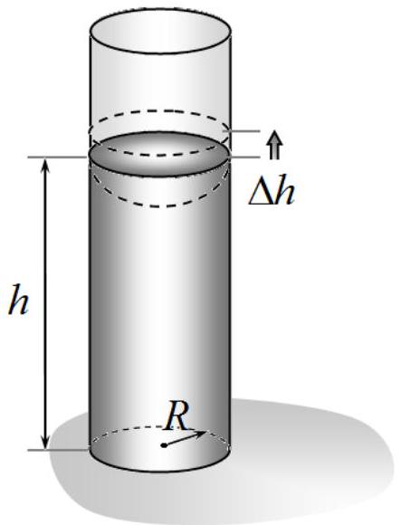
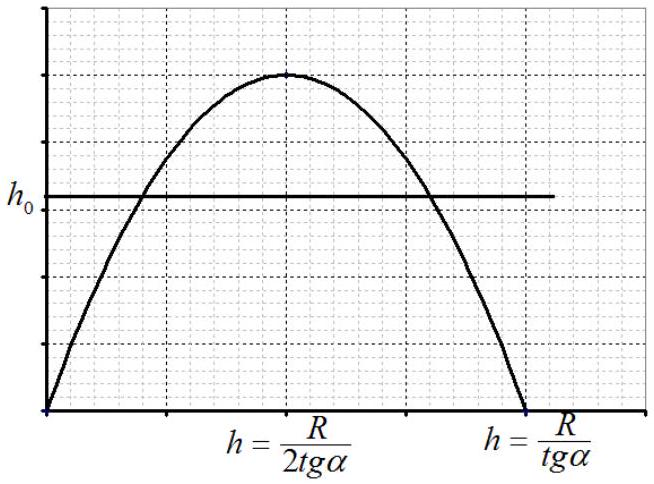
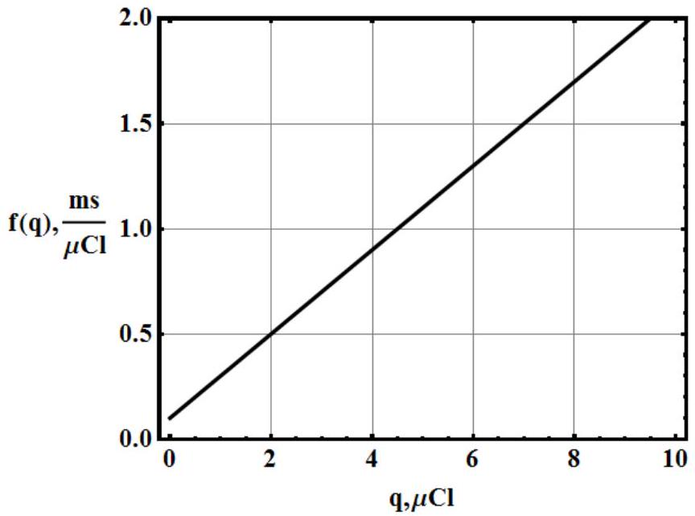
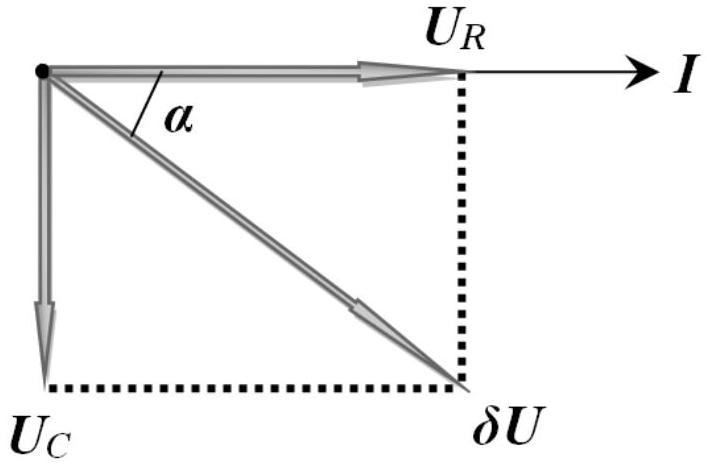

## SOLUTIONS TO THE PROBLEMS OF THE THEORETICAL COMPETITION   Attention   Problem 1 (10.0 points)   Problem 1A (4.0 points)

For Keplerian motion the total energy, as well as the period of rotation, depends only on the semi-major axis, which for stone's orbit coincides with the planet radius $( a = R )$, and the starting point lies on the semi-minor axis because its distance to the focus (the center of the planet) is equal to $a$ (see. fig.). From the figure one gets

$$
\begin{aligned}
& R + h = a \sin \alpha + a , \\
& h = R \sin \alpha .
\end{aligned}
$$

This result can also be obtained by solving a set of equations which is written from the conservation of energy and angular momentum.

The flight range of the stone is found as $l = 2 R \varphi = 2 R \left( \frac { \pi } { 2 } - \alpha \right)$.

Grading scheme
| № | Content | points |
| :--- | :--- | :--- |
| 1. | The maximum height is found | 2 |
|  | Conservation of energy | 0,5 |
|  | Conservation of angular momentum | 0,5 |
|  | The set of equation is correctly solved | 1 |
|  | or |  |
|  | Semi-major axis $a = R$ is found | 0,5 |
|  | Justification for semi-major axis | 0,5 |
|  | The correct sketch is drawn | 0,5 |
|  | Answer | 0,5 |
| 2. | The angle $\varphi$ is obtained ( $\varphi = \frac { \pi } { 2 } - \alpha$ ) | 1 |
|  | Correct answer to the question | 1 |
| Total |  | 4.0 |

## Problem 1B (3.0 points)

According to the definition the heat capacity is written as

$$
\begin{equation*}
C = \frac { \delta Q } { \Delta T } = \frac { \Delta U + P \Delta V } { \Delta T } = C _ { V } + P \frac { \Delta V } { \Delta T } . \tag{1}
\end{equation*}
$$

Let the gas parameters at the point $A$ be equal $\left( P _ { 0 } , V _ { 0 } , T _ { 0 } \right)$. Then, the equation of the process takes the following form

$$
\begin{equation*}
\frac { V } { V _ { 0 } } + \frac { T } { T _ { 0 } } = 2 . \tag{2}
\end{equation*}
$$

For small deviations one derives

$$
\begin{align*}
& \frac { \Delta V } { V _ { 0 } } + \frac { \Delta T } { T _ { 0 } } = 0 ,  \tag{3}\\
& \frac { \Delta V } { \Delta T } = - \frac { V _ { 0 } } { T _ { 0 } } . \tag{4}
\end{align*}
$$

With the aid of the equation of state $P _ { 0 } V _ { 0 } = R T _ { 0 }$, one finally gets

$$
\begin{equation*}
C = C _ { V } + P \frac { \Delta V } { \Delta T } = C _ { V } - P _ { 0 } \frac { V _ { 0 } } { T _ { 0 } } = C _ { V } - R = \frac { R } { 2 } . \tag{5}
\end{equation*}
$$

Grading scheme

| № | Content | points |
| :--- | :--- | :--- |
| 1. | Expression for $C$ that contains the derivative | 1.0 |
| 2. | The derivative is found for the point $A$ | 1.0 |

| 3. | Correct answer ( $C _ { V } - R$ or $R / 2$ ) | 1.0 |
| :--- | :--- | :--- |
| Total |  | 3.0 |

## Problem 1C (3.0 points)

It follows from the symmetry that the potential at the center of a uniformly charged volume of spherical shape with respect to the point at infinity is equal to

$$
\begin{equation*}
\varphi \sim k \frac { q } { R } \sim \alpha \frac { \rho R ^ { 3 } } { R } \sim \alpha \rho R ^ { 2 } , \tag{1}
\end{equation*}
$$

where $\alpha$ denotes a coefficient of proportionality which is the same for a sphere of any size.
Our system of charges can be represented as a superposition of a sphere of radius $R$ with the volume charge density $+ \rho$, and a sphere of radius $r$ charged with the volume density $- 2 \rho$. Then, the potential at the center is found as

$$
\begin{equation*}
\alpha \rho R ^ { 2 } + \alpha ( - 2 \rho ) r ^ { 2 } = 0 , \tag{2}
\end{equation*}
$$

where

$$
\begin{equation*}
\frac { R } { r } = \sqrt { 2 } . \tag{3}
\end{equation*}
$$

## Grading scheme

| № | Content | points |
| :--- | :--- | :--- |
| 1. | The formula for the potential at the center $\varphi \sim \rho R ^ { 2 }$ | 1.0 |
|  | Derivation of the potential at the center | 1.0 |
|  | Wrong coefficient for the potential at the center | -0.5 |
|  | Wrong derivation of the potential | 0 |
| 2. | Superposition principle is used | 1.0 |
| 3. | Correct answer | 1.0 |
| Total |  | 3.0 |

## Problem 2. Equilibrium in terms of potential energy ( $\mathbf { 1 0 . 0 }$ points)

## 1. Introduction (1.0 points)

1.1 [1.0 points] The change in the surface energy at the liquid-solid interface is found as

$$
\begin{equation*}
\Delta U _ { S } = - \left( \sigma _ { 2 } - \sigma _ { 1 } \right) \Delta S . \tag{1}
\end{equation*}
$$

Considering the small segment $\Delta l$ of the boundary of the drop one can write the condition of its balance

$$
\begin{equation*}
\left( \sigma _ { 2 } - \sigma _ { 1 } \right) \Delta l = \sigma _ { 0 } \Delta l \cos \theta . \tag{2}
\end{equation*}
$$

It follows from equations (1) and (2) that

$$
\begin{equation*}
\Delta U _ { s } = - \sigma _ { 0 } \cos \theta \Delta S . \tag{3}
\end{equation*}
$$

## 2. Water in a vertical cylindrical tube (2.0 points)

2.1 [0.5 points] The formula for the change in the surface energy of the system $\Delta U _ { s }$ that corresponds to an additional small rise of water level $\Delta h$ in the tube takes the form

$$
\begin{equation*}
\Delta U _ { S } = - \sigma _ { 0 } \cos \theta \cdot \Delta S = - \sigma _ { 0 } \cos \theta \cdot 2 \pi R \Delta h , \tag{4}
\end{equation*}
$$

where $\Delta S = 2 \pi R \Delta h$ is the change of the contact area between the liquid and the inner surface of the tube.
2.2 [0.5 points] The formula for the change in the potential energy $\Delta U _ { G }$ of the liquid in the gravitational field that corresponds to an additional small rise of water level $\Delta h$ in the tube takes the form

$$
\begin{equation*}
\Delta U _ { G } = \pi R ^ { 2 } \Delta h \rho g h . \tag{5}
\end{equation*}
$$

It is taken into account that the liquid of the mass $\Delta m = \pi R ^ { 2 } \Delta h \rho$

has risen to the height $h$.

2.3 [1.0 points] If $\left| \Delta U _ { S } \right|$ exceeds $\Delta U _ { G }$, the energy of the system decreases when the liquid has risen, and hence the liquid will continue to rise, otherwise liquid level will go down. At the position of equilibrium, the total change in energy should be equal to zero, and, thus,

$$
\begin{equation*}
\sigma _ { 0 } \cos \theta \cdot 2 \pi R \Delta h = \pi R ^ { 2 } \Delta h \rho g h \Rightarrow h _ { 0 } = \frac { 2 \sigma _ { 0 } \cos \theta } { \rho g R } . \tag{6}
\end{equation*}
$$

Substitution of the numerical values leads to the following result

$$
\begin{equation*}
h _ { 0 } = \frac { 2 \sigma _ { 0 } \cos \theta } { \rho g R } = \frac { 2 \cdot 0,072 \cdot \cos 20 ^ { \circ } } { 1,0 \cdot 10 ^ { 3 } \cdot 9,8 \cdot 1,0 \cdot 10 ^ { - 3 } } = 1,4 \cdot 10 ^ { - 2 } \mathrm {~m} = 14 \mathrm {~mm} . \tag{7}
\end{equation*}
$$

## 3. Water in a vertical conical tube (4.0 points)

3.1 [0.5 points] The formula for the change in the surface energy of the system $\Delta U _ { S }$ that corresponds to an additional small rise of water level $\Delta h$ in the tube takes the form

$$
\begin{equation*}
\Delta U _ { S } = - \sigma _ { 0 } \cos \theta \cdot \Delta S = - \sigma _ { 0 } \cos \theta \cdot 2 \pi r \frac { \Delta h } { \cos \alpha } . \tag{8}
\end{equation*}
$$

Here $r = R - h \operatorname { tg } \alpha$ is the tube radius at the height $h$.
3.2 [0.5 points] The formula for the change in the potential energy $\Delta U _ { G }$ of the liquid in the gravitational field that corresponds to an additional small rise of water level $\Delta h$ in the tube takes the form

$$
\begin{equation*}
\Delta U _ { G } = \pi r ^ { 2 } \Delta h \rho g h . \tag{9}
\end{equation*}
$$

3.3 [1.0 points] As above, the equilibrium position corresponds to the equality of the modules for the energy changes written here as

$$
\begin{equation*}
\sigma _ { 0 } \cos \theta \cdot 2 \pi r \frac { \Delta h } { \cos \alpha } = \pi r ^ { 2 } \Delta h \rho g h , \tag{10}
\end{equation*}
$$

Substituting the expression for the radius of the tube at the height $h$, one gets the equation

$$
\begin{equation*}
\frac { 2 \sigma _ { 0 } \cos \theta } { R - h \operatorname { tg } \alpha } = \rho g h \cos \alpha , \tag{11}
\end{equation*}
$$

in which the parameter $h _ { 0 }$ is easily introduced as

$$
\begin{equation*}
\frac { 2 \sigma _ { 0 } \cos \theta } { \rho g R \left( 1 - \frac { h } { R } \operatorname { tg } \alpha \right) } = h \cos \alpha \Rightarrow \frac { h _ { 0 } } { 1 - \frac { h } { R } \operatorname { tg } \alpha } = h \cos \alpha , \tag{12}
\end{equation*}
$$

3.4 [1.0 points] The resulting equation is square with respect to $h$. Therefore it is necessary to analyze its roots, or condition of their absence. Let us rewrite equation (12) in the form

$$
\begin{equation*}
h _ { 0 } = h \cos \alpha \left( 1 - \frac { h } { R } \operatorname { tg } \alpha \right) . \tag{13}
\end{equation*}
$$

The quadratic function on the right side of this equation has zeros at $h = 0$ and $h = \frac { R } { \operatorname { tg } \alpha }$,, and therefore, it reaches its maximum value of $\frac { R } { 4 \operatorname { tg } \alpha } \cos \alpha$ at $h = \frac { R } { 2 \operatorname { tg } \alpha }$ - Consequently, equation (12) has no real roots at $h _ { 0 } > \frac { R } { 4 \operatorname { tg } \alpha } \cos \alpha$. Otherwise, there are two roots. At the given parameters of the tube $\frac { R } { 4 \operatorname { tg } \alpha } \cos \alpha = 25 m m$, so
 there are two root corresponding to the two equilibrium positions. It is easy to show that the smaller

root gives a stable equilibrium position, and the larger one is unstable and their numerical values are evaluated as

$$
h = \frac { \cos \alpha \pm \sqrt { \cos ^ { 2 } \alpha - 4 \frac { h _ { 0 } } { R } \sin \alpha } } { 2 \frac { \sin \alpha } { R } } \Rightarrow h _ { 1 } = 16,5 \mathrm {~mm} , h _ { 2 } = 83,5 \mathrm {~mm}
$$

Thus, when $H < h _ { 2 }$ the water level in the tube stops at the height $h _ { 1 }$ and if the initial water level exceeds $h _ { 2 }$ the water fills up the tube completely.
3.5 [1.0 points] The water fills up the tube at any initial value of $H$, if equation (12) has no roots at all. This condition is fulfilled when

$$
\begin{equation*}
h _ { 0 } > \frac { R } { 4 \operatorname { tg } \alpha } \cos \alpha , \tag{14}
\end{equation*}
$$

or

$$
\sin \alpha > \frac { R } { 4 h _ { 0 } } = 0,018 .
$$

## 4. Outflow of water ( $\mathbf { 3 . 0 }$ points)

4.1 [3.0 points] The water will start to pour out through the hole only if the water surface in the openings lose stability. This happens if the decrease of the potential energy in the gravitational field exceeds the increase in the absolute value of the surface energy. This condition is expressed by the inequality

$$
\begin{equation*}
2 \sigma _ { 0 } \pi h ^ { 2 } < 2 \frac { \pi R ^ { 2 } h ^ { 2 } } { 6 } \rho g , \tag{15}
\end{equation*}
$$

from which it follows that

$$
\begin{equation*}
R > \sqrt { \frac { 6 \sigma _ { 0 } } { \rho g } } = 6,6 \mathrm {~mm} \tag{16}
\end{equation*}
$$

Grading scheme
| № | Content | points |  |
| :--- | :--- | :--- | :--- |
| 1 | The segment of the boundary is chosen | 0,5 | 1,0 |
|  | Balance condition for the segment (2) $\left( \sigma _ { 2 } - \sigma _ { 1 } \right) \Delta l = \sigma _ { 0 } \Delta l \cos \theta$ | 0,5 |  |
| 2.1 | Formula (4) $\Delta U _ { S } = - \sigma _ { 0 } \cos \theta \cdot \Delta S = - \sigma _ { 0 } \cos \theta \cdot 2 \pi R \Delta h$ | 0.5 | 0.5 |
| 2.2 | Formula (5) $\Delta U _ { G } = \pi R ^ { 2 } \Delta h \rho g h$ | 0,5 | 0,5 |
| 2.3 | The equality for the change of energies (6) $\sigma _ { 0 } \cos \theta \cdot 2 \pi R \Delta h = \pi R ^ { 2 } \Delta h \rho g h \Rightarrow h _ { 0 } = \frac { 2 \sigma _ { 0 } \cos \theta } { \rho g R }$ | 0,5 | 1,0 |
|  | Formula (7) $h _ { 0 } = \frac { 2 \sigma _ { 0 } \cos \theta } { \rho g R }$ | 0,2 |  |
|  | Correct numerical value (with significant digits of accuracy) $h _ { 0 } = 1,4 \cdot 10 ^ { - 2 } m = 14 m m$ | 0.3 |  |
| 3.1 | Formula (8) $\Delta U _ { S } = - \sigma _ { 0 } \cos \theta \cdot \Delta S = - \sigma _ { 0 } \cos \theta \cdot 2 \pi r \frac { \Delta h } { \cos \alpha }$ | 0,5 | 0,5 |
| 3.2 | Formula (9) $\Delta U _ { G } = \pi r ^ { 2 } \Delta h \rho g h$ | 0,5 | 0,5 |
| 3.3 | Equation (10) $\sigma _ { 0 } \cos \theta \cdot 2 \pi r \frac { \Delta h } { \cos \alpha } = \pi r ^ { 2 } \Delta h \rho g h$ | 0,5 | 1.0 |

|  | Equation (12) $\frac { 2 \sigma _ { 0 } \cos \theta } { \rho g R \left( 1 - \frac { h } { R } \operatorname { tg } \alpha \right) } = h \cos \alpha \Rightarrow \frac { h _ { 0 } } { 1 - \frac { h } { R } \operatorname { tg } \alpha } = h \cos \alpha$ | 0,5 |  |
| :--- | :--- | :--- | :--- |
| 3.4 | Solution of equation (12) | 0,3 | 1,0 |
|  | Analysis of the stability of the roots | 0.5 |  |
|  | Correct result | 0,2 |  |
| 3.5 | Condition for root absence $\sin \alpha > \frac { R } { 4 h _ { 0 } }$ | 0,6 | 1,0 |
|  | Numerical value of the angle $\sin \alpha > 0,018$ | 0,4 |  |
| 4.1 | Basic idea: change in the potential energy must be greater than the change in the surface energy | 1,5 | 3,0 |
|  | Inequality (15) $2 \sigma _ { 0 } \pi h ^ { 2 } < 2 \frac { \pi R ^ { 2 } h ^ { 2 } } { 6 } \rho g$ | 1,0 |  |
|  | Numerical value for the radius (with significant digits of accuracy) $R > \sqrt { \frac { 6 \sigma _ { 0 } } { \rho g } } = 6,6 \mathrm {~mm}$ | 0,5 |  |
| Total |  |  | 10,0 |

## Problem 3. Nonlinear capacitor ( 10,0 points)

1. [0.75 points] After a long period of time the electric current in the circuit turns zero and the capacitor will be fully charged, i.e.

$$
\begin{equation*}
I = 0 . \tag{1}
\end{equation*}
$$

The voltage provided by the source is thus drop on the capacitor whose capacitance at $U _ { 0 } =$ 5 V is obtained from the graph

$$
\begin{equation*}
C = 0,10 \mu F . \tag{2}
\end{equation*}
$$

The charge of the capacitor is therefore found as

$$
\begin{equation*}
q = C U _ { 0 } = 0.50 \mu C l . \tag{3}
\end{equation*}
$$

2. [0.25 points] Since the electric current in the circuit is finite and charging the capacitor to the voltage drop of $U _ { 0 } = 10 \mathrm {~V}$ requires an infinite charge, the corresponding time is obtained as.

$$
\begin{equation*}
t = \infty . \tag{4}
\end{equation*}
$$

3. [3.0 points] Let the capacitor be charged with the charge $q$ and its capacitance is equal to $C$, then, since all elements are connected in series, one gets

$$
\begin{equation*}
U _ { 0 } = \frac { q } { c } + I R , \tag{5}
\end{equation*}
$$

where the electric current is obtained as

$$
\begin{equation*}
I = \frac { d q } { d t } . \tag{6}
\end{equation*}
$$

Substituting (6) into (5) yields

$$
\begin{equation*}
d t = \frac { R } { U _ { 0 } - \frac { q } { C ( q ) } } d q = f ( q ) d q , \tag{7}
\end{equation*}
$$

where $f ( q ) = R / \left( U _ { 0 } - \frac { q } { C ( q ) } \right)$ is a function of the charge of the capacitor.
The function $f ( q )$ is easily retrieved from the provided graph of $C = C ( U )$ and turns out linear as shown in the figure below.

The linear equation has the form

$$
\begin{align*}
& f ( q ) = a + b q ,  \tag{8}\\
& a = 0.10 \frac { \mathrm {~ms} } { \mu \mathrm { Cl } } ,  \tag{9}\\
& b = 0.20 \frac { \mathrm {~ms} } { ( \mu \mathrm { Cl } ) ^ { 2 } } . \tag{10}
\end{align*}
$$

The time needed for a capacitor to be charge to $q = 4$ мкКл, is derived from equations (7) and (8) as

$$
\begin{equation*}
t = a q + \frac { 1 } { 2 } b q ^ { 2 } = 2.0 \mathrm {~ms} \tag{11}
\end{equation*}
$$

4. [0.5 points] The time interval $\Delta t$, needed for the capacitor to increase its charge from $q _ { 0 } = 4 \mu \mathrm { Cl }$ till $q = 8 \mu \mathrm { Cl }$ is found as

$$
\begin{equation*}
t = \left( q - q _ { 0 } \right) \left( a + \frac { 1 } { 2 } b \left( q + q _ { 0 } \right) \right) = 5.2 \mathrm {~ms} . \tag{12}
\end{equation*}
$$

5. [0.5 points] Solving equation (11) one obtains that

$$
\begin{equation*}
q _ { 1 / 2 } = \frac { - a \pm \sqrt { a ^ { 2 } + 2 b t } } { b } . \tag{13}
\end{equation*}
$$

It is obvious that at the initial time moment $q ( 0 ) = 0$, that is why the plus sign must be taken in formula (13) and one finally gets that

$$
\begin{equation*}
q = \frac { \sqrt { a ^ { 2 } + 2 b t } - a } { b } = 5,0 \mu \mathrm { Cl } . \tag{14}
\end{equation*}
$$

6. [0.5 points] For an ordinary capacitor its charge is proportional to the voltage drop across it, i.e.

$$
\begin{equation*}
q = C U , \tag{15}
\end{equation*}
$$

and the electric current in the circuit is derived as

$$
\begin{equation*}
I = \frac { d q } { d t } = C \frac { d U } { d t } \sim \frac { d U } { d t } . \tag{16}
\end{equation*}
$$

Since the capacitor and the resistor are connected in a series, then the electric current passing through them is the same, and, thus, the oscillation of voltage on the resistor is in phase with the oscillation of the current. Substituting $U \sim \sin \omega t$ gives rise to $I \sim \cos \omega t = \sin \left( \omega t - \frac { \pi } { 2 } \right)$, i.e. the phase difference between the oscillations of the voltage across the capacitor and the resistor is $\varphi = - \frac { \pi } { 2 }$.

The circuit contains the nonlinear capacitor but the proportionality in equation (16) stays the same, since the oscillation of the voltage is small compared with the constant voltage provided by the source, i.e.

$$
\begin{equation*}
\varphi = - \frac { \pi } { 2 } . \tag{17}
\end{equation*}
$$

7. [4.0 points] The voltage drop has constant and alternating components. After a long period of time the constant component of the voltage will be dropped across the capacitor only, i.e.

$$
\begin{equation*}
U _ { C } = 5,000 \mathrm {~V} , \tag{18}
\end{equation*}
$$

and the constant component of the voltage drop across the resistor will be equal to zero, i.e.

$$
\begin{equation*}
U _ { R } = 0 . \tag{19}
\end{equation*}
$$

In our case the capacitance is voltage dependent, that is why equation (16) is rewritten in the form

$$
\begin{equation*}
I = \frac { d q } { d t } = C ( U ) \frac { d U } { d t } + U \frac { d C ( U ) } { d U } \frac { d U } { d t } = C _ { \mathrm { eff } } \frac { d U } { d t } , \tag{20}
\end{equation*}
$$

where the effective capacitance is found as

$$
\begin{equation*}
C _ { \mathrm { eff } } = C ( U ) + U \frac { d C ( U ) } { d U } = 0.200 \mu F . \tag{21}
\end{equation*}
$$

It is well known that the reactive resistance of the capacitor is equal to

$$
\begin{equation*}
X _ { \mathrm { C } } = \frac { 1 } { \omega C _ { \mathrm { eff } } } . \tag{22}
\end{equation*}
$$

To calculate the electric current for the resistor and the capacitor connected in a series let us use the vector diagram shown in the figure below.

From this diagram the amplitude of the electric current is easily found as

$$
\begin{equation*}
I = \frac { \delta U } { \sqrt { R ^ { 2 } + \frac { 1 } { \omega ^ { 2 } c _ { \mathrm { eff } } ^ { 2 } } } } = 44.7 \mu A . \tag{23}
\end{equation*}
$$

and the corresponding phase shift $\alpha$ between the current and the voltage is obtained as

$$
\begin{equation*}
\alpha = \operatorname { arctg } \left( \frac { U _ { C } } { U _ { R } } \right) = \operatorname { arctg } \left( \frac { 1 } { \omega C _ { \text {eff } } R } \right) = 1,11 \mathrm { rad } = 63,4 ^ { \circ } . \tag{24}
\end{equation*}
$$

Finally, the dependence of the electric current on the time is derived as

$$
\begin{equation*}
I ( t ) = [ 44,7 \sin ( 2500 t + 1,1 ) ] \mu A . \tag{25}
\end{equation*}
$$

8. [0.5 points] The amplitude of the voltage oscillation on the capacitor is obtained from the vector diagram as

$$
\begin{equation*}
U _ { C } = \delta U \sin \alpha . \tag{26}
\end{equation*}
$$

Finally, taking into account the constant component of the voltage drop on the capacitor one gets

$$
\begin{align*}
& U _ { \mathrm { C } } ( t ) = U _ { \mathrm { C } } + \delta U \sin \alpha \sin \left( \omega t - \frac { \pi } { 2 } + \alpha \right) = \\
& \quad = [ 5,000 + 0,089 \sin ( 2500 t - 0,464 ) ] V . \tag{27}
\end{align*}
$$

Grading scheme
| № | Content | points |  |
| :--- | :--- | :--- | :--- |
| 1 | Equation (1) $I = 0$ | 0.25 | 0,75 |
|  | Equation (2) $C = 0,10 \mu F$ | 0.25 |  |
|  | Equation (3) $q = C U _ { 0 } = 0.50 \mu C l$ | 0.25 |  |
| 2 | Уравнение (4) $t = \infty$. | 0.25 | 0,25 |
| 3 | Equation (5) $U _ { 0 } = \frac { q } { c } + I R$ | 0.25 |  |
|  | Equation (6) $I = \frac { d q } { d t }$ | 0.25 |  |
|  | Equation (7) $d t = \frac { R } { U _ { 0 } - \frac { q } { C ( q ) } } d q = f ( q ) d q$ with the function $f ( q ) =$ | 0.25 |  |

|  | $R / \left( U _ { 0 } - \frac { q } { C ( q ) } \right)$ |  | 3.0 |
| :--- | :--- | :--- | :--- |
|  | Equation (8): it is found that $f ( q ) = a + b q$ | 1.25 |  |
|  | Equation (9) $a = 0.10 \frac { m s } { \mu c l }$ | 0.25 |  |
|  | Equation (10) $b = 0.20 \frac { m s } { ( \mu c l ) ^ { 2 } }$ | 0.25 |  |
|  | Equation (11) $t = a q + \frac { 1 } { 2 } b q ^ { 2 }$ | 0.25 |  |
|  | Numerical value in equation (11) $t = 2.0 \mathrm { mc }$ | 0.25 |  |
| 4 | Equation (12) $t = \left( q - q _ { 0 } \right) \left( a + \frac { 1 } { 2 } b \left( q + q _ { 0 } \right) \right)$ | 0.25 | 0.5 |
|  | Numerical value in equation (12) | 0.25 |  |
| 5 | Equation (14) $q = \frac { \sqrt { a ^ { 2 } + 2 b t } - a } { b }$ | 0.25 | 0.5 |
|  | Numerical value in equation (14) | 0.25 |  |
| 6 | Equations (15), (16) or equivalent | 0.25 | 0.5 |
|  | Equation (17) $\varphi = - \frac { \pi } { 2 }$ | 0.25 |  |
| 7 | Equation (18) $U _ { C } = 5,000 \mathrm {~B}$ | 0,25 | 4.0 |
|  | Equation (20) $I = \frac { d q } { d t } = C ( U ) \frac { d U } { d t } + U \frac { d C ( U ) } { d U } \frac { d U } { d t } = C _ { \text {eff } } \frac { d U } { d t }$ | 1,5 |  |
|  | Equation (21): correct numerical value $C _ { \text {eff } } = 0.200 \mu F$ | 0.25 |  |
|  | Equation (22) $X _ { \mathrm { C } } = \frac { 1 } { \omega C _ { \text {eff } } }$ | 0,25 |  |
|  | Correct vector diagram or impedances | 0,5 |  |
|  | Equation (23) $I = \frac { \delta U } { \sqrt { R ^ { 2 } + \frac { 1 } { \omega ^ { 2 } C _ { \mathrm { eff } } ^ { 2 } } } }$ | 0,25 |  |
|  | Equation (23): correct numerical value $I = 44.7 \mu A$ | 0,25 |  |
|  | Equation (24) $\alpha = \operatorname { arctg } \left( \frac { 1 } { \omega C _ { \text {eff } } R } \right)$ | 0,25 |  |
|  | Equation (24): correct numerical value $\alpha = 1,11 \mathrm { rad } = 63,4 ^ { \circ }$ | 0,25 |  |
|  | Equation (25) $I ( t ) = [ 44,7 \sin ( 2500 t + 1,1 ) ] \mu A$ | 0,25 |  |
| 8 | Equation (26) $U _ { C } = \delta U \sin \alpha$ | 0.25 | 0.5 |
|  | Equation (27) $U _ { \mathrm { C } } ( t ) = [ 5,000 + 0,089 \sin ( 2500 t - 0,464 ) ] V$ | 0.25 |  |
| Total |  |  | 10,0 |
