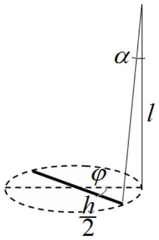
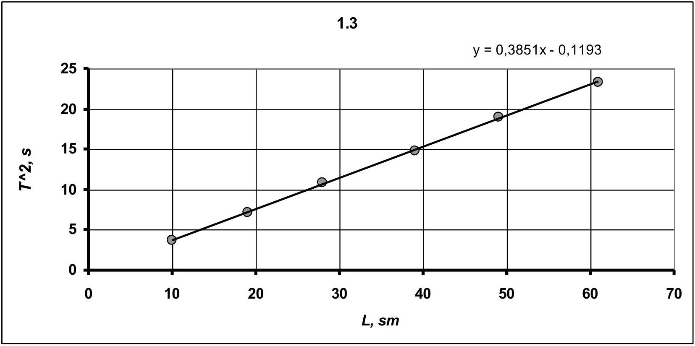
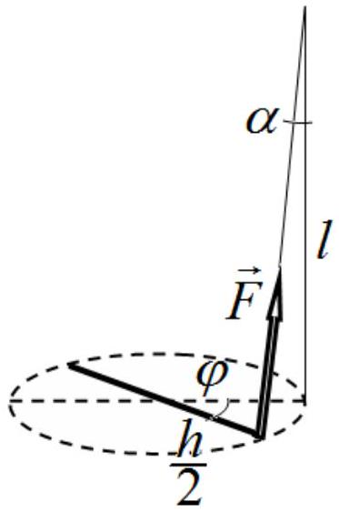
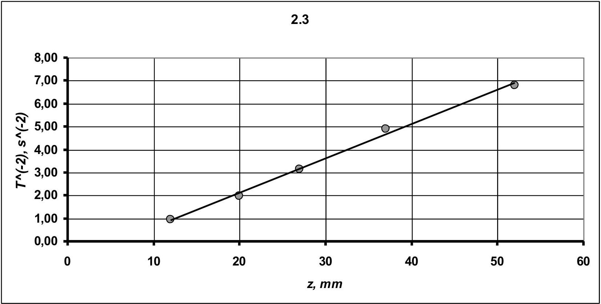
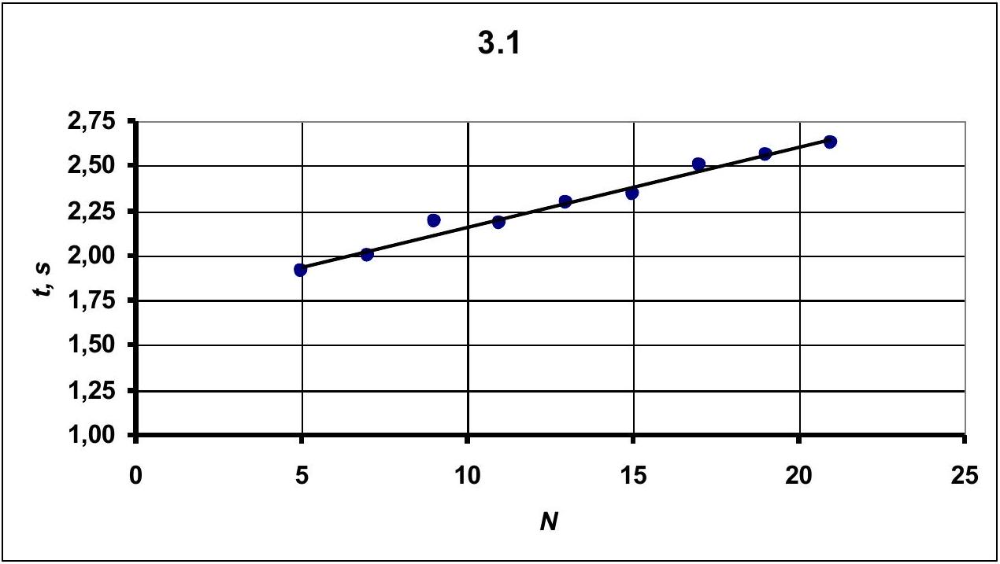
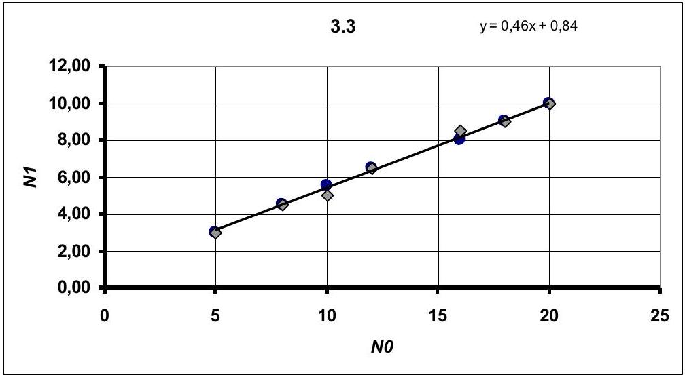
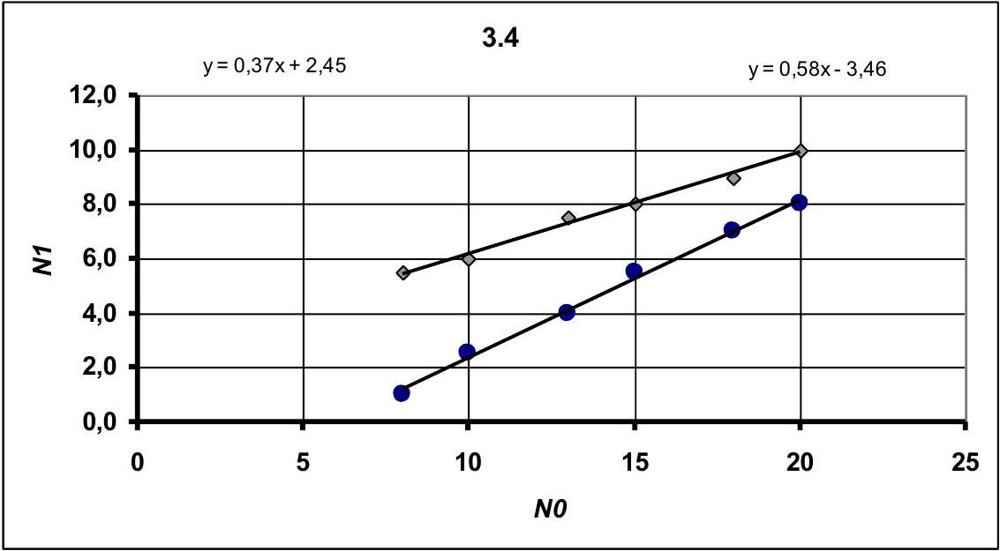

## SOLUTION TO THE EXPERIMENTAL COMPETITION

## Torsion pendulum (15.0 points)

## Part 1. Free small oscillations (5.0 points)

1.1 The measurement results showing the dependence of the oscillation period on the length of threads are shown in Table 1. For each threads length the measurement are taken 3 times for 10 oscillations. The oscillation period is calculated as an average of the measured time.

Table 1.
| $l , \mathrm { sm }$ | $t _ { 1 } , \mathrm {~s}$ | $t _ { 2 }$, s | $t _ { 3 } , \mathrm {~s}$ | $T , s$ | $T ^ { 2 } , s ^ { 2 }$ |
| :--- | :--- | :--- | :--- | :--- | :--- |
| 61 | 48,19 | 48,02 | 48,34 | 4,82 | 23,22 |
| 49 | 43,57 | 43,31 | 43,81 | 4,36 | 18,98 |
| 39 | 38,56 | 38,34 | 38,37 | 3,84 | 14,76 |
| 28 | 33,1 | 32,94 | 32,78 | 3,29 | 10,85 |
| 19 | 26,44 | 27,03 | 26,62 | 2,67 | 7,13 |
| 10 | 18,91 | 19,35 | 19,22 | 1,92 | 3,67 |

1.2 By turning the bolts in a horizontal plane at a small angle $\varphi$ the threads deviate from the vertical by a small angle $\alpha$. The relationship between these angles are geometrically found in the form

$$
\begin{equation*}
\frac { h } { 2 } \varphi = l \alpha \Rightarrow \alpha = \frac { h } { 2 l } \varphi , \tag{1}
\end{equation*}
$$

where $l$ denotes the threads length and $h$ stands for distance bewteen them. Deviation from the vertical results in the following increase of the potential energy

$$
\begin{equation*}
\Delta U = m g l ( 1 - \cos \alpha ) \approx m g l \frac { \alpha ^ { 2 } } { 2 } = \frac { 1 } { 2 } m g l \left( \frac { h } { 2 l } \varphi \right) ^ { 2 } . \tag{2}
\end{equation*}
$$

The equation of energy conservation for the torsional oscillations is written as

$$
\begin{equation*}
\frac { I \omega ^ { 2 } } { 2 } + \frac { 1 } { 2 } m g l \left( \frac { h } { 2 l } \varphi \right) ^ { 2 } = E = \text { const } , \tag{3}
\end{equation*}
$$

where $I$ designates the moment of inertia of the pendulum. The law of energy conservation (3) corresponds to the harmonic oscillations with the period

$$
\begin{equation*}
T = 4 \pi \sqrt { \frac { I } { m g } \frac { l } { h ^ { 2 } } } . \tag{4}
\end{equation*}
$$

1.3 To verify the resulting formula the graph must be plotted of the square of the period on the threads length (see Fig. 1.1). The obvious linear dependence proves the validity of the formula (4). The coefficients of the linear dependence $T ^ { 2 } = a l + b$, calculated using the least square method, are obtained as

$$
\begin{equation*}
a = ( 0,385 \pm 0,009 ) \frac { s ^ { 2 } } { s m } , \quad b = - ( 0,12 \pm 0,3 ) s ^ { 2 } . \tag{5}
\end{equation*}
$$

Since $\Delta b < b$ holds, the dependence is considered linear.

1.4 It follows from formula (4) that the period of oscillations can be expressed in terms of the radius of gyration as follows:

$$
\begin{equation*}
T = 4 \pi \sqrt { \frac { I } { m g } \frac { l } { h ^ { 2 } } } = 4 \pi \sqrt { \frac { m R ^ { 2 } } { m g } \frac { l } { h ^ { 2 } } } = \frac { 4 \pi R } { h \sqrt { g } } \sqrt { l } . \tag{6}
\end{equation*}
$$

Therefore, the slope found in 1.3 allows one to calculate the radius of gyration as

$$
\begin{equation*}
a = \left( \frac { 4 \pi R } { h \sqrt { g } } \right) ^ { 2 } \Rightarrow R = h \frac { \sqrt { a g } } { 4 \pi } = 4,33 \mathrm { sm } . \tag{7}
\end{equation*}
$$

The distance between threads is measured as $h = ( 2,8 \pm 0,1 ) s m$.
The experimental error is calculated according to the formula

$$
\begin{equation*}
\Delta R = R \sqrt { \left( \frac { \Delta h } { h } \right) ^ { 2 } + \left( \frac { 1 } { 2 } \frac { \Delta a } { a } \right) ^ { 2 } } = 4,33 \sqrt { \left( \frac { 0,1 } { 2,8 } \right) ^ { 2 } + \left( \frac { 1 } { 2 } \frac { 0,009 } { 0,385 } \right) ^ { 2 } } = 0,16 s m . \tag{8}
\end{equation*}
$$

## Part 2. Small oscillations with additional tension ( $\mathbf { 5 . 0 }$ points)

The results of measurements showing the dependence of the oscillation period on the therads tension are shown in Table 2.

Table 2.
| z, mm | $t _ { 1 } , \mathrm {~s}$ | $t _ { 2 } , \mathrm {~s}$ | $t _ { 3 } , \mathrm {~s}$ | $T , s$ | $T ^ { - 2 } , s ^ { - 2 }$ |
| :--- | :--- | :--- | :--- | :--- | :--- |
| 12 | 10,22 | 10,28 | 10,40 | 1,03 | 0,94 |
| 20 | 7,10 | 7,03 | 7,18 | 0,71 | 1,98 |
| 27 | 5,63 | 5,62 | 5,69 | 0,56 | 3,14 |
| 37 | 4,53 | 4,50 | 4,53 | 0,45 | 4,89 |
| 52 | 3,75 | 3,88 | 3,87 | 0,38 | 6,81 |

2.2 Torque of the restoring force dependes on the threads tension $\vec { F }$ and the twisting angle. Change in the tension force when twisting is the correction of the higher order.
Therefore, the rotational equation of motion in this case has the form

$$
\begin{equation*}
I \ddot { \varphi } = - k F \varphi . \tag{9}
\end{equation*}
$$

Consequently, the period of those oscillations is inversely proportional to the square root of the threads tension

$$
\begin{equation*}
T = \frac { C } { \sqrt { F } } = \frac { A } { \sqrt { z } } , \tag{10}
\end{equation*}
$$

where $C , A$ are some constant values.

2.3 To confirm this dependence the dependence $T ^ { - 2 } ( z )$ should be plotted. Other ways of linearization in this case are less reliable because when the bending $z$ is measured, the constant deviation is inevitable.
The graph of $T ^ { - 2 } ( z )$ is shown in Fig. 2.3.

The resulting linear relationship confirms the theoretical conclusion that the period is a linear function of the threads tension.

## Part 3. Twisting at large angles ( $\mathbf { 5 . 0 }$ points)

3.1 Dependence of the untwisting time on the twisting angle is shown in Table 3 and Fig. 3.1.

Table 3.
| $\boldsymbol { N }$ | $\boldsymbol { t } \boldsymbol { , } \boldsymbol { s }$ |
| :--- | :--- |
| 5 | 1,91 |
| 7 | 2,00 |
| 9 | 2,19 |
| 11 | 2,18 |
| 13 | 2,29 |
| 15 | 2,34 |
| 17 | 2,50 |
| 19 | 2,56 |
| 21 | 2,63 |

Table 4.

3.2 The untwisting time can be considered as a quarter of the oscillation period. Since the untwisting time increases with the "amplitude", this means that the potential energy increases slower than in the case of harmonic oscillations, i.e. . $\gamma < 2$.
3.3 The dependence of re-twisting half-turns $N _ { 1 }$ on the initial twisting half-turns $N _ { 0 }$ is shown in Table 4 and in graph 3.3. The resulting dependence is practically independent of the threads tension.

|  | $z = 35 m m$ | $z = 20 m m$ |
| :--- | :--- | :--- |
| $N _ { 0 }$ | $N _ { 1 }$ | $N _ { 1 }$ |
| 20 | 10,0 | 10,0 |
| 18 | 9,0 | 9,0 |
| 16 | 8,0 | 8,5 |
| 12 | 6,5 | 6,5 |
| 10 | 5,5 | 5,0 |
| 8 | 4,5 | 4,5 |
| 5 | 3,0 | 3,0 |

This dependence can be described by a linear function

$$
\begin{equation*}
N _ { 1 } = 0,46 N _ { 0 } + 0,84 . \tag{11}
\end{equation*}
$$

3.4-3.5 The dependencies of half-turns $N _ { 1 }$ on the initial twisting angle $N _ { 0 }$ at lifting/unlifting the weight are summarized in Table 5 and in graph 3.4. These dependencies are linear. It is significant that during the ascent without the additional weight the corresponding values of $N _ { 1 }$ lie significantly higher, indicating that the intake of energy appears during the weight unlifting. In addition, the last relationship can not be exactly considered proportional.

Table 5.
|  | C грузом | Без груза |
| :--- | :--- | :--- |
| $N _ { 0 }$ | $N _ { 1 }$ | $N _ { 1 }$ |
| 20 | 8,0 | 10,0 |
| 18 | 7,0 | 9,0 |
| 15 | 5,5 | 8,0 |
| 13 | 4,0 | 7,5 |
| 10 | 2,5 | 6,0 |
| 8 | 1,0 | 5,5 |

These dependencies can be described by linear functions

$$
\begin{align*}
& N _ { 1 } = 0,58 N _ { 0 } - 3,5  \tag{12}\\
& N _ { 1 } = 0,37 N _ { 0 } + 2,5
\end{align*} .
$$

Marking scheme
|  | Content | Total | Points |
| :--- | :--- | :--- | :--- |
|  | Part 1. Free small oscillations. | 5 |  |
| 1.1 | Marked only if the difference of measurements results from the official ones does not exceed 25\% | 2 |  |
|  | Number of different lengths of the pendulum:   5 or more (3-4; less than 3); |  | 0,8(0,4;0) |
|  | The periods are measured by   10 oscillations or more (5-9; less than 5); |  | 0,3(0,1;0) |
|  | The periods are calculated for all measurements; |  | 0,2 |
|  | The range of length of the pendulum   $40 s m$ or more (30-40 sm, 20-30 sm; less than 20 см) |  | 0,7   (0,5;0,3;0) |
| 1.2 | Derivation of the theoretical formula:   The exact formula is obtained $T = 4 \pi \sqrt { \frac { I } { m g } \frac { l } { h ^ { 2 } } }$;   Only dependence $T = A \sqrt { l }$ is predicted (or wrong coefficient at $\sqrt { l }$ ) | 0,5 | 0,5   $( 0,2 )$ |
| 1.3 | Marked only if the measurements in 1.1 have been marked!   Correct linearization $T ^ { 2 } ( l ) , T ( \sqrt { l } )$;   Another linearization $\ln T ( \ln l )$   Proved that the power is 1/2 | 1 | 0,5   $( 0,2 )$   $( 0,3 )$ |
|  | Graph plotting (not linearized dependence is not marked):   - axis are named and ticked; |  | 0,1 |

|  | - experimental data are drawn; - the line is drawn;  |  | 0,1 0,1 |
| :--- | :--- | :--- | :--- |
|  | The linear dependence is confirmed; |  | 0,2 |
| 1.4 | Marked only if the measurements in 1.1 have been marked! The radius of gyration is calculated for all periods; Only for 2 periods; Only for 1 period; |  | 1,5   0,3 $( 0,2 ) ( 0,1 )$ |
|  | The slope is found for the linearized dependence using: Least square method; From the graph; |  | 0,2 $( 0,1 )$ |
|  | The distance between the threads is measured The accuracy is stated |  | 0,1 0,1 |
|  | Formula for calculation of the radius of gyration |  | 0,1 |
|  | Numerical value for the radius of gyration in the range: $4,2 - 4,4 s m$ (4,0-4,6 sm; out of range) |  | 0,4(0,2;0) |
|  | Error evaluation: - error for the slope; - error for the distance between threads; - final error;  |  | 0,1 0,1 0,1 |
|  | Part 2. Small oscillations with additional tension | 5 |  |
|  | Marked only if the difference of measurements results from the official ones does not exceed 50\% | 2 |  |
|  | Number of different threads tensions: 5 or more (3-4; less than 3); |  | 0,8(0,4;0) |
|  | The periods are measured by 10 oscillations or more (5-9; less than 5); |  | 0,3(0,1;0) |
|  | The periods are calculated for all measurements; |  | 0,2 |
|  | The range of variation of the periods Not less than 2,5 times (2,0 times, 1,5 times; less) |  | 0,7 (0,5;0,3;0) |
| 2.2 | Derivation of the theoretical formula: The dependence $T = \frac { A } { \sqrt { F } }$ is justified threads tension is taken constant, the torque is proportional to $F$, the equation for oscillations); Simply stated that $T = \frac { A } { \sqrt { F } }$ (no proof is provided) |  | 1   1,0 (0,3; 0,3; 0,4) $( 0,2 )$ |
| 2.3 | Marked only if the measurements in 2.1 have been marked!! Correct linearization $T ^ { - 2 } ( z )$; Another linearization $T \left( \frac { 1 } { \sqrt { z } } \right)$ The linearization $\ln T ( \ln l )$ is used, Proved that the power is 1/2 |  | 2   1,0 $( 0,5 )$ (0,3+0,2) |
|  | Graph plotting (not linearized dependence is not marked): - axis are named and ticked; - experimental data are drawn; - the line is drawn;  |  | 0,1 0,1 0,1 |
|  | The linear dependence is confirmed; |  | 0,7 |
|  | Part 3. Twisting at large angles | 5 |  |
| 3.1 | Marked only if the difference of measurements results from the | 1,0 |  |

|  | official ones does not exceed 50\% |  |  |
| :--- | :--- | :--- | :--- |
|  | Number of different values of $N$ : 5 or more (3-4; less than 3); |  | 0,4 (0,2;0) |
|  | The measurements are repeated 3 times; |  | 0,1 |
|  | Growing dependence of $t ( N )$ is obtained |  | 0,2 |
|  | Graph plotting (marked only if the measurements results have been marked): - axis are named and ticked; - experimental data are drawn; - the line is drawn;  |  | 0,1 0,1 0,1 |
| 3.2 | The power in potential energy $\gamma < 2$ Justification: $U$ grows slowly than for harmonic oscillations |  | 0,3   0,2 0,1 |
| 3.3 | Marked only if the slope falls in the range 0,35-0,65 | 1,5 |  |
|  | Number of different values of $N _ { 0 }$ : 5 or more (3-4; less than 3); |  | 0,5(0,2;0) 0,1 |
|  | The measurements are repeated 3 times or more; |  | 0,1 |
|  | Growing linear dependence is obtained; |  | 0,2 |
|  | Graph plotting (marked only if the measurements results have been marked): - axis are named and ticked; - experimental data are drawn; - the line is drawn;  |  | 0,1 0,1 0,1 |
|  | The linear function is proposed; Numerical values for the parameters are found; |  | 0,1 0,2 |
|  | The slopes are equal for both threads tensions; |  | 0,1 |
| 3.4 | Marked only if the slope falls in the range 0,25-0,65 | 1 |  |
|  | Number of different values of $N _ { 0 }$ : 5 or more (3-4; less than 3); 5 or more (3-4; less than 3); |  | 0,3(0,1;0) |
|  | Growing linear dependence is obtained; |  | 0,1 |
|  | Graph plotting (marked only if the measurements results have been marked): - axis are named and ticked; - experimental data are drawn; - the line is drawn;  |  | 0,1 0,1 0.1 |
|  | The linear function is proposed; Numerical values for the parameters are found; |  | 0,1 0,2 |
| 3.5 | Marked only if the slope falls in the range 0,25-0,75 and there is a shift of line up! | 1,2 |  |
|  | Number of different values of $N _ { 0 }$ : 5 or more (3-4; less than 3); |  | 0,4(0,2;0) |
|  | Growing linear dependence with the upper shift is obtained; |  | 0,2+0,1 |
|  | Graph plotting (marked only if the measurements results have been marked): - experimental data are drawn; - the line is drawn; |  | 0,1 0,1 |
|  | The linear function is proposed; Numerical values for the parameters are found; |  | 0,1 0,2 |
