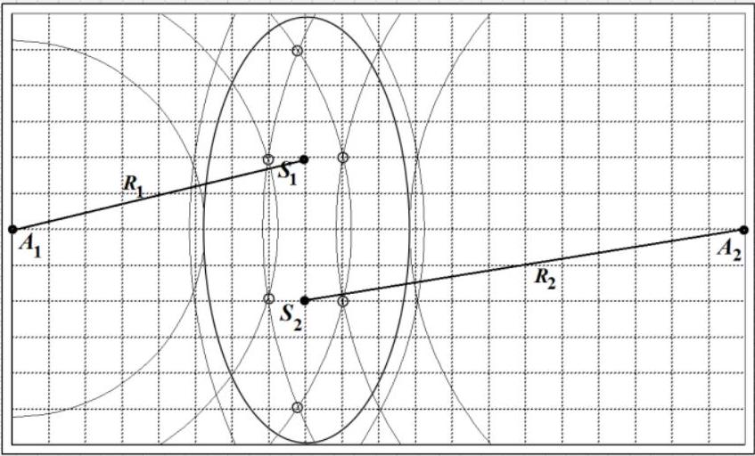
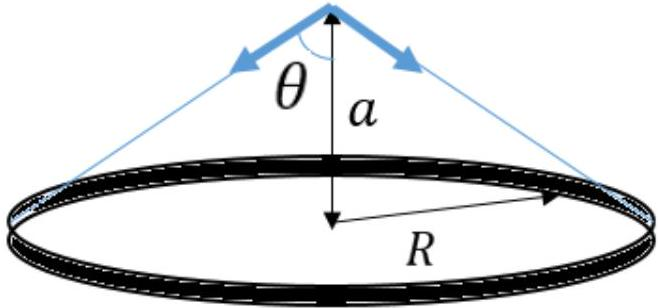
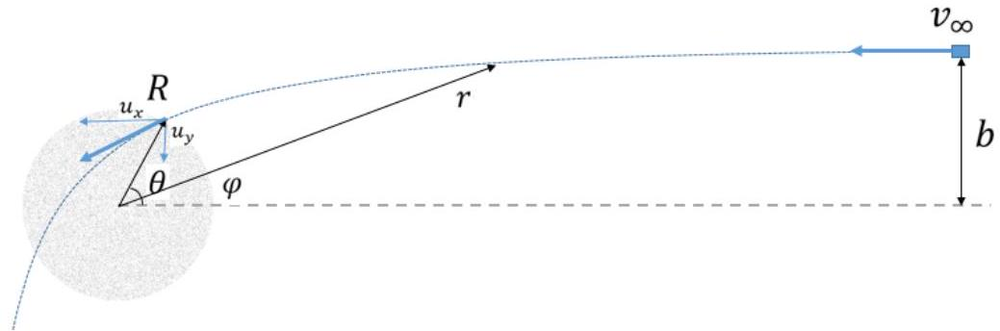
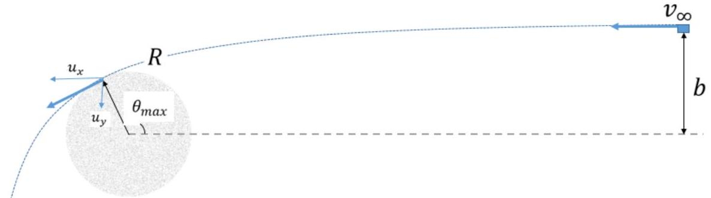

## SOLUTIONS TO THE PROBLEMS OF THE THEORETICAL COMPETITION   Attention. Points in grading are not divided!   Problem 1 (10.0 points)   Problem 1A (3.0 points)

Suppose that during the time interval $\Delta t$ the number of bullets hit the sandbox is equal to $\Delta N$. Then, the momentum, transferred to the sandbox, is found as $\Delta p = \Delta N m u$ which is equivalent to the action of a horizontal force

$$
\begin{equation*}
F = \frac { \Delta p } { \Delta t } = \frac { \Delta N m u } { \Delta t } = n m u . \tag{1}
\end{equation*}
$$

For the deflection angle $\alpha$ this horizontal force $F$ does work

$$
\begin{equation*}
A = F l \sin \alpha . \tag{2}
\end{equation*}
$$

Here $l$ is the distance from the point of suspension to the center of mass.
The deflection angle is a maximum when all the work done is converted into the target potential energy equal to

$$
\begin{equation*}
W = \operatorname { Mgl } ( 1 - \cos \alpha ) . \tag{3}
\end{equation*}
$$

The energy conservation law $A = W$ yields the final answer

$$
\begin{equation*}
\alpha _ { \max } = 2 \operatorname { arctg } \left( \frac { F } { M g } \right) = 2 \operatorname { arctg } \left( \frac { n m u } { M g } \right) = 0.2 \operatorname { rad } = 11.65 ^ { \circ } . \tag{4}
\end{equation*}
$$

| Content | Points |
| :--- | :--- |
| Formula (1) $F = \frac { \Delta p } { \Delta t } = \frac { \Delta N m u } { \Delta t } = n m u$ | 0,5 |
| Formula (2) $A = F l \sin \alpha$ | 0,5 |
| Formula (3) $W = M g l ( 1 - \cos \alpha )$ | 0,5 |
| Formula (4) $\alpha _ { \text {max } } = 2 \operatorname { arctg } \left( \frac { F } { M g } \right) = 2 \operatorname { arctg } \left( \frac { n m u } { M g } \right)$ | 1,0 |
| Numerical value $\alpha _ { \text {max } } = 0.2 \mathrm { rad } = 11.65 ^ { \circ }$ | 0,5 |
| Total | 3,0 |

## Problem 1B (4.0 points)

Charge repulsion on the surface results in an increase of the bubble size. Due to inertia the bubble passes by the equilibrium position and oscillations occur. Due to internal friction of the gas the oscillations vanish, the bubble reaches a new equilibrium state such that the kinetic energy of the soap film is transferred to the internal energy of the gas, which means that the gas in this situation does not obey the adiabatic equation.
Let us make use of the law of energy conservation for the film-gas system of the form:

$$
\begin{equation*}
\frac { 5 } { 2 } P _ { 1 } V _ { 1 } + \sigma 8 \pi R _ { 1 } ^ { 2 } + \frac { k q ^ { 2 } } { 2 R _ { 1 } } = \frac { 5 } { 2 } P _ { 2 } V _ { 2 } + \sigma 8 \pi R _ { 2 } ^ { 2 } + \frac { k q ^ { 2 } } { 2 R _ { 2 } } \tag{1}
\end{equation*}
$$

Taking into account the surface tension the initial pressure of the gas in the bubble is written as

$$
\begin{equation*}
p _ { 1 } = \frac { 4 \sigma } { R _ { 1 } } . \tag{2}
\end{equation*}
$$

The final pressure in view of the electrostatic repulsion force is found as (recall the well-known problem for the forces that attempt to tear out the charged sphere)

$$
\begin{equation*}
p _ { 2 } = \frac { 4 \sigma } { R _ { 2 } } - \frac { q ^ { 2 } } { 32 \pi ^ { 2 } \varepsilon _ { 0 } R _ { 2 } ^ { 4 } } . \tag{3}
\end{equation*}
$$

In our case

$$
\begin{equation*}
V _ { 1 } = 4 \pi R _ { 1 } ^ { 3 } / 3 , V _ { 2 } = 4 \pi R _ { 2 } ^ { 3 } / 3 . \tag{4}
\end{equation*}
$$

Under those conditions, the joint solution of equations (1) - (4) gives the answer

$$
\begin{equation*}
q = 32 \pi \sqrt { \varepsilon _ { 0 } \sigma R _ { 1 } ^ { 3 } } . \tag{5}
\end{equation*}
$$

| Content | Points |
| :--- | :--- |
| $\mathrm { P } _ { \text {initial } } = \mathrm { P } _ { \text {surf } }$ | 0.5 |
| $\mathrm { P } _ { \text {final } } = \mathrm { P } _ { \text {surf } } - \mathrm { P } _ { \text {electr } }$ | 0.3 |
| $\mathrm { P } _ { \text {surf } } = 4 \sigma / \mathrm { R }$ | 0.3 |
| $\mathrm { P } _ { \text {electr } } = \mathrm { q } ^ { 2 } / 32 \pi ^ { 2 } \varepsilon _ { 0 } \mathrm { R } ^ { 4 }$ | 0.5 |
| Conservation of energy instead of adiabatic process | 0.5 |
| $\mathrm { W } _ { \text {surf } } = 8 \pi \mathrm { R } ^ { 2 } \sigma$ | 0.3 |
| $\mathrm { W } _ { \text {electr } } = \mathrm { q } ^ { 2 } / 8 \pi \varepsilon _ { 0 } \mathrm { R }$ | 0.5 |
| $\mathrm { W } _ { \text {gas } } = ( 5 / 2 ) \nu \mathrm { RT } = ( 5 / 2 ) \mathrm { PV }$ | 0.4 |
| Formula for the sphere volume | 0.2 |
| Correct answer | 0.5 |
| Total | 4.0 |

## Problem 1C (3.0 points)

The signal can be suppressed by the interference of waves. The waves coming from the sources $S _ { 1 }$ and $S _ { 2 }$ arrive at the receivers with the same phase, so the wave from the third source must arrive at receivers with the opposite phase than those from the sources $S _ { 1 }$ and $S _ { 2 }$. To assure this, the distance from the third source to the receivers must differ by the amount of $\frac { \lambda } { 2 } + m \lambda$, where $m = 0 , \pm 1 , \pm 2 \ldots$. To find the points that satisfy those conditions, it is necessary to plot two families of circles, one with the radii $R _ { 1 } + \frac { \lambda } { 2 } + m \lambda$ and with the center at the point $A _ { 1 }$, and the other with the radii $R _ { 2 } + \frac { \lambda } { 2 } + m \lambda$ and with the center at the point $A _ { 2 }$. The intersection points of those two families represent the points where the third source should be placed, they are marked by circles. The amplitude of waves from the third source must be 2 times greater than the amplitude of waves coming from sources $S _ { 1 }$ and $S _ { 2 }$, hence the wave intensity of the third source should be 4 times higher, i.e. $4 I _ { 0 }$.

| Content | Points |
| :--- | :--- |
| Interference to suppress waves | 0,5 |
| Conditions for minima are used (waves out-of-phase); | 0,2 |
| Difference in distance must be integer number of half of the wavelength | 0,3 |
| Two families of circles are drawn | 2×0,5 |
| Intersection points are used | 0,4 |
| All 6 points are correctly stated in the highlighted area | 6×0,1 |
| Total | 3,0 |

## Problem 2. Fantastic trip through the Universe (10.0 points)

## 1. Planets with strange shapes (4.0 points)

1.1 [0.7 points] The easiest approach to the solution of the problem is the analogy between Coulomb force and Newton's law of gravitation:

$$
\begin{equation*}
F = \frac { 1 } { 4 \pi \varepsilon _ { 0 } } \frac { q _ { 1 } q _ { 2 } } { r _ { 12 } ^ { 2 } } \text { and } F = G \frac { m _ { 1 } m _ { 2 } } { r _ { 12 } ^ { 2 } } . \tag{1}
\end{equation*}
$$

Further, it is a well known result from the Gauss theorem that the electric field strength of an infinite charged plane, with the surface density $\sigma$ is found as

$$
\begin{equation*}
E = \frac { \sigma } { 2 \varepsilon _ { 0 } } . \tag{2}
\end{equation*}
$$

By analogy to the charged plane, the result for the planet is similarly obtained as:

$$
\begin{align*}
& g _ { 1 } = \frac { \rho _ { 1 } h } { 2 \cdot ( 1 / 4 \pi G ) } = 2 \pi G \rho _ { 1 } h ,  \tag{3}\\
& h = \frac { g _ { 1 } } { 2 \pi G \rho _ { 1 } } = 78.0 \mathrm {~km} . \tag{4}
\end{align*}
$$

The same result is easily achieved by cutting an infinite plane into thin rings and further integrating:

The attracting force of the ring of mass $M$, and of radius $R$ at the distance $a$ is written as:

$$
F = G \frac { M m } { R ^ { 2 } + a ^ { 2 } } \cos \theta = G \frac { M m } { a ^ { 2 } } \cos ^ { 3 } \theta .
$$

We divide the plane of the height $h$ into thin rings of thickness $d r$. Then the force of gravitycaused by the ring of the radius $r$ is equal to

$$
d F = G \frac { d M m } { a ^ { 2 } } \cos ^ { 3 } \theta = G \frac { \left( \rho _ { 1 } h 2 \pi r d r \right) m } { a ^ { 2 } } \cos ^ { 3 } \theta .
$$

It follows from the trigonometric considerations that $r = a \cdot \tan \theta , d r = \frac { a } { \cos ^ { 2 } \theta } d \theta$.
Substituting the above expression and integrating we find the total force $F$ acting on the body of mass $m$ :

$$
F = 2 \pi G \rho _ { 1 } h m \int _ { 0 } ^ { \frac { \pi } { 2 } } \sin \theta d \theta = 2 \pi G \rho _ { 1 } h m .
$$

This is identical to the answer obtained from the analogy with the electrostatic field.
1.2 [0.5 points] For an observer that is located close to the infinite plane, the solid angle is obviously equal to

$$
\begin{equation*}
\Omega _ { 1 } = \frac { 4 \pi } { 2 } = 2 \pi , \tag{5}
\end{equation*}
$$

and from the problem formulation we get

$$
\begin{equation*}
\alpha = \frac { g _ { 1 } } { 2 \pi } \text { or } \alpha = G \rho _ { 1 } h = 1.56 \times 10 ^ { - 2 } \mathrm {~m} / \mathrm { s } ^ { 2 } . \tag{6}
\end{equation*}
$$

1.3 [0.7 points] We divide the pyramid into thin layers of thickness $\Delta h$ parallel to the base. All of these layers are visible from the top of the pyramid with the same solid angle $\Omega _ { 2 }$, which is equal to one sixth of the full solid angle (as if the observer was located inside the cubeat its center!):

$$
\begin{equation*}
\Omega _ { 2 } = \frac { 1 } { 6 } 4 \pi = \frac { 2 } { 3 } \pi . \tag{7}
\end{equation*}
$$

The free fall acceleration of the single layer is found as

$$
\begin{equation*}
d g _ { 2 } = \frac { d F } { m } = \alpha \Omega _ { 2 } = \frac { 2 } { 3 } \pi G \rho _ { 2 } \Delta h , \tag{8}
\end{equation*}
$$

or after the summation over all the layers of the pyramid

$$
\begin{equation*}
g _ { 2 } = \frac { 1 } { 3 } \pi G \rho _ { 2 } a = 3.14 \mathrm {~m} / \mathrm { s } ^ { 2 } . \tag{9}
\end{equation*}
$$

1.4 [2.0 points] Let the interaction energy between the spacecraft and the pyramidal planet at the time of take-off from its top be equal to $U _ { 1 }$, and its speed be $v _ { 1 }$. It follows from the law of the energy conservation for the parabolic velocity that:

$$
\begin{equation*}
\frac { m v _ { 1 } ^ { 2 } } { 2 } - U _ { 1 } = 0 . \tag{10}
\end{equation*}
$$

Similarly, the law of the energy conservation for a spacecraft to start from the cubic planet is written as

$$
\begin{equation*}
\frac { m v _ { 2 } ^ { 2 } } { 2 } - U _ { 2 } = 0 , \tag{11}
\end{equation*}
$$

where $U _ { 2 }$ stands for the corresponding interaction energy with the cubic planet.
Let us show that there is a simple relationship between $U _ { 1 }$ and $U _ { 2 }$. To prove so, we consider the position of the spacecraft at the center of the cubic planet. On the one hand the position at the center of the cube is equivalent to finding the spacecraft at the tops of the six pyramids. Taking into account the change in the density of matter, the potential energy of the spacecraft at the center of the cube is obtained as

$$
\begin{equation*}
U _ { c } = 6 U _ { 1 } \frac { \rho _ { 3 } } { \rho _ { 2 } } . \tag{12}
\end{equation*}
$$

On the other hand the position of the spacecraft at the center of the cube is equivalent to being at the tops of the eight identical adjacent cubes with the side $\frac { a } { 2 }$. In general, the potential energy of the spacecraft in the field of the cubic planet is proportional to the square of its size since

$$
\begin{equation*}
U = G \sum \frac { m \rho _ { 3 } \Delta V _ { i } } { r _ { i } } \sim G m \rho _ { 3 } a ^ { 2 } . \tag{13}
\end{equation*}
$$

Thus, for the cube of the half size, the interaction energy is 4 times less, which means that the potential energy of the spacecraft at the center of the cube is found as

$$
\begin{equation*}
U _ { c } = 8 \frac { U _ { 2 } } { 4 } = 2 U _ { 2 } . \tag{14}
\end{equation*}
$$

Equating the expressions (12) and (14) yield

$$
\begin{equation*}
U _ { 2 } = 3 U _ { 1 } \frac { \rho _ { 3 } } { \rho _ { 2 } } . \tag{15}
\end{equation*}
$$

Solving together equations (10), (11) and (15), we finally obtain

$$
\begin{equation*}
v _ { 2 } = \sqrt { \frac { 3 \rho _ { 3 } } { \rho _ { 2 } } } v _ { 1 } = 6,30 \mathrm {~km} / \mathrm { s } . \tag{16}
\end{equation*}
$$

## 2. Dusty cloud (6.0 points)

2.1 [2.5 points] For this problem, we use a mixture of the polar and Cartesian coordinate systems as shown below.

The conservation of energy is written as:

$$
\begin{equation*}
\frac { m v _ { \infty } ^ { 2 } } { 2 } = \frac { m u _ { x } ^ { 2 } } { 2 } + \frac { m u _ { y } ^ { 2 } } { 2 } - G \frac { M m } { R } , \tag{17}
\end{equation*}
$$

where $M = \frac { 4 } { 3 } \pi R ^ { 3 } \rho _ { 4 }$ denotes the total mass of the cloud.

Change in the spacecraft momentum projection on the x-axis of the Cartesian coordinate system is given by

$$
\begin{equation*}
m u _ { x } - m v _ { \infty } = \int G \frac { M m } { r ^ { 2 } } \cos \varphi d t = \int G \frac { M m } { r ^ { 2 } \dot { \varphi } } \cos \varphi d \varphi . \tag{18}
\end{equation*}
$$

The law of the angular momentum conservation for a system with the central force is written as

$$
\begin{equation*}
r ^ { 2 } \dot { \varphi } = v _ { \infty } b . \tag{19}
\end{equation*}
$$

Thus,

$$
\begin{equation*}
m u _ { x } - m v _ { \infty } = G \frac { M m } { v _ { \infty } b } \int _ { 0 } ^ { \theta } \cos \varphi d \varphi = G \frac { M m } { v _ { \infty } b } \sin \theta . \tag{20}
\end{equation*}
$$

Similarly for the $y$-axis projection:

$$
\begin{equation*}
m u _ { y } - m \cdot 0 = G \frac { M m } { v _ { \infty } b } \int _ { 0 } ^ { \theta } \sin \varphi d \varphi = G \frac { M m } { v _ { \infty } b } ( 1 - \cos \theta ) . \tag{21}
\end{equation*}
$$

To simplify further analysis the following dimensionless quantity is introduced

$$
\begin{equation*}
z = \frac { G M } { v _ { \infty } ^ { 2 } b } , \tag{22}
\end{equation*}
$$

and then

$$
\begin{align*}
& u _ { x } = ( 1 + z \sin \theta ) v _ { \infty } ,  \tag{23}\\
& u _ { y } = z ( 1 - \cos \theta ) v _ { \infty } . \tag{24}
\end{align*}
$$

Substitution of (23) and (24) into (17) gives rise to

$$
\begin{equation*}
1 = ( 1 + z \sin \theta ) ^ { 2 } + z ^ { 2 } ( 1 - \cos \theta ) ^ { 2 } - 2 z \frac { b } { R } . \tag{25}
\end{equation*}
$$

Solving this equation for $\theta$, we find

$$
\begin{equation*}
\theta = \arcsin \frac { \frac { b } { R } - \frac { G M } { v _ { \infty } ^ { 2 } b } } { \sqrt { 1 + \left( \frac { G M } { v _ { \infty } ^ { 2 } b } \right) ^ { 2 } } } + \arcsin \frac { \frac { G M } { v _ { \infty } ^ { 2 } b } } { \sqrt { 1 + \left( \frac { G M } { v _ { \infty } ^ { 2 } b } \right) ^ { 2 } } } , \tag{26}
\end{equation*}
$$

or

$$
\begin{equation*}
\theta = 2 \arctan \frac { 1 - \sqrt { 1 + 2 \frac { G M } { v _ { \infty } ^ { 2 } b } - \frac { b ^ { 2 } } { R ^ { 2 } } } } { \frac { b } { R } - 2 \frac { G M } { v _ { \infty } ^ { 2 } b } } = 0.789 \mathrm { rad } = 45.2 ^ { \circ } . \tag{27}
\end{equation*}
$$

It should be noted that the angle $\theta$, just as the total angle of deflection of the trajectory when moving through the dust cloud, can be obtained by integrating the equation obtained from the combination of the laws of conservation of energy and angular momentum written in the polar coordinates. Expressions are not presented here because the resulting integrals are quite cumbersome.
2.2 [2.0 points] To begin with we find the dependence of the potential energy of interaction between the cloud and the spacecraft at distances $r < R$ from its center. It is known that a spherical cloud layers, lying at a distance greater than $r$, does not affect the spacecraft, so the total active force is derived as

$$
\begin{equation*}
F ( r ) = - G \frac { \rho _ { 4 } \cdot \frac { 4 } { 3 } \pi r ^ { 3 } } { r ^ { 2 } } m = - \frac { 4 } { 3 } \pi G \rho _ { 4 } m r , \tag{28}
\end{equation*}
$$

and the corresponding potential energy is found in the form

$$
\begin{equation*}
U ( r ) = - \int F ( r ) d r = \frac { 2 } { 3 } \pi G \rho _ { 4 } m r ^ { 2 } + C = G \frac { M m } { 2 R ^ { 3 } } r ^ { 2 } + C . \tag{29}
\end{equation*}
$$

To determine the integration constant $C$, we recall that the potential energy must be a continuous at the point $r = R$, such that

$$
\begin{equation*}
G \frac { M m } { 2 R ^ { 3 } } R ^ { 2 } + C = - G \frac { M m } { R } , \tag{30}
\end{equation*}
$$

or finally for $r < R$

$$
\begin{equation*}
U ( r ) = \frac { G M m } { 2 R ^ { 3 } } r ^ { 2 } - \frac { 3 G M m } { 2 R } . \tag{31}
\end{equation*}
$$

At the time moment when the distance to the cloud center reaches its minimum value, the radial velocity turns zero. Then, from the laws of conservation of energy and angular momentum we have

$$
\begin{align*}
& \frac { m v _ { \infty } ^ { 2 } } { 2 } = \frac { m v _ { 0 } ^ { 2 } } { 2 } + \frac { G M m } { 2 R ^ { 3 } } r _ { m i n } ^ { 2 } - \frac { 3 G M m } { 2 R } ,  \tag{32}\\
& v _ { 0 } r _ { m i n } = v _ { \infty } b , \tag{33}
\end{align*}
$$

which results in the following equation

$$
\begin{equation*}
1 = \frac { b ^ { 2 } } { r _ { \min } ^ { 2 } } + z \frac { r _ { \min } ^ { 2 } b } { R ^ { 3 } } - 3 z \frac { b } { R } , \tag{34}
\end{equation*}
$$

with the solution

$$
\begin{equation*}
r _ { \text {min } } = \sqrt { \frac { \left( \frac { 3 z b } { R } + 1 \right) \pm \sqrt { \left( \frac { 3 z b } { R } + 1 \right) ^ { 2 } - \frac { 4 z b ^ { 3 } } { R ^ { 3 } } } } { 2 \frac { z b } { R ^ { 3 } } } } . \tag{35}
\end{equation*}
$$

The meaningful root is only the smallest one because there must be $r _ { \text {min } } = 0$ at $b = 0$. Thus, we finally obtain

$$
\begin{equation*}
r _ { \min } = R \sqrt { \frac { \left( \frac { 3 G M } { v _ { \infty } ^ { 2 } R } + 1 \right) - \sqrt { \left( \frac { 3 G M } { v _ { \infty } ^ { 2 } R } + 1 \right) ^ { 2 } - \frac { 4 b ^ { 2 } G M } { R ^ { 3 } v _ { \infty } ^ { 2 } } } } { \frac { 2 G M } { v _ { \infty } ^ { 2 } R } } } = 4.97 \times 10 ^ { 9 } m . \tag{36}
\end{equation*}
$$

2.3 [1.0 points] Minimum velocity $v _ { \infty , \text { min } }$, that allows the spacecraft to avoid a collision, corresponds to a situation when the spacecraft just touches the cloud as shown below.

In this case, the radial component of the velocity again turns zero, and the laws of conservation of energy and angular momentum can be written as:

$$
\begin{align*}
& \frac { m v _ { \infty } ^ { 2 } , \min } { 2 } = \frac { m 0 ^ { 2 } } { 2 } + \frac { m u _ { \tau } ^ { 2 } } { 2 } - G \frac { M m } { R } ,  \tag{37}\\
& u _ { \tau } R = v _ { \infty } b , \tag{38}
\end{align*}
$$

which yields

$$
\begin{equation*}
v _ { \infty , \min } = \sqrt { \frac { 2 G M } { R \left( \frac { b ^ { 2 } } { R ^ { 2 } } - 1 \right) } } = 252 \mathrm {~km} / \mathrm { s } . \tag{39}
\end{equation*}
$$

2.4 [0.6 points] Assume that the cloud is pulled apart at distances by small layers of thickness $\Delta r$ so that the cloud always remains symmetrical. To remove a single thin layer at the moment when the cloud has a radius $r$, it is necessary to do the work

$$
\begin{equation*}
\Delta A = G \frac { \left( \rho _ { 4 } \frac { 4 } { 3 } \pi r ^ { 3 } \right) \left( \rho _ { 4 } 4 \pi r ^ { 2 } \Delta r \right) } { r } = \frac { 16 } { 3 } \pi ^ { 2 } G \rho _ { 4 } ^ { 2 } r ^ { 4 } \Delta r , \tag{40}
\end{equation*}
$$

and to pull apart the whole cloud the following work must be done

$$
\begin{equation*}
A = \frac { 16 } { 3 } \pi ^ { 2 } G \rho _ { 4 } ^ { 2 } \int _ { 0 } ^ { R } r ^ { 4 } \Delta r = \frac { 16 } { 15 } \pi ^ { 2 } G \rho _ { 4 } ^ { 2 } R ^ { 5 } = 1.33 \times 10 ^ { 45 } J . \tag{41}
\end{equation*}
$$

|  | Content | points |  |
| :--- | :--- | :--- | :--- |
| 1.1 | The analogy between the Coulom law and the gravitation law of Newton (1): $F = \frac { 1 } { 4 \pi \varepsilon _ { 0 } } \frac { q _ { 1 } q _ { 2 } } { r _ { 12 } ^ { 2 } }$ and $F = G \frac { m _ { 1 } m _ { 2 } } { r _ { 12 } ^ { 2 } }$. | 0.2 | 0.7 |
|  | Formula (2) $E = \frac { \sigma } { 2 \varepsilon _ { 0 } }$ | 0.2 |  |
|  | Formula (4) $h = \frac { g _ { 1 } } { 2 \pi G \rho _ { 1 } }$ | 0.2 |  |
|  | Numerical value of $h = 78.0 k m$ | 0.1 |  |
| 1.2 | Formula (5) $\Omega _ { 1 } = 2 \pi$ | 0.2 | 0.5 |
|  | Formula (6) $\alpha = \frac { g _ { 1 } } { 2 \pi }$ or $\alpha = G \rho _ { 1 } h$ | 0.2 |  |
|  | Numerical value of $\alpha = 1.56 \times 10 ^ { - 2 } \mathrm {~m} / \mathrm { s } ^ { 2 }$ | 0.1 |  |

| 1.3 | Formula (7) $\Omega _ { 2 } = \frac { 2 } { 3 } \pi$ | 0.2 |  |
| :--- | :--- | :--- | :--- |
|  | Formula (8) $d g _ { 2 } = \frac { d F } { m } = \alpha \Omega _ { 2 } = \frac { 2 } { 3 } \pi G \rho _ { 2 } \Delta h$ | 0.2 |  |
|  | Formula (9) $g _ { 2 } = \frac { 1 } { 3 } \pi G \rho _ { 2 } a$ | 0.2 |  |
|  | Numerical value of $g _ { 2 } = 3.14 m / s ^ { 2 }$ | 0.1 |  |
| 1.4 | Formulas /(10) and (11) $\frac { m v _ { 1 } ^ { 2 } } { 2 } - U _ { 1 } = 0 \frac { m v _ { 2 } ^ { 2 } } { 2 } - U _ { 2 } = 0$ | 0.2 |  |
|  | Formula (12) $U _ { c } = 6 U _ { 1 } \frac { \rho _ { 3 } } { \rho _ { 2 } }$ | 0.4 |  |
|  | Formula (13) $U = G \sum \frac { m \rho _ { 3 } \Delta V _ { i } } { r _ { i } } \sim G m \rho _ { 3 } a ^ { 2 }$ | 0.4 |  |
|  | Formula (14) $U _ { c } = 8 \frac { U _ { 2 } } { 4 } = 2 U _ { 2 }$ | 0.2 |  |
|  | Formula (15) $U _ { 2 } = 3 U _ { 1 } \frac { \rho _ { 3 } } { \rho _ { 2 } }$ | 0.4 |  |
|  | Formula (16) $v _ { 2 } = \sqrt { \frac { 3 \rho _ { 3 } } { \rho _ { 2 } } } v _ { 1 }$ | 0.3 |  |
|  | Numerical value of $v _ { 2 } = 6,30 k m / s$ | 0.1 |  |
| 2.1 | Formula (17) $\frac { m v _ { \infty } ^ { 2 } } { 2 } = \frac { m u _ { x } ^ { 2 } } { 2 } + \frac { m u _ { y } ^ { 2 } } { 2 } - G \frac { M m } { R }$ | 0.2 | 2.5 |
|  | Formula (18) $m u _ { x } - m v _ { \infty } = \int G \frac { M m } { r ^ { 2 } } \cos \varphi d t = \int G \frac { M m } { r ^ { 2 } \dot { \varphi } } \cos \varphi d \varphi$ | 0.4 |  |
|  | Formula (19) $r ^ { 2 } \dot { \varphi } = v _ { \infty } b$ | 0.2 |  |
|  | Formula (20) $m u _ { x } - m v _ { \infty } = G \frac { M m } { v _ { \infty } b } \sin \theta$ | 0.4 |  |
|  | Formula (21) $m u _ { y } = G \frac { M m } { v _ { \infty } b } ( 1 - \cos \theta )$ | 0.4 |  |
|  | Formula (23) or analogous $u _ { x } = ( 1 + z \sin \theta ) v _ { \infty }$ | 0.3 |  |
|  | Formula (24) or analogous $u _ { y } = z ( 1 - \cos \theta ) v _ { \infty }$ | 0.3 |  |
|  | Formula (26) or formula (27) $\begin{aligned} & \theta = \arcsin \frac { \frac { b } { R } - \frac { G M } { v _ { \infty } ^ { 2 } b } } { \sqrt { 1 + \left( \frac { G M } { v _ { \infty } ^ { 2 } b } \right) ^ { 2 } } } + \arcsin \frac { \frac { G M } { v _ { \infty } ^ { 2 } b } } { \sqrt { 1 + \left( \frac { G M } { v _ { \infty } ^ { 2 } b } \right) ^ { 2 } } } \text { or } \\ & \theta = 2 \arctan \frac { 1 - \sqrt { 1 + 2 \frac { G M b } { v _ { \infty } ^ { 2 } b } - \frac { b ^ { 2 } } { R ^ { 2 } } } } { \frac { b } { R } - 2 \frac { G M } { v _ { \infty } ^ { 2 } b } } \end{aligned}$ | 0.2 |  |
|  | Numerical value of $\theta = 0,789 \mathrm { rad } = 45,2 ^ { \circ }$ | 0.1 |  |
| 2.2 | Formula (28) $F ( r ) = - G \frac { \rho _ { 4 } \cdot \frac { 4 } { 3 } \pi r ^ { 3 } } { r ^ { 2 } } m = - \frac { 4 } { 3 } \pi G \rho _ { 4 } m r$ | 0.4 | 2.0 |
|  | Formula (29) $U ( r ) = \frac { 2 } { 3 } \pi G \rho _ { 4 } m r ^ { 2 } + C = G \frac { M m } { 2 R ^ { 3 } } r ^ { 2 } + C$ | 0.3 |  |
|  | Formula (30) $G \frac { M m } { 2 R ^ { 3 } } R ^ { 2 } + C = - G \frac { M m } { R }$ | 0.4 |  |
|  | Formula (32) $\frac { m v _ { \infty } ^ { 2 } } { 2 } = \frac { m v _ { 0 } ^ { 2 } } { 2 } + \frac { G M m } { 2 R ^ { 3 } } r _ { m i n } ^ { 2 } - \frac { 3 G M m } { 2 R }$, | 0.2 |  |
|  | Formula (33) $v _ { 0 } r _ { \text {min } } = v _ { \infty } b$ | 0.2 |  |
|  | Formula (35) $r _ { \text {min } } = \sqrt { \frac { \left( \frac { 3 z b } { R } + 1 \right) \pm \sqrt { \left( \frac { 3 z b } { R } + 1 \right) ^ { 2 } - \frac { 4 z b ^ { 3 } } { R ^ { 3 } } } } { 2 \frac { z b } { R ^ { 3 } } } }$ | 0.2 |  |
|  | Correct root is chosen, formula (36) | 0.2 |  |
|  | Numerical value of $r _ { \text {min } } = 4.97 \times 10 ^ { 9 } m$ | 0.1 |  |
| 2.3 | Formula (37) $\frac { m v _ { \infty , \text { min } } ^ { 2 } } { 2 } = \frac { m 0 ^ { 2 } } { 2 } + \frac { m u _ { \tau } ^ { 2 } } { 2 } - G \frac { M m } { R }$ | 0.4 | 1.0 |

|  | Formula (38) $u _ { \tau } R = v _ { \infty } b$ | 0.3 |  |
| :--- | :--- | :--- | :--- |
|  | Formula (39) $v _ { \infty , \text { min } } = \sqrt { \frac { 2 G M } { R \left( \frac { b ^ { 2 } } { R ^ { 2 } } - 1 \right) } }$ | 0.2 |  |
|  | Numerical value of $v _ { \infty , \text { min } } = 252 \mathrm {~km} / \mathrm { s }$ | 0.1 |  |
| 2.4 | Formula (40) $\Delta A = \frac { 16 } { 3 } \pi ^ { 2 } G \rho _ { 4 } ^ { 2 } r ^ { 4 } \Delta r$ | 0.3 | 0.6 |
|  | Formula (41) $A = \frac { 16 } { 15 } \pi ^ { 2 } G \rho _ { 4 } ^ { 2 } R ^ { 5 }$ | 0.2 |  |
|  | Numerical value of $A = 1.33 \times 10 ^ { 45 } \mathrm {~J}$ | 0.1 |  |
| Total |  |  | 10.0 |

## Problem 3. Resistance of a prism (10.0 points)

## 1. Mathematical introduction (3.0 points)

1.1 [0.2 points] From the course of school mathematics it is known that geometrical progression terms are explicitly expressed as

$$
\begin{equation*}
x _ { k } = A \lambda ^ { k } . \tag{1}
\end{equation*}
$$

1.2 [0.4 points] Let us express $\lambda ^ { k }$ recurrently in terms of $\lambda ^ { k - 1 }$ :

$$
\lambda ^ { k } = \lambda ^ { k - 1 } \cdot \lambda
$$

and transform it as follows

$$
\begin{align*}
& \lambda ^ { k } = \left( p _ { k } + q _ { k } \sqrt { 3 } \right) = \left( p _ { k - 1 } + q _ { k - 1 } \sqrt { 3 } \right) \cdot ( 2 + \sqrt { 3 } ) = 2 p _ { k - 1 } + p _ { k - 1 } \sqrt { 3 } + 2 q _ { k - 1 } \sqrt { 3 } + 3 q _ { k - 1 } =  \tag{2}\\
& = \left( 2 p _ { k - 1 } + 3 q _ { k - 1 } \right) + \left( p _ { k - 1 } + 2 q _ { k - 1 } \right) \sqrt { 3 } .
\end{align*}
$$

This equality implies the required recurrence relations in the form

$$
\begin{align*}
& p _ { k } = 2 p _ { k - 1 } + 3 q _ { k - 1 } \\
& q _ { k } = p _ { k - 1 } + 2 q _ { k - 1 } . \tag{3}
\end{align*}
$$

Inverse relations are obtained analogously

$$
\begin{align*}
& \lambda ^ { k - 1 } = p _ { k - 1 } + q _ { k - 1 } = \lambda ^ { k } \cdot \lambda ^ { - 1 } = \left( p _ { k } + q _ { k } \sqrt { 3 } \right) \cdot ( 2 - \sqrt { 3 } ) =  \tag{4}\\
& = \left( 2 p _ { k } - 3 q _ { k } \right) + \left( 2 q _ { k } - p _ { k } \right) \sqrt { 3 } ,
\end{align*}
$$

and, thus,

$$
\begin{align*}
& p _ { k - 1 } = 2 p _ { k } - 3 q _ { k } ,  \tag{5}\\
& q _ { k - 1 } = 2 q _ { k } - p _ { k } .
\end{align*}
$$

1.3 [0.7 points] Calculation of the coefficients is much easier to carry out in series, given that $p _ { 0 } = 1 , \quad q _ { 0 } = 0$. The results are shown in Table 1.

Table 1.
| $k$ | $p _ { k }$ | $q _ { k }$ |
| :--- | :--- | :--- |
| 0 | 1 | 0 |
| 1 | 2 | 1 |
| 2 | 7 | 4 |
| 3 | 26 | 15 |
| 4 | 97 | 56 |
| 5 | 362 | 209 |

1.4 [0.2 points] Note that

$$
\begin{equation*}
\lambda ^ { - 1 } = \frac { 1 } { 2 + \sqrt { 3 } } = 2 - \sqrt { 3 } , \tag{6}
\end{equation*}
$$

therefore,

$$
\begin{equation*}
\lambda ^ { - k } = ( 2 - \sqrt { 3 } ) ^ { k } = p _ { k } - q _ { k } \sqrt { 3 } . \tag{7}
\end{equation*}
$$

1.5 [1.0 points] Using the hint, we substitute $x _ { k } = C \lambda ^ { k }$ into the recurrence relation and obtain the equation to determine $\lambda$ in the form

$$
\begin{equation*}
\lambda ^ { k + 1 } = 4 \lambda ^ { k } - \lambda ^ { k - 1 } . \tag{8}
\end{equation*}
$$

After reduction the following quadratic equation is derived

$$
\begin{equation*}
\lambda ^ { 2 } - 4 \lambda + 1 = 0 , \tag{9}
\end{equation*}
$$

which has two solutions

$$
\begin{equation*}
\lambda _ { 1,2 } = 2 \pm \sqrt { 3 } . \tag{10}
\end{equation*}
$$

Consequently, the general solution to the recurrence relation (3) is explicitly written by

$$
\begin{equation*}
x _ { k } = C _ { 1 } \lambda _ { 1 } ^ { k } + C _ { 2 } \lambda _ { 2 } ^ { k } , \tag{11}
\end{equation*}
$$

where $C _ { 1 } , C _ { 2 }$ are arbitrary constants that are determined by the boundary conditions:

$$
\begin{align*}
& x _ { 0 } = A \Rightarrow C _ { 1 } + C _ { 2 } = A \\
& x _ { 0 } = B \Rightarrow C _ { 1 } \lambda _ { 1 } ^ { N } + C _ { 2 } \lambda _ { 2 } ^ { N } = B . \tag{12}
\end{align*}
$$

Solving the linear set of equation yields

$$
\left\{ \begin{array} { l }
{ C _ { 1 } + C _ { 2 } = A }  \tag{13}\\
{ C _ { 1 } \lambda _ { 1 } ^ { N } + C _ { 2 } \lambda _ { 2 } ^ { N } = B }
\end{array} \Rightarrow \left\{ \begin{array} { l }
C _ { 1 } = \frac { B - A \lambda _ { 2 } ^ { N } } { \lambda _ { 1 } ^ { N } - \lambda _ { 2 } ^ { N } } \\
C _ { 2 } = \frac { A \lambda _ { 1 } ^ { N } - B } { \lambda _ { 1 } ^ { N } - \lambda _ { 2 } ^ { N } }
\end{array} \right. \right.
$$

Substituting this solution into (11), it is possible to rewrite it in the following symmetrical form

$$
\begin{align*}
& x _ { k } = C _ { 1 } \lambda _ { 1 } ^ { k } + C _ { 2 } \lambda _ { 2 } ^ { k } = \frac { B - A \lambda _ { 2 } ^ { N } } { \lambda _ { 1 } ^ { N } - \lambda _ { 2 } ^ { N } } \lambda _ { 1 } ^ { k } + \frac { A \lambda _ { 1 } ^ { N } - B } { \lambda _ { 1 } ^ { N } - \lambda _ { 2 } ^ { N } } \lambda _ { 2 } ^ { k } = \\
& = \frac { A \lambda _ { 1 } ^ { N } \lambda _ { 2 } ^ { k } - B \lambda _ { 2 } ^ { k } + B \lambda _ { 1 } ^ { k } - A \lambda _ { 2 } ^ { N } \lambda _ { 1 } ^ { k } } { \lambda _ { 1 } ^ { N } - \lambda _ { 2 } ^ { N } } = \frac { A \left( \lambda _ { 1 } ^ { N - k } - \lambda _ { 2 } ^ { N - k } \right) + B \left( \lambda _ { 1 } ^ { k } - \lambda _ { 2 } ^ { k } \right) } { \lambda _ { 1 } ^ { N } - \lambda _ { 2 } ^ { N } } . \tag{14}
\end{align*}
$$

The derivation of the last relation takes into account that according to the Vieta theorem $\lambda _ { 2 } = \lambda _ { 1 } ^ { - 1 }$. 1.6 [0.5 points] In view of the above formulas for the $\lambda _ { 1,2 } ^ { k }$, we find that

$$
\begin{equation*}
\lambda _ { 1 } ^ { k } - \lambda _ { 2 } ^ { k } = \lambda _ { 1 } ^ { k } - \lambda _ { 1 } ^ { - k } = \left( p _ { k } + q _ { k } \sqrt { 3 } \right) - \left( p _ { k } - q _ { k } \sqrt { 3 } \right) = 2 q _ { k } \sqrt { 3 } , \tag{15}
\end{equation*}
$$

and, finally,

$$
\begin{equation*}
x _ { k } = \frac { A \left( \lambda _ { 1 } ^ { N - k } - \lambda _ { 2 } ^ { N - k } \right) + B \left( \lambda _ { 1 } ^ { k } - \lambda _ { 2 } ^ { k } \right) } { \lambda _ { 1 } ^ { N } - \lambda _ { 2 } ^ { N } } = \frac { A q _ { N - k } + B q _ { k } } { q _ { N } } . \tag{16}
\end{equation*}
$$

## 2. Wire frame in the shape of a prism (7.0 points)

2.1 [0.8 points] If the vertices of the cube with the same potentials are connected, then, the following equivalent circuits are obtained

and easily calculated using the standard method as

Ultimately, the cube resistance for the given connection is found as

$$
\begin{equation*}
R = \frac { 7 } { 12 } R _ { 0 } . \tag{17}
\end{equation*}
$$

2.2 [0.2 points] Visual symmetry of the circuit and of the initial conditions provides obvious relations

$$
\begin{align*}
& y _ { k } = - x _ { k } ,  \tag{18}\\
& x _ { N - k } = x _ { k } . \tag{19}
\end{align*}
$$

2.3 [1.0 points] The algebraic sum of the currents entering a node is equal to zero, thus, using Ohm's law, the following equation is obtained for the node $x _ { k }$

$$
\begin{equation*}
\frac { x _ { k - 1 } - x _ { k } } { R _ { 0 } } + \frac { x _ { k + 1 } - x _ { k } } { R _ { 0 } } + \frac { y _ { k } - x _ { k } } { R _ { 0 } } = 0 . \tag{20}
\end{equation*}
$$

Since $y _ { k } = - x _ { k }$, the recurrence relation holds

$$
\begin{equation*}
x _ { k + 1 } - 4 x _ { k } + x _ { k - 1 } = 0 . \tag{21}
\end{equation*}
$$

2.4 [0.2 points] For an unambiguous determination of all values $x _ { k }$, we need to explicitly specify two boundary conditions. One of those is the initial potential defined as

$$
\begin{equation*}
x _ { 0 } = \varphi _ { 0 } , \tag{22}
\end{equation*}
$$

whereas the other follows from the symmetry condition (19), which is valid for any $k$, and, in particular, for $k = 0$ (despite the fact that the node with the number $N$ does not exist in the circuit!)

$$
\begin{equation*}
x _ { N } = x _ { 0 } . \tag{23}
\end{equation*}
$$

2.5 [0.2 points] The recurrence relation (21) has been considered in the Mathematical introduction. Therefore, you can use the obtained solution (16) by setting:

$$
\begin{equation*}
x _ { k } = \frac { A q _ { N - k } + B q _ { k } } { q _ { N } } = \varphi _ { 0 } \frac { q _ { N - k } + q _ { k } } { q _ { N } } . \tag{24}
\end{equation*}
$$

2.6 [0.4 points] The current in the source circuit is found as the sum of the currents flowing from the node $x _ { 0 }$ :

$$
\begin{equation*}
I = \frac { x _ { 0 } - x _ { 1 } } { R _ { 0 } } + \frac { x _ { 0 } - x _ { N - 1 } } { R _ { 0 } } + \frac { x _ { 0 } - y _ { 0 } } { R _ { 0 } } = \frac { 4 x _ { 0 } - 2 x _ { 1 } } { R _ { 0 } } . \tag{25}
\end{equation*}
$$

Here it has been taken into account that $y _ { 0 } = - x _ { 0 } , x _ { N - 1 } = x _ { 1 }$. Substituting the values for $x _ { 0 } , x _ { 1 }$, results in

$$
\begin{align*}
& I _ { 0 } = \frac { 4 x _ { 0 } - 2 x _ { 1 } } { R _ { 0 } } = \frac { 2 } { R _ { 0 } } \left( 2 \phi _ { 0 } - \phi _ { 0 } \frac { q _ { N - 1 } + q _ { 1 } } { q _ { N } } \right) = \frac { 2 \phi _ { 0 } } { R _ { 0 } } \left( 2 - \frac { q _ { N - 1 } + 1 } { q _ { N } } \right) =  \tag{26}\\
& = \frac { 2 \phi _ { 0 } } { R _ { 0 } } \frac { 2 q _ { N } - q _ { N - 1 } - 1 } { q _ { N } } = \frac { 2 \phi _ { 0 } } { R _ { 0 } } \frac { 2 q _ { N } - \left( 2 q _ { N } - p _ { N } \right) - 1 } { q _ { N } } = \frac { 2 \phi _ { 0 } } { R _ { 0 } } \frac { p _ { N } - 1 } { q _ { N } } .
\end{align*}
$$

At the last step the relation (5) has been used, $q _ { N - 1 } = 2 q _ { N } - p _ { N }$.
2.7 [0.2 points] By formulation, the input voltage for the given circuit is

$$
\begin{equation*}
U _ { 0 } = 2 \varphi _ { 0 } , \tag{27}
\end{equation*}
$$

concequently, the resistance is found in the following elegant form

$$
\begin{equation*}
R _ { N } = \frac { U _ { 0 } } { I _ { 0 } } = R _ { 0 } \frac { q _ { N } } { p _ { N } - 1 } . \tag{28}
\end{equation*}
$$

2.8 [1.0 points] Calculations are easily performed using numerical values in Table 1.

Table 2. Resistances of prisms.
| $N$ | $p _ { N }$ | $q _ { N }$ | $R _ { N }$ |
| :--- | :--- | :--- | :--- |
| 1 | 2 | 1 | $R _ { 0 }$ |
| 2 | 7 | 4 | $R _ { 0 } \frac { 4 } { 7 - 1 } = \frac { 2 } { 3 } R _ { 0 }$ |
| 3 | 26 | 15 | $R _ { 0 } \frac { 15 } { 26 - 1 } = \frac { 3 } { 4 } R _ { 0 }$ |
| 4 | 97 | 56 | $R _ { 0 } \frac { 56 } { 97 - 1 } = \frac { 7 } { 12 } R _ { 0 }$ |
| 5 | 362 | 209 | $R _ { 0 } \frac { 209 } { 362 - 1 } = \frac { 11 } { 19 } R _ { 0 }$ |

Note that for a cubic prism with $N = 4$ the resistance coincides with that previously found in 2.1. 2.9 [0.5 points] For $N = 1$ the circuit is obvious:

but for $N = 2$ the prism should be additionally closed as:

In both cases the corresponding resistances coincide with the values shown in Table 2.
2.10 [1.0 points] The limit of the formula (28) can be found in various ways, for example, expressing

$$
\begin{equation*}
p _ { N } = \frac { 1 } { 2 } \left( \lambda ^ { N } - \lambda ^ { - N } \right) , \quad q _ { N } = \frac { 1 } { 2 \sqrt { 3 } } \left( \lambda ^ { N } + \lambda ^ { - N } \right) , \tag{29}
\end{equation*}
$$

where $\lambda = 2 + \sqrt { 3 } > 1$.
Then,

$$
\begin{equation*}
R _ { \infty } = \lim _ { N \rightarrow \infty } R _ { N } = R _ { 0 } \lim _ { N \rightarrow \infty } \frac { q _ { N } } { p _ { N } - 1 } = R _ { 0 } \lim _ { N \rightarrow \infty } \frac { \frac { 1 } { 2 \sqrt { 3 } } \left( \lambda ^ { N } + \lambda ^ { - N } \right) } { \frac { 1 } { 2 } \left( \lambda ^ { N } - \lambda ^ { - N } \right) - 1 } = \frac { R _ { 0 } } { \sqrt { 3 } } . \tag{30}
\end{equation*}
$$

2.11 [1.5 points] Evaluation gives ries to

$$
\begin{equation*}
\frac { R _ { \infty } } { R _ { 0 } } = \frac { 1 } { \sqrt { 3 } } \approx 0.577 . \tag{31}
\end{equation*}
$$

Then, we carry out the calculation of the relative error of the approximate expression for different values of $N$ listed in Table 2.

Table 3.
| $N$ | $R _ { N }$ | $\frac { R _ { N } } { R _ { 0 } }$ | $\varepsilon = \frac { R _ { \infty } - R _ { N } } { R _ { N } }$ |
| :--- | :--- | :--- | :--- |
| 1 | $R _ { 0 }$ | 1.000 | -0.423 |
| 2 | $\frac { 2 } { 3 } R _ { 0 }$ | 0.667 | -0.134 |
| 3 | $\frac { 3 } { 4 } R _ { 0 }$ | 0.750 | -0.038 |
| 4 | $\frac { 7 } { 12 } R _ { 0 }$ | 0.583 | -0.010 |
| 5 | $\frac { 11 } { 19 } R _ { 0 }$ | 0.579 | <-0.004 |

It is seen that already at $N = 4$ the relative error is 1\%. Consequently, in this problem four is equal to infinity!

$$
\begin{equation*}
\infty \approx 4 . \tag{32}
\end{equation*}
$$

|  | Content | points |  |
| :--- | :--- | :--- | :--- |
| 1.1 | Formula (1) $x _ { k } = A \lambda ^ { k }$ | 0.2 | 0.2 |
| 1.2 | Formula (3) | 0.2 | 0.4 |
|  | Formulas (5) $\begin{aligned} & p _ { k - 1 } = 2 p _ { k } - 3 q _ { k } \\ & q _ { k - 1 } = 2 q _ { k } - p _ { k } \end{aligned}$ | 0.2 |  |
| 1.3 | Correct initial values $p _ { 0 } = 1 , \quad q _ { 0 } = 0$ | 0.2 | 0.7 |
|  | Correct values in Table 1.$k$ $p _ { k }$ $q _ { k }$   0 1 0   1 2 1   2 7 4   3 26 15   4 97 56   5 362 209 |  |  |
| 1.4 | Formula (7) $\lambda ^ { - k } = p _ { k } - q _ { k } \sqrt { 3 }$ | 0.2 | 0.2 |

| 1.5 | Formula (10) $\lambda _ { 1,2 } = 2 \pm \sqrt { 3 }$ | 0.2 | 1.0 |
| :--- | :--- | :--- | :--- |
|  | Formula (11) $x _ { k } = C _ { 1 } \lambda _ { 1 } ^ { k } + C _ { 2 } \lambda _ { 2 } ^ { k }$ | 0.2 |  |
|  | Formula (12) $C _ { 1 } + C _ { 2 } = A$   $C _ { 1 } \lambda _ { 1 } ^ { N } + C _ { 2 } \lambda _ { 2 } ^ { N } = B$ | 0.2 |  |
|  | Solution (13) $\left\{ \begin{array} { l } C _ { 1 } = \frac { B - A \lambda _ { 2 } ^ { N } } { \lambda _ { 1 } ^ { N } - \lambda _ { 2 } ^ { N } } \\ C _ { 2 } = \frac { A \lambda _ { 1 } ^ { N } - B } { \lambda _ { 1 } ^ { N } - \lambda _ { 2 } ^ { N } } \end{array} \right.$ | 0.2 |  |
|  | Formula (14) $x _ { k } = \frac { A \left( \lambda _ { 1 } ^ { N - k } - \lambda _ { 2 } ^ { N - k } \right) + B \left( \lambda _ { 1 } ^ { k } - \lambda _ { 2 } ^ { k } \right) } { \lambda _ { 1 } ^ { N } - \lambda _ { 2 } ^ { N } }$ | 0.2 |  |
| 1.6 | Formula (16) $x _ { k } = \frac { A q _ { N - k } + B q _ { k } } { q _ { N } }$ | 0.5 | 0.5 |
| 2.1 | Equivalent circuit | 0.3 | 0.8 |
|  | Formula (17) $R = \frac { 7 } { 12 } R _ { 0 }$ | 0.5 |  |
| 2.2 | Formula (18) $y _ { k } = - x _ { k }$ | 0.1 | 0.2 |
|  | Formula (19) $x _ { N - k } = x _ { k }$ | 0.1 |  |
| 2.3 | Formula (20) $\frac { X _ { k - 1 } - X _ { k } } { R _ { 0 } } + \frac { X _ { k + 1 } - X _ { k } } { R _ { 0 } } + \frac { y _ { k } - X _ { k } } { R _ { 0 } } = 0$ | 0.5 | 1.0 |
|  | Formula (21) $x _ { k + 1 } - 4 x _ { k } + x _ { k - 1 } = 0$ | 0.5 |  |
| 2.4 | Formula (22) $x _ { 0 } = \varphi _ { 0 }$ | 0.1 | 0.2 |
|  | Formula (23) $x _ { N } = x _ { 0 }$ | 0.1 |  |
| 2.5 | Formula (24) $x _ { k } = \frac { A q _ { N - k } + B q _ { k } } { q _ { N } } = \varphi _ { 0 } \frac { q _ { N - k } + q _ { k } } { q _ { N } }$ | 0.2 | 0.2 |
| 2.6 | Formula (25) $I = \frac { 4 x _ { 0 } - 2 x _ { 1 } } { R _ { 0 } }$ | 0.2 | 0.4 |
|  | Formula (26) $I _ { 0 } = \frac { 2 \varphi _ { 0 } } { R _ { 0 } } \frac { p _ { N } - 1 } { q _ { N } }$ | 0.2 |  |
| 2.7 | Formula (27) $U _ { 0 } = 2 \varphi _ { 0 }$ | 0.1 | 0.2 |
|  | Formula (28) $R _ { N } = \frac { U _ { 0 } } { I _ { 0 } } = R _ { 0 } \frac { q _ { N } } { p _ { N } - 1 }$ | 0.1 |  |
| 2.8 | Correct values in Table 2.   Table 2. Resistances of prisms.$N$ $p _ { N }$ $q _ { N }$ $R _ { N }$   1 2 1 $R _ { 0 }$ | 1.0 | 1.0 |

|  |  | 2 | 7 | 4 | $R _ { 0 } \frac { 4 } { 7 - 1 } = \frac { 2 } { 3 } R _ { 0 }$ |  |  |  |
| :--- | :--- | :--- | :--- | :--- | :--- | :--- | :--- | :--- |
|  |  | 3 | 26 | 15 | $R _ { 0 } \frac { 15 } { 26 - 1 } = \frac { 3 } { 4 } R _ { 0 }$ |  |  |  |
|  |  | 4 | 97 | 56 | $R _ { 0 } \frac { 56 } { 97 - 1 } = \frac { 7 } { 12 } R _ { 0 }$ |  |  |  |
|  |  | 5 | 362 | 209 | $R _ { 0 } \frac { 209 } { 362 - 1 } = \frac { 11 } { 19 } R _ { 0 }$ |  |  |  |
| 2.9 | Equivalent circuit for $N = 1$ |  |  |  |  |  | 0.1 | 0.5   0.5 |
|  | Equivalent circuit for $N = 2$ |  |  |  |  |  | 0.4 |  |
| 2.10 |  |  |  |  | Formula (29) $p _ { N } = \frac { 1 } { 2 } \left( \lambda ^ { N } - \lambda ^ { - N } \right) , \quad q _ { N } = \frac { 1 } { 2 \sqrt { 3 } } \left( \lambda ^ { N } + \lambda ^ { - N } \right)$ |  | 0.5 | 1.0 |
|  | Formula (30) $R _ { \infty } = \frac { R _ { 0 } } { \sqrt { 3 } }$ |  |  |  |  |  | 0.5 |  |
| 2.11 | Formula (31) $\frac { R _ { \infty } } { R _ { 0 } } \approx 0.577$ |  |  |  |  |  | 0.2 | 1.5 |
|  | Correct values in Table 3. |  |  |  |  |  |  |  |
|  |  |  |  |  | $N$ $R _ { N }$ $\frac { R _ { N } } { R _ { 0 } }$ $\varepsilon = \frac { R _ { \infty } - R _ { N } } { R _ { N } }$   1 $R _ { 0 }$ 1.000 - 0.423   2 $\frac { 2 } { 3 } R _ { 0 }$ 0.667 - 0.134   3 $\frac { 3 } { 4 } R _ { 0 }$ 0.750 - 0.038   4 $\frac { 7 } { 12 } R _ { 0 }$ 0.583 - 0.010   5 $\frac { 11 } { 19 } R _ { 0 }$ 0.579 $< - 0.004$ |  |  |  |
|  | Formula (32) $\infty \approx 4$ |  |  |  |  |  | 0.3 |  |
| Total |  |  |  |  |  |  |  | 10.0 |
