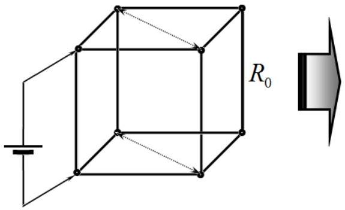
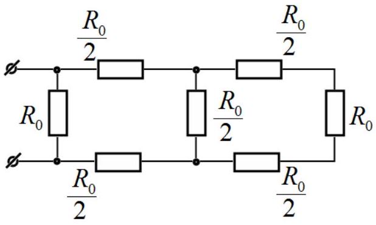
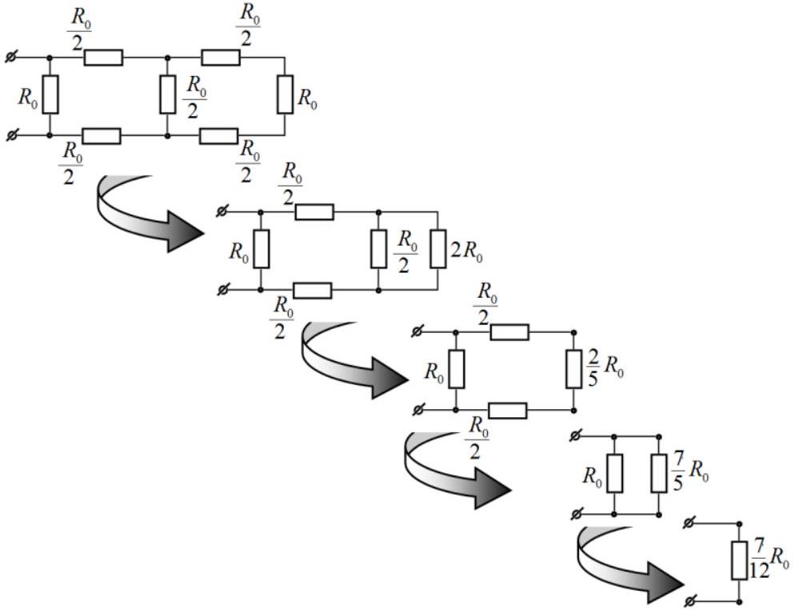
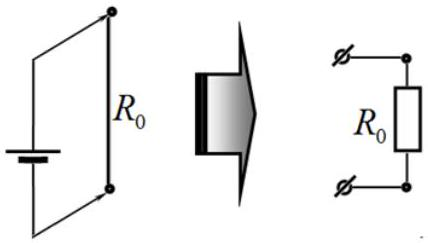
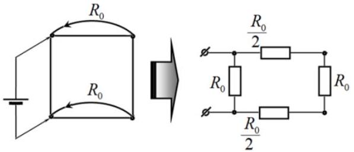
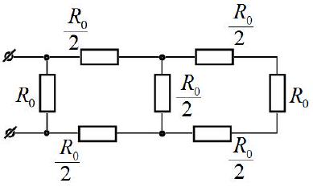
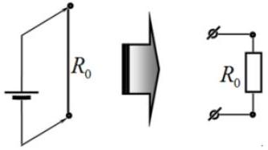
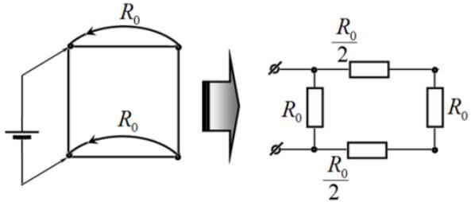

## Problem 3. Resistance of a prism (10.0 points)

## 1. Mathematical introduction (3.0 points)

1.1 [0.2 points] From the course of school mathematics it is known that geometrical progression terms are explicitly expressed as

$$
\begin{equation*}
x _ { k } = A \lambda ^ { k } . \tag{1}
\end{equation*}
$$

1.2 [0.4 points] Let us express $\lambda ^ { k }$ recurrently in terms of $\lambda ^ { k - 1 }$ :

$$
\lambda ^ { k } = \lambda ^ { k - 1 } \cdot \lambda
$$

and transform it as follows

$$
\begin{align*}
& \lambda ^ { k } = \left( p _ { k } + q _ { k } \sqrt { 3 } \right) = \left( p _ { k - 1 } + q _ { k - 1 } \sqrt { 3 } \right) \cdot ( 2 + \sqrt { 3 } ) = 2 p _ { k - 1 } + p _ { k - 1 } \sqrt { 3 } + 2 q _ { k - 1 } \sqrt { 3 } + 3 q _ { k - 1 } =  \tag{2}\\
& = \left( 2 p _ { k - 1 } + 3 q _ { k - 1 } \right) + \left( p _ { k - 1 } + 2 q _ { k - 1 } \right) \sqrt { 3 } .
\end{align*}
$$

This equality implies the required recurrence relations in the form

$$
\begin{align*}
& p _ { k } = 2 p _ { k - 1 } + 3 q _ { k - 1 } \\
& q _ { k } = p _ { k - 1 } + 2 q _ { k - 1 } . \tag{3}
\end{align*}
$$

Inverse relations are obtained analogously

$$
\begin{align*}
& \lambda ^ { k - 1 } = p _ { k - 1 } + q _ { k - 1 } = \lambda ^ { k } \cdot \lambda ^ { - 1 } = \left( p _ { k } + q _ { k } \sqrt { 3 } \right) \cdot ( 2 - \sqrt { 3 } ) =  \tag{4}\\
& = \left( 2 p _ { k } - 3 q _ { k } \right) + \left( 2 q _ { k } - p _ { k } \right) \sqrt { 3 } ,
\end{align*}
$$

and, thus,

$$
\begin{align*}
& p _ { k - 1 } = 2 p _ { k } - 3 q _ { k } ,  \tag{5}\\
& q _ { k - 1 } = 2 q _ { k } - p _ { k } .
\end{align*}
$$

1.3 [0.7 points] Calculation of the coefficients is much easier to carry out in series, given that $p _ { 0 } = 1 , \quad q _ { 0 } = 0$. The results are shown in Table 1.

Table 1.
| $k$ | $p _ { k }$ | $q _ { k }$ |
| :--- | :--- | :--- |
| 0 | 1 | 0 |
| 1 | 2 | 1 |
| 2 | 7 | 4 |
| 3 | 26 | 15 |
| 4 | 97 | 56 |
| 5 | 362 | 209 |

1.4 [0.2 points] Note that

$$
\begin{equation*}
\lambda ^ { - 1 } = \frac { 1 } { 2 + \sqrt { 3 } } = 2 - \sqrt { 3 } , \tag{6}
\end{equation*}
$$

therefore,

$$
\begin{equation*}
\lambda ^ { - k } = ( 2 - \sqrt { 3 } ) ^ { k } = p _ { k } - q _ { k } \sqrt { 3 } . \tag{7}
\end{equation*}
$$

1.5 [1.0 points] Using the hint, we substitute $x _ { k } = C \lambda ^ { k }$ into the recurrence relation and obtain the equation to determine $\lambda$ in the form

$$
\begin{equation*}
\lambda ^ { k + 1 } = 4 \lambda ^ { k } - \lambda ^ { k - 1 } . \tag{8}
\end{equation*}
$$

After reduction the following quadratic equation is derived

$$
\begin{equation*}
\lambda ^ { 2 } - 4 \lambda + 1 = 0 , \tag{9}
\end{equation*}
$$

which has two solutions

$$
\begin{equation*}
\lambda _ { 1,2 } = 2 \pm \sqrt { 3 } . \tag{10}
\end{equation*}
$$

Consequently, the general solution to the recurrence relation (3) is explicitly written by

$$
\begin{equation*}
x _ { k } = C _ { 1 } \lambda _ { 1 } ^ { k } + C _ { 2 } \lambda _ { 2 } ^ { k } , \tag{11}
\end{equation*}
$$

where $C _ { 1 } , C _ { 2 }$ are arbitrary constants that are determined by the boundary conditions:

$$
\begin{align*}
& x _ { 0 } = A \Rightarrow C _ { 1 } + C _ { 2 } = A \\
& x _ { 0 } = B \Rightarrow C _ { 1 } \lambda _ { 1 } ^ { N } + C _ { 2 } \lambda _ { 2 } ^ { N } = B . \tag{12}
\end{align*}
$$

Solving the linear set of equation yields

$$
\left\{ \begin{array} { l }
{ C _ { 1 } + C _ { 2 } = A }  \tag{13}\\
{ C _ { 1 } \lambda _ { 1 } ^ { N } + C _ { 2 } \lambda _ { 2 } ^ { N } = B }
\end{array} \Rightarrow \left\{ \begin{array} { l }
C _ { 1 } = \frac { B - A \lambda _ { 2 } ^ { N } } { \lambda _ { 1 } ^ { N } - \lambda _ { 2 } ^ { N } } \\
C _ { 2 } = \frac { A \lambda _ { 1 } ^ { N } - B } { \lambda _ { 1 } ^ { N } - \lambda _ { 2 } ^ { N } }
\end{array} \right. \right.
$$

Substituting this solution into (11), it is possible to rewrite it in the following symmetrical form

$$
\begin{align*}
& x _ { k } = C _ { 1 } \lambda _ { 1 } ^ { k } + C _ { 2 } \lambda _ { 2 } ^ { k } = \frac { B - A \lambda _ { 2 } ^ { N } } { \lambda _ { 1 } ^ { N } - \lambda _ { 2 } ^ { N } } \lambda _ { 1 } ^ { k } + \frac { A \lambda _ { 1 } ^ { N } - B } { \lambda _ { 1 } ^ { N } - \lambda _ { 2 } ^ { N } } \lambda _ { 2 } ^ { k } = \\
& = \frac { A \lambda _ { 1 } ^ { N } \lambda _ { 2 } ^ { k } - B \lambda _ { 2 } ^ { k } + B \lambda _ { 1 } ^ { k } - A \lambda _ { 2 } ^ { N } \lambda _ { 1 } ^ { k } } { \lambda _ { 1 } ^ { N } - \lambda _ { 2 } ^ { N } } = \frac { A \left( \lambda _ { 1 } ^ { N - k } - \lambda _ { 2 } ^ { N - k } \right) + B \left( \lambda _ { 1 } ^ { k } - \lambda _ { 2 } ^ { k } \right) } { \lambda _ { 1 } ^ { N } - \lambda _ { 2 } ^ { N } } . \tag{14}
\end{align*}
$$

The derivation of the last relation takes into account that according to the Vieta theorem $\lambda _ { 2 } = \lambda _ { 1 } ^ { - 1 }$. 1.6 [0.5 points] In view of the above formulas for the $\lambda _ { 1,2 } ^ { k }$, we find that

$$
\begin{equation*}
\lambda _ { 1 } ^ { k } - \lambda _ { 2 } ^ { k } = \lambda _ { 1 } ^ { k } - \lambda _ { 1 } ^ { - k } = \left( p _ { k } + q _ { k } \sqrt { 3 } \right) - \left( p _ { k } - q _ { k } \sqrt { 3 } \right) = 2 q _ { k } \sqrt { 3 } , \tag{15}
\end{equation*}
$$

and, finally,

$$
\begin{equation*}
x _ { k } = \frac { A \left( \lambda _ { 1 } ^ { N - k } - \lambda _ { 2 } ^ { N - k } \right) + B \left( \lambda _ { 1 } ^ { k } - \lambda _ { 2 } ^ { k } \right) } { \lambda _ { 1 } ^ { N } - \lambda _ { 2 } ^ { N } } = \frac { A q _ { N - k } + B q _ { k } } { q _ { N } } . \tag{16}
\end{equation*}
$$

## 2. Wire frame in the shape of a prism (7.0 points)

2.1 [0.8 points] If the vertices of the cube with the same potentials are connected, then, the following equivalent circuits are obtained

and easily calculated using the standard method as

Ultimately, the cube resistance for the given connection is found as

$$
\begin{equation*}
R = \frac { 7 } { 12 } R _ { 0 } . \tag{17}
\end{equation*}
$$

2.2 [0.2 points] Visual symmetry of the circuit and of the initial conditions provides obvious relations

$$
\begin{align*}
& y _ { k } = - x _ { k } ,  \tag{18}\\
& x _ { N - k } = x _ { k } . \tag{19}
\end{align*}
$$

2.3 [1.0 points] The algebraic sum of the currents entering a node is equal to zero, thus, using Ohm's law, the following equation is obtained for the node $x _ { k }$

$$
\begin{equation*}
\frac { x _ { k - 1 } - x _ { k } } { R _ { 0 } } + \frac { x _ { k + 1 } - x _ { k } } { R _ { 0 } } + \frac { y _ { k } - x _ { k } } { R _ { 0 } } = 0 . \tag{20}
\end{equation*}
$$

Since $y _ { k } = - x _ { k }$, the recurrence relation holds

$$
\begin{equation*}
x _ { k + 1 } - 4 x _ { k } + x _ { k - 1 } = 0 . \tag{21}
\end{equation*}
$$

2.4 [0.2 points] For an unambiguous determination of all values $x _ { k }$, we need to explicitly specify two boundary conditions. One of those is the initial potential defined as

$$
\begin{equation*}
x _ { 0 } = \varphi _ { 0 } , \tag{22}
\end{equation*}
$$

whereas the other follows from the symmetry condition (19), which is valid for any $k$, and, in particular, for $k = 0$ (despite the fact that the node with the number $N$ does not exist in the circuit!)

$$
\begin{equation*}
x _ { N } = x _ { 0 } . \tag{23}
\end{equation*}
$$

2.5 [0.2 points] The recurrence relation (21) has been considered in the Mathematical introduction. Therefore, you can use the obtained solution (16) by setting:

$$
\begin{equation*}
x _ { k } = \frac { A q _ { N - k } + B q _ { k } } { q _ { N } } = \varphi _ { 0 } \frac { q _ { N - k } + q _ { k } } { q _ { N } } . \tag{24}
\end{equation*}
$$

2.6 [0.4 points] The current in the source circuit is found as the sum of the currents flowing from the node $x _ { 0 }$ :

$$
\begin{equation*}
I = \frac { x _ { 0 } - x _ { 1 } } { R _ { 0 } } + \frac { x _ { 0 } - x _ { N - 1 } } { R _ { 0 } } + \frac { x _ { 0 } - y _ { 0 } } { R _ { 0 } } = \frac { 4 x _ { 0 } - 2 x _ { 1 } } { R _ { 0 } } . \tag{25}
\end{equation*}
$$

Here it has been taken into account that $y _ { 0 } = - x _ { 0 } , x _ { N - 1 } = x _ { 1 }$. Substituting the values for $x _ { 0 } , x _ { 1 }$, results in

$$
\begin{align*}
& I _ { 0 } = \frac { 4 x _ { 0 } - 2 x _ { 1 } } { R _ { 0 } } = \frac { 2 } { R _ { 0 } } \left( 2 \phi _ { 0 } - \phi _ { 0 } \frac { q _ { N - 1 } + q _ { 1 } } { q _ { N } } \right) = \frac { 2 \phi _ { 0 } } { R _ { 0 } } \left( 2 - \frac { q _ { N - 1 } + 1 } { q _ { N } } \right) =  \tag{26}\\
& = \frac { 2 \phi _ { 0 } } { R _ { 0 } } \frac { 2 q _ { N } - q _ { N - 1 } - 1 } { q _ { N } } = \frac { 2 \phi _ { 0 } } { R _ { 0 } } \frac { 2 q _ { N } - \left( 2 q _ { N } - p _ { N } \right) - 1 } { q _ { N } } = \frac { 2 \phi _ { 0 } } { R _ { 0 } } \frac { p _ { N } - 1 } { q _ { N } } .
\end{align*}
$$

At the last step the relation (5) has been used, $q _ { N - 1 } = 2 q _ { N } - p _ { N }$.
2.7 [0.2 points] By formulation, the input voltage for the given circuit is

$$
\begin{equation*}
U _ { 0 } = 2 \varphi _ { 0 } , \tag{27}
\end{equation*}
$$

concequently, the resistance is found in the following elegant form

$$
\begin{equation*}
R _ { N } = \frac { U _ { 0 } } { I _ { 0 } } = R _ { 0 } \frac { q _ { N } } { p _ { N } - 1 } . \tag{28}
\end{equation*}
$$

2.8 [1.0 points] Calculations are easily performed using numerical values in Table 1.

Table 2. Resistances of prisms.
| $N$ | $p _ { N }$ | $q _ { N }$ | $R _ { N }$ |
| :--- | :--- | :--- | :--- |
| 1 | 2 | 1 | $R _ { 0 }$ |
| 2 | 7 | 4 | $R _ { 0 } \frac { 4 } { 7 - 1 } = \frac { 2 } { 3 } R _ { 0 }$ |
| 3 | 26 | 15 | $R _ { 0 } \frac { 15 } { 26 - 1 } = \frac { 3 } { 4 } R _ { 0 }$ |
| 4 | 97 | 56 | $R _ { 0 } \frac { 56 } { 97 - 1 } = \frac { 7 } { 12 } R _ { 0 }$ |
| 5 | 362 | 209 | $R _ { 0 } \frac { 209 } { 362 - 1 } = \frac { 11 } { 19 } R _ { 0 }$ |

Note that for a cubic prism with $N = 4$ the resistance coincides with that previously found in 2.1. 2.9 [0.5 points] For $N = 1$ the circuit is obvious:

but for $N = 2$ the prism should be additionally closed as:

In both cases the corresponding resistances coincide with the values shown in Table 2.
2.10 [1.0 points] The limit of the formula (28) can be found in various ways, for example, expressing

$$
\begin{equation*}
p _ { N } = \frac { 1 } { 2 } \left( \lambda ^ { N } - \lambda ^ { - N } \right) , \quad q _ { N } = \frac { 1 } { 2 \sqrt { 3 } } \left( \lambda ^ { N } + \lambda ^ { - N } \right) , \tag{29}
\end{equation*}
$$

where $\lambda = 2 + \sqrt { 3 } > 1$.
Then,

$$
\begin{equation*}
R _ { \infty } = \lim _ { N \rightarrow \infty } R _ { N } = R _ { 0 } \lim _ { N \rightarrow \infty } \frac { q _ { N } } { p _ { N } - 1 } = R _ { 0 } \lim _ { N \rightarrow \infty } \frac { \frac { 1 } { 2 \sqrt { 3 } } \left( \lambda ^ { N } + \lambda ^ { - N } \right) } { \frac { 1 } { 2 } \left( \lambda ^ { N } - \lambda ^ { - N } \right) - 1 } = \frac { R _ { 0 } } { \sqrt { 3 } } . \tag{30}
\end{equation*}
$$

2.11 [1.5 points] Evaluation gives ries to

$$
\begin{equation*}
\frac { R _ { \infty } } { R _ { 0 } } = \frac { 1 } { \sqrt { 3 } } \approx 0.577 . \tag{31}
\end{equation*}
$$

Then, we carry out the calculation of the relative error of the approximate expression for different values of $N$ listed in Table 2.

Table 3.
| $N$ | $R _ { N }$ | $\frac { R _ { N } } { R _ { 0 } }$ | $\varepsilon = \frac { R _ { \infty } - R _ { N } } { R _ { N } }$ |
| :--- | :--- | :--- | :--- |
| 1 | $R _ { 0 }$ | 1.000 | -0.423 |
| 2 | $\frac { 2 } { 3 } R _ { 0 }$ | 0.667 | -0.134 |
| 3 | $\frac { 3 } { 4 } R _ { 0 }$ | 0.750 | -0.038 |
| 4 | $\frac { 7 } { 12 } R _ { 0 }$ | 0.583 | -0.010 |
| 5 | $\frac { 11 } { 19 } R _ { 0 }$ | 0.579 | <-0.004 |

It is seen that already at $N = 4$ the relative error is 1\%. Consequently, in this problem four is equal to infinity!

$$
\begin{equation*}
\infty \approx 4 . \tag{32}
\end{equation*}
$$

|  | Content | points |  |
| :--- | :--- | :--- | :--- |
| 1.1 | Formula (1) $x _ { k } = A \lambda ^ { k }$ | 0.2 | 0.2 |
| 1.2 | Formula (3) | 0.2 | 0.4 |
|  | Formulas (5) $\begin{aligned} & p _ { k - 1 } = 2 p _ { k } - 3 q _ { k } \\ & q _ { k - 1 } = 2 q _ { k } - p _ { k } \end{aligned}$ | 0.2 |  |
| 1.3 | Correct initial values $p _ { 0 } = 1 , \quad q _ { 0 } = 0$ | 0.2 | 0.7 |
|  | Correct values in Table 1.$k$ $p _ { k }$ $q _ { k }$   0 1 0   1 2 1   2 7 4   3 26 15   4 97 56   5 362 209 |  |  |
| 1.4 | Formula (7) $\lambda ^ { - k } = p _ { k } - q _ { k } \sqrt { 3 }$ | 0.2 | 0.2 |

| 1.5 | Formula (10) $\lambda _ { 1,2 } = 2 \pm \sqrt { 3 }$ | 0.2 | 1.0 |
| :--- | :--- | :--- | :--- |
|  | Formula (11) $x _ { k } = C _ { 1 } \lambda _ { 1 } ^ { k } + C _ { 2 } \lambda _ { 2 } ^ { k }$ | 0.2 |  |
|  | Formula (12) $C _ { 1 } + C _ { 2 } = A$   $C _ { 1 } \lambda _ { 1 } ^ { N } + C _ { 2 } \lambda _ { 2 } ^ { N } = B$ | 0.2 |  |
|  | Solution (13) $\left\{ \begin{array} { l } C _ { 1 } = \frac { B - A \lambda _ { 2 } ^ { N } } { \lambda _ { 1 } ^ { N } - \lambda _ { 2 } ^ { N } } \\ C _ { 2 } = \frac { A \lambda _ { 1 } ^ { N } - B } { \lambda _ { 1 } ^ { N } - \lambda _ { 2 } ^ { N } } \end{array} \right.$ | 0.2 |  |
|  | Formula (14) $x _ { k } = \frac { A \left( \lambda _ { 1 } ^ { N - k } - \lambda _ { 2 } ^ { N - k } \right) + B \left( \lambda _ { 1 } ^ { k } - \lambda _ { 2 } ^ { k } \right) } { \lambda _ { 1 } ^ { N } - \lambda _ { 2 } ^ { N } }$ | 0.2 |  |
| 1.6 | Formula (16) $x _ { k } = \frac { A q _ { N - k } + B q _ { k } } { q _ { N } }$ | 0.5 | 0.5 |
| 2.1 | Equivalent circuit | 0.3 | 0.8 |
|  | Formula (17) $R = \frac { 7 } { 12 } R _ { 0 }$ | 0.5 |  |
| 2.2 | Formula (18) $y _ { k } = - x _ { k }$ | 0.1 | 0.2 |
|  | Formula (19) $x _ { N - k } = x _ { k }$ | 0.1 |  |
| 2.3 | Formula (20) $\frac { X _ { k - 1 } - X _ { k } } { R _ { 0 } } + \frac { X _ { k + 1 } - X _ { k } } { R _ { 0 } } + \frac { y _ { k } - X _ { k } } { R _ { 0 } } = 0$ | 0.5 | 1.0 |
|  | Formula (21) $x _ { k + 1 } - 4 x _ { k } + x _ { k - 1 } = 0$ | 0.5 |  |
| 2.4 | Formula (22) $x _ { 0 } = \varphi _ { 0 }$ | 0.1 | 0.2 |
|  | Formula (23) $x _ { N } = x _ { 0 }$ | 0.1 |  |
| 2.5 | Formula (24) $x _ { k } = \frac { A q _ { N - k } + B q _ { k } } { q _ { N } } = \varphi _ { 0 } \frac { q _ { N - k } + q _ { k } } { q _ { N } }$ | 0.2 | 0.2 |
| 2.6 | Formula (25) $I = \frac { 4 x _ { 0 } - 2 x _ { 1 } } { R _ { 0 } }$ | 0.2 | 0.4 |
|  | Formula (26) $I _ { 0 } = \frac { 2 \varphi _ { 0 } } { R _ { 0 } } \frac { p _ { N } - 1 } { q _ { N } }$ | 0.2 |  |
| 2.7 | Formula (27) $U _ { 0 } = 2 \varphi _ { 0 }$ | 0.1 | 0.2 |
|  | Formula (28) $R _ { N } = \frac { U _ { 0 } } { I _ { 0 } } = R _ { 0 } \frac { q _ { N } } { p _ { N } - 1 }$ | 0.1 |  |
| 2.8 | Correct values in Table 2.   Table 2. Resistances of prisms.$N$ $p _ { N }$ $q _ { N }$ $R _ { N }$   1 2 1 $R _ { 0 }$ | 1.0 | 1.0 |

|  |  | 2 | 7 | 4 | $R _ { 0 } \frac { 4 } { 7 - 1 } = \frac { 2 } { 3 } R _ { 0 }$ |  |  |  |
| :--- | :--- | :--- | :--- | :--- | :--- | :--- | :--- | :--- |
|  |  | 3 | 26 | 15 | $R _ { 0 } \frac { 15 } { 26 - 1 } = \frac { 3 } { 4 } R _ { 0 }$ |  |  |  |
|  |  | 4 | 97 | 56 | $R _ { 0 } \frac { 56 } { 97 - 1 } = \frac { 7 } { 12 } R _ { 0 }$ |  |  |  |
|  |  | 5 | 362 | 209 | $R _ { 0 } \frac { 209 } { 362 - 1 } = \frac { 11 } { 19 } R _ { 0 }$ |  |  |  |
| 2.9 | Equivalent circuit for $N = 1$ |  |  |  |  |  | 0.1 | 0.5   0.5 |
|  | Equivalent circuit for $N = 2$ |  |  |  |  |  | 0.4 |  |
| 2.10 |  |  |  |  | Formula (29) $p _ { N } = \frac { 1 } { 2 } \left( \lambda ^ { N } - \lambda ^ { - N } \right) , \quad q _ { N } = \frac { 1 } { 2 \sqrt { 3 } } \left( \lambda ^ { N } + \lambda ^ { - N } \right)$ |  | 0.5 | 1.0 |
|  | Formula (30) $R _ { \infty } = \frac { R _ { 0 } } { \sqrt { 3 } }$ |  |  |  |  |  | 0.5 |  |
| 2.11 | Formula (31) $\frac { R _ { \infty } } { R _ { 0 } } \approx 0.577$ |  |  |  |  |  | 0.2 | 1.5 |
|  | Correct values in Table 3. |  |  |  |  |  |  |  |
|  |  |  |  |  | $N$ $R _ { N }$ $\frac { R _ { N } } { R _ { 0 } }$ $\varepsilon = \frac { R _ { \infty } - R _ { N } } { R _ { N } }$   1 $R _ { 0 }$ 1.000 - 0.423   2 $\frac { 2 } { 3 } R _ { 0 }$ 0.667 - 0.134   3 $\frac { 3 } { 4 } R _ { 0 }$ 0.750 - 0.038   4 $\frac { 7 } { 12 } R _ { 0 }$ 0.583 - 0.010   5 $\frac { 11 } { 19 } R _ { 0 }$ 0.579 $< - 0.004$ |  |  |  |
|  | Formula (32) $\infty \approx 4$ |  |  |  |  |  | 0.3 |  |
| Total |  |  |  |  |  |  |  | 10.0 |
