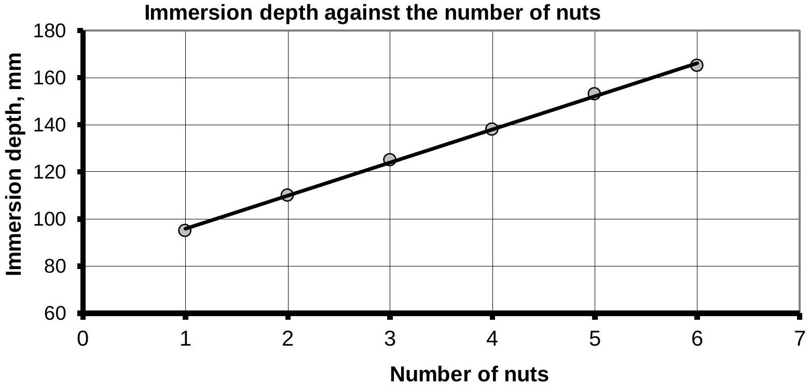
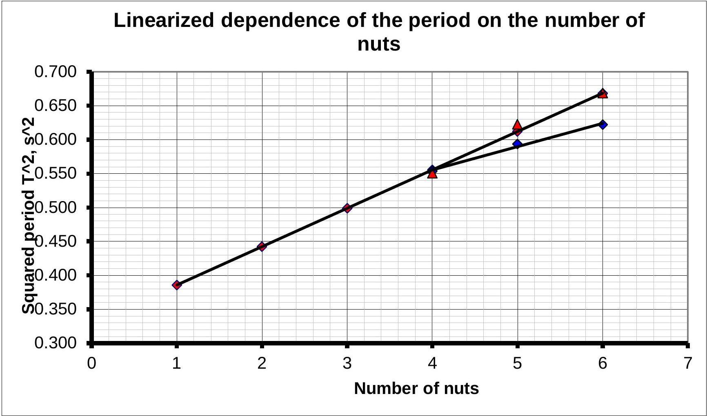

## SOLUTION TO THE EXPERIMENTAL COMPETITION   The Law of Archimedes (15.0 points)   Part 1. Installation parameters

1.1 A strip of millimeter paper is screwed onto the test-tube. We make marks on the strip, untwist it and obtain the lengths of 1, 2, 3 and 4 revolutions as

$$
\begin{aligned}
& l _ { 1 } = 63 \mathrm {~mm} \\
& l _ { 2 } = 127 \mathrm {~mm} \\
& l _ { 3 } = 191 \mathrm {~mm} \\
& l _ { 4 } = 255 \mathrm {~mm}
\end{aligned}
$$

From these data we find that the length of one revolution is equal to $\langle l \rangle = ( 64,0 \pm 0.3 ) m m$ The diameter is then calculated by the formula $D = \frac { \langle I \rangle } { \pi } = 20,372 \mathrm {~mm}$, the unstrumental error is found as $\Delta D = D \frac { \Delta l } { \langle l \rangle } = 0,1 \mathrm {~mm}$ and the final result is written as

$$
D = ( 20,4 \pm 0.1 ) \mathrm { mm } .
$$

1.2 The length of the test-tube is obtained as $L = ( 175 \pm 1 ) \mathrm { mm }$.
1.3.1-1.3.2 . Dependence of the immersion depth of the tesr-tube on the number of nuts, placed in it, is shown in Table 1. First, the length $x$ of the part of the test-tube, protruding above the water level, is measured. And then the immersion depth is calculated by the formula $h = L - x$.

Table 1
| Number of nuts | $x , \mathrm {~mm}$ | $h , \mathrm {~mm}$ |
| :--- | :--- | :--- |
| 1 | 80 | 95 |
| 2 | 65 | 110 |
| 3 | 50 | 125 |
| 4 | 37 | 138 |
| 5 | 22 | 153 |
| 6 | 10 | 165 |

Table 1

The dependence obtained is linear and is described by the formula

$$
\begin{equation*}
h = a n + b . \tag{1}
\end{equation*}
$$

The parameters, calculated by the least square method, are equal

$$
\begin{align*}
& a = ( 14,1 \pm 0,5 ) \mathrm { mm } \\
& b = ( 81,8 \pm 1,8 ) \mathrm { mm } \tag{2}
\end{align*} .
$$

1.3.3 The theoretical formula for the resulting dependence follows from the equilibrium condition

$$
\begin{equation*}
( M + m n ) g = \rho S h d \Rightarrow h = \frac { M + m n } { \rho S } . \tag{3}
\end{equation*}
$$

where $S = \frac { \pi D ^ { 2 } } { 4 }$ stands for the cross-sectional area of the test tube.
From the comparison of expressions (3) and (1) it follows that

$$
\begin{equation*}
a = \frac { m } { \rho S } \Rightarrow m = \rho S a . \tag{4}
\end{equation*}
$$

Numerical calculations lead to the following result

$$
\begin{equation*}
m = \rho \frac { \pi D ^ { 2 } } { 4 } a = 4,58 \cdot 10 ^ { - 3 } \mathrm {~kg} = 4,58 g . \tag{5}
\end{equation*}
$$

The instrumental error in measuring the mass of the nut is calculated by the formula

$$
\begin{equation*}
\Delta m = m \sqrt { \left( \frac { \Delta a } { a } \right) ^ { 2 } + \left( 2 \frac { \Delta D } { D } \right) ^ { 2 } } = 1,6 \cdot 10 ^ { - 4 } \mathrm {~kg} . \tag{6}
\end{equation*}
$$

The final weight of the nut is written as

$$
\begin{equation*}
m = ( 4,58 \pm 0,16 ) g . \tag{7}
\end{equation*}
$$

The weight of the test-tube is calculated by the formula

$$
b = \frac { M } { \rho S } \Rightarrow M = \rho S b = \rho \frac { \pi D ^ { 2 } } { 4 } b = 2,67 \cdot 10 ^ { - 2 } \mathrm {~kg} = 26,7 g .
$$

The error in calculating the mass of the test-tube is found as

$$
\begin{equation*}
\Delta M = M \sqrt { \left( \frac { \Delta b } { b } \right) ^ { 2 } + \left( 2 \frac { \Delta D } { D } \right) ^ { 2 } } = 0,6 g . . \tag{8}
\end{equation*}
$$

To simplify further calculations, we note that the ratio of the parameters of the linear dependence (2) is equal to the ratio of the mass of the test-tube and the nut:

$$
\begin{equation*}
n ^ { * } = \frac { M } { m } = \frac { b } { a } = 5,82 . \tag{9}
\end{equation*}
$$

## Part 2. Oscillations of the test-tube

2.1 To simplify the calculations, the formula for the period of oscillations can be rewritten in the form

$$
\begin{equation*}
T _ { n } = 2 \pi \sqrt { \frac { h _ { 0 } } { g } } = 2 \pi \sqrt { \frac { a n + b } { g } } . \tag{10}
\end{equation*}
$$

To linearize this dependence, it is necessary to plot and analyze the dependence of the squared period on the number of nuts $T ^ { 2 } ( n )$. The results are summarized in Table 2.

Table 2.
| Number of nuts | $T , s$ | $T ^ { 2 } , s ^ { 2 }$ |
| :--- | :--- | :--- |
| 1 | 0,680 | 0,463 |
| 2 | 0,717 | 0,514 |
| 3 | 0,752 | 0,565 |

| 4 | 0,785 | 0,617 |
| :--- | :--- | :--- |
| 5 | 0,817 | 0,668 |
| 6 | 0,848 | 0,720 |

The graph of the dependence $T ^ { 2 } ( n )$ is shown in the figure below.

2.2 The results of the measurements are given in tables

The random error in measuring the period is estimated from the following formula

$$
\begin{equation*}
\Delta t = 2 \sqrt { \frac { \sum _ { k } \left( t _ { k } - \langle t \rangle \right) ^ { 2 } } { N ( N - 1 ) } } ; \quad \Delta T = \frac { \Delta t } { k } . \tag{11}
\end{equation*}
$$

Here $t$ refers to the time needed to perform $k$ periods of oscillations (in our case $k = 5$ and $k = 3$ respectively), $N = 10$ stands for the number of measurements.

Table 3. Oscillations in the wide vessel
| Number of nuts | Number of periods k | Time $t , \mathrm {~s}$ | Period $T$, s | Averaged period $\langle T \rangle , \mathrm { s }$ | Error in the period $\Delta T$ | Squared period $T ^ { 2 } , s ^ { 2 }$ |
| :--- | :--- | :--- | :--- | :--- | :--- | :--- |
| 4 | 5 | 3,74 | 0,748 | 0,744 | 0,009 | 0,554 |
|  | 5 | 3,64 | 0,728 |  |  |  |
|  | 5 | 3,77 | 0,754 |  |  |  |
|  | 5 | 3,71 | 0,742 |  |  |  |
|  | 5 | 3,74 | 0,748 |  |  |  |
| 5 | 5 | 3,93 | 0,786 | 0,770 | 0,010 | 0,594 |
|  | 5 | 3,81 | 0,762 |  |  |  |
|  | 5 | 3,89 | 0,778 |  |  |  |
|  | 5 | 3,83 | 0,766 |  |  |  |
|  | 5 | 3,80 | 0,760 |  |  |  |

| 6 | 5 | 3,93 | 0,786 | 0,789 | 0,010 | 0,622 |
| :--- | :--- | :--- | :--- | :--- | :--- | :--- |
|  | 5 | 3,93 | 0,786 |  |  |  |
|  | 5 | 4,04 | 0,808 |  |  |  |
|  | 5 | 3,93 | 0,786 |  |  |  |
|  | 5 | 3,89 | 0,778 |  |  |  |

Table 3. Oscillations in the beaker

| Number of nuts | Number of periods k | Time $t , \mathrm {~s}$ | Period $T$, s | Averaged period $\langle T \rangle , \mathrm { s }$ | Error in the period $\Delta T$ | Squared period $T ^ { 2 } , s ^ { 2 }$ |
| :--- | :--- | :--- | :--- | :--- | :--- | :--- |
| 4 | 3 | 2,21 | 0,74 | 0,742 | 0,014 | 0,551 |
|  | 3 | 2,25 | 0,75 |  |  |  |
|  | 3 | 2,27 | 0,76 |  |  |  |
|  | 3 | 2,20 | 0,73 |  |  |  |
|  | 3 | 2,20 | 0,73 |  |  |  |
| 5 | 3 | 2,38 | 0,79 | 0,789 | 0,015 | 0,623 |
|  | 3 | 2,37 | 0,79 |  |  |  |
|  | 3 | 2,34 | 0,78 |  |  |  |
|  | 3 | 2,42 | 0,81 |  |  |  |
|  | 3 | 2,33 | 0,78 |  |  |  |
| 6 | 2 | 1,61 | 0,81 | 0,818 | 0,036 | 0,669 |
|  | 2 | 1,59 | 0,80 |  |  |  |
|  | 2 | 1,66 | 0,83 |  |  |  |
|  | 2 | 1,63 | 0,82 |  |  |  |
|  | 2 | 1,69 | 0,85 |  |  |  |

Table 4

2.4 What possible reasons can explain the deviation between experimental data and theoretical calculations?

Table 4
| No. | Possible reasons | «Yes» | «No» |
| :--- | :--- | :--- | :--- |
| 1 | Measurement errors | X |  |
| 2 | Oscillation damping |  | X |
| 3 | An increase in the effective mass of a moving test-tube due to water entraining |  | X |
| 4 | Change in pressure under the tube when it moves as compared to hydrostatic pressure | X |  |
| 5 | Surface tension forces |  | X |

Comments:

1. Of course, errors ifluence any result.
2.3 These reasons should lead to an increase in the period, and not to a decrease.
4. Apparently, the main reason, leading to a reduction in the period.
5. Too small forces.

## Marking scheme

Part1. Installation parameters
| № | Criteria | Total | Points |
| :--- | :--- | :--- | :--- |
| 1.1 | Diamater measurement | 0,9 |  |
|  | - sketch of the measurements: - rolling on the test-tube (2-3 revolutions; 1 revolution); - rolling the test-tube on the millimeter paper; - direct measurement of the diameter;  |  | 0,2 $( 0,1 ) ( 0,1 ) ( 0,1 )$ |
|  | Measurement results: - circumference in the range of 63-66 mm (61-68 mm, out of range) |  | 0,2 (0,1; 0) |
|  | Evaluation of the diameter: - formula: - numerical value (in accordance with the previous part)  |  | 0,1 0,2 (0,1; 0) |
|  | Instrumental errpr 0,25-0,35 mm (larger) |  | 0,1 (0) |
|  | Correctly rouded results* |  | 0,1 |
| 1.2 | Measurement of the test-tube length | 0,3 |  |
|  | - length in the range of 170-180 mm (out of range) - instrumental error 1 mm (иное)  |  | 0,1 (0) 0,1 (0) |
|  | Correctly rounded result* |  | 0,1 |
| 1.3.1 | Results of the immersion depth measurement | 1,8 |  |
|  | Results differ from tabulated $\pm 2 \mathrm {~mm} ( \pm 4 m m$, larger $)$ |  | 1,2 (0,6; 0) |
|  | Number of points* 6 (3, less) |  | 0,6 (0,3, 0) |
| 1.3.2 | Plotting the graph and calculating the parameters of the dependence (marked only if 1.3.1 has been marked) | 1,0 |  |
|  | - axes are signed and ticked; - points are plotted in accordance with the table  |  | 0,1 0,2 |
|  | Parameters of the dependence: - form of dependence is a linear function - evaluation of the parameters; - errors of the parameters;  |  | 0,1 2×0.2 2×0,2 |
| 1.3.3 | Calculation of masses of the nut and the test tube: (marked only if 1.3.1 has been marked) | 2,0 |  |
|  | - formula of the theoretical dependence |  | 0,4 |
|  | - formulas for calculating masses through the parameters of the linear dependence; |  | 2×0,2 |
|  | - calculation of the mass of the nut: within 10\% from the tabulated value (20\%, larger) |  | 0,4 (0,2, 0) |
|  | - Nut mass error: errors in the slope and the diameter are taken into account (only one contribution) |  | 0,2 $( 0,1 )$ |
|  | - calculation of the test-tube mass: within 10\% from the tabulated value (20\%, larger) |  | 0,4 (0,2, 0) |
|  | - error in the mass of the test-tube: errors in the shift and the diameter: erroes in the shift and in the diameter are taken into account (only one contribution) |  | 0,2 $( 0,1 )$ |

[^0]
Part 2. Oscillations of the test-tube
| № | Criteria | Total | Points |
| :--- | :--- | :--- | :--- |
| 2.1 | Theoretical dependence | 1,2 |  |
|  | - formula for the period $T ( n )$ via measured parameters |  | 0,2 |
|  | - periods are calculated |  | 6x0,1 |
|  | - linearization $T ^ { 2 } ( n )$ (other) |  | 0,1(0) |
|  | Plotting the graph: |  |  |
|  | - axes are signed and ticked; |  | 0,1 |
|  | - points are plotted in accordance with the table; |  | 0,2 |
| 2.2 | Formula for evaluating the error in the period: - decrease of the random error with increasing the number of measurements; |  |  |
|  | - modulus of the average deviation from the mean value; |  | $( 0,1 )$ |
|  | Oscillations in the wide vessel | 3,0 |  |
|  | Results within the range ±20\% (±30\%, larger) |  | 3x0,3 (0,2; 0) |
|  | More than 7 measuments are taken (more than 4, less)* |  | 3×0,3 (0.2; 0) |
|  | Periods are calculated* |  | 3x0,1 |
|  | Errors are calculated* |  | 3x0,1 |
|  | Points are plotted in accordance with the table * |  | 0.2 |
|  | Errors are stated in the graph* |  | 0,2 |
|  | The periods of oscillations are found to be less than the theoretical one (more than 0,1 s)* |  | 0,2 |
|  | Oscillations in the beaker | 3,3 |  |
|  | The results of the measurements within the range ±20\% (±30\% , larger) |  | 3x0,3 (0,2; 0) |
|  | More than 7 measuments are taken (more than 4, less)* |  | 3×0,3 (0.2; 0) |
|  | Periods are calculated* |  | 3x0,1 |
|  | Errors are calculated* |  | 3x0,1 |
|  | Points are plotted in accordance with the table * |  | 0.2 |
|  | Errors are stated in the graph* |  | 0,2 |
|  | The periods of oscillations are close to theoretical (the difference is not more than 0,2 s)* |  | 0,3 |
|  | The periods of oscillations in different vessels are similar (differences not more than 0.2 s) * |  | 0,2 |
| 2.4 | Possible reasons | 1,5 |  |
|  | - each correct answer |  | 5×0,3 |
|  | Total | 15 |  |

[^1]

[^0]:    *     - marked only if the measurements are marked.

[^1]:    *     - marked only if the measurements are marked.
