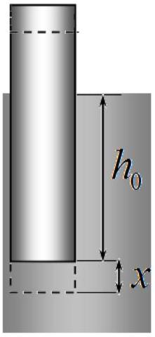
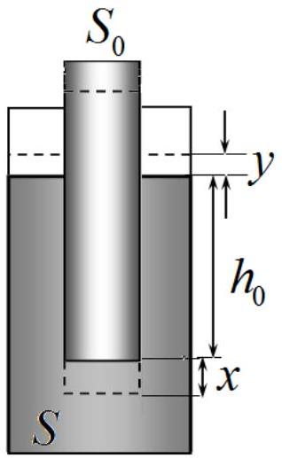
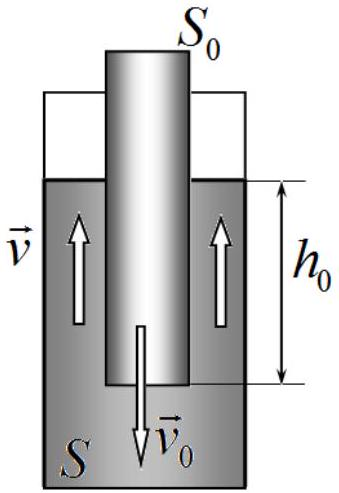
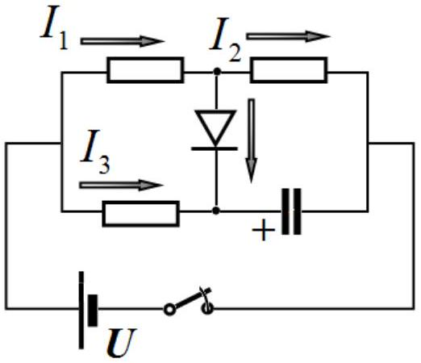
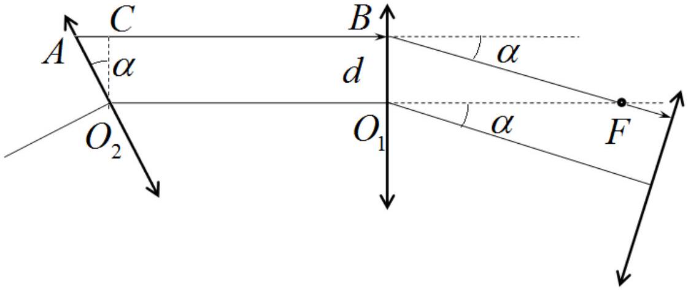
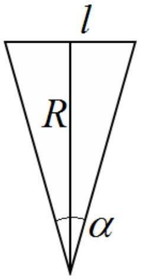
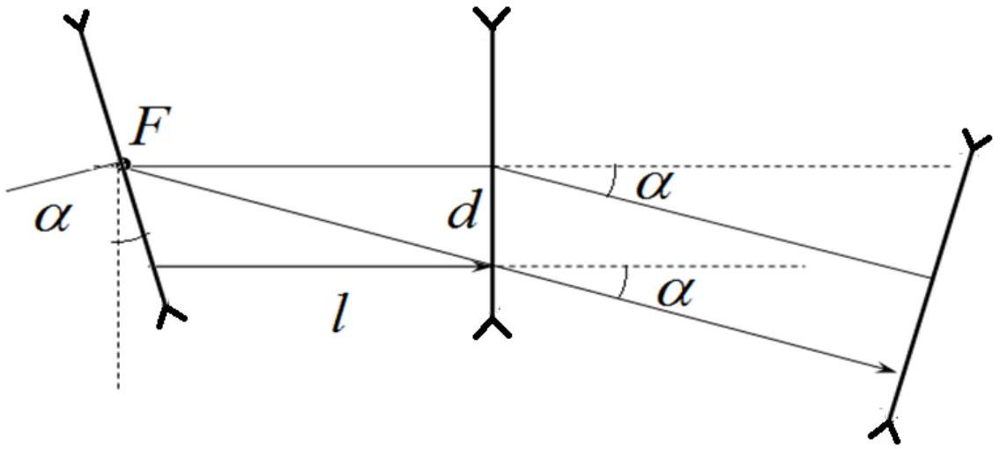
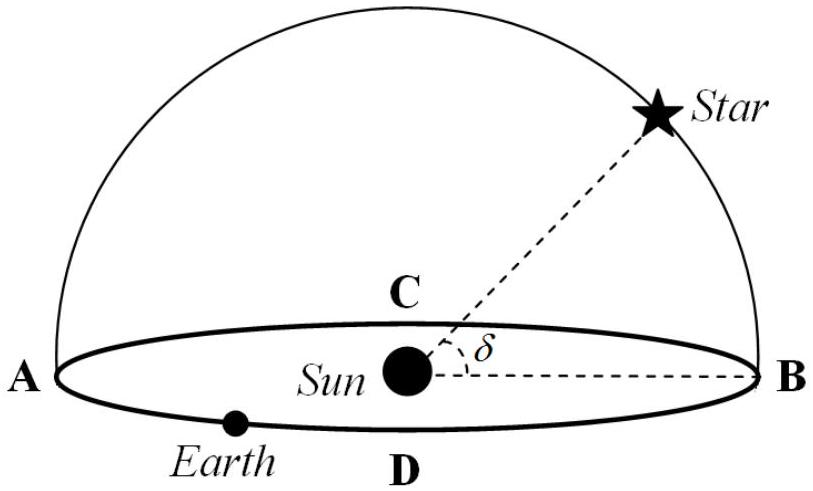

## SOLUTIONS TO THE PROBLEMS OF THE THEORETICAL COMPETITION   Attention. Points in grading are not divided!   Problem 1 (10.0 points)   Problem A (3.0 points)

A1. When the test-tube is immersed to the depth $x$, it experiences the Archimedes' force and the force of gravity. Therefore, the equation of Newton's second law for the test-tube has the form

$$
\begin{equation*}
m a = m g - \rho S _ { 0 } \left( h _ { 0 } + x \right) g . \tag{1}
\end{equation*}
$$

Here $m$ is the mass of the test-tube and $\rho$ stands for the water density.
In the equilibrium position, the following condition holds

$$
\begin{equation*}
m g = \rho S _ { 0 } h _ { 0 } g . \tag{2}
\end{equation*}
$$

It is thus immediately obtained that

$$
\begin{equation*}
a = - \frac { g } { h _ { 0 } } x . \tag{3}
\end{equation*}
$$

This is the equation of harmonic oscillations with the period

$$
\begin{equation*}
T = 2 \pi \sqrt { \frac { h _ { 0 } } { g } } . \tag{4}
\end{equation*}
$$

A2.1 When the test-tube is lowered to the depth $x$, its potential energy is reduced by an amount

$$
\begin{equation*}
\Delta U _ { 1 } = - m g x . \tag{5}
\end{equation*}
$$

If the test-tube is lowered to the depth $x$, the water level in the vessel rises to a height $y$ that satisfies the condition (the condition of constancy of the water volume)

$$
\begin{equation*}
S _ { 0 } x = \left( S - S _ { 0 } \right) y \Rightarrow y = \frac { S _ { 0 } } { S - S _ { 0 } } x . \tag{6}
\end{equation*}
$$

Consequently, the water that was under the test tube rises above the original water level in the vessel. The mass of this water is found as

$$
\begin{equation*}
\Delta m = \rho S _ { 0 } x , \tag{7}
\end{equation*}
$$

Its center of mass rises to a height
Its center of mass rises to a height

$$
\begin{equation*}
\Delta h _ { C } = h _ { 0 } + \frac { 1 } { 2 } ( x + y ) = h _ { 0 } + \frac { 1 } { 2 } \left( x + \frac { S _ { 0 } } { S - S _ { 0 } } x \right) = h _ { 0 } + \frac { 1 } { 2 } \frac { S } { S - S _ { 0 } } x . \tag{8}
\end{equation*}
$$

The change in the potential energy of water is derived as

$$
\begin{equation*}
\Delta U _ { 2 } = \Delta m g \Delta h _ { C } = \rho S _ { 0 } x g \left( h _ { 0 } + \frac { 1 } { 2 } \frac { S } { S - S _ { 0 } } x \right) . \tag{9}
\end{equation*}
$$

The total change in the potential energy (with relation (2)) is finally obtained as:

$$
\begin{equation*}
\Delta U = \Delta U _ { 1 } + \Delta U _ { 2 } = \frac { 1 } { 2 } \frac { S _ { 0 } S } { S - S _ { 0 } } \rho g x ^ { 2 } . \tag{10}
\end{equation*}
$$

A2.2 If the tube drops with the velocity $v _ { 0 }$, then the water between the walls and the test-tube rises at the speed of

$$
\begin{equation*}
v _ { 0 } S _ { 0 } = v \left( S - S _ { 0 } \right) \Rightarrow v = \frac { S _ { 0 } } { S - S _ { 0 } } v _ { 0 } . \tag{11}
\end{equation*}
$$

The mass of rising water reads as

$$
\begin{equation*}
m _ { 1 } = \rho \left( S - S _ { 0 } \right) h _ { 0 } \tag{12}
\end{equation*}
$$

The total kinetic energy of the test-tube and the rising water is equal to

$$
\begin{equation*}
K = \frac { m v _ { 0 } ^ { 2 } } { 2 } + \frac { m _ { 1 } v ^ { 2 } } { 2 } = \rho S _ { 0 } h _ { 0 } \frac { v _ { 0 } ^ { 2 } } { 2 } + \rho \left( S - S _ { 0 } \right) h _ { 0 } \frac { 1 } { 2 } \left( \frac { S _ { 0 } } { S - S _ { 0 } } v _ { 0 } \right) ^ { 2 } = \frac { 1 } { 2 } \frac { S _ { 0 } S } { S - S _ { 0 } } \rho h _ { 0 } v _ { 0 } ^ { 2 } . \tag{13}
\end{equation*}
$$

A2.3 The equation of the law of conservation of energy for the system under consideration is written as

$$
\begin{equation*}
\frac { 1 } { 2 } \frac { S _ { 0 } S } { S - S _ { 0 } } \rho h _ { 0 } v _ { 0 } ^ { 2 } + \frac { 1 } { 2 } \frac { S _ { 0 } S } { S - S _ { 0 } } \rho g x ^ { 2 } = E = \text { const } \tag{14}
\end{equation*}
$$

This equation is also an equation of harmonic oscillations with the same period

$$
\begin{equation*}
T = 2 \pi \sqrt { \frac { h _ { 0 } } { g } } . \tag{15}
\end{equation*}
$$

| Part | Content | Points |  |
| :--- | :--- | :--- | :--- |
| A1 | Formula (1) $m a = m g - \rho S _ { 0 } \left( h _ { 0 } + x \right) g$ | 0,2 | 0,8 |
|  | Formula (2) $m g = \rho S _ { 0 } h _ { 0 } g$ | 0,2 |  |
|  | Formula (3) $a = - \frac { g } { h _ { 0 } } x$ | 0,2 |  |
|  | Formula (4) $T = 2 \pi \sqrt { \frac { h _ { 0 } } { g } }$ | 0,2 |  |
| A2.1 | Formula (5) $\Delta U _ { 1 } = - m g x$ | 0,2 | 1,2 |
|  | Formula (6) $S _ { 0 } x = \left( S - S _ { 0 } \right) y \Rightarrow y = \frac { S _ { 0 } } { S - S _ { 0 } } x$ | 0,2 |  |
|  | Formula (7) $\Delta m = \rho \mathrm { S } _ { 0 } x$ | 0,2 |  |
|  | Formula (8) $\Delta h _ { C } = h _ { 0 } + \frac { 1 } { 2 } ( x + y ) = h _ { 0 } + \frac { 1 } { 2 } \left( x + \frac { S _ { 0 } } { S - S _ { 0 } } x \right) = h _ { 0 } + \frac { 1 } { 2 } \frac { S } { S - S _ { 0 } } x$ | 0,2 |  |
|  | Formula (9) $\Delta U _ { 2 } = \Delta m g \Delta h _ { C } = \rho S _ { 0 } x g \left( h _ { 0 } + \frac { 1 } { 2 } \frac { S } { S - S _ { 0 } } x \right)$ | 0,2 |  |
|  | Formula (10) $\Delta U = \Delta U _ { 1 } + \Delta U _ { 2 } = \frac { 1 } { 2 } \frac { S _ { 0 } S } { S - S _ { 0 } } \rho g x ^ { 2 }$ | 0,2 |  |
| A2.2 | Formula (11) $v _ { 0 } S _ { 0 } = v \left( S - S _ { 0 } \right) \Rightarrow v = \frac { S _ { 0 } } { S - S _ { 0 } } v _ { 0 }$ | 0,2 | 0,6 |
|  | Formula (12) $m _ { 1 } = \rho \left( S - S _ { 0 } \right) h _ { 0 }$ | 0,2 |  |
|  | Formula (13) $\begin{aligned} & K = \frac { m v _ { 0 } ^ { 2 } } { 2 } + \frac { m _ { 1 } v ^ { 2 } } { 2 } = \rho S _ { 0 } h _ { 0 } \frac { v _ { 0 } ^ { 2 } } { 2 } + \rho \left( S - S _ { 0 } \right) h _ { 0 } \frac { 1 } { 2 } \left( \frac { S _ { 0 } } { S - S _ { 0 } } v _ { 0 } \right) ^ { 2 } = \\ & = \frac { 1 } { 2 } \frac { S _ { 0 } S } { S - S _ { 0 } } \rho h _ { 0 } v _ { 0 } ^ { 2 } \end{aligned}$ | 0,2 |  |
| A2.3 | Formula (14) $\frac { 1 } { 2 } \frac { S _ { 0 } S } { S - S _ { 0 } } \rho h _ { 0 } v _ { 0 } ^ { 2 } + \frac { 1 } { 2 } \frac { S _ { 0 } S } { S - S _ { 0 } } \rho g x ^ { 2 } = E =$ const | 0,2 | 0,4 |

|  | Formula (15) $T = 2 \pi \sqrt { \frac { h _ { 0 } } { g } }$ | 0,2 |  |
| :--- | :--- | :--- | :--- |
| Total |  |  | 3,0 |

## Problem B (4.0 points)

Let $I _ { k }$ be the current through the resistor number k (see Fig.), $q _ { k }$ be the charge that has flowed through it up to the moment of closing the diode, $q$ be the charge that has flowed through the diode, and $Q$ be the charge of the capacitor.

Immediately after shortening the switch, the voltage across the capacitor is zero, the is true for the second resistor. Thus, $I _ { 2 } = 0$ and the answer to the first question is simply found as

$$
\begin{equation*}
I _ { 0 } = I _ { 1 } ( 0 ) = U / R = 1 \mathrm {~mA} . \tag{1}
\end{equation*}
$$

B момент, когда ток через диод станет нулевым, токи через первый и второй резисторы будут одинаковы, поэтому будут одинаковы и напряжения на них: $U _ { 1 } = U _ { 2 } = U / 2$. Такое же напряжение будет на конденсаторе и его заряд в этот момент: At the moment when the current through the diode becomes zero, the currents through the first and second resistors are equal, therefore, the voltages across them are also equal: $U _ { 1 } = U _ { 2 } = U / 2$. The same voltage is across on the capacitor and its charge at this moment:

$$
\begin{equation*}
Q = C U / 2 . \tag{2}
\end{equation*}
$$

Kirchhoff's rules give:

$$
\begin{align*}
& q _ { 1 } = q + q ,  \tag{3}\\
& q _ { 3 } + q = Q .  \tag{4}\\
& I _ { 1 } R = I _ { 3 } R , \\
& q _ { 1 } = q _ { 3 } ,  \tag{5}\\
& U = I _ { 1 } R + I _ { 2 } R . \tag{6}
\end{align*}
$$

Integrating the last equation in time from 0 to $\tau$, we obtain:

$$
\begin{equation*}
U \tau = q _ { 1 } R + q _ { 2 } R . \tag{7}
\end{equation*}
$$

Solving the obtained set of equations, we obtain the final answer as

$$
\begin{equation*}
q = \frac { 1 } { 3 } C U \left( 1 - \frac { \tau } { R C } \right) = 179 \mu \mathrm { Cl } . \tag{8}
\end{equation*}
$$

| Content | Points |
| :--- | :--- |
| Formula (1) $I _ { 0 } = I _ { 1 } ( 0 ) = U / R = 1 \mathrm {~mA}$ | 0.5 |
| Numerical value $I _ { 0 } = 1 \mathrm {~mA}$ | 0.1 |
| Formula (2) $Q = C U / 2$ | 0.5 |
| Formula (3) $q _ { 1 } = q + q _ { 2 }$ | 0.5 |
| Formula (4) $q _ { 3 } + q = Q$ | 0.5 |
| Formula (5) $q _ { 1 } = q _ { 3 }$ | 0.5 |
| Formula (6) $U = I _ { 1 } R + I _ { 2 } R$ | 0.2 |
| Formula (7) $U \tau = q _ { 1 } R + q _ { 2 } R$ | 0.5 |
| Formula (8) $q = \frac { 1 } { 3 } C U \left( 1 - \frac { \tau } { R C } \right)$ | 0.5 |
| Numerical value $q = 179 \mu \mathrm { Cl }$ | 0.2 |
| Total | 4.0 |

## Problem C (3.0 points)

Consider a ray $A B$ passing parallel to one of the sides of the polygon. To describe a closed trajectory, it is necessary that, after refraction in the lens, the ray should run parallel to the next side. To do this, the ray must be deflected by an angle

$$
\begin{equation*}
\alpha = \frac { 2 \pi } { 17 } . \tag{1}
\end{equation*}
$$

Since this ray is parallel to the optical axis, after the refraction it passes through the focus $F$. The required condition is satisfied by the ray moving at a distance

$$
\begin{equation*}
d = F \operatorname { tg } \alpha \approx F \alpha \tag{2}
\end{equation*}
$$

From the optical axes. Obviously, this ray propagates along the sides of the regular 17-gon, whose side length is equal to the length of the segment $A B$, or

$$
\begin{equation*}
l = F + d \operatorname { tg } \alpha = F \left( 1 + \alpha ^ { 2 } \right) . \tag{3}
\end{equation*}
$$

The radius of the circle, inscribed in this 17-gon, is finally found as

$$
\begin{equation*}
R = \frac { l } { 2 \operatorname { tg } \frac { \alpha } { 2 } } = \frac { F \left( 1 + \alpha ^ { 2 } \right) } { \alpha } = 30,8 \mathrm { sm } . \tag{4}
\end{equation*}
$$

For diverging lenses, the solution is similar, but we should only consider a

ray that hits the lens below the optical axis.

In this case, the length of the side of the 17-gon, formed by the trajectory of the ray, is equal to

$$
\begin{equation*}
l = F - F \operatorname { tg } ^ { 2 } \alpha = F \left( 1 - \alpha ^ { 2 } \right) \tag{5}
\end{equation*}
$$

then, the radius of the inscribed circles found as

$$
\begin{equation*}
R = F \frac { 1 - \alpha ^ { 2 } } { \alpha } = 23,4 c м . \tag{6}
\end{equation*}
$$

| Content | Points |
| :--- | :--- |
| Formula (1) $\alpha = \frac { 2 \pi } { 17 }$ | 0,2 |
| Formula (2) $d = F \alpha$ | 0,6 |
| Formula (3) $l = F + d \operatorname { tg } \alpha \approx F \left( 1 + \alpha ^ { 2 } \right)$ | 0,4 |
| Formula (4) $R = \frac { 1 } { 2 \operatorname { tg } \frac { \alpha } { 2 } } \approx \frac { F \left( 1 + \alpha ^ { 2 } \right) } { \alpha }$ | 0,4 |
| $\alpha ^ { 2 }$ is neglected | $( - 0,2 )$ |
| Numerical value $R = 30,8 s m$ | 0,2 |
| Formula (5) $l = F - F \operatorname { tg } ^ { 2 } \alpha \approx F \left( 1 - \alpha ^ { 2 } \right)$ | 0,6 |
| Formula (6) $R \approx F \frac { 1 - \alpha ^ { 2 } } { \alpha }$ | 0,4 |
| $\alpha ^ { 2 }$ is neglected | (-0,2) |
| Numerical value $R = 23,4 s m$ | 0,2 |
| Total | 3,0 |

## Problem 2. Physics in the mountains ( $\mathbf { 1 0 , 0 }$ points)

## Part 1. Isothermal atmosphere (3,2 points)

1.1 [1,0 points] The air pressure on the Earth's surface is caused by its gravity acting on the atmosphere, such that the equilibrium condition requires

$$
\begin{equation*}
p _ { 0 } S = M g , \tag{1}
\end{equation*}
$$

where

$$
\begin{equation*}
S = 4 \pi R _ { E } ^ { 2 } \tag{2}
\end{equation*}
$$

designates the Earth's surface.
From (1) and (2) one obtains

$$
\begin{equation*}
M = \frac { 4 \pi p _ { 0 } R _ { E } ^ { 2 } } { g } = 5.32 \cdot 10 ^ { 18 } \mathrm {~kg} . \tag{3}
\end{equation*}
$$

1.2 [1,0 points] The pressure of the atmosphere varies with altitude due to the action of gravity on the gas. Let us consider the equilibrium of a layer of gas of thickness $d h$. The pressure difference $d p$ at these altitudes must compensate for the gravitational forces of the gas layer of density $\rho$, which leads to the equation

$$
\begin{equation*}
d p = - \rho g d h . \tag{4}
\end{equation*}
$$

On the other hand, from the equation of an ideal gas we find the relation between its density and pressure

$$
\begin{equation*}
\rho = \frac { \mu _ { a i r } p } { R T _ { 0 } } . \tag{5}
\end{equation*}
$$

From expressions (4) and (5), we find that the pressure of the atmosphere at an altitude $h$ is determined by the so-called barometric formula

$$
\begin{equation*}
p ( h ) = p _ { 0 } \exp \left( - \frac { \mu _ { \text {air } } g } { R T _ { 0 } } h \right) \tag{6}
\end{equation*}
$$

and at the altitude of $H = 1500 m$ it is equal to

$$
\begin{equation*}
p ( H ) = 85.0 \cdot 10 ^ { 3 } \mathrm {~Pa} . \tag{7}
\end{equation*}
$$

1.3 [0,6 points] In a homogeneous gravity field, the pressure of the atmosphere is determined by the mass of air above it, so the heating process can be considered isobaric, which means

$$
\begin{equation*}
\delta Q = \frac { M } { \mu _ { a i r } } \frac { \gamma R } { \gamma - 1 } \Delta T = 5.33 \cdot 10 ^ { 21 } \mathrm {~J} , \tag{8}
\end{equation*}
$$

where the adiabatic index of the diatomic gas is

$$
\begin{equation*}
\gamma = 7 / 5 . \tag{9}
\end{equation*}
$$

1.4 [0,6 points] For the time interval $\tau$ the amount of solar energy, absorbed by the Earth, is equal to

$$
\begin{equation*}
\delta Q = \alpha \pi R _ { E } ^ { 2 } \tau \tag{10}
\end{equation*}
$$

and the time interval sought is obtained as

$$
\begin{equation*}
\tau = \frac { M } { \alpha \pi R _ { E } ^ { 2 } \mu _ { a i r } } \frac { \gamma R \Delta T } { \gamma - 1 } = 30.3 \cdot 10 ^ { 3 } \mathrm {~s} . \tag{11}
\end{equation*}
$$

## Part 2. Adiabatic atmosphere (6,8 points)

2.1 [1,2 points] The temperature of the atmosphere does not remain constant with altitude, so equation (5) should be rewritten in the form

$$
\begin{equation*}
\rho = \frac { \mu _ { \text {air } } p } { R T } . \tag{12}
\end{equation*}
$$

Since the atmosphere is assumed adiabatic, one can write that

$$
\begin{equation*}
p T ^ { \frac { \gamma } { 1 - \gamma } } = \text { const. } \tag{13}
\end{equation*}
$$

Solving together equations (4), (12) and (13) yields

$$
\begin{equation*}
\frac { d T } { d h } = - \frac { ( \gamma - 1 ) \mu _ { \text {air } } g } { \gamma R } = - \beta = \text { const } . \tag{14}
\end{equation*}
$$

Formula (14) proves that the temperature of the adiabatic atmosphere decreases with altitude as

$$
\begin{equation*}
T ( h ) = T _ { 0 } - \frac { ( \gamma - 1 ) \mu _ { \text {air } } g } { \gamma R } h = T _ { 0 } - \beta h \tag{15}
\end{equation*}
$$

and is found at $H = 1500 m$ to be equal

$$
\begin{equation*}
T ( H ) = 278 \text { К. } \tag{16}
\end{equation*}
$$

2.2 [0,4 points] The pressure distribution over the altitude is determined by the adiabatic equation (13)

$$
\begin{equation*}
p ( h ) = p _ { 0 } \left( \frac { T _ { 0 } } { T ( h ) } \right) ^ { \frac { \gamma } { 1 - \gamma } } = p _ { 0 } \left( \frac { T _ { 0 } } { T _ { 0 } - \beta h } \right) ^ { \frac { \gamma } { 1 - \gamma } } \tag{17}
\end{equation*}
$$

and is found at $H = 1500 m$ to be equal

$$
\begin{equation*}
p ( H ) = 84.6 \cdot 10 ^ { 3 } P a . \tag{18}
\end{equation*}
$$

2.3 [0,8 points] Since the temperature of the upper part of the troposphere is fixed, it follows from (15) that its height is determined by the condition

$$
\begin{equation*}
T ( h ) = T _ { 0 } - \beta h = \text { const } . \tag{19}
\end{equation*}
$$

Thus, the change in the height of the troposphere at daytime and nighttime is derived as

$$
\begin{equation*}
\Delta H _ { \text {atm } } = \frac { \gamma R \Delta T _ { d n } } { ( \gamma - 1 ) \mu _ { \text {air } } g } = 2,05 \cdot 10 ^ { 3 } \mathrm {~m} . \tag{20}
\end{equation*}
$$

2.4 [0,6 points] In the stated range of temperatures and pressures, one can approximate the saturated water vapor pressure by a linear function of the form

$$
\begin{equation*}
p ( T ) = p _ { 1 } + \frac { p _ { 2 } - p _ { 1 } } { T _ { 2 } - T _ { 1 } } \left( T - T _ { 1 } \right) . \tag{21}
\end{equation*}
$$

The boiling of the liquid begins when the saturated vapor pressure is equalized with the external pressure of the atmosphere, which allows an intensive vaporization process to occur in the emerging bubbles. Equating expressions (18) and (21) gives rise to

$$
\begin{equation*}
T _ { \text {boil } } = 368 \mathrm { К } . \tag{22}
\end{equation*}
$$

2.5 [0,8 points] The melting point of ice varies little with the external pressure, so snow appears when the temperature reaches 0 °C, i.e.

$$
\begin{equation*}
T _ { m e l t } = 273 \mathrm {~K} . \tag{23}
\end{equation*}
$$

Consequently, using formula (15), we determine the altitude at which the snow cover appears as

$$
\begin{equation*}
h _ { 0 } = \frac { \gamma R \left( T _ { 0 } - T _ { m e l t } \right) } { ( \gamma - 1 ) \mu _ { \text {air } } g } = 2.05 \cdot 10 ^ { 3 } \mathrm {~m} . \tag{24}
\end{equation*}
$$

2.6 [0,4 points] If the air at the foot of the mountain is quite hot, then the temperature over the entire mountain slope cannot fall to zero degrees Celsius. Then, formula (24) provides the height of the mountain to be

$$
\begin{equation*}
H _ { 0 } = \frac { \gamma R \left( T - T _ { m e l t } \right) } { ( \gamma - 1 ) \mu _ { \text {air } } g } = 3.78 \cdot 10 ^ { 3 } \mathrm {~m} . \tag{25}
\end{equation*}
$$

2.7 [2,0 points] Since the water vapor is in thermodynamic equilibrium with the surrounding air, their temperatures are equal at all altitudes. The equilibrium condition for the vapor is written analogously to (4) as

$$
\begin{equation*}
d p _ { \text {vap } } = - \rho _ { \text {vap } } g d h , \tag{26}
\end{equation*}
$$

and its density is obtained from the ideal gas equation of state in the following form

$$
\begin{equation*}
\rho _ { \text {vap } } = \frac { \mu _ { \mathrm { H } _ { 2 } \mathrm { o } } o _ { \text {vap } } } { R T } , \tag{27}
\end{equation*}
$$

in which the temperature dependence on the altitude is governed by formula (15).
By formulation, the pressure of unsaturated water vapor at the foot of the mountain reads as

$$
\begin{equation*}
p _ { v a p } ( 0 ) = \varphi p _ { v a p 0 } , \tag{28}
\end{equation*}
$$

whereas the saturated vapor pressure at the altitude $H ^ { \prime }$ is denoted as

$$
\begin{equation*}
p _ { \text {vap } } ( h ) = p _ { \text {vap } } . \tag{29}
\end{equation*}
$$

Integrating equation (25) with the aid of (26) and (15) and initial conditions (28) and (29), it is found that

$$
\begin{equation*}
\ln \frac { p _ { \text {vap } } } { p _ { \text {vapo } } } = \ln \varphi + \frac { \mu _ { H _ { 2 } O } g } { \beta R } \ln \frac { T } { T _ { 0 } } . \tag{30}
\end{equation*}
$$

On the other hand, it is known from the handbook that

$$
\begin{equation*}
\ln \frac { P _ { \text {vap } } } { P _ { \text {vap } 0 } } = a + b \ln \frac { T } { T _ { 0 } } , \tag{31}
\end{equation*}
$$

and solving it together with (30) provides the following temperature at the altitude $H ^ { \prime }$

$$
\begin{equation*}
T \left( H ^ { \prime } \right) = T _ { 0 } \exp \left( \frac { a - \ln \varphi } { \frac { \mu _ { H _ { 2 } O } g } { \beta R } - b } \right) . \tag{32}
\end{equation*}
$$

Then, the altitude itself is delivered by formula (15) as

$$
\begin{equation*}
H ^ { \prime } = \frac { T _ { 0 } - T \left( H ^ { \prime } \right) } { \beta } = \frac { T _ { 0 } } { \beta } \left( 1 - \exp \left( \frac { a - \ln \varphi } { \frac { \mu _ { H _ { 2 } 0 ^ { g } } } { \beta R } - b } \right) \right) = 2.55 \cdot 10 ^ { 3 } \mathrm {~m} . \tag{33}
\end{equation*}
$$

2.8 [0,6 points] For the fog to be absent on the mountain, one has to put in formula (33)

$$
\begin{equation*}
H ^ { \prime } = H _ { 0 } , \tag{34}
\end{equation*}
$$

from which we obtain the desired expression for the air humidity

$$
\begin{equation*}
\varphi _ { \min } = \left( 1 - \frac { \beta H _ { 0 } } { T _ { 0 } } \right) ^ { b - \frac { \mu _ { H _ { 2 } O } g } { \beta R } } \exp a = 0.119 . \tag{35}
\end{equation*}
$$

|  | Content | Points |  |
| :--- | :--- | :--- | :--- |
| 1.1 | Formula (1) $p _ { 0 } S = M g$ | 0,4 | 1,0 |
|  | Formula (2) $S = 4 \pi R _ { E } ^ { 2 }$ | 0,2 |  |
|  | Formula (3) $M = \frac { 4 \pi p _ { 0 } R _ { E } ^ { 2 } } { g }$ | 0,2 |  |
|  | Correct numerical value $M = 5.32 \cdot 10 ^ { 18 } \mathrm {~kg}$ | 0,2 |  |
| 1.2 | Formula (4) $d p = - \rho g d h$ | 0,2 | 1,0 |
|  | Formula (5) $\rho = \frac { \mu _ { \text {air } } p } { R T _ { 0 } }$ | 0,2 |  |
|  | Formula (6) $p ( h ) = p _ { 0 } \exp \left( - \frac { \mu _ { \text {air } } g } { R T _ { 0 } } h \right)$ | 0,4 |  |
|  | Correct numerical value $p ( H ) = 85.0 \cdot 10 ^ { 3 } \mathrm {~Pa}$ | 0,2 |  |
| 1.3 | Formula (8) $\delta Q = \frac { M } { \mu _ { \text {air } } } \frac { \gamma R } { \gamma - 1 } \Delta T$ | 0,2 | 0,6 |
|  | Correct numerical value $\delta Q = 5.33 \cdot 10 ^ { 21 } \mathrm {~J}$ | 0,2 |  |
|  | Formula (9) $\gamma = 7 / 5$ or equivalent $C _ { P } = 7 / 2 R$ | 0,2 |  |
| 1.4 | Formula (10) $\delta Q = \alpha \pi R _ { E } ^ { 2 } \tau$ | 0,2 | 0,6 |
|  | Formula (11) $\tau = \frac { M } { \alpha \pi R _ { E } ^ { 2 } \mu _ { \text {air } } } \frac { \gamma R \Delta T } { \gamma - 1 }$ | 0,2 |  |
|  | Correct numerical value $\tau = 30.3 \cdot 10 ^ { 3 } \mathrm {~s}$ | 0,2 |  |

| 2.1 | Formula (12) $\rho = \frac { \mu _ { \text {air } } p } { R T }$ | 0,2 | 1,2 |
| :--- | :--- | :--- | :--- |
|  | Formula (13) $p T ^ { \frac { \gamma } { 1 - \gamma } } =$ const | 0,2 |  |
|  | Formula (14) $\frac { d T } { d h } = - \frac { ( \gamma - 1 ) \mu _ { \text {air } } g } { \gamma R } = - \beta =$ const | 0,4 |  |
|  | Formula (15) $T ( h ) = T _ { 0 } - \frac { ( \gamma - 1 ) \mu _ { \text {air } } g } { \gamma R } h = T _ { 0 } - \beta h$ | 0,2 |  |
|  | Correct numerical value $T ( H ) = 278 \mathrm {~K}$ | 0,2 |  |
| 2.2 | Formula (17) $p ( h ) = p _ { 0 } \left( \frac { T _ { 0 } } { T ( h ) } \right) ^ { \frac { \gamma } { 1 - \gamma } } = p _ { 0 } \left( \frac { T _ { 0 } } { T _ { 0 } - \beta h } \right) ^ { \frac { \gamma } { 1 - \gamma } }$ | 0,2 | 0,4 |
|  | Correct numerical value $p ( H ) = 84.6 \cdot 10 ^ { 3 } \mathrm {~Pa}$ | 0,2 |  |
| 2.3 | Formula (19) $H _ { \text {atm } } = \frac { \gamma R T _ { 0 } } { ( \gamma - 1 ) \mu _ { \text {air } } g }$ | 0,4 | 0,8 |
|  | Formula (20) $\Delta H _ { \text {atm } } = \frac { \gamma R \Delta T _ { d n } } { ( \gamma - 1 ) \mu _ { \text {air } } g }$ | 0,2 |  |
|  | Correct numerical value $\Delta H _ { \text {atm } } = 2,05 \cdot 10 ^ { 3 } \mathrm {~m}$ | 0,2 |  |
| 2.4 | Formula (21) $p ( T ) = p _ { 1 } + \frac { p _ { 2 } - p _ { 1 } } { T _ { 2 } - T _ { 1 } } \left( T - T _ { 1 } \right)$ | 0,4 | 0,6 |
|  | Correct numerical value $T _ { \text {boil } } = 368 \mathrm {~K}$ | 0,2 |  |
| 2.5 | Formula (23) $T _ { \text {melt } } = 273 \mathrm {~K}$. | 0,2 | 0,8 |
|  | Formula (24) $h _ { 0 } = \frac { \gamma R \left( T _ { 0 } - T _ { \text {melt } } \right) } { ( \gamma - 1 ) \mu _ { \text {air } } g }$ | 0,4 |  |
|  | Correct numerical value $h _ { 0 } = 2.05 \cdot 10 ^ { 3 } \mathrm {~m}$ | 0,2 |  |
| 2.6 | Formula (25) $H _ { 0 } = \frac { \gamma R \left( T - T _ { \text {melt } } \right) } { ( \gamma - 1 ) \mu _ { \text {air } } g }$ | 0,2 | 0,4 |
|  | Correct numerical value $H _ { 0 } = 3.78 \cdot 10 ^ { 3 } m$ | 0,2 |  |
| 2.7 | Formula (26) $d p _ { \text {vap } } = - \rho _ { \text {vap } } g d h$ | 0,2 | 2,0 |
|  | Formula (27) $\rho _ { \text {vap } } = \frac { \mu _ { H _ { 2 } O } \rho _ { \text {vap } } } { R T }$ | 0,2 |  |
|  | Formula (28) $p _ { \text {vap } } ( 0 ) = \varphi p _ { \text {vap } 0 }$ | 0,2 |  |
|  | Formula (30) $\ln \frac { p _ { \text {vap } } } { p _ { \text {vap } 0 } } = \ln \varphi + \frac { \mu _ { \mathrm { H } _ { 2 } \mathrm { O } } g } { \beta R } \ln \frac { T } { T _ { 0 } }$ | 0,6 |  |
|  | Formula (32) $T \left( H ^ { \prime } \right) = T _ { 0 } \exp \left( \frac { a - \ln \varphi } { \frac { \mu _ { H _ { 2 } 0 ^ { g } } } { \beta R } - b } \right)$ | 0,2 |  |
|  | Formula (33) $H ^ { \prime } = \frac { T _ { 0 } - T \left( H ^ { \prime } \right) } { \beta } = \frac { T _ { 0 } } { \beta } \left( 1 - \exp \left( \frac { a - \ln \varphi } { \frac { \mu _ { H _ { 2 } O } 9 } { \beta R } - b } \right) \right)$ | 0,4 |  |
|  | Correct numerical value $H ^ { \prime } = 2.55 \cdot 10 ^ { 3 } m$ | 0,2 |  |
| 2.8 | Formula (34) $H ^ { \prime } = H _ { 0 }$ | 0,2 | 0,6 |
|  | Formula (35) $\varphi _ { \text {max } } = \left( 1 - \frac { \beta H _ { 0 } } { T _ { 0 } } \right) ^ { b - \frac { \mu _ { H _ { 2 } } O g \beta } { R } } \exp a$ | 0,2 |  |
|  | Correct numerical value $\varphi _ { \text {max } } = 0.119$ | 0,2 |  |
| Total |  |  | 10,0 |

Problem 3. Optics of moving media (10.0 points)
Part 1. 4-dimensional vectors (1,4 points)
1.1 [0,8 points] To bring the momentum and the energy to the same unit it is sufficient to divide the energy by the speed of light or to multiply the momentum by the speed of light. Moreover, by virtue of the principle of relativity, it is necessary to make the substitution $V \rightarrow - V$. Thus, one gets
$$
\begin{equation*}
p _ { x } ^ { \prime } = \frac { p _ { x } - ( V / c ) ( E / c ) } { \sqrt { 1 - V ^ { 2 } / c ^ { 2 } } } , \tag{1}
\end{equation*}
$$

$$
\begin{align*}
& p _ { y } ^ { \prime } = p _ { y }  \tag{2}\\
& p _ { z } ^ { \prime } = p _ { z }  \tag{3}\\
& E ^ { \prime } / c = \frac { E / c - ( V / c ) p _ { x } } { \sqrt { 1 - V ^ { 2 } / c ^ { 2 } } } . \tag{4}
\end{align*}
$$

1.2 [0,6 points] In any inertial frame of reference the expression for the momentum is written as

$$
\begin{equation*}
p = \frac { m v } { \sqrt { 1 - v ^ { 2 } / c ^ { 2 } } } , \tag{5}
\end{equation*}
$$

and the expression for the total energy has the form

$$
\begin{equation*}
E = \frac { m c ^ { 2 } } { \sqrt { 1 - v ^ { 2 } / c ^ { 2 } } } . \tag{6}
\end{equation*}
$$

This implies that the invariant sought is equal to

$$
\begin{equation*}
i n v = E ^ { 2 } - p ^ { 2 } c ^ { 2 } = m ^ { 2 } c ^ { 4 } . \tag{7}
\end{equation*}
$$

## Part 2. Doppler effect and light aberration (4,6 points)

2.1 [1,0 points] Since the rest mass of photons is zero, it follows from (7) that the momentum and energy of a photon are related as follows

$$
\begin{equation*}
p = \frac { E } { c } . \tag{8}
\end{equation*}
$$

It is known that the photon energy is given by the Planck formula as

$$
\begin{equation*}
E = \hbar \omega . \tag{9}
\end{equation*}
$$

The photon momentum projections on the coordinate axes are written as

$$
\begin{align*}
& p _ { x } = p \cos \varphi ,  \tag{10}\\
& p _ { y } = p \sin \varphi , \tag{11}
\end{align*}
$$

and on substituting into (B1.4), one finds

$$
\begin{equation*}
\omega ^ { \prime } = \omega \frac { 1 - V \cos \varphi / c } { \sqrt { 1 - V ^ { 2 } / c ^ { 2 } } } . \tag{12}
\end{equation*}
$$

This is the well known formula for the relativistic Doppler effect.
2.2 [0,4 points] It follows from (2), 8) and (9) that

$$
\begin{equation*}
\frac { \hbar \omega ^ { \prime } } { c } \sin \varphi ^ { \prime } = \frac { \hbar \omega } { c } \sin \varphi . \tag{13}
\end{equation*}
$$

Using (12), it is merely found that

$$
\begin{equation*}
\sin \varphi ^ { \prime } = \frac { \sqrt { 1 - V ^ { 2 } / c ^ { 2 } } \sin \varphi } { 1 - V \cos \varphi / c } . \tag{14}
\end{equation*}
$$

Expression (14) is a classical formula for the light aberration.
2.3 [1,0 points] The position of the star on the celestial sphere varies throughout the year due to the orbital motion of the Earth around the Sun and the aberration of light which is schematically shown in the figure on the right. Since the speed of Earth's orbital motion is much less than the speed of light, it follows from (14) that the aberration angle is equal to

$$
\begin{equation*}
\delta \varphi = \varphi ^ { \prime } - \varphi \approx \frac { V } { C } \sin \varphi , \tag{15}
\end{equation*}
$$

where $\varphi$ denotes the angle between $V$ and the direction towards the star.

The figure shows that the angle $\varphi$ varies periodically from a minimum value $\delta$ at the point $D$, reaches the value of $\pi / 2$ at the point $B$, has a maximum value of $\pi - \delta$ at point $C$, and finally becomes equal to $\pi / 2$ at point $A$. Hence, one can infer that the star apparent position on the celestial sphere moves along an ellipse with angular dimensions of the semi-axes

$$
\begin{equation*}
a _ { 1 } = \frac { V } { c } \tag{16}
\end{equation*}
$$

and

$$
\begin{equation*}
a _ { 2 } = \frac { V } { c } \sin \delta . \tag{17}
\end{equation*}
$$

It is found from the given data that

$$
\begin{equation*}
\delta = \arcsin \left( \frac { a _ { 2 } } { a _ { 1 } } \right) = 64.2 ^ { \circ } . \tag{18}
\end{equation*}
$$

2.4 [2,2 points] According to formula (12) for the Doppler effect the relative frequency shift at $\varphi = 0$ is found to be

$$
\begin{equation*}
\left( \frac { \Delta \omega } { \omega } \right) _ { D } = 1 - \sqrt { \frac { 1 - v _ { X } / c } { 1 + v _ { X } / c } } \approx 9.95 \times 10 ^ { - 3 } . \tag{19}
\end{equation*}
$$

This shows that the Doppler effect cannot fully explain the red shift in the spectrum of the star. It is natural to assume that when the light leaves the surface of the star the photon frequency decreases due to the gravitational redshift.

The gravitational mass is found from the principle of equivalence as

$$
\begin{equation*}
m _ { p h } = \frac { \hbar \omega } { c ^ { 2 } } , \tag{20}
\end{equation*}
$$

and the gravity force, acting on the photon at a distance $r$ from the star, is equal, according to the Newton law, to

$$
\begin{equation*}
F = G \frac { m _ { p h } M } { r ^ { 2 } } . \tag{21}
\end{equation*}
$$

The energy conservation law for the motion of the photon can be written as

$$
\begin{equation*}
\hbar d \omega = - F d r . \tag{22}
\end{equation*}
$$

Thus,

$$
\begin{equation*}
\frac { d \omega } { \omega } = - \frac { G M } { c ^ { 2 } } \frac { d r } { r ^ { 2 } } . \tag{23}
\end{equation*}
$$

On integrating (B4.5) in the range of the stellar radius $R$ до $\infty$ leads to the following equation

$$
\begin{equation*}
\ln \left( \frac { \omega } { \omega _ { 0 } } \right) = - \frac { G M } { c ^ { 2 } R } , \tag{24}
\end{equation*}
$$

where $\omega _ { 0 }$ and $\omega$ stand for the frequencies of the photon on the stellar surface and at infinite distance from it, respectively.

Hence, the frequency of the photon at infinite distance from the star is obtained as

$$
\begin{equation*}
\omega = \omega _ { 0 } \exp \left( - \frac { G M } { c ^ { 2 } R } \right) = \omega _ { 0 } \exp \left( - \frac { v _ { I I } ^ { 2 } } { 2 c ^ { 2 } } \right) , \tag{25}
\end{equation*}
$$

where the escape velocity is determined by the classical expression

$$
\begin{equation*}
v _ { I I } = \sqrt { \frac { 2 G M } { R } } . \tag{26}
\end{equation*}
$$

Combining formulas (19) and (25) yields

$$
\begin{equation*}
\left( \frac { \Delta \omega } { \omega } \right) _ { 0 } = 1 - \exp \left( - \frac { v _ { I I } ^ { 2 } } { 2 c ^ { 2 } } \right) \sqrt { \frac { 1 - v _ { X } / c } { 1 + v _ { X } / c } } . \tag{27}
\end{equation*}
$$

On substituting numerical values, one gets

$$
\begin{equation*}
v _ { I I } = \sqrt { 2 \ln \left( \frac { \sqrt { \frac { 1 - v _ { X } / c } { 1 + v _ { X } / c } } } { 1 - \left( \frac { \Delta \omega } { \omega } \right) _ { 0 } } \right) } c = 2.83 \cdot 10 ^ { 6 } \mathrm {~m} / \mathrm { s } . \tag{28}
\end{equation*}
$$

## Part C. Light in a moving medium (4,0 points)

3.1 [1,1 points] By definition, the projections of the object velocity in the reference frame $S ^ { \prime }$ are defined as expressions

$$
\begin{align*}
u _ { x } ^ { \prime } & = \frac { d x ^ { \prime } } { d t ^ { \prime } } ,  \tag{29}\\
u _ { y } ^ { \prime } & = \frac { d y ^ { \prime } } { d t ^ { \prime } } . \tag{30}
\end{align*}
$$

The same projections in the reference frame $S$ are given by

$$
\begin{align*}
& u _ { x } = \frac { d x } { d t } ,  \tag{31}\\
& u _ { y } = \frac { d y } { d t } . \tag{32}
\end{align*}
$$

The Lorentz transformations can be rewritten in the form of finite differences as

$$
\begin{align*}
& d x = \frac { d x ^ { \prime } + V d t ^ { \prime } } { \sqrt { 1 - V ^ { 2 } / c ^ { 2 } } }  \tag{33}\\
& d y = d y ^ { \prime }  \tag{34}\\
& d t = \frac { d t ^ { \prime } + d x ^ { \prime } V / c ^ { 2 } } { \sqrt { 1 - V ^ { 2 } / c ^ { 2 } } } \tag{35}
\end{align*}
$$

On dividing term by term the left and right hand sides of (33)-(35) and using (29)-(32) yields

$$
\begin{align*}
& u _ { x } = \frac { u _ { x } ^ { \prime } + V } { 1 + \frac { u _ { x } ^ { \prime } V } { c ^ { 2 } } }  \tag{36}\\
& u _ { y } = \frac { \sqrt { 1 - V ^ { 2 } / c ^ { 2 } } } { 1 + \frac { u _ { x } ^ { \prime } V } { c ^ { 2 } } } u _ { y } ^ { \prime } \tag{37}
\end{align*}
$$

3.2 [1,4 points] Let us sit in the reference frame associated with the water. According to formula (14) the light aberration appears in this reference frame, whereby making the angle $\alpha ^ { \prime }$ of incidence of a plane wave on the water surface equal to

$$
\begin{align*}
\cos \alpha ^ { \prime } & = \frac { \sqrt { 1 - V ^ { 2 } / c ^ { 2 } } \cos \alpha } { 1 - V \sin \alpha / c } \approx \cos \alpha ( 1 + V \sin \alpha / c ) \\
\sin \alpha ^ { \prime } & = \frac { \sin \alpha - V / c } { 1 - V \sin \alpha / c } \approx \sin \alpha - V \cos \alpha ^ { 2 } / c \tag{38}
\end{align*}
$$

In the reference frame associated with the water flow, the refraction law has a usual form $\sin \alpha ^ { \prime } = n \sin \beta ^ { \prime }$,
and the speed of light propagation is

$$
\begin{equation*}
v _ { p h } = \frac { c } { n } . \tag{40}
\end{equation*}
$$

Going back to the laboratory reference frame with the aid of (36) and (37) one finds

$$
\begin{align*}
& v _ { m } \sin \beta = \frac { v _ { p h } \sin \beta ^ { \prime } + V } { 1 + \frac { v _ { p h } V \sin \beta ^ { \prime } } { c ^ { 2 } } } \approx v _ { p h } \sin \beta ^ { \prime } + V ,  \tag{41}\\
& v _ { m } \cos \beta = \frac { \sqrt { 1 - V ^ { 2 } / c ^ { 2 } } } { 1 + \frac { v _ { p h } V \sin \beta ^ { \prime } } { c ^ { 2 } } } v _ { p h } \cos \beta ^ { \prime } \approx v _ { p h } \cos \beta ^ { \prime } . \tag{42}
\end{align*}
$$

Using (38)-(42), it is finally obtained that

$$
\begin{equation*}
\sin \beta \approx \frac { 1 } { n } \sin \alpha - \frac { n ^ { 2 } + \cos 2 \alpha } { n } \frac { V } { c } , \tag{43}
\end{equation*}
$$

making

$$
\begin{align*}
& A _ { 1 } = \frac { 1 } { n } \sin \alpha ,  \tag{44}\\
& B _ { 1 } = - \frac { n ^ { 2 } + \cos 2 \alpha } { n } . \tag{45}
\end{align*}
$$

3.3 [0,4 points] Again using (38)-(42) yields

$$
\begin{equation*}
v _ { m } \approx \frac { c } { n } + V \left( 1 - \frac { 1 } { n ^ { 2 } } \right) \sin \beta . \tag{46}
\end{equation*}
$$

whereby

$$
\begin{align*}
& A _ { 2 } = \frac { c } { n }  \tag{47}\\
& B _ { 2 } = \left( 1 - \frac { 1 } { n ^ { 2 } } \right) \sin \beta . \tag{48}
\end{align*}
$$

3.4 [0,9 points] When the light propagates in the direction of the water flow, the angle $\beta$ in formula (48) should be taken $\pi / 2$ and the corresponding speed is found as

$$
\begin{equation*}
v _ { + } = \frac { c } { n } + V \left( 1 - \frac { 1 } { n ^ { 2 } } \right) , \tag{49}
\end{equation*}
$$

when the light propagates in the direction opposite to the water flow, the corresponding speed is obtained as

$$
\begin{equation*}
v _ { - } = \frac { c } { n } - V \left( 1 - \frac { 1 } { n ^ { 2 } } \right) . \tag{50}
\end{equation*}
$$

Since the total path covered by the two light beams in water is $2 L$, the difference in their propagation time $\Delta t$ is equal to

$$
\begin{equation*}
\Delta t = \frac { 2 L } { v _ { - } } - \frac { 2 L } { v _ { + } } \approx \frac { 4 L v \left( n ^ { 2 } - 1 \right) } { c ^ { 2 } } , \tag{51}
\end{equation*}
$$

and the corresponding path difference is derived as follows

$$
\begin{equation*}
\Delta l = c \Delta t = \frac { 4 \operatorname { Lv } \left( n ^ { 2 } - 1 \right) } { c } . \tag{52}
\end{equation*}
$$

Thus, the interference pattern is shifted by the number of bands equal to

$$
\begin{equation*}
\Delta N = \frac { \Delta l } { \lambda } = \frac { 4 L v \left( n ^ { 2 } - 1 \right) } { c \lambda } . \tag{53}
\end{equation*}
$$

3.5 [0,2 points] Using formula (53) the water refraction index is found to be

$$
\begin{equation*}
n = \sqrt { 1 + \frac { c \lambda \Delta N } { 4 L v } } = 1.37 . \tag{54}
\end{equation*}
$$

| Part | Content | Points |  |
| :--- | :--- | :--- | :--- |
| 1.1 | Formula (1) $p _ { x } { } ^ { \prime } = \frac { p _ { x } - ( V / c ) ( E / c ) } { \sqrt { 1 - V ^ { 2 } / c ^ { 2 } } }$ | 0,2 | 0,8 |
|  | Formula (2) $p _ { y } { } ^ { \prime } = p _ { y }$ | 0,2 |  |
|  | Formula (3) $p _ { z } { } ^ { \prime } = p _ { z }$ | 0,2 |  |
|  | Formula (4) $E ^ { \prime } / c = \frac { E / c - ( V / c ) p _ { x } } { \sqrt { 1 - V ^ { 2 } / c ^ { 2 } } }$ | 0,2 |  |
| 1.2 | Formula (5) $p = \frac { m v } { \sqrt { 1 - v ^ { 2 } / c ^ { 2 } } }$ | 0,2 | 0,6 |
|  | Formula (6) $E = \frac { m c ^ { 2 } } { \sqrt { 1 - v ^ { 2 } / c ^ { 2 } } }$ | 0,2 |  |
|  | Formula (7) inv $= E ^ { 2 } - p ^ { 2 } c ^ { 2 } = m ^ { 2 } c ^ { 4 }$ | 0,2 |  |
| 2.1 | Formula (8) $p = \frac { E } { c }$ | 0,2 | 1,0 |
|  | Formula (9) $E = h \omega$ | 0,2 |  |
|  | Formula (10) $p _ { x } = p \cos \varphi$ | 0,2 |  |
|  | Formula (11) $p _ { y } = p \sin \varphi$ | 0,2 |  |
|  | Formula (12) $\omega ^ { \prime } = \omega \frac { 1 - V \cos \varphi / c } { \sqrt { 1 - V ^ { 2 } / c ^ { 2 } } }$ | 0,2 |  |
| 2.2 | Formula (13) $\frac { h \omega ^ { \prime } } { c } \sin \varphi ^ { \prime } = \frac { h \omega } { c } \sin \varphi$ | 0,2 | 0,4 |
|  | Formula (14) $\sin \varphi ^ { \prime } = \frac { \sqrt { 1 - V ^ { 2 } / c ^ { 2 } } \sin \varphi } { 1 - V \cos \varphi / c }$ | 0,2 |  |
| 2.3 | Formula (15) $\delta \varphi = \varphi ^ { \prime } - \varphi \approx \frac { V } { c } \sin \varphi$ | 0,2 | 1,0 |
|  | Formula (16) $a _ { 1 } = \frac { V } { c }$ | 0,2 |  |
|  | Formula (17) $a _ { 2 } = \frac { V } { c } \sin \delta$ | 0,2 |  |
|  | Formula (18) $\delta = \arcsin \left( \frac { a _ { 2 } } { a _ { 1 } } \right)$ | 0,2 |  |
|  | Numerical value $\delta = 64.2 ^ { \circ }$ | 0,2 |  |

| 2.4 | Formula (19) $\left( \frac { \Delta \omega } { \omega } \right) _ { D } = 1 - \sqrt { \frac { 1 - v _ { X } / c } { 1 + v _ { X } / c } } \approx 9.95 \times 10 ^ { - 3 }$ | 0,2 | 2,2 |
| :--- | :--- | :--- | :--- |
|  | Formula (20) $m _ { p h } = \frac { \hbar \omega } { c ^ { 2 } }$ | 0,2 |  |
|  | Formula (21) $F = G \frac { m _ { p h } M } { r ^ { 2 } }$ | 0,2 |  |
|  | Formula (22) $\hbar d \omega = - F d r$ | 0,2 |  |
|  | Formula (23) $\frac { d \omega } { \omega } = - \frac { G M } { c ^ { 2 } } \frac { d r } { r ^ { 2 } }$ | 0,2 |  |
|  | Formula (24) $\ln \left( \frac { \omega } { \omega _ { 0 } } \right) = - \frac { G M } { c ^ { 2 } R }$ | 0,2 |  |
|  | Formula (25) $\omega = \omega _ { 0 } \exp \left( - \frac { G M } { c ^ { 2 } R } \right) = \omega _ { 0 } \exp \left( - \frac { v _ { I I } ^ { 2 } } { 2 c ^ { 2 } } \right)$ | 0,2 |  |
|  | Formula (26) $v _ { I I } = \sqrt { \frac { 2 G M } { R } }$ | 0,2 |  |
|  | Formula (27) $\left( \frac { \Delta \omega } { \omega } \right) _ { 0 } = \left[ 1 - \sqrt { \frac { 1 - v _ { X } / c } { 1 + v _ { X } / c } } \right] \exp \left( - \frac { v _ { I I } ^ { 2 } } { 2 c ^ { 2 } } \right)$ | 0,2 |  |
|  | Formula (28) $v _ { I I } = \sqrt { 2 } \ln \left( \frac { 1 - \sqrt { \frac { 1 - v _ { X } / c } { 1 + v _ { X } / c } } } { \left( \frac { \Delta \omega } { \omega } \right) _ { 0 } } \right) c$ | 0,2 |  |
|  | Numerical value $v _ { I I } = 7.108 \times 10 ^ { - 4 } c = 21.31 \mathrm {~km} / \mathrm { s }$ | 0,2 |  |
| 3.1 | Formula (29) $u _ { x } { } ^ { \prime } = \frac { d x ^ { \prime } } { d t ^ { \prime } }$ | 0,1 |  |
|  | Formula (30) $u _ { y } { } ^ { \prime } = \frac { d y ^ { \prime } } { d t ^ { \prime } }$ | 0,1 |  |
|  | Formula (31) $u _ { x } = \frac { d x } { d t }$ | 0,1 |  |
|  | Formula (32) $u _ { y } = \frac { d y } { d t }$ | 0,1 |  |
|  | Formula (33) $d x = \frac { d x ^ { \prime } + V d t ^ { \prime } } { \sqrt { 1 - V ^ { 2 } / c ^ { 2 } } }$ | 0,1 |  |
|  | Formula (34) $d y = d y ^ { \prime }$ | 0,1 |  |
|  | Formula (35) $d t = \frac { d t ^ { \prime } + d x ^ { \prime } V / c ^ { 2 } } { \sqrt { 1 - V ^ { 2 } / c ^ { 2 } } }$ | 0,1 |  |
|  | Formula (36) $u _ { x } = \frac { u _ { x } { } ^ { \prime } + V } { 1 + \frac { u _ { x } { } ^ { \prime } V } { c ^ { 2 } } }$ | 0,2 |  |
|  | Formula (37) $u _ { y } = \frac { \sqrt { 1 - V ^ { 2 } / c ^ { 2 } } } { 1 + \frac { u _ { x } { } ^ { \prime } V } { c ^ { 2 } } } u _ { y } { } ^ { \prime }$ | 0,2 |  |

| 3.2 | Formula (38) $\cos \alpha ^ { \prime } = \frac { \sqrt { 1 - V ^ { 2 } / c ^ { 2 } } \cos \alpha } { 1 - V \sin \alpha / c } \approx \cos \alpha ( 1 + V \sin \alpha / c )$ or $\sin \alpha ^ { \prime } = \frac { \sin \alpha - V / c } { 1 - V \sin \alpha / c } \approx \sin \alpha - V \cos \alpha ^ { 2 } / c$ | 0,2 | 1,4 |
| :--- | :--- | :--- | :--- |
|  | Formula (39) $\sin \alpha ^ { \prime } = n \sin \beta ^ { \prime }$ | 0,2 |  |
|  | Formula (40) $v _ { p h } = \frac { c } { n }$ | 0,2 |  |
|  | Formula (41) $v _ { m } \sin \beta = \frac { v _ { p h } \sin \beta ^ { \prime } + V } { 1 + \frac { v _ { p h } V \sin \beta ^ { \prime } } { c ^ { 2 } } } \approx v _ { p h } \sin \beta ^ { \prime } + V$ | 0,2 |  |
|  | Formula (42) $v _ { m } \cos \beta = \frac { \sqrt { 1 - V ^ { 2 } / c ^ { 2 } } } { 1 + \frac { v _ { p h } V \sin \beta ^ { \prime } } { c ^ { 2 } } } v _ { p h } \cos \beta ^ { \prime } \approx v _ { p h } \cos \beta ^ { \prime }$ | 0,2 |  |
|  | Formula (44) $A _ { 1 } = \frac { 1 } { n } \sin \alpha$ | 0,2 |  |
|  | Formula (45) $B _ { 1 } = - \frac { n ^ { 2 } + \cos 2 \alpha } { n }$ | 0,2 |  |
| 3.3 | Formula (47) $A _ { 2 } = \frac { c } { n }$ | 0,2 | 0,4 |
|  | Formula (48) $B _ { 2 } = \left( 1 - \frac { 1 } { n ^ { 2 } } \right) \sin \beta$ | 0,2 |  |
| 3.4 | Formula (49) $v _ { + } = \frac { c } { n } + V \left( 1 - \frac { 1 } { n ^ { 2 } } \right)$ | 0,2 | 0,9 |
|  | Formula (50) $v _ { - } = \frac { c } { n } - V \left( 1 - \frac { 1 } { n ^ { 2 } } \right)$ | 0,2 |  |
|  | Formula (51) $\Delta t = \frac { 2 L } { v _ { - } } - \frac { 2 L } { v _ { + } } \approx \frac { 4 L v \left( n ^ { 2 } - 1 \right) } { c ^ { 2 } }$ | 0,2 |  |
|  | Formula (52) $\Delta l = c \Delta t = \frac { 4 L v \left( n ^ { 2 } - 1 \right) } { c }$ | 0,2 |  |
|  | Formula (53) $\Delta N = \frac { \Delta l } { \lambda } = \frac { 4 L v \left( n ^ { 2 } - 1 \right) } { c \lambda }$ | 0,1 |  |
| 3.5 | Formula (54) $n = \sqrt { 1 + \frac { c \lambda \Delta N } { 4 L v } }$ | 0,1 | 0,2 |
|  | Numerical value $n = \sqrt { 1 + \frac { c \lambda \Delta N } { 4 L v } } = 1.37$ | 0,1 |  |
| Total |  |  | 10,0 |
