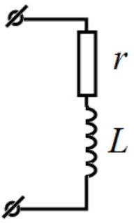

## SOLUTIONS TO THE PROBLEMS OF THE THEORETICAL COMPETITION   Attention. Points in grading are not divided!   Problem 1 (10.0 points)   Problem 1A (4.0 points)

Since the thread is inextensible and under stress, then the speed of the puck is always perpendicular to the thread. Therefore, the tension force of the thread does not perform any work on the puck and its speed remains constant by modulus

$$
\begin{equation*}
v = \text { const. } \tag{1}
\end{equation*}
$$

The puck moves along its trajectory with the curvature radius equal to the length $l$ of the unwound thread, therefore, the condition for the thread to be torn up is found from Newton's second law as

$$
\begin{equation*}
T = m \frac { v ^ { 2 } } { l } . \tag{2}
\end{equation*}
$$

The length of the thread changes as a result of winding on the cylinder according to

$$
\begin{equation*}
d l = - R d \alpha , \tag{3}
\end{equation*}
$$

where

$$
\begin{equation*}
d \alpha = \omega d t , \tag{4}
\end{equation*}
$$

and the angular velocity of the thread rotation is obtained as follows

$$
\begin{equation*}
\omega = \frac { v } { l } . \tag{5}
\end{equation*}
$$

It follows from equations (3)-(5) that

$$
\begin{equation*}
l d l = - R v d t , \tag{6}
\end{equation*}
$$

and its integration entails

$$
\begin{equation*}
l ^ { 2 } - l _ { 0 } ^ { 2 } = - 2 R v t . \tag{7}
\end{equation*}
$$

Substituting formula (1) into (7), the time moment sought is finally found as

$$
\begin{equation*}
t = \frac { l _ { 0 } ^ { 2 } - \left( \frac { m v ^ { 2 } } { T } \right) ^ { 2 } } { 2 R v } = \frac { l _ { 0 } ^ { 2 } T ^ { 2 } - m ^ { 2 } v ^ { 4 } } { 2 R v T ^ { 2 } } . \tag{8}
\end{equation*}
$$

| Content | Points |
| :--- | :--- |
| The puck speed remains unchanged | 1 |
| $T = m \frac { v ^ { 2 } } { l }$ | 0.5 |
| ldl = -Rvdt | 1 |
| $l ^ { 2 } - l _ { 0 } ^ { 2 } = - 2 R v t$ | 0.5 |
| $t = \frac { l _ { 0 } ^ { 2 } T ^ { 2 } - m ^ { 2 } v ^ { 4 } } { 2 R v T ^ { 2 } }$ | 1 |
| Total | 4.0 |

## Problem 1B (3.0 points)

Possible solution. The power of the heat transfer from the body to the air is proportional to the difference between the body $T$ and the air $T _ { x }$ temperatures with the factor $\alpha$, i.e.

$$
\begin{equation*}
P = \alpha \left( T - T _ { x } \right) , \tag{1}
\end{equation*}
$$

as a result, the body with the heat capacity $C$ cools down by the temperature $d T$ over time period $d t$, which obeys the heat balance equation

$$
\begin{equation*}
C d T = - P d t . \tag{2}
\end{equation*}
$$

Equations (1) and (2) with the initial condition $T = T _ { 0 }$ have a solution

$$
\begin{equation*}
T ( t ) = T _ { x } + \left( T _ { 0 } - T _ { x } \right) e ^ { - \beta t } , \tag{3}
\end{equation*}
$$

where $\beta = \alpha / C$ is a constant.

Let the body be cooled from the temperature $T _ { 0 }$ to the temperature $T _ { 1 }$ for a certain time interval, then it follows from (3) that

$$
\begin{equation*}
\left( T _ { 1 } - T _ { 0 } \right) = \gamma \left( T _ { 0 } - T _ { x } \right) , \tag{4}
\end{equation*}
$$

where $\gamma$ is a constant.
Over the following same time interval, this difference will also change in $\gamma$ times

$$
\begin{equation*}
\left( T _ { 2 } - T _ { 1 } \right) = \gamma \left( T _ { 1 } - T _ { x } \right) . \tag{5}
\end{equation*}
$$

Equations (4) and (5) result in the relation

$$
\begin{equation*}
\frac { \left( T _ { 0 } - T _ { \chi } \right) } { \left( T _ { 1 } - T _ { 0 } \right) } = \frac { \left( T _ { 1 } - T _ { \chi } \right) } { \left( T _ { 2 } - T _ { 0 } \right) } , \tag{6}
\end{equation*}
$$

which has the following solution

$$
\begin{equation*}
T _ { x } = \frac { T _ { 0 } T _ { 2 } - T _ { 1 } ^ { 2 } } { \left( T _ { 0 } + T _ { 2 } \right) - 2 T _ { 1 } } . \tag{7}
\end{equation*}
$$

It is obtained from the graph provided: the initial temperature $T _ { 0 } = 373 \mathrm {~K}$, in 10 minutes the temperature is equal to $T _ { 1 } = 337 K$, and in 20 minutes it reaches the value of $T _ { 2 } = 319 K$. Substituting these data into equation (7), the air temperature is finally calculated as

$$
\begin{equation*}
T _ { x } = 301 \mathrm {~K} = 28 ^ { \circ } \mathrm { C } . \tag{8}
\end{equation*}
$$

| Content | Points |
| :--- | :--- |
| Correct method for determining the air temperature | 1.5 |
| The air temperature lies in the interval $T _ { x } = 27.5 - 28.5 ^ { \circ } \mathrm { C }$ | 1.5 |
| The air temperature lies in the interval $T _ { x } = 27.0 - 29.0 ^ { \circ } \mathrm { C }$ | (1.0) |
| The air temperature lies in the interval $T _ { x } = 26.5 - 29.5 ^ { \circ } \mathrm { C }$ | (0.5) |
| Out of the above intervals | 0 |
| Total | 3.0 |

## Problem 1C (3.0 points)

Let $R$ be the active component of the load (the real part of the impedance), and $X$ be the reactive component of the entire circuit (the imaginary part of the total impedance). Then the current amplitude is found as

$$
I = \frac { U } { \sqrt { ( r + R ) ^ { 2 } + X ^ { 2 } } } .
$$

The average thermal power in the load reads as

$$
P = \frac { 1 } { 2 } I ^ { 2 } R = \frac { U ^ { 2 } R } { 2 \left[ ( r + R ) ^ { 2 } + X ^ { 2 } \right] } .
$$

It is seen that the maximum power is achieved at $X = 0$, i.e. there should be no phase shift in the circuit. The remaining expression has a maximum at $R = r$.

The phase shift would be zero if a coil was connected in series with the capacitor such that $\frac { 1 } { \omega C } = \omega L$, and, thus, $L = \frac { 1 } { \omega ^ { 2 } C } = 1.00 \cdot 10 ^ { - 2 } H n$.

It turns out that the simplest load must consist of the resistor with the resistance of 2019 Ohms and the coil with the inductance of $1.00 \cdot 10 ^ { - 2 } \mathrm { Hn }$.

The maximum power is obtained as

$$
P _ { \max } = \frac { 1 } { 2 } \frac { U ^ { 2 } } { 4 r } = \frac { U ^ { 2 } } { 8 r } = 13.9 \mathrm {~mW} .
$$

| Content | Points |
| :--- | :--- |
| The phase shift is zero | 1 |

| Without justification | $( 0,5 )$ |
| :--- | :--- |
| The inductance of the coil $L = \frac { 1 } { \omega ^ { 2 } C }$ | 0,7 |
| Correct numerical value $L = 10 ^ { - 2 } \mathrm { Hn }$ | 0,3 |
| Maximum power at $R = r$ | 0,5 |
| The maximum power itself $P _ { \text {max } } = \frac { U ^ { 2 } } { 8 r }$ | 0,3 |
| Correct numerical value $P _ { \text {max } } = 14 \mathrm {~mW}$ | 0,2 |
| Total | 3,0 |

## Problem 2. Conductors in an electric field ( $\mathbf { 1 0 , 0 }$ points)   Conductive ball and point charge

2.1 The electric potential of the point-like charge $q$ is equal to

$$
\begin{equation*}
\varphi _ { 1 } = \frac { q } { 4 \pi \varepsilon _ { 0 } \sqrt { ( l - x ) ^ { 2 } + y ^ { 2 } } } , \tag{1}
\end{equation*}
$$

whereas the electric potential of the fictitious point-like charge $Q$ is found to be

$$
\begin{equation*}
\varphi _ { 2 } = \frac { Q } { 4 \pi \varepsilon _ { 0 } \sqrt { ( x - a ) ^ { 2 } + y ^ { 2 } } } . \tag{2}
\end{equation*}
$$

According to the principle of superposition, the full potential is just a sum of equations (1) and (2)

$$
\begin{equation*}
\varphi = \varphi _ { 1 } + \varphi _ { 2 } = \frac { q } { 4 \pi \varepsilon _ { 0 } \sqrt { ( l - x ) ^ { 2 } + y ^ { 2 } } } + \frac { Q } { 4 \pi \varepsilon _ { 0 } \sqrt { ( x - a ) ^ { 2 } + y ^ { 2 } } } . \tag{3}
\end{equation*}
$$

2.2 The equation of the circle corresponding to the surface of the ball is written as

$$
\begin{equation*}
x ^ { 2 } + y ^ { 2 } = R ^ { 2 } . \tag{4}
\end{equation*}
$$

Eliminating $y$ with the help of relation (4) and substituting it into formula (3) yield

$$
\begin{equation*}
\varphi = \frac { q } { 4 \pi \varepsilon _ { 0 } \sqrt { l ^ { 2 } - 2 l x + R ^ { 2 } } } + \frac { Q } { 4 \pi \varepsilon _ { 0 } \sqrt { a ^ { 2 } - 2 a x + R ^ { 2 } } } . \tag{5}
\end{equation*}
$$

2.3 The potential of the ball is zero, since it is grounded, i.e.

$$
\begin{equation*}
\varphi = 0 . \tag{6}
\end{equation*}
$$

Equating expression (5) to zero, it can be rewritten in the form

$$
\begin{equation*}
\frac { Q } { q } = - \frac { \sqrt { a ^ { 2 } - 2 a x + R ^ { 2 } } } { \sqrt { l ^ { 2 } - 2 l x + R ^ { 2 } } } = \beta = \text { const } < 0 . \tag{7}
\end{equation*}
$$

Raising equation (7) in the square, one gets the following equation

$$
\begin{equation*}
2 x \left( l \beta ^ { 2 } - a \right) + a ^ { 2 } + R ^ { 2 } - \beta ^ { 2 } \left( l ^ { 2 } + R ^ { 2 } \right) = 0 . \tag{8}
\end{equation*}
$$

Equation (8) should be satisfied for all $x \in ( - R , R )$, and this is possible only if the coefficient at the linear term $x$ and the free term are separately equal to zero, i.e.

$$
\begin{align*}
& l \beta ^ { 2 } - a = 0 ,  \tag{9}\\
& a ^ { 2 } + R ^ { 2 } - \beta ^ { 2 } \left( l ^ { 2 } + R ^ { 2 } \right) = 0 . \tag{10}
\end{align*}
$$

Solving the set of equations (9) and (10), the following two solutions are obtained

$$
\begin{align*}
& a = l , \quad \beta = - 1 ,  \tag{11}\\
& a = \frac { R ^ { 2 } } { l } , \quad \beta = - \frac { R } { l } . \tag{12}
\end{align*}
$$

Only solution (12) is nonzero, so we finally get

$$
\begin{align*}
& Q = - q \frac { R } { l } ,  \tag{13}\\
& a = \frac { R ^ { 2 } } { l } . \tag{14}
\end{align*}
$$

2.4 The force acting on the point-like charge reads as

$$
\begin{equation*}
F = \frac { q ^ { 2 } R l } { 4 \pi \varepsilon _ { 0 } \left( l ^ { 2 } - R ^ { 2 } \right) ^ { 2 } } , \tag{15}
\end{equation*}
$$

and, therefore, the work sought is found by integrating as

$$
\begin{equation*}
A = \int _ { l } ^ { \infty } F d l = \frac { q ^ { 2 } R } { 8 \pi \varepsilon _ { 0 } \left( l ^ { 2 } - R ^ { 2 } \right) } . \tag{16}
\end{equation*}
$$

2.5 Let the point-like charge be slowly moved from the initial position to infinity such that the resulting current strength in the ball is negligibly small and the release of Joule heat can be omitted. Let $W _ { q }$ be the energy of the point-like charge $q , W _ { Q }$ be the sought interaction energy of induced

charges, $W _ { Q q }$ be the interaction energy of the point charge $q$ with the induced charges, which is simply obtained as

$$
\begin{equation*}
W _ { Q q } = - \frac { q ^ { 2 } R } { 4 \pi \varepsilon _ { 0 } \left( l ^ { 2 } - R ^ { 2 } \right) } . \tag{17}
\end{equation*}
$$

When the charge is removed to infinity, the law of energy conservation must be satisfied, which in this case has the form

$$
\begin{equation*}
W _ { q } + W _ { Q } + W _ { Q q } + A = W _ { q } . \tag{18}
\end{equation*}
$$

The set of equations (16)-(18) finally provides the following result

$$
\begin{equation*}
W _ { Q } = \frac { q ^ { 2 } R } { 8 \pi \varepsilon _ { 0 } \left( l ^ { 2 } - R ^ { 2 } \right) } . \tag{19}
\end{equation*}
$$

## Conductive ball in a uniform electric field

2.6 To find the electric field inside a uniformly charged ball, the Gauss theorem is written for a spherical volume of radius $r < R$. The charge inside this volume is easily derived as

$$
\begin{equation*}
q = \frac { 4 } { 3 } \pi r ^ { 3 } \rho , \tag{20}
\end{equation*}
$$

and the electric field flux is found to be

$$
\begin{equation*}
\Phi _ { E } = 4 \pi r ^ { 2 } E . \tag{21}
\end{equation*}
$$

According to the Gauss theorem

$$
\begin{equation*}
\Phi _ { E } = \frac { q } { \varepsilon _ { 0 } } , \tag{22}
\end{equation*}
$$

which ultimately entails

$$
\begin{equation*}
\vec { E } = \frac { \rho } { 3 \varepsilon _ { 0 } } \vec { r } . \tag{23}
\end{equation*}
$$

The last expression takes into account that the electric field strength vector is collinear to the vector $\vec { r }$.
2.7 Now consider the two fictitious balls with the bulk charge densities of opposite signs and evaluate the electric field in the domain of their intersection. Take an arbitrary point inside this domain and draw the radii of the vectors from the centers of the balls, denoting them $\overrightarrow { r _ { + } }$and $\overrightarrow { r _ { - } }$, respectively. Then, applying formula (23) for each ball results in

$$
\begin{align*}
& \overrightarrow { E _ { + } } = \frac { \rho } { 3 \varepsilon _ { 0 } } \overrightarrow { r _ { + } } ,  \tag{24}\\
& \overrightarrow { E _ { - } } = - \frac { \rho } { 3 \varepsilon _ { 0 } } \overrightarrow { r _ { - } } . \tag{25}
\end{align*}
$$

The net electric field is found with the help of the superposition principle as

$$
\begin{equation*}
\vec { E } = \frac { \rho } { 3 \varepsilon _ { 0 } } \left( \overrightarrow { r _ { + } } - \overrightarrow { r _ { - } } \right) = \frac { \rho } { 3 \varepsilon _ { 0 } } \vec { a } , \tag{26}
\end{equation*}
$$

where $\vec { a }$ stands for the vector, drawn from the center of the negatively charged ball to the center of the positively charged ball.
2.8 The field strength inside the conducting ball must be zero. The induced charges create, according to formula (26), a uniform electric field, which must completely compensate for the external electric field, whence we obtain that

$$
\begin{equation*}
\rho a = 3 \varepsilon _ { 0 } E _ { 0 } . \tag{27}
\end{equation*}
$$

The charges of the fictitious balls are fully compensated with the exception of a thin layer near their surfaces, which can be considered a surface charge. The layer thickness $\delta$ depends on the angle $\theta$ and, due to the smallness of $a$, is equal to

$$
\begin{equation*}
\delta = a \cos \theta . \tag{28}
\end{equation*}
$$

Hence, the magnitude of the surface charge near the angle $\theta$ is equal to

$$
\begin{equation*}
\sigma = \frac { \rho V } { S } = \frac { \rho S \delta } { S } = \rho \delta . \tag{29}
\end{equation*}
$$

It immediately follows from equations (27)-(29) that

$$
\begin{equation*}
\sigma = 3 \varepsilon _ { 0 } E _ { 0 } \cos \theta . \tag{30}
\end{equation*}
$$

2.9 Consider a thin cylinder near the surface of the conductor and apply the Gauss theorem to it. Since the field inside the conductor is absent, and is directed normally just outside of it, then according to the Gauss theorem

$$
\begin{equation*}
E S = \frac { \sigma S } { \varepsilon _ { 0 } } \tag{31}
\end{equation*}
$$

which yields

$$
\begin{equation*}
E = 3 E _ { 0 } \cos \theta . \tag{32}
\end{equation*}
$$

## Conductive ball and charged ring

2.10 The conducting ball is very small, so that the electric field of the ring $E$ in its vicinity can be considered almost uniform. It has been shown in the previous part of this problem that its polarization can be represented as two fictitious balls of opposite charge. These two balls behave in an external field as a dipole with the moment

$$
\begin{equation*}
\vec { p } = q \vec { a } , \tag{33}
\end{equation*}
$$

where

$$
\begin{equation*}
q = \rho \frac { 4 } { 3 } \pi r ^ { 3 } . \tag{34}
\end{equation*}
$$

Using (27), formulas (33) and (34) produce

$$
\begin{equation*}
\vec { p } = 4 \pi r ^ { 3 } \varepsilon _ { 0 } \vec { E } , \tag{35}
\end{equation*}
$$

Let us evaluate the electric field of the ring $E$ in the vicinity of the ball as a function of its distance $z$ to the center. Obviously, the ring field is directed along the needle. Dividing the ring into small parts that carry an electric charge $\Delta q _ { i }$ the projection of their field on the direction of the needle has the form

$$
\begin{equation*}
\Delta E _ { Z } = \frac { \Delta q _ { i } \cos \alpha } { 4 \pi \varepsilon _ { 0 } \left( z ^ { 2 } + R ^ { 2 } \right) ^ { 2 } } . \tag{36}
\end{equation*}
$$

Taking into account

$$
\begin{equation*}
\cos \alpha = \frac { z } { \left( z ^ { 2 } + R ^ { 2 } \right) ^ { 1 / 2 } } \tag{37}
\end{equation*}
$$

and summing over all elements of the ring, one gets

$$
\begin{equation*}
E ( z ) = \frac { q z } { 4 \pi \varepsilon _ { 0 } \left( z ^ { 2 } + R ^ { 2 } \right) ^ { 3 / 2 } } . \tag{38}
\end{equation*}
$$

The force acting on the dipole is obtained as

$$
\begin{equation*}
F = q E ( z + a ) - q E ( z ) = q a \frac { d E } { d z } = p \frac { d E } { d z } . \tag{39}
\end{equation*}
$$

Substituting formulas (35) and (38) into (39) gives rise to

$$
\begin{equation*}
F = \frac { q ^ { 2 } r ^ { 3 } z \left( R ^ { 2 } - 2 z ^ { 2 } \right) } { 4 \pi \varepsilon _ { 0 } \left( z ^ { 2 } + R ^ { 2 } \right) ^ { 4 } } . \tag{40}
\end{equation*}
$$

It follows from expression (40) that there are three equilibrium positions, which are determined by the points

$$
\begin{align*}
& z _ { 1 } = 0  \tag{41}\\
& z _ { 2,3 } = \pm \frac { R } { \sqrt { 2 } } . \tag{42}
\end{align*}
$$

A simple analysis proves that the equilibrium position (41) is unstable, and the symmetric positions (42) are both stable.

Near the position of the stable equilibrium, expression (40) for the force simplifies to

$$
\begin{equation*}
F = - \frac { 8 q ^ { 2 } r ^ { 3 } x } { 81 \pi \varepsilon _ { 0 } R ^ { 6 } } , \tag{43}
\end{equation*}
$$

where

$$
\begin{equation*}
x = z - \frac { R } { \sqrt { 2 } } \ll R . \tag{44}
\end{equation*}
$$

Newton's equation for the motion of the ball along the needle at small deviations $x$ has the form

$$
\begin{equation*}
m \ddot { x } + \frac { 8 q ^ { 2 } r ^ { 3 } } { 81 \pi \varepsilon _ { 0 } R ^ { 6 } } x = 0 , \tag{45}
\end{equation*}
$$

which is a harmonic equation with the frequency

$$
\begin{equation*}
\omega = \sqrt { \frac { 8 q ^ { 2 } r ^ { 3 } } { 81 \pi \varepsilon _ { 0 } m R ^ { 6 } } } . \tag{46}
\end{equation*}
$$

2.11 There is no need to integrate formula (40). In the initial position, the conducting ball is not polarized and in the final state it is also not polarized, since at zero and at infinity separations the

electric field of the ring vanishes. Therefore, it is immediately inferred from the law of energy conservation that

$$
\begin{equation*}
A = 0 . \tag{47}
\end{equation*}
$$

It is natural that integrating expression (40) from zero to infinity gives the same answer.

| Part | Content | Points |  |
| :--- | :--- | :--- | :--- |
| 2.1 | Formula (1) $\varphi _ { 1 } = \frac { q } { 4 \pi \varepsilon _ { 0 } \sqrt { ( l - x ) ^ { 2 } + y ^ { 2 } } }$ | 0,2 | 0,6 |
|  | Formula (2) $\varphi _ { 2 } = \frac { Q } { 4 \pi \varepsilon _ { 0 } \sqrt { ( x - a ) ^ { 2 } + y ^ { 2 } } }$ | 0,2 |  |
|  | Formula (3) $\varphi = \varphi _ { 1 } + \varphi _ { 2 } = \frac { q } { 4 \pi \varepsilon _ { 0 } \sqrt { ( l - x ) ^ { 2 } + y ^ { 2 } } } + \frac { Q } { 4 \pi \varepsilon _ { 0 } \sqrt { ( x - a ) ^ { 2 } + y ^ { 2 } } }$ | 0,2 |  |
| 2.2 | Formula (4) $x ^ { 2 } + y ^ { 2 } = R ^ { 2 }$ | 0,2 | 0,4 |
|  | Formula (5) $\varphi = \frac { q } { 4 \pi \varepsilon _ { 0 } \sqrt { l ^ { 2 } - 2 l x + R ^ { 2 } } } + \frac { Q } { 4 \pi \varepsilon _ { 0 } \sqrt { a ^ { 2 } - 2 a x + R ^ { 2 } } }$ | 0,2 |  |
| 2.3 | Formula (6) $\varphi = 0$ | 0,2 | 1,8 |
|  | Formula (7) $\frac { Q } { q } = - \frac { \sqrt { a ^ { 2 } - 2 a x + R ^ { 2 } } } { \sqrt { l ^ { 2 } - 2 l x + R ^ { 2 } } } = \beta =$ const $< 0$ | 0,2 |  |
|  | Formula (8) $2 x \left( l \beta ^ { 2 } - a \right) + a ^ { 2 } + R ^ { 2 } - \beta ^ { 2 } \left( l ^ { 2 } + R ^ { 2 } \right) = 0$ | 0,2 |  |
|  | Formula (9) $l \beta ^ { 2 } - a = 0$ | 0,2 |  |
|  | Formula (10) $a ^ { 2 } + R ^ { 2 } - \beta ^ { 2 } \left( l ^ { 2 } + R ^ { 2 } \right) = 0$ | 0,2 |  |
|  | Formula (11) $a = l , \quad \beta = - 1$ | 0,2 |  |
|  | Formula (12) $a = \frac { R ^ { 2 } } { l } , \quad \beta = - \frac { R } { l }$ | 0,2 |  |
|  | Formula (13) $Q = - q \frac { R } { l }$ | 0,2 |  |
|  | Formula (14) $a = \frac { R ^ { 2 } } { l }$ | 0,2 |  |
| 2.4 | Formula (15) $F = \frac { q ^ { 2 } R l } { 4 \pi \varepsilon _ { 0 } \left( l ^ { 2 } - R ^ { 2 } \right) ^ { 2 } }$ | 0,2 | 0,4 |
|  | Formula (16) $A = \int _ { l } ^ { \infty } F d l = \frac { q ^ { 2 } R } { 8 \pi \varepsilon _ { 0 } \left( l ^ { 2 } - R ^ { 2 } \right) }$ | 0,2 |  |
| 2.5 | Formula (17) $W _ { Q q } = - \frac { q ^ { 2 } R } { 4 \pi \varepsilon _ { 0 } \left( l ^ { 2 } - R ^ { 2 } \right) }$ | 0,2 | 0,6 |
|  | Formula (18) $W _ { q } + W _ { Q } + W _ { Q q } + A = W _ { q }$ | 0,1 |  |
|  | Formula (19) $W _ { Q } = \frac { q ^ { 2 } R } { 8 \pi \varepsilon _ { 0 } \left( l ^ { 2 } - R ^ { 2 } \right) }$ | 0,3 |  |
| 2.6 | Formula (20) $q = \frac { 4 } { 3 } \pi r ^ { 3 } \rho$ | 0,1 | 0,4 |
|  | Formula (21) $\Phi _ { E } = 4 \pi r ^ { 2 } E$ | 0,1 |  |
|  | Formula (22) $\Phi _ { E } = \frac { q } { \varepsilon _ { 0 } }$ | 0,1 |  |
|  | Formula (23) $\vec { E } = \frac { \rho } { 3 \varepsilon _ { 0 } } \vec { r }$ | 0,1 |  |
| 2.7 | Formula (24) $\overrightarrow { E _ { + } } = \frac { \rho } { 3 \varepsilon _ { 0 } } \overrightarrow { r _ { + } }$ | 0,1 | 0,4 |
|  | Formula (25) $\overrightarrow { E _ { - } } = - \frac { \rho } { 3 \varepsilon _ { 0 } } \overrightarrow { r _ { - } }$ | 0,1 |  |
|  | Formula (26) $\vec { E } = \frac { \rho } { 3 \varepsilon _ { 0 } } \left( \overrightarrow { r _ { + } } - \overrightarrow { r _ { - } } \right) = \frac { \rho } { 3 \varepsilon _ { 0 } } \vec { a }$ | 0,2 |  |
| 2.8 | Formula (27) $\rho a = 3 \varepsilon _ { 0 } E _ { 0 }$ | 0,2 | 0,8 |
|  | Formula (28) $\delta = a \cos \theta$ | 0,2 |  |
|  | Formula (29) $\sigma = \frac { \rho V } { S } = \frac { \rho S \delta } { S } = \rho \delta$ | 0,2 |  |
|  | Formula (30) $\sigma = 3 \varepsilon _ { 0 } E _ { 0 } \cos \theta$ | 0,2 |  |
| 2.9 | Formula (31) $E S = \frac { \sigma S } { \varepsilon _ { 0 } }$ | 0,2 | 0,4 |

|  | Formula (32) $E = 3 E _ { 0 } \cos \theta$ | 0,2 |  |
| :--- | :--- | :--- | :--- |
| 2.10 | Formula (33) $\vec { p } = q \vec { a }$ | 0,4 | 3,8 |
|  | Formula (34) $q = \rho \frac { 4 } { 3 } \pi r ^ { 3 }$ | 0,2 |  |
|  | Formula (35) $\vec { p } = 4 \pi r ^ { 3 } \varepsilon _ { 0 } \vec { E }$ | 0,4 |  |
|  | Formula (36) $\Delta E _ { Z } = \frac { \Delta q _ { i } \cos \alpha } { 4 \pi \varepsilon _ { 0 } \left( Z ^ { 2 } + R ^ { 2 } \right) ^ { 2 } }$ | 0,2 |  |
|  | Formula (37) $\cos \alpha = \frac { z } { \left( z ^ { 2 } + R ^ { 2 } \right) ^ { 1 / 2 } }$ | 0,2 |  |
|  | Formula (38) $E ( z ) = \frac { q z } { 4 \pi \varepsilon _ { 0 } \left( z ^ { 2 } + R ^ { 2 } \right) ^ { 3 / 2 } }$ | 0,4 |  |
|  | Formula (39) $F = q E ( z + a ) - q E ( z ) = q a \frac { d E } { d z } = p \frac { d E } { d z }$ | 0,4 |  |
|  | Formula (40) $F = \frac { q ^ { 2 } r ^ { 3 } z \left( R ^ { 2 } - 2 z ^ { 2 } \right) } { 4 \pi \varepsilon _ { 0 } \left( z ^ { 2 } + R ^ { 2 } \right) ^ { 4 } }$ | 0,2 |  |
|  | Formula (41) $z _ { 1 } = 0$ | 0,2 |  |
|  | Formula (42) $z _ { 2,3 } = \pm \frac { R } { \sqrt { 2 } }$ | 0,2 |  |
|  | Formula (43) $F = - \frac { 8 q ^ { 2 } r ^ { 3 } x } { 81 \pi \varepsilon _ { 0 } R ^ { 6 } }$ | 0,4 |  |
|  | Formula (44) $x = z - \frac { R } { \sqrt { 2 } } \ll R$. | 0,2 |  |
|  | Formula (45) $\ddot { x } + \frac { 8 q ^ { 2 } r ^ { 3 } } { 81 \pi \varepsilon _ { 0 } R ^ { 6 } } x = 0$ | 0,2 |  |
|  | Formula (46) $\omega = \sqrt { \frac { 8 q ^ { 2 } r ^ { 3 } } { 81 \pi \varepsilon _ { 0 } m R ^ { 6 } } }$ | 0,2 |  |
| 2.11 | Formula (47) $A = 0$ | 0.4 | 0,4 |
|  | Formal integral of formula (40) without the correct answer | (0.1) |  |
| Total |  |  | 10,0 |

## Problem 3. Laser (10.0 points)   Population inversion: two-level system

3.1 The figure on the right shows a diagram of possible transitions and their probabilities. If the population of the excited state is equal to $n _ { 1 }$, then the population of the ground state is equal to $\left( 1 - n _ { 1 } \right)$, since the molecule can only be in one of two states.

The balance equation describing the change in the population directly follows from the drawn diagram as

$$
\begin{equation*}
\frac { d n _ { 1 } } { d t } = - \frac { 1 } { \tau } n _ { 1 } - I _ { 0 } \sigma n _ { 1 } + I _ { 0 } \sigma \left( 1 - n _ { 1 } \right) . \tag{1}
\end{equation*}
$$

3.2 In the stationary mode $d n _ { 1 } / d t = 0$, then it follows from equation (1) that the population of the excited state is given by the formula

$$
\begin{equation*}
\bar { n } _ { 1 } = \frac { I _ { 0 } \sigma \tau } { 1 + 2 I _ { 0 } \sigma \tau } . \tag{2}
\end{equation*}
$$

Accordingly, the difference in the populations of the excited and ground states is equal to

$$
\begin{equation*}
\Delta \bar { n } = \bar { n } _ { 1 } - \left( 1 - \bar { n } _ { 1 } \right) = 2 \frac { I _ { 0 } \sigma \tau } { 1 + 2 I _ { 0 } \sigma \tau } - 1 = - \frac { 1 } { 1 + 2 I _ { 0 } \sigma \tau } . \tag{3}
\end{equation*}
$$

3.3 Even with the intensity of the pumping light flux tending to infinity, the population inversion in the two-level system cannot be achieved, therefore, the laser light flux cannot be amplified in this system.

## Population inversion: three-level system

3.4 In this system, there are no forced transitions "down", so the balance equation for the population of state 2 is written as:

$$
\begin{equation*}
\frac { d n _ { 2 } } { d t } = - \frac { n _ { 2 } } { \tau } + I _ { 0 } \sigma \left( 1 - n _ { 2 } \right) . \tag{4}
\end{equation*}
$$

Here, it is taken into account that the molecule can only be in two states: the excited state 2 , or the ground state 0 .
3.5 In the stationary mode $d n _ { 2 } / d t = 0$, therefore, as it follows from equation (4),

the population of the excited state is derived as

$$
\begin{equation*}
\bar { n } _ { 2 } = \frac { I _ { 0 } \sigma } { \frac { 1 } { \tau } + I _ { 0 } \sigma } = \frac { I _ { 0 } \sigma \tau } { 1 + I _ { 0 } \sigma \tau } . \tag{5}
\end{equation*}
$$

The difference between the populations of the excited and ground states is found by the formula

$$
\begin{equation*}
\Delta n = \bar { n } _ { 2 } - \bar { n } _ { 0 } = \bar { n } _ { 2 } - \left( 1 - \bar { n } _ { 2 } \right) = \frac { I _ { 0 } \sigma \tau - 1 } { 1 + I _ { 0 } \sigma \tau } . \tag{6}
\end{equation*}
$$

3.6 Laser light amplification is possible when the population inversion is reached, i.e. $\Delta n > 0$. It follows from formula (6) that this is possible when

$$
\begin{equation*}
I _ { 0 } \sigma \tau > 1 . \tag{7}
\end{equation*}
$$

## Population inversion: four-level system

3.7 In the four-level system, the balance equation for the population of state 2 coincides with equation (4), and the stationary value of the population of this state is also described by formula (5). The essential difference of this system is that from state 2 the transition is undertaken to intermediate state 3, whose population is practically equal to 0. Therefore, in this system the population difference is equal to

$$
\begin{equation*}
\Delta n = \bar { n } _ { 2 } = \frac { I _ { 0 } \sigma \tau } { 1 + I _ { 0 } \sigma \tau } , \tag{8}
\end{equation*}
$$

and the population inversion between states 2 and 3 is achieved with practically arbitrary value of the parameter

$$
\begin{equation*}
I _ { 0 } \sigma \tau > 0 . \tag{9}
\end{equation*}
$$

## Resonator

3.8 The change in the number $d N$ of photons in the resonator is due only to their output through the translucent mirror. For a short period of time $d t$, the number of photons that leave the resonator through the mirror is found to be

$$
\begin{equation*}
d N _ { \text {out } } = ( 1 - \rho ) I _ { G } S d t = - d N . \tag{10}
\end{equation*}
$$

where $S$ stands for the cross section area of the resonator.
The intensity of the laser light flux $I _ { G }$ can be expressed in terms of the average density of photons $\frac { N } { S l }$ in the resonator and the speed of their propagation $\frac { c } { r }$ in the form

$$
\begin{equation*}
I _ { G } = \frac { 1 } { 2 } \frac { N } { S l } \frac { c } { r } . \tag{11}
\end{equation*}
$$

The factor 1/2 takes into account that the laser light in the resonator propagates in two opposite directions. Expressing the number of photons in the resonator through the intensity of the generation flux

$$
\begin{equation*}
N = \frac { 2 r S l } { c } I _ { G } \tag{12}
\end{equation*}
$$

and substituting it into equation (10), one gets

$$
\begin{equation*}
d I _ { G } = - \frac { C } { 2 r S l } ( 1 - \rho ) I _ { G } S d t = - ( 1 - \rho ) \frac { C } { 2 r l } I _ { G } d t \tag{13}
\end{equation*}
$$

This equation has the required form

$$
\begin{equation*}
\frac { d I _ { G } } { d t } = - \frac { c ( 1 - \rho ) } { 2 r l } I _ { G } = - \frac { 1 } { T } I _ { G } , \tag{14}
\end{equation*}
$$

where the photon lifetime in the resonator is determined by the formula

$$
\begin{equation*}
T = \frac { 2 r l } { c ( 1 - \rho ) } = 3,00 \cdot 10 ^ { - 9 } s . \tag{15}
\end{equation*}
$$

3.9 Consider the change in the number of photons in the presence of the stimulated emission and the absence of losses through the mirror. In accordance with the definition of the stimulated emission cross section, the number of generated photons can be described by the equation

$$
\begin{equation*}
d N = 2 I _ { G } \sigma _ { E } n \gamma V d t = 2 I _ { G } \sigma _ { E } n \gamma S l d t . \tag{16}
\end{equation*}
$$

Here $n \gamma V$ denotes the number of dye molecules in the resonator being in the excited state, and $V = S l$ is the resonator volume.

Substituting the expression for the number of photons in the resonator (12) into the last equation, the desired equation is finally obtained

$$
\begin{equation*}
\frac { d I _ { G } } { d t } = \frac { \gamma c \sigma _ { E } } { r } n I _ { G } = K n I _ { G } , \tag{17}
\end{equation*}
$$

with the resonator gain

$$
\begin{equation*}
K = \frac { \gamma C \sigma _ { E } } { r } = 5,72 \cdot 10 ^ { 10 } s ^ { - 1 } . \tag{18}
\end{equation*}
$$

## Stationary generation mode

3.10 To describe the dynamics of the intensity of the laser light flux, it is necessary to combine equations (14) and (17):

$$
\begin{equation*}
\frac { d I _ { G } } { d t } = K n I _ { G } - \frac { 1 } { T } I _ { G } . \tag{19}
\end{equation*}
$$

The population of the excited state is described by the balance equation

$$
\begin{equation*}
\frac { d n } { d t } = I _ { 0 } \sigma _ { A } ( 1 - n ) - \frac { 1 } { \tau } n - 2 I _ { G } \sigma _ { E } n , \tag{20}
\end{equation*}
$$

which takes into account the absorption of the pumping light flux, spontaneous and stimulated emissions from the excited state.
3.11 To initiate the laser light amplification, it is necessary that the derivative in equation (19) should be greater than zero, therefore the threshold value of the population of the excited state is equal to

$$
\begin{equation*}
n _ { t h } = \frac { 1 } { K T } = 5,83 \cdot 10 ^ { - 3 } \square 1 . \tag{21}
\end{equation*}
$$

3.12 To derive the threshold value of the intensity of the pumping light flux, we make use of equation (20) in the absence of the laser light flux $I _ { G } = 0$, whence we get

$$
\begin{equation*}
I _ { 0 , t h } = \frac { n _ { t h } } { \tau \sigma _ { A } \left( 1 - n _ { t h } \right) } \approx \frac { n _ { t h } } { \tau \sigma _ { A } } = 3,58 \cdot 10 ^ { 21 } \mathrm {~cm} ^ { - 2 } \cdot \mathrm {~s} ^ { - 1 } . \tag{22}
\end{equation*}
$$

To find the pumping energy flux, the calculated flux (22) must be multiplied by the energy of one quantum

$$
\begin{equation*}
\varepsilon = \frac { h c } { \lambda } = 3,83 \cdot 10 ^ { - 19 } \mathrm {~J} , \tag{23}
\end{equation*}
$$

therefore, the pumping energy intensity is obtained as

$$
\begin{equation*}
I _ { E } = \varepsilon I _ { 0 , t h } = 1,37 \cdot 10 ^ { 3 } \frac { \mathrm {~W} } { \mathrm {~cm} ^ { 2 } } . \tag{24}
\end{equation*}
$$

3.13 In the stationary mode, the time derivatives in equations (19) and (20) vanish. Equation (19) then yields

$$
\begin{equation*}
\bar { n } = \frac { 1 } { K T } , \tag{25}
\end{equation*}
$$

and it is found from equation (20) that

$$
\begin{equation*}
I _ { G } = \frac { I _ { 0 } \sigma _ { A } - \frac { 1 } { \tau } \bar { n } } { 2 \sigma _ { E } \bar { n } } . \tag{26}
\end{equation*}
$$

Expressing the intensity of the pumping light flux through its threshold value

$$
\begin{equation*}
I _ { 0 } = \eta I _ { 0 , t h } = \eta \frac { \bar { n } } { \tau \sigma _ { A } } \tag{27}
\end{equation*}
$$

and substituting it into formula (23), one obtains

$$
\begin{equation*}
I _ { G } = \frac { \eta \frac { \bar { n } } { \tau \sigma _ { A } } \sigma _ { A } - \frac { 1 } { \tau } \bar { n } } { 2 \sigma _ { E } \bar { n } } = \frac { \eta - 1 } { 2 \tau \sigma _ { E } } . \tag{28}
\end{equation*}
$$

At the output of the resonator, the laser light intensity is equal to

$$
\begin{equation*}
I = ( 1 - \rho ) I _ { G } = \frac { ( 1 - \rho ) } { 2 \tau \sigma _ { E } } ( \eta - 1 ) = E ( \eta - 1 ) , \tag{29}
\end{equation*}
$$

in which the constant factor is introduced as

$$
\begin{equation*}
E = \frac { 1 - \rho } { 2 \tau \sigma _ { E } } = 5,41 \cdot 10 ^ { 22 } \mathrm {~cm} ^ { - 2 } \cdot \mathrm {~s} ^ { - 1 } . \tag{30}
\end{equation*}
$$

The graph of relation (29) is a straight line, as shown in the figure below.

3.14 On the one hand, the number of light quanta absorbed in the resonator per unit time is calculated by the formula

$$
\begin{equation*}
N _ { A } = \eta I _ { 0 , t h } \sigma _ { A } \gamma S I . \tag{31}
\end{equation*}
$$

On the other hand, the number of quanta leaving the resonator per unit time is

$$
\begin{equation*}
N _ { E } = E ( \eta - 1 ) S . \tag{32}
\end{equation*}
$$

Thus, the quantum output turns out to be equal

$$
\begin{equation*}
f = \frac { N _ { E } } { N _ { A } } = \frac { E ( \eta - 1 ) } { \left( I _ { 0 } \right) _ { t r } \sigma _ { A } ( \gamma ) } . \tag{33}
\end{equation*}
$$

The substitution of all parameters included in this formula leads to the final result

$$
\begin{equation*}
f = \frac { \eta - 1 } { \eta } . \tag{34}
\end{equation*}
$$

| Part | Content | Points |  |
| :--- | :--- | :--- | :--- |
| 3.1 | Equation (1): $\frac { d n _ { 1 } } { d t } = - \frac { 1 } { \tau } n _ { 1 } - I _ { 0 } \sigma n _ { 1 } + I _ { 0 } \sigma \left( 1 - n _ { 1 } \right)$ | 0,3 | 0,3 |
| 3.2 | Formula (2): $\bar { n } _ { 1 } = \frac { I _ { 0 } \sigma \tau } { 1 + 2 I _ { 0 } \sigma \tau }$ | 0,2 | 0,3 |
|  | Formula (3): $\Delta \bar { n } = \bar { n } _ { 1 } - \left( 1 - \bar { n } _ { 1 } \right) = 2 \frac { I _ { 0 } \sigma \tau } { 1 + 2 I _ { 0 } \sigma \tau } - 1 = - \frac { 1 } { 1 + 2 I _ { 0 } \sigma \tau }$ | 0,1 |  |
| 3.3 | Answer: «no» | 0,2 | 0,2 |
| 3.4 | Equation (4): $\frac { d n _ { 2 } } { d t } = - \frac { n _ { 2 } } { \tau } + I _ { 0 } \sigma \left( 1 - n _ { 2 } \right)$ | 0,2 | 0,2 |
| 3.5 | Formula (5): $\bar { n } _ { 2 } = \frac { I _ { 0 } \sigma } { \frac { 1 } { \tau } + I _ { 0 } \sigma } = \frac { I _ { 0 } \sigma \tau } { 1 + I _ { 0 } \sigma \tau }$ | 0,1 | 0,2 |
|  | Formula (6): $\Delta n = \bar { n } _ { 2 } - \bar { n } _ { 0 } = \bar { n } _ { 2 } - \left( 1 - \bar { n } _ { 2 } \right) = \frac { I _ { 0 } \sigma \tau - 1 } { 1 + I _ { 0 } \sigma \tau }$ | 0,1 |  |
| 3.6 | Inequality (7): $I _ { 0 } \sigma \tau > 1$ | 0,3 | 0,3 |
| 3.7 | Formula (5) is again used | 0,1 | 0,5 |
|  | Formula (8): $\Delta n = \bar { n } _ { 2 } = \frac { I _ { 0 } \sigma \tau } { 1 + I _ { 0 } \sigma \tau }$ | 0,1 |  |
|  | Inequality (9): $I _ { 0 } \sigma \tau > 0$ | 0,3 |  |
| 3.8 | Formula (10): $d N _ { \text {out } } = ( 1 - \rho ) I _ { G } S d t = - d N$ | 0,3 | 1,5 |
|  | Formula (11): $I _ { G } = \frac { 1 } { 2 } \frac { N } { S l } \frac { c } { r }$ | 0,5 |  |
|  | Formula (15): $T = \frac { 2 r l } { c ( 1 - \rho ) }$ | 0,4 |  |
|  | Numerical value: $T = 3,00 \cdot 10 ^ { - 9 } s$ | 0,3 |  |
| 3.9 | Formula (16): $d N = 2 I _ { G } \sigma _ { E } n \gamma V d t = 2 I _ { G } \sigma _ { E } n \gamma S l d t$ | 0,6 | 1,5 |
|  | Formula (18): $K = \frac { \gamma C \sigma _ { E } } { r }$ | 0,5 |  |
|  | Numerical value: $K = 5,72 \cdot 10 ^ { 10 } \mathrm {~s} ^ { - 1 }$ | 0,4 |  |
| 3.10 | Equation (19): $\frac { d I _ { G } } { d t } = K n I _ { G } - \frac { 1 } { T } I _ { G }$ | 0,2 | 0,5 |
|  | Equation (20): $\frac { d n } { d t } = I _ { 0 } \sigma _ { A } ( 1 - n ) - \frac { 1 } { \tau } n - 2 I _ { G } \sigma _ { E } n$ | 0,3 |  |
| 3.11 | Derivative should be positive; | 0,1 | 0,5 |
|  | Formula (21): $n _ { t h } = \frac { 1 } { K T }$ | 0,2 |  |
|  | Numerical value: $n _ { t h } = 5,83 \cdot 10 ^ { - 3 }$ | 0,2 |  |
| 3.12 | The intensity of the laser light flux: $I _ { G } = 0$ | 0,1 | 1,0 |

|  | Formula (22): $I _ { 0 , t h } = \frac { n _ { t h } } { \tau \sigma _ { A } \left( 1 - n _ { t h } \right) } \approx \frac { n _ { t h } } { \tau \sigma _ { A } }$ | 0,3 |  |
| :--- | :--- | :--- | :--- |
|  | Formula (23): $\varepsilon = \frac { h c } { \lambda }$ | 0,1 |  |
|  | Formula (24): $I _ { E } = \varepsilon I _ { 0 , \text { th } }$ | 0,1 |  |
|  | Numerical value: $I _ { E } = 1,37 \cdot 10 ^ { 3 } \frac { \mathrm {~W} } { \mathrm {~cm} ^ { 2 } }$ | 0,1 |  |
| 3.13   3.13 | Derivatives turn zero | 0,1 | 2,0   2,0 |
|  | Formula (25): $\bar { n } = \frac { 1 } { K T }$ | 0,2 |  |
|  | Formula (26): $I _ { G } = \frac { I _ { 0 } \sigma _ { A } - \frac { 1 } { \tau } \bar { n } } { 2 \sigma _ { E } \bar { n } }$ | 0,2 |  |
|  | Formula (27): $I _ { 0 } = \eta I _ { 0 , \text { th } } = \eta \frac { \bar { n } } { \tau \sigma _ { A } }$ | 0,2 |  |
|  | Formula (28): $I _ { G } = \frac { \eta \frac { \bar { n } } { \tau \sigma _ { A } } \sigma _ { A } - \frac { 1 } { \tau } \bar { n } } { 2 \sigma _ { E } \bar { n } } = \frac { \eta - 1 } { 2 \tau \sigma _ { E } }$ | 0,3 |  |
|  | Formula (30): $E = \frac { 1 - \rho } { 2 \tau \sigma _ { E } }$ | 0,2 |  |
|  | Numerical value: $E = 5,41 \cdot 10 ^ { 22 } c M ^ { - 2 } \cdot c ^ { - 1 }$ | 0,3 |  |
|  | Drawing graph: axis are named and ticked | 0,1 |  |
|  | Drawing graph: straight line | 0,2 |  |
|  | Drawing graph: straight line passes through 1 | 0,2 |  |
| 3.14 | Formula (31): $N _ { A } = \eta I _ { 0 , t h } \sigma _ { A } \gamma S l$ | 0,4 | 1,0 |
|  | Formula (32): $N _ { E } = E ( \eta - 1 ) S$ | 0,3 |  |
|  | Formula (34): $f = \frac { \eta - 1 } { \eta }$ | 0,3 |  |
| Total |  |  | 10,0 |
