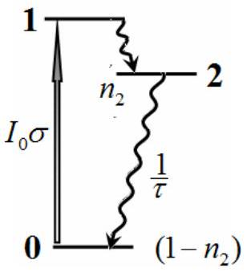
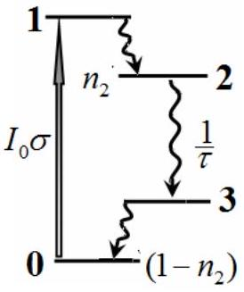
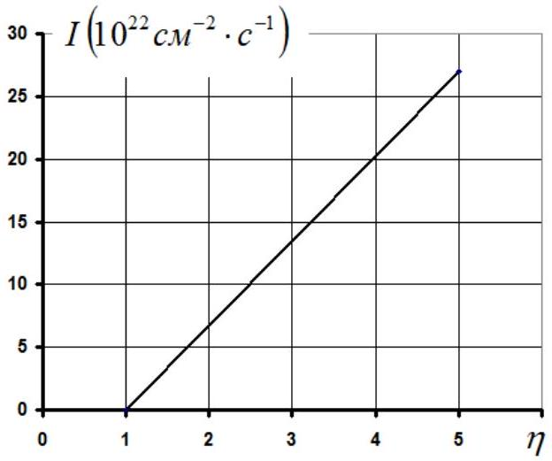

## Problem 3. Laser (10.0 points)   Population inversion: two-level system

3.1 The figure on the right shows a diagram of possible transitions and their probabilities. If the population of the excited state is equal to $n _ { 1 }$, then the population of the ground state is equal to $\left( 1 - n _ { 1 } \right)$, since the molecule can only be in one of two states.

The balance equation describing the change in the population directly follows from the drawn diagram as

$$
\begin{equation*}
\frac { d n _ { 1 } } { d t } = - \frac { 1 } { \tau } n _ { 1 } - I _ { 0 } \sigma n _ { 1 } + I _ { 0 } \sigma \left( 1 - n _ { 1 } \right) . \tag{1}
\end{equation*}
$$

3.2 In the stationary mode $d n _ { 1 } / d t = 0$, then it follows from equation (1) that the population of the excited state is given by the formula

$$
\begin{equation*}
\bar { n } _ { 1 } = \frac { I _ { 0 } \sigma \tau } { 1 + 2 I _ { 0 } \sigma \tau } . \tag{2}
\end{equation*}
$$

Accordingly, the difference in the populations of the excited and ground states is equal to

$$
\begin{equation*}
\Delta \bar { n } = \bar { n } _ { 1 } - \left( 1 - \bar { n } _ { 1 } \right) = 2 \frac { I _ { 0 } \sigma \tau } { 1 + 2 I _ { 0 } \sigma \tau } - 1 = - \frac { 1 } { 1 + 2 I _ { 0 } \sigma \tau } . \tag{3}
\end{equation*}
$$

3.3 Even with the intensity of the pumping light flux tending to infinity, the population inversion in the two-level system cannot be achieved, therefore, the laser light flux cannot be amplified in this system.

## Population inversion: three-level system

3.4 In this system, there are no forced transitions "down", so the balance equation for the population of state 2 is written as:

$$
\begin{equation*}
\frac { d n _ { 2 } } { d t } = - \frac { n _ { 2 } } { \tau } + I _ { 0 } \sigma \left( 1 - n _ { 2 } \right) . \tag{4}
\end{equation*}
$$

Here, it is taken into account that the molecule can only be in two states: the excited state 2 , or the ground state 0 .
3.5 In the stationary mode $d n _ { 2 } / d t = 0$, therefore, as it follows from equation (4),

the population of the excited state is derived as

$$
\begin{equation*}
\bar { n } _ { 2 } = \frac { I _ { 0 } \sigma } { \frac { 1 } { \tau } + I _ { 0 } \sigma } = \frac { I _ { 0 } \sigma \tau } { 1 + I _ { 0 } \sigma \tau } . \tag{5}
\end{equation*}
$$

The difference between the populations of the excited and ground states is found by the formula

$$
\begin{equation*}
\Delta n = \bar { n } _ { 2 } - \bar { n } _ { 0 } = \bar { n } _ { 2 } - \left( 1 - \bar { n } _ { 2 } \right) = \frac { I _ { 0 } \sigma \tau - 1 } { 1 + I _ { 0 } \sigma \tau } . \tag{6}
\end{equation*}
$$

3.6 Laser light amplification is possible when the population inversion is reached, i.e. $\Delta n > 0$. It follows from formula (6) that this is possible when

$$
\begin{equation*}
I _ { 0 } \sigma \tau > 1 . \tag{7}
\end{equation*}
$$

## Population inversion: four-level system

3.7 In the four-level system, the balance equation for the population of state 2 coincides with equation (4), and the stationary value of the population of this state is also described by formula (5). The essential difference of this system is that from state 2 the transition is undertaken to intermediate state 3, whose population is practically equal to 0. Therefore, in this system the population difference is equal to

$$
\begin{equation*}
\Delta n = \bar { n } _ { 2 } = \frac { I _ { 0 } \sigma \tau } { 1 + I _ { 0 } \sigma \tau } , \tag{8}
\end{equation*}
$$

and the population inversion between states 2 and 3 is achieved with practically arbitrary value of the parameter

$$
\begin{equation*}
I _ { 0 } \sigma \tau > 0 . \tag{9}
\end{equation*}
$$

## Resonator

3.8 The change in the number $d N$ of photons in the resonator is due only to their output through the translucent mirror. For a short period of time $d t$, the number of photons that leave the resonator through the mirror is found to be

$$
\begin{equation*}
d N _ { \text {out } } = ( 1 - \rho ) I _ { G } S d t = - d N . \tag{10}
\end{equation*}
$$

where $S$ stands for the cross section area of the resonator.
The intensity of the laser light flux $I _ { G }$ can be expressed in terms of the average density of photons $\frac { N } { S l }$ in the resonator and the speed of their propagation $\frac { c } { r }$ in the form

$$
\begin{equation*}
I _ { G } = \frac { 1 } { 2 } \frac { N } { S l } \frac { c } { r } . \tag{11}
\end{equation*}
$$

The factor 1/2 takes into account that the laser light in the resonator propagates in two opposite directions. Expressing the number of photons in the resonator through the intensity of the generation flux

$$
\begin{equation*}
N = \frac { 2 r S l } { c } I _ { G } \tag{12}
\end{equation*}
$$

and substituting it into equation (10), one gets

$$
\begin{equation*}
d I _ { G } = - \frac { C } { 2 r S l } ( 1 - \rho ) I _ { G } S d t = - ( 1 - \rho ) \frac { C } { 2 r l } I _ { G } d t \tag{13}
\end{equation*}
$$

This equation has the required form

$$
\begin{equation*}
\frac { d I _ { G } } { d t } = - \frac { c ( 1 - \rho ) } { 2 r l } I _ { G } = - \frac { 1 } { T } I _ { G } , \tag{14}
\end{equation*}
$$

where the photon lifetime in the resonator is determined by the formula

$$
\begin{equation*}
T = \frac { 2 r l } { c ( 1 - \rho ) } = 3,00 \cdot 10 ^ { - 9 } s . \tag{15}
\end{equation*}
$$

3.9 Consider the change in the number of photons in the presence of the stimulated emission and the absence of losses through the mirror. In accordance with the definition of the stimulated emission cross section, the number of generated photons can be described by the equation

$$
\begin{equation*}
d N = 2 I _ { G } \sigma _ { E } n \gamma V d t = 2 I _ { G } \sigma _ { E } n \gamma S l d t . \tag{16}
\end{equation*}
$$

Here $n \gamma V$ denotes the number of dye molecules in the resonator being in the excited state, and $V = S l$ is the resonator volume.

Substituting the expression for the number of photons in the resonator (12) into the last equation, the desired equation is finally obtained

$$
\begin{equation*}
\frac { d I _ { G } } { d t } = \frac { \gamma c \sigma _ { E } } { r } n I _ { G } = K n I _ { G } , \tag{17}
\end{equation*}
$$

with the resonator gain

$$
\begin{equation*}
K = \frac { \gamma C \sigma _ { E } } { r } = 5,72 \cdot 10 ^ { 10 } s ^ { - 1 } . \tag{18}
\end{equation*}
$$

## Stationary generation mode

3.10 To describe the dynamics of the intensity of the laser light flux, it is necessary to combine equations (14) and (17):

$$
\begin{equation*}
\frac { d I _ { G } } { d t } = K n I _ { G } - \frac { 1 } { T } I _ { G } . \tag{19}
\end{equation*}
$$

The population of the excited state is described by the balance equation

$$
\begin{equation*}
\frac { d n } { d t } = I _ { 0 } \sigma _ { A } ( 1 - n ) - \frac { 1 } { \tau } n - 2 I _ { G } \sigma _ { E } n , \tag{20}
\end{equation*}
$$

which takes into account the absorption of the pumping light flux, spontaneous and stimulated emissions from the excited state.
3.11 To initiate the laser light amplification, it is necessary that the derivative in equation (19) should be greater than zero, therefore the threshold value of the population of the excited state is equal to

$$
\begin{equation*}
n _ { t h } = \frac { 1 } { K T } = 5,83 \cdot 10 ^ { - 3 } \square 1 . \tag{21}
\end{equation*}
$$

3.12 To derive the threshold value of the intensity of the pumping light flux, we make use of equation (20) in the absence of the laser light flux $I _ { G } = 0$, whence we get

$$
\begin{equation*}
I _ { 0 , t h } = \frac { n _ { t h } } { \tau \sigma _ { A } \left( 1 - n _ { t h } \right) } \approx \frac { n _ { t h } } { \tau \sigma _ { A } } = 3,58 \cdot 10 ^ { 21 } \mathrm {~cm} ^ { - 2 } \cdot \mathrm {~s} ^ { - 1 } . \tag{22}
\end{equation*}
$$

To find the pumping energy flux, the calculated flux (22) must be multiplied by the energy of one quantum

$$
\begin{equation*}
\varepsilon = \frac { h c } { \lambda } = 3,83 \cdot 10 ^ { - 19 } \mathrm {~J} , \tag{23}
\end{equation*}
$$

therefore, the pumping energy intensity is obtained as

$$
\begin{equation*}
I _ { E } = \varepsilon I _ { 0 , t h } = 1,37 \cdot 10 ^ { 3 } \frac { \mathrm {~W} } { \mathrm {~cm} ^ { 2 } } . \tag{24}
\end{equation*}
$$

3.13 In the stationary mode, the time derivatives in equations (19) and (20) vanish. Equation (19) then yields

$$
\begin{equation*}
\bar { n } = \frac { 1 } { K T } , \tag{25}
\end{equation*}
$$

and it is found from equation (20) that

$$
\begin{equation*}
I _ { G } = \frac { I _ { 0 } \sigma _ { A } - \frac { 1 } { \tau } \bar { n } } { 2 \sigma _ { E } \bar { n } } . \tag{26}
\end{equation*}
$$

Expressing the intensity of the pumping light flux through its threshold value

$$
\begin{equation*}
I _ { 0 } = \eta I _ { 0 , t h } = \eta \frac { \bar { n } } { \tau \sigma _ { A } } \tag{27}
\end{equation*}
$$

and substituting it into formula (23), one obtains

$$
\begin{equation*}
I _ { G } = \frac { \eta \frac { \bar { n } } { \tau \sigma _ { A } } \sigma _ { A } - \frac { 1 } { \tau } \bar { n } } { 2 \sigma _ { E } \bar { n } } = \frac { \eta - 1 } { 2 \tau \sigma _ { E } } . \tag{28}
\end{equation*}
$$

At the output of the resonator, the laser light intensity is equal to

$$
\begin{equation*}
I = ( 1 - \rho ) I _ { G } = \frac { ( 1 - \rho ) } { 2 \tau \sigma _ { E } } ( \eta - 1 ) = E ( \eta - 1 ) , \tag{29}
\end{equation*}
$$

in which the constant factor is introduced as

$$
\begin{equation*}
E = \frac { 1 - \rho } { 2 \tau \sigma _ { E } } = 5,41 \cdot 10 ^ { 22 } \mathrm {~cm} ^ { - 2 } \cdot \mathrm {~s} ^ { - 1 } . \tag{30}
\end{equation*}
$$

The graph of relation (29) is a straight line, as shown in the figure below.

3.14 On the one hand, the number of light quanta absorbed in the resonator per unit time is calculated by the formula

$$
\begin{equation*}
N _ { A } = \eta I _ { 0 , t h } \sigma _ { A } \gamma S I . \tag{31}
\end{equation*}
$$

On the other hand, the number of quanta leaving the resonator per unit time is

$$
\begin{equation*}
N _ { E } = E ( \eta - 1 ) S . \tag{32}
\end{equation*}
$$

Thus, the quantum output turns out to be equal

$$
\begin{equation*}
f = \frac { N _ { E } } { N _ { A } } = \frac { E ( \eta - 1 ) } { \left( I _ { 0 } \right) _ { t r } \sigma _ { A } ( \gamma ) } . \tag{33}
\end{equation*}
$$

The substitution of all parameters included in this formula leads to the final result

$$
\begin{equation*}
f = \frac { \eta - 1 } { \eta } . \tag{34}
\end{equation*}
$$

| Part | Content | Points |  |
| :--- | :--- | :--- | :--- |
| 3.1 | Equation (1): $\frac { d n _ { 1 } } { d t } = - \frac { 1 } { \tau } n _ { 1 } - I _ { 0 } \sigma n _ { 1 } + I _ { 0 } \sigma \left( 1 - n _ { 1 } \right)$ | 0,3 | 0,3 |
| 3.2 | Formula (2): $\bar { n } _ { 1 } = \frac { I _ { 0 } \sigma \tau } { 1 + 2 I _ { 0 } \sigma \tau }$ | 0,2 | 0,3 |
|  | Formula (3): $\Delta \bar { n } = \bar { n } _ { 1 } - \left( 1 - \bar { n } _ { 1 } \right) = 2 \frac { I _ { 0 } \sigma \tau } { 1 + 2 I _ { 0 } \sigma \tau } - 1 = - \frac { 1 } { 1 + 2 I _ { 0 } \sigma \tau }$ | 0,1 |  |
| 3.3 | Answer: «no» | 0,2 | 0,2 |
| 3.4 | Equation (4): $\frac { d n _ { 2 } } { d t } = - \frac { n _ { 2 } } { \tau } + I _ { 0 } \sigma \left( 1 - n _ { 2 } \right)$ | 0,2 | 0,2 |
| 3.5 | Formula (5): $\bar { n } _ { 2 } = \frac { I _ { 0 } \sigma } { \frac { 1 } { \tau } + I _ { 0 } \sigma } = \frac { I _ { 0 } \sigma \tau } { 1 + I _ { 0 } \sigma \tau }$ | 0,1 | 0,2 |
|  | Formula (6): $\Delta n = \bar { n } _ { 2 } - \bar { n } _ { 0 } = \bar { n } _ { 2 } - \left( 1 - \bar { n } _ { 2 } \right) = \frac { I _ { 0 } \sigma \tau - 1 } { 1 + I _ { 0 } \sigma \tau }$ | 0,1 |  |
| 3.6 | Inequality (7): $I _ { 0 } \sigma \tau > 1$ | 0,3 | 0,3 |
| 3.7 | Formula (5) is again used | 0,1 | 0,5 |
|  | Formula (8): $\Delta n = \bar { n } _ { 2 } = \frac { I _ { 0 } \sigma \tau } { 1 + I _ { 0 } \sigma \tau }$ | 0,1 |  |
|  | Inequality (9): $I _ { 0 } \sigma \tau > 0$ | 0,3 |  |
| 3.8 | Formula (10): $d N _ { \text {out } } = ( 1 - \rho ) I _ { G } S d t = - d N$ | 0,3 | 1,5 |
|  | Formula (11): $I _ { G } = \frac { 1 } { 2 } \frac { N } { S l } \frac { c } { r }$ | 0,5 |  |
|  | Formula (15): $T = \frac { 2 r l } { c ( 1 - \rho ) }$ | 0,4 |  |
|  | Numerical value: $T = 3,00 \cdot 10 ^ { - 9 } s$ | 0,3 |  |
| 3.9 | Formula (16): $d N = 2 I _ { G } \sigma _ { E } n \gamma V d t = 2 I _ { G } \sigma _ { E } n \gamma S l d t$ | 0,6 | 1,5 |
|  | Formula (18): $K = \frac { \gamma C \sigma _ { E } } { r }$ | 0,5 |  |
|  | Numerical value: $K = 5,72 \cdot 10 ^ { 10 } \mathrm {~s} ^ { - 1 }$ | 0,4 |  |
| 3.10 | Equation (19): $\frac { d I _ { G } } { d t } = K n I _ { G } - \frac { 1 } { T } I _ { G }$ | 0,2 | 0,5 |
|  | Equation (20): $\frac { d n } { d t } = I _ { 0 } \sigma _ { A } ( 1 - n ) - \frac { 1 } { \tau } n - 2 I _ { G } \sigma _ { E } n$ | 0,3 |  |
| 3.11 | Derivative should be positive; | 0,1 | 0,5 |
|  | Formula (21): $n _ { t h } = \frac { 1 } { K T }$ | 0,2 |  |
|  | Numerical value: $n _ { t h } = 5,83 \cdot 10 ^ { - 3 }$ | 0,2 |  |
| 3.12 | The intensity of the laser light flux: $I _ { G } = 0$ | 0,1 | 1,0 |

|  | Formula (22): $I _ { 0 , t h } = \frac { n _ { t h } } { \tau \sigma _ { A } \left( 1 - n _ { t h } \right) } \approx \frac { n _ { t h } } { \tau \sigma _ { A } }$ | 0,3 |  |
| :--- | :--- | :--- | :--- |
|  | Formula (23): $\varepsilon = \frac { h c } { \lambda }$ | 0,1 |  |
|  | Formula (24): $I _ { E } = \varepsilon I _ { 0 , \text { th } }$ | 0,1 |  |
|  | Numerical value: $I _ { E } = 1,37 \cdot 10 ^ { 3 } \frac { \mathrm {~W} } { \mathrm {~cm} ^ { 2 } }$ | 0,1 |  |
| 3.13   3.13 | Derivatives turn zero | 0,1 | 2,0   2,0 |
|  | Formula (25): $\bar { n } = \frac { 1 } { K T }$ | 0,2 |  |
|  | Formula (26): $I _ { G } = \frac { I _ { 0 } \sigma _ { A } - \frac { 1 } { \tau } \bar { n } } { 2 \sigma _ { E } \bar { n } }$ | 0,2 |  |
|  | Formula (27): $I _ { 0 } = \eta I _ { 0 , \text { th } } = \eta \frac { \bar { n } } { \tau \sigma _ { A } }$ | 0,2 |  |
|  | Formula (28): $I _ { G } = \frac { \eta \frac { \bar { n } } { \tau \sigma _ { A } } \sigma _ { A } - \frac { 1 } { \tau } \bar { n } } { 2 \sigma _ { E } \bar { n } } = \frac { \eta - 1 } { 2 \tau \sigma _ { E } }$ | 0,3 |  |
|  | Formula (30): $E = \frac { 1 - \rho } { 2 \tau \sigma _ { E } }$ | 0,2 |  |
|  | Numerical value: $E = 5,41 \cdot 10 ^ { 22 } c M ^ { - 2 } \cdot c ^ { - 1 }$ | 0,3 |  |
|  | Drawing graph: axis are named and ticked | 0,1 |  |
|  | Drawing graph: straight line | 0,2 |  |
|  | Drawing graph: straight line passes through 1 | 0,2 |  |
| 3.14 | Formula (31): $N _ { A } = \eta I _ { 0 , t h } \sigma _ { A } \gamma S l$ | 0,4 | 1,0 |
|  | Formula (32): $N _ { E } = E ( \eta - 1 ) S$ | 0,3 |  |
|  | Formula (34): $f = \frac { \eta - 1 } { \eta }$ | 0,3 |  |
| Total |  |  | 10,0 |
