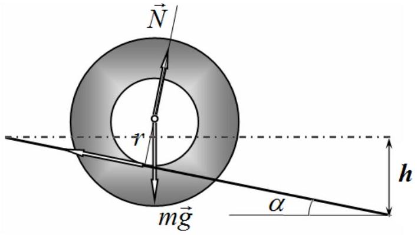
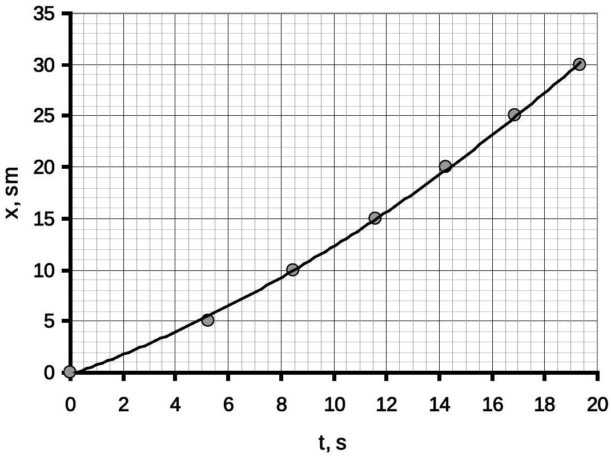
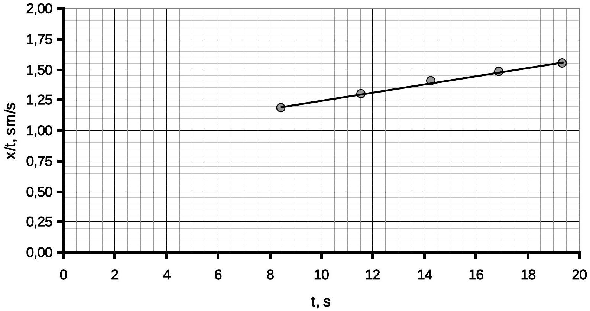
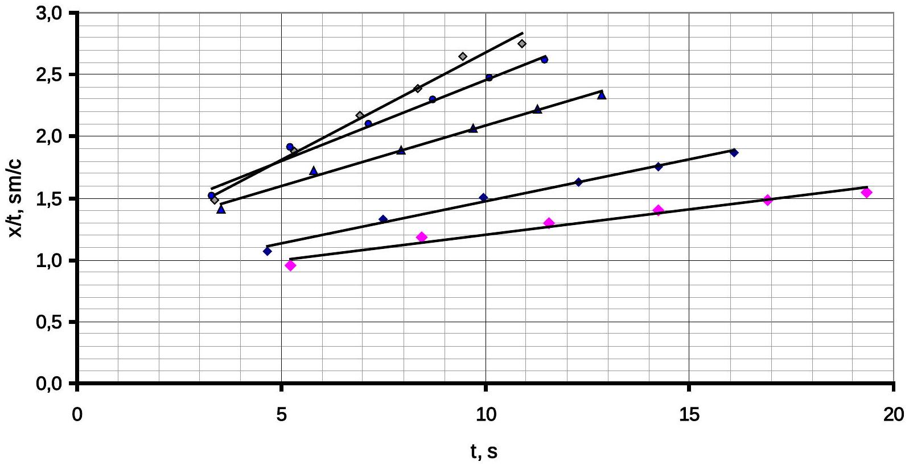
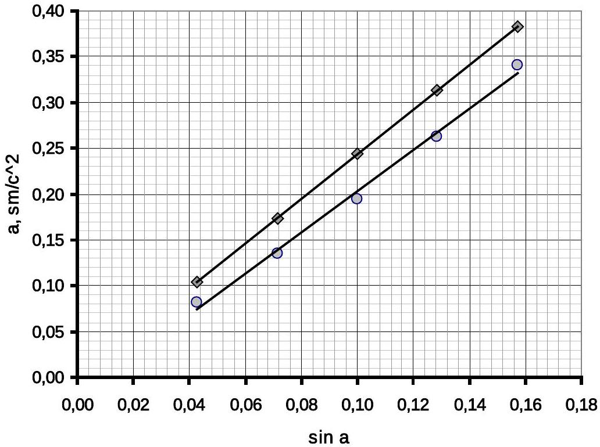
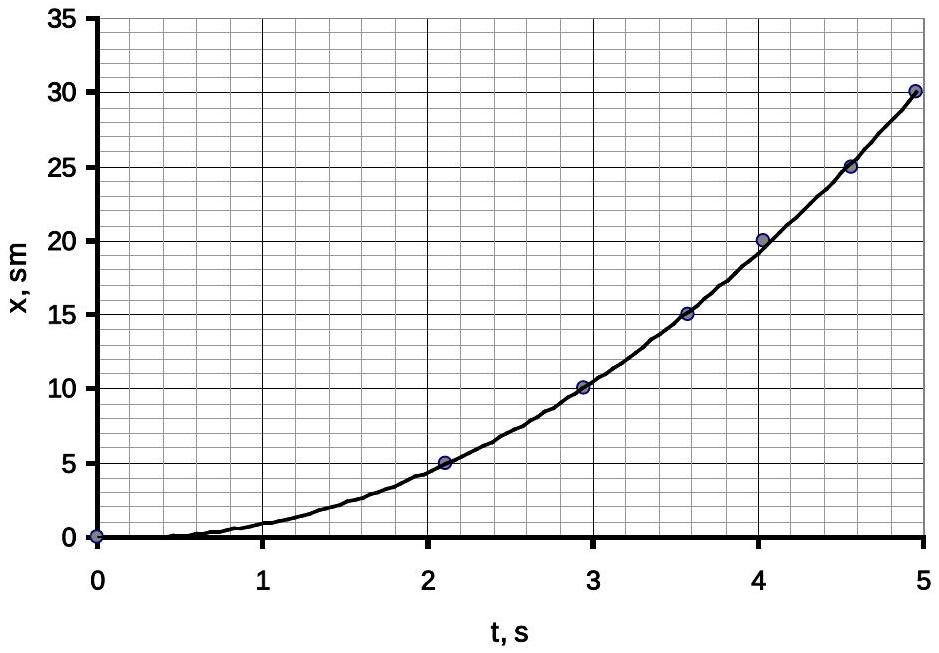
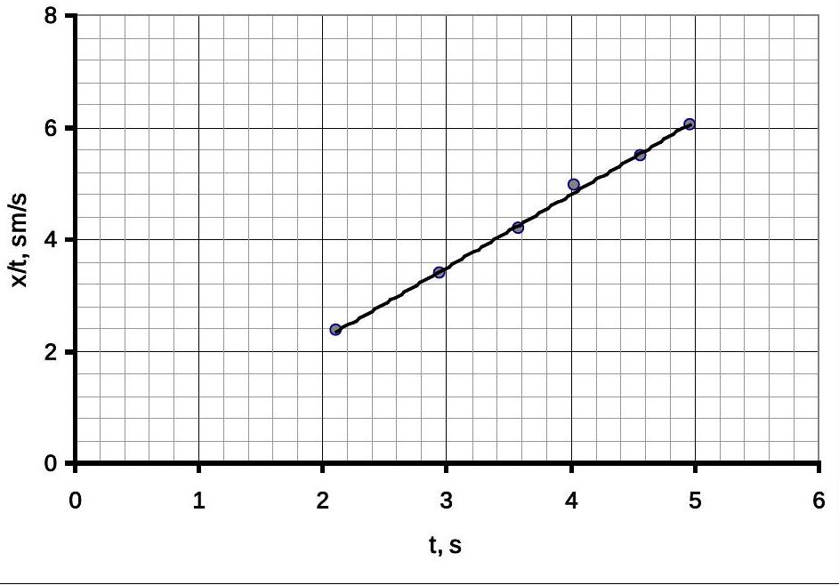
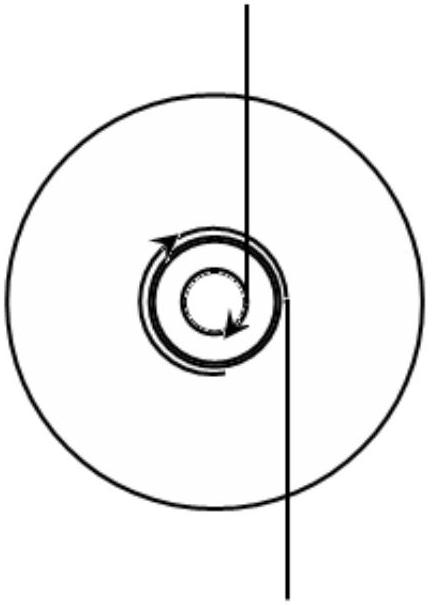

## SOLUTION TO THE EXPERIMENTAL COMPETITION Maxwell's disk (15,0 points)

## Part 1. Rolling down

1.1 The basic equation of the dynamics of rotational motion relative to the point of contact of the stick and thread is written as

$$
\begin{equation*}
\left( \frac { m R ^ { 2 } } { 2 } + m r ^ { 2 } \right) \frac { a } { r } = m g r \sin \alpha , \tag{1}
\end{equation*}
$$

where $R$ stands for the disc radius and $r$ denotes the stick radius.

The formula for the disc axis acceleration is thus obtained as

$$
\begin{equation*}
a = \frac { g } { 1 + \frac { 1 } { 2 } \left( \frac { R } { r } \right) ^ { 2 } } \sin \alpha \tag{2}
\end{equation*}
$$

1.2 To change and measure the angle that the threads make with the horizontal, it is necessary to shift up one of the holders of the tripod to the height $h$. Therefore, the sine of the inclination angle is found as

$$
\begin{equation*}
\sin \alpha = \frac { h } { L } , \tag{3}
\end{equation*}
$$

where $L$ designates the threads' length (in our experiment $L = 70 s m$ ).
In this part, the measurements have been taken for $h = 3,0 s m$. It is necessary to put marks on the threads at regular intervals and fix the travel time with a stopwatch. The difficulty is that in practice it is difficult to release the disk from the first mark without an initial push, therefore the first mark is used as a reference point, but the disk speed is thus not zero! The time dependence of the disc axis position is shown in Table 1 and in Fig. 1.

Table 1.
| х. см | $t , c$ | $x / t$ |
| :--- | :--- | :--- |
| 0 | 0 |  |
| 5 | 5,24 | 0,95 |
| 10 | 8,44 | 1,18 |
| 15 | 11,57 | 1,30 |
| 20 | 14,25 | 1,40 |
| 25 | 16,90 | 1,48 |
| 30 | 19,34 | 1,55 |

Fig. 1

The law of uniform acceleration has the form

$$
\begin{equation*}
x ( t ) = v _ { 0 } t + \frac { a t ^ { 2 } } { 2 } . \tag{4}
\end{equation*}
$$

Various methods can be used for linearization, but the following is preferred:

$$
\begin{equation*}
\frac { x } { t } = v _ { 0 } + \frac { a } { 2 } t . \tag{5}
\end{equation*}
$$

Fig. 2 shows a plot of the value $\frac { x } { t }$ (actually, average speed) versus time $t$.

Fig. 2

The approximate linearity of this dependence proves that the experimental law of motion can be described by function (4).

The acceleration of the disk axis is equal to twice the value of the slope of this graph and it is evaluated by the method of least squares to be equal to

$$
\begin{equation*}
a = 0,081 \frac { s m } { s ^ { 2 } } . \tag{6}
\end{equation*}
$$

1.3 Similar measurements have to be carried out for other values of the inclination angles of the threads. The corresponding results are shown in Table 2.

Table 2
| $\mathrm { h } = 5 \mathrm { sm }$ |  |  | $\mathrm { h } = 7 \mathrm { sm }$ |  |  | $\mathrm { h } = 9 \mathrm { sm }$ |  |  | $\mathrm { h } = 11 \mathrm { sm }$ |  |  |
| :--- | :--- | :--- | :--- | :--- | :--- | :--- | :--- | :--- | :--- | :--- | :--- |
| x. sm | $t , s$ | $x / t$ | x. sm | $t , s$ | $x / t$ | $x . s m$ | $t , s$ | $x / t$ | x. sm | $t , s$ | $x / t$ |
| 0 |  |  | 0 |  |  | 0 |  |  | 0 |  |  |
| 5 | 4,66 | 1,07 | 5 | 3,53 | 1,42 | 5 | 3,30 | 1,52 | 5 | 3,38 | 1,48 |
| 10 | 7,51 | 1,33 | 10 | 5,81 | 1,72 | 10 | 5,24 | 1,91 | 10 | 5,32 | 1,88 |
| 15 | 9,95 | 1,51 | 15 | 7,94 | 1,89 | 15 | 7,14 | 2,10 | 15 | 6,92 | 2,17 |
| 20 | 12,28 | 1,63 | 20 | 9,70 | 2,06 | 20 | 8,73 | 2,29 | 20 | 8,36 | 2,39 |
| 25 | 14,23 | 1,76 | 25 | 11,26 | 2,22 | 25 | 10,10 | 2,48 | 25 | 9,45 | 2,65 |
| 30 | 16,10 | 1,86 | 30 | 12,84 | 2,34 | 30 | 11,46 | 2,62 | 30 | 10,89 | 2,75 |

Figure 3 shows the graphs of the dependences $\frac { x } { t }$ on time $t$ which are used to calculate the experimental values of the accelerations.

Fig. 3

Table 3 shows the accelerations calculated by the slope coefficients of the graphs and corresponding theoretical values evaluated via formula (2). In the calculations, the following measured values are taken: the disk diameter $D = 85 m m$ and the stick diameter $d = 3,0 m m$. Fig. 4 shows graphs of the dependences of the accelerations on the angle of threads inclination.

Table 3
| h , sm | a, theor. $\mathrm { sm } / \mathrm { s } ^ { 2 }$ | a, exper. $\mathrm { sm } / \mathrm { s } ^ { 2 }$ | $\sin \alpha$ |
| :--- | :--- | :--- | :--- |
| 3 | 0,104 | 0,081 | 0,043 |
| 5 | 0,174 | 0,135 | 0,071 |
| 7 | 0,244 | 0,195 | 0,100 |
| 9 | 0,313 | 0,262 | 0,129 |
| 11 | 0,383 | 0,340 | 0,157 |

Fig. 4

## Part 2. Moving down

2.1 In this case, the travel time is small, therefore, measurements should be carried out for each coordinate repeatedly. Table 4 lists the results of the time measurements needed for the disc to travel distance $x$, averaged over 3 measurements. Fig. 5 demonstrates a graph of the obtained dependence.

Table 4.
| x, sm | t, s | x/t | $\mathrm { t } ^ { 2 }$ |
| :--- | :--- | :--- | :--- |
| 0 | 0 |  | 0 |
| 5 | 2,11 | 2,37 | 4,45 |
| 10 | 2,95 | 3,39 | 8,70 |
| 15 | 3,58 | 4,19 | 12,82 |
| 20 | 4,03 | 4,96 | 16,24 |
| 25 | 4,56 | 5,48 | 20,79 |
| 30 | 4,96 | 6,05 | 24,60 |

Fig. 5

To calculate the acceleration, we use the previous methodology: we draw the dependence $\frac { x } { t }$ on $t$ (Fig. 6) and find the parameters of the linearized dependence.

The least squares calculations give the following values of the coefficients of the dependence $\frac { x } { t } = K t + b$ :

$$
\begin{aligned}
& K = ( 1,30 \pm 0,07 ) \frac { s m } { s ^ { 2 } } \\
& b = ( - 0,40 \pm 0,3 ) \frac { s m } { s }
\end{aligned}
$$

Fig. 6

Then, the disc axis acceleration is found as

$$
\begin{equation*}
a = ( 2,60 \pm 0,13 ) \frac { s m } { s ^ { 2 } } . \tag{7}
\end{equation*}
$$

2.3 The formula for the acceleration is automatically obtained from formula (2), in which $\sin \alpha = 1$ :

$$
\begin{equation*}
a = \frac { g } { 1 + \frac { 1 } { 2 } \left( \frac { r } { R } \right) ^ { 2 } } . \tag{8}
\end{equation*}
$$

The calculation using this formula gives the value of $a = 2,44 \frac { s m } { s ^ { 2 } }$.

## Part 3. Moving up

3.1 Threads should be wound such that when the threads tied to the load are untwisted, the threads attached to the Maxwell disk are twisted. It is also obvious that the threads with the load should be wound on a part of the stick

with a larger radius.

3.2 In this case, the beginning of the motion of the disk axis is easily recorded, so you can simply measure the rise time to a fixed height and calculate the acceleration according to the formula:

$$
\begin{equation*}
H = \frac { a t ^ { 2 } } { 2 } \Rightarrow a = \frac { 2 H } { t ^ { 2 } } . \tag{9}
\end{equation*}
$$

During the measurements, the following data shown in Table 5 (at $H = 12 s m$ ) have been obtained.

Table 5
| $n$ | $t _ { 1 } , \mathrm {~s}$ | $t _ { 2 } , \mathrm {~s}$ | $t _ { 3 } , \mathrm {~s}$ | $\langle t \rangle$, s | $a \frac { s m } { s ^ { 2 } }$ |
| :--- | :--- | :--- | :--- | :--- | :--- |
| 1 | 2,07 | 2,13 | 2,23 | 2,14 | 5,22 |
| 2 | 1,6 | 1,56 | 1,63 | 1,60 | 9,41 |

Marking scheme
|  | Content | Total points for parts | Points |
| :--- | :--- | :--- | :--- |
| Part 1. Rolling down |  | 8 |  |
| 1.1 | Formula (2) $a = \frac { g } { 1 + \frac { 1 } { 2 } \left( \frac { r } { R } \right) ^ { 2 } } \sin \alpha$ | 0,3 | 0.3 |
| 1.2 | Experimental setup is properly designed; appropriate data are obtained by order of magnitude | 0,5 | 0,5 |
|  | The value of $\sin \alpha$ is stated:   Measurement method;   Numerical value lies in the range of 0,04-0,2; | 0,2 | 0,1   0,1 |
|  | The dependence measurement   Marked only if $\sin \alpha$ is in the range above,   Data deviation from the official solution is within 25\%:   - range of coordinate measurement exceeds 20 sm (exceeds 10 sm, less than 10 sm ); - number of data points 5 and more (4, less than 4); - the nonlinear dependence is obtained which is close to parabolic;  | 1,2 | 0,5(0,3;0)   0,5(0,3;0)   0,2 |
|  | Graph of $x ( t )$   (marked only if the corresponding data have been marked): - axes are named and ticked; - all data points are in the graph; - smooth curve is plotted;  | 0,3 | 0,1   0,1   0.1 |
|  | Analysis of the uniform acceleration model:   - the law of motion $x ( t ) = v _ { 0 } t + \frac { a t ^ { 2 } } { 2 }$;   - Without the initial velocity; | 0,2 | 0.2   (0) |
|  | The analysis methodology:   - linearization $\frac { x } { t } = v _ { 0 } + \frac { a } { 2 } t$;   - calculation of velocities $v ( t )$;   - linearization $x \left( t ^ { 2 } \right)$;   - acceleration calculation by 2-3 points; | 1,0 | 1   $( 0,5 )$   (0.2)   (0.1) |
|  | Graph of the linearized dependence | 0.3 |  |

|  | (marked only if corresponding data have been marked): - axes are named and ticked; - all data points are in the graph; - smooth curve is plotted;  |  | 0,1 0,1 0.1   |
| :--- | :--- | :--- | :--- |
|  | Calculation of the acceleration (not marked if there is no unit); - according to the linearized dependence (LSM, graph); - by 2-3 points; - by 1 point;  |  | 0,4   0,4 $( 0,2 )$ $( 0,1 )$  |
| 1.3 | Acceleration dependence on the angle Marked only if data deviation from the official solution is within 25\%:   Sine of the angle is within the range 0,04-0,2 : - number of angles taken is 4 or more (3, less than 3); - number of data points in each dependence is 5 or more (3-4; less than 3);  |  | 1,4   0,2 0,8(0,5;0)    0,4(0,2;0) |
|  | Acceleration calculation (for each point but no more than 4): - linearization; - by 1-3 points;    Calculation of $\sin \alpha$; |  | 1,0   0,2x4 (0,1×4) 0.2   |
|  | Graph of the angle dependence of the acceleration (marked only if corresponding data points have been marked): - axes are named and ticked; - all data points are in the graph; - smooth curve is plotted;  |  | 0,3   0.1 0,1 0.1   |
| 1.4 | Disc and stick radii are measured; Correct formula is used for calculations; Linear dependence is drawn; Experimental data lie systematically below the theoretical curve;  |  | 0,9   0,1 0,1 0,5  |
|  | Part 2. Moving down | 4 |  |
| 2.1 | Experimental data   Marked only if data deviation from the official solution is within 25\%: - the range of the coordinate measurements exceeds 20 sm (exceeds 10 sm; less than 10); - number of data points is 5 or more (3-4; less than 3); - average is done by 3 or more repeatitions; - the dependence close to parabolic is obtained;  |  | 1,5   0,5(0,3;0)   0,5(0,3;0) 0,3 0,2  |
|  | Graph of $x ( t )$ |  | 0,3   0,1 0,1 0.1   |
| 2.2 | Acceleration calculations (marked only if corresponding data have been marked): - linearization is used (allowed to use $x \left( t ^ { 2 } \right)$; - acceleration is calculated using the linearized depemdence (by 1- 2 points); - experimental error is calculated;  |  | 1,3   0,5   0,5 0,3  |
| 2.3 | Correct formula for the acceleration is derived; Numerical value is correctly evaluated;  |  | 0.4   0.2 |
| Part 3. Moving up |  | 3 |  |

| 3.1 | Correct schematic figure for wounding the threads (threads are on one side of the stick); |  | 1 |
| :--- | :--- | :--- | :--- |
| 3.2 | Time of moving up is measured (within the range of 0,7 - 3,0 s) |  | 0,5×2 |
|  | Accelerations are calculated (within 50\% deviation from the official solution) |  | 0,5×2 |
|  | Total | 15 |  |
