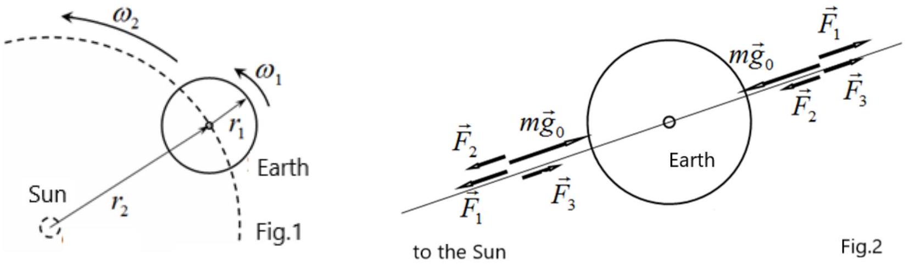
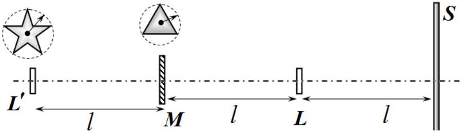
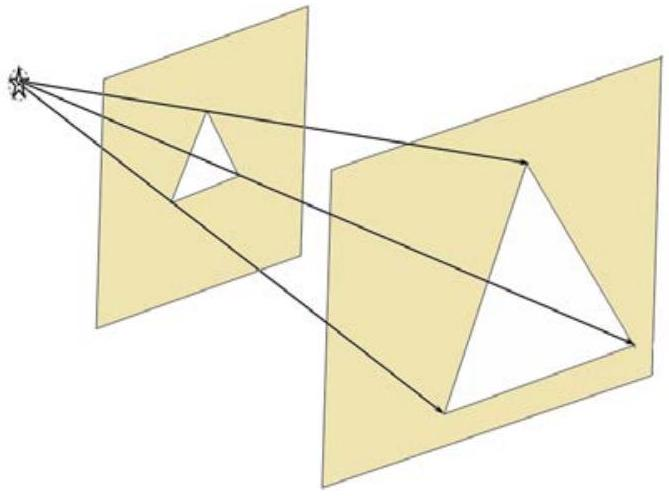
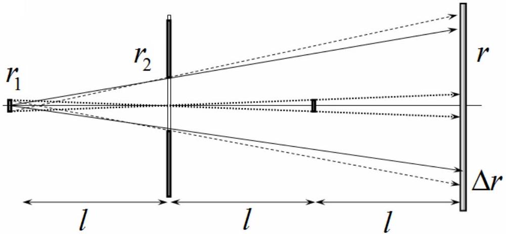
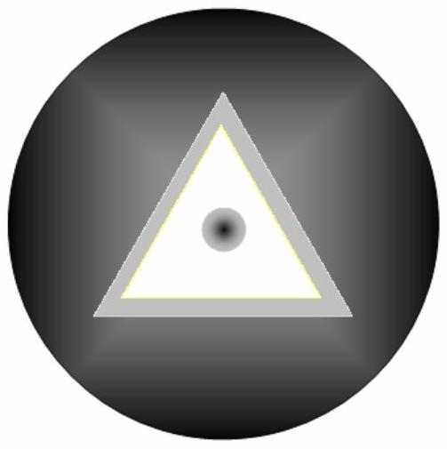
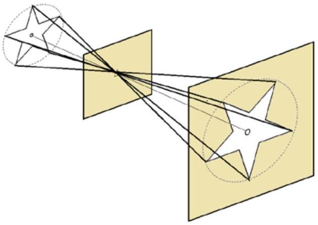
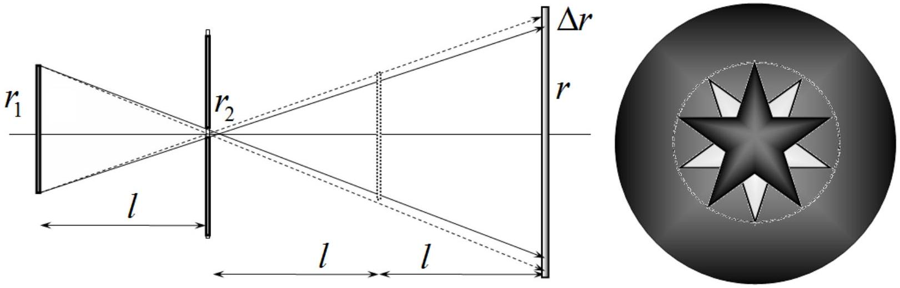

## SOLUTIONS TO THE PROBLEMS OF THE THEORETICAL COMPETITION   Attention. Points in grading are not divided!   Problem 1 (10.0 points)   Problem 1.1 (4.0 points)

The oscillation period of a mathematical pendulum is determined by the formula

$$
\begin{equation*}
T = 2 \pi \sqrt { \frac { l } { g } } , \tag{1}
\end{equation*}
$$

where $g$ stands for the acceleration of gravity at a given time of day.
The difference in the periods of oscillation of the pendulum at midday and midnight is due to the influence of the Sun: gravitational attraction and centrifugal force due to the Earth's motion around the Sun. Using formula (1) for the period of pendulum oscillation the relative change in the periods can be represented as

$$
\begin{equation*}
\varepsilon = \frac { T _ { 2 } - T _ { 1 } } { T _ { 1 } } = \sqrt { \frac { g _ { 1 } } { g _ { 2 } } } - 1 , \tag{2}
\end{equation*}
$$

where $g _ { 1 } , g _ { 2 }$ denotes the acceleration of gravity at midday and midnight, respectively.
The directions of the Earth's rotation around its own axis and around the Sun coincide, as shown in Figure 1. The directions of action of gravitational and centrifugal forces are different at midday and midnight, as shown in Figure 2.

In Figure 2: $m g _ { 0 }$ is the force of gravitational attraction to the Earth; $F _ { 1 }$ is the centrifugal force due to the rotation of the Earth around its own axis; $F _ { 2 }$ is the force of gravitational attraction to the Sun; $F _ { 3 }$ is the centrifugal force due to the motion of the Earth around the Sun.

Then the acceleration of gravity, taking into account the influence of the Sun, are determined by the expressions:
At midday:

$$
\begin{equation*}
g _ { 1 } = g _ { 0 } - \omega _ { 1 } ^ { 2 } r _ { 1 } - G \frac { M } { \left( r _ { 2 } - r _ { 1 } \right) ^ { 2 } } + \omega _ { 2 } ^ { 2 } r _ { 2 } . \tag{3}
\end{equation*}
$$

At midnight:

$$
\begin{equation*}
g _ { 2 } = g _ { 0 } - \omega _ { 1 } ^ { 2 } r _ { 1 } + G \frac { M } { \left( r _ { 2 } + r _ { 1 } \right) ^ { 2 } } - \omega _ { 2 } ^ { 2 } r _ { 2 } . \tag{4}
\end{equation*}
$$

In the above formulas $M$ designates the mass of the Sun and $G$ signifies the gravitational constant.
To simplify the obtained expressions, we use the equation describing the motion of the Earth around the Sun in the following form

$$
\begin{equation*}
G \frac { M } { r _ { 2 } ^ { 2 } } = \omega _ { 2 } ^ { 2 } r _ { 2 } . \tag{5}
\end{equation*}
$$

Given this relation, the acceleration difference is represented as

$$
\begin{equation*}
\Delta g = g _ { 1 } - g _ { 2 } = \omega _ { 2 } ^ { 2 } r _ { 2 } \left( 2 - \left( 1 - \frac { r _ { 1 } } { r _ { 2 } } \right) ^ { - 2 } - \left( 1 + \frac { r _ { 1 } } { r _ { 2 } } \right) ^ { - 2 } \right) . \tag{6}
\end{equation*}
$$

Note that in this case, in order to obtain a nonzero result in the power series expansions, it is necessary to keep the second order terms, i.e. $( 1 + x ) ^ { - 2 } \approx 1 - 2 x + 3 x ^ { 2 }$, such that:

$$
\begin{equation*}
\Delta g = - 6 \omega _ { 2 } ^ { 2 } r _ { 2 } \left( \frac { r _ { 1 } } { r _ { 2 } } \right) ^ { 2 } . \tag{7}
\end{equation*}
$$

Thus, the relative change in the periods of oscillations due to the influence of the Sun is equal

$$
\begin{equation*}
\varepsilon \approx \frac { \Delta g } { 2 g _ { 2 } } \approx \frac { \Delta g } { 2 g _ { 0 } } , \tag{8}
\end{equation*}
$$

so that the final relation is derived as

$$
\begin{equation*}
\varepsilon = - 3 \frac { \omega _ { 2 } ^ { 2 } r _ { 2 } } { g _ { 0 } } \left( \frac { r _ { 1 } } { r _ { 2 } } \right) ^ { 2 } \approx - 3,3 \cdot 10 ^ { - 12 } \tag{9}
\end{equation*}
$$

| Content | Points |
| :--- | :--- |
| Formula (1): $T = 2 \pi \sqrt { \frac { l } { g } }$ | 0,2 |
| Formula (2): $\varepsilon = \frac { T _ { 2 } - T _ { 1 } } { T _ { 1 } } = \sqrt { \frac { g _ { 1 } } { g _ { 2 } } } - 1$ | 0,2 |
| Earth's gravity is accounted for | 0,2 |
| Sun's gravity is accounted for | 0,2 |
| Centrifugal force due to the Earth motion around the Sun is accounted for | 0,2 |
| Centrifugal force due th the Earth rotation is accounted for | 0,2 |
| Formula (3): $g _ { 1 } = g _ { 0 } - \omega _ { 1 } ^ { 2 } r _ { 1 } - G \frac { M } { \left( r _ { 2 } - r _ { 1 } \right) ^ { 2 } } + \omega _ { 2 } ^ { 2 } r _ { 2 }$ | 0,4 |
| Formula (4): $g _ { 2 } = g _ { 0 } - \omega _ { 1 } ^ { 2 } r _ { 1 } + G \frac { M } { \left( r _ { 2 } + r _ { 1 } \right) ^ { 2 } } - \omega _ { 2 } ^ { 2 } r _ { 2 }$ | 0,4 |
| Formula (5): $G \frac { M } { r _ { 2 } ^ { 2 } } = \omega _ { 2 } ^ { 2 } r _ { 2 }$ | 0,3 |
| Formula (6): $\Delta g = g _ { 1 } - g _ { 2 } = \omega _ { 2 } ^ { 2 } r _ { 2 } \left( 2 - \left( 1 - \frac { r _ { 1 } } { r _ { 2 } } \right) ^ { - 2 } - \left( 1 + \frac { r _ { 1 } } { r _ { 2 } } \right) ^ { - 2 } \right)$ | 0,3 |
| Formula (7): $\Delta g = - 6 \omega _ { 2 } ^ { 2 } r _ { 2 } \left( \frac { r _ { 1 } } { r _ { 2 } } \right) ^ { 2 }$ | 0,4 |
| Formula (8): $\varepsilon \approx \frac { \Delta g } { 2 g _ { 2 } } \approx \frac { \Delta g } { 2 g _ { 0 } }$ | 0,3 |
| Formula (9): $\varepsilon = - 3 \frac { \omega _ { 2 } ^ { 2 } r _ { 2 } } { g _ { 0 } } \left( \frac { r _ { 1 } } { r _ { 2 } } \right) ^ { 2 }$ | 0,3 |
| Numerical value in formula (9): $\varepsilon \approx - 3,3 \cdot 10 ^ { - 12 }$ | 0,4 |
| Total | 4,0 |

## Problem 1.2 (3.0 points)

Consider a conductor with a resistivity $\rho$, length $l$ and a cross section area $S$ in which the current $I$ flows. According to the Joule-Lenz law, the heat power dissipated in a conductor per unit of time is equal to

$$
\begin{equation*}
W = I ^ { 2 } R , \tag{1}
\end{equation*}
$$

where the current density is defined as

$$
\begin{equation*}
j = \frac { I } { s } , \tag{2}
\end{equation*}
$$

and the resistance is found by the formula

$$
\begin{equation*}
R = \rho \frac { l } { s } . \tag{3}
\end{equation*}
$$

It follows from formulas (1)-(3) that the heat power per unit volume is determined by the expression

$$
\begin{equation*}
w = \frac { W } { S l } = \rho j ^ { 2 } . \tag{4}
\end{equation*}
$$

On the other hand, Ohm's law is written as

$$
\begin{equation*}
U = I R , \tag{5}
\end{equation*}
$$

in which the voltage across the conductor is expressed in terms of the field strength $E$ in the form

$$
\begin{equation*}
U = E l . \tag{6}
\end{equation*}
$$

Hence, equation (5), taking into account (2), (3) and (6), is written in the following differential form

$$
\begin{equation*}
j = \frac { 1 } { \rho } E , \tag{7}
\end{equation*}
$$

Thus, according to the Joule-Lenz law, the heat power dissipated per unit of volume of the substance is

$$
\begin{equation*}
w = \rho ( r ) j ( r ) ^ { 2 } , \tag{8}
\end{equation*}
$$

where the current density is determined by the expression

$$
\begin{equation*}
j ( r ) = \frac { I } { 4 \pi r ^ { 2 } } , \tag{9}
\end{equation*}
$$

with $\rho ( r )$ denotes the dependence of the resistivity on the distance $r$ to the common center of spheres.

On the other hand, Ohm's law (7) is written in the differential form as

$$
\begin{equation*}
j ( r ) = \frac { 1 } { \rho ( r ) } E ( r ) , \tag{10}
\end{equation*}
$$

where $E ( r )$ stands for the electric field strength in the substance.
It follows from relations (8)-(10) that the electric field strength has the form

$$
\begin{equation*}
E ( r ) = \frac { w } { j ( r ) } = \frac { 4 \pi w } { I } r ^ { 2 } . \tag{11}
\end{equation*}
$$

To determine the charge inside the conducting substance, we use the Gauss theorem for the closed volume, which is practically enclosed between spheres of radii $a$ and $b$

$$
\begin{equation*}
E ( b ) 4 \pi b ^ { 2 } - E ( a ) 4 \pi a ^ { 2 } = \frac { Q } { \varepsilon _ { 0 } } . \tag{12}
\end{equation*}
$$

where $Q$ symbolizes the total charge inside the conductive substance.
Since the volume of the substance enclosed between the two spheres is equal to

$$
\begin{equation*}
V = \frac { 4 } { 3 } \pi b ^ { 3 } - \frac { 4 } { 3 } \pi a ^ { 3 } , \tag{13}
\end{equation*}
$$

Then, the average charge density in the conducting substance is obtained as

$$
\begin{equation*}
\rho _ { Q } = \frac { Q } { V } = \frac { 12 \pi \varepsilon _ { 0 } w } { I } \left( \frac { b ^ { 4 } - a ^ { 4 } } { b ^ { 3 } - a ^ { 3 } } \right) . \tag{14}
\end{equation*}
$$

| Content | Points |
| :--- | :--- |
| Formula (1): $W = I ^ { 2 } R$ | 0,2 |
| Formula (2): $j = \frac { I } { S }$ | 0,2 |
| Formula (3): $R = \rho \frac { l } { s }$ | 0,2 |
| Formula (4): $w = \frac { W } { S l } = \rho j ^ { 2 }$ | 0,2 |
| Formula (5): $U = I R$ | 0,2 |
| Formula (6): $U = E l$ | 0,2 |
| Formula (7): $j = \frac { 1 } { \rho } E$ | 0,2 |
| Formula (8): $w = \rho ( r ) j ( r ) ^ { 2 }$ | 0,2 |
| Formula (9): $j ( r ) = \frac { I } { 4 \pi r ^ { 2 } }$ | 0,2 |
| Formula (10): $j ( r ) = \frac { 1 } { \rho ( r ) } E ( r )$ | 0,2 |
| Formula (11): $E ( r ) = \frac { w } { j ( r ) } = \frac { 4 \pi w } { I } r ^ { 2 }$ | 0,2 |
| Formula (12): $E ( b ) 4 \pi b ^ { 2 } - E ( a ) 4 \pi a ^ { 2 } = \frac { Q } { \varepsilon _ { 0 } }$ | 0,3 |
| Formula (13): $V = \frac { 4 } { 3 } \pi b ^ { 3 } - \frac { 4 } { 3 } \pi a ^ { 3 }$ | 0,2 |
| Formula (14): $\rho _ { Q } = \frac { 12 \pi \varepsilon _ { 0 } w } { I } \left( \frac { b ^ { 4 } - a ^ { 4 } } { b ^ { 3 } - a ^ { 3 } } \right)$ | 0,3 |
| Total | 3,0 |

## Problem 1.3 (3.0 points)

To analyze the image on the screen, it is more convenient to build first the image $L ^ { \prime }$ of the source in the mirror. This image is located at the distance $l$ from the mirror and has the same dimensions as the real source.

1.3.1 In this case, the source size is much smaller than the size of the mirror. As a first approximation, the source can be considered point-like. Therefore, the illuminated area on the screen has the form of a regular triangle repeating the shape of the mirror (see. fig.).

It follows from simple geometric constructions that the size of the triangle is 3 times the size of the mirror, i.e. a triangle on the screen can be inscribed in a circle of radius $r = 3 r _ { 2 } = 30 m m$.

Since the source has, albeit small, but finite dimensions, the image of the triangle is to be slightly blurry, i.e. bordered by a semi-illuminated strip (border). The width of this strip is approximately equal to $\Delta r \approx 3 r _ { 1 } = 3 m m$. It can be imagined that each source point gives an image in the form of a triangle, these images are displaced relative to each other by the twice displacement of the source points.

In the center of the triangle there should be a blurred shadow from the source (shadow and semi shadow) whose radius is $r _ { S } \approx 2 r _ { 1 } = 2 m m$.
1.3.2 In this case, the size of the source is much larger than the size of the mirror, which in the first approximation can be considered as a very small "point" hole that forms an inverted image of the source. Such an effect is used in a pinhole camera, which also forms an inverted image.

It follows from geometric constructions that a star can be inscribed in a circle of radius $r = 2 r _ { 1 } = 20 m m$. The final dimensions of the source lead to slight blurring of the image with the width of the semi-illuminated strip (border) approximately equal to $\Delta r = 2 r _ { 2 } = 0.2 m m$.

Further, it should be noted that the real source creates a shadow on the screen in the form of the same five-pointed star and of the same size! However, this shadow is not inverted. Therefore, only part of

the bright star is closed, as shown in the figure. Thus, only five irregular quadrangles remain illuminated on the screen.

|  | Content | Points |  |
| :--- | :--- | :--- | :--- |
| 1.3.1 | The rays are correctly constructed (the image of the source, or the correct reflection of the rays); | 0.3 | 1.3 |
|  | Image grading: the main part is an inverted triangle; (if not, then the rest in this paragraph is not counted); | 0,3 |  |
|  | Triangle size - numerical value (side or radius); | 0,1 |  |
|  | There is a semi-illuminated border; | 0,2 |  |
|  | Border width; | 0,1 |  |
|  | There is a blurred shadow in the center; | 0,2 |  |
|  | The size of the shadow (partial shade) is the radius in the range of 1-2 mm; | 0,1 |  |
| 1.3.2 | The rays are correctly constructed (the image of the source, or the correct reflection of the rays); | 0,2 | 1.7 |
|  | Image grading |  |  |
|  | The main part is an inverted star; (if not, then the rest in this paragraph is not counted); | 0,4 |  |
|  | The radius of the star (numerical value); | 0,2 |  |
|  | There is a border; | 0,1 |  |
|  | Estimation of the border thickness; | 0,2 |  |
|  | There is a shadow from the source; | 0,2 |  |
|  | Shadow is not an inverted star; | 0,1 |  |
|  | The size of the shadow coincides with the size of the inverted star; | 0,2 |  |
|  | Illuminated areas - 5 quadrangles; | 0,1 |  |
|  | Total |  | 3,0 |

## Problem 2. Phase states and phase transitions ( $\mathbf { 1 0 , 0 }$ points) Specific heat of phase transition

2.1 The work of steam against constant external pressure during evaporation of a unit water mass is found as

$$
\begin{equation*}
A = P \left( v _ { 2 } - v _ { 1 } \right) . \tag{1}
\end{equation*}
$$

Since $v _ { 2 } \gg v _ { 1 }$, we can neglect the specific volume of liquid $v _ { 1 }$ in comparison with the specific volume of vapor $v _ { 2 }$. Then, considering water vapor as an ideal gas with the equation of state

$$
\begin{equation*}
P v = \frac { R T } { \mu _ { w } } \tag{2}
\end{equation*}
$$

the work sought is obtained as

$$
\begin{equation*}
A = P \left( v _ { 2 } - v _ { 1 } \right) \approx \frac { R T _ { b } } { \mu _ { w } } . \tag{3}
\end{equation*}
$$

Thus, the ratio of work to the total heat of evaporation at $T = 373 \mathrm {~K}$ is determined by the expression

$$
\begin{equation*}
\frac { A } { r _ { \mathrm { B } } } = \frac { R T _ { b } } { \mu _ { w } r _ { w } } , \tag{4}
\end{equation*}
$$

and the rest of the heat goes to the increase of the internal energy of the system $\Delta u = r _ { w } - A$, i.e.

$$
\begin{equation*}
\frac { \Delta u } { r _ { w } } = 1 - \frac { R T _ { b } } { \mu _ { w } r _ { w } } = 92,4 \% . \tag{5}
\end{equation*}
$$

2.2 The evaporation of one mole of water at a temperature $T$ consumes heat

$$
\begin{equation*}
\mu _ { w } r ( T ) = U _ { 2 } ( T ) - U _ { 1 } ( T ) + P V _ { 2 } = U _ { 2 } ( T ) - U _ { 1 } ( T ) + R T . \tag{6}
\end{equation*}
$$

A similar expression for the temperature $T _ { b } = 373 \mathrm {~K}$ has the form

$$
\begin{equation*}
\mu _ { w } r _ { w } = U _ { 2 } \left( T _ { b } \right) - U _ { 1 } \left( T _ { b } \right) + R T _ { b } . \tag{7}
\end{equation*}
$$

Subtracting equation (7) from equation (6), we obtain for the change in the molar heat of evaporation

$$
\begin{equation*}
\mu _ { w } \Delta r = \Delta U _ { 2 } - \Delta U _ { 1 } + R \Delta T = C _ { P } \Delta T - \mu _ { w } c _ { w } \Delta T = \mu _ { w } \left( \frac { C _ { P } } { \mu _ { w } } - c _ { w } \right) \Delta T , \tag{8}
\end{equation*}
$$

where $\Delta T = T - T _ { b }$ and $\Delta r = r ( T ) - r _ { w }$.
Given that for water vapor, the molar heat capacity at constant pressure is

$$
\begin{equation*}
C _ { P } = 4 R , \tag{9}
\end{equation*}
$$

we obtain the specific heat of water evaporation

$$
\begin{equation*}
r ( T ) = r _ { w } - \left( c _ { w } - \frac { 4 R } { \mu _ { w } } \right) \left( T - T _ { b } \right) = 2447 \mathrm {~J} / g . \tag{10}
\end{equation*}
$$

It is interesting to note that the heat of evaporation is increased by $\Delta r / r _ { w } \approx 8 \%$.

## The Clausius-Clapeyron relation

2.3 Neglecting the specific volume of water compared to the volume of vapor, we apply the Clapeyron-Clausius equation to the vaporization in the form

$$
\begin{equation*}
\frac { d P } { d T } = \frac { r } { T v } = \frac { \mu _ { w } r _ { w } } { R T ^ { 2 } } P \tag{11}
\end{equation*}
$$

or

$$
\begin{equation*}
\frac { d P } { P } = \frac { \mu _ { w } r _ { w } d T } { R T ^ { 2 } } . \tag{12}
\end{equation*}
$$

Integrating this expression at $r = r _ { w } =$ const gives rise to

$$
\begin{equation*}
P = P _ { 0 } \exp \left( \frac { \mu _ { w } r _ { w } } { R } \left( \frac { 1 } { T _ { b } } - \frac { 1 } { T } \right) \right) . \tag{13}
\end{equation*}
$$

2.4 As it follows from equation (13) the explicit dependence of the boiling point of water on external pressure has the form

$$
\begin{equation*}
T = \frac { T _ { b } } { 1 - \frac { R T _ { b } } { \mu _ { w } r _ { w } } \ln \frac { P } { P _ { 0 } } } . \tag{14}
\end{equation*}
$$

According to the barometric formula for an isothermal atmosphere, we have

$$
\begin{equation*}
P = P _ { 0 } \exp \left( - \frac { \mu _ { \text {air } } g h } { R T _ { 0 } } \right) . \tag{15}
\end{equation*}
$$

Substituting this expression into formula (14), we obtain the dependence of the boiling temperature on height and the numerical value of the boiling temperature of water at the altitude of $h = 7 k m$

$$
\begin{equation*}
T = \frac { T _ { b } } { 1 + \frac { T _ { b } \mu _ { \text {air } } g h } { T _ { 0 } \mu _ { w } r _ { w } } } = 349,6 \mathrm {~K} = 76,6 ^ { \circ } \mathrm { C } . \tag{16}
\end{equation*}
$$

2.5 It follows from the Clapeyron-Clausius relation the following holds at the vicinity of 0 °C

$$
\begin{equation*}
\frac { d P } { d T } = \frac { r _ { w } } { T _ { 0 } \left( \frac { 1 } { \rho _ { w } } - \frac { 1 } { \rho _ { i } } \right) } . \tag{17}
\end{equation*}
$$

Therefore, we obtain that in order to lower the melting temperature of ice by 1°C, the pressure should be increased by

$$
\begin{equation*}
\Delta P = \frac { d P } { d T } \Delta T = 139 \mathrm {~atm} , \tag{18}
\end{equation*}
$$

so that the pressure should be equal to $P = 140 ~ a t m$.
2.6 In order for ice crystals to break when walking, and not to melt under the influence of pressure $P _ { c r }$, the outdoor temperature should be lower than

$$
\begin{equation*}
t _ { \max } = \frac { P _ { c r } } { ( d P / d T ) } \approx - 7,21 ^ { \circ } \mathrm { C } , \tag{19}
\end{equation*}
$$

in which the derivative $( d P / d T )$ is determined by formula (17).
2.7 Since for one mole of vapor $P V = R T$, then

$$
\begin{equation*}
d ( P V ) = P d V + V d P = R d T , \tag{20}
\end{equation*}
$$

thus, the elementary work of the vapor when changing its volume is derived as

$$
\begin{equation*}
P d V = R d T - V d P . \tag{21}
\end{equation*}
$$

From the first law of thermodynamics it follows that the heat supplied to the vapor has the form

$$
\begin{equation*}
\delta Q = d U + \delta A = C _ { V } d T + R d T - V d P = C _ { P } d T - V d P . \tag{22}
\end{equation*}
$$

Given that from the Clapeyron-Clausius relation $d P / d T = r _ { w } \mu _ { w } / \left( T _ { b } V \right)$,, we obtain the heat capacity of the vapor

$$
\begin{equation*}
C = \frac { \delta Q } { d T } = C _ { P } - \frac { V d P } { d T } = C _ { P } - \frac { \mu _ { w } r _ { w } } { T _ { b } } = - 75,7 \mathrm {~J} / ( \mathrm { K } \cdot \mathrm {~mol} ) . \tag{23}
\end{equation*}
$$

Thus, the heat from the vapor must be removed so that it does not overheat as a result of expansion. It is interesting to note that the specific heat in this process turned out to be almost equal to the specific heat of water with a minus sign $c = C _ { P } / \mu _ { w } - r _ { w } / T _ { b } = - 4,21 J / ( g \cdot K )$.

## Border boiling

2.8 A liquid boils when bubbles are formed inside such that the pressure of its saturated vapor reaches the atmospheric pressure $P _ { 0 }$. At the liquids border, the total vapor pressure in the bubbles formed upon boiling is the sum of the partial pressures of the saturated vapor of carbon tetrachloride and water at $t ^ { * }$

$$
\begin{equation*}
P _ { 0 } = P \left( t ^ { * } \right) + P _ { w } \left( t ^ { * } \right) . \tag{24}
\end{equation*}
$$

It follows that the saturated vapor pressure of carbon tetrachloride at a boiling point is found as

$$
\begin{equation*}
P ^ { * } = P \left( t ^ { * } \right) = P _ { 0 } - P _ { w } \left( t ^ { * } \right) . \tag{25}
\end{equation*}
$$

From the Clapeyron-Clausius relation for carbon tetrachloride it follows that

$$
\begin{equation*}
\frac { d P } { P } = \frac { \mu r d T } { R T ^ { 2 } } . \tag{26}
\end{equation*}
$$

After integrating from the lower bound $T = t + 273,15 = 349,8 K$ to the higher bound $T ^ { * } = t ^ { * } + 273,15 = 339,15 \mathrm {~K}$ results in the following formula

$$
\begin{equation*}
\ln \left( P _ { 0 } / P ^ { * } \right) = r \mu \Delta T / R T T ^ { * } , \tag{27}
\end{equation*}
$$

which means the heat of vaporization of carbon tetrachloride is obtained as

$$
\begin{equation*}
r = \frac { R T T ^ { * } \ln \left( P _ { 0 } / P ^ { * } \right) } { \mu \left( T - T ^ { * } \right) } \approx 180 \mathrm {~J} / \mathrm { g } . \tag{28}
\end{equation*}
$$

For reference: the experimental value is $r = 195 \mathrm {~J} / \mathrm { g }$.
2.9 The ratio of evaporation rates from the border layer is obviously equal to the ratio of the masses of vapor of tetrachlomethane and water in the bubbles formed during boiling, which, in turn, is equal to the ratio of the densities of the vapors found as

$$
\begin{equation*}
\frac { m } { m _ { w } } = \frac { \rho } { \rho _ { w } } = \frac { P ^ { * } \mu } { P _ { w } \left( t ^ { * } \right) \mu _ { w } } \approx 25 . \tag{29}
\end{equation*}
$$

Thus, carbon tetrachloride evaporates 25 times faster (by weight) than water. This means that by the time of evaporation of carbon tetrachloride, the amount of water that finally evaporates is written as

$$
\begin{equation*}
\Delta m = \frac { \rho V } { 2 } \frac { m _ { w } } { m } = 3,25 \mathrm {~g} . \tag{30}
\end{equation*}
$$

Accordingly, the amount of water remaining after evaporation of all carbon tetrachloride is derived as

$$
\begin{equation*}
M _ { w } = \rho _ { w } V / 2 - \Delta m = 46,7 g . \tag{31}
\end{equation*}
$$

2.10 Let border boiling occur at a certain temperature $t _ { x }$, then the saturated vapor pressure of fluoroketone $P$ and the saturated vapor pressure of water $P _ { w }$ at this temperature should equal the external atmospheric pressure, i.e.

$$
\begin{equation*}
P _ { 0 } = P \left( t _ { x } \right) + P _ { w } \left( t _ { x } \right) . \tag{32}
\end{equation*}
$$

Thus, the saturated vapor pressure of fluoroketone at the border boiling point decreases by the value of the saturated vapor pressure of water at this temperature

$$
\begin{equation*}
P \left( t _ { x } \right) = P _ { 0 } - P _ { w } \left( t _ { x } \right) . \tag{33}
\end{equation*}
$$

From the Clapeyron - Clausius equation (in the approximation of small liquid volume and vapor ideality) it follows that the slope of the phase equilibrium line $P ( T )$ at the volume boiling point of fluoroketone reads as

$$
\begin{equation*}
\alpha _ { f } = \frac { \mathrm { d } P } { \mathrm {~d} T } = \frac { r \mu P _ { 0 } } { R T _ { f } ^ { 2 } } . \tag{34}
\end{equation*}
$$

For water at the same temperature, a similar derivative is more than 6 times less

$$
\begin{equation*}
\alpha _ { \mathrm { w } } = \frac { \mathrm { d } P } { \mathrm {~d} T } = \frac { \mu _ { w } r _ { w } P _ { \mathrm { w } } \left( t _ { f } \right) } { R T _ { f } ^ { 2 } } . \tag{35}
\end{equation*}
$$

Since $\alpha _ { f } / \alpha _ { \mathrm { w } } \approx 6,30$, the decrease in pressure and, correspondingly, in the boiling point are both small relative to the same values for fluoroketone, therefore, we can use the linear approximation near $t _ { f }$

$$
\begin{equation*}
P _ { 0 } - P \left( t _ { x } \right) = \alpha _ { f } \Delta T = P _ { \mathrm { w } } \left( t _ { x } \right) = P _ { \mathrm { w } } \left( t _ { f } \right) - \alpha _ { \mathrm { w } } \Delta T , \tag{36}
\end{equation*}
$$

where $\Delta T = T _ { f } - T _ { x }$, wherefrom the lowering of the boiling point is found as

$$
\begin{equation*}
\Delta T = \frac { P _ { \mathrm { w } } \left( \mathrm { t } _ { f } \right) } { \left( \alpha _ { f } + \alpha _ { \mathrm { w } } \right) } . \tag{37}
\end{equation*}
$$

Finally, the temperature for the border boiling is obtained as

$$
\begin{equation*}
t _ { x } = t _ { f } - \Delta T = 46,3 ^ { \circ } \mathrm { C } . \tag{38}
\end{equation*}
$$

For reference: the experimental value is $t _ { x } = ( 46 \pm 1 ) ^ { \circ } \mathrm { C }$.

|  | Content | Points |  |
| :--- | :--- | :--- | :--- |
| 2.1 | Formula (1): $A = P \left( v _ { 2 } - v _ { 1 } \right)$ | 0,2 | 1,0 |
|  | Formula (2): $P v = \frac { R T } { \mu _ { w } }$ | 0,2 |  |
|  | Formula (4): $\frac { A } { r _ { \mathrm { B } } } = \frac { R T _ { b } } { \mu _ { w } r _ { w } }$ | 0,2 |  |
|  | Formula (5): $\frac { \Delta u } { r _ { w } } = 1 - \frac { R T _ { b } } { \mu _ { w } r _ { w } }$ | 0,2 |  |
|  | Numerical value in formula (5): 92,4\% | 0,2 |  |
| 2.2 | Formula (6): $\mu _ { w } r ( T ) = U _ { 2 } - U _ { 1 } + P V _ { 2 } = U _ { 2 } - U _ { 1 } + R T$ | 0,2 | 1,0 |
|  | Formula (7): $\mu _ { w } r _ { w } = U _ { 2 } \left( T _ { b } \right) - U _ { 1 } \left( T _ { b } \right) + R T _ { b }$ | 0,2 |  |
|  | Formula (9): $C _ { P } = 4 R$ | 0,2 |  |
|  | Formula (10): $r ( T ) = r _ { w } - \left( c _ { w } - \frac { 4 R } { \mu _ { w } } \right) \left( T - T _ { b } \right)$ | 0,2 |  |
|  | Numerical value in formula (10): $2447 \mathrm {~J} / \mathrm { g }$ | 0,2 |  |
| 2.3 | Formula (11): $\frac { d P } { d T } = \frac { r } { T v } = \frac { \mu _ { w } r _ { w } } { R T ^ { 2 } } P$ | 0,2 | 0,4 |
|  | Formula (13): $P = P _ { 0 } \exp \left( \frac { \mu _ { w } r _ { w } } { R } \left( \frac { 1 } { T _ { b } } - \frac { 1 } { T } \right) \right)$ | 0,2 |  |
| 2.4 | Formula (14): $T = \frac { T _ { b } } { 1 - \frac { R T _ { b } } { \mu _ { w } r _ { w } } \ln \frac { P } { P _ { 0 } } }$ | 0,2 | 1,0 |
|  | Formula (15): $P = P _ { 0 } \exp \left( - \frac { \mu _ { \text {air } } g h } { R T _ { 0 } } \right)$ | 0,4 |  |
|  | Formula (16): $T = \frac { T _ { b } } { 1 + \frac { T _ { b } \mu _ { \text {air } } g h } { T _ { 0 } \mu _ { w } r _ { w } } }$ | 0,2 |  |
|  | Numerical value in formula (16): 76,6 °C | 0,2 |  |
| 2.5 | Formula (17): $\frac { d P } { d T } = \frac { q _ { i } } { T _ { 0 } \left( \frac { 1 } { \rho _ { w } } - \frac { 1 } { \rho _ { i } } \right) }$ | 0,2 | 0,6 |

|  | Formula (18): $\Delta P = \frac { d P } { d T } \Delta T$ | 0,2 |  |
| :--- | :--- | :--- | :--- |
|  | Numerical value in formula (17): $\Delta P = 139 \mathrm {~atm}$ or $P = 140 \mathrm {~atm}$ | 0,2 |  |
| 2.6 | Formula (19): $t _ { \text {max } } = \frac { P _ { c r } } { ( d P / d T ) }$ | 0,4 | 0,6 |
|  | Numerical value in formula (19): $t _ { \text {max } } \approx - 7,21 ^ { \circ } \mathrm { C }$ | 0,2 |  |
| 2.7 | Formula (21): $P d V = R d T - V d P$ | 0,2 | 1,0 |
|  | Formula (22): $\delta Q = d U + \delta A = C _ { V } d T + R d T - V d P = C _ { P } d T - V d P$ | 0,2 |  |
|  | Formula (23): $C = \frac { \delta Q } { d T } = C _ { P } - \frac { V d P } { d T } = C _ { P } - \frac { \mu _ { w } r _ { w } } { T _ { b } }$ | 0,4 |  |
|  | Numerical value in formula (23): $C = - 75,7 \mathrm {~J} / ( \mathrm { K } \cdot \mathrm { mol } )$ | 0,2 |  |
| 2.8 | Formula (24): $P _ { 0 } = P \left( t ^ { * } \right) + P _ { w } \left( t ^ { * } \right)$ | 0,4 | 1,2 |
|  | Formula (26): $\frac { d P } { P } = \frac { \mu r d T } { R T ^ { 2 } }$ | 0,2 |  |
|  | Formula (27): $\ln \left( P _ { 0 } / P ^ { * } \right) = r \mu \Delta T / R T T ^ { * }$ | 0,2 |  |
|  | Formula (28): $r = \frac { R T T ^ { * } \ln \left( P _ { 0 } / P ^ { * } \right) } { \mu \left( T - T ^ { * } \right) }$ | 0,2 |  |
|  | Numerical value in formula (28): $r \approx 180 \mathrm {~J} / \mathrm { g }$. | 0,2 |  |
| 2.9 | Formula (29): $\frac { m } { m _ { w } } = \frac { \rho } { \rho _ { w } } = \frac { P ^ { * } \mu } { P _ { w } \left( t ^ { * } \right) \mu _ { w } }$ | 0,4 | 1,0 |
|  | Formula (30): $\Delta m = \frac { \rho V } { 2 } \frac { m _ { w } } { m }$ | 0,2 |  |
|  | Formula (31): $M _ { w } = \rho _ { w } V / 2 - \Delta m$ | 0,2 |  |
|  | Numerical value in formula (31): $M _ { w } = 46,7 g$ | 0,2 |  |
| 2.10 | Formula (32): $P _ { 0 } = P \left( t _ { x } \right) + P _ { w } \left( t _ { x } \right)$ | 0.2 | 2,2 |
|  | Formula (34): $\alpha _ { f } = \frac { \mathrm { d } P } { \mathrm {~d} T } = \frac { r \mu P _ { 0 } } { R T _ { f } ^ { 2 } }$ | 0,3 |  |
|  | Formula (35): $\alpha _ { \mathrm { w } } = \frac { \mathrm { d } P } { \mathrm {~d} T } = \frac { r _ { w } \mu _ { w } P _ { \mathrm { w } } \left( t _ { f } \right) } { R T _ { f } ^ { 2 } }$ | 0,3 |  |
|  | Estimation: $\alpha _ { f } / \alpha _ { \mathrm { w } } \approx 6,30$ | 0,3 |  |
|  | Formula (36): $P _ { 0 } - P \left( t _ { x } \right) = \alpha _ { f } \Delta T = P _ { \mathrm { w } } \left( t _ { x } \right) = P _ { \mathrm { w } } \left( t _ { f } \right) - \alpha _ { \mathrm { w } } \Delta T$ | 0,3 |  |
|  | Formula (37): $\Delta T = \frac { P _ { \mathrm { w } } \left( \mathrm { t } _ { f } \right) } { \left( \alpha _ { f } + \alpha _ { \mathrm { w } } \right) }$ | 0,4 |  |
|  | Formula (38): $t _ { x } = t _ { f } - \Delta T$ | 0,2 |  |
|  | Numerical value in formula (38): $t _ { x } = 46,3 ^ { \circ } \mathrm { C }$ | 0,2 |  |
| Total |  |  | 10,0 |

## Problem 3. Ring in a magnetic field (10.0 points) Uniformly charged ring

3.1 Under the action of gravity, the center of mass of the ring acquires a velocity $v$ directed vertically downward. In this case, the Lorentz force $F _ { L 1 }$ arises, leading to the rotation of the ring around its own axis with an angular velocity $\omega$, which in turn leads to the appearance of the vertical component of the Lorentz force $F _ { L 2 }$ directed against gravity, regardless of the sign of the ring charge.

The equation of motion of the ring center of mass has the form

$$
\begin{equation*}
m \frac { d v } { d t } = m g - F _ { L 2 } , \tag{1}
\end{equation*}
$$

where the Lorentz force is written as

$$
\begin{equation*}
F _ { L 1 } = q v _ { r o t } B , \tag{2}
\end{equation*}
$$

and the linear speed of ring rotation

$$
\begin{equation*}
v _ { \text {rot } } = \omega r . \tag{3}
\end{equation*}
$$

Thus, the equation of motion of the ring center of mass is finally derived as

$$
\begin{equation*}
m \frac { d v } { d t } = m g - q \omega r B . \tag{4}
\end{equation*}
$$

The equation of rotational motion of the ring is written as

$$
\begin{equation*}
I \frac { d \omega } { d t } = M _ { L 1 } \tag{5}
\end{equation*}
$$

where the torque of the Lorentz force moment $F _ { L 1 }$ is determined by the expression

$$
\begin{equation*}
M _ { L 1 } = q v B r , \tag{6}
\end{equation*}
$$

and the moment of inertia of the ring is equal to

$$
\begin{equation*}
I = m r ^ { 2 } . \tag{7}
\end{equation*}
$$

Let $h$ be the vertical displacement of the ring center of mass, then its speed is

$$
\begin{equation*}
v = \frac { d h } { d t } . \tag{8}
\end{equation*}
$$

Putting together (5), (6) and (8) and integrating over time, taking into account the initial condition $\omega = 0$ at $h = 0$, we obtain the relation

$$
\begin{equation*}
I \omega = q B r h . \tag{9}
\end{equation*}
$$

At the moment when the speed of the ring center of mass is maximum, the total force on the right side of equation (4) vanishes, which leads to the expression

$$
\begin{equation*}
m g = q B r \omega _ { 0 } . \tag{10}
\end{equation*}
$$

Using relation (9) for this particular moment in time

$$
\begin{equation*}
I \omega _ { 0 } = q B r h _ { 0 } , \tag{11}
\end{equation*}
$$

we apply the law of energy conservation in the following form

$$
\begin{equation*}
m g h _ { 0 } = \frac { m v _ { \max } ^ { 2 } } { 2 } + \frac { I \omega _ { 0 } ^ { 2 } } { 2 } . \tag{12}
\end{equation*}
$$

Solving equations (10)-(12) together with the expression for the moment of inertia (7), we find the maximum velocity of the ring center of mass in the following form

$$
\begin{equation*}
v _ { \max } = \frac { m g } { q B } . \tag{13}
\end{equation*}
$$

3.2 Substituting relation (9) into the equation (4) of motion of the ring center of mass and using (8), we obtain the equation of harmonic oscillations

$$
\begin{equation*}
m \frac { d ^ { 2 } h } { d t ^ { 2 } } = m g - \frac { ( q B ) ^ { 2 } } { m } h \tag{14}
\end{equation*}
$$

with the frequency

$$
\begin{equation*}
\omega _ { L } = \frac { q B } { m } . \tag{15}
\end{equation*}
$$

The time sought is quarter of the period of oscillation, i.e.

$$
\begin{equation*}
\Delta t = \frac { \pi } { 2 \omega _ { L } } = \frac { \pi m } { 2 q B } . \tag{16}
\end{equation*}
$$

3.3 The initial velocity of the ring center of mass is zero and reaches its maximum at the moment of passage of the equilibrium position, therefore, the maximum height $h _ { \text {max } }$ by which the ring center of mass descends is obtained as

$$
\begin{equation*}
h _ { \max } = 2 h _ { 0 } = \frac { 2 g m ^ { 2 } } { q ^ { 2 } B ^ { 2 } } . \tag{17}
\end{equation*}
$$

## Conductive ring

3.4 Under the action of gravity, the ring center of mass acquires a velocity $v$ directed vertically downward. In this case, an induction current $I$ arises in the ring as a result of the action of a magnetic field, which leads to the appearance of a vertical Lorentz force $F _ { L }$ directed against gravity.

The equation of motion of the ring center of mass has the form

$$
\begin{equation*}
m \frac { d v } { d t } = m g - F _ { L } , \tag{18}
\end{equation*}
$$

and the Lorentz force is determined by the expression

$$
\begin{equation*}
F _ { L } = B I L , \tag{19}
\end{equation*}
$$

with the ring length

$$
\begin{equation*}
L = 2 \pi r . \tag{20}
\end{equation*}
$$

When moving in a magnetic field, the following electromotive force arises in the ring

$$
\begin{equation*}
\varepsilon = \frac { d \Phi } { d t } = B L v , \tag{21}
\end{equation*}
$$

which, according to Ohm's law, leads to the appearance of the induction current of strength

$$
\begin{equation*}
\varepsilon = I R , \tag{22}
\end{equation*}
$$

where the ring resistance is

$$
\begin{equation*}
R = \rho \frac { L } { s } . \tag{23}
\end{equation*}
$$

In the steady-state fall mode of the ring center, its velocity $v = v _ { 0 }$ remains unchanged, then from (18)-(23) we obtain

$$
\begin{equation*}
v _ { 0 } = \frac { m g \rho } { 2 \pi r s B ^ { 2 } } . \tag{24}
\end{equation*}
$$

3.5 Expressing the velocity from (21), (22) and substituting it into equation (18), as well as using (19), we obtain the differential equation

$$
\begin{equation*}
\frac { m R } { B L } \frac { d I } { d t } = m g - B L I , \tag{25}
\end{equation*}
$$

with the initial condition

$$
\begin{equation*}
I ( 0 ) = 0 . \tag{26}
\end{equation*}
$$

The solution to equation (25) when (26) is satisfied is the function

$$
\begin{equation*}
I ( t ) = \frac { m g } { 2 \pi r B } \left[ 1 - \exp \left( - \frac { 2 \pi r s B ^ { 2 } } { m \rho } t \right) \right] . \tag{27}
\end{equation*}
$$

Whence,

$$
\begin{align*}
& A _ { 1 } = \frac { m g } { 2 \pi r B } ,  \tag{28}\\
& B _ { 1 } = - \frac { m g } { 2 \pi r B } ,  \tag{29}\\
& \gamma _ { 1 } = - \frac { 2 \pi r s B ^ { 2 } } { m \rho } . \tag{30}
\end{align*}
$$

## Conductive ring with a cut

3.6 The equation of motion of the ring center of mass of the is still described by equations (18)-(20), and an electromotive force (21) is also generated in the ring. However, in this case, charges of the opposite sign accumulate at the cut edges; therefore, instead of Ohm's law (22), we have

$$
\begin{equation*}
\varepsilon - \frac { q } { c } = I R , \tag{31}
\end{equation*}
$$

where

$$
\begin{equation*}
C = \frac { \varepsilon _ { 0 } S } { \delta } . \tag{32}
\end{equation*}
$$

Since the cut edges are charged by induction current, then

$$
\begin{equation*}
I = \frac { d q } { d t } . \tag{33}
\end{equation*}
$$

In the steady state, the acceleration of the ring center of mass is constant, so according to the equation of motion (18) and (19), the current strength is also constant. Differentiating (31) with (33) and (21) taken into account, we finally obtain the steady-state acceleration

$$
\begin{equation*}
a _ { 0 } = \frac { g } { \left( 1 + \frac { B ^ { 2 } ( 2 \pi r ) ^ { 2 } \varepsilon _ { 0 } S } { m \delta } \right) ^ { . } } . \tag{34}
\end{equation*}
$$

3.7 Differentiating (31) with (21) and (33) taken into account, we obtain

$$
\begin{equation*}
B L \frac { d v } { d t } = \frac { I } { c } + R \frac { d I } { d t } . \tag{35}
\end{equation*}
$$

Dividing this equation by the equation of motion (18) and substituting (19), we obtain the differential equation for the current in the ring

$$
\begin{equation*}
R \frac { d I } { d t } = g B L - \left( \frac { 1 } { c } + \frac { B ^ { 2 } L ^ { 2 } } { m } \right) I \tag{36}
\end{equation*}
$$

with the initial condition

$$
\begin{equation*}
I ( 0 ) = 0 . \tag{37}
\end{equation*}
$$

The solution of equation (36) with (37) is the function

$$
\begin{equation*}
I ( t ) = \frac { 2 \pi r g \varepsilon _ { 0 } s B } { \delta \left( 1 + \frac { B ^ { 2 } ( 2 \pi r ) ^ { 2 } \varepsilon _ { 0 } s } { m \delta } \right) } \left[ 1 - \exp \left( - \left( 1 + \frac { B ^ { 2 } ( 2 \pi r ) ^ { 2 } \varepsilon _ { 0 } s } { m \delta } \right) \frac { \delta } { 2 \pi r \rho \varepsilon _ { 0 } } t \right) \right] . \tag{38}
\end{equation*}
$$

Hence,

$$
\begin{equation*}
A _ { 2 } = \frac { 2 \pi r g \varepsilon _ { 0 } s B } { \delta \left( 1 + \frac { B ^ { 2 } ( 2 \pi r ) ^ { 2 } \varepsilon _ { 0 } s } { m \delta } \right) } , \tag{39}
\end{equation*}
$$

$$
\begin{align*}
& B _ { 2 } = - \frac { 2 \pi r g \varepsilon _ { 0 } s B } { \delta \left( 1 + \frac { B ^ { 2 } ( 2 \pi r ) ^ { 2 } \varepsilon _ { 0 } s } { m \delta } \right) } ,  \tag{40}\\
& \gamma _ { 2 } = - \left( 1 + \frac { B ^ { 2 } ( 2 \pi r ) ^ { 2 } \varepsilon _ { 0 } s } { m \delta } \right) \frac { \delta } { 2 \pi r \rho \varepsilon _ { 0 } } . \tag{41}
\end{align*}
$$

|  | Content | Points |  |
| :--- | :--- | :--- | :--- |
| 3.1 | Equation (1): $m \frac { d v } { d t } = m g - F _ { L 2 }$ | 0,3 | 3,2 |
|  | Formula(2): $F _ { L 1 } = q v _ { \text {rot } } B$ | 0,2 |  |
|  | Formula (3): $v _ { \text {rot } } = \omega r$ | 0,2 |  |
|  | Equation (4): $m \frac { d v } { d t } = m g - q \omega r B$ | 0,2 |  |
|  | Equation (5): $I \frac { d \omega } { d t } = M _ { L 1 }$ | 0,3 |  |
|  | Formula(6): $M _ { L 1 } = q v B r$ | 0,2 |  |
|  | Formula (7): $I = m r ^ { 2 }$ | 0,2 |  |
|  | Formula (8): $v = \frac { d h } { d t }$ | 0,2 |  |
|  | Formula (9): $I \omega = q B r h$ | 0,4 |  |
|  | Formula (10): $m g = q B r \omega _ { 0 }$ | 0,4 |  |
|  | Formula (12): $m g h _ { 0 } = \frac { m v _ { \max } ^ { 2 } } { 2 } + \frac { I \omega _ { 0 } ^ { 2 } } { 2 }$ | 0,3 |  |
|  | Formula (13): $v _ { \text {max } } = \frac { m g } { q B }$ | 0,3 |  |
| 3.2 | Equation (14): $m \frac { d ^ { 2 } h } { d t ^ { 2 } } = m g - \frac { ( q B ) ^ { 2 } } { m } h$ | 0,3 | 0,8 |
|  | Formula (15): $\omega _ { L } = \frac { q B } { m }$ | 0,2 |  |
|  | Formula(16): $\Delta t = \frac { \pi } { 2 \omega _ { L } } = \frac { \pi m } { 2 q B }$ | 0,3 |  |
| 3.3 | Formula(17): $h _ { \text {max } } = 2 h _ { 0 } = \frac { 2 g m ^ { 2 } } { q ^ { 2 } B ^ { 2 } }$ | 0,2 | 0,2 |
| 3.4 | Equation (18): $m \frac { d v } { d t } = m g - F _ { L }$ | 0,3 | 1,8 |
|  | Formula (19): $F _ { L } = B I L$ | 0,2 |  |
|  | Formula (20): $L = 2 \pi r$ | 0,2 |  |
|  | Formula (21): $\varepsilon = \frac { d \phi } { d t } = B L v$ | 0,3 |  |
|  | Formula (22): $\varepsilon = I R$ | 0,3 |  |
|  | Formula (23): $R = \rho \frac { L } { s }$ | 0,2 |  |
|  | Formula (24): $v _ { 0 } = \frac { m g \rho } { 2 \pi r s B ^ { 2 } }$ | 0,3 |  |
| 3.5 | Equation (25): $\frac { m R } { B L } \frac { d I } { d t } = m g - B L I$ | 0,2 | 1,0 |
|  | Condition (26): $I ( 0 ) = 0$ | 0,2 |  |
|  | Formula (28): $A _ { 1 } = \frac { m g } { 2 \pi r B }$ | 0,2 |  |
|  | Formula (29): $B _ { 1 } = - \frac { m g } { 2 \pi r B }$ | 0,2 |  |
|  | Formula (30): $\gamma _ { 1 } = - \frac { 2 \pi r s B ^ { 2 } } { m \rho }$ | 0,2 |  |
| 3.6 | Equation (31): $\varepsilon - \frac { q } { c } = I R$ | 0,3 | 1,0 |
|  | Formula (32): $C = \frac { \varepsilon _ { 0 } S } { \delta }$ | 0,2 |  |
|  | Formula (33): $I = \frac { d q } { d t }$ | 0,2 |  |

|  | Formula (34): $a _ { 0 } = \frac { g } { \left( 1 + \frac { B ^ { 2 } ( 2 \pi r ) ^ { 2 } \varepsilon _ { 0 } S } { m \delta } \right) }$ | 0,3 |  |
| :--- | :--- | :--- | :--- |
| 3.7 | Equation (35): $B L \frac { d v } { d t } = \frac { I } { c } + R \frac { d I } { d t }$ | 0,5 | 2,0 |
|  | Equation (36): $R \frac { d I } { d t } = g B L - \left( \frac { 1 } { c } + \frac { B ^ { 2 } L ^ { 2 } } { m } \right) I$ | 0,5 |  |
|  | Condition (37): $I ( 0 ) = 0$ | 0,1 |  |
|  | Formula (39): $A _ { 2 } = \frac { 2 \pi r g \varepsilon _ { 0 } S B } { \delta \left( 1 + \frac { B ^ { 2 } ( 2 \pi r ) ^ { 2 } \varepsilon _ { 0 } S } { m \delta } \right) }$ | 0,3 |  |
|  | Formula (40): $B _ { 2 } = - \frac { 2 \pi r g \varepsilon _ { 0 } S B } { \delta \left( 1 + \frac { B ^ { 2 } ( 2 \pi r ) ^ { 2 } \varepsilon _ { 0 } s } { m \delta } \right) }$ | 0,3 |  |
|  | Formula (41): $\gamma _ { 2 } = - \left( 1 + \frac { B ^ { 2 } ( 2 \pi r ) ^ { 2 } \varepsilon _ { 0 } S } { m \delta } \right) \frac { \delta } { 2 \pi r \rho \varepsilon _ { 0 } }$ | 0,3 |  |
| Total |  |  | 10,0 |
