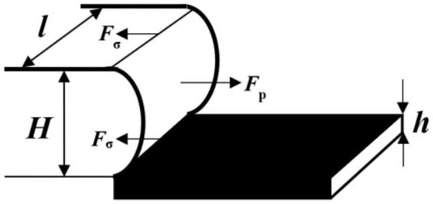
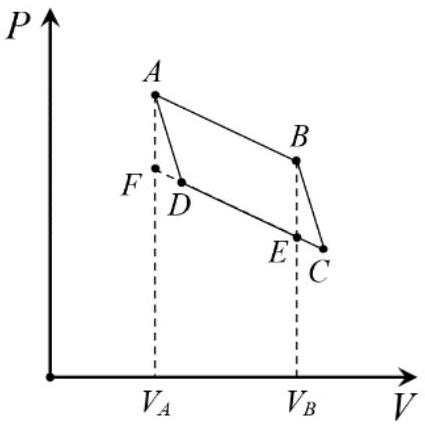
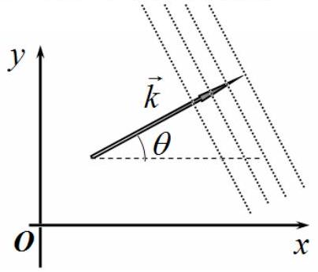

## SOLUTIONS TO THE PROBLEMS OF THE THEORETICAL COMPETITION   Attention. Points in grading are not divided!   Problem 1 (10.0 points)   Problem 1.1 (4.0 points)

Let $x$ be the spring compression, and $y$ be the change in the water level in the tube leg in which the pistons are located. When water moves in a tube, an inertial force acts on the body, which is equal to

$$
\begin{equation*}
F = - m \ddot { y } , \tag{1}
\end{equation*}
$$

so that the equation of the weight motion is written as

$$
\begin{equation*}
m \ddot { x } = - k x + m g - m \ddot { y } . \tag{2}
\end{equation*}
$$

The equation of motion of water in the tube has the form

$$
\begin{equation*}
\rho s l \ddot { y } = - 2 \rho \operatorname { sg } y + k x . \tag{3}
\end{equation*}
$$

The new equilibrium position is determined by the conditions $x = x _ { 0 } =$ const and $y = y _ { 0 } =$ const , so that substitution into equations (2) and (3) gives rise to

$$
\begin{align*}
& x _ { 0 } = \frac { m g } { k } ,  \tag{4}\\
& y _ { 0 } = \frac { k x _ { 0 } } { 2 \rho g s } = \frac { m } { 2 \rho s } . \tag{5}
\end{align*}
$$

According to the problem statement, it is said that the system performs harmonic oscillations about the new equilibrium position, therefore, a solution to equations (2) and (3) is sought in the following form

$$
\begin{align*}
& x = x _ { 0 } + A \cos \omega t  \tag{6}\\
& y = y _ { 0 } + B \cos \omega t \tag{7}
\end{align*}
$$

and after substitution we obtain the following set of equations

$$
\begin{align*}
& A \left( \omega _ { 1 } ^ { 2 } - \omega ^ { 2 } \right) = B \omega ^ { 2 } ,  \tag{8}\\
& A \omega _ { 3 } ^ { 2 } = B \left( \omega _ { 2 } ^ { 2 } - \omega ^ { 2 } \right) , \tag{9}
\end{align*}
$$

where $\omega _ { 1 } ^ { 2 } = \frac { k } { m } , \omega _ { 2 } ^ { 2 } = \frac { 2 g } { l } , \omega _ { 3 } ^ { 2 } = \frac { k } { \rho s l }$.
After dividing equations (8) and (9), we obtain a quadratic equation for a possible oscillation frequencies

$$
\begin{equation*}
\left( \omega _ { 1 } ^ { 2 } - \omega ^ { 2 } \right) \left( \omega _ { 2 } ^ { 2 } - \omega ^ { 2 } \right) = \omega ^ { 2 } \omega _ { 3 } ^ { 2 } , \tag{10}
\end{equation*}
$$

which admits the solution

$$
\begin{equation*}
\omega _ { 1,2 } ^ { 2 } = \frac { \omega _ { 1 } ^ { 2 } + \omega _ { 2 } ^ { 2 } + \omega _ { 3 } ^ { 2 } \pm \sqrt { \left( \omega _ { 1 } ^ { 2 } + \omega _ { 2 } ^ { 2 } + \omega _ { 3 } ^ { 2 } \right) ^ { 2 } - 4 \omega _ { 1 } ^ { 2 } \omega _ { 2 } ^ { 2 } } } { 2 } . \tag{11}
\end{equation*}
$$

Note that both roots are always positive and give the following possible frequencies of harmonic oscillations

$$
\begin{align*}
& \omega _ { 1 } = \sqrt { \frac { \omega _ { 1 } ^ { 2 } + \omega _ { 2 } ^ { 2 } + \omega _ { 3 } ^ { 2 } - \sqrt { \left( \omega _ { 1 } ^ { 2 } + \omega _ { 2 } ^ { 2 } + \omega _ { 3 } ^ { 2 } \right) ^ { 2 } - 4 \omega _ { 1 } ^ { 2 } \omega _ { 2 } ^ { 2 } } } { 2 } } = 5.19 s ^ { - 1 }  \tag{12}\\
& \omega _ { 2 } = \sqrt { \frac { \omega _ { 1 } ^ { 2 } + \omega _ { 2 } ^ { 2 } + \omega _ { 3 } ^ { 2 } + \sqrt { \left( \omega _ { 1 } ^ { 2 } + \omega _ { 2 } ^ { 2 } + \omega _ { 3 } ^ { 2 } \right) ^ { 2 } - 4 \omega _ { 1 } ^ { 2 } \omega _ { 2 } ^ { 2 } } } { 2 } } = 12.07 s ^ { - 1 } \tag{13}
\end{align*}
$$

In reality, the motion of the system is represented by the addition of harmonic oscillations with frequencies (12) and (13).

| Content | Points |
| :--- | :--- |
| Formula (1): $F = - m \ddot { y }$ | 0.3 |
| Formula (2): $m \ddot { x } = - k x + m g - m \ddot { y }$ | 0.3 |

| Formula (3): $\rho s l \ddot { y } = - 2 \rho s g y + k x$ | 0.3 |
| :--- | :--- |
| Formula (4): $x _ { 0 } = \frac { m g } { k }$ | 0.3 |
| Formula (5): $y _ { 0 } = \frac { k x _ { 0 } } { 2 \rho g s } = \frac { m } { 2 \rho s }$ | 0.3 |
| Formula (6): $x = x _ { 0 } + A \cos \omega t$ | 0.3 |
| Formula (7): $y = y _ { 0 } + B \cos \omega t$ | 0.3 |
| Formula (8): $A \left( \omega _ { 1 } ^ { 2 } - \omega ^ { 2 } \right) = B \omega ^ { 2 }$ | 0.2 |
| Formula (9): $A \omega _ { 3 } ^ { 2 } = B \left( \omega _ { 2 } ^ { 2 } - \omega ^ { 2 } \right)$ | 0.2 |
| Formula (10): $\left( \omega _ { 1 } ^ { 2 } - \omega ^ { 2 } \right) \left( \omega _ { 2 } ^ { 2 } - \omega ^ { 2 } \right) = \omega ^ { 2 } \omega _ { 3 } ^ { 2 }$ | 0.4 |
| Formula (11): $\omega _ { 1,2 } ^ { 2 } = \frac { \omega _ { 1 } ^ { 2 } + \omega _ { 2 } ^ { 2 } + \omega _ { 3 } ^ { 2 } \pm \sqrt { \left( \omega _ { 1 } ^ { 2 } + \omega _ { 2 } ^ { 2 } + \omega _ { 3 } ^ { 2 } \right) ^ { 2 } - 4 \omega _ { 1 } ^ { 2 } \omega _ { 2 } ^ { 2 } } } { 2 }$ | 0.3 |
| Formula (12): $\omega _ { 1 } = \sqrt { \frac { \omega _ { 1 } ^ { 2 } + \omega _ { 2 } ^ { 2 } + \omega _ { 3 } ^ { 2 } - \sqrt { \left( \omega _ { 1 } ^ { 2 } + \omega _ { 2 } ^ { 2 } + \omega _ { 3 } ^ { 2 } \right) ^ { 2 } - 4 \omega _ { 1 } ^ { 2 } \omega _ { 2 } ^ { 2 } } } { 2 } }$ | 0.2 |
| Numerical value in formula (12): $\omega _ { 1 } = 5.19 s ^ { - 1 }$ | 0.2 |
| Formula (13): $\omega _ { 2 } = \sqrt { \frac { \omega _ { 1 } ^ { 2 } + \omega _ { 2 } ^ { 2 } + \omega _ { 3 } ^ { 2 } + \sqrt { \left( \omega _ { 1 } ^ { 2 } + \omega _ { 2 } ^ { 2 } + \omega _ { 3 } ^ { 2 } \right) ^ { 2 } - 4 \omega _ { 1 } ^ { 2 } \omega _ { 2 } ^ { 2 } } } { 2 } }$ | 0.2 |
| Numerical value in formula (13): $\omega _ { 2 } = 12.07 s ^ { - 1 }$ | 0.2 |
| Total | 4.0 |

## Problem 1.2 (3.0 points)

The plate has volume

$$
\begin{equation*}
V = a ^ { 2 } h , \tag{1}
\end{equation*}
$$

and it is subject to the gravity force

$$
\begin{equation*}
F _ { p } = \rho V g . \tag{2}
\end{equation*}
$$

At the line of contact between the plate and water, a difference in water levels occurs, as shown in the figure below.

As a result, on the lower surface of the plate with the area

$$
\begin{equation*}
S = a ^ { 2 } \tag{3}
\end{equation*}
$$

differential pressure applies

$$
\begin{equation*}
\Delta p = \rho _ { 0 } g ( H + h ) , \tag{4}
\end{equation*}
$$

which results in a vertically upward force

$$
\begin{equation*}
F = \Delta p S . \tag{5}
\end{equation*}
$$

To determine the value of $H$, we select a certain volume of water with the width $l$ near its contact line with the plate. It is subject to the surface tension force equal to

$$
\begin{equation*}
F _ { \sigma } = 2 \sigma l , \tag{6}
\end{equation*}
$$

as well as the force due to the pressure of the liquid column

$$
\begin{equation*}
F _ { \bar { p } } = \bar { p } \Delta S , \tag{7}
\end{equation*}
$$

where the average pressure ia found as

$$
\begin{equation*}
\bar { p } = \frac { 1 } { 2 } \rho _ { 0 } g H \tag{8}
\end{equation*}
$$

together with the cross-sectional area

$$
\begin{equation*}
\Delta S = H l . \tag{9}
\end{equation*}
$$

From the water equilibrium condition

$$
\begin{equation*}
F _ { \sigma } = F _ { \bar { p } } \tag{10}
\end{equation*}
$$

it follows that the height difference is obtained as

$$
\begin{equation*}
H = 2 \sqrt { \frac { \sigma } { \rho _ { 0 } g } } . \tag{11}
\end{equation*}
$$

The additional weight on the plate is acted upon by the gravity force

$$
\begin{equation*}
F _ { m } = m g , \tag{12}
\end{equation*}
$$

and equilibrium condition

$$
\begin{equation*}
F _ { p } + F _ { m } = F \tag{13}
\end{equation*}
$$

the mass of the weight is finally derived as

$$
\begin{equation*}
m = \left( \rho _ { 0 } - \rho \right) a ^ { 2 } h + 2 a ^ { 2 } \sqrt { \frac { \sigma \rho _ { 0 } } { g } } = 52.6 g . \tag{14}
\end{equation*}
$$

| Content | Points |
| :--- | :--- |
| Formula (1): $V = a ^ { 2 } h$ | 0.2 |
| Formula (2): $F _ { p } = \rho V g$ | 0.2 |
| Formula (3): $S = a ^ { 2 }$ | 0.2 |
| Formula (4): $\Delta p = \rho _ { 0 } g ( H + h )$ | 0.2 |
| Formula (5): $F = \Delta p S$ | 0.2 |
| Formula (6): $F _ { \sigma } = 2 \sigma l$ | 0.2 |
| Formula (7): $F _ { \bar { p } } = \bar { p } \Delta S$ | 0.2 |
| Formula (8): $\bar { p } = \frac { 1 } { 2 } \rho _ { 0 } g H$ | 0.2 |
| Formula (9): $\Delta S = H l$ | 0.2 |
| Formula (10): $F _ { \sigma } = F _ { \bar { p } }$ | 0.2 |
| Formula (11): $H = 2 \sqrt { \frac { \sigma } { \rho _ { 0 } g } }$ | 0.2 |
| Formula (12): $F _ { m } = m g$ | 0.2 |
| Formula (13): $F _ { p } + F _ { m } = F$ | 0.2 |
| Formula (14): $m = \left( \rho _ { 0 } - \rho \right) a ^ { 2 } h + 2 a ^ { 2 } \sqrt { \frac { \sigma \rho _ { 0 } } { g } }$ | 0.2 |
| Numerical value in formula (14): $m = 52.6 g$ | 0.2 |
| Total | 3.0 |

## Problem 1.3 (3.0 points)

The current through the coil cannot change instantly and immediately after the key $K$ is shorted it remains equal to zero. At the same time, since the resistance of the connecting wires is very small, the capacitors $C _ { 1 }$ and $C _ { 2 }$ are almost instantly charged up to charges $q _ { 10 }$ and $q _ { 20 }$ respectively, whereas the capacitor $C _ { 3 }$ remains uncharged

$$
\begin{equation*}
q _ { 30 } = 0 , \tag{1}
\end{equation*}
$$

since it can only be charged through the coil. Note that Joule heat is generated in the connecting wires.
Thus, at the initial moment of time, the capacitors $C _ { 1 }$ and $C _ { 2 }$ are connected in series to a constant voltage source $U _ { 0 }$ and their charges are equal

$$
\begin{equation*}
q _ { 10 } = q _ { 20 } , \tag{2}
\end{equation*}
$$

and the corresponding voltages add up, so that

$$
\begin{equation*}
\frac { q _ { 10 } } { C _ { 1 } } + \frac { q _ { 20 } } { C _ { 2 } } = U _ { 0 } . \tag{3}
\end{equation*}
$$

Thus, we find from equations (2) and (3) that

$$
\begin{equation*}
q _ { 10 } = q _ { 20 } = \frac { C _ { 1 } C _ { 2 } } { C _ { 1 } + C _ { 2 } } U _ { 0 } . \tag{4}
\end{equation*}
$$

The total energy of the system immediately after the key $K$ shortening turns out to be

$$
\begin{equation*}
W _ { 0 } = \frac { q _ { 10 } ^ { 2 } } { 2 C _ { 1 } } + \frac { q _ { 20 } ^ { 2 } } { 2 C _ { 2 } } = \frac { C _ { 1 } C _ { 2 } U _ { 0 } ^ { 2 } } { 2 \left( C _ { 1 } + C _ { 2 } \right) } . \tag{5}
\end{equation*}
$$

After charging the capacitors $C _ { 1 }$ and $C _ { 2 }$, the current through the coil starts to increase and harmonic oscillations are generated in the system, at which Joule losses can already be neglected, since the resistance of the connecting wires is very small.

Note that at that moment in time when the current in the coil is maximum, the voltage across it is zero and the capacitors $C _ { 2 }$ and $C _ { 3 }$ turn out to be connected in parallel. For such a connection of capacitors, the following relations for charges are satisfied

$$
\begin{align*}
& q _ { 1 } = q _ { 2 } + q _ { 3 } .  \tag{6}\\
& \frac { q _ { 2 } } { C _ { 2 } } = \frac { q _ { 3 } } { C _ { 3 } } .  \tag{7}\\
& \frac { q _ { 1 } } { C _ { 1 } } + \frac { q _ { 2 } } { C _ { 2 } } = U _ { 0 } . \tag{8}
\end{align*}
$$

Solving together the set of equations (6)-(8), we find the charges of the capacitors

$$
\begin{align*}
& q _ { 1 } = \frac { C _ { 1 } \left( C _ { 2 } + C _ { 3 } \right) } { C _ { 1 } + C _ { 2 } + C _ { 3 } } U _ { 0 } .  \tag{9}\\
& q _ { 2 } = \frac { C _ { 1 } C _ { 2 } } { C _ { 1 } + C _ { 2 } + C _ { 3 } } U _ { 0 } .  \tag{10}\\
& q _ { 3 } = \frac { C _ { 1 } C _ { 3 } } { C _ { 1 } + C _ { 2 } + C _ { 3 } } U _ { 0 } , \tag{11}
\end{align*}
$$

and the energy of the system in this state is obviously equal to

$$
\begin{equation*}
W = \frac { C _ { 1 } \left( C _ { 2 } + C _ { 3 } \right) U _ { 0 } ^ { 2 } } { 2 \left( C _ { 1 } + C _ { 2 } + C _ { 3 } \right) } + \frac { L I _ { \max } ^ { 2 } } { 2 } . \tag{12}
\end{equation*}
$$

In this case, the work of the source is found as

$$
\begin{equation*}
A = \left( q _ { 1 } - q _ { 10 } \right) U _ { 0 } , \tag{13}
\end{equation*}
$$

and the energy conservation law is written in the following form

$$
\begin{equation*}
W _ { 0 } + A = W , \tag{14}
\end{equation*}
$$

which provides the maximum currect

$$
\begin{equation*}
I _ { \max } = \sqrt { \frac { C _ { 3 } } { \left( C _ { 1 } + C _ { 2 } \right) \left( C _ { 1 } + C _ { 2 } + C _ { 3 } \right) L } } C _ { 1 } U _ { 0 } . \tag{15}
\end{equation*}
$$

Finding the minimum voltage $U _ { \text {min } }$ across the capacitor $C _ { 2 }$ is a slightly more difficult task that has a rather simple solution. It is obvious that harmonic oscillations occur in the system, at which the potential energy is constantly transformed into kinetic energy and backwards. For the presented electrical circuit, the

role of the kinetic energy is played by the energy of the coil. Therefore, when the current through the coil is zero, then the system is in its large deviation from equilibrium, while the voltage across the capacitor $C _ { 2 }$ is

$$
\begin{equation*}
U _ { 20 } = \frac { q _ { 20 } } { C _ { 2 } } = \frac { C _ { 1 } } { C _ { 1 } + C _ { 2 } } U _ { 0 } . \tag{16}
\end{equation*}
$$

Note that the zero coil current corresponds to the initial moment when the key $K$ is just shorted.
After a quarter of a period has passed, the current in the coil becomes maximum and the system passes the equilibrium position, whereas the voltage across the capacitor $C _ { 2 }$ drops to the value

$$
\begin{equation*}
U _ { 2 } = \frac { q _ { 2 } } { C _ { 2 } } = \frac { C _ { 1 } } { C _ { 1 } + C _ { 2 } + C _ { 3 } } U _ { 0 } , \tag{17}
\end{equation*}
$$

that is, it falls by $U _ { 20 } - U _ { 2 }$. After another quarter of the period, the voltage across the capacitor will further drop by the same amount, which is, at the same time, equal to $U _ { 2 } - U _ { \text {min } }$, so the minimum voltage is ultimately obtained as

$$
\begin{equation*}
U _ { \min } = 2 U _ { 2 } - U _ { 20 } = \frac { C _ { 1 } \left( C _ { 1 } + C _ { 2 } - C _ { 3 } \right) } { \left( C _ { 1 } + C _ { 2 } \right) \left( C _ { 1 } + C _ { 2 } + C _ { 3 } \right) } U _ { 0 } . \tag{18}
\end{equation*}
$$

| Content | Points |
| :--- | :--- |
| Formula (1): $q _ { 30 } = 0$ | 0.2 |
| Formula (2): $q _ { 10 } = q _ { 20 }$ | 0.2 |
| Formula (3): $\frac { q _ { 10 } } { C _ { 1 } } + \frac { q _ { 20 } } { C _ { 2 } } = U _ { 0 }$ | 0.2 |
| Formula (4): $q _ { 10 } = q _ { 20 } = \frac { C _ { 1 } C _ { 2 } } { C _ { 1 } + C _ { 2 } } U _ { 0 }$ | 0.2 |
| Formula (5): $W _ { 0 } = \frac { q _ { 10 } ^ { 2 } } { 2 C _ { 1 } } + \frac { q _ { 20 } ^ { 2 } } { 2 C _ { 2 } } = \frac { C _ { 1 } C _ { 2 } U _ { 0 } ^ { 2 } } { 2 \left( C _ { 1 } + C _ { 2 } \right) }$ | 0.2 |
| Formula (6): $q _ { 1 } = q _ { 2 } + q _ { 3 }$ | 0.2 |
| Formula (7): $\frac { q _ { 2 } } { C _ { 2 } } = \frac { q _ { 3 } } { C _ { 3 } }$ | 0.2 |
| Formula (8): $\frac { q _ { 1 } } { C _ { 1 } } + \frac { q _ { 2 } } { C _ { 2 } } = U _ { 0 }$ | 0.2 |
| Formula (10): $q _ { 2 } = \frac { C _ { 1 } C _ { 2 } } { C _ { 1 } + C _ { 2 } + C _ { 3 } } U _ { 0 }$ | 0.2 |
| Formula (12): $W = \frac { C _ { 1 } \left( C _ { 2 } + C _ { 3 } \right) U _ { 0 } ^ { 2 } } { 2 \left( C _ { 1 } + C _ { 2 } + C _ { 3 } \right) } + \frac { L I _ { \text {max } } ^ { 2 } } { 2 }$ | 0.2 |
| Formula (13): $A = \left( q _ { 1 } - q _ { 10 } \right) U _ { 0 }$ | 0.2 |
| Formula (14): $W _ { 0 } + A = W$ | 0.2 |
| Formula (15): $I _ { \text {max } } = \sqrt { \frac { C _ { 3 } } { \left( C _ { 1 } + C _ { 2 } \right) \left( C _ { 1 } + C _ { 2 } + C _ { 3 } \right) L } } C _ { 1 } U _ { 0 }$ | 0.2 |
| Formula (18): $U _ { \text {min } } = 2 U _ { 2 } - U _ { 20 }$ | 0.2 |
| Formula (18): $U _ { \text {min } } = \frac { C _ { 1 } \left( C _ { 1 } + C _ { 2 } - C _ { 3 } \right) } { \left( C _ { 1 } + C _ { 2 } \right) \left( C _ { 1 } + C _ { 2 } + C _ { 3 } \right) } U _ { 0 }$ | 0.2 |
| Total | 3.0 |

## Problem 2. Thermodynamics of one-component plasma ( $\mathbf { 1 0 . 0 }$ points)

2.1 The smallest distance between neighboring deuterium nuclei coincides with the edge of the cube, and since there is 1 nucleus per cube, their concentration is

$$
\begin{equation*}
n = \frac { 1 } { a ^ { 3 } } , \tag{1}
\end{equation*}
$$

therefore

$$
\begin{equation*}
a = \frac { 1 } { \sqrt [ 3 ] { n } } = 8.51 \cdot 10 ^ { - 12 } м \tag{2}
\end{equation*}
$$

2.2 The electrostatic energy of interaction of two nuclei located at the distance $a$ from each other is found as

$$
\begin{equation*}
W _ { p } = \frac { e ^ { 2 } } { 4 \pi \varepsilon _ { 0 } a } , \tag{3}
\end{equation*}
$$

and their thermal energy is evaluated by the formula

$$
\begin{equation*}
E _ { T } = k _ { B } T , \tag{4}
\end{equation*}
$$

whence the sought ratio is obtained in the form

$$
\begin{equation*}
\Gamma = \frac { W _ { p } } { E _ { T } } = \frac { e ^ { 2 } } { 4 \pi \varepsilon _ { 0 } a k _ { B } T } = 111 . \tag{5}
\end{equation*}
$$

2.3 In general, the spherical cell is neutral, and its radius is equal to

$$
\begin{equation*}
R = a / 2 \tag{6}
\end{equation*}
$$

with the corresponding volume

$$
\begin{equation*}
V = \frac { 4 } { 3 } \pi R ^ { 3 } , \tag{7}
\end{equation*}
$$

therefore, the bulk charge density is expressed as

$$
\begin{equation*}
\rho = - \frac { e } { V } = - \frac { 6 e } { \pi a ^ { 3 } } = - \frac { 6 } { \pi } n e = - 4.95 \cdot 10 ^ { 14 } \mathrm { Cl } / \mathrm { m } ^ { 3 } . \tag{8}
\end{equation*}
$$

2.4 Let us apply Gauss's theorem

$$
\begin{equation*}
\oint _ { S } \mathbf { E } \cdot d \mathbf { S } = \frac { Q } { \varepsilon _ { 0 } } \tag{9}
\end{equation*}
$$

to the sphere of radius $r$ centered at the location of the nucleus. The flux of the electric field strength $E$ through this sphere, due to symmetry, is delivered by

$$
\begin{equation*}
\oint _ { S } \mathbf { E } \cdot d \mathbf { S } = E 4 \pi r ^ { 2 } , \tag{10}
\end{equation*}
$$

and the net charge $Q$ inside the sphere is obtained as

$$
\begin{equation*}
Q = e + \rho \frac { 4 } { 3 } \pi r ^ { 3 } . \tag{11}
\end{equation*}
$$

It follows from equations (9)-(11) that

$$
\begin{equation*}
E = \frac { e } { 4 \pi \varepsilon _ { 0 } r ^ { 2 } } + \frac { \rho r } { 3 \varepsilon _ { 0 } } , \tag{12}
\end{equation*}
$$

and the sought potential difference is determined by the expression

$$
\begin{equation*}
\varphi ( a / 4 ) - \varphi ( a / 2 ) = - \int _ { a / 2 } ^ { a / 4 } E d r , \tag{13}
\end{equation*}
$$

which finally yields

$$
\begin{equation*}
\varphi ( a / 4 ) - \varphi ( a / 2 ) = \frac { 5 e } { 16 \pi \varepsilon _ { 0 } a } = 211 V . \tag{14}
\end{equation*}
$$

2.5 The second term on the right-hand side of expression (12) determines the strength of the electric field created by the uniform charge distribution; therefore, the equation of motion of the nucleus projected onto the radial direction has the form

$$
\begin{equation*}
m \ddot { r } = \frac { e \rho } { 3 \varepsilon _ { 0 } } r , \tag{15}
\end{equation*}
$$

which is an equation of harmonic oscillations with a frequency

$$
\begin{equation*}
\omega _ { p } = \sqrt { - \frac { e \rho } { 3 m _ { p } \varepsilon _ { 0 } } } = \sqrt { \frac { 2 e ^ { 2 } } { \pi m _ { p } \varepsilon _ { 0 } a ^ { 3 } } } = \sqrt { \frac { 2 n e ^ { 2 } } { \pi m _ { p } \varepsilon _ { 0 } } } = 2.94 \cdot 10 ^ { 16 } s ^ { - 1 } . \tag{16}
\end{equation*}
$$

2.6 At a fixed temperature, the mean square thermal velocity of the nucleus is derived as

$$
\begin{equation*}
v = \sqrt { \frac { k _ { B } T } { m _ { p } } } , \tag{17}
\end{equation*}
$$

and the corresponding amplitude of deviation from the equilibrium position is determined as

$$
\begin{equation*}
A = \frac { v } { \omega _ { p } } = 2,85 \cdot 10 ^ { - 13 } \mathrm {~m} . \tag{18}
\end{equation*}
$$

It can be seen that the condition $A \ll a$ holds, i.e. the deuterium nuclei do indeed perform small oscillations near their equilibrium positions.
2.7 The internal energy of the system consists of the thermal energy of the thermal motiont of nuclei and the electrostatic energy of each cell. In turn, the electrostatic energy of each cell consists of the interaction energy of nuclei with the surrounding electron neutralizing background and the energy of the background itself.

Let us divide the cell into spherical layers and consider the layer located at the distance $r$ from the cell center and having the thickness $d r$. Its charge is obtained as

$$
\begin{equation*}
d q = \rho 4 \pi r ^ { 2 } d r , \tag{19}
\end{equation*}
$$

and the corresponding interaction energy with the nucleus is

$$
\begin{equation*}
W _ { 1 } = \int _ { 0 } ^ { R } \frac { e d q } { 4 \pi \varepsilon _ { 0 } r } = - \frac { 3 e ^ { 2 } } { 4 \pi \varepsilon _ { 0 } a } . \tag{20}
\end{equation*}
$$

The energy density of the electric field is found by the formula

$$
\begin{equation*}
w = \frac { 1 } { 2 } \varepsilon _ { 0 } E ^ { 2 } , \tag{21}
\end{equation*}
$$

and since the electric field strength of the uniform background is determined by the second term in expression (12) and outside the sphere has the form like that of a point-дшлу charge, which formally coincides with the first term of expression (12),, then the electrostatic energy of the uniform background is evaluated as follows

$$
\begin{equation*}
W _ { 2 } = \frac { 1 } { 2 } \varepsilon _ { 0 } \int _ { 0 } ^ { R } \left( \frac { \rho r } { 3 \varepsilon _ { 0 } } \right) ^ { 2 } 4 \pi r ^ { 2 } d r + \frac { 1 } { 2 } \varepsilon _ { 0 } \int _ { R } ^ { \infty } \left( \frac { e } { 4 \pi \varepsilon _ { 0 } r ^ { 2 } } \right) ^ { 2 } 4 \pi r ^ { 2 } d r = \frac { 3 e ^ { 2 } } { 10 \pi \varepsilon _ { 0 } a } . \tag{22}
\end{equation*}
$$

Thus, the total electrostatic energy of a single cell is written as

$$
\begin{equation*}
W = W _ { 1 } + W _ { 2 } = - \frac { 9 e ^ { 2 } } { 20 \pi \varepsilon _ { 0 } a } \tag{23}
\end{equation*}
$$

and is equal to the work that must be done to create it.
As shown above, the nucleus in the cell center is a three-dimensional harmonic oscillator, so its thermal chaotic energy is determined as

$$
\begin{equation*}
E = 3 N k _ { B } T , \tag{24}
\end{equation*}
$$

and hence the internal energy of $N$ cells has the form

$$
\begin{equation*}
U = E + N W = 3 N k _ { B } T - \frac { 9 e ^ { 2 } } { 20 \pi \varepsilon _ { 0 } } \frac { N ^ { 4 / 3 } } { V ^ { 1 / 3 } } . \tag{25}
\end{equation*}
$$

Thus, the sought constants are found as

$$
\begin{align*}
& \alpha _ { 1 } = 3 k _ { B } T ,  \tag{26}\\
& \alpha _ { 2 } = - \frac { 9 e ^ { 2 } } { 20 \pi \varepsilon _ { 0 } } . \tag{27}
\end{align*}
$$

2.8 In the absence of the neutralizing backgrounds of two nuclei, their fusion corresponds to the bare Coulomb barrier. The presence of neutralizing backgrounds leads to a decrease in the Coulomb barrier, which is obviously determined by the interaction of nuclei with their backgrounds and the self-energy of the backgrounds, i.e. by expression (23). In this case, the thermal energy of nuclei remains small in comparison with the lowering of the Coulomb barrier.

Each of the two cells before fusing has the electrostatic energy

$$
\begin{equation*}
W = - \frac { 9 e ^ { 2 } n ^ { 1 / 3 } } { 20 \pi \varepsilon _ { 0 } } . \tag{28}
\end{equation*}
$$

After fusion, a new cell is formed with the volume

$$
\begin{equation*}
V ^ { \prime } = 2 V \tag{29}
\end{equation*}
$$

with a helium nucleus in the center having an electric charge

$$
\begin{equation*}
e ^ { \prime } = 2 e . \tag{30}
\end{equation*}
$$

In accordance with the general formula, the electrostatic energy of the formed cell is derived as

$$
\begin{equation*}
W ^ { \prime } = - 2 ^ { 5 / 3 } \frac { 9 e ^ { 2 } n ^ { 1 / 3 } } { 20 \pi \varepsilon _ { 0 } } , \tag{31}
\end{equation*}
$$

whence the following expression for the Coulomb barrier lowering is obtained

$$
\begin{equation*}
\delta U _ { c } = 2 W - W ^ { \prime } = \frac { \left( 2 ^ { 2 / 3 } - 1 \right) 9 e ^ { 2 } n ^ { 1 / 3 } } { 10 \pi \varepsilon _ { 0 } } = 5.72 \cdot 10 ^ { - 17 } J . \tag{32}
\end{equation*}
$$

2.9 The circular process $A B C D$ is the Carnot cycle. Let us denote the temperature on the isotherm $A B$ as $T _ { A B }$, and on the isotherm $C D$ as $T _ { C D }$, while they differ very little from each other, so that $T _ { A B } \approx T _ { C D } \approx T$ and $T _ { A B } - T _ { C D } \ll T$. The work $A$ done in the cycle is equal to the area of the parallelogram $A B C D$, which is, in turn, equal to the area of the parallelogram $A B E F$. Since $A F = ( \partial P / \partial T ) _ { V } \left( T _ { A B } - T _ { C D } \right)$, the work in the cycle is derived as

$$
\begin{equation*}
A = \left( \frac { \partial P } { \partial T } \right) _ { V } \left( T _ { A B } - T _ { C D } \right) \left( V _ { B } - V _ { A } \right) . \tag{33}
\end{equation*}
$$

In the process $A B$, the temperature is constant, so the change in internal energy is expressed as

$$
\begin{equation*}
U _ { B } - U _ { A } = \left( \frac { \partial U } { \partial V } \right) _ { T } \left( V _ { B } - V _ { A } \right) , \tag{34}
\end{equation*}
$$

and the supplied amount of heat according to the first law of thermodynamics takes the form

$$
\begin{equation*}
Q = U _ { B } - U _ { A } + P \left( V _ { B } - V _ { A } \right) . \tag{35}
\end{equation*}
$$

Since the process $A B C D$ is a Carnot cycle, its efficiency is written as

$$
\begin{equation*}
\frac { A } { Q } = \frac { T _ { A B } - T _ { C D } } { T _ { A B } } , \tag{36}
\end{equation*}
$$

and combining equations (33) - (36), we obtain the required relation

$$
\begin{equation*}
\left( \frac { \partial U } { \partial V } \right) _ { T } = T \left( \frac { \partial P } { \partial T } \right) _ { V } - P . \tag{37}
\end{equation*}
$$

2.10 Substituting formula (25) into equation (37), we obtain the first-order differential equation

$$
\begin{equation*}
T \left( \frac { \partial P } { \partial T } \right) _ { V } - P = \frac { 3 e ^ { 2 } } { 20 \pi \varepsilon _ { 0 } } \frac { N ^ { 4 / 3 } } { V ^ { 4 / 3 } } , \tag{38}
\end{equation*}
$$

whose solution takes the form

$$
\begin{equation*}
P ( T , V ) = C ( V ) T - \frac { 3 e ^ { 2 } } { 20 \pi \varepsilon _ { 0 } } \frac { N ^ { 4 / 3 } } { V ^ { 4 / 3 } } , \tag{39}
\end{equation*}
$$

where $C ( V )$ refers to some constant, which, in principle, can depend on the volume of the system.
In the absence of interaction between the nuclei, the pressure of the system should be reduced to the pressure of an ideal gas

$$
\begin{equation*}
\left. P ( T , V ) \right| _ { e \rightarrow 0 } = \frac { N k _ { B } T } { V } , \tag{40}
\end{equation*}
$$

and we immediately find

$$
\begin{equation*}
P ( T , V ) = \frac { N k _ { B } T } { V } - \frac { 3 e ^ { 2 } } { 20 \pi \varepsilon _ { 0 } } \frac { N ^ { 4 / 3 } } { V ^ { 4 / 3 } } . \tag{41}
\end{equation*}
$$

Thus, the sought constants are obtained as

$$
\begin{align*}
& \beta _ { 1 } = k _ { B } T ,  \tag{42}\\
& \beta _ { 2 } = - \frac { 3 e ^ { 2 } } { 20 \pi \varepsilon _ { 0 } } .  \tag{43}\\
& \beta _ { 3 } = \frac { 4 } { 3 } . \tag{44}
\end{align*}
$$

Substituting the numerical values, we obtain the numerical value for the pressure

$$
\begin{equation*}
P = - 2,59 \cdot 10 ^ { 16 } \Pi a . \tag{45}
\end{equation*}
$$

The pressure turns out to be negative! In fact, the pressure of the entire system includes the pressure of the electronic component and is definitely positive.

|  | Content | Points |  |
| :--- | :--- | :--- | :--- |
| 2.1 | Formula (2): $a = \frac { 1 } { \sqrt [ 3 ] { n } }$ | 0.2 | 0.4 |
|  | Numerical value in formula (2): $a = 8.51 \cdot 10 ^ { - 12 } m$ | 0.2 |  |
| 2.2 | Formula (3): $W _ { p } = \frac { e ^ { 2 } } { 4 \pi \varepsilon _ { 0 } a }$ | 0.2 | 0.8 |
|  | Formula (4): $E _ { T } = k _ { B } T$ | 0.2 |  |
|  | Formula (5): $\Gamma = \frac { e ^ { 2 } } { 4 \pi \varepsilon _ { 0 } a k _ { B } T }$ | 0.2 |  |
|  | Numerical value in formula (5): $\Gamma = 111$ | 0.2 |  |
| 2.3 | Formula (6): $R = a / 2$ | 0.1 | 0.6 |
|  | Formula (7): $V = \frac { 4 } { 3 } \pi R ^ { 3 }$ | 0.1 |  |
|  | Formula (8): $\rho = - \frac { 6 } { \pi } n e$ | 0.2 |  |
|  | Numerical value in formula (8): $\rho = - 4.95 \cdot 10 ^ { 14 } \mathrm { Cl } / \mathrm { m } ^ { 3 }$ | 0.2 |  |
| 2.4 | Formula (9): $\oint _ { S } \mathbf { E } \cdot d \mathbf { S } = \frac { Q } { \varepsilon _ { 0 } }$ | 0.2 | 1.4 |
|  | Formula (10): $\oint _ { S } \mathbf { E } \cdot d \mathbf { S } = E 4 \pi r ^ { 2 }$ | 0.2 |  |
|  | Formula (11): $Q = e + \rho \frac { 4 } { 3 } \pi r ^ { 3 }$ | 0.2 |  |
|  | Formula (12): $E = \frac { e } { 4 \pi \varepsilon _ { 0 } r ^ { 2 } } + \frac { \rho r } { 3 \varepsilon _ { 0 } }$ | 0.2 |  |
|  | Formula (13): $\varphi ( a / 4 ) - \varphi ( a / 2 ) = - \int _ { a / 2 } ^ { a / 4 } E d r$ | 0.2 |  |
|  | Formula (14): $\varphi ( a / 4 ) - \varphi ( a / 2 ) = \frac { 5 e } { 16 \pi \varepsilon _ { 0 } a }$ | 0.2 |  |

|  | Numerical value in formula (14): $\varphi ( a / 4 ) - \varphi ( a / 2 ) = 211 V$ | 0.2 |  |
| :--- | :--- | :--- | :--- |
| 2.5 | Formula (15): $m \ddot { r } = \frac { e \rho } { 3 \varepsilon _ { 0 } } r$ | 0.2 | 0.6 |
|  | Formula (16): $\omega _ { p } = \sqrt { \frac { 2 n e ^ { 2 } } { \pi m _ { p } \varepsilon _ { 0 } } }$ | 0.2 |  |
|  | Numerical value in formula (16): $\omega _ { p } = 2.94 \cdot 10 ^ { 16 } s ^ { - 1 }$ | 0.2 |  |
| 2.6 | Formula (17): $v = \sqrt { \frac { k _ { B } T } { m _ { p } } }$ | 0.2 | 0.6 |
|  | Formula (18): $A = \frac { v } { \omega _ { p } }$ | 0.2 |  |
|  | Numerical value in formula (18): $A = 2.85 \cdot 10 ^ { - 13 } m$ | 0.2 |  |
| 2.7 | Formula (19): $d q = \rho 4 \pi r ^ { 2 } d r$ | 0.2 | 1.8 |
|  | Formula (20): $W _ { 1 } = - \frac { 3 e ^ { 2 } } { 4 \pi \varepsilon _ { 0 } a }$ | 0.2 |  |
|  | Formula (21): $w = \frac { 1 } { 2 } \varepsilon _ { 0 } E ^ { 2 }$ | 0.2 |  |
|  | Formula (22): $W _ { 2 } = \frac { 3 e ^ { 2 } } { 10 \pi \varepsilon _ { 0 } a }$ | 0.2 |  |
|  | Formula (23): $W = - \frac { 9 e ^ { 2 } } { 20 \pi \varepsilon _ { 0 } a }$ | 0.2 |  |
|  | Formula (24): $E = 3 N k _ { B } T$ | 0.2 |  |
|  | Formula (25): $U = E + N W = 3 N k _ { B } T - \frac { 9 e ^ { 2 } } { 20 \pi \varepsilon _ { 0 } } \frac { N ^ { 4 / 3 } } { V ^ { 1 / 3 } }$ | 0.2 |  |
|  | Formula (26): $\alpha _ { 1 } = 3 k _ { B } T$ | 0.2 |  |
|  | Formula (27): $\alpha _ { 2 } = - \frac { 9 e ^ { 2 } } { 20 \pi \varepsilon _ { 0 } }$ | 0.2 |  |
| 2.8 | Formula (28): $W = - \frac { 9 e ^ { 2 } n ^ { 1 / 3 } } { 20 \pi \varepsilon _ { 0 } }$ | 0.2 | 1.2 |
|  | Formula (29): $V ^ { \prime } = 2 V$ | 0.2 |  |
|  | Formula (30): $e ^ { \prime } = 2 e$ | 0.2 |  |
|  | Formula (31): $W ^ { \prime } = - 2 ^ { 5 / 3 } \frac { 9 e ^ { 2 } n ^ { 1 / 3 } } { 20 \pi \varepsilon _ { 0 } }$ | 0.2 |  |
|  | Formula (32): $\delta U _ { c } = \frac { \left( 2 ^ { 2 / 3 } - 1 \right) 9 e ^ { 2 } n ^ { 1 / 3 } } { 10 \pi \varepsilon _ { 0 } }$ | 0.2 |  |
|  | Numerical value in formula (32): $\delta U _ { c } = 5.72 \cdot 10 ^ { - 17 } J$ | 0.2 |  |
| 2.9 | Formula (33): $A = \left( \frac { \partial P } { \partial T } \right) _ { V } \left( T _ { A B } - T _ { C D } \right) \left( V _ { B } - V _ { A } \right)$ | 0.2 | 1.0 |
|  | Formula (34): $U _ { B } - U _ { A } = \left( \frac { \partial U } { \partial V } \right) _ { T } \left( V _ { B } - V _ { A } \right)$ | 0.2 |  |
|  | Formula (35): $Q = U _ { B } - U _ { A } + P \left( V _ { B } - V _ { A } \right)$ | 0.2 |  |

|  | Formula (36): $\frac { A } { Q } = \frac { T _ { A B } - T _ { C D } } { T _ { A B } }$ | 0.2 |  |
| :--- | :--- | :--- | :--- |
|  | Formula (37): $\left( \frac { \partial U } { \partial V } \right) _ { T } = T \left( \frac { \partial P } { \partial T } \right) _ { V } - P$ |  |  |
| 2.10 | Formula (38): $T \left( \frac { \partial P } { \partial T } \right) _ { V } - P = \frac { 3 e ^ { 2 } } { 20 \pi \varepsilon _ { 0 } } \frac { N ^ { 4 / 3 } } { V ^ { 4 / 3 } }$ | 0.2 |  |
|  | Formula (39): $P ( T , V ) = C ( V ) T - \frac { 3 e ^ { 2 } } { 20 \pi \varepsilon _ { 0 } } \frac { N ^ { 4 / 3 } } { V ^ { 4 / 3 } }$ | 0.2 |  |
|  | Formula (40): $\left. P ( T , V ) \right\| _ { e \rightarrow 0 } = \frac { N k _ { B } T } { V }$ | 0.2 |  |
|  | Formula (41): $P ( T , V ) = \frac { N k _ { B } T } { V } - \frac { 3 e ^ { 2 } } { 20 \pi \varepsilon _ { 0 } } \frac { N ^ { 4 / 3 } } { V ^ { 4 / 3 } }$ | 0.2 |  |
|  | Formula (42): $\beta _ { 1 } = k _ { B } T$ | 0.2 |  |
|  | Formula (43): $\beta _ { 2 } = - \frac { 3 e ^ { 2 } } { 20 \pi \varepsilon _ { 0 } }$ | 0.2 |  |
|  | Formula (44): $\beta _ { 3 } = \frac { 4 } { 3 }$ | 0.2 |  |
|  | Numerical value in formula (45): $P = - 2.59 \cdot 10 ^ { 16 } P a$ | 0.2 |  |
| Total |  |  | 10.0 |

## Problem 3. Optical waveguide (10.0 points) Description of waves

3.1 The function

$$
\begin{equation*}
\vec { E } ( t , x ) = \vec { E } _ { 0 } \cos ( \omega t - k x + \varphi ) , \tag{1}
\end{equation*}
$$

describing a wave at a fixed moment in time $t = t _ { 0 }$ gives the distribution of the electric field strength in space. When the coordinate is changed by the wavelength $\lambda$, the argument of the cosine must change to $2 \pi$, therefore

$$
\begin{equation*}
\left( \omega t _ { 0 } - k ( x + \lambda ) + \varphi \right) - \left( \omega t _ { 0 } - k x + \varphi \right) = 2 \pi . \tag{2}
\end{equation*}
$$

It follows from this relation that

$$
\begin{equation*}
k = \frac { 2 \pi } { \lambda } . \tag{3}
\end{equation*}
$$

Fixing a point in space $x = x _ { 0 }$ and reasoning similarly, we can write

$$
\begin{equation*}
\left( \omega ( t + T ) - k x _ { 0 } + \varphi \right) - \left( \omega t - k x _ { 0 } + \varphi \right) = 2 \pi , \tag{4}
\end{equation*}
$$

which yields

$$
\begin{equation*}
\omega = \frac { 2 \pi } { T } . \tag{5}
\end{equation*}
$$

3.2 The speed of propagation of a monochromatic wave is the speed of motion of a certain wave surface of constant phase. This surface satisfies the equation

$$
\begin{equation*}
\omega t - k x + \varphi = \text { const } . \tag{6}
\end{equation*}
$$

It follows from this relation that the wave propagation speed is

$$
\begin{equation*}
c = \frac { d x } { d t } = \frac { \omega } { k } . \tag{7}
\end{equation*}
$$

3.3 The surface of the constant phase at a fixed time instant satisfies the equation

$$
\begin{equation*}
\vec { k } \cdot \vec { r } = \text { const } , \tag{8}
\end{equation*}
$$

and this is a family of planes perpendicular to the wave vector.

3.4 Expanding the scalar product, we obtain the wave equation in the coordinate representation:

$$
\begin{equation*}
E = E _ { 0 } ^ { \prime } \cos ( \omega t - k x \cos \theta - k y \sin \theta + \varphi ) \tag{9}
\end{equation*}
$$

3.5 Since the superposition principle is valid for the electric field strength, we can write for a composite wave

$$
\begin{align*}
& E = E _ { 0 } \cos \left( \omega _ { 0 } t - k _ { 0 } x \right) + E _ { 0 } \cos \left( \left( \omega _ { 0 } + \Delta \omega \right) t - \left( k _ { 0 } + \Delta k \right) x \right) = \\
& = 2 E _ { 0 } \cos \left( \left( \omega _ { 0 } + \frac { \Delta \omega } { 2 } \right) t - \left( k _ { 0 } + \frac { \Delta k } { 2 } \right) x \right) \cos \left( \frac { \Delta \omega } { 2 } t - \frac { \Delta k } { 2 } x \right) . \tag{10}
\end{align*}
$$

Taking into account that $\Delta \omega \ll \omega _ { 0 }$, and, consequently, $\Delta k \ll k _ { 0 }$, we rewrite this expression as:

$$
\begin{equation*}
E = A _ { 0 } ( x , t ) \cos \left( \omega _ { 0 } t - k _ { 0 } x \right) . \tag{11}
\end{equation*}
$$

Here the following notation is used

$$
\begin{equation*}
A _ { 0 } ( x , t ) = 2 E _ { 0 } \cos \left( \frac { \Delta \omega } { 2 } t - \frac { \Delta k } { 2 } x \right) \tag{12}
\end{equation*}
$$

for slowly varying wave amplitude.
3.6 To determine the time duration of the packet, it should be taken into account that when passing from one "zero" of the cosine to the next, the argument of the cosine changes to $\pi$, therefore

$$
\begin{equation*}
\frac { \Delta \omega } { 2 } \tau = \pi \quad \Rightarrow \quad \tau = \frac { 2 \pi } { \Delta \omega } . \tag{13}
\end{equation*}
$$

Taking into account that $\Delta \omega = 2 \pi \Delta v$, we obtain from expression (13) the relationship between the packet duration and its spectral width as

$$
\begin{equation*}
\tau \Delta v = 1 . \tag{14}
\end{equation*}
$$

3.7 For a similar reasoning, it is not difficult to find that

$$
\begin{equation*}
\frac { \Delta k } { 2 } L = \pi \quad \Rightarrow \quad L = \frac { 2 \pi } { \Delta k } . \tag{15}
\end{equation*}
$$

3.8 The phase velocity can be found as the velocity of motion of the wave surface of constant phase. It is derived from function (11) that this surface satisfies the condition

$$
\begin{equation*}
\left( \omega _ { 0 } t - k _ { 0 } x \right) = \text { const } , \tag{16}
\end{equation*}
$$

which results in the phase velocity

$$
\begin{equation*}
v _ { p } = \frac { \omega _ { 0 } } { k _ { 0 } } . \tag{17}
\end{equation*}
$$

3.9 To determine the group velocity, we write down the condition that the wave amplitude, for example, is maximum

$$
\begin{equation*}
\frac { \Delta \omega } { 2 } t - \frac { \Delta k } { 2 } x = 0 . \tag{18}
\end{equation*}
$$

It is concluded from this expression that the group velocity is given by the formula

$$
\begin{equation*}
v _ { g } = \frac { \Delta \omega } { \Delta k } . \tag{19}
\end{equation*}
$$

3.10 For electromagnetic waves in vacuum, the relation $\lambda v = c$ is fulfilled, which validates

$$
\begin{equation*}
\omega = k c , \tag{20}
\end{equation*}
$$

and it is finally obtained that

$$
\begin{equation*}
v _ { p } = \frac { \omega } { k } = c , \tag{21}
\end{equation*}
$$

$$
\begin{equation*}
v _ { g } = \frac { \Delta \omega } { \Delta k } = c = v _ { p } , \tag{22}
\end{equation*}
$$

i.e. both the phase and group speeds are equal to the speed of light $c$ in a vacuum.

## Plane waveguide

3.11 The function proposed in the problem statement describes the field in a plane waveguide

$$
\begin{equation*}
E ( t , x , y ) = E _ { 0 } \cos \left( \omega t - k _ { x } x \right) \sin \left( k _ { y } y \right) \tag{23}
\end{equation*}
$$

and satisfies one boundary condition: at $y = 0$ the electric field strength $E = 0$. Therefore, one should choose such values of $k _ { y }$ so that the second boundary condition is fulfilled: at $y = a$ the field strength should also vanish. This condition is satisfied when

$$
\begin{equation*}
\sin k _ { y } a = 0 \Rightarrow k _ { y } a = m \pi \Rightarrow k _ { y } = m \frac { \pi } { a } . \tag{24}
\end{equation*}
$$

In the expressions above $m$ stands for a positive integer, $m = 1,2,3 \ldots$
3.12 Let us write the equations of symmetric waves

$$
\begin{align*}
& E _ { 1 } = E _ { 0 } ^ { \prime } \cos \left( \omega t - k _ { 0 } x \cos \theta + k _ { 0 } y \sin \theta + \varphi \right) ,  \tag{25}\\
& E _ { 2 } = E _ { 0 } ^ { \prime } \cos \left( \omega t - k _ { 0 } x \cos \theta - k _ { 0 } y \sin \theta - \varphi \right) , \tag{26}
\end{align*}
$$

where $k _ { 0 } = \frac { \omega } { c }$ is the wavenumber for waves, propagating at an angle $\pm \theta$ to the planes of the waveguide, and summing them up yileds

$$
\begin{equation*}
E = E _ { 1 } + E _ { 2 } = 2 E _ { 0 } ^ { \prime } \cos \left( \omega t - k _ { 0 } x \cos \theta \right) \cos \left( k _ { 0 } y \sin \theta + \varphi \right) , \tag{27}
\end{equation*}
$$

with the following relation

$$
\begin{equation*}
E _ { 0 } ^ { \prime } = E _ { 0 } / 2 . \tag{28}
\end{equation*}
$$

Note that there should be $\varphi = - \pi / 2$.
3.13 Comparison of the obtained formulas (23) and (27) implies that they coincide if

$$
\begin{align*}
& k _ { x } = k _ { 0 } \cos \theta ,  \tag{29}\\
& k _ { y } = k _ { 0 } \sin \theta . \tag{30}
\end{align*}
$$

3.14 Comparing the values of $k _ { y }$ in formulas (24) and (30), we find

$$
\begin{equation*}
k _ { y } = k _ { 0 } \sin \theta _ { m } = m \frac { \pi } { a } \Rightarrow \sin \theta _ { m } = m \frac { \pi } { a k _ { 0 } } . \tag{31}
\end{equation*}
$$

The wavenumber of the considered waves in vacuum is related to the wavelength by

$$
\begin{equation*}
k _ { 0 } = \frac { 2 \pi } { \lambda } , \tag{32}
\end{equation*}
$$

then the values of the possible angles are given by the formula

$$
\begin{equation*}
\sin \theta _ { m } = m \frac { \pi } { a k _ { 0 } } = m \frac { \lambda } { 2 a } . \tag{33}
\end{equation*}
$$

3.15 Equation (23) implies that the phase velocity of wave propagation in the waveguide is given by the formula

$$
\begin{equation*}
v _ { p } = \frac { \omega } { k _ { x } } = \frac { \omega } { k _ { 0 } \cos \theta } . \tag{34}
\end{equation*}
$$

Expressing the value of the cosine of the angle in terms of its sine, which is determined by formula (33), we obtain

$$
\begin{equation*}
v _ { p } = \frac { \omega } { k _ { 0 } \cos \theta } = \frac { \omega } { k _ { 0 } \sqrt { 1 - \sin ^ { 2 } \theta } } = \frac { \omega } { k _ { 0 } \sqrt { 1 - \left( m \frac { \lambda } { 2 a } \right) ^ { 2 } } } . \tag{35}
\end{equation*}
$$

Finally, using formulas relating frequencies, wavelengths and the speed of light in a vacuum $\frac { \omega } { k _ { 0 } } = c$, $\lambda = \frac { 2 \pi } { \omega } c$, it is derived that

$$
\begin{equation*}
v _ { p } = \frac { \omega } { k _ { 0 } \cos \theta } = \frac { \omega } { k _ { 0 } \sqrt { 1 - \sin ^ { 2 } \theta } } = \frac { c } { \sqrt { 1 - \left( m \frac { \pi c } { \omega a } \right) ^ { 2 } } } . \tag{36}
\end{equation*}
$$

Thus, it turns out that the phase velocity of propagation of an undamped wave in the waveguide is greater than the speed of light in vacuum.
3.16 The propagation velocity of a pulse is the group velocity, therefore, it is determined by formula (19), in which the ratio of the increments can be replaced by the derivative

$$
\begin{equation*}
v _ { g } = \frac { \Delta \omega } { \Delta k } = \frac { d \omega } { d k } = \left( \frac { d k } { d \omega } \right) ^ { - 1 } . \tag{37}
\end{equation*}
$$

To evaluate the velocity using this formula, it is necessary to obtain explicitly the dependence of the wavenumber on the frequency, $k ( \omega )$. To do so, we use the general formula for the phase velocity $v _ { p } = \frac { \omega } { k }$ and obtain

$$
\begin{equation*}
k = \frac { \omega } { v _ { p } } = \frac { \omega } { c } \sqrt { 1 - \left( m \frac { \pi c } { \omega a } \right) ^ { 2 } } = \frac { 1 } { c } \sqrt { \omega ^ { 2 } - \left( m \frac { \pi c } { a } \right) ^ { 2 } } , \tag{38}
\end{equation*}
$$

and the pulse propagation velocity is written as

$$
\begin{equation*}
v = v _ { g } = \left( \frac { d k } { d \omega } \right) ^ { - 1 } = \left( \frac { \omega } { c } \frac { \omega } { \sqrt { \omega ^ { 2 } - \left( m \frac { \pi c } { a } \right) ^ { 2 } } } \right) ^ { - 1 } = c \sqrt { 1 - \left( m \frac { \pi c } { a \omega } \right) ^ { 2 } } . \tag{39}
\end{equation*}
$$

As follows from this formula, the group velocity is naturally less than the speed of light in a vacuum. Also, it should be indicated that this speed is equal to $c \cos \theta$, which is quite obvious.
3.17 Let us turn to formula (33) and substitute the given ratio $a / \lambda = 1.2$

$$
\begin{equation*}
\sin \theta _ { m } = m \frac { \lambda } { 2 a } \approx 0,42 m . \tag{40}
\end{equation*}
$$

Since the sine of any argument does not exceed unity, it follows from the obtained expression that only two modes with $m = 1$ and $m = 2$ can propagate in a given waveguide, and, in other words, the input pulse generate two pulses of these modes in the waveguide. The propagation velocities of pulses in these modes differ markedly. First of all, let us express these velocities in terms of a given ratio $a / \lambda$ in the form

$$
\begin{equation*}
v = c \sqrt { 1 - \left( m \frac { \pi c } { a \omega } \right) ^ { 2 } } = c \sqrt { 1 - \left( m \frac { \lambda } { 2 a } \right) ^ { 2 } } . \tag{41}
\end{equation*}
$$

At the waveguide input, pulses in both modes are excited simultaneously, but since they move at different speeds, as the distance traveled increases, they diverge in time. The number of pulses doubles when pulses in different modes diverge for a time exceeding the pulse duration, hence, the minimum distance $X$ can be found from the condition

$$
\begin{equation*}
\frac { X } { v _ { 2 } } - \frac { X } { v _ { 1 } } = \tau , \tag{42}
\end{equation*}
$$

which leads to the final answer

$$
\begin{equation*}
X = \frac { \tau } { \frac { 1 } { v _ { 2 } } - \frac { 1 } { v _ { 1 } } } = \frac { c \tau } { \frac { 1 } { \sqrt { 1 - \left( \frac { \lambda } { 2 a } \right) ^ { 2 } } } - \frac { 1 } { \sqrt { 1 - \left( 2 \frac { \lambda } { 2 a } \right) ^ { 2 } } } } \approx 1,4 c \tau . \tag{43}
\end{equation*}
$$

3.18 For a waveguide to operate in a single-mode regime, it is necessary to satisfy the following condition

$$
\begin{equation*}
\sin \theta _ { 2 } = 2 \frac { \lambda } { 2 a } > 1 , \tag{44}
\end{equation*}
$$

which yields the inequality

$$
\begin{equation*}
\frac { a } { \lambda } < 1 . \tag{45}
\end{equation*}
$$

|  | Content | Points |  |
| :--- | :--- | :--- | :--- |
| 3.1 | Formula (2): $\left( \omega t _ { 0 } - k ( x + \lambda ) + \varphi \right) - \left( \omega t _ { 0 } - k x + \varphi \right) = 2 \pi$ | 0.2 | 0.8 |
|  | Formula (3): $k = \frac { 2 \pi } { \lambda }$ | 0.2 |  |
|  | Formula (4): $\left( \omega ( t + T ) - k x _ { 0 } + \varphi \right) - \left( \omega t - k x _ { 0 } + \varphi \right) = 2 \pi$ | 0.2 |  |
|  | Formula (5): $\omega = \frac { 2 \pi } { T }$ | 0.2 |  |
| 3.2 | Формула (6): $\omega t - k x + \varphi =$ const | 0.2 | 0.4 |
|  | Formula (7): $v = \frac { d x } { d t } = \frac { \omega } { k }$ | 0.2 |  |
| 3.3 | A family of planes, perpendicular to the wave vector.. | 0.2 | 0.2 |
| 3.4 | Formula (9): $E = E _ { 0 } ^ { \prime } \cos ( \omega t - k x \cos \theta - k y \sin \theta + \varphi )$ | 0.2 | 0.2 |
| 3.5 | Formula (10): $E = 2 E _ { 0 } \cos \left( \left( \omega _ { 0 } + \frac { \Delta \omega } { 2 } \right) t - \left( k _ { 0 } + \frac { \Delta k } { 2 } \right) x \right) \cos \left( \frac { \Delta \omega } { 2 } t - \frac { \Delta k } { 2 } x \right)$ | 0.2 | 0.4 |
|  | Formula (12): $A _ { 0 } ( x , t ) = 2 E _ { 0 } \cos \left( \frac { \Delta \omega } { 2 } t - \frac { \Delta k } { 2 } x \right)$ | 0.2 |  |
| 3.6 | Formula (13): $\frac { \Delta \omega } { 2 } \tau = \pi \Rightarrow \tau = \frac { 2 \pi } { \Delta \omega }$ | 0.2 | 0.4 |
|  | Formula (14): $\tau \Delta v = 1$ | 0.2 |  |
| 3.7 | Formula (15): $\frac { \Delta k } { 2 } L = \pi \quad \Rightarrow \quad L = \frac { 2 \pi } { \Delta k }$ | 0.2 | 0.2 |
| 3.8 | Formula (16): $\left( \omega _ { 0 } t - k _ { 0 } x \right) =$ const | 0.2 | 0.4 |
|  | Formula (17): $v _ { p } = \frac { \omega _ { 0 } } { k _ { 0 } }$ | 0.2 |  |
| 3.9 | Formula (18): $\frac { \Delta \omega } { 2 } t - \frac { \Delta k } { 2 } x = 0$ | 0.2 | 0.4 |
|  | Formula (19): $v _ { g } = \frac { \Delta \omega } { \Delta k }$ | 0.2 |  |
| 3.10 | Formula (20): $\omega = k c$ | 0.2 | 0.6 |
|  | Formula (21): $v _ { p } = \frac { \omega } { k } = c$ | 0.2 |  |
|  | Formula (22): $v _ { g } = \frac { \Delta \omega } { \Delta k } = c = v _ { p }$ | 0.2 |  |

| 3.11 | Formula (24): $k _ { y } = m \frac { \pi } { a }$ | 0.2 | 0.2 |
| :--- | :--- | :--- | :--- |
| 3.12 | Formula (25): $E _ { 1 } = E _ { 0 } ^ { \prime } \cos \left( \omega t - k _ { 0 } x \cos \theta + k _ { 0 } y \sin \theta + \varphi \right)$ | 0.2 | 0.8 |
|  | Formula (26): $E _ { 2 } = E _ { 0 } ^ { \prime } \cos \left( \omega t - k _ { 0 } x \cos \theta - k _ { 0 } y \sin \theta - \varphi \right)$ | 0.2 |  |
|  | Formula (28): $E _ { 0 } ^ { \prime } = E _ { 0 } / 2$ | 0.2 |  |
|  | Condition: $\varphi = - \pi / 2$ | 0.2 |  |
| 3.13 | Formula (29): $k _ { x } = k _ { 0 } \cos \theta$ | 0.2 | 0.4 |
|  | Formula (30): $k _ { y } = k _ { 0 } \sin \theta$ | 0.2 |  |
| 3.14 | Formula (31): $k _ { y } = k _ { 0 } \sin \theta _ { m } = m \frac { \pi } { a } \Rightarrow \sin \theta _ { m } = m \frac { \pi } { a k _ { 0 } }$ | 0.3 | 0.6 |
|  | Formula (33): $\sin \theta _ { m } = m \frac { \pi } { a k _ { 0 } } = m \frac { \lambda } { 2 a }$ | 0.3 |  |
| 3.15 | Formula (34): $v _ { p } = \frac { \omega } { k _ { x } } = \frac { \omega } { k _ { 0 } \cos \theta }$ | 0.3 | 0.6 |
|  | Formula (36): $v _ { p } = \frac { c } { \sqrt { 1 - \left( m \frac { \pi c } { \omega a } \right) ^ { 2 } } }$ | 0.3 |  |
| 3.16 | Formula (37): $v _ { g } = \frac { \Delta \omega } { \Delta k } = \frac { d \omega } { d k } = \left( \frac { d k } { d \omega } \right) ^ { - 1 }$ | 0.3 | 1.0 |
|  | Formula (38): $k = \frac { \omega } { v _ { p } } = \frac { \omega } { c } \sqrt { 1 - \left( m \frac { \pi c } { \omega a } \right) ^ { 2 } } = \frac { 1 } { c } \sqrt { \omega ^ { 2 } - \left( m \frac { \pi c } { a } \right) ^ { 2 } }$ | 0.4 |  |
|  | Formula (39): $v _ { g } = c \sqrt { 1 - \left( m \frac { \pi c } { a \omega } \right) ^ { 2 } }$ | 0.3 |  |
| 3.17 | Формула (40): $\sin \theta _ { m } \approx 0,42 m$ | 0.2 | 1.8 |
|  | Possible modes with $m = 1$ and $m = 2$ | 0.4 |  |
|  | Formula (41): $v = c \sqrt { 1 - \left( m \frac { \lambda } { 2 a } \right) ^ { 2 } }$ | 0.4 |  |
|  | Formula (42): $\frac { X } { v _ { 2 } } - \frac { X } { v _ { 1 } } = \tau$ | 0.4 |  |
|  | Formula (43): $X \approx 1,4 c \tau$ | 0.4 |  |
| 3.18 | Formula (44): $\sin \theta _ { 2 } = 2 \frac { \lambda } { 2 a } > 1$ | 0.3 | 0.6 |
|  | Formula (45): $\frac { a } { \lambda } < 1$ | 0.3 |  |
| Total |  |  | 10.0 |
