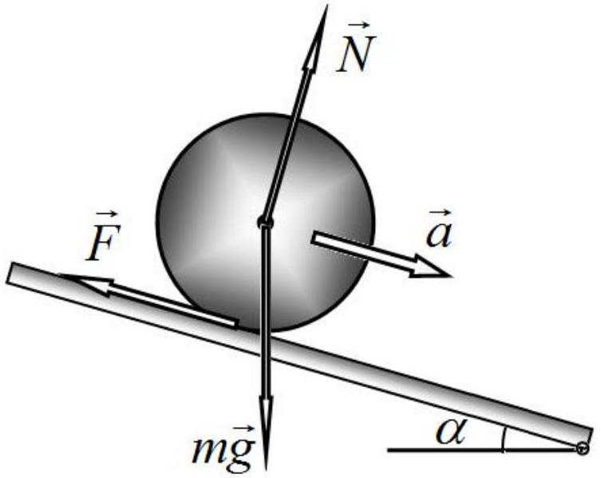
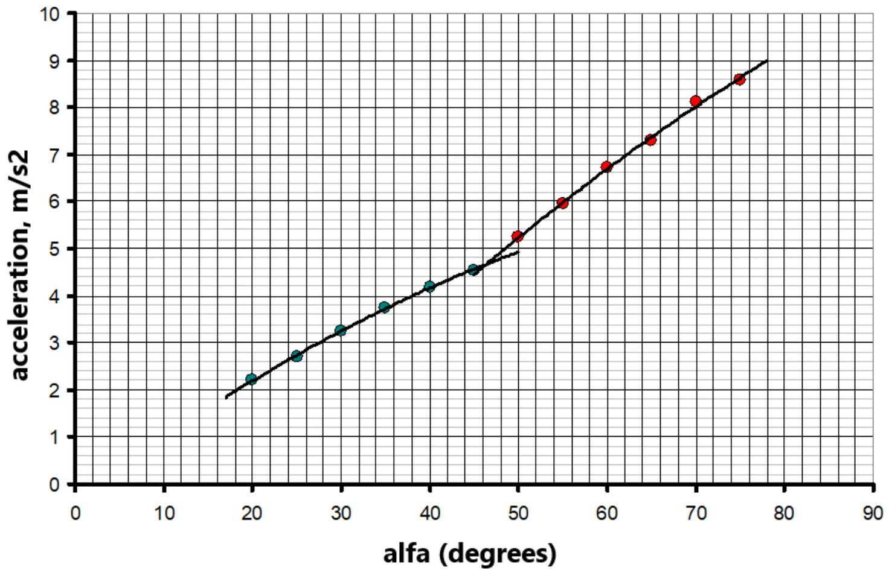
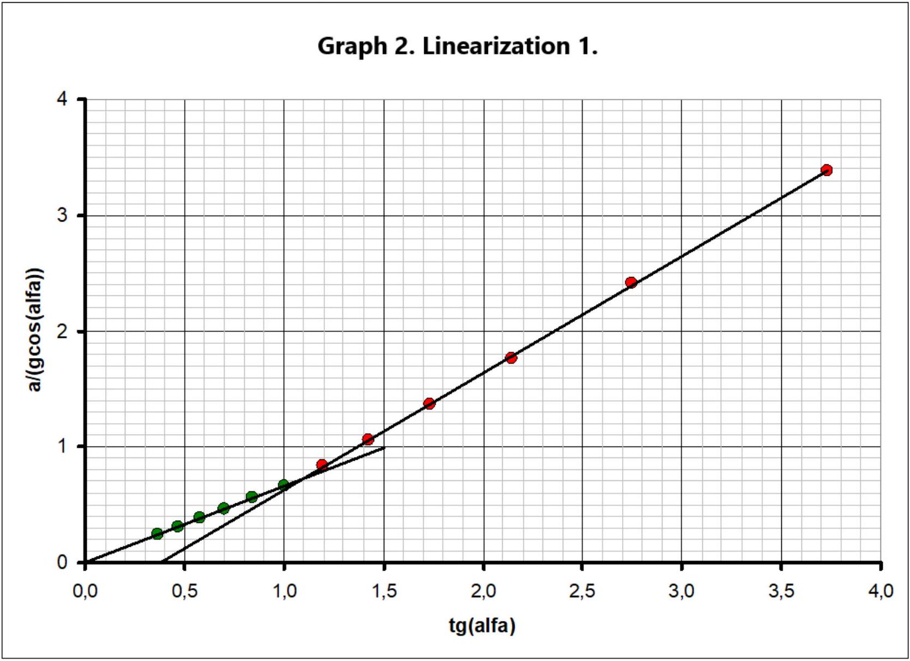
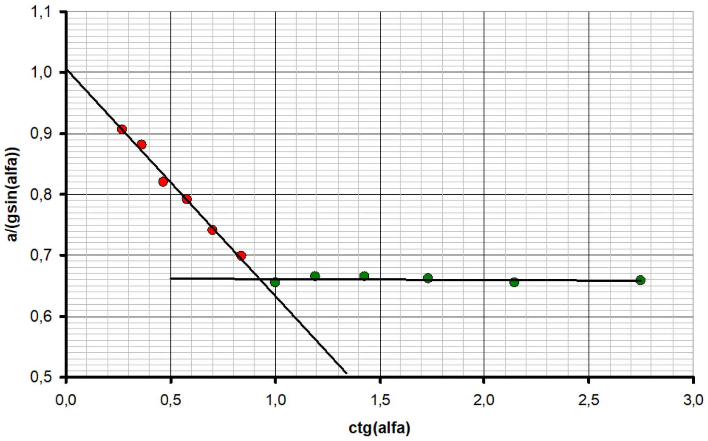
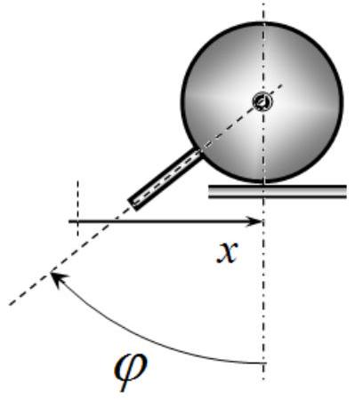
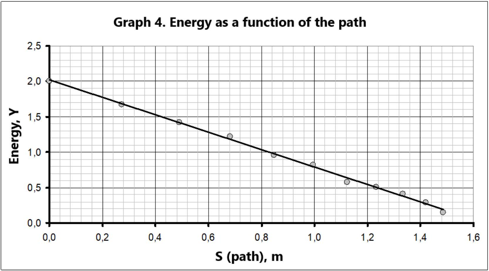

## SOLUTION   Dry friction   Experiment 1: Sliding friction   Theoretical part

1.1 The formulas for the accelerations of the cylinder axis can be obtained in various ways, but they are all based on the use of Newton's second law. When a cylinder rolls down an inclined plate, it is subject to the following forces: $m \vec { g }$ - gravity due to the Earth, $\vec { N }$ - normal reaction force, $\vec { F }$ - friction force.

A) In this case, the friction force does not perform any work, so we can write down the equations of the law for the conservation of mechanical energy as follows

$$
\begin{equation*}
\frac { 3 } { 4 } m R ^ { 2 } V _ { c } ^ { 2 } = m g S \sin \alpha , \tag{1}
\end{equation*}
$$

which takes into account the energy of rotation of the cylinder around its own axis.
To determine the acceleration, we calculate the time derivative of this equation to obtain

$$
\begin{equation*}
\frac { 3 } { 4 } m R ^ { 2 } \cdot 2 V _ { C } a = m g \sin \alpha \cdot V _ { C } . \tag{2}
\end{equation*}
$$

Here $V _ { C } = \frac { d S } { d t }$ stands for the speed of the cylinder axis, and $a = \frac { d V _ { C } } { d t }$ refers to its acceleration.
It follows from equation (2) that when rolling without slipping, the acceleration of the cylinder axis is described by the formula

$$
\begin{equation*}
a _ { 1 } = \frac { 2 } { 3 } g \sin \alpha . \tag{3}
\end{equation*}
$$

An alternative way to derive this formula is to use the equation for the rotational motion of the cylinder.
B) If the cylinder slips during its downward motion, then the friction force is determined by the formula

$$
\begin{equation*}
F = \mu _ { s } N = \mu _ { s } m g \cos \alpha , \tag{4}
\end{equation*}
$$

then the equation of Newton's second law in projection onto an inclined plane has the form

$$
\begin{equation*}
m a = m g \sin \alpha - \mu _ { s } m g \cos \alpha , \tag{5}
\end{equation*}
$$

It follows from this equation that the acceleration of the cylinder in this case is equal to

$$
\begin{equation*}
a _ { 2 } = g \left( \sin \alpha - \mu _ { s } \cos \alpha \right) , \tag{6}
\end{equation*}
$$

1.2 It is obvious that the motion without slipping occur at angles of inclination of the plate that are less than some critical value $\alpha _ { c r }$, whose magnitude can be found in various ways. For example, it can be found by equating the accelerations described by formulas (3) and (6).

Here is another method for obtaining the critical angle. From equation (2) of Newton's law, we obtain

$$
m a = m g \sin \alpha - F .
$$

Let us express the value of the static friction force, taking into account the found acceleration, as

$$
F = m g \sin \alpha - m a = \frac { 1 } { 3 } m g \sin \alpha
$$

and assume that this force does not exceed the force of sliding friction

$$
F < \mu _ { s } N = \mu _ { s } m g \cos \alpha .
$$

It is derived from the last inequality that

$$
\begin{equation*}
\frac { 1 } { 3 } m g \sin \alpha < \mu _ { s } m g \cos \alpha \Rightarrow \operatorname { tg } \alpha < 3 \mu _ { s } . \tag{7}
\end{equation*}
$$

Thus, the value of the critical angle is determined by the formula

$$
\begin{equation*}
\alpha _ { c r } = \operatorname { arctg } \left( 3 \mu _ { s } \right) . \tag{8}
\end{equation*}
$$

## Processing of measurement data

1.3 To calculate accelerations according to the measurement results given in the problem formulation, we write expressions for the distances traveled by the balls

$$
\left\{ \begin{array} { l }
S _ { 1 } = V _ { 0 } t _ { 1 } + \frac { a t _ { 1 } ^ { 2 } } { 2 }  \tag{9}\\
S _ { 2 } = V _ { 0 } t _ { 2 } + \frac { a t _ { 2 } ^ { 2 } } { 2 }
\end{array} \Rightarrow \frac { S _ { 2 } } { t _ { 2 } } - \frac { S _ { 1 } } { t _ { 1 } } = \frac { a } { 2 } \left( t _ { 2 } - t _ { 1 } \right) . \right.
$$

The formula for calculating accelerations is then found as:

$$
\begin{equation*}
a = \frac { 2 \left( \frac { S _ { 2 } } { t _ { 2 } } - \frac { S _ { 1 } } { t _ { 1 } } \right) } { t _ { 2 } - t _ { 1 } } . \tag{10}
\end{equation*}
$$

The results of acceleration calculations according to formula (10) are shown in Table 1.

Table 1. Calculation of accelerations.
| $\alpha ^ { \circ }$ | $t _ { 1 } , s$ | $t _ { 2 } , s$ | $a , \frac { m } { s ^ { 2 } }$ |
| :--- | :--- | :--- | :--- |
| 20 | 0.4546 | 0.7187 | 2.208 |
| 25 | 0.3936 | 0.6290 | 2.715 |
| 30 | 0.3462 | 0.5589 | 3.244 |
| 35 | 0.3229 | 0.5211 | 3.739 |
| 40 | 0.3358 | 0.5283 | 4.196 |
| 45 | 0.3084 | 0.4911 | 4.543 |
| 50 | 0.2682 | 0.4347 | 5.239 |
| 55 | 0.2816 | 0.4432 | 5.950 |
| 60 | 0.2600 | 0.4113 | 6.718 |
| 65 | 0.2461 | 0.3908 | 7.286 |
| 70 | 0.2308 | 0.3675 | 8.116 |
| 75 | 0.2218 | 0.3542 | 8.595 |

Based on these data, Graph 1 of the dependence of acceleration on the angle of inclination of the plate is drawn.

Graph 1. Acceleration dependence on the nclanation angle

It is clearly seen in the graph that it consists of two different branches: at small angles, the motion occurs without slipping (acceleration is described by formula (3)), whereas at large angles, the cylinder slips, so the acceleration is described by formula (6). The abscissa of the intersection point of these graphs is the critical angle, which is seen to be approximately equal to

$$
\alpha _ { c r } \approx 46 ^ { \circ } .
$$

Note: In principle, it is not needed to specify the free fall acceleration, which can be determined from the behavior of the acceleration at small angles. However, this is not required in this problem.

The linearization of the obtained dependence can be carried out in two alternative ways, which are approximately equivalent. Let us consider these methods in detail.

## Solution 1

1.4 As a variable $Y$ we take the combination

$$
\begin{equation*}
Y = \frac { a } { g \cos \alpha } , \tag{11}
\end{equation*}
$$

then it follows from the formulas for accelerations:

$$
\left\{ \begin{array} { l }
{ a _ { 1 } = \frac { 2 } { 3 } g \operatorname { s i n } \alpha } \\
{ a _ { 2 } = g ( \operatorname { s i n } \alpha - \mu _ { s } \operatorname { c o s } \alpha ) }
\end{array} \Rightarrow \left\{ \begin{array} { l }
\frac { a _ { 1 } } { g \cos \alpha } = \frac { 2 } { 3 } \operatorname { tg } \alpha \\
\frac { a _ { 2 } } { g \cos \alpha } = \operatorname { tg } \alpha - \mu _ { s }
\end{array} , \right. \right.
$$

i.e. the new variable $Y$ is a linear function of $X = \operatorname { tg } \alpha$, such that

$$
\left\{ \begin{array} { l }
Y = \frac { 2 } { 3 } X , \quad \alpha < \alpha _ { c r }  \tag{12}\\
Y = X - \mu _ { s } , \quad \alpha > \alpha _ { c r }
\end{array} . \right.
$$

Calculations of the chosen variables are provided in Table 2. In the table the highlighted values correspond to the motion without slipping.

Table 2. Linearization 1.
| $\alpha ^ { \circ }$ | $a , \frac { m } { s ^ { 2 } }$ | $X = \operatorname { tg } \alpha$ | $Y = \frac { a } { g \cos \alpha }$ |
| :--- | :--- | :--- | :--- |
| 20 | 2.208 | 0.3640 | 0.2395 |
| 25 | 2.715 | 0.4663 | 0.3053 |
| 30 | 3.244 | 0.5774 | 0.3818 |
| 35 | 3.739 | 0.7002 | 0.4653 |
| 40 | 4.196 | 0.8391 | 0.5584 |
| 45 | 4.543 | 1.0000 | 0.6549 |
| 50 | 5.239 | 1.1918 | 0.8308 |
| 55 | 5.950 | 1.4281 | 1.0574 |
| 60 | 6.718 | 1.7321 | 1.3697 |
| 65 | 7.286 | 2.1445 | 1.7575 |
| 70 | 8.116 | 2.7475 | 2.4188 |
| 75 | 8.595 | 3.7321 | 3.3851 |

Graph 2 shows the linearized dependencies.

1.5 Indeed, both dependences turn out to be linear. We represent these dependencies in the form

$$
\begin{equation*}
Y = c X + b . \tag{13}
\end{equation*}
$$

The calculation of the coefficients of these dependencies by the least squares gives the following results:
At the motion
without slipping:

$$
\begin{aligned}
& c _ { 1 } = 0.659 \pm 0.008 \\
& b _ { 1 } = 0.0004 \pm 0.005
\end{aligned} ,
$$

with slipping:

$$
\begin{aligned}
& c _ { 2 } = 1.011 \pm 0.009 \\
& b _ { 2 } = - 0.38 \pm 0.02
\end{aligned} .
$$

It follows from formula (12) that the coefficient of sliding friction is equal to

$$
\begin{equation*}
\mu _ { s } = - b _ { 2 } = 0.38 \pm 0.02 . \tag{14}
\end{equation*}
$$

Note that the calculated random error (of the order of 10\%) significantly exceeds the relative errors of direct measurements of both distances between sensors and motion times. Therefore, the latter can be ignored.
1.6 The value of the critical angle can be found by equating the two linear relations above:

$$
\begin{equation*}
\frac { 2 } { 3 } X = X - \mu _ { s } \Rightarrow X _ { c r } = \operatorname { tg } \alpha _ { c r } = 3 \mu _ { s } , \tag{15}
\end{equation*}
$$

or

$$
\alpha _ { c r } = \operatorname { arctg } \left( 3 \mu _ { s } \right) = 0.855 = 49 ^ { \circ }
$$

The error of this value is equal to

$$
\Delta a _ { c r } = \frac { 3 \Delta \mu _ { s } } { \left( 3 \mu _ { s } \right) ^ { 2 } + 1 } = 0.03
$$

and we finally get

$$
\begin{equation*}
\alpha _ { c r } = 0.86 \pm 0.03 = 49 ^ { \circ } \pm 2 ^ { \circ } . \tag{16}
\end{equation*}
$$

## Solution 2

1.4 As a variable $Y$ we take the combination

$$
\begin{equation*}
Y = \frac { a } { g \sin \alpha } , \tag{17}
\end{equation*}
$$

then it follows from the formulas for accelerations:

$$
\left\{ \begin{array} { l }
{ a _ { 1 } = \frac { 2 } { 3 } g \operatorname { s i n } \alpha } \\
{ a _ { 2 } = g ( \operatorname { s i n } \alpha - \mu _ { s } \operatorname { c o s } \alpha ) }
\end{array} \Rightarrow \left\{ \begin{array} { l }
\frac { a _ { 1 } } { g \sin \alpha } = \frac { 2 } { 3 } \\
\frac { a _ { 2 } } { g \sin \alpha } = 1 - \mu _ { s } \operatorname { ctg } \alpha
\end{array} , \right. \right.
$$

i.e. the new variable $Y$ is a linear function of $X = \operatorname { ctg } \alpha$, such that

$$
\left\{ \begin{array} { l }
Y = \frac { 2 } { 3 } , \quad \alpha < \alpha _ { c r }  \tag{18}\\
Y = 1 - \mu _ { s } X , \quad \alpha > \alpha _ { c r }
\end{array} . \right.
$$

Calculations of the chosen variables are provided in Table 3. In the table the highlighted values correspond to the motion without slipping.

Table 3. Linearization 2.
| $\alpha ^ { \circ }$ | $a , \frac { m } { s ^ { 2 } }$ | $X = \operatorname { ctg } \alpha$ | $Y = \frac { a } { g \sin \alpha }$ |
| :--- | :--- | :--- | :--- |
| 20 | 2.208 | 2.7475 | 0.6580 |
| 25 | 2.715 | 2.1445 | 0.6548 |
| 30 | 3.244 | 1.7321 | 0.6613 |
| 35 | 3.739 | 1.4281 | 0.6645 |
| 40 | 4.196 | 1.1918 | 0.6655 |
| 45 | 4.543 | 1.0000 | 0.6549 |
| 50 | 5.239 | 0.8391 | 0.6972 |
| 55 | 5.950 | 0.7002 | 0.7404 |
| 60 | 6.718 | 0.5774 | 0.7908 |
| 65 | 7.286 | 0.4663 | 0.8195 |
| 70 | 8.116 | 0.3640 | 0.8804 |
| 75 | 8.595 | 0.2679 | 0.9070 |

Graph 3 shows the linearized dependencies.

Graph 3. Linearization 2.

1.5 Indeed, both dependences turn out to be linear. We represent these dependencies in the form

$$
\begin{equation*}
Y = c X + b . \tag{19}
\end{equation*}
$$

The calculation of the coefficients of these dependencies by the least squares gives the following results:
At the motion
without slipping:

$$
\begin{aligned}
& c _ { 1 } = - 0.002 \pm 0.003 \\
& b _ { 1 } = 0.663 \pm 0.006
\end{aligned} ,
$$

with slipping:

$$
\begin{aligned}
& c _ { 2 } = - 0.38 \pm 0.02 \\
& b _ { 2 } = 1.01 \pm 0.01
\end{aligned} .
$$

It follows from formula (18) that the coefficient of sliding friction is equal to

$$
\begin{equation*}
\mu _ { s } = - c _ { 2 } = 0.38 \pm 0.02 . \tag{20}
\end{equation*}
$$

In this case, the errors of direct measurements can also be ignored.
1.6 The calculation of the critical angle is carried out similarly and we obtain

$$
\alpha _ { c r } = \operatorname { arctg } \left( 3 \mu _ { s } \right) = 0.84 = 48 ^ { \circ }
$$

The error of this value is equal to

$$
\Delta a _ { c r } = \frac { 3 \Delta \mu _ { S } } { \left( 3 \mu _ { S } \right) ^ { 2 } + 1 } = 0.02
$$

and we finally get

$$
\begin{equation*}
\alpha _ { c r } = 0,84 \pm 0,01 = 48 ^ { \circ } \pm 1 ^ { \circ } . \tag{21}
\end{equation*}
$$

## Experiment 2: Rolling friction   Theoretical part

2.1 When the axis of the cylinder is displaced by the distance $x$, the axis of the rod deviates by the angle

$$
\begin{equation*}
\varphi = \frac { X } { R } . \tag{22}
\end{equation*}
$$

To calculate the period of small oscillations, we write the equation for the law of conservation of energy

$$
\begin{equation*}
\frac { 3 } { 4 } M V ^ { 2 } + m g l ( 1 - \cos \varphi ) = m g l \left( 1 - \cos \varphi _ { 0 } \right) . \tag{23}
\end{equation*}
$$

Hereinafter, we neglect the kinetic energy of the rod motion, since its mass is small.

On the other hand, the potential energy of the massive cylinder remains constant, so the change in the potential energy of the system is the change in the potential energy of the rod. For small oscillations, the approximate formula for the cosine of a small angle $\cos \varphi \approx 1 - \frac { \varphi ^ { 2 } } { 2 }$ should be used, which leads to a simplification of equation (23) to:

$$
\frac { 3 } { 4 } M V ^ { 2 } + m g l \frac { \varphi ^ { 2 } } { 2 } = m g l \frac { \varphi _ { 0 } ^ { 2 } } { 2 } .
$$

Using relation (22), we obtain the equation

$$
\begin{equation*}
\frac { 3 } { 4 } M V ^ { 2 } + \frac { m g l } { R ^ { 2 } } \frac { x ^ { 2 } } { 2 } = \frac { m g l } { R ^ { 2 } } \frac { x _ { 0 } ^ { 2 } } { 2 } , \tag{24}
\end{equation*}
$$

which is the equation of harmonic oscillations with the period of

$$
\begin{equation*}
T = 2 \pi \sqrt { \frac { 3 M R ^ { 2 } } { 2 m g l } } . \tag{25}
\end{equation*}
$$

2.2 At the stoppage points, the kinetic energy of the cylinder with the rod is zero, so the change in the potential energy when moving from one stoppage point to the next is equal to the work of the friction force. Therefore, the following relation is valid:

$$
\begin{equation*}
\operatorname { mgl } \left( 1 - \cos \varphi _ { k } \right) = \operatorname { mgl } \left( 1 - \cos \varphi _ { k - 1 } \right) - \mu _ { r } M g \left| x _ { k } - x _ { k - 1 } \right| . \tag{26}
\end{equation*}
$$

Applying relation (22) between the angle of rotation and the displacement of the cylinder, we obtain the required relation

$$
\begin{equation*}
\left( 1 - \cos \frac { x _ { k } } { R } \right) = \left( 1 - \cos \frac { x _ { k - 1 } } { R } \right) - \mu _ { r } \frac { M } { m l } \left| x _ { k } - x _ { k - 1 } \right| . \tag{27}
\end{equation*}
$$

2.3 Let us sum up relations, similar to (27), for all intervals of motion from the initial position to the $k$ 'th stoppage point, which finally yields

$$
\begin{equation*}
\left( 1 - \cos \frac { x _ { k } } { R } \right) = \left( 1 - \cos \frac { x _ { 0 } } { R } \right) - \mu _ { r } \frac { M } { m l } S _ { k } , \tag{28}
\end{equation*}
$$

where $S _ { k }$ is the path the cylinder passes to the $k$ 'th stoppage point

$$
\begin{equation*}
S _ { k } = \left| x _ { 0 } - x _ { 1 } \right| + \left| x _ { 2 } - x _ { 1 } \right| + \ldots + \left| x _ { k } - x _ { k - 1 } \right| = \sum _ { j = 1 } ^ { k } \left| x _ { j } - x _ { j - 1 } \right| . \tag{29}
\end{equation*}
$$

In the initial position, the rod is directed vertically, i.e. $\varphi _ { 0 } = \pi$, therefore $x _ { 0 } = \pi R$, and one can write down

$$
\begin{equation*}
R = \frac { x _ { 0 } } { \pi } . \tag{30}
\end{equation*}
$$

From the formula for the oscillation period, one can also express:

$$
\frac { M } { m l } = \frac { T ^ { 2 } } { 4 \pi ^ { 2 } } \frac { 2 g } { 3 R ^ { 2 } } = \frac { T ^ { 2 } g } { 6 \pi ^ { 2 } R ^ { 2 } } = \frac { T ^ { 2 } g } { 6 x _ { 0 } ^ { 2 } } .
$$

We substitute these values into equation (28), which yields

$$
\begin{equation*}
1 - \cos \left( \pi \frac { x _ { k } } { x _ { 0 } } \right) = 2 - \mu _ { r } \frac { T ^ { 2 } g } { 6 x _ { 0 } ^ { 2 } } S _ { k } . \tag{31}
\end{equation*}
$$

Thus, the value $Y _ { k } = 1 - \cos \left( \pi \frac { x _ { k } } { x _ { 0 } } \right)$ linearly depends on the path $S _ { k }$. The slope of dependence coefficient contains the rolling friction coefficient sought as well as other known values. The unity in expression (31), of course, can be omitted. But the value $Y$, up to a constant factor, is equal to the potential energy, therefore, in the accepted definition, the dependence $Y ( S )$ is more preferable.

## Processing of measurement data

2.4 The oscillation period is calculated in the traditional way.
We calculate the average value of the time of 5 oscillations: $\left\langle t _ { 5 } \right\rangle = 7.354 \mathrm {~s}$;
We also calculate the random error of this value: $\Delta t _ { 5 } = 2 \sqrt { \frac { \sum _ { i } \left( t _ { i } - \langle t \rangle \right) ^ { 2 } } { n ( n - 1 ) } } = 0.11 \mathrm {~s}$.
Then the oscillation period is obtained as

$$
\begin{equation*}
T = ( 1.47 \pm 0.02 ) s . \tag{32}
\end{equation*}
$$

2.5 The results of calculations of the quantities, appearing in formula (31), are shown in Table 4.

Table 4. Linearization.
| $k$ | $x _ { k } , \mathrm {~cm}$ | $\Delta S _ { k } = \left\| x _ { k } - x _ { k - 1 } \right\| , \mathrm { m }$ | $S _ { k } , \mathrm {~m}$ | $Y _ { k } = 1 - \cos \left( \pi \frac { x _ { k } } { x _ { 0 } } \right)$ |
| :--- | :--- | :--- | :--- | :--- |
| 0 | 15.8 |  | 0 | 2.000 |
| 1 | -11.6 | 0.274 | 0.274 | 1.671 |
| 2 | 10.1 | 0.217 | 0.491 | 1.424 |
| 3 | -9.0 | 0.191 | 0.682 | 1.217 |
| 4 | 7.7 | 0.167 | 0.849 | 0.960 |
| 5 | -7.0 | 0.147 | 0.996 | 0.822 |
| 6 | 5.7 | 0.127 | 1.123 | 0.576 |
| 7 | -5.3 | 0.110 | 1.233 | 0.506 |
| 8 | 4.7 | 0.100 | 1.333 | 0.406 |
| 9 | -3.9 | 0.086 | 1.419 | 0.286 |
| 10 | 2.8 | 0.067 | 1.486 | 0.151 |

The dependence $Y ( S )$ is shown in the following figure.

2.6 The resulting dependence is linear, which confirms the theoretical model used. The slope coefficient of this graph, calculated by the least squares, is equal to

$$
C = ( 1.23 \pm 0.02 ) m ^ { - 1 } .
$$

The theoretical formula for this coefficient makes it possible to express the value of the rolling friction coefficient:

$$
\begin{equation*}
C = \mu _ { r } \frac { T ^ { 2 } g } { 6 x _ { 0 } ^ { 2 } } \Rightarrow \mu _ { r } = C \frac { 6 x _ { 0 } ^ { 2 } } { T ^ { 2 } g } = 8.69 \cdot 10 ^ { - 3 } . \tag{33}
\end{equation*}
$$

To calculate the error of this value, we make use of the formula for the error of indirect measurements:

$$
\begin{align*}
& \Delta \mu _ { r } = \mu _ { r } \sqrt { \left( \frac { \Delta C } { \langle C \rangle } \right) ^ { 2 } + \left( 2 \frac { \Delta T } { \langle T \rangle } \right) ^ { 2 } + \left( 2 \frac { \Delta x _ { 0 } } { \left\langle x _ { 0 } \right\rangle } \right) ^ { 2 } } =  \tag{34}\\
& = 8.69 \cdot 10 ^ { - 3 } \sqrt { \left( \frac { 0.02 } { 1.23 } \right) ^ { 2 } + \left( 2 \frac { 0.02 } { 1.47 } \right) ^ { 2 } + \left( 2 \frac { 0.2 } { 15.8 } \right) ^ { 2 } } = 3.8 \cdot 10 ^ { - 4 }
\end{align*} .
$$

The final result is written as

$$
\begin{equation*}
\mu _ { r } = ( 8.7 \pm 0.4 ) \cdot 10 ^ { - 3 } . \tag{35}
\end{equation*}
$$

| Part | Content | Points | Total |
| :--- | :--- | :--- | :--- |
| Experiment 1: Sliding friction |  |  | 10.0 |
| Theoretical part |  |  | 1.5 |
| 1.1 | Motion without slipping: |  | 1.0 |
|  | equation of motion; | 0.2 |  |
|  | formula (3); | 0.3 |  |
|  | Motion with slipping: |  |  |
|  | equation of motion; | 0.2 |  |
|  | formula (6); | 0.3 |  |
| 1.2 | Critical angle value: |  | 0.5 |
|  | the condition for the start of slippinge: the boundary value of the static friction force; equality of accelerations (3) and (6); | 0.2 |  |

|  | relation between the critical angle and the friction coefficient: formula (7) or (8); | 0.3 |  |
| :--- | :--- | :--- | :--- |
| Processing of measurement data |  |  | 8.5 |
| 1.3 | Calculation of accelerations: |  |  |
|  | formula (10) for acceleration; | 0.2 |  |
|  | all accelerations are calculated (graded if the formula for calculating acceleration is graded); 0.1 for each point, acceptable error of acceleration calculation is ±0.01; | 1.2 |  |
|  | Plotting a graph (graded if the results of acceleration calculations are graded): |  |  |
|  | the axes are named and ticked; | 0.1 |  |
|  | all points are drawn; | 0.1 |  |
|  | two smoothing curved lines are drawn; | 0.2 |  |
|  | two dependences are obtained: two different intersecting curves are visible in the graph; | 0.3 |  |
|  | Critical angle value; |  |  |
|  | determination method: the point of intersection of two curves; | 0.2 |  |
|  | numerical value: acceptable error ±1°; | 0.2 |  |
| 1.4 | Linearization of the dependence: |  | 2.8 |
|  | New variables: any reasonable: $\left( \frac { a } { \sin \alpha } , \operatorname { ctg } \alpha \right) , \left( \frac { a } { \cos \alpha } , \operatorname { tg } \alpha \right)$, and equivalent, leading to linear dependencies; | 1.0 |  |
|  | Numerical calculations: graded if the choice of new variables $X , Y$ is graded; 0.1 for each correctly calculated point, acceptable error ±0.02; | 1.2 |  |
|  | Plotting a graph (graded if the results of the calculations of the variables $X , Y$ are graded): |  |  |
|  | the axes are named and ticked; | 0.1 |  |
|  | all points are drawn; | 0.1 |  |
|  | two straight lines are visible; | 0.2 |  |
|  | two straight lines are drawn; | 0.2 |  |
| 1.5 | Calculation of the coefficient of sliding friction: |  | 1.9 |
|  | coefficients of the linear dependences are calculated: 0.2 for each coefficient (graphically for all points, LSM); 0.1 - by two points; the use of theoretical values is not graded; | 0.8 |  |
|  | formula for the coefficient of friction through the coefficients of linear dependencies; | 0.2 |  |
|  | numerical value of the coefficient of sliding friction: graded if the formula for the coefficient of friction is graded, the acceptable error ±0.05; | 0.4 |  |
|  | formula for the error: only through the coefficients of the linear dependencies; | 0.2 |  |
|  | numerical value of the error: graded if the formula is graded; | 0.2 |  |
|  | correct rounding; | 0.1 |  |
| 1.6 | Critical angle value: |  | 1.3 |

|  | numerical value of the critical angle: graded if the method of determination is graded; | 0.2 |  |
| :--- | :--- | :--- | :--- |
|  | formula for the error: through the errors of the coefficients of the straight lines; | 0.3 |  |
|  | numerical value of the error: graded if the formula is graded; | 0.2 |  |
|  | correct rounding; | 0.1 |  |
| Experiment 2: Rolling friction |  |  | 10.0 |
| Theoretical part |  |  | 2.5 |
| 2.1 | Derivation of the formula for the period of small oscillations: |  | 0.5 |
|  | initial equation: either dynamic or energetic; | 0.2 |  |
|  | approximation of small oscillations; | 0.1 |  |
|  | formula (25) for the period: incorrect numerical factor (-0.1); | 0.2 |  |
| 2.2 | Recursive relation: |  | 1.0 |
|  | use of the law of conservation of energy; | 0.3 |  |
|  | expression for the potential energy in terms of deflection angle; | 0.2 |  |
|  | relation between the angle and coordinate; | 0.1 |  |
|  | final form of the recursive relation: formula (27) or equivalent; | 0.4 |  |
| 2.3 | Expression for the stoppage point coordinates: |  | 1.0 |
|  | expression for the energy change through the path traveled; | 0.2 |  |
|  | determination of the disk radius through the initial coordinate; | 0.2 |  |
|  | use of the formula for the period of small oscillations; | 0.2 |  |
|  | final relation: formula (31) or equivalent; | 0.4 |  |
| Processing of measurement data |  |  | 7.5 |
| 2.4 | Calculation of the period: |  | 1.0 |
|  | Formula for the period; | 0.2 |  |
|  | numerical value of the period, acceptable error ±0,01; | 0.2 |  |
|  | formula for the error; | 0.2 |  |
|  | numerical value of the error; | 0.2 |  |
|  | the dimension is indicated; | 0.1 |  |
|  | correct rounding; | 0.1 |  |
| 2.5 | Linearization: |  | 3.2 |
|  | choice of variables (equivalent variables are acceptable if expressed in terms of the measured known values); | 1.6 |  |
|  | calculated for all points (graded if the choice of variables is graded); 0.1 for each point, acceptable error ±0.02; | 1.1 |  |
|  | Plotting a graph (graded if the calculation of points is graded): |  |  |
|  | the axes are named and ticked; | 0.1 |  |
|  | all points are drawn; | 0.2 |  |
|  | smoothing straight line is drawn; | 0.2 |  |
| 2.6 | Calculation of rolling friction coefficient: |  | 3.3 |
|  | Calculation method of the friction coefficient: according to the slope coefficient - 0.6; by 1-2 points - 0.3; | 0.6 |  |
|  | slope coefficient found: according to LSM - 0.5; graphically - 0.4; by two points - 0.2; acceptable error ±0,05; | 0.5 |  |
|  | error calculation method; | 0.2 |  |
|  | numerical value of the error; | 0.2 |  |
|  | formula for calculating the rolling friction (only through the slope | 0.3 |  |

|  | factor); |  |  |
| :--- | :--- | :--- | :--- |
|  | numerical value of the rolling friction coefficient (graded if the formula is graded); the error propagation rule does not apply to numerical values! | 0.5 |  |
|  | formula for the error, the errors of all quantities included in the formula are taken into account; | 0.6 |  |
|  | numerical value of the error; | 0.2 |  |
|  | correct rounding; | 0.2 |  |
|  | TOTAL |  | 20.0 |
