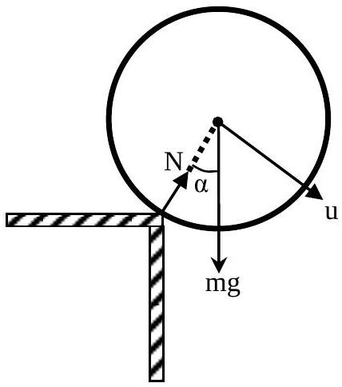
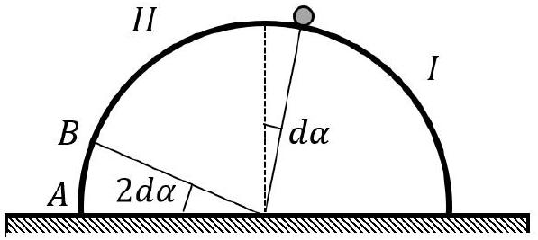
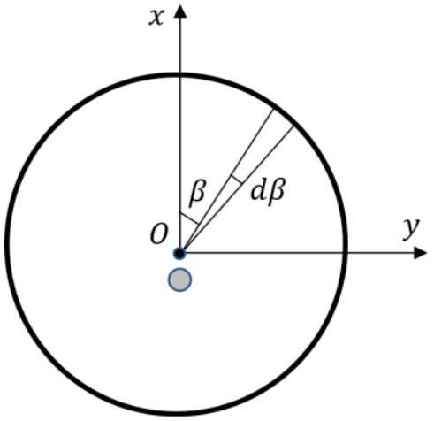
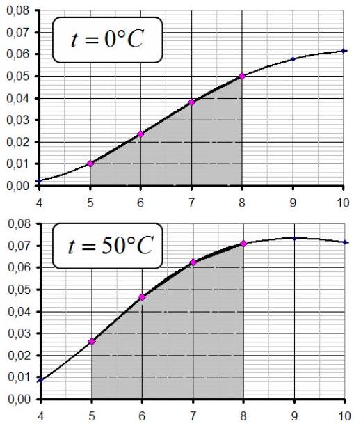
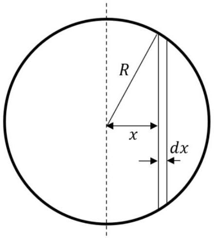
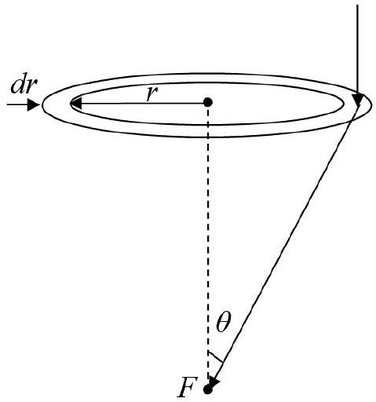

## SOLUTIONS TO THE PROBLEMS OF THE THEORETICAL COMPETITION   Attention. Points in grading are not divided!   Problem 1 (10.0 points)   Problem 1.1 (4.0 points)

At the initial moment of time, the ball rotates as a whole around the point of its contact with the table. Let the ball rotate through a certain angle $\alpha$, then the change in the potential energy of the center of mass of the ball is written as

$$
\begin{equation*}
E _ { p } = m g R ( 1 - \cos \alpha ) , \tag{1}
\end{equation*}
$$

and it turns into kinetic energy

$$
\begin{equation*}
E _ { k } = \frac { 7 } { 10 } m u ^ { 2 } , \tag{2}
\end{equation*}
$$

where $u$ is the speed of the center of mass of the ball.
According to the law of conservation of energy, we get

$$
\begin{equation*}
E _ { p } = E _ { k } . \tag{3}
\end{equation*}
$$

At further motion, the ball is separated from the table. The equation of motion of the center of mass of the ball (Newton's second law) in the projection on the radial direction has the form

$$
\begin{equation*}
m \frac { u ^ { 2 } } { R } = m g \cos \alpha - N , \tag{4}
\end{equation*}
$$

where $N$ stands for the normal reaction force of the table, and the friction force is not shown in the figure.

The condition for the separation of the ball from the table is defined as

$$
\begin{equation*}
N = 0 . \tag{5}
\end{equation*}
$$

Solving jointly equation (1)-(5), we find the separation angle and the

speed of the ball at this moment

$$
\begin{align*}
& \cos \alpha = \frac { 10 } { 17 } ,  \tag{6}\\
& u = \sqrt { \frac { 10 } { 17 } g R } . \tag{7}
\end{align*}
$$

The further motion of the ball is the free fall of its center of mass in the Earth's gravitational field. The initial horizontal and vertical velocities are respectively equal to

$$
\begin{align*}
& v _ { x } = u \cos \alpha .  \tag{8}\\
& v _ { y } = u \sin \alpha , \tag{9}
\end{align*}
$$

The flight range is determined by the formulas of uniformly accelerated motion in the earth's gravity field as

$$
\begin{align*}
& L = R \sin \alpha + v _ { x } t .  \tag{10}\\
& H - R ( 1 - \cos \alpha ) = v _ { y } t + \frac { g t ^ { 2 } } { 2 } , \tag{11}
\end{align*}
$$

where $t$ denotes the free flight time.
Eliminating time $t$ from equations (10) and (11), we find

$$
\begin{equation*}
L = \frac { 567 \sqrt { 21 } + 20 \sqrt { 68305 } } { 4913 } R \approx 1.6 R . \tag{12}
\end{equation*}
$$

| Content | Points |
| :--- | :--- |
| Formula (1): $E _ { p } = m g R ( 1 - \cos \alpha )$ | 0.3 |

| Formula (2): $E _ { k } = \frac { 7 } { 10 } m u ^ { 2 }$ | 0.2 |
| :--- | :--- |
| Formula (3): $E _ { p } = E _ { k }$ | 0.2 |
| Formula (4): $m \frac { u ^ { 2 } } { R } = m g \cos \alpha - N$ | 0.3 |
| Formula (5): $N = 0$ | 0.4 |
| Formula (6): $\cos \alpha = \frac { 10 } { 17 }$ | 0.4 |
| Formula (7): $u = \sqrt { \frac { 10 } { 17 } g R }$ | 0.4 |
| Formula (8): $v _ { x } = u \cos \alpha$ | 0.2 |
| Formula (9): $v _ { y } = u \sin \alpha$ | 0.2 |
| Formula (10): $L = R \sin \alpha + v _ { x } t$ | 0.4 |
| Formula (11): $H - R ( 1 - \cos \alpha ) = v _ { y } t + \frac { g t ^ { 2 } } { 2 }$ | 0.4 |
| Formula (12): $L = \frac { 567 \sqrt { 21 } + 20 \sqrt { 68305 } } { 4913 } R \approx 1.6 R$ | 0.6 |
| Total | 4.0 |

## Problem 1.2 (3.0 points)

The work $d A$ done by the gas when its volume changes by $d V$ reads as

$$
\begin{equation*}
d A = p d V , \tag{1}
\end{equation*}
$$

where $p$ denotes the gas pressure.
The change in the internal energy $d U$ of one mole of an ideal monatomic gas is associated with a change in its temperature $d T$ by the relation

$$
\begin{equation*}
d U = \frac { 3 } { 2 } R d T . \tag{2}
\end{equation*}
$$

According to the formulation of the problem, the following relation holds

$$
\begin{equation*}
\eta = \frac { d A } { d U } = \text { const } , \tag{3}
\end{equation*}
$$

which, along with the ideal gas equation

$$
\begin{equation*}
p V = R T , \tag{4}
\end{equation*}
$$

leads to the following relation

$$
\begin{equation*}
\frac { 2 } { 3 \eta } \frac { d V } { V } = \frac { d T } { T } . \tag{5}
\end{equation*}
$$

Equation (5) is easily integrated and reduced to the form

$$
\begin{equation*}
\frac { T } { T } = \left( \frac { V } { V _ { 0 } } \right) ^ { \frac { 2 } { 3 \eta } } . \tag{6}
\end{equation*}
$$

In the initial state, the ideal gas equation gives

$$
\begin{equation*}
p _ { 0 } V _ { 0 } = R T _ { 0 } , \tag{7}
\end{equation*}
$$

whereas in the final state

$$
\begin{equation*}
\frac { p _ { 0 } } { 2 } 4 V _ { 0 } = R T , \tag{8}
\end{equation*}
$$

and, therefore, the temperature of the gas in the final state is obtained as

$$
\begin{equation*}
T = 2 T _ { 0 } . \tag{9}
\end{equation*}
$$

From equations (6) and (9) it is easy to find the coefficient

$$
\begin{equation*}
\eta = \frac { 4 } { 3 } . \tag{10}
\end{equation*}
$$

The total work of the gas in the process is determined by the integral of equation (1) and is equal to

$$
\begin{equation*}
A = \int _ { V _ { 0 } } ^ { 4 V _ { 0 } } p d V = 2 p _ { 0 } V _ { 0 } = 2.0 \times 10 ^ { 5 } \mathrm {~J} \tag{11}
\end{equation*}
$$

Note: The process described in this problem is polytropic, i.e. it occurs at a constant heat capacity. Indeed, since the work done by the gas is a fixed part of the change in the internal energy, this means that the heat capacity of the gas remains constant throughout the process. In this case, the polytropic equation $p V ^ { n } =$ const is valid under the chosen conditions of the problem with $n = 1 / 2$, and the work of the gas, obviously, does not depend on its type, whether it is a monatomic or polyatomic gas.

| Content | Points |
| :--- | :--- |
| Formula (1): $d A = p d V$ | 0.2 |
| Formula (2): $d U = \frac { 3 } { 2 } R d T$ | 0.2 |
| Formula (3): $\eta = \frac { d A } { d U } =$ const | 0.2 |
| Formula (4): $p V = R T$ | 0.2 |
| Formula (5): $\frac { 2 } { 3 \eta } \frac { d V } { V } = \frac { d T } { T }$ | 0.2 |
| Formula (6): $\frac { T } { T } = \left( \frac { V } { V _ { 0 } } \right) ^ { \frac { 2 } { 3 \eta } }$ | 0.4 |
| Formula (7): $p _ { 0 } V _ { 0 } = R T _ { 0 }$ | 0.2 |
| Formula (8): $\frac { p _ { 0 } } { 2 } 4 V _ { 0 } = R T$ | 0.2 |
| Formula (9): $T = 2 T _ { 0 }$ | 0.2 |
| Formula (10): $\eta = \frac { 4 } { 3 }$ | 0.4 |
| Formula (11): $A = 2 p _ { 0 } V _ { 0 }$ | 0.4 |
| Numerical value in formula (11): $A = 2.0 \times 10 ^ { 5 } \mathrm {~J}$ | 0.2 |
| Total | 3.0 |

## Problem 1.3 (3.0 points)

To study the problem of the stability of the equilibrium position, consider a situation in which the ball deviates from the top position by a very small angle $d \alpha$ and determine the forces acting on it.

The first force is electrostatic, but to study the equilibrium we need only its component directed tangentially to the surface of the hemisphere. The idea of its calculation is based on the fact that in the projection onto the radial direction, the electrostatic forces are compensated from two symmetrical regions of the hemisphere I and II with respect to the new ball position, so that the only uncompensated force is due to the segment $A B$ of the hemisphere, cut off by an inclined plane passing at an angle $2 d \alpha$. The left figure below shows the corresponding section in the vertical plane.

Side view

Top view

Let us consider a part of the sphere segment (see the right figure above, which shows the top view), cut off additionally by the angles $\beta$ amd $\beta + d \beta$, such that its area is found as

$$
\begin{equation*}
d S = 2 R \cos \beta R d \beta d \alpha , \tag{1}
\end{equation*}
$$

with the electric charge being equal to

$$
\begin{equation*}
d q = - \sigma d S . \tag{2}
\end{equation*}
$$

In the Cartesian coordinate system, whose origin coincides with the top of the hemisphere, and the axis is directed vertically downwards, the radius vector, directed from the point where the ball is located to the selected part of the sphere segment, is determined by the coordinates

$$
\begin{equation*}
\dot { r } = ( R \cos \beta , R \sin \beta , R ) , \tag{3}
\end{equation*}
$$

and hence the vector of the desired force is derived as

$$
\begin{equation*}
\vec { F } = - \frac { Q d q } { 4 \pi \varepsilon _ { 0 } r ^ { r } } \vec { r } \tag{4}
\end{equation*}
$$

This force has the following projection on the tangential direction

$$
\begin{equation*}
F _ { Q } = - \frac { Q d q } { 4 \pi \varepsilon _ { 0 } ( \sqrt { 2 } R ) ^ { 3 } } R \cos \beta \tag{5}
\end{equation*}
$$

therefore, integration over $\beta$ from $- \pi / 2$ to $\pi / 2$ provides the total module of the electrostatic force from the entire segment in the form

$$
\begin{equation*}
F _ { Q } = \frac { Q \sigma } { 8 \sqrt { 2 } \pi \varepsilon _ { 0 } } d \alpha \tag{6}
\end{equation*}
$$

The second force acting on the ball is the force of gravity, whose projection on the tangential direction is obtained as

$$
\begin{equation*}
F _ { g } = m g d \alpha . \tag{7}
\end{equation*}
$$

The minimum charge of the ball is determined by the equality of forces

$$
\begin{equation*}
F _ { g } = F _ { Q } , \tag{8}
\end{equation*}
$$

which leads to the final answer

$$
\begin{equation*}
Q = \frac { 8 \sqrt { 2 } \pi \varepsilon _ { 0 } m g } { \sigma } . \tag{9}
\end{equation*}
$$

Obviously, for larger charges the equilibrium position is stable.

| Content | Points |
| :--- | :--- |
| Formula (1): $d S = 2 R \cos \beta R d \beta d \alpha$ | 0.3 |
| Formula (2): $d q = \sigma d S$ | 0.3 |
| Formula (3): $\vec { r } = ( R \cos \beta , R \sin \beta , R )$ | 0.2 |
| Formula (4): $\vec { F } = - \frac { Q d q } { 4 \pi \varepsilon _ { 0 } r ^ { 3 } } \vec { r }$ | 0.2 |

| Formula (5): $F _ { Q } = \frac { Q d q } { 4 \pi \varepsilon _ { 0 } ( \sqrt { 2 } R ) ^ { 3 } } R \cos \beta$ | 0.3 |
| :--- | :--- |
| Formula (6): $F _ { Q } = \frac { Q \sigma } { 8 \sqrt { 2 } \pi \varepsilon _ { 0 } } d \alpha$ | 0.5 |
| Formula (7): $F _ { g } = m g d \alpha$ | 0.2 |
| Formula (8): $F _ { g } = F _ { Q }$ | 0.5 |
| Formula (9): $Q = \frac { 8 \sqrt { 2 } \pi \varepsilon _ { 0 } m g } { \sigma }$ | 0.5 |
| Total | 3.0 |

## Problem 2. Greenhouse effect (10.0 points) Atmosphere without greenhouse effect

2.1 Direct calculation by Wien's formula gives the following result

$$
\begin{equation*}
\lambda _ { \max S } = \frac { b } { T _ { S } } = 0.446 \mu \mathrm {~m} . \tag{1}
\end{equation*}
$$

2.2 In the steady state, the power of solar radiation incident on the Earth is equal to the power of the thermal radiation of the Earth. When writing the energy balance equation, it must be taken into account that the Sun illuminates the Earth from one side, and the Earth radiates in all directions, i.e.

$$
\begin{equation*}
W \cdot \pi R ^ { 2 } = \sigma T _ { 0 } ^ { 4 } \cdot 4 \pi R ^ { 2 } . \tag{2}
\end{equation*}
$$

It follows from this relation that

$$
\begin{equation*}
T _ { 0 } = \sqrt [ 4 ] { \frac { W } { 4 \sigma } } = 280.3 \mathrm {~K} , \tag{3}
\end{equation*}
$$

and the same temperature in degrees Celsius is equal to

$$
\begin{equation*}
t _ { 0 } = 7.15 ^ { \circ } \mathrm { C } . \tag{4}
\end{equation*}
$$

2.3 According to the Wien's formula, we find that at the given temperature, the maximum radiation corresponds to the wavelength

$$
\begin{equation*}
\lambda _ { \max E } = \frac { b } { T _ { E } } = 10.3 \mu \mathrm {~m} . \tag{5}
\end{equation*}
$$

2.4 The same geometric relationships that lead to equation (2) allow one to conclude that the power of solar radiation per unit area of the Earth's surface is found as

$$
\begin{equation*}
w = \frac { W \cdot \pi R ^ { 2 } } { 4 \pi R ^ { 2 } } = \frac { W } { 4 } = 350 \mathrm {~W} / \mathrm { m } ^ { 2 } . \tag{6}
\end{equation*}
$$

## Various atmosphere models

2.5 We introduce the following notation:
$t _ { 1 }$ (or $T _ { 1 }$ in the Kelvin scale) - the emperature of the Earth's surface and the lower layer of the atmosphere immediately adjacent to it; $t _ { 2 }$ (or $T _ { 2 }$ ) - the temperature of the upper layer of the atmosphere; $w$ - the flux density of solar radiation, i.e. the energy incident on a unit area of the Earth's surface per unit time (or irradiated); $R _ { 1 }$ - the thermal radiation power per unit area of the Earth; $R _ { 2 }$ - the thermal radiation power per unit area of the atmospheric layer; the radiation fluxes of this layer towards the Earth and into outer space are equal.

The energy balance equation for a unit area of the Earth's surface has the following form

$$
\begin{equation*}
w + R _ { 2 } = R _ { 1 } . \tag{7}
\end{equation*}
$$

A similar equation for the upper layer of the atmosphere gives rise to

$$
\begin{equation*}
K R _ { 1 } = 2 R _ { 2 } . \tag{8}
\end{equation*}
$$

Using the laws of thermal radiation, energy fluxes can be expressed in terms of the temperatures of the radiating surfaces as follows

$$
\begin{align*}
& R _ { 1 } = \sigma T _ { 1 } ^ { 4 } ,  \tag{9}\\
& R _ { 2 } = K \sigma T _ { 2 } ^ { 4 } . \tag{10}
\end{align*}
$$

Therefore, taking into account formulas (2) and (3), we obtain from expressions (7)-(10) the temperature of the Earth's surface in the form

$$
\begin{equation*}
T _ { 1 } = \frac { T _ { 0 } } { \sqrt [ 4 ] { 1 - \frac { K } { 2 } } } \tag{11}
\end{equation*}
$$

## Maximum greenhouse effect

2.6 For the maximum greenhouse effect $K = 1$, therefore, it is obtained for this model

$$
\begin{equation*}
T _ { 1 } = T _ { 0 } \sqrt [ 4 ] { 2 } = 333.3 \mathrm {~K} = 60.2 ^ { \circ } \mathrm { C } . \tag{12}
\end{equation*}
$$

Thus, the maximum increase in temperature due to the greenhouse effect on the "black earth" is equal to

$$
\begin{equation*}
\Delta t _ { 1 } = 53.0 ^ { \circ } \mathrm { C } . \tag{13}
\end{equation*}
$$

## Water greenhouse effect

2.7 The Earth as a black body irradiates the energy

$$
\begin{equation*}
W _ { 0 } = \int _ { 0 } ^ { \infty } r _ { 0 } \left( \lambda , T _ { 1 } \right) d \lambda , \tag{14}
\end{equation*}
$$

The absorbed energy can be expressed in terms of the spectral absorption coefficient and the spectral density of the Earth's radiation as follows

$$
\begin{equation*}
W _ { A } = \int _ { 0 } ^ { \infty } k ( \lambda ) r _ { 0 } \left( \lambda , T _ { 1 } \right) d \lambda , \tag{15}
\end{equation*}
$$

then the total absorption coefficient of terrestrial radiation by theupper layer of the atmosphere is calculated by the formula

$$
\begin{equation*}
K = \frac { W _ { A } } { W _ { 0 } } = \frac { \int _ { 0 } ^ { \infty } k ( \lambda ) r _ { 0 } \left( \lambda , T _ { 1 } \right) d \lambda } { \int _ { 0 } ^ { \infty } r _ { 0 } \left( \lambda , T _ { 1 } \right) d \lambda } = \frac { \sigma T _ { 1 } ^ { 4 } \int _ { 0 } ^ { \infty } k ( \lambda ) \varphi \left( \lambda , T _ { 1 } \right) d \lambda } { \sigma T _ { 1 } ^ { 4 } \int _ { 0 } ^ { \infty } \varphi \left( \lambda , T _ { 1 } \right) d \lambda } = \int _ { 0 } ^ { \infty } k ( \lambda ) \varphi \left( \lambda , T _ { 1 } \right) d \lambda . \tag{16}
\end{equation*}
$$

2.8 Since in the indicated wavelength range from 5.0 to $8.0 \mu \mathrm {~m}$ the water vapor absorbs all incident radiation, the total absorption coefficient is equal to the fraction of radiation energy falling into this interval. This fraction of energy is evalulated as the areas under the graphs given in the problem introduction.

The calculations carried out for 4 points gives the following values for the absorption coefficients

$$
\begin{equation*}
t _ { 1 } = 0 { } ^ { \circ } \mathrm { C } : \quad K _ { 0 } = 0.092 , \tag{17}
\end{equation*}
$$

$$
\begin{equation*}
t _ { 1 } = 50 ^ { \circ } \mathrm { C } : \quad K _ { 50 } = 0.158 . \tag{18}
\end{equation*}
$$

2.9 It follows from the proposed relationship $K \left( t _ { 1 } \right) = K _ { 0 } \left( 1 + \alpha t _ { 1 } \right)$ that

$$
\begin{align*}
& K _ { 0 } = 0.092  \tag{19}\\
& \alpha = \frac { 1 } { t _ { 50 } } \left( \frac { K _ { 50 } } { K _ { 0 } } - 1 \right) = 0.014 \mathrm {~K} ^ { - 1 } . \tag{20}
\end{align*}
$$

2.10 At the temperature of $t _ { 1 } = 5,4 ^ { \circ } \mathrm { C }$, the absorption coefficient of the upper layer of the atmosphere is found as

$$
\begin{equation*}
K \left( t _ { 0 } \right) = K _ { 0 } \left( 1 + \alpha t _ { 0 } \right) = 0.101 . \tag{21}
\end{equation*}
$$

Since the absorption coefficient is rather small, formula (12) for the steady temperature can be simplified to

$$
\begin{equation*}
T _ { 1 } = \frac { T _ { 0 } } { \sqrt [ 4 ] { 1 - \frac { K } { 2 } } } \approx T _ { 0 } \left( 1 + \frac { K } { 8 } \right) \tag{22}
\end{equation*}
$$

and the rise in temperature is obrained as

$$
\begin{equation*}
\Delta t _ { 1 } = T _ { 0 } \frac { K \left( t _ { 0 } \right) } { 8 } = 3.55 ^ { \circ } \mathrm { C } . \tag{23}
\end{equation*}
$$

2.11 To accurately answer the question, it is necessary to solve the nonlinear equation

$$
\begin{equation*}
T _ { 1 } = \frac { T _ { 0 } } { \sqrt [ 4 ] { 1 - \frac { K \left( T _ { 1 } \right) } { 2 } } } . \tag{24}
\end{equation*}
$$

However, the relative change in the absolute temperature is small, so we represent the sought temperature in the form

$$
\begin{equation*}
T _ { 1 } = T _ { 0 } + \Delta t , \tag{25}
\end{equation*}
$$

from which we find the value of the temperature change in view of the condition $\Delta t \ll T _ { 0 }$

$$
\begin{equation*}
\Delta t = \frac { T _ { 0 } \frac { K _ { 0 } \left( 1 + \alpha t _ { 0 } \right) } { 8 } } { 1 - T _ { 0 } \frac { \alpha K _ { 0 } } { 8 } } = \frac { \Delta t _ { 1 } } { 1 - T _ { 0 } \frac { \alpha K _ { 0 } } { 8 } } \approx 3.73 ^ { \circ } \mathrm { C } . \tag{26}
\end{equation*}
$$

## Amplification of the greenhouse effect by carbon dioxide

2.12 Let us calculate the absorption coefficient due to carbon dioxide. To make estimates, we can assume that the air temperature differs slightly from $0 ^ { \circ } C$. To do this, we take into account that: 1) in the range from 2.5 to $3.0 \mu \mathrm {~m}$, the energy of the thermal radiation of the Earth is negligible; 2) in the range from $6.5 \mu \mathrm {~m}$ to $7.0 \mu \mathrm {~m}$ all radiation is absorbed by water vapor; 3) in the range from $16 \mu \mathrm {~m}$ to $18 \mu \mathrm {~m}$, the fraction of radiation energy is equal to $\Phi = 0.08$ (calculated according to the graph for $t = 0 ^ { \circ } C$ ) . Therefore, the additional absorption coefficient due to the presence of carbon dioxide is found as

$$
\begin{equation*}
K _ { 2 } = 0.04 . \tag{27}
\end{equation*}
$$

Since the absorption of carbon dioxide and water vapor lie in different spectral ranges, the total absorption coefficient is equal to the sum of the absorption coefficients of water and carbon dioxide. Then the change in the steady-state surface temperature (taking into account absorption by carbon dioxide) increases by the value

$$
\begin{equation*}
\Delta t _ { 1 } = T _ { 0 } \frac { K _ { 2 } } { 8 } \approx 1.4 ^ { \circ } \mathrm { C } . \tag{28}
\end{equation*}
$$

2.13 To calculate the absorption coefficient with increased concentration, we use the obvious reasoning: in the presence of several absorbing layers, the total transmission is equal to the product of the transmission coefficients of individual layers, therefore

$$
\begin{equation*}
1 - k _ { 1 } = \left( 1 - k _ { 0 } \right) ^ { 2 } . \tag{29}
\end{equation*}
$$

Hence it follows that if the concentration is doubled, the spectral absorption coefficient is expected to increase from 0.50 to

$$
\begin{equation*}
k _ { 1 } = 2 k _ { 0 } - k _ { 0 } ^ { 2 } = 0.75 . \tag{30}
\end{equation*}
$$

Therefore, the total absorption coefficient becomes equal to

$$
\begin{equation*}
K _ { 2 } = k \Phi = 0.06 . \tag{31}
\end{equation*}
$$

i.e. increases by $\Delta K _ { 2 } = 0.02$. Therefore, the additional rise in temperature is finally obtained as

$$
\begin{equation*}
\Delta t _ { 1 } ^ { \prime } = T _ { 0 } \frac { \Delta K _ { 2 } } { 8 } \approx 0.7 ^ { \circ } \mathrm { C } . \tag{32}
\end{equation*}
$$

|  | Content | Points |  |
| :--- | :--- | :--- | :--- |
| 2.1 | Formula (1): $\lambda _ { \text {max } S } = \frac { b } { T _ { s } }$ | 0.1 | 0.2 |
|  | Numerical value in formula (1): $\lambda _ { \text {max } S } = 0.446 \mu m$ | 0.1 |  |
| 2.2 | Formula (2): $W \cdot \pi R ^ { 2 } = \sigma T _ { 0 } ^ { 4 } \cdot 4 \pi R ^ { 2 }$ | 0.4 | 1.0 |
|  | Formula (3): $T _ { 0 } = \sqrt [ 4 ] { \frac { W } { 4 \sigma } }$ | 0.2 |  |
|  | Numerical value in formula (3): $T _ { 0 } = 280.3 \mathrm {~K}$ | 0.2 |  |
|  | Numerical value in formula (4): $t _ { 0 } = 7.15 ^ { \circ } \mathrm { C }$ | 0.2 |  |
| 2.3 | Formula (5): $\quad \lambda _ { \text {max } E } = \frac { b } { T _ { E } }$ | 0.1 | 0.2 |
|  | Numerical value in formula (5): $\lambda _ { \text {max } E } = 10,3 \mu \mathrm {~m}$ | 0.1 |  |
| 2.4 | Formula (6): $w = \frac { W } { 4 }$ | 0.1 | 0.2 |
|  | Numerical value in formula (6): $w = 350 \mathrm {~W} / \mathrm { m } ^ { 2 }$ | 0.1 |  |
| 2.5 | Formula (7): $w + R _ { 2 } = R _ { 1 }$ | 0.2 | 1.2 |
|  | Formula (8): $K R _ { 1 } = 2 R _ { 2 }$ | 0.2 |  |
|  | Formula (9): $R _ { 1 } = \sigma T _ { 1 } ^ { 4 }$ | 0.2 |  |
|  | Formula (10): $R _ { 2 } = K \sigma T _ { 2 } ^ { 4 }$ | 0.2 |  |
|  | Formula (11): $T _ { 1 } = \frac { T _ { 0 } } { \sqrt [ 4 ] { 1 - \frac { K } { 2 } } }$ | 0.4 |  |
| 2.6 | Direct use of $K = 1$ | 0.1 | 0.5 |
|  | Formula (12): $T _ { 1 } = T _ { 0 } \sqrt [ 4 ] { 2 }$ | 0.2 |  |
|  | Numerical value in formula (13): $\Delta t _ { 1 } = 53.0 ^ { \circ } \mathrm { C }$ | 0.2 |  |
| 2.7 | Formula (14): $W _ { 0 } = \int _ { 0 } ^ { \infty } r _ { 0 } \left( \lambda , T _ { 1 } \right) d \lambda$ | 0.2 | 0.8 |
|  | Formula (15): $W _ { A } = \int _ { 0 } ^ { \infty } k ( \lambda ) r _ { 0 } \left( \lambda , T _ { 1 } \right) d \lambda$ | 0.2 |  |
|  | Formula (16): $K = \int _ { 0 } ^ { \infty } k ( \lambda ) \varphi \left( \lambda , T _ { 1 } \right) d \lambda$ | 0.4 |  |
| 2.8 | Numerical value in (17): $t _ { 1 } = 0 { } ^ { \circ } \mathrm { C } : \quad K _ { 0 } = 0.092$ | 0.6 | 1.2 |
|  | Numerical value in (18): $t _ { 1 } = 50 { } ^ { \circ } \mathrm { C } : \quad K _ { 50 } = 0.158$ | 0.6 |  |

| 2.9 | Numerical value in (19): $K _ { 0 } = 0.092$ | 0.2 | 0.4 |
| :--- | :--- | :--- | :--- |
|  | Numerical value in (20): $\alpha = 0.031 \mathrm {~K} ^ { - 1 }$ | 0.2 |  |
| 2.10 | Numerical value in (21): $K \left( t _ { 0 } \right) = 0.0757$ | 0.4 | 0.8 |
|  | Numerical value in (23): $\Delta t _ { 1 } = 2.65 ^ { \circ } \mathrm { C }$ | 0.4 |  |
| 2.11 | Formula (24): $T _ { 1 } = \frac { T _ { 0 } } { \sqrt [ 4 ] { 1 - \frac { K \left( T _ { 1 } \right) } { 2 } } }$ | 0.2 | 1.0 |
|  | Formula (25): $T _ { 1 } = T _ { 0 } + \Delta t$ at $\Delta t \ll T _ { 0 }$ | 0.2 |  |
|  | Formula (26): $\Delta t = \frac { T _ { 0 } \frac { K _ { 0 } \left( 1 + \alpha t _ { 0 } \right) } { 8 } } { 1 - T _ { 0 } \frac { \alpha K _ { 0 } } { 8 } } = \frac { \Delta t _ { 1 } } { 1 - T _ { 0 } \frac { \alpha K _ { 0 } } { 8 } }$ | 0.4 |  |
|  | Numerical value in formula (26): $\Delta t \approx 2.84 ^ { \circ } \mathrm { C }$ | 0.2 |  |
| 2.12 | Numerical value in (27): $K _ { 2 } = 0.04$ | 0.5 | 1.0 |
|  | Numerical value in (28): $\Delta t _ { 1 } \approx 1.4 ^ { \circ } \mathrm { C }$ | 0.5 |  |
| 2.13 | Formula (29): $1 - k _ { 1 } = \left( 1 - k _ { 0 } \right) ^ { 2 }$ | 0.5 | 1.5 |
|  | Formula (30): $k _ { 1 } = 2 k _ { 0 } - k _ { 0 } ^ { 2 }$ | 0.2 |  |
|  | Numerical value in formula (31): $K _ { 2 } = k \Phi = 0.06$ | 0.4 |  |
|  | Numerical value in (32): $\Delta t _ { 1 } ^ { \prime } \approx 0.7 { } ^ { \circ } \mathrm { C }$ | 0.4 |  |
| Total |  |  | 10.0 |

## Problem 3. Corpuscular interpretation of light pressure ( $\mathbf { 1 0 . 0 }$ points) Introduction

3.1 Let the concentration of photons with the energy $\varepsilon$ in the incident radiation be equal to $n$, then the wave intensity is determined by the relation

$$
\begin{equation*}
I _ { 0 } = c \varepsilon n , \tag{1}
\end{equation*}
$$

where $c$ stands for the speed of light.
The number of photons $\Delta N$ falling on the area element $\Delta S$ at the angle $\varphi$ per unit of time is written as

$$
\begin{equation*}
\Delta N = c n \Delta t \Delta S \cos \varphi . \tag{2}
\end{equation*}
$$

The number of absorbed photons per unit of time is found as follows

$$
\begin{equation*}
\Delta N _ { a } = ( 1 - R ) \Delta N , \tag{3}
\end{equation*}
$$

whereas the number of reflected ones

$$
\begin{equation*}
\Delta N _ { r } = R \Delta N . \tag{4}
\end{equation*}
$$

The normal component of the momentum, transferred by one photon to the area element upon absorption, is equal to

$$
\begin{equation*}
\Delta p _ { a } = \frac { \varepsilon } { c } \cos \varphi , \tag{5}
\end{equation*}
$$

and the same value at reflection is put down as

$$
\begin{equation*}
\Delta p _ { r } = 2 \frac { \varepsilon } { c } \cos \varphi . \tag{6}
\end{equation*}
$$

The total momentum transferred to the area element is determined by the expression

$$
\begin{equation*}
\Delta p = \Delta N _ { a } \Delta p _ { a } + \Delta N _ { r } \Delta p _ { r } , \tag{7}
\end{equation*}
$$

and the pressure sought is calculated by the formula

$$
\begin{equation*}
p _ { s } = \frac { \Delta p } { \Delta S \Delta t } = \frac { I _ { 0 } } { c } ( 1 + R ) \cos ^ { 2 } \varphi . \tag{8}
\end{equation*}
$$

3.2 At normal incidence $\varphi = 0$ and at complete absorption $R = 0$, we obtain

$$
\begin{equation*}
p _ { s } = \frac { I _ { s } } { c } = 4.70 \cdot 10 ^ { - 6 } \mathrm {~Pa} . \tag{9}
\end{equation*}
$$

and, accordingly, at total reflection $R = 1$

$$
\begin{equation*}
p _ { s } = \frac { 2 I _ { s } } { c } = 9.40 \cdot 10 ^ { - 6 } \mathrm {~Pa} . \tag{10}
\end{equation*}
$$

3.3 Consider a section of the spherical surface perpendicular to the incident light flux. For the mirror part of the surface, which completely reflects light, the mechanical torque is equal to zero, since the transmitted momentum is directed strictly along the radius of the sphere.

Let us consider a strip in the section located from the center of the sphere at distances from $x$ to $x + d x$. The selected part of the completely absorbing surface has the area

$$
\begin{equation*}
d S = 2 \sqrt { R ^ { 2 } - x ^ { 2 } } d x \tag{11}
\end{equation*}
$$

and the number of absorbed photons per unit time is equal to

$$
\begin{equation*}
\Delta N _ { a } = \frac { I _ { s } } { \varepsilon } d S , \tag{12}
\end{equation*}
$$

each of which has the momentum

$$
\begin{equation*}
\Delta p _ { a } = \frac { \varepsilon } { c } . \tag{13}
\end{equation*}
$$

The force shoulder is

$$
\begin{equation*}
l = x , \tag{14}
\end{equation*}
$$

therefore, the torque of forces acting on the selected area is obtained as

$$
\begin{equation*}
d M = \Delta N _ { a } \Delta p _ { a } l = \frac { 2 I _ { s } } { c } \sqrt { R ^ { 2 } - x ^ { 2 } } x d x \tag{15}
\end{equation*}
$$

and the total torque of forces is determined by the integral

$$
\begin{equation*}
M = \int _ { 0 } ^ { R } d M = \frac { 2 I _ { s } R ^ { 3 } } { 3 c } = 3.13 \cdot 10 ^ { - 6 } \mathrm {~N} \cdot \mathrm {~m} . \tag{16}
\end{equation*}
$$

## Space station with the mirror sail

3.4 At the initial rest point of the station of mass $m$ with the sail of area $S$, located at the distance $R _ { 0 }$ from the Sun of mass $M _ { S }$, the gravitational force is exactly balanced by the light pressure force, which leads to the equation

$$
\begin{equation*}
G \frac { M _ { S } m } { R _ { 0 } ^ { 2 } } = \frac { 2 n _ { 0 } \varepsilon } { c } S , \tag{17}
\end{equation*}
$$

where $G$ refers to the gravitational constant, $n _ { 0 }$ is the concentration of photons of solar radiation with energy $\varepsilon$ at the location of the station.

Due to the spherically symmetric expansion, the photon concentration changes with the distance $r$ from the Sun according to the law

$$
\begin{equation*}
n ( r ) = n _ { 0 } \left( \frac { R _ { 0 } } { r } \right) ^ { 2 } . \tag{18}
\end{equation*}
$$

The initial momentum of photons before the collision with the sail is written as

$$
\begin{equation*}
p _ { 0 } = \frac { \varepsilon } { c } , \tag{19}
\end{equation*}
$$

whereas the final one constitutes

$$
\begin{equation*}
p = \frac { \varepsilon } { c } \frac { c - V } { c + V } . \tag{20}
\end{equation*}
$$

This relationship is easily obtained from the kinematics and is actually the formula for the Doppler effect. In addition, the momentum of a photon after reflection from the sail mirror can be easily obtained from the laws of conservation of momentum and energy by considering an absolutely elastic collision of a photon with a moving massive mirror.

Thus, the change in the momentum of the photon is transferred to the mirror and is equal to

$$
\begin{equation*}
\Delta p = p - p _ { 0 } = \frac { 2 \varepsilon } { c + V } , \tag{21}
\end{equation*}
$$

and the number of photons falling per unit time $\Delta t$ on the sail is derived as

$$
\begin{equation*}
\frac { \Delta N } { \Delta t } = n ( r ) S ( c - V ) . \tag{22}
\end{equation*}
$$

Hence, the force acting on the station due to the solar radiation is determined by the expression

$$
\begin{equation*}
f = \Delta p \frac { \Delta N } { \Delta t } = 2 n _ { 0 } \varepsilon S \left( \frac { R _ { 0 } } { r } \right) ^ { 2 } \frac { c - V } { c + V } = G \frac { M _ { S } m } { r ^ { 2 } } \frac { c - V } { c + V } . \tag{23}
\end{equation*}
$$

The station is also subject to the force of gravitational attraction from the Sun

$$
\begin{equation*}
f _ { g } = G \frac { M _ { S } m } { r ^ { 2 } } . \tag{24}
\end{equation*}
$$

which means that the motion of the station in the radial direction is described by Newton's second law in the form

$$
\begin{equation*}
m \frac { d V } { d t } = f - f _ { g } = - 2 G \frac { M _ { s } m } { r ^ { 2 } } \frac { V } { c + V } . \tag{25}
\end{equation*}
$$

Bearing in mind that for a small displacement

$$
\begin{equation*}
d r = V d t , \tag{26}
\end{equation*}
$$

we obtain from expression (25) the differential equation

$$
\begin{equation*}
( c + V ) d V = - 2 G M _ { s } \frac { d r } { r ^ { 2 } } , \tag{27}
\end{equation*}
$$

which is easily integrated and, if the station stops, gives rise to

$$
\begin{equation*}
c V _ { 0 } + \frac { 1 } { 2 } V _ { 0 } ^ { 2 } = 2 G M _ { S } \left( \frac { 1 } { R _ { 0 } } - \frac { 1 } { R } \right) . \tag{28}
\end{equation*}
$$

Solving equation (28), we find the distance sought as

$$
\begin{equation*}
R = \frac { R _ { 0 } } { 1 - \frac { \left( c V _ { 0 } + 1 / 2 V _ { 0 } ^ { 2 } \right) R _ { 0 } } { 2 G M _ { S } } } , \tag{29}
\end{equation*}
$$

which, under the condition of the Earth's orbital motion

$$
\begin{equation*}
G M _ { S } = V _ { E } ^ { 2 } r _ { E } , \tag{30}
\end{equation*}
$$

as well as the relation $V \ll c$, yields the final answer of the form

$$
\begin{equation*}
R = \frac { R _ { 0 } } { 1 - \frac { c V _ { 0 } R _ { 0 } } { 2 V _ { E } ^ { 2 } r _ { E } } } = 9.93 \cdot 10 ^ { 10 } \mathrm {~m} . \tag{31}
\end{equation*}
$$

3.5 It follows from formula (31) that the station is able to fly away to infinity $R \rightarrow \infty$ only if the denominator of the expression becomes zero, which results in

$$
\begin{equation*}
V _ { \min } = \frac { 2 V _ { E } ^ { 2 } r _ { E } } { c R _ { 0 } } = 18.1 \mathrm {~m} / \mathrm { s } . \tag{32}
\end{equation*}
$$

## Poynting-Robertson effect

3.6 The mass of the dust particle is determined by the expression

$$
\begin{equation*}
m = \rho \frac { 4 } { 3 } \pi a ^ { 3 } , \tag{33}
\end{equation*}
$$

and its cross-sectional area is

$$
\begin{equation*}
S = \pi a ^ { 2 } . \tag{34}
\end{equation*}
$$

Let us determine the effective force acting on the particle as a result of light absorption. To reduce it to the pressure of light, let us move to the frame of reference associated with the dust particle. In this frame of reference, the particle is affected by the pressure of light, calculated by formula (9), but its direction does not coincide with the radial one due to the aberration of light, namely, it makes a small angle $V / c$ with it. Thus, in the tangential direction of the particle trajectory, a force appears due to the absorption of photons, equal to

$$
\begin{equation*}
F = - V \frac { I _ { S } } { c ^ { 2 } } S , \tag{35}
\end{equation*}
$$

which creates a torque about the center of attraction found as

$$
\begin{equation*}
M = - F R . \tag{36}
\end{equation*}
$$

Since the trajectory of the dust particle is almost circular, its velocity can be written as

$$
\begin{equation*}
V = \sqrt { \frac { G M _ { S } } { R } } , \tag{37}
\end{equation*}
$$

and the angular momentum relative to the attracting center

$$
\begin{equation*}
L = m V R . \tag{38}
\end{equation*}
$$

Collecting equations (33)-(38) together, we write

$$
\begin{equation*}
\frac { d L } { d t } = M , \tag{39}
\end{equation*}
$$

whence we finally find the time sought in the following form

$$
\begin{equation*}
\tau = \frac { 2 \mu \rho a c ^ { 2 } } { 3 I _ { s } } = 1.27 \cdot 10 ^ { 8 } \mathrm {~s} . \tag{40}
\end{equation*}
$$

At the derivation, change in the intensity of solar radiation with distance is neglected, since the radius of the orbit decreases only slightly and the corresponding corrections are of higher order of smallness. Note: A consistent explanation of the Poynting-Robertson effect is based on the following interpretation. In the reference frame associated with the particle, it absorbs the solar radiation, which propagates at a small angle to the radial direction, and then reradiates the accumulated energy isotropically in all directions. In the reference frame associated with the Sun, the primary radiation of the Sun propagates in the radial direction, and the reradiation of the particle itself is no longer isotropic. In the first case, the appearance of the braking force moment is explained by the aberration of solar radiation, whereas in the second case, by the Doppler effect for the reradiation of the particle itself.

## Laser tweezer

3.7 Let us calculate the force acting on the first converging lens, which is equal to the total change in the momentum of photons incident on the lens per unit time. Obviously, the momentum changes due to the refraction of light in the glass, since its direction changes, but not the module.

Consider all the rays passing through the ring on the lens, located from its center at distances from $r$ to $r + d r$.

The area of this ring is written as

$$
\begin{equation*}
d S = 2 \pi r d r . \tag{41}
\end{equation*}
$$

The change in the longitudinal momentum of photons passing through the given ring per unit time is equal to

$$
\begin{equation*}
d p _ { \| } = \frac { I } { c } ( 1 - \cos \theta ) d S , \tag{42}
\end{equation*}
$$

where the angle of refraction is found as folows

$$
\begin{equation*}
\sin \theta = \frac { r } { F } , \tag{43}
\end{equation*}
$$

since all rays converge at the focus of the lens.
Integrating the resulting expression over the entire surface of the lens, we obtain

$$
\begin{equation*}
f _ { \| } = \int _ { 0 } ^ { R } d p _ { \| } = \frac { \pi I } { c } \left( R ^ { 2 } - \frac { 2 } { 3 F } \left[ F ^ { 3 } - \left( F ^ { 2 } - R ^ { 2 } \right) ^ { 3 / 2 } \right] \right) \approx \frac { \pi I R ^ { 4 } } { 4 c F ^ { 2 } } = 2.64 \cdot 10 ^ { - 17 } \mathrm {~N} . \tag{44}
\end{equation*}
$$

Since the foci of the lens $L$ and the particle $M$ coincide, when leaving the "lens-particle" system, the light beam propagates again parallel to the optical axis, and, therefore, as a result of refraction on the particle $M$, the photon momentum is restored. Consequently, the force acting on the particle $M$ is equal in magnitude to $f _ { \| }$, but is directed towards the converging lens. This force draws the particle into the laser radiation field. This is the principle of operation of the "laser tweezer".
3.8 Consider all the rays passing through the element of the semiring on the lens, located from its center at distances from $r$ to $r + d r$, and also cut off by azimuth angles from $\beta$ to $\beta + d \beta$. The area of this semicircle element is derived as

$$
\begin{equation*}
d S = r d r d \beta . \tag{45}
\end{equation*}
$$

The change in the transverse momentum of photons passing through the given ring per unit time is equal to

$$
\begin{equation*}
d p _ { \perp } = \frac { I } { c } \sin \theta \sin \beta d S , \tag{46}
\end{equation*}
$$

and integration over the entire surface of the half of the lens, taking into account formula (43), leads to the expression

$$
\begin{equation*}
f _ { \perp } = \int d p _ { \perp } = \frac { I } { c F } \int _ { 0 } ^ { \pi } \int _ { 0 } ^ { R } r ^ { 2 } d r \sin \beta d \beta = \frac { 2 I R ^ { 3 } } { 3 c F } = 2.24 \cdot 10 ^ { - 16 } \mathrm {~N} . \tag{47}
\end{equation*}
$$

|  | Content | Points |  |
| :--- | :--- | :--- | :--- |
| 3.1 | Formula (1): $I _ { 0 } = c \varepsilon n$ | 0.1 | 0.8 |
|  | Formula (2): $\Delta N = c n \Delta t \Delta S \cos \varphi$ | 0.1 |  |
|  | Formula (3): $\Delta N _ { a } = ( 1 - R ) \Delta N$ | 0.1 |  |
|  | Formula (4): $\Delta N _ { r } = R \Delta N$ | 0.1 |  |
|  | Formula (5): $\Delta p _ { a } = \frac { \varepsilon } { c } \cos \varphi$ | 0.1 |  |

|  | Formula (6): $\Delta p _ { r } = 2 \frac { \varepsilon } { c } \cos \varphi$ | 0.1 |  |
| :--- | :--- | :--- | :--- |
|  | Formula (7): $\Delta p = \Delta N _ { a } \Delta p _ { a } + \Delta N _ { r } \Delta p _ { r }$ | 0.1 |  |
|  | Formula (8): $p _ { s } = \frac { I _ { 0 } } { c } ( 1 + R ) \cos ^ { 2 } \varphi$ | 0.1 |  |
| 3.2 | Formula (9): $p _ { s } = \frac { I _ { s } } { c }$ | 0.1 | 0.4   0.4 |
|  | Numerical value in formula (9): $p _ { s } = 4.70 \cdot 10 ^ { - 6 } \mathrm {~Pa}$ | 0.1 |  |
|  | Formula (10): $p _ { s } = \frac { 2 I _ { s } } { c }$ | 0.1 |  |
|  | Numerical value in formula (10): $p _ { s } = 9.40 \cdot 10 ^ { - 6 } \mathrm {~Pa}$ | 0.1 |  |
| 3.3 | Moment of forces on the mirror part of the sphere $M = 0$ | 0.1 | 1.0 |
|  | Formula (11): $d S = 2 \sqrt { R ^ { 2 } - x ^ { 2 } } d x$ | 0.1 |  |
|  | Formula (12): $\Delta N _ { a } = \frac { I _ { s } } { \varepsilon } d S$ | 0.1 |  |
|  | Formula (13): $\Delta p _ { a } = \frac { \varepsilon } { c }$ | 0.1 |  |
|  | Formula (14): $l = x$ | 0.1 |  |
|  | Formula (15): $d M = \frac { 2 I _ { \mathrm { s } } } { c } \sqrt { R ^ { 2 } - x ^ { 2 } } d x$ | 0.1 |  |
|  | Formula (16): $M = \frac { 2 I _ { s } R ^ { 3 } } { 3 c }$ | 0.2 |  |
|  | Numerical value in formula (16): $M = 3.13 \cdot 10 ^ { - 6 } \mathrm {~N} \cdot \mathrm {~m}$ | 0.2 |  |
| 3.4 | Formula (17): $G \frac { M _ { s } m } { R _ { 0 } ^ { 2 } } = \frac { 2 n _ { 0 } \varepsilon } { c } S$ | 0.4 | 3.6 |
|  | Formula (18): $n ( r ) = n _ { 0 } \left( \frac { R _ { 0 } } { r } \right) ^ { 2 }$ | 0.2 |  |
|  | Formula (19): $p _ { 0 } = \frac { \varepsilon } { c }$ | 0.1 |  |
|  | Formula (20): $p = \frac { \varepsilon } { c } \frac { c - V } { c + V }$ | 0.2 |  |
|  | Formula (21): $\Delta p = p - p _ { 0 } = \frac { 2 \varepsilon } { c + V }$ | 0.1 |  |
|  | Formula (22): $\frac { \Delta N } { \Delta t } = n ( r ) S ( c - V )$ | 0.2 |  |
|  | Formula (23): $f = G \frac { M _ { s } m } { r ^ { 2 } } \frac { c - V } { c + V }$ | 0.2 |  |
|  | Formula (24): $f _ { g } = G \frac { M _ { s } m } { r ^ { 2 } }$ | 0.2 |  |
|  | Formula (25): $m \frac { d V } { d t } = - 2 G \frac { M _ { S } m } { r ^ { 2 } } \frac { V } { c + V }$ | 0.4 |  |
|  | Formula (26): $d r = V d t$ | 0.2 |  |
|  | Formula (27): $( c + V ) d V = - 2 G M _ { S } \frac { d r } { r ^ { 2 } }$ | 0.2 |  |

|  | Formula (28): $c V _ { 0 } + \frac { 1 } { 2 } V _ { 0 } ^ { 2 } = 2 G M _ { S } \left( \frac { 1 } { R _ { 0 } } - \frac { 1 } { R } \right)$ | 0.2 |  |
| :--- | :--- | :--- | :--- |
|  | Formula (29): $R = \frac { R _ { 0 } } { 1 - \frac { \left( c V _ { 0 } + 1 / 2 V _ { 0 } ^ { 2 } \right) R _ { 0 } } { 2 G M _ { S } } }$ | 0.2 |  |
|  | Formula (30): $G M _ { S } = V _ { E } ^ { 2 } r _ { E }$ | 0.2 |  |
|  | Formula (31): $R = \frac { R _ { 0 } } { 1 - \frac { c V _ { 0 } R _ { 0 } } { 2 V _ { E } ^ { 2 } r _ { E } } }$ | 0.4 |  |
|  | Numerical value in formula (31): $R = 9.93 \cdot 10 ^ { 10 } \mathrm {~m}$ | 0.2 |  |
| 3.5 | Formula (32): $V _ { \text {min } } = \frac { 2 V _ { E } ^ { 2 } r _ { E } } { c R _ { 0 } }$ | 0.2 | 0.4 |
|  | Numerical value in formula (32): $V _ { \text {min } } = 18.1 \mathrm {~m} / \mathrm { s }$ | 0.2 |  |
| 3.6 | Formula (33): $m = \rho \frac { 4 } { 3 } \pi a ^ { 3 }$ | 0.1 | 2.0 |
|  | Formula (34): $S = \pi a ^ { 2 }$ | 0.1 |  |
|  | Formula (35): $F = - V \frac { I _ { S } } { c ^ { 2 } } S$ | 0.4 |  |
|  | Formula (36): $M = F R$ | 0.2 |  |
|  | Formula (37): $V = \sqrt { \frac { G M _ { S } } { R } }$ | 0.2 |  |
|  | Formula (38): $L = m V R$ | 0.2 |  |
|  | Formula (39): $\frac { d L } { d t } = M$ | 0.2 |  |
|  | Formula (40): $\tau = \frac { 2 \mu \rho a c ^ { 2 } } { 3 I _ { s } }$ | 0.4 |  |
|  | Numerical value in formula (40): $\tau = 1.27 \cdot 10 ^ { 8 } \mathrm {~s}$ | 0.2 |  |
| 3.7 | Formula (41): $d S = 2 \pi r d r$ | 0.1 | 1.0 |
|  | Formula (42): $d p _ { \\| } = \frac { I } { c } ( 1 - \cos \theta ) d S$ | 0.2 |  |
|  | Formula (43): $\sin \theta = \frac { r } { F }$ | 0.2 |  |
|  | Formula (44): $f _ { \\| } = \frac { \pi I } { c } \left( R ^ { 2 } - \frac { 2 } { 3 F } \left[ F ^ { 3 } - \left( F ^ { 2 } - R ^ { 2 } \right) ^ { 3 / 2 } \right] \right) \approx \frac { \pi I R ^ { 4 } } { 4 c F ^ { 2 } }$ | 0.3 |  |
|  | Numerical value in formula (44): $f _ { \\| } = 2.64 \cdot 10 ^ { - 17 } \mathrm {~N}$ | 0.2 |  |
| 3.8 | Formula (45): $d S = r d r d \beta$ | 0.1 | 0.8 |
|  | Formula (46): $d p _ { \perp } = \frac { I } { C } \sin \theta \sin \beta d S$ | 0.2 |  |
|  | Formula (47): $f _ { \perp } = \frac { 2 I R ^ { 3 } } { 3 c F }$ | 0.3 |  |
|  | Numerical value in formula (47): $f _ { \perp } = 2.24 \cdot 10 ^ { - 16 } \mathrm {~N}$ | 0.2 |  |
| Total |  |  | 10.0 |
