## SOLUTIONS TO THE PROBLEMS OF THE EXPERIMENTAL COMPETITION

## 1. Theoretical part

1.1 With the interference of two waves of the same intensity, the resulting intensity is determined by the formula

$$
\begin{equation*}
I = 2 I _ { 0 } ( 1 + \cos \Delta \varphi ) = 4 I _ { 0 } \cos ^ { 2 } \frac { \Delta \varphi } { 2 } . \tag{1}
\end{equation*}
$$

1.2 When the mirror is displaced from the initial position by a value $x$, the path difference changes by $2 x$. In this case, a phase difference arisen between the two waves is equal to

$$
\begin{equation*}
\Delta \varphi = \frac { 4 \pi } { \lambda } x , \tag{2}
\end{equation*}
$$

therefore, the dependence of the intensity on the coordinate has the form

$$
\begin{equation*}
I = 2 I _ { 0 } \cos ^ { 2 } \frac { 2 \pi } { \lambda } x . \tag{3}
\end{equation*}
$$

1.3 The intensity maximum is observed if the path difference is equal to an integer number of wavelengths, i.e.

$$
\begin{equation*}
2 x _ { m } = m \lambda \Rightarrow x _ { m } = m \frac { \lambda } { 2 } , \tag{4}
\end{equation*}
$$

and intensity minima arise under the following condition

$$
\begin{equation*}
2 x _ { m } = \left( m + \frac { 1 } { 2 } \right) \lambda \Rightarrow x _ { m } = \left( m + \frac { 1 } { 2 } \right) \frac { \lambda } { 2 } . \tag{5}
\end{equation*}
$$

1.4 The intensity changes from maximum to minimum (and vice versa) when the mirror is shifted by a quarter wavelength. Therefore, the sought coordinates of the mirror are described by the formula

$$
\begin{equation*}
x _ { m } = m \frac { \lambda } { 4 } . \tag{6}
\end{equation*}
$$

## 2. Monochromatic radiation of a known wavelength as an instrument calibration

2.1 It follows from the given figure that the extreme positions of the mirror correspond to the values of the times

$$
\begin{equation*}
t _ { \min } = 67 ; \quad t _ { \max } = 901 . \tag{7}
\end{equation*}
$$

This shift occurs in half the period of the mirror oscillation, so

$$
\begin{equation*}
T = 2 \left( t _ { \max } - t _ { \min } \right) = 1668 . \tag{8}
\end{equation*}
$$

On the other hand, the oscillation period can be expressed in terms of a given mirror oscillation frequency $v = 20 \mathrm {~Hz}$ :

$$
\begin{equation*}
T = \frac { 1 } { v } = 5.0 \cdot 10 ^ { - 2 } \mathrm {~s} = 50 \mathrm {~ms} . \tag{9}
\end{equation*}
$$

Equating expressions (8) and (9), we find that the division value of the time scale is equal to

$$
\begin{equation*}
\Delta t = \frac { 50 } { 2 ( 901 - 67 ) } = 0.030 \mathrm {~ms} . \tag{10}
\end{equation*}
$$

2.2 Приведенный график зависимости интенсивности от времени симметричен относительно «центрального» максимума, номер которого равен The given figure of the intensity dependence on time is symmetrical with respect to the "central" maximum, whose number is equal to

$$
\begin{equation*}
m _ { 0 } = \frac { 0 + 54 } { 2 } = 27 \tag{11}
\end{equation*}
$$

and this maximum corresponds to the time

$$
\begin{equation*}
t _ { 0 } = 486 . \tag{12}
\end{equation*}
$$

For further calculations, we choose 13 extrema (to round it off), approximately symmetrical with respect to the central maximum, see Table 1.

Table 1.

| $m$ | $t _ { m }$ | $m - m _ { 0 }$ | $t - t _ { 0 }$ | $\sin \left( \frac { 2 \pi } { T } \left( t - t _ { 0 } \right) \right)$ | $x _ { m }$, мкм |
| :--- | :--- | :--- | :--- | :--- | :--- |
| 1 | 118 | -26 | -368 | -0,983 | -4,16 |
| 5 | 224 | -22 | -262 | -0,834 | -3,52 |
| 10 | 302 | -17 | -184 | -0,639 | -2,72 |
| 15 | 361 | -12 | -125 | -0,454 | -1,92 |
| 20 | 414 | -7 | -72 | -0,268 | -1,12 |
| 25 | 465 | -2 | -21 | -0,079 | -0,32 |
| 27 | 486 | 0 | 0 | 0,000 | 0,00 |
| 30 | 515 | 3 | 29 | 0,109 | 0,48 |
| 35 | 567 | 8 | 81 | 0,300 | 1,28 |
| 40 | 623 | 13 | 137 | 0,493 | 2,08 |
| 45 | 684 | 18 | 198 | 0,679 | 2,88 |
| 50 | 766 | 23 | 280 | 0,870 | 3,68 |
| 53 | 855 | 26 | 369 | 0,984 | 4,16 |

Let us carry out the following calculations:
Extremum number relative to the center $m ^ { \prime } = m - m _ { 0 }$;
Temporal shift from the center $t ^ { \prime } = t - t _ { 0 }$;
The mirror coordinates at intensity extrema $x _ { m } = m ^ { \prime } \frac { \lambda _ { 0 } } { 4 }$.
To test the applicability of the law of motion

$$
\begin{equation*}
x ( t ) = A \sin \left( \frac { 2 \pi } { T } \left( t - t _ { 0 } \right) \right) \tag{13}
\end{equation*}
$$

we plot the dependence of coordinates $x _ { m }$ on $S = \sin \left( \frac { 2 \pi } { T } \left( t - t _ { 0 } \right) \right)$. It should be noted that when choosing points for plotting, you should:

- select points with the maximum range of coordinates change;
- do not include utmost extremes, since they may not satisfy condition (6).

Below is a graph of this relation.
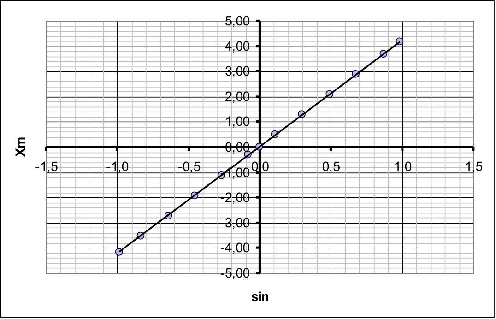

The linearity of this graph confirms the applicability of formula (13) for describing the law of mirror motion. The parameters of this dependence calculated by the least squares method have the following numerical values:

$$
\begin{align*}
& A = ( 4.23 \pm 0.01 ) \mu \mathrm { m } \\
& b = ( 0.04 \pm 0.06 ) \mu \mathrm { m } \tag{14}
\end{align*}
$$

The slope coefficient $A$ is the amplitude of the mirror oscillation. When this numerical value of the shift parameter $b$ is less than its error, therefore, it can be assumed that $b = 0$, and the analyzed dependence is directly proportional.

## 3. Monochromatic radiation with unknown wavelength

3.1 From the table of extrema, we select symmetrical points (according to the formulated criteria) Table 2.

| $m$ | $t _ { m }$ | $x _ { m }$ |
| :--- | :--- | :--- |
| 1 | 138 | -4,088 |
| 5 | 240 | -3,382 |
| 10 | 320 | -2,476 |
| 15 | 384 | -1,586 |
| 20 | 442 | -0,698 |
| 24 | 486 | 0,000 |
| 28 | 529 | 0,682 |
| 33 | 586 | 1,556 |
| 38 | 653 | 2,489 |
| 43 | 730 | 3,363 |
| 47 | 830 | 4,071 |

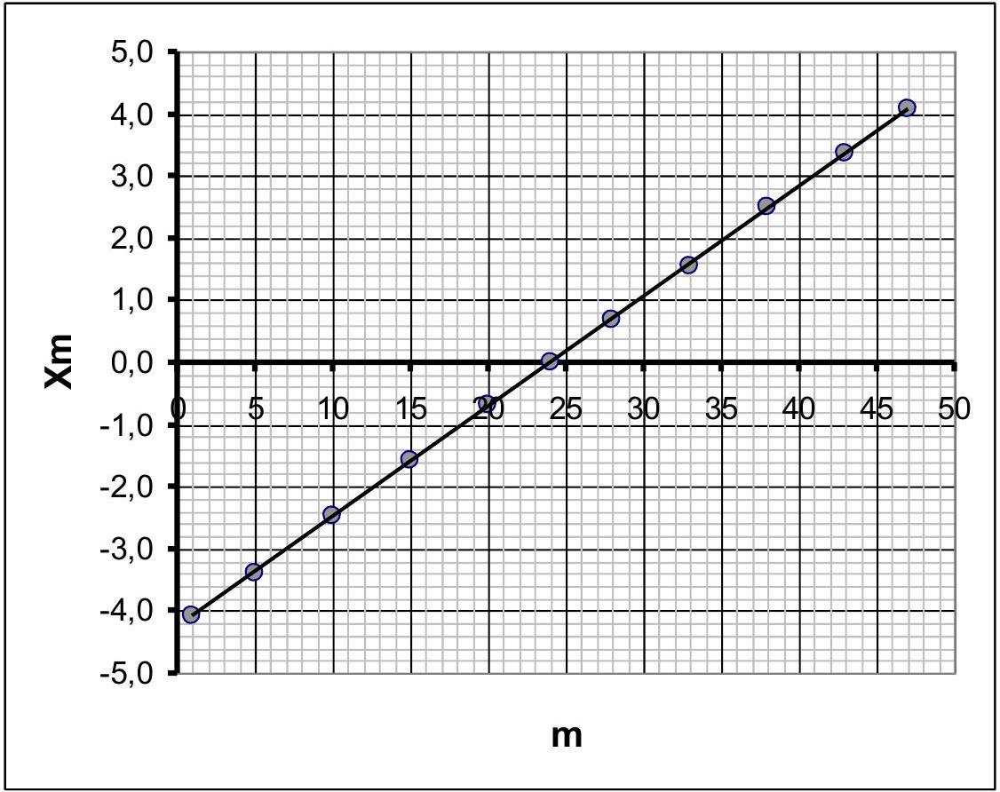
3.2 For each extremum, using formula (13), we calculate the value of the mirror coordinate $x _ { m }$, after which we plot the dependence of the mirror coordinate on the extremum number $m$. This dependence is described by the formula

$$
\begin{equation*}
x _ { m } = m \frac { \lambda } { 4 } . \tag{15}
\end{equation*}
$$

The resulting graph confirms this dependence (shift along the number axis $m$ in this case does not play a role and is due to a different numbering of extrema). The coefficient of the slope of the graph calculated by the least squares is equal to

$$
a = ( 0,1771 \pm 0,0008 ) \mu \mathrm { m } .
$$

It follows from the form of function (15) that the radiation wavelength is equal to

$$
\begin{equation*}
\lambda = 4 a = ( 0,709 \pm 0,003 ) \mu \mathrm { m } . \tag{16}
\end{equation*}
$$

## 4. Two monochromatic waves

4.1 Waves with different wavelengths do not interfere, in this case the recorded signal is the sum of the intensities of these waves. Using formula (3), we write an explicit expression for the dependence of the total intensity on the mirror coordinate and transform it (using the trigonometric formula for the sum of cosines):

$$
\begin{align*}
& U ( x ) = 2 I _ { 1 } \cos \frac { 4 \pi } { \lambda _ { 1 } } x + 2 I _ { 2 } \cos \frac { 4 \pi } { \lambda _ { 2 } } x = \\
& = 2 I _ { 0 } \left( \cos \frac { 4 \pi } { \lambda _ { 1 } } x + \cos \frac { 4 \pi } { \lambda _ { 2 } } x \right) + 2 \left( I _ { 2 } - I _ { 1 } \right) \cos \frac { 4 \pi } { \lambda _ { 2 } } x =  \tag{17}\\
& = 4 I _ { 1 } \cos \left( 2 \pi \left( \frac { 1 } { \lambda _ { 1 } } - \frac { 1 } { \lambda _ { 2 } } \right) x \right) \cos \left( 2 \pi \left( \frac { 1 } { \lambda _ { 1 } } + \frac { 1 } { \lambda _ { 2 } } \right) x \right) + 2 \left( I _ { 2 } - I _ { 1 } \right) \cos \frac { 4 \pi } { \lambda _ { 2 } } x
\end{align*}
$$

The resulting function describes the modulated signal obtained experimentally. The formula is too complicated to get explicit expressions for the extrema of this function. Therefore, the only way to obtain the required characteristics is to analyze the envelope of the fast-changing signal. Up to a constant term, this envelope is described by the function

$$
\begin{equation*}
\bar { U } ( x ) = U _ { 1 } \cos \left( 2 \pi \left( \frac { 1 } { \lambda _ { 1 } } - \frac { 1 } { \lambda _ { 2 } } \right) x \right) = U _ { 1 } \cos \left( \frac { 2 \pi } { \Lambda } x \right) , \tag{18}
\end{equation*}
$$

where we denote

$$
\begin{equation*}
\left| \frac { 1 } { \lambda _ { 1 } } - \frac { 1 } { \lambda _ { 2 } } \right| = \frac { 1 } { \Lambda } . \tag{19}
\end{equation*}
$$

Here $\Lambda$ - spatial period of signal modulation (see figure below).
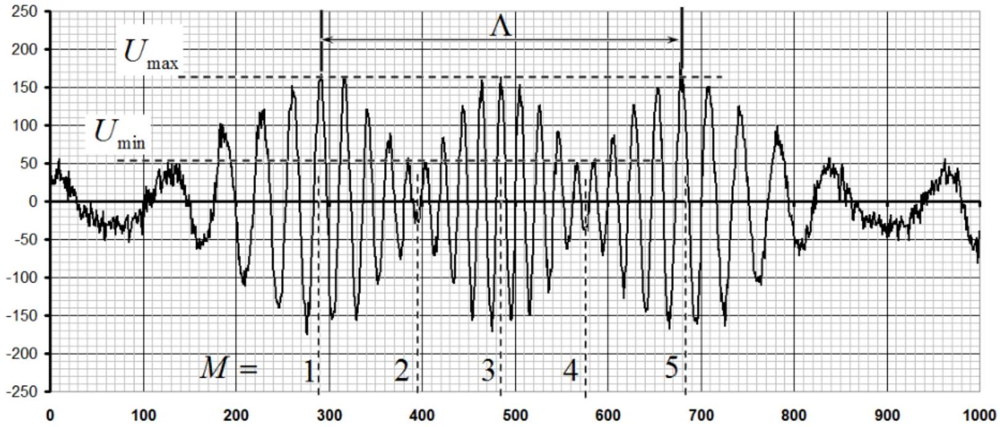

The envelope function (18) is extremal under the condition

$$
\begin{equation*}
\frac { 2 \pi } { \Lambda } x _ { M } = \frac { \pi } { 2 } M , \tag{20}
\end{equation*}
$$

where $M = 0 , \pm 1 , \pm 2 \ldots$ - extremum number of the envelope.
In the above signal, 5 such extrema can be distinguished, they are also shown in the figure. It follows from formula (20) that the corresponding coordinate of the mirror is determined by the formula

$$
\begin{equation*}
x _ { M } = \frac { \Delta } { 4 } \left( M - M _ { 0 } \right) . \tag{21}
\end{equation*}
$$

Here $M _ { 0 }$ is the "initial" number, which is insignificant for further analysis and determines the start of counting the numbers.

Using the table of extrema, we determine the times $t _ { M }$ at which extrema are observed, then, using formula (14), we calculate the values of the mirror coordinates $x _ { M }$ and plot the dependence $x _ { M } ( M )$. These values are shown in Table 3 and on the graph.

Table 3.
| $M$ | $t _ { M }$ | $x _ { M }$, мкм |
| :--- | :--- | :--- |
| 1 | 292 | -2,823 |
| 2 | 397 | -1,392 |
| 3 | 486 | 0,000 |
| 4 | 577 | 1,422 |
| 5 | 679 | 2,811 |

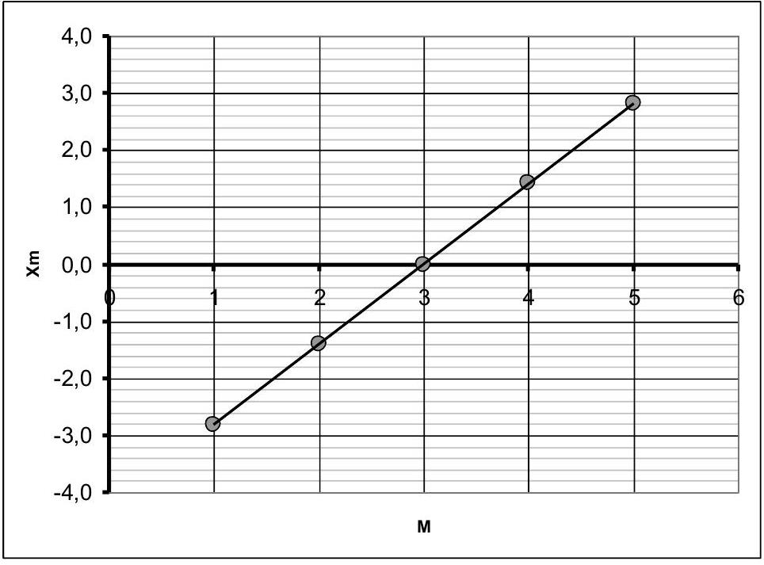

The slope coefficient of this graph, calculated by the least squares, is equal to

$$
a = ( 1,41 \pm 0,01 ) \mu \mathrm { m } ,
$$

and as follows from formula (21), the spatial period is equal to

$$
\begin{equation*}
\Lambda = ( 5,64 \pm 0,04 ) \mu \mathrm { m } . \tag{22}
\end{equation*}
$$

Finally, from formula (19) we calculate two possible values of the wavelength : $\lambda _ { 2 }$ :

$$
\begin{align*}
& \lambda _ { 21 } = \left( \frac { 1 } { \lambda _ { 1 } } - \frac { 1 } { \Lambda } \right) ^ { - 1 } = 0,722 \mu \mathrm {~m}  \tag{23}\\
& \Delta \lambda _ { 21 } = \left( \frac { 1 } { \lambda _ { 1 } } - \frac { 1 } { \Lambda } \right) ^ { - 2 } \frac { \Delta \Lambda } { \Lambda ^ { 2 } } = \left( \frac { \lambda _ { 1 } } { \Lambda } \right) ^ { 2 } \Delta \Lambda = 0,001 \mu \mathrm {~m} \\
& \lambda _ { 22 } = \left( \frac { 1 } { \lambda _ { 1 } } + \frac { 1 } { \Lambda } \right) ^ { - 1 } = 0,575 \mu \mathrm {~m}  \tag{24}\\
& \Delta \lambda _ { 22 } = \left( \frac { \lambda _ { 2 } } { \Lambda } \right) ^ { 2 } \Delta \Lambda = 0,001 \mu \mathrm {~m}
\end{align*}
$$

4.2 To estimate the ration of intensities of the two waves, you can use the maximum and minimum values of the modulating function. From formula (17) it follows that

$$
\begin{align*}
& U _ { \max } \approx 2 \left( I _ { 0 } + I _ { 1 } \right) \\
& U _ { \max } \approx 2 \left| I _ { 0 } - I _ { 1 } \right| . \tag{25}
\end{align*}
$$

The values $U _ { \text {max } } , U _ { \text {min } }$ can be taken approximately from the graph (or from the table) $U _ { \text {max } } \approx 170$, $U _ { \text {min } } \approx 40$. Their ratio is $\gamma = \frac { U _ { \text {max } } } { U _ { \text {min } } } \approx 4,25$. On the other hand, formulas (25) one gets

$$
\begin{equation*}
\gamma = \frac { I _ { 1 } + I _ { 2 } } { \left| I _ { 1 } - I _ { 2 } \right| } \Rightarrow \frac { I _ { 1 } } { I _ { 0 } } = \frac { 1 - \gamma } { 1 + \gamma } \approx 0,62 . \tag{26}
\end{equation*}
$$

That is $I _ { 21 } / I _ { 1 } \approx 0,62$.
The second option is also possible.: $\frac { I _ { 22 } } { I _ { 1 } } \approx 1,62$.

| № | Content | For the part | points |
| :--- | :--- | :--- | :--- |
| 1. Theoretical part (incorrect coefficients - the formula is not graded) |  | 1,0 |  |
| 1.1 | formula (1) $I = 2 I _ { 0 } ( 1 + \cos \Delta \varphi ) = 4 I _ { 0 } \cos ^ { 2 } \frac { \Delta \varphi } { 2 }$ |  | 0,2 |
| 1.2 | formula for the phase shift (2) $\Delta \varphi = \frac { 4 \pi } { \lambda } x$ |  | 0,2 |
|  | formula for the intensity (3) $I = 4 I _ { 0 } \cos ^ { 2 } \frac { 2 \pi } { \lambda } x$ |  | 0,2 |
| 1.3 | formula (4) $x _ { m } = m \frac { \lambda } { 2 }$ |  | 0,1 |
|  | formula (5) $x _ { m } = \left( m + \frac { 1 } { 2 } \right) \frac { \lambda } { 2 }$ |  | 0,1 |
| 1.4 | formula (6) $x _ { m } = m \frac { \lambda } { 4 }$ |  | 0,2 |
| 2. Monochromatic radiation of a known wavelength as an |  | 8,0 |  |

| instrument calibration |  |  |  |
| :--- | :--- | :--- | :--- |
| 2.1 | Determination of the division value: - maxima 0 and 54 - utmost positions of the mirror - 0,4; - the motion time - half the oscillation period - 0,2; - period calculation in relative units $T = 1668 - 0,1$; - calculation of the period in seconds $T = 50 \mathrm {~ms} - 0,1$; - calculation of the division value $\Delta t = 0,030 \mathrm {~ms} - 0,2$  |  | 1,0 |
| 2.2 | Determination of the law of motion |  |  |
|  | Using the found oscillation period; |  | 0,5 |
|  | determination of the center point: - the number of the maximum $m _ { 0 } = \frac { 0 + 54 } { 2 } = 27 - 0,3$; - time when passing the center point $t _ { 0 } = 486 - 0,2$;  |  | 0,5 |
|  | Choice of points: - 10 or more points are used 0,3 (5 or more -0,1); - outmost points not included - 0,2; - maximum range used - 0,3; - points are roughly symmetrical - 0,2;  |  | 1,0 |
|  | coordinate determination method: - distance between adjacent extrema $- \frac { \lambda } { 4 } - 0,5$; - перенумерация максимумов от среднего - 0,2; -formula for calculating coordinates $x _ { m } = m ^ { \prime } \frac { \lambda _ { 0 } } { 4 } - 0,3$;  |  | 1,0 |
|  | coordinate calculation (the correct calculation are carried out for all selected points; the allowable calculation error is 10\%) |  | 1,0 |
|  | dependence linearization: - dependence $x$ on $\sin \left( \frac { 2 \pi } { T } \left( t - t _ { 0 } \right) \right) - 0,4$; - sines are calculated 0,6;  |  | 1,0 |
|  | graph plotting: (graded if calculations are graded); - axes signed and ticked - 0,1; - all points are plotted in accordance with the table - 0,2; - linear dependence is obtained -0.2; - smoothing straight line drawn - 0,2;  |  | 0,7 |
|  | calculation of the amplitude of the mirror oscillations: LSM used - 0,3 (graphically, or averaging over all points 0,2; using 2 points 0,1); (calculation carried out according to the number of extrema -0,1); numerical value obtained in the range 4,2-4,3 $\mu m - 0,5$ (in the range of 4,0-4,5 $\mu m - 0,3$; out of the range - 0 ); |  | 0,8 |
|  | amplitude error calculation: - LSM used -0,3 (other methos -0,2); - numerical value of the order $10 ^ { - 2 } \mu m - 0,3$;  |  | 0,5 |
| 3. Monochromatic radiation with unknown wavelength |  | 5,0 |  |
| 3.1 | Choice of points: - 10 or more points used 0,3 (5 or more -0,1); - utmost points excluded - 0,2;  |  | 1,0 |

|  | - maximum range used - 0,3;   - points are roughly symmetrical - 0,2; |  |  |
| :--- | :--- | :--- | :--- |
|  | extrema coordinates calculation:   - using the correct formula for coordinates - 0,5;   - the coordinates of extrema calculated with an error of no more than 10\% - 1,0 ; |  | 1,5 |
|  | graph plotting:   (graded if calculations are graded);   - axes signed and ticked - 0,1;   - all points are plotted in accordance with the table 0,2;   - linear dependence is obtained -0.2;   - smoothing straight line drawn - 0,2; |  | 0,7 |
| 3.2 | wavelength calculation:   - LSM used - 0,5 (averaging over all point - 0,3 ; 1-2 points used - 0,2);   - numerical value in the range $0,70 - 0,72 \mu m - 0,8$ (in the range of 0,68-0,74 μm - 0,4, out of range - 0); |  | 1,3 |
|  | wavelength error calculation:   - LSM used - 0,2 (other reasonable method - 0,1);   - value of the order $10 ^ { - 2 } \mu m$ - 0,3; |  | 0,5 |
| 4. Two monochromatic waves |  | 6,0 |  |
| 4.1 | Formula for the resulting intensity (17) |  | 0,5 |
|  | Envelope analysis (calculations based on the position of extrema are not graded); |  | 0,5 |
|  | choice of extremum points of the envelope:   - 0,2 for each extremum; |  | 1,0 |
|  | wavelength calculation formula $\left\| \frac { 1 } { \lambda _ { 0 } } - \frac { 1 } { \lambda _ { 1 } } \right\| = \frac { 1 } { \Lambda }$ |  | 0,3 |
|  | two solutions for the wavelength:   LSM used (averaging over all points) - 0,4 (by using 2 points - 0,2);   Numerical values in the ranges   $0,70 - 0,74 \mu m ; \quad 0,56 - 0,59 \mu m - 2 x 0,6 ;$   In the ranges   (0, 67-0,77 μm; 0,53-0,62 μm - 2x0,3;)   Out of range - 0; |  | 1,6 |
|  | error estimation:   formula for error of indirect measurements $\Delta \lambda _ { 1 } = \left( \frac { \lambda _ { 1 } } { \Lambda } \right) ^ { 2 } \Delta \Lambda - 0,3 ;$   Numerical values - 2x0,1; |  | 0,5 |
| 4.2 | Formula for calculating ratio of intensities: $\frac { I _ { 2 } } { I _ { 1 } } = \frac { 1 - \gamma } { 1 + \gamma }$ |  | 0,3 |
|  | two solutions for intensities ration (reference to two values); |  | 0,3 |
|  | calculating ratio of intensities, numerical values:   in the ranges 0,5-0,7; 1,5-1,7-2x0,5;   (in the ranges 0,4-0,8; $1,4 - 1,8 - 2 x 0,2$ )   out of ranges - 0 |  | 1,0 |
|  | TOTAL | 20,0 |  |

## РЕШЕНИЕ ЗАДАЧ ЭКСПЕРИМЕНТАЛЬНОГО ТУРА   Фурье-спектрометр   1. Теоретическая часть

1.1 При интерференции двух волн одинаковой интенсивности, результирующая интенсивность определяется формулой

$$
\begin{equation*}
I = 2 I _ { 0 } ( 1 + \cos \Delta \varphi ) = 4 I _ { 0 } \cos ^ { 2 } \frac { \Delta \varphi } { 2 } . \tag{1}
\end{equation*}
$$

1.2 При смещении зеркала из начального положения на величину $x$ разность хода изменяется на величину $2 x$. При этом между двумя волнами разность возникает фаз

$$
\begin{equation*}
\Delta \varphi = \frac { 4 \pi } { \lambda } x , \tag{2}
\end{equation*}
$$

поэтому зависимость интенсивности от координаты имеет вид

$$
\begin{equation*}
I = 2 I _ { 0 } \cos ^ { 2 } \frac { 2 \pi } { \lambda } x . \tag{3}
\end{equation*}
$$

1.3 Максимум интенсивности наблюдается, если разность хода равна целому числу длин волн, т.е.

$$
\begin{equation*}
2 x _ { m } = m \lambda \Rightarrow x _ { m } = m \frac { \lambda } { 2 } , \tag{4}
\end{equation*}
$$

а минимумы интенсивности возникают при выполнении условия

$$
\begin{equation*}
2 x _ { m } = \left( m + \frac { 1 } { 2 } \right) \lambda \Rightarrow x _ { m } = \left( m + \frac { 1 } { 2 } \right) \frac { \lambda } { 2 } . \tag{5}
\end{equation*}
$$

1.4 Интенсивность изменяется от максимума до минимума (и наоборот) при смещении зеркала на четверть длины волны. Поэтому искомые координаты зеркала описываются формулой

$$
\begin{equation*}
x _ { m } = m \frac { \lambda } { 4 } . \tag{6}
\end{equation*}
$$

2. Монохроматическое излучение известной длины волны - градуировка прибора
2.1 Из приведенного графика следует, что крайним положениям зеркала соответствуют значения времен

$$
\begin{equation*}
t _ { \min } = 67 ; \quad t _ { \max } = 901 . \tag{7}
\end{equation*}
$$

Это смещение происходит за половину периода колебаний зеркала, поэтому

$$
\begin{equation*}
T = 2 \left( t _ { \max } - t _ { \min } \right) = 1668 . \tag{8}
\end{equation*}
$$

С другой стороны, период колебаний можно выразить через заданную частоту колебаний зеркала $v = 20 \Gamma u$ :

$$
\begin{equation*}
T = \frac { 1 } { v } = 5.0 \cdot 10 ^ { - 2 } \mathrm { c } = 50 \mathrm { мc } . \tag{9}
\end{equation*}
$$

Приравнивая выражения (8) и (9), находим, что цена деления временной шкалы равна

$$
\begin{equation*}
\Delta t = \frac { 50 } { 2 ( 901 - 67 ) } = 0.030 \mathrm { mc } . \tag{10}
\end{equation*}
$$

2.2 Приведенный график зависимости интенсивности от времени симметричен относительно «центрального» максимума, номер которого равен

$$
\begin{equation*}
m _ { 0 } = \frac { 0 + 54 } { 2 } = 27 \tag{11}
\end{equation*}
$$

и этому максимуму соответствует момент времени

$$
\begin{equation*}
t _ { 0 } = 486 . \tag{12}
\end{equation*}
$$

Для дальнейших расчетов выберем 13 экстремумов (для ровного счета), примерно симметричных относительно центрального максимума. Таблица 1.

Таблица 1.
| $m$ | $t _ { m }$ | $m - m _ { 0 }$ | $t - t _ { 0 }$ | $\sin \left( \frac { 2 \pi } { T } \left( t - t _ { 0 } \right) \right)$ | $x _ { m }$, МКМ |
| :--- | :--- | :--- | :--- | :--- | :--- |

| 1 | 118 | -26 | -368 | -0,983 | -4,16 |
| :--- | :--- | :--- | :--- | :--- | :--- |
| 5 | 224 | -22 | -262 | -0,834 | -3,52 |
| 10 | 302 | -17 | -184 | -0,639 | -2,72 |
| 15 | 361 | -12 | -125 | -0,454 | -1,92 |
| 20 | 414 | -7 | -72 | -0,268 | -1,12 |
| 25 | 465 | -2 | -21 | -0,079 | -0,32 |
| 27 | 486 | 0 | 0 | 0,000 | 0,00 |
| 30 | 515 | 3 | 29 | 0,109 | 0,48 |
| 35 | 567 | 8 | 81 | 0,300 | 1,28 |
| 40 | 623 | 13 | 137 | 0,493 | 2,08 |
| 45 | 684 | 18 | 198 | 0,679 | 2,88 |
| 50 | 766 | 23 | 280 | 0,870 | 3,68 |
| 53 | 855 | 26 | 369 | 0,984 | 4,16 |

Проведем следующие расчеты:
Номер экстремума относительно центра $m ^ { \prime } = m - m _ { 0 }$;
Временной сдвиг относительно центра $t ^ { \prime } = t - t _ { 0 }$;
Координаты зеркала при экстремумах интенсивности $x _ { m } = m ^ { \prime } \frac { \lambda _ { 0 } } { 4 }$.
Для проверки применимости закона движения

$$
\begin{equation*}
x ( t ) = A \sin \left( \frac { 2 \pi } { T } \left( t - t _ { 0 } \right) \right) \tag{13}
\end{equation*}
$$

построим график зависимости координат $x _ { m }$ от $S = \sin \left( \frac { 2 \pi } { T } \left( t - t _ { 0 } \right) \right)$. Следует отметить, что при выборе точек для построения графика следует:

- выбирать точки с максимальным диапазоном изменения координат;
- не включать крайние экстремумы, так как они могут не удовлетворять условию (6).

Ниже приведен график этой зависимости.
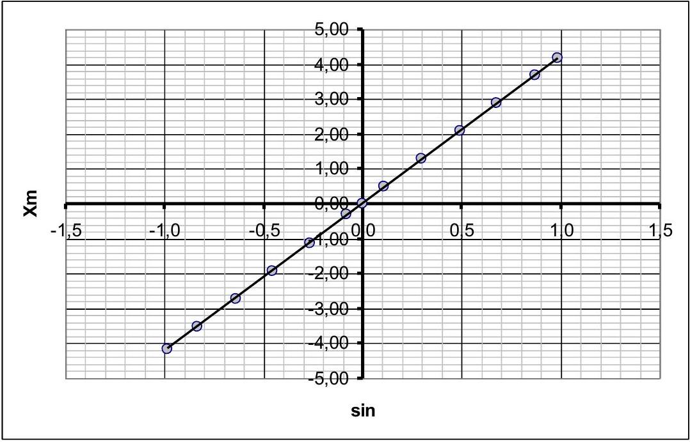

Линейность этого графика подтверждает применимость формулы (13) для описания закона движения зеркала. Рассчитанные по методу наименьших квадратов параметры этой зависимости имеют следующие численные значения:

$$
\begin{align*}
& A = ( 4.23 \pm 0.01 ) \text { мКМ } \\
& b = ( 0.04 \pm 0.06 ) \text { мКМ } \tag{14}
\end{align*}
$$

Коэффициент наклона $A$ является амплитудой колебаний зеркала. При это численное значение параметра сдвига меньше его погрешности, поэтому можно принять, что $b = 0$, а анализируемая зависимость является прямо пропорциональной.

## 3. Монохроматическое излучение с неизвестной длиной волны

3.1 Из таблицы максимумов выберем симметричные точки (по сформулированным критериям) Таблица 2.

| $m$ | $t _ { m }$ | $x _ { m }$ |
| :--- | :--- | :--- |
| 1 | 138 | -4,088 |
| 5 | 240 | -3,382 |
| 10 | 320 | -2,476 |
| 15 | 384 | -1,586 |
| 20 | 442 | -0,698 |
| 24 | 486 | 0,000 |
| 28 | 529 | 0,682 |
| 33 | 586 | 1,556 |
| 38 | 653 | 2,489 |
| 43 | 730 | 3,363 |
| 47 | 830 | 4,071 |

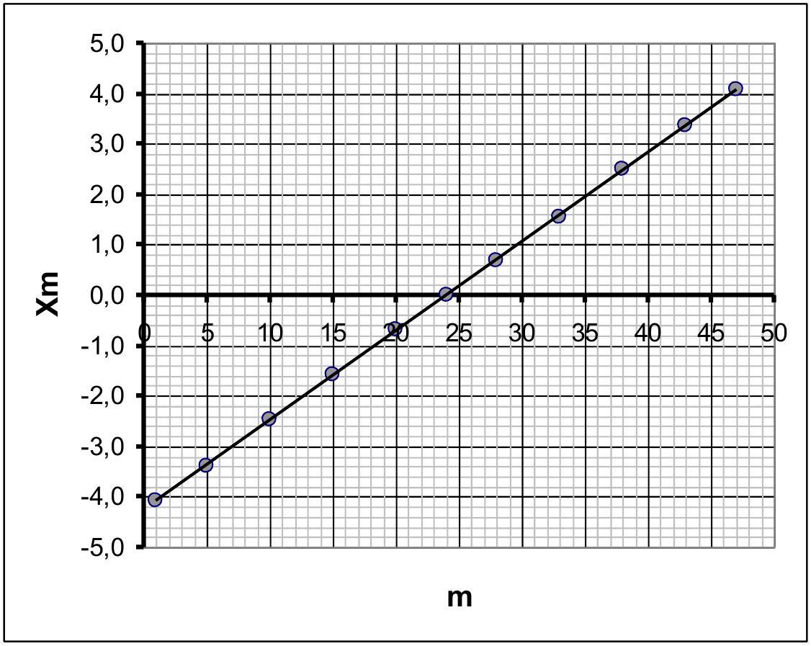
3.2 Для каждого экстремума по формуле (13) рассчитаем значение координаты зеркала $x _ { m }$, после чего построим график зависимости координаты зеркала от номера экстремума $m$. Эта зависимость описывается функцией

$$
\begin{equation*}
x _ { m } = m \frac { \lambda } { 4 } . \tag{15}
\end{equation*}
$$

Полученный график подтверждает эту зависимость (сдвиг по оси номеров $m$ в данном случае роли не играет и обусловлен другой нумерацией экстремумов). Рассчитанный по МНК коэффициент наклона графика равен

$$
a = ( 0,1771 \pm 0,0008 ) \text { мкм. }
$$

Из вида функции (15) следует, что длина волны излучения равна

$$
\begin{equation*}
\lambda = 4 a = ( 0,709 \pm 0,003 ) \text { мкм. } \tag{16}
\end{equation*}
$$

## 4. Две монохроматические волны

4.1 Волны с разными длинами не интерферируют, в данном случае зарегистрированный сигнал является суммой интенсивностей этих волн. Запишем с помощью формулы (3) явное выражение зависимости суммарной интенсивности от координаты зеркала и преобразуем его (с помощью тригонометрической формулы для суммы косинусов):

$$
\begin{align*}
& U ( x ) = 2 I _ { 1 } \cos \frac { 4 \pi } { \lambda _ { 1 } } x + 2 I _ { 2 } \cos \frac { 4 \pi } { \lambda _ { 2 } } x = \\
& = 2 I _ { 0 } \left( \cos \frac { 4 \pi } { \lambda _ { 1 } } x + \cos \frac { 4 \pi } { \lambda _ { 2 } } x \right) + 2 \left( I _ { 2 } - I _ { 1 } \right) \cos \frac { 4 \pi } { \lambda _ { 2 } } x =  \tag{17}\\
& = 4 I _ { 1 } \cos \left( 2 \pi \left( \frac { 1 } { \lambda _ { 1 } } - \frac { 1 } { \lambda _ { 2 } } \right) x \right) \cos \left( 2 \pi \left( \frac { 1 } { \lambda _ { 1 } } + \frac { 1 } { \lambda _ { 2 } } \right) x \right) + 2 \left( I _ { 2 } - I _ { 1 } \right) \cos \frac { 4 \pi } { \lambda _ { 2 } } x
\end{align*}
$$

Полученная функция описывает модулированный сигнал, полученный экспериментально. Формула слишком сложна, чтобы получить явные выражения для экстремумов данной функции. Поэтому единственной возможностью для получения требуемых характеристик является анализ огибающей быстропеременного сигнала. С точностью до постоянного слагаемого эта огибающая описывается функцией

$$
\begin{equation*}
\bar { U } ( x ) = U _ { 1 } \cos \left( 2 \pi \left( \frac { 1 } { \lambda _ { 1 } } - \frac { 1 } { \lambda _ { 2 } } \right) x \right) = U _ { 1 } \cos \left( \frac { 2 \pi } { \Lambda } x \right) , \tag{18}
\end{equation*}
$$

где обозначено

$$
\begin{equation*}
\left| \frac { 1 } { \lambda _ { 1 } } - \frac { 1 } { \lambda _ { 2 } } \right| = \frac { 1 } { \Lambda } . \tag{19}
\end{equation*}
$$

Здесь $\Lambda$ - пространственный период модуляции сигнала (см. рис. ниже).
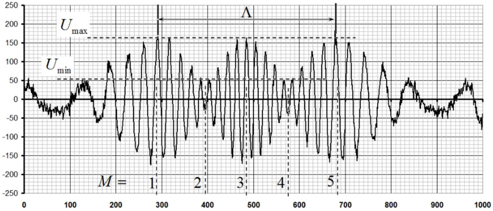

Огибающая функция (18) экстремальна при выполнении условия

$$
\begin{equation*}
\frac { 2 \pi } { \Lambda } x _ { M } = \frac { \pi } { 2 } M , \tag{20}
\end{equation*}
$$

где $M = 0 , \pm 1 , \pm 2 \ldots$ - номер экстремума огибающей.
В приведенном сигнале можно выделить 5 таких экстремумов, они также показаны на рисунке. Из формулы (20) следует, что соответствующая координата зеркала определяется по формуле

$$
\begin{equation*}
x _ { M } = \frac { \Delta } { 4 } \left( M - M _ { 0 } \right) . \tag{21}
\end{equation*}
$$

Здесь $M _ { 0 }$ - несущественный для дальнейшего анализа «начальный» номер, определяющий начало отсчета номеров.

По таблице экстремумов определим значения времен $t _ { M }$, при которых наблюдаются экстремумы, затем по формуле (14) рассчитаем значения координат зеркала $x _ { M }$ и построим график зависимости $x _ { M } ( M )$. Эти значения приведены в таблице 3 и на графике.
Таблица 3.

| $M$ | $t _ { M }$ | $x _ { M }$, мкм |
| :--- | :--- | :--- |
| 1 | 292 | -2,823 |
| 2 | 397 | -1,392 |
| 3 | 486 | 0,000 |
| 4 | 577 | 1,422 |
| 5 | 679 | 2,811 |

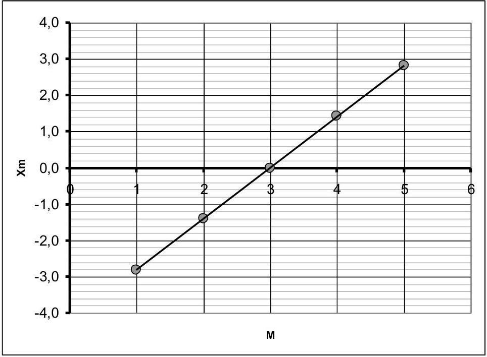

Коэффициент наклона этого графика, рассчитанный по МНК, равен

$$
a = ( 1,41 \pm 0,01 ) \text { мкм, }
$$

а как следует из формулы (21) , пространственный период равен

$$
\begin{equation*}
\Lambda = ( 5,64 \pm 0,04 ) \text { мкм. } \tag{22}
\end{equation*}
$$

Наконец, из формулы (19) рассчитаем два возможных значения длины волны $\lambda _ { 2 }$ :

$$
\begin{align*}
& \lambda _ { 21 } = \left( \frac { 1 } { \lambda _ { 1 } } - \frac { 1 } { \Lambda } \right) ^ { - 1 } = 0,722 \text { мкм }  \tag{23}\\
& \Delta \lambda _ { 21 } = \left( \frac { 1 } { \lambda _ { 1 } } - \frac { 1 } { \Lambda } \right) ^ { - 2 } \frac { \Delta \Lambda } { \Lambda ^ { 2 } } = \left( \frac { \lambda _ { 1 } } { \Lambda } \right) ^ { 2 } \Delta \Lambda = 0,001 \text { мкм } \\
& \lambda _ { 22 } = \left( \frac { 1 } { \lambda _ { 1 } } + \frac { 1 } { \Lambda } \right) ^ { - 1 } = 0,575 \text { мкм }  \tag{24}\\
& \Delta \lambda _ { 22 } = \left( \frac { \lambda _ { 2 } } { \Lambda } \right) ^ { 2 } \Delta \Lambda = 0,001 \text { мкм }
\end{align*}
$$

4.2 Для оценки интенсивности второй волны можно воспользоваться максимальным и минимальным значениями модулирующей функции. Из формулы (17) следует, что

$$
\begin{align*}
& U _ { \max } \approx 2 \left( I _ { 0 } + I _ { 1 } \right) \\
& U _ { \max } \approx 2 \left| I _ { 0 } - I _ { 1 } \right| . \tag{25}
\end{align*}
$$

Значения $U _ { \text {max } } , U _ { \text {min } }$ можно приближенно снять с графика (или из таблицы) $U _ { \text {max } } \approx 170$, $U _ { \text {min } } \approx 40$. Их отношение $\gamma = \frac { U _ { \text {max } } } { U _ { \text {min } } } \approx 4,25$. С другой стороны, из формул (25) следует

$$
\begin{equation*}
\gamma = \frac { I _ { 1 } + I _ { 2 } } { \left| I _ { 1 } - I _ { 2 } \right| } \Rightarrow \frac { I _ { 1 } } { I _ { 0 } } = \frac { 1 - \gamma } { 1 + \gamma } \approx 0,62 . \tag{26}
\end{equation*}
$$

То есть $I _ { 21 } / I _ { 1 } \approx 0,62$.
Возможен и второй вариант: $\frac { I _ { 22 } } { I _ { 1 } } \approx 1,62$.

| № | Содержание | За часть | баллы |
| :--- | :--- | :--- | :--- |
| 1. Теоретическая часть (не верные коэффициенты - формула не оценивается) |  | 1,0 |  |
| 1.1 | формула (1) $I = 2 I _ { 0 } ( 1 + \cos \Delta \varphi ) = 4 I _ { 0 } \cos ^ { 2 } \frac { \Delta \varphi } { 2 }$ |  | 0,2 |
| 1.2 | формула для сдвига фаз (2) $\Delta \varphi = \frac { 4 \pi } { \lambda } x$ |  | 0,2 |
|  | формула для интенсивности (3) $I = 4 I _ { 0 } \cos ^ { 2 } \frac { 2 \pi } { \lambda } x$ |  | 0,2 |
| 1.3 | формула (4) $x _ { m } = m \frac { \lambda } { 2 }$ |  | 0,1 |
|  | формула (5) $x _ { m } = \left( m + \frac { 1 } { 2 } \right) \frac { \lambda } { 2 }$ |  | 0,1 |
| 1.4 | формула (6) $x _ { m } = m \frac { \lambda } { 4 }$ |  | 0,2 |
| 2. Монохроматическое излучение известной длины волны градуировка прибора |  | 8,0 |  |

| 2.1 | Определение цены деления: - максимумы 0 и 54 - крайние положения зеркала - 0,4; - время движения - половина периода колебаний - 0,2; - расчет периода в отн. единицах $T = 1668 - 0,1$; - расчет периода в секундах $T = 50 м с - 0,1$; - расчет цены деления $\Delta t = 0,030 м c - 0,2$  |  | 1,0 |
| :--- | :--- | :--- | :--- |
| 2.2 | Определение закона движения |  |  |
|  | Использование найденного периода колебаний; |  | 0,5 |
|  | определение центральной точки: - номер максимума $m _ { 0 } = \frac { 0 + 54 } { 2 } = 27 - 0,3$; - время прохождения центральной точки $t _ { 0 } = 486 - 0,2$;  |  | 0,5 |
|  | выбор точек: - использовано 10 и более точек 0,3 (5 и более -0,1); - не включены крайние - 0,2; - использован максимальный диапазон - 0,3; - точки примерно симметричны - 0,2;  |  | 1,0 |
|  | метод определения координат: - расстояние между соседними экстремумами $- \frac { \lambda } { 4 } - 0,5$; - перенумерация максимумов от среднего - 0,2; - формула для расчета координаты $x _ { m } = m ^ { \prime } \frac { \lambda _ { 0 } } { 4 } - 0,3$;  |  | 1,0 |
|  | расчет координат (проведен правильный расчет по всем выбранным точкам допустимая погрешность расчета 10\%) |  | 1,0 |
|  | линеаризация зависимости: - зависимость $x$ от $\sin \left( \frac { 2 \pi } { T } \left( t - t _ { 0 } \right) \right) - 0,4$; - проведен расчет синусов 0,6;  |  | 1,0 |
|  | построение графика: (оценивается, если оценены расчеты); - оси подписаны и оцифрованы - 0,1; - нанесены все точки в соответствии с таблицей 0,2; - получена линейная зависимость -0.2; - проведена сглаживающая прямая линия - 0,2;  |  | 0,7 |
|  | расчет амплитуды колебаний зеркала: использован МНК - 0,3 (графически, или усреднение по всем точкам - 0,2; по 2 точкам 0,1); (расчет проведен по числу экстремумов - 0,1); получено численное значение в диапазоне 4,2-4,3 мкм 0,5 (в диапазоне 4,0-4,5 мкм - 0,3; вне диапазона - 0); |  | 0,8 |
|  | расчет погрешности амплитуды: - проведен по МНК -0,3 (иным разумным способом -0,2); - численное значение порядка $10 ^ { - 2 } м к м$ - 0,3;  |  | 0,5 |
| 3. Монохроматическое излучение с неизвестной длиной волны |  | 5,0 |  |
| 3.1 | Выбор точек: - использовано 10 и более точек 0,3 (5 и более -0,1); - не включены крайние - 0,2; - использован максимальный диапазон - 0,3; - точки примерно симметричны - 0,2;  |  | 1,0 |
|  | расчет координат экстремумов: |  | 1,5 |

|  | - использование правильной формулы для координат 0,5; - проведен расчет координат экстремумов с погрешностью не более 10\% - 1,0 ; |  |  |
| :--- | :--- | :--- | :--- |
|  | построение графика: (оценивается, если оценены расчеты); - оси подписаны и оцифрованы - 0,1; - нанесены все точки в соответствии с таблицей 0,2; - получена линейная зависимость -0.2; - проведена сглаживающая прямая линия - 0,2;  |  | 0,7 |
| 3.2 | расчет длины волны: - использован МНК - 0,5 (усреднение по всем точкам 0,3 ; по 1-2 точкам - 0,2); - получено численное значение в диапазоне 0,70-0,72 мкм - 0,8 (в диапазоне 0,68-0,74 мкм - 0,4, вне диапазона - 0); |  | 1,3 |
|  | расчет погрешности длины волны: - использован МНК - 0,2 (иной разумный способ - 0,1); - получено значение порядка $10 ^ { - 2 } м к м$ - 0,3;  |  | 0,5 |
| 4. Две монохроматические волны |  | 6,0 |  |
| 4.1 | формула для суммарной интенсивности (17) |  | 0,5 |
|  | Анализ огибающей (расчеты по положению экстремумов не оцениваются); |  | 0,5 |
|  | выбор точек экстремумов огибающей: - по 0,2 за каждый экстремум; |  | 1,0 |
|  | расчет длины волны формула $\left\| \frac { 1 } { \lambda _ { 0 } } - \frac { 1 } { \lambda _ { 1 } } \right\| = \frac { 1 } { \Lambda }$ |  | 0,3 |
|  | два решения для длины волны: Метод расчета по МНК (усреднение по всем точкам) 0,4 (по двум точкам - 0,2); Численные значения в диапазонах 0,70-0,74 мкм; 0,56-0,59 мкм - 2х0,6; В диапазонах (0, 67-0,77 мкм; 0,53-0,62 мкм - 2х0,3;) Вне диапазонов - 0; |  | 1,6 |
|  | оценка погрешностей: формула для погрешности косвенных измерений $\Delta \lambda _ { 1 } = \left( \frac { \lambda _ { 1 } } { \Lambda } \right) ^ { 2 } \Delta \Lambda - 0,3 ;$ Численные значения - $2 x 0,1$; |  | 0,5 |
| 4.2 | Формула для расчета отношения интенсивностей: $\frac { I _ { 2 } } { I _ { 1 } } = \frac { 1 - \gamma } { 1 + \gamma }$ |  | 0,3 |
|  | два решения для отношения интенсивностей (есть указание на два значения); |  | 0,3 |
|  | расчет отношения интенсивностей, численные значения: в диапазонах 0,5-0,7; 1,5-1,7-2x0,5; (в диапазонах 0,4-0,8; 1,4-1,8-2x0,2) Вне диапазонов - 0 |  | 1,0 |
|  | ВСЕГО | 20,0 |  |

## ЭКСПЕРИМЕНТТІК ТУРДЫҢ ТАПСЫРМАЛАРЫНЫҢ ШЕШИМІ Фурье-спектрометр

1. Теориялык бөлім
1.1 Қарқындылығы бірдей екі толқын интерференияланғанда қортқы қарқындылық мына өрнекпен анықталады

$$
\begin{equation*}
I = 2 I _ { 0 } ( 1 - \cos \Delta \varphi ) = 4 I _ { 0 } \cos ^ { 2 } \frac { \Delta \varphi } { 2 } \tag{1}
\end{equation*}
$$

1.2 Айналарды бастапқы орнынан $x$ өлшемге ауыстырған кезде қашықтық айырмашылығы $2 x$ өлшемге өзгереді. Сонымен қатар екі толқын арасында фазалық айырмашылық

$$
\begin{equation*}
\Delta \varphi = \frac { 4 \pi } { \lambda } x \tag{2}
\end{equation*}
$$

сондықтан интенсивтіліктің координатқа тәуелділігі мына түрде болады

$$
\begin{equation*}
I = 2 I _ { u } \cos ^ { 2 } \frac { 2 \pi } { i } x \tag{3}
\end{equation*}
$$

1.3 Қарқындылық максимумы егер жол айырмасы толқын ұзындығының бүтін санына тең болса байқалады,яғни.

$$
\begin{equation*}
2 x _ { n } = m \lambda \Rightarrow x _ { n _ { i } } = m { } ^ { \lambda } \tag{4}
\end{equation*}
$$

ал қарқындылықтың минимумдары мына шартта пайда болады

$$
\begin{equation*}
2 x _ { n i } = \left( m + \frac { 1 } { 2 } \right) \lambda _ { i } \Rightarrow x _ { n i } = \left( m + \frac { 1 } { 2 } \right) \frac { \lambda } { 2 } \tag{5}
\end{equation*}
$$

1.4 Айна толқын ұзындығының төрттен біріне ауысқанда қарқындылық максимумнан минимумға (және керісінше) өзгереді. Сондықтан айнаның қажетті координаталары мына формуламен сипатталады

$$
\begin{equation*}
x _ { n } = m ^ { \lambda } \tag{6}
\end{equation*}
$$

2. Белгілі толқын ұзындығының монохроматикалық сәулеленуі - аспапты калибрлеу
2.1 Жоғарыдағы графиктен айнаның шеткі жағдайларына мына уақыт мәндеріне сәйкес келетіні шығады

$$
\begin{equation*}
t _ { \mathrm { urr } } = 67 ; \quad t _ { \text {rur } } = 90 \mathrm { l } \tag{7}
\end{equation*}
$$

Бұл ығысу айнаның тербеліс периодының жартысында орын алады, сондықтан

$$
\begin{equation*}
T = 2 \left( t _ { \mathrm { r } , . . \mathrm { x } } - t _ { \mathrm { rurur } } \right) = 1668 . \tag{8}
\end{equation*}
$$

Екінші жағынан, тербеліс периодын берілген айна тербеліс жиілігі $v = 20 / { }$ и арқылы көрсетуге болады

$$
\begin{equation*}
T = \frac { 1 } { \nu } = \square \theta \cdot 10 ^ { 2 } \mathrm { c } = 50 \tag{9}
\end{equation*}
$$

(8) және (9) өрнектерін теңестіре отырып, біз уақыт шкаласының бағасының мынаған тең екенін табамыз.

$$
\begin{equation*}
\Delta t \frac { 50 } { 2 ( 901 - 67 ) } \quad \Delta 030 \tag{10}
\end{equation*}
$$

2.2 Қарқындылықтың уақытқа тәуелділігінің жоғарыдағы графигі «орталық» максимумға қатысты симметриялы, оның номері мынаған тең

$$
m _ { i j } = \begin{gather*}
0 + 54  \tag{11}\\
2
\end{gather*} = 27
$$

және бұл максимум мынадай уақытқа сәйкес келеді

$$
\begin{equation*}
t _ { 0 } = 486 . \tag{12}
\end{equation*}
$$

Әрі қарай есептеулер үшін орталық максимумға қатысты шамамен симметриялы 13 экстремумды (жақсы өлшем үшін) таңдаймыз. 1-кесте.

1-кесте.

| \# | $t _ { \text {v } }$ | $n - m _ { 0 }$ | $i - i _ { 11 }$ | $\sin \left( \frac { 2 \pi } { T } \left( t - t _ { 0 } \right) \right)$ | $x _ { s }$, MKM |
| :--- | :--- | :--- | :--- | :--- | :--- |
| 1 | 118 | -26 | -368 | -0,983 | -4,16 |
| 5 | 224 | -22 | -262 | -0,834 | -3,52 |
| 10 | 302 | -17 | -184 | -0,639 | -2,72 |
| 15 | 361 | -12 | -125 | -0,454 | -1,92 |
| 20 | 414 | -7 | -72 | -0,268 | -1,12 |
| 25 | 465 | -2 | -21 | -0,079 | -0,32 |
| 27 | 486 | 0 | 0 | 0,000 | 0,00 |
| 30 | 515 | 3 | 29 | 0,109 | 0,48 |
| 35 | 567 | 8 | 81 | 0,300 | 1,28 |
| 40 | 623 | 13 | 137 | 0,493 | 2,08 |
| 45 | 684 | 18 | 198 | 0,679 | 2,88 |
| 50 | 766 | 23 | 280 | 0,870 | 3,68 |
| 53 | 855 | 26 | 369 | 0,984 | 4,16 |

Келесі есептеулерді орындайық:
Орталыққа қатысты экстремум саны $m ^ { \prime } = m - m _ { \mathrm { b } }$;
Орталықтан уақыт бойынша ауытку $t ^ { t } = t - t _ { 11 }$;
Қарқындылықтың экстремумындағы айна координаттары $\begin{gathered} x _ { p n } = m ^ { \prime } { } _ { x _ { 1 } } \\ 4 \end{gathered}$.
Қозғалыс заңының

$$
\begin{equation*}
x ( t ) = A \sin \left( \frac { 2 \pi } { T } \left( r - t _ { 0 } \right) \right) \tag{13}
\end{equation*}
$$

қолданылуын тексеру үшін координаттардың тәуелділігін сызу $x$ от $S = \sin \left( \frac { 2 \pi } { T } \left( t - t _ { 0 } \right) \right)$. Айта кету керек, сызу үшін нүктелерді таңдаған кезде мыналар қажет:

- координаталарының максималды диапазоны бар нүктелерді таңдаңыз;
- шеткі экстремумдарды қоспаңыз, себебі олар (6) шартты қанағаттандырмауы мүмкін.

Төменде осы қатынастың графигі берілген.

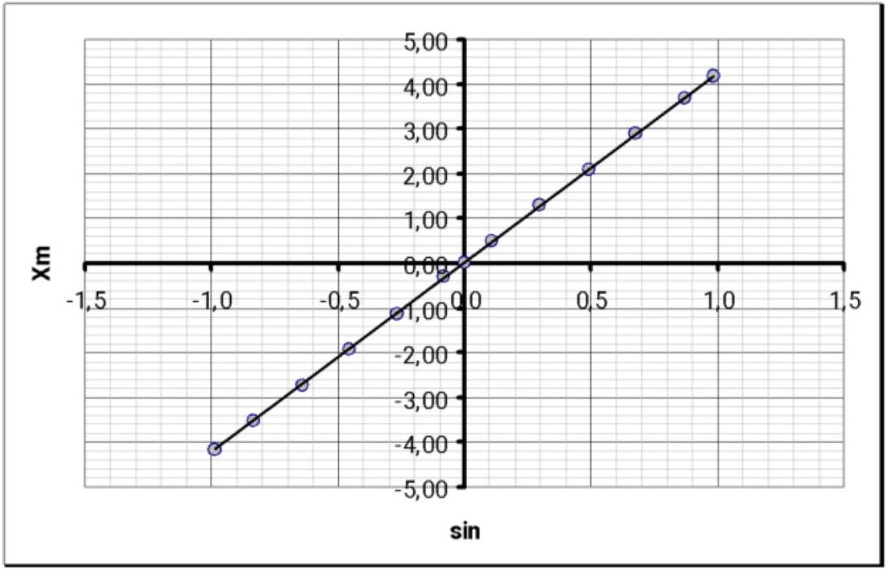

Бұл графиктің сызықтылығы айна қозғалысы заңын сипаттау үшін (13) формуланың қолданылуын растайды. Ең кіші квадраттар әдісімен есептелетін бұл тәуелділіктің параметрлері келесі сандық мәндерге ие:

$$
\begin{align*}
& A = ( 4 \mathrm { EM } \pm 0.01 ) \\
& h = ( 4 \times 4 = 0.06 ) \tag{14}
\end{align*}
$$

Көлбеу коэффициенті $A$ - айна тербеліс амплитудасы. Ығысу параметрінің сандық мәні оның қателігінен аз болған кезде, $b = 0$ сондықтан талданатын тәуелділік тура пропорционалды деп болжауға болады.

## 3. Толқын ұзындығы белгісіз монохроматикалық сәулелену

3.1 Максимумдар кестесінен біз симметриялы нүктелерді таңдаймыз (тұжырымдалған критерийлерге сәйкес). 2-кесте.

| \# | $t _ { \text {v } }$ |
| :--- | :--- |
| 1 | 138 |
| 5 | 240 |
| 10 | 320 |
| 15 | 384 |
| 20 | 442 |
| 24 | 486 |
| 28 | 529 |
| 33 | 586 |
| 38 | 653 |
| 43 | 730 |
| 47 | 830 |

3.2 Әрбір
(13) формуланы координатының

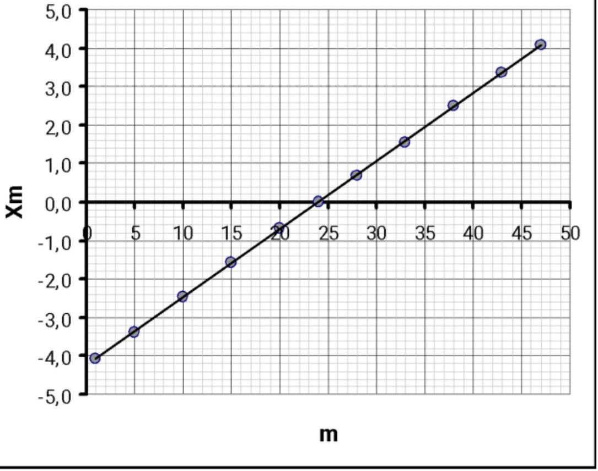
экстремум үшін қолданып, айна мәнін есептейміз ${ } ^ { x _ { n } }$, содан кейін айна координатының ${ } ^ { n }$ экстремум санына тәуелділігін сызамыз. Бұл тәуелділік мына функция арқылы сипатталады

$$
\begin{equation*}
x _ { n 1 } = m _ { 4 } ^ { \lambda } \tag{15}
\end{equation*}
$$

Алынған график бұл тәуелділікті растайды (бұл жағдайда сандар осі бойынша жылжу рөл атқармайды және ол экстремумдардың басқа нөмірленуіне байланысты). Ең кіші квадраттармен есептелген графиктің көлбеу коэффициенті мынаған тең

$$
a - ( 0 , \mathrm { dM } 71 \pm 0,0008 )
$$

Функцияның (15) түрінен сәулелену толқын ұзындығының мынаған тең болатыны шығады

$$
\begin{equation*}
\lambda = \operatorname { Alk } \text { ( } 0,709 \pm 0,003 \text { ) } \tag{16}
\end{equation*}
$$

## 4. Екі монохроматикалык толқындар

4.1 Әртүрлі ұзындықтағы толқындар кедергі жасамайды, бұл жағдайда жазылған сигнал осы толқындардың қарқындылығының қосындысы болып табылады. (3) формуланы пайдаланып, толық қарқындылықтың айна координатасына тәуелділігі үшін айқын өрнек жазамыз және оны түрлендіреміз (косинустардың қосындысының тригонометриялық формуласын пайдалана отырып):

$$
\begin{align*}
& U ( x ) = 2 I _ { 1 } \cos \frac { 4 \pi } { \lambda _ { 1 } } x + 2 I _ { 2 } \cos \frac { 4 \pi } { \lambda _ { 2 } } x = \\
& = 2 I _ { 0 } \left( \cos \frac { 4 \pi } { \lambda _ { 1 } } x + \cos \frac { 4 \pi } { \lambda _ { 2 } } x \right) + 2 \left( I _ { 2 } - I _ { 1 } \right) \cos \frac { 4 \pi } { \lambda _ { 2 } } x = \\
& = 4 I _ { 1 } \cos \left( 2 \pi \left( \frac { 1 } { \lambda _ { 1 } } - \frac { 1 } { \lambda _ { 2 } } \right) x \right) \cos \left( 2 \pi \left( \frac { 1 } { \lambda _ { 1 } } + \frac { 1 } { \lambda _ { 2 } } \right) x \right) + 2 \left( I _ { 2 } - I _ { 1 } \right) \cos \frac { 4 \pi } { \lambda _ { 2 } } x \tag{17}
\end{align*}
$$

Алынған функция тәжірибелік жолмен алынған модуляцияланған сигналды сипаттайды. Бұл функцияның экстремумдары үшін айқын өрнектерді алу үшін формула тым күрделі. Сондықтан қажетті сипаттамаларды алудың бірден-бір жолы - тез өзгеретін сигналды жуықтап сыза отырып талдау. Тұрақты мүшеге дейін бұл жуықтау мына функция арқылы сипатталады

$$
\begin{equation*}
\tilde { U } ( x ) = U _ { 1 } \cos \left( 2 \pi \left( \frac { 1 } { \lambda _ { 1 } } - \frac { 1 } { \lambda _ { 2 } } \right) x \right) - U _ { 1 } \cos \left( \frac { 2 \pi } { A } x \right) , \tag{18}
\end{equation*}
$$

мұндағы

$$
\begin{equation*}
\left| \frac { 1 } { \lambda _ { 0 } } - \frac { 1 } { \lambda _ { 2 } } \right| \frac { 1 } { \Lambda } \tag{19}
\end{equation*}
$$

Ал $\mathbf { \Lambda }$ - сигнал модуляциясының кеңістіктік периоды (төмендегі суретті қараңыз).

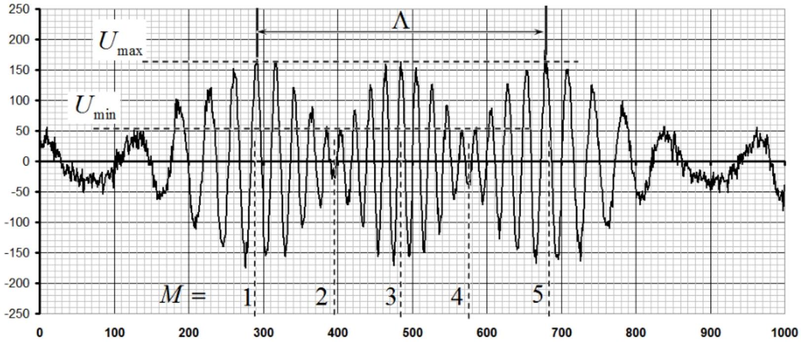

Жуық функция (18) мына шарт орындалғанда экстремальді

$$
\begin{equation*}
\frac { 2 \pi } { \Lambda } x _ { M } = \frac { \pi } { 2 } M \tag{20}
\end{equation*}
$$

мұндағы $M = 0 , \perp \mathrm { I } , \perp 2 \ldots$-экстремума номері.
Жоғарыдағы сигналда осындай 5 экстремалды ажыратуға болады, олар да суретте көрсетілген. (20) формуладан айнаның сәйкес координатасы формула бойынша анықталатыны шығады

$$
\begin{equation*}
x _ { M } = \frac { \Delta } { 4 } \left( M - M _ { 0 } \right) \tag{21}
\end{equation*}
$$

Мұндағы ${ } ^ { M _ { G } }$ - «бастапқы» сан, әрі қарай талдау үшін елеусіз, ол сандарды санаудың басталуын анықтайды.

Экстремумдар кестесін пайдалана отырып, экстремумдардың байқалатын уақыттарын анықтаймыз, содан кейін (14) формуланы пайдаланып, айна координаттарының мәндерін есептеп, тәуелділікті сызамыз. Бұл мәндер 3 -кестеде және графикте көрсетілген.
3-кесте.

| M | $f _ { \mathrm { H } ^ { \prime \prime } }$ | $x _ { y , \text { MKM } }$ |
| :--- | :--- | :--- |
| 1 | 292 | -2,823 |
| 2 | 397 | -1,392 |
| 3 | 486 | 0,000 |
| 4 | 577 | 1,422 |
| 5 | 679 | 2,811 |

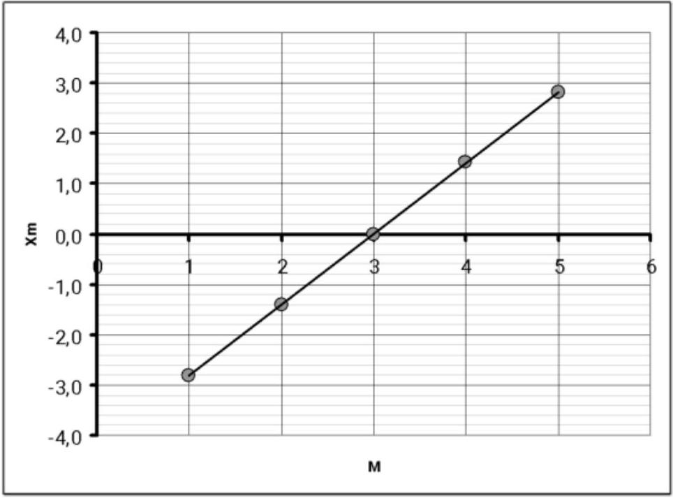

Бұл графиктің ең кіші квадраттармен есептелген көлбеу коэффициенті тең

$$
a = ( 1,1 \times 4 , \pm 0,01 )
$$

және (21) формуладан келесідей, кеңістіктік периодын аламыз

$$
\begin{equation*}
A = ( 5,64 \pm 0,04 ) \tag{22}
\end{equation*}
$$

Соңында (19) формуладан ${ } ^ { \lambda _ { 7 } }$ толқын ұзындығының екі мүмкін мәнін есептейміз:

$$
\begin{align*}
& \lambda _ { 21 } = \left( \frac { 1 } { \lambda _ { 1 } } - \frac { 1 } { A } \right) ^ { 1 } - 0 \mathrm { Na } 22 \\
& \Delta \lambda _ { 21 } = \left( \frac { 1 } { \lambda _ { 1 } } - \frac { 1 } { \mathrm {~A} } \right) ^ { 2 } \frac { \Delta \mathrm {~A} } { \mathrm {~A} ^ { 2 } } = \left( \frac { \lambda _ { 1 } } { \mathrm {~A} } \right) ^ { 2 } \mathrm { AA } = 0,0001 \tag{23}
\end{align*}
$$

$$
\begin{align*}
& \lambda _ { 22 } = \left( \frac { 1 } { \lambda _ { 1 } } - \frac { 1 } { \Lambda } \right) ^ { - 1 } = 0,0005 \\
& \Delta \lambda _ { 22 } = \left( \frac { \lambda _ { 2 } } { \Lambda } \right) ^ { 2 } \Delta \Lambda = 0,0001 \tag{24}
\end{align*}
$$

4.2 Екінші толқынның қарқындылығын бағалау үшін модуляциялау функциясының максималды және минималды мәндерін пайдалануға болады. (17) формуладан былай шығады

$$
\begin{align*}
& U _ { \max } \approx 2 \left( I _ { 0 } + I _ { 1 } \right) \\
& U _ { \max } \approx 2 I _ { 0 } - I _ { 1 } . \tag{25}
\end{align*}
$$

$U _ { \text {rnix } } U _ { \text {rn" } }$ мәндерін жуықтап графиктен (болмаса кестеден) анықтауға болады $U _ { \text {mix } } ^ { \prime } \approx 170$, $U _ { \text {ніл } } \approx 40$. Олардың қатынасы $\gamma = \begin{aligned} & U _ { \text {пr } } \\ & U _ { \text {nin } } \end{aligned} \approx 4,25$. Екінші жағынан (25) өрнектен мынау шығады

$$
\begin{equation*}
\gamma = \frac { I _ { 1 } + I _ { 2 } } { \left| I _ { 1 } \quad I _ { 2 } \right| } \Rightarrow \frac { I _ { 1 } } { I _ { 0 } } = \frac { 1 - \gamma } { 1 + \gamma } \approx 0.62 \tag{26}
\end{equation*}
$$

Яғни $I _ { 71 } I _ { 1 } \approx 0,62$.

$$
I _ { 22 } \approx 1,62
$$

Мынадай нұсқа да мүмкін: $I$.

| № | Содержание | За часть | балл ы |
| :--- | :--- | :--- | :--- |
| 1. Теориялык бөлім (коэффициенттер дұрыс болмаса өрнекткер багаланбайды) |  | 1,0 |  |
| 1.1 |  |  | 0,2 |
| 1.2 | Өрнек (1) $I = 2 I _ { 0 } ( 1 - \cos \Delta \varphi ) = 4 I _ { 0 } \cos ^ { 2 } \begin{gathered} \Delta \varphi \\ 2 \end{gathered} \Delta \varphi = \frac { 4 \pi } { \lambda } x$   Фазалық ығысу өрнегі (2) $\Delta \varphi = \frac { 4 \pi } { \lambda } x$ |  | 0,2 |
|  |  |  | 0,2 |

| 1.3 | Өрнек (4) ${ } ^ { x _ { p } } = m ^ { i } { } _ { 2 } ^ { i }$ |  | 0,1 |
| :--- | :--- | :--- | :--- |
|  | Өрнек (5) $x _ { i n } = \left( m + \frac { 1 } { 2 } \right) \frac { j } { 2 }$ |  | 0,1 |
| 1.4 | Өрнек (6) ${ } ^ { x _ { p } } = m ^ { i } { } _ { 4 } ^ { i }$ |  | 0,2 |
| 2. Белгілі толқын ұзындығының монохроматикалық сәулеленуі - аспапты калибрлеу |  | 8,0 |  |
| 2.1 | Бөлік кұнын анықтау: - максимумдар 0 және 54 - айнаның шеткі күйі - 0,4; - қозаалу уақыты - жарты период - 0,2; - периодты салыстр бірлікте өлшеу $T = 1668 - 0,1$; - периодты секундпен өлшеу $T = 50 м c ^ { \prime } - 0,1$; - бөлік құнын есептеу $\Delta t$ 0,030м - 0,2  |  | 1,0 |
| 2.2 | Қозғалыс заңын анықтау |  |  |
|  | Табылған тербеліс периодын пайдалану; |  | 0,5 |
|  | Орталық нүктені анықтау: $\begin{aligned} & m _ { i j } = \begin{array} { c }  0 + 54 \\ 2 \end{array} = 27 \\ & \text { - максимум номері } { } ^ { 0 + 3 ; } \\ & \text { - орталық нүктені өту уақьтты } t _ { \mathrm { n } } = 486 - 0,2 ; \end{aligned}$ |  | 0,5 |
|  | Нүктелерді таңдау: - 10 және одан көп нүкте пайдаланылzaн 0,3 (5 и более -0,1); - шеткілері ескерілмеген - 0,2; - максималь диапазон пайдаланылган - 0,3; - нүктелер шамамен симметриялы - 0,2;  |  | 1,0 |
|  | Координатты анықтау әдісі:   $\lambda$ - көрші экстремумдардың ара қุашықтыгы - 4 - 0,5; - максимумдарды орталықтан қุайта белгілеу - 0,2; - координатты есептейтін врнек $\begin{aligned} & x _ { p n } = m ^ { i _ { p } } \\ & 4 - 0,3 \text {; } \end{aligned}$  |  | 1,0 |
|  | Координатты есептеу (барлық таңдалzaн нүктелер үшін дұрыс есептеу жүргізілді, рұқсат етілген есептеу қุатесі 10\%) |  | 1,0 |
|  | Тәуелділікті линеаризациялау: $- \left. x _ { \text {тің } } \sin \left( \frac { 2 \pi } { T } \left( t - t _ { 0 } \right) \right) \right\| _ { \text {-тан тәуелділігі } - 0,4 ; }$ - синустар есептелген 0,6;  |  | 1,0 |
|  | График тұрғызу: (есептеулер багаланса, багаланады); - осьтерге белгіленген және цифрланган - 0,1; - барлық нүктелер кестеге сәйкес сызылады 0,2; - сызықтық тәуелділік алынады -0.2; - тузу сызықты тегістеу - 0,2;  |  | 0,7 |
|  | айна тербелістерінің амплитудасын есептеу: |  | 0,8 |

|  | Ең кіші квадраттар әдісі пайдаланылеан - 0,3 (графикалық түрде немесе барлық нүктелер бойынша орташалау - 0,2; 2 нүктелермен 0,1); (есептеу экстремумдар санына сәйкес жүргізілді - 0,1); диапазондавы сандық мәнді алды 4,2 - 4,3 мкм - 0,5 ( диапазонда4,0-4,5 мкм - 0,3; диапазоннан тыс - 0); |  |  |
| :--- | :--- | :--- | :--- |
|  | амплитуда қатесін есептеу: - МНК бойынша-0,3 (басқุа әдіспен -0,2); - сандық мәні шамамен $10 ^ { - 2 } м к м$ - 0,3;  |  | 0,5 |
|  |  | 5,0 |  |
| 3.1 | Нүктелерді таңдау: - 10 және одан көп нүкте пайдаланылган 0,3 (5 және көп -0,1); - шеткілері ескерілмеген - 0,2; - максималь диапазон пайдаланылган - 0,3; - нүктелер шамамен симметриялы - 0,2;  |  | 1,0 |
|  | Экстремумдар координатын анықтау: - координат ушін дұрыс формула - 0,5; - экстремумдар координатының қателігі 10\% тан үлкен емес- 1,0 ; |  | 1,5 |
|  | График тұрғызу: (есептеулер багаланса, багаланады); - осьтерге белгіленген және цифрланган - 0,1; - барлық нуктелер кестеге сәйкес сызылады 0,2; - сызықтық тәуелділік алынады -0.2; - тузу сызықты тегістеу-0,2;  |  | 0,7 |
| 3.2 | Толқын ұзындығын есептеу: - МНК пайдаланылган - 0,5 (барлық нүктелер бойынша - 0,3 ; 1-2 нүкелер - 0,2); - сандық мән мына диапозонда алынган 0,70-0,72 мкм - 0,8 (мына диапозонда 0,68-0,74 мкм - 0,4, диапазоннан тыс-0); |  | 1,3 |
|  | Толқын ұзындығының қателігін есептеу: - МНК пайдаланылеан - 0,2 (басқа әдіс - 0,1); - алынган мән шамамен $10 ^ { - 2 } м к м$ - 0,3;  |  | 0,5 |
| 4. Екі монохромат толқындар |  | 6,0 |  |
| 4.1 | Қортынды қарқындылықтың өрнегі (17) |  | 0,5 |
|  | Жуықтауды талдау (экстремумдардың орнын анықтау багаланбайды); |  | 0,5 |
|  | Жуықтаудың экстремум нүктелерін таңдау: - әрбір экстремум үшін 0,2 ; |  | 1,0 |
|  | Толқын ұзындығының өрнегі $\left\| \frac { 1 } { \lambda _ { i } } - \frac { 1 } { \lambda _ { 1 } } \right\| = \frac { 1 } { \wedge }$ |  | 0,3 |
|  | Толқын ұзындығы үшін екі шешім: МНК бойынша есептеу (барлык нүктелер ескерілген) 0,4 (екі нүкте - 0,2); Сандық мәні мына диапозонда 0,70-0,74 мкм; 0,56-0,59 мкм - 2х0,6; Мына диапозонда (0, 67-0,77 мкм; 0,53-0,62 мкм - 2х0,3;) Диапозоннан mblc - 0; |  | 1,6 |

|  | Қателерді есептеу:   Жанама өлшемдердің кателіктері $\Delta \hat { \lambda } \left( \frac { \lambda _ { 1 } } { \Lambda } \right) ^ { 2 } \Delta \Lambda$-0,3; Сандық мән - 2х0,1; |  | 0,5 |
| :--- | :--- | :--- | :--- |
| 4.2 | Қарқындылықтың қатынасын есептейтін өрнек: $\frac { I _ { 2 } } { I _ { 1 } } = \frac { 1 - \gamma } { 1 + \gamma }$ |  | 0,3 |
|  | Қарқындылық қатынасы үшін екі шешім (екі шешімге нұсқау бар); |  | 0,3 |
|  | Қарқындылықтың қатынасының сандық мәні:   Мына диапозонда 0,5-0,7; 1,5-1,7-2x0,5; (мына диапозонда 0,4-0,8; 1,4-1,8-2x0,2) Диапозоннан тыс - 0 |  | 1,0 |
|  | БАРЛЫҒЫ | 20,0 |  |
