## SOLUTIONS TO THE PROBLEMS OF THE THEORETICAL COMPETITION   Attention. Points in grading are not divided!   Problem 1 (10.0 points)   Problem 1.1 (3.0 points)

It follows from the first law of thermodynamics that

$$
\begin{equation*}
\delta Q = d U + d A , \tag{1}
\end{equation*}
$$

where $\delta Q$ is the amount of heat supplied, $d U$ is the change in internal energy, $d A$ is the work done by the gas.

For one mole of an ideal gas, these quantities can be written in terms of a change in volume $d V$ and temperature $d T$ at a known pressure $p$ in the following form

$$
\begin{align*}
& \delta A = p d V ,  \tag{2}\\
& d U = C _ { V } d T . \tag{3}
\end{align*}
$$

By definition of heat capacity, we have

$$
\begin{equation*}
C = \frac { \delta Q } { d T } , \tag{4}
\end{equation*}
$$

then from relations (1)-(4) one obtains

$$
\begin{equation*}
p \frac { d V } { d T } = C - C _ { V } , \tag{5}
\end{equation*}
$$

at the molar heat capacity of a monatomic gas at a constant volume equal to

$$
\begin{equation*}
C _ { V } = \frac { 3 } { 2 } R . \tag{6}
\end{equation*}
$$

From the graph given in the problem statement, it can be seen that at a temperature

$$
\begin{equation*}
T _ { 1 } ^ { * } = 350 \mathrm {~K} \tag{7}
\end{equation*}
$$

the heat capacity is $C = C _ { V }$ and, accordingly, $\frac { d V } { d T } = 0$. When passing through this temperature, the derivative sign changes from plus to minus. This means that at this temperature the gas volume reaches a local maximum: $T _ { \text {max } } = T _ { 1 } ^ { * } = 350 \mathrm {~K}$.

At a temperature

$$
\begin{equation*}
T _ { 2 } ^ { * } = 500 \mathrm {~K} \tag{8}
\end{equation*}
$$

the derivative $\frac { d V } { d T }$ also equals zero, and when passing through this point, the sign of the derivative changes from minus to plus. This means that $T _ { 2 } ^ { * }$ is the point of the local minimum of the volume: $T _ { \text {min } } = T _ { 2 } ^ { * } = 500 \mathrm {~K}$.

In the section from $T _ { 1 } ^ { * } = 350 \mathrm {~K}$ to $T _ { 2 } ^ { * } = 500 \mathrm {~K}$, the gas receives heat $Q$, numerically equal to the area under the dependence $C ( T )$, i.e. the area of the figure $\boldsymbol { A } \boldsymbol { B } \boldsymbol { C } \boldsymbol { D } \boldsymbol { E }$. The change in internal energy $\Delta U = C _ { V } \left( T _ { 2 } ^ { * } - T _ { 1 } ^ { * } \right)$ is numerically
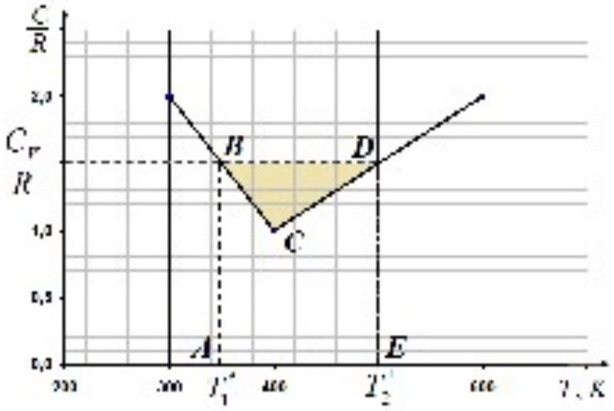 equal to the area of the rectangle $\boldsymbol { A } \boldsymbol { B } \boldsymbol { D } \boldsymbol { E }$. According to the first law of thermodynamics, therefore, the work on the gas from $T _ { 1 } ^ { * }$ to $T _ { 2 } ^ { * }$ is numerically equal to the difference in the areas of the rectangle $\boldsymbol { A } \boldsymbol { B } \boldsymbol { D } \boldsymbol { E }$ and the figure $\boldsymbol { A } \boldsymbol { B } \boldsymbol { C } \boldsymbol { D } \boldsymbol { E }$, i.e. area of the shaded figure $\boldsymbol { B } \boldsymbol { D } \boldsymbol { C }$ :

$$
\begin{equation*}
A = \frac { 1 } { 4 } R \left( T _ { \max } - T _ { \min } \right) = 312 \mathrm {~J} . \tag{9}
\end{equation*}
$$

Note: Exact dependence $V ( T )$ :

$$
\begin{aligned}
& \frac { V } { V _ { 1 } } = \left( \frac { T } { T _ { 1 } } \right) ^ { 7 / 2 } \exp \left( - \frac { T - T _ { 1 } } { \Delta T _ { 1 } } \right) , \text { at } T _ { 1 } = 300 \mathrm {~K} \leq T \leq T _ { 0 } = 400 \mathrm {~K} \text { and } \Delta T _ { 1 } = 100 \mathrm {~K} ; \\
& \frac { V } { V _ { 0 } } = \left( \frac { T } { T _ { 0 } } \right) ^ { - 5 / 2 } \exp \left( \frac { T - T _ { 0 } } { \Delta T _ { 2 } } \right) , \text { at } T _ { 0 } = 400 \mathrm {~K} \leq T \leq T _ { 2 } = 600 \mathrm {~K} \text { and } \Delta T _ { 2 } = 200 \mathrm {~K} .
\end{aligned}
$$

Dependences $V ( T )$ and $P ( V )$ in the process of gas heating are shown in the figures below.
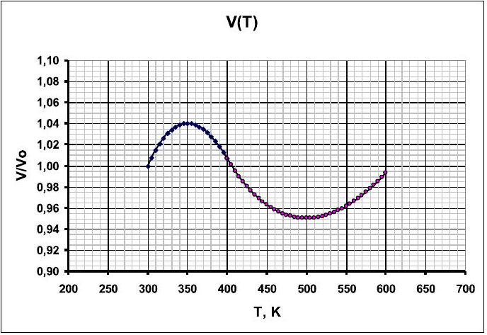
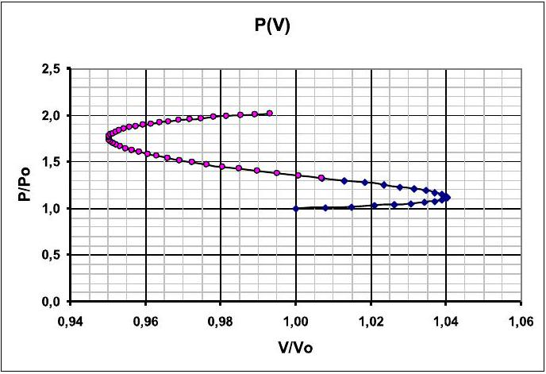

| Content | Points |
| :--- | :--- |
| Formula (1): $\delta Q = d U + d A$ | 0.2 |
| Formula (2): $\delta A = p d V$ | 0.2 |
| Formula (3): $d U = C _ { V } d T$ | 0.2 |
| Formula (4): $C = \frac { \delta Q } { d T }$ | 0.2 |
| Formula (5): $p \frac { d V } { d T } = C - C _ { V }$ | 0.4 |
| Formula (6): $C _ { V } = \frac { 3 } { 2 } R$ | 0.2 |
| Formula (7): $T _ { 1 } ^ { * } = 350 \mathrm {~K}$ | 0.4 |
| Formula (8): $T _ { 2 } ^ { * } = 500 \mathrm {~K}$ | 0.4 |
| Formula (9): $A = \frac { 1 } { 4 } R \left( T _ { \text {max } } - T _ { \text {min } } \right)$ | 0.4 |
| Numerical value in formula (9): $A = 312 \mathrm {~J}$ | 0.4 |
| Total | 3.0 |

## Problem 1.2 (3.0 points)

The equivalent circuit of the bridge is shown in the figure below, which takes into account that the non-ideal inductance circuit is equivalent to an ideal coil $L$ and resistor $r _ { L }$ connected in series, whereas the equivalent circuit of a leaky capacitor is a resistor $r _ { C }$ connected in parallel to an ideal capacitor $C$.

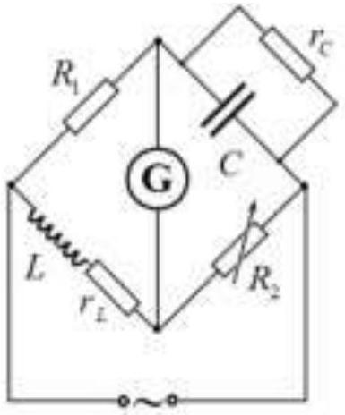

Solution 1. The bridge balance condition in complex numbers is written as

$$
\begin{equation*}
Z _ { L } Z _ { C } = R _ { 1 } R _ { 2 } , \tag{1}
\end{equation*}
$$

where the impedances are respectively

$$
\begin{equation*}
Z _ { L } = r _ { L } + i \omega L \tag{2}
\end{equation*}
$$

and

$$
\begin{equation*}
Z _ { C } = \frac { r _ { C } } { 1 + i \omega C r _ { C } } . \tag{3}
\end{equation*}
$$

After some transformation we get from expressions (1)-(3):

$$
\begin{equation*}
i \omega \left( L - R _ { 1 } R _ { 2 } C \right) = r _ { L } - \frac { R _ { 1 } R _ { 2 } } { r _ { C } } \tag{4}
\end{equation*}
$$

While varying the frequency, this equality is not violated if both sides of the equation are equal to zero, therefore

$$
\begin{align*}
& C = \frac { L } { R _ { 1 } R _ { 2 } } = 0.5 \mu \mathrm {~F} ,  \tag{5}\\
& r _ { C } = \frac { R _ { 1 } R _ { 2 } } { r _ { L } } = 2 \mathrm { M } \Omega . \tag{6}
\end{align*}
$$

Solution 2. Let the voltage across the capacitor be

$$
\begin{equation*}
U _ { C } = U _ { 0 } \cos \omega t , \tag{1}
\end{equation*}
$$

then current through it is found as

$$
\begin{equation*}
I _ { C } = - C \omega \sin \omega t , \tag{2}
\end{equation*}
$$

and the current through its leakage resistance is

$$
\begin{equation*}
I _ { r _ { C } } = \frac { U _ { 0 } \cos \omega t } { r _ { C } } . \tag{3}
\end{equation*}
$$

The total current through the upper arm containing the capacitor is

$$
\begin{equation*}
I _ { 1 } = I _ { C } + I _ { r _ { C } } , \tag{4}
\end{equation*}
$$

and since the bridge is balanced, the same current flows through the resistance $R _ { 1 }$, therefore

$$
\begin{equation*}
U _ { R _ { 1 } } = I _ { 1 } R _ { 1 } . \tag{5}
\end{equation*}
$$

On the other hand, this voltage is equal to the voltage drop across the arm with the inductance

$$
\begin{equation*}
U _ { L } = U _ { R _ { 1 } } , \tag{6}
\end{equation*}
$$

for which the voltage drop is given by

$$
\begin{equation*}
U _ { L } = L \frac { d I _ { 2 } } { d t } + I _ { 2 } r _ { L } , \tag{7}
\end{equation*}
$$

in which the current is determined by the balance equation

$$
\begin{equation*}
I _ { 2 } = I _ { R _ { 2 } } = \frac { U _ { C } } { R _ { 2 } } . \tag{8}
\end{equation*}
$$

since

$$
\begin{equation*}
U _ { R _ { 2 } } = U _ { C } . \tag{9}
\end{equation*}
$$

Collecting equations (1)-(9) together, we obtain

$$
\begin{equation*}
\left( - \frac { \omega L } { R _ { 2 } } + C \omega R _ { 1 } \right) U _ { 0 } \sin \omega t = \left( \frac { R _ { 1 } } { r _ { C } } - \frac { r _ { L } } { R _ { 2 } } \right) U _ { 0 } \cos \omega t . \tag{10}
\end{equation*}
$$

It can be seen from this equality that the frequency-independent balance condition is satisfied if both sides of the equation are equal to zero, that is, one obtains the final answer

$$
\begin{align*}
& C = \frac { L } { R _ { 1 } R _ { 2 } } = 0.5 \mu \mathrm {~F} ,  \tag{11}\\
& r _ { C } = \frac { R _ { 1 } R _ { 2 } } { r _ { L } } = 2 \mathrm { M } \Omega . \tag{12}
\end{align*}
$$

| Content | Points |
| :--- | :--- |
| Solution 1 |  |
| Equivalent circuit: All elements are correctly connected | 0.5 |
| Formula (1): $Z _ { L } Z _ { C } = R _ { 1 } R _ { 2 }$ | 0.3 |
| Formula (2): $Z _ { L } = r _ { L } + i \omega L$ | 0.3 |
| Formula (3): $Z _ { C } = \frac { r _ { C } } { 1 + i \omega C r _ { C } }$ | 0.3 |
| Formula (4): $i \omega \left( L - R _ { 1 } R _ { 2 } C \right) = r _ { L } - \frac { R _ { 1 } R _ { 2 } } { r _ { C } }$ | 0.4 |
| Formula (5): $C = \frac { L } { R _ { 1 } R _ { 2 } }$ | 0.4 |
| Numerical value in formula (5): $C = 0.5 \mu \mathrm {~F}$ | 0.2 |
| Formula (6): $r _ { C } = \frac { R _ { 1 } R _ { 2 } } { r _ { L } }$ | 0.4 |
| Numerical value in formula (6): $r _ { C } = 2 \mathrm { M } \Omega$ | 0.2 |
| Total | 3.0 |
| Solution 2 |  |
| Equivalent circuit: All elements are correctly connected | 0.5 |
| Formula (1): $U _ { C } = U _ { 0 } \cos \omega t$ | 0.1 |
| Formula (2): $I _ { C } = - C \omega \sin \omega t$ | 0.1 |
| Formula (3): $I _ { r _ { c } } = \frac { U _ { 0 } \cos \omega t } { r _ { C } }$ | 0.1 |
| Formula (4): $I _ { 1 } = I _ { C } + I _ { r _ { C } }$ | 0.1 |
| Formula (5): $U _ { R _ { 1 } } = I _ { 1 } R _ { 1 }$ | 0.1 |
| Formula (6): $U _ { L } = U _ { R _ { 1 } }$ | 0.1 |
| Formula (7): $U _ { L } = \frac { d I _ { 2 } } { d t } + I _ { 2 } r _ { L }$ | 0.1 |
| Formula (8): $I _ { 2 } = I _ { R _ { 2 } } = \frac { U _ { C } } { R _ { 2 } }$ | 0.1 |
| Formula (9): $U _ { R _ { 2 } } = U _ { C }$ | 0.1 |
| Formula (10): $\left( - \frac { \omega L } { R _ { 2 } } + C \omega R _ { 1 } \right) U _ { 0 } \sin \omega t = \left( \frac { R _ { 1 } } { r _ { C } } - \frac { r _ { L } } { R _ { 2 } } \right) U _ { 0 } \cos \omega t$ | 0.4 |

| Formula (11): $C = \frac { L } { R _ { 1 } R _ { 2 } }$ | 0.4 |
| :--- | :--- |
| Numerical value in formula (11): $C = 0.5 \mu \mathrm {~F}$ | 0.2 |
| Formula (12): $r _ { C } = \frac { R _ { 1 } R _ { 2 } } { r _ { L } }$ | 0.4 |
| Numerical value in formula (12): $r _ { C } = 2 \mathrm { M } \Omega$ | 0.2 |
| Total | 3.0 |

## Problem 1.3 (4.0 points)

Let a planet of mass $m$ move around the Sun in a circular orbit of radius $R$ with a speed $v$, then the equation of motion of the planet in the projection onto the radial direction is written as

$$
\begin{equation*}
\frac { m v ^ { 2 } } { R } = G \frac { m M _ { S } } { R ^ { 2 } } , \tag{1}
\end{equation*}
$$

which results in

$$
\begin{equation*}
v = \sqrt { G \frac { M _ { S } } { R } } , \tag{2}
\end{equation*}
$$

with $G$ being the gravitational constant.
Writing formula (2) for Jupiter with the index $J$ and Earth with the index $E$, we get after dividing

$$
\begin{equation*}
\frac { v _ { J } } { v _ { E } } = \sqrt { \frac { R _ { E } } { R _ { J } } } , \tag{3}
\end{equation*}
$$

and, on the other hand, we have according to Kepler's third law for the ratio of rotation periods

$$
\begin{equation*}
\frac { T _ { E } ^ { 2 } } { T _ { J } ^ { 2 } } = \frac { R _ { E } ^ { 3 } } { R _ { J } ^ { 3 } } . \tag{4}
\end{equation*}
$$

The motion of Jupiter cannot be detected with a spectrometer, but it can be done for the Sun, since it also moves around the center of mass of the Sun-Jupiter system. The speed of the Sun is easy to find from the expression

$$
\begin{equation*}
v _ { S } = v _ { J } \frac { M _ { J } } { M _ { S } } . \tag{5}
\end{equation*}
$$

Since the Sun moves around the common center of mass of the system, and the observer is located in the same plane, according to the Doppler effect formula, the following condition is satisfied for detection

$$
\begin{equation*}
\frac { \Delta \lambda } { \lambda } = \frac { 2 v _ { S } } { c } . \tag{6}
\end{equation*}
$$

Putting together equations (3)-(6), we get the final answer

$$
\begin{equation*}
R _ { \min } = \frac { M _ { S } } { M _ { J } } \left( \frac { T _ { J } } { T _ { E } } \right) ^ { 1 / 3 } \frac { c } { 2 v _ { E } } = 1.20 \cdot 10 ^ { 7 } . \tag{7}
\end{equation*}
$$

Such resolution is achievable for many modern spectrometers manufactured in different countries of the world.

| Content | Points |
| :--- | :--- |
| Formula (1): $\frac { m v ^ { 2 } } { R } = G \frac { m M _ { S } } { R ^ { 2 } }$ | 0.2 |
| Formula (2): $v = \sqrt { G \frac { M _ { S } } { R } }$ | 0.2 |

| Formula (3): $\frac { v _ { J } } { v _ { E } } = \sqrt { \frac { R _ { E } } { R _ { J } } }$ | 0.2 |
| :--- | :--- |
| Formula (4): $\frac { T _ { E } ^ { 2 } } { T _ { J } ^ { 2 } } = \frac { R _ { E } ^ { 3 } } { R _ { J } ^ { 3 } }$ | 0.4 |
| Formula (5): $v _ { S } = v _ { J } \frac { M _ { J } } { M _ { S } }$ | 1.0 |
| Formula (6): $\frac { \Delta \lambda } { \lambda } = \frac { 2 v _ { s } } { c }$ | 1.0 |
| Formula (7): $R _ { \text {min } } = \frac { M _ { S } } { M _ { J } } \left( \frac { T _ { J } } { T _ { E } } \right) ^ { 1 / 3 } \frac { c } { 2 v _ { E } }$ | 0.5 |
| Numerical value in formula (7): $R _ { \text {min } } = 1.20 \cdot 10 ^ { 7 }$ | 0.5 |
| Total | 4.0 |

## Problem 2. Fermi acceleration (10.0 points)   Why are there more oncoming cars than overtaking cars?

2.1 Within the time period $t$, a car in lane $\boldsymbol { B }$ overtakes only those cars that are located at the distance no longer than

$$
\begin{equation*}
l = ( v - ( v - \Delta v ) ) t = \Delta v t . \tag{1}
\end{equation*}
$$

Therefore, the number of those cars is

$$
\begin{equation*}
N _ { 1 } = n l = n \Delta v t \approx 0.83 . \tag{2}
\end{equation*}
$$

The time between overtakes is found as

$$
\begin{equation*}
\tau _ { 1 } = \frac { 1 } { n \Delta v } = 0.02 \mathrm {~h} = 72 \mathrm {~s} . \tag{3}
\end{equation*}
$$

2.2 Similar reasoning leads to the conclusion that the number of overtakes and the time between overtakes remain the same, i.e.

$$
\begin{align*}
& N _ { 2 } = n l = n \Delta v t \approx 0.83 ,  \tag{4}\\
& \tau _ { 2 } = \frac { 1 } { n \Delta v } = 0.02 \mathrm {~h} = 72 \mathrm {~s} . \tag{5}
\end{align*}
$$

2.3 When driving towards oncoming cars, the number of cars and the time between two consecutive meetings are calculated by the formulas

$$
\begin{align*}
& N _ { 3,4 } = n ( v + ( v \pm \Delta v ) ) t = n ( 2 v \pm \Delta v ) t \\
& \tau _ { 3,4 } = \frac { 1 } { n ( 2 v \pm \Delta v ) } \tag{6}
\end{align*}
$$

and numerical calculations give the following values

$$
\begin{align*}
& N _ { 3 } = 14.2 ; \quad \tau _ { 3 } = 4.2 \mathrm {~s}  \tag{7}\\
& N _ { 3 } = 15.8 ; \quad \tau _ { 3 } = 3.8 \mathrm {~s} .
\end{align*}
$$

## Elastic collision

2.4 Let us write down the momentum conservation law as

$$
\begin{equation*}
m _ { 1 } v _ { 1 } + m _ { 2 } v _ { 2 } = m _ { 1 } u _ { 1 } + m _ { 2 } u _ { 2 } \tag{8}
\end{equation*}
$$

together with the conservation of kinetic energy

$$
\begin{equation*}
\frac { m _ { 1 } v _ { 1 } ^ { 2 } } { 2 } + \frac { m _ { 2 } v _ { 2 } ^ { 2 } } { 2 } = \frac { m _ { 1 } u _ { 1 } ^ { 2 } } { 2 } + \frac { m _ { 2 } u _ { 2 } ^ { 2 } } { 2 } . \tag{9}
\end{equation*}
$$

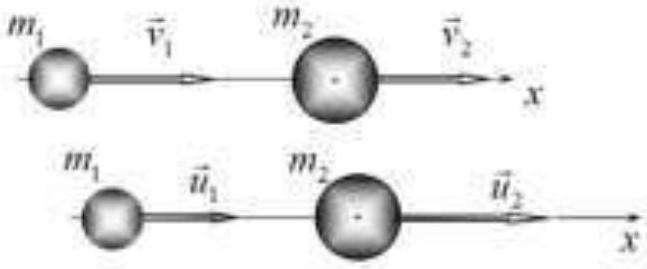

Rewriiting these equations in the following form

$$
\begin{align*}
& m _ { 1 } v _ { 1 } - m _ { 1 } u _ { 1 } = m _ { 2 } u _ { 2 } - m _ { 2 } v _ { 2 } \\
& m _ { 1 } v _ { 1 } ^ { 2 } - m _ { 1 } u _ { 1 } ^ { 2 } = m _ { 2 } u _ { 2 } ^ { 2 } - m _ { 2 } v _ { 2 } ^ { 2 } \tag{10}
\end{align*}
$$

and dividing then, yields the relation

$$
\begin{equation*}
v _ { 1 } + u _ { 1 } = u _ { 2 } + v _ { 2 } . \tag{11}
\end{equation*}
$$

From this equality, we express $u _ { 2 } = v _ { 1 } + u _ { 1 } - v _ { 2 }$ and substitute it into the equation of conservation of momentum

$$
\begin{equation*}
\left( m _ { 1 } + m _ { 2 } \right) u _ { 1 } = \left( m _ { 1 } - m _ { 2 } \right) v _ { 1 } + 2 m _ { 2 } v _ { 2 } , \tag{12}
\end{equation*}
$$

from which it follows that

$$
\begin{equation*}
u _ { 1 } = \frac { m _ { 1 } - m _ { 2 } } { m _ { 1 } + m _ { 2 } } v _ { 1 } + \frac { 2 m _ { 2 } } { m _ { 1 } + m _ { 2 } } v _ { 2 } . \tag{13}
\end{equation*}
$$

The speed of the second ball can be easily obtained by changing the indices "1" and "2" in formula

$$
\begin{equation*}
u _ { 2 } = \frac { 2 m _ { 1 } } { m _ { 1 } + m _ { 2 } } v _ { 1 } + \frac { m _ { 2 } - m _ { 1 } } { m _ { 1 } + m _ { 2 } } v _ { 2 } . \tag{13}
\end{equation*}
$$

2.5 Using formula (13), we obtain an explicit form of the dependence between the required parameters

$$
\begin{align*}
& \frac { u _ { 1 } } { v _ { 1 } } = \frac { m _ { 1 } - m _ { 2 } } { m _ { 1 } + m _ { 2 } } + \frac { 2 m _ { 2 } } { m _ { 1 } + m _ { 2 } } \frac { v _ { 2 } } { v _ { 1 } } = \frac { 1 - \frac { m _ { 2 } } { m _ { 1 } } } { 1 - \frac { m _ { 2 } } { m _ { 1 } } } + \frac { 2 \frac { m _ { 2 } } { m _ { 1 } } } { 1 + \frac { m _ { 2 } } { m _ { 1 } } } \frac { v _ { 2 } } { v _ { 1 } } \Rightarrow  \tag{15}\\
& \eta _ { 1 } = \frac { 1 - \mu } { 1 + \mu } + \frac { 2 \mu } { 1 + \mu } \eta _ { 2 }
\end{align*}
$$

As follows from the resulting expression, for any values of the mass ratio $\mu$, the dependence is linear, i.e. its graph is a straight line. It is also not difficult to see that all these lines pass through the point $\eta _ { 1 } = 1 ; \eta _ { 2 } = 1$. When $\mu \rightarrow 0$, the slope coefficient tends to zero, that is, the dependence graph tends to a horizontal straight line $\eta _ { 1 } = 1$. At $\mu \rightarrow \infty$, the desired dependence tends to

$$
\begin{equation*}
\eta _ { 1 } = - 1 + 2 \eta _ { 2 } . \tag{16}
\end{equation*}
$$

The set of graphs of function (15) is shown in the figure below.
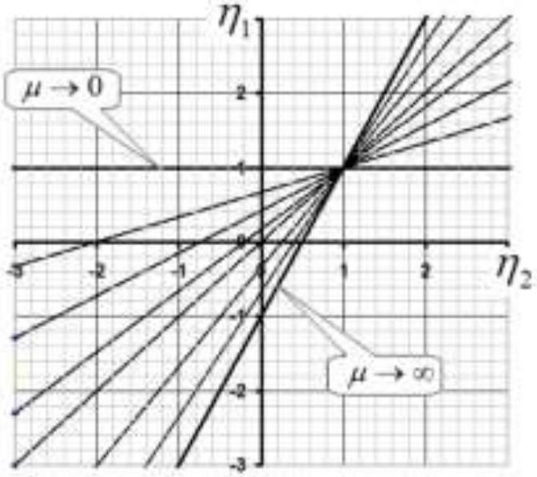

2.6 Кинетическая энергия шарика увеличится, если модуль скорости шарика после удара станет больше модуля скорости до удара, то есть при выполнении неравенств The kinetic energy of the ball increases if the modulus of its velocity after the collision becomes greater than the modulus of its velocity before the collision, that is, if the following inequalities are fulfilled

$$
\left| \eta _ { 1 } \right| > 1 \Rightarrow \left\{ \begin{array} { l }
\eta _ { 1 } > 1  \tag{17}\\
\eta _ { 1 } < - 1
\end{array} . \right.
$$

Substituting expression (15) for the quantity $\eta _ { 1 }$, we obtain the following two inequalities

$$
\left\{ \begin{array} { l }
\frac { 1 - \mu } { 1 + \mu } + \frac { 2 \mu } { 1 + \mu } \eta _ { 2 } > 1  \tag{18}\\
\frac { 1 - \mu } { 1 + \mu } + \frac { 2 \mu } { 1 + \mu } \eta _ { 2 } < - 1
\end{array} . \right.
$$

The solutions of these inequalities are the following relations:

a) $$
\begin{equation*}
\eta _ { 2 } > 1 , \tag{19}
\end{equation*}
$$
that is, to fulfill this condition, the second ball must catch up with the first one;;
b) $$
\begin{equation*}
\eta _ { 2 } < - \frac { 1 } { \mu } , \tag{20}
\end{equation*}
$$

in this case, the second ball must move towards the first one and the modulus of its velocity must exceed the above specified value.
2.7 In the limiting case $m _ { 2 }$, the speed of the first ball after the collision is

$$
\begin{equation*}
\tilde { u } _ { 1 } = - v _ { 1 } + 2 v _ { 2 } , \tag{21}
\end{equation*}
$$

that is, the speed of the first ball changes sign (the ball is reflected) and its modulus changes to twice the speed of the second, heavy ball.

The light ball increases its speed, and, consequently, its kinetic energy, if:

a) the heavy ball catches up with the light ball (hit from behind) $v _ { 2 } > 1$;
б) the heavy ball moves towards the light ball $v _ { 2 } < 0$.

## The simplest Fermi acceleration model

2.8 We write the law of motion of the plate in the traditional form

$$
\begin{equation*}
x ( t ) = A \cos ( \omega t ) , \tag{22}
\end{equation*}
$$

then the dependence of the velocity on time is described by the function

$$
\begin{equation*}
v ( t ) = - A \omega \sin ( \omega t ) , \tag{23}
\end{equation*}
$$

thus, the maximum speed of the platform is

$$
\begin{equation*}
V _ { 0 } = A \omega = 2 \pi \frac { A } { T } . \tag{24}
\end{equation*}
$$

2.9 To answer the question posted, it is enough to consider one period of plate oscillations. Let us plot the dependence of the plate coordinates on time (22) and plot on the same graph the dependences of the incoming particle coordinates on time, which are straight lines $x = x _ { 0 } - u t$.

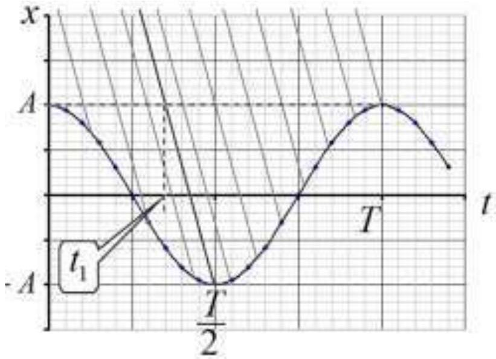

The figure shows the case $u > V _ { 0 }$. As a result of the collision, balls that collide with the plate increase their speed at those time moments when the plate moves towards the positive direction of the axis , while collisions must occur in the time interval from $\frac { T } { 2 }$ to $T$. However, the collision times are not randomly and uniformly distributed, but the times of approach to the plate itself are uniformly distributed, so we consider a plane $x = A$, the times of approach to which are equally probable. Let us draw a straight line that describes the law of motion of a ball colliding with the plate at the moment of time $t = \frac { T } { 2 }$ (the thick line in the figure). Let us denote $t _ { 1 }$ as the moment of time when this ball crosses the plane $x = A$. Balls that collide with the plate after this moment of time increase their speed and energy. But these balls cross the plane in the time interval from $t _ { 1 }$ to $T$, so the fraction of these particles is obtained as

$$
\begin{equation*}
\eta = \frac { T - t _ { 1 } } { T } . \tag{25}
\end{equation*}
$$

The moment of time $t _ { 1 }$ is easy to find from the law of the ball motion

$$
\begin{equation*}
t _ { 1 } = \frac { T } { 2 } - \frac { 2 A } { u } , \tag{26}
\end{equation*}
$$

then the fraction of accelerated particles is equal to

$$
\begin{equation*}
\eta = \frac { T - t _ { 1 } } { T } = \frac { 1 } { 2 } + \frac { 2 A } { u T } = \frac { 1 } { 2 } + \frac { V _ { 0 } } { \pi u } . \tag{27}
\end{equation*}
$$

Here we use the relation that follows from formula (24): $\frac { 2 A } { T } = \frac { V _ { 0 } } { \pi }$. Substituting the specified numerical value $u = 1.5 V _ { 0 }$, we get:

$$
\begin{equation*}
\eta = \frac { 1 } { 2 } + \frac { 1 } { 1.5 \pi } \approx 0.71 . \tag{28}
\end{equation*}
$$

A somewhat different situation is realized at $u < V _ { 0 }$, which is shown in the figure below.
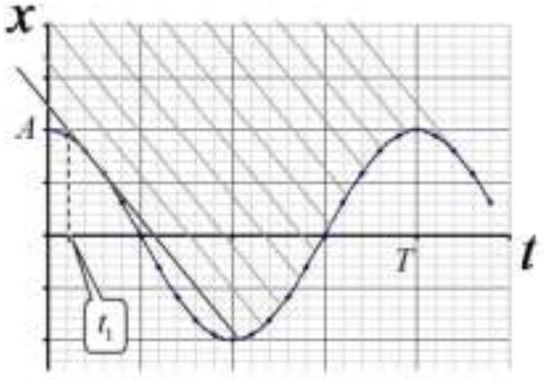

In this case, the "border time" $t _ { 1 }$ between accelerated and decelerated balls is determined by a straight line, which is tangent to the graph of the plate law of motion, as shown in the figure below.
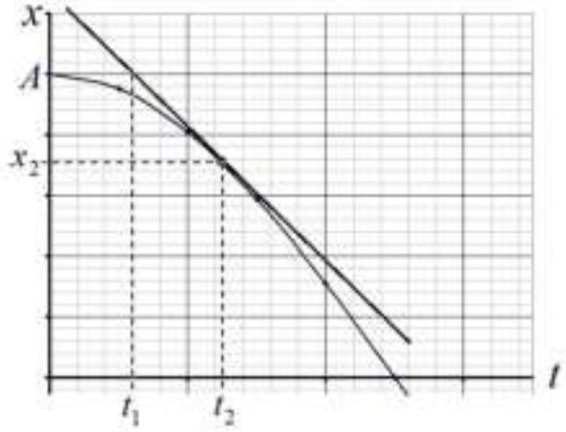

When the graphs of two functions touch at the moment of time $t _ { 2 }$, the values of both functions themselves and their derivatives, that is, the speeds of the plate and the ball, coincide, therefore

$$
\begin{equation*}
- A \omega \sin \left( \omega t _ { 2 } \right) = - u , \tag{29}
\end{equation*}
$$

which gives rise to

$$
\begin{align*}
& t _ { 2 } = \frac { 1 } { \omega } \arcsin \frac { u } { A \omega } = \frac { T } { 2 \pi } \arcsin \frac { u } { V _ { 0 } } .  \tag{30}\\
& x _ { 2 } = A \cos \omega t _ { 2 } = A \sqrt { 1 - \sin ^ { 2 } \omega t _ { 2 } } = A \sqrt { 1 - \frac { u ^ { 2 } } { V _ { 0 } ^ { 2 } } } . \tag{31}
\end{align*}
$$

These expressions allow us to determine the time of approach to the plane $x = A$

$$
\begin{equation*}
t _ { 1 } = t _ { 2 } - \frac { A - x _ { 2 } } { u } = \frac { T } { 2 \pi } \left( \arcsin \frac { u } { V _ { 0 } } - \frac { V _ { 0 } } { u } \left( 1 - \sqrt { 1 - \frac { u ^ { 2 } } { V _ { 0 } ^ { 2 } } } \right) \right) . \tag{32}
\end{equation*}
$$

The ratio of this time to the oscillation period determines the fraction of particles that collide with the plate, catching it up, such that their energy decreases:

$$
\begin{equation*}
1 - \eta = \frac { 1 } { 2 \pi } \left( \arcsin \frac { u } { V _ { 0 } } - \frac { V _ { 0 } } { u } \left( 1 - \sqrt { 1 - \frac { u ^ { 2 } } { V _ { 0 } ^ { 2 } } } \right) \right) \approx 0.04 , \tag{33}
\end{equation*}
$$

therefore, the fraction of balls whose energy increases after the collision is equal to

$$
\begin{equation*}
\eta \approx 0.96 . \tag{34}
\end{equation*}
$$

2.10 In one period of oscillation, the plate travels a path $4 A$, so the modulus of its speed is equal to

$$
\begin{equation*}
V = \frac { 4 A } { T } . \tag{35}
\end{equation*}
$$

2.11 When the ball speed is greater than the platform speed, the proportion of balls that increase their energy as a result of the collision is calculated by a formula similar to formula (27):

$$
\begin{equation*}
\eta = \frac { T - t _ { 1 } } { T } = \frac { 1 } { 2 } + \frac { 2 A } { u T } = \frac { 1 } { 2 } + \frac { V } { 2 u } , \tag{36}
\end{equation*}
$$

and the corresponding figure is shown below.

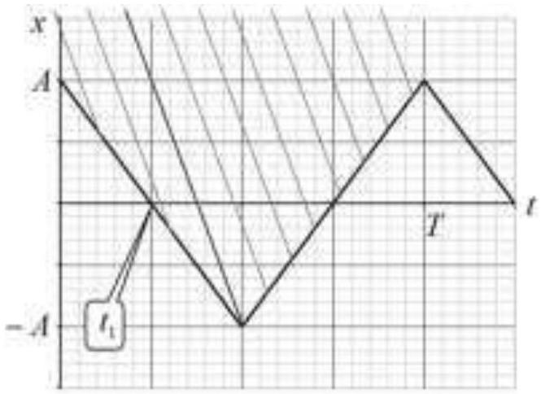

Since the modulus of the plate velocity is assumed to be constant, the ball velocity modulus after the impact becomes equal to

$$
\begin{equation*}
u _ { + } = u + 2 \mathrm {~V} . \tag{37}
\end{equation*}
$$

The velocities of balls that collide with the plate in the time interval from 0 to $t _ { 1 }$, are equal to

$$
\begin{equation*}
u _ { - } = u - 2 \mathrm {~V} . \tag{38}
\end{equation*}
$$

Thus, the average ball energy after the collision becomes equal to

$$
\begin{align*}
& E = \eta \frac { m u _ { + } ^ { 2 } } { 2 } + ( 1 - \eta ) \frac { m u _ { - } ^ { 2 } } { 2 } = \frac { m } { 2 } \left( \left( \frac { 1 } { 2 } + \frac { V } { 2 u } \right) ( u + 2 V ) ^ { 2 } + \left( \frac { 1 } { 2 } - \frac { V } { 2 u } \right) ( u - 2 V ) ^ { 2 } \right) = \\
& = \frac { m u ^ { 2 } } { 4 } \left( \left( 1 + \frac { V } { u } \right) \left( 1 + 2 \frac { V } { u } \right) ^ { 2 } + \left( 1 - \frac { V } { u } \right) \left( 1 - 2 \frac { V } { u } \right) ^ { 2 } \right) = \frac { m u ^ { 2 } } { 2 } \left( 1 + 8 \left( \frac { V } { u } \right) ^ { 2 } \right) \tag{39}
\end{align*}
$$

and, consequently, the increase in the average energy is equal to

$$
\begin{equation*}
\varepsilon = 1 + 8 \left( \frac { V } { u } \right) ^ { 2 } \approx 4.6 \tag{40}
\end{equation*}
$$

If the speed of the balls is less than the speed of the plate, then all the balls collide with the plate when it moves in the opposite direction, so all the balls increase their speed and energy. After the collision, the particle velocities become equal $u _ { + } = u + 2 V$, and their energy

$$
\begin{equation*}
E = \frac { m } { 2 } ( u + 2 V ) ^ { 2 } = \frac { m u ^ { 2 } } { 2 } \left( 1 + 2 \frac { V } { u } \right) ^ { 2 } , \tag{41}
\end{equation*}
$$

and, consequently, the ratio of the ball energies after and before the collision is equal to

$$
\begin{equation*}
\varepsilon = \left( 1 + 2 \frac { V } { u } \right) ^ { 2 } = 25.0 . \tag{42}
\end{equation*}
$$

|  | Content | Points |  |
| :--- | :--- | :--- | :--- |
| 2.1 | Formula (2): $N _ { 1 } = n \Delta v t$ | 0.1 | 0.4 |
|  | Numerical value in formula (2): $N _ { 1 } \approx 0.83$ | 0.1 |  |
|  | Formula (3): $\tau _ { 1 } = \frac { 1 } { n \Delta v }$ | 0.1 |  |
|  | Numerical value in formula (3): $\tau _ { 1 } = 0.02 \mathrm {~h} = 72 \mathrm {~s}$ | 0.1 |  |
| 2.2 | Formula (4): $N _ { 2 } = n \Delta v t$ | 0.1 | 0.4 |
|  | Numerical value in formula (4): $N _ { 2 } \approx 0.83$ | 0.1 |  |
|  | Formula (5): $\tau _ { 2 } = \frac { 1 } { n \Delta v }$ | 0.1 |  |
|  | Numerical value in formula (5): $\tau _ { 2 } = 0.02 \mathrm {~h} = 72 \mathrm {~s}$ | 0.1 |  |

| 2.3 | $N _ { 3,4 } = n ( 2 v \pm \Delta v ) t$ | 0.4 | 0.8 |
| :--- | :--- | :--- | :--- |
|  | Numerical values in formula (7): $N _ { 3 } = 15.8 ; \quad \tau _ { 3 } = 3.8 \mathrm {~s}$. | 0.4 |  |
| 2.4 | Formula (8): $m _ { 1 } v _ { 1 } + m _ { 2 } v _ { 2 } = m _ { 1 } u _ { 1 } + m _ { 2 } u _ { 2 }$ | 0.1 | 0.6 |
|  | Formula (9): $\frac { m _ { 1 } v _ { 1 } ^ { 2 } } { 2 } + \frac { m _ { 2 } v _ { 2 } ^ { 2 } } { 2 } = \frac { m _ { 1 } u _ { 1 } ^ { 2 } } { 2 } + \frac { m _ { 2 } u _ { 2 } ^ { 2 } } { 2 }$ | 0.1 |  |
|  | Formula (13): $u _ { 1 } = \frac { m _ { 1 } - m _ { 2 } } { m _ { 1 } + m _ { 2 } } v _ { 1 } + \frac { 2 m _ { 2 } } { m _ { 1 } + m _ { 2 } } v _ { 2 }$ | 0,2 |  |
|  | Formula (14): $u _ { 2 } = \frac { 2 m _ { 1 } } { m _ { 1 } + m _ { 2 } } v _ { 1 } + \frac { m _ { 2 } - m _ { 1 } } { m _ { 1 } + m _ { 2 } } v _ { 2 }$ | 0,2 |  |
| 2.5 | Formula (15): $\eta _ { 1 } = \frac { 1 - \mu } { 1 + \mu } + \frac { 2 \mu } { 1 + \mu } \eta _ { 2 }$ | 0.2 | 1.6 |
|  | There are only straight lines on the graph, otherwise the graph is not graded | 0.2 |  |
|  | All lines pass through the point $\eta _ { 1 } = 1 ; \eta _ { 2 } = 1$ | 0.4 |  |
|  | There is a straight line $\eta _ { 1 } = 1$ | 0.2 |  |
|  | There is a straight line $\eta _ { 1 } = - 1 + 2 \eta _ { 2 }$ | 0.4 |  |
|  | All lines are located in between $\eta _ { 1 } = 1$ and $\eta _ { 1 } = - 1 + 2 \eta _ { 2 }$ | 0,2 |  |
| 2.6 | Inequalities (7): $\left\| \eta _ { 1 } \right\| > 1 \Rightarrow \left\{ \begin{array} { l } \eta _ { 1 } > 1 \\ \eta _ { 1 } < - 1 \end{array} \right.$ | 0.2 | 0.4 |
|  | Inequality (19): $\eta _ { 2 } > 1$ | 0.1 |  |
|  | Inequality (20): $\eta _ { 2 } < - \frac { 1 } { \mu }$ | 0.1 |  |
| 2.7 | Formula (21): $\tilde { u } _ { 1 } = - v _ { 1 } + 2 v _ { 2 }$ | 0.1 | 0.3 |
|  | Inequality a): $v _ { 2 } > 1$ | 0.1 |  |
|  | Inequality b): $v _ { 2 } < 0$ | 0.1 |  |
| 2.8 | Formula (22): $x ( t ) = A \cos ( \omega t )$ | 0.1 | 0.4 |
|  | Formula (23): $v ( t ) = - A \omega \sin ( \omega t )$ | 0.1 |  |
|  | Formula (24): $V _ { 0 } = A \omega = 2 \pi \frac { A } { T }$ | 0,2 |  |
| 2.9 | Formula (25): $\eta = \frac { T - t _ { 1 } } { T }$ | 0.3 | 2.7 |
|  | Formula (26): $t _ { 1 } = \frac { T } { 2 } - \frac { 2 A } { u }$ | 0.3 |  |
|  | Formula (27): $\eta = \frac { 1 } { 2 } + \frac { V _ { 0 } } { \pi u }$ | 0.3 |  |
|  | Numerical value in formula (28): $\eta \approx 0.71$ | 0.3 |  |
|  | Formula (29): $- A \omega \sin \left( \omega _ { 1 } \right) = - u$ | 0.2 |  |
|  | Formula (30): $t _ { 2 } = \frac { T } { 2 \pi } \arcsin \frac { u } { V _ { 0 } }$ | 0.2 |  |

|  | Formula (31): $x _ { 2 } = A \sqrt { 1 - \frac { u ^ { 2 } } { V _ { 0 } ^ { 2 } } }$ | 0.3 |  |
| :--- | :--- | :--- | :--- |
|  | Formula (32): $t _ { 1 } = \frac { T } { 2 \pi } \left( \arcsin \frac { u } { V _ { 0 } } - \frac { V _ { 0 } } { u } \left( 1 - \sqrt { 1 - \frac { u ^ { 2 } } { V _ { 0 } ^ { 2 } } } \right) \right)$ | 0.3 |  |
|  | Formula (33): $1 - \eta = \frac { 1 } { 2 \pi } \left( \arcsin \frac { u } { V _ { 0 } } - \frac { V _ { 0 } } { u } \left( 1 - \sqrt { 1 - \frac { u ^ { 2 } } { V _ { 0 } ^ { 2 } } } \right) \right)$ | 0.3 |  |
|  | Numerical value in formula (34): $\eta \approx 0.96$ | 0.2 |  |
| 2.10 | Formula (35): $V = \frac { 4 A } { T }$ | 0.2 | 0.2 |
| 2.11 | Formula (36): $\eta = \frac { 1 } { 2 } + \frac { V } { 2 u }$ | 0.3 | 2.2 |
|  | Formula (37): $u _ { + } = u + 2 V$ | 0.2 |  |
|  | Formula (38): $u _ { - } = u - 2 V$ | 0.2 |  |
|  | Formula (39): $E = \eta \frac { m u _ { + } ^ { 2 } } { 2 } + ( 1 - \eta ) \frac { m u _ { - } ^ { 2 } } { 2 }$ | 0.3 |  |
|  | Formula (40): $\varepsilon = 1 + 8 \left( \frac { V } { u } \right) ^ { 2 }$ | 0.3 |  |
|  | Numerical value in formula (40): $\varepsilon \approx 4.6$ | 0.2 |  |
|  | Formula (41): $E = \frac { m } { 2 } ( u + 2 V ) ^ { 2 }$ | 0.2 |  |
|  | Formula (42): $\varepsilon = \left( 1 + 2 \frac { V } { u } \right) ^ { 2 }$ | 0.3 |  |
|  | Numerical value in formula (42): $\varepsilon = 25.0$ | 0.2 |  |
| Total |  |  | 10.0 |

Problem 3. Magnetron
Electron motion in electric and magnetic fields

3.1 Under the action of a uniform electric field, an electron moves with a constant acceleration

$$
\begin{equation*}
a = \frac { e E } { m } , \tag{1}
\end{equation*}
$$

which is directed in the negative direction of the $x$ axis, so the maximum value of the achieved coordinate is determined by the expression

$$
\begin{equation*}
x _ { \max } = \frac { u _ { 0 } ^ { 2 } } { 2 a } = \frac { m u _ { 0 } ^ { 2 } } { 2 e E } . \tag{2}
\end{equation*}
$$

3.2 When moving in a uniform magnetic field, the Lorentz force acts on an electron, equal to

$$
\begin{equation*}
F _ { L } = e u _ { 0 } B . \tag{3}
\end{equation*}
$$

and it moves in a circle whose radius $R$ is determined from Newton's second law

$$
\begin{equation*}
m \frac { u _ { 0 } ^ { 2 } } { R } = F _ { L } , \tag{4}
\end{equation*}
$$

which yeilds

$$
\begin{equation*}
R = \frac { m u _ { 0 } } { e B } . \tag{5}
\end{equation*}
$$

It is obvious that the maximum value of the coordinate in this case is equal to

$$
\begin{equation*}
x _ { \max } = R = \frac { m u _ { 0 } } { e B } . \tag{6}
\end{equation*}
$$

3.3 The problem is most easily solved in the laboratory reference frame, in which the electron moves along the circle with the frequency determined by formula (5) in the form

$$
\begin{equation*}
\omega = \frac { u _ { 0 } } { R } = \frac { e B } { m } . \tag{7}
\end{equation*}
$$

When an electron is given a small additional speed, it begins to move along a circle that is close to the original one and intersects with it at two diametrically opposite points, which can be considered as motion along a closed two-dimensional trajectory with the period

$$
\begin{equation*}
T = \frac { 2 \pi } { \omega } = \frac { 2 \pi m } { e B } . \tag{8}
\end{equation*}
$$

3.4 В момент, когда координата $x$ максимальна, скорость частицы $u$ направлена вдоль оси $z$ и по закону сохранения энергии равна At the moment when the coordinate $x$ is maximum, the particle velocity $u$ is directed along the $z$ axis and, according to the law of conservation of energy, is equal to

$$
\begin{equation*}
e E x _ { \max } = \frac { m u ^ { 2 } } { 2 } . \tag{9}
\end{equation*}
$$

In the projection onto the $z$ axis, the equation of motion is written in finite differences in the form

$$
\begin{equation*}
m \frac { \Delta u _ { z } } { \Delta t } = e B u _ { x } \tag{10}
\end{equation*}
$$

which, with account of $\Delta x = u _ { x } \Delta t$, leads to the relation

$$
\begin{equation*}
m \Delta u _ { z } = e B \Delta x , \tag{11}
\end{equation*}
$$

which for the time moment sought takes the form

$$
\begin{equation*}
m u = e B x _ { \max } . \tag{12}
\end{equation*}
$$

Solving equations (9) and (12) simultaneously, we finally obtain

$$
\begin{equation*}
x _ { \max } = \frac { 2 m E } { e B ^ { 2 } } , \tag{13}
\end{equation*}
$$

3.5 Since the magnetic field does not perform any work, the electron velocity remains constant in absolute value and equal to its initial value

$$
\begin{equation*}
u = u _ { 0 } = \text { const } . \tag{14}
\end{equation*}
$$

Let us divide the total velocity into radial $u _ { r } = d r / d t$ and $u _ { \varphi } = r d \varphi / d t$ azimuthal components. The angular momentum of the electron relative to the origin is obviously equal to

$$
\begin{equation*}
L = m r u _ { \varphi } , \tag{15}
\end{equation*}
$$

and the torque of the Lorentz force about the same point is

$$
\begin{equation*}
M = e B u _ { r } r . \tag{16}
\end{equation*}
$$

According to the moment equation, we have

$$
\begin{equation*}
\frac { d L } { d t } = M , \tag{17}
\end{equation*}
$$

which together with the use of $u _ { r } = d r / d t$ provides to the relation

$$
\begin{equation*}
d \left( m r u _ { \varphi } \right) = e \alpha r ^ { 2 } d r . \tag{18}
\end{equation*}
$$

At the moment of time when the distance to the $z$ axis is maximum, the radial velocity vanishes, and the azimuthal velocity is equal to the initial one in accordance with formula (14), so the integration of relation (18) leads to the equation

$$
\begin{equation*}
m r _ { \max } u _ { 0 } = e \alpha \frac { r _ { \max } ^ { 3 } } { 3 } , \tag{19}
\end{equation*}
$$

which finally gives rise to

$$
\begin{equation*}
r _ { \max } = \sqrt { \frac { 3 m u _ { 0 } } { e \alpha } } . \tag{20}
\end{equation*}
$$

3.6 Since the electron moves all the time along a circle, then, according to equation (5), with an increase in the magnetic field $B _ { 0 }$ at its orbit, the derivative of the momentum changes according to the law

$$
\begin{equation*}
\frac { d p } { d t } = e r \frac { d B _ { 0 } } { d t } . \tag{21}
\end{equation*}
$$

The electron is set in motion due to the vortex electric field, whose strength $E$ is determined by the relation

$$
\begin{equation*}
E = \frac { 1 } { 2 \pi r } \frac { d \Phi } { d t } , \tag{22}
\end{equation*}
$$

which, according to the Faraday law, includes the flux of magnetic induction through the electron orbit, equal to

$$
\begin{equation*}
\Phi = \int _ { 0 } ^ { r } B ( r ) 2 \pi r d r \tag{23}
\end{equation*}
$$

The equation of Newton's second law for the acceleration of an electron in orbit has the form

$$
\begin{equation*}
\frac { d p } { d t } = e E . \tag{24}
\end{equation*}
$$

The joint solution of equations (21)-(24) leads to the following equality for the magnetic field, which is called the cyclotron condition

$$
\begin{equation*}
\int _ { 0 } ^ { r } B ( r ) 2 \pi r d r = 2 \pi r ^ { 2 } B _ { 0 } . \tag{25}
\end{equation*}
$$

From formula (25) we conclude that its satisfaction is possible only in the case when the electron moves in the region of a magnetic field with induction $B _ { 0 } = B _ { 2 }$, therefore, integrating the magnetic induction given in the formulation as a function of distance, we obtain the relation

$$
\begin{equation*}
B _ { 1 } \pi r _ { 1 } ^ { 2 } + B _ { 2 } \pi \left( r ^ { 2 } - r _ { 1 } ^ { 2 } \right) = 2 \pi r ^ { 2 } B _ { 2 } , \tag{26}
\end{equation*}
$$

whose solution has the following form

$$
\begin{equation*}
\frac { B _ { 1 } } { B _ { 2 } } = 1 + \frac { r ^ { 2 } } { r _ { 1 } ^ { 2 } } . \tag{27}
\end{equation*}
$$

The motion of an electron in a circle is possible only in the area in which the induction is equal $B _ { 2 }$, that is, at $r _ { 1 } < r < r _ { 2 }$, which means that the ratio sought must lie in the interval

$$
\begin{equation*}
2 < \frac { B _ { 1 } } { B _ { 2 } } < 1 + \frac { r _ { 2 } ^ { 2 } } { r _ { 1 } ^ { 2 } } . \tag{28}
\end{equation*}
$$

## Cylindrical magnetron

3.7 Let the unit length of the cylindrical cathode and anode have a charge equal to $\lambda$, and the total length of the electrodes is $l$. Then, according to the Gauss theorem, the electric field strength in the space between the cathode and anode is determined by the equation

$$
\begin{equation*}
E 2 \pi r l = \frac { \lambda l } { \varepsilon _ { 0 } } , \tag{29}
\end{equation*}
$$

which immediately yields

$$
\begin{equation*}
E = \frac { \lambda } { 2 \pi \varepsilon _ { 0 } r } . \tag{30}
\end{equation*}
$$

Here $r$ stands for the distance to the magnetron axes.
The dependence of the potential difference on the distance $r$, by definition, is written as an integral

$$
\begin{equation*}
V = \int _ { a } ^ { r } E d r = \frac { \lambda } { 2 \pi \varepsilon _ { 0 } } \ln \frac { r } { a } , \tag{31}
\end{equation*}
$$

which in particularly for $r = b$ gives rise to

$$
\begin{equation*}
V _ { 0 } = \frac { \lambda } { 2 \pi \varepsilon _ { 0 } } \ln \frac { b } { a } . \tag{32}
\end{equation*}
$$

Solving equations (31) and (32) together, we obtain

$$
\begin{equation*}
V = V _ { 0 } \frac { \ln ( r / a ) } { \ln ( b / a ) } = 57.6 \mathrm {~V} . \tag{33}
\end{equation*}
$$

3.8 Рассмотрим тонкое кольцо радиуса $R$, по которому протекает ток $j$, и рассчитаем величину магнитной индукции в точке на оси кольца, отстоящей то его центра на расстоянии $z$. Разобьем кольцо на малые элементы $d l$, тогда магнитная индукция определяется следующим законом Био-Саварра Consider a thin ring of radius $R$, through which the current $j$ flows, and calculate the magnitude of the magnetic induction at a point on the axis of the ring, which is located at a distance $z$ from its center. Let us divide the ring into small elements $d l$, then the magnetic induction is determined by the following Biot-Savart law

$$
\begin{equation*}
d \bar { B } = \frac { \mu _ { 0 } j } { 4 \pi } \frac { d \bar { l } \times \bar { r } } { r ^ { 3 } } , \tag{34}
\end{equation*}
$$

in which the vector $\dot { r }$ is drawn from the location of the current element $d l$ to the point $O$ where the magnetic induction is sought.

It follows from geometric relations that

$$
\begin{equation*}
d l \times r = d l \cdot r , \tag{35}
\end{equation*}
$$

and since the resulting magnetic induction is directed along the axis of the ring

$$
\begin{equation*}
d B _ { z } = d B \sin \alpha , \tag{36}
\end{equation*}
$$

then, using the geometric relation $R = r \sin \alpha$, we finally obtain

$$
\begin{equation*}
d B _ { z } = \frac { \mu _ { 0 } j } { 4 \pi } \frac { R d l } { r ^ { 3 } } . \tag{37}
\end{equation*}
$$

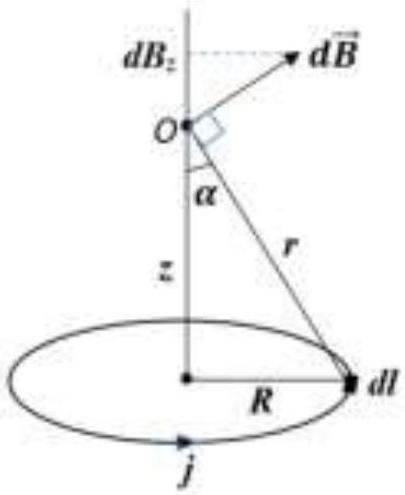

Considering that the distances included in formula (37) are constant and

$$
\begin{equation*}
r ^ { 2 } = R ^ { 2 } + z ^ { 2 } , \tag{38}
\end{equation*}
$$

then after summing over all elements of the ring one finds

$$
\begin{equation*}
B _ { z } = \frac { \mu _ { 0 } j } { 2 } \frac { R ^ { 2 } } { \left( R ^ { 2 } + z ^ { 2 } \right) ^ { 3 / 2 } } . \tag{39}
\end{equation*}
$$

Let us now calculate the magnetic field induction at the center of the solenoid, since this is where the magnetron lamp is located. To do this, consider the turns located at a distance from the center from $z$ to $z + d z$, through which the current flows

$$
\begin{equation*}
d j = \frac { N I } { L } d z . \tag{40}
\end{equation*}
$$

These turns can be considered as a ring, whose magnetic induction is determined by formula (39), such that

$$
\begin{equation*}
d B = \frac { \mu _ { 0 } N I } { 2 L } \frac { R ^ { 2 } } { \left( R ^ { 2 } + z ^ { 2 } \right) ^ { 3 / 2 } } d z , \tag{41}
\end{equation*}
$$

which after integration gives the final expression

$$
\begin{equation*}
B = \frac { \mu _ { 0 } N I R ^ { 2 } } { 2 L } \int _ { - L / 2 } ^ { L / 2 } \frac { d z } { \left( R ^ { 2 } + z ^ { 2 } \right) ^ { 3 / 2 } } = \frac { \mu _ { 0 } N I } { L \sqrt { 1 + D ^ { 2 } / L ^ { 2 } } } , \tag{42}
\end{equation*}
$$

where the expression $D = 2 R$ is used for the diameter.
For the motion of electrons in a magnetron, a formula is valid that is similar to formula (18) and has the form

$$
\begin{equation*}
d \left( m r u _ { \varphi } \right) = e B r d r , \tag{43}
\end{equation*}
$$

whose integration under the conditions of constant magnetic induction and $a \ll b$ gives

$$
\begin{equation*}
m r u _ { \varphi } = \frac { 1 } { 2 } e B r ^ { 2 } . \tag{44}
\end{equation*}
$$

On the other hand, it follows from the law of conservation of energy that

$$
\begin{equation*}
\frac { m } { 2 } \left( u _ { r } ^ { 2 } + u _ { \varphi } ^ { 2 } \right) = e V . \tag{45}
\end{equation*}
$$

At the moment when the critical value of the current is reached, the magnetic induction near the anode becomes such that the radial velocity of the electrons vanishes, which leads to the conditions

$$
\begin{equation*}
u _ { r } = 0 , \quad r = b , \quad V = V _ { 0 } , \tag{46}
\end{equation*}
$$

which, using expressions (44) and (45), results in the critical value of the magnetic field

$$
\begin{equation*}
B = \sqrt { \frac { 8 m V _ { 0 } } { e b ^ { 2 } } } . \tag{47}
\end{equation*}
$$

Using formula (42), we find the corresponding current in the solenoid

$$
\begin{equation*}
I _ { \min } = \sqrt { \frac { 8 m V _ { 0 } } { e } \left( 1 + D ^ { 2 } / L ^ { 2 } \right) } \frac { L } { \mu _ { 0 } N b } = 0,701 \mathrm {~A} . \tag{48}
\end{equation*}
$$

3.9 The initial energy of electrons in a lamp near the cathode is determined by the temperature of the cathode itself and is on the order of

$$
\begin{equation*}
E _ { T } = k _ { B } T . \tag{49}
\end{equation*}
$$

This energy is obviously must be much less than the energy of electrons near the anode, i.e.

$$
\begin{equation*}
E _ { T } < E _ { 0 } , \tag{50}
\end{equation*}
$$

where $E _ { 0 } = e V _ { 0 }$, whence we obtain the desired estimate

$$
\begin{equation*}
T \propto \frac { e E _ { 0 } } { k _ { B } } = 8.70 \cdot 10 ^ { 5 } \mathrm {~K} , \tag{51}
\end{equation*}
$$

which actually means the applicability of the approximation used, since the cathode temperature is usually at least two orders of magnitude lower.

|  | Content | Points |  |
| :--- | :--- | :--- | :--- |
| 3.1 | Formula (1): $a = \frac { e E } { m }$ | 0.1 | 0.2 |
|  | Formula (2): $x _ { \text {max } } = \frac { m u _ { 0 } ^ { 2 } } { 2 e E }$ | 0.1 |  |
| 3.2 | Formula (3): $F _ { L } = e u _ { 0 } B$ | 0.1 | 0.4 |
|  | Formula (4): $m \frac { u _ { 0 } ^ { 2 } } { R } = F _ { L }$ | 0.1 |  |
|  | Formula (5): $R = \frac { m u _ { 0 } } { e B }$ | 0.1 |  |
|  | Formula (6): $x _ { \text {max } } = R = \frac { m u _ { 0 } } { e B }$ | 0.1 |  |
| 3.3 | Formula (7): $\omega = \frac { u _ { 0 } } { R } = \frac { e B } { m }$ | 0.2 | 0.4 |
|  | Formula (8): $T = \frac { 2 \pi } { \omega } = \frac { 2 \pi m } { e B }$ | 0.2 |  |

| 3.4 | Formula (9): $e E x _ { \text {max } } = \frac { m u ^ { 2 } } { 2 }$ | 0.2 | 1.0 |
| :--- | :--- | :--- | :--- |
|  | Formula (10): $m \frac { \Delta u _ { z } } { \Delta t } = e B u _ { x }$ | 0.2 |  |
|  | Formula (11): $m \Delta u _ { z } = e B \Delta x$ | 0.2 |  |
|  | Formula (12): $m u = e B x _ { \text {max } }$ | 0.2 |  |
|  | Formula (13): $x _ { \text {max } } = \frac { 2 m E } { e B ^ { 2 } }$ | 0.2 |  |
| 3.5 | Formula (14): $u = u _ { 0 } =$ const | 0.2 | 1.4 |
|  | Formula (15): $L = m r u _ { \varphi }$ | 0.2 |  |
|  | Formula (16): $M = e B u _ { r } r$ | 0.2 |  |
|  | Formula (17): $\frac { d L } { d t } = M$ | 0.2 |  |
|  | Formula (18): $d \left( m r u _ { \varphi } \right) = e \alpha r ^ { 2 } d r$ | 0.2 |  |
|  | Formula (19): $m r _ { \text {max } } u _ { 0 } = e \alpha \frac { r _ { \text {max } } ^ { 3 } } { 3 }$ | 0.2 |  |
|  | Formula (20): $r _ { \text {max } } = \sqrt { \frac { 3 m u _ { 0 } } { e \alpha } }$ | 0.2 |  |
| 3.6 | Formula (21): $\frac { d p } { d t } = e r \frac { d B _ { 0 } } { d t }$ | 0.2 | 1.6 |
|  | Formula (22): $E = \frac { 1 } { 2 \pi r } \frac { d \Phi } { d t }$ | 0.2 |  |
|  | Formula (23): $\Phi = \int _ { 0 } ^ { r } B ( r ) 2 \pi r d r$ | 0.2 |  |
|  | Formula (24): $\frac { d p } { d t } = e E$ | 0.2 |  |
|  | Formula (25): $\int _ { 0 } ^ { r } B ( r ) 2 \pi r d r = 2 \pi r ^ { 2 } B _ { 0 }$ | 0.2 |  |
|  | Formula (26): $B _ { 1 } \pi r _ { 1 } ^ { 2 } + B _ { 2 } \pi \left( r ^ { 2 } - r _ { 1 } ^ { 2 } \right) = 2 \pi r ^ { 2 } B _ { 2 }$ | 0.2 |  |
|  | Formula (27): $\frac { B _ { 1 } } { B _ { 2 } } = 1 + \frac { r ^ { 2 } } { r _ { 1 } ^ { 2 } }$ | 0.2 |  |
|  | Formula (28): $2 < \frac { B _ { 1 } } { B _ { 2 } } < 1 + \frac { r _ { 2 } ^ { 2 } } { r _ { 1 } ^ { 2 } }$ | 0.2 |  |
| 3.7 | Formula (29): $E 2 \pi r l = \frac { \lambda l } { \varepsilon _ { 0 } }$ | 0.1 | 1.0 |
|  | Formula (30): $E = \frac { \lambda } { 2 \pi \varepsilon _ { 0 } r }$ | 0.1 |  |
|  | Formula (31): $V = \frac { \lambda } { 2 \pi \varepsilon _ { 0 } } \ln \frac { r } { a }$ | 0.2 |  |
|  | Formula (32): $V _ { 0 } = \frac { \lambda } { 2 \pi \varepsilon _ { 0 } } \ln \frac { b } { a }$ | 0.2 |  |

|  | Formula (33): $V = V _ { 0 } \frac { \ln ( r / a ) } { \ln ( b / a ) }$ | 0.2 |  |
| :--- | :--- | :--- | :--- |
|  | Numerical value in formula (33): $V = 57.6 \mathrm {~V}$ | 0.2 |  |
| 3.8 | Formula (34): $d \bar { B } = \frac { \mu _ { 0 } j } { 4 \pi } \frac { d \bar { l } \times \bar { r } } { r ^ { 3 } }$ | 0.2 | 3.2   3.2 |
|  | Formula (35): $d l \times r = d l \cdot r$ | 0.2 |  |
|  | Formula (36): $d B _ { z } = d B \sin \alpha$ | 0.2 |  |
|  | Formula (37): $d B _ { z } = \frac { \mu _ { 0 } j } { 4 \pi } \frac { R d l } { r ^ { 3 } }$ | 0.2 |  |
|  | Formula (38): $r ^ { 2 } = R ^ { 2 } + z ^ { 2 }$ | 0.2 |  |
|  | Formula (39): $B _ { z } = \frac { \mu _ { 0 } j } { 2 } \frac { R ^ { 2 } } { \left( R ^ { 2 } + z ^ { 2 } \right) ^ { 3 / 2 } }$ | 0.2 |  |
|  | Formula (40): $d j = \frac { N I } { L } d z$ | 0.2 |  |
|  | Formula (41): $d B = \frac { \mu _ { 0 } N I } { 2 L } \frac { R ^ { 2 } } { \left( R ^ { 2 } + z ^ { 2 } \right) ^ { 3 / 2 } } d z$ | 0.2 |  |
|  | Formula (42): $B = \frac { \mu _ { 0 } N I } { L \sqrt { 1 + D ^ { 2 } / L ^ { 2 } } }$ | 0.2 |  |
|  | Formula (43): $d \left( m r u _ { \varphi } \right) = e B r d r$ | 0.2 |  |
|  | Formula (44): $m r u _ { \varphi } = \frac { 1 } { 2 } e B r ^ { 2 }$ | 0.2 |  |
|  | Formula (45): $\frac { m } { 2 } \left( u _ { r } ^ { 2 } + u _ { \varphi } ^ { 2 } \right) = e V$ | 0.2 |  |
|  | Formula (46): $u _ { r } = 0 , \quad r = b , \quad V = V _ { 0 }$ | 0.2 |  |
|  | Formula (47): $B = \sqrt { \frac { 8 m V _ { 0 } } { e b ^ { 2 } } }$ | 0.2 |  |
|  | Formula (48): $I _ { \text {min } } = \sqrt { \frac { 8 m V _ { 0 } } { e } \left( 1 + D ^ { 2 } / L ^ { 2 } \right) } \frac { L } { \mu _ { 0 } N b }$ | 0.2 |  |
|  | Numerical value in formula (48): $I _ { \text {min } } = 0,701 \mathrm {~A}$ | 0.2 |  |
| 3.9 | Formula (49): $E _ { T } = k _ { B } T$ | 0.2 |  |
|  | Formula (50): $E _ { T }$ - $E _ { 0 }$ | 0.2 |  |
|  | Formula (51): $T : \frac { e E _ { 0 } } { k _ { B } }$ | 0.2 |  |
|  | Numerical value in formula (51): $T - 8.70 \cdot 10 ^ { 5 } \mathrm {~K}$ | 0.2 |  |
| Total |  |  | 10.0 |
