## SOLUTION TO THE EXPERIMENTAL COMPETITION Superposition of oscillations

The longitudinal and torsional oscillations of the pendulum described in the experiment in the approximation of small angles are its own oscillations (modes), so they can be considered independently of each other.

In the small angle approximation, the periods of these oscillations are given by the formulas

$$
\begin{align*}
& T _ { 0 } = 2 \pi \sqrt { \frac { L } { g } } ,  \tag{1}\\
& T _ { 1 } = 2 \pi \sqrt { \frac { 4 L I } { m g a ^ { 2 } } } , \tag{2}
\end{align*}
$$

where $m = m _ { 0 } + 2 m _ { 1 }$ is the total mass of the pendulum, $m _ { 0 }$ refers to the rod mass, $m _ { 1 }$ stands for the nut mass, and $I = \frac { m _ { 0 } l ^ { 2 } } { 12 } + 2 m _ { 1 } z ^ { 2 }$ designates the moment of inertia of the rod with the nuts.

Formulas (1) and (2) are actually used in the work, but their derivation is not required and is not graded.

## Part1. Observation of the effect and its theoretical description

1.1 The rod end moves along trajectories corresponding to the addition of perpendicular oscillations with close frequencies. They can also be thought of as the addition of oscillations with equal frequencies, but with a slowly varying phase difference between them. Images of these most typical trajectories are shown in the figure below.
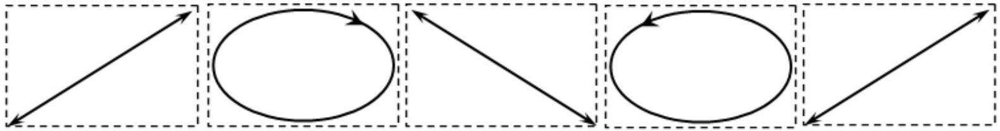
1.2 It follows from geometry that the horizontal coordinates of the rod end are described by the formulas:

$$
\left\{ \begin{array} { c }
x = L \sin \alpha + \frac { l } { 2 } \cos \beta  \tag{3}\\
y = \frac { l } { 2 } \sin \beta
\end{array} . \right.
$$

In the approximation of small angles $\alpha , \beta \ll 1$ we have

$$
\left\{ \begin{array} { c }
x \approx L \alpha + \frac { l } { 2 }  \tag{4}\\
y \approx \frac { l } { 2 } \beta
\end{array} \right.
$$

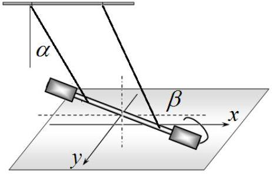
Since the angles $\alpha , \beta$ change according to a harmonic law with frequencies $\omega _ { 0 } = 2 \pi / T _ { 0 }$ and $\omega _ { 1 } =$ $2 \pi / T _ { 1 }$, respectively, the equation for the trajectory of the rod end has the form

$$
\left\{ \begin{array} { c }
x ( t ) = L \alpha _ { \max } \cos \omega _ { 0 } t + \frac { l } { 2 }  \tag{5}\\
y ( t ) = \frac { l } { 2 } \beta _ { \max } \sin \omega _ { 1 } t
\end{array} \right.
$$

which for close frequencies can be conveniently rewritten in the form

$$
\left\{ \begin{array} { c }
x ( t ) = L \alpha _ { \max } \cos \omega _ { 0 } t + \frac { l } { 2 }  \tag{6}\\
y ( t ) = \frac { l } { 2 } \beta _ { \max } \sin \left( \omega _ { 0 } t + \left( \omega _ { 1 } - \omega _ { 0 } \right) t \right)
\end{array} . \right.
$$

In the expression $y ( t )$ for close frequencies, the value $\Delta \varphi = \left( \omega _ { 1 } - \omega _ { 0 } \right) t$ can be considered as a slowly varying phase difference between oscillations with close frequencies.
1.3 It is obvious that the shape of the trajectory returns to the initial one if the phase difference changes by $\pm 2 \pi$. Thus, the cycle period obeys the condition

$$
\begin{equation*}
\left( \omega _ { 1 } - \omega _ { 0 } \right) T _ { C } = \pm 2 \pi , \tag{7}
\end{equation*}
$$

which provides

$$
\begin{equation*}
T _ { C } = \frac { T _ { 0 } T _ { 1 } } { \left| T _ { 0 } - T _ { 1 } \right| } . \tag{8}
\end{equation*}
$$

1.4 The number of oscillations of longitudinal oscillation in the cycle can be written in the form

$$
\begin{equation*}
N _ { C } = \frac { T _ { C } } { T _ { 0 } } = \frac { T _ { 1 } } { \left| T _ { 0 } - T _ { 1 } \right| } . \tag{9}
\end{equation*}
$$

## Part 2. Longitudinal oscillations

2.1 To increase the measurement accuracy, it is necessary to measure the times of a sufficiently large number of oscillations; in our experiments, we measure the time of 20 periods of oscillations $t _ { 20 }$. To estimate the random error, these measurements are carried out 10 times, and their results are shown in Table 1.

Table 1. Measuring the period of longitudinal oscillations.
| $n$ | $t _ { 20 } , \mathrm {~s}$ |  |
| :--- | :--- | :--- |
| 1 | 26,39 | The average time of 20 oscillations is $\left\langle t _ { 20 } \right\rangle = 26.41 \mathrm {~s}$, and the instrument error is equal to half the value of the stopwatch division $\Delta t _ { 1 } = 0.5 \cdot 10 ^ { - 3 } \mathrm {~s}$. The random error is calculated using the formula The may formg atda $\Delta t _ { 2 } = 2 \sqrt { \frac { \sum _ { i = 1 } ^ { 10 } \left( t _ { 20 , i } - \left\langle t _ { 20 } \right\rangle \right) ^ { 2 } } { n ( n - 1 ) } } = 6.5 \cdot 10 ^ { - 2 } \mathrm {~s}$. The total time measurement error is $\Delta t = \sqrt { \Delta t _ { 1 } ^ { 2 } + \Delta t _ { 2 } ^ { 2 } } = 0.066 \mathrm {~s}$. |
| 2 | 26,32 |  |
| 3 | 26,51 |  |
| 4 | 26,40 |  |
| 5 | 26,46 |  |
| 6 | 26,41 |  |
| 7 | 26,34 |  |
| 8 | 26,22 |  |
| 9 | 26,55 |  |
| 10 | 26,53 |  |

Thus, the period of longitudinal oscillations is equal to

$$
\begin{equation*}
T _ { 0 } = \frac { t _ { 20 } } { 20 } = ( 1.321 \pm 0.003 ) \mathrm { s } . \tag{10}
\end{equation*}
$$

## Part 3. Torsional oscillations

3.1 Table 2 shows the values of the measurement results of the periods of torsional oscillations at various values of the distance $a$ between the threads. The same table shows the results of calculations for determining the exponent $q$.

Table 2. Dependence of the period of torsional oscillations as a function of the distance between the threads.
| $a , \mathrm {~cm}$ | $t _ { 10 } , \mathrm {~s}$ | $T _ { 1 } , \mathrm {~s}$ | $\ln a$ | $\ln T _ { 1 }$ |
| :--- | :--- | :--- | :--- | :--- |
| 4,8 | 59,11 | 5,911 | 1,5686 | 1,7768 |
| 6,3 | 44,62 | 4,462 | 1,8405 | 1,4956 |
| 7,8 | 36,31 | 3,631 | 2,0541 | 1,2895 |
| 9,4 | 29,66 | 2,966 | 2,2407 | 1,0872 |
| 11,0 | 25,60 | 2,560 | 2,3979 | 0,9400 |
| 12,2 | 23,32 | 2,332 | 2,5014 | 0,8467 |
| 13,8 | 20,46 | 2,046 | 2,6247 | 0,7159 |
| 16,0 | 17,66 | 1,766 | 2,7726 | 0,5687 |
| 18,2 | 15,82 | 1,582 | 2,9014 | 0,4587 |
| 20,5 | 13,87 | 1,387 | 3,0204 | 0,3271 |
| 24,0 | 11,98 | 1,198 | 3,1781 | 0,1807 |

The corresponding dependence graph looks like

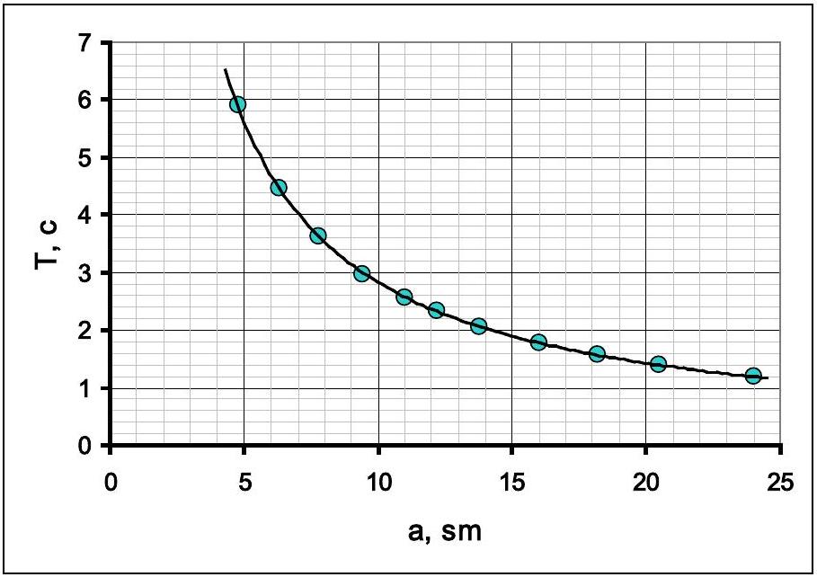
3.2 The optimal and most common way to determine the exponent is to plot a graph on a double logarithmic scale. It follows from formula (1) given in the problem statement that

$$
\begin{equation*}
\ln T = C + q \ln a , \tag{11}
\end{equation*}
$$

therefore, the slope of the graph is equal to the exponent. This graph is shown in the figure below.

The resulting relationship is linear with a slope coefficient very close to (-1). An alternative way is to construct dependencies $T _ { 1 } \left( a ^ { - 1 } \right)$, or $T _ { 1 } ^ { - 1 } ( a )$. However, in these methods it is necessary to prove that the constructed graphs are straight lines passing through the origin of coordinates.

All these methods reasonably indicate that the desired exponent is equal to ( - 1 ), i.e. the period of torsional oscillations is inversely proportional to the distance between the threads.
3.3 The results of measurements of the dependence of the period of torsional oscillations on the position of the nuts are given in Table 3. The same table shows the calculation results necessary to construct a linearized graph.

Table 3. Measurements of the period of torsional oscillations.
| $z , \mathrm {~cm}$ | $t _ { 20 } , \mathrm {~s}$ | $T _ { 1 } , \mathrm {~s}$ | $z ^ { 2 }$ | $T _ { 1 } ^ { 2 }$ | $U$ |
| :--- | :--- | :--- | :--- | :--- | :--- |
| 6 | 44,58 | 2,229 | 36 | 4,968 | 284,9 |
| 7 | 45,75 | 2,288 | 49 | 5,233 | 300,0 |
| 8 | 46,83 | 2,342 | 64 | 5,483 | 314,3 |
| 9 | 47,87 | 2,394 | 81 | 5,729 | 328,5 |
| 10 | 49,17 | 2,459 | 100 | 6,044 | 346,5 |

| 11 | 50,84 | 2,542 | 121 | 6,462 | 370,5 |
| :--- | :--- | :--- | :--- | :--- | :--- |
| 12 | 52,15 | 2,608 | 144 | 6,799 | 389,8 |
| 13 | 53,47 | 2,674 | 169 | 7,148 | 409,8 |
| 14 | 54,85 | 2,743 | 196 | 7,521 | 431,2 |
| 15 | 56,91 | 2,846 | 225 | 8,097 | 464,2 |

The graph of this relationship is shown in the figure below. It can be seen that the resulting dependence is nonlinear.

3.4 It follows from formulas (1)-(2) given in the problem statement and the result of the previous part that the period of torsional oscillations is described by the formula

$$
\begin{equation*}
\frac { T _ { 1 } } { T _ { 0 } } = \frac { \sqrt { A + B z ^ { 2 } } } { a } , \tag{12}
\end{equation*}
$$

whose linearization is obvious and has the form

$$
\begin{equation*}
\left( a \frac { T _ { 1 } } { T _ { 0 } } \right) ^ { 2 } = A + B z ^ { 2 } . \tag{13}
\end{equation*}
$$

The value $U = \left( a \frac { T _ { 1 } } { T _ { 0 } } \right) ^ { 2 }$ depends linearly on $z ^ { 2 }$, and the graph of the linearized dependence is shown in the figure below.
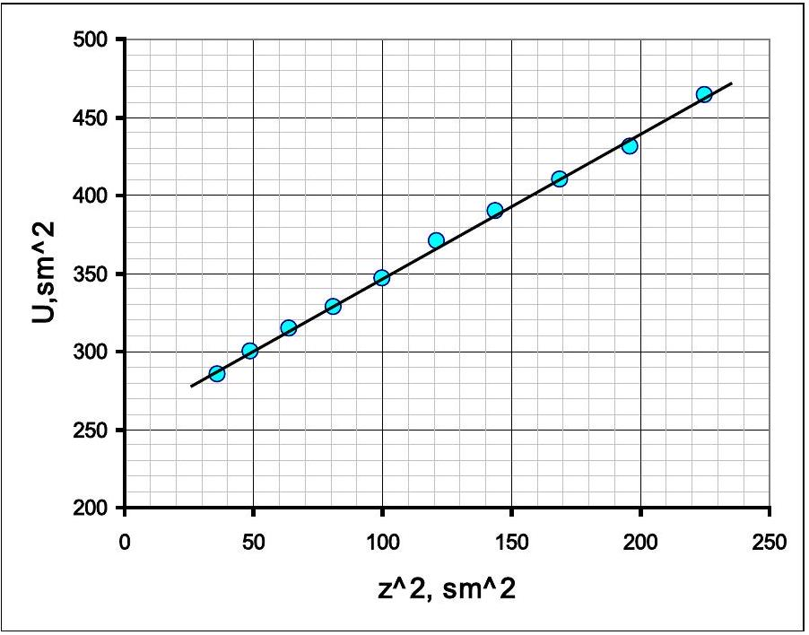
3.5 The coefficients of this dependence, calculated using the least squares method, are equal to

$$
\begin{align*}
& A = ( 254 \pm 4 ) \mathrm { cm } ^ { 2 } ,  \tag{14}\\
& B = 0.93 \pm 0.03 . \tag{15}
\end{align*}
$$

## Part 4. Mixed oscillations

4.1, 4.2 Table 4 shows the results of measurements and calculations necessary to verify the theoretical formula (9).

Table 4. Study of mixed oscillations.
| $z , \mathrm {~cm}$ | $T _ { 1 } , \mathrm {~s}$ | $\frac { T _ { 0 } } { T _ { 1 } }$ | $N _ { C }$ (теор.) | $N _ { C }$ (эксп) | $\frac { 1 } { N _ { C } }$ |
| :--- | :--- | :--- | :--- | :--- | :--- |
| 10,5 | 1,247 | 1,059 | 17 |  |  |
| 11,0 | 1,264 | 1,045 | 22 | 24 | 0,042 |
| 11,5 | 1,282 | 1,030 | 33 | 35 | 0,029 |
| 12,0 | 1,301 | 1,015 | 65 |  |  |
| 12,5 | 1,319 | 1,002 | 660 |  |  |
| 13,0 | 1,339 | 0,987 | 74 | 60 | 0,017 |
| 13,5 | 1,359 | 0,972 | 36 | 33 | 0,030 |
| 14,0 | 1,379 | 0,958 | 24 | 21 | 0,048 |
| 14,5 | 1,400 | 0,944 | 18 | 16 | 0,063 |
| 15,0 | 1,421 | 0,930 | 14 | 13 | 0,077 |

In this table $T _ { 1 }$ stands for values of torsional oscillation periods calculated using formula (12), and $N _ { C }$ refers to the calculated and measured values of the number of periods in the cycle.
4.3 To check formula (9), a graph is drawn of the dependence of the quantity reciprocal to the number of oscillations $\frac { 1 } { N _ { C } }$ on the value $\frac { T _ { 0 } } { T _ { 1 } }$, which is theoretically described by the formula $\frac { 1 } { N _ { C } } = \left| \frac { T _ { 0 } } { T _ { 1 } } - 1 \right|$. A graph of this dependence, constructed from the experimental data, is shown in the figure below.
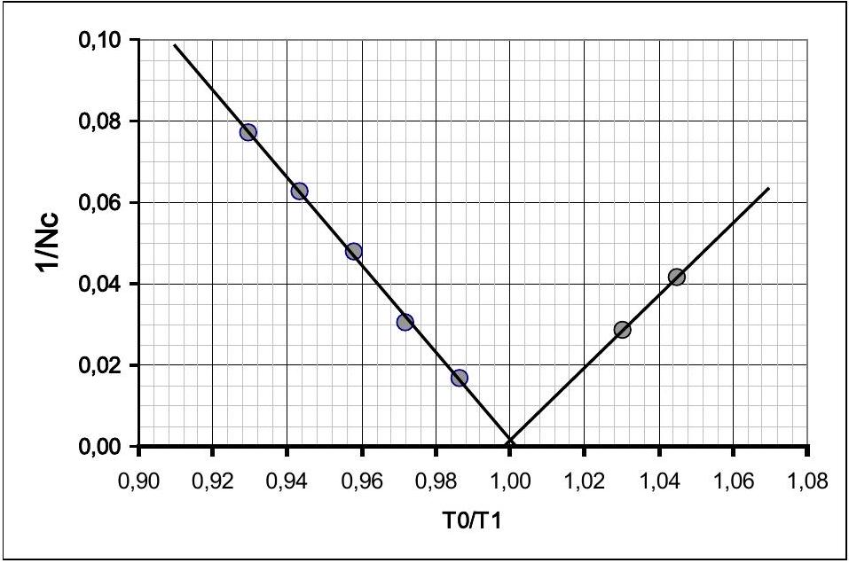
Этот график, а также сравнение рассчитанных и измеренный значений $N _ { C }$, подтверждают теоретические выводы. This graph, as well as a comparison of the calculated and measured $N _ { C }$ values, corroborates the theoretical conclusions.

|  | Content | Points | Total |
| :--- | :--- | :--- | :--- |
| Part 1. Observation of the effect and its theoretical description |  |  |  |
| 1.1 | The addition of vibrations is obtained (there is at least one plausible picture) | 0,2 | 1,0 |
|  | 4 drawings: two close to the segment, two ovals indicating the direction of motion | $4 \times 0,2 = 0,8$ |  |
| 1.2 | Expressions for coordinates on a plane through deflection angles | $2 \times 0,2 = 0,4$ | 0,8 |
|  | Explicit time dependencies | $2 \times 0,1 = 0,2$ |  |
|  | Small angle approximation | 0,2 |  |

| 1.3 | The main idea is the change in phase difference, formula (7); (if the beat period) | 0,5 $( 0,2 )$ | 1,3 |
| :--- | :--- | :--- | :--- |
|  | Formula (8) for the cycle time | 0,5 |  |
|  | The module is placed in formula (8) | 0,3 |  |
| 1.4 | $N _ { C } = \frac { T _ { 1 } } { \left\| T _ { 0 } - T _ { 1 } \right\| }$. | 0,4 | 0,4 |
| Part 2. Longitudinal oscillations |  |  |  |
|  | Graded if the numerical value of the oscillation period is estimated |  |  |
| 2.1 | The obtained period value is in the range of $1.3 - 1.5 \mathrm {~s}$ | 0,4 | 2,0 |
|  | Measurement error less than 1\% (graded if the error is estimated) | 0,1 |  |
|  | At least 5 measurements of time N oscillations were carried out (3, less) | 0,3 (0,1;0) |  |
|  | Number of oscillations N not less than 10 (5; less) | 0,2 (0,1;0) |  |
|  | Averaging over all measurements are carried out | 0,1 |  |
|  | Random error calculated (averaging of deviation modules, standard deviation - acceptable) | 0,2 |  |
|  | Instrument error (half or division value) | 0,2 |  |
|  | The total error is calculated (the value is acceptable) | 0,2 |  |
|  | Correct rounding (error - 1-2 digits, result - up to the error digit) | 0,2 |  |
|  | The dimension of the result is indicated | 0,1 |  |
| Part 3. Torsional oscillations |  |  |  |
|  | Graded if the measurement results are graded! |  |  |
| 3.1 | If the nuts are not located at the ends of the rod, the grades are divided by factor 2. |  | 2,5 |
|  | For each measurement 0.15 (in total no more than 1.5; falling within the 20\% range if the time of less than 10 oscillations is measured, 0.1 per measurement) | $0,15 \times 10 = 1,5$ |  |
|  | The lower limit of the range is no more than 5.0 cm | 0,2 |  |
|  | The upper limit of the range is not less than 15.0 cm | 0,2 |  |
|  | A nonlinear dependence close to hyperbolic is obtained | 0,1 |  |
|  | Plotting a graph (the axes are labeled and digitized, all points are plotted in accordance with the table, a smoothing curve is drawn) | 0,1+0,2+0,2= $= 0,5$ |  |
| 3.2 | Graded if the degree is -1, the measurement results are graded |  | 1,5 |
|  | The obtained value is $q = - 1$ | 0,5 |  |
|  | Linearization is carried out on a double logarithmic scale (calculations are provided) (reciprocals, with proof of passing through zero); | 0,5 (0,2+0,2) |  |
|  | A graph of the linearized dependence is plotted (the axes are labeled and digitized, all points are plotted in accordance with the table, a smoothing line is drawn) | 0,1+0,2+0,2= $= 0,5$ |  |
| 3.3 | If the distance between the threads is different from 10 cm, the grades are divided by factor 2 |  | 2,5 |
|  | For each measurement 0.15 (in total no more than 1.5; falling within the 20\% range if the time of less than 10 oscillations is measured, 0.1 per measurement) | $0,15 \times 10 = 1,5$ |  |
|  | The lower limit of the range is no more than 6.5 cm | 0,2 |  |
|  | The upper limit of the range is not less than 14.0 cm | 0,2 |  |
|  | A nonlinear downward convexity dependence is obtained | 0,1 |  |
|  | A graph of the linearized dependence is plotted (the axes are labeled and digitized, all points are plotted in accordance with the table, a smoothing line is drawn) | 0,1+0,2+0,2= $= 0,5$ |  |
| 3.4 | Linearization is carried out (the squares of periods and distances are calculated) | 0,3 | 1,0 |

|  | A graph of linearized dependence is plotted (the axes are labeled and digitized, all points are plotted in accordance with the table, a smoothing line is drawn) | 0,1+0,2+0,2= $= 0,5$ |  |
| :--- | :--- | :--- | :--- |
|  | Straight line is obtained | 0,2 |  |
| 3.5 | Grades if 3.3-3.4 are graded |  | 1   1 |
|  | Numerical values of the coefficients are obtained (in the range of 20\%, the dimension -0.1 is not indicated) | $2 \times 0,4 = 0,8$ |  |
|  | Errors of coefficients are calculated | $2 \times 0,1 = 0,2$ |  |
|  | Calculation using LSM coefficient 1; graphically, averaging over all points - 0.8; at two points - 0.5; |  |  |
| Part 4. Mixed oscillations |  |  |  |
|  | Graded if measurement results are graded |  |  |
| 4.1 | For each measurement 0.2 (total no more than 2.0; within 30\% range) | $0,2 \times 10 = 2,0$ | 4 |
|  | There are two dependency branches (at least 2 points on each) | 1,0 |  |
|  | The lower limit of the range is no more than 11 cm | 0,2 |  |
|  | The upper limit of the range is at least 15 cm | 0,2 |  |
|  | The number obtained $\mathrm { N } > 50$ | 0,3 |  |
|  | Sharp increase (steeper than linear) | 0,1 |  |
|  | There is an "unmeasured" area in the middle of the range | 0,2 |  |
| 4.2 | The periods are calculated (range - 20\%) at 0.05 for each point, at least 3 decimal places) | $0,05 \times 10 = 0,5$ | 0,5 |
| 4.3 | Linearization is proposed (the reciprocal of the number of oscillations from the ratio of periods, the difference of periods); A theoretical calculation of the number of oscillations are carried out and a comparison with experimental results is made. | 0,5 | 1,5 |
|  | The linearized dependence is calculated | 0,2 |  |
|  | A graph of linearized dependence is plotted A graph of measurement results is plotted | 0,4 0,2 |  |
|  | A graph similar to the graph of the modulus number function is obtained | 0,3 |  |
|  | Correct position of the minimum on the graph | 0,1 |  |
|  | TOTAL |  | 20,0 |

## ТӘЖІРИБЕЛІК САЙЫСТЫН ЕСЕПТЕРІНІҢ ШЕШИМІ Тербелістердің суперпозициясы

Тәжірибеде қарастырылған аз бұрыштар жуықтауындағы маятниктің кума және айналмалы тербелістері оның меншікті тербелістері (модалары) болып табылады, сондықтан оларды бір-бірінен тәуелсіз қарастырудың мүмкіндігі бар.

Аз бұрыштар жуықтауында бұл тербелістердің периоды мынадай өрнектермен анықталады

$$
\begin{align*}
& T _ { 0 } = 2 \pi \sqrt { \frac { L } { g } } ,  \tag{1}\\
& T _ { 1 } = 2 \pi \sqrt { \frac { 4 L I } { m g a ^ { 2 } } } , \tag{2}
\end{align*}
$$

мұндағы $m = m _ { 0 } + 2 m _ { 1 }$-маятник массасы, $m _ { 0 }$-стержень массасы, $m _ { 1 }$-гайка массасы, $I = \frac { m _ { 0 } l ^ { 2 } } { 12 } +$ $2 m _ { 1 } z ^ { 2 }$ - стержень мен гайканың инерция моменті.

Жоғарыдағы (1) және (2) өрнектері жұмыста пайдаланылады, бірақ оларды қортып шығарып қажет емес және ол бағаланбайды.

## 1 бөлім. Кұбылысты бақлау және оны сапалық тұрғыдан сипаттау

1.1 Стерженьнің ұшы жиіліктері бір біріне жақын, өзара перпендикуляр тербелістерді қосуға сәйкес келетін траекторияны сызады. Оларды сонымен қатар жиіліктері бірдей,бірақ фазалар айырымы баяу өзгеретін тербелістердің қосындысы түрінде де қарастыруға болады. Оларға тән траектория төмендегі суретте келтірілген.
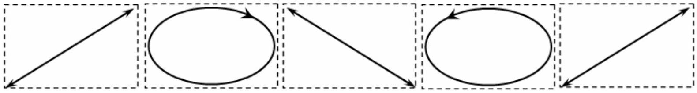
1.2 Геометрияны ескерсек, стерженнің горизонталь координаттары мына өрнектермен сипатталады:

$$
\left\{ \begin{array} { c }
x = L \sin \alpha + \frac { l } { 2 } \cos \beta  \tag{3}\\
y = \frac { l } { 2 } \sin \beta
\end{array} . \right.
$$

Аз бұрыштар жуықтауында $\alpha , \beta \ll 1$, онда

$$
\left\{ \begin{array} { c }
x \approx L \alpha + \frac { l } { 2 }  \tag{4}\\
y \approx \frac { l } { 2 } \beta
\end{array} \right.
$$

Жоғарыдағы $\alpha , \beta$ бұрыштары жиіліктері сәйкес $\omega _ { 0 } = 2 \pi / T _ { 0 }$ және $\omega _ { 1 } = 2 \pi / T _ { 1 }$ бола отырып гармониялық заңдылықпен өзгеретін болғандықтан стержень ұшының траекториясының теңдеуі

$$
\left\{ \begin{array} { c }
x ( t ) = L \alpha _ { \max } \cos \omega _ { 0 } t + \frac { l } { 2 }  \tag{5}\\
y ( t ) = \frac { l } { 2 } \beta _ { \max } \sin \omega _ { 1 } t
\end{array} \right.
$$

Оны бір біріне жақын жиіліктер үшін мына түрде жазу ыңғайлы

$$
\left\{ \begin{array} { c }
x ( t ) = L \alpha _ { \max } \cos \omega _ { 0 } t + \frac { l } { 2 }  \tag{6}\\
y ( t ) = \frac { l } { 2 } \beta _ { \max } \sin \left( \omega _ { 0 } t + \left( \omega _ { 1 } - \omega _ { 0 } \right) t \right)
\end{array} . \right.
$$

Жоғарыдағы $y ( t )$ үшін өрнектегі $\Delta \varphi = \left( \omega _ { 1 } - \omega _ { 0 } \right) t$ шамасын жиіліктері бір біріне жақын тербелістегі баяу өзгеретін фазалар айырымы ретінде қарастыруға болады.
1.3 Траекторияның түрі өзінің бастапқы қалыпына фазалар айырымы $\pm 2 \pi$ ға өзгергенде қайта келетіні айқын. Осымен байланысты $T _ { C }$ циклдің периоды мына шартты қанағаттандырады

$$
\begin{equation*}
\left( \omega _ { 1 } - \omega _ { 0 } \right) T _ { C } = \pm 2 \pi , \tag{7}
\end{equation*}
$$

бұдан

$$
\begin{equation*}
T _ { C } = \frac { T _ { 0 } T _ { 1 } } { \left| T _ { 0 } - T _ { 1 } \right| } . \tag{8}
\end{equation*}
$$

1.4 Циклдағы кума тербелістердің санын мына түрде жазуға болады

$$
\begin{equation*}
N _ { C } = \frac { T _ { C } } { T _ { 0 } } = \frac { T _ { 1 } } { \left| T _ { 0 } - T _ { 1 } \right| } . \tag{9}
\end{equation*}
$$

## 2 бөлім. Қума тербелістер.

2.1 Өлшеудің дәлдігін арттыру үшін тербелістердің саны жеткілікті болуы шарт. Біздің өлшеулерімізде 20 тербелістің $t _ { 20 }$ уақыты өлшенген. Кездейсоқтқателерді бағалау .шін өлшеу 10 рет қайталанған. Тәжірибе нәтижесі төмендегі 1 кестеде келтірілген.

Кесте 1. Кума тербелістердің периодын өлшеу.
| $n$ | $t _ { 20 } , c$ |  |
| :--- | :--- | :--- |
| 1 | 26,39 | 20 тербелістің орташа уақыты $\left\langle t _ { 20 } \right\rangle = 26.41 \mathrm { c }$, Ал қондырғының қателігі секундомердің бөлік құнының жартысына тең $\Delta t _ { 1 } = 0.5 \cdot 10 ^ { - 3 } \mathrm { c }$. Кездейсоқ қателіктер мына өрнекпен есептелінеді Освин (этонкрержным названиющий $\Delta t _ { 2 } = 2 \sqrt { \frac { \sum _ { i = 1 } ^ { 10 } \left( t _ { 20 , i } - \left\langle t _ { 20 } \right\rangle \right) ^ { 2 } } { n ( n - 1 ) } } = 6.5 \cdot 10 ^ { - 2 } \mathrm { c }$. |
| 2 | 26,32 |  |
| 3 | 26,51 |  |
| 4 | 26,40 |  |
| 5 | 26,46 |  |
| 6 | 26,41 |  |
| 7 | 26,34 |  |
| 8 | 26,22 |  |
| 9 | 26,55 |  |
| 10 | 26,53 |  |

Сонымен, кума тербелістердің периоды

$$
\begin{equation*}
T _ { 0 } = \frac { t _ { 20 } } { 20 } = ( 1.321 \pm 0.003 ) \mathrm { c } \tag{10}
\end{equation*}
$$

## 3 бөлім. Айналмалы тербелістер.

3.1 Төмендегі 2 кестеде жіптердің арасындағы $a$ ара қашықтықтың әртүрлі мәндеріндегі айналмалы тербелістің периодын өлшеудің нәтижелері келтірілген. Сонымен қатар осы кестеде $q$ дәреже көрсеткішін анықтауға қажетті есептеулер келтірілген.

Таблица 2. Айналмалы тербелістің периодының жіптердің ара қашықтығынан тәуелділігі
| $a$, см | $t _ { 10 } , \mathrm { c }$ | $T _ { 1 } , \mathrm { c }$ | $\ln a$ | $\ln T _ { 1 }$ |
| :--- | :--- | :--- | :--- | :--- |
| 4,8 | 59,11 | 5,911 | 1,5686 | 1,7768 |
| 6,3 | 44,62 | 4,462 | 1,8405 | 1,4956 |
| 7,8 | 36,31 | 3,631 | 2,0541 | 1,2895 |
| 9,4 | 29,66 | 2,966 | 2,2407 | 1,0872 |
| 11,0 | 25,60 | 2,560 | 2,3979 | 0,9400 |
| 12,2 | 23,32 | 2,332 | 2,5014 | 0,8467 |
| 13,8 | 20,46 | 2,046 | 2,6247 | 0,7159 |
| 16,0 | 17,66 | 1,766 | 2,7726 | 0,5687 |
| 18,2 | 15,82 | 1,582 | 2,9014 | 0,4587 |
| 20,5 | 13,87 | 1,387 | 3,0204 | 0,3271 |
| 24,0 | 11,98 | 1,198 | 3,1781 | 0,1807 |

Сәйкес тәуелділіктің графигі

3.2 Дәреже көрсеткішін анықтаудың ең оңтайлы, әрі кең тараған әдісі графикті қос логарифмдік масштабта тұрғызу. Жоғарыдағы (1) өрнектен

$$
\begin{equation*}
\ln T = C + q \ln a , \tag{11}
\end{equation*}
$$

Сондықтан графиктің еңкіштік коэффициенті дәреже көрсеткішіне тең. Бұл график төмендегі суретте келтірілген
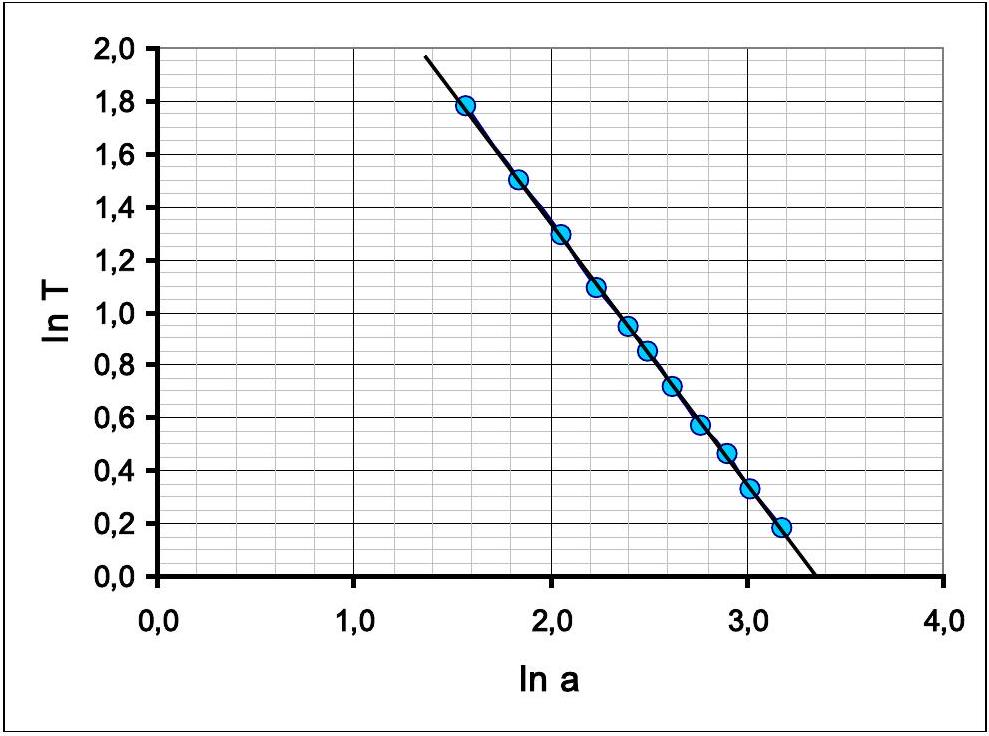

Алынған нәтиже еңкіштігі (-1) ге өте жақын сызықтық тәуелділік. Мұның баламалы әдісі $T _ { 1 } \left( a ^ { - 1 } \right)$, немесе $T _ { 1 } ^ { - 1 } ( a )$ тәуелділігін тұрғызу болып табылады. Бірақ бұл әдісте графиктің түзу сызық екенін және координаттың бас нүктесі арқылы өтетінін дәлелдеу қажет.

Бұл әдістердің бәрі іздестіріп отырған дәреже көрсеткіші (-1) екенін, яғни айналмалы тербелістің периоды жіптердің ара қашықтығына кері пропорциональ екенін көрсетеді.
3.3 Айналмалы қозғалыстың периодының гайкалардың орынынан тәуелділігін өлшеудің нәтижелер 3 кестеде келтірілген. Осы кестеде линеаризацияланған графикті тұрғызуға қажетті есептеулердің нәтижелері де келтірілген.

3 кесте. Айналмалы тербелістің периодын өлшеу.

| $z , \mathrm {~cm}$ | $t _ { 20 } , c$ | $T _ { 1 , \mathrm { c } }$ | $z ^ { 2 }$ | $T _ { 1 } ^ { 2 }$ | $U$ |
| :--- | :--- | :--- | :--- | :--- | :--- |
| 6 | 44,58 | 2,229 | 36 | 4,968 | 284,9 |
| 7 | 45,75 | 2,288 | 49 | 5,233 | 300,0 |
| 8 | 46,83 | 2,342 | 64 | 5,483 | 314,3 |
| 9 | 47,87 | 2,394 | 81 | 5,729 | 328,5 |
| 10 | 49,17 | 2,459 | 100 | 6,044 | 346,5 |

| 11 | 50,84 | 2,542 | 121 | 6,462 | 370,5 |
| :--- | :--- | :--- | :--- | :--- | :--- |
| 12 | 52,15 | 2,608 | 144 | 6,799 | 389,8 |
| 13 | 53,47 | 2,674 | 169 | 7,148 | 409,8 |
| 14 | 54,85 | 2,743 | 196 | 7,521 | 431,2 |
| 15 | 56,91 | 2,846 | 225 | 8,097 | 464,2 |

Бұл тәуелділіктің графигі төмендегі суретте келтірілген. Одан тәуелділіктің сызықтық екені көрініп тұр.
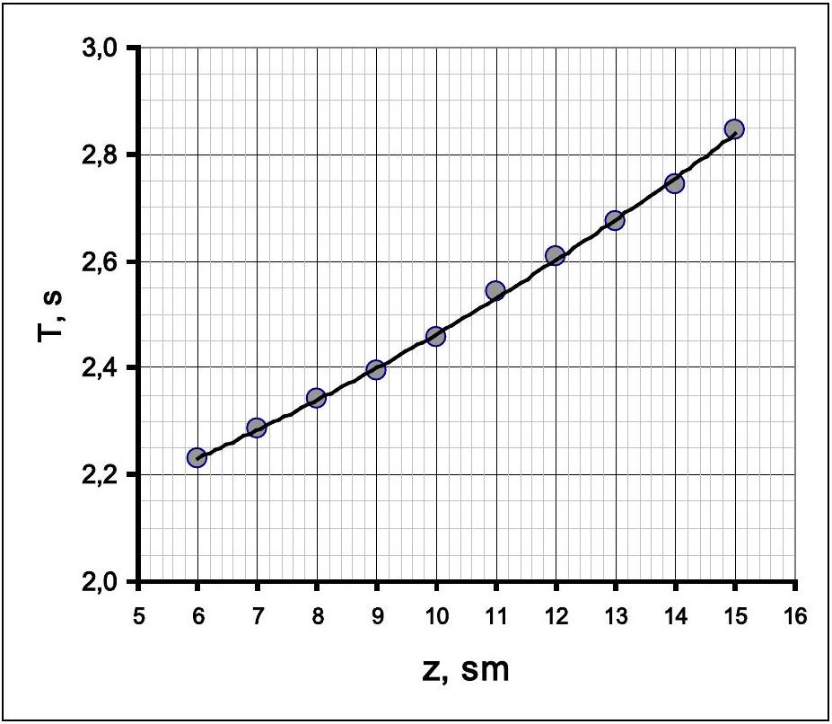
3.4 Есептің шартындағы (1)-(2) өрнектерден және жоғарыдағы пункттің нәтижесінен айнелмалы тербелістің периоды мына өрнекпен сипатталатыны шығады

$$
\begin{equation*}
\frac { T _ { 1 } } { T _ { 0 } } = \frac { \sqrt { A + B z ^ { 2 } } } { a } , \tag{12}
\end{equation*}
$$

Оны мына түрде линеаризациялайды

$$
\begin{equation*}
\left( a \frac { T _ { 1 } } { T _ { 0 } } \right) ^ { 2 } = A + B z ^ { 2 } . \tag{13}
\end{equation*}
$$

Яғни $U = \left( a \frac { T _ { 1 } } { T _ { 0 } } \right) ^ { 2 }$ шамасы $z ^ { 2 }$-тан сызықтық тәуелді, олай болса оның графигі төмендегідей
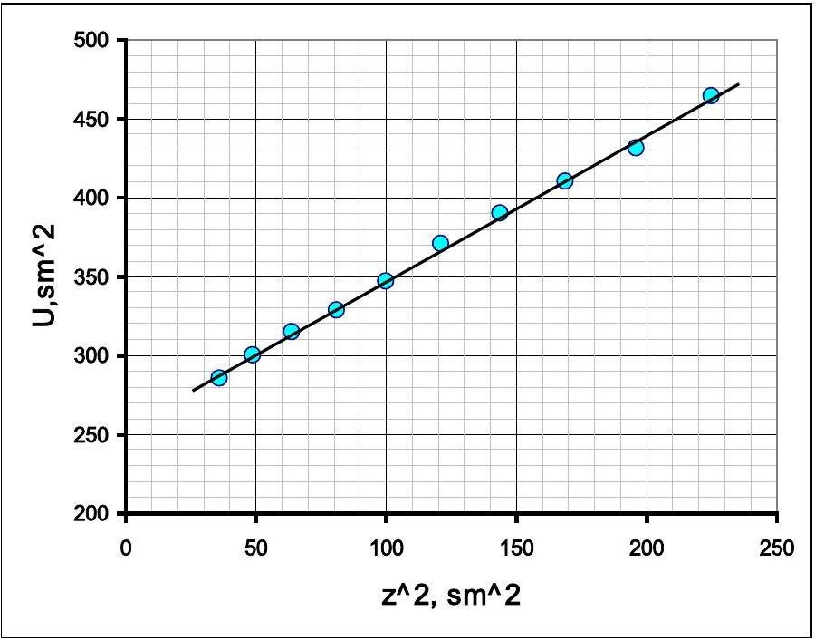
3.5 Оның ең аз квадраттар әдісімен есептелген коэффициенттері мынадай

$$
\begin{align*}
& A = ( 254 \pm 4 ) \mathrm { cm } ^ { 2 } ,  \tag{14}\\
& B = 0.93 \pm 0.03 . \tag{15}
\end{align*}
$$

4 бөлім. Аралас тербелістер.

4.1, 4.2 Төмендегі 4 кестеде (9) теориялық өрнекті тексеруге өажетті есептеулердің нәтижелері келтірілген

Кесте 4. Аралас тербелісті зерттеу.
| $z , \mathrm {~cm}$ | $T _ { 1 } , \mathrm { c }$ | $\frac { T _ { 0 } } { T _ { 1 } }$ | $N _ { C }$ (теор.) | $N _ { C }$ (эксп) | $\frac { 1 } { N _ { C } }$ |
| :--- | :--- | :--- | :--- | :--- | :--- |
| 10,5 | 1,247 | 1,059 | 17 |  |  |
| 11,0 | 1,264 | 1,045 | 22 | 24 | 0,042 |
| 11,5 | 1,282 | 1,030 | 33 | 35 | 0,029 |
| 12,0 | 1,301 | 1,015 | 65 |  |  |
| 12,5 | 1,319 | 1,002 | 660 |  |  |
| 13,0 | 1,339 | 0,987 | 74 | 60 | 0,017 |
| 13,5 | 1,359 | 0,972 | 36 | 33 | 0,030 |
| 14,0 | 1,379 | 0,958 | 24 | 21 | 0,048 |
| 14,5 | 1,400 | 0,944 | 18 | 16 | 0,063 |
| 15,0 | 1,421 | 0,930 | 14 | 13 | 0,077 |

Бұл кестедегі : $T _ { 1 }$ - айналмалы тербелістің (12) өрнекпен есептелген периоды; $N _ { C }$ - циклдағы периодтар санының өлшенген және есептелген мәндері.
4.3 Жоғарыдағы (9) өрнегін тексеру үшін $\frac { 1 } { N _ { C } }$ шамасының $\frac { T _ { 0 } } { T _ { 1 } }$ шамасынан тәуелділігінің графигі тұрғызылған. Ол теориялық тұрғыдан $\frac { 1 } { N _ { C } } = \left| \frac { T _ { 0 } } { T _ { 1 } } - 1 \right|$ өрнегімен сипатталады. Бұл тәуелділіктің тәжірибелңк нәтижелер бойынша тұрғызылған тәуелділігі төмендегі суретте келтірілген.
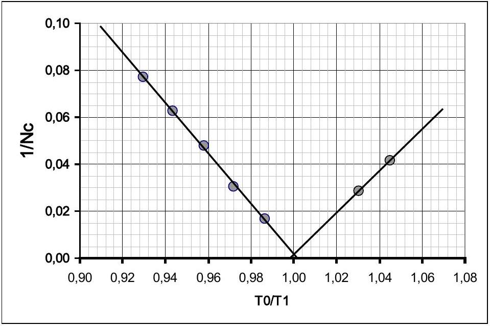
Осы график және $N _ { C }$ шамасының есептелген және өлшенген нәтижелері теориялық қортындылардың дұрыс екенін көрсетеді.

|  | Мазмұны | Ұпайы | Барлығы |
| :--- | :--- | :--- | :--- |
| 1 бөлім. Құбылысты бақлау және оның теориялық сипаттамасы |  |  |  |
| 1.1 | Тербелістер дұрыс қосылған (кем дегенде бір сурет дұрыс) | 0,2 | 1,0 |
|  | 4 сурет: екі кесінді суреті, қозғалыс бағыты дұрыс көрсетілген екі эллипс 4x0,2 | $4 \times 0,2 = 0,8$ |  |
| 1.2 | Ауытку бұрышы арқылы анықталған координат өрнегі | $2 \times 0,2 = 0,4$ | 0,8 |
|  | Уақыттан айқын тәуелділік | $2 \times 0,1 = 0,2$ |  |
|  | Аз бұрыштар жуықтауы | 0,2 |  |
| 1.3 | Негізгі идея - фазалар айырымының өзгерісі, (7) өрнек; (егер согу периоды болса) | 0,5 $( 0,2 )$ | 1,3 |

|  | Цикл уақытының өрнегі (8) | 0,5 |  |
| :--- | :--- | :--- | :--- |
|  | (8) өрнекте модуль белгіленген | 0,3 |  |
| 1.4 | $N _ { C } = \frac { T _ { 1 } } { \left\| T _ { 0 } - T _ { 1 } \right\| }$. | 0,4 | 0,4 |
| 2 бөлім. Кума тербелістер |  |  |  |
|  | Тербеліс периодының сандық мәні анықталган болса багаланады |  |  |
| 2.1 | Периодтың мәні 1,3 - 1,5 с диапозонында анықталған | 0,4 | 2,0 |
|  | Өлшеудің қателігі 1\%-тен кіші (егер қุателік анықталган болса) | 0,1 |  |
|  | N тербелістің уақыты 5 реттен кем емес өлшенген (3-тен кем) | 0,3 (0,1;0) |  |
|  | N тербелістің уақыты 10 реттен кем емес (5-тен кем) | 0,2 (0,1;0) |  |
|  | Барлық өлшеулердің орташа мәні табылған | 0,1 |  |
|  | Кездейсоқ қателік есептелген | 0,2 |  |
|  | Қондырғының қателігі | 0,2 |  |
|  | Толық қателік есептелген | 0,2 |  |
|  | Дұрыс жуықтау (Қателік - 1-2 цифр, нәтиже - қателіктің разрядына лейін) | 0,2 |  |
|  | Нәтиженің өлшем бірлігі | 0,1 |  |
| 3 бөлім. Айналмалы тербеліс |  |  |  |
| Өлшеу нәтижесі анықталган болса багаланады! |  |  |  |
| 3.1 | Егер гайка стерженнің ұшында орналасқан болмаса нәтиже 2ге кемітіледі. |  | 2,5 |
|  | Әрбір өлшеу 0,15 (егер 10 тербелістен аз болса, онда әр өлшеу ушін 0,1) | $0,15 \times 10 = 1,5$ |  |
|  | Диапазонның төменгі шегі 5,0 см ден көп емес | 0,2 |  |
|  | Диапазонның жоғарғы шегі 15,0 см дан кем емес | 0,2 |  |
|  | Гиперболаға ұқсас сызықтық емес тәуелділік алынған | 0,1 |  |
|  | Графиктің салынуы (остер жазылган және саналган; нуктелер салынган. Жатық қисық тұреызылган) | 0, 1+0,2+0,2= $= 0,5$ |  |
| 3.2 | Егер дәреже -1 болса багаланады |  | 1,5 |
|  | Алынған нәтиже $\boldsymbol { q } = - \mathbf { 1 }$ | 0,5 |  |
|  | Қос логарифмдің масштабта линеаризация жасалған (кері шама, нөлден өту дәлелімен) | 0,5 (0,2+0,2) |  |
|  | Линеризацияланған тәуелділіктің графигі тұрғызылған (остер жазылган және саналган; нүктелер салынган. Жатық қисық тұръызылzaн) | $0,1 + 0,2 + 0,2 = = 0,5$ |  |
| 3.3 | Егер жіптердің ара қашықтывы 10 см ден өзгеше болса бага екі есе кемиді |  | 2,5 |
|  | Әрбір өлшеу 0,15 (егер 10 тербелістен аз болса, онда әр өлшеу ушін 0,1) | $0,15 \times 10 = 1,5$ |  |
|  | Диапазонның төменгі шегі 6,5 см дан артық емес | 0,2 |  |
|  | Диапазонның жоғарғы шегі 14,0 см дан кіші емес | 0,2 |  |
|  | Деңестігі төмен бағытталған сызықтық емес тәуелділік | 0,1 |  |
|  | График тұрғызылған (остер жазылеан және саналган; нуктелер салынган. Жатық қисық тұрдызылган) | 0,1+0,2+0,2= $= 0,5$ |  |
| 3.4 | Линеаризация жасалған (периодтар мен ара қашықтықтың квадраттары есептелген) | 0,3 | 1,0 |
|  | Линеаризацияланған тәуелділіктің графигі тұрғызылғын | 0,1+0,2+0,2= $= 0,5$ |  |
|  | Түзу сызық алынған | 0,2 |  |

| 3.5 | Егер 3.3-3.4 пунктmері багаланса |  | 1 |
| :--- | :--- | :--- | :--- |
|  | Коэффициенттердің сандық мәні алынған | $2 \times 0,4 = 0,8$ |  |
|  | Коэффициенттердің қателігі есептелген | $2 \times 0,1 = 0,2$ |  |
|  | Ең аз квадраттар дәісі болса, коэффициент 1; Барлық нүктелер бойынша орташаланган график әдісі - 0,8; Екі нүкте бойынша - 0,5; |  |  |
| Часть 4. Аралас тербелістер |  |  |  |
| Өлшеу нәтижесі анықталган болса багаланады |  |  |  |
| 4.1 | Әр өлшеу үшін 0,2 | $0,2 \times 10 = 2,0$ | 4 |
|  | Тәуелділіктің екі тармағы бар (әрқайсысында екі нүктеден кем емес) | 1,0 |  |
|  | Диапазонның төменгі шегі 11 см ден артық емес | 0,2 |  |
|  | Диапазонның жоғарғы шегі 15 см ден кем емес | 0,2 |  |
|  | Алынған сан N>50 | 0,3 |  |
|  | Күрт арту (сызықтықтан артық) | 0,1 |  |
|  | Диапазонның ортасында «өлшенбейтін» аймақ бар | 0,2 |  |
| 4.2 | Период есептелген (диапазон - 20\%) әр нүкте үшін 0,05, үтірден соң 3 цифр ) | $0,05 \times 10 = 0,5$ | 0,5 |
| 4.3 | Линеаризация ұсынылған (периодтар қатынасы мен тербеліс санының кері шамалары, периодтар айырымы); Тербеліс саны теориялық тұръыдан есептелген, тәжірибемен салыстырылzaн | 0,5 | 1,5 |
|  | Линеаризацияланған тәуелділікке есептеулер жасалған | 0,2 |  |
|  | Линеаризацияланған тәуелділіктің графигі тұрғызылған | 0,4 |  |
|  | Өлиеу нәтижелерінің графигі тұрдызылzaн | 0,2 |  |
|  | Сан модулінің функциясының графигіне ұқсас график алынған | 0,3 |  |
|  | График минимумының дұрыс орыны | 0,1 |  |
|  | БАРЛЫҒЫ |  | 20,0 |

## РЕШЕНИЕ ЗАДАЧИ ЭКСПЕРИМЕНТАЛЬНОГО ТУРА Суперпозиция колебаний

Описанные в эксперименте продольные и крутильный колебания маятника в приближении малых углов являются его собственными колебаниями (модами), поэтому их можно рассматривать независимо друг от друга.

В приближении малых углов периоды этих колебаний даются формулами

$$
\begin{align*}
& T _ { 0 } = 2 \pi \sqrt { \frac { L } { g } } ,  \tag{1}\\
& T _ { 1 } = 2 \pi \sqrt { \frac { 4 L I } { m g a ^ { 2 } } } , \tag{2}
\end{align*}
$$

где $m = m _ { 0 } + 2 m _ { 1 }$ - масса маятника, $m _ { 0 }$ - масса стержня, $m _ { 1 }$ - масса гайки, $I = \frac { m _ { 0 } l ^ { 2 } } { 12 } + 2 m _ { 1 } z ^ { 2 } -$ момент инерции стержня с гайками.

Формулы (1) и (2) фактически используются в работе, но вывод их не требуется и в дальнейшем не оценивается.

## Часть 1. Наблюдение эффекта и его качественное описание.

1.1 Конец стержня описывает траектории, соответствующие сложению перпендикулярных колебаний с близкими частотами. Их также можно представить, как сложение колебаний с равными частотами, но с медленно изменяющейся разностью фаз между ними. Изображения этих наиболее типичных траекторий показаны на рисунке ниже.
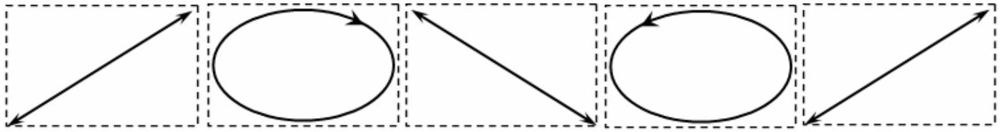
1.2 Из геометрии следует, что горизонтальные координаты конца стержня описываются формулами:

$$
\left\{ \begin{array} { c }
x = L \sin \alpha + \frac { l } { 2 } \cos \beta  \tag{3}\\
y = \frac { l } { 2 } \sin \beta
\end{array} . \right.
$$

В приближении малых углов $\alpha , \beta \ll 1$ имеем

$$
\left\{ \begin{array} { c }
x \approx L \alpha + \frac { l } { 2 }  \tag{4}\\
y \approx \frac { l } { 2 } \beta
\end{array} \right.
$$

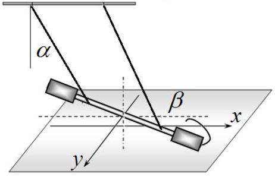
Так как углы $\alpha , \beta$ изменяются по гармоническому закону с частотами $\omega _ { 0 } = 2 \pi / T _ { 0 }$ и $\omega _ { 1 } =$ $2 \pi / T _ { 1 }$ соответственно, то уравнение траектории конца стержня имеет вид

$$
\left\{ \begin{array} { c }
x ( t ) = L \alpha _ { \max } \cos \omega _ { 0 } t + \frac { l } { 2 }  \tag{5}\\
y ( t ) = \frac { l } { 2 } \beta _ { \max } \sin \omega _ { 1 } t
\end{array} \right.
$$

которые для близких частот удобно переписать в виде

$$
\left\{ \begin{array} { c }
x ( t ) = L \alpha _ { \max } \cos \omega _ { 0 } t + \frac { l } { 2 }  \tag{6}\\
y ( t ) = \frac { l } { 2 } \beta _ { \max } \sin \left( \omega _ { 0 } t + \left( \omega _ { 1 } - \omega _ { 0 } \right) t \right)
\end{array} . \right.
$$

В выражении $y ( t )$ для близких частот величину $\Delta \varphi = \left( \omega _ { 1 } - \omega _ { 0 } \right) t$ можно рассматривать как медленно изменяющуюся разность фаз между колебаниями с близкими частотами.
1.3 Очевидно, что форма траектории возвратится к начальной, если разность фаз изменится на величину $\pm 2 \pi$. Таким образом, период цикла $T _ { C }$ подчиняется условию

$$
\begin{equation*}
\left( \omega _ { 1 } - \omega _ { 0 } \right) T _ { C } = \pm 2 \pi , \tag{7}
\end{equation*}
$$

откуда следует

$$
\begin{equation*}
T _ { C } = \frac { T _ { 0 } T _ { 1 } } { \left| T _ { 0 } - T _ { 1 } \right| } . \tag{8}
\end{equation*}
$$

1.4 Число колебаний продольных колебаний в цикле можно записать в виде

$$
\begin{equation*}
N _ { C } = \frac { T _ { C } } { T _ { 0 } } = \frac { T _ { 1 } } { \left| T _ { 0 } - T _ { 1 } \right| } . \tag{9}
\end{equation*}
$$

## Часть 2. Продольные колебания.

2.1 Для повышения точности измерения нужно проводить измерения времен достаточно большого числа колебаний, в наших экспериментах проведены измерения времени 20 периодов колебаний $t _ { 20 }$. Для оценки случайной погрешности эти измерения проведены 10 раз, а их результаты приведены в таблице 1.

Таблица 1. Измерение периода продольных колебаний.
| $n$ | $t _ { 20 } , c$ |  |
| :--- | :--- | :--- |
| 1 | 26,39 | Среднее значение времени 20 колебаний составляет $\left\langle t _ { 20 } \right\rangle = 26.41 \mathrm { c }$, а приборная погрешность равна половине цены деления секундомера $\Delta t _ { 1 } = 0.5 \cdot 10 ^ { - 3 }$ с. Случайная погрешность рассчитывается по формуле Случанки погрешнось раслитывает по формуле $\Delta t _ { 2 } = 2 \sqrt { \frac { \sum _ { i = 1 } ^ { 10 } \left( t _ { 20 , i } - \left\langle t _ { 20 } \right\rangle \right) ^ { 2 } } { n ( n - 1 ) } } = 6.5 \cdot 10 ^ { - 2 } \mathrm { c }$. Полная погрешность измерения времени равна $\Delta t = \sqrt { \Delta t _ { 1 } ^ { 2 } + \Delta t _ { 2 } ^ { 2 } } = 0.066 \mathrm { c }$. |
| 2 | 26,32 |  |
| 3 | 26,51 |  |
| 4 | 26,40 |  |
| 5 | 26,46 |  |
| 6 | 26,41 |  |
| 7 | 26,34 |  |
| 8 | 26,22 |  |
| 9 | 26,55 |  |
| 10 | 26,53 |  |

Таким образом, период продольных колебаний равен

$$
\begin{equation*}
T _ { 0 } = \frac { t _ { 20 } } { 20 } = ( 1.321 \pm 0.003 ) \mathrm { c } . \tag{10}
\end{equation*}
$$

## Часть 3. Крутильные колебания.

3.1 В таблице 2 приведены значения результатов измерений периодов крутильных колебаний при различных значениях расстояния между нитями $a$. В этой же таблице приведены результаты расчетов для определения показателя степени $q$.

Таблица 2. Зависимость периода крутильных колебаний от расстояния между нитями.
| $a , \mathrm {~cm}$ | $t _ { 10 } , \mathrm { c }$ | $T _ { 1 } , \mathrm { c }$ | $\ln a$ | $\ln T _ { 1 }$ |
| :--- | :--- | :--- | :--- | :--- |
| 4,8 | 59,11 | 5,911 | 1,5686 | 1,7768 |
| 6,3 | 44,62 | 4,462 | 1,8405 | 1,4956 |
| 7,8 | 36,31 | 3,631 | 2,0541 | 1,2895 |
| 9,4 | 29,66 | 2,966 | 2,2407 | 1,0872 |
| 11,0 | 25,60 | 2,560 | 2,3979 | 0,9400 |
| 12,2 | 23,32 | 2,332 | 2,5014 | 0,8467 |
| 13,8 | 20,46 | 2,046 | 2,6247 | 0,7159 |
| 16,0 | 17,66 | 1,766 | 2,7726 | 0,5687 |
| 18,2 | 15,82 | 1,582 | 2,9014 | 0,4587 |
| 20,5 | 13,87 | 1,387 | 3,0204 | 0,3271 |
| 24,0 | 11,98 | 1,198 | 3,1781 | 0,1807 |

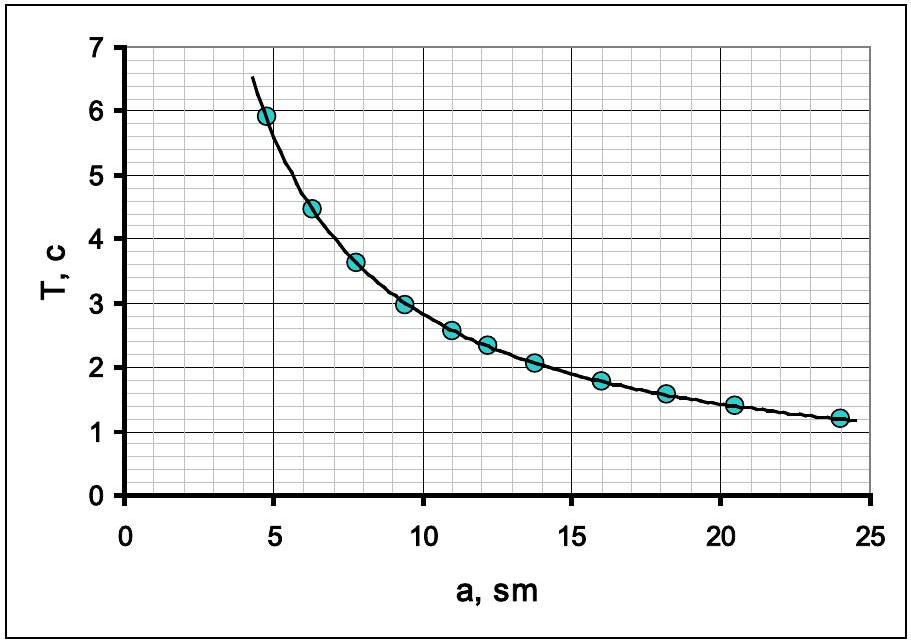
3.2 Оптимальным и наиболее распространенным способом определения показателя степени является построение графика в двойном логарифмическом масштабе. Из формулы (1), приведенной в условии задачи следует, что

$$
\begin{equation*}
\ln T = C + q \ln a , \tag{11}
\end{equation*}
$$

поэтому коэффициент наклона графика равен показателю степени. Этот график показан на рисунке ниже.
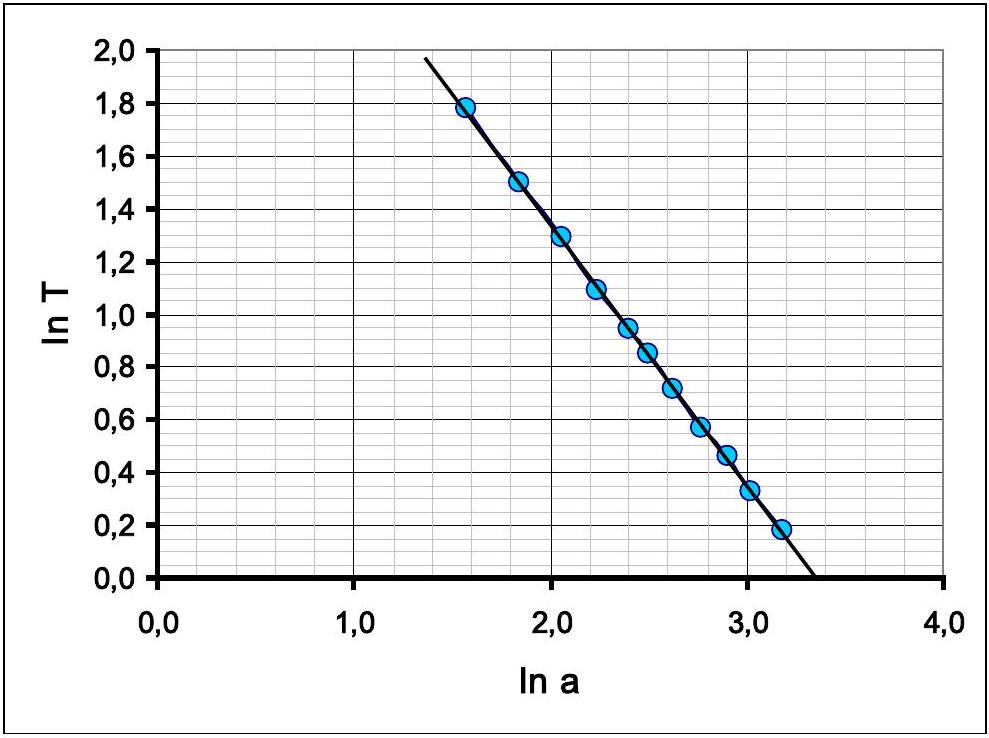

Полученная зависимость является линейной с коэффициентом наклона, очень близким к (-1). Альтернативными способами является построение зависимостей $T _ { 1 } \left( a ^ { - 1 } \right)$, или $T _ { 1 } ^ { - 1 } ( a )$. Однако, в этих способах необходимо доказать, что построенные графики являются прямыми линиями, проходящими через начало координат.

Все эти способы обоснованно свидетельствуют, что искомый показатель степени равен $( - 1 )$, т.е. период крутильных колебаний обратно пропорционален расстоянию между нитями.
3.3 Результаты измерений зависимости периода крутильных колебаний от положения гаек приведены в Таблице 3. В этой же таблице приведены результаты расчетов, необходимые для построения линеаризованного графика.

Таблица 3. Измерения периода крутильных колебаний.
| $z , \mathrm {~cm}$ | $t _ { 20 } , c$ | $T _ { 1 } , \mathrm { c }$ | $z ^ { 2 }$ | $T _ { 1 } ^ { 2 }$ | $U$ |
| :--- | :--- | :--- | :--- | :--- | :--- |
| 6 | 44,58 | 2,229 | 36 | 4,968 | 284,9 |
| 7 | 45,75 | 2,288 | 49 | 5,233 | 300,0 |
| 8 | 46,83 | 2,342 | 64 | 5,483 | 314,3 |

| 9 | 47,87 | 2,394 | 81 | 5,729 | 328,5 |
| :--- | :--- | :--- | :--- | :--- | :--- |
| 10 | 49,17 | 2,459 | 100 | 6,044 | 346,5 |
| 11 | 50,84 | 2,542 | 121 | 6,462 | 370,5 |
| 12 | 52,15 | 2,608 | 144 | 6,799 | 389,8 |
| 13 | 53,47 | 2,674 | 169 | 7,148 | 409,8 |
| 14 | 54,85 | 2,743 | 196 | 7,521 | 431,2 |
| 15 | 56,91 | 2,846 | 225 | 8,097 | 464,2 |

График этой зависимости показан на рисунке ниже. Видно, что полученная зависимость является нелинейной.
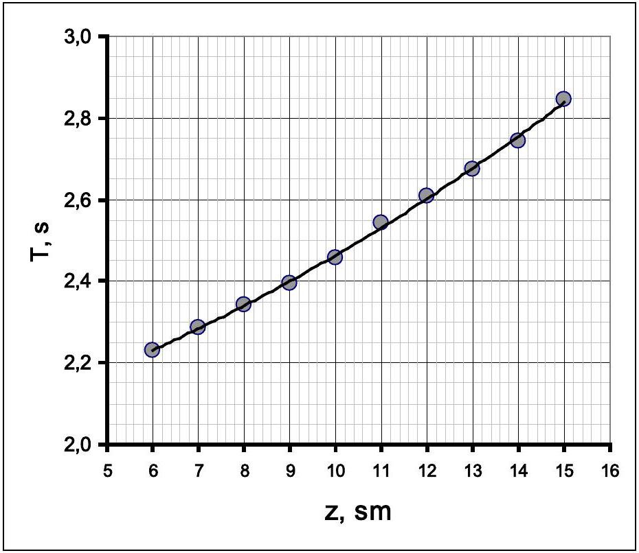
3.4 Из формул (1)-(2), приведенных в условии, и результата предыдущего пункта следует, что период крутильных колебаний описывается формулой

$$
\begin{equation*}
\frac { T _ { 1 } } { T _ { 0 } } = \frac { \sqrt { A + B z ^ { 2 } } } { a } , \tag{12}
\end{equation*}
$$

линеаризация которой очевидна и имеет вид

$$
\begin{equation*}
\left( a \frac { T _ { 1 } } { T _ { 0 } } \right) ^ { 2 } = A + B z ^ { 2 } . \tag{13}
\end{equation*}
$$

Величина $U = \left( a \frac { T _ { 1 } } { T _ { 0 } } \right) ^ { 2 }$ линейно зависит от $z ^ { 2 }$, а график линеаризованной зависимости показан на рисунке ниже.
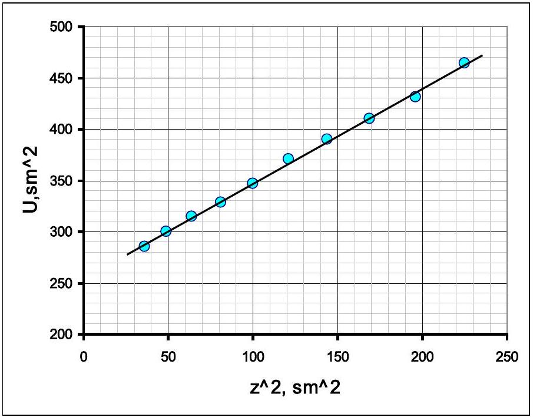
3.5 Коэффициенты этой зависимости, рассчитанные по методу наименьших квадратов, равны

$$
\begin{equation*}
A = ( 254 \pm 4 ) \mathrm { cm } ^ { 2 } , \tag{14}
\end{equation*}
$$

$$
\begin{equation*}
B = 0.93 \pm 0.03 . \tag{15}
\end{equation*}
$$

## Часть 4. Смешанные колебания.

4.1, 4.2 В Таблице 4 приведены результаты измерений и расчетов, необходимых для проверки теоретической формулы (9).

Таблица 4. Изучение смешанных колебаний.
| $z , \mathrm {~cm}$ | $T _ { 1 , ~ c }$ | $\frac { T _ { 0 } } { T _ { 1 } }$ | $N _ { C }$ (теор.) | $N _ { C }$ (эксп) | $\frac { 1 } { N _ { C } }$ |
| :--- | :--- | :--- | :--- | :--- | :--- |
| 10,5 | 1,247 | 1,059 | 17 |  |  |
| 11,0 | 1,264 | 1,045 | 22 | 24 | 0,042 |
| 11,5 | 1,282 | 1,030 | 33 | 35 | 0,029 |
| 12,0 | 1,301 | 1,015 | 65 |  |  |
| 12,5 | 1,319 | 1,002 | 660 |  |  |
| 13,0 | 1,339 | 0,987 | 74 | 60 | 0,017 |
| 13,5 | 1,359 | 0,972 | 36 | 33 | 0,030 |
| 14,0 | 1,379 | 0,958 | 24 | 21 | 0,048 |
| 14,5 | 1,400 | 0,944 | 18 | 16 | 0,063 |
| 15,0 | 1,421 | 0,930 | 14 | 13 | 0,077 |

В этой таблице: $T _ { 1 }$ - рассчитанные по формуле (12) значения периодов крутильных колебаний; $N _ { C } -$ рассчитанные и измеренные значения числа периодов в цикле.
4.3 Для проверки формулы (9) построен график зависимости величины обратной числу колебаний $\frac { 1 } { N _ { C } }$ от величины $\frac { T _ { 0 } } { T _ { 1 } }$, которая теоретически описывается формулой $\frac { 1 } { N _ { C } } = \left| \frac { T _ { 0 } } { T _ { 1 } } - 1 \right|$. График этой зависимости, построенный по экспериментальным данным, показан на рисунке ниже.

Этот график, а также сравнение рассчитанных и измеренный значений $N _ { C }$, подтверждают теоретические выводы.

|  | Содержание | Баллы | Всего |
| :--- | :--- | :--- | :--- |
| Часть 1. Наблюдение эффекта и его теоретическое описание |  |  |  |
| 1.1 | Получено сложение колебаний (есть хотя бы один правдоподобный рисунок) | 0,2 | 1,0 |
|  | 4 рисунка: два близких к отрезку, два овала с указанием направления движения 4x0,2 | $4 \times 0,2 = 0,8$ |  |
| 1.2 | Выражения для координат на плоскости через углы отклонения | $2 \times 0,2 = 0,4$ | 0,8 |
|  | Явные зависимости от времени | $2 \times 0,1 = 0,2$ |  |

|  | Приближение малых углов | 0,2 |  |
| :--- | :--- | :--- | :--- |
| 1.3 | Основная идея - изменение разности фаз, формула (7); (если период биений) | 0,5 $( 0,2 )$ | 1,3 |
|  | Формула для времени цикла (8) | 0,5 |  |
|  | Поставлен модуль в формуле (8) | 0,3 |  |
| 1.4 | $N _ { C } = \frac { T _ { 1 } } { \left\| T _ { 0 } - T _ { 1 } \right\| }$. | 0,4 | 0,4 |
| Часть 2. Продольные колебания |  |  |  |
|  | Оценивается, если оценено численное значение периода колебаний |  |  |
| 2.1 | Получено значение периода в интервале 1,3 - 1,5 с | 0,4 | 2,0 |
|  | Погрешность измерения менее 1\% (оценивается, если оценена погрешность) | 0,1 |  |
|  | Проведено не менее 5 измерений времени N колебаний (3, менее) | 0,3 (0,1;0) |  |
|  | Число колебаний N не менее 10 (5; менее) | 0,2 (0,1;0) |  |
|  | Проведено усреднение по всем измерениям | 0,1 |  |
|  | Рассчитана случайная погрешность (усреднение модулей отклонений, среднеквадратичное отклонение - допустимы) | 0,2 |  |
|  | Приборная погрешность (половина, или цена деления) | 0,2 |  |
|  | Рассчитана полная погрешность (сумма допустима) | 0,2 |  |
|  | Правильное округление (погрешность - 1-2 цифры, результат - до разряда погрешности) | 0,2 |  |
|  | указана размерность результата | 0,1 |  |
| Часть 3. Крутильные колебания |  |  |  |
|  | Оценивается, если оценены результаты измерений! |  |  |
| 3.1 | Если гайки расположены не на концах стержня, результат делится на 2. |  | 2,5 |
|  | За каждое измерение 0,15 (в сумме не более 1,5; попадание в диапазон 20\%, если измерялось время менее 10 колебаний, по 0,1 за измерение) | $0,15 \times 10 = 1,5$ |  |
|  | Нижняя граница диапазона не более 5,0 см | 0,2 |  |
|  | Верхняя граница диапазона не менее 15,0 см | 0,2 |  |
|  | Получена нелинейная зависимость, близкая к гиперболической | 0,1 |  |
|  | Построение графика (оси подписаны и оцифрованы, нанесены все точки в соответствии с таблицей, проведена сглаживающая кривая) | 0,1+0,2+0,2= $= 0,5$ |  |
| 3.2 | Оценивается, если степень -1, оценены результаты измерений |  |  |
|  | Получено значение $\boldsymbol { q } = - \mathbf { 1 }$ | 0,5 |  |
|  | Проведена линеаризация в двойном логарифмическом масштабе (проведен расчет) (обратные величины, с доказательством прохождения через нуль); | 0,5 (0,2+0,2) |  |
|  | Построен график линеаризованной зависимости (оси подписаны и оцифрованы, нанесены все точки в соответствии с таблицей, проведена сглаживающая прямая) | 0,1+0,2+0,2= $= 0,5$ |  |
| 3.3 | Если расстояние между нитями отличается от 10 см, результат делится на 2 |  | 2,5 |
|  | За каждое измерение 0,15 (в сумме не более 1,5; попадание в диапазон 20\%, если измерялось время менее 10 колебаний, по 0,1 за измерение) | $0,15 \times 10 = 1,5$ |  |
|  | Нижняя граница диапазона не более 6,5 см | 0,2 |  |
|  | Верхняя граница диапазона не менее 14,0 см | 0,2 |  |
|  | Получена нелинейная зависимость выпуклость вниз | 0,1 |  |

|  | Построение графика (оси подписаны и оцифрованы, нанесены все точки в соответствии с таблицей, проведена сглаживающая кривая) | $0,1 + 0,2 + 0,2 = = 0,5$ |  |
| :--- | :--- | :--- | :--- |
| 3.4 | Проведена линеаризация (рассчитаны квадраты периодов и расстояний) | 0,3 | 1,0 |
|  | Построен график линеаризованной зависимости | 0,1+0,2+0,2= $= 0,5$ |  |
|  | Получена прямая линия | 0,2 |  |
| 3.5 | Оценивается, если оценены пп. 3.3-3.4 |  | 1 |
|  | Получены численные значения коэффициентов (в диапазоне 20\%, не указана размерность -0,1) | $2 \times 0,4 = 0,8$ |  |
|  | Рассчитаны погрешности коэффициентов | $2 \times 0,1 = 0,2$ |  |
|  | Расчет по МНК коэффициент 1; графически, усреднением по всем точкам - 0,8; по двум точкам - 0,5; |  |  |
| Часть 4. Смешанные колебания |  |  |  |
| Оценивается, если оценены результаты измерений |  |  |  |
| 4.1 | За каждое измерение 0,2 (в сумме не более 2,0; попадание в диапазон 30\%) | $0,2 \times 10 = 2,0$ | 4 |
|  | Есть две ветви зависимости (не менее 2 точек на каждой) | 1,0 |  |
|  | Нижняя граница диапазона не более 11 см | 0,2 |  |
|  | Верхняя граница диапазона не менее 15 см | 0,2 |  |
|  | Получено число N>50 | 0,3 |  |
|  | Резкое возрастание (круче линейного) | 0,1 |  |
|  | Есть «неизмеряемая» область в середине диапазона | 0,2 |  |
| 4.2 | Проведен расчет периодов (диапазон - 20\%) по 0,05 за каждую точку, не менее 3 знаков после запятой) | $0,05 \times 10 = 0,5$ | 0,5 |
| 4.3 | Предложена линеаризация (обратные величины числа колебаний от отношения периодов, разности периодов); Проведен теоретический расчет числа колебаний, проведено сравнение с результатами эксперимента | 0,5 | 1,5 |
|  | Проведен расчет линеаризованной зависимости | 0,2 |  |
|  | Построен график линеаризованной зависимости Построен график результатов измерений | 0,4 0,2 |  |
|  | Получен график, похожий на график функции модуль числа. | 0,3 |  |
|  | Правильное положение минимума графика | 0,1 |  |
|  | ВСЕГО |  | 20,0 |
