## SOLUTIONS TO THE PROBLEMS OF THE THEORETICAL COMPETITION Attention. Points in grading are not divided!   Problem 1 (10.0 points)   Problem 1.1 (3.0 points)

Since the bicone rolls along the slats without slipping, its translational speed $v$ and angular speed of rotation $\omega$ are related through the rolling radius $r$ by the relation

$$
\begin{equation*}
v = \omega r . \tag{1}
\end{equation*}
$$

The kinetic energy of the translational motion of the bicone is equal to

$$
\begin{equation*}
W _ { k } = \frac { m v ^ { 2 } } { 2 } , \tag{2}
\end{equation*}
$$

and the corresponding rotational energy is written as

$$
\begin{equation*}
W _ { r } = \frac { I \omega ^ { 2 } } { 2 } , \tag{3}
\end{equation*}
$$

where the moment of inertia of the bicone is introduced

$$
\begin{equation*}
I = \frac { 3 } { 10 } m R ^ { 2 } . \tag{4}
\end{equation*}
$$

The change in potential energy of the bicone during its motion is

$$
\begin{equation*}
W _ { p } = - m g R \left( 1 - \frac { r } { R } \right) , \tag{5}
\end{equation*}
$$

and according to the law of conservation of energy the relation must be satisfied

$$
\begin{equation*}
W _ { k } + W _ { r } = - W _ { p } . \tag{6}
\end{equation*}
$$

From the geometric relationships the relation between the rolling radius $r$ and the coordinate $x$ is obtained in the following form

$$
\begin{equation*}
r = R \left( 1 - \frac { x } { h } \tan \gamma \right) , \tag{7}
\end{equation*}
$$

so, putting together equations (1)-(7), we get

$$
\begin{equation*}
v ( x ) = \sqrt { g D \frac { \frac { x } { h } \tan \gamma } { 1 + 3 / 10 \left( 1 - \frac { x } { h } \tan \gamma \right) ^ { 2 } } } . \tag{8}
\end{equation*}
$$

In particular, for the value $x _ { 0 } = 50.0 \mathrm {~cm}$ the calculations

$$
\begin{equation*}
v _ { 0 } = v \left( x _ { 0 } \right) = 42.2 \mathrm {~cm} / \mathrm { s } . \tag{9}
\end{equation*}
$$

From the same expressions (1)-(7) the dependence of the square of the angular velocity of rotation on the rolling radius is found as

$$
\begin{equation*}
\omega ^ { 2 } = \frac { 2 g } { R } \cdot \frac { m R ^ { 2 } } { I } \cdot \frac { \left( 1 - \frac { r } { R } \right) } { \left( 1 + \frac { m r ^ { 2 } } { I } \right) } , \tag{10}
\end{equation*}
$$

which has a maximum value at $r = 0$, equal to

$$
\begin{equation*}
\omega _ { \max } = \sqrt { \frac { 20 g } { 3 R } } = 40.4 \mathrm { rad } / \mathrm { s } . \tag{11}
\end{equation*}
$$

It is interesting to note that the bicone in this position actually rotates in one place, that is, its translational speed actually becomes zero in accordance with formula (1).

| Content | Points |
| :--- | :--- |
| Formula (1): $v = \omega r$ | 0.2 |
| Formula (2): $W _ { k } = \frac { m v ^ { 2 } } { 2 }$ | 0.2 |
| Formula (3): $W _ { r } = \frac { I \omega ^ { 2 } } { 2 }$ | 0.2 |
| Formula (4): $I = \frac { 3 } { 10 } m R ^ { 2 }$ | 0.5 |
| Formula (5): $W _ { p } = - m g R \left( 1 - \frac { r } { R } \right)$ | 0.2 |
| Formula (6): $W _ { k } + W _ { r } = - W _ { p }$ | 0.2 |
| Formula (7): $r = R \left( 1 - \frac { x } { h } \tan \gamma \right)$ | 0.5 |

| Formula (8): $v ( x ) = \sqrt { g D \frac { \frac { x } { h } \tan \gamma } { 1 + 0,3 / \left( 1 - \frac { x } { h } \tan \gamma \right) ^ { 2 } } }$ | 0.2 |
| :--- | :--- |
| Formula (9): $v _ { 0 } = 42.2 \mathrm {~cm} / \mathrm { s }$ | 0.2 |
| Formula (10): $\omega ^ { 2 } = \frac { 2 g } { R } \cdot \frac { m R ^ { 2 } } { I } \cdot \frac { \left( 1 - \frac { r } { R } \right) } { \left( 1 + \frac { m r ^ { 2 } } { I } \right) }$ | 0.2 |
| Formula (11): $\omega _ { \text {max } } = \sqrt { \frac { 20 g } { 3 R } }$ | 0.2 |
| Numerical value in formula (11): $\omega _ { \text {max } } = 40.4 \mathrm { rad } / \mathrm { s }$ | 0.2 |
| Total | 3.0 |

## Problem 1.2 (4.0 points)

1) The total internal energy of the system as a whole does not change during the process of temperature equalization, since it does not do any external work and no heat is supplied to it, that is

$$
\begin{equation*}
U = U _ { 0 } . \tag{1}
\end{equation*}
$$

It follows that when the partition moves, the gas pressures in each part of the vessel, which are equal to each other in this quasi-static process, do not change. Indeed, the initial internal energy of the system is equal to

$$
\begin{equation*}
U _ { 0 } = \frac { C _ { V } } { R } P _ { 0 } 2 V _ { 0 } , \tag{2}
\end{equation*}
$$

where

$$
\begin{equation*}
C _ { V } = \frac { 5 } { 2 } R . \tag{3}
\end{equation*}
$$

The internal energy at an arbitrary moment of time is

$$
\begin{equation*}
U = \frac { C _ { V } } { R } P \left( 2 V _ { 0 } \right) , \tag{4}
\end{equation*}
$$

where $P$ stands for the gas pressure in both parts of the vessel, which is obtained from equations (1)-(4)

$$
\begin{equation*}
P = P _ { 0 } , \tag{5}
\end{equation*}
$$

that is, the processes occurring with gases are isobaric.
Let us write down the equation of state of an ideal gas for each part of the vessel at the initial moment of time as

$$
\begin{align*}
& P _ { 0 } V _ { 0 } = v _ { 1 } R T _ { 1 } ,  \tag{6}\\
& P _ { 0 } V _ { 0 } = v _ { 2 } R T _ { 2 } , \tag{7}
\end{align*}
$$

where $v _ { 1 }$ and $v _ { 2 }$ denote the number of moles of nitrogen in each half of the vessel, respectively.
In the final state, the gas is at a certain temperature $T _ { 0 }$ and its equation of state has the form

$$
\begin{equation*}
P _ { 0 } 2 V _ { 0 } = v R T _ { 0 } , \tag{8}
\end{equation*}
$$

where the total number of moles of nitrogen in the vessel is equal to

$$
\begin{equation*}
v = v _ { 1 } + v _ { 2 } . \tag{9}
\end{equation*}
$$

From formulas (6)-(9) we determine the final temperature of the gas in the vessel

$$
\begin{equation*}
T _ { 0 } = \frac { 2 T _ { 1 } T _ { 2 } } { T _ { 1 } + T _ { 2 } } . \tag{10}
\end{equation*}
$$

Since the process is isobaric, the amount of heat $Q$ exchanged between the two parts of the vessel is derived as

$$
\begin{equation*}
Q = C _ { P } v _ { 1 } \left( T _ { 0 } - T _ { 1 } \right) = \frac { 7 } { 2 } P _ { 0 } V _ { 0 } \cdot \frac { T _ { 2 } - T _ { 1 } } { T _ { 1 } + T _ { 2 } } = 70.0 \text { Дж, } \tag{11}
\end{equation*}
$$

where

$$
\begin{equation*}
C _ { p } = C _ { V } + R . \tag{12}
\end{equation*}
$$

2) When the partition returns to its original position, the work of external forces is to be minimal if the movement process is slow, quasi-equilibrium without disturbing the thermal equilibrium between both parts of the vessel

$$
\begin{equation*}
T _ { 1 } ^ { \prime } = T _ { 2 } ^ { \prime } = T , \tag{13}
\end{equation*}
$$

that is, unlike the previous case, in both parts of the vessel the pressure is not the same, but the temperature is, which, however, changes.

The initial volumes of each part of the vessel are determined by the Gay-Lussac law and are equal to

$$
\begin{align*}
& V _ { 01 } = \frac { V _ { 0 } T _ { 0 } } { T _ { 1 } } ,  \tag{14}\\
& V _ { 02 } = \frac { V _ { 0 } T _ { 0 } } { T _ { 2 } } . \tag{15}
\end{align*}
$$

Let us denote the pressure in parts of the vessel as $P _ { 1 }$ and $P _ { 2 }$, and the corresponding volumes as $V _ { 1 }$ and $V _ { 2 }$. In accordance with the equation of state, at an arbitrary moment of time the following relations must be satisfied

$$
\begin{align*}
& P _ { 1 } V _ { 1 } = v _ { 1 } R T ,  \tag{16}\\
& P _ { 2 } V _ { 2 } = v _ { 2 } R T . \tag{17}
\end{align*}
$$

In this process, the change in the internal energy of the gas in the system is equal to

$$
\begin{equation*}
d U = v C _ { V } d T , \tag{18}
\end{equation*}
$$

and if the gas does work $\delta A$ on external bodies, then according to the first law of thermodynamics, under the conditions of vessel thermal insulation as a whole, the supplied amount of heat becomes zero

$$
\begin{equation*}
\delta Q = d U + \delta A = 0 . \tag{19}
\end{equation*}
$$

In a quasi-static process, the work of the gas as a whole consists of the work of the gases in each part of the vessel

$$
\begin{equation*}
\delta A = P _ { 1 } d V _ { 1 } + P _ { 2 } d V _ { 2 } . \tag{20}
\end{equation*}
$$

Writing (18)-(20) together and using equations (3), (6), (7), (9), (10), (14) and (15)-(17), we obtain

$$
\begin{equation*}
\frac { 5 } { T _ { 0 } } d T + \frac { T } { T _ { 1 } V _ { 1 } } d V _ { 1 } + \frac { T } { T _ { 2 } V _ { 2 } } d V _ { 2 } = 0 \tag{21}
\end{equation*}
$$

whose integration gives the final temperature

$$
\begin{equation*}
T _ { f } = T _ { 0 } \left( \frac { T _ { 0 } } { T _ { 1 } } \right) ^ { \frac { T _ { 0 } } { 5 T _ { 1 } } } \left( \frac { T _ { 0 } } { T _ { 2 } } \right) ^ { \frac { T _ { 0 } } { 5 T _ { 2 } } } = 290 \mathrm {~K} . \tag{22}
\end{equation*}
$$

The work done by external forces on the partition to move it is opposite in sign to the work done by the gas itself, therefore, from expressions (16) and (17) the work can easily be found in the form

$$
\begin{equation*}
A ^ { \prime } = - A = \Delta U = v C _ { V } \left( T _ { f } - T _ { 0 } \right) = 5 P _ { 0 } V _ { 0 } \frac { T _ { f } - T _ { 0 } } { T _ { 0 } } = 4.04 \mathrm {~J} . \tag{23}
\end{equation*}
$$

2) Alternative solution. The process of returning the partition to its original position is adiabatic, i.e. occurs without change in entropy

$$
\begin{equation*}
S = \text { const } . \tag{24}
\end{equation*}
$$

The total change in entropy of an ideal gas in both parts of the vessel is equal to:

$$
\begin{equation*}
\Delta S = v _ { 1 } C _ { V } \ln \frac { T _ { f } } { T _ { 0 } } + v _ { 1 } R \ln \frac { V _ { 0 } } { V _ { 01 } } + v _ { 2 } C _ { V } \ln \frac { T _ { f } } { T _ { 0 } } + v _ { 2 } R \ln \frac { V _ { 0 } } { V _ { 02 } } = 0 , \tag{25}
\end{equation*}
$$

from where, using (6), (7), (10), (14), (15) we obtain the final temperature of the system

$$
\begin{equation*}
T _ { f } = T _ { 0 } \left( \frac { T _ { 0 } } { T _ { 1 } } \right) ^ { \frac { T _ { 0 } } { 5 T _ { 1 } } } \left( \frac { T _ { 0 } } { T _ { 2 } } \right) ^ { \frac { T _ { 0 } } { 5 T _ { 2 } } } = 290 \mathrm {~K} . \tag{26}
\end{equation*}
$$

The work of the external force is spent on changing the internal energy of the gas:

$$
\begin{equation*}
A ^ { \prime } = \Delta U = \left( v _ { 1 } + v _ { 2 } \right) C _ { V } \left( T _ { f } - T _ { 0 } \right) = 5 P _ { 0 } V _ { 0 } \frac { T _ { f } - T _ { 0 } } { T _ { 0 } } = 4.04 \mathrm {~J} . \tag{27}
\end{equation*}
$$

| Content | Points |
| :--- | :--- |
| Formula (1): $U = U _ { 0 }$ | 0.1 |
| Formula (2): $U _ { 0 } = \frac { C _ { V } } { R } P _ { 0 } 2 V _ { 0 }$ | 0.1 |
| Formula (3): $C _ { V } = \frac { 5 } { 2 } R$ | 0.1 |
| Formula (4): $U = \frac { C _ { V } } { R } P \left( 2 V _ { 0 } \right)$ | 0.1 |
| Formula (5): $P = P _ { 0 }$ | 0.4 |
| Formula (6): $P _ { 0 } V _ { 0 } = v _ { 1 } R T _ { 1 }$ | 0.1 |
| Formula (7): $P _ { 0 } V _ { 0 } = v _ { 2 } R T _ { 2 }$ | 0.1 |
| Formula (8): $P _ { 0 } 2 V _ { 0 } = v R T _ { 0 }$ | 0.1 |
| Formula (9): $v = v _ { 1 } + v _ { 2 }$ | 0.1 |
| Formula (10): $T _ { 0 } = \frac { 2 T _ { 1 } T _ { 2 } } { T _ { 1 } + T _ { 2 } }$ | 0.4 |
| Formula (11): $Q = \frac { 7 } { 2 } P _ { 0 } V _ { 0 } \cdot \frac { T _ { 2 } - T _ { 1 } } { T _ { 1 } + T _ { 2 } }$ | 0.4 |

| Numerical value in formula (11): $Q = 70.0 \mathrm {~J}$ | 0.1 |
| :--- | :--- |
| Formula (12): $C _ { p } = C _ { V } + R$ | 0.1 |
| Formula (13): $T = T _ { 1 } = T _ { 2 }$ | 0.4 |
| Formula (14): $V _ { 01 } = \frac { V _ { 0 } T _ { 0 } } { T _ { 1 } }$ | 0.1 |
| Formula (15): $V _ { 02 } = \frac { V _ { 0 } T _ { 0 } } { T _ { 2 } }$ | 0.1 |
| Formula (16): $P _ { 1 } V _ { 1 } = v _ { 1 } R T$ | 0.1 |
| Formula (17): $P _ { 2 } V _ { 2 } = v _ { 2 } R$ | 0.1 |
| Formula (18): $d U = v C _ { V } d T$ | 0.1 |
| Formula (19): $\delta Q = d U + \delta A = 0$ | 0.1 |
| Formula (20): $\delta A = P _ { 1 } d V _ { 1 } + P _ { 2 } d V _ { 2 }$ | 0.1 |
| Formula (21): $\frac { 5 } { T _ { 0 } } d T + \frac { T } { T _ { 1 } V _ { 1 } } d V _ { 1 } + \frac { T } { T _ { 2 } V _ { 2 } } d V _ { 2 } = 0$ | 0.1 |
| Formula (22): $T _ { f } = T _ { 0 } \left( \frac { T _ { 0 } } { T _ { 1 } } \right) ^ { \frac { T _ { 0 } } { 5 T _ { 1 } } } \left( \frac { T _ { 0 } } { T _ { 2 } } \right) ^ { \frac { T _ { 0 } } { 5 T _ { 2 } } }$ | 0.2 |
| Formula (23): $A ^ { \prime } = v C _ { V } \left( T _ { f } - T _ { 0 } \right) = 5 P _ { 0 } V _ { 0 } \frac { T _ { f } - T _ { 0 } } { T _ { 0 } }$ | 0.2 |
| Numerical value in formula (23): $A ^ { \prime } = 4.04 \mathrm {~J}$ | 0.2 |
| Alternative solution to 2) |  |
| Formula (13): $T = T _ { 1 } = T _ { 2 }$ | 0.4 |
| Formula (14): $V _ { 01 } = \frac { V _ { 0 } T _ { 0 } } { T _ { 1 } }$ | 0.1 |
| Formula (15): $V _ { 02 } = \frac { V _ { 0 } T _ { 0 } } { T _ { 2 } }$ | 0.1 |
| Formula (24): $S =$ const. | 0.2 |
| Formula (25): $\Delta S = v _ { 1 } C _ { V } \ln \frac { T _ { f } } { T _ { 0 } } + v _ { 1 } R \ln \frac { V _ { 0 } } { V _ { 01 } } + v _ { 2 } C _ { V } \ln \frac { T _ { f } } { T _ { 0 } } + v _ { 2 } R \ln \frac { V _ { 0 } } { V _ { 02 } } = 0$ | 0.4 |
| Formula (26): $T _ { f } = T _ { 0 } \left( \frac { T _ { 0 } } { T _ { 1 } } \right) ^ { \frac { T _ { 0 } } { 5 T _ { 1 } } } \left( \frac { T _ { 0 } } { T _ { 2 } } \right) ^ { \frac { T _ { 0 } } { 5 T _ { 2 } } }$ | 0.2 |
| Formula (27): $A ^ { \prime } = v C _ { V } \left( T _ { f } - T _ { 0 } \right) = 5 P _ { 0 } V _ { 0 } \frac { T _ { f } - T _ { 0 } } { T _ { 0 } }$ | 0.2 |
| Numerical value in formula (27): $A ^ { \prime } = 4.04 \mathrm {~J}$ | 0.2 |
| Total | 4.0 |

## Problems 1.3 (3.0 points)

The power of the battery is spent on mechanical work of lifting the load, as well as on the power of thermal losses on the internal resistance of the battery $r$ and on the ohmic resistance $R$ of the motor winding. If the torque required to uniformly lift a load of mass $m _ { 1 } = m$ is equal to $M$ and the shaft rotates at an angular speed $\omega _ { 1 } = \varphi / t _ { 1 }$, where $\varphi$ is the angle of rotation of the shaft when lifting the load to the height $h$, then according to the law of conservation of energy:

$$
\begin{equation*}
U I = M \omega _ { 1 } + I ^ { 2 } ( r + R ) , \tag{1}
\end{equation*}
$$

where $U$ is the emf of the battery, $I$ designates the current strength that creates the torque necessary to lift a load of mass $m$.

Taking into account the proportionality of torque to current strength

$$
\begin{equation*}
M = \alpha I , \tag{2}
\end{equation*}
$$

with $\alpha$ being the proportionality coefficient, equation (1) is rewritten in the form

$$
\begin{equation*}
U = \alpha \omega _ { 1 } + I ( r + R ) . \tag{3}
\end{equation*}
$$

Obviously, to uniformly lift a load of mass $m _ { 2 } = 2 m$, twice the torque and, accordingly, twice the current are required. If the shaft rotation speed is equal to $\omega _ { 2 } = \frac { \varphi } { t _ { 2 } }$, where $t _ { 2 } = t _ { 1 } + \Delta t$ is the time of lifting the load $m _ { 2 }$, then the corresponding equation has the form:

$$
\begin{equation*}
U = \alpha \omega _ { 2 } + 2 I ( r + R ) . \tag{4}
\end{equation*}
$$

For uniform lifting of a load with a mass of $m _ { n } = n m$, the required current is equal to $I _ { n } = n I$. If this load is lifted in time $t _ { n }$ at a speed of $\omega _ { n } = \frac { \varphi } { t _ { n } }$, then the corresponding equation looks like this:

$$
\begin{equation*}
U = \alpha \omega _ { n } + n I ( r + R ) . \tag{5}
\end{equation*}
$$

From equations (3)-(5) $\omega _ { n }$ is easily expressed through $\omega _ { 1 } , \omega _ { 2 }$ :

$$
\begin{equation*}
\omega _ { n } = ( n - 1 ) \omega _ { 2 } - ( n - 2 ) \omega _ { 1 } , \tag{6}
\end{equation*}
$$

whence the time for lifting a load of mass $m _ { n }$ is equal to

$$
\begin{equation*}
t _ { n } = \frac { t _ { 1 } t _ { 2 } } { ( n - 1 ) t _ { 1 } - ( n - 2 ) t _ { 2 } } = \frac { t _ { 1 } t _ { 2 } } { t _ { 2 } - ( n - 1 ) \Delta t } . \tag{7}
\end{equation*}
$$

From the condition

$$
\begin{equation*}
t _ { n } > 0 , \tag{8}
\end{equation*}
$$

we find that $n < \frac { t _ { 2 } } { \Delta t } + 1$, which means that the number of loads $n$ should not exceed

$$
\begin{equation*}
n _ { \max } = \left[ \frac { t _ { 2 } } { \Delta t } + 1 \right] = \left[ \frac { t _ { 1 } + 2 \Delta t } { \Delta t } \right] = [ 10,6 \ldots ] = 10 . \tag{9}
\end{equation*}
$$

The lifting time of $n = n _ { \text {max } }$ loads is equal to

$$
\begin{equation*}
t _ { \max } = \frac { t _ { 1 } t _ { 2 } } { t _ { 2 } - \left( n _ { \max } - 1 \right) \Delta t } = \frac { t _ { 1 } \left( t _ { 1 } + \Delta t \right) } { t _ { 1 } - \left( n _ { \max } - 2 \right) \Delta t } = 1.01 \cdot 10 ^ { 3 } \mathrm {~s} . \tag{10}
\end{equation*}
$$

| Content | Points |
| :--- | :--- |
| Formula (1): $U I = M \omega _ { 1 } + I ^ { 2 } ( r + R )$ | 0.3 |
| Formula (2): $M = \alpha I$ | 0.1 |
| Formula (3): $U = \alpha \omega _ { 1 } + I ( r + R )$ | 0.2 |
| Formula (4): $U = \alpha \omega _ { 2 } + 2 I ( r + R )$ | 0.2 |
| Formula (5): $U = \alpha \omega _ { n } + n I ( r + R )$ | 0.2 |
| Formula (6): $\omega _ { n } = ( n - 1 ) \omega _ { 2 } - ( n - 2 ) \omega _ { 1 }$ | 0.2 |
| Formula (7): $t _ { n } = \frac { t _ { 1 } t _ { 2 } } { ( n - 1 ) t _ { 1 } - ( n - 2 ) t _ { 2 } } = \frac { t _ { 1 } t _ { 2 } } { t _ { 2 } - ( n - 1 ) \Delta t }$ | 0.2 |
| Formula (8): $t _ { n } > 0$ | 0.4 |
| Formula (9): $n _ { \text {max } } = \left[ \frac { t _ { 2 } } { \Delta t } + 1 \right] = \left[ \frac { t _ { 1 } + 2 \Delta t } { \Delta t } \right]$ | 0.4 |
| Numerical value in formula (9): $n _ { \text {max } } = 10$ | 0,2 |
| Formula (10): $t _ { \text {max } } = \frac { t _ { 1 } t _ { 2 } } { t _ { 2 } - \left( n _ { \text {max } } - 1 \right) \Delta t } = \frac { t _ { 1 } \left( t _ { 1 } + \Delta t \right) } { t _ { 1 } - \left( n _ { \text {max } } - 2 \right) \Delta t }$ | 0,4 |
| Numerical value in formula (10): $t _ { \text {max } } = 1.01 \cdot 10 ^ { 3 } \mathrm {~s}$ | 0,2 |
| Total | 3.0 |

## Problem 2. Lagrange points ( $\mathbf { 1 0 . 0 }$ points)   Two body problem

2.1 The radii of the bodies' orbits are equal to the distances from the bodies to the center of mass and are determined from the equations

$$
\begin{align*}
& R _ { 1 } + R _ { 2 } = R _ { 0 } ,  \tag{1}\\
& m _ { 1 } R _ { 1 } = m _ { 2 } R _ { 2 } , \tag{2}
\end{align*}
$$

and we find the required radii of trajectories

$$
\begin{align*}
& R _ { 1 } = \frac { m _ { 2 } } { m _ { 1 } + m _ { 2 } } R _ { 0 } ,  \tag{3}\\
& R _ { 2 } = \frac { m _ { 1 } } { m _ { 1 } + m _ { 2 } } R _ { 0 } . \tag{4}
\end{align*}
$$

2.2 To calculate the angular velocity $\omega _ { 0 }$ of bodies rotation, we write the equation of Newton's second law for one of the bodies, for example for the first, in the form

$$
\begin{equation*}
m _ { 1 } \omega _ { 0 } ^ { 2 } R _ { 1 } = G \frac { m _ { 1 } m _ { 2 } } { R _ { 0 } ^ { 2 } } , \tag{5}
\end{equation*}
$$

which, taking into account equation (3), gives

$$
\begin{equation*}
\omega _ { 0 } = \sqrt { G \frac { m _ { 1 } + m _ { 2 } } { R _ { 0 } ^ { 3 } } } . \tag{6}
\end{equation*}
$$

2.3 The expression for the projection of the force acting on a small body $m _ { 0 }$ follows from Newton's law of universal gravitation, which, taking into account the direction of the forces, yields

$$
\begin{equation*}
F _ { x } = - G \frac { m _ { 0 } m _ { 1 } } { \left| X + R _ { 1 } \right| ^ { 3 } } \left( X + R _ { 1 } \right) - G \frac { m _ { 0 } m _ { 1 } } { \left| X - R _ { 2 } \right| ^ { 3 } } \left( X - R _ { 2 } \right) . \tag{7}
\end{equation*}
$$

Taking into account the dimensionless relations given in the problem formulation, we obtain an expression for the projection of force in relative units

$$
\begin{equation*}
f _ { x } = - \frac { 1 - \mu } { | x + \mu | ^ { 3 } } ( x + \mu ) - \frac { \mu } { | x - 1 + \mu | ^ { 3 } } ( x - 1 + \mu ) . \tag{8}
\end{equation*}
$$

The equation of Newton's second law for a small body is

$$
\begin{equation*}
- m _ { 0 } \omega _ { 0 } ^ { 2 } X = F _ { x } , \tag{9}
\end{equation*}
$$

having nondimensionalized it by the given values, we obtain the required equation for determining the coordinate $x$

$$
\begin{equation*}
- x = - \frac { 1 - \mu } { | x + \mu | ^ { 3 } } ( x + \mu ) - \frac { \mu } { | x - 1 + \mu | ^ { 3 } } ( x - 1 + \mu ) . \tag{10}
\end{equation*}
$$

2.4 To construct a graph of function (8), it is enough to construct graphs of functions describing attraction to the body $m _ { 1 }$ (two branches with an asymptote at $x = - 0.2$ - graph 1 in the figure) and attraction to the body $m _ { 2 }$ (two branches with an asymptote at $x = 0.8$ - graph 2 in the figure) and sum them up (graph 3 in the figure). This graph has three branches.
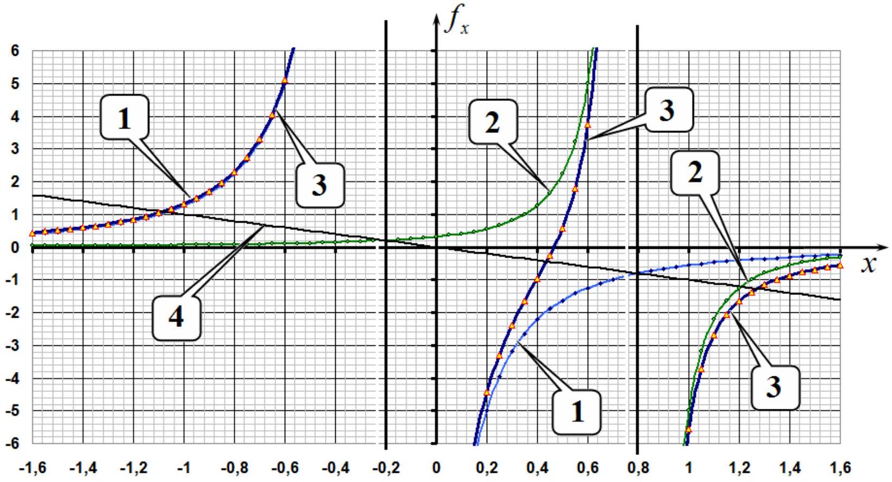
2.5 On the constructed graph we draw a straight line described by the equation $f _ { x } = - x$. The coordinates of the points of intersection of this line with the graph of the dependence $f _ { x } ( x )$ are the real roots of equation (10), i.e. are the coordinates of Lagrange points lying on the $X$ axis. As follows from the construction, there are exactly 3 such points.
2.6 Equation (10) is a fifth degree equation and therefore cannot be solved analytically. However, the problem formulation requires calculating numerical values with a low error. To do this, it is enough to calculate the numerical values of the force acting on a small body with a step of change in $x$ equal to 0.1, and determine the interval in which the corresponding root is located.

Let us calculate the value of the coordinate of the Lagrange point $L _ { 1 }$, located between the bodies $m _ { 1 }$ and $m _ { 2 }$. For this point, equation (10) can be rewritten as

$$
\begin{equation*}
x = \frac { 1 - \mu } { ( x + \mu ) ^ { 2 } } - \frac { \mu } { ( 1 - \mu - x ) ^ { 2 } } . \tag{11}
\end{equation*}
$$

The table below shows the values of the left and right hand sides of equation (11) at $\mu = 0.20$

| $x$ | 0,2 | 0,3 | 0,4 | 0,5 | 0,6 |
| :--- | :--- | :--- | :--- | :--- | :--- |
| $f ( x )$ | 4,44 | 2,40 | 0,97 | -0,59 | -3,75 |

It follows from the table that the root of the equation lies in the range from 0.4 to 0.5, i.e.

$$
\begin{equation*}
x _ { 1 } \approx 0.45 . \tag{12}
\end{equation*}
$$

For the coordinate of the point $L _ { 2 }$ lying behind the body $m _ { 2 }$,, we have the equation

$$
\begin{equation*}
x = \frac { 1 - \mu } { ( x + \mu ) ^ { 2 } } + \frac { \mu } { ( x - 1 + \mu ) ^ { 2 } } , \tag{13}
\end{equation*}
$$

and in the following table the values of the left and right hand sides of this equation are calculated

| $x$ | 1 | 1,1 | 1,2 | 1,3 | 1,4 |
| :--- | :--- | :--- | :--- | :--- | :--- |
| $f ( x )$ | 5,56 | 2,70 | 1,66 | 1,16 | 0,87 |

From the data in this table it follows that the root of this equation lies in the range between 1.2 and 1.3, i.e.

$$
\begin{equation*}
x _ { 2 } \approx 1.25 . \tag{14}
\end{equation*}
$$

Finally, for point $L _ { 3 }$ lying behind body $m _ { 1 }$ we have the equation (here the direction of the axis is changed)

$$
\begin{equation*}
x = \frac { 1 - \mu } { ( x - \mu ) ^ { 2 } } + \frac { \mu } { ( 1 - \mu + x ) ^ { 2 } } , \tag{15}
\end{equation*}
$$

and the following table shows the results of similar calculations

| $x$ | 0,8 | 0,9 | 1 | 1,1 | 1,2 |
| :--- | :--- | :--- | :--- | :--- | :--- |
| $f ( x )$ | 2,30 | 1,70 | 1,31 | 1,04 | 0,85 |

from which it follows that the root of equation (15) lies in the range from 1.0 to 1.1, and, therefore, the coordinate of the Lagrange point $L _ { 3 }$ is found as

$$
\begin{equation*}
x _ { 3 } \approx 1.05 . \tag{16}
\end{equation*}
$$

2.7 To prove that the vertex of an equilateral triangle is the Lagrange point $L _ { 4 }$, we write the expression for the total force acting on a body of small mass $m _ { 0 }$ in a vector form:

$$
\begin{equation*}
\vec { F } = G \frac { m _ { 0 } m _ { 1 } } { R _ { 0 } ^ { 3 } } \overrightarrow { r _ { 1 } } + G \frac { m _ { 0 } m _ { 2 } } { R _ { 0 } ^ { 3 } } \overrightarrow { r _ { 2 } } . \tag{17}
\end{equation*}
$$

The expression on the right hand side of formula (17) is expressed through the radius vector of the center of mass

$$
\begin{equation*}
m _ { 1 } \overrightarrow { r _ { 1 } } + m _ { 2 } \overrightarrow { r _ { 2 } } = \left( m _ { 1 } + m _ { 2 } \right) \overrightarrow { r _ { C } } , \tag{18}
\end{equation*}
$$

then the equation of Newton's second law for this body in projection onto the
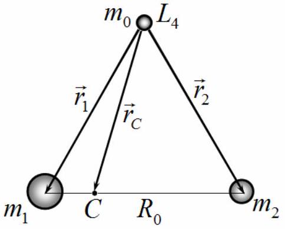
direction of the vector $\overrightarrow { r _ { C } }$ has the form:

$$
\begin{equation*}
m _ { 0 } \omega ^ { 2 } r _ { C } = G \frac { m _ { 0 } } { R _ { 0 } ^ { 3 } } \left( m _ { 1 } + m _ { 2 } \right) r _ { C } . \tag{19}
\end{equation*}
$$

From this equation it follows that the angular velocity of the body $m _ { 0 }$ is equal to

$$
\begin{equation*}
\omega = \sqrt { G \frac { m _ { 1 } + m _ { 2 } } { R _ { 0 } ^ { 3 } } } = \omega _ { 0 } , \tag{20}
\end{equation*}
$$

which coincides with the angular velocity of rotation of massive bodies (6), therefore the position of the body $m _ { 0 }$ remains unchanged relative to the massive bodies. Therefore, the vertex of an equilateral triangle is indeed a Lagrange point.

## Lagrange points in the Solar System

2.8 In order for the SOHO spacecraft to remain unchanged relative to the Earth and the Sun, it must be at the Lagrange point $L _ { 1 }$. In order to determine its position, it is necessary to solve equation (11). First we calculate the value of the parameter $\mu$ for the Sun-Earth system:

$$
\begin{equation*}
\mu = \frac { M _ { 2 } } { M _ { 1 } + M _ { 2 } } = 3.00 \cdot 10 ^ { - 6 } . \tag{21}
\end{equation*}
$$

This value is significantly less than 1 , so the distance $l$ from the spacecraft to the Earth is significantly less than the radius of the Earth's orbit. In the used system of units we denote $z = \frac { l } { R _ { 0 } } = 1 - \mu - x$, then from equation (11) we obtain

$$
\begin{equation*}
1 - \mu - z = \frac { 1 - \mu } { ( 1 - z ) ^ { 2 } } - \frac { \mu } { z ^ { 2 } } . \tag{22}
\end{equation*}
$$

Since $z , \mu \ll 1$, we can use the expansion $\frac { 1 } { ( 1 - z ) ^ { 2 } } \approx 1 + 2 z$ and in this case equation (22) is significantly simplified and its solution is obtained as $z = ( \mu / 3 ) ^ { 1 / 3 }$, that is, the required distance is equal to

$$
\begin{equation*}
l _ { S } = R _ { 0 } \sqrt [ 3 ] { \frac { M _ { 2 } } { 3 M _ { 1 } } } = 1.50 \cdot 10 ^ { 6 } \mathrm {~km} . \tag{23}
\end{equation*}
$$

2.9 Obviously, the James Webb telescope is located at the Lagrange point $L _ { 2 }$, therefore, to determine its position, it is necessary to solve equation (13) using a method similar to the method in 2.8 :

$$
\begin{equation*}
1 + z = \frac { 1 } { ( 1 + z ) ^ { 2 } } + \frac { \mu } { z ^ { 2 } } \tag{24}
\end{equation*}
$$

i.e. the space telescope is located at the same distance from the Earth (only on the other side):

$$
\begin{equation*}
l _ { W } = R _ { 0 } \sqrt [ 3 ] { \frac { M _ { 2 } } { 3 M _ { 1 } } } = 1.50 \cdot 10 ^ { 6 } \mathrm {~km} . \tag{25}
\end{equation*}
$$

2.10 If an asteroid accidentally ends up at the Lagrange point $L _ { 4 }$, or the point $L _ { 5 }$ symmetrical to it for the Jupiter-Sun system, then its position relative to Jupiter and the Sun remains unchanged for a long time. Asteroids located at other points constantly change their position relative to Jupiter and the Sun. Consequently, the centers of groups of Trojan asteroids are located at the lateral Lagrange points. Therefore, the distance from Jupiter to these points is equal to the distance from Jupiter to the Sun. The mass of Jupiter is significantly less than the mass of the Sun, so the distance between them is almost equal to the radius of Jupiter's orbit, which can be found using Kepler's third law

$$
\begin{equation*}
l _ { J } = R _ { 0 } \left( \frac { T _ { J } } { T _ { 0 } } \right) ^ { 2 / 3 } = 7.82 \cdot 10 ^ { 8 } \mathrm {~km} , \tag{26}
\end{equation*}
$$

where $T _ { 0 } = 1.00$ year stands for the period of rotation of the Earth around the Sun.

|  | Content | Points |  |
| :--- | :--- | :--- | :--- |
| 2.1 | Formula (1): $R _ { 1 } + R _ { 2 } = R _ { 0 }$ | 0.1 | 0.4 |
|  | Formula (2): $m _ { 1 } R _ { 1 } = m _ { 2 } R _ { 2 }$ | 0.1 |  |
|  | Formula (3): $R _ { 1 } = \frac { m _ { 2 } } { m _ { 1 } + m _ { 2 } } R _ { 0 }$ | 0.1 |  |
|  | Formula (4): $R _ { 2 } = \frac { m _ { 1 } } { m _ { 1 } + m _ { 2 } } R _ { 0 }$ | 0.1 |  |
| 2.2 | Formula (5): $m _ { 1 } \omega _ { 0 } ^ { 2 } R _ { 1 } = G \frac { m _ { 1 } m _ { 2 } } { R _ { 0 } ^ { 2 } }$ | 0.1 | 0.2 |
|  | Formula (6): $\omega _ { 0 } = \sqrt { G \frac { m _ { 1 } + m _ { 2 } } { R _ { 0 } ^ { 3 } } }$ | 0.1 |  |
| 2.3 | Formula (7): $\quad F _ { x } = - G \frac { m _ { 0 } m _ { 1 } } { \left\| X + R _ { 1 } \right\| ^ { 3 } } \left( X + R _ { 1 } \right) - G \frac { m _ { 0 } m _ { 1 } } { \left\| X - R _ { 2 } \right\| ^ { 3 } } \left( X - R _ { 2 } \right)$ | 0.5 | 2.0 |
|  | Formula (8): $f _ { x } = - \frac { 1 - \mu } { \| x + \mu \| ^ { 3 } } ( x + \mu ) - \frac { \mu } { \| x - 1 + \mu \| ^ { 3 } } ( x - 1 + \mu )$ | 0.5 |  |
|  | Formula (9): $- m _ { 0 } \omega _ { 0 } ^ { 2 } X = F _ { x }$ | 0.5 |  |
|  | Formula (10): $- x = - \frac { 1 - \mu } { \| x + \mu \| ^ { 3 } } ( x + \mu ) - \frac { \mu } { \| x - 1 + \mu \| ^ { 3 } } ( x - 1 + \mu )$ | 0.5 |  |
| 2.4 | Positions of vertical asymptotes on the graph | 0.2 | 0.8 |
|  | 3 branches of the graph | $3 \times 0.2 = 0,6$ |  |
| 2.5 | Straight line $f _ { x } = - x$ on the graph | 0.2 | 0.3 |
|  | Three intersection points are indicated, corresponding to 3 Lagrange points | 0.1 |  |
| 2.6 | For each point: - position is pointed; - numerical value is obtained. | 3x(0.1+0.2) $= 0.9$ | 0.9 |
| 2.7 | Formula (17): $\vec { F } = G \frac { m _ { 0 } m _ { 1 } } { R _ { 0 } ^ { 3 } } \overrightarrow { r _ { 1 } } + G \frac { m _ { 0 } m _ { 2 } } { R _ { 0 } ^ { 3 } } \overrightarrow { r _ { 2 } }$ | 0.2 | 1.0 |
|  | Formula (18): $m _ { 1 } \overrightarrow { r _ { 1 } } + m _ { 2 } \overrightarrow { r _ { 2 } } = \left( m _ { 1 } + m _ { 2 } \right) \overrightarrow { r _ { C } }$ | 0.2 |  |
|  | Formula (19): $m _ { 0 } \omega ^ { 2 } r _ { C } = G \frac { m _ { 0 } } { R _ { 0 } ^ { 3 } } \left( m _ { 1 } + m _ { 2 } \right) r _ { C }$ | 0.3 |  |
|  | Formula (20): $\omega = \sqrt { G \frac { m _ { 1 } + m _ { 2 } } { R _ { 0 } ^ { 3 } } } = \omega _ { 0 }$ | 0.3 |  |
| 2.8 | Numerical value in equation (21): $\mu = 3.00 \cdot 10 ^ { - 6 }$ | 0.2 | 1.6 |
|  | Exact equation (22): $1 - \mu - z = \frac { 1 - \mu } { ( 1 - z ) ^ { 2 } } - \frac { \mu } { z ^ { 2 } }$ | 0.2 |  |
|  | Formula (23): $l _ { S } = R _ { 0 } \sqrt [ 3 ] { \frac { M _ { 2 } } { 3 M _ { 1 } } }$ | 0.7 |  |
|  | Numerical value in formula (23): $l _ { S } = 1.50 \cdot 10 ^ { 6 } \mathrm {~km}$. | 0.5 |  |

| 2.9 | Formula (24): $1 + z = \frac { 1 } { ( 1 + z ) ^ { 2 } } + \frac { \mu } { z ^ { 2 } }$ | 0.2 | 1.4 |
| :--- | :--- | :--- | :--- |
|  | Formula (25): $l _ { W } = R _ { 0 } \sqrt [ 3 ] { \frac { M _ { 2 } } { 3 M _ { 1 } } }$ | 0.7 |  |
|  | Numerical value in formula (25): $l _ { W } = 1.50 \cdot 10 ^ { 6 } \mathrm {~km}$. | 0.5 |  |
| 2.10 | Formula (26): $l _ { J } = R _ { 0 } \left( \frac { T _ { J } } { T _ { 0 } } \right) ^ { 2 / 3 }$ | 1.0 | 1.4 |
|  | Numerical value in formula (26): $l _ { J } = 7.82 \cdot 10 ^ { 8 } \mathrm {~km}$ | 0.4 |  |
| Total |  |  | 10.0 |

## Problem 3. Geometric optics and photodetector ( $\mathbf { 1 0 . 0 }$ points)

3.1 According to the law of light reflection, the following relation holds

$$
\begin{equation*}
\alpha = \beta . \tag{1}
\end{equation*}
$$

3.2 According to Snell's law of refraction of light, the following relation also holds

$$
\begin{equation*}
\sin \alpha = n \sin \beta . \tag{2}
\end{equation*}
$$

3.3 At small angles, the sines can be replaced by the arguments themselves, which leads to the expression

$$
\begin{equation*}
\alpha = n \beta . \tag{3}
\end{equation*}
$$

3.4 Since the lamp radiates uniformly in all directions, the required radiation power is

$$
\begin{equation*}
W _ { \alpha } = W \frac { \alpha } { 2 \pi } . \tag{4}
\end{equation*}
$$

Thus, the radiation power of the lamp in a certain direction is determined by the corresponding angle.

## Thin plate

3.5 To solve the problem, let's draw the figure shown below.
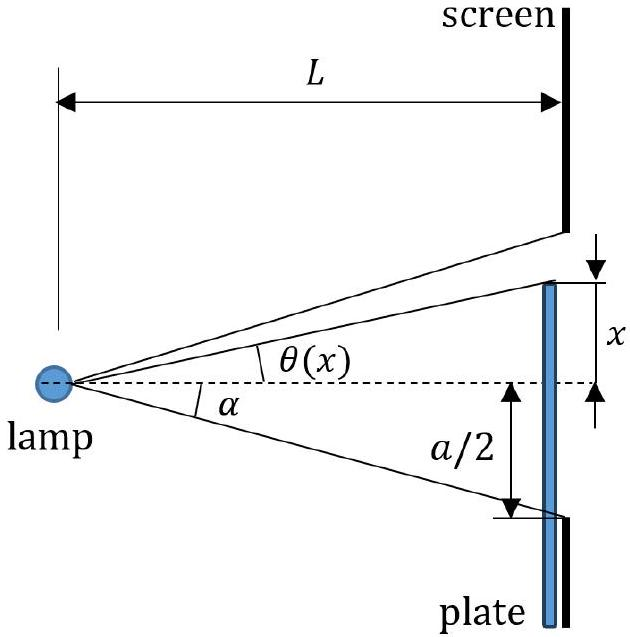

Here the following notation is used for angles, which, if they are small, are found from the relations:

$$
\begin{align*}
& \alpha = \frac { a } { 2 L } ,  \tag{5}\\
& \theta ( x ) = \frac { x } { L } . \tag{6}
\end{align*}
$$

In accordance with 3.4, the radiation power catched by the detector is proportional to the angle, therefore the formula for calculating the milliammeter readings has the form

$$
\begin{equation*}
\Delta I ( x ) = I _ { 0 } \left( \frac { \alpha - \theta ( x ) + \tau ( \alpha + \theta ( x ) ) } { 2 \alpha } - 1 \right) \quad \text { at } \quad - \frac { a } { 2 } < x < \frac { a } { 2 } , \tag{7}
\end{equation*}
$$

and it is obvious that

$$
\begin{equation*}
\Delta I ( x ) = 0 \quad \text { at } \quad x < - \frac { a } { 2 } , \tag{8}
\end{equation*}
$$

and

$$
\begin{equation*}
\Delta I ( x ) = I _ { 0 } ( \tau - 1 ) \quad \text { at } \quad x > \frac { a } { 2 } . \tag{9}
\end{equation*}
$$

The graph of the corresponding function is presented in the figure below, while the coordinates of two characteristic points of the graph are found as

$$
\begin{array} { l l l }
\Delta I = 0.00 \mathrm {~mA} & \text { at } & x = - 2.50 \mathrm {~cm} , \\
\Delta I = - 5.00 \mathrm {~mA} & \text { at } & x = 2.50 \mathrm {~cm} . \tag{11}
\end{array}
$$

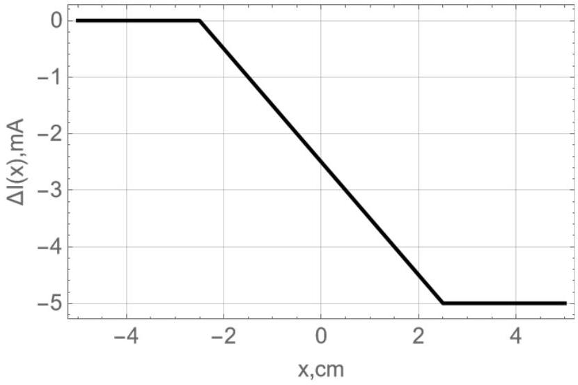
Thick plate

3.6 The appearance of point $x _ { 1 }$ on the graph is due to the fact that light begins to be additionally reflected from the horizontal part of the plate, while the path of the beam from the lamp to the edge of the slit is shown in the figure below.
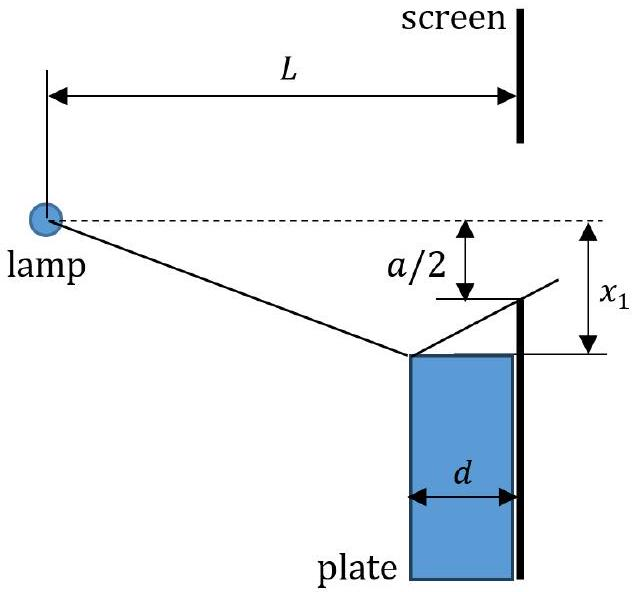
Since the angles are equal during reflection, we can easily find the desired value as

$$
\begin{equation*}
x _ { 1 } = - \frac { a } { 2 } \frac { L - d } { L - 2 d } . \tag{12}
\end{equation*}
$$

3.7 The first maximum is reached when all the light reflected by the horizontal surface of the plate enters the slit and then into the detector. The path of the rays is shown in the figure below, and the corresponding coordinate value is obviously equal to

$$
\begin{equation*}
x _ { 2 } = - \frac { a } { 2 } . \tag{13}
\end{equation*}
$$

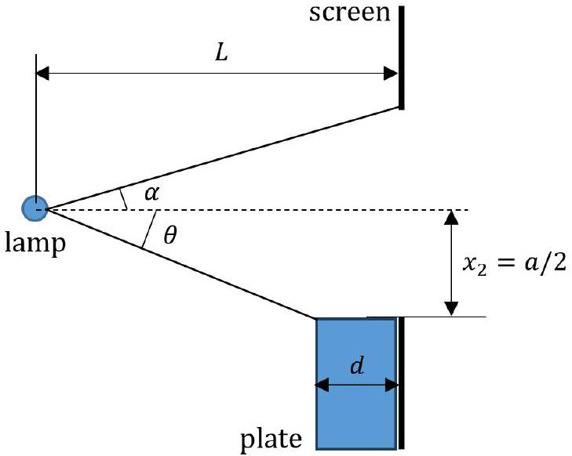
3.8 The value of $\Delta I _ { \text {max } }$ at point $x _ { 2 }$ is found from the relation

$$
\begin{equation*}
\Delta I _ { \max } = I _ { 0 } \left( \frac { \alpha + \theta } { 2 \alpha } - 1 \right) , \tag{14}
\end{equation*}
$$

where the angle $\alpha$ is still determined by expression (5), and the angle $\theta$ is derived as

$$
\begin{equation*}
\theta = \frac { a } { 2 ( L - d ) } , \tag{15}
\end{equation*}
$$

wherefrom we finally get

$$
\begin{equation*}
\Delta I _ { \max } = \frac { I _ { 0 } } { 2 } \frac { d } { ( L - d ) } , \tag{16}
\end{equation*}
$$

3.9 The coordinate $x _ { 3 }$ is determined from the condition that the ray refracted in the plate first hits the lower edge of the slit; the path of the rays is shown in the figure below.
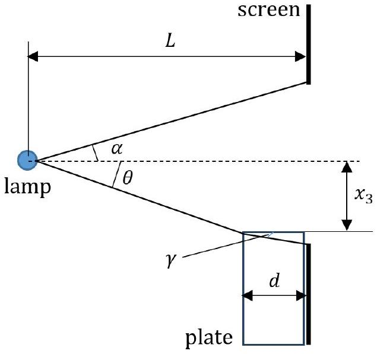

From the figure it follows that the angles are equal

$$
\begin{align*}
& \theta = - \frac { x _ { 3 } } { ( L - d ) } ,  \tag{17}\\
& \gamma = \frac { \frac { a } { 2 } + x _ { 3 } } { d } , \tag{18}
\end{align*}
$$

and according to the law of refraction

$$
\begin{equation*}
\theta = n \gamma . \tag{19}
\end{equation*}
$$

Then from expressions (17)-(19), we finally obtain

$$
\begin{equation*}
x _ { 3 } = - \frac { a } { 2 } \frac { ( L - d ) } { \left( L - d \left( 1 - \frac { 1 } { n } \right) \right) } . \tag{20}
\end{equation*}
$$

3.10 The graph section from coordinate $x _ { 3 }$ to zero is due to the fact that the light partially passes directly through the slit, and partially enters through the plate, being refracted and reflected in it. The path of the rays is shown in the figure below.
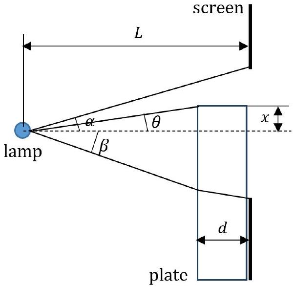

The angle $\alpha$ is still determined by expression (5), and the corresponding angles in the figure are equal to

$$
\begin{align*}
& \theta = \frac { x } { ( L - d ) } ,  \tag{21}\\
& \beta = - \frac { x _ { 3 } } { ( L - d ) } = \frac { a } { 2 \left( L - d \left( 1 - \frac { 1 } { n } \right) \right) } , \tag{22}
\end{align*}
$$

then the value $\Delta I ( x )$ takes the form

$$
\begin{equation*}
\Delta I ( x ) = I _ { 0 } \left( \frac { \alpha - \theta + \tau ( \beta + \theta ) } { 2 \alpha } - 1 \right) , \tag{23}
\end{equation*}
$$

wherefrom we get the slope coefficient

$$
\begin{equation*}
\frac { d \Delta I ( x ) } { d x } = - I _ { 0 } \frac { ( 1 - \tau ) L } { a ( L - d ) } . \tag{24}
\end{equation*}
$$

3.11 Based on the graph given in the problem formulation, we have $x _ { 1 } = - 2.50 \mathrm {~cm} , x _ { 2 } = - 2.00 \mathrm {~cm} , x _ { 3 } =$ $- 1.75 \mathrm {~cm} , \Delta I _ { \text {max } } = 10.0 \mathrm {~mA}$ and $d \Delta I ( x ) / d x = - 1.20 \mathrm {~mA} / \mathrm { cm }$, we obtain the following values of the required parameters

$$
\begin{align*}
& a = 4.0 \mathrm {~cm} ,  \tag{25}\\
& n = 1.4 ,  \tag{26}\\
& \tau = 0.96 ,  \tag{27}\\
& I _ { 0 } = 100 \mathrm {~mA} ,  \tag{28}\\
& L / d = 6.0 . \tag{29}
\end{align*}
$$

3.12 To construct a complete graph, we have to establish all its characteristic points, shown in the figure below as $x _ { 1 } , x _ { 2 } , x _ { 3 } , x _ { 4 } , x _ { 5 } , x _ { 6 }$.
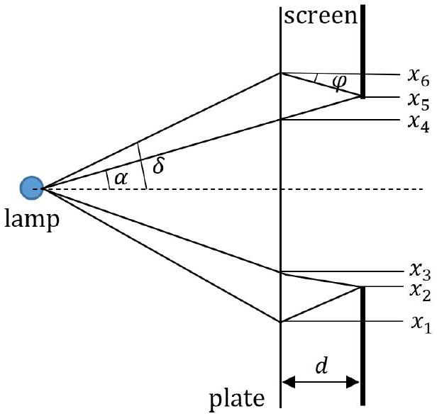

The coordinates of the points $x _ { 1 } , x _ { 2 } , x _ { 3 }$ have been determined above; it is necessary to establish the coordinates of other characteristic points. To do this, we describe the appearance of various branches of the graph, gradually moving the plate from negative to positive values.

| Coordinates of the graph branch | Physical processes |
| :--- | :--- |
| from $- \infty$ to $x _ { 1 }$ | Full direct hit into the slit. |
| from $x _ { 1 }$ to $x _ { 2 }$ | Full direct hit into the slit; reflection from the horizontal section of the plate. |
| from $x _ { 2 }$ to $x _ { 3 }$ | Partial direct hit into the slit; reflection from the horizontal section of the plate. |
| from $x _ { 3 }$ to $x _ { 4 }$ | Partial direct hit into the slit; reflection from the horizontal section of the plate (directly from above and from below passing through the plate); passing through a plate with refraction. |
| from $x _ { 4 }$ to $x _ { 5 }$ | Full direct hit into the slit, passing through the plate; reflection from below from a horizontal section passing through the plate. |
| from $x _ { 5 }$ to $x _ { 6 }$ | Full direct hit into the slit, passing through the plate; partial reflection from below from a horizontal section passing through the plate. |
| from $x _ { 6 }$ to $+ \infty$ | Full direct hit into the slit, passing through the plate. |

Let us find the coordinates of the corresponding characteristic points. The $x _ { 4 }$ coordinate is easily found and is equal to

$$
\begin{equation*}
x _ { 4 } = \frac { a } { 2 } \frac { L - d } { L } = 1.7 \mathrm {~cm} \text {, } \tag{30}
\end{equation*}
$$

and the readings of the milliammeter are determined by the expression

$$
\begin{equation*}
\Delta I _ { 4 } = I _ { 0 } \left( \frac { \tau ( \alpha + \beta ) } { 2 \alpha } - 1 \right) = - 1.9 \mathrm {~mA} . \tag{31}
\end{equation*}
$$

The coordinate $x _ { 5 }$ is obtained as

$$
\begin{equation*}
x _ { 5 } = \frac { a } { 2 } = 2.0 \mathrm {~cm} , \tag{32}
\end{equation*}
$$

and the readings of the milliammeter are determined by the expression

$$
\begin{equation*}
\Delta I _ { 5 } = I _ { 0 } \left( \frac { \tau \left( \alpha + \frac { a } { 2 ( L - d ) } \right) } { 2 \alpha } - 1 \right) = 7.7 \mathrm {~mA} . \tag{33}
\end{equation*}
$$

The angles indicated in the figure are equal

$$
\begin{align*}
& \delta = \frac { x _ { 6 } } { L - d } ,  \tag{34}\\
& \varphi = \frac { x _ { 6 } - \frac { a } { 2 } } { d } \tag{35}
\end{align*}
$$

and are related by the equation

$$
\begin{equation*}
\delta = n \varphi . \tag{36}
\end{equation*}
$$

Thus, the coordinate of point $x _ { 6 }$ is found to be

$$
\begin{equation*}
x _ { 6 } = \frac { a } { 2 } \frac { ( L - d ) } { \left( L - d \left( 1 + \frac { 1 } { n } \right) \right) } = 2.4 \mathrm {~cm} , \tag{37}
\end{equation*}
$$

whereas the readings of the milliammeter are determined by the expression

$$
\begin{equation*}
\Delta I _ { 6 } = I _ { 0 } \left( \frac { \tau ( \alpha + \delta ) } { 2 \alpha } - 1 \right) = 0.24 \mathrm {~mA} . \tag{38}
\end{equation*}
$$

The full relationship graph is shown in the figure below.

|  | Содержание | Баллы |  |
| :--- | :--- | :--- | :--- |
| 3.1 | Formula (1): $\alpha = \beta$ | 0.2 | 0.2 |
| 3.2 | Formula (2): $\sin \alpha = n \sin \beta$ | 0.2 | 0.2 |
| 3.3 | Formula (3): $\alpha = n \beta$ | 0.2 | 0.2 |
| 3.4 | Formula (4): $W _ { \alpha } = W \frac { \alpha } { 2 \pi }$ | 0.4 | 0.4 |
| 3.5 | Formula (5): $\alpha = \frac { a } { 2 L }$ | 0.2 | 3.5 |
|  | Formula (6): $\theta ( x ) = \frac { x } { L }$ | 0.2 |  |
|  | Formula (7): $\Delta I ( x ) = I _ { 0 } \left( \frac { \alpha - \theta ( x ) + \tau ( \alpha + \theta ( x ) ) } { 2 \alpha } - 1 \right) \quad$ at $- \frac { a } { 2 } \leq x \leq \frac { a } { 2 }$ | 0.4 |  |
|  | Formula (8): $\Delta I ( x ) = 0$ | 0.4 |  |
|  | Formula (9): $\Delta I ( x ) = I _ { 0 } ( \tau - 1 )$ | 0.4 |  |
|  | Graph: 0.5 for each correct line in numerical values | 1.5 |  |
|  | Formula (10): $\Delta I = 0.00 \mathrm {~mA}$ at $x = - 2.50 \mathrm {~cm}$ | 0.2 |  |
|  | Formula (11): $\Delta I = - 5.0 \mathrm {~mA}$ at $x = 2.50 \mathrm {~cm}$ | 0.2 |  |
| 3.6 | Formula (12): $x _ { 1 } = - \frac { a } { 2 } \frac { L - d } { L - 2 d }$ | 0.2 | 0.2 |
| 3.7 | Formula (13): $x _ { 2 } = - \frac { a } { 2 }$ | 0.1 | 0.1 |
| 3.8 | Formula (14): $\Delta I _ { \text {max } } = I _ { 0 } \left( \frac { \alpha + \theta } { 2 \alpha } - 1 \right)$ | 0.1 | 0.4 |
|  | Formula (15): $\theta = \frac { a } { 2 ( L - d ) }$ | 0.1 |  |
|  | Formula (16): $\Delta I _ { \text {max } } = \frac { I _ { 0 } } { 2 } \frac { d } { ( L - d ) }$ | 0.2 |  |

| 3.9 | Formula (17): $\theta = - \frac { x _ { 3 } } { ( L - d ) }$ | 0.2 | 0.8 |
| :--- | :--- | :--- | :--- |
|  | Formula (18): $\gamma = \frac { \frac { a } { 2 } + x _ { 3 } } { d }$ | 0.2 |  |
|  | Formula (19): $\theta = n \gamma$ | 0.2 |  |
|  | Formula (20): $x _ { 3 } = - \frac { a } { 2 } \frac { ( L - d ) } { \left( L - d \left( 1 - \frac { 1 } { n } \right) \right) }$ | 0.2 |  |
| 3.10 | Formula (21): $\theta = \frac { x } { ( L - d ) }$ | 0.2 | 0.8 |
|  | Formula (22): $\beta = - \frac { x _ { 3 } } { ( L - d ) } = \frac { a } { 2 \left( L - d \left( 1 - \frac { 1 } { n } \right) \right) }$ | 0.2 |  |
|  | Formula (23): $\Delta I ( x ) = I _ { 0 } \left( \frac { \alpha - \theta + \tau ( \beta + \theta ) } { 2 \alpha } - 1 \right)$ | 0.2 |  |
|  | Formula (24): $\frac { d \Delta I ( x ) } { d x } = - I _ { 0 } \frac { ( 1 - \tau ) L } { a ( L - d ) }$ | 0.2 |  |
| 3.11 | Numerical value in formula (25): $a = 4.0 \mathrm {~cm}$ | 0.2 | 1.0 |
|  | Numerical value in formula (26): $n = 1.4$ | 0.2 |  |
|  | Numerical value in formula (27): $\tau = 0.96$ | 0.2 |  |
|  | Numerical value in formula (28): $I _ { 0 } = 100 \mathrm {~mA}$ | 0.2 |  |
|  | Numerical value in formula (29): $L / d = 6.0$ | 0.2 |  |
| 3.12 | Numerical value in formula (30): $x _ { 4 } = 1.7 \mathrm {~cm}$ | 0.2 | 2.2 |
|  | Numerical value in formula (31): $\Delta I _ { 4 } = - 1.9 \mathrm {~mA}$ | 0.2 |  |
|  | Numerical value in formula (32): $x _ { 5 } = 2.0 \mathrm {~cm}$ | 0.2 |  |
|  | Numerical value in formula (33): $\Delta I _ { 5 } = 7.7 \mathrm {~mA}$ | 0.2 |  |
|  | Formula (34): $\delta = \frac { x _ { 6 } } { L - d }$ | 0.2 |  |
|  | Formula (35): $\varphi = \frac { x _ { 6 } - \frac { a } { 2 } } { d }$ | 0.2 |  |
|  | Formula (36): $\delta = n \varphi$ | 0.2 |  |
|  | Numerical value in formula (37): $x _ { 6 } = 2.4 \mathrm {~cm}$ | 0.2 |  |
|  | Numerical value in formula (38): $\Delta I _ { 6 } = 0.24 \mathrm {~mA}$ | 0.2 |  |
|  | Correct 4 straight lines on the graph from 0.00 to 3.00 cm | $4 \times 0.1$ |  |
| Total |  |  | 10.0 |

## ТЕОРИЯЛЫК САЙЫСТЫҢ ЕСЕПТЕРІНІҢ ШЕШІМІ Назар аударыңыз: бағалау ұпайлары бөлшектенбейді! Есеп 1 (10.0 ұпай) Есеп 1.1 (3.0 ұпай)

Биконус рейкамен сырғанамай домалайтын болғандықтан оның ілгерілемелі жылдамдығы $v$ және айналуының бұрыштық жылдамдығы $\omega$ домалау радиусы $r$ арқылы мына өрнекпен байланысқан

$$
\begin{equation*}
v = \omega r . \tag{1}
\end{equation*}
$$

Биконустың ілгерілемелі қозғалысының кинетикалық энергиясы

$$
\begin{equation*}
W _ { k } = \frac { m v ^ { 2 } } { 2 } , \tag{2}
\end{equation*}
$$

Сәйкес айналмалы қозғалысының энергиясы

$$
\begin{equation*}
W _ { r } = \frac { I \omega ^ { 2 } } { 2 } , \tag{3}
\end{equation*}
$$

где введен момент инерции биконуса

$$
\begin{equation*}
I = \frac { 3 } { 10 } m R ^ { 2 } . \tag{4}
\end{equation*}
$$

Биконустың қозғалыс кезіндегі потенциалдық энергиясының өзгеруі

$$
\begin{equation*}
W _ { p } = - m g R \left( 1 - \frac { r } { R } \right) , \tag{5}
\end{equation*}
$$

ал энергияның сақталу заңы бойынша мына қатынас қанағаттандырылуы керек

$$
\begin{equation*}
W _ { k } + W _ { r } = - W _ { p } . \tag{6}
\end{equation*}
$$

Геометриялық қатынастардан $r$ радиусы мен $x$ координатасы арасында мынадай байланыс шығады

$$
\begin{equation*}
r = R \left( 1 - \frac { x } { h } \tan \gamma \right) , \tag{7}
\end{equation*}
$$

Одан әрі (1)-(7) теңдеулерден мынаны аламыз

$$
\begin{equation*}
v ( x ) = \sqrt { g D \frac { \frac { x } { h } \tan \gamma } { 1 + 3 / 10 \left( 1 - \frac { x } { h } \tan \gamma \right) ^ { 2 } } } . \tag{8}
\end{equation*}
$$

Нақтылы жағдайда $x _ { 0 } = 50.0$ см үшін есептеулер мынаны береді

$$
\begin{equation*}
v _ { 0 } = v \left( x _ { 0 } \right) = 42.2 \mathrm {~cm} / \mathrm { c } . \tag{9}
\end{equation*}
$$

Осы (1)-(7) теңдеулерден бұрыштық жылдамдықтың квадратының айналу радиусынан тәуелділігі

$$
\begin{equation*}
\omega ^ { 2 } = \frac { 2 g } { R } \cdot \frac { m R ^ { 2 } } { I } \cdot \frac { \left( 1 - \frac { r } { R } \right) } { \left( 1 + \frac { m r ^ { 2 } } { I } \right) } , \tag{10}
\end{equation*}
$$

Ол $r = 0$ болғанда мынадай максимальді мән қабылдайды

$$
\begin{equation*}
\omega _ { \max } = \sqrt { \frac { 20 g } { 3 R } } = 40.4 \mathrm { pa } д / \mathrm { c } . \tag{11}
\end{equation*}
$$

Бұл жағдайда биконус бір орнында айналады, яғни (1) өрнекке сәйкес оның ілгерілемелі жылдамдығы нөлге тең болады

| Мазмұны | Ұпайы |
| :--- | :--- |
| Формула (1): $v = \omega r$ | 0.2 |
| Формула (2): $W _ { k } = \frac { m v ^ { 2 } } { 2 }$ | 0.2 |
| Формула (3): $W _ { r } = \frac { I \omega ^ { 2 } } { 2 }$ | 0.2 |
| Формула (4): $I = \frac { 3 } { 10 } m R ^ { 2 }$ | 0.5 |
| Формула (5): $W _ { p } = - m g R \left( 1 - \frac { r } { R } \right)$ | 0.2 |
| Формула (6): $W _ { k } + W _ { r } = - W _ { p }$ | 0.2 |
| Формула (7): $r = R \left( 1 - \frac { x } { h } \tan \gamma \right)$ | 0.5 |

| Формула (8): $v ( x ) = \sqrt { g D \frac { \frac { x } { h } \tan \gamma } { 1 + 0,3 / \left( 1 - \frac { x } { h } \tan \gamma \right) ^ { 2 } } }$ | 0.2 |
| :--- | :--- |
| Формула (9): $v _ { 0 } = 42.2 \mathrm {~cm} / \mathrm { c }$ | 0.2 |
| Формула (10): $\omega ^ { 2 } = \frac { 2 g } { R } \cdot \frac { m R ^ { 2 } } { I } \cdot \frac { \left( 1 - \frac { r } { R } \right) } { \left( 1 + \frac { m r ^ { 2 } } { I } \right) }$ | 0.2 |
| Формула (11): $\omega _ { \text {max } } = \sqrt { \frac { 20 g } { 3 R } }$ | 0.2 |
| (11) формуласының сан мәні: $\omega _ { \max } = 40.4$ рад/с | 0.2 |
| Барлығы | 3.0 |

## Есеп 1.2 (4.0 ұпай)

1) Жүйенің толық ішкі энергиясы температура теңесу кезінде өзгермейді, себебі ол жұмыс істемейді және оған жылу берілмейді

$$
\begin{equation*}
U = U _ { 0 } . \tag{1}
\end{equation*}
$$

Осымен байланысты қалқанша қозғалған кезде оның екі жағындағы газдардың қысымы да бір біріне тең болып, өзгермейді. Жүйенің бастапқы ішкі энергиясы мынаған тең

$$
\begin{equation*}
U _ { 0 } = \frac { C _ { V } } { R } P _ { 0 } 2 V _ { 0 } , \tag{2}
\end{equation*}
$$

мұндағы

$$
\begin{equation*}
C _ { V } = \frac { 5 } { 2 } R . \tag{3}
\end{equation*}
$$

Кез келген уақыт мезетіндегі ішкі энергия

$$
\begin{equation*}
U = \frac { C _ { V } } { R } P \left( 2 V _ { 0 } \right) , \tag{4}
\end{equation*}
$$

Мұндағы $P$ - ыдыстың екі бөлігіндегі газдың қысымы ол (1)-(4) теңдеулерінен анықталады

$$
\begin{equation*}
P = P _ { 0 } , \tag{5}
\end{equation*}
$$

Яғни газда өтетін процесс изобаралық болып табылады.
Уақыттың бастапқы мезетінде ыдыстың әрбір бөлігі үшін идеал газдың күй теңдеуі

$$
\begin{align*}
& P _ { 0 } V _ { 0 } = v _ { 1 } R T _ { 1 } ,  \tag{6}\\
& P _ { 0 } V _ { 0 } = v _ { 2 } R T _ { 2 } , \tag{7}
\end{align*}
$$

мұндағы $v _ { 1 }$ және $v _ { 2 }$ - ыдыстың әрбір жартысындағы азоттың моль саны.
Соңғы мезеттегі газдың температурасы $T _ { 0 }$, ал күй теңдеуі мынадай болады

$$
\begin{equation*}
P _ { 0 } 2 V _ { 0 } = v R T _ { 0 } , \tag{8}
\end{equation*}
$$

Мұндағы ыдыстағы азоттың толық мольдер саны

$$
\begin{equation*}
v = v _ { 1 } + v _ { 2 } . \tag{9}
\end{equation*}
$$

Газдың соңғы температурасын (6)-(9) өрнектерінен анықтаймыз

$$
\begin{equation*}
T _ { 0 } = \frac { 2 T _ { 1 } T _ { 2 } } { T _ { 1 } + T _ { 2 } } . \tag{10}
\end{equation*}
$$

Үрдіс изобаралық болғандықтан газдар алмасатын $Q$ жылу мөлшері

$$
\begin{equation*}
Q = C _ { P } v _ { 1 } \left( T _ { 0 } - T _ { 1 } \right) = \frac { 7 } { 2 } P _ { 0 } V _ { 0 } \cdot \frac { T _ { 2 } - T _ { 1 } } { T _ { 1 } + T _ { 2 } } = 70.0 \text { Дж, } \tag{11}
\end{equation*}
$$

мұндағы

$$
\begin{equation*}
C _ { p } = C _ { V } + R . \tag{12}
\end{equation*}
$$

2) Қалқаншаны бастапқы орнына келтіргенде күш жұмысы минимальді болады, егер қалқанша баяу ығысса жылулық тепе теңдік бұзылмайды

$$
\begin{equation*}
T _ { 1 } ^ { \prime } = T _ { 2 } ^ { \prime } = T , \tag{13}
\end{equation*}
$$

Яғни мұның алдындағы жағдайдан өзгешелігі сол, бұл кезде қымым емес, температура бірдей болады, бірақ ол өзгереді.

Екі бөліктің алғашқы көлемдері Гей-Люссак теңдеуінен мына түрде анықталады

$$
\begin{align*}
& V _ { 01 } = \frac { V _ { 0 } T _ { 0 } } { T _ { 1 } } ,  \tag{14}\\
& V _ { 02 } = \frac { V _ { 0 } T _ { 0 } } { T _ { 2 } } . \tag{15}
\end{align*}
$$

Ыдыс бөліктеріндегі қысымдарды $P _ { 1 }$ және $P _ { 2 }$, ал көлемдерді $V _ { 1 }$ және $V _ { 2 }$ деп белгілейік. Обозначим давление в частях сосуда как $P _ { 1 }$ и $P _ { 2 }$, а соответствующие объемы - $V _ { 1 }$ и $V _ { 2 }$. Онда мына қатынастар орынд болады

$$
\begin{align*}
& P _ { 1 } V _ { 1 } = v _ { 1 } R T ,  \tag{16}\\
& P _ { 2 } V _ { 2 } = v _ { 2 } R T . \tag{17}
\end{align*}
$$

Бұл үрдістегі газдың ішкі энергиясының өзгеруі

$$
\begin{equation*}
d U = v C _ { V } d T , \tag{18}
\end{equation*}
$$

и если газ совершает над внешними телами работу $\delta A$, то по первому началу термодинамики в условиях теплоизоляции сосуда в целом подводимое количество теплоты обращается в нуль

$$
\begin{equation*}
\delta Q = d U + \delta A = 0 . \tag{19}
\end{equation*}
$$

В квазистатическом процессе работа газа в целом складывается из работ газов в каждой из частей сосуда

$$
\begin{equation*}
\delta A = P _ { 1 } d V _ { 1 } + P _ { 2 } d V _ { 2 } . \tag{20}
\end{equation*}
$$

Записывая (18)-(20) совместно и используя уравнения (3), (6), (7), (9), (10), (14) и (15)-(17), получаем

$$
\begin{equation*}
\frac { 5 } { T _ { 0 } } d T + \frac { T } { T _ { 1 } V _ { 1 } } d V _ { 1 } + \frac { T } { T _ { 2 } V _ { 2 } } d V _ { 2 } = 0 , \tag{21}
\end{equation*}
$$

интегрирование которого дает ответ

$$
\begin{equation*}
T _ { f } = T _ { 0 } \left( \frac { T _ { 0 } } { T _ { 1 } } \right) ^ { \frac { T _ { 0 } } { 5 T _ { 1 } } } \left( \frac { T _ { 0 } } { T _ { 2 } } \right) ^ { \frac { T _ { 0 } } { 5 T _ { 2 } } } = 290 \mathrm {~K} . \tag{22}
\end{equation*}
$$

Работа, совершаемая внешними силами над перегородкой для ее перемещения противоположна по знаку работе, совершаемой самим газом, поэтому из выражений (16) и (17) работа легко находится в виде

$$
\begin{equation*}
A ^ { \prime } = - A = \Delta U = \nu C _ { V } \left( T _ { f } - T _ { 0 } \right) = 5 P _ { 0 } V _ { 0 } \frac { T _ { f } - T _ { 0 } } { T _ { 0 } } = 4.04 \text { Дж. } \tag{23}
\end{equation*}
$$

2) Альтернативно решение. Процесс возвращения перегородки в исходное положение - адиабатический, т.е. происходит без изменения энтропии

$$
\begin{equation*}
S = \text { const. } \tag{24}
\end{equation*}
$$

Полное изменение энтропии идеального газа в обеих частях сосуда равно:

$$
\begin{equation*}
\Delta S = v _ { 1 } C _ { V } \ln \frac { T _ { f } } { T _ { 0 } } + v _ { 1 } R \ln \frac { V _ { 0 } } { V _ { 01 } } + v _ { 2 } C _ { V } \ln \frac { T _ { f } } { T _ { 0 } } + v _ { 2 } R \ln \frac { V _ { 0 } } { V _ { 02 } } = 0 , \tag{25}
\end{equation*}
$$

откуда, используя (6), (7), (10), (14), (15) получаем конечную температуру системы

$$
\begin{equation*}
T _ { f } = T _ { 0 } \left( \frac { T _ { 0 } } { T _ { 1 } } \right) ^ { \frac { T _ { 0 } } { 5 T _ { 1 } } } \left( \frac { T _ { 0 } } { T _ { 2 } } \right) ^ { \frac { T _ { 0 } } { 5 T _ { 2 } } } = 290 \mathrm {~K} . \tag{26}
\end{equation*}
$$

Работа внешней силы расходуется на изменение внутренней энергии газа:

$$
\begin{equation*}
A ^ { \prime } = \Delta U = \left( v _ { 1 } + v _ { 2 } \right) C _ { V } \left( T _ { f } - T _ { 0 } \right) = 5 P _ { 0 } V _ { 0 } \frac { T _ { f } - T _ { 0 } } { T _ { 0 } } = 4.04 \text { Дж. } \tag{27}
\end{equation*}
$$

| Содержание | Баллы |
| :--- | :--- |
| Формула (1): $U = U _ { 0 }$ | 0.1 |
| Формула (2): $U _ { 0 } = \frac { C _ { V } } { R } P _ { 0 } 2 V _ { 0 }$ | 0.1 |
| Формула (3): $C _ { V } = \frac { 5 } { 2 } R$ | 0.1 |
| Формула (4): $U = \frac { C _ { V } } { R } P \left( 2 V _ { 0 } \right)$ | 0.1 |
| Формула (5): $P = P _ { 0 }$ | 0.4 |
| Формула (6): $P _ { 0 } V _ { 0 } = v _ { 1 } R T _ { 1 }$ | 0.1 |
| Формула (7): $P _ { 0 } V _ { 0 } = v _ { 2 } R T _ { 2 }$ | 0.1 |
| Формула (8): $P _ { 0 } 2 V _ { 0 } = v R T _ { 0 }$ | 0.1 |
| Формула (9): $v = v _ { 1 } + v _ { 2 }$ | 0.1 |
| Формула (10): $T _ { 0 } = \frac { 2 T _ { 1 } T _ { 2 } } { T _ { 1 } + T _ { 2 } }$ | 0.4 |
| Формула (11): $Q = \frac { 7 } { 2 } P _ { 0 } V _ { 0 } \cdot \frac { T _ { 2 } - T _ { 1 } } { T _ { 1 } + T _ { 2 } }$ | 0.4 |
| Численное значение в формуле (11): $Q = 70.0$ Дж | 0.1 |

| Формула (12): $C _ { p } = C _ { V } + R$ | 0.1 |
| :--- | :--- |
| Формула (13): $T = T _ { 1 } = T _ { 2 }$ | 0.4 |
| Формула (14): $V _ { 01 } = \frac { V _ { 0 } T _ { 0 } } { T _ { 1 } }$ | 0.1 |
| Формула (15): $V _ { 02 } = \frac { V _ { 0 } T _ { 0 } } { T _ { 2 } }$ | 0.1 |
| Формула (16): $P _ { 1 } V _ { 1 } = v _ { 1 } R T$ | 0.1 |
| Формула (17): $P _ { 2 } V _ { 2 } = v _ { 2 } R$ | 0.1 |
| Формула (18): $d U = v C _ { V } d T$ | 0.1 |
| Формула (19): $\delta Q = d U + \delta A = 0$ | 0.1 |
| Формула (20): $\delta A = P _ { 1 } d V _ { 1 } + P _ { 2 } d V _ { 2 }$ | 0.1 |
| Формула (21): $\frac { 5 } { T _ { 0 } } d T + \frac { T } { T _ { 1 } V _ { 1 } } d V _ { 1 } + \frac { T } { T _ { 2 } V _ { 2 } } d V _ { 2 } = 0$ | 0.1 |
| Формула (22): $T _ { f } = T _ { 0 } \left( \frac { T _ { 0 } } { T _ { 1 } } \right) ^ { \frac { T _ { 0 } } { 5 T _ { 1 } } } \left( \frac { T _ { 0 } } { T _ { 2 } } \right) ^ { \frac { T _ { 0 } } { 5 T _ { 2 } } }$ | 0.2 |
| Формула (23): $A ^ { \prime } = v C _ { V } \left( T _ { f } - T _ { 0 } \right) = 5 P _ { 0 } V _ { 0 } \frac { T _ { f } - T _ { 0 } } { T _ { 0 } }$ | 0.2 |
| Численное значение в формуле (23): $A ^ { \prime } = 4.04$ Дж | 0.2 |
| Альтернативное решение 2) |  |
| Формула (13): $T = T _ { 1 } = T _ { 2 }$ | 0.4 |
| Формула (14): $V _ { 01 } = \frac { V _ { 0 } T _ { 0 } } { T _ { 1 } }$ | 0.1 |
| Формула (15): $V _ { 02 } = \frac { V _ { 0 } T _ { 0 } } { T _ { 2 } }$ | 0.1 |
| Формула (24): $S =$ const. | 0.2 |
| Формула (25): $\Delta S = v _ { 1 } C _ { V } \ln \frac { T _ { f } } { T _ { 0 } } + v _ { 1 } R \ln \frac { V _ { 0 } } { V _ { 01 } } + v _ { 2 } C _ { V } \ln \frac { T _ { f } } { T _ { 0 } } + v _ { 2 } R \ln \frac { V _ { 0 } } { V _ { 02 } } = 0$ | 0.4 |
| Формула (26): $T _ { f } = T _ { 0 } \left( \frac { T _ { 0 } } { T _ { 1 } } \right) ^ { \frac { T _ { 0 } } { 5 T _ { 1 } } } \left( \frac { T _ { 0 } } { T _ { 2 } } \right) ^ { \frac { T _ { 0 } } { 5 T _ { 2 } } }$ | 0.2 |
| Формула (27): $A ^ { \prime } = v C _ { V } \left( T _ { f } - T _ { 0 } \right) = 5 P _ { 0 } V _ { 0 } \frac { T _ { f } - T _ { 0 } } { T _ { 0 } }$ | 0.2 |
| Численное значение в формуле (27): $A ^ { \prime } = 4.04$ Дж | 0.2 |
| Итого | 4.0 |

## Задача 1.3 (3.0 балла)

Мощность аккумуляторной батареи расходуется на механическую работу по подъёму груза, а также на мощность тепловых потерь на внутреннем сопротивлении батареи $r$ и на омическом сопротивлении $R$ обмотки двигателя. Если крутящий момент, необходимый для равномерного подъёма груза массы $m _ { 1 } = m$ равен $M$ и вал при этом вращается с угловой скоростью $\omega _ { 1 } = \varphi / t _ { 1 }$, где $\varphi$ - угол поворота вала при подъёме груза на высоту $h$, то по закону сохранения энергии:

$$
\begin{equation*}
U I = M \omega _ { 1 } + I ^ { 2 } ( r + R ) , \tag{1}
\end{equation*}
$$

где $U$ - ЭДС аккумулятора, $I$ - сила тока, создающего необходимый для подъёма груза массы $m$ крутящий момент.

С учётом пропорциональности крутящего момента силе тока

$$
\begin{equation*}
M = \alpha I , \tag{2}
\end{equation*}
$$

где $\alpha$ - коэффициент пропорциональности, уравнение (1) перепишется в виде

$$
\begin{equation*}
U = \alpha \omega _ { 1 } + I ( r + R ) . \tag{3}
\end{equation*}
$$

Очевидно, что для равномерного подъёма груза массой $m _ { 2 } = 2 m$ потребуется вдвое больший крутящий момент и, соответственно, вдвое больший ток. Если при этом скорость вращения вала равна $\omega _ { 2 } = \frac { \varphi } { t _ { 2 } }$, где $t _ { 2 } = t _ { 1 } + \Delta t$ - время подъёма груза $m _ { 2 }$, то соответствующее уравнение имеет вид:

$$
\begin{equation*}
U = \alpha \omega _ { 2 } + 2 I ( r + R ) . \tag{4}
\end{equation*}
$$

Для равномерного подъёма груза массой $m _ { n } = n m$ необходимый ток равен $I _ { n } = n I$. Если этот груз поднимается за время $t _ { n }$ со скоростью $\omega _ { n } = \frac { \varphi } { t _ { n } }$, то соответствующее уравнение выглядит так:

$$
\begin{equation*}
U = \alpha \omega _ { n } + n I ( r + R ) . \tag{5}
\end{equation*}
$$

Из уравнений (3)-(5) $\omega _ { n }$ легко выражается через $\omega _ { 1 } , \omega _ { 2 }$ :

$$
\begin{equation*}
\omega _ { n } = ( n - 1 ) \omega _ { 2 } - ( n - 2 ) \omega _ { 1 } , \tag{6}
\end{equation*}
$$

откуда время подъёма груза массой $m _ { n }$ равно

$$
\begin{equation*}
t _ { n } = \frac { t _ { 1 } t _ { 2 } } { ( n - 1 ) t _ { 1 } - ( n - 2 ) t _ { 2 } } = \frac { t _ { 1 } t _ { 2 } } { t _ { 2 } - ( n - 1 ) \Delta t } . \tag{7}
\end{equation*}
$$

Из условия

$$
\begin{equation*}
t _ { n } > 0 , \tag{8}
\end{equation*}
$$

находим, что $n < \frac { t _ { 2 } } { \Delta t } + 1$, а это означает, что количество грузов $n$ не должно превышать

$$
\begin{equation*}
n _ { \max } = \left[ \frac { t _ { 2 } } { \Delta t } + 1 \right] = \left[ \frac { t _ { 1 } + 2 \Delta t } { \Delta t } \right] = [ 10,6 \ldots ] = 10 . \tag{9}
\end{equation*}
$$

Время подъёма $n = n _ { \text {max } }$ грузов составляет

$$
\begin{equation*}
t _ { \max } = \frac { t _ { 1 } t _ { 2 } } { t _ { 2 } - \left( n _ { \max } - 1 \right) \Delta t } = \frac { t _ { 1 } \left( t _ { 1 } + \Delta t \right) } { t _ { 1 } - \left( n _ { \max } - 2 \right) \Delta t } = 1.01 \cdot 10 ^ { 3 } \mathrm { c } . \tag{10}
\end{equation*}
$$

| Содержание | Баллы |
| :--- | :--- |
| Формула (1): $U I = M \omega _ { 1 } + I ^ { 2 } ( r + R )$ | 0.3 |
| Формула (2): $M = \alpha I$ | 0.1 |
| Формула (3): $U = \alpha \omega _ { 1 } + I ( r + R )$ | 0.2 |
| Формула (4): $U = \alpha \omega _ { 2 } + 2 I ( r + R )$ | 0.2 |
| Формула (5): $U = \alpha \omega _ { n } + n I ( r + R )$ | 0.2 |
| Формула (6): $\omega _ { n } = ( n - 1 ) \omega _ { 2 } - ( n - 2 ) \omega _ { 1 }$ | 0.2 |
| Формула (7): $t _ { n } = \frac { t _ { 1 } t _ { 2 } } { ( n - 1 ) t _ { 1 } - ( n - 2 ) t _ { 2 } } = \frac { t _ { 1 } t _ { 2 } } { t _ { 2 } - ( n - 1 ) \Delta t }$ | 0.2 |
| Формула (8): $t _ { n } > 0$ | 0.4 |
| Формула (9): $n _ { \text {max } } = \left[ \frac { t _ { 2 } } { \Delta t } + 1 \right] = \left[ \frac { t _ { 1 } + 2 \Delta t } { \Delta t } \right]$ | 0.4 |
| Численное значение в формуле (9): $n _ { \text {max } } = 10$ | 0,2 |
| Формула (10): $t _ { \text {max } } = \frac { t _ { 1 } t _ { 2 } } { t _ { 2 } - \left( n _ { \text {max } } - 1 \right) \Delta t } = \frac { t _ { 1 } \left( t _ { 1 } + \Delta t \right) } { t _ { 1 } - \left( n _ { \text {max } } - 2 \right) \Delta t }$ | 0,4 |
| Численное значение в формуле (10): $t _ { \text {max } } = 1.01 \cdot 10 ^ { 3 } \mathrm { c }$ | 0,2 |
| Итого | 3.0 |

## Задача 2. Точки Лагранжа (10.0 балла)   Задача двух тел.

2.1 Радиусы орбит тел равны расстояниям от тел до центра масс и определяются из уравнений

$$
\begin{align*}
& R _ { 1 } + R _ { 2 } = R _ { 0 } ,  \tag{1}\\
& m _ { 1 } R _ { 1 } = m _ { 2 } R _ { 2 } , \tag{2}
\end{align*}
$$

откуда находим искомые радиусы траекторий

$$
\begin{align*}
& R _ { 1 } = \frac { m _ { 2 } } { m _ { 1 } + m _ { 2 } } R _ { 0 } ,  \tag{3}\\
& R _ { 2 } = \frac { m _ { 1 } } { m _ { 1 } + m _ { 2 } } R _ { 0 } . \tag{4}
\end{align*}
$$

2.2 Для расчета угловой скорости вращения тел $\omega _ { 0 }$ запишем уравнение второго закона Ньютона для одного из тел, например для первого, в виде

$$
\begin{equation*}
m _ { 1 } \omega _ { 0 } ^ { 2 } R _ { 1 } = G \frac { m _ { 1 } m _ { 2 } } { R _ { 0 } ^ { 2 } } , \tag{5}
\end{equation*}
$$

которое с учетом (3) дает

$$
\begin{equation*}
\omega _ { 0 } = \sqrt { G \frac { m _ { 1 } + m _ { 2 } } { R _ { 0 } ^ { 3 } } } . \tag{6}
\end{equation*}
$$

## Точки Лагранжа в системе трех тел.

2.3 Выражение для проекции силы, действующей на малое тело $m _ { 0 }$, следует из закона всемирного тяготения Ньютона, который с учетом направления сил дает

$$
\begin{equation*}
F _ { x } = - G \frac { m _ { 0 } m _ { 1 } } { \left| X + R _ { 1 } \right| ^ { 3 } } \left( X + R _ { 1 } \right) - G \frac { m _ { 0 } m _ { 1 } } { \left| X - R _ { 2 } \right| ^ { 3 } } \left( X - R _ { 2 } \right) . \tag{7}
\end{equation*}
$$

С учетом безразмерных соотношений, приведенных в условии, получим выражение для проекции силы в относительных единицах

$$
\begin{equation*}
f _ { x } = - \frac { 1 - \mu } { | x + \mu | ^ { 3 } } ( x + \mu ) - \frac { \mu } { | x - 1 + \mu | ^ { 3 } } ( x - 1 + \mu ) . \tag{8}
\end{equation*}
$$

Уравнение второго закона Ньютона для малого тела имеет вид

$$
\begin{equation*}
- m _ { 0 } \omega _ { 0 } ^ { 2 } X = F _ { x } , \tag{9}
\end{equation*}
$$

обезразмерив которое на заданные величины, получим требуемое уравнение для определения координаты $x$

$$
\begin{equation*}
- x = - \frac { 1 - \mu } { | x + \mu | ^ { 3 } } ( x + \mu ) - \frac { \mu } { | x - 1 + \mu | ^ { 3 } } ( x - 1 + \mu ) . \tag{10}
\end{equation*}
$$

2.4 Для построения графика функции (8) достаточно построить графики функций описывающих притяжение к телу $m _ { 1 }$ (две ветви с асимптотой при $x = - 0.2$ - график 1 на рисунке) и притяжение к телу $m _ { 2 }$ (две ветви с асимптотой при $x = 0.8$ - график 2 на рисунке) и просуммировать их (кривая 3 на рисунке). Этот график имеет три ветви.
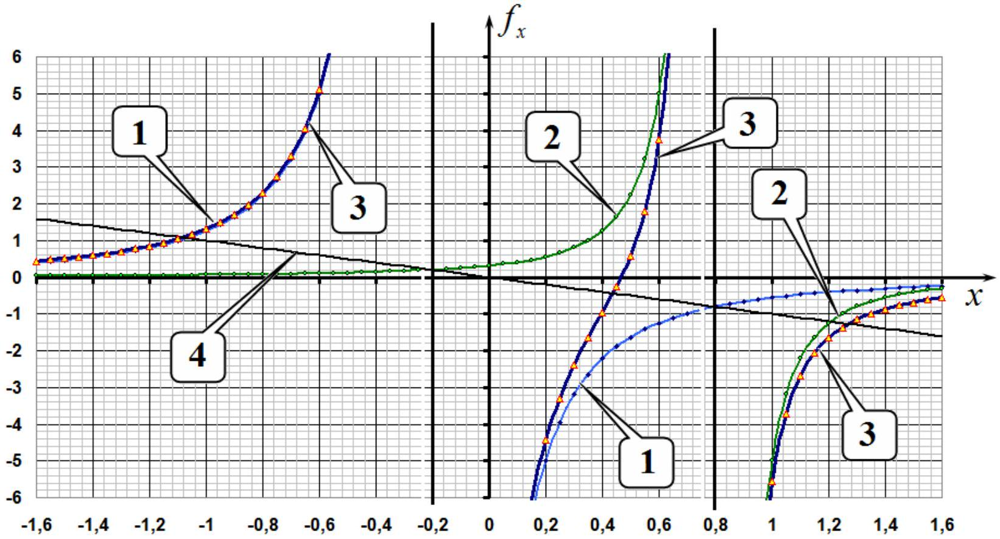
2.5 На построенном графике проведем прямую, описываемую уравнением $f _ { x } = - x$. Координаты точек пересечения этой прямой с графиком зависимости $f _ { x } ( x )$ являются действительными корнями уравнения (10), т.е. являются координатами точек Лагранжа, лежащих на оси $X$. Как следует из проведенного построение таких точек ровно 3.
2.6 Уравнение (10) является уравнением пятой степени, поэтому не может быть решено аналитически. Однако по условию требуется рассчитать численные значения с невысокой погрешностью. Для этого достаточно подсчитать численные значения силы, действующей на малое тело, с шагом изменения $x$, равным 0,1 , и определить интервал, в котором находится соответствующий корень.

Рассчитаем значение координаты точки Лагранжа $L _ { 1 }$, находящейся между телами $m _ { 1 }$ и $m _ { 2 }$. Для этой точки уравнение (10) можно переписать в виде

$$
\begin{equation*}
x = \frac { 1 - \mu } { ( x + \mu ) ^ { 2 } } - \frac { \mu } { ( 1 - \mu - x ) ^ { 2 } } . \tag{11}
\end{equation*}
$$

В Таблице ниже приведены значения левой и правой частей уравнения (11) при $\mu = 0.20$

| $x$ | 0,2 | 0,3 | 0,4 | 0,5 | 0,6 |
| :--- | :--- | :--- | :--- | :--- | :--- |
| $f ( x )$ | 4,44 | 2,40 | 0,97 | -0,59 | -3,75 |

Из таблицы следует, что корень уравнения лежит в интервале от 0,4 до 0,5 , т.е.

$$
\begin{equation*}
x _ { 1 } \approx 0.45 . \tag{12}
\end{equation*}
$$

Для координаты точки $L _ { 2 }$, лежащей за телом $m _ { 2 }$, имеем уравнение

$$
\begin{equation*}
x = \frac { 1 - \mu } { ( x + \mu ) ^ { 2 } } + \frac { \mu } { ( x - 1 + \mu ) ^ { 2 } } , \tag{13}
\end{equation*}
$$

а в следующей таблице рассчитаны значения левой и правой частей этого уравнения

| $x$ | 1 | 1,1 | 1,2 | 1,3 | 1,4 |
| :--- | :--- | :--- | :--- | :--- | :--- |
| $f ( x )$ | 5,56 | 2,70 | 1,66 | 1,16 | 0,87 |

Из данных этой таблицы следует, что корень этого уравнения лежит в интервале между 1.2 и 1.3, т.е.

$$
\begin{equation*}
x _ { 2 } \approx 1.25 . \tag{14}
\end{equation*}
$$

Наконец, для точки $L _ { 3 }$, лежащей за телом $m _ { 1 }$ имеем уравнение (здесь изменено направление оси)

$$
\begin{equation*}
x = \frac { 1 - \mu } { ( x - \mu ) ^ { 2 } } + \frac { \mu } { ( 1 - \mu + x ) ^ { 2 } } , \tag{15}
\end{equation*}
$$

а в следующей таблице приведены результаты аналогичных расчетов

| $x$ | 0,8 | 0,9 | 1 | 1,1 | 1,2 |
| :--- | :--- | :--- | :--- | :--- | :--- |
| $f ( x )$ | 2,30 | 1,70 | 1,31 | 1,04 | 0,85 |

из которых следует, что корень уравнения (15) лежит в интервале от 1.0 до 1.1, а, следовательно, координата точки Лагранжа $L _ { 3 }$

$$
\begin{equation*}
x _ { 3 } \approx 1.05 . \tag{16}
\end{equation*}
$$

2.7 Для доказательства того, что вершина правильного треугольника является точкой Лагранжа $L _ { 4 }$, запишем выражение для суммарной силы, действующей на тело малой массы $m _ { 0 }$, в векторной форме:

$$
\begin{equation*}
\vec { F } = G \frac { m _ { 0 } m _ { 1 } } { R _ { 0 } ^ { 3 } } \overrightarrow { r _ { 1 } } + G \frac { m _ { 0 } m _ { 2 } } { R _ { 0 } ^ { 3 } } \overrightarrow { r _ { 2 } } . \tag{17}
\end{equation*}
$$

Выражение справа в формуле (17) выражается через радиусвектор центра масс

$$
\begin{equation*}
m _ { 1 } \overrightarrow { r _ { 1 } } + m _ { 2 } \overrightarrow { r _ { 2 } } = \left( m _ { 1 } + m _ { 2 } \right) \overrightarrow { r _ { C } } , \tag{18}
\end{equation*}
$$

тогда уравнение второго закона Ньютона для этого тела в проекции на
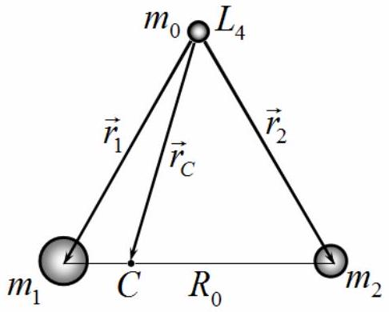

Из этого уравнения следует, что угловая скорость движения тела $m _ { 0 }$ равна

$$
\begin{equation*}
\omega = \sqrt { G \frac { m _ { 1 } + m _ { 2 } } { R _ { 0 } ^ { 3 } } } = \omega _ { 0 } , \tag{20}
\end{equation*}
$$

что совпадает с угловой скоростью вращения массивных тел (6), поэтому положение тела $m _ { 0 }$ будет оставаться неизменным относительно массивных тел. Следовательно, вершина равностороннего треугольника действительно является точкой Лагранжа.

## Точки Лагранжа в Солнечной системе.

2.8 Чтобы положение аппарата SOHO оставалось неизменным относительно Земли и Солнца, необходимо, чтобы он находился в точке Лагранжа $L _ { 1 }$. Для того, чтобы определить ее положение, надо решить уравнение (11). Рассчитаем значение параметра $\mu$ для системы Солнце - Земля:

$$
\begin{equation*}
\mu = \frac { M _ { 2 } } { M _ { 1 } + M _ { 2 } } = 3.00 \cdot 10 ^ { - 6 } . \tag{21}
\end{equation*}
$$

Это значение значительно меньше 1 , поэтому расстояние $l$ от аппарата до Земли значительно меньше радиуса земной орбиты. В использованной системе единиц обозначим $z = \frac { l } { R _ { 0 } } = 1 - \mu - x$, тогда из уравнения (11) получим

$$
\begin{equation*}
1 - \mu - z = \frac { 1 - \mu } { ( 1 - z ) ^ { 2 } } - \frac { \mu } { z ^ { 2 } } . \tag{22}
\end{equation*}
$$

Так как $z , \mu \ll 1$, то можно воспользоваться разложением $\frac { 1 } { ( 1 - z ) ^ { 2 } } \approx 1 + 2 z$ и в этом случае уравнение (22) существенно упрощается и из него находится $z = ( \mu / 3 ) ^ { 1 / 3 }$, то есть искомое расстояние равно

$$
\begin{equation*}
l _ { S } = R _ { 0 } \sqrt [ 3 ] { \frac { M _ { 2 } } { 3 M _ { 1 } } } = 1.50 \cdot 10 ^ { 6 } \text { км. } \tag{23}
\end{equation*}
$$

2.9 Очевидно, что телескоп «Джеймс Уэбб» находится в точке Лагранжа $L _ { 2 }$, поэтому для определения его положение надо решить уравнение $( 13 )$, используя метод, аналогичный методу п. 2.8:

$$
\begin{equation*}
1 + z = \frac { 1 } { ( 1 + z ) ^ { 2 } } + \frac { \mu } { z ^ { 2 } } \tag{24}
\end{equation*}
$$

т.е. космический телескоп находится на таком же расстоянии от Земли (только с другой стороны):

$$
\begin{equation*}
l _ { W } = R _ { 0 } \sqrt [ 3 ] { \frac { M _ { 2 } } { 3 M _ { 1 } } } = 1.50 \cdot 10 ^ { 6 } \mathrm { км } \tag{25}
\end{equation*}
$$

2.10 Если астероид случайно окажется в точке Лагранжа $L _ { 4 }$, или симметричной ей точке $L _ { 5 }$ для системы Юпитер-Солнце, то его положение относительно Юпитера и Солнца будет долгое время оставаться неизменным. Астероиды, находящиеся в других точках, будут постоянно изменять свое положение относительно Юпитера и Солнца. Следовательно, центры групп троянских астероидов находятся в боковых точках Лагранжа. Поэтому расстояние от Юпитера до этих точек равно расстоянию от Юпитера до Солнца. Масса Юпитера значительно меньше массы Солнца, поэтому расстояние между ними практически равно радиусу орбиты Юпитера, который можно найти, используя, третий закон Кеплера

$$
\begin{equation*}
l _ { J } = R _ { 0 } \left( \frac { T _ { J } } { T _ { 0 } } \right) ^ { 2 / 3 } = 7.82 \cdot 10 ^ { 8 } \mathrm { KM } , \tag{26}
\end{equation*}
$$

где $T _ { 0 } = 1$ год - период вращения Земли вокруг Солнца.

|  | Содержание | Баллы |  |
| :--- | :--- | :--- | :--- |
| 2.1 | Формула (1): $R _ { 1 } + R _ { 2 } = R _ { 0 }$ | 0.1 | 0.4 |
|  | Формула (2): $m _ { 1 } R _ { 1 } = m _ { 2 } R _ { 2 }$ | 0.1 |  |
|  | Формула (3): $R _ { 1 } = \frac { m _ { 2 } } { m _ { 1 } + m _ { 2 } } R _ { 0 }$ | 0.1 |  |
|  | Формула (4): $R _ { 2 } = \frac { m _ { 1 } } { m _ { 1 } + m _ { 2 } } R _ { 0 }$ | 0.1 |  |
| 2.2 | Формула (5): $m _ { 1 } \omega _ { 0 } ^ { 2 } R _ { 1 } = G \frac { m _ { 1 } m _ { 2 } } { R _ { 0 } ^ { 2 } }$ | 0.1 | 0.2 |
|  | Формула (6): $\omega _ { 0 } = \sqrt { G \frac { m _ { 1 } + m _ { 2 } } { R _ { 0 } ^ { 3 } } }$ | 0.1 |  |
| 2.3 | Формула (7): $F _ { x } = - G \frac { m _ { 0 } m _ { 1 } } { \left\| X + R _ { 1 } \right\| ^ { 3 } } \left( X + R _ { 1 } \right) - G \frac { m _ { 0 } m _ { 1 } } { \left\| X - R _ { 2 } \right\| ^ { 3 } } \left( X - R _ { 2 } \right)$ | 0.5 | 2.0 |
|  | Формула (8): $f _ { x } = - \frac { 1 - \mu } { \| x + \mu \| ^ { 3 } } ( x + \mu ) - \frac { \mu } { \| x - 1 + \mu \| ^ { 3 } } ( x - 1 + \mu )$ | 0.5 |  |
|  | Формула (9): $- m _ { 0 } \omega _ { 0 } ^ { 2 } X = F _ { x }$ | 0.5 |  |
|  | Формула (10): $- x = - \frac { 1 - \mu } { \| x + \mu \| ^ { 3 } } ( x + \mu ) - \frac { \mu } { \| x - 1 + \mu \| ^ { 3 } } ( x - 1 + \mu )$ | 0.5 |  |
| 2.4 | Положение вертикальных асимптот на графике | 0.2 | 0.8 |
|  | 3 ветви графика | $3 \times 0.2 = 0,6$ |  |
| 2.5 | На графике добавлена прямая $f _ { x } = - x$ | 0.2 | 0.3 |
|  | Указаны три точки пересечения, соответствуют 3 точкам Лагранжа | 0.1 |  |
| 2.6 | За каждую точку:   - указано положение;   - найдено численное значение. | $3 \times ( 0.1 + 0.2 ) = 0.9$ | 0.9 |
| 2.7 | Формула (17): $\vec { F } = G \frac { m _ { 0 } m _ { 1 } } { R _ { 0 } ^ { 3 } } \overrightarrow { r _ { 1 } } + G \frac { m _ { 0 } m _ { 2 } } { R _ { 0 } ^ { 3 } } \overrightarrow { r _ { 2 } }$ | 0.2 | 1.0 |
|  | Формула (18): $m _ { 1 } \overrightarrow { r _ { 1 } } + m _ { 2 } \overrightarrow { r _ { 2 } } = \left( m _ { 1 } + m _ { 2 } \right) \overrightarrow { r _ { C } }$ | 0.2 |  |
|  | Формула (19): $m _ { 0 } \omega ^ { 2 } r _ { C } = G \frac { m _ { 0 } } { R _ { 0 } ^ { 3 } } \left( m _ { 1 } + m _ { 2 } \right) r _ { C }$ | 0.3 |  |
|  | Формула (20): $\omega = \sqrt { G \frac { m _ { 1 } + m _ { 2 } } { R _ { 0 } ^ { 3 } } } = \omega _ { 0 }$ | 0.3 |  |
| 2.8 | Численное значение (21): $\mu = 3.00 \cdot 10 ^ { - 6 }$ | 0.2 | 1.6 |

|  | Точное уравнение (22): $1 - \mu - z = \frac { 1 - \mu } { ( 1 - z ) ^ { 2 } } - \frac { \mu } { z ^ { 2 } }$ | 0.2 |  |
| :--- | :--- | :--- | :--- |
|  | Формула (23): $l _ { S } = R _ { 0 } \sqrt [ 3 ] { \frac { M _ { 2 } } { 3 M _ { 1 } } }$ | 0.7 |  |
|  | Численное значение в формуле (23): $l _ { S } = 1.50 \cdot 10 ^ { 6 }$ км. | 0.5 |  |
| 2.9 | Формула (24): $1 + z = \frac { 1 } { ( 1 + z ) ^ { 2 } } + \frac { \mu } { z ^ { 2 } }$ | 0.2 | 1.4   1.4 |
|  | Формула (25): $l _ { W } = R _ { 0 } \sqrt [ 3 ] { \frac { M _ { 2 } } { 3 M _ { 1 } } }$ | 0.7 |  |
|  | Численное значение в формуле (25): $l _ { W } = 1.50 \cdot 10 ^ { 6 }$ км. | 0.5 |  |
| 2.10 | Формула (26): $l _ { J } = R _ { 0 } \left( \frac { T _ { J } } { T _ { 0 } } \right) ^ { 2 / 3 }$ | 1.0 | 1.4 |
|  | Численное значение в формуле (26): $l _ { J } = 7.82 \cdot 10 ^ { 8 }$ км | 0.4 |  |
| Итого |  |  | 10.0 |

## Задача 3. Геометрическая оптика и фотодетектор (10.0 баллов)

3.1 По закону отражения света выполняется соотношение

$$
\begin{equation*}
\alpha = \beta . \tag{1}
\end{equation*}
$$

3.2 По закону преломления света Снеллиуса выполняется равенство

$$
\begin{equation*}
\sin \alpha = n \sin \beta . \tag{2}
\end{equation*}
$$

3.3 При малых углах синусы можно заменить самим аргументами, что приводит к выражению

$$
\begin{equation*}
\alpha = n \beta . \tag{3}
\end{equation*}
$$

3.4 Поскольку лампа излучает по всем направлениям равномерно, то искомая мощность излучения составляет

$$
\begin{equation*}
W _ { \alpha } = W \frac { \alpha } { 2 \pi } . \tag{4}
\end{equation*}
$$

Таким образом, мощность излучения лампы в определенном направлении определяется соответствующим углом.

## Тонкая пластинка

3.5 Для решения задачи построим рисунок, показанный ниже.
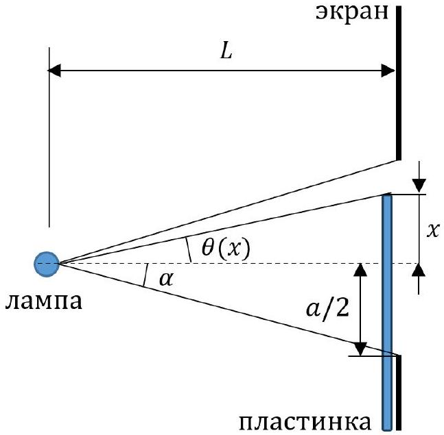

Здесь использованы следующие обозначения для углов, которые в случае их малости находятся из соотношений:

$$
\begin{align*}
& \alpha = \frac { a } { 2 L } ,  \tag{5}\\
& \theta ( x ) = \frac { x } { L } . \tag{6}
\end{align*}
$$

В соответствии с пунктом 3.4 регистрируемая детектором мощность излучения пропорциональна углу, поэтому формула для вычисления показаний миллиамперметра имеет вид

$$
\begin{equation*}
\Delta I ( x ) = I _ { 0 } \left( \frac { \alpha - \theta ( x ) + \tau ( \alpha + \theta ( x ) ) } { 2 \alpha } - 1 \right) \quad \text { при } \quad - \frac { a } { 2 } < x < \frac { a } { 2 } , \tag{7}
\end{equation*}
$$

при этом очевидно, что

$$
\begin{equation*}
\Delta I ( x ) = 0 \quad \text { при } \quad x < - \frac { a } { 2 } , \tag{8}
\end{equation*}
$$

и

$$
\begin{equation*}
\Delta I ( x ) = I _ { 0 } ( \tau - 1 ) \quad \text { при } \quad x > \frac { a } { 2 } . \tag{9}
\end{equation*}
$$

График соответствующей функции представлен на рисунке ниже, при этом координаты двух характерных точек графика

$$
\begin{array} { l l l }
\Delta I = 0.00 \text { мА } & \text { при } & x = - 2.50 \mathrm {~cm} , \\
\Delta I = - 5.00 \text { мА } & \text { при } & x = 2.50 \mathrm {~cm} . \tag{11}
\end{array}
$$

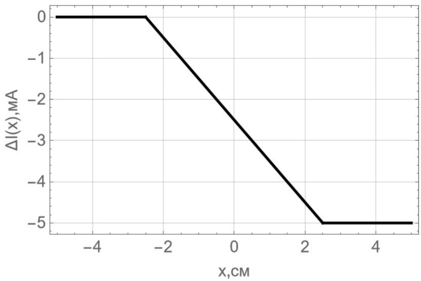
Толстая пластинка

3.6 Появление точки $x _ { 1 }$ на графике связано с тем, что свет начинает дополнительно отражаться от горизонтальной части пластины, при этом ход луча от лампы до края щели показан на рисунке ниже.
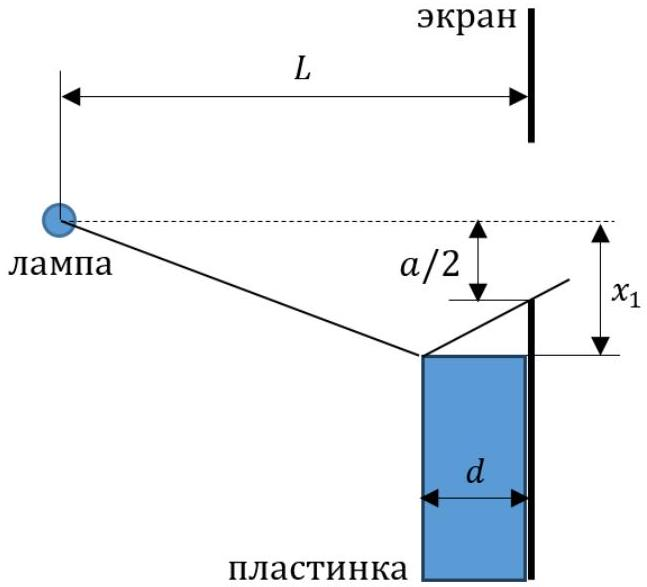

Поскольку при отражении углы равны, то отсюда легко находим искомую величину

$$
\begin{equation*}
x _ { 1 } = - \frac { a } { 2 } \frac { L - d } { L - 2 d } . \tag{12}
\end{equation*}
$$

3.7 Первый максимум достигается, когда весь свет, отраженный горизонтальной поверхностью пластинки, попадает в щель и затем в детектор. Ход лучей при этом показан на рисунке ниже, а соответствующее значение координаты, очевидно, равно

$$
\begin{equation*}
x _ { 2 } = - \frac { a } { 2 } . \tag{13}
\end{equation*}
$$

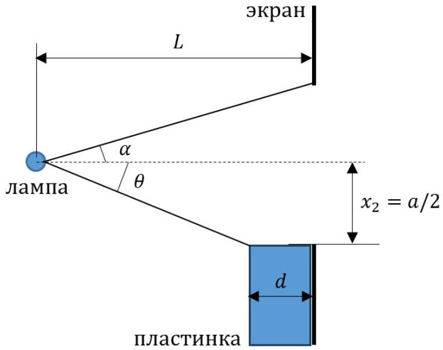
3.8 Значение $\Delta I _ { \text {max } }$ в точке $x _ { 2 }$ находится из соотношения

$$
\begin{equation*}
\Delta I _ { \max } = I _ { 0 } \left( \frac { \alpha + \theta } { 2 \alpha } - 1 \right) , \tag{14}
\end{equation*}
$$

где величина угла $\alpha$ по прежнему определяется выражением (5), а угол $\theta$ составляет

$$
\begin{equation*}
\theta = \frac { a } { 2 ( L - d ) } , \tag{15}
\end{equation*}
$$

откуда окончательно получаем

$$
\begin{equation*}
\Delta I _ { \max } = \frac { I _ { 0 } } { 2 } \frac { d } { ( L - d ) } , \tag{16}
\end{equation*}
$$

3.9 Координата $x _ { 3 }$ определяется из условия, что преломленный в пластине луч впервые попадает в нижний край щели, ход лучей показан на рисунке ниже.
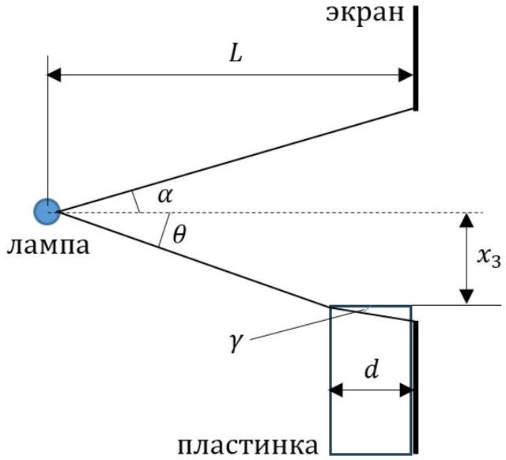

Из рисунка следует, что углы равны

$$
\begin{align*}
& \theta = - \frac { x _ { 3 } } { ( L - d ) } ,  \tag{17}\\
& \gamma = \frac { \frac { a } { 2 } + x _ { 3 } } { d } , \tag{18}
\end{align*}
$$

при этом по закону преломления

$$
\begin{equation*}
\theta = n \gamma . \tag{19}
\end{equation*}
$$

Тогда из выражений (17)-(19), окончательно получаем

$$
\begin{equation*}
x _ { 3 } = - \frac { a } { 2 } \frac { ( L - d ) } { \left( L - d \left( 1 - \frac { 1 } { n } \right) \right) } . \tag{20}
\end{equation*}
$$

3.10 Участок от координаты $x _ { 3 }$ до нуля обусловлен тем, что свет частично напрямую проходит через щель, а частично попадает через пластину, преломляясь и отражаясь в ней. Ход лучей показан на рисунке ниже.

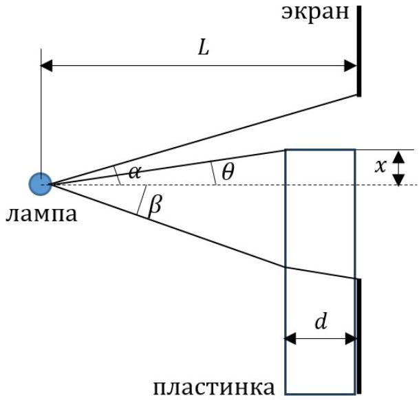

Угол $\alpha$ по-прежнему определяется выражением (5), а соответствующие углы на рисунке равны

$$
\begin{align*}
& \theta = \frac { x } { ( L - d ) } ,  \tag{21}\\
& \beta = - \frac { x _ { 3 } } { ( L - d ) } = \frac { a } { 2 \left( L - d \left( 1 - \frac { 1 } { n } \right) \right) } , \tag{22}
\end{align*}
$$

тогда значение $\Delta I ( x )$ принимает вид

$$
\begin{equation*}
\Delta I ( x ) = I _ { 0 } \left( \frac { \alpha - \theta + \tau ( \beta + \theta ) } { 2 \alpha } - 1 \right) , \tag{23}
\end{equation*}
$$

откуда получаем коэффициент наклона

$$
\begin{equation*}
\frac { d \Delta I ( x ) } { d x } = - I _ { 0 } \frac { ( 1 - \tau ) L } { a ( L - d ) } . \tag{24}
\end{equation*}
$$

3.11 Исходя из приведенного в условии графика, имеем $x _ { 1 } = - 2.50 с м$, $x _ { 2 } = - 2.00 с м$, $x _ { 3 } = - 1.75$ см, $\Delta I _ { \text {max } } = 10.0$ мА и $d \Delta I ( x ) / d x = - 1.20$ мА/см, получаем следующие значения искомых параметров

$$
\begin{align*}
& a = 4.00 \mathrm {~cm} ,  \tag{25}\\
& n = 1.34 ,  \tag{26}\\
& \tau = 0.960 ,  \tag{27}\\
& I _ { 0 } = 100 \mathrm {~mA} ,  \tag{28}\\
& L / d = 6.00 . \tag{29}
\end{align*}
$$

3.12 Для построения полного графика установим все его характерные точки, показанные на рисунке ниже как $x _ { 1 } , x _ { 2 } , x _ { 3 } , x _ { 4 } , x _ { 5 } , x _ { 6 }$.
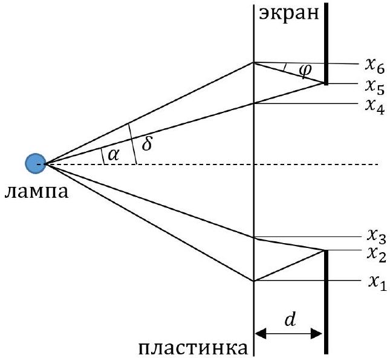

Координаты точек $x _ { 1 } , x _ { 2 } , x _ { 3 }$ были определены выше, необходимо установить координаты других характерных точек. Для этого опишем появление различных ветвей графика, постепенно продвигая пластинку от отрицательных до положительных значений.

| Координаты ветви графика | Физические процессы |
| :--- | :--- |
| от $- \infty$ до $x _ { 1 }$ | Полное прямое попадание в щель. |
| от $x _ { 1 }$ до $x _ { 2 }$ | Полное прямое попадание в щель; отражение от горизонтального участка пластинки. |

| от $x _ { 2 }$ до $x _ { 3 }$ | Частичное прямое попадание в щель; отражение от горизонтального участка пластинки. |
| :--- | :--- |
| от $x _ { 3 }$ до $x _ { 4 }$ | Частичное прямое попадание в щель; отражение от горизонтального участка пластинки (сверху напрямую и снизу с прохождением через пластинку); прохождение через пластинку с преломлением. |
| от $x _ { 4 }$ до $x _ { 5 }$ | Полное прямое попадание в щель с прохождением через пластинку; отражение снизу от горизонтального участка с прохождением через пластинку. |
| от $x _ { 5 }$ до $x _ { 6 }$ | Полное прямое попадание в щель с прохождением через пластинку; частичное отражение снизу от горизонтального участка с прохождением через пластинку. |
| от $x _ { 6 }$ до $+ \infty$ | Полное прямое попадание в щель с прохождением через пластинку. |

Найдем координаты соответствующих характерных точек. Координата $x _ { 4 }$ легко находится и равна

$$
\begin{equation*}
x _ { 4 } = \frac { a } { 2 } \frac { L - d } { L } = 1.67 \mathrm {~cm} , \tag{30}
\end{equation*}
$$

а показания миллиамперметра определяются выражением

$$
\begin{equation*}
\Delta I _ { 4 } = I _ { 0 } \left( \frac { \tau ( \alpha + \beta ) } { 2 \alpha } - 1 \right) = - 1.88 \text { мА. } \tag{31}
\end{equation*}
$$

Координата точки $x _ { 5 }$ равна

$$
\begin{equation*}
x _ { 5 } = \frac { a } { 2 } = 2.00 \mathrm {~cm} , \tag{32}
\end{equation*}
$$

а показания миллиамперметра определяются выражением

$$
\begin{equation*}
\Delta I _ { 5 } = I _ { 0 } \left( \frac { \tau \left( \alpha + \frac { a } { 2 ( L - d ) } \right) } { 2 \alpha } - 1 \right) = 7.72 \text { мА. } \tag{33}
\end{equation*}
$$

Углы, обозначенные на рисунке равны

$$
\begin{align*}
\delta & = \frac { x _ { 6 } } { L - d } ,  \tag{34}\\
\varphi & = \frac { x _ { 6 } - \frac { a } { 2 } } { d } \tag{35}
\end{align*}
$$

и связаны соотношением

$$
\begin{equation*}
\delta = n \varphi . \tag{36}
\end{equation*}
$$

Таким образом, координата точки $x _ { 6 }$ равна

$$
\begin{equation*}
x _ { 6 } = \frac { a } { 2 } \frac { ( L - d ) } { \left( L - d \left( 1 + \frac { 1 } { n } \right) \right) } = 2.35 \mathrm {~cm} , \tag{37}
\end{equation*}
$$

а показания миллиамперметра определяются выражением

$$
\begin{equation*}
\Delta I _ { 6 } = I _ { 0 } \left( \frac { \tau ( \alpha + \delta ) } { 2 \alpha } - 1 \right) = 0.239 \mathrm { мA } . \tag{38}
\end{equation*}
$$

Полный график зависимости показан на рисунке ниже.

|  | Содержание | Баллы |  |
| :--- | :--- | :--- | :--- |
| 3.1 | Формула (1): $\alpha = \beta$ | 0.2 | 0.2 |
| 3.2 | Формула (2): $\sin \alpha = n \sin \beta$ | 0.2 | 0.2 |
| 3.3 | Формула (3): $\alpha = n \beta$ | 0.2 | 0.2 |
| 3.4 | Формула (4): $W _ { \alpha } = W \frac { \alpha } { 2 \pi }$ | 0.4 | 0.4 |
| 3.5 | Формула (5): $\alpha = \frac { a } { 2 L }$ | 0.2 | 3.5 |
|  | Формула (6): $\theta ( x ) = \frac { x } { L }$ | 0.2 |  |
|  | Формула (7): $\Delta I ( x ) = I _ { 0 } \left( \frac { \alpha - \theta ( x ) + \tau ( \alpha + \theta ( x ) ) } { 2 \alpha } - 1 \right) \quad$ при $- \frac { a } { 2 } \leq x \leq \frac { a } { 2 }$ | 0.4 |  |
|  | Формула (8): $\Delta I ( x ) = 0$ | 0.4 |  |
|  | Формула (9): $\Delta I ( x ) = I _ { 0 } ( \tau - 1 )$ | 0.4 |  |
|  | График: 0.5 за каждую верную прямую в числовых значениях | 1.5 |  |
|  | Формула (10): $\Delta I = 0.00 \mathrm {~mA}$ | 0.2 |  |
|  | Формула (11): $\Delta I = - 5.0 \mathrm {~mA}$ | 0.2 |  |
| 3.6 | Формула (12): $x _ { 1 } = - \frac { a } { 2 } \frac { L - d } { L - 2 d }$ | 0.2 | 0.2 |
| 3.7 | Формула (13): $x _ { 2 } = - \frac { a } { 2 }$ | 0.1 | 0.1 |
| 3.8 | Формула (14): $\Delta I _ { \text {max } } = I _ { 0 } \left( \frac { \alpha + \theta } { 2 \alpha } - 1 \right)$ | 0.1 | 0.4 |
|  | Формула (15): $\theta = \frac { a } { 2 ( L - d ) }$ | 0.1 |  |
|  | Формула (16): $\Delta I _ { \text {max } } = \frac { I _ { 0 } } { 2 } \frac { d } { ( L - d ) }$ | 0.2 |  |
| 3.9 | Формула (17): $\theta = - \frac { x _ { 3 } } { ( L - d ) }$ | 0.2 | 0.8 |
|  | Формула (18): $\gamma = \frac { \frac { a } { 2 } + x _ { 3 } } { d }$ | 0.2 |  |
|  | Формула (19): $\theta = n \gamma$ | 0.2 |  |
|  | Формула (20): $x _ { 3 } = - \frac { a } { 2 } \frac { ( L - d ) } { \left( L - d \left( 1 - \frac { 1 } { n } \right) \right) }$ | 0.2 |  |
| 3.10 | Формула (21): $\theta = \frac { x } { ( L - d ) }$ | 0.2 | 0.8 |
|  | Формула (22): $\beta = - \frac { x _ { 3 } } { ( L - d ) } = \frac { a } { 2 \left( L - d \left( 1 - \frac { 1 } { n } \right) \right) }$ | 0.2 |  |
|  | Формула (23): $\Delta I ( x ) = I _ { 0 } \left( \frac { \alpha - \theta + \tau ( \beta + \theta ) } { 2 \alpha } - 1 \right)$ | 0.2 |  |
|  | Формула (24): $\frac { d \Delta I ( x ) } { d x } = - I _ { 0 } \frac { ( 1 - \tau ) L } { a ( L - d ) }$ | 0.2 |  |
| 3.11 | Численное значение (25): $a = 4.00 \mathrm {~cm}$ | 0.2 | 1.0 |
|  | Численное значение (26): $n = 1.34$ | 0.2 |  |
|  | Численное значение (27): $\tau = 0.960$ | 0.2 |  |
|  | Численное значение (28): $I _ { 0 } = 100 \mathrm {~mA}$ | 0.2 |  |
|  | Численное значение (29): $L / d = 6.00$ | 0.2 |  |
| 3.12 | Численное значение (30): $x _ { 4 } = 1.67 \mathrm {~cm}$ | 0.2 | 2.2 |
|  | Численное значение (31): $\Delta I _ { 4 } = - 1.88$ мА | 0.2 |  |
|  | Численное значение (32): $x _ { 5 } = 2.00 \mathrm {~cm}$ | 0.2 |  |
|  | Численное значение (33): $\Delta I _ { 5 } = 7.72 \mathrm {~mA}$ | 0.2 |  |
|  | Формула (34): $\delta = \frac { x _ { 6 } } { L - d }$ | 0.2 |  |
|  | Формула (35): $\varphi = \frac { x _ { 6 } - \frac { a } { 2 } } { d }$ | 0.2 |  |
|  | Формула (36): $\delta = n \varphi$ | 0.2 |  |
|  | Численное значение (37): $x _ { 6 } = 2.35 с м$ | 0.2 |  |

|  | Численное значение (38): $\Delta I _ { 6 } = 0.239 \mathrm {~mA}$ | 0.2 |  |
| :--- | :--- | :--- | :--- |
|  | Правильные 4 прямые на графике от 0.00 до 3.00 см | 4×0.1 |  |
| Итого |  |  | 10.0 |

## РЕШЕНИЕ ЗАДАЧ ТЕОРЕТИЧЕСКОГО ТУРА   Внимание: баллы в оценках не делятся!   Задача 1 (10.0 балла)   Задача 1.1 (3.0 балла)

Так как биконус катится по рейкам без проскальзывания, то его поступательная скорость $v$ и угловая скорость вращения $\omega$ связаны через радиус качения $r$ соотношением

$$
\begin{equation*}
v = \omega r . \tag{1}
\end{equation*}
$$

Кинетическая энергия поступательного движения биконуса равна

$$
\begin{equation*}
W _ { k } = \frac { m v ^ { 2 } } { 2 } , \tag{2}
\end{equation*}
$$

а соответствующая энергия вращения записывается в виде

$$
\begin{equation*}
W _ { r } = \frac { I \omega ^ { 2 } } { 2 } , \tag{3}
\end{equation*}
$$

где введен момент инерции биконуса

$$
\begin{equation*}
I = \frac { 3 } { 10 } m R ^ { 2 } . \tag{4}
\end{equation*}
$$

Изменение потенциальной энергии биконуса в процессе движения составляет

$$
\begin{equation*}
W _ { p } = - m g R \left( 1 - \frac { r } { R } \right) , \tag{5}
\end{equation*}
$$

и по закону сохранения энергии должно выполняться соотношение

$$
\begin{equation*}
W _ { k } + W _ { r } = - W _ { p } . \tag{6}
\end{equation*}
$$

Из геометрических соотношений следует связь между радиусом качения $r$ и координатой $x$

$$
\begin{equation*}
r = R \left( 1 - \frac { x } { h } \tan \gamma \right) , \tag{7}
\end{equation*}
$$

так что, собирая вместе уравнения (1)-(7), получаем

$$
\begin{equation*}
v ( x ) = \sqrt { g D \frac { \frac { x } { h } \tan \gamma } { 1 + 3 / 10 \left( 1 - \frac { x } { h } \tan \gamma \right) ^ { 2 } } } . \tag{8}
\end{equation*}
$$

В частности, для значения $x _ { 0 } = 50.0$ см вычисления дают

$$
\begin{equation*}
v _ { 0 } = v \left( x _ { 0 } \right) = 42.2 \mathrm {~cm} / \mathrm { c } . \tag{9}
\end{equation*}
$$

Из тех же выражений (1)-(7) следует зависимость квадрата угловой скорости вращения от радиуса качения

$$
\begin{equation*}
\omega ^ { 2 } = \frac { 2 g } { R } \cdot \frac { m R ^ { 2 } } { I } \cdot \frac { \left( 1 - \frac { r } { R } \right) } { \left( 1 + \frac { m r ^ { 2 } } { I } \right) } , \tag{10}
\end{equation*}
$$

которое имеет максимальное значение при $r = 0$, равное

$$
\begin{equation*}
\omega _ { \max } = \sqrt { \frac { 20 g } { 3 R } } = 40.4 \mathrm { pa } д / \mathrm { c } . \tag{11}
\end{equation*}
$$

Интересно отметить, что биконус в этом положении фактически вращается на одном месте, то есть его поступательная скорость фактически обращается в нуль в соответствии с формулой (1).

| Содержание | Баллы |
| :--- | :--- |
| Формула (1): $v = \omega r$ | 0.2 |
| Формула (2): $W _ { k } = \frac { m v ^ { 2 } } { 2 }$ | 0.2 |
| Формула (3): $W _ { r } = \frac { I \omega ^ { 2 } } { 2 }$ | 0.2 |
| Формула (4): $I = \frac { 3 } { 10 } m R ^ { 2 }$ | 0.5 |
| Формула (5): $W _ { p } = - m g R \left( 1 - \frac { r } { R } \right)$ | 0.2 |
| Формула (6): $W _ { k } + W _ { r } = - W _ { p }$ | 0.2 |
| Формула (7): $r = R \left( 1 - \frac { x } { h } \tan \gamma \right)$ | 0.5 |

| Формула (8): $v ( x ) = \sqrt { g D \frac { \frac { x } { h } \tan \gamma } { 1 + 0,3 / \left( 1 - \frac { x } { h } \tan \gamma \right) ^ { 2 } } }$ | 0.2 |
| :--- | :--- |
| Формула (9): $v _ { 0 } = 42.2 \mathrm {~cm} / \mathrm { c }$ | 0.2 |
| Формула (10): $\omega ^ { 2 } = \frac { 2 g } { R } \cdot \frac { m R ^ { 2 } } { I } \cdot \frac { \left( 1 - \frac { r } { R } \right) } { \left( 1 + \frac { m r ^ { 2 } } { I } \right) }$ | 0.2 |
| Формула (11): $\omega _ { \text {max } } = \sqrt { \frac { 20 g } { 3 R } }$ | 0.2 |
| Численное значение в формуле (11): $\omega _ { \max } = 40.4$ рад/с | 0.2 |
| Итого | 3.0 |

## Задача 1.2 (4.0 балла)

1) Полная внутренняя энергия системы в целом в процессе выравнивания температур не изменяется, так как она не совершает работу и к ней не подводится тепло, то есть

$$
\begin{equation*}
U = U _ { 0 } . \tag{1}
\end{equation*}
$$

Отсюда следует, что при перемещении перегородки не изменяются и давления газов в каждой из частей сосуда, которые равны между собой в данном квазистатическом процессе. Действительно, начальная внутренняя энергия системы равна

$$
\begin{equation*}
U _ { 0 } = \frac { C _ { V } } { R } P _ { 0 } 2 V _ { 0 } , \tag{2}
\end{equation*}
$$

где

$$
\begin{equation*}
C _ { V } = \frac { 5 } { 2 } R . \tag{3}
\end{equation*}
$$

Внутренняя энергия в произвольный момент времени составляет

$$
\begin{equation*}
U = \frac { C _ { V } } { R } P \left( 2 V _ { 0 } \right) , \tag{4}
\end{equation*}
$$

где $P$ - давление газа в обеих частях сосуда, которое получается из уравнений (1)-(4)

$$
\begin{equation*}
P = P _ { 0 } , \tag{5}
\end{equation*}
$$

то есть происходящие с газами процессы являются изобарными.
Запишем уравнение состояния идеального газа для каждой из частей сосуда в начальный момент времени

$$
\begin{align*}
& P _ { 0 } V _ { 0 } = v _ { 1 } R T _ { 1 } ,  \tag{6}\\
& P _ { 0 } V _ { 0 } = v _ { 2 } R T _ { 2 } , \tag{7}
\end{align*}
$$

где $v _ { 1 }$ и $v _ { 2 }$ - количество молей азота в каждой из половин сосуда соответственно.
В конечном состоянии газ находится при некоторой температуре $T _ { 0 }$ и его уравнение состояния имеет вид

$$
\begin{equation*}
P _ { 0 } 2 V _ { 0 } = v R T _ { 0 } , \tag{8}
\end{equation*}
$$

где полное число молей азота в сосуде равно

$$
\begin{equation*}
v = v _ { 1 } + v _ { 2 } . \tag{9}
\end{equation*}
$$

Из формул (6)-(9) определяем конечную температуру газа в сосуде

$$
\begin{equation*}
T _ { 0 } = \frac { 2 T _ { 1 } T _ { 2 } } { T _ { 1 } + T _ { 2 } } . \tag{10}
\end{equation*}
$$

Поскольку процесс изобарный, то количество теплоты $Q$, которым обмениваются газы

$$
\begin{equation*}
Q = C _ { P } v _ { 1 } \left( T _ { 0 } - T _ { 1 } \right) = \frac { 7 } { 2 } P _ { 0 } V _ { 0 } \cdot \frac { T _ { 2 } - T _ { 1 } } { T _ { 1 } + T _ { 2 } } = 70.0 \text { Дж, } \tag{11}
\end{equation*}
$$

где

$$
\begin{equation*}
C _ { p } = C _ { V } + R . \tag{12}
\end{equation*}
$$

2) При возвращении перегородки в исходное положение работа внешних сил будет минимальна, если процесс перемещения будет медленным, квазиравновесным без нарушения теплового равновесия между частями сосуда

$$
\begin{equation*}
T _ { 1 } ^ { \prime } = T _ { 2 } ^ { \prime } = T , \tag{13}
\end{equation*}
$$

то есть в отличие от предыдущего случая в обеих частях сосуда одинаковым будет не давление, а температура, которая тем не менее будет изменяться.

Начальные объемы каждой из частей сосуда определяются законом Гей-Люссака и равны

$$
\begin{align*}
& V _ { 01 } = \frac { V _ { 0 } T _ { 0 } } { T _ { 1 } } ,  \tag{14}\\
& V _ { 02 } = \frac { V _ { 0 } T _ { 0 } } { T _ { 2 } } . \tag{15}
\end{align*}
$$

Обозначим давление в частях сосуда как $P _ { 1 }$ и $P _ { 2 }$, а соответствующие объемы - $V _ { 1 }$ и $V _ { 2 }$. В соответствии с уравнением состояния в произвольный момент времени должны выполняться соотношения

$$
\begin{align*}
& P _ { 1 } V _ { 1 } = v _ { 1 } R T ,  \tag{16}\\
& P _ { 2 } V _ { 2 } = v _ { 2 } R T . \tag{17}
\end{align*}
$$

В данном процессе изменение внутренней энергии газа в системе равно

$$
\begin{equation*}
d U = v C _ { V } d T , \tag{18}
\end{equation*}
$$

и если газ совершает над внешними телами работу $\delta A$, то по первому началу термодинамики в условиях теплоизоляции сосуда в целом подводимое количество теплоты обращается в нуль

$$
\begin{equation*}
\delta Q = d U + \delta A = 0 \tag{19}
\end{equation*}
$$

В квазистатическом процессе работа газа в целом складывается из работ газов в каждой из частей сосуда

$$
\begin{equation*}
\delta A = P _ { 1 } d V _ { 1 } + P _ { 2 } d V _ { 2 } . \tag{20}
\end{equation*}
$$

Записывая (18)-(20) совместно и используя уравнения (3), (6), (7), (9), (10), (14) и (15)-(17), получаем

$$
\begin{equation*}
\frac { 5 } { T _ { 0 } } d T + \frac { T } { T _ { 1 } V _ { 1 } } d V _ { 1 } + \frac { T } { T _ { 2 } V _ { 2 } } d V _ { 2 } = 0 , \tag{21}
\end{equation*}
$$

интегрирование которого дает ответ

$$
\begin{equation*}
T _ { f } = T _ { 0 } \left( \frac { T _ { 0 } } { T _ { 1 } } \right) ^ { \frac { T _ { 0 } } { 5 T _ { 1 } } } \left( \frac { T _ { 0 } } { T _ { 2 } } \right) ^ { \frac { T _ { 0 } } { 5 T _ { 2 } } } = 290 \mathrm {~K} . \tag{22}
\end{equation*}
$$

Работа, совершаемая внешними силами над перегородкой для ее перемещения противоположна по знаку работе, совершаемой самим газом, поэтому из выражений (16) и (17) работа легко находится в виде

$$
\begin{equation*}
A ^ { \prime } = - A = \Delta U = v C _ { V } \left( T _ { f } - T _ { 0 } \right) = 5 P _ { 0 } V _ { 0 } \frac { T _ { f } - T _ { 0 } } { T _ { 0 } } = 4.04 \text { Дж. } \tag{23}
\end{equation*}
$$

2) Альтернативно решение. Процесс возвращения перегородки в исходное положение - адиабатический, т.е. происходит без изменения энтропии

$$
\begin{equation*}
S = \text { const } . \tag{24}
\end{equation*}
$$

Полное изменение энтропии идеального газа в обеих частях сосуда равно:

$$
\begin{equation*}
\Delta S = v _ { 1 } C _ { V } \ln \frac { T _ { f } } { T _ { 0 } } + v _ { 1 } R \ln \frac { V _ { 0 } } { V _ { 01 } } + v _ { 2 } C _ { V } \ln \frac { T _ { f } } { T _ { 0 } } + v _ { 2 } R \ln \frac { V _ { 0 } } { V _ { 02 } } = 0 , \tag{25}
\end{equation*}
$$

откуда, используя (6), (7), (10), (14), (15) получаем конечную температуру системы

$$
\begin{equation*}
T _ { f } = T _ { 0 } \left( \frac { T _ { 0 } } { T _ { 1 } } \right) ^ { \frac { T _ { 0 } } { 5 T _ { 1 } } } \left( \frac { T _ { 0 } } { T _ { 2 } } \right) ^ { \frac { T _ { 0 } } { 5 T _ { 2 } } } = 290 \mathrm {~K} . \tag{26}
\end{equation*}
$$

Работа внешней силы расходуется на изменение внутренней энергии газа:

$$
\begin{equation*}
A ^ { \prime } = \Delta U = \left( v _ { 1 } + v _ { 2 } \right) C _ { V } \left( T _ { f } - T _ { 0 } \right) = 5 P _ { 0 } V _ { 0 } \frac { T _ { f } - T _ { 0 } } { T _ { 0 } } = 4.04 \text { Дж. } \tag{27}
\end{equation*}
$$

| Содержание | Баллы |
| :--- | :--- |
| Формула (1): $U = U _ { 0 }$ | 0.1 |
| Формула (2): $U _ { 0 } = \frac { C _ { V } } { R } P _ { 0 } 2 V _ { 0 }$ | 0.1 |
| Формула (3): $C _ { V } = \frac { 5 } { 2 } R$ | 0.1 |
| Формула (4): $U = \frac { C _ { V } } { R } P \left( 2 V _ { 0 } \right)$ | 0.1 |
| Формула (5): $P = P _ { 0 }$ | 0.4 |
| Формула (6): $P _ { 0 } V _ { 0 } = v _ { 1 } R T _ { 1 }$ | 0.1 |
| Формула (7): $P _ { 0 } V _ { 0 } = v _ { 2 } R T _ { 2 }$ | 0.1 |
| Формула (8): $P _ { 0 } 2 V _ { 0 } = v R T _ { 0 }$ | 0.1 |
| Формула (9): $v = v _ { 1 } + v _ { 2 }$ | 0.1 |
| Формула (10): $T _ { 0 } = \frac { 2 T _ { 1 } T _ { 2 } } { T _ { 1 } + T _ { 2 } }$ | 0.4 |

| Формула (11): $Q = \frac { 7 } { 2 } P _ { 0 } V _ { 0 } \cdot \frac { T _ { 2 } - T _ { 1 } } { T _ { 1 } + T _ { 2 } }$ | 0.4 |
| :--- | :--- |
| Численное значение в формуле (11): $Q = 70.0$ Дж | 0.1 |
| Формула (12): $C _ { p } = C _ { V } + R$ | 0.1 |
| Формула (13): $T = T _ { 1 } = T _ { 2 }$ | 0.4 |
| Формула (14): $V _ { 01 } = \frac { V _ { 0 } T _ { 0 } } { T _ { 1 } }$ | 0.1 |
| Формула (15): $V _ { 02 } = \frac { V _ { 0 } T _ { 0 } } { T _ { 2 } }$ | 0.1 |
| Формула (16): $P _ { 1 } V _ { 1 } = v _ { 1 } R T$ | 0.1 |
| Формула (17): $P _ { 2 } V _ { 2 } = v _ { 2 } R$ | 0.1 |
| Формула (18): $d U = v C _ { V } d T$ | 0.1 |
| Формула (19): $\delta Q = d U + \delta A = 0$ | 0.1 |
| Формула (20): $\delta A = P _ { 1 } d V _ { 1 } + P _ { 2 } d V _ { 2 }$ | 0.1 |
| Формула (21): $\frac { 5 } { T _ { 0 } } d T + \frac { T } { T _ { 1 } V _ { 1 } } d V _ { 1 } + \frac { T } { T _ { 2 } V _ { 2 } } d V _ { 2 } = 0$ | 0.1 |
| Формула (22): $T _ { f } = T _ { 0 } \left( \frac { T _ { 0 } } { T _ { 1 } } \right) ^ { \frac { T _ { 0 } } { 5 T _ { 1 } } } \left( \frac { T _ { 0 } } { T _ { 2 } } \right) ^ { \frac { T _ { 0 } } { 5 T _ { 2 } } }$ | 0.2 |
| Формула (23): $A ^ { \prime } = v C _ { V } \left( T _ { f } - T _ { 0 } \right) = 5 P _ { 0 } V _ { 0 } \frac { T _ { f } - T _ { 0 } } { T _ { 0 } }$ | 0.2 |
| Численное значение в формуле (23): $A ^ { \prime } = 4.04$ Дж | 0.2 |
| Альтернативное решение 2) |  |
| Формула (13): $T = T _ { 1 } = T _ { 2 }$ | 0.4 |
| Формула (14): $V _ { 01 } = \frac { V _ { 0 } T _ { 0 } } { T _ { 1 } }$ | 0.1 |
| Формула (15): $V _ { 02 } = \frac { V _ { 0 } T _ { 0 } } { T _ { 2 } }$ | 0.1 |
| Формула (24): $S =$ const. | 0.2 |
| Формула (25): $\Delta S = v _ { 1 } C _ { V } \ln \frac { T _ { f } } { T _ { 0 } } + v _ { 1 } R \ln \frac { V _ { 0 } } { V _ { 01 } } + v _ { 2 } C _ { V } \ln \frac { T _ { f } } { T _ { 0 } } + v _ { 2 } R \ln \frac { V _ { 0 } } { V _ { 02 } } = 0$ | 0.4 |
| Формула (26): $T _ { f } = T _ { 0 } \left( \frac { T _ { 0 } } { T _ { 1 } } \right) ^ { \frac { T _ { 0 } } { 5 T _ { 1 } } } \left( \frac { T _ { 0 } } { T _ { 2 } } \right) ^ { \frac { T _ { 0 } } { 5 T _ { 2 } } }$ | 0.2 |
| Формула (27): $A ^ { \prime } = v C _ { V } \left( T _ { f } - T _ { 0 } \right) = 5 P _ { 0 } V _ { 0 } \frac { T _ { f } - T _ { 0 } } { T _ { 0 } }$ | 0.2 |
| Численное значение в формуле (27): $A ^ { \prime } = 4.04$ Дж | 0.2 |
| Итого | 4.0 |

## Задача 1.3 (3.0 балла)

Мощность аккумуляторной батареи расходуется на механическую работу по подъёму груза, а также на мощность тепловых потерь на внутреннем сопротивлении батареи $r$ и на омическом сопротивлении $R$ обмотки двигателя. Если крутящий момент, необходимый для равномерного подъёма груза массы $m _ { 1 } = m$ равен $M$ и вал при этом вращается с угловой скоростью $\omega _ { 1 } = \varphi / t _ { 1 }$, где $\varphi$ - угол поворота вала при подъёме груза на высоту $h$, то по закону сохранения энергии:

$$
\begin{equation*}
U I = M \omega _ { 1 } + I ^ { 2 } ( r + R ) , \tag{1}
\end{equation*}
$$

где $U$ - ЭДС аккумулятора, $I$ - сила тока, создающего необходимый для подъёма груза массы $m$ крутящий момент.

С учётом пропорциональности крутящего момента силе тока

$$
\begin{equation*}
M = \alpha I , \tag{2}
\end{equation*}
$$

где $\alpha$ - коэффициент пропорциональности, уравнение (1) перепишется в виде

$$
\begin{equation*}
U = \alpha \omega _ { 1 } + I ( r + R ) . \tag{3}
\end{equation*}
$$

Очевидно, что для равномерного подъёма груза массой $m _ { 2 } = 2 m$ потребуется вдвое больший крутящий момент и, соответственно, вдвое больший ток. Если при этом скорость вращения вала равна $\omega _ { 2 } = \frac { \varphi } { t _ { 2 } }$, где $t _ { 2 } = t _ { 1 } + \Delta t$ - время подъёма груза $m _ { 2 }$, то соответствующее уравнение имеет вид:

$$
\begin{equation*}
U = \alpha \omega _ { 2 } + 2 I ( r + R ) . \tag{4}
\end{equation*}
$$

Для равномерного подъёма груза массой $m _ { n } = n m$ необходимый ток равен $I _ { n } = n I$. Если этот груз поднимается за время $t _ { n }$ со скоростью $\omega _ { n } = \frac { \varphi } { t _ { n } }$, то соответствующее уравнение выглядит так:

$$
\begin{equation*}
U = \alpha \omega _ { n } + n I ( r + R ) . \tag{5}
\end{equation*}
$$

Из уравнений (3)-(5) $\omega _ { n }$ легко выражается через $\omega _ { 1 } , \omega _ { 2 }$ :

$$
\begin{equation*}
\omega _ { n } = ( n - 1 ) \omega _ { 2 } - ( n - 2 ) \omega _ { 1 } , \tag{6}
\end{equation*}
$$

откуда время подъёма груза массой $m _ { n }$ равно

$$
\begin{equation*}
t _ { n } = \frac { t _ { 1 } t _ { 2 } } { ( n - 1 ) t _ { 1 } - ( n - 2 ) t _ { 2 } } = \frac { t _ { 1 } t _ { 2 } } { t _ { 2 } - ( n - 1 ) \Delta t } . \tag{7}
\end{equation*}
$$

Из условия

$$
\begin{equation*}
t _ { n } > 0 , \tag{8}
\end{equation*}
$$

находим, что $n < \frac { t _ { 2 } } { \Delta t } + 1$, а это означает, что количество грузов $n$ не должно превышать

$$
\begin{equation*}
n _ { \max } = \left[ \frac { t _ { 2 } } { \Delta t } + 1 \right] = \left[ \frac { t _ { 1 } + 2 \Delta t } { \Delta t } \right] = [ 10,6 \ldots ] = 10 . \tag{9}
\end{equation*}
$$

Время подъёма $n = n _ { \text {max } }$ грузов составляет

$$
\begin{equation*}
t _ { \max } = \frac { t _ { 1 } t _ { 2 } } { t _ { 2 } - \left( n _ { \max } - 1 \right) \Delta t } = \frac { t _ { 1 } \left( t _ { 1 } + \Delta t \right) } { t _ { 1 } - \left( n _ { \max } - 2 \right) \Delta t } = 1.01 \cdot 10 ^ { 3 } \mathrm { c } . \tag{10}
\end{equation*}
$$

| Содержание | Баллы |
| :--- | :--- |
| Формула (1): $U I = M \omega _ { 1 } + I ^ { 2 } ( r + R )$ | 0.3 |
| Формула (2): $M = \alpha I$ | 0.1 |
| Формула (3): $U = \alpha \omega _ { 1 } + I ( r + R )$ | 0.2 |
| Формула (4): $U = \alpha \omega _ { 2 } + 2 I ( r + R )$ | 0.2 |
| Формула (5): $U = \alpha \omega _ { n } + n I ( r + R )$ | 0.2 |
| Формула (6): $\omega _ { n } = ( n - 1 ) \omega _ { 2 } - ( n - 2 ) \omega _ { 1 }$ | 0.2 |
| Формула (7): $t _ { n } = \frac { t _ { 1 } t _ { 2 } } { ( n - 1 ) t _ { 1 } - ( n - 2 ) t _ { 2 } } = \frac { t _ { 1 } t _ { 2 } } { t _ { 2 } - ( n - 1 ) \Delta t }$ | 0.2 |
| Формула (8): $t _ { n } > 0$ | 0.4 |
| Формула (9): $n _ { \text {max } } = \left[ \frac { t _ { 2 } } { \Delta t } + 1 \right] = \left[ \frac { t _ { 1 } + 2 \Delta t } { \Delta t } \right]$ | 0.4 |
| Численное значение в формуле (9): $n _ { \text {max } } = 10$ | 0,2 |
| Формула (10): $t _ { \text {max } } = \frac { t _ { 1 } t _ { 2 } } { t _ { 2 } - \left( n _ { \text {max } } - 1 \right) \Delta t } = \frac { t _ { 1 } \left( t _ { 1 } + \Delta t \right) } { t _ { 1 } - \left( n _ { \text {max } } - 2 \right) \Delta t }$ | 0,4 |
| Численное значение в формуле (10): $t _ { \text {max } } = 1.01 \cdot 10 ^ { 3 } \mathrm { c }$ | 0,2 |
| Итого | 3.0 |

## Задача 2. Точки Лагранжа (10.0 балла)   Задача двух тел.

2.1 Радиусы орбит тел равны расстояниям от тел до центра масс и определяются из уравнений

$$
\begin{align*}
& R _ { 1 } + R _ { 2 } = R _ { 0 } ,  \tag{1}\\
& m _ { 1 } R _ { 1 } = m _ { 2 } R _ { 2 } , \tag{2}
\end{align*}
$$

откуда находим искомые радиусы траекторий

$$
\begin{align*}
& R _ { 1 } = \frac { m _ { 2 } } { m _ { 1 } + m _ { 2 } } R _ { 0 } ,  \tag{3}\\
& R _ { 2 } = \frac { m _ { 1 } } { m _ { 1 } + m _ { 2 } } R _ { 0 } . \tag{4}
\end{align*}
$$

2.2 Для расчета угловой скорости вращения тел $\omega _ { 0 }$ запишем уравнение второго закона Ньютона для одного из тел, например для первого, в виде

$$
\begin{equation*}
m _ { 1 } \omega _ { 0 } ^ { 2 } R _ { 1 } = G \frac { m _ { 1 } m _ { 2 } } { R _ { 0 } ^ { 2 } } , \tag{5}
\end{equation*}
$$

которое с учетом (3) дает

$$
\begin{equation*}
\omega _ { 0 } = \sqrt { G \frac { m _ { 1 } + m _ { 2 } } { R _ { 0 } ^ { 3 } } } . \tag{6}
\end{equation*}
$$

## Точки Лагранжа в системе трех тел.

2.3 Выражение для проекции силы, действующей на малое тело $m _ { 0 }$, следует из закона всемирного тяготения Ньютона, который с учетом направления сил дает

$$
\begin{equation*}
F _ { x } = - G \frac { m _ { 0 } m _ { 1 } } { \left| X + R _ { 1 } \right| ^ { 3 } } \left( X + R _ { 1 } \right) - G \frac { m _ { 0 } m _ { 1 } } { \left| X - R _ { 2 } \right| ^ { 3 } } \left( X - R _ { 2 } \right) . \tag{7}
\end{equation*}
$$

С учетом безразмерных соотношений, приведенных в условии, получим выражение для проекции силы в относительных единицах

$$
\begin{equation*}
f _ { x } = - \frac { 1 - \mu } { | x + \mu | ^ { 3 } } ( x + \mu ) - \frac { \mu } { | x - 1 + \mu | ^ { 3 } } ( x - 1 + \mu ) . \tag{8}
\end{equation*}
$$

Уравнение второго закона Ньютона для малого тела имеет вид

$$
\begin{equation*}
- m _ { 0 } \omega _ { 0 } ^ { 2 } X = F _ { x } , \tag{9}
\end{equation*}
$$

обезразмерив которое на заданные величины, получим требуемое уравнение для определения координаты $x$

$$
\begin{equation*}
- x = - \frac { 1 - \mu } { | x + \mu | ^ { 3 } } ( x + \mu ) - \frac { \mu } { | x - 1 + \mu | ^ { 3 } } ( x - 1 + \mu ) . \tag{10}
\end{equation*}
$$

2.4 Для построения графика функции (8) достаточно построить графики функций описывающих притяжение к телу $m _ { 1 }$ (две ветви с асимптотой при $x = - 0.2$ - график 1 на рисунке) и притяжение к телу $m _ { 2 }$ (две ветви с асимптотой при $x = 0.8$ - график 2 на рисунке) и просуммировать их (кривая 3 на рисунке). Этот график имеет три ветви.
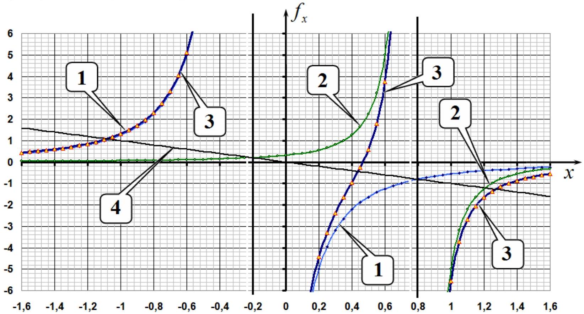
2.5 На построенном графике проведем прямую, описываемую уравнением $f _ { x } = - x$. Координаты точек пересечения этой прямой с графиком зависимости $f _ { x } ( x )$ являются действительными корнями уравнения (10), т.е. являются координатами точек Лагранжа, лежащих на оси $X$. Как следует из проведенного построение таких точек ровно 3.
2.6 Уравнение (10) является уравнением пятой степени, поэтому не может быть решено аналитически. Однако по условию требуется рассчитать численные значения с невысокой погрешностью. Для этого достаточно подсчитать численные значения силы, действующей на малое тело, с шагом изменения $x$, равным 0,1 , и определить интервал, в котором находится соответствующий корень.

Рассчитаем значение координаты точки Лагранжа $L _ { 1 }$, находящейся между телами $m _ { 1 }$ и $m _ { 2 }$. Для этой точки уравнение (10) можно переписать в виде

$$
\begin{equation*}
x = \frac { 1 - \mu } { ( x + \mu ) ^ { 2 } } - \frac { \mu } { ( 1 - \mu - x ) ^ { 2 } } . \tag{11}
\end{equation*}
$$

В Таблице ниже приведены значения левой и правой частей уравнения (11) при $\mu = 0.20$

| $x$ | 0,2 | 0,3 | 0,4 | 0,5 | 0,6 |
| :--- | :--- | :--- | :--- | :--- | :--- |
| $f ( x )$ | 4,44 | 2,40 | 0,97 | -0,59 | -3,75 |

Из таблицы следует, что корень уравнения лежит в интервале от 0,4 до 0,5 , т.е.

$$
\begin{equation*}
x _ { 1 } \approx 0.45 . \tag{12}
\end{equation*}
$$

Для координаты точки $L _ { 2 }$, лежащей за телом $m _ { 2 }$, имеем уравнение

$$
\begin{equation*}
x = \frac { 1 - \mu } { ( x + \mu ) ^ { 2 } } + \frac { \mu } { ( x - 1 + \mu ) ^ { 2 } } , \tag{13}
\end{equation*}
$$

а в следующей таблице рассчитаны значения левой и правой частей этого уравнения

| $x$ | 1 | 1,1 | 1,2 | 1,3 | 1,4 |
| :--- | :--- | :--- | :--- | :--- | :--- |
| $f ( x )$ | 5,56 | 2,70 | 1,66 | 1,16 | 0,87 |

Из данных этой таблицы следует, что корень этого уравнения лежит в интервале между 1.2 и 1.3, т.е.

$$
\begin{equation*}
x _ { 2 } \approx 1.25 . \tag{14}
\end{equation*}
$$

Наконец, для точки $L _ { 3 }$, лежащей за телом $m _ { 1 }$ имеем уравнение (здесь изменено направление оси)

$$
\begin{equation*}
x = \frac { 1 - \mu } { ( x - \mu ) ^ { 2 } } + \frac { \mu } { ( 1 - \mu + x ) ^ { 2 } } , \tag{15}
\end{equation*}
$$

а в следующей таблице приведены результаты аналогичных расчетов

| $x$ | 0,8 | 0,9 | 1 | 1,1 | 1,2 |
| :--- | :--- | :--- | :--- | :--- | :--- |
| $f ( x )$ | 2,30 | 1,70 | 1,31 | 1,04 | 0,85 |

из которых следует, что корень уравнения (15) лежит в интервале от 1.0 до 1.1, а, следовательно, координата точки Лагранжа $L _ { 3 }$

$$
\begin{equation*}
x _ { 3 } \approx 1.05 . \tag{16}
\end{equation*}
$$

2.7 Для доказательства того, что вершина правильного треугольника является точкой Лагранжа $L _ { 4 }$, запишем выражение для суммарной силы, действующей на тело малой массы $m _ { 0 }$, в векторной форме:

$$
\begin{equation*}
\vec { F } = G \frac { m _ { 0 } m _ { 1 } } { R _ { 0 } ^ { 3 } } \overrightarrow { r _ { 1 } } + G \frac { m _ { 0 } m _ { 2 } } { R _ { 0 } ^ { 3 } } \overrightarrow { r _ { 2 } } . \tag{17}
\end{equation*}
$$

Выражение справа в формуле (17) выражается через радиусвектор центра масс

$$
\begin{equation*}
m _ { 1 } \overrightarrow { r _ { 1 } } + m _ { 2 } \overrightarrow { r _ { 2 } } = \left( m _ { 1 } + m _ { 2 } \right) \overrightarrow { r _ { C } } , \tag{18}
\end{equation*}
$$

тогда уравнение второго закона Ньютона для этого тела в проекции на направление вектора $\overrightarrow { r _ { C } }$, имеет вид:

$$
\begin{equation*}
m _ { 0 } \omega ^ { 2 } r _ { C } = G \frac { m _ { 0 } } { R _ { 0 } ^ { 3 } } \left( m _ { 1 } + m _ { 2 } \right) r _ { C } . \tag{19}
\end{equation*}
$$

Из этого уравнения следует, что угловая скорость движения тела $m _ { 0 }$ равна

$$
\begin{equation*}
\omega = \sqrt { G \frac { m _ { 1 } + m _ { 2 } } { R _ { 0 } ^ { 3 } } } = \omega _ { 0 } , \tag{20}
\end{equation*}
$$

что совпадает с угловой скоростью вращения массивных тел (6), поэтому положение тела $m _ { 0 }$ будет оставаться неизменным относительно массивных тел. Следовательно, вершина равностороннего треугольника действительно является точкой Лагранжа.

## Точки Лагранжа в Солнечной системе.

2.8 Чтобы положение аппарата SOHO оставалось неизменным относительно Земли и Солнца, необходимо, чтобы он находился в точке Лагранжа $L _ { 1 }$. Для того, чтобы определить ее положение, надо решить уравнение (11). Рассчитаем значение параметра $\mu$ для системы Солнце - Земля:

$$
\begin{equation*}
\mu = \frac { M _ { 2 } } { M _ { 1 } + M _ { 2 } } = 3.00 \cdot 10 ^ { - 6 } . \tag{21}
\end{equation*}
$$

Это значение значительно меньше 1 , поэтому расстояние $l$ от аппарата до Земли значительно меньше радиуса земной орбиты. В использованной системе единиц обозначим $z = \frac { l } { R _ { 0 } } = 1 - \mu - x$, тогда из уравнения (11) получим

$$
\begin{equation*}
1 - \mu - z = \frac { 1 - \mu } { ( 1 - z ) ^ { 2 } } - \frac { \mu } { z ^ { 2 } } . \tag{22}
\end{equation*}
$$

Так как $z , \mu \ll 1$, то можно воспользоваться разложением $\frac { 1 } { ( 1 - z ) ^ { 2 } } \approx 1 + 2 z$ и в этом случае уравнение (22) существенно упрощается и из него находится $z = ( \mu / 3 ) ^ { 1 / 3 }$, то есть искомое расстояние равно

$$
\begin{equation*}
l _ { S } = R _ { 0 } \sqrt [ 3 ] { \frac { M _ { 2 } } { 3 M _ { 1 } } } = 1.50 \cdot 10 ^ { 6 } \mathrm { KM } . \tag{23}
\end{equation*}
$$

2.9 Очевидно, что телескоп «Джеймс Уэбб» находится в точке Лагранжа $L _ { 2 }$, поэтому для определения его положение надо решить уравнение $( 13 )$, используя метод, аналогичный методу п. 2.8:

$$
\begin{equation*}
1 + z = \frac { 1 } { ( 1 + z ) ^ { 2 } } + \frac { \mu } { z ^ { 2 } } \tag{24}
\end{equation*}
$$

т.е. космический телескоп находится на таком же расстоянии от Земли (только с другой стороны):

$$
\begin{equation*}
l _ { W } = R _ { 0 } \sqrt [ 3 ] { \frac { M _ { 2 } } { 3 M _ { 1 } } } = 1.50 \cdot 10 ^ { 6 } \mathrm { км } \tag{25}
\end{equation*}
$$

2.10 Если астероид случайно окажется в точке Лагранжа $L _ { 4 }$, или симметричной ей точке $L _ { 5 }$ для системы Юпитер-Солнце, то его положение относительно Юпитера и Солнца будет долгое время оставаться неизменным. Астероиды, находящиеся в других точках, будут постоянно изменять свое положение относительно Юпитера и Солнца. Следовательно, центры групп троянских астероидов находятся в боковых точках Лагранжа. Поэтому расстояние от Юпитера до этих точек равно расстоянию от Юпитера до Солнца. Масса Юпитера значительно меньше массы Солнца, поэтому расстояние между ними практически равно радиусу орбиты Юпитера, который можно найти, используя, третий закон Кеплера

$$
\begin{equation*}
l _ { J } = R _ { 0 } \left( \frac { T _ { J } } { T _ { 0 } } \right) ^ { 2 / 3 } = 7.82 \cdot 10 ^ { 8 } \mathrm { KM } , \tag{26}
\end{equation*}
$$

где $T _ { 0 } = 1$ год - период вращения Земли вокруг Солнца.

|  | Содержание | Баллы |  |
| :--- | :--- | :--- | :--- |
| 2.1 | Формула (1): $R _ { 1 } + R _ { 2 } = R _ { 0 }$ | 0.1 | 0.4 |
|  | Формула (2): $m _ { 1 } R _ { 1 } = m _ { 2 } R _ { 2 }$ | 0.1 |  |
|  | Формула (3): $R _ { 1 } = \frac { m _ { 2 } } { m _ { 1 } + m _ { 2 } } R _ { 0 }$ | 0.1 |  |
|  | Формула (4): $R _ { 2 } = \frac { m _ { 1 } } { m _ { 1 } + m _ { 2 } } R _ { 0 }$ | 0.1 |  |
| 2.2 | Формула (5): $m _ { 1 } \omega _ { 0 } ^ { 2 } R _ { 1 } = G \frac { m _ { 1 } m _ { 2 } } { R _ { 0 } ^ { 2 } }$ | 0.1 | 0.2 |
|  | Формула (6): $\omega _ { 0 } = \sqrt { G \frac { m _ { 1 } + m _ { 2 } } { R _ { 0 } ^ { 3 } } }$ | 0.1 |  |
| 2.3 | Формула (7): $F _ { x } = - G \frac { m _ { 0 } m _ { 1 } } { \left\| X + R _ { 1 } \right\| ^ { 3 } } \left( X + R _ { 1 } \right) - G \frac { m _ { 0 } m _ { 1 } } { \left\| X - R _ { 2 } \right\| ^ { 3 } } \left( X - R _ { 2 } \right)$ | 0.5 | 2.0 |
|  | Формула (8): $f _ { x } = - \frac { 1 - \mu } { \| x + \mu \| ^ { 3 } } ( x + \mu ) - \frac { \mu } { \| x - 1 + \mu \| ^ { 3 } } ( x - 1 + \mu )$ | 0.5 |  |
|  | Формула (9): $- m _ { 0 } \omega _ { 0 } ^ { 2 } X = F _ { x }$ | 0.5 |  |
|  | Формула (10): $- x = - \frac { 1 - \mu } { \| x + \mu \| ^ { 3 } } ( x + \mu ) - \frac { \mu } { \| x - 1 + \mu \| ^ { 3 } } ( x - 1 + \mu )$ | 0.5 |  |
| 2.4 | Положение вертикальных асимптот на графике | 0.2 | 0.8 |
|  | 3 ветви графика | $3 \times 0.2 = 0,6$ |  |
| 2.5 | На графике добавлена прямая $f _ { x } = - x$ | 0.2 | 0.3 |
|  | Указаны три точки пересечения, соответствуют 3 точкам Лагранжа | 0.1 |  |
| 2.6 | За каждую точку:   - указано положение;   - найдено численное значение. | $3 \times ( 0.1 + 0.2 )$   $= 0.9$ | 0.9 |
| 2.7 | Формула (17): $\vec { F } = G \frac { m _ { 0 } m _ { 1 } } { R _ { 0 } ^ { 3 } } \overrightarrow { r _ { 1 } } + G \frac { m _ { 0 } m _ { 2 } } { R _ { 0 } ^ { 3 } } \overrightarrow { r _ { 2 } }$ | 0.2 | 1.0 |
|  | Формула (18): $m _ { 1 } \overrightarrow { r _ { 1 } } + m _ { 2 } \overrightarrow { r _ { 2 } } = \left( m _ { 1 } + m _ { 2 } \right) \overrightarrow { r _ { C } }$ | 0.2 |  |
|  | Формула (19): $m _ { 0 } \omega ^ { 2 } r _ { C } = G \frac { m _ { 0 } } { R _ { 0 } ^ { 3 } } \left( m _ { 1 } + m _ { 2 } \right) r _ { C }$ | 0.3 |  |
|  | Формула (20): $\omega = \sqrt { G \frac { m _ { 1 } + m _ { 2 } } { R _ { 0 } ^ { 3 } } } = \omega _ { 0 }$ | 0.3 |  |
| 2.8 | Численное значение (21): $\mu = 3.00 \cdot 10 ^ { - 6 }$ | 0.2 | 1.6 |
|  | Точное уравнение (22): $1 - \mu - z = \frac { 1 - \mu } { ( 1 - z ) ^ { 2 } } - \frac { \mu } { z ^ { 2 } }$ | 0.2 |  |

|  | Формула (23): $l _ { S } = R _ { 0 } \sqrt [ 3 ] { \frac { M _ { 2 } } { 3 M _ { 1 } } }$ | 0.7 |  |
| :--- | :--- | :--- | :--- |
|  | Численное значение в формуле (23): $l _ { S } = 1.50 \cdot 10 ^ { 6 }$ км. | 0.5 |  |
| 2.9 | Формула (24): $1 + z = \frac { 1 } { ( 1 + z ) ^ { 2 } } + \frac { \mu } { z ^ { 2 } }$ | 0.2 | 1.4 |
|  | Формула (25): $l _ { W } = R _ { 0 } \sqrt [ 3 ] { \frac { M _ { 2 } } { 3 M _ { 1 } } }$ | 0.7 |  |
|  | Численное значение в формуле (25): $l _ { W } = 1.50 \cdot 10 ^ { 6 }$ км. | 0.5 |  |
| 2.10 | Формула (26): $l _ { J } = R _ { 0 } \left( \frac { T _ { J } } { T _ { 0 } } \right) ^ { 2 / 3 }$ | 1.0 | 1.4 |
|  | Численное значение в формуле (26): $l _ { J } = 7.82 \cdot 10 ^ { 8 }$ км | 0.4 |  |
| Итого |  |  | 10.0 |

## Задача 3. Геометрическая оптика и фотодетектор (10.0 баллов)

3.1 По закону отражения света выполняется соотношение

$$
\begin{equation*}
\alpha = \beta . \tag{1}
\end{equation*}
$$

3.2 По закону преломления света Снеллиуса выполняется равенство

$$
\begin{equation*}
\sin \alpha = n \sin \beta . \tag{2}
\end{equation*}
$$

3.3 При малых углах синусы можно заменить самим аргументами, что приводит к выражению

$$
\begin{equation*}
\alpha = n \beta . \tag{3}
\end{equation*}
$$

3.4 Поскольку лампа излучает по всем направлениям равномерно, то искомая мощность излучения составляет

$$
\begin{equation*}
W _ { \alpha } = W \frac { \alpha } { 2 \pi } . \tag{4}
\end{equation*}
$$

Таким образом, мощность излучения лампы в определенном направлении определяется соответствующим углом.

## Тонкая пластинка

3.5 Для решения задачи построим рисунок, показанный ниже.

Здесь использованы следующие обозначения для углов, которые в случае их малости находятся из соотношений:

$$
\begin{align*}
& \alpha = \frac { a } { 2 L } ,  \tag{5}\\
& \theta ( x ) = \frac { x } { L } . \tag{6}
\end{align*}
$$

В соответствии с пунктом 3.4 регистрируемая детектором мощность излучения пропорциональна углу, поэтому формула для вычисления показаний миллиамперметра имеет вид

$$
\begin{equation*}
\Delta I ( x ) = I _ { 0 } \left( \frac { \alpha - \theta ( x ) + \tau ( \alpha + \theta ( x ) ) } { 2 \alpha } - 1 \right) \quad \text { при } \quad - \frac { a } { 2 } < x < \frac { a } { 2 } , \tag{7}
\end{equation*}
$$

при этом очевидно, что

$$
\begin{equation*}
\Delta I ( x ) = 0 \quad \text { при } \quad x < - \frac { a } { 2 } , \tag{8}
\end{equation*}
$$

и

$$
\begin{equation*}
\Delta I ( x ) = I _ { 0 } ( \tau - 1 ) \quad \text { при } \quad x > \frac { a } { 2 } . \tag{9}
\end{equation*}
$$

График соответствующей функции представлен на рисунке ниже, при этом координаты двух характерных точек графика

$$
\begin{array} { l l l }
\Delta I = 0.00 \text { мА } & \text { при } & x = - 2.50 \mathrm { см } , \\
\Delta I = - 5.00 \text { мА } & \text { при } & x = 2.50 \mathrm { см } . \tag{11}
\end{array}
$$

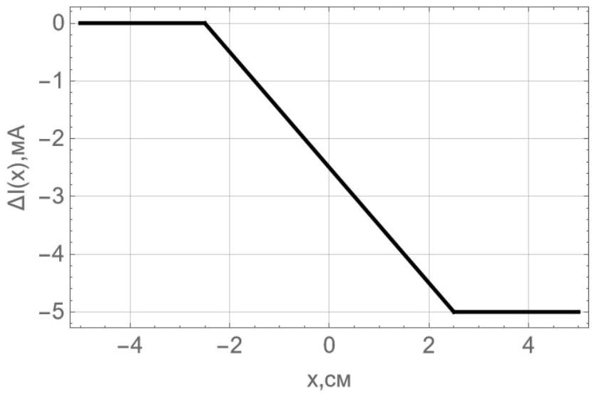
Толстая пластинка

3.6 Появление точки $x _ { 1 }$ на графике связано с тем, что свет начинает дополнительно отражаться от горизонтальной части пластины, при этом ход луча от лампы до края щели показан на рисунке ниже.

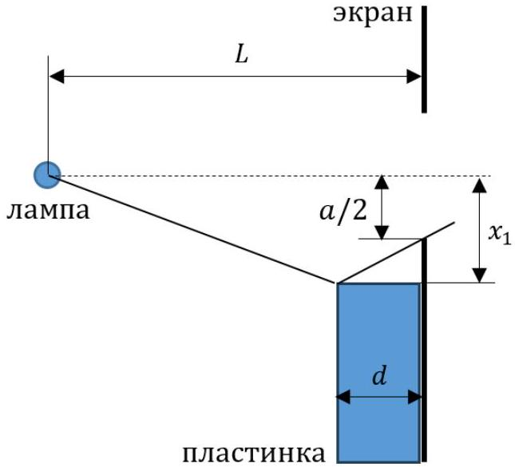
Поскольку при отражении углы равны, то отсюда легко находим искомую величину $x _ { 1 } = - \frac { a } { 2 } \frac { L - d } { L - 2 d }$.

3.7 Первый максимум достигается, когда весь свет, отраженный горизонтальной поверхностью пластинки, попадает в щель и затем в детектор. Ход лучей при этом показан на рисунке ниже, а соответствующее значение координаты, очевидно, равно

$$
\begin{equation*}
x _ { 2 } = - \frac { a } { 2 } . \tag{13}
\end{equation*}
$$

3.8 Значение $\Delta I _ { \text {max } }$ в точке $x _ { 2 }$ находится из соотношения

$$
\begin{equation*}
\Delta I _ { \max } = I _ { 0 } \left( \frac { \alpha + \theta } { 2 \alpha } - 1 \right) , \tag{14}
\end{equation*}
$$

где величина угла $\alpha$ по прежнему определяется выражением (5), а угол $\theta$ составляет

$$
\begin{equation*}
\theta = \frac { a } { 2 ( L - d ) } , \tag{15}
\end{equation*}
$$

откуда окончательно получаем

$$
\begin{equation*}
\Delta I _ { \max } = \frac { I _ { 0 } } { 2 } \frac { d } { ( L - d ) } , \tag{16}
\end{equation*}
$$

3.9 Координата $x _ { 3 }$ определяется из условия, что преломленный в пластине луч впервые попадает в нижний край щели, ход лучей показан на рисунке ниже.
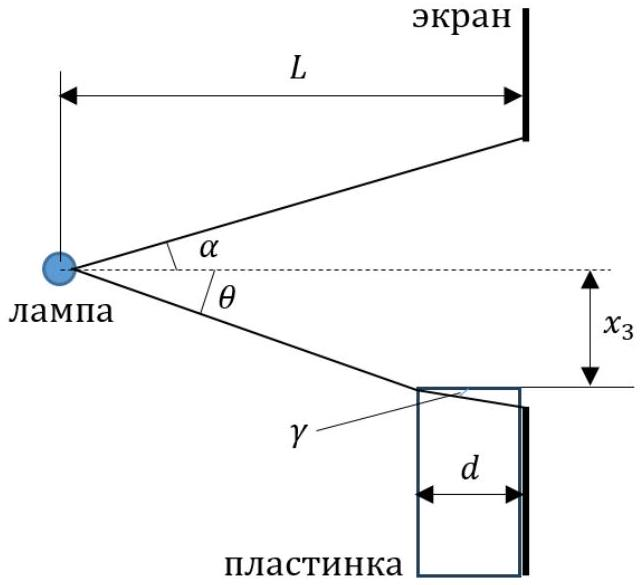

Из рисунка следует, что углы равны

$$
\begin{align*}
& \theta = - \frac { x _ { 3 } } { ( L - d ) } ,  \tag{17}\\
& \gamma = \frac { \frac { a } { 2 } + x _ { 3 } } { d } , \tag{18}
\end{align*}
$$

при этом по закону преломления

$$
\begin{equation*}
\theta = n \gamma . \tag{19}
\end{equation*}
$$

Тогда из выражений (17)-(19), окончательно получаем

$$
\begin{equation*}
x _ { 3 } = - \frac { a } { 2 } \frac { ( L - d ) } { \left( L - d \left( 1 - \frac { 1 } { n } \right) \right) } . \tag{20}
\end{equation*}
$$

3.10 Участок от координаты $x _ { 3 }$ до нуля обусловлен тем, что свет частично напрямую проходит через щель, а частично попадает через пластину, преломляясь и отражаясь в ней. Ход лучей показан на рисунке ниже.
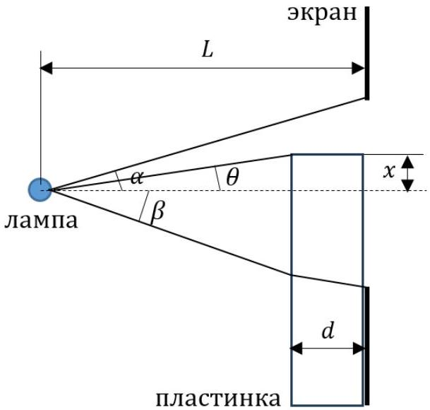

Угол $\alpha$ по-прежнему определяется выражением (5), а соответствующие углы на рисунке равны

$$
\begin{align*}
& \theta = \frac { x } { ( L - d ) } ,  \tag{21}\\
& \beta = - \frac { x _ { 3 } } { ( L - d ) } = \frac { a } { 2 \left( L - d \left( 1 - \frac { 1 } { n } \right) \right) } , \tag{22}
\end{align*}
$$

тогда значение $\Delta I ( x )$ принимает вид

$$
\begin{equation*}
\Delta I ( x ) = I _ { 0 } \left( \frac { \alpha - \theta + \tau ( \beta + \theta ) } { 2 \alpha } - 1 \right) , \tag{23}
\end{equation*}
$$

откуда получаем коэффициент наклона

$$
\begin{equation*}
\frac { d \Delta I ( x ) } { d x } = - I _ { 0 } \frac { ( 1 - \tau ) L } { a ( L - d ) } . \tag{24}
\end{equation*}
$$

3.11 Исходя из приведенного в условии графика, имеем $x _ { 1 } = - 2.50 \mathrm {~cm} , x _ { 2 } = - 2.00 \mathrm {~cm} , x _ { 3 } =$ - 1.75 см, $\Delta I _ { \text {max } } = 10.0 \mathrm { мА }$ и $d \Delta I ( x ) / d x = - 1.20 \mathrm { мA } /$ см , получаем следующие значения искомых параметров

$$
\begin{align*}
& a = 4.0 \mathrm {~cm} ,  \tag{25}\\
& n = 1.3 ,  \tag{26}\\
& \tau = 0.96 ,  \tag{27}\\
& I _ { 0 } = 100 \mathrm {~mA} ,  \tag{28}\\
& L / d = 6.0 . \tag{29}
\end{align*}
$$

3.12 Для построения полного графика установим все его характерные точки, показанные на рисунке ниже как $x _ { 1 } , x _ { 2 } , x _ { 3 } , x _ { 4 } , x _ { 5 } , x _ { 6 }$.

Координаты точек $x _ { 1 } , x _ { 2 } , x _ { 3 }$ были определены выше, необходимо установить координаты других характерных точек. Для этого опишем появление различных ветвей графика, постепенно продвигая пластинку от отрицательных до положительных значений.

| Координаты ветви графика | Физические процессы |
| :--- | :--- |
| от $- \infty$ до $x _ { 1 }$ | Полное прямое попадание в щель. |
| от $x _ { 1 }$ до $x _ { 2 }$ | Полное прямое попадание в щель; отражение от горизонтального участка пластинки. |
| от $x _ { 2 }$ до $x _ { 3 }$ | Частичное прямое попадание в щель; отражение от горизонтального участка пластинки. |
| от $x _ { 3 }$ до $x _ { 4 }$ | Частичное прямое попадание в щель; отражение от горизонтального участка пластинки (сверху напрямую и снизу с прохождением через пластинку); прохождение через пластинку с преломлением. |
| от $x _ { 4 }$ до $x _ { 5 }$ | Полное прямое попадание в щель с прохождением через пластинку; отражение снизу от горизонтального участка с прохождением через пластинку. |
| от $x _ { 5 }$ до $x _ { 6 }$ | Полное прямое попадание в щель с прохождением через пластинку; частичное отражение снизу от горизонтального участка с прохождением через пластинку. |
| от $x _ { 6 }$ до $+ \infty$ | Полное прямое попадание в щель с прохождением через пластинку. |

Найдем координаты соответствующих характерных точек. Координата $x _ { 4 }$ легко находится и равна

$$
\begin{equation*}
x _ { 4 } = \frac { a } { 2 } \frac { L - d } { L } = 1.7 \mathrm {~cm} , \tag{30}
\end{equation*}
$$

а показания миллиамперметра определяются выражением

$$
\begin{equation*}
\Delta I _ { 4 } = I _ { 0 } \left( \frac { \tau ( \alpha + \beta ) } { 2 \alpha } - 1 \right) = - 1.9 \text { мА. } \tag{31}
\end{equation*}
$$

Координата точки $x _ { 5 }$ равна

$$
\begin{equation*}
x _ { 5 } = \frac { a } { 2 } = 2.0 \mathrm {~cm} , \tag{32}
\end{equation*}
$$

а показания миллиамперметра определяются выражением

$$
\begin{equation*}
\Delta I _ { 5 } = I _ { 0 } \left( \frac { \tau \left( \alpha + \frac { a } { 2 ( L - d ) } \right) } { 2 \alpha } - 1 \right) = 7.7 \text { мА. } \tag{33}
\end{equation*}
$$

Углы, обозначенные на рисунке равны

$$
\begin{align*}
& \delta = \frac { x _ { 6 } } { L - d } ,  \tag{34}\\
& \varphi = \frac { x _ { 6 } - \frac { a } { 2 } } { d } \tag{35}
\end{align*}
$$

и связаны соотношением

$$
\begin{equation*}
\delta = n \varphi . \tag{36}
\end{equation*}
$$

Таким образом, координата точки $x _ { 6 }$ равна

$$
\begin{equation*}
x _ { 6 } = \frac { a } { 2 } \frac { ( L - d ) } { \left( L - d \left( 1 + \frac { 1 } { n } \right) \right) } = 2.4 \mathrm {~cm} , \tag{37}
\end{equation*}
$$

а показания миллиамперметра определяются выражением

$$
\begin{equation*}
\Delta I _ { 6 } = I _ { 0 } \left( \frac { \tau ( \alpha + \delta ) } { 2 \alpha } - 1 \right) = 0.24 \mathrm { мA } . \tag{38}
\end{equation*}
$$

Полный график зависимости показан на рисунке ниже.
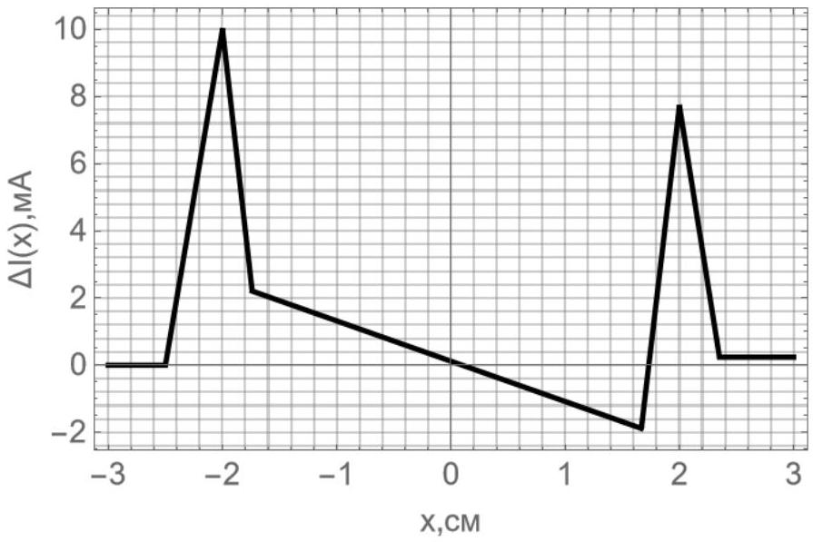

|  | Содержание | Баллы |  |
| :--- | :--- | :--- | :--- |
| 3.1 | Формула (1): $\alpha = \beta$ | 0.2 | 0.2 |
| 3.2 | Формула (2): $\sin \alpha = n \sin \beta$ | 0.2 | 0.2 |
| 3.3 | Формула (3): $\alpha = n \beta$ | 0.2 | 0.2 |
| 3.4 | Формула (4): $W _ { \alpha } = W \frac { \alpha } { 2 \pi }$ | 0.4 | 0.4 |
| 3.5 | Формула (5): $\alpha = \frac { a } { 2 L }$ | 0.2 | 3.5 |
|  | Формула (6): $\theta ( x ) = \frac { x } { L }$ | 0.2 |  |
|  | Формула (7): $\Delta I ( x ) = I _ { 0 } \left( \frac { \alpha - \theta ( x ) + \tau ( \alpha + \theta ( x ) ) } { 2 \alpha } - 1 \right) \quad$ при $- \frac { a } { 2 } \leq x \leq \frac { a } { 2 }$ | 0.4 |  |
|  | Формула (8): $\Delta I ( x ) = 0$ | 0.4 |  |
|  | Формула (9): $\Delta I ( x ) = I _ { 0 } ( \tau - 1 )$ | 0.4 |  |
|  | График: 0.5 за каждую верную прямую в числовых значениях | 1.5 |  |
|  | Формула (10): $\Delta I = 0.00 \mathrm { мA } \quad$ при $x = - 2.50 \mathrm {~cm}$ | 0.2 |  |
|  | Формула (11): $\Delta I = - 5.0 \mathrm {~mA} \quad$ при $x = 2.50 \mathrm {~cm}$ | 0.2 |  |

| 3.6 | Формула (12): $x _ { 1 } = - \frac { a } { 2 } \frac { L - d } { L - 2 d }$ | 0.2 | 0.2 |
| :--- | :--- | :--- | :--- |
| 3.7 | Формула (13): $x _ { 2 } = - \frac { a } { 2 }$ | 0.1 | 0.1 |
| 3.8 | Формула (14): $\Delta I _ { \text {max } } = I _ { 0 } \left( \frac { \alpha + \theta } { 2 \alpha } - 1 \right)$ | 0.1 | 0.4 |
|  | Формула (15): $\theta = \frac { a } { 2 ( L - d ) }$ | 0.1 |  |
|  | Формула (16): $\Delta I _ { \text {max } } = \frac { I _ { 0 } } { 2 } \frac { d } { ( L - d ) }$ | 0.2 |  |
| 3.9 | Формула (17): $\theta = - \frac { x _ { 3 } } { ( L - d ) }$ | 0.2 | 0.8 |
|  | Формула (18): $\gamma = \frac { \frac { a } { 2 } + x _ { 3 } } { d }$ | 0.2 |  |
|  | Формула (19): $\theta = n \gamma$ | 0.2 |  |
|  | Формула (20): $x _ { 3 } = - \frac { a } { 2 } \frac { ( L - d ) } { \left( L - d \left( 1 - \frac { 1 } { n } \right) \right) }$ | 0.2 |  |
| 3.10 | Формула (21): $\theta = \frac { x } { ( L - d ) }$ | 0.2 | 0.8 |
|  | Формула (22): $\beta = - \frac { x _ { 3 } } { ( L - d ) } = \frac { a } { 2 \left( L - d \left( 1 - \frac { 1 } { n } \right) \right) }$ | 0.2 |  |
|  | Формула (23): $\Delta I ( x ) = I _ { 0 } \left( \frac { \alpha - \theta + \tau ( \beta + \theta ) } { 2 \alpha } - 1 \right)$ | 0.2 |  |
|  | Формула (24): $\frac { d \Delta I ( x ) } { d x } = - I _ { 0 } \frac { ( 1 - \tau ) L } { a ( L - d ) }$ | 0.2 |  |
| 3.11 | Численное значение (25): $a = 4.0 \mathrm {~cm}$ | 0.2 | 1.0 |
|  | Численное значение (26): $n = 1.3$ | 0.2 |  |
|  | Численное значение (27): $\tau = 0.96$ | 0.2 |  |
|  | Численное значение (28): $I _ { 0 } = 100 \mathrm {~mA}$ | 0.2 |  |
|  | Численное значение (29): $L / d = 6.0$ | 0.2 |  |
| 3.12 | Численное значение (30): $x _ { 4 } = 1.7 \mathrm {~cm}$ | 0.2 | 2.2 |
|  | Численное значение (31): $\Delta I _ { 4 } = - 1.9 \mathrm {~mA}$ | 0.2 |  |
|  | Численное значение (32): $x _ { 5 } = 2.0 \mathrm {~cm}$ | 0.2 |  |
|  | Численное значение (33): $\Delta I _ { 5 } = 7.7 \mathrm {~mA}$ | 0.2 |  |
|  | Формула (34): $\delta = \frac { x _ { 6 } } { L - d }$ | 0.2 |  |
|  | Формула (35): $\varphi = \frac { x _ { 6 } - \frac { a } { 2 } } { d }$ | 0.2 |  |
|  | Формула (36): $\delta = n \varphi$ | 0.2 |  |
|  | Численное значение (37): $x _ { 6 } = 2.4 \mathrm {~cm}$ | 0.2 |  |
|  | Численное значение (38): $\Delta I _ { 6 } = 0.24 \mathrm {~mA}$ | 0.2 |  |
|  | Правильные 4 прямые на графике от 0.00 до 3.00 см | 4×0.1 |  |
| Итого |  |  | 10.0 |
