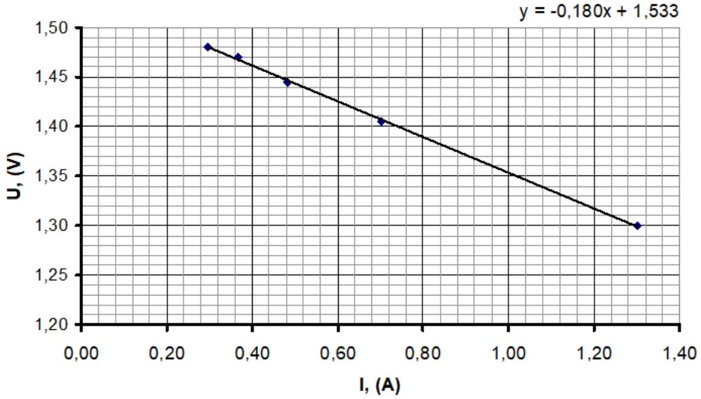
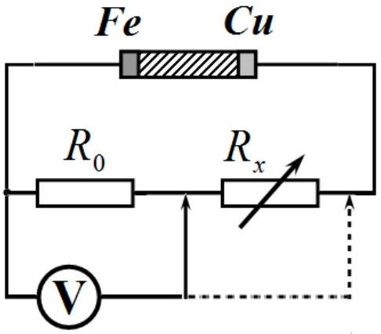
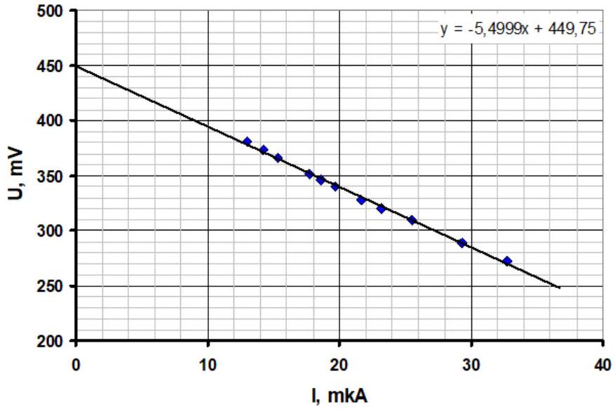
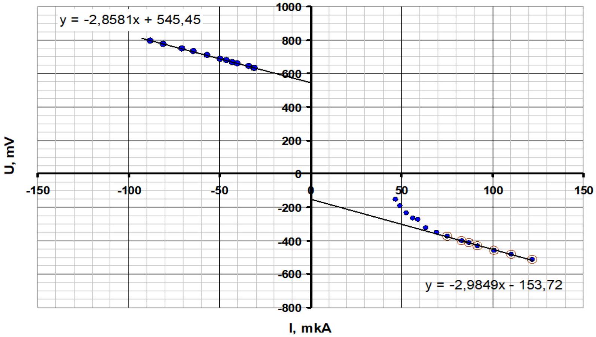
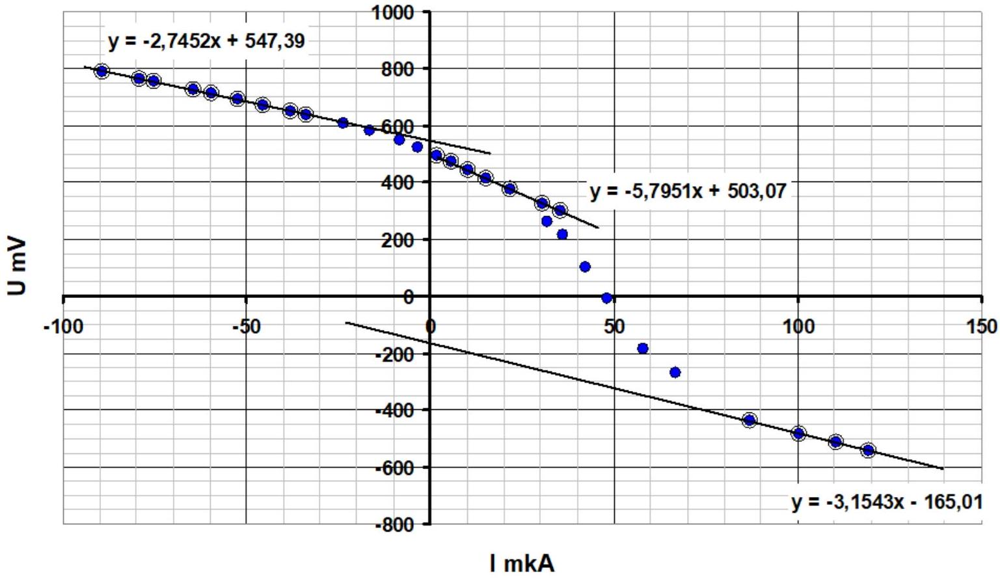

## SOLUTION TO THE EXPERIMENTAL COMPETITION Galvanic cells

Part 1. Characteristics of the galvanic cell "Camelion".
1.1-1.3 Table 1 shows the results of measuring resistances $R _ { 0 k }$ and voltages $U _ { k }$, as well as the results of calculating currents $I _ { k }$

Table 1
| $\boldsymbol { k }$ | $R _ { 0 k }$, Ohm | $U _ { k } , \mathrm {~V}$ | $I _ { k } , \mathrm {~A}$ |
| :--- | :--- | :--- | :--- |
| 1 | 1,0 | 1,300 | 1,300 |
| 2 | 2,0 | 1,405 | 0,703 |
| 3 | 3,0 | 1,445 | 0,482 |
| 4 | 4,0 | 1,470 | 0,368 |
| 5 | 5,0 | 1,480 | 0,296 |

Current strengths are calculated according to Ohm's law

$$
\begin{equation*}
I _ { k } = \frac { U _ { k } } { R _ { k } } , \tag{1}
\end{equation*}
$$

and the graph of the obtained dependence is shown in Figure 1.

Fig. 1

1.4 The theoretical dependence of the voltage in the external circuit on the current strength follows from Ohm's law:

$$
\begin{equation*}
U = \varepsilon - I R . \tag{2}
\end{equation*}
$$

Using the least squares method, we find the parameters of the linear dependence $U = a I + b$. As follows from formula (2), the characteristics of the galvanic element are equal to:

$$
\begin{align*}
& \varepsilon = b = ( 1,53 \pm 0,04 ) \mathrm { V } ,  \tag{3}\\
& r = - a = ( 0,18 \pm 0,02 ) \mathrm { Ohm } . \tag{4}
\end{align*}
$$

Part 2. Homemade galvanic cell.
2.1 The following circuit is used. A fixed resistor $R _ { 0 } = 10,0$ кОм and a variable resistor of 20.0 kOhm are used. The voltage $U _ { 0 }$ was measured on the resistor $R _ { 0 }$, in which the current strength is calculated as:

$$
\begin{equation*}
I = \frac { U _ { 0 } } { R _ { 0 } } . \tag{5}
\end{equation*}
$$

The voltage on the external circuit is also measured directly as $U$.
2.2 The measurement results are shown in Table 2 and in the graph in Fig. 2.

Table 2.
| $U _ { 0 } , \mathrm { mV }$ | $U , \mathrm { mV }$ | $I , \mathrm { mkA }$ |
| :--- | :--- | :--- |
| 269 | 272 | 32,7 |
| 241 | 289 | 29,3 |
| 210 | 310 | 25,5 |
| 191 | 320 | 23,2 |
| 178 | 328 | 21,7 |
| 162 | 340 | 19,7 |
| 153 | 346 | 18,6 |
| 146 | 351 | 17,8 |
| 126 | 366 | 15,3 |
| 117 | 373 | 14,2 |
| 107 | 381 | 13,0 |

Fig. 2

2.3 The calculation by the least squares method gives the following characteristics of a homemade cell

$$
\begin{align*}
& r = ( 5,5 \pm 0,5 ) \mathrm { kOhn } ,  \tag{6}\\
& \varepsilon = ( 450 \pm 13 ) \mathrm { mV } . \tag{7}
\end{align*}
$$

## Part 3. Connections of galvanic cells.

3.1-3.2 When connected in series, the EMF is equal to the sum (approximately 2 V) or the difference (approximately 1 V) of the EMF of the sources. When connected in parallel, the total EMF is equal to the EMF of the industrial element, approximately 1.5 V (its resistance is lower).

## Part 4. Current-voltage characteristic of a galvanic cel.

4.1 When using a source according to the variable resistor circuit, the following results are obtained, Table 3 and graph in Fig. 3.

Table 3.
| $\ll \gg - \ll >$ |  |  | «-» - «+» |  |  |
| :--- | :--- | :--- | :--- | :--- | :--- |
| $U _ { 0 } , \mathrm { mV }$ | $U , \mathrm { mV }$ | $I , \mathrm { mkA }$ | $U _ { 0 } , \mathrm { mV }$ | $U , \mathrm { mV }$ | $I , \mathrm { mkA }$ |
| -722 | 793 | -87,8 | 1003 | -514 | 122,0 |
| -665 | 777 | -80,9 | 907 | -483 | 110,3 |
| -579 | 748 | -70,4 | 829 | -460 | 100,9 |
| -528 | 731 | -64,2 | 757 | -431 | 92,1 |
| -466 | 710 | -56,7 | 715 | -414 | 87,0 |
| -409 | 687 | -49,8 | 685 | -403 | 83,3 |
| -378 | 677 | -46,0 | 620 | -374 | 75,4 |
| -352 | 669 | -42,8 | 570 | -350 | 69,3 |
| -329 | 660 | -40,0 | 521 | -324 | 63,4 |
| -279 | 642 | -33,9 | 485 | -274 | 59,0 |
| -255 | 633 | -31,0 | 463 | -267 | 56,3 |
| -251 | 631 | -30,5 | 434 | -236 | 52,8 |
|  |  |  | 406 | -191 | 49,4 |
|  |  |  | 386 | -153 | 47,0 |

Fig. 3

4.2 It is evident that when the direction of the current changes, the polarity of the galvanic cell changes. Parameters of the linear dependence:

$$
\begin{align*}
& r = ( 2,9 \pm 0,2 ) \mathrm { kOhm } ,  \tag{8}\\
& \varepsilon = ( 545 \pm 10 ) \mathrm { mV } , \tag{9}
\end{align*}
$$

which is close to the previously obtained values. However, these values still differ significantly, which is explained by the restructuring of double electric layers near the electrodes when current flows.

The second linear dependence is paradoxical, since the polarity of the element changes:

$$
\begin{align*}
& r = ( 3,0 \pm 0,4 ) \mathrm { kOhm } . ,  \tag{10}\\
& \varepsilon = - ( 154 \pm 42 ) \mathrm { mV } . \tag{11}
\end{align*}
$$

4.3 Using a source according to the potentiometer circuit expands the range of current variation in the circuit. The measurement results are presented in Table 4 and on the graph in Fig. 4

Table 4
| «+» - «-» |  |  | «<-» - «+» |  |  |
| :--- | :--- | :--- | :--- | :--- | :--- |
| $U _ { 0 } , \mathrm { mV }$ | $U , \mathrm { mV }$ | $I , \mathrm { mkA }$ | $U _ { 0 } , \mathrm { mV }$ | $U , \mathrm { mV }$ | $I , \mathrm { mkA }$ |
| -733 | 790 | -89,2 | 982 | -541 | 119,5 |
| -649 | 764 | -79,0 | 908 | -514 | 110,5 |
| -619 | 755 | -75,3 | 826 | -483 | 100,5 |
| -529 | 725 | -64,4 | 716 | -439 | 87,1 |
| -489 | 712 | -59,5 | 550 | -269 | 66,9 |
| -429 | 692 | -52,2 | 477 | -183 | 58,0 |
| -374 | 673 | -45,5 | 396 | -6 | 48,2 |
| -313 | 651 | -38,1 | 349 | 103 | 42,5 |
| -277 | 638 | -33,7 | 296 | 217 | 36,0 |
| -193 | 606 | -23,5 | 261 | 261 | 31,8 |
| -135 | 581 | -16,4 |  |  |  |
| -69 | 548 | -8,4 |  |  |  |
| -29 | 524 | -3,5 |  |  |  |
| 16 | 493 | 1,9 |  |  |  |

| 48 | 471 | 5,8 |  |  |  |
| :--- | :--- | :--- | :--- | :--- | :--- |
| 84 | 442 | 10,2 |  |  |  |
| 124 | 414 | 15,1 |  |  |  |
| 180 | 375 | 21,9 |  |  |  |
| 252 | 326 | 30,7 |  |  |  |
| 291 | 299 | 35,4 |  |  |  |

Fig. 4

4.4 It turns out that repolarization occurs not at zero current, but at a current in the range of approximately 50 $\mu \mathrm { A }$.

Three linear sections are distinguished (as the current increases), the values of EMF and internal resistance in these ranges are found as:
First section:

$$
\begin{align*}
& r = ( 2,75 \pm 0,14 ) \mathrm { kOhm } ,  \tag{12}\\
& \varepsilon = ( 547 \pm 5 ) \mathrm { mV } , \tag{13}
\end{align*}
$$

which coincides with the values obtained earlier.
Second section:

$$
\begin{align*}
& r = ( 5,80 \pm 0,24 ) \mathrm { kOhm } ,  \tag{14}\\
& \varepsilon = ( 503 \pm 5 ) \mathrm { mV } , \tag{15}
\end{align*}
$$

which clearly shows a change in the internal resistance of more than 2 times when the direction of the current changes.
Third section: (polarity reversal):

$$
\begin{align*}
& r = ( 3,15 \pm 0,14 ) \mathrm { kOhm } ,  \tag{16}\\
& \varepsilon = - ( 165 \pm 14 ) \mathrm { mV } , \tag{17}
\end{align*}
$$

which also almost coincides with the values obtained in section 4.1.

## Grading scheme   If the dimension of the measured value is not specified, the result is not graded!

| Part | Content | Total | Points |
| :--- | :--- | :--- | :--- |
| Part 1. Characteristics of the galvanic cell "Camelion". |  | 3,0 |  |
| 1.1 | Resistance measurements $0,1 \times 5 = 0.5$ | 0,5 | 0,5 |

|  | allowable error $\pm 0,2 \mathrm { Ohm }$ |  |  |
| :--- | :--- | :--- | :--- |
| 1.2 | Voltages are measured $0,1 \times 5 = 0.5$ allowable error ±0,2V | 0,5 | 0,5 |
| 1.3 | Formula (1) | 1,0 | 0,2 |
|  | Currents calculations (only those points that are graded in parts .1.1-1.2) $0,1 \times 5 = 0.5$ |  | 0,5 |
|  | Graph:   - axes are labeled and ticked;   - all points are plotted in accordance with the table;   - a smoothing straight line is drawn. |  |  |
|  |  |  | 0,1 |
|  |  |  | 0,1 |
|  |  |  | 0,1 |
| 1.4 | Theoretical dependence (3); | 1,0 | 0,1 |
|  | Calculation of element characteristics using least squares method (graphically by two points); |  | 0,3(0,2;0,1) |
|  | EMF value in the range e 1,55-1,65 V; (1,40-1,70 V); |  | 0,2 $( 0,1 )$ |
|  | Internal resistance value in the range 0,1-0,3 Ohm (0,05-0.5 Ohm) |  | 0,2(0,1) |
|  | The error assessment of the parameters is carried out 2×0,1 |  | 0,2 |
| Part 2. Homemade galvanic cell. |  | 3,0 |  |
| 2.1 | Measurement circuit: a resistor, a variable resistor, and a galvanic | 1,0 | 0,4 |
|  |  |  | 0,1 |
|  | - a variable resistor of 20 kOhm is used; |  | 0,1 |
|  | - rwo voltages are measured; |  | 0,2 |
|  | - formula for the electric current: |  | 0,1 |
|  | - the voltage on the external circuit is measured or calculated |  | 0,1 |
|  | parts 2.2 and 2.3 are graded, if the electric circuit has been graded! |  |  |
| 2.2 | Measurements: | 1,0 |  |
|  | - 8 number of points or more (5-7; less than 5); |  | 0,3(0,2;0,1) |
|  | - the lower limit of the current strength is less than $200 \mu \mathrm {~A}$, |  | 0,1 |
|  | Graph (as in part 1.3): |  | 0,3 |
|  | A linear decreasing dependence is obtained $U ( I )$. |  | 0,2 |
|  | The inverse dependence is drawn I(U) (-0,2 points) |  |  |
| 2.3 | Element characteristics: | 1,0 |  |
|  | Using least square method (graphically); |  | 0,2(0,1) |
|  | - EMF values in the range 0,4-0,6 V; (0,3-0,7V); |  | 0,3(0,2) |
|  | - Internal resistance in the range 4.5-6.5 kOhm (4.0 -7.0 kOhm) |  | 0,3(0,2) |
|  | The error assessment of the parameters is carried out 2×0,1 |  | 0,2 |
| Part 3. Connections of galvanic cells. |  | 1,0 |  |
| 3.1 | Circuit 1: summation of EMFs; | 0,6 | 0,1 |
|  | Circuit 2: subtraction of EMFs; |  | 0,1 |
|  | Circuit 3: EMF of the industrial cell; |  | 0,2 |
|  | Circuit 4: EMF of the industrial cell. |  | 0,2 |
| 3.2 | Theoretical formulas | 0,4 |  |
|  | circuits 1-2; 0,1×2=0,2 |  | 0,2 |
|  | circuits 3-4 (sufficient argumentation based on comparison of internal resistances); $0,1 + 0,1 = 0,2$ |  | 0,2 |
| Part 4. Current-voltage characteristic of a galvanic cell. Graded if the results differ from the author's by no more than 50\%! |  | 13 |  |
| 4.1 | - measurements are carried out with two polarities of the source connection; - two branches with opposite signs of currents and voltages are obtained; | 3,0 | 0,2 |
|  |  |  |  |

|  | - each branch has 8 or more points (5-7); |  | 2x0,4(0,2) |
| :--- | :--- | :--- | :--- |
|  | - the range of current change on each branch is not less than 50 |  | 2×0,3 |
|  |  |  |  |
|  | - at negative currents a linear dependence is obtained; |  | 0,2 |
|  | - at positive currents, the dependence is nonlinear, with a |  |  |
|  | convexity downwards; |  | 0,4 |
|  | Graph (sa in part 1.3). |  | 0,4 |
| 4.2 | Two linear sections have been allocated: one on one branch, the second on the other; $2 \times 0,5 = 1,0$ | 3 | 1,0 |
|  | The values of EMFs and internal resistances are found for each section (allowable error - 50\%) 0,5×4=2,0 |  |  |
| 4.3 | - measurements are carried out with two polarities of source connection; | 3,5 |  |
|  | - two branches with opposite signs of currents and voltages are obtained; |  | 0,4 |
|  | - the current strength ranges overlap; |  | 0,2 |
|  | - each branch has 8 or more points (5-7); |  | 2×0,4(0,2) |
|  | - the range of current change on each branch is not less than 70 |  |  |
|  | $\mu \mathrm { A }$; |  | 2×0,3 |
|  | - values obtained are close (±20\%) to the values of part 4.1 in the same ranges of current strengths; |  | 2×0,2 |
|  | - a transition from one branch to another is obtained; |  | 0,3 |
|  | - zero crossing in the range of $30 - 80 \mu \mathrm {~A}$; |  | 0,2 |
|  | graph (as in part 1.3): |  | 0,4 |
| 4.3 | 3 linear sections have been detected; | 3,5 | 3×0,3 |
|  | Smoothing lines are drawn; |  | 3x0,1 |
|  | The values of EMF and internal resistance are found for each linear section; |  | 6x0,3 |
|  | - when the sign of the current strength changes, the internal resistance changes by more than 1.5 times; |  | 0,2 |
|  | - the sign of the EMF changes during polarization reversal. |  | 0,3 |
|  | TOTAL | 20,0 |  |
