## SOLUTIONS TO THE PROBLEMS OF THE THEORETICAL COMPETITION Attention. Points in grading are not divided!   Problem 1 (10.0 points)   Problem 1.1 (3.0 points)

Let a spacecraft of mass $m$ start from the Earth surface. In order to be able to move away to infinity, it must have the second cosmic velocity at which its total energy becomes zero

$$
\begin{equation*}
E = \frac { m v _ { 2 E } ^ { 2 } } { 2 } - G \frac { m M _ { E } } { R _ { E } } = 0 , \tag{1}
\end{equation*}
$$

where $G$ stands for the gravitational constant. From formula (1) we obtain an expression for the second cosmic velocity

$$
\begin{equation*}
v _ { 2 E } = \sqrt { 2 G \frac { M _ { E } } { R _ { E } } } . \tag{2}
\end{equation*}
$$

Now let us find the speed of the Moon's orbital motion $v _ { M }$ in the reference frame associated with the Earth, and to do this we apply Newton's second law in the following form

$$
\begin{equation*}
M _ { M } \frac { v _ { M } ^ { 2 } } { r } = F , \tag{3}
\end{equation*}
$$

in which the force of gravitational interaction is determined by Newton's law of gravitation

$$
\begin{equation*}
F = G \frac { M _ { E } M _ { M } } { r ^ { 2 } } . \tag{4}
\end{equation*}
$$

From formulas (3) and (4), we find the speed of the Moon sought, which, with the aid of expression (2), takes the form

$$
\begin{equation*}
v _ { M } = \sqrt { G \frac { M _ { E } } { r } } = v _ { 2 E } \sqrt { \frac { R _ { E } } { 2 r } } . \tag{5}
\end{equation*}
$$

Let the apparatus cross the lunar trajectory far from the Moon, where the influence of its gravity can be neglected. The velocity of the apparatus $u$ relative to the Earth at the moment of crossing the Moon's orbit is found from the law of energy conservation as

$$
\begin{equation*}
m \frac { u ^ { 2 } } { 2 } - G \frac { m M _ { E } } { r } = 0 , \tag{6}
\end{equation*}
$$

which yields

$$
\begin{equation*}
u = \sqrt { 2 G \frac { M _ { E } } { r } } = \sqrt { 2 } v _ { M } . \tag{7}
\end{equation*}
$$

The velocity of the spacecraft $V$ in the frame of reference associated with the Moon after its entry into the Moon orbit is determined by the vector difference in the velocities of the spacecraft and the Moon. Its minimum value is equal to

$$
\begin{equation*}
V _ { \min } = ( \sqrt { 2 } - 1 ) v _ { M } , \tag{8}
\end{equation*}
$$

and the maximum value is

$$
\begin{equation*}
V _ { \max } = ( \sqrt { 2 } + 1 ) v _ { M } . \tag{9}
\end{equation*}
$$

To find the desired quantities, we move to the reference system associated with the Moon and apply the law of energy conservation in the form

$$
\begin{align*}
& \frac { m v _ { \min } ^ { 2 } } { 2 } - G \frac { m M _ { M } } { R _ { M } } = \frac { m V _ { \min } ^ { 2 } } { 2 } ,  \tag{10}\\
& \frac { m v _ { \max } ^ { 2 } } { 2 } - G \frac { m M _ { M } } { R _ { M } } = \frac { m V _ { \max } ^ { 2 } } { 2 } , \tag{11}
\end{align*}
$$

and introducing the second cosmic velocity $v _ { 2 M }$ for the Moon

$$
\begin{equation*}
v _ { 2 M } = \sqrt { 2 G \frac { M _ { M } } { R _ { M } } } = v _ { 2 E } \sqrt { \frac { M _ { M } } { M _ { E } } \frac { R _ { E } } { R _ { M } } } . \tag{12}
\end{equation*}
$$

we finally obtain the required values of the spacecraft speeds

$$
\begin{align*}
& v _ { \min } = \sqrt { V _ { \min } ^ { 2 } + v _ { 2 M } ^ { 2 } } = 2.45 \mathrm {~km} / \mathrm { s } ,  \tag{13}\\
& v _ { \max } = \sqrt { V _ { \max } ^ { 2 } + v _ { 2 M } ^ { 2 } } = 3.45 \mathrm {~km} / \mathrm { s } . \tag{14}
\end{align*}
$$

| Formula (1): $E = \frac { m v _ { 2 E } ^ { 2 } } { 2 } - G \frac { m M _ { E } } { R _ { E } } = 0$ | 0.2 |
| :--- | :--- |
| Formula (2): $v _ { 2 E } = \sqrt { 2 G \frac { M _ { E } } { R _ { E } } }$ | 0.2 |
| Formula (3): $M _ { M } \frac { v _ { M } ^ { 2 } } { r } = F$ | 0.2 |
| Formula (4): $F = G \frac { M _ { E } M _ { M } } { r ^ { 2 } }$ | 0.2 |
| Formula (5): $v _ { M } = \sqrt { G \frac { M _ { E } } { r } } = v _ { 2 E } \sqrt { \frac { R _ { E } } { 2 r } }$ | 0.2 |
| Formula (6): $m \frac { u ^ { 2 } } { 2 } - G \frac { m M _ { E } } { r } = 0$ | 0.2 |
| Formula (7): $u = \sqrt { 2 G \frac { M _ { E } } { r } } = \sqrt { 2 } v _ { M }$ | 0.2 |
| Formula (8): $V _ { \text {min } } = ( \sqrt { 2 } - 1 ) v _ { M }$ | 0.2 |
| Formula (9): $V _ { \text {max } } = ( \sqrt { 2 } + 1 ) v _ { M }$ | 0.2 |
| Formula (10): $\frac { m v _ { \min } ^ { 2 } } { 2 } - G \frac { m M _ { M } } { R _ { M } } = \frac { m V _ { \min } ^ { 2 } } { 2 }$ | 0.2 |
| Formula (11): $\frac { m v _ { \text {max } } ^ { 2 } } { 2 } - G \frac { m M _ { M } } { R _ { M } } = \frac { m V _ { \text {max } } ^ { 2 } } { 2 }$ | 0.2 |
| Formula (12): $v _ { 2 M } = \sqrt { 2 G \frac { M _ { M } } { R _ { M } } } = v _ { 2 E } \sqrt { \frac { M _ { M } } { M _ { E } } \frac { R _ { E } } { R _ { M } } }$ | 0.2 |
| Numerical value in formula (13): $v _ { \text {min } } = 2.45 \mathrm {~km} / \mathrm { s }$ | 0.8 |
| Numerical value in formula (14): $v _ { \text {max } } = 3.45 \mathrm {~km} / \mathrm { s }$ | 0.8 |
| Total | 4.0 |

## Problem 1.2 (3.0 points)

Let $V$ be the volume of nitrogen in the gas holder, which is then pumped into the balloon. Imaginarily, this volume can be placed in an elastic shell, then the surrounding nitrogen in the gas holder does work on this gas

$$
\begin{equation*}
A _ { V } = P V . \tag{1}
\end{equation*}
$$

When inflating a balloon, the atmosphere also does work on the gas, which is negative and equal to

$$
\begin{equation*}
A _ { \text {atm } } = - P _ { 0 } V _ { 0 } . \tag{2}
\end{equation*}
$$

According to the second law of thermodynamics, work on a gas goes towards changing its internal energy

$$
\begin{equation*}
A _ { V } + A _ { \text {atm } } = U - U _ { 0 } . \tag{3}
\end{equation*}
$$

The internal energy in the gas holder and in the ball are respectively found as

$$
\begin{align*}
& U _ { 0 } = v C _ { V } T _ { 0 } ,  \tag{4}\\
& U = v C _ { V } T , \tag{5}
\end{align*}
$$

where the molar heat capacity of nitrogen at constant volume $C _ { V }$ is expressed through the universal gas constant $R$ in the form

$$
\begin{equation*}
C _ { V } = \frac { 5 } { 2 } R . \tag{6}
\end{equation*}
$$

Note that immediately after the gas holder valve is closed, the temperature of the nitrogen in the ball differs from the temperature of the nitrogen in the gas holder itself.

Let us write the equation of state of an ideal gas for nitrogen in the gas tank and the balloon

$$
\begin{align*}
& P V = v R T _ { 0 } ,  \tag{7}\\
& P V _ { 0 } = v R T , \tag{8}
\end{align*}
$$

and solving the resulting set of equations together, we find

$$
\begin{equation*}
v = \frac { 27 } { 7 } = 3.86 \text { mole. } \tag{9}
\end{equation*}
$$

Here the condition is used that a volume of 22.4 liters under normal conditions contains 1 mole of gas.

| Content | Points |
| :--- | :--- |

| Formula (1): $A _ { V } = P V$ | 0.4 |
| :--- | :--- |
| Formula (2): $A _ { \text {atm } } = - P _ { 0 } V _ { 0 }$ | 0.4 |
| Formula (3): $A _ { V } + A _ { \text {atm } } = U - U _ { 0 }$ | 0.2 |
| Formula (4): $U _ { 0 } = v C _ { V } T _ { 0 }$, | 0.2 |
| Formula (5): $U = v C _ { V } T$ | 0.2 |
| Formula (6): $C _ { V } = \frac { 5 } { 2 } R$ | 0.2 |
| Formula (7): $P V = v R T _ { 0 }$ | 0.2 |
| Formula (8): $P V _ { 0 } = v R T$ | 0.2 |
| Numerical value in formula (9): $v = \frac { 27 } { 7 } = 3.86$ mole | 1.0 |
| Total | 3.0 |

## Problem 1.3 (3.0 points)

Since each bulb is a point source of light, the light from each bulb at any position of the screen creates a clear picture of shadows in the form of an enlarged image of the grid. The size of one cell of the image $\Delta x$ is easily expressed through the specified distances

$$
\begin{equation*}
\Delta x = a \frac { L + S } { L } . \tag{1}
\end{equation*}
$$

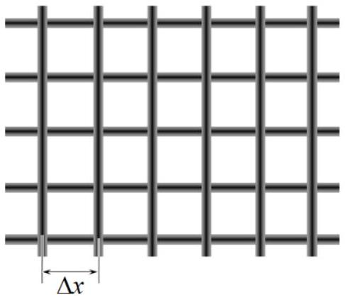
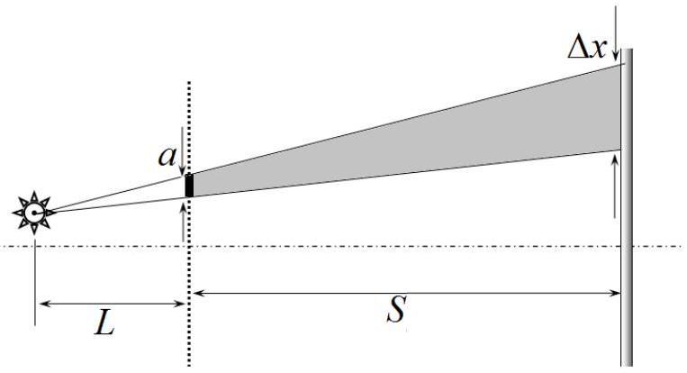

The image of the grid created by the light of another bulb will simply be shifted by some value $\delta x$. This shift is directed parallel to the "shift" when moving from one bulb to another. Therefore, the images of the grid wires parallel to the line of the bulbs will be clear at any position of the screen, the shadows perpendicular to the line of the bulbs will be "blurred".

If the distance between the bulbs is $h$, then the magnitude of the image shift will be equal to

$$
\begin{equation*}
\delta x = h \frac { S } { L } . \tag{2}
\end{equation*}
$$

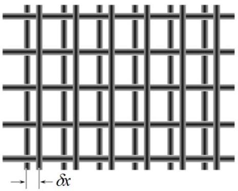
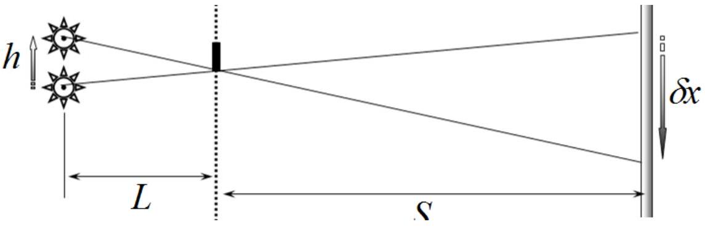

It is easy to understand that the image created by all the bulbs will be clear and sharp if the amount of shift when moving from one bulb to another is an integer number of image cells, that is, when

$$
\begin{equation*}
\delta x = m \Delta x . \tag{3}
\end{equation*}
$$

Using the previously obtained formulas (1)-(2), we find

$$
\begin{equation*}
S _ { m } = L \frac { m } { \frac { h } { a } - m } . \tag{4}
\end{equation*}
$$

Given the numerical data given in the problem statement, the numerical values of possible screen positions are given in the table below.

| $m$ | 1 | 2 | 3 | 4 |
| :--- | :--- | :--- | :--- | :--- |
| $S _ { m } , \mathrm {~cm}$ | 2,56 | 6,90 | 15,8 | 44,4 |

As an illustration, we present a drawing showing the "spread of shadows" from the grid (the proportions are not preserved, the vertical size is greatly increased).
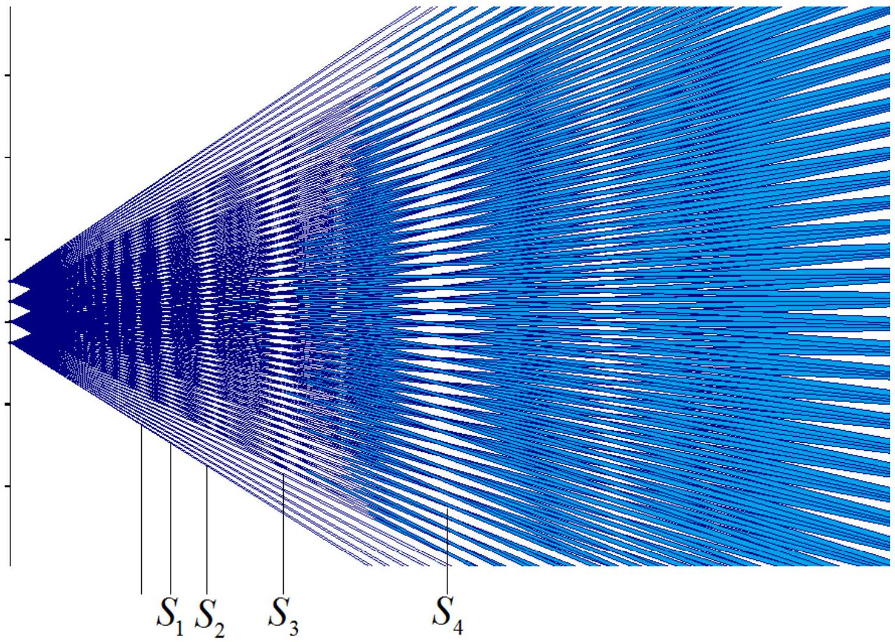

| Content | Points |
| :--- | :--- |
| Formula (1): $\Delta x = a \frac { L + S } { L }$ | 0.2 |
| Formula (2): $\delta x = h \frac { S } { L }$ | 0.2 |
| Formula (3): $\delta x = m \Delta x$ | 0.2 |
| Formula (4): $S _ { m } = L \frac { m } { \frac { h } { a } - m }$ | 0.4 |
| Numerical values in the table: 0.5 for each correct value | 2.0 |
| Total | 3.0 |

## Problem 2. First estimate of the age of the Earth ( $\mathbf { 1 0 . 0 }$ points) Fourier's Law of Thermal Conductivity

2.1 According to Fourier's law, the heat flux in the left rod is equal to

$$
\begin{equation*}
j _ { Q 1 } = - 2 \kappa \frac { T - T _ { 1 } } { l } , \tag{1}
\end{equation*}
$$

and the heat flux in the right rod is found as

$$
\begin{equation*}
j _ { Q 2 } = - \kappa \frac { T _ { 2 } - T } { l } . \tag{2}
\end{equation*}
$$

In steady state the heat flux should be the same in both rods

$$
\begin{equation*}
j _ { Q 1 } = j _ { Q 2 } , \tag{3}
\end{equation*}
$$

from which we find

$$
\begin{equation*}
T = \frac { 2 T _ { 1 } + T _ { 2 } } { 3 } = 50 ^ { \circ } \mathrm { C } . \tag{4}
\end{equation*}
$$

2.2 The heat flux along the rod must remain constant, which yields the differential equation

$$
\begin{equation*}
\frac { 1 } { T ^ { 2 } } \frac { d T } { d x } = b = \text { const } , \tag{5}
\end{equation*}
$$

whose solution has the form

$$
\begin{equation*}
- \frac { 1 } { T } = b x + C , \tag{6}
\end{equation*}
$$

where $C$ is a constant of integration.
Taking into account the boundary conditions

$$
\begin{align*}
& T ( 0 ) = T _ { 1 } ,  \tag{7}\\
& T ( l ) = T _ { 2 } , \tag{8}
\end{align*}
$$

we obtain the following final expression for the temperature dependence

$$
\begin{equation*}
T ( x ) = \frac { T _ { 1 } } { 1 - \left( 1 - \frac { T _ { 1 } } { T _ { 2 } } \right) \frac { x } { l } } . \tag{9}
\end{equation*}
$$

2.3 When ice forms near its contact with the lake water, the temperature is 0°C, which causes a temperature difference of $\Delta t = | t |$. Let us consider a portion of ice surface of the area $S$, assuming its thickness to be $h$. Then the amount of heat released into the environment at the point of contact during time $d \tau$ is equal to

$$
\begin{equation*}
\delta Q _ { 1 } = \kappa \frac { \Delta t } { h } S d \tau . \tag{10}
\end{equation*}
$$

During the process of water crystallization at the point of contact with ice, the amount of heat released is found as

$$
\begin{equation*}
\delta Q _ { 2 } = \lambda \rho S d h . \tag{11}
\end{equation*}
$$

By equating these amounts of heat $\delta Q _ { 1 } = \delta Q _ { 2 }$, we obtain the formula

$$
\begin{equation*}
d \tau = \frac { \lambda \rho } { \kappa | t | } h d h , \tag{12}
\end{equation*}
$$

which after integration gives the final answer

$$
\begin{equation*}
\tau = \frac { \lambda \rho h ^ { 2 } } { 2 \kappa | t | } = 5.45 \cdot 10 ^ { 3 } \mathrm {~s} . \tag{13}
\end{equation*}
$$

## Electrothermal analogy

2.4 Ohm's law for the electric current density has the form $j _ { E } = \sigma E = - \sigma \frac { d \varphi } { d x }$, and the electric current density itself is associated with the flow of electric charge, so the table of correspondence between thermal and electrical quantities takes the form shown below.

| Thermal value | Electrical quantity |
| :--- | :--- |
| temperature $T$ | electric field potential $\varphi$ |
| amount of heat $Q$ | electric charge $q$ |
| heat flux $j _ { Q }$ | electric current density $j _ { E }$ |
| thermal conductivity coefficient $\kappa$ | specific conductivity $\sigma$ |

2.5 It follows from the electrothermal analogy that the cube can be represented as an equivalent electrical circuit, shown in the figure below.
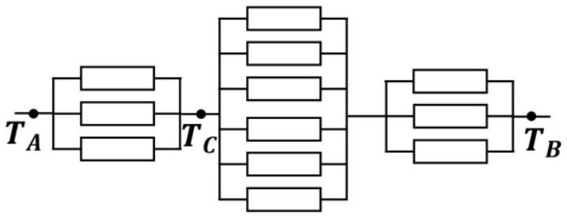

Since the temperature in the electrothermal analogy is a potential, and the resistances of all ribs are the same, we obtain the relation

$$
\begin{equation*}
\frac { T _ { B } - T _ { A } } { \frac { 5 } { 6 } } = \frac { T _ { C } - T _ { A } } { \frac { 1 } { 3 } } , \tag{14}
\end{equation*}
$$

whence

$$
\begin{equation*}
T _ { C } = \frac { 1 } { 5 } \left( 3 T _ { A } + 2 T _ { B } \right) = 60 ^ { \circ } \mathrm { C } . \tag{15}
\end{equation*}
$$

2.6 Let us add another heat source to the system at point $A ^ { \prime }$, which is located diametrically opposite to point $B$, and also another heat sink at point $B ^ { \prime }$, diametrically opposite to point $A$, see the figure below, which shows the side view.
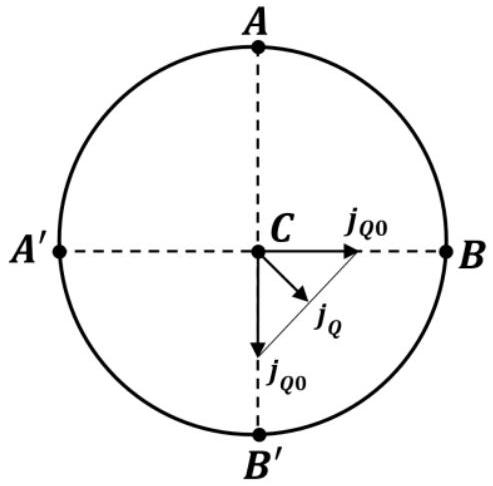

Obviously, each of the pairs $A B ^ { \prime }$ and $A ^ { \prime } B$ makes the same contribution to the heat flux at point $C$, equal in magnitude

$$
\begin{equation*}
j _ { Q 0 } = \frac { P } { 2 \pi R h } . \tag{16}
\end{equation*}
$$

On the other hand, the total heat flux at point $C$ is equal to the vector sum of two mutually perpendicular fluxes $j _ { Q 0 }$, and it, as follows from the symmetry, is exactly twice the desired one, therefore

$$
\begin{equation*}
j _ { Q } = \frac { \sqrt { 2 } } { 2 } j _ { Q 0 } = \frac { P } { 2 \sqrt { 2 } \pi R h } . \tag{17}
\end{equation*}
$$

## The first estimate of the Earth age

2.7 The amount of heat $Q$ stored in a kettle is proportional to the cube of its size $R$, that is,

$$
\begin{equation*}
Q \sim R ^ { 3 } . \tag{18}
\end{equation*}
$$

and the power $P$ lost by it due to heat transfer is proportional to its surface area

$$
\begin{equation*}
P \sim R ^ { 2 } . \tag{19}
\end{equation*}
$$

Therefore, the required time is proportional to the size of the teapot and is

$$
\begin{equation*}
\tau = \frac { R _ { E } } { r _ { 0 } } \tau _ { 0 } = 2.56 \cdot 10 ^ { 8 } \mathrm {~h} = 2.92 \cdot 10 ^ { 4 } \text { years } . \tag{20}
\end{equation*}
$$

2.8 Since the thermal conductivity of the core is infinite, its temperature $T _ { 0 }$ is the same everywhere, including at the boundary with the mantle. According to the electrothermal analogy, the temperature difference $T _ { 0 } - T$ is the potential difference (voltage), and the radiation power from the Earth's surface is determined by the Stefan-Boltzmann law

$$
\begin{equation*}
P = 4 \pi R _ { E } ^ { 2 } \sigma T ^ { 4 } \tag{21}
\end{equation*}
$$

and is similar to electric current, so there is a linear relationship between them

$$
\begin{equation*}
T _ { 0 } - T = P R _ { T } . \tag{22}
\end{equation*}
$$

where the quantity $R _ { T }$ represents the so-called thermal resistance.
Using the same electrothermal analogy, thermal resistance is written as

$$
\begin{equation*}
R _ { T } = \frac { 1 } { \kappa } \int _ { R _ { 0 } } ^ { R _ { E } } \frac { d R } { 4 \pi R ^ { 2 } } = \frac { 1 } { 4 \pi \kappa } \left( \frac { 1 } { R _ { 0 } } - \frac { 1 } { R _ { E } } \right) , \tag{23}
\end{equation*}
$$

from which we finally obtain the temperature of the Earth's core

$$
\begin{equation*}
T _ { 0 } = T + \frac { \sigma T ^ { 4 } R _ { E } \left( R _ { E } - R _ { 0 } \right) } { \kappa R _ { 0 } } = 4.84 \cdot 10 ^ { 7 } \mathrm {~K} . \tag{24}
\end{equation*}
$$

2.9 Since the transferred heat (current strength) is the same, we obtain the proportion for the temperature

$$
\begin{equation*}
\frac { T _ { 0 } - T } { R _ { T } } = \frac { T _ { H } - T } { R _ { H } } , \tag{25}
\end{equation*}
$$

where the thermal resistance of a spherical layer of thickness $H$ is given by the expression

$$
\begin{equation*}
R _ { H } = \frac { H } { 4 \pi \kappa R _ { 2 } ^ { 2 } } . \tag{26}
\end{equation*}
$$

Thus, we obtain the temperature at depth $H$ as

$$
\begin{equation*}
T _ { H } = T + \left( T _ { 0 } - T \right) \frac { H R _ { 0 } } { R _ { E } \left( R _ { E } - R _ { 0 } \right) } = 1.86 \cdot 10 ^ { 4 } \mathrm {~K} . \tag{27}
\end{equation*}
$$

The actual core temperature is, of course, much lower, since the thermal balance with the Sun must be taken into account.

2.10 The change over time in the amount of heat stored in the core is equal to

$$
\begin{equation*}
\frac { d Q } { d t } = c m \frac { d T _ { 0 } } { d t } , \tag{28}
\end{equation*}
$$

where the mass of the core is obtained as

$$
\begin{equation*}
m = \frac { 4 } { 3 } \pi \rho R _ { 0 } ^ { 3 } . \tag{29}
\end{equation*}
$$

According to the law of energy conservation we have

$$
\begin{equation*}
\frac { d Q } { d t } = - P , \tag{28}
\end{equation*}
$$

where $P$ is given by expression (21).
The core temperature $T _ { 0 }$ is given by formula (24), in which the first term can be neglected $\left( T _ { 0 } \gg T \right)$, so we finally obtain

$$
\begin{equation*}
\frac { d T } { T } = - \frac { \kappa R _ { E } } { c \rho R _ { 0 } ^ { 2 } \left( R _ { E } - R _ { 0 } \right) } d \tau . \tag{29}
\end{equation*}
$$

By integrating and expanding the exponential, we find

$$
\begin{equation*}
\Delta T = \frac { \kappa R _ { E } T \tau } { c \rho R _ { 0 } ^ { 2 } \left( R _ { E } - R _ { 0 } \right) } = 3.14 \cdot 10 ^ { - 2 } \mathrm {~K} . \tag{30}
\end{equation*}
$$

|  | Content | Points |  |
| :--- | :--- | :--- | :--- |
| 2.1 | Formula (1): $j _ { Q 1 } = - 2 \kappa \frac { T - T _ { 1 } } { l }$ | 0.2 | 1.0 |
|  | Formula (2): $j _ { Q 2 } = - \kappa \frac { T _ { 2 } - T } { l }$ | 0.2 |  |
|  | Formula (3): $j _ { Q 1 } = j _ { Q 2 }$ | 0.2 |  |
|  | Formula (4): $T = \frac { 2 T _ { 1 } + T _ { 2 } } { 3 }$ | 0.2 |  |
|  | Numerical value in formula (4): $T = 50 ^ { \circ } \mathrm { C }$ | 0.2 |  |
| 2.2 | Formula (5): $\frac { 1 } { T ^ { 2 } } \frac { d T } { d x } = b =$ const | 0.2 | 1.0 |
|  | Formula (6): $- \frac { 1 } { T } = b x + C$ | 0.2 |  |
|  | Formula (7): $T ( 0 ) = T _ { 1 }$ | 0.2 |  |
|  | Formula (8): $T ( l ) = T _ { 2 }$ | 0.2 |  |
|  | Formula (9): $T ( x ) = \frac { T _ { 1 } } { 1 - \left( 1 - \frac { T _ { 1 } } { T _ { 2 } } \right) ^ { \frac { x } { l } } }$ | 0.2 |  |
| 2.3 | Formula (10): $\delta Q _ { 1 } = \kappa \frac { \Delta t } { h } S d \tau$ | 0.2 | 1.0 |
|  | Formula (11): $\delta Q _ { 2 } = \lambda \rho S d h$ | 0.2 |  |
|  | Formula (12): $d \tau = \frac { \lambda \rho } { \kappa \| t \| } h d h$ | 0.2 |  |
|  | Formula (13): $\tau = \frac { \lambda \rho h ^ { 2 } } { 2 \kappa \| t \| }$ | 0.2 |  |
|  | Numerical value in formula (13): $\tau = 5.45 \cdot 10 ^ { 3 } s$ | 0.2 |  |
| 2.4 | 0.2 for each correct value in the table | 4×0.2 | 0.8 |
| 2.5 | Correct equivalent circuit | 0.4 | 1.0 |
|  | Formula (14): $\frac { T _ { B } - T _ { A } } { \frac { 5 } { 6 } } = \frac { T _ { C } - T _ { A } } { \frac { 1 } { 3 } }$ | 0.2 |  |
|  | Formula (15): $T _ { C } = \frac { 1 } { 5 } \left( 3 T _ { A } + 2 T _ { B } \right)$ | 0.2 |  |
|  | Numerical value in formula (15): $T _ { C } = 60 ^ { \circ } \mathrm { C }$ | 0.2 |  |
| 2.6 | Formula (16): $j _ { Q 0 } = \frac { P } { 2 \pi R h }$ | 0.5 | 1.0 |
|  | Formula (17): $j _ { Q } = \frac { P } { 2 \sqrt { 2 } \pi R h }$ | 0.5 |  |
| 2.7 | Formula (18): $Q \sim R ^ { 3 }$ | 0.2 | 1.0 |
|  | Formula (19): $P \sim R ^ { 2 }$ | 0.2 |  |
|  | Formula ( $20 \tau = \frac { R _ { E } } { r _ { 0 } } \tau _ { 0 }$ | 0.3 |  |

|  | Numerical value in formula (20): $\tau = 2.56 \cdot 10 ^ { 8 } \mathrm {~h} = 2.92 \cdot 10 ^ { 4 }$ years | 0.3 |  |
| :--- | :--- | :--- | :--- |
| 2.8 | Formula (21): $P = 4 \pi R _ { E } ^ { 2 } \sigma T ^ { 4 }$ | 0.2 | 1.0 |
|  | Formula (22): $T _ { 0 } - T = P R _ { T }$ | 0.2 |  |
|  | Formula (23): $R _ { T } = \frac { 1 } { 4 \pi \kappa } \left( \frac { 1 } { R _ { 0 } } - \frac { 1 } { R _ { E } } \right)$ | 0.2 |  |
|  | Formula (24): $T _ { 0 } = T + \frac { \sigma T ^ { 4 } R _ { E } \left( R _ { E } - R _ { 0 } \right) } { \kappa R _ { 0 } }$ | 0.2 |  |
|  | Numerical value in formula (24): $T _ { 0 } = 4.84 \cdot 10 ^ { 7 } \mathrm {~K}$ | 0.2 |  |
| 2.9 | Formula (25): $\frac { T _ { 0 } - T } { R _ { T } } = \frac { T _ { H } - T } { R _ { H } }$ | 0.3 | 1.0 |
|  | Formula (26): $R _ { H } = \frac { H } { 4 \pi \kappa R _ { E } ^ { 2 } }$ | 0.2 |  |
|  | Formula (27): $T _ { H } = T + \left( T _ { 0 } - T \right) \frac { H R _ { 0 } } { R _ { E } \left( R _ { E } - R _ { 0 } \right) }$ | 0.3 |  |
|  | Numerical value in formula (27): $T _ { H } = 1.86 \cdot 10 ^ { 4 } \mathrm {~K}$ | 0.2 |  |
| 2.10 | Formula (28): $\frac { d Q } { d t } = c m \frac { d T _ { 0 } } { d t }$ | 0.2 | 1.2 |
|  | Formula (29): $m = \frac { 4 } { 3 } \pi \rho R _ { 0 } ^ { 3 }$ | 0.2 |  |
|  | Formula (30): $\frac { d Q } { d t } = - P$ | 0.2 |  |
|  | Formula (31): $\frac { d T } { T } = - \frac { \kappa R _ { E } } { c \rho R _ { 0 } ^ { 2 } \left( R _ { E } - R _ { 0 } \right) } d \tau$ | 0.2 |  |
|  | Formula (32): $\Delta T = \frac { \kappa R _ { E } T \tau } { c \rho R _ { 0 } ^ { 2 } \left( R _ { E } - R _ { 0 } \right) }$ | 0.2 |  |
|  | Numerical value in formula (32): $\Delta T = 3.14 \cdot 10 ^ { - 2 } \mathrm {~K}$ | 0.2 |  |
| Total |  |  | 10.0 |

## Problem 3. Dirac's monopole (10.0 points)

## Introduction

3.1 It is easy to establish that the dimension of the magnetic charge is equal to $\left[ q _ { m } \right] = \mathrm { A } \cdot \mathrm { m }$, therefore we obtain

$$
\begin{equation*}
x _ { 1 } = 1 ; x _ { 2 } = 1 ; x _ { 3 } = 0 ; x _ { 4 } = 0 . \tag{1}
\end{equation*}
$$

3.2 Calculation using the given formula leads to the answer

$$
\begin{equation*}
L = 1.69 \cdot 10 ^ { - 7 } \mathrm { Hn } . \tag{2}
\end{equation*}
$$

## Classical description

3.3 Since the average normal component of the magnetic induction vector over the cross-section is known, the magnetic flux through the ring is equal to

$$
\begin{equation*}
\Phi = \pi R ^ { 2 } B _ { z } ( x ) , \tag{3}
\end{equation*}
$$

and the induction EMF in the ring is determined by M. Faraday's law of electromagnetic induction

$$
\begin{equation*}
\varepsilon _ { i n d } ( x ) = - \frac { d \Phi } { d t } , \tag{4}
\end{equation*}
$$

from which we finally find

$$
\begin{equation*}
\varepsilon _ { \text {ind } } ( x ) = - \frac { d \Phi } { d x } \frac { d x } { d t } = V \pi R ^ { 2 } B _ { 0 } a ^ { 3 } \frac { 3 x } { \left( x ^ { 2 } + a ^ { 2 } \right) ^ { \frac { 5 } { 2 } } } . \tag{5}
\end{equation*}
$$

The graph of this dependence is shown schematically in the figure below.
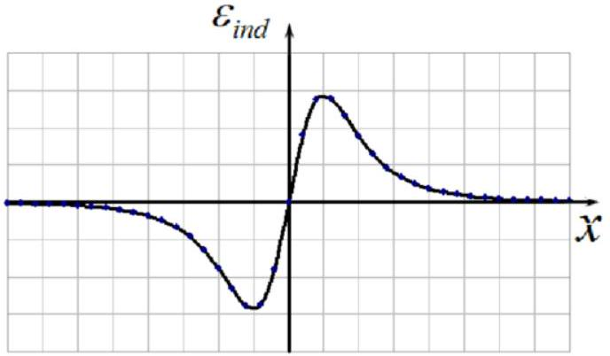

3.4 Since the ring is superconducting, the induction EMF that occurs in the ring when the external magnetic flux changes is compensated by the self-induction EMF, that is,

$$
\begin{equation*}
\varepsilon _ { i n d } - L \frac { d l } { d t } = 0 , \tag{6}
\end{equation*}
$$

from where, taking into account formula (4) and integration with the initial condition, we obtain

$$
\begin{equation*}
I ( x ) = - \frac { \Phi } { L } = - \frac { B _ { 0 } \pi R ^ { 2 } } { L } \frac { a ^ { 3 } } { \left( x ^ { 2 } + a ^ { 2 } \right) ^ { \frac { 3 } { 2 } } } . \tag{7}
\end{equation*}
$$

The schematic graph of this dependence is shown in the figure below. Up to a negative coefficient, this graph repeats the graph of the dependence of the magnetic flux through the ring on the ring coordinate.
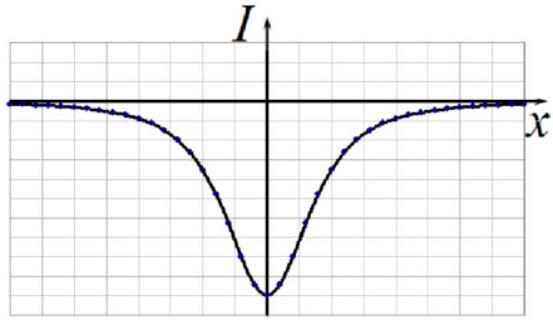
3.5 As follows from the obtained expression (7), after the magnet flies away through the ring, the final current in the ring is found to be zero, that is

$$
\begin{equation*}
I _ { f } = 0 . \tag{8}
\end{equation*}
$$

3.6 In the frame of reference associated with the monopole, the electrons in the ring are subject to the Lorentz force, whose magnitude can be represented as

$$
\begin{equation*}
F _ { L } ( z ) = - e V B _ { r } ( z ) , \tag{9}
\end{equation*}
$$

where $B _ { r }$ denotes the radial component of the magnetic field induction vector of the monopole. The minus sign appears because in this frame of reference the velocity of the ring is negative.

The radial component of the induction vector in this case can be easily expressed using the formula given in the problem formulation:

$$
\begin{equation*}
B _ { r } ( z ) = \frac { \mu _ { 0 } q _ { m } } { 4 \pi } \frac { R } { \left( R ^ { 2 } + z ^ { 2 } \right) ^ { \frac { 3 } { 2 } } } . \tag{10}
\end{equation*}
$$

Thus, the dependence of the Lorentz force on the ring coordinate has the form

$$
\begin{equation*}
F _ { L } ( z ) = - e V \frac { \mu _ { 0 } q _ { m } } { 4 \pi } \frac { R } { \left( R ^ { 2 } + z ^ { 2 } \right) ^ { \frac { 3 } { 2 } } } . \tag{11}
\end{equation*}
$$

This force always points in one direction, which means that the resulting formula is valid for any values of the ring coordinate.
3.7 The induction EMF in this case is equal to the work of the Lorentz force to move a single charge along the ring

$$
\begin{equation*}
\varepsilon _ { \text {ind } } ( z ) = \frac { 2 \pi R F _ { L } ( z ) } { e } = - \frac { \mu _ { 0 } q _ { m } V } { 2 } \frac { R ^ { 2 } } { \left( R ^ { 2 } + z ^ { 2 } \right) ^ { \frac { 3 } { 2 } } } . \tag{12}
\end{equation*}
$$

The schematic graph of this dependence is shown in the figure below.
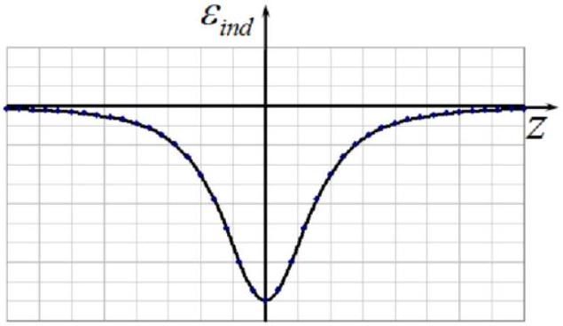
3.8 From formula (6) we find the current strength by integrating, taking into account that $d z = - V d t$, and also using the initial condition

$$
\begin{equation*}
I = - \frac { \mu _ { 0 } q _ { m } } { 2 L } \left( 1 - \frac { z } { \sqrt { R ^ { 2 } + z ^ { 2 } } } \right) . \tag{13}
\end{equation*}
$$

The schematic graph of this dependence is shown in the figure below.

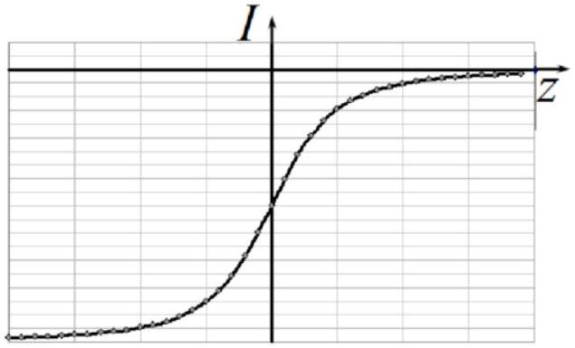
3.9 After the monopole passes away through the ring $( z = - \infty )$, the ring current "remains", whose strength is equal to

$$
\begin{equation*}
I _ { f } = - \frac { \mu _ { 0 } q _ { m } } { L } . \tag{14}
\end{equation*}
$$

Thus, unlike when a magnet passes through a ring, there must be a residual current that can be attempted to be detected in an experiment!

## Quantization of magnetic flux in superconductors

3.10 Cooper pairs are accelerated in the ring due to the action of the Lorentz force, therefore, using formula (12), which relates the force with the EMF arising in the ring, as well as M. Faraday's law (4), we obtain the following equation of motion of an electron in the ring

$$
\begin{equation*}
m _ { e } \frac { d v } { d t } = - \frac { e } { 2 \pi R } \frac { d \Phi } { d t } , \tag{15}
\end{equation*}
$$

where $v$ designates the speed of its motion.
The angular momentum of a pair of electrons relative to the center of the ring is equal to

$$
\begin{equation*}
M = 2 m _ { e } v R , \tag{16}
\end{equation*}
$$

therefore, the sought relationship takes the form

$$
\begin{equation*}
\Delta M = - \frac { e } { \pi } \Delta \Phi . \tag{17}
\end{equation*}
$$

3.11 Considering that the change in the magnetic field of the induced current is equal in magnitude and opposite to the change in the magnetic flux of the external field and taking into account N. Bohr's quantization rule, we find

$$
\begin{equation*}
\varphi _ { 0 } = \frac { \pi } { e } \hbar = 2.06 \cdot 10 ^ { - 15 } \mathrm {~Wb} . \tag{18}
\end{equation*}
$$

3.12 From formula (7), which relates the change in flux to the current in the ring, we obtain

$$
\begin{equation*}
\Delta I _ { 0 } = \frac { \varphi _ { 0 } } { L } = 1.22 \cdot 10 ^ { - 8 } \mathrm {~A} . \tag{19}
\end{equation*}
$$

## Estimating the Dirac Monopole Mass

3.13 The induction of the magnetic field of a monopole is determined by the formula from the problem statement, and since the magnetic field of a monopole is spherically symmetric, the total magnetic flux through a sphere, whose center coincides with the monopole, is equal to

$$
\begin{equation*}
\Phi = \mu _ { 0 } q _ { m } , \tag{20}
\end{equation*}
$$

and since it is quantized

$$
\begin{equation*}
\Phi = n \varphi _ { 0 } , \tag{21}
\end{equation*}
$$

where $n$ is an integer, then from expressions (20) and (21) we infer that the magnetic charge is also quantized

$$
\begin{equation*}
q _ { m } = n \frac { \varphi _ { 0 } } { \mu _ { 0 } } . \tag{22}
\end{equation*}
$$

From formula (22) we conclude that the elementary magnetic charge is equal to

$$
\begin{equation*}
q _ { m 0 } = \frac { \varphi _ { 0 } } { \mu _ { 0 } } = \frac { \pi \hbar } { e \mu _ { 0 } } = 1.64 \cdot 10 ^ { - 9 } \mathrm {~A} \cdot \mathrm {~m} . \tag{23}
\end{equation*}
$$

3.14 Since the change in the magnetic flux through the ring during the flight of the Dirac monopole is equal to one quantum of the magnetic flux, the change in current in the ring is equal to the previously found value

$$
\begin{equation*}
\Delta I = \Delta I _ { 0 } = 1.22 \cdot 10 ^ { - 8 } \mathrm {~A} . \tag{24}
\end{equation*}
$$

3.15 The energy of the electric field of a sphere of radius $r _ { 0 }$ uniformly charged over the surface can be calculated using the formula

$$
\begin{equation*}
W _ { e } = \frac { e ^ { 2 } } { 8 \pi \varepsilon _ { 0 } r _ { 0 } } . \tag{25}
\end{equation*}
$$

Equating this energy to the rest energy

$$
\begin{equation*}
W _ { e } = m _ { e } c ^ { 2 } , \tag{26}
\end{equation*}
$$

we find the classical radius of the electron

$$
\begin{equation*}
r _ { 0 } = \frac { e ^ { 2 } } { 8 \pi \varepsilon _ { 0 } m _ { e } c ^ { 2 } } = 1.40 \cdot 10 ^ { - 15 } \mathrm {~m} . \tag{27}
\end{equation*}
$$

3.16 The energy of the magnetic field of the Dirac monopole $W _ { m }$ is found by analogy with the electric field energy of electron (25) as

$$
\begin{equation*}
W _ { m } = \frac { \mu _ { 0 } q _ { m 0 } ^ { 2 } } { 8 \pi r _ { 0 } } . \tag{28}
\end{equation*}
$$

Equating this energy to the rest energy

$$
\begin{equation*}
W _ { m } = m _ { m } c ^ { 2 } , \tag{29}
\end{equation*}
$$

we obtain for the sought mass ratio

$$
\begin{equation*}
\frac { m _ { m } } { m _ { e } } = \frac { \mu _ { 0 } \varepsilon _ { 0 } q _ { m 0 } ^ { 2 } } { e ^ { 2 } } = \left( \frac { \pi } { e ^ { 2 } c \mu _ { 0 } } \right) ^ { 2 } = 1.17 \cdot 10 ^ { 3 } . \tag{30}
\end{equation*}
$$

|  | Content | Points |  |
| :--- | :--- | :--- | :--- |
| 3.1 | Formula (1): $x _ { 1 } = 1 ; x _ { 2 } = 1 ; x _ { 3 } = 0 ; x _ { 4 } = 0$, за каждое по 0.2 | 0.8 | 0.8 |
| 3.2 | Numerical value in formula (2): $L = 1.69 \cdot 10 ^ { - 7 } \Gamma \mathrm { H }$ | 0.6 | 0.6 |
| 3.3 | Formula (3): $\Phi = \pi R ^ { 2 } B _ { z } ( x )$ | 0.2 | 1.2 |
|  | Formula (4): $\varepsilon _ { \text {ind } } ( x ) = - \frac { d \Phi } { d t }$ | 0.2 |  |
|  | Formula (5): $\varepsilon _ { \text {ind } } ( x ) = V \pi R ^ { 2 } B _ { 0 } a ^ { 3 } \frac { 3 x } { \left( x ^ { 2 } + a ^ { 2 } \right) ^ { \frac { 5 } { 2 } } }$ | 0.2 |  |
|  | Qualitative graph: |  |  |
|  | Passes through the origin | 0.2 |  |
|  | Two local extrema, maximum and minimum | 0.2 |  |
| 3.4 | Formula (6): $\varepsilon _ { \text {ind } } - L \frac { d I } { d t } = 0$ | 0.2 | 0.8 |
|  | Formula (7): $I ( x ) = - \frac { B _ { 0 } \pi R ^ { 2 } } { L } \frac { a ^ { 3 } } { \left( x ^ { 2 } + a ^ { 2 } \right) ^ { \frac { 3 } { 2 } } }$ | 0.2 |  |
|  | Qualitative graph: |  |  |
|  | Extremum at the origin | 0.2 |  |
| 3.5 | Formula (8): $I _ { f } = 0$ | 0.2 | 0.2 |
| 3.6 | Formula (9): $F _ { L } ( z ) = - e V B _ { r } ( z )$ | 0.2 | 0.6 |
|  | Formula (10): $B _ { r } ( z ) = \frac { \mu _ { 0 } q _ { m } } { 4 \pi } \frac { R } { \left( R ^ { 2 } + z ^ { 2 } \right) ^ { \frac { 3 } { 2 } } }$ | 0.2 |  |
|  | Formula (11): $F _ { L } ( z ) = - e V \frac { \mu _ { 0 } q _ { m } } { 4 \pi } \frac { R } { \left( R ^ { 2 } + z ^ { 2 } \right) ^ { \frac { 3 } { 2 } } }$ | 0.2 |  |
| 3.7 | Formula (12): $\varepsilon _ { \text {ind } } ( z ) = - \frac { \mu _ { 0 } q _ { m } V } { 2 } \frac { R } { \left( R ^ { 2 } + z ^ { 2 } \right) ^ { \frac { 3 } { 2 } } }$ | 0.2 | 0.6 |
|  | Qualitative graph: |  |  |
|  | Extremum at the origin | 0.2 |  |
| 3.8 | Formula (13): $I = - \frac { \mu _ { 0 } q _ { m } } { 2 L } \left( 1 - \frac { z } { \sqrt { R ^ { 2 } + z ^ { 2 } } } \right)$ | 0.2 | 0.8 |
|  | Quality graph: |  |  |
|  | Tends to zero a plus infinity | 0.2 |  |
|  | Monotonic in nature | 0.2 |  |
| 3.9 | Formula (14): $I _ { f } = - \frac { \mu _ { 0 } q _ { m } } { L }$ | 0.2 | 0.2 |
| 3.10 | Formula (15): $m _ { e } \frac { d v } { d t } = - \frac { e } { 2 \pi R } \frac { d \Phi } { d t }$ | 0.2 | 0.6 |
|  | Formula (16): $M = 2 m _ { e } v R$ | 0.2 |  |

|  | Formula (17): $\Delta M = - \frac { e } { \pi } \Delta \Phi$ | 0.2 |  |
| :--- | :--- | :--- | :--- |
| 3.11 | Formula (18): $\varphi _ { 0 } = \frac { \pi } { e } \hbar$ | 0.2 | 0.4 |
|  | Numerical value in formula (18): $\varphi _ { 0 } = 2.06 \cdot 10 ^ { - 15 } \mathrm {~Wb}$ | 0.2 |  |
| 3.12 | Formula (19): $\Delta I _ { 0 } = \frac { \varphi _ { 0 } } { L }$ | 0.2 | 0.4 |
|  | Numerical value in formula (19): $\Delta I _ { 0 } = 1.22 \cdot 10 ^ { - 8 } \mathrm {~A}$ | 0.2 |  |
| 3.13 | Formula (20): $\Phi = \mu _ { 0 } q _ { m }$ | 0.2 | 1.0 |
|  | Formula (21): $\Phi = n \varphi _ { 0 }$ | 0.2 |  |
|  | Formula (22): $q _ { m } = n \frac { \varphi _ { 0 } } { \mu _ { 0 } }$ | 0.2 |  |
|  | Formula (23): $q _ { m 0 } = \frac { \varphi _ { 0 } } { \mu _ { 0 } } = \frac { \pi \hbar } { e \mu _ { 0 } }$ | 0.2 |  |
|  | Numerical value in formula (23): $q _ { m 0 } = 1.64 \cdot 10 ^ { - 9 } \mathrm {~A} \cdot \mathrm {~m}$ | 0.2 |  |
| 3.14 | Formula (24): $\Delta I = \Delta I _ { 0 }$ | 0.2 |  |
| 3.15 | Formula (25): $W _ { e } = \frac { e ^ { 2 } } { 8 \pi \varepsilon _ { 0 } r _ { 0 } }$. | 0.2 | 0.8   0.8 |
|  | Formula (26): $W _ { e } = m _ { e } c ^ { 2 }$ | 0.2 |  |
|  | Formula (27): $r _ { 0 } = \frac { e ^ { 2 } } { 8 \pi \varepsilon _ { 0 } m _ { e } c ^ { 2 } }$ | 0.2 |  |
|  | Numerical value in formula (27): $r _ { 0 } = 1.40 \cdot 10 ^ { - 15 } \mathrm {~m}$ | 0.2 |  |
| 3.16 | Formula (28): $W _ { m } = \frac { \mu _ { 0 } q _ { m 0 } ^ { 2 } } { 8 \pi r _ { 0 } }$ | 0.2 | 0.8 |
|  | Formula (29): $W _ { m } = m _ { m } c ^ { 2 }$ | 0.2 |  |
|  | Formula (30): $\frac { m _ { m } } { m _ { e } } = \frac { \mu _ { 0 } \varepsilon _ { 0 } q _ { m 0 } ^ { 2 } } { e ^ { 2 } } = \left( \frac { \pi } { e ^ { 2 } c \mu _ { 0 } } \right) ^ { 2 }$ | 0.2 |  |
|  | Numerical value in formula (30): $\frac { m _ { m } } { m _ { e } } = 1.17 \cdot 10 ^ { 3 }$ | 0.2 |  |
| Total |  |  | 10.0 |
