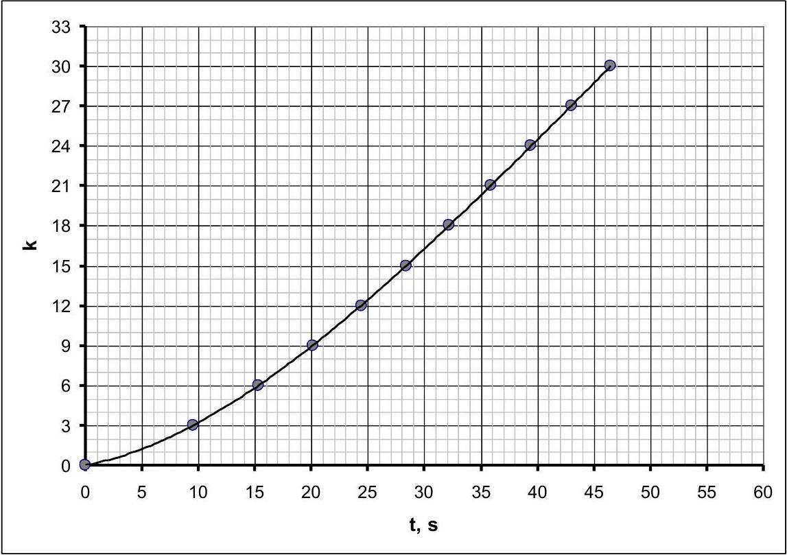
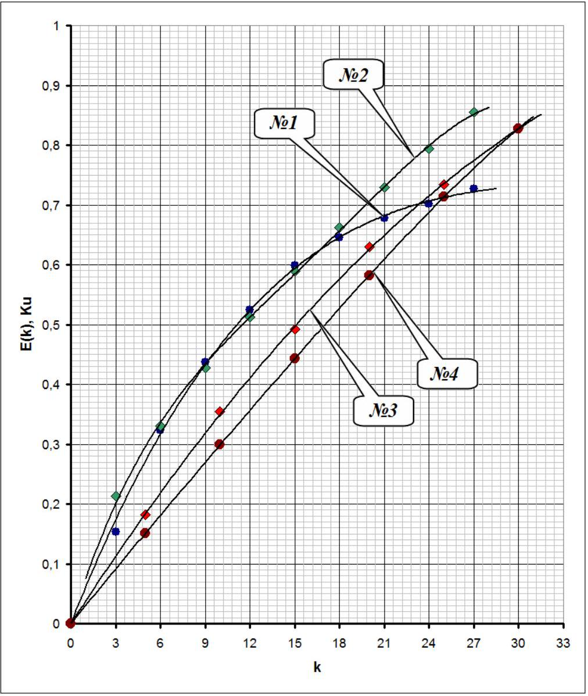
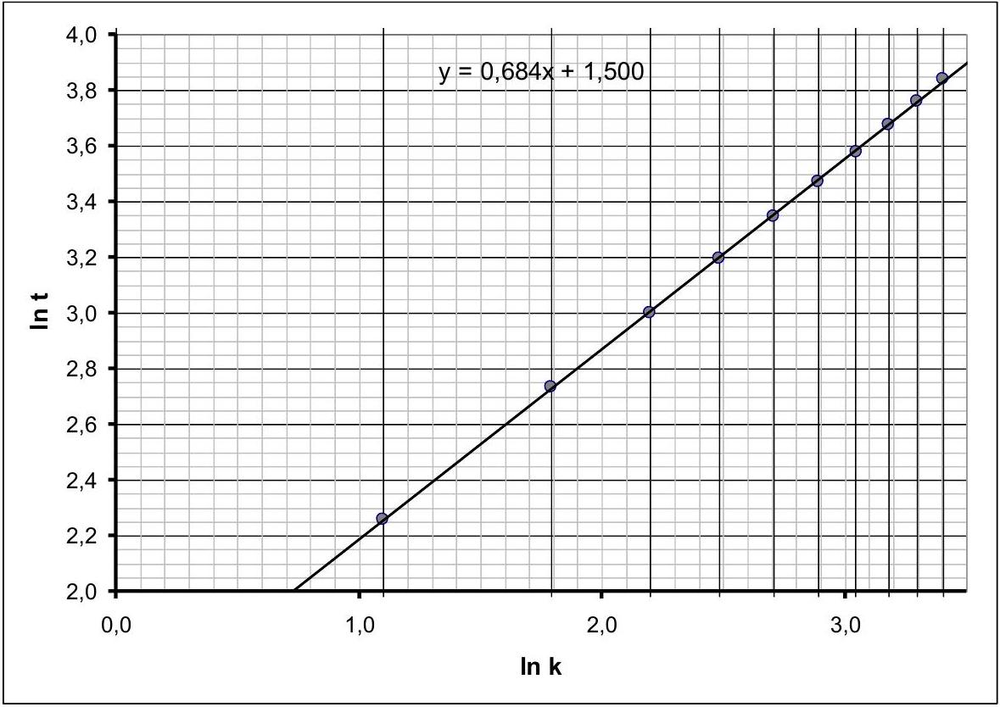
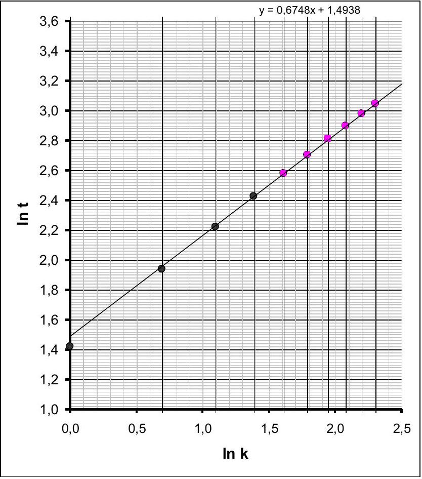
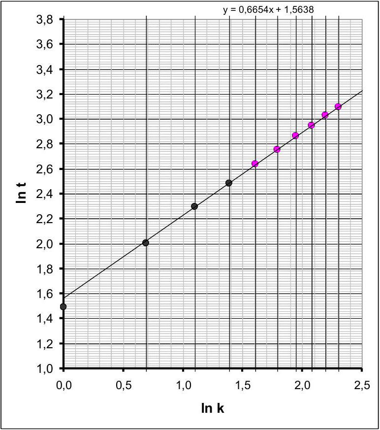
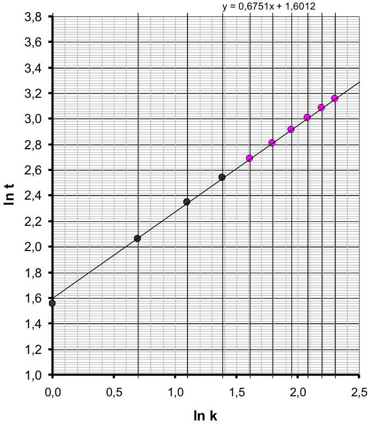
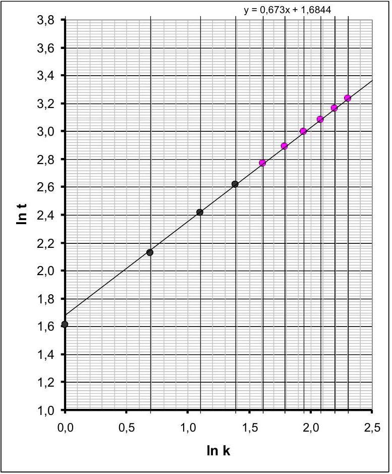
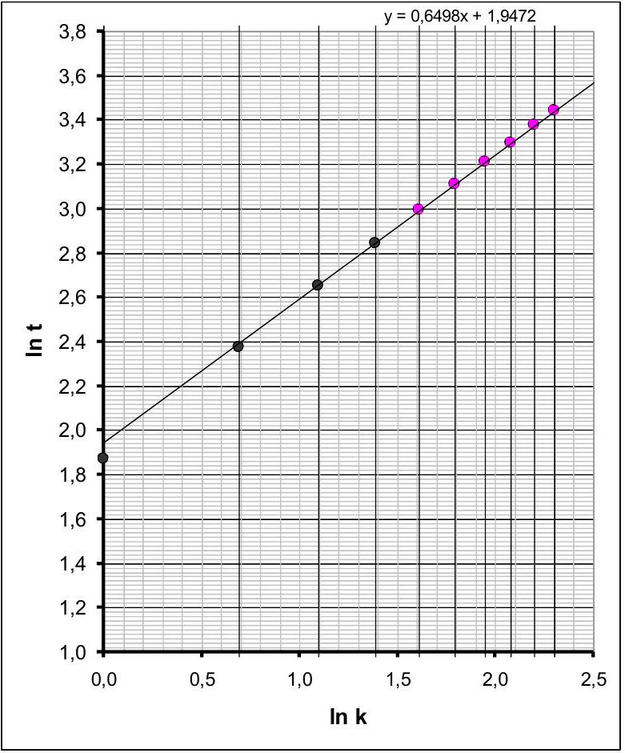
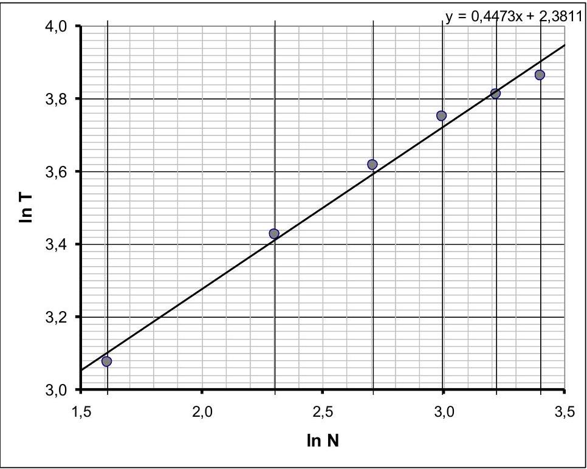

## SOLUTION TO THE EXPERIMENTAL COMPETITION   Torsion: Construction of the Potential Curve   Part 1. Theoretical Introduction

1.1 The kinetic energy of a rotating rod is given by the formula

$$
\begin{equation*}
E = \frac { I \omega ^ { 2 } } { 2 } . \tag{1}
\end{equation*}
$$

Here $I = \frac { m _ { 1 } a ^ { 2 } } { 12 } + 2 m _ { 2 } \frac { h ^ { 2 } } { 4 }$ is the moment of inertia of the rod with respect to the rotation axis (where $a$ is the length of the rod and $h$ is the distance between the threads), and $\omega = 2 \pi V$ is the angular velocity of the rod ( $\omega$ is the rotation frequency).

Therefore,

$$
\begin{equation*}
E = \pi ^ { 2 } \left( \frac { m _ { 1 } a ^ { 2 } } { 6 } + m _ { 2 } h ^ { 2 } \right) V ^ { 2 } \tag{2}
\end{equation*}
$$

At $V = 1 \mathrm {~s} ^ { - 1 }$, the energy of the rod is equal to the unit of energy sought. Here and in what follows, it is assumed that the energy associated with the vertical velocity of the rod can be neglected in comparison with the energy of rotational motion. According to the measurement results, $a = 25 \mathrm {~cm} , h = 15 \mathrm {~cm}$, and the mass values are given in the problem statement. Therefore,

$$
\begin{equation*}
1 K u \approx 6.35 \cdot 10 ^ { - 3 } \mathrm {~J} . \tag{3}
\end{equation*}
$$

1.2 Let us calculate the derivative of the proposed dependence of time on the coordinate, $t ( k ) = A k ^ { \alpha }$, with respect to $k$, taking into account that the coordinate is the number of turns $k$ (not necessarily an integer):

$$
\begin{align*}
& V ( k ) = \frac { d k } { d t } = \frac { k ^ { 1 - \alpha } } { \alpha A } ,  \tag{4}\\
& E ( k ) = V ^ { 2 } = \left( \frac { k ^ { 1 - \alpha } } { \alpha A } \right) ^ { 2 } . \tag{5}
\end{align*}
$$

1.3 Let us express the angular velocity of the rod from the law of energy conservation:

$$
\begin{equation*}
V ^ { 2 } = U ( N ) - U ( k ) . \tag{6}
\end{equation*}
$$

The unwinding time can be calculated using the following formula:

$$
\begin{equation*}
T = \int _ { 0 } ^ { N } \frac { d k } { V ( k ) } . \tag{7}
\end{equation*}
$$

Introducing a change of the integration variable,

$$
\begin{equation*}
\xi = \frac { N - k } { N } \tag{8}
\end{equation*}
$$

and using the dependence $U ( N ) = B N ^ { \beta }$, we obtain

$$
\begin{equation*}
T ( N ) = N ^ { 1 - \frac { \beta } { 2 } } \sqrt { \frac { 1 } { B } } \int _ { 0 } ^ { 1 } \frac { d \xi } { \sqrt { 1 - \xi \beta } } \tag{9}
\end{equation*}
$$

The integral in this expression does not depend on the value of $N$; it depends only on the exponent $\beta$. Therefore, the dependence of the unwinding time on the number of turns is given by the formula $T ( N ) =$ $G N ^ { \gamma }$, in which the exponent is

$$
\begin{equation*}
\gamma = 1 - \frac { \beta } { 2 } . \tag{10}
\end{equation*}
$$

## Part 2. Study of the Law of Motion

2.1-2.2 The results of the measurements and the required calculations are presented in Table 1.

| $\boldsymbol { k }$ | $\boldsymbol { t } \boldsymbol { , } \boldsymbol { s }$ | $V , s ^ { - 1 }$ | E, Ku (exp.) | ln k | ln $\boldsymbol { t }$ | E, Ku (theor.) |
| :--- | :--- | :--- | :--- | :--- | :--- | :--- |
| 0 | 0 | 0 | 0 |  |  |  |
| 3 | 9,55 | 0,391 | 0,153 | 1,099 | 2,257 | 0,213 |
| 6 | 15,35 | 0,568 | 0,323 | 1,792 | 2,731 | 0,330 |
| 9 | 20,11 | 0,662 | 0,438 | 2,197 | 3,001 | 0,427 |
| 12 | 24,42 | 0,725 | 0,525 | 2,485 | 3,195 | 0,512 |
| 15 | 28,39 | 0,774 | 0,599 | 2,708 | 3,346 | 0,590 |
| 18 | 32,17 | 0,803 | 0,645 | 2,890 | 3,471 | 0,662 |

| 21 | 35,86 | 0,823 | 0,677 | 3,045 | 3,580 | 0,729 |
| :--- | :--- | :--- | :--- | :--- | :--- | :--- |
| 24 | 39,46 | 0,838 | 0,702 | 3,178 | 3,675 | 0,794 |
| 27 | 43,02 | 0,852 | 0,726 | 3,296 | 3,762 | 0,855 |
| 30 | 46,5 |  |  | 3,401 | 3,839 | 0,914 |

The figure below shows the graph of the coordinate as a function of time.

2.3 able 1 shows the values of the rod's velocities $V$, calculated using the formula given in the problem statement. The kinetic energy values were calculated using the formula $E = V ^ { 2 }$.
2.4 The graph of the resulting dependence is shown in the figure (No. 1).

2.5 he potential energy at the specified zero level is

$$
\begin{equation*}
U ( k ) = - E ( k ) . \tag{11}
\end{equation*}
$$

2.6 The graph of the dependence of the motion time on the number of turns is shown in the figure below, plotted on a logarithmic scale.

2. 7 The coefficients of this dependence, $\ln t = \alpha \ln k + \ln A$, calculated using the least squares method, are

$$
\begin{align*}
& \alpha = 0.684 \pm 0.006 ,  \tag{12}\\
& \ln A = 1.50 \pm 0.02 . \tag{13}
\end{align*}
$$

The calculation of the parameter $A$ and its error yields

$$
\begin{align*}
& A = \exp ( \ln A ) = 4.48 \mathrm { Ku } ,  \tag{14}\\
& \Delta A = A \Delta ( \ln A ) = \pm 0.07 \mathrm { Ku } . \tag{15}
\end{align*}
$$

2.8-2.9 To calculate the kinetic energy, use formula (5) with the obtained numerical values of the parameters. The results of the calculations are presented in Table 1 and on the graph from Section 2.4, labeled as No. 2.

## Part 3. Step-by-Step Probing

3.1-3.5 The results of the measurements, calculations, graphs, and the final result (calculated value of the energy change $E _ { 5 - 10 }$ ) for each interval are presented below.

The values of the parameter $\alpha$ are calculated as the slope of the graph:

$$
\begin{equation*}
\alpha = \frac { \Delta ( \ln t ) } { \Delta ( \ln k ) } . \tag{16}
\end{equation*}
$$

It is convenient to take the values of the extreme points on the graph (the points where the line intersects the graph boundaries), denoted as $z _ { \min }$ and $z _ { \max }$, while $\Delta ( \ln k ) = 2.5$.

The value of the parameter $\ln A$ corresponds to the coordinate of the intersection of the line with the ordinate axis.

To calculate the change in kinetic energy, the following formula is used:

$$
\begin{equation*}
E _ { 5 - 10 } = \left( \frac { 10 ^ { 1 - \alpha } } { \alpha A } \right) ^ { 2 } - \left( \frac { 5 ^ { 1 - \alpha } } { \alpha A } \right) ^ { 2 } = \left( \frac { 5 ^ { 1 - \alpha } } { \alpha A } \right) ^ { 2 } \left( 4 ^ { 1 - \alpha } - 1 \right) . \tag{17}
\end{equation*}
$$

Interval 35-25
| $k$ | $t , \mathrm {~s}$ | $\ln k$ | $\ln t$ |
| :--- | :--- | :--- | :--- |
| 0 | 0,00 |  |  |
| 1 | 4,14 | 0,000 | 1,421 |
| 2 | 6,96 | 0,693 | 1,940 |
| 3 | 9,19 | 1,099 | 2,218 |
| 4 | 11,29 | 1,386 | 2,424 |
| 5 | 13,17 | 1,609 | 2,578 |
| 6 | 14,94 | 1,792 | 2,704 |
| 7 | 16,60 | 1,946 | 2,809 |
| 8 | 18,09 | 2,079 | 2,895 |
| 9 | 19,63 | 2,197 | 2,977 |
| 10 | 21,04 | 2,303 | 3,046 |

$$
\begin{array} { c c }
\alpha = & 0,672 \\
\ln A = & 1,500 \\
A = & 4,482
\end{array}
$$

$$
\begin{array} { l l }
\text { zmax } = & 3,18 \\
\text { zmin } = & 1,50
\end{array}
$$

Interval 30-20

$$
E _ { 5 - 10 } = \mathbf { 0 , 1 8 2 } \mathbf { K u }
$$

| $k$ | $t , \mathrm {~s}$ | $\ln k$ | $\ln t$ |
| :--- | :--- | :--- | :--- |
| 0 | 0 |  |  |
| 1 | 4,43 | 0,000 | 1,488 |
| 2 | 7,43 | 0,693 | 2,006 |
| 3 | 9,92 | 1,099 | 2,295 |
| 4 | 11,96 | 1,386 | 2,482 |
| 5 | 13,94 | 1,609 | 2,635 |
| 6 | 15,71 | 1,792 | 2,754 |
| 7 | 17,47 | 1,946 | 2,860 |
| 8 | 19,06 | 2,079 | 2,948 |
| 9 | 20,61 | 2,197 | 3,026 |
| 10 | 22,09 | 2,303 | 3,095 |

$$
\begin{array} { c c }
\alpha = & 0,664 \\
\ln A = & 1,570 \\
A = & 4,807
\end{array}
$$

$$
\begin{array} { l l }
\text { zmax } = & 3,23 \\
\text { zmin } = & 1,57
\end{array}
$$

$$
E _ { 5 - 10 } = \mathbf { 0 , 1 7 2 } \mathbf { K u }
$$

Interval 25-15
| $k$ | $t , \mathrm {~s}$ | $\ln k$ | $\ln t$ |
| :--- | :--- | :--- | :--- |
| 0 | 0,00 |  |  |
| 1 | 4,73 | 0,000 | 1,554 |
| 2 | 7,85 | 0,693 | 2,061 |
| 3 | 10,44 | 1,099 | 2,346 |
| 4 | 12,69 | 1,386 | 2,541 |
| 5 | 14,73 | 1,609 | 2,690 |
| 6 | 16,59 | 1,792 | 2,809 |
| 7 | 18,41 | 1,946 | 2,913 |
| 8 | 20,20 | 2,079 | 3,006 |
| 9 | 21,87 | 2,197 | 3,085 |
| 10 | 23,48 | 2,303 | 3,156 |

$$
\begin{array} { c c }
\alpha = & 0,680 \\
\ln A = & 1,600 \\
A = & 4,953
\end{array}
$$

$$
\begin{array} { l l }
\text { zmax } = & 2,23 \\
\text { zmin } = & 0,57
\end{array}
$$

|  |
| :--- |

Interval 20-10

$$
E _ { 5 - 10 } = \mathbf { 0 , 1 3 8 } \mathbf { K u }
$$

Interval 20-10
| $k$ | $t , \mathrm {~s}$ | $\ln k$ | $\ln t$ |
| :--- | :--- | :--- | :--- |
| 0 | 0 |  |  |
| 1 | 5,01 | 0,000 | 1,611 |
| 2 | 8,38 | 0,693 | 2,126 |
| 3 | 11,19 | 1,099 | 2,415 |
| 4 | 13,67 | 1,386 | 2,615 |
| 5 | 15,92 | 1,609 | 2,768 |
| 6 | 17,98 | 1,792 | 2,889 |
| 7 | 19,99 | 1,946 | 2,995 |
| 8 | 21,86 | 2,079 | 3,085 |
| 9 | 23,61 | 2,197 | 3,162 |
| 10 | 25,39 | 2,303 | 3,234 |

$$
\begin{array} { c c }
\alpha = & 0,672 \\
\ln A = & 1,680 \\
A = & 5,366
\end{array}
$$

$$
\begin{array} { l l }
\text { zmax } = & 3,30 \\
\text { zmin } = & 1,60
\end{array}
$$

$$
E _ { 5 - 10 } = \mathbf { 0 , 1 2 7 } \mathbf { K u }
$$

Interval 15-5
| $k$ | $t , \mathrm {~s}$ | $\ln k$ | $\ln t$ |
| :--- | :--- | :--- | :--- |
| 0 | 0 |  |  |
| 1 | 5,55 | 0,000 | 1,714 |
| 2 | 9,28 | 0,693 | 2,228 |
| 3 | 12,33 | 1,099 | 2,512 |
| 4 | 15,08 | 1,386 | 2,713 |
| 5 | 17,53 | 1,609 | 2,864 |
| 6 | 19,86 | 1,792 | 2,989 |
| 7 | 22,04 | 1,946 | 3,093 |
| 8 | 24,13 | 2,079 | 3,183 |
| 9 | 26,07 | 2,197 | 3,261 |
| 10 | 28,05 | 2,303 | 3,334 |

$$
\begin{array} { c c }
\alpha = & 0,676 \\
\ln A = & 1,780 \\
A = & 5,930
\end{array}
$$

$$
\begin{array} { l l }
\text { zmax } = & 3,47 \\
\text { zmin } = & 1,78
\end{array}
$$

| $\mathrm { y } = 0,6765 \mathrm { x } + 1,7759$ |  |  |
| :--- | :--- | :--- |
| 3,8 |  |  |
| 3,6 |  |  |
|  |  |  |
|  |  |  |
|  |  |  |
|  |  |  |
|  |  |  |
|  |  |  |
|  |  |  |
|  |  |  |
|  |  |  |
|  |  |  |
|  |  |  |
|  |  |  |
|  |  |  |  |
|  |  |  |  |

Interval 10-0

$$
E _ { 5 - 10 } = \mathbf { 0 , 1 0 0 } \mathbf { ~ K u }
$$

Interval 10-0
| $k$ | $t , \mathrm {~s}$ | $\ln k$ | $\ln t$ |
| :--- | :--- | :--- | :--- |
| 0 | 0 |  |  |
| 1 | 6,48 | 0,000 | 1,869 |
| 2 | 10,74 | 0,693 | 2,374 |
| 3 | 14,16 | 1,099 | 2,650 |
| 4 | 17,16 | 1,386 | 2,843 |
| 5 | 19,94 | 1,609 | 2,993 |
| 6 | 22,44 | 1,792 | 3,111 |
| 7 | 24,84 | 1,946 | 3,212 |
| 8 | 27,08 | 2,079 | 3,299 |
| 9 | 29,28 | 2,197 | 3,377 |
| 10 | 31,23 | 2,303 | 3,441 |

$$
\begin{array} { c c }
\alpha = & 0,648 \\
\ln A = & 1,950 \\
A = & 7,029
\end{array}
$$

$$
\begin{array} { l l }
\text { zmax } = & 2,57 \\
\text { zmin } = & 0,95
\end{array}
$$

$$
E _ { 5 - 10 } = \mathbf { 0 , 0 9 4 } \mathbf { K u }
$$

3.6 The final table is as follows:

| Upper boundary $N$ | Lower boundary $N$ | $E _ { 5 - 10 }$, Ku | $N$ | $k$ | $E ( k )$ |
| :--- | :--- | :--- | :--- | :--- | :--- |
| 35 | 25 | 0,182 |  | 0 | 0 |
| 30 | 20 | 0,172 | 30 | 5 | 0,182 |
| 25 | 15 | 0,138 | 25 | 10 | 0,354 |
| 20 | 10 | 0,127 | 20 | 15 | 0,492 |
| 15 | 5 | 0,100 | 15 | 20 | 0,619 |
| 10 | 0 | 0,094 | 10 | 25 | 0,719 |
|  |  |  | 5 | 30 | 0,814 |

The values of $E ( k )$ were obtained by stepwise summation:

$$
\begin{gather*}
E _ { 0 } = 0 \\
E ( k + 5 ) = E ( k ) + E _ { 5 - 10 } . \tag{18}
\end{gather*}
$$

The graph of this dependence, labeled No. 3, is shown on the graph from Section 2.4.

## Part 4. Unwinding Time

4.1 The table of measurement results is shown below:

| $\boldsymbol { N }$ | $\boldsymbol { T } \boldsymbol { , } \boldsymbol { s }$ | $\boldsymbol { \operatorname { l n } } \boldsymbol { N }$ | ln T | $N$ | $k$ | $E ( k )$ |
| :--- | :--- | :--- | :--- | :--- | :--- | :--- |
| 30 | 47,63 | 3,40 | 3,86 |  | 0 | 0,000 |
| 25 | 45,30 | 3,22 | 3,81 | 30 | 5 | 0,149 |
| 20 | 42,62 | 3,00 | 3,75 | 25 | 10 | 0,294 |
| 15 | 37,25 | 2,71 | 3,62 | 20 | 15 | 0,436 |
| 10 | 30,81 | 2,30 | 3,43 | 15 | 20 | 0,572 |
| 5 | 21,65 | 1,61 | 3,07 | 10 | 25 | 0,702 |
|  |  |  |  | 5 | 30 | 0,814 |

4.2. To estimate the error in the measurement of the unwinding time, several measurements must be performed. The random error is calculated strictly using the formula

$$
\begin{equation*}
\Delta T = t _ { n , p } \sqrt { \frac { \sum _ { i = 1 } ^ { n } \left( x _ { i } - \langle x \rangle \right) ^ { 2 } } { n ( n - 1 ) } } \tag{19}
\end{equation*}
$$

and amounts to a few hundredths of a second.
4.3 The graph of the dependence of the unwinding time on the initial number of turns is shown in the figure.

4.4 The value of the exponent can be determined either from the graph or by the least squares method. Its value is

$$
\begin{equation*}
\gamma = 0.45 . \tag{20}
\end{equation*}
$$

4.5 The exponent in the formula for the potential energy is

$$
\begin{equation*}
\beta = 2 ( 1 - \gamma ) = 1.10 . \tag{21}
\end{equation*}
$$

4.6 To calculate the kinetic energy, perform the following steps:

a) Using the formula $U ^ { \prime } = N ^ { \beta }$, calculate the values of the potential energy;
b) Using these values, calculate the values of the kinetic energy (up to a constant factor):
$$
\begin{equation*}
E ^ { \prime } ( k ) = U ^ { \prime } ( 30 ) - U ^ { \prime } ( N - k ) . \tag{22}
\end{equation*}
$$
в) Normalize the energy:
$$
\begin{equation*}
E ( k ) = \frac { E ( 30 ) } { E ^ { \prime } ( 30 ) } E ^ { \prime } ( k ) , \tag{23}
\end{equation*}
$$

where $E ( 30 )$ is the value of the kinetic energy found in Part 3 of the assignment (from our measurements, $E ( 30 ) = 0.814$ ).

The results of the calculations are presented in Table 4.1. The graph of this dependence, labeled No. 4, is shown on the graph from Section 2.4.

Marking scheme
Correct calculations using incorrect formulas will not be graded!
Incorrect rounding will result in a penalty (-0.2 points).
| Part | Content | Points | Total for part |
| :--- | :--- | :--- | :--- |
| Part 1 Theoretical Introduction |  |  |  |
| 1.1 | Formula (2): $E = \pi ^ { 2 } \left( \frac { m _ { 1 } a ^ { 2 } } { 6 } + m _ { 2 } h ^ { 2 } \right) V ^ { 2 }$ | 0,2 | 0,5 |
|  | Measured: $a = ( 25 \pm 1 ) \mathrm { sm }$ and $h = ( 15 \pm 1 ) \mathrm { sm }$ | 0,2 |  |
|  | Numerical value in formula (3): $1 \mathrm { Ku } \approx 6.35 \cdot 10 ^ { - 3 } \mathrm {~J}$ | 0,1 |  |
| 1.2 | Formula (4): $V ( k ) = \frac { k ^ { 1 - \alpha } } { \alpha A }$ | 0,3 | 0,5 |
|  | Formula (5): $E ( k ) = \left( \frac { k ^ { 1 - \alpha } } { \alpha A } \right) ^ { 2 }$ | 0,2 |  |
| 1.3 | Integral (7): $T = \int _ { 0 } ^ { N } \frac { d k } { V ( k ) }$ | 0,2 | 0,6 |
|  | Formula (9): $T ( N ) = N ^ { 1 - \frac { \beta } { 2 } } \sqrt { \frac { 1 } { B } } \int _ { 0 } ^ { 1 } \frac { d \xi } { \sqrt { 1 - \xi ^ { \beta } } }$ | 0,3 |  |
|  | Exponent in formula (10): $\gamma = 1 - \frac { \beta } { 2 }$ | 0,1 |  |
| Part 2. Study of the Law of Motion |  |  |  |
| 2.1 | Measurements are made 0,1x10 within the interval 10\% 0,1×10 (within the interval 20\% 0,05x10) | 1 | 1 |
| Parts 2.2-2.4 and 2.6-2.9 are graded only if part 2.1 is graded |  |  |  |
| 2.2 | Plotting graph $k ( t )$ : |  | 0,3 |
|  | the data points are plotted according to the table. | 0,2 |  |
|  | smoothing curve is drawn | 0,1 |  |
| 2.3 | Calculations of the kinetic energy are performed | 0,4 | 0,4 |
| 2.4 | Plotting the graph $E ( k )$ |  | 0,3 |
|  | the data points are plotted according to the table. | 0,2 |  |
|  | smoothing curve is drawn | 0,1 |  |
| 2.5 | Formula (11) for the potential energy: $U ( k ) = - E ( k )$ | 0,2 | 0,2 |
| 2.6 | Plotting the graph $\ln t$ versus $\ln k$ : |  | 0,4 |
|  | the logarithms of the times are calculated | 0,1 |  |
|  | the data points are plotted according to the table | 0,2 |  |
|  | best-fit straight line is drawn | 0,1 |  |
| 2.7 | Determination of the parameters of the dependence |  | 0,9 |
|  | LSM is used | 0,2 |  |
|  | numerical value within the range $\alpha = 0,68 \pm 0,05$ (within the range $\alpha = 0,68 \pm 0,10 - 0,1$ ) | 0,2 |  |
|  | error $\Delta \alpha$ | 0,1 |  |
|  | numerical value within the range $A = 4,5 \pm 0,3$ (within the range $A = 4,5 \pm 0,6 - 0,1$ ) | 0,2 |  |
|  | Error of $A$ (formula → numerical value) | 0,2 |  |
| 2.8 | Calculation of the theoretical energy values of $E ( k )$ |  | 0,5 |
| 2.9 | Plotting the graph $E ( k )$ (graded only if part.2.8 is graded) |  | 0,3 |
|  | the data points are plotted according to the table | 0,2 |  |
|  | smoothing curve is drawn | 0,1 |  |

| Part 3. Step-by-Step Probing |  |  |  |
| :--- | :--- | :--- | :--- |
| At all intervals, parts 3.2-3.5 are graded only if the measurement results of the corresponding part 3.1 is graded. |  |  |  |
|  | Interval 35-25 |  |  |
| 3.1 | Measurements are made   Within the range 10\% - 0,3   (within the range 20\% - 0,1) |  | 0,3 |
| 3.2 | Plotting the graph |  | 0,2 |
|  | the logarithms $\ln t$ are calculated | 0,1 |  |
|  | the data points are plotted according to the table | 0,1 |  |
| 3.3 | best-fit straight line is drawn |  | 0,1 |
| 3.4 | Calculation of the parameters |  | 0,8 |
|  | Formula for $\alpha : \alpha = \frac { \Delta ( \ln t ) } { \Delta ( \ln k ) }$ | 0,1 |  |
|  | Formula for $A : A = \exp ( \ln A )$ | 0,1 |  |
|  | numerical value within the range $\alpha = 0,67 \pm 0,06$   (within the range $\alpha = 0,67 \pm 0,10 - 0,1$ ) | 0,3 |  |
|  | numerical value within the range $A = 4,5 \pm 0,03$   (within the range $A = 4,5 \pm 0,06 - 0,1$ ) | 0,3 |  |
| 3.5 | Calculation of energy |  | 0,5 |
|  | Formula (17): $E _ { 5 - 10 } = \left( \frac { 10 ^ { 1 - \alpha } } { \alpha A } \right) ^ { 2 } - \left( \frac { 5 ^ { 1 - \alpha } } { \alpha A } \right) ^ { 2 } = \left( \frac { 5 ^ { 1 - \alpha } } { \alpha A } \right) ^ { 2 } \left( 4 ^ { 1 - \alpha } - 1 \right)$ | 0,2 |  |
|  | numerical value within the range $E _ { 5 - 10 } = 0,18 \pm 0,06$   (within the range $E _ { 5 - 10 } = 0,18 \pm 0,10 - 0,1$ ) | 0,3 |  |
|  | Interval 30-20 |  |  |
| 3.1 | Measurements are made   within the range 10\% - 0,3   (within the range 20\% - 0,1) |  | 0,3 |
| 3.2 | Plotting the graph |  | 0,2 |
|  | the logarithms $\ln t$ are calculated | 0,1 |  |
|  | the data points are plotted according to the table | 0,1 |  |
| 3.3 | best-fit straight line is drawn |  | 0,1 |
| 3.4 | Calculation of the parameters |  | 0,6 |
|  | numerical value within the range $\alpha = 0,66 \pm 0,06$   (within the range $\alpha = 0,66 \pm 0,10 - 0,1$ ) | 0,3 |  |
|  | numerical value within the range $A = 4,8 \pm 0,03$   (within the range $A = 4,8 \pm 0,06 - 0,1$ ) | 0,3 |  |
| 3.5 | numerical value within the range $E _ { 5 - 10 } = 0,17 \pm 0,06$   (within the range $E _ { 5 - 10 } = 0,17 \pm 0,10 - 0,1$ ) |  | 0,3 |
|  | Interval 25-15 |  |  |
| 3.1 | Measurements are made   Within the range 10\% - 0,3   (within the range 20\% - 0,1) |  | 0,3 |
| 3.2 | Plotting the graph |  | 0,2 |
|  | the logarithms $\ln t$ are calculated | 0,1 |  |
|  | the data points are plotted according to the table | 0,1 |  |
| 3.3 | best-fit straight line is drawn |  | 0,1 |
| 3.4 | Calculation of the parameters |  | 0,6 |
|  | numerical value within the range $\alpha = 0,68 \pm 0,06$   (within the range $\alpha = 0,68 \pm 0,10 - 0,1$ ) | 0,3 |  |
|  | numerical value within the range $A = 4,95 \pm 0,03$ | 0,3 |  |

|  | (within the range $A = 4,95 \pm 0,06 - 0,1$ ) |  |  |
| :--- | :--- | :--- | :--- |
| 3.5 | numerical value within the range $E _ { 5 - 10 } = 0,14 \pm 0,06$ (within the range $E _ { 5 - 10 } = 0,14 \pm 0,10 - 0,1$ ) |  | 0,3 |
|  | Interval 20-10 |  |  |
| 3.1 | Measurements are made Within the range 10\% - 0,3 (within the range 20\% - 0,1) |  | 0,3 |
| 3.2 | Plotting the graph |  | 0,2 |
|  | the logarithms $\ln t$ are calculated | 0,1 |  |
|  | the data points are plotted according to the table | 0,1 |  |
| 3.3 | best-fit straight line is drawn |  | 0,1 |
| 3.4 | Calculation of the parameters |  | 0,6 |
|  | numerical value within the range $\alpha = 0,67 \pm 0,06$ (within the range $\alpha = 0,67 \pm 0,10 - 0,1$ ) | 0,3 |  |
|  | numerical value within the range $A = 5,36 \pm 0,03$ (within the range $A = 5,36 \pm 0,06 - 0,1$ ) | 0,3 |  |
| 3.5 | numerical value within the range $E _ { 5 - 10 } = 0,13 \pm 0,06$ (within the range $E _ { 5 - 10 } = 0,13 \pm 0,10 - 0,1$ ) |  | 0,3 |
|  | Interval 15-5 |  |  |
| 3.1 | Measurements are made Within the range 10\% - 0,3 (within the range 20\% - 0,1) |  | 0,3 |
| 3.2 | Plotting the graph |  | 0,2 |
|  | the logarithms $\ln t$ are calculated | 0,1 |  |
|  | the data points are plotted according to the table | 0,1 |  |
| 3.3 | best-fit straight line is drawn |  | 0,1 |
| 3.4 | Calculation of the parameters |  | 0,6 |
|  | numerical value within the range $\alpha = 0,67 \pm 0,06$ (within the range $\alpha = 0,67 \pm 0,10 - 0,1$ ) | 0,3 |  |
|  | numerical value within the range $A = 5,93 \pm 0,03$ (within the range $A = 5,93 \pm 0,06 - 0,1$ ) | 0,3 |  |
| 3.5 | numerical value within the range $E _ { 5 - 10 } = 0,10 \pm 0,06$ (within the range $E _ { 5 - 10 } = 0,10 \pm 0,10 - 0,1$ ) |  | 0,3 |
|  | Interval 10-0 |  |  |
| 3.1 | Measurements are made Within the range 10\% - 0,3 (within the range 20\% - 0,1) |  | 0,3 |
| 3.2 | Plotting the graph |  | 0,2 |
|  | the logarithms $\ln t$ are calculated | 0,1 |  |
|  | the data points are plotted according to the table | 0,1 |  |
| 3.3 | best-fit straight line is drawn |  | 0,1 |
| 3.4 | Calculation of the parameters |  | 0,6 |
|  | numerical value within the range $\alpha = 0,65 \pm 0,06$ (within the range $\alpha = 0,65 \pm 0,10 - 0,1$ ) | 0,3 |  |
|  | numerical value within the range $A = 7,03 \pm 0,03$ (within the range $A = 7,03 \pm 0,06 - 0,1$ ) | 0,3 |  |
| 3.5 | numerical value within the range $E _ { 5 - 10 } = 0,09 \pm 0,06$ (within the range $E _ { 5 - 10 } = 0,09 \pm 0,10 - 0,1$ ) |  | 0,3 |
| 3.6 | Calculation of the energy dependence on the coordinate. | 0,9   0,2   0,4 |  |
|  | Formulas (18): $E _ { 0 } = 0 E ( k + 5 ) = E ( k ) + E _ { 5 - 10 }$ |  |  |  |
|  | The energies are calculated. |  |  |  |

|  | Construction of Graph No. 3. | 0,3 |  |
| :--- | :--- | :--- | :--- |
| Part 4. Unwinding Time |  |  |  |
| 4.1 | Measurements are made 0,2x6 within the range 10\% 0,2x6 (within the range 20\% 0,1x6) |  | 1,2 |
| Parts 4.3-4.5 and 4.7 are graded only if the measurement results in part 4.1are graded |  |  |  |
| 4.2 | Estimation of the time measurement error |  | 0,6 |
|  | 5-7 measurements are taken (acceptable error - 10\%) (3-4 measurements - 0,1) | 0,3 |  |
|  | average is calculated | 0,1 |  |
|  | error is estimated using any correct formula | 0,2 |  |
| 4.3 | Plotting the graph $T ( N )$ : |  | 0,4 |
|  | logarithms $\ln T$ are calculated | 0,1 |  |
|  | data points are plotted according to the table | 0,2 |  |
|  | best-fit straight line is drawn | 0,1 |  |
| 4.4 | exponent is obtained $\gamma = 0,45 \pm 0,03$ (within the range $\gamma = 0,45 \pm 0,06 - 0,1$ ) |  | 0,3 |
| 4.5 | The value is calculated $\beta = 2 ( 1 - \gamma )$ |  | 0,2 |
| 4.6 | Energy calculations |  | 0,8 |
|  | calculation procedure |  |  |
|  | calculation of the potential energy | 0,1 |  |
|  | calculation of the kinetic energy (22): $E ^ { \prime } ( k ) = U ^ { \prime } ( 30 ) - U ^ { \prime } ( N -$ k) | 0,1 |  |
|  | normalization according to Eq. (23): $E ( k ) = \frac { E ( 30 ) } { E ^ { \prime } ( 30 ) } E ^ { \prime } ( k )$ | 0,1 |  |
|  | energy calculations are made | 0,5 |  |
| 4,7 | Plotting graph №4 | 0,3 | 0,3 |
| TOTAL |  |  | 20 |
