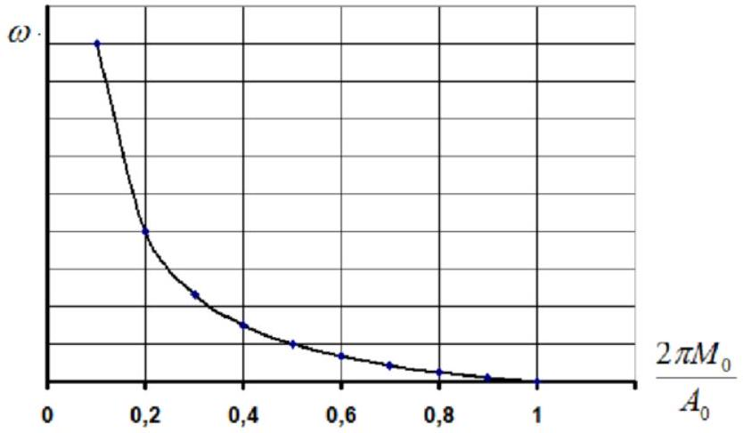
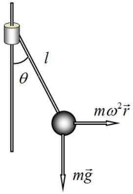
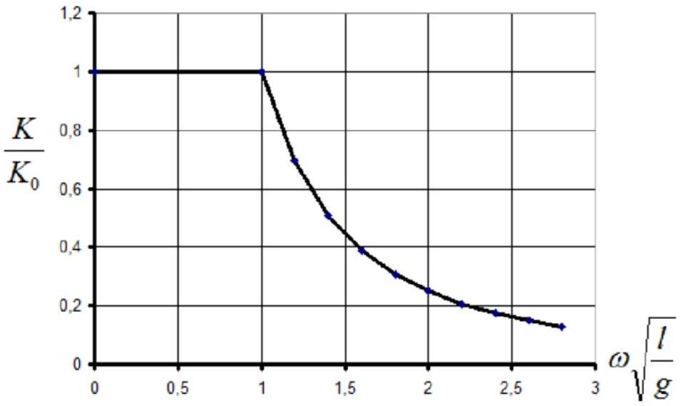
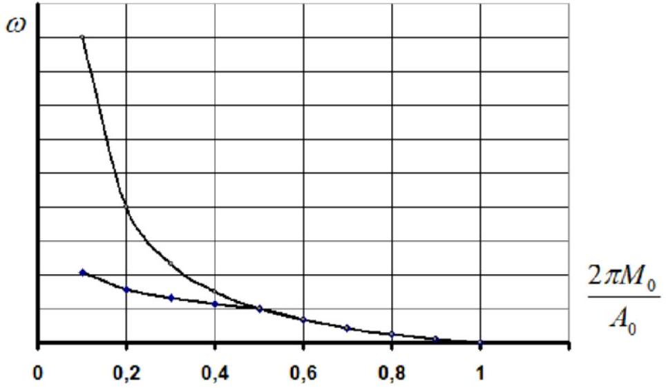

## Problem 2. Steam Engine ( $\mathbf { 1 0 . 0 }$ points)   Part 1. Steam Engine without a Governor

2.1 Let us write the equation of the adiabatic process

$$
\begin{equation*}
P V ^ { \gamma } = \text { const } \tag{1}
\end{equation*}
$$

Applying it to process 2-3, we obtain

$$
\begin{equation*}
\eta = \left( \frac { P _ { A } } { P _ { 0 } } \right) ^ { \frac { 1 } { \gamma } } = 0.177 . \tag{2}
\end{equation*}
$$

2.2 To determine the initial temperature, the adiabatic equation should be written in the $( T , V )$ variables:

$$
\begin{equation*}
T V ^ { \gamma - 1 } = \text { const } , \tag{3}
\end{equation*}
$$

which, when applied again to process 2-3, leads to the following expression:

$$
\begin{equation*}
T _ { 0 } = \frac { T _ { S } } { \eta ^ { \gamma - 1 } } = 390 ^ { \circ } \mathrm { C } . \tag{4}
\end{equation*}
$$

2.3 The ideal gas equation of state for point 2 has the form

$$
\begin{equation*}
P _ { 0 } \eta V _ { 0 } = \frac { m _ { 0 } } { M } R T _ { 0 } , \tag{5}
\end{equation*}
$$

which yields

$$
\begin{equation*}
m _ { 0 } = M \frac { P _ { 0 } \eta V _ { 0 } } { R T _ { 0 } } = 2.30 \mathrm {~g} , \tag{6}
\end{equation*}
$$

2.4 On segment 1-2 the work performed by the steam is

$$
\begin{equation*}
A _ { 1 - 2 } = P _ { 0 } \eta V _ { 0 } , \tag{7}
\end{equation*}
$$

while on segment $2 - 3$ the work along the adiabatic is

$$
\begin{equation*}
A _ { 2 - 3 } = P _ { 0 } V _ { 0 } \frac { \eta - \eta ^ { \gamma } } { \gamma - 1 } . \tag{8}
\end{equation*}
$$

On segment 3-4 the work is negative and equal to

$$
\begin{equation*}
A _ { 3 - 4 } = - P _ { A } V _ { 0 } , \tag{9}
\end{equation*}
$$

therefore, the total work is

$$
\begin{equation*}
A _ { 0 } = P _ { 0 } V _ { 0 } \left( \eta + \frac { \eta - \eta ^ { \gamma } } { \gamma - 1 } \right) - P _ { A } V _ { 0 } = 1.25 \cdot 10 ^ { 3 } \mathrm {~J} . \tag{10}
\end{equation*}
$$

2.5 The working volume reaches its maximum value over half a revolution of the flywheel; therefore, the average rate of change of the volume is

$$
\begin{equation*}
v = \frac { V _ { 0 } } { \pi / \omega } = \frac { V _ { 0 } \omega } { \pi } . \tag{11}
\end{equation*}
$$

2.6 Let us establish the relation between the pressure in the cylinder and the mass of steam inside it. For this purpose, we write the adiabatic equation

$$
\begin{equation*}
P _ { 0 } V _ { i n } ^ { \gamma } = P V ^ { \gamma } , \tag{12}
\end{equation*}
$$

where $V _ { i n }$ is the volume occupied by the steam in the generator before it enters the working cylinder. For this volume, the equation of state is

$$
\begin{equation*}
P _ { 0 } V _ { \text {in } } = \frac { m } { M } R T _ { 0 } . \tag{13}
\end{equation*}
$$

Then the pressure in the cylinder can be expressed in terms of the steam mass using the adiabatic equation (12) and the equation of state (13) as

$$
\begin{equation*}
P = P _ { 0 } \left( \frac { R T _ { 0 } } { M P _ { 0 } } \frac { m } { v t } \right) ^ { \gamma } , \tag{14}
\end{equation*}
$$

where $V = v t$ is the time-dependent working volume.
Taking into account the equation given in the problem statement, we obtain the required equation for the steam mass in the cylinder:

$$
\begin{equation*}
\frac { d m } { d t } = K \left( P _ { 0 } - P \right) = K P _ { 0 } \left( 1 - \left( \frac { R T _ { 0 } } { M P _ { 0 } } \frac { m } { v t } \right) ^ { \gamma } \right) . \tag{15}
\end{equation*}
$$

2.7 An obvious solution of Eq. (15) is a linear function

$$
\begin{equation*}
m \propto t , \tag{16}
\end{equation*}
$$

and therefore, according to Eq. (14), the steam pressure in the cylinder remains constant.
2.8 In accordance with Eq. (15), the gas mass increases linearly

$$
\begin{equation*}
m = K \left( P _ { 0 } - P \right) t , \tag{17}
\end{equation*}
$$

and thus, from Eq. (15) and the relation $V = v t$, we obtain that the gas pressure must satisfy

$$
\begin{equation*}
P = P _ { 0 } \left( \frac { R T _ { 0 } } { M P _ { 0 } } \frac { \pi K \left( P _ { 0 } - P \right) } { V _ { 0 } \omega } \right) ^ { \gamma } . \tag{18}
\end{equation*}
$$

2.9 Now we use the approximation $\gamma \approx 1$, which allows us to obtain an explicit expression for the pressure:

$$
\begin{equation*}
P = \frac { P _ { 0 } } { 1 + \frac { M V _ { 0 } \omega } { \pi K R T _ { 0 } } } . \tag{19}
\end{equation*}
$$

2.10 The numerical value of the pressure for the given parameters is

$$
\begin{equation*}
P = 9.10 \cdot 10 ^ { 5 } П а . \tag{20}
\end{equation*}
$$

2.11 The work performed by the engine during one cycle can be calculated using Eq. (10), where $P _ { 0 }$ should be replaced by the pressure $P$ given by Eq. (19). This leads to

$$
\begin{equation*}
A = P _ { 0 } V _ { 0 } \frac { \eta + \frac { \eta - \eta \gamma } { \gamma - 1 } } { 1 + \frac { M V _ { 0 } \omega } { \pi K R T _ { 0 } } } \tag{21}
\end{equation*}
$$

Thus, the parameters of this formula are

$$
\begin{align*}
& A _ { 0 } = P _ { 0 } V _ { 0 } \left( \eta + \frac { \eta - \eta ^ { \gamma } } { \gamma - 1 } \right) = 1.44 \cdot 10 ^ { 3 } \mathrm {~J}  \tag{22}\\
& \beta = \frac { M V _ { 0 } } { \pi R T _ { 0 } } = 4.16 \cdot 10 ^ { - 9 } \mathrm {~m} \cdot \mathrm {~s} ^ { 2 } . \tag{23}
\end{align*}
$$

2.12 In the steady-state regime, the work performed by the steam per cycle is equal to the work done on the load:

$$
\begin{equation*}
\frac { A _ { 0 } } { 1 + \beta _ { K } ^ { \frac { \omega } { K } } } = 2 \pi M _ { 0 } . \tag{24}
\end{equation*}
$$

Hence, the mean angular velocity in the steady-state regime is

$$
\begin{equation*}
\omega = \frac { K } { \beta } \left( \frac { A _ { 0 } } { 2 \pi M _ { 0 } } - 1 \right) . \tag{25}
\end{equation*}
$$

2.13 From Eq. (25) it follows that the maximum torque is

$$
\begin{equation*}
M _ { 0 \max } = \frac { A _ { 0 } } { 2 \pi } = 230 \mathrm {~N} \cdot \mathrm {~m} . \tag{26}
\end{equation*}
$$

2.14 A schematic plot of the corresponding dependence is shown in the figure below.

## Part 2. Governor without the Engine

2.15 It is more convenient to solve this part of the problem in a rotating reference frame. In the equilibrium state, the torque due to gravity is balanced by the torque due to the centrifugal force:

$$
\begin{equation*}
m g l \sin \theta = m \omega ^ { 2 } l ^ { 2 } \sin \theta \cos \theta . \tag{27}
\end{equation*}
$$

It follows that the deflection angle is determined by

$$
\begin{array} { l l }
\cos \theta = 1 , & \omega < \sqrt { \frac { g } { l } } , \\
\cos \theta = \frac { g } { \omega ^ { 2 } l } , & \omega \geq \sqrt { \frac { g } { l } } . \tag{29}
\end{array}
$$

2.16 A schematic plot of this dependence is shown in the figure below.

## Part 3. Engine with a Governor

2.17 Taking into account that $K = K _ { 0 } \cos \theta$ and using Eq. (19), substitution into Eq. (25) yields

$$
\begin{equation*}
\omega = \sqrt [ 3 ] { \frac { K _ { 0 } g } { \beta l } \left( \frac { A _ { 0 } } { 2 \pi M _ { 0 } } - 1 \right) } . \tag{30}
\end{equation*}
$$

2.18 A schematic plot of the corresponding dependence is shown in the figure below.

|  | Content | Points |  |
| :--- | :--- | :--- | :--- |
| 2.1 | Formula (1): $P V ^ { \gamma } =$ const | 0.2 | 0.6 |
|  | Formula (2): $\eta = \left( \frac { P _ { A } } { P _ { 0 } } \right) ^ { \frac { 1 } { \gamma } }$ | 0.2 |  |
|  | Numerical value in formula (2): $\eta = 0.177$ | 0.2 |  |
| 2.2 | Formula (3): $T V ^ { \gamma - 1 } =$ const | 0.2 | 0.6 |
|  | Formula (4): $T _ { 0 } = \frac { T _ { S } } { \eta ^ { \gamma - 1 } }$ | 0.2 |  |
|  | Numerical value in formula (4): $T _ { 0 } = 390 ^ { \circ } \mathrm { C }$ | 0.2 |  |
| 2.3 | Formula (6): $m _ { 0 } = M \frac { P _ { 0 } \eta V _ { 0 } } { R T _ { S } }$ | 0.2 | 0.4 |
|  | Numerical value in formula (6): $m _ { 0 } = 2.30 \mathrm {~g}$ | 0.2 |  |
| 2.4 | Formula (7): $A _ { 1 - 2 } = P _ { 0 } \eta V _ { 0 }$ | 0.2 | 1.0 |
|  | Formula (8): $A _ { 2 - 3 } = P _ { 0 } V _ { 0 } \frac { \eta - \eta ^ { \eta } } { \gamma - 1 }$ | 0.2 |  |
|  | Formula (9): $A _ { 3 - 4 } = - P _ { A } V _ { 0 }$ | 0.2 |  |
|  | Formula (10): $A _ { 0 } = P _ { 0 } V _ { 0 } \left( \eta + \frac { \eta - \eta ^ { \eta } } { \gamma - 1 } \right) - P _ { A } V _ { 0 }$ | 0.2 |  |
|  | Numerical value in formula (10): $A _ { 0 } = 1.25 \cdot 10 ^ { 3 } \mathrm {~J}$ | 0.2 |  |
| 2.5 | Formula (11): $v = \frac { V _ { 0 } \omega } { \pi }$ | 0.2 | 0.2 |
|  | Formula (12): $P _ { 0 } V _ { i n } ^ { \gamma } = P V ^ { \gamma }$ | 0.2 |  |
|  | Formula (13): $P _ { 0 } V _ { \text {in } } = \frac { m } { M } R T _ { 0 }$ | 0.2 |  |
|  | Formula (14) : $P = P _ { 0 } \left( \frac { R T _ { 0 } } { M P _ { 0 } } \frac { m } { v t } \right) ^ { \gamma }$ | 0.2 |  |
|  | Formula (15): $\frac { d m } { d t } = K P _ { 0 } \left( 1 - \left( \frac { R T _ { 0 } } { M P _ { 0 } } \frac { m } { v t } \right) ^ { \gamma } \right)$ | 0.4 |  |
| 2.7 | Formula (16): $m \propto t$ | 0.4 | 0.6 |
|  | Reference to formula (14) or (15) | 0.2 |  |
| 2.8 | Formula (17): $m = K \left( P _ { 0 } - P \right) t$ | 0.2 | 0.6 |
|  | Formula (18): $P = P _ { 0 } \left( \frac { R T _ { 0 } } { M P _ { 0 } } \frac { \pi K \left( P _ { 0 } - P \right) } { V _ { 0 } \omega } \right) ^ { \gamma }$ | 0.4 |  |
| 2.9 | Formula (19): $P = \frac { P _ { 0 } } { 1 + \frac { M V 0 } { \pi K R T _ { 0 } } }$ | 0.2 | 0.2 |
| 2.10 | Numerical value in formula (20): $P = 9.10 \cdot 10 ^ { 5 } \mathrm {~Pa}$ | 0.2 | 0.2 |
| 2.11 | Formula (21): $A = P _ { 0 } V _ { 0 } \frac { \eta + \frac { \eta - \eta V } { \gamma - 1 } } { 1 + \frac { M V _ { 0 } \omega } { \pi K T _ { 0 } } }$ | 0.2 | 1.0 |
|  | Formula (22): $A _ { 0 } = P _ { 0 } V _ { 0 } \left( \eta + \frac { \eta - \eta ^ { \gamma } } { \gamma - 1 } \right)$ | 0.2 |  |
|  | Numerical value in formula (22): $A _ { 0 } = 1.44 \cdot 10 ^ { 3 } \mathrm {~J}$ | 0.2 |  |
|  | Formula (23): $\beta = \frac { M V _ { 0 } } { \pi R T _ { 0 } }$ | 0.2 |  |
|  | Numerical value in formula (23): $\beta = 4.16 \cdot 10 ^ { - 9 } \mathrm {~m} \cdot \mathrm {~s} ^ { 2 }$ | 0.2 |  |
| 2.12 | Formula (24): $\frac { A _ { 0 } } { 1 + \beta \frac { \omega } { K } } = 2 \pi M _ { 0 }$ | 0.4 | 0.6 |
|  | Formula (25): $\omega = \frac { K } { \beta } \left( \frac { A _ { 0 } } { 2 \pi M _ { 0 } } - 1 \right)$ | 0.2 |  |
| 2.13 | Formula (26): $M _ { 0 \max } = \frac { A _ { 0 } } { 2 \pi }$ | 0.4 | 0.6 |
|  | Numerical value in formula (26): $M _ { 0 \max } = 230 \mathrm {~N} \cdot \mathrm {~m}$ | 0.2 |  |
| 2.14 | Graph: turns zero after the maximum torque is achieved maximum torque is pointed monotonic increase when the torque goes to zero | 0.1 0.1 0.2 | 0.4 |
| 2.15 | Formula (27): $m g l \sin \theta = m \omega ^ { 2 } l ^ { 2 } \sin \theta \cos \theta$ | 0.2 | 1.0 |

|  | Formula (28): $\cos \theta = 1 , \quad \omega < \sqrt { \frac { g } { l } }$ | 0.4 |  |
| :--- | :--- | :--- | :--- |
|  | Formula (29): $\cos \theta = \frac { g } { \omega ^ { 2 } l } , \quad \omega \geq \sqrt { \frac { g } { l } }$ | 0.4 |  |
| 2.16 | Graph: |  |  |
|  | horizontal segment is present | 0.1 |  |
|  | the value of $K _ { 0 }$ is pointed for the horizontal segment | 0.1 |  |
|  | monotonically goes to zero when the angular velocity increases | 0.2 |  |
| 2.17 | Formula (30): $\omega = \sqrt [ 3 ] { \frac { K _ { 0 } g } { \beta l } \left( \frac { A _ { 0 } } { 2 \pi M _ { 0 } } - 1 \right) }$ | 0.4 | 0.4 |
| 2.18 | Graph: |  |  |
|  | fracture point is present | 0.1 | 0.2 |
|  | the left segment decrease faster than the right segment | 0.1 |  |
| Total |  |  | 10.0 |
