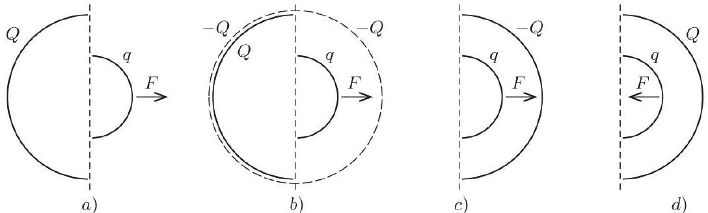
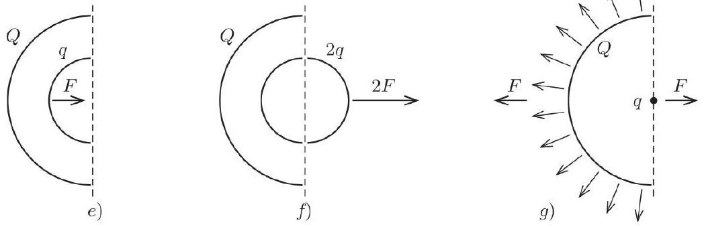
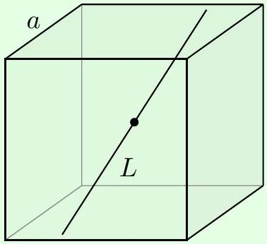
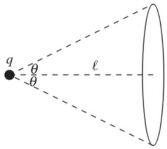
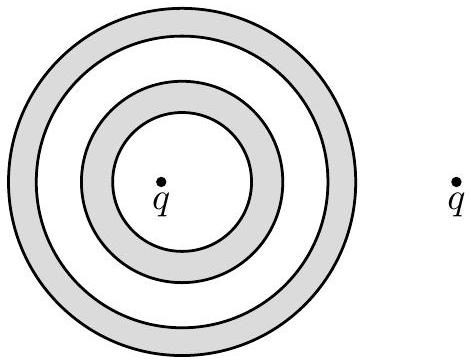
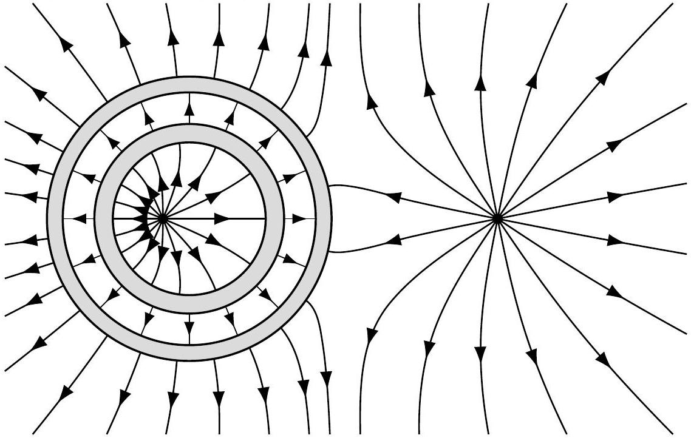
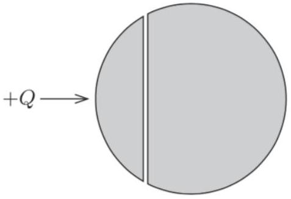
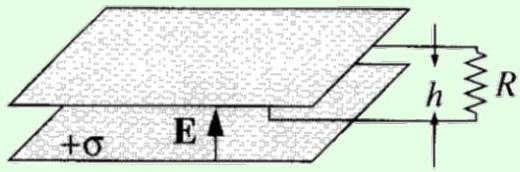
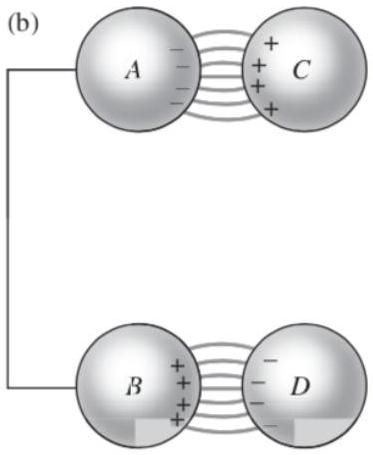

## Electromagnetism I: Electrostatics

The material here is covered at the right level in chapters 1-3 of Purcell. For a separate introduction to vector calculus, see the resources mentioned in the syllabus, or chapter 1 of Griffiths. Electrostatics is covered in more mathematical detail in chapter 2 of Griffiths. For interesting general discussion, see chapters II-1 through II-5 of the Feynman lectures. There is a total of 78 points.

## 1 Coulomb's Law and Gauss's Law

Idea 1
Gauss's law is written in integral form as

$$
\oint \mathbf { E } \cdot \mathrm { d } \mathbf { S } = \frac { Q } { \epsilon _ { 0 } } .
$$

In practice, you will only apply this form to situations with high symmetry, where

$$
E = \begin{cases} Q / 4 \pi \epsilon _ { 0 } r ^ { 2 } & \text { spherical symmetry } , \\ \lambda / 2 \pi \epsilon _ { 0 } r & \text { cylindrical symmetry } , \\ \sigma / 2 \epsilon _ { 0 } & \text { infinite plane. } \end{cases}
$$

Example 1
Consider a spherical shell of uniform surface charge density $\sigma$. A small hole is cut out of the surface of the shell. What is the electric field at the center of this hole?

Solution
Consider a point $P$ just outside the sphere, and another point $P ^ { \prime }$ nearby but just inside the sphere. If the shell didn't have a hole, then by Gauss's law and spherical symmetry, we have

$$
\mathbf { E } _ { P } = \frac { \sigma } { \epsilon _ { 0 } } \hat { \mathbf { r } } , \quad \mathbf { E } _ { P ^ { \prime } } = \mathbf { 0 }
$$

Next, suppose we only had the patch of the sphere near $P$ and $P ^ { \prime }$. When we zoom into $P$ and $P ^ { \prime }$, this patch looks like an infinite plane dividing them, and from Gauss's law,

$$
\mathbf { E } _ { P } = \frac { \sigma } { 2 \epsilon _ { 0 } } \hat { \mathbf { r } } , \quad \mathbf { E } _ { P ^ { \prime } } = - \frac { \sigma } { 2 \epsilon _ { 0 } } \hat { \mathbf { r } } .
$$

Now, a field of a spherical shell with a hole is just the difference of that of a full shell and that of a single patch, so subtracting these gives the answer,

$$
\mathbf { E } _ { P } = \mathbf { E } _ { P ^ { \prime } } = \frac { \sigma } { 2 \epsilon _ { 0 } } \hat { \mathbf { r } } .
$$

Note that $\mathbf { E } _ { P } = \mathbf { E } _ { P ^ { \prime } }$ because there's no surface charge between $P$ and $P ^ { \prime }$, so the value of the electric field can't jump discontinuously.

(a) Consider a sphere of radius $R$ and uniform charge density $\rho$. Find the electric field everywhere.
(b) Now two spheres, each of radius $R$ and carrying uniform charge densities $\rho$ and $- \rho$, are placed so that they partially overlap. Call the vector from the positive center to the negative center d. Find the electric field in the overlap region.

Solution. (a) The field inside a uniform sphere of density $\rho$ and center a is

$$
\mathbf { E } = \frac { \rho } { 3 \epsilon _ { 0 } } ( \mathbf { r } - \mathbf { a } ) .
$$

Outside the sphere, the field falls off as an inverse square,

$$
\mathbf { E } = \frac { \rho } { 3 \epsilon _ { 0 } } \frac { R ^ { 3 } } { | \mathbf { r } - \mathbf { a } | ^ { 3 } } ( \mathbf { r } - \mathbf { a } ) .
$$

(b) If the two centers are $\mathbf { a } _ { 1 }$ and $\mathbf { a } _ { 2 }$, then by superposition,
$$
\mathbf { E } = \frac { \rho } { 3 \epsilon _ { 0 } } \left( \left( \mathbf { r } - \mathbf { a } _ { 1 } \right) - \left( \mathbf { r } - \mathbf { a } _ { 2 } \right) \right) = \frac { \rho } { 3 \epsilon _ { 0 } } \mathbf { d }
$$
which is a constant.

[2] Problem 2. Consider a cube with a corner at the origin, and sides parallel to the $x , y$, and $z$ axes. If a charge $q$ is placed at $( \epsilon , \epsilon , \epsilon )$ for some tiny $\epsilon$, what's the flux through each face of the cube?

Solution. There are three "opposite" faces with the same flux, and three "adjacent" faces with the same flux. Now consider adding seven more cubes, so that the charge is now at the center of a $2 \times 2 \times 2$ cube. The total flux through the outer faces of the cube is $q / \epsilon _ { 0 }$, and there are 24 unit faces, so the flux out of each "opposite" face is $q / 24 \epsilon _ { 0 }$. Now consider the original cube. By Gauss's law the total flux out must be $q / \epsilon _ { 0 }$, which means the flux out of each "adjacent" face is $7 q / 24 \epsilon _ { 0 }$.
(Note that if the charge were instead exactly at one of the corners, the fluxes through the opposite faces would still be $q / 24 \epsilon _ { 0 }$, while the fluxes through the adjacent faces would technically be undefined, since the electric field blows up on the face. But roughly speaking, the flux ought to be zero. Then the total flux out of the cube is only $q / 8 \epsilon _ { 0 }$, and that's because the corner cuts out one "octant" of the point charge's field. Also, note that the answer crucially depends on the fact that the charge's coordinates are all equal to $\epsilon$. For example, if the charge had been at $( 0,0 , \epsilon )$ instead, then a similar argument shows that the fluxes through the near faces are zero, zero, and $q / 8 \epsilon _ { 0 }$.)

Here's a followup question, proposed by Mike Winer and first solved by Jason Youm. If a charge $q$ is at the corner of a regular tetrahedron, what fraction of its flux goes through the tetrahedron's far face? You can't solve it with the same trick as the cube, but it's possible to get the answer without any explicit integration by cleverly considering the flux through combinations of simpler surfaces, and using a little three-dimensional geometry. The answer is

$$
\frac { 1 } { 2 } - \frac { 3 \arctan \sqrt { 2 } } { 2 \pi } \approx 0.044 .
$$

You can try deriving this for yourself, but it's quite tricky; roughly 4 points by the standards of this problem set. It turns out that it's possible to generalize these kinds of arguments even further, to solve the more general case where the charge is displaced from a vertex of a cube in an arbitrary direction! For a very deep dive, see this paper.

[2] Problem 3 (BAUPC). In both parts below, take the potential to be zero at infinity.

(a) Consider a solid sphere of uniform charge density. Find the ratio of the electrostatic potential at the surface to that at the center.
(b) Consider a solid cube of uniform charge density. Find the ratio of the electrostatic potential at a corner to that at the center. (Hint: use symmetry.)

Solution. (a) Let $U _ { 0 }$ be the potential at the surface. If the sphere has radius $R$ and charge density $\rho$, it has charge $Q = \frac { 4 } { 3 } \pi \rho R ^ { 3 }$ and the shell theorem gives $U _ { 0 } = Q / 4 \pi \epsilon _ { 0 } R$.
To go from the surface to the center, we need to further increase the potential by

$$
\Delta U = - \int _ { R } ^ { 0 } E ( r ) d r = \int _ { 0 } ^ { R } \frac { k Q r } { R ^ { 3 } } d r = \frac { 1 } { 2 } U _ { 0 }
$$

So the potential at the center of the sphere is $U _ { 0 } + \Delta U = 3 U _ { 0 } / 2$, and the desired ratio is 2/3.

(b) Let $U _ { 0 }$ be the potential at a corner. Now, imagine dividing the cube into 8 identical smaller cubes. The center of the cube is at the corner of all 8 . For a fixed charge density, potentials scale like $U \propto Q / r \propto \rho r ^ { 2 }$, so each of these cubes contributes 1/4 as much as the corner of the original cube. Thus, the potential at the center is $8 \left( U _ { 0 } / 4 \right) = 2 U _ { 0 }$, and the desired ratio is $1 / 2$.

[3] Problem 4. There are two point charges, $q _ { 1 } > 0$ and $q _ { 2 } < 0$, in empty space. An electric field line leaves $q _ { 1 }$ at an angle $\alpha$ from the line connecting the two charges. Determine whether this field line hits $q _ { 2 }$, and if so, at what angle $\beta$ from the line connecting the two charges. (Hint: this can be done without solving any differential equations.)

Solution. Suppose the field line does hit $q _ { 2 }$. Rotate the field line about the line connecting the two charges, to form a Gaussian surface. Because no electric field lines go across this surface, the total charge inside must be zero. Now, this surface envelopes "slices" of each point charge. (If you're not happy with "slicing a point charge", just replace the point charges with tiny uniformly charged spheres; everything outside stays the same.) The solid angle of the first point charge enveloped is

$$
\int d \Omega = \int _ { 0 } ^ { 2 \pi } d \phi \int _ { 0 } ^ { \alpha } \sin \theta d \theta = 2 \pi ( 1 - \cos \alpha )
$$

so the amount of charge enclosed is

$$
\frac { \Omega } { 4 \pi } q _ { 1 } = \frac { 1 - \cos \alpha } { 2 } q _ { 1 } = q _ { 1 } \sin ^ { 2 } \frac { \alpha } { 2 } .
$$

Reasoning similarly for the other surface, we have

$$
q _ { 1 } \sin ^ { 2 } \frac { \alpha } { 2 } = \left| q _ { 2 } \right| \sin ^ { 2 } \frac { \beta } { 2 }
$$

and the field line hits $q _ { 2 }$ if there is a solution for $\beta$, i.e. when $\left| q _ { 1 } / q _ { 2 } \right| \sin ^ { 2 } ( \alpha / 2 ) \leq 1$. (If you like this question, you can also think about what we can say when the point charges have the same sign.)

Idea 2
Gauss's law is written in differential form as

$$
\nabla \cdot \mathbf { E } = \frac { \rho } { \epsilon _ { 0 } } .
$$

The divergence of a vector field $\mathbf { F } = F _ { x } \hat { \mathbf { x } } + F _ { y } \hat { \mathbf { y } } + F _ { z } \hat { \mathbf { z } }$ is

$$
\nabla \cdot \mathbf { F } = \partial _ { x } F _ { x } + \partial _ { y } F _ { y } + \partial _ { z } F _ { z }
$$

in Cartesian coordinates, where $\partial _ { x }$ stands for $\partial / \partial x$, and so on.

Example 2
Show that the two forms of Gauss's law are equivalent.

Solution
To do this, we need to establish the geometric meaning of the divergence. For simplicity we consider two dimensions; the proof for three dimensions is similar. Consider a small rectangle with one corner at the origin, with axes aligned with the Cartesian coordinate axes and side lengths $\Delta x$ and $\Delta y$. To apply Gauss's law in integral form, we need to compute the flux through each side. The flux going out the top side is

$$
\int _ { 0 } ^ { \Delta x } E _ { y } ( x , \Delta y ) d x
$$

while the flux going out the bottom side is

$$
- \int _ { 0 } ^ { \Delta x } E _ { y } ( x , 0 ) d x
$$

The sum of these two terms is

$$
\left. \int _ { 0 } ^ { \Delta x } \left( E _ { y } ( x , \Delta y ) - E _ { y } ( x , 0 ) \right) d x \approx \Delta y \int _ { 0 } ^ { \Delta x } \left( \partial _ { y } E _ { y } \right) \right| _ { ( x , 0 ) } d x
$$

where we applied a tangent line approximation, and the subscript indicates where the function $\partial _ { y } E _ { y }$ is evaluated. Higher-order terms in the Taylor series would be proportional to higher powers of $\Delta y$, which is small, so we can ignore them.

The integrand is still a function of $x$, but we can Taylor expand it about the origin as

$$
\left. \left( \partial _ { y } E _ { y } \right) \right| _ { ( x , 0 ) } = \left. \left( \partial _ { y } E _ { y } \right) \right| _ { ( 0,0 ) } + \Delta x ( \ldots ) + \ldots .
$$

These extra terms are again higher-order in $\Delta x$ and $\Delta y$, so we ignore them. The net flux through the top and bottom faces is hence, to lowest order,

$$
\left. \Delta y \int _ { 0 } ^ { \Delta x } \left( \partial _ { y } E _ { y } \right) \right| _ { ( 0,0 ) } d x = \left. \Delta x \Delta y \left( \partial _ { y } E _ { y } \right) \right| _ { ( 0,0 ) }
$$

By similar reasoning, pairing up the left and right faces gives

$$
\text { flux } = \left. \Delta x \Delta y \left( \partial _ { x } E _ { x } + \partial _ { y } E _ { y } \right) \right| _ { ( 0,0 ) } = \left. \Delta x \Delta y ( \nabla \cdot \mathbf { E } ) \right| _ { ( 0,0 ) } .
$$

Thus the divergence is the outgoing flux per unit area, or volume in three dimensions.
This shows us why the two forms of Gauss's law are equivalent. For example, starting from the differential form, the left-hand side is the flux per volume, while the right-hand side is the charge per volume, divided by $\epsilon _ { 0 }$. Integrating both sides over some volume relates the total flux to the total charge divided by $\epsilon _ { 0 }$, which is Gauss's law in integral form.

Example 3
Suppose the region $0 < x < d$ has charge density $- \rho$, and the region $- d < x < 0$ has charge density $\rho$. Find the electric field everywhere.

Solution
By translational symmetry, the field always points along $\hat { \mathbf { x } }$ and only depends on $x , \mathbf { E } ( \mathbf { r } ) =$ $E ( x ) \hat { \mathbf { x } }$. By applying the integral form of Gauss's law to a rectangular prism, with one side at $x _ { l }$ and another at $x _ { r }$, we have

$$
E \left( x _ { r } \right) - E \left( x _ { l } \right) = \frac { 1 } { \epsilon _ { 0 } } \int _ { x _ { l } } ^ { x _ { r } } \rho ( x ) d x , \quad E ( x ) = \frac { 1 } { \epsilon _ { 0 } } \int _ { 0 } ^ { x } \rho ( x ) d x + E _ { 0 }
$$

Since the divergence of $\mathbf { E } ( \mathbf { r } )$ is just $\partial E ( x ) / \partial x$, this clearly satisfies the differential form of Gauss's law. To fix the undetermined constant $E _ { 0 }$, we could demand the field be zero on both sides of the charge distribution, motivated by symmetry. Then we have

$$
E ( x ) = \frac { \rho } { \epsilon _ { 0 } } \times \begin{cases} d - x & 0 < x < d \\ d + x & - d < x < 0 \\ 0 & \text { elsewhere } \end{cases}
$$

Example 4
Find the electric field of a spherically symmetric charge density $\rho ( r )$.

Solution
By spherical symmetry, the field always points radially and only depends on $r , \mathbf { E } ( \mathbf { r } ) = E ( r ) \hat { \mathbf { r } }$. By applying the integral form of Gauss's law to a sphere of radius $r$,

$$
4 \pi r ^ { 2 } E ( r ) = \frac { 1 } { \epsilon _ { 0 } } \int _ { 0 } ^ { r } d r ^ { \prime } 4 \pi r ^ { 2 } \rho \left( r ^ { \prime } \right) , \quad E ( r ) = \frac { 1 } { \epsilon _ { 0 } } \frac { 1 } { r ^ { 2 } } \int _ { 0 } ^ { r } d r ^ { \prime } r ^ { 2 } \rho \left( r ^ { \prime } \right)
$$

Let's check that this indeed satisfies the differential form of Gauss's law, using the divergence

in spherical coordinates. For any vector field $\mathbf { F } = F _ { r } \hat { \mathbf { r } } + F _ { \theta } \hat { \boldsymbol { \theta } } + F _ { \varphi } \hat { \boldsymbol { \varphi } }$, the divergence is
$$
\nabla \cdot \mathbf { F } = \frac { 1 } { r ^ { 2 } } \frac { \partial \left( r ^ { 2 } F _ { r } \right) } { \partial r } + \frac { 1 } { r \sin \theta } \frac { \partial } { \partial \theta } \left( F _ { \theta } \sin \theta \right) + \frac { 1 } { r \sin \theta } \frac { \partial F _ { \varphi } } { \partial \varphi } .
$$
Since $\mathbf { E }$ only has a radial component, $E _ { r } = E ( r )$, we quickly recover the desired result,
$$
\nabla \cdot \mathbf { E } = \frac { 1 } { r ^ { 2 } } \frac { \partial \left( r ^ { 2 } E ( r ) \right) } { \partial r } = \frac { 1 } { r ^ { 2 } \epsilon _ { 0 } } \frac { \partial } { \partial r } \int _ { 0 } ^ { r } d r ^ { \prime } r ^ { \prime 2 } \rho \left( r ^ { \prime } \right) = \frac { r ^ { 2 } \rho ( r ) } { r ^ { 2 } \epsilon _ { 0 } } = \frac { \rho ( r ) } { \epsilon _ { 0 } } .
$$
[3] Problem 5. Consider a vector field expressed in polar coordinates, $\mathbf { F } = F _ { r } \hat { \mathbf { r } } + F _ { \theta } \hat { \boldsymbol { \theta } }$ where $\hat { \mathbf { r } }$ and $\hat { \boldsymbol { \theta } }$ are unit vectors in the radial and tangential directions. Gauss's law in differential form still works in these coordinates, but the form of the divergence is different.
By considering the flux per unit area out of a small region bounded by $r$ and $r + d r$, and $\theta$ and $\theta + d \theta$, and applying Gauss's law in integral form, find what the divergence in polar coordinates must be for Gauss's law in differential form to hold. (Optional: try generalizing to spherical coordinates.)
Solution. By summing up contributions from each of the four sides, and letting $\left( F _ { r } , F _ { \theta } \right)$ be the vector field at one of the corners, the flux through the region is
$$
d \Phi = \left( F _ { r } + d F _ { r } \right) ( ( r + d r ) d \theta ) - F _ { r } ( r d \theta ) + \left( F _ { \theta } + d F _ { \theta } \right) d r - F _ { \theta } d r .
$$
In two dimensions, the divergence is the flux per area, $d A = r d r d \theta$, so
$$
\nabla \cdot \mathbf { F } = \frac { d \Phi } { d A } = \frac { 1 } { r } \frac { \partial \left( r F _ { r } \right) } { \partial r } + \frac { 1 } { r } \frac { \partial F _ { \theta } } { \partial \theta } .
$$
In case you're wondering, the answer for spherical coordinates in three dimensions is
$$
\nabla \cdot \mathbf { F } = \frac { 1 } { r ^ { 2 } } \frac { \partial \left( r ^ { 2 } F _ { r } \right) } { \partial r } + \frac { 1 } { r \sin \theta } \frac { \partial \left( F _ { \theta } \sin \theta \right) } { \partial \theta } + \frac { 1 } { r \sin \theta } \frac { \partial F _ { \phi } } { \partial \phi }
$$
where $\phi$ is the angle that goes from zero to $2 \pi$.
[4] Problem 6. This subtle problem will expose a hidden assumption we've made in the previous two examples. Suppose that all of space is filled with uniform charge density $\rho$.
    (a) Show that $\mathbf { E } = \left( \rho / \epsilon _ { 0 } \right) x \hat { \mathbf { x } }$ obeys the differential form of Gauss's law.
    (b) Show that $\mathbf { E } = \left( \rho / 3 \epsilon _ { 0 } \right) r \hat { \mathbf { r } }$ also obeys Gauss's law.
    (c) Argue that by symmetry, $\mathbf { E } = 0$. Show that this does not obey Gauss's law.
    (d) ★ What's going on? Which, if any, is the actual field? If you think there's more than one possible field, how could that be consistent with Coulomb's law, which gives the answer explicitly? For that matter, what does Coulomb's law say about this setup, anyway?

Solution. (a) We see that $\nabla \cdot \mathbf { E } = \partial _ { x } \left( \left( \rho / \epsilon _ { 0 } \right) x \right) = \rho / \epsilon _ { 0 }$, as desired.

(b) In Cartesian coordinates, this field is
$$
\mathbf { E } = \frac { \rho } { 3 \epsilon _ { 0 } } ( x \hat { \mathbf { x } } + y \hat { \mathbf { y } } + z \hat { \mathbf { z } } )
$$
whose divergence is $\rho / \epsilon _ { 0 }$, as desired.

(c) This has to hold by symmetry because the electric field can't point in any particular direction, by rotational symmetry. It also can't just point radially, because that breaks translational symmetry; the center is a special point. So the only option is $\mathbf { E } = 0$.
But then clearly $\nabla \cdot \mathbf { E } = 0$, so Gauss's law is not obeyed.
(d) The issue is boundary conditions. Just like any differential equation, the solution for the electric field is not defined without boundary conditions, just like how a solution for Newton's second law, $F = m a$, is not defined without specifying an initial position and velocity.
One common way to resolve the ambiguity, used in example 3, is to assume the field goes to zero at infinity. This is equivalent to assuming there's no "extra" field produced by other charges outside the ones we're considering. (Of course, in real experiments, that's not guaranteed, and we always have to worry about "shielding" external fields, such as from other pieces of equipment or static charges. Even the Earth makes a sizable vertical electric field, which is occasionally discharged by lightning.) However, we can't do this here because the charge density extends out to infinity too.
Another common way to resolve the ambiguity, used in example 4, is to assume that the field shares the same symmetries as the charge distribution. But in this case, that's not even possible, because the charge distribution has too much symmetry. (It is translationally symmetric, and rotationally symmetric about every point!) It is impossible to pick a set of boundary conditions that maintains all these symmetries. That's why there are many equally good answers, depending on which symmetries you break.
One might think that Coulomb's law could give us a unique answer. Coulomb's law for a point charge is itself derived by implicitly assuming that there are no "extra" fields flying around, just the spherically symmetric field of the point charge itself. This looks very reasonable, so what stops us from just saying that each charge in this problem has such a field, and then integrating over the charges? Well, if you write down the integral, you'll find that it's divergent, analogous to the integral $\int _ { - \infty } ^ { \infty } x d x$. By itself, the integral is not even well-defined.
To get an answer, you have to "regulate" the integral (i.e. change it in a way that makes it well-defined). One possible regulator, for example, is to just chop off the limits of integration at finite values, like $\int _ { - L } ^ { L } x d x$. But that particular regulator is equivalent to just replacing the charge distribution with a finite one centered at the origin! In other words, Coulomb's law also fails to give a unique answer, because it requires a regulator to give a well-defined answer, and there are many possible regulators. If you treat the charge distribution as a giant ball with center at the origin, you get the result of part (b). If you treat it as a thick, huge slab along the $y z$ plane centered at the origin, you get the result of part (a). The symmetry argument fails once again, because all the regulators break some symmetry. This is a simple example of "anomalous symmetry", an important idea in theoretical physics.
The exact same problem appears in Newtonian cosmology, where charge density is replaced with mass density, and this problem confused Newton himself, who incorrectly thought that $\mathbf { g } = 0$ by symmetry. In this context, all regulators/boundary conditions are unsatisfactory. Of course, we want a rotationally symmetric universe to match experiment, so we have to put that in by hand. But then every solution has a center towards which everything collapses, so to keep the solar system an inertial frame, we'd have to put it at the center of the universe! Surely, this would make Copernicus roll in his grave.

Some of these problems are fixed in general relativity. You still have to postulate rotational symmetry (again, on the basis of experimental data), but once you do that, there are no further problems. That's because in general relativity, acceleration is not absolute in the way it is in Newtonian mechanics. Instead, there is no center; everything just gets closer to everything else. For further discussion and references, see this paper.

## 2 Electrostatic Forces

Idea 3
If you follow an electric field line, the potential monotonically decreases along it.
[2] Problem 7. Two questions about electrostatic equilibrium.

(a) Prove that when a system of point charges is in equilibrium (i.e. the net force on each of the charges due to the others vanishes), the total potential energy of the system is zero.
(b) Show that for a positive point charge in the electric fields of fixed, positive point charges, there is a path along which the charge can be moved to infinity without ever needing positive external work, i.e. a path along which the potential only decreases.

Solution. (a) Fix some point $O$ not on any of the charges, and scale the system up about $O$ continuously, to send all the charges to infinity. At all points in time, there are no forces on any of the charges, so no work is done. The final potential energy is zero, so the initial potential energy must also have been zero.

(b) Consider the field line going through the test charge. It can't end on a negative charge, since there are none, so it must end at infinity. Moving the charge along this field line gives the desired path.

Idea 4
Sometimes it's easier to calculate the force of A on B rather than the (equal and opposite) force of B on A.

Example 5
Consider two uniformly charged spherical balls with radii $a _ { i }$, both with charge $q$, and their centers separated by a distance $r > a _ { 1 } + a _ { 2 }$. What is the net force of the first on the second?

Solution
It might seem obvious that the answer is $q ^ { 2 } / 4 \pi \epsilon _ { 0 } r ^ { 2 }$, with no dependence on $a _ { 1 }$ and $a _ { 2 }$. In fact, if you've done any orbital mechanics, you've almost certainly assumed that the force between two spherical bodies (such as the Earth and Sun) is $G m _ { 1 } m _ { 2 } / r ^ { 2 }$, which is equivalent.

This has a simple but slightly tricky proof. By the shell theorem, we can set $a _ { 1 } = 0$, replacing the first ball with a point charge, because this produces the same field at the second ball. But the force on the second ball depends on the electric field at every point on it, which

seems to require doing an integral. To avoid this, we use Newton's third law, which tells us it's equivalent to compute the force on the first ball. To compute that, we may set $a _ { 2 } = 0$ by the shell theorem again. This reduces us to the case of two point charges, giving the answer.

Example 6: Purcell 1.28
Consider a point charge $q$. Draw any imaginary sphere of radius $R$ around the charge. Show that the average of the electric field over the surface of the sphere is zero.

Solution
Imagine placing a uniform surface charge $\sigma$ on the sphere. Then the average of the point charge's electric field over the sphere times $4 \pi R ^ { 2 } \sigma$ is the total force of the point charge on the charged sphere. But this is equal in magnitude to the force of the charged sphere on the point charge, which must be zero by the shell theorem. Thus the average field over the sphere has to vanish.
[3] Problem 8 (Purcell 1.28). Some extensions of the previous example.

(a) Show that if the charge $q$ is instead outside the sphere, a distance $r > R$ from its center, the average electric field over the surface of the sphere is the same as the electric field at the center of the sphere.
(b) Show that for any overall neutral charge distribution contained within a sphere of radius $R$, the average electric field over the interior of the sphere is $- \mathbf { p } / 4 \pi \epsilon _ { 0 } R ^ { 3 }$ where $\mathbf { p }$ is the total dipole moment.

Solution. The same Newton's third law trick will work for both parts.

(a) Let the desired answer be $\mathbf { E } _ { \text {avg } }$ and let the charge $q$ be at r. Now imagine a charge $Q$ is uniformly distributed over the surface of the sphere. The force of the charge $q$ on the distributed charge $Q$ is precisely $\mathbf { F } _ { q Q } = Q \mathbf { E } _ { \text {avg } }$. But we also know that
$$
\mathbf { F } _ { q Q } = - \mathbf { F } _ { Q q } = - \frac { k Q q } { r ^ { 2 } } \hat { \mathbf { r } }
$$
by Newton's third law and the shell theorem. Therefore we have
$$
\mathbf { E } _ { \mathrm { avg } } = - \frac { k q } { r ^ { 2 } } \hat { \mathbf { r } }
$$
which is precisely the electric field at the center of the sphere due to $q$. (Note that $\hat { \mathbf { r } }$ points from the center of the sphere to the charge $q$.)
(b) Let the desired answer be $\mathbf { E } _ { \text {avg } }$. Now imagine a charge $Q$ is uniformly distributed over the volume of the sphere. The force of the charge distribution (with charge density $\rho ( \mathbf { x } )$ ) on the distributed charge $Q$ is precisely $\mathbf { F } _ { q Q } = Q \mathbf { E } _ { \text {avg } }$. But we also know that
$$
\mathbf { F } _ { q Q } = - \mathbf { F } _ { Q q } = - \int \rho ( \mathbf { r } ) \mathbf { E } _ { Q } ( \mathbf { r } ) d ^ { 3 } \mathbf { r }
$$

where $\mathbf { E } _ { Q }$ is the field due to $Q$. Now, this field is easy to find, as it is just the field of a uniformly charged sphere, so

$$
\mathbf { E } _ { Q } = \frac { k Q } { R ^ { 3 } } \mathbf { r }
$$

as shown in problem 1. Putting this in the integral, we have

$$
Q \mathbf { E } _ { \mathrm { avg } } = - \frac { k Q } { R ^ { 3 } } \int \rho ( \mathbf { r } ) \mathbf { r } d ^ { 3 } \mathbf { r }
$$

so by the definition of the dipole moment,

$$
\mathbf { E } _ { \mathrm { avg } } = - \frac { k } { R ^ { 3 } } \int \rho ( \mathbf { r } ) \mathbf { r } d ^ { 3 } \mathbf { r } = - \frac { k \mathbf { p } } { R ^ { 3 } }
$$

as desired.
Idea 5
The integral $\int d \mathbf { S }$ over a surface with a fixed boundary is independent of the surface.
We proved this in the surface tension section of M2 using a mechanical argument. For a proof using vector calculus, see problem 1.62 of Griffiths.

[3] Problem 9. A hemispherical shell of radius $R$ has uniform charge density $\sigma$ and is centered at the origin. Find the electric field at the origin. (Hint: combine the previous two ideas.)
Solution. Place a point charge $q$ at the origin. To find the magnitude of the field, we will compute the force on the hemisphere divided by $q$. The force on the hemisphere is
$$
\int \frac { q } { 4 \pi \epsilon _ { 0 } R ^ { 2 } } \sigma d \mathbf { S } = \frac { q \sigma } { 4 \pi \epsilon _ { 0 } R ^ { 2 } } \int d \mathbf { S }
$$
By idea 5, we can replace the surface of integration with a flat disk, so $\left| \int d \mathbf { S } \right| = \pi R ^ { 2 }$. Thus, the force is $F = q \sigma / 4 \epsilon _ { 0 }$, so the field is
$$
E = \frac { \sigma } { 4 \epsilon _ { 0 } } .
$$
[3] Problem 10. A point charge $q$ is placed a distance $a / 2$ above the center of a square of charge density $\sigma$ and side length $a$. Find the force of the square on the point charge.
Solution. Don't worry if you found this one quite hard, because its solution uses a unique trick. It's equivalent to find the force of the point charge on the square. Set up coordinates so that the square is in the $x y$ plane, and its center is the origin. Then we have
$$
\mathbf { F } = \sigma \int \mathbf { E } d S
$$
where the surface integral is over the square. On the other hand, we know that $\mathbf { F }$ is along the $\hat { \mathbf { z } }$ direction by symmetry, so
$$
F = \mathbf { F } \cdot \hat { \mathbf { z } } = \sigma \int E _ { z } d S
$$
Now, since $d \mathbf { S }$ is parallel to $\hat { \mathbf { z } }$, this is in fact the same thing as
$$
F = \sigma \int \mathbf { E } \cdot d \mathbf { S }
$$

where the integral is just the electric flux through the square! By symmetry, this flux is $q / 6 \epsilon _ { 0 }$, so

$$
F = \frac { \sigma q } { 6 \epsilon _ { 0 } } .
$$

I've never seen this idea used anywhere else, and I generally try to avoid covering single-use tricks. But this one is particularly nice, and it'll be necessary to set up a related discussion later.

Example 7
At a point on a surface, there is charge density $\sigma$, and electric fields $\mathbf { E } _ { 1 }$ and $\mathbf { E } _ { 2 }$ on the two sides of the surface. Show that the surface experiences a force $\sigma \left( \mathbf { E } _ { 1 } + \mathbf { E } _ { 2 } \right) / 2$ per unit area.

Solution
These electric fields are the sum of an external electric field $\mathbf { E } _ { 0 }$, made by charges elsewhere, and a field due to the charges on this local patch of the surface. The latter is $\sigma \hat { \mathbf { n } } / 2 \epsilon _ { 0 }$, which flips sign across the surface and explains why $\mathbf { E } _ { 1 }$ and $\mathbf { E } _ { 2 }$ are different. The external field $\mathbf { E } _ { 0 }$ does not change discontinuously, and only $\mathbf { E } _ { 0 }$ contributes to the net force on the surface patch, since an object can't exert a force on itself.

Since the contributions from the surface patch to $\mathbf { E } _ { 1 }$ and $\mathbf { E } _ { 2 }$ have opposite signs, we have $\mathbf { E } _ { 0 } = \left( \mathbf { E } _ { 1 } + \mathbf { E } _ { 2 } \right) / 2$, immediately giving the result.

[4] Problem 11 (Griffiths 2.47, PPP 113, MPPP 140). Consider a uniformly charged spherical shell of radius $R$ and total charge $Q$.
    (a) Find the net force that the southern hemisphere exerts on the northern hemisphere.
    (b) Generalize part (a) to the case where the sphere is split into two parts by a plane whose minimum distance to the sphere's center is $h$.
    (c) Generalize part (a) to the case where the two hemispherical shells have uniform charge density, opposite orientation, and the same center, but have different total charges $q$ and $Q$, and different radii $r$ and $R$, where $r < R$.

Solution. (a) The northern hemisphere exerts no net force on itself, so it is equivalent to find the force on the northern hemisphere due to the entire sphere. The surface charge density is $\sigma = Q / \left( 4 \pi R ^ { 2 } \right)$. By the result of example 7, the outward pressure on the northern hemisphere is $\sigma ^ { 2 } / 2 \epsilon _ { 0 }$. Therefore, the total force is

$$
F = \left| \frac { \sigma ^ { 2 } } { 2 \epsilon _ { 0 } } \int _ { N } d \mathbf { S } \right| = \frac { \sigma ^ { 2 } } { 2 \epsilon _ { 0 } } \left( \pi R ^ { 2 } \right) = \frac { Q ^ { 2 } } { 32 \pi \epsilon _ { 0 } R ^ { 2 } }
$$

where $N$ refers to the northern hemisphere, and the surface integral was done as in problem 9.

(b) This is exactly the same as in part (a), except that now the integral over the piece is
$$
\left| \int d \mathbf { S } \right| = \pi \left( R ^ { 2 } - h ^ { 2 } \right)
$$
which gives the result
$$
F = \left( \sigma ^ { 2 } / 2 \epsilon _ { 0 } \right) \pi \left( R ^ { 2 } - h ^ { 2 } \right) = \frac { Q ^ { 2 } } { 32 \pi \epsilon _ { 0 } R ^ { 2 } } \left( 1 - h ^ { 2 } / R ^ { 2 } \right) .
$$

(c) This can be solved using an ingenious superposition and symmetry argument.

The force we want to compute is shown in (a). Now consider superposing a uniformly negatively charged sphere with radius just larger than $R$, as shown in (b). By the shell theorem, this doesn't change the force on the hemisphere of radius $r$. The result of the superposition is (c). Flipping the charge of one of the hemispheres in (c) flips the force, leading to (d). Finally, reflecting (d) gives (e).
This has all been preamble to the ingenious step: superpose (a) and (e) to get (f), which involves the force on a complete sphere of radius $r$. Using Newton's third law, $2 F$ can now be computed by finding the force on the hemisphere. But that is easy because of the shell theorem, which tells us that $F$ is the net force on the hemisphere shown in (g). Using the method of problem 9 again, we conclude
$$
F = \frac { q } { 4 \pi \epsilon _ { 0 } R ^ { 2 } } \left( \pi R ^ { 2 } \right) \frac { Q } { 2 \pi R ^ { 2 } } = \frac { Q q } { 8 \pi \epsilon _ { 0 } R ^ { 2 } }
$$
which is independent of $r !$ (Setting $r = 0$ and $r = R$ recovers the answers to two previous problems.)

## Example 8: IPhO 2020.1A

A point charge of mass $m$ and charge $- q$ is placed at the center of a cube with side length $a$, whose volume has uniform charge density $\rho$. The point charge is allowed to slide along a straight line, which has an arbitrary orientation, so that the distance along the line from the center to one of the cube's faces is $L$.

Find the angular frequency of small oscillations.

## Solution

The official solution goes as follows: consider displacing the point charge away from the origin by some small amount r. The cube of charge can then be decomposed into (1) a slightly smaller cube of charge centered around the point charge's new position, and (2) three thin plates of charge on the faces opposite to the charge's motion. By symmetry, (1) contributes nothing, and we know what (2) contributes from the answer to problem 10. The result is a restoring force proportional to -r, whose magnitude has no dependence on the orientation of r, so the oscillation frequency doesn't depend on $L$. Once you know this, you can orient the line any way you want, so the problem is simple to finish.

Personally, I don't like this problem because the intended solution requires knowing the answer to problem 10, which itself is pretty tricky. That is, the difficulty of the problem depends mostly on whether you've seen that tough, but standard problem elsewhere. However, I'm including it as an example because there's another way to solve it, which is a bit more advanced, but quite illustrative.

Since this is a question about small oscillations, it suffices to expand the potential energy to second order about the center of the cube. The most general possible expression is

$$
V ( x , y , z ) = V _ { 0 } + b _ { 1 } x + b _ { 2 } y + b _ { 3 } z + c _ { 1 } x ^ { 2 } + c _ { 2 } y ^ { 2 } + c _ { 3 } z ^ { 2 } + c _ { 4 } x y + c _ { 5 } y z + c _ { 6 } x z + \mathcal { O } \left( r ^ { 3 } \right) .
$$

The constant $V _ { 0 }$ doesn't matter, so we can just ignore it. And since $\mathbf { E }$ vanishes at the center, the linear terms $b _ { i }$ are all zero as well. Because the $x , y$, and $z$ axes are all equivalent by cubical symmetry (e.g. we can rotate them into each other, while keeping the cube the same),

$$
c = c _ { 1 } = c _ { 2 } = c _ { 3 } , \quad c ^ { \prime } = c _ { 4 } = c _ { 5 } = c _ { 6 } .
$$

Thus, our complicated original expression reduces to

$$
V ( x , y , z ) = c \left( x ^ { 2 } + y ^ { 2 } + z ^ { 2 } \right) + c ^ { \prime } ( x y + y z + x z ) + \mathcal { O } \left( r ^ { 3 } \right) .
$$

Finally, note that the cube is symmetric under reflections $x \rightarrow - x , y \rightarrow - y$, or $z \rightarrow - z$. These reflections keep the $c$ term the same, but flip the $c ^ { \prime }$ term. Then we must have $c ^ { \prime } = 0$, giving the remarkably simple result

$$
V ( r ) = c r ^ { 2 } + \mathcal { O } \left( r ^ { 3 } \right) .
$$

The potential near the origin is spherically symmetric (to second order), even though the setup as a whole isn't! (It would also hold at the center of, e.g. a tetrahedron or octahedron, but not a rectangular prism. The math to figure out when this happens is called group theory.)

So now we only need to find the coefficient $c$. I'll do this in a way that introduces some useful facts. Consider the divergence of the gradient of $V$, also called the Laplacian. It satisfies

$$
\nabla \cdot ( \nabla V ) = \nabla ^ { 2 } V = \frac { \partial ^ { 2 } V } { \partial x ^ { 2 } } + \frac { \partial ^ { 2 } V } { \partial y ^ { 2 } } + \frac { \partial ^ { 2 } V } { \partial z ^ { 2 } } .
$$

By Gauss's law, we have Poisson's equation

$$
\nabla ^ { 2 } V = - \nabla \cdot \mathbf { E } = - \frac { \rho } { \epsilon _ { 0 } } .
$$

Using this, we can easily compute the value of $c$, giving

$$
V ( \mathbf { r } ) = - \frac { \rho r ^ { 2 } } { 6 \epsilon _ { 0 } } + \mathcal { O } \left( r ^ { 3 } \right) .
$$

Therefore, for a displacement r in any direction, the restoring force is $\rho q r / 3 \epsilon _ { 0 }$, so

$$
\omega = \sqrt { \frac { \rho q } { 3 \epsilon _ { 0 } m } }
$$

independent of the orientation of the line.

## Remark

In the previous example, we saw that cubical symmetry and the simplicity of Taylor series combine to yield an "accidental" spherical symmetry. Accidental symmetry is an important concept in modern physics. For example, protons are stable because of an accidental symmetry in the Standard Model, which ensures that baryon number is perturbatively conserved. That explains why we often expect proton decay to occur in extensions of the Standard Model, such as grand unified theories. For more discussion, see this article.

## 3 Continuous Charge Distributions

Idea 6
In almost all cases in Olympiad physics, there will be sufficient symmetry to reduce any multiple integral to a single integral. Remember that when using Gauss's law, the Gaussian surface may be freely deformed as long as it doesn't pass through any charges.
[2] Problem 12 (Purcell 1.15). A point charge $q$ is located at the origin. Compute the electric flux that passes through a circle a distance $\ell$ from $q$, subtending an angle $2 \theta$ as shown below.

Solution. Let $\ell = R \cos \theta$, and deform the disk into a spherical cap with radius $R$. Then the answer is then just $q / \epsilon _ { 0 }$ times the ratio of the area of the cap to the total area of the sphere. In spherical coordinates, this is

$$
\frac { q } { 4 \pi \epsilon _ { 0 } } \int _ { 0 } ^ { \theta } 2 \pi \sin \theta ^ { \prime } d \theta ^ { \prime } = \frac { q } { \epsilon _ { 0 } } \frac { 1 - \cos \theta } { 2 }
$$

You can also show this using the original flat Gaussian surface, though that takes more work.

[3] Problem 13 (Purcell 1.8). A ring with radius $R$ has uniform positive charge density $\lambda$. A particle with positive charge $q$ and mass $m$ is initially located in the center of the ring and given a tiny kick. If the particle is constrained to move in the plane of the ring, show that it exhibits simple harmonic motion and find the angular frequency.
Solution. Suppose it is moved by $r \ll R$ in the $x$ direction. Set up polar coordinates with $\theta = 0$ being the positive $x$ axis. By the law of cosines, we have
$$
\begin{aligned}
U ( r ) & = 2 \int _ { 0 } ^ { \pi } \frac { 1 } { 4 \pi \epsilon _ { 0 } } \frac { q ( \lambda R d \theta ) } { \sqrt { R ^ { 2 } + r ^ { 2 } - 2 R r \cos \theta } } \\
& = \frac { q \lambda } { 2 \pi \epsilon _ { 0 } } \int _ { 0 } ^ { \pi } \frac { d \theta } { \sqrt { 1 + \left( r ^ { 2 } / R ^ { 2 } \right) - 2 ( r / R ) \cos \theta } }
\end{aligned}
$$
Next, we can expand the square root using a Taylor series. We know the force at the center of the ring vanishes, and force is the first derivative of potential. Thus, the first nonzero term has to be proportional to $r ^ { 2 }$, so we need to expand to second order in $r / R$ to find it. The result is
$$
\begin{aligned}
U ( r ) & = \frac { q \lambda } { 2 \pi \epsilon _ { 0 } } \int _ { 0 } ^ { \pi } \left[ 1 + \frac { r } { R } \cos \theta - \frac { 1 } { 2 } \frac { r ^ { 2 } } { R ^ { 2 } } + \frac { 3 } { 8 } \left( - \frac { 2 r } { R } \cos \theta \right) ^ { 2 } \right] d \theta \\
& = \frac { q \lambda } { 2 \pi \epsilon _ { 0 } } \int _ { 0 } ^ { \pi } \frac { r ^ { 2 } } { 2 R ^ { 2 } } \left( 3 \cos ^ { 2 } \theta - 1 \right) d \theta + \mathrm { const } \\
& = \frac { q \lambda r ^ { 2 } } { 8 \epsilon _ { 0 } R ^ { 2 } } + \mathrm { const }
\end{aligned}
$$
where the term proportional to $r$ integrates to zero, as expected. This is essentially the same calculation as an example in M6. Thus, the effective spring constant is $k = q \lambda / 4 \epsilon _ { 0 } R ^ { 2 }$, so
$$
\omega = \sqrt { \frac { q \lambda } { 4 m \epsilon _ { 0 } R ^ { 2 } } } .
$$
You could also do this problem directly with Coulomb's law, but one advantage of using potential energy is that you don't have to think about the directions of any vectors.
[3] Problem 14 (Purcell 1.12). Consider the setup of problem 9. If the hemisphere is centered at the origin and lies entirely above the $x y$ plane, find the electric field at an arbitrary point on the $z$-axis. (This is a bit complicated, and is representative of the most difficult kinds of integrals you might have to set up in an Olympiad. For a useful table of integrals, see Appendix K of Purcell.)

Solution. Set up spherical coordinates with the hemisphere being the equation of $r = R$ and $\theta \in [ 0 , \pi / 2 ]$. Suppose our location is $( 0,0 , z )$. The hemisphere has surface charge $\sigma$. We see that the field points in the $z$-direction by symmetry, so we'll only worry about that piece. The ring at angle $\theta$ with width $d \theta$ provides fields at an angle, and some geometry shows that we have to correct by a factor of $\frac { R \cos \theta - z } { r }$ where $r \equiv \sqrt { R ^ { 2 } + z ^ { 2 } - 2 R z \cos \theta }$. We then have

$$
d E _ { z } = - \frac { \sigma \left( 2 \pi R ^ { 2 } \sin \theta d \theta \right) } { 4 \pi \epsilon _ { 0 } r ^ { 2 } } \cdot \frac { R \cos \theta - z } { r } ,
$$

so

$$
E ( z ) = - \frac { \sigma R ^ { 2 } } { 2 \epsilon _ { 0 } } \int _ { 0 } ^ { \pi / 2 } \frac { ( R \cos \theta - z ) \sin \theta d \theta } { \left( R ^ { 2 } + z ^ { 2 } - 2 R z \cos \theta \right) ^ { 3 / 2 } } .
$$

Consulting Appendix K tells us that

$$
E ( z ) = \frac { \sigma R ^ { 2 } } { 2 \epsilon _ { 0 } z ^ { 2 } } \left( \frac { R } { \sqrt { R ^ { 2 } + z ^ { 2 } } } - \frac { R - z } { \sqrt { ( R - z ) ^ { 2 } } } \right) .
$$

Taking some care with the square root, we conclude

$$
E ( z ) = \frac { \sigma R ^ { 2 } } { 2 \epsilon _ { 0 } z ^ { 2 } } \times \left\{ \begin{array} { l l }
\frac { 1 } { \sqrt { 1 + z ^ { 2 } / R ^ { 2 } } } - 1 & z < R \\
\frac { 1 } { \sqrt { 1 + z ^ { 2 } / R ^ { 2 } } } + 1 & z > R
\end{array} . \right.
$$

[3] Problem 15. USAPhO 2018, problem B1.
Idea 7: Electric Dipoles
The dipole moment of two charges $q$ and $- q$ separated by $\mathbf { d }$ is $\mathbf { p } = q \mathbf { d }$. More generally, the dipole moment of a charge configuration is defined as

$$
\mathbf { p } = \int \rho ( \mathbf { r } ) \mathbf { r } d ^ { 3 } \mathbf { r }
$$

For an overall neutral charge configuration, the leading contribution to its electric potential far away is the dipole potential,

$$
\phi ( r , \theta ) = \frac { p \cos \theta } { 4 \pi \epsilon _ { 0 } r ^ { 2 } }
$$

where $\theta$ is the angle of r to p.

Remark: Remembering the Dipole Potential
Let $\phi _ { 0 } ( \mathbf { r } ) = k / r$ be the potential for a unit charge at the origin. A point dipole of dipole moment $p$ consists of charges $\pm p / d$ separated by $d$, in the limit $d \rightarrow 0$. So the potential is

$$
p \lim _ { \mathbf { d } \rightarrow 0 } \frac { \phi _ { 0 } ( \mathbf { r } ) - \phi _ { 0 } ( \mathbf { r } + \mathbf { d } ) } { d } .
$$

But this is precisely the (negative) derivative, so you can get the dipole potential by differentiating the ordinary potential! Indeed, for a dipole aligned along the $\hat { \mathbf { z } }$ axis,

$$
- \frac { \partial } { \partial z } \frac { k p } { r } = \frac { k p } { r ^ { 2 } } \frac { \partial r } { \partial z } = \frac { k p } { r ^ { 2 } } \frac { z } { r } = \frac { k p \cos \theta } { r ^ { 2 } }
$$

as above. Higher derivatives give potentials for quadrupoles and higher multipoles, which we'll see in E8.
[3] Problem 16. In this problem we'll derive essential results about dipoles, which will be used later.
    (a) Using the binomial theorem, derive the dipole potential given above, for a dipole made of a pair of point charges $\pm q$ separated by distance $d$, oriented along the $z$-axis.
    (b) Differentiate this result to find the dipole field,
$$
\mathbf { E } ( \mathbf { r } ) = \frac { p } { 4 \pi \epsilon _ { 0 } r ^ { 3 } } ( 2 \cos \theta \hat { \mathbf { r } } + \sin \theta \hat { \boldsymbol { \theta } } )
$$
where the expression above is in spherical coordinates. (Hint: feel free to use the expression for the gradient in spherical coordinates.)
    (c) Show that this may also be written as
$$
\mathbf { E } ( \mathbf { r } ) = \frac { 1 } { 4 \pi \epsilon _ { 0 } r ^ { 3 } } ( 3 ( \mathbf { p } \cdot \hat { \mathbf { r } } ) \hat { \mathbf { r } } - \mathbf { p } ) .
$$
You don't need to memorize these expressions, but it's useful to remember what a dipole field looks like, the fact that its magnitude is roughly $p / 4 \pi \epsilon _ { 0 } r ^ { 3 }$, and the fact that the numeric prefactor is 2 along the dipole's axis and 1 perpendicular to it.

Solution. (a) Let the charges be at (0, 0, 0) and $( 0,0 , d )$. Then

$$
V ( r , \theta ) = \frac { q } { 4 \pi \epsilon _ { 0 } r } \left( - 1 + \frac { 1 } { \sqrt { 1 - 2 ( d / r ) \cos \theta + ( d / r ) ^ { 2 } } } \right) \approx \frac { q d \cos \theta } { 4 \pi \epsilon _ { 0 } r ^ { 2 } } .
$$

(b) We use the definition $\mathbf { E } = - \nabla V$, along with the gradient in spherical coordinates. Then
$$
E _ { r } = - \frac { \partial V } { \partial r } = \frac { p } { 4 \pi \epsilon _ { 0 } r ^ { 3 } } \cdot 2 \cos \theta
$$
and
$$
E _ { \theta } = - \frac { 1 } { r } \frac { \partial V } { \partial \theta } = \frac { p } { 4 \pi \epsilon _ { 0 } r ^ { 3 } } \cdot \sin \theta ,
$$
as desired.
(c) We see that $\mathbf { p } \cdot \hat { \mathbf { r } } = p \cos \theta$ and $\mathbf { p } = p \hat { \mathbf { z } } = p ( \hat { \mathbf { r } } \cos \theta - \hat { \boldsymbol { \theta } } \sin \theta )$. Thus,
$$
3 ( \mathbf { p } \cdot \hat { \mathbf { r } } ) \hat { \mathbf { r } } - \mathbf { p } = 3 p \cos \theta \hat { \mathbf { r } } - p ( \hat { \mathbf { r } } \cos \theta - \hat { \boldsymbol { \theta } } \sin \theta ) = p ( 2 \cos \theta \hat { \mathbf { r } } + \sin \theta \hat { \boldsymbol { \theta } } ) ,
$$
as desired.
[3] Problem 17. USAPhO 2002, problem B2.
[3] Problem 18. USAPhO 2009, problem B2. This essential problem introduces useful facts about dipole-dipole interactions.

Idea 8
The potential energy of a set of point charges is

$$
U = \frac { 1 } { 4 \pi \epsilon _ { 0 } } \sum _ { i < j } \frac { q _ { i } q _ { j } } { \left| \mathbf { r } _ { i } - \mathbf { r } _ { j } \right| } = \frac { 1 } { 2 } \sum _ { i } q _ { i } V \left( \mathbf { r } _ { i } \right) .
$$

The sum over " $i < j$ " indicates that we consider each pair of distinct point charges once. We don't include the energy of a single point charge due to its interaction with itself, which would be infinite. For a continuous charge distribution, the analogous equations are

$$
U = \frac { 1 } { 2 } \int \rho ( \mathbf { r } ) V ( \mathbf { r } ) d ^ { 3 } \mathbf { r } = \frac { \epsilon _ { 0 } } { 2 } \int | \mathbf { E } ( \mathbf { r } ) | ^ { 2 } d ^ { 3 } \mathbf { r }
$$

Energy doesn't obey the superposition principle, because it's inherently quadratic, not linear.
[3] Problem 19. In this problem we'll apply the above results to balls of charge.

(a) Compute the potential energy of a uniformly charged ball of total charge $Q$ and radius $R$.
(b) Show that the potential energy of two point charges of charge $Q / 2$ separated by radius $R$ is lower than the result of part (a).
(c) Hence it appears that it is energetically favorable to compress a ball of charge into two point charges. Is this correct?

Solution. (a) We can find the potential by building up the ball by placing charges from infinity. Consider a shell of charge at radius $r$, and let the charge density be $\rho = Q / \left( \frac { 4 } { 3 } \pi R ^ { 3 } \right)$. The energy needed to put the shell there is $d U = k Q _ { \text {enc } } d Q / r$, where $Q _ { \text {enc } } = \frac { 4 } { 3 } \rho \pi r ^ { 3 }$ is the charge inside and $d Q = 4 \rho \pi r ^ { 2 } d r$ is the charge in the shell added to the sphere. Then the energy needed to build the ball, which is the potential energy of the ball, is

$$
U _ { a } = \int _ { 0 } ^ { R } k Q \frac { r ^ { 3 } } { R ^ { 3 } } \left( 3 Q r ^ { 2 } d r / R ^ { 3 } \right) / r = \frac { 3 k Q ^ { 2 } } { R ^ { 6 } } \int _ { 0 } ^ { R } r ^ { 4 } d r = \frac { 3 k Q ^ { 2 } } { 5 R } = \frac { 3 Q ^ { 2 } } { 20 \pi \epsilon _ { 0 } R } .
$$

(b) From $U = k q _ { 1 } q _ { 2 } / r$, we find that for two point charges the potential energy is
$$
U _ { b } = \frac { k Q ^ { 2 } } { 4 R } = \frac { Q ^ { 2 } } { 16 \pi \epsilon _ { 0 } R }
$$
which is less than $U _ { a }$.
(c) It's wrong because in part (b), the energy needed to create the point charges, by squeezing the two halves of the ball down, is not included. Plugging in a radius of zero into part (a), we see that this energy is actually infinite. (Of course, in reality it doesn't take infinite energy to produce electrons, which are point charges. Classical electrodynamics breaks down when describing such a process, which can only be properly understood within relativistic quantum field theory.)

[3] Problem 20. An insulating circular disk of radius $R$ has uniform surface charge density $\sigma$.

(a) Find the electric potential on the rim of the disk.

(b) Find the total electric potential energy stored in the disk.

Solution. (a) Place the origin at a point on the rim and use polar coordinates. Because the polar equation of a circle is $r = 2 R \cos \theta$, we have

$$
V = \int _ { - \pi / 2 } ^ { \pi / 2 } d \theta \int _ { 0 } ^ { 2 R \cos \theta } \frac { \sigma } { 4 \pi \epsilon _ { 0 } } d r = \int _ { - \pi / 2 } ^ { \pi / 2 } \frac { \sigma R } { 2 \pi \epsilon _ { 0 } } \cos \theta d \theta = \frac { \sigma R } { \pi \epsilon _ { 0 } }
$$

(b) Consider building up the ring outward in radius. When we add charges to bring the radius from $r$ to $r + d r$, we do work
$$
d W = V d q = \frac { \sigma r } { \pi \epsilon _ { 0 } } ( 2 \pi r \sigma d r ) = \frac { 2 \sigma ^ { 2 } r ^ { 2 } } { \epsilon _ { 0 } } d r
$$
which means
$$
W = \int _ { 0 } ^ { R } \frac { 2 \sigma ^ { 2 } r ^ { 2 } } { \epsilon _ { 0 } } d r = \frac { 2 \sigma ^ { 2 } R ^ { 3 } } { 3 \epsilon _ { 0 } }
$$

[3] Problem 21. Consider a uniformly charged ball of total charge $Q$ and radius $R$. Decompose this ball into two parts, $A$ and $B$, where $B$ is a ball of radius $R / 2$ whose center is a distance $R / 2$ of the ball's center, and $A$ is everything else. Find the potential energy due to the interaction of $A$ and $B$, i.e. the work necessary to bring in $B$ from infinity, against the field of $A$.

Solution. If we tried to compute the potential energy directly, by integrating over $A$ and $B$, we would get messy integrals. Instead, let's consider bringing in $B$ in three steps:

1. At infinity, compress $B$ into a point charge $Q / 8$.
2. Move this point charge to the center of the $B$-shaped hole in $A$.
3. Expand the point charge back into the original shape of $B$.

Our first claim is that the total work needed to do steps (1) and (3) is zero. These two steps are very close to being opposites; the only difference in that in step (3), the expansion takes place within the field of $A$. By the same reasoning as in problem 1, the field of $A$ within the $B$-shaped hole is constant, with magnitude

$$
E = \frac { k ( Q / 8 ) } { ( R / 2 ) ^ { 2 } } = \frac { k Q } { 2 R ^ { 2 } }
$$

This constant field does no net work when $B$ is expanded, because the positive work done on one half of $B$ is cancelled by the negative work on the other half.

Therefore, we only have to calculate the work done for step (2), which is easy. Applying superposition and the shell theorem, the work needed to bring the point charge to the point where the surface of $A$ meets the surface of the $B$-shaped hole is

$$
W _ { 1 } = \frac { Q } { 8 } \left( \frac { k Q } { R } - \frac { k ( Q / 8 ) } { R / 2 } \right) .
$$

Next, moving the point charge from this point to the center of the $B$-shaped hole takes work

$$
W _ { 2 } = \frac { R } { 2 } \frac { Q } { 8 } E = \frac { k Q ^ { 2 } } { 32 R } .
$$

The total work is

$$
W _ { 1 } + W _ { 2 } = \frac { k Q ^ { 2 } } { 8 R } .
$$

Example 9
Since Newton's law of gravity is so similar to Coulomb's law, the results we've seen so far should have analogues in Newtonian gravity. What are they? For example, what's the gravitational Gauss's law?

Solution
The fundamental results to compare are

$$
F = - \frac { G m _ { 1 } m _ { 2 } } { r ^ { 2 } } , \quad F = \frac { q _ { 1 } q _ { 2 } } { 4 \pi \epsilon _ { 0 } r ^ { 2 } }
$$

where the minus sign indicates that the gravitational force is attractive, while the electrostatic force between like charges is repulsive. Then we can transform a question involving (only positive) electric charges to one involving masses if we map

$$
q \rightarrow m , \quad \frac { 1 } { 4 \pi \epsilon _ { 0 } } \rightarrow - G , \quad \mathbf { E } \rightarrow \mathbf { g } .
$$

Thus, while electrostatics is described by

$$
\nabla \times \mathbf { E } = 0 , \quad \nabla \cdot \mathbf { E } = \frac { \rho } { \epsilon _ { 0 } } , \quad \oint \mathbf { E } \cdot d \mathbf { S } = \frac { Q } { \epsilon _ { 0 } } ,
$$

the gravitational field is described by

$$
\nabla \times \mathbf { g } = 0 , \quad \nabla \cdot \mathbf { g } = - 4 \pi G \rho _ { m } , \quad \oint \mathbf { g } \cdot d \mathbf { S } = - 4 \pi G M
$$

where $\rho _ { m }$ is the mass density. Similarly, the potential energy can be written in two ways,

$$
U = \frac { 1 } { 2 } \int \rho _ { m } ( \mathbf { r } ) \phi ( \mathbf { r } ) d ^ { 3 } \mathbf { r } = - \frac { 1 } { 8 \pi G } \int | \mathbf { g } ( \mathbf { r } ) | ^ { 2 } d ^ { 3 } \mathbf { r }
$$

where $\phi ( \mathbf { x } )$ is the gravitational potential. This result was first written down by Maxwell.

Remark
Here's a philosophical question: is potential energy "real"? You likely think the answer is obvious, but about half of your friends probably think the opposite answer is obviously correct! In fact, in the 1700s, there was a lively debate over whether the ideas of kinetic energy and momentum, which at the time were given various other names, were worthwhile. Which one of the two was the true measure of motion? In our modern language, proponents of energy pointed out that the momentum always vanished in the center of mass frame, which made it "trivial", while supporters of momentum replied that kinetic energy was clearly not conserved in even the simplest of cases, like inelastic collisions.

In the 1800s, thermodynamics was developed, allowing the energy seemingly lost in inelastic collisions to be accounted for as internal energy. But there still remained the problem that

kinetic energy was lost in simple situations, such as when balls are thrown upward. By the mid-1800s, the modern language that "kinetic energy is converted to potential energy" was finally standardized, but it was still common to read in textbooks that potential energy was fake, a mathematical trick used to patch up energy conservation. After all, potential energy has some suspicious qualities. If a ball has lots of potential energy, you can't see or feel it, or even know it's there by considering the ball alone. It doesn't seem to be located anywhere in space, and its amount is arbitrary, as a constant can always be added.

In the late 1800s, a revolution in physics answered some of these questions. Maxwell and his successors recast electromagnetism as a theory of fields, and showed that the dynamics of charges and currents were best understood by allowing the fields themselves to carry energy and momentum. We'll cover this in detail in E7, but for now, it implies that electrostatic potential energy is fundamentally stored in the field, with a density of $\epsilon _ { 0 } E ^ { 2 } / 2$. This implies that its location and total amount are directly measurable.

Maxwell believed that the dynamics of fields emerged from the microscopic motions and elastic deformations of an all-pervading ether, in the same way that, say, a fluid's velocity field emerges from the average motion of fluid molecules. This makes it manifestly positive, so he was disturbed to find that the energy density of a gravitational field is negative! He therefore concluded that gravity could not be described as a vector field.

A few decades later, the arrival of special relativity answered some questions and reopened others. On one hand, it demolished Maxwell's vision of the ether. On the other hand, it finally answered the question of whether all kinds of potential energy are "real", and it got rid of the freedom to add arbitrary constants. That's because in special relativity, the total energy of a system at rest is related to its mass by $E = m c ^ { 2 }$, and the mass is directly measurable. This finally puts thermal energy, elastic potential energy, and field energy on an equal footing.

Here's the most modern view of energy conservation. All particles and their interactions are fundamentally described by relativistic quantum fields. A famous result called Noether's theorem implies that whenever such a theory is time-translationally symmetric, there is a conserved quantity which we call the energy. (The distinction between kinetic and potential energy becomes irrelevant; it's all just energy.) The density of energy in space can be computed from the state of the fields, but it doesn't need to be explained, as Maxwell imagined, by the internal motion of whatever the fields are made of. The fields are fundamental: they aren't made of anything; instead, they make up everything!

What happens when we throw gravity into the mix? As we'll discuss further in R3, it turns out that at nonrelativistic velocities, the dynamics of gravitating particles can be described by "gravitoelectromagnetism", a theory closely analogous to electromagnetism, where moving masses also source "gravitomagnetic" fields $\mathbf { B } _ { g }$, which result in $m \mathbf { v } \times \mathbf { B } _ { g }$ forces. But the situation gets much more subtle when we upgrade to full general relativity. Here, the notion of a gravitational field disappears completely, and is replaced by the curvature of spacetime, making it hard to define an energy density for it at all. For an accessible overview of the debate, see this paper. Ultimately, though, it doesn't matter that much, since it doesn't

impair our ability to use either Newtonian gravity or general relativity.

Example 10
For an infinite line of linear charge density $\lambda$, find the potential $V ( r )$ by dimensional analysis.

Solution
This example illustrates a famous subtlety of dimensional analysis. The only quantities in the problem with dimensions are $\lambda , \epsilon _ { 0 }$, and $r$. To get the electrical units to balance, we have

$$
V ( r ) = \frac { \lambda } { \epsilon _ { 0 } } f ( r )
$$

where $f ( r )$ is a dimensionless function. But there are no nontrivial dimensionless functions of a single dimensionful quantity $r$. The only possibilities are that $f ( r )$ is a dimensionless constant, or that $f ( r )$ is infinite. In the first case, the electric field would vanish, which can't be right. In the second case, it is unclear how to calculate the electric field at all.

In fact, the electric potential is infinite, if you insist on the usual convention of setting $V ( \infty ) = 0$. In that case, we have

$$
V ( r ) = \int _ { r } ^ { \infty } E ( r ) d r = \int _ { r } ^ { \infty } \frac { \lambda } { 2 \pi \epsilon _ { 0 } } \frac { d r } { r } = \infty
$$

for any $r$. But this is useless; to get a finite result we can actually work with, we need to subtract off an infinite constant from the potential. Equivalently, we need to set the potential to be zero at some finite distance $r = r _ { 0 }$. This is a very simple example of renormalization, which is an important concept in modern physics. We then have

$$
V ( r ) = \int _ { r } ^ { r _ { 0 } } E ( r ) d r = \frac { \lambda } { 2 \pi \epsilon _ { 0 } } \log \frac { r _ { 0 } } { r }
$$

which is perfectly consistent with dimensional analysis.
Notice that in the process of renormalization, a new dimensionful quantity $r _ { 0 }$ appeared out of nowhere. This phenomenon is known as dimensional transmutation. Nothing measurable depends on this new scale (e.g. the electric field is independent of $r _ { 0 }$ ), but you can't write down quantities like the potential without it.

## 4 Conductors

Idea 9
In electrostatic conditions, $\mathbf { E } = 0$ inside a conductor, which implies the conductor has constant electric potential $V$. This then implies that $\mathbf { E }$ is always perpendicular to a conductor's surface. By Gauss's law, the conductor has $\rho = 0$ everywhere inside, so all charge resides on the surface.

By example 7, the outward pressure on the charges at the surface of a conductor is $\sigma ^ { 2 } / 2 \epsilon _ { 0 }$.

Example 11
Is the charge density at the surface of a charged conductor usually greater at regions of higher or lower curvature?

Solution
We can't answer this question in general, because it is usually impossible to solve for the charge distribution of an irregularly shaped conductor. Charges at any point in the conductor will influence the charges everywhere else.

However, we can get some insight by considering the limiting case of a conductor made of two spheres of radii $R _ { 1 }$ and $R _ { 2 }$, connected by a very long rod. For the potential to be the same at both spheres, we must have $Q _ { 1 } / R _ { 1 } = Q _ { 2 } / R _ { 2 }$, so the charge is proportional to the radius, and the charge density is inversely proportional to the radius. Thus, there's generally higher charge density at sharper points of the conductor, provided that those points are sharp enough, or far enough away from the rest of the conductor for the charges on the rest of the conductor not to matter much. That's basically all we can say for sure.
[2] Problem 22. Is it possible for a single solid, isolated conductor with a positive total charge to have a negative surface charge density at any point on it? If not, prove it. If so, sketch an example.

Solution. No. Note that the surface of the conductor has a constant, positive potential. Now suppose there was a region with negative charge on the conductor, and consider a field line that ends on such a charge. It can't have come from infinity, because the potential at infinity is lower than that of the conductor. And it can't have come from elsewhere on the conductor, because the conductor is an equipotential. This yields a contradiction.

Idea 10: Existence and Uniqueness
Here's an important mathematical fact: suppose the function $\phi$ is defined on some volume $V$ with boundary $S$, and obeys $\nabla ^ { 2 } \phi = 0$ everywhere in $V$. Also suppose we specify either the value of $\phi$ or the value of $\nabla \phi \cdot \hat { \mathbf { n } }$ on every point of $S$, where $\hat { \mathbf { n } }$ is the normal vector to the surface; these are called Dirichlet and Neumann boundary conditions, respectively. Then there always exists a solution for $\phi$, and as long as at least one boundary condition is Dirichlet, the solution is unique. (If none are Dirichlet, we are free to add a constant to $\phi$.) A proof of this statement is given in section 2.4.2 here.

To translate this mathematical statement to something useful for physics, suppose $\phi$ is the electric potential in an electrostatic problem. This determines the electric field by $\mathbf { E } = - \nabla \phi$. The condition $\nabla ^ { 2 } \phi = 0$ is just equivalent to $\nabla \cdot \mathbf { E } = 0$, which implies $\rho = 0$ by Gauss's law. In addition, $\nabla \phi \cdot \hat { \mathbf { n } }$ is equal to $- \mathbf { E } \cdot \hat { \mathbf { n } }$. Finally, adding a constant to $\phi$ doesn't affect E.

Using these facts gives the following translation: suppose there is a volume $V$ containing no charge density, and either the electric potential or the outward electric field $\mathbf { E } \cdot \hat { \mathbf { n } }$ is specified

everywhere on its boundary $S$. Then there is a unique solution for E in $V$.

## Example 12

Consider a conductor with nonzero net charge in an arbitrary environment, and suppose the conductor has an empty cavity inside. Show that the electric field is zero in the cavity.

## Solution

If you don't know the previous idea, then it seems impossible to answer the question. Can't something arbitrarily complicated happen?

However, the problem is immediately solved by the uniqueness theorem. Let $V$ be the cavity. Since every point on the conductor has the same electric potential, which we call $\phi _ { 0 }$, we know that $\phi = \phi _ { 0 }$ on the boundary $S$. Therefore, the solution for $\phi$ inside the cavity is unique. We know the constant solution $\phi = \phi _ { 0 }$ works, so it must be the only one, so the electric field vanishes inside the cavity, as desired.

## Example 13

Consider an isolated neutral spherical conducting shell of radius $R$ with an arbitrary charge distribution inside, with total charge $Q$. Find the electric field outside the shell.

## Solution

Let $V$ be the volume outside the shell, and let $\phi = \phi _ { 0 }$ on the shell's surface. For a given value of $\phi _ { 0 }$, one possible solution is that the potential is that of a point charge at the origin, $\phi ( \mathbf { r } ) = \phi _ { 0 } R / r$. So by the uniqueness theorem, this is the only solution. In this case, the value of $\phi _ { 0 }$ is related to $Q$ by $\phi _ { 0 } = Q / \left( 4 \pi \epsilon _ { 0 } R \right)$, which implies $\mathbf { E } ( \mathbf { r } ) = Q \hat { \mathbf { r } } / \left( 4 \pi \epsilon _ { 0 } r ^ { 2 } \right)$.

The preceding two examples illustrate the general principle that a layer of conductor "shields" information from the other side. When you're inside, you can't know anything about what's going on outside, and when you're outside, you can only know the total charge inside.

Also, in this example, we weren't initially given Dirichlet or Neumann boundary conditions. We were told that the shell is a conductor, which tells us that $\phi = \phi _ { 0 }$ without the specific value of $\phi _ { 0 }$, and the total charge inside, which tells us the surface integral of $\mathbf { E } \cdot \hat { \mathbf { n } }$ but not the value of $\mathbf { E } \cdot \hat { \mathbf { n } }$ at any particular point. However, this combination of information was still enough to fix a unique solution, and it turns out this is true in general: if all the surfaces in a problem are conductors, then specifying either the potential or total charge on each one fixes a unique solution. You'll give a heuristic proof of this in problem 26.

Finally, if you were reading very carefully, you might be wondering why we need to specify the shell is "isolated." The reason is that whenever the volume $V$ is infinite, we also need to specify what is happening at the surface "at infinity." The default assumption is that the electric field and potential fall to zero at infinity. (As we've seen in problem 6, this becomes

more subtle when the charge distribution itself is infinite.)

[2] Problem 23 (Purcell 3.33). The shaded regions represent two neutral conducting spherical shells.

Carefully sketch the electric field. What changes if the two shells are connected by a wire?
Solution. The results are shown below.

Whether or not there are any field lines coming from the charge outside the shell depends on how close that charge is to the shell. (The entire field configuration in this problem can be found exactly using the method of images, as shown in E2.) In the case that the two spheres are connected with a wire, the field in between the two spheres disappears, but nothing else changes.

[3] Problem 24. USAPhO 2014, problem A4.
[4] Problem 25 (MPPP 150). A solid metal sphere of radius $R$ is divided into two parts by a planar cut, so that the surface area of the curved part of the smaller piece is $\pi R ^ { 2 }$. The cut surfaces are coated with a negligibly thin insulating layer, and the two parts are put together again, so that the original shape of the sphere is restored. Initially the sphere is electrically neutral.

The smaller part of the sphere is now given a small positive electric charge $Q$, while the larger part of the sphere remains neutral. Find the charge distribution throughout the sphere, and the electrostatic interaction force between the two pieces of the sphere.
Solution. We know that distributing charge uniformly on the outer surface of the entire sphere will give a valid configuration, in the sense that the field is everywhere perpendicular to the conductors. Similarly, distributing equal and opposite charges uniformly on the two flat faces will give a valid configuration, since it acts like a parallel plate capacitor, making the field vanish everywhere outside.
Neither of these solutions have the right total charge on each piece, but we can fix this by superposing the two. By solving a system of two equations, we find the charge distribution is
    - total charge $Q$ distributed uniformly on the sphere,
    - charges $\pm ( 3 / 4 ) Q$ distributed uniformly on the flat surfaces.
The two flat faces attract each other and the two curved faces repel each other; there are no other forces by the shell theorem. The pressure on the flat faces is $\sigma ^ { 2 } / 2 \epsilon _ { 0 }$. With a little trigonometry, we find the area of the flat faces is $( 3 / 4 ) \pi R ^ { 2 }$, giving a force
$$
F _ { 1 } = \frac { 3 Q ^ { 2 } } { 8 \pi \epsilon _ { 0 } R ^ { 2 } } .
$$
As for the repulsive force, using the result of problem 11 we get
$$
F _ { 2 } = - \frac { 3 Q ^ { 2 } } { 128 \pi \epsilon _ { 0 } R ^ { 2 } } , \quad F _ { \text {tot } } = F _ { 1 } + F _ { 2 } = \frac { 45 } { 128 } \frac { Q ^ { 2 } } { \pi \epsilon _ { 0 } R ^ { 2 } } .
$$
[3] Problem 26. In this problem we'll work through a heuristic proof of a version of the uniqueness theorem. In particular, we will show that for a system of conductors in empty space, specifying the total charge on each conductor alone specifies the entire surface charge distribution.
    (a) Suppose for the sake of contradiction that two different charge distributions can exist, and consider their difference, which has zero total charge on each conductor. Argue that at least one conductor must have electric field lines both originating from and terminating on it.
    (b) Show that at least one of these field lines must originate from or terminate on another one of the conductors.

(c) By generalizing this reasoning, prove the desired result. (Hint: consider the conductors with nonzero surface charges that have the highest and lowest potentials.)

For a rigorous proof of this theorem using vector calculus, see section 3.1 of Griffiths.
Solution. (a) Since the overall charge distributions are different, at least one conductor $C$ must have different charge distributions in the two cases. So when we consider the difference, $C$ has areas of both positive and negative surface charge. Field lines come out of the former, and go into the latter.

(b) The field lines can't connect back to $C$, because by following the field line, one would prove that $C$ has a higher potential than itself, which is impossible. They also can't all go off to infinity, because we can consider "infinity" to just be a big, far away neutral conductor at zero potential. If lines both came from infinity to $C$ and from $C$ to infinity, then $C$ would again have a higher potential than itself, which is impossible. So some field line must go between $C$ and another conductor $C ^ { \prime }$.
(c) By assumption, at least some of the conductors have nontrivial surface charges on them. So among those conductors, consider the one with the highest potential $\phi _ { \text {max } }$. As we argued in part (a), this conductor has to have both field lines coming from it and going into it. Since potential decreases along field lines, the field lines going into it can't come from any of the other conductors, so they have come from infinity. Since infinity is at zero potential, we have $\phi _ { \text {max } } \leq 0$.
Now consider the conductor with the lowest potential $\phi _ { \min }$, which has nontrivial surface charges. Again, at least some field lines have to leave this conductor, but they can't go anywhere except for infinity. Since infinity is at zero potential, $\phi _ { \min } \geq 0$. This forces $\phi _ { \min } = \phi _ { \max } = 0$, so everything must be at zero potential, which means there aren't any electric field lines at all.

## Example 14: Griffiths 7.6

A wire loop of height $h$ and resistance $R$ has one end placed inside a parallel plate capacitor with electric field E, as shown.

The other end of the loop is far away, where the field is negligible. Find the emf in the loop.

## Solution

This is a trick question: if the answer were nonzero, the current would run forever, yielding a perpetual motion machine. Electrostatic fields always produce zero total emf along any loop. The $\sigma h / \epsilon _ { 0 }$ voltage drop inside the capacitor is canceled out by the voltage drop due to the fringe fields, which are small, but accumulate over a long distance. The point of this example is that, while we can ignore fringe fields for some calculations, they are often essential to get a consistent overall picture. We'll revisit the subtleties of fringe fields in E2.

[2] Problem 27 (Purcell 3.2). Spheres A and B are connected by a wire; the total charge is zero. Two oppositely charged spheres C and D are brought nearby, as shown.

The spheres C and D induce charges of opposite sign on A and B. Now suppose C and D are connected by a wire. Then the charge distribution should not change, because the charges on C and D are being held in place by the attraction of the opposite charge density. Is this correct?
Solution. This isn't correct. To see this rigorously, we can use the uniqueness theorem. After connecting the wires, we have two conductors (A/B, and C/D), each with zero net charge. One possible solution is to have zero charge everywhere. By uniqueness, this is the only possible solution, so anything else cannot have been in equilibrium.
That is rigorous, but it might not be intuitive; after all, it looks like the charges on C are stuck where they are. However, though the charges on C are attracted towards A, they also strongly repel each other. It's this repulsion that causes charge on C to start flowing to D when the wire is connected.
[2] Problem 28 (PPP 149). A distant planet is at a very high electric potential compared with Earth, say $10 ^ { 6 } \mathrm {~V}$ higher. A metal space ship is sent from Earth for the purpose of making a landing on the planet. Is the mission dangerous? What happens when the astronauts open the door on the space ship and step onto the surface of the planet?
Solution. As the space ship approaches the planet, its potential gradually increases from that of the Earth, to that of the distant planet. Meanwhile, all the astronauts inside are doing just fine since the ship acts like a Faraday cage. Once the ship lands, it's already at the same potential as the planet, and when the astronauts step out, nothing happens. In other words, it's electric field that's dangerous, not potential, and the electric fields in this problem are always small.
Another way to see that there's no danger is to replace electric fields with gravitational fields, and thus electric potential with gravitational potential. An elevator in a skyscraper takes you from a low to a very high gravitational potential. But nothing violent happens when you get off!
Remark
We've considered many problems with uniformly charged spheres, cylinders, and planes. In these cases, all the electric field lines outside the charged region are straight. Is the converse true? That is, if all the electric field lines in some charge-free region are straight, do the field lines necessarily have spherical, cylindrical, or planar symmetry?
It seems intuitively plausible, and it's true, but it's tricky to prove. The simplest proof I know uses a bit of differential geometry. We consider the principal curvatures $k _ { 1 }$ and $k _ { 2 }$ of

adjacent equipotential surfaces. It turns out that the field lines can be straight only if

$$
k _ { 1 } k _ { 2 } \left( k _ { 1 } - k _ { 2 } \right) = 0
$$

which precisely corresponds to allowing spherical $\left( k _ { 1 } = k _ { 2 } \right)$, cylindrical $\left( k _ { 1 } = 0 \right)$, or planar $\left( k _ { 1 } = k _ { 2 } = 0 \right)$ symmetry. For a full derivation, see this paper.
