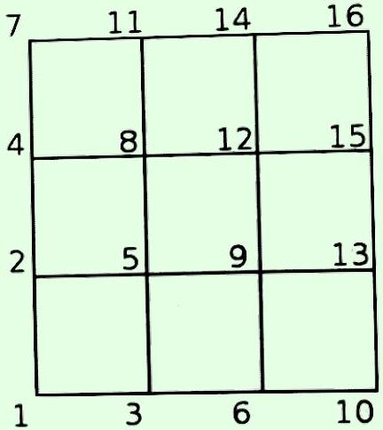
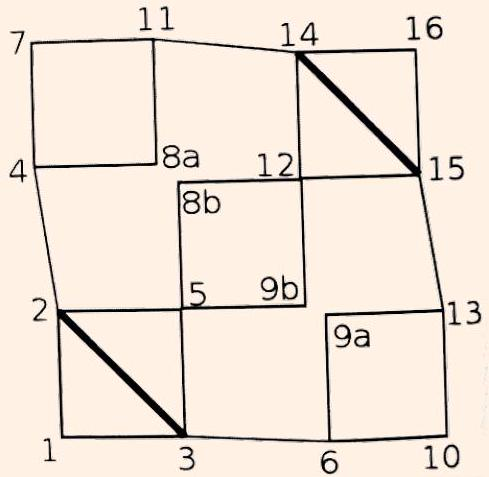
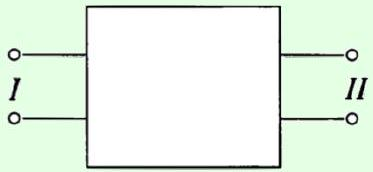
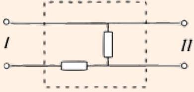
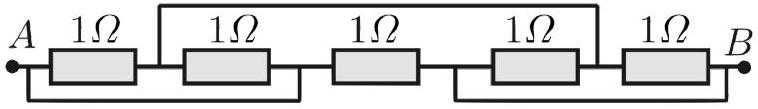

Example 7
Consider the 3 × 3 grid below, where every edge is a resistor $R$.

Find the equivalent resistance between nodes 1 and 16.

Solution
By the above idea, we can short together two pairs of nodes, by the diagonal symmetry of the network. By using the same idea in reverse, we can also break two nodes each into two pieces. This is valid because the separated nodes still have the same potential in the new network, by the diagonal symmetry.

Now, the circuit has been reduced to combinations of series and parallel resistors. The resistance between 1 and 2/3 is $R / 2$. The resistance between 2/3 and 14/15 is the combination of three networks in parallel, and the resistance between 14/15 and 16 is $R / 2$. Thus,

$$
R _ { \mathrm { eq } } = \left( \frac { 1 } { 2 } + \left( \frac { 1 } { 3 } + \frac { 1 } { 3 } + \frac { 1 } { 2 } \right) ^ { - 1 } + \frac { 1 } { 2 } \right) R = \frac { 13 } { 7 } R .
$$

Example 8: PPP 23
A black box contains a resistor network and has two output terminals.

If a battery of voltage $V$ is connected across the first terminal, the voltage across the second terminal is $V / 2$. If a battery of voltage $V$ is connected across the second terminal, the voltage across the first terminal is $V$. Find one possible configuration of the resistors inside the box.

Solution
A simple configuration with two equal resistors works.

When a battery is connected across II, the horizontal resistor doesn't do anything. When a battery is connected across I, the two resistors comprise a voltage divider.
[2] Problem 24. USAPhO 2007, problem A1.
[2] Problem 25 (IPhO 1996). Consider the following resistor network.

Find the equivalent resistance between A and B.

Solution. The answer is $0.5 \Omega$. See the official solutions of IPhO 1996, problem 1(a).
