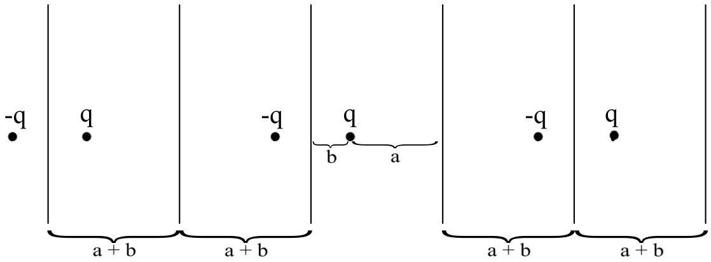
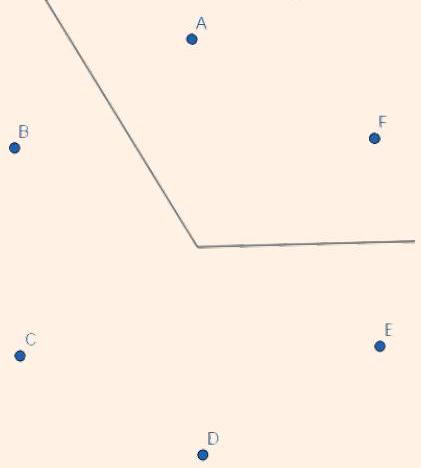
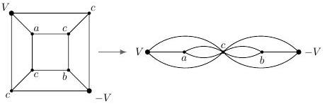
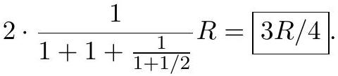
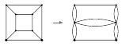
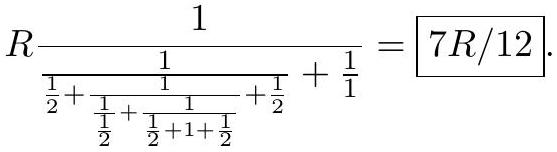
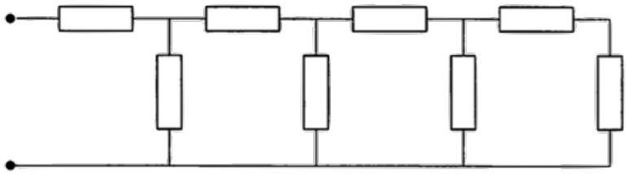
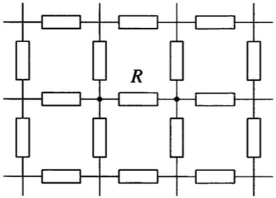
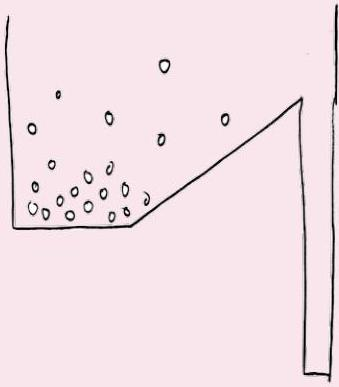
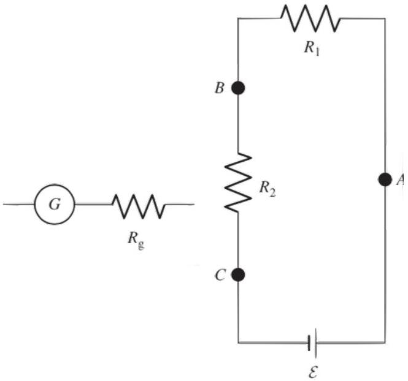

## Electromagnetism II: Electricity

Chapters 3 and 4 of Purcell cover the material presented here, as does chapter 6 of Wang and Ricardo, volume 2. Image charges are covered in more detail in section 3.2 of Griffiths. For an array of interesting physical examples, see chapters II-6 through II-9 of the Feynman lectures. There is a total of 77 points.

## 1 The Method of Images

Idea 1
The method of images can be used in some highly symmetric situations to compute the electric field in the vicinity of a conductor. Specifically, consider any configuration of static charges and take any equipotential surface containing some of the charges. Then the resulting field configuration outside that surface is the field configuration we would have if that surface bounded a conductor. This is simply because it has constant potential on the conductor surface, so it must be the right answer by the uniqueness theorem.

[4] Problem 1. The simplest application of the method of images is the case of a charge $q$ a distance $a$ from an infinite grounded conducting plane. This problem explores some of its subtleties, assuming you've already read the basic treatment in section 3.4 of Purcell.
    (a) Find the force on the charge.
    (b) Find the work needed to move the charge out to infinity.
    (c) Find the total potential energy of the charges on the conducting plane, i.e. the potential energy associated only with their interaction with each other.
    (d) Now suppose there is another parallel grounded conducting plane on the other end of the charge, a distance $b$ away. How many image charges are needed now? Draw some of them.
    (e) A conducting plane forces the electric field to be perpendicular to it. Suppose we somehow had a plane which made the electric field always parallel to it. (This assumption might sound unphysical, but it will actually be useful in later handouts.) Find the force on the charge.

Solution. (a) The field above the plate from the screening charges on the plate can be mimicked by placing an image charge $- q$ below the plane. This follows because in both cases, the plane of the plate is an equipotential of potential 0. Thus, the force on the charge is $q ^ { 2 } / \left( 16 \pi \epsilon _ { 0 } a ^ { 2 } \right)$ pointing towards the plane.

(b) We integrate $\int \mathbf { F } \cdot d \mathbf { x }$ to get $q ^ { 2 } / \left( 16 \pi \epsilon _ { 0 } a \right)$.
One might wonder why this is half of $q ^ { 2 } / \left( 8 \pi \epsilon _ { 0 } a \right)$, i.e. the energy of two charges $\pm q$ separated by $2 a$. The point is that the image charge isn't a real charge; it instead describes the effects of all the screening charges on the plane. After moving the real charge out by $d x$, the screening charges move to their new positions, which takes no work since the electric field is still almost perpendicular to the plane. This moves the image charge out by $d x$, without requiring work, explaining why the work required is half the naive amount.

(c) Suppose we freeze the plane's screening charges in place, then move the point charge out to infinity. In this case the image charge is stationary, so the work needed is $q ^ { 2 } / \left( 8 \pi \epsilon _ { 0 } a \right)$.
Let's think about what this means. There are two components to the initial potential energy: the energy $U _ { 1 }$ of the point charge interacting with the screening charges, and the energy $U _ { 2 }$ of the screening charges interacting with each other.
In part (b), we showed that it takes work $q ^ { 2 } / \left( 16 \pi \epsilon _ { 0 } a \right)$ to move the point charge out, after which point all charges in the problem are widely separated. So
$$
U _ { 1 } + U _ { 2 } = - \frac { q ^ { 2 } } { 16 \pi \epsilon _ { 0 } a } .
$$
By the other argument we just made, if we freeze the screening charges and move the point charge away, we are left with just the screening charges. So
$$
U _ { 1 } = - \frac { q ^ { 2 } } { 8 \pi \epsilon _ { 0 } a } .
$$
The quantity we're looking for is $U _ { 2 }$, which is thus
$$
U _ { 2 } = \frac { q ^ { 2 } } { 16 \pi \epsilon _ { 0 } a } .
$$
Of course this energy is positive, because the screening charges repel each other.
(At first glance this argument may seem to contradict the statement made in part (b), which states that the screening charges cost zero energy to move, as we move the point charge. However, that statement is only true if the screening charges are always allowed to move, so that they preserve the boundary condition $E _ { \| } = 0$. Here we instead considered an artificial situation where the screening charges were frozen, and this reasoning no longer holds.)
(d) We need infinitely many.

This is the same reason you see infinitely many images of yourself when between two mirrors.
(e) This boundary condition can be satisfied by placing a charge $+ q$ at $z = - a$. The force on the charge is thus $k q ^ { 2 } / \left( 4 a ^ { 2 } \right)$ pointing away from the plane.

Example 1
Two grounded conducting half-planes intersect, so that in cylindrical coordinates, the equations describing the planes are $\theta = 0$ and $\theta = \theta _ { p } = \pi / 2$. A charge $q$ is placed somewhere between the planes. Can the method of images be used to find the force on the charge? What

if $\theta _ { p } = 2 \pi / 3$, or for general $\theta _ { p }$ ?

Solution
We can solve the first case with three image charges. Let the real charge $q$ be at $( x , y )$. Then we can reflect in the plane $\theta = 0$, adding an image charge $- q$ at $( x , - y )$ to satisfy its boundary condition. Then we can reflect both the real charge and this image charge in the plane $\theta = \pi / 2$ to satisfy that plane's boundary condition, adding an image charge $- q$ at $( - x , y )$ and an image charge $q$ at $( - x , - y )$.

But when the other plane is at $\theta = 2 \pi / 3$, there is no configuration of image charges that works. For concreteness, let's suppose the real charge is at point $A$, on the $y$-axis.

Reflecting in the $\theta = 0$ plane forces us to have an image charge $- q$ at $D$, reflecting in the $\theta = 2 \pi / 3$ plane yields an image charge $q$ at $E$, and reflecting in the $\theta = 0$ plane again yields a $- q$ charge at $F$, which is real since it's in the same region as $A$. But this isn't allowed: the point of image charges is to provide an easy way of calculating the effects of screening charges on conducting surfaces on a given set of real charges (i.e. the charge at $A$ ), so it's not legal to introduce new real charges in the process. We would get the same conclusion if we reflected about the planes in a different order - we always need a charge at $F$. More generally, the method of images works for this problem if and only if $\theta _ { p } = \pi / n$ for integer $n$.
[3] Problem 2. Here you'll develop the method of images for spheres, for use in problems below.

(a) A point charge $- q$ is located at $x = a$ and a point charge $Q$ is located at $x = A$. Show that the locus of points with $\phi = 0$ is a circle in the $x y$ plane, and hence a spherical shell in space.
(b) Show that the center of the sphere is at the origin provided that
$$
a A = r ^ { 2 } , \quad | q | A = | Q | r
$$
where $r$ is the sphere's radius. We can use these formulas to characterize the image charge for a charge near a conducting sphere.

As an aside, the fundamental reason the method of images works for spheres is that electromagnetism has conformal symmetry, a symmetry under any local rescaling of space which preserves angles. (One example of a conformal transformation is inversion in Euclidean geometry.) The setup here is related to the conducting plane by such a transformation.

Solution. The problem can be solved immediately if you know about Apollonian circles. Here we'll present a straightforward solution using coordinates.

(a) The condition for the potential to vanish is
$$
\frac { q } { \sqrt { ( x - a ) ^ { 2 } + y ^ { 2 } } } = \frac { Q } { \sqrt { ( x - A ) ^ { 2 } + y ^ { 2 } } } .
$$
Squaring both sides and clearing denominators, we find
$$
\left( q ^ { 2 } - Q ^ { 2 } \right) \left( x ^ { 2 } + y ^ { 2 } \right) + \left( q ^ { 2 } A ^ { 2 } - Q ^ { 2 } a ^ { 2 } \right) + 2 x \left( a Q ^ { 2 } - A q ^ { 2 } \right) = 0 .
$$
This has the form of a conic section, and since the coefficients of $x ^ { 2 }$ and $y ^ { 2 }$ are equal, it's a circle. (Strictly speaking, it could also be the empty set, since, for example, $x ^ { 2 } + y ^ { 2 } = - 1$ has no solutions. But we know there have to be places where $\phi = 0$, because it's positive near the positive charge and negative near the negative charge, so it must cross zero by continuity.)
(b) The center of the sphere is at the origin if the coefficient of $x$ vanishes,
$$
a Q ^ { 2 } = A q ^ { 2 } .
$$
Note that this forces $a$ and $A$ to have the same sign. Plugging this in and simplifying, we find
$$
x ^ { 2 } + y ^ { 2 } = A a
$$
from which we conclude the radius is $r = \sqrt { A a }$. (In geometry jargon, this means the locations of the two point charges are inverse with respect to the sphere.) By combining this with the first equation, we conclude $| q | A = | Q | r$.

[2] Problem 3. Suppose a point charge $q$ is a distance $b$ from the center of a spherical grounded conducting shell of radius $r$.

(a) Find the force on the charge, considering both the cases $b < r$ and $b > r$.
(b) In both cases, what is the total charge on the shell?

Solution. (a) In both cases, the image charge is a distance $b ^ { \prime } = r ^ { 2 } / b$ from the center of the shell, and its charge is $q ^ { \prime } = - q \sqrt { b ^ { \prime } / b } = - q r / b$. So the force on the charge has magnitude

$$
F = \frac { q q ^ { \prime } } { 4 \pi \epsilon _ { 0 } \left( b - b ^ { \prime } \right) ^ { 2 } } = \frac { q ^ { 2 } r b } { 4 \pi \epsilon _ { 0 } \left( b ^ { 2 } - r ^ { 2 } \right) ^ { 2 } } .
$$

It always points towards the nearest point on the surface of the sphere.

(b) For $b > r$ the answer is simply $q ^ { \prime }$, but the case $b < r$ is different. Since the conductor shields the details of the charges inside, the field outside the sphere must be spherically symmetric. But we also know the sphere is at zero potential, so the field outside must be exactly zero, so by using a spherical Gaussian surface, the total charge in and within the shell is zero.
Therefore, the total charge on the shell has to be $- q$. It is a combination of a total charge $q ^ { \prime }$ spread over the surface, corresponding to the image charge, and a charge $- q - q ^ { \prime }$ spread uniformly over the surface. This second contribution to the charge doesn't show up in the image charge argument, because it makes no electric field inside the shell.

[2] Problem 4. An infinite grounded conducting plane at $z = 0$ is deformed with a hemispherical bump of radius $R$ centered at the origin, as shown. A charge $q$ is placed at $z = a$ as shown.

Can the method of images be used to find the potential in the region with the charge? If so, specify the image charges; if not, explain why not.
Solution. It can be done with three image charges, all on the $z$-axis:
    - A charge $- q$ at $z = - a$.
    - A charge $- q R / a$ at $z = R ^ { 2 } / a$.
    - A charge $q R / a$ at $z = - R ^ { 2 } / a$.

These ensure that the voltage vanishes on both the whole plane $z = 0$ and on the sphere $r = R$.

[2] Problem 5 (Purcell 3.50). A point charge $q$ is located a distance $b > r$ from the center of a nongrounded conducting spherical shell of radius $r$, which also has charge $q$. When $b$ is close to $r$, the charge is attracted to the shell because it induces negative charge; when $b$ is large the charge is clearly repelled. Find the value of $b$ so that the point charge is in equilibrium. (Hint: you should have to solve a difficult polynomial equation. You can use a calculator, or use the fact that it contains a factor of $1 - x - x ^ { 2 }$.)
Solution. The image charge $- q ^ { \prime } = - q r / b$ is at radius $r ^ { 2 } / b$. Since the sphere has total charge $q$, there must also be an image charge $q + q ^ { \prime }$ at its center. To balance forces, we must have
$$
\frac { q ^ { \prime } } { \left( b - r ^ { 2 } / b \right) ^ { 2 } } = \frac { q + q ^ { \prime } } { b ^ { 2 } } .
$$
Defining $x = r / b$, this simplifies to
$$
x = ( 1 + x ) ^ { 3 } ( 1 - x ) ^ { 2 } .
$$
Remarkably, this quintic equation factorizes as
$$
\left( 1 - x - x ^ { 2 } \right) \left( 1 + x - x ^ { 3 } \right) = 0 .
$$
The only root with $0 < x < 1$ is from the quadratic, $x = ( \sqrt { 5 } - 1 ) / 2$, giving
$$
b = \frac { 1 + \sqrt { 5 } } { 2 } r .
$$
If you didn't find the factorization, you can also solve the quintic numerically.
[3] Problem 6. A neutral spherical conductor of radius $R$ is placed in a uniform external field $\mathbf { E } _ { 0 }$.

(a) Since electrostatic fields must vanish inside conductors, the surface charge on the conductor must conspire to create an opposing uniform field inside it. How exactly does this happen? Specifically, explicitly find $\sigma ( \theta )$, the surface charge density as a function of the angle from $\mathbf { E } _ { 0 }$. (Hint: we're already seen an example of a suitable charge density in E1.)
(b) Now let's consider the field created by this surface charge outside the sphere. We could integrate the answer to part (a), but it's even easier to use the method of images. Suppose that the original external field $\mathbf { E } _ { 0 }$ was created by two very distant opposite point charges. Argue that the sphere picks up a dipole moment, and find its magnitude.
(c) What happens to the argument of part (b) if we instead suppose that $\mathbf { E } _ { 0 }$ was created by a single very distant point charge?

The lessons of this problem will be useful in several later handouts.
Solution. We align the $z$-axis with $\mathbf { E } _ { 0 }$ and center the sphere at the origin.

(a) In the very first problem of E1, we saw that if you take two balls of charge density $\pm \rho$ and radius $R$ and place them a small displacement d apart, then the electric field within their overlap is uniform with magnitude $\rho d / 3 \epsilon _ { 0 }$. That's exactly what we want to accomplish here, so we set $E _ { 0 } = \rho d / 3 \epsilon _ { 0 }$.
To make sure the net charge is only nonzero on a thin surface near radius $R$, we imagine sending $\rho$ to infinity and $d$ to zero. The surface charge density is then
$$
\sigma ( \theta ) = \rho d \cos \theta = 3 \epsilon _ { 0 } E _ { 0 } \cos \theta .
$$
(b) Consider a point charge $q$ at $z = - L$, and $- q$ at $z = L$ for $L \gg R$. This generates a roughly uniform electric field near the sphere with magnitude $q / 2 \pi \epsilon _ { 0 } L ^ { 2 }$. Therefore, we set $q = 2 \pi \epsilon _ { 0 } L ^ { 2 } E _ { 0 }$ to get the desired field.
By the results of problem 2, there are two image charges, which are both very close to the origin. They form a dipole with dipole moment
$$
p = 2 q ^ { \prime } L ^ { \prime } = 2 \frac { q R } { L } \frac { R ^ { 2 } } { L } = 4 \pi \epsilon _ { 0 } R ^ { 3 } E _ { 0 } .
$$
Of course, we could also have concluded this from part (a) with direct integration,
$$
p = 2 \pi \int _ { 0 } ^ { \pi } \left( R ^ { 2 } \sin \theta d \theta \right) ( R \cos \theta ) \sigma ( \theta ) = 6 \pi \epsilon _ { 0 } R ^ { 3 } E _ { 0 } \int _ { 0 } ^ { \pi } \sin \theta \cos ^ { 2 } \theta d \theta = 4 \pi \epsilon _ { 0 } R ^ { 3 } E _ { 0 }
$$
(c) We can consider a single point charge $- 2 q$ at $z = - L$, in which case we get a single point charge $2 q ^ { \prime }$ at $z = - L ^ { \prime }$. That doesn't look like what we found in part (b), but we need to remember that there's also an image charge $- 2 q ^ { \prime }$ at $z = 0$, enforcing the fact that the sphere is overall neutral. These two image charges form an image dipole with double the charge and half the displacement. It has the same dipole moment as in part (b), as it must.

[5] Problem 7 (Purcell 3.45). [A] Consider a point charge $q$ located between two parallel infinite grounded conducting planes. The planes are a distance $\ell$ apart, and the point charge is a distance $b$ from the left plane. The goal of this problem is to find the total charge induced on each plane.

(a) Argue that the total charge on each plane would not change if we replaced the point charge $q$ with two point charges $q / 2$, both a distance $b$ from the left plane. By iterating this process, convert the point charge into a uniformly charged plane, and use this to get the answer.
(b) Alternatively, using image charges, show that the electric field on the inside surface of the left plane, perpendicular to the plane, at a point a distance $r$ from the axis containing all the image charges, satisfies
$$
4 \pi \epsilon _ { 0 } E _ { \perp } = \sum _ { n = - \infty } ^ { \infty } \frac { 2 q ( 2 n \ell + b ) } { \left( ( 2 n \ell + b ) ^ { 2 } + r ^ { 2 } \right) ^ { 3 / 2 } } .
$$
(c) Since $\sigma = - \epsilon _ { 0 } E _ { \perp }$, we can integrate both sides to find the total charge on the left plane. However, the integral of each term by itself is simply $q$, so the series doesn't converge. To get the result, do the following steps in this specific order: group the terms $\pm n$ together, then integrate them only out to a distance $R \gg b$, then sum over the values of $| n |$, then take the limit $R \rightarrow \infty$. Show that this gives a finite result that matches that of part (a).

Solution. (a) Consider the induced charge distribution for one point charge $q$. By the superposition principle, the boundary conditions in this case are also satisfied if we take half that charge distribution, and center it about each of the charges $q / 2$. By uniqueness, this is the solution.

Extrapolating to infinitely many charges, we get a uniform plane of charge. For the two plates to be at the same voltage, the electric fields to the left and right of the plane must have ratio $( \ell - b ) / b$. Then the charges have the ratio $( \ell - b ) / b$ and sum to $- q$, so the charge on the left plane is $- q ( \ell - b ) / \ell$, while the charge on the right plane is $- q b / \ell$.

(b) We do this by summing over image charges. As we can see from the figure in the solution to problem 1 , there are infinitely many image charges. The $n = 0$ term in the sum corresponds to the image charge and real charge closest to the left plane. The $n = 1$ term corresponds to the two image charges a distance $2 \ell + b$ from the left plane, while the $n = - 1$ term corresponds to the image charges a distance $2 \ell - b$ from the left plane, and so on.
(c) Using $\sigma = - \epsilon _ { 0 } E _ { \perp }$, and grouping $\pm n$ terms together, the total charge on the left plane is
$$
\begin{aligned}
Q & = \int _ { 0 } ^ { \infty } \left( - \epsilon _ { 0 } E _ { \perp } \right) \cdot 2 \pi r d r \\
& = q \int _ { 0 } ^ { \infty } \left[ - \frac { b r } { \left( b ^ { 2 } + r ^ { 2 } \right) ^ { 3 / 2 } } + \sum _ { n = 1 } ^ { \infty } \left( \frac { ( 2 n \ell - b ) r } { \left( ( 2 n \ell - b ) ^ { 2 } + r ^ { 2 } \right) ^ { 3 / 2 } } - \frac { ( 2 n \ell + b ) r } { \left( ( 2 n \ell + b ) ^ { 2 } + r ^ { 2 } \right) ^ { 3 / 2 } } \right) \right] d r
\end{aligned}
$$
The first term integrates to 1 , so we will deal with the sum. Consider one term for some given $n$, and say we integrate out to some finite but large $R$. The term integrates out to
$$
f _ { n } = - \frac { 2 n \ell - b } { \sqrt { 4 n ^ { 2 } \ell ^ { 2 } + R ^ { 2 } - 4 n \ell b } } + \frac { 2 n \ell + b } { \sqrt { 4 n ^ { 2 } \ell ^ { 2 } + R ^ { 2 } + 4 n \ell b } } .
$$
Performing some careful algebra yields
$$
f _ { n } \approx \frac { 2 R ^ { 2 } b } { \left( R ^ { 2 } + 4 n ^ { 2 } \ell ^ { 2 } \right) ^ { 3 / 2 } } = \frac { 2 b } { R } \frac { 1 } { \left( 1 + ( 2 n \ell / R ) ^ { 2 } \right) ^ { 3 / 2 } } .
$$

Finally, in the limit $R \rightarrow \infty$, the sum can be written as an integral, giving

$$
\frac { 2 b } { R } \int _ { 0 } ^ { \infty } \frac { 1 } { \left( 1 + ( 2 n \ell / R ) ^ { 2 } \right) ^ { 3 / 2 } } d n = \frac { 2 b } { R } \frac { R } { 2 \ell } \int _ { 0 } ^ { \infty } \frac { d x } { \left( 1 + x ^ { 2 } \right) ^ { 3 / 2 } } = \frac { b } { \ell }
$$

Therefore, the total charge on the left plane is $- q ( 1 - b / \ell )$, matching part (a).

## Remark

The analysis in problem 7 is remarkably subtle, and about ten papers have been written about this problem in the American Journal of Physics alone. The solution above involves deforming and rearranging the terms of a nonconvergent series, which is mathematically dangerous. For instance, the Riemann rearrangement theorem tells us that in general, rearranging terms in a conditionally convergent series can give any answer.

So why does our procedure make sense? First off, the indefinite answer from part (b) is actually formally correct. The charge on the infinite planes can be anything, because we could always have charge on the planes hiding out at infinity, where it would have no effect. When we pose the question, we are implicitly asking how much charge is induced near the point charge (i.e. out to some finite distance $R \gg b$ ), while ignoring any charge at infinity.

The trick in part (a) resolves this ambiguity by extending the point charge $q$ into a distribution that also extends out to infinity, so that there's nowhere for extra charge on the infinite planes to hide. Another way to fix the problem is to replace the infinite planes with large finite ones. But if we do that, the image charge solution won't work anymore, and we won't have a way to treat the problem analytically.

On the other hand, for a very large but finite plane of size $R$, the image charge expansion will still be approximately correct for low enough $n$. Image charges with higher $n$ correspond to surface charges spread further and further out, which eventually get cut off by the plane's finite size. Thus, to mimic the effect of a finite-sized plane, we sum over $n$ while integrating out to finite $R$, erasing most of the contribution of the higher image charges. This removes the possibility of charge escaping to infinity, so we are then free to let $R \rightarrow \infty$.

This is an example of regularization: a calculation with infinite objects is elegant but not actually well-defined, so we introduce an artificial "regulator" to mimic what would happen for a finite object (where the calculation is well-defined, but too hard to do directly). This is a very important concept in modern physics, and we'll see another example in X1. The problem highlighting infinite charge distributions in E1 is an example where regularization doesn't work. There, the answer depended in detail on what regulator was chosen, so you couldn't get a unique answer by removing the regulator at the end. In general, regularization (and its accompanying concept of renormalization) is a tricky subject which requires both mathematical care and physical intuition.

## 2 Capacitors

Idea 2
There are multiple definitions of capacitance. For a single, isolated conductor with charge $Q$, the self-capacitance is defined as

$$
Q = C \phi
$$

where $\phi$ is the potential difference between the conductor and infinity. But for a set of two isolated conductors with charges $\pm Q$, you can also define a "mutual" capacitance by

$$
Q = C \phi
$$

where $\phi$ is the potential difference between the two conductors. When someone talks about a "capacitance" of two conductors, such as in idea 4, they usually mean the mutual capacitance.

Idea 3
The definitions of $C$ above are only useful when you have only one or two conductors in the problem, respectively. In a situation with more than two, it's very tricky to use the above definitions, because all the conductors will affect each other; even a neutral conductor will have an effect since there will be induced charges on its surface.

Instead, it's better to revert to more general principles. The underlying principle behind capacitance is linearity: by the principle of superposition, the charges are linearly related to the potentials. For multiple capacitors, the most general possible linear relation is

$$
Q _ { i } = \sum _ { j } C _ { i j } \phi _ { j }
$$

where conductor $i$ has charge $Q _ { i }$ and potential $\phi _ { i }$, the potential is taken to be zero at infinity, and the $C _ { i j }$ are called general coefficients of capacitance, or in electrical engineering, the Maxwell capacitance matrix. Similarly, inverting this relation,

$$
\phi _ { i } = \sum _ { j } p _ { i j } Q _ { j }
$$

where the $p _ { i j }$ are called coefficients of potential. We then calculate these coefficients by considering some appropriately selected situations, and solving a system of equations.

Computing the $C _ { i j }$ or $p _ { i j }$ explicitly is seldom useful in Olympiad problems. Instead, the point is that if you're given the charges and want the potentials, or vice versa, you can build up the answer you want using the principle of superposition.

Remark
General capacitance coefficients are discussed further in section 3.6 of Purcell. One nontrivial fact is that $C _ { i j } = C _ { j i }$, which is proven by energy conservation in problem 3.64 of Purcell. Capacitance coefficients can be clunky to work with. For example, suppose you want to

compute the familiar capacitance of a system of two conductors. By definition, we have

$$
Q _ { 1 } = C _ { 11 } \phi _ { 1 } + C _ { 12 } \phi _ { 2 } , \quad Q _ { 2 } = C _ { 21 } \phi _ { 1 } + C _ { 22 } \phi _ { 2 } .
$$

An ordinary two-plate capacitor corresponds to the special case of opposite charges on the plates, so we write $Q = Q _ { 1 } = - Q _ { 2 }$. There is a potential difference $V$ across the plates, so $\phi _ { 1 } = \phi _ { 2 } + V$, and plugging this in gives

$$
Q = \left( C _ { 11 } + C _ { 12 } \right) \phi _ { 2 } + C _ { 11 } V , \quad - Q = \left( C _ { 22 } + C _ { 21 } \right) \phi _ { 2 } + C _ { 21 } V .
$$

Eliminating $\phi _ { 2 }$ from the system of equations above, we find the familiar mutual capacitance

$$
C = \frac { Q } { V } = \frac { C _ { 11 } C _ { 22 } - C _ { 12 } ^ { 2 } } { C _ { 11 } + C _ { 22 } + 2 C _ { 12 } }
$$

where we used $C _ { 12 } = C _ { 21 }$. This is quite an inconvenient formula, so as a result we won't consider general capacitance coefficients any further, except briefly for practice in problem 11.
[2] Problem 8 (Purcell 3.21). Four parallel plates, each with large area $A$, are evenly spaced with small separation $s$. The first and third are connected by a wire, as are the second and fourth. What is the capacitance of the system?

Solution. This problem is asking about the usual notion of capacitance: there are two conductors, so we give them opposite charges and compute the ratio of charge to the voltage between them. However, it's a bit tricky to see how charge is distributed on the plates.

By symmetry, we know the surface charges are

$$
\sigma _ { 1 } , - \sigma _ { 2 } , \sigma _ { 2 } , - \sigma _ { 1 }
$$

reading left to right ( 1 to 4). The field in between plates 1 and 2 is $\sigma _ { 1 } / \epsilon _ { 0 }$, and the field between plates 2 and 3 is $\left( \sigma _ { 1 } - \sigma _ { 2 } \right) / \epsilon _ { 0 }$. Since 1 and 3 are connected, the voltage drop from 2 to 1, and from 2 to 3 must be the same, so

$$
\sigma _ { 1 } s = \left( \sigma _ { 2 } - \sigma _ { 1 } \right) s \Longrightarrow \sigma _ { 2 } = 2 \sigma _ { 1 } .
$$

Thus, the potential difference is $\sigma _ { 1 } s / \epsilon _ { 0 }$, so the capacitance is $C = Q / \phi = 3 \sigma _ { 1 } A / \left( \sigma _ { 1 } s / \epsilon _ { 0 } \right) = 3 \epsilon _ { 0 } A / s$.
There's also an easier way of thinking about this problem. Plate 1 and the left half of plate 2 form a capacitor of capacitance $\epsilon _ { 0 } A / s$, which doesn't affect anything outside. The same is true for the right half of plate 2 and the left half of plate 3, as well as the right half of plate 3 and plate 4. So we effectively have 3 such capacitors combined in parallel, giving $3 \epsilon _ { 0 } A / s$.
[2] Problem 9. Three large, conducting plates are placed parallel in zero external electric field. From left to right, the plates have total charges $Q _ { 1 } , Q _ { 2 }$, and $Q _ { 3 }$. Find the total charge on all six surfaces.

Solution. Let the charge on the left and right surface of plate $i$ be $Q _ { i } ^ { l }$ and $Q _ { i } ^ { r }$ respectively.
First, consider a Gaussian surface straddling the left surface of the left plate. The electric field on its right side is zero, and the electric field on its left side is $\left( Q _ { 1 } + Q _ { 2 } + Q _ { 3 } \right) / \left( 2 A \epsilon _ { 0 } \right)$. Therefore,

$$
Q _ { 1 } ^ { l } = \frac { Q _ { 1 } + Q _ { 2 } + Q _ { 3 } } { 2 }
$$

and from charge conservation we conclude

$$
Q _ { 1 } ^ { r } = Q _ { 1 } - Q _ { 1 } ^ { l } = \frac { Q _ { 1 } - Q _ { 2 } - Q _ { 3 } } { 2 } .
$$

Now consider a Gaussian surface whose sides are inside the left and middle plates. The flux through it is zero, so we must have

$$
Q _ { 2 } ^ { l } = - Q _ { 1 } ^ { r } = \frac { - Q _ { 1 } + Q _ { 2 } + Q _ { 3 } } { 2 } .
$$

By charge conservation again, we conclude that

$$
Q _ { 2 } ^ { r } = Q _ { 2 } - Q _ { 2 } ^ { l } = \frac { Q _ { 1 } + Q _ { 2 } - Q _ { 3 } } { 2 } .
$$

Now consider a Gaussian surface whose sides are inside the middle and right plates. By the same reasoning as before,

$$
Q _ { 3 } ^ { l } = - Q _ { 2 } ^ { r } = \frac { - Q _ { 1 } - Q _ { 2 } + Q _ { 3 } } { 2 } .
$$

Finally, by charge conservation we again have

$$
Q _ { 3 } ^ { r } = Q _ { 3 } - Q _ { 3 } ^ { l } = \frac { Q _ { 1 } + Q _ { 2 } + Q _ { 3 } } { 2 } .
$$

[2] Problem 10 (MPPP 152). Four identical metal spheres are positioned at the vertices of a regular tetrahedron, as shown.

Sphere $A$ can be raised to potential $V$ by giving it charge $4 q$. Sphere $A$ can also be raised to potential $V$ by giving it, and one of the other spheres, each charge $3 q$, or by giving it, and two of the other spheres, each charge $q ^ { \prime }$. What is $q ^ { \prime }$ ?

Solution. The key idea is linearity/superposition. By symmetry, whenever any one of the spheres is given charge $q$, then it raises its own potential by $\alpha q$ and the potentials of all the other spheres by $\beta q$, where $\alpha$ and $\beta$ are unknown coefficients. The problem tells us that

$$
4 \alpha q = 3 \alpha q + 3 \beta q = V
$$

from which we conclude that

$$
\alpha = \frac { 1 } { 4 } \frac { V } { q } , \quad \beta = \frac { 1 } { 12 } \frac { V } { q } .
$$

Now suppose that we give charge $q ^ { \prime }$ to $A$ and two other spheres. Then we have

$$
( \alpha + 2 \beta ) q ^ { \prime } = V , \quad q ^ { \prime } = \frac { 12 } { 5 } q .
$$

[3] Problem 11. Consider two concentric spherical metal shells, with radii $a < b$.

(a) Compute their capacitance using Gauss's law.
(b) Compute their capacitance by computing the four capacitance coefficients, verifying that $C _ { 12 } = C _ { 21 }$ along the way, and using the result for $C$ above.

Solution. (a) Let the shells have charge $\pm Q$. The field between the shells is $\left( Q / 4 \pi \epsilon _ { 0 } r ^ { 2 } \right) \hat { \mathbf { r } }$, so

$$
V = \frac { Q } { 4 \pi \epsilon _ { 0 } } \left( \frac { 1 } { a } - \frac { 1 } { b } \right) .
$$

Thus the capacitance is

$$
C = \frac { Q } { V } = 4 \pi \epsilon _ { 0 } \frac { a b } { b - a } .
$$

(b) Let the first conductor be the inner shell. If only the outer shell is charged, with charge $Q$, then $\phi _ { 1 } = \phi _ { 2 } = Q / 4 \pi \epsilon _ { 0 } b$. The general capacitance equations in this case are

$$
0 = C _ { 11 } \phi _ { 1 } + C _ { 12 } \phi _ { 2 } , \quad Q = C _ { 21 } \phi _ { 1 } + C _ { 22 } \phi _ { 2 }
$$

from which we see that

$$
C _ { 11 } + C _ { 12 } = 0 , \quad C _ { 21 } + C _ { 22 } = 4 \pi \epsilon _ { 0 } b .
$$

Now suppose only the inner shell is charged, with charge $Q$. In this case we have $\phi _ { 1 } = Q / 4 \pi \epsilon _ { 0 } a$ while $\phi _ { 2 } = Q / 4 \pi \epsilon _ { 0 } b$, so

$$
Q = C _ { 11 } \phi _ { 1 } + C _ { 12 } \phi _ { 2 } , \quad 0 = C _ { 21 } \phi _ { 1 } + C _ { 22 } \phi _ { 2 }
$$

from which we see that

$$
\frac { C _ { 11 } } { a } + \frac { C _ { 12 } } { b } = 4 \pi \epsilon _ { 0 } , \quad \frac { C _ { 21 } } { a } + \frac { C _ { 22 } } { b } = 0 .
$$

Solving these four equations for the capacitance coefficients gives

$$
C _ { 11 } = 4 \pi \epsilon _ { 0 } \frac { a b } { b - a } , \quad C _ { 12 } = C _ { 21 } = - 4 \pi \epsilon _ { 0 } \frac { a b } { b - a } , \quad C _ { 22 } = 4 \pi \epsilon _ { 0 } \frac { b ^ { 2 } } { b - a } .
$$

Plugging into the general formula, we have

$$
C = \frac { 4 \pi \epsilon _ { 0 } } { b - a } \frac { ( a b ) b ^ { 2 } - ( a b ) ^ { 2 } } { a b + b ^ { 2 } - 2 a b } = \frac { 4 \pi \epsilon _ { 0 } } { b - a } \frac { b ^ { 2 } a ( b - a ) } { b ( b - a ) } = 4 \pi \epsilon _ { 0 } \frac { a b } { b - a } .
$$

This is certainly a longer route to get to the same conclusion! (Note that in this very simple case, we actually have $C = C _ { 11 }$. That's because of the shell theorem, and it wouldn't hold in a more general situation.)
[3] Problem 12. USAPhO 2008, problem A1.
Idea 4
A two-plate capacitor with voltage difference $V$ and mutual capacitance $C$ stores energy

$$
U = \frac { 1 } { 2 } Q V = \frac { 1 } { 2 } C V ^ { 2 } .
$$

Many circuits have multiple two-plate capacitors. In general, these need to be handled with the capacitance coefficients introduced in idea 3. But in practice, capacitors used in circuits are designed to produce fields confined within themselves, so that different capacitors don't interact with each other. In that case, we can just use mutual capacitance throughout, and $C$ adds in parallel, while $1 / C$ adds in series. (But this doesn't work if, e.g. you put one capacitor inside another, in which case you should think about the charges and fields directly.)
[2] Problem 13 (Purcell 3.24). Some estimates involving capacitance.

(a) Estimate the capacitance of the Earth.
(b) Make a rough estimate of the capacitance of the human body.
(c) By shuffling over a nylon rug on a dry winter day, you can easily charge yourself up to a couple of kilovolts, as shown by the length of the spark when your hand comes too close to a grounded conductor. How much energy would be dissipated in such a spark?

Solution. (a) The Earth is a sphere of radius of order $10 ^ { 7 } \mathrm {~m}$, so

$$
C = 4 \pi \epsilon _ { 0 } r \sim 10 ^ { - 3 } \mathrm {~F} .
$$

We can make larger capacitances in the lab! Still, a huge amount of charge can be delivered to the Earth, such as by lightning strikes. This is because the voltage of the Earth is also huge, which is possible because its huge size means the corresponding electric fields aren't that big.

(b) A human is approximately a sphere of radius 0.5 m . Then the self-capacitance of the human body is $C = 4 \pi \epsilon _ { 0 } r \sim 5 \times 10 ^ { - 11 } \mathrm {~F}$.
(c) Plugging in the numbers, $U = C V ^ { 2 } / 2 \sim 10 ^ { - 4 } \mathrm {~J}$.

[2] Problem 14. The total energy can also be found by integrating the electric field energy,

$$
U = \frac { \epsilon _ { 0 } } { 2 } \int E ^ { 2 } d V
$$

(a) Show that this agrees with $U = C V ^ { 2 } / 2$ for a parallel plate capacitor.
(b) Show that this agrees with $U = C V ^ { 2 } / 2$ for a capacitor made of concentric spheres.

The general proof is more advanced; a slick method is given in problem 1.33 of Purcell.
Solution. (a) Let the plate area be $A$ and the distance between them be $d$. Then

$$
U = \frac { \epsilon _ { 0 } } { 2 } E ^ { 2 } ( A d ) = \frac { \sigma ^ { 2 } } { 2 \epsilon _ { 0 } } A d = \frac { C } { 2 } \frac { \sigma ^ { 2 } d ^ { 2 } } { \epsilon _ { 0 } ^ { 2 } } = \frac { C V ^ { 2 } } { 2 } .
$$

(b) Let the radii be $R _ { 1 }$ and $R _ { 2 }$ and the charges be $\pm Q$. The field is $Q / \left( 4 \pi \epsilon _ { 0 } r ^ { 2 } \right)$, so
$$
U = \frac { \epsilon _ { 0 } } { 2 } \int \frac { Q ^ { 2 } } { 16 \pi ^ { 2 } \epsilon _ { 0 } ^ { 2 } } \frac { d V } { r ^ { 4 } } = \frac { Q ^ { 2 } } { 32 \pi ^ { 2 } \epsilon _ { 0 } } \int _ { R _ { 1 } } ^ { R _ { 2 } } \frac { 4 \pi r ^ { 2 } d r } { r ^ { 4 } } = \frac { Q ^ { 2 } } { 8 \pi \epsilon _ { 0 } } \left( \frac { 1 } { R _ { 1 } } - \frac { 1 } { R _ { 2 } } \right) .
$$
On the other hand, this should be equal to $U = Q V / 2$, which follows directly from the result of problem 11.

[3] Problem 15 (Purcell 3.26). A parallel-plate capacitor consists of a fixed plate and a movable plate that is allowed to slide in the direction parallel to the plates. Let $x$ be the distance of overlap.

The separation between the plates is fixed. Let $C ( x )$ be the capacitance.
    (a) Assume the plates are electrically isolated, so that their charges $\pm Q$ are constant. By differentiating the energy, find the leftward force on the movable plate in terms of $Q$ and $C ( x )$.
    (b) Now assume the plates are connected to a battery, so that their potential difference $\phi$ is held constant. Find the leftward force on the movable plate, in terms of $\phi$ and $C ( x )$.
    (c) If the movable plate is held in place, the two answers above should be equal because nothing is moving. Verify that this is the case, being careful with signs.
    (d) In terms of electric fields, why is there a force on the movable plate? Does the effect invoked in the answer to this part change the conclusion of parts (a) through (c) at all?

Solution. (a) The energy as a function of $x$ is

$$
U ( x ) = \frac { Q ^ { 2 } } { 2 C }
$$

where we understand that $C$ is also a function of $x$. Thus, the force on the plate is

$$
F = - \frac { d U } { d x } = \frac { Q ^ { 2 } } { 2 } \frac { d } { d x } \left( - \frac { 1 } { C } \right) = \frac { Q ^ { 2 } } { 2 C ^ { 2 } } \frac { d C } { d x } .
$$

(b) Here, the energy is $U ( x ) = \frac { 1 } { 2 } C \phi ^ { 2 }$, so naively we have
$$
F = - \frac { d U } { d x } = - \frac { \phi ^ { 2 } } { 2 } \frac { d C } { d x } .
$$
This is negative, while the answer to part (a) is positive. The reason is that $U$ should reflect the total energy of the system - and in this case, the system must include the battery that does work to maintain the potential difference $\phi$.
Say $x$ increases by $d x$. Let the change in capacitance be $d C$, so $d Q = \phi d C$. Thus, the work the battery does is
$$
d W = \phi d Q = \phi ^ { 2 } d C .
$$
If $F$ is the net force the plate feels, we have
$$
d W = F d x + d U \Longrightarrow F = \frac { 1 } { 2 } \phi ^ { 2 } \frac { d C } { d x } .
$$
(c) Let $F _ { Q }$ be the first force, and $F _ { \phi }$ the second. We have
$$
F _ { Q } / F _ { \phi } = \frac { Q ^ { 2 } } { \phi ^ { 2 } C ^ { 2 } } = 1 .
$$
If we didn't account for the subtlety in part (b), we would have gotten -1 here.

(d) At first this seems confusing, as the field is supposed to be perfectly vertical. The resolution is that the force comes from the fringe fields, i.e. the fields right at the edges of the plates, which have a horizontal component.
Fortunately, we don't have to account for fringe fields in parts (a) through (c). They do affect the total stored energy, but as we move a plate, the region with the fringe fields just moves with the plate, while keeping the same profile, so it doesn't affect the change in energy. In other words, the force is entirely due to the fringe fields, yet the energy-based calculation doesn't have to care about the fringe fields at all. This is yet another example of how conservation laws can hand you information that's very hard to get otherwise.

## Idea 5: Dielectrics

A dielectric is an insulator which polarizes in the presence of an electric field, with positive charges displaced slightly along the field. The resulting electric dipoles distributed throughout the material in turn create a field that tends to weaken the original applied field within the material.

Each part of a dielectric polarizes based on the local electric field, but that electric field depends on the applied field, and the polarization of every other piece of the dielectric. Thus, solving for the electric field for a general dielectric geometry is very difficult, and usually not possible in closed form, just like how it's usually not possible to solve for the field of a charged conductor. In Olympiad physics, you will almost always consider highly symmetric situations, where a dielectric simply reduces the applied electric field everywhere inside by a factor of $\kappa$, called the dielectric constant. (We'll consider some trickier situations in E8.)

Consider a parallel plate capacitor with charge $\pm Q$ on each plate. If a dielectric is inserted with the charge kept the same, then the field inside is reduced by a factor of $\kappa$. Thus, the capacitance $C = Q / V$ increases by a factor of $\kappa$. Dielectrics may increase the amount of energy that can be stored in a capacitor, which is typically limited by the voltage $V _ { 0 }$ where electrical breakdown occurs. So if $V _ { 0 }$ stays the same, the maximal stored energy $U = C V _ { 0 } ^ { 2 } / 2$ goes up by a factor of $\kappa$.

Plugging in the definition of $C$, this result implies that the energy density in the capacitor is $\kappa \epsilon _ { 0 } E ^ { 2 } / 2$. But we showed in $\mathbf { E 1 }$ that the energy density of the electric field is only $\epsilon _ { 0 } E ^ { 2 } / 2$. The extra energy is stored in the dielectric material itself: it takes energy to separate positive and negative charges within the dielectric, as if we were stretching many microscopic springs. This potential energy is released when the capacitor is discharged.

## 3 Tricky Problems

Example 2: PPP 151
A closed body with conducting surface $F$ has self-capacitance $C$. The surface is now dented so that the new surface $F ^ { * }$ is entirely inside $F$. Prove that the capacitance has decreased.

Solution
The energy stored in the capacitor is $U = Q ^ { 2 } / 2 C$. Therefore, if we give the capacitor a fixed charge $Q$, proving that $F ^ { * }$ has lower $C$ is equivalent to showing that we can move the surface from $F ^ { * }$ to $F$ while only lowering the energy.

Suppose without loss of generality that $F$ is infinitesimally larger than $F ^ { * }$. (We can break any finite change into infinitesimal stages and repeat this argument.) We can go from $F ^ { * }$ to $F$ by just taking each charge on the surface and moving it outward until it hits $F$. Suppose the total charge is positive. Then we showed in E1 that the surface charge density is always nonnegative, and the electric field is always directed outward, so moving each charge lowers the energy.

At this point, the charges lie on $F$, but they don't have the right distribution, i.e. $F$ is not an equipotential. Now we let the charges spontaneously redistribute themselves so that $F$ is again an equipotential. This again lowers the energy, proving the desired result.

Example 3
Are there charge distributions that aren't spherically symmetric, but which produce an exact $\hat { \mathbf { r } } / r ^ { 2 }$ field outside of them?

Solution
If you know a bit about the multipole expansion, this might seem like a daunting question. To make the field exactly $\hat { \mathbf { r } } / r ^ { 2 }$, you need to make sure the charge distribution has no dipole moment, no quadrupole moment, no octupole moment, and so on to infinity, and it seems impossible to satisfy all of these constraints without spherical symmetry. But we have already seen an example of such a charge distribution earlier in the problem set!

Recall that when we treated the method of images for spheres, we found that in some situations, the complicated charge densities on conducting spheres were exactly the same as those produced by a fictitious image charge inside the sphere, and generally away from its center. If we place the origin at that image charge, then we have an example of a charge distribution that is perfectly $\hat { \mathbf { r } } / r ^ { 2 }$ outside the sphere, but which isn't spherically symmetric.

[2] Problem 16 (Purcell 3.9). A conducting spherical shell has charge $Q$ and radius $R _ { 1 }$. A larger concentric conducting spherical shell has charge $- Q$ and radius $R _ { 2 }$.
    (a) If the outer shell is grounded, explain why nothing happens to the charge on it.
    (b) If instead the inner shell is grounded, e.g. by connecting it to ground by a very thin wire that passes through a very small hole in the outer shell, find its final charge.
    (c) It's not so clear why charge would leave the inner shell in part (b), thinking in terms of forces. A small bit of positive charge will certainly want to hop on the wire and follow the electric field across the gap to the larger shell. But when it gets to the larger shell, it seems like it has no reason to keep going to infinity, because the field is zero outside. And, even worse, the field will point inward once some positive charge has moved away from the shells. So it seems

like the field will drag back any positive charge that has left. Does charge actually leave the inner shell? If so, what's wrong with the above reasoning?

Solution. (a) The potential at the outer shell due to itself is $- Q / 4 \pi \epsilon _ { 0 } R _ { 2 }$ and the potential due to the inner shell is $Q / 4 \pi \epsilon _ { 0 } R _ { 2 }$, so it is zero overall. Thus, the outer shell is already effectively grounded.

(b) The potential at the inner shell due to itself is $Q ^ { \prime } / 4 \pi \epsilon _ { 0 } R _ { 1 }$ and the potential to the outer shell is $- Q / 4 \pi \epsilon _ { 0 } R _ { 2 }$. Since the total must be zero, $Q ^ { \prime } = R _ { 1 } Q / R _ { 2 }$.
(c) The key mistake is that the positive charges are repelled also by the charges behind it in the wire. So yes, eventually the field due to the shells may even become inward, there is a whole line of plus charge behind a given charge that force it forward.
Another way of saying this is that a wire has negligible capacitance; like a thin metal pipe of water, it cannot store extra net charge but can only let charge move rigidly through the entire thing. It is energetically favorable for this to happen, so even if some charges don't want to move forward, their neighbors will push them forward.

[2] Problem 17. The usual expression for the capacitance of a parallel-plate capacitor is $A \epsilon _ { 0 } / d$. However, in reality the field within the capacitor is not perfectly uniform, and there are fringe fields outside. Is the true capacitance slightly higher or lower than $A \epsilon _ { 0 } / d$ ?

Solution. For concreteness, suppose the plates are circular disks, with charge $\pm Q$, and consider the electric field along the axis of symmetry. In the naive derivation, we assume the charge density on the plates is uniform. Then we approximate the plates as infinite in order to use Gauss's law to conclude that the field inside is $\sigma / \epsilon _ { 0 } = Q / A \epsilon _ { 0 }$. This is inaccurate for two reasons:

- The plates are not actually infinite, so the field on the symmetry axis should actually be smaller.
- The charge distribution is not actually uniform. Instead, since the like charges on each plate repel each other, some charge gets pushed outward. This further decreases the field on the symmetry axis.

Therefore, the field on the symmetry axis is a bit less than $Q / A \epsilon _ { 0 }$, so the voltage drop is lower, which implies the capacitance is higher.

That's all we can say here. Even graduate textbooks won't say much about corrections to the capacitance, because the simplest calculations are quite hard. If you're curious, see this paper.
[2] Problem 18 (Purcell 4.16). In a parallel plate capacitor, the quantity $\int \mathbf { E } \cdot d \mathbf { s }$ should be equal to $V$ for any path that connects the two plates.

A charged capacitor can be discharged by attaching a wire to the external surfaces of the plates. No matter how one attaches the wire, $\int \mathbf { E } \cdot d \mathbf { s }$ along the wire should be equal to $V$. And as we've argued in problem 16, this is sufficient to cause charges to move along the wire, even if the electric field points in the "wrong" direction at some points along the wire, because the wire has negligible capacitance: charges within it move rigidly, each pushing the next one and pulling the previous one.

But it's puzzling how this works for a capacitor, because the electric field is supposed to be essentially zero just outside it. Consider two possible limiting cases for the wire's shape.

In each case, explain qualitatively how $\int \mathbf { E } \cdot d \mathbf { s }$ can be equal to $V$. In particular, how large are the contributions from the distinct segments of the wire (the horizontal and vertical parts in the first case, and the straight and curved parts in the second)?

Solution. In the first case, the horizontal parts of the wire contribute almost nothing. That's because the radial part of the electric field vanishes within the conductor plates themselves (since they must be equipotentials), and the horizontal path is right next to the plates. Therefore, the contribution is almost entirely from the vertical segment.

You might be wondering how this is possible, because at the edge of the plates, there seems to be less charge nearby, so the electric field should be smaller than near the middle of the plates. The resolution is that the surface charge density near the edge of plates is a lot higher than the surface charge density near the middle, because like charges repel.

It's interesting to compare this to the case of two parallel plates with uniform charge density. In that case, the vertical segment contributes roughly $V / 2$. To see why, consider putting a second, identical parallel plate capacitor directly to the left of the first one. Now the vertical segment is in the middle of a big capacitor, and has voltage drop $V$. So each of the two halves of that big capacitor contributes $V / 2$ to the vertical segment. However, the total voltage drop is still $V$, because for uniform charge density there are substantial horizontal fields, so that the horizontal segments contribute roughly $V / 4$ each.

In the second case, the result is due to the far-field behavior. When you zoom out, the capacitor looks like a dipole, so the field at long distances is a dipole field. Now, the dipole field falls off as $1 / r ^ { 3 }$, and the circumference of the curved part is proportional to $r$, so the contribution of this part goes as $r / r ^ { 3 } \rightarrow 0$ as $r \rightarrow \infty$. So all the contribution is from the straight part.

To see how this can be the case, note that the vertical field just above the capacitor plates is negligible; the dipole field only kicks in once we're far enough so that the plates look small, i.e. subtending a small angle from our perspective. If the plates are squares of side length $a$, this occurs at a distance of order $a$. Then a very rough estimate is

$$
\int \mathbf { E } \cdot d \mathbf { s } \sim 2 \int _ { a } ^ { \infty } \frac { p } { 2 \pi \epsilon _ { 0 } r ^ { 3 } } d r = \frac { 1 } { 2 \pi } \frac { p } { \epsilon _ { 0 } a ^ { 2 } }
$$

where $p$ is the electric dipole moment. If the plates are separated by a distance $d \ll a$, then $p = Q d = \sigma a ^ { 2 } d$, giving

$$
\frac { 1 } { 2 \pi } \frac { p } { \epsilon _ { 0 } a ^ { 2 } } = \frac { 1 } { 2 \pi } \frac { \sigma d } { \epsilon _ { 0 } } = \frac { V } { 2 \pi }
$$

which is on the order of the voltage $V$ across the capacitor plates. Of course, we didn't get precisely $V$ because we made a lot of approximations in the calculation, but this illustrates the conceptual point: the full integral of $\mathbf { E } \cdot d \mathbf { s }$ can indeed be equal to $V$, and most of the contribution to this integral comes from the part of the vertical wire which is a distance of order $a$ from the capacitor.

[3] Problem 19. USAPhO 2022, problem A2. A computational problem involving surface tension.
Example 4
Find the leading interaction force between a dipole of dipole moment $p$ and a grounded conducting sphere of radius $r$, separated by a distance $R \gg r$. What if the sphere is electrically neutral instead?

Solution
Place the origin at the center of the sphere and orient the $z$-axis to pass through the dipole. We can regard the dipole $\mathbf { p } = q d \hat { \mathbf { z } }$ as a combination of two charges

$$
- q \text { at } z = R , \quad q \text { at } z = R + d
$$

where $d$ is very small. In the grounded case, this induces two image charges in the sphere,

$$
\frac { q r } { R } \text { at } z = \frac { r ^ { 2 } } { R } , \quad - \frac { q r } { R + d } \text { at } z = \frac { r ^ { 2 } } { R + d }
$$

approximately separated by $d r ^ { 2 } / R ^ { 2 }$. We can now use Coulomb's law four times, but that's a bit tedious. Instead, decompose the image charges into a dipole moment and a net charge,

$$
p ^ { \prime } = \frac { p r ^ { 3 } } { R ^ { 3 } } , \quad Q ^ { \prime } = \frac { q r } { R } - \frac { q r } { R + d } \approx \frac { p r } { R ^ { 2 } } .
$$

We can place both of these at the origin, because this slight displacement will only affect the answer by subleading terms in $r / R$. Then the corresponding fields, far along the $z$-axis, are

$$
E _ { p ^ { \prime } } ( z ) = \frac { 2 k p r ^ { 3 } } { R ^ { 3 } z ^ { 3 } } , \quad E _ { Q ^ { \prime } } ( z ) = \frac { k p r } { R ^ { 2 } z ^ { 2 } } .
$$

The first term is negligible compared to the second, due to the many powers of $R$ and $z$ in the denominator. Thus, keeping only the second term, the force on the original dipole is

$$
F = \left. p \frac { d } { d z } E ( z ) \right| _ { z = R } = - \frac { 2 k p ^ { 2 } r } { R ^ { 5 } }
$$

which falls off very quickly with distance. This derivation illustrates a common subtlety: it might not always be obvious how far to approximate. We threw away terms subleading in $r / R$, because we only wanted the leading contribution. But if we had applied that principle to the image charges at the first step, we would have thrown out the tiny net charge $Q ^ { \prime }$, which actually provides the dominant contribution to the force, because of how tiny $p ^ { \prime }$ is.

Now, the situation for a neutral sphere is completely different. By the logic of problem 5, there's a third image at the center of the sphere to enforce neutrality,

$$
- \frac { p r } { R ^ { 2 } } \text { at } z = 0 .
$$

The image charges can now be decomposed into a combination of two dipole moments. We already saw the first one $p ^ { \prime }$ above, while the second is, to leading order

$$
p ^ { \prime \prime } \approx \frac { p r } { R ^ { 2 } } \frac { r ^ { 2 } } { R } = \frac { p r ^ { 3 } } { R ^ { 3 } }
$$

with the same magnitude and direction as $p ^ { \prime }$. Thus, this system of image charges has approximate dipole moment $2 p ^ { \prime }$. The corresponding force is

$$
F = \left. p \frac { d } { d z } \frac { 4 k p r ^ { 3 } } { R ^ { 3 } z ^ { 3 } } \right| _ { z = R } = - \frac { 12 k p ^ { 2 } r ^ { 3 } } { R ^ { 7 } }
$$

which falls off even more quickly with distance. In this derivation, we didn't have to worry too much about getting $p ^ { \prime \prime }$ exactly right, because there was no net charge ("monopole") term that could've overwhelmed the dipole field, so all other field contributions are safely suppressed by more powers of $r / R$. (Of course, if $p ^ { \prime \prime }$ had come out pointing the opposite direction to $p ^ { \prime }$, so that the two almost cancelled, we would've had to be more careful.)

The lesson of this example is not to just use exact expressions and Taylor expand at the end. Here, that brute force approach would have required Taylor expanding six Coulomb's law forces out to order $1 / R ^ { 7 }$, which is extraordinarily tedious. Instead, to approximate properly, we have to think carefully in every case. Incidentally, when applied to a polar and neutral nonpolar molecule, the $1 / R ^ { 7 }$ force above is called the Debye force; it is one of the "van der Waals forces" which are often vaguely described in chemistry classes.

Example 5
Estimate the interaction force between a point charge $q$ and a thin conducting rod of length $\ell$, which is a distance $L \gg \ell$ from the charge and oriented along the separation between them.

Solution
The interaction occurs because the point charge induces negative charges on the near end of the rod, and positive charges on the far end. These charges are then acted on by the electric field of the point charge, causing a force.

To get a very crude estimate, let's suppose charge $Q$ appears on the far end and charge $- Q$ appears on the near end. The resulting field produced in the middle is

$$
E \sim \frac { k Q } { \ell ^ { 2 } } .
$$

On the other hand, this needs to cancel a field from the point charge of

$$
E \sim \frac { k q } { L ^ { 2 } }
$$

which tells us that $Q \sim ( \ell / L ) ^ { 2 } q$. The force on the induced charges is then

$$
F \sim k q Q \left( \frac { 1 } { ( L + \ell ) ^ { 2 } } - \frac { 1 } { L ^ { 2 } } \right) \sim - \frac { k q Q \ell } { L ^ { 3 } } \sim - \frac { k q ^ { 2 } \ell ^ { 3 } } { L ^ { 5 } } .
$$

Again, the force is attractive, and falls off quickly with distance.
[3] Problem 20 (Physics Cup 2017). Estimate the interaction force between a point charge $q$ and an

infinitely thin circular neutral conducting disc of radius $r$ if the charge is at the axis of the disc, and the distance between the disc and the charge is $L \gg r$.

Solution. The interaction is because charges redistribute on the disc to keep it an equipotential. As an extremely rough approximation, suppose that charge $Q$ appears near the rim of the disc and charge $- Q$ appears near the center. Then by dimensional analysis, the electric field in the disc is

$$
E \sim \frac { k Q } { r ^ { 2 } } .
$$

On the other hand, the electric field due to the point charge along the disc is of order

$$
E \sim \frac { k q } { L ^ { 2 } } \frac { r } { }
$$

where the $r / L$ factor is from projecting the field along the disc. Then

$$
Q \sim q \frac { r ^ { 3 } } { L ^ { 3 } } .
$$

The force is attractive, and by Coulomb's law,

$$
F \sim k q Q \left( \frac { 1 } { L ^ { 2 } } - \frac { L } { \left( L ^ { 2 } + r ^ { 2 } \right) ^ { 3 / 2 } } \right) \sim \frac { k q ^ { 2 } r ^ { 5 } } { L ^ { 7 } } .
$$

[3] Problem 21. Consider two conducting spheres of radius $r$ separated by a distance $a \gg r$, with total charges $\pm Q$. The spheres can be thought of as the two plates of a capacitor.

(a) Find a simple approximation for the capacitance $C$, valid when $a \gg r$.

In reality, the exact capacitance of this system can be written as an infinite series in $r / a$. Let's consider two ways of finding the corrections to the capacitance.

(b) By considering the energy $U = Q ^ { 2 } / 2 C$ of the system, find the first nontrivial correction to $C$.
(c) Alternatively, we can think about the charge distributions on the spheres. If we start with a "zeroth-order" uniform charge density on each sphere, it will induce a "first-order" image charge in the other sphere, which will in turn induce "second-order" image charges, and so on. We can then compute $C = Q / \Delta V$ by summing up all the image charges, and the total voltage difference they produce. Using this approach, find the first nontrivial correction to $C$.
(d) ★ It turns out that the quantity $1 / C$ is a bit nicer than $C$. At what order in $r / a$ does the second nontrivial correction to $1 / C$ appear?

Solution. (a) The potential of a single sphere, relative to infinity, is $V = Q / 4 \pi \epsilon _ { 0 } r$. Hence the two spheres, at this level of approximation, have potentials $\pm Q / 4 \pi \epsilon _ { 0 } r$, and the capacitance is

$$
C = \frac { Q } { V _ { 1 } - V _ { 2 } } = 2 \pi \epsilon _ { 0 } r .
$$

This is ignoring any interaction between the charges on different spheres.

(b) Each sphere has an energy $Q ^ { 2 } / 8 \pi \epsilon _ { 0 } r$ due to its own field, so the simplest correction is to account for the electrostatic interaction between them, treating them as approximately point charges. We therefore have
$$
U = \frac { Q ^ { 2 } } { 8 \pi \epsilon _ { 0 } r } + \frac { Q ^ { 2 } } { 8 \pi \epsilon _ { 0 } r } - \frac { Q ^ { 2 } } { 4 \pi \epsilon _ { 0 } a } + \ldots
$$
which gives
$$
C = 2 \pi \epsilon _ { 0 } r \left( 1 + r / a + \mathcal { O } \left( r ^ { 2 } / a ^ { 2 } \right) \right) .
$$
(c) Let's review the strategy. If we put a uniform charge on one sphere, then by the shell theorem, its effect on the second sphere is the same as a point charge at the first sphere's center. This induces an image charge on the second sphere. The same logic applies in reverse, with uniform charge on the second sphere inducing an image charge on the first sphere. The image charges are smaller than the original ones by a factor of $r / a$, by the result of problem 2.
However, this isn't a solution to the problem, because these "first-order" image charges on each sphere in turn induce "second-order" image charges in the other sphere, which are smaller by another factor of $r / a$, and so on. Once we sum up an infinite series of image charges, we get the true charge configuration, from which we can compute the exact capacitance, as a series in $r / a$. The net charge on each sphere is the sum of all its image charges.
Specifically, let the total charge and voltage on the spheres be $\pm Q$ and $\pm V$. Both of these quantities can be expanded in a power series in $r / a$,
$$
Q = q _ { 0 } + q _ { 1 } + q _ { 2 } + \ldots , \quad V = V _ { 0 } + V _ { 1 } + V _ { 2 } + \ldots
$$
and the capacitance is simply $C = Q / ( V - ( - V ) ) = Q / 2 V$.
To start, we put a "zeroth-order" charge of $q _ { 0 }$ at the center of the positive sphere. This charge induces a voltage $V _ { 0 } = q _ { 0 } / \left( 4 \pi \epsilon _ { 0 } r \right)$ on that sphere. Now, the negative sphere's $- q _ { 0 }$ induces an image charge $q _ { 1 } = q _ { 0 } r / a$ in the positive sphere. By construction, the $- q _ { 0 }$ on the negative sphere and the $+ q _ { 1 }$ image charge on the positive sphere together yield zero potential on the positive sphere, so $V _ { 1 } = 0$. (This is a lucky result, which won't continue at higher orders.) So the capacitance with the first correction is simply
$$
C = \frac { Q } { 2 V } = \frac { q _ { 0 } + q _ { 1 } + \mathcal { O } \left( r ^ { 2 } / a ^ { 2 } \right) } { 2 \left( V _ { 0 } + V _ { 1 } + \mathcal { O } \left( r ^ { 2 } / a ^ { 2 } \right) \right) } = 2 \pi \epsilon _ { 0 } r \left( 1 + r / a + \mathcal { O } \left( r ^ { 2 } / a ^ { 2 } \right) \right) .
$$
in agreement with part (b).
(d) As we've seen, the answer is a power series in $r / a$, so we would guess that the next term is of order $( r / a ) ^ { 2 }$. However, the next term is actually of order $( r / a ) ^ { 4 }$.
This is difficult to see with the image charge method of part (c). If you work it out, you'll find that the second order and third order corrections to $1 / C$ cancel out, in a complicated way. On the other hand, it's intuitive if you consider the energy, as in part (b). This is the more natural quantity, since $U \propto 1 / C$.
We know that the leading correction to the charge distribution is the image charge $q _ { 1 } = q _ { 0 } r / a$, which is off center by $r ^ { 2 } / a$. Thus, each sphere can be regarded as a point charge $Q$ at its

center, plus a dipole moment $p _ { 1 } \sim Q r ^ { 3 } / a ^ { 2 }$, plus higher order corrections. This dipole interacts with the point charge field of the other sphere with a potential energy

$$
\Delta U \sim \mathbf { p } _ { 1 } \cdot \mathbf { E } \sim \frac { Q r ^ { 3 } } { a ^ { 2 } } \frac { Q } { a ^ { 2 } } \sim \frac { Q ^ { 2 } r ^ { 3 } } { a ^ { 4 } }
$$

which is order $( r / a ) ^ { 4 }$ smaller than the leading term in $U$, as promised.
For much more about this problem, see this paper. The result we derived in part (b) matches its equation (2.2), upon identifying $Q _ { a } \rightarrow Q , Q _ { b } \rightarrow - Q , a , b \rightarrow r$, and $c \rightarrow a$, and using cgs units where $4 \pi \epsilon _ { 0 } = 1$. The third correction shows up at order $( r / a ) ^ { 6 }$, and corresponds to a dipole-dipole interaction. As noted in the paper, Maxwell was so interested in this system that he calculated $1 / C$ out to $22 ^ { \text {nd } }$ order!

Example 6
Find the charge distribution on a thin conducting disc of radius $R$ and total charge $Q$.

Solution
In general, there are very few situations where the charge distribution on a conductor can be found explicitly. As you've seen, some of the simplest examples can be solved with image charges. Some more complex, two-dimensional examples can be solved with a mathematical technique called conformal mapping. And this special example can be solved with a neat trick.

Consider a uniformly charged spherical shell centered on the origin, and consider a point $P$ inside the shell, on the $x y$ plane. The electric field at point $P$ is zero, by the shell theorem. Recall that in the usual proof of the shell theorem, one draws two cones opening out of $P$ in opposite directions. The charges contained in each cone produce canceling electric fields.

Now imagine shrinking the spherical shell towards the $x y$ plane, so it becomes elliptical. The crucial insight is that the shell theorem argument above still works, for points on the $x y$ plane. When we squash the shell all the way down to the $x y$ plane, it becomes a disc, with zero electric field on it. This is thus a valid charge distribution for a disc-shaped conductor, and by the uniqueness theorem, it's the only one.

By keeping track of how much charge gets squashed to radius $[ r , r + d r ]$, we find $\sigma ( r ) \propto$ $R / \sqrt { R ^ { 2 } - r ^ { 2 } }$, and fixing the proportionality constant gives

$$
\sigma ( r ) = \frac { Q } { 4 \pi R \sqrt { R ^ { 2 } - r ^ { 2 } } } .
$$

You can also show this by taking the $c , \epsilon \rightarrow 0$ limit of the "third shell theorem" in M6. Note that this is the surface charge density on each side of the thin disc, so if you wanted the limit of an infinitely thin disc, you should double the answer.

## 4 Electrical Conduction

We now leave the world of electrostatics and consider steady currents.

Idea 6
In a conductor with conductivity $\sigma$, the current density is

$$
\mathbf { J } = \sigma \mathbf { E } .
$$

Equivalently, one can define the resistivity $\rho$ by $\mathbf { E } = \rho \mathbf { J }$. Annoyingly, $\rho$ and $\sigma$ also stand for volume and surface charge density, but these are just the historic choices.

The current density J and volume charge density $\rho$ satisfy

$$
\nabla \cdot \mathbf { J } = - \frac { \partial \rho } { \partial t } .
$$

The current passing through a surface $S$ at a given time is

$$
I = \int _ { S } \mathbf { J } \cdot d \mathbf { S }
$$

Since $\mathbf { J } \propto \mathbf { E }$, we have Ohm's law $V = I R$, where $V$ is the voltage drop across the resistor. The power dissipated in a resistor is $P = I V$. The resistance $R$ adds in series, while $1 / R$ adds in parallel.
[2] Problem 22 (HRK). A battery causes a current to run through a loop of wire.

(a) Suppose the wire makes a sharp corner. How do the charges know to turn around there?
(b) A copper wire with conductivity $\sigma$ is joined to an iron wire with conductivity $\sigma ^ { \prime } < \sigma$. For the current in both sections to be the same, the electric field in the iron wire must be higher. How does that happen?

For more about surface charges in circuits, see this paper and this paper. For a great visualization of how the charge and current configuration in a real circuit is set up over time, see this video.

Solution. (a) The first charges to make it there don't; they just stop at the surface of the wire, due to the attraction from the positively charged nuclei. Once this charge builds up at the kink, it repels the next electrons so that they automatically turn around. This typically occurs extremely quickly, as the relevant timescale is the $R C$ of the wire and $C$ is tiny. The amount of charge required is very small, less than a few hundred electrons.

(b) It's the same story as part (a). The first charges to reach the iron will start moving slower, because the fields are the same. This then causes a buildup of charge at the interface between them, which increases the field in the iron and decreases the field in the copper. In the steady state, the current densities in both are equal. Again, this occurs very quickly and requires very little charge.

[1] Problem 23. Until the late 1900s, most light bulbs were incandescent. An incandescent light bulb is essentially just a resistor, which emits light when it gets hot. It is designed to be connected to a power supply of given voltage, in parallel with other bulbs. Now suppose a bulb marked "200 W" and a bulb marked " 50 W" are accidentally connected in series. Which bulb is brighter?

Solution. A standard bulb is designed to be hooked up in parallel with other bulbs, across some fixed voltage $V$. Since $P = V ^ { 2 } / R$, higher wattage bulbs have lower resistance. Since the bulbs are in series, then have the same current through them. Since $P = I ^ { 2 } R$, that means the bulb with the higher wattage rating draws less power. The 50 W bulb is brighter. (With modern LED lights, this classic problem doesn't really work. An LED driven at a lower voltage than expected often just won't light up at all.)

To warm up for DC circuits, we'll consider some resistor network problems.
Idea 7
If any two points in a resistor network are at the same potential, nothing will change if the two points are connected together and treated as one. More generally, the resistance of any resistor directly connecting the two points may be changed freely.

Example 7
Consider the 3 × 3 grid below, where every edge is a resistor $R$.

Find the equivalent resistance between nodes 1 and 16.

Solution
By the above idea, we can short together two pairs of nodes, by the diagonal symmetry of the network. By using the same idea in reverse, we can also break two nodes each into two pieces. This is valid because the separated nodes still have the same potential in the new network, by the diagonal symmetry.

Now, the circuit has been reduced to combinations of series and parallel resistors. The resistance between 1 and 2/3 is $R / 2$. The resistance between 2/3 and 14/15 is the combination of three networks in parallel, and the resistance between 14/15 and 16 is $R / 2$. Thus,

$$
R _ { \mathrm { eq } } = \left( \frac { 1 } { 2 } + \left( \frac { 1 } { 3 } + \frac { 1 } { 3 } + \frac { 1 } { 2 } \right) ^ { - 1 } + \frac { 1 } { 2 } \right) R = \frac { 13 } { 7 } R .
$$

Example 8: PPP 23
A black box contains a resistor network and has two output terminals.

If a battery of voltage $V$ is connected across the first terminal, the voltage across the second terminal is $V / 2$. If a battery of voltage $V$ is connected across the second terminal, the voltage across the first terminal is $V$. Find one possible configuration of the resistors inside the box.

Solution
A simple configuration with two equal resistors works.

When a battery is connected across II, the horizontal resistor doesn't do anything. When a battery is connected across I, the two resistors comprise a voltage divider.
[2] Problem 24. USAPhO 2007, problem A1.
[2] Problem 25 (IPhO 1996). Consider the following resistor network.

Find the equivalent resistance between A and B.

Solution. The answer is $0.5 \Omega$. See the official solutions of IPhO 1996, problem 1(a).

[3] Problem 26. Consider a cube of side length $L$ whose edges are resistors of resistance $R$.
    (a) Compute the resistance between two vertices a distance $\sqrt { 3 } L$ apart.
    (b) Compute the resistance between two vertices a distance $\sqrt { 2 } L$ apart.
    (c) Compute the resistance between two vertices a distance $L$ apart.
    (d) Generalize to vertices $\sqrt { n } L$ apart on an $n$-dimensional cube. (One edge is $n = 1$, a square is $n = 2$, and an ordinary cube is $n = 3$. Give your answer in the form of a summation.)

Solution. (a) Let the two vertices be $A$ and $B$. Let the vertices distance 1 from $A$ be labeled $a$ and distance two labeled $b$. Note that all the vertices labeled $a$ have the same potential by symmetry, and same for $b$. Thus, we can treat all the vertices labeled the same thing as one vertex.

We have 3 connections from $A$ to $a$, 6 from $a$ to $b$, and 3 from $b$ to $B$. Thus, our resistance is $R / 3 + R / 6 + R / 3 = 5 R / 6$.

(b) Apply potential $V$ and $- V$ to the vertices, and label the rest of the vertices as shown.

We claim that all the vertices labeled $c$ have potential 0 . The idea is then that negating the potentials $V$ and $- V$ must negate the potentials at all vertices. But negating is equivalent to a simple reflection that preserves the locations of the vertices labeled $c$. Thus the only option is that their potential is zero. Therefore, all the $c$ s can be treated as one vertex, and we have the drawn equivalent circuit. This is a combination of parallel and series, and we compute the answer to be

(c) In a similar fashion, the points labeled the same below have the same potential, and on the right is the equivalent circuit.

This is again just a series/parallel problem, and we compute the answer to be

(d) The coordinates take the form $\left( x _ { 1 } , x _ { 2 } , \ldots , x _ { n } \right)$ where $x _ { i }$ is zero or one. We consider the vertices $( 0,0 , \ldots , 0 )$ and $( 1,1 , \ldots , 1 )$. The first vertex is connected to all the vertices with one 1 , of which there are $n$. By symmetry, these are all at the same voltage. Next, these vertices are connected to all the vertices with two 1's, of which there are $\binom { n } { 2 }$, and so on.

We hence have $n + 1$ effective vertices of different voltages. Consider the vertex representing points with $k 1$ 's. The number of connections to points with $k + 11$ 's is $\binom { n } { k } ( n - k )$. Then by adding series and parallel resistances,

$$
R _ { \mathrm { eq } } = R \sum _ { k = 0 } ^ { n - 1 } \left( \binom { n } { k } ( n - k ) \right) ^ { - 1 } .
$$

For example, this recovers the result of part (a) for $n = 3$.
[2] Problem 27 (PPP 158). Consider the circuit below, where every resistor is $1 \Omega$.

(a) Find the equivalence resistance between the input terminals.
(b) Do the same in the case where the chain is infinitely long.

Solution. (a) Suppose the rightmost resistor has unit current flowing down, and let $V$ be the potential difference across $A$ and $B$.

Number the resistors, starting from the back, and going to the left. Let $I _ { k }$ be the current in $R _ { k }$. We claim that

$$
I _ { k } = F _ { k }
$$

where the $F _ { k }$ are the Fibonacci numbers $F _ { 1 } = F _ { 2 } = 1$ and $F _ { n } = F _ { n - 1 } + F _ { n - 2 }$. This is true by induction. Note that

$$
I _ { 2 k } = I _ { 2 k - 1 } + I _ { 2 k - 2 }
$$

by junction law. By the loop law,

$$
I _ { 2 k + 1 } = I _ { 2 k } + I _ { 2 k - 1 } .
$$

Note that all currents are either to the right or down. Let the number of vertical resistors be $n$. Then, the potential difference is

$$
V = I _ { 2 n - 1 } + I _ { 2 n } = I _ { 2 n + 1 } = F _ { 2 n + 1 } .
$$

The equivalent resistance is

$$
R = \left( F _ { 2 n + 1 } / F _ { 2 n } \right) \Omega .
$$

(b) By taking the limit $n \rightarrow \infty$ above, we get the golden ratio,
$$
R = \frac { 1 + \sqrt { 5 } } { 2 } \Omega .
$$
There's another, slicker way to do this. In the infinite case, if we let the answer be $R$, then
$$
R = 1 + \frac { 1 } { 1 + \frac { 1 } { R } }
$$

which is equivalent to the quadratic
$$
R ^ { 2 } - R - 1 = 0 , \quad R = \frac { 1 \pm \sqrt { 5 } } { 2 } .
$$
Then taking the positive root gives the answer.
We can dismiss the negative root here because all the components have positive resistance, so combining them can only yield a positive resistance. On the other hand, there do exist circuit elements with negative resistance, as you'll see in E6, though they need an active source of power to maintain. So is there any situation where the negative root is meaningful?
Suppose you start out with something on the right end, with (possibly negative) equivalent resistance $R _ { 0 }$. If we attach two $1 \Omega$ resistors on the left, as in the diagram, then we get some new resistance $R _ { 1 }$, and attaching two more gives $R _ { 2 }$, and so on. The two roots for $R$ found above are the two fixed points for this iteration. So mathematically, it is possible to end up at the negative root. However, in practice this won't happen because the positive root is a stable fixed point, while the negative root is unstable. If $R _ { 0 }$ is anything besides $( 1 - \sqrt { 5 } ) / 2$, then the $R _ { i }$ will get further away from $( 1 - \sqrt { 5 } ) / 2$ and eventually converge to $( 1 + \sqrt { 5 } ) / 2$. Indeed, that's precisely what we showed in part (a) for the special case $R _ { 0 } = 1 \Omega$.
Therefore, even though a mathematically infinite network doesn't have anything "on the right end" (since it has no end at all), it's still meaningful to say that "the" resistance is $( 1 + \sqrt { 5 } ) / 2$. When we introduce infinite objects in physics, we usually do so just to get a mathematically tractable approximation for a real, finite object. And for almost any long, but finite chain, you'll get an answer near $( 1 + \sqrt { 5 } ) / 2$, so that's the useful answer in the infinite case.
[3] Problem 28 (PPP 159-161). The principle of superposition is useful whenever equations are linear, which includes resistor networks. Specifically, if there are two arrangements of currents and voltages which each satisfy Kirchhoff's circuit laws, then their sum does as well. This can be used to build up more complicated current configurations.
    (a) Consider an infinite two-dimensional grid of identical resistors $R$.

Find the equivalent resistance between two neighboring points by considering the superposition of a current $I$ flowing into one point, and an equal current $I$ flowing out the other.
    (b) What would the equivalent resistance be if the resistor directly connecting the two neighboring points was removed?
    (c) Now consider an icosahedron of identical resistors $R$. By superposing appropriate current distributions, find the equivalent resistance between two neighboring vertices.

Solution. (a) Suppose we had only a current $I$ flowing into the first point. Then by symmetry, a current $I / 4$ flows out along each of the resistors connected to that point. (This current eventually flows out to infinity.)
Now, suppose we had only a current $I$ flowing out of the second point. Then a current $I / 4$ flows in along each of the resistors connected to that point.
By superposing the two configurations, we get the desired current configuration of the problem, and the current in the resistor between the points is $I / 2$. So the voltage difference between the points is $\Delta V = I R / 2$, and the equivalent resistance is $R _ { \mathrm { eq } } = \Delta V / I = R / 2$.

(b) Suppose the answer is $R ^ { \prime }$. From part (a), $R ^ { \prime }$ and $R$ attached in parallel give $R / 2$. Thus,
$$
\frac { 1 } { R ^ { \prime } } + \frac { 1 } { R } = \frac { 2 } { R } ,
$$
so $R ^ { \prime } = R$.
(c) In this case, the very first step in the solution to part (a) breaks. You can't just put current $I$ into some point, because then the current has nowhere to go. But if we superpose a current $I$ going into one point and coming out of another, this current configuration breaks the symmetry of the icosahedron, so we can't easily get the answer from it. (If this is hard to visualize, try it explicitly for the case of a triangle of resistors.)
So we need to consider a current distribution with zero net current going in, but which preserves the icosahedron's symmetry. The trick is to put current $I$ flowing into one vertex, and $I / 11$ leaving from every other vertex. Then by symmetry, the current in each edge coming out from the source vertex is $I / 5$. Next, by superposing a similar current distribution for an adjacent vertex, but with signs flipped, we see that $( 12 / 11 ) I R _ { \text {eff } } = 2 R I / 5$, so $R _ { \text {eff } } = 11 R / 30$.

## Idea 8

In a circuit of resistors and batteries, Kirchhoff's loop rule states that the sum of the voltage drops around a loop is zero. Kirchhoff's junction rule states that the net current flowing into a vertex is zero. (This is technically nonzero, because of the effect of problem 22, but negligible because wires have tiny capacitance.)

## Remark

If the sum of the voltage drops around a loop is zero, then why would current ever want to flow? After all, if you had a circular tube of water, the water would never flow, because the net drop in height along the circle is zero. The reason current flows in circuits with batteries is that within the battery, charges are moved from lower to higher electric potential energy, just like how a pump could be used to move water upward to start a liquid circuit, by an "electromotive force".

But this immediately raises the question: what is this specific force? It can't be the electric force, because we just established that it's pointing the wrong way. It's not a magnetic effect. For some setups, it is literally a mechanical force like a pump: in the Van de Graaff generator, a motor drives the charges on a statically charged conveyor belt to higher potential. But that's not how batteries work.

In a battery, there is no specific force pushing charges from low to high electric potential. Instead, the charges just jiggle around randomly, and the result emerges from the effects of their many collisions. To understand this, consider a gravitational analogy.

Consider an ideal gas at temperature $T$ released in the trough shown above. The gas molecules will randomly collide, sometimes being propelled upward by chance. Sometimes, a gas molecule will climb the hill and fall into the deep hole, at which point it is unlikely to come out again. Thus, if the hole begins empty, it is energetically favorable for gas molecules to fill it. But there is no attractive force pulling molecules up along the slope! Gravity always points down; molecules go up the slope when they are randomly bounced that way.

This is essentially how the potential in an initially neutral battery is set up. The hole corresponds to the lower energy state an electron can reach inside the anode, but there is no long-range force pushing it there, just the average effect of random collisions.

[2] Problem 29 (Purcell 4.10). The basic ingredient in older voltmeters and ammeters is the galvanometer, a device to measure very small currents. (It works via magnetic effects, but the exact mechanism isn't important here.) Inherent in any galvanometer is some resistance $R _ { g }$, so a physical galvanometer can be represented by the system shown below.

Consider a circuit such as the one shown, with all quantities unknown. We want to measure the current flowing across point A and the voltage difference between points B and C . Given a galvanometer with known $R _ { g }$, and also a supply of known resistors (ranging from much smaller to much larger than $R _ { g }$ ), how can you accomplish these two tasks? Explain how to construct your

two devices (called an ammeter and voltmeter), and also how you should insert them in the given circuit. You will need to make sure that you (a) affect the given circuit as little as possible, and (b) don't destroy your galvanometer by passing more current through it than it can handle.

Solution. An ammeter is a resistor $R \ll R _ { g }$ in parallel with the galvanometer. The whole system is attached in series to the circuit. Then if a current $I$ passes through the whole ammeter, a current of roughly $I R / R _ { g }$ passes through the galvanometer. We simply multiply the galvanometer reading by $R _ { g } / R$ to infer $I$.

A voltmeter is a resistor $R \gg R _ { g }$ in series with the galvanometer, where $R$ is also much larger than any resistance in the circuit. The whole system is attached in parallel to the circuit. Then the current of roughly $V / R$ passes through the galvenometer, from which we can infer $V$.

## Remark

What if a voltmeter is connected in series? On common handheld digital multimeters, the voltmeter setting presents a resistance of about $10 \mathrm { M } \Omega$. Thus, one could heuristically treat the voltmeter like a high-resistance resistor.

But no professional would ever do this on purpose, because voltmeters aren't designed to be used this way. There is no guarantee that the resistance of the voltmeter is a constant. Instead, for most digital multimeters, there is a complex circuit inside that adjusts the internal resistance depending on the input and the configuration settings. You probably won't break the voltmeter when you put it in series, but you won't get reliable results either.

[2] Problem 30. USAPhO Quarterfinal 2009, problems 3 and 4.
[3] Problem 31. INPhO 2021, problem 1. A nice problem on practical circuit measurements. Note that the question statement is a bit vague. You are supposed to keep track of quantities of order $R _ { A } / R$ and $R / R _ { V }$, but you are allowed to neglect quantities as small as $R _ { A } / R _ { V }$.
