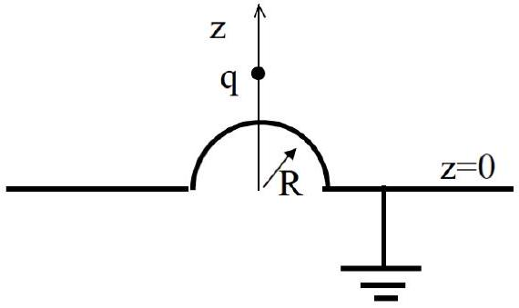

[2] Problem 4. An infinite grounded conducting plane at $z = 0$ is deformed with a hemispherical bump of radius $R$ centered at the origin, as shown. A charge $q$ is placed at $z = a$ as shown.

Can the method of images be used to find the potential in the region with the charge? If so, specify the image charges; if not, explain why not.
Solution. It can be done with three image charges, all on the $z$-axis:
    - A charge $- q$ at $z = - a$.
    - A charge $- q R / a$ at $z = R ^ { 2 } / a$.
    - A charge $q R / a$ at $z = - R ^ { 2 } / a$.

These ensure that the voltage vanishes on both the whole plane $z = 0$ and on the sphere $r = R$.

[2] Problem 5 (Purcell 3.50). A point charge $q$ is located a distance $b > r$ from the center of a nongrounded conducting spherical shell of radius $r$, which also has charge $q$. When $b$ is close to $r$, the charge is attracted to the shell because it induces negative charge; when $b$ is large the charge is clearly repelled. Find the value of $b$ so that the point charge is in equilibrium. (Hint: you should have to solve a difficult polynomial equation. You can use a calculator, or use the fact that it contains a factor of $1 - x - x ^ { 2 }$.)
Solution. The image charge $- q ^ { \prime } = - q r / b$ is at radius $r ^ { 2 } / b$. Since the sphere has total charge $q$, there must also be an image charge $q + q ^ { \prime }$ at its center. To balance forces, we must have
$$
\frac { q ^ { \prime } } { \left( b - r ^ { 2 } / b \right) ^ { 2 } } = \frac { q + q ^ { \prime } } { b ^ { 2 } } .
$$
Defining $x = r / b$, this simplifies to
$$
x = ( 1 + x ) ^ { 3 } ( 1 - x ) ^ { 2 } .
$$
Remarkably, this quintic equation factorizes as
$$
\left( 1 - x - x ^ { 2 } \right) \left( 1 + x - x ^ { 3 } \right) = 0 .
$$
The only root with $0 < x < 1$ is from the quadratic, $x = ( \sqrt { 5 } - 1 ) / 2$, giving
$$
b = \frac { 1 + \sqrt { 5 } } { 2 } r .
$$
If you didn't find the factorization, you can also solve the quintic numerically.
