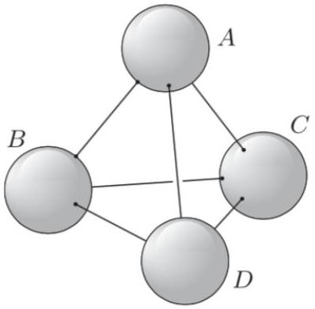

[3] Problem 6. A neutral spherical conductor of radius $R$ is placed in a uniform external field $\mathbf { E } _ { 0 }$.

(a) Since electrostatic fields must vanish inside conductors, the surface charge on the conductor must conspire to create an opposing uniform field inside it. How exactly does this happen? Specifically, explicitly find $\sigma ( \theta )$, the surface charge density as a function of the angle from $\mathbf { E } _ { 0 }$. (Hint: we're already seen an example of a suitable charge density in E1.)
(b) Now let's consider the field created by this surface charge outside the sphere. We could integrate the answer to part (a), but it's even easier to use the method of images. Suppose that the original external field $\mathbf { E } _ { 0 }$ was created by two very distant opposite point charges. Argue that the sphere picks up a dipole moment, and find its magnitude.
(c) What happens to the argument of part (b) if we instead suppose that $\mathbf { E } _ { 0 }$ was created by a single very distant point charge?

The lessons of this problem will be useful in several later handouts.
Solution. We align the $z$-axis with $\mathbf { E } _ { 0 }$ and center the sphere at the origin.

(a) In the very first problem of E1, we saw that if you take two balls of charge density $\pm \rho$ and radius $R$ and place them a small displacement d apart, then the electric field within their overlap is uniform with magnitude $\rho d / 3 \epsilon _ { 0 }$. That's exactly what we want to accomplish here, so we set $E _ { 0 } = \rho d / 3 \epsilon _ { 0 }$.
To make sure the net charge is only nonzero on a thin surface near radius $R$, we imagine sending $\rho$ to infinity and $d$ to zero. The surface charge density is then
$$
\sigma ( \theta ) = \rho d \cos \theta = 3 \epsilon _ { 0 } E _ { 0 } \cos \theta .
$$
(b) Consider a point charge $q$ at $z = - L$, and $- q$ at $z = L$ for $L \gg R$. This generates a roughly uniform electric field near the sphere with magnitude $q / 2 \pi \epsilon _ { 0 } L ^ { 2 }$. Therefore, we set $q = 2 \pi \epsilon _ { 0 } L ^ { 2 } E _ { 0 }$ to get the desired field.
By the results of problem 2, there are two image charges, which are both very close to the origin. They form a dipole with dipole moment
$$
p = 2 q ^ { \prime } L ^ { \prime } = 2 \frac { q R } { L } \frac { R ^ { 2 } } { L } = 4 \pi \epsilon _ { 0 } R ^ { 3 } E _ { 0 } .
$$
Of course, we could also have concluded this from part (a) with direct integration,
$$
p = 2 \pi \int _ { 0 } ^ { \pi } \left( R ^ { 2 } \sin \theta d \theta \right) ( R \cos \theta ) \sigma ( \theta ) = 6 \pi \epsilon _ { 0 } R ^ { 3 } E _ { 0 } \int _ { 0 } ^ { \pi } \sin \theta \cos ^ { 2 } \theta d \theta = 4 \pi \epsilon _ { 0 } R ^ { 3 } E _ { 0 }
$$
(c) We can consider a single point charge $- 2 q$ at $z = - L$, in which case we get a single point charge $2 q ^ { \prime }$ at $z = - L ^ { \prime }$. That doesn't look like what we found in part (b), but we need to remember that there's also an image charge $- 2 q ^ { \prime }$ at $z = 0$, enforcing the fact that the sphere is overall neutral. These two image charges form an image dipole with double the charge and half the displacement. It has the same dipole moment as in part (b), as it must.

[5] Problem 7 (Purcell 3.45). [A] Consider a point charge $q$ located between two parallel infinite grounded conducting planes. The planes are a distance $\ell$ apart, and the point charge is a distance $b$ from the left plane. The goal of this problem is to find the total charge induced on each plane.

(a) Argue that the total charge on each plane would not change if we replaced the point charge $q$ with two point charges $q / 2$, both a distance $b$ from the left plane. By iterating this process, convert the point charge into a uniformly charged plane, and use this to get the answer.
(b) Alternatively, using image charges, show that the electric field on the inside surface of the left plane, perpendicular to the plane, at a point a distance $r$ from the axis containing all the image charges, satisfies
$$
4 \pi \epsilon _ { 0 } E _ { \perp } = \sum _ { n = - \infty } ^ { \infty } \frac { 2 q ( 2 n \ell + b ) } { \left( ( 2 n \ell + b ) ^ { 2 } + r ^ { 2 } \right) ^ { 3 / 2 } } .
$$
(c) Since $\sigma = - \epsilon _ { 0 } E _ { \perp }$, we can integrate both sides to find the total charge on the left plane. However, the integral of each term by itself is simply $q$, so the series doesn't converge. To get the result, do the following steps in this specific order: group the terms $\pm n$ together, then integrate them only out to a distance $R \gg b$, then sum over the values of $| n |$, then take the limit $R \rightarrow \infty$. Show that this gives a finite result that matches that of part (a).

Solution. (a) Consider the induced charge distribution for one point charge $q$. By the superposition principle, the boundary conditions in this case are also satisfied if we take half that charge distribution, and center it about each of the charges $q / 2$. By uniqueness, this is the solution.

Extrapolating to infinitely many charges, we get a uniform plane of charge. For the two plates to be at the same voltage, the electric fields to the left and right of the plane must have ratio $( \ell - b ) / b$. Then the charges have the ratio $( \ell - b ) / b$ and sum to $- q$, so the charge on the left plane is $- q ( \ell - b ) / \ell$, while the charge on the right plane is $- q b / \ell$.

(b) We do this by summing over image charges. As we can see from the figure in the solution to problem 1 , there are infinitely many image charges. The $n = 0$ term in the sum corresponds to the image charge and real charge closest to the left plane. The $n = 1$ term corresponds to the two image charges a distance $2 \ell + b$ from the left plane, while the $n = - 1$ term corresponds to the image charges a distance $2 \ell - b$ from the left plane, and so on.
(c) Using $\sigma = - \epsilon _ { 0 } E _ { \perp }$, and grouping $\pm n$ terms together, the total charge on the left plane is
$$
\begin{aligned}
Q & = \int _ { 0 } ^ { \infty } \left( - \epsilon _ { 0 } E _ { \perp } \right) \cdot 2 \pi r d r \\
& = q \int _ { 0 } ^ { \infty } \left[ - \frac { b r } { \left( b ^ { 2 } + r ^ { 2 } \right) ^ { 3 / 2 } } + \sum _ { n = 1 } ^ { \infty } \left( \frac { ( 2 n \ell - b ) r } { \left( ( 2 n \ell - b ) ^ { 2 } + r ^ { 2 } \right) ^ { 3 / 2 } } - \frac { ( 2 n \ell + b ) r } { \left( ( 2 n \ell + b ) ^ { 2 } + r ^ { 2 } \right) ^ { 3 / 2 } } \right) \right] d r
\end{aligned}
$$
The first term integrates to 1 , so we will deal with the sum. Consider one term for some given $n$, and say we integrate out to some finite but large $R$. The term integrates out to
$$
f _ { n } = - \frac { 2 n \ell - b } { \sqrt { 4 n ^ { 2 } \ell ^ { 2 } + R ^ { 2 } - 4 n \ell b } } + \frac { 2 n \ell + b } { \sqrt { 4 n ^ { 2 } \ell ^ { 2 } + R ^ { 2 } + 4 n \ell b } } .
$$
Performing some careful algebra yields
$$
f _ { n } \approx \frac { 2 R ^ { 2 } b } { \left( R ^ { 2 } + 4 n ^ { 2 } \ell ^ { 2 } \right) ^ { 3 / 2 } } = \frac { 2 b } { R } \frac { 1 } { \left( 1 + ( 2 n \ell / R ) ^ { 2 } \right) ^ { 3 / 2 } } .
$$

Finally, in the limit $R \rightarrow \infty$, the sum can be written as an integral, giving

$$
\frac { 2 b } { R } \int _ { 0 } ^ { \infty } \frac { 1 } { \left( 1 + ( 2 n \ell / R ) ^ { 2 } \right) ^ { 3 / 2 } } d n = \frac { 2 b } { R } \frac { R } { 2 \ell } \int _ { 0 } ^ { \infty } \frac { d x } { \left( 1 + x ^ { 2 } \right) ^ { 3 / 2 } } = \frac { b } { \ell }
$$

Therefore, the total charge on the left plane is $- q ( 1 - b / \ell )$, matching part (a).

## Remark

The analysis in problem 7 is remarkably subtle, and about ten papers have been written about this problem in the American Journal of Physics alone. The solution above involves deforming and rearranging the terms of a nonconvergent series, which is mathematically dangerous. For instance, the Riemann rearrangement theorem tells us that in general, rearranging terms in a conditionally convergent series can give any answer.

So why does our procedure make sense? First off, the indefinite answer from part (b) is actually formally correct. The charge on the infinite planes can be anything, because we could always have charge on the planes hiding out at infinity, where it would have no effect. When we pose the question, we are implicitly asking how much charge is induced near the point charge (i.e. out to some finite distance $R \gg b$ ), while ignoring any charge at infinity.

The trick in part (a) resolves this ambiguity by extending the point charge $q$ into a distribution that also extends out to infinity, so that there's nowhere for extra charge on the infinite planes to hide. Another way to fix the problem is to replace the infinite planes with large finite ones. But if we do that, the image charge solution won't work anymore, and we won't have a way to treat the problem analytically.

On the other hand, for a very large but finite plane of size $R$, the image charge expansion will still be approximately correct for low enough $n$. Image charges with higher $n$ correspond to surface charges spread further and further out, which eventually get cut off by the plane's finite size. Thus, to mimic the effect of a finite-sized plane, we sum over $n$ while integrating out to finite $R$, erasing most of the contribution of the higher image charges. This removes the possibility of charge escaping to infinity, so we are then free to let $R \rightarrow \infty$.

This is an example of regularization: a calculation with infinite objects is elegant but not actually well-defined, so we introduce an artificial "regulator" to mimic what would happen for a finite object (where the calculation is well-defined, but too hard to do directly). This is a very important concept in modern physics, and we'll see another example in X1. The problem highlighting infinite charge distributions in E1 is an example where regularization doesn't work. There, the answer depended in detail on what regulator was chosen, so you couldn't get a unique answer by removing the regulator at the end. In general, regularization (and its accompanying concept of renormalization) is a tricky subject which requires both mathematical care and physical intuition.

## 2 Capacitors

Idea 2
There are multiple definitions of capacitance. For a single, isolated conductor with charge $Q$, the self-capacitance is defined as

$$
Q = C \phi
$$

where $\phi$ is the potential difference between the conductor and infinity. But for a set of two isolated conductors with charges $\pm Q$, you can also define a "mutual" capacitance by

$$
Q = C \phi
$$

where $\phi$ is the potential difference between the two conductors. When someone talks about a "capacitance" of two conductors, such as in idea 4, they usually mean the mutual capacitance.

Idea 3
The definitions of $C$ above are only useful when you have only one or two conductors in the problem, respectively. In a situation with more than two, it's very tricky to use the above definitions, because all the conductors will affect each other; even a neutral conductor will have an effect since there will be induced charges on its surface.

Instead, it's better to revert to more general principles. The underlying principle behind capacitance is linearity: by the principle of superposition, the charges are linearly related to the potentials. For multiple capacitors, the most general possible linear relation is

$$
Q _ { i } = \sum _ { j } C _ { i j } \phi _ { j }
$$

where conductor $i$ has charge $Q _ { i }$ and potential $\phi _ { i }$, the potential is taken to be zero at infinity, and the $C _ { i j }$ are called general coefficients of capacitance, or in electrical engineering, the Maxwell capacitance matrix. Similarly, inverting this relation,

$$
\phi _ { i } = \sum _ { j } p _ { i j } Q _ { j }
$$

where the $p _ { i j }$ are called coefficients of potential. We then calculate these coefficients by considering some appropriately selected situations, and solving a system of equations.

Computing the $C _ { i j }$ or $p _ { i j }$ explicitly is seldom useful in Olympiad problems. Instead, the point is that if you're given the charges and want the potentials, or vice versa, you can build up the answer you want using the principle of superposition.

Remark
General capacitance coefficients are discussed further in section 3.6 of Purcell. One nontrivial fact is that $C _ { i j } = C _ { j i }$, which is proven by energy conservation in problem 3.64 of Purcell. Capacitance coefficients can be clunky to work with. For example, suppose you want to

compute the familiar capacitance of a system of two conductors. By definition, we have

$$
Q _ { 1 } = C _ { 11 } \phi _ { 1 } + C _ { 12 } \phi _ { 2 } , \quad Q _ { 2 } = C _ { 21 } \phi _ { 1 } + C _ { 22 } \phi _ { 2 } .
$$

An ordinary two-plate capacitor corresponds to the special case of opposite charges on the plates, so we write $Q = Q _ { 1 } = - Q _ { 2 }$. There is a potential difference $V$ across the plates, so $\phi _ { 1 } = \phi _ { 2 } + V$, and plugging this in gives

$$
Q = \left( C _ { 11 } + C _ { 12 } \right) \phi _ { 2 } + C _ { 11 } V , \quad - Q = \left( C _ { 22 } + C _ { 21 } \right) \phi _ { 2 } + C _ { 21 } V .
$$

Eliminating $\phi _ { 2 }$ from the system of equations above, we find the familiar mutual capacitance

$$
C = \frac { Q } { V } = \frac { C _ { 11 } C _ { 22 } - C _ { 12 } ^ { 2 } } { C _ { 11 } + C _ { 22 } + 2 C _ { 12 } }
$$

where we used $C _ { 12 } = C _ { 21 }$. This is quite an inconvenient formula, so as a result we won't consider general capacitance coefficients any further, except briefly for practice in problem 11.
[2] Problem 8 (Purcell 3.21). Four parallel plates, each with large area $A$, are evenly spaced with small separation $s$. The first and third are connected by a wire, as are the second and fourth. What is the capacitance of the system?

Solution. This problem is asking about the usual notion of capacitance: there are two conductors, so we give them opposite charges and compute the ratio of charge to the voltage between them. However, it's a bit tricky to see how charge is distributed on the plates.

By symmetry, we know the surface charges are

$$
\sigma _ { 1 } , - \sigma _ { 2 } , \sigma _ { 2 } , - \sigma _ { 1 }
$$

reading left to right ( 1 to 4). The field in between plates 1 and 2 is $\sigma _ { 1 } / \epsilon _ { 0 }$, and the field between plates 2 and 3 is $\left( \sigma _ { 1 } - \sigma _ { 2 } \right) / \epsilon _ { 0 }$. Since 1 and 3 are connected, the voltage drop from 2 to 1, and from 2 to 3 must be the same, so

$$
\sigma _ { 1 } s = \left( \sigma _ { 2 } - \sigma _ { 1 } \right) s \Longrightarrow \sigma _ { 2 } = 2 \sigma _ { 1 } .
$$

Thus, the potential difference is $\sigma _ { 1 } s / \epsilon _ { 0 }$, so the capacitance is $C = Q / \phi = 3 \sigma _ { 1 } A / \left( \sigma _ { 1 } s / \epsilon _ { 0 } \right) = 3 \epsilon _ { 0 } A / s$.
There's also an easier way of thinking about this problem. Plate 1 and the left half of plate 2 form a capacitor of capacitance $\epsilon _ { 0 } A / s$, which doesn't affect anything outside. The same is true for the right half of plate 2 and the left half of plate 3, as well as the right half of plate 3 and plate 4. So we effectively have 3 such capacitors combined in parallel, giving $3 \epsilon _ { 0 } A / s$.
[2] Problem 9. Three large, conducting plates are placed parallel in zero external electric field. From left to right, the plates have total charges $Q _ { 1 } , Q _ { 2 }$, and $Q _ { 3 }$. Find the total charge on all six surfaces.

Solution. Let the charge on the left and right surface of plate $i$ be $Q _ { i } ^ { l }$ and $Q _ { i } ^ { r }$ respectively.
First, consider a Gaussian surface straddling the left surface of the left plate. The electric field on its right side is zero, and the electric field on its left side is $\left( Q _ { 1 } + Q _ { 2 } + Q _ { 3 } \right) / \left( 2 A \epsilon _ { 0 } \right)$. Therefore,

$$
Q _ { 1 } ^ { l } = \frac { Q _ { 1 } + Q _ { 2 } + Q _ { 3 } } { 2 }
$$

and from charge conservation we conclude

$$
Q _ { 1 } ^ { r } = Q _ { 1 } - Q _ { 1 } ^ { l } = \frac { Q _ { 1 } - Q _ { 2 } - Q _ { 3 } } { 2 } .
$$

Now consider a Gaussian surface whose sides are inside the left and middle plates. The flux through it is zero, so we must have

$$
Q _ { 2 } ^ { l } = - Q _ { 1 } ^ { r } = \frac { - Q _ { 1 } + Q _ { 2 } + Q _ { 3 } } { 2 } .
$$

By charge conservation again, we conclude that

$$
Q _ { 2 } ^ { r } = Q _ { 2 } - Q _ { 2 } ^ { l } = \frac { Q _ { 1 } + Q _ { 2 } - Q _ { 3 } } { 2 } .
$$

Now consider a Gaussian surface whose sides are inside the middle and right plates. By the same reasoning as before,

$$
Q _ { 3 } ^ { l } = - Q _ { 2 } ^ { r } = \frac { - Q _ { 1 } - Q _ { 2 } + Q _ { 3 } } { 2 } .
$$

Finally, by charge conservation we again have

$$
Q _ { 3 } ^ { r } = Q _ { 3 } - Q _ { 3 } ^ { l } = \frac { Q _ { 1 } + Q _ { 2 } + Q _ { 3 } } { 2 } .
$$

[2] Problem 10 (MPPP 152). Four identical metal spheres are positioned at the vertices of a regular tetrahedron, as shown.

Sphere $A$ can be raised to potential $V$ by giving it charge $4 q$. Sphere $A$ can also be raised to potential $V$ by giving it, and one of the other spheres, each charge $3 q$, or by giving it, and two of the other spheres, each charge $q ^ { \prime }$. What is $q ^ { \prime }$ ?

Solution. The key idea is linearity/superposition. By symmetry, whenever any one of the spheres is given charge $q$, then it raises its own potential by $\alpha q$ and the potentials of all the other spheres by $\beta q$, where $\alpha$ and $\beta$ are unknown coefficients. The problem tells us that

$$
4 \alpha q = 3 \alpha q + 3 \beta q = V
$$

from which we conclude that

$$
\alpha = \frac { 1 } { 4 } \frac { V } { q } , \quad \beta = \frac { 1 } { 12 } \frac { V } { q } .
$$

Now suppose that we give charge $q ^ { \prime }$ to $A$ and two other spheres. Then we have

$$
( \alpha + 2 \beta ) q ^ { \prime } = V , \quad q ^ { \prime } = \frac { 12 } { 5 } q .
$$
