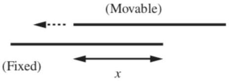

[3] Problem 11. Consider two concentric spherical metal shells, with radii $a < b$.

(a) Compute their capacitance using Gauss's law.
(b) Compute their capacitance by computing the four capacitance coefficients, verifying that $C _ { 12 } = C _ { 21 }$ along the way, and using the result for $C$ above.

Solution. (a) Let the shells have charge $\pm Q$. The field between the shells is $\left( Q / 4 \pi \epsilon _ { 0 } r ^ { 2 } \right) \hat { \mathbf { r } }$, so

$$
V = \frac { Q } { 4 \pi \epsilon _ { 0 } } \left( \frac { 1 } { a } - \frac { 1 } { b } \right) .
$$

Thus the capacitance is

$$
C = \frac { Q } { V } = 4 \pi \epsilon _ { 0 } \frac { a b } { b - a } .
$$

(b) Let the first conductor be the inner shell. If only the outer shell is charged, with charge $Q$, then $\phi _ { 1 } = \phi _ { 2 } = Q / 4 \pi \epsilon _ { 0 } b$. The general capacitance equations in this case are

$$
0 = C _ { 11 } \phi _ { 1 } + C _ { 12 } \phi _ { 2 } , \quad Q = C _ { 21 } \phi _ { 1 } + C _ { 22 } \phi _ { 2 }
$$

from which we see that

$$
C _ { 11 } + C _ { 12 } = 0 , \quad C _ { 21 } + C _ { 22 } = 4 \pi \epsilon _ { 0 } b .
$$

Now suppose only the inner shell is charged, with charge $Q$. In this case we have $\phi _ { 1 } = Q / 4 \pi \epsilon _ { 0 } a$ while $\phi _ { 2 } = Q / 4 \pi \epsilon _ { 0 } b$, so

$$
Q = C _ { 11 } \phi _ { 1 } + C _ { 12 } \phi _ { 2 } , \quad 0 = C _ { 21 } \phi _ { 1 } + C _ { 22 } \phi _ { 2 }
$$

from which we see that

$$
\frac { C _ { 11 } } { a } + \frac { C _ { 12 } } { b } = 4 \pi \epsilon _ { 0 } , \quad \frac { C _ { 21 } } { a } + \frac { C _ { 22 } } { b } = 0 .
$$

Solving these four equations for the capacitance coefficients gives

$$
C _ { 11 } = 4 \pi \epsilon _ { 0 } \frac { a b } { b - a } , \quad C _ { 12 } = C _ { 21 } = - 4 \pi \epsilon _ { 0 } \frac { a b } { b - a } , \quad C _ { 22 } = 4 \pi \epsilon _ { 0 } \frac { b ^ { 2 } } { b - a } .
$$

Plugging into the general formula, we have

$$
C = \frac { 4 \pi \epsilon _ { 0 } } { b - a } \frac { ( a b ) b ^ { 2 } - ( a b ) ^ { 2 } } { a b + b ^ { 2 } - 2 a b } = \frac { 4 \pi \epsilon _ { 0 } } { b - a } \frac { b ^ { 2 } a ( b - a ) } { b ( b - a ) } = 4 \pi \epsilon _ { 0 } \frac { a b } { b - a } .
$$

This is certainly a longer route to get to the same conclusion! (Note that in this very simple case, we actually have $C = C _ { 11 }$. That's because of the shell theorem, and it wouldn't hold in a more general situation.)
[3] Problem 12. USAPhO 2008, problem A1.
Idea 4
A two-plate capacitor with voltage difference $V$ and mutual capacitance $C$ stores energy

$$
U = \frac { 1 } { 2 } Q V = \frac { 1 } { 2 } C V ^ { 2 } .
$$

Many circuits have multiple two-plate capacitors. In general, these need to be handled with the capacitance coefficients introduced in idea 3. But in practice, capacitors used in circuits are designed to produce fields confined within themselves, so that different capacitors don't interact with each other. In that case, we can just use mutual capacitance throughout, and $C$ adds in parallel, while $1 / C$ adds in series. (But this doesn't work if, e.g. you put one capacitor inside another, in which case you should think about the charges and fields directly.)
[2] Problem 13 (Purcell 3.24). Some estimates involving capacitance.

(a) Estimate the capacitance of the Earth.
(b) Make a rough estimate of the capacitance of the human body.
(c) By shuffling over a nylon rug on a dry winter day, you can easily charge yourself up to a couple of kilovolts, as shown by the length of the spark when your hand comes too close to a grounded conductor. How much energy would be dissipated in such a spark?

Solution. (a) The Earth is a sphere of radius of order $10 ^ { 7 } \mathrm {~m}$, so

$$
C = 4 \pi \epsilon _ { 0 } r \sim 10 ^ { - 3 } \mathrm {~F} .
$$

We can make larger capacitances in the lab! Still, a huge amount of charge can be delivered to the Earth, such as by lightning strikes. This is because the voltage of the Earth is also huge, which is possible because its huge size means the corresponding electric fields aren't that big.

(b) A human is approximately a sphere of radius 0.5 m . Then the self-capacitance of the human body is $C = 4 \pi \epsilon _ { 0 } r \sim 5 \times 10 ^ { - 11 } \mathrm {~F}$.
(c) Plugging in the numbers, $U = C V ^ { 2 } / 2 \sim 10 ^ { - 4 } \mathrm {~J}$.

[2] Problem 14. The total energy can also be found by integrating the electric field energy,

$$
U = \frac { \epsilon _ { 0 } } { 2 } \int E ^ { 2 } d V
$$

(a) Show that this agrees with $U = C V ^ { 2 } / 2$ for a parallel plate capacitor.
(b) Show that this agrees with $U = C V ^ { 2 } / 2$ for a capacitor made of concentric spheres.

The general proof is more advanced; a slick method is given in problem 1.33 of Purcell.
Solution. (a) Let the plate area be $A$ and the distance between them be $d$. Then

$$
U = \frac { \epsilon _ { 0 } } { 2 } E ^ { 2 } ( A d ) = \frac { \sigma ^ { 2 } } { 2 \epsilon _ { 0 } } A d = \frac { C } { 2 } \frac { \sigma ^ { 2 } d ^ { 2 } } { \epsilon _ { 0 } ^ { 2 } } = \frac { C V ^ { 2 } } { 2 } .
$$

(b) Let the radii be $R _ { 1 }$ and $R _ { 2 }$ and the charges be $\pm Q$. The field is $Q / \left( 4 \pi \epsilon _ { 0 } r ^ { 2 } \right)$, so
$$
U = \frac { \epsilon _ { 0 } } { 2 } \int \frac { Q ^ { 2 } } { 16 \pi ^ { 2 } \epsilon _ { 0 } ^ { 2 } } \frac { d V } { r ^ { 4 } } = \frac { Q ^ { 2 } } { 32 \pi ^ { 2 } \epsilon _ { 0 } } \int _ { R _ { 1 } } ^ { R _ { 2 } } \frac { 4 \pi r ^ { 2 } d r } { r ^ { 4 } } = \frac { Q ^ { 2 } } { 8 \pi \epsilon _ { 0 } } \left( \frac { 1 } { R _ { 1 } } - \frac { 1 } { R _ { 2 } } \right) .
$$
On the other hand, this should be equal to $U = Q V / 2$, which follows directly from the result of problem 11.

[3] Problem 15 (Purcell 3.26). A parallel-plate capacitor consists of a fixed plate and a movable plate that is allowed to slide in the direction parallel to the plates. Let $x$ be the distance of overlap.

The separation between the plates is fixed. Let $C ( x )$ be the capacitance.
    (a) Assume the plates are electrically isolated, so that their charges $\pm Q$ are constant. By differentiating the energy, find the leftward force on the movable plate in terms of $Q$ and $C ( x )$.
    (b) Now assume the plates are connected to a battery, so that their potential difference $\phi$ is held constant. Find the leftward force on the movable plate, in terms of $\phi$ and $C ( x )$.
    (c) If the movable plate is held in place, the two answers above should be equal because nothing is moving. Verify that this is the case, being careful with signs.
    (d) In terms of electric fields, why is there a force on the movable plate? Does the effect invoked in the answer to this part change the conclusion of parts (a) through (c) at all?

Solution. (a) The energy as a function of $x$ is

$$
U ( x ) = \frac { Q ^ { 2 } } { 2 C }
$$

where we understand that $C$ is also a function of $x$. Thus, the force on the plate is

$$
F = - \frac { d U } { d x } = \frac { Q ^ { 2 } } { 2 } \frac { d } { d x } \left( - \frac { 1 } { C } \right) = \frac { Q ^ { 2 } } { 2 C ^ { 2 } } \frac { d C } { d x } .
$$

(b) Here, the energy is $U ( x ) = \frac { 1 } { 2 } C \phi ^ { 2 }$, so naively we have
$$
F = - \frac { d U } { d x } = - \frac { \phi ^ { 2 } } { 2 } \frac { d C } { d x } .
$$
This is negative, while the answer to part (a) is positive. The reason is that $U$ should reflect the total energy of the system - and in this case, the system must include the battery that does work to maintain the potential difference $\phi$.
Say $x$ increases by $d x$. Let the change in capacitance be $d C$, so $d Q = \phi d C$. Thus, the work the battery does is
$$
d W = \phi d Q = \phi ^ { 2 } d C .
$$
If $F$ is the net force the plate feels, we have
$$
d W = F d x + d U \Longrightarrow F = \frac { 1 } { 2 } \phi ^ { 2 } \frac { d C } { d x } .
$$
(c) Let $F _ { Q }$ be the first force, and $F _ { \phi }$ the second. We have
$$
F _ { Q } / F _ { \phi } = \frac { Q ^ { 2 } } { \phi ^ { 2 } C ^ { 2 } } = 1 .
$$
If we didn't account for the subtlety in part (b), we would have gotten -1 here.

(d) At first this seems confusing, as the field is supposed to be perfectly vertical. The resolution is that the force comes from the fringe fields, i.e. the fields right at the edges of the plates, which have a horizontal component.
Fortunately, we don't have to account for fringe fields in parts (a) through (c). They do affect the total stored energy, but as we move a plate, the region with the fringe fields just moves with the plate, while keeping the same profile, so it doesn't affect the change in energy. In other words, the force is entirely due to the fringe fields, yet the energy-based calculation doesn't have to care about the fringe fields at all. This is yet another example of how conservation laws can hand you information that's very hard to get otherwise.

## Idea 5: Dielectrics

A dielectric is an insulator which polarizes in the presence of an electric field, with positive charges displaced slightly along the field. The resulting electric dipoles distributed throughout the material in turn create a field that tends to weaken the original applied field within the material.

Each part of a dielectric polarizes based on the local electric field, but that electric field depends on the applied field, and the polarization of every other piece of the dielectric. Thus, solving for the electric field for a general dielectric geometry is very difficult, and usually not possible in closed form, just like how it's usually not possible to solve for the field of a charged conductor. In Olympiad physics, you will almost always consider highly symmetric situations, where a dielectric simply reduces the applied electric field everywhere inside by a factor of $\kappa$, called the dielectric constant. (We'll consider some trickier situations in E8.)

Consider a parallel plate capacitor with charge $\pm Q$ on each plate. If a dielectric is inserted with the charge kept the same, then the field inside is reduced by a factor of $\kappa$. Thus, the capacitance $C = Q / V$ increases by a factor of $\kappa$. Dielectrics may increase the amount of energy that can be stored in a capacitor, which is typically limited by the voltage $V _ { 0 }$ where electrical breakdown occurs. So if $V _ { 0 }$ stays the same, the maximal stored energy $U = C V _ { 0 } ^ { 2 } / 2$ goes up by a factor of $\kappa$.

Plugging in the definition of $C$, this result implies that the energy density in the capacitor is $\kappa \epsilon _ { 0 } E ^ { 2 } / 2$. But we showed in $\mathbf { E 1 }$ that the energy density of the electric field is only $\epsilon _ { 0 } E ^ { 2 } / 2$. The extra energy is stored in the dielectric material itself: it takes energy to separate positive and negative charges within the dielectric, as if we were stretching many microscopic springs. This potential energy is released when the capacitor is discharged.

## 3 Tricky Problems

Example 2: PPP 151
A closed body with conducting surface $F$ has self-capacitance $C$. The surface is now dented so that the new surface $F ^ { * }$ is entirely inside $F$. Prove that the capacitance has decreased.

Solution
The energy stored in the capacitor is $U = Q ^ { 2 } / 2 C$. Therefore, if we give the capacitor a fixed charge $Q$, proving that $F ^ { * }$ has lower $C$ is equivalent to showing that we can move the surface from $F ^ { * }$ to $F$ while only lowering the energy.

Suppose without loss of generality that $F$ is infinitesimally larger than $F ^ { * }$. (We can break any finite change into infinitesimal stages and repeat this argument.) We can go from $F ^ { * }$ to $F$ by just taking each charge on the surface and moving it outward until it hits $F$. Suppose the total charge is positive. Then we showed in E1 that the surface charge density is always nonnegative, and the electric field is always directed outward, so moving each charge lowers the energy.

At this point, the charges lie on $F$, but they don't have the right distribution, i.e. $F$ is not an equipotential. Now we let the charges spontaneously redistribute themselves so that $F$ is again an equipotential. This again lowers the energy, proving the desired result.

Example 3
Are there charge distributions that aren't spherically symmetric, but which produce an exact $\hat { \mathbf { r } } / r ^ { 2 }$ field outside of them?

Solution
If you know a bit about the multipole expansion, this might seem like a daunting question. To make the field exactly $\hat { \mathbf { r } } / r ^ { 2 }$, you need to make sure the charge distribution has no dipole moment, no quadrupole moment, no octupole moment, and so on to infinity, and it seems impossible to satisfy all of these constraints without spherical symmetry. But we have already seen an example of such a charge distribution earlier in the problem set!

Recall that when we treated the method of images for spheres, we found that in some situations, the complicated charge densities on conducting spheres were exactly the same as those produced by a fictitious image charge inside the sphere, and generally away from its center. If we place the origin at that image charge, then we have an example of a charge distribution that is perfectly $\hat { \mathbf { r } } / r ^ { 2 }$ outside the sphere, but which isn't spherically symmetric.

[2] Problem 16 (Purcell 3.9). A conducting spherical shell has charge $Q$ and radius $R _ { 1 }$. A larger concentric conducting spherical shell has charge $- Q$ and radius $R _ { 2 }$.
    (a) If the outer shell is grounded, explain why nothing happens to the charge on it.
    (b) If instead the inner shell is grounded, e.g. by connecting it to ground by a very thin wire that passes through a very small hole in the outer shell, find its final charge.
    (c) It's not so clear why charge would leave the inner shell in part (b), thinking in terms of forces. A small bit of positive charge will certainly want to hop on the wire and follow the electric field across the gap to the larger shell. But when it gets to the larger shell, it seems like it has no reason to keep going to infinity, because the field is zero outside. And, even worse, the field will point inward once some positive charge has moved away from the shells. So it seems

like the field will drag back any positive charge that has left. Does charge actually leave the inner shell? If so, what's wrong with the above reasoning?

Solution. (a) The potential at the outer shell due to itself is $- Q / 4 \pi \epsilon _ { 0 } R _ { 2 }$ and the potential due to the inner shell is $Q / 4 \pi \epsilon _ { 0 } R _ { 2 }$, so it is zero overall. Thus, the outer shell is already effectively grounded.

(b) The potential at the inner shell due to itself is $Q ^ { \prime } / 4 \pi \epsilon _ { 0 } R _ { 1 }$ and the potential to the outer shell is $- Q / 4 \pi \epsilon _ { 0 } R _ { 2 }$. Since the total must be zero, $Q ^ { \prime } = R _ { 1 } Q / R _ { 2 }$.
(c) The key mistake is that the positive charges are repelled also by the charges behind it in the wire. So yes, eventually the field due to the shells may even become inward, there is a whole line of plus charge behind a given charge that force it forward.
Another way of saying this is that a wire has negligible capacitance; like a thin metal pipe of water, it cannot store extra net charge but can only let charge move rigidly through the entire thing. It is energetically favorable for this to happen, so even if some charges don't want to move forward, their neighbors will push them forward.
