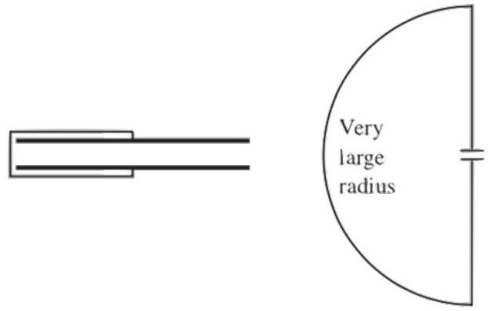

[2] Problem 17. The usual expression for the capacitance of a parallel-plate capacitor is $A \epsilon _ { 0 } / d$. However, in reality the field within the capacitor is not perfectly uniform, and there are fringe fields outside. Is the true capacitance slightly higher or lower than $A \epsilon _ { 0 } / d$ ?

Solution. For concreteness, suppose the plates are circular disks, with charge $\pm Q$, and consider the electric field along the axis of symmetry. In the naive derivation, we assume the charge density on the plates is uniform. Then we approximate the plates as infinite in order to use Gauss's law to conclude that the field inside is $\sigma / \epsilon _ { 0 } = Q / A \epsilon _ { 0 }$. This is inaccurate for two reasons:

- The plates are not actually infinite, so the field on the symmetry axis should actually be smaller.
- The charge distribution is not actually uniform. Instead, since the like charges on each plate repel each other, some charge gets pushed outward. This further decreases the field on the symmetry axis.

Therefore, the field on the symmetry axis is a bit less than $Q / A \epsilon _ { 0 }$, so the voltage drop is lower, which implies the capacitance is higher.

That's all we can say here. Even graduate textbooks won't say much about corrections to the capacitance, because the simplest calculations are quite hard. If you're curious, see this paper.
[2] Problem 18 (Purcell 4.16). In a parallel plate capacitor, the quantity $\int \mathbf { E } \cdot d \mathbf { s }$ should be equal to $V$ for any path that connects the two plates.

A charged capacitor can be discharged by attaching a wire to the external surfaces of the plates. No matter how one attaches the wire, $\int \mathbf { E } \cdot d \mathbf { s }$ along the wire should be equal to $V$. And as we've argued in problem 16, this is sufficient to cause charges to move along the wire, even if the electric field points in the "wrong" direction at some points along the wire, because the wire has negligible capacitance: charges within it move rigidly, each pushing the next one and pulling the previous one.

But it's puzzling how this works for a capacitor, because the electric field is supposed to be essentially zero just outside it. Consider two possible limiting cases for the wire's shape.

In each case, explain qualitatively how $\int \mathbf { E } \cdot d \mathbf { s }$ can be equal to $V$. In particular, how large are the contributions from the distinct segments of the wire (the horizontal and vertical parts in the first case, and the straight and curved parts in the second)?

Solution. In the first case, the horizontal parts of the wire contribute almost nothing. That's because the radial part of the electric field vanishes within the conductor plates themselves (since they must be equipotentials), and the horizontal path is right next to the plates. Therefore, the contribution is almost entirely from the vertical segment.

You might be wondering how this is possible, because at the edge of the plates, there seems to be less charge nearby, so the electric field should be smaller than near the middle of the plates. The resolution is that the surface charge density near the edge of plates is a lot higher than the surface charge density near the middle, because like charges repel.

It's interesting to compare this to the case of two parallel plates with uniform charge density. In that case, the vertical segment contributes roughly $V / 2$. To see why, consider putting a second, identical parallel plate capacitor directly to the left of the first one. Now the vertical segment is in the middle of a big capacitor, and has voltage drop $V$. So each of the two halves of that big capacitor contributes $V / 2$ to the vertical segment. However, the total voltage drop is still $V$, because for uniform charge density there are substantial horizontal fields, so that the horizontal segments contribute roughly $V / 4$ each.

In the second case, the result is due to the far-field behavior. When you zoom out, the capacitor looks like a dipole, so the field at long distances is a dipole field. Now, the dipole field falls off as $1 / r ^ { 3 }$, and the circumference of the curved part is proportional to $r$, so the contribution of this part goes as $r / r ^ { 3 } \rightarrow 0$ as $r \rightarrow \infty$. So all the contribution is from the straight part.

To see how this can be the case, note that the vertical field just above the capacitor plates is negligible; the dipole field only kicks in once we're far enough so that the plates look small, i.e. subtending a small angle from our perspective. If the plates are squares of side length $a$, this occurs at a distance of order $a$. Then a very rough estimate is

$$
\int \mathbf { E } \cdot d \mathbf { s } \sim 2 \int _ { a } ^ { \infty } \frac { p } { 2 \pi \epsilon _ { 0 } r ^ { 3 } } d r = \frac { 1 } { 2 \pi } \frac { p } { \epsilon _ { 0 } a ^ { 2 } }
$$

where $p$ is the electric dipole moment. If the plates are separated by a distance $d \ll a$, then $p = Q d = \sigma a ^ { 2 } d$, giving

$$
\frac { 1 } { 2 \pi } \frac { p } { \epsilon _ { 0 } a ^ { 2 } } = \frac { 1 } { 2 \pi } \frac { \sigma d } { \epsilon _ { 0 } } = \frac { V } { 2 \pi }
$$

which is on the order of the voltage $V$ across the capacitor plates. Of course, we didn't get precisely $V$ because we made a lot of approximations in the calculation, but this illustrates the conceptual point: the full integral of $\mathbf { E } \cdot d \mathbf { s }$ can indeed be equal to $V$, and most of the contribution to this integral comes from the part of the vertical wire which is a distance of order $a$ from the capacitor.

[3] Problem 19. USAPhO 2022, problem A2. A computational problem involving surface tension.
