## Electromagnetism III: Magnetostatics

Chapters 4 and 6 of Purcell cover DC circuits and magnetostatics, as does chapter 5 of Griffiths. For advanced circuits techniques, see chapter 9 of Wang and Ricardo, volume 2. Chapter 5 of Purcell famously derives magnetic forces from Coulomb's law and relativity. It's beautiful, but not required to understand chapter 6; we will cover relativistic electromagnetism in depth in R3. For further discussion, see chapters II-12 through II-15 of the Feynman lectures. There is a total of 81 points.

## 1 Static DC Circuits

We continue with DC circuits, in more complex setups than in E2.
Idea 1
When analyzing circuits, it is sometimes useful to parametrize the currents in the circuits in terms of the current in each independent loop. This is typically more efficient, because it enforces Kirchhoff's junction rule automatically, leading to fewer equations.

Example 1: Imbalanced Wheatstone Bridge
Find the current through the following circuit, if the battery has voltage $V$.
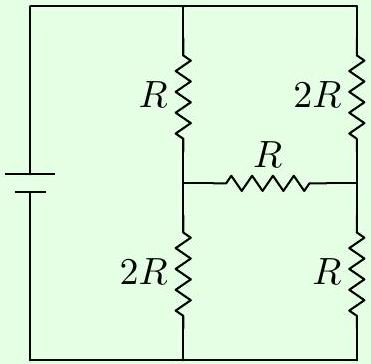

Solution
This circuit can't be simplified using series and parallel combinations, so instead we use Kirchhoff's rules directly. From the diagram, we see the circuit has three loops. Let $I _ { 1 }$ be the clockwise current on the left loop, $I _ { 2 }$ be the clockwise current through the top-right loop, and $I _ { 3 }$ be the clockwise current through the bottom-right loop. For instance, this means that the current flowing downward through the top-left resistor is $I _ { 1 } - I _ { 2 }$.

The three Kirchhoff's loop rule equations are

$$
\begin{aligned}
3 I _ { 1 } R - I _ { 2 } R - 2 I _ { 3 } R = & V , \\
4 I _ { 2 } R - I _ { 1 } R - I _ { 3 } R = & 0 , \\
4 I _ { 3 } R - 2 I _ { 1 } R - I _ { 2 } R = & .
\end{aligned}
$$

Adding the last two equations shows that

$$
I _ { 1 } = I _ { 2 } + I _ { 3 }
$$

and plugging this back in shows that $3 I _ { 2 } = 2 I _ { 3 }$, so we have

$$
I _ { 2 } = \frac { 2 } { 5 } I _ { 1 } , \quad I _ { 3 } = \frac { 3 } { 5 } I _ { 1 } .
$$

Since the answer to the question is just $I _ { 1 }$, we can now plug this back into the first equation,

$$
\frac { V } { R } = 3 I _ { 1 } - I _ { 2 } - 2 I _ { 3 } = \left( 3 - \frac { 2 } { 5 } - \frac { 6 } { 5 } \right) I _ { 1 } = \frac { 7 } { 5 } I _ { 1 } .
$$

This gives the answer, $5 V / 7 R$.
Incidentally, the Wheatstone bridge is a famous circuit with the same topology. We note that the current through the middle resistor is zero when the ratios between the top and bottom resistances match on both sides of it. Hence if three of these outer resistances are known, we can adjust one of them until the current through the middle resistor vanishes, thereby measuring the fourth resistor.

Idea 2
Since Kirchhoff's loop equations are linear, currents and voltages in a DC circuit with multiple batteries can be found by superposing the currents and voltages due to each battery alone.

Idea 3: Thevenin's Theorem and Norton's Theorem
Consider any system of batteries and resistors, with two external terminals $A$ and $B$. Suppose that when a current $I$ is sent into $A$ and out of $B$, then a voltage difference $V = V _ { A } - V _ { B }$ appears. From an external standpoint, the function $V ( I )$ is all we can measure.

Now, by the linearity of Kirchhoff's rules, $V ( I )$ is a linear function, so we can write

$$
V ( I ) = V _ { \mathrm { eq } } + I R _ { \mathrm { eq } } .
$$

In other words, $V ( I )$ is exactly the same as if the entire system were a resistor $R _ { \mathrm { eq } }$ in series with a battery with emf $V _ { \mathrm { eq } }$ (with the positive end pointing towards $A$ ). This generalizes the idea of replacing a system of resistors with an equivalent resistance, and is known as Thevenin's theorem.

We can also flip this around. Note that $I ( V )$ must also be a linear function, and we can write

$$
I ( V ) = I _ { \mathrm { eq } } + \frac { V } { R _ { \mathrm { eq } } }
$$

This is precisely the $I ( V )$ of an ideal current source $I _ { \mathrm { eq } }$ (sending current towards $B$ ) in parallel with a resistor $R _ { \mathrm { eq } }$. (An ideal current source makes a fixed current flow through it, just like a battery creates a fixed voltage across it.) This is known as Norton's theorem.

Since these functions are inverses of each other, you can see that the $R _ { \mathrm { eq } }$ 's in both equations above are the same (both are equal to the ordinary equivalent resistance), and $V _ { \mathrm { eq } } = - I _ { \mathrm { eq } } R _ { \mathrm { eq } }$.

Example 2
Consider some batteries connected in parallel, with emfs $\mathcal { E } _ { i }$ and internal resistances $R _ { i }$. What is the Thevenin equivalent of this circuit?

Solution
The equivalent resistance is simply

$$
R _ { \mathrm { eq } } = \left( \sum _ { i } \frac { 1 } { R _ { i } } \right) ^ { - 1 } .
$$

To infer $V _ { \text {eq } }$, we just need one more $V ( I )$ value. The most convenient is to set $V = 0$, shorting all of the batteries. Each battery alone would produce a current of $\mathcal { E } _ { i } / R _ { i }$, so

$$
0 = V _ { \mathrm { eq } } - \left( \sum _ { i } \frac { \mathcal { E } _ { i } } { R _ { i } } \right) R _ { \mathrm { eq } } .
$$

Thus, we have

$$
V _ { \mathrm { eq } } = \left( \sum _ { i } \frac { \mathcal { E } _ { i } } { R _ { i } } \right) \left( \sum _ { j } \frac { 1 } { R _ { j } } \right) ^ { - 1 } .
$$

Remark
With ideal batteries, it's easy to set up circuits that don't make any sense.
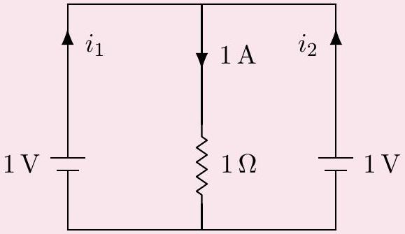
For example, in the above circuit, Kirchhoff's rules don't determine the currents; they only say that $i _ { 1 } + i _ { 2 } = 1 \mathrm {~A}$. If the emfs of the batteries were different, the situation would be even worse: the equations would be contradictory, with no solution at all! In real life, this is avoided because all batteries have some internal resistance. Adding such a resistance to each battery, no matter how small, resolves the problem and gives a unique solution.
[2] Problem 1 (Purcell 4.12). Consider the circuit below.

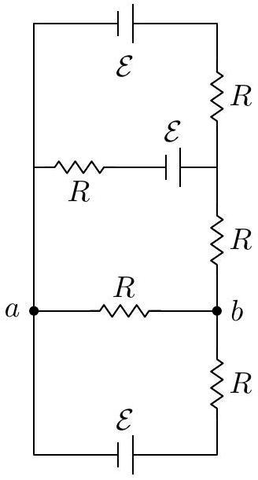

(a) Find the potential difference between points $a$ and $b$.
(b) Find the equivalent Thevenin resistance and emf between points $a$ and $b$.

Solution. (a) We'll use loop currents, with positive being clockwise. Let the loop currents be $I _ { 1 } , I _ { 2 } , I _ { 3 }$, from top to bottom. We see that

$$
\begin{aligned}
\mathcal { E } - \mathcal { E } - 2 R I _ { 1 } + R I _ { 2 } & = 0 \\
\mathcal { E } - 3 R I _ { 2 } + R I _ { 3 } + R I _ { 1 } & = 0 \\
- \mathcal { E } - 2 R I _ { 3 } + R I _ { 2 } & = 0 ,
\end{aligned}
$$

or

$$
\begin{aligned}
I _ { 2 } & = 2 I _ { 1 } \\
3 I _ { 2 } - I _ { 3 } - I _ { 1 } & = \mathcal { E } / R \\
I _ { 2 } - 2 I _ { 3 } & = \mathcal { E } / R .
\end{aligned}
$$

This can be solved to give $I _ { 1 } = \mathcal { E } / 8 R , I _ { 2 } = \mathcal { E } / 4 R$, and $I _ { 3 } = - 3 \mathcal { E } / 8 R$. We see that $V _ { b } - V _ { a } =$ $\left( I _ { 2 } - I _ { 3 } \right) R = 5 \mathcal { E } / 8$.

(b) We'll do this in two ways for variety. First, note that we already found the voltage between $a$ and $b$ in part (a), and this is precisely the Thevenin emf, $V _ { \text {eff } } = 5 \mathcal { E } / 8$. The Thevenin resistance is simply the equivalent resistance between $a$ and $b$. By a straightforward application of the series and parallel rules, this is $R _ { \text {eff } } = 3 R / 8$.
Second, suppose we short points $a$ and $b$ with a wire. Then by Thevenin's theorem, the current flowing through that wire should be $I = V _ { \text {eff } } / R _ { \text {eff } }$. We already know $V _ { \text {eff } }$ from part (a). To compute the current, we just use Kirchhoff's loop rules again; these are now as follows.
$$
\begin{array} { r }
\mathcal { E } - \mathcal { E } - 2 R I _ { 1 } + R I _ { 2 } = 0 \\
\mathcal { E } - 2 R I _ { 2 } + R I _ { 1 } = 0 \\
- \mathcal { E } - R I _ { 3 } = 0
\end{array}
$$
Solving these equations gives $I _ { 1 } = \mathcal { E } / 3 R , I _ { 2 } = 2 \mathcal { E } / 3 R$, and $I _ { 3 } = - \mathcal { E } / R$. The current through the wire is now $I _ { 2 } - I _ { 3 } = 5 \mathcal { E } / 3 R$. Thus, $R _ { \text {eff } } = ( 5 \mathcal { E } / 8 ) / ( 5 \mathcal { E } / 3 R ) = 3 R / 8$.

[2] Problem 2 (Wang). A circuit containing batteries and resistors has two terminals. When an ideal ammeter is connected between them, the reading is $I _ { 1 }$. When a resistor $R$ is connected between them, the current through the resistor is $I _ { 2 }$, in the same direction. What would be the reading $V$ of an ideal voltmeter connected between them?
Solution. We consider the Thevenin equivalent, i.e. the function $V ( I )$. The first piece of information tells us that when $V = 0 , I = I _ { 1 }$. The second tells us that when $V = - I _ { 2 } R$, then $I = I _ { 2 }$. Thus,
$$
0 = V _ { \mathrm { eq } } + I _ { 1 } R _ { \mathrm { eq } } , \quad - I _ { 2 } R = V _ { \mathrm { eq } } + I _ { 2 } R _ { \mathrm { eq } } .
$$
Solving this system of equations gives
$$
V _ { \mathrm { eq } } = \frac { I _ { 1 } I _ { 2 } R } { I _ { 2 } - I _ { 1 } } , \quad R _ { \mathrm { eq } } = \frac { I _ { 2 } R } { I _ { 1 } - I _ { 2 } } .
$$
When an ideal voltmeter is connected, we have $I = 0$, so
$$
V = V _ { \mathrm { eq } } = \frac { I _ { 1 } I _ { 2 } R } { I _ { 2 } - I _ { 1 } } .
$$
Note that your answer may differ by a harmless sign, which ultimately depends on your sign conventions for $I _ { 1 }$ and $I _ { 2 }$ (i.e. which terminal is $A$ and which terminal is $B$ ).
[3] Problem 3. USAPhO 2015, problem A2.
Now we give a few problems on current flow through continuous objects. Fundamentally, all one needs for these problems is the definition $\mathbf { J } = \sigma \mathbf { E }$, and superposition.

Example 3
Consider two long, coaxial cylindrical shells of radii $a < b$ and length $L$. The volume between the two shells is filled with material with conductivity $\sigma ( r ) = k / r$. What is the resistance between the shells, and the charge density?

Solution
To find the resistance, we compute the current $I$ when a voltage $V$ is applied between the shells. By symmetry, in the steady state the current density must be

$$
\mathbf { J } ( \mathbf { r } ) = \frac { I } { 2 \pi r L } \hat { \mathbf { r } } .
$$

On the other hand, we also know that

$$
V = \int \mathbf { E } \cdot d \mathbf { r } = \int _ { a } ^ { b } \frac { I } { 2 \pi r L \sigma } d r = \frac { I ( b - a ) } { 2 \pi k L }
$$

from which we conclude

$$
R = \frac { b - a } { 2 \pi k L } .
$$

Note that the radial electric field between the shells is constant, so

$$
\mathbf { E } ( \mathbf { r } ) = \frac { V } { b - a } \hat { \mathbf { r } } .
$$

To find the charge density, it's quickest to use Gauss's law in differential form in cylindrical coordinates. We use the form of the divergence derived in E1, giving

$$
\rho = \epsilon _ { 0 } \nabla \cdot \mathbf { E } = \frac { \epsilon _ { 0 } } { r } \frac { \partial \left( r E _ { r } \right) } { \partial r } = \frac { \epsilon _ { 0 } } { r } \frac { V } { b - a } .
$$

It might be surprising that $\rho$ is nonzero. That's because in most textbook examples the conductivity is uniform, so that $\nabla \cdot \mathbf { E } = \nabla \cdot ( \mathbf { J } / \sigma ) = ( \nabla \cdot \mathbf { J } ) / \sigma = 0$. In that case there can only be charge on the surfaces of conductors.
[2] Problem 4 (Cahn). A washer is made of a material of resistivity $\rho$. It has a square cross section of length $a$ on a side, and its outer radius is $2 a$. A small slit is made on one side and wires are connected to the faces exposed.
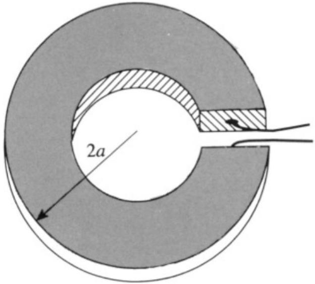
Since the washer has an irregular shape, the current distribution inside it is complicated: it spreads out from the first wire, goes around the washer, and converges into the second wire. However, the situation is simpler if we glue a perfectly conducting square plate, of side length $a$, to each exposed face. Find the resistance in this case.

Solution. Since the plates are conducting, the potential doesn't depend on the radius $r$ at the plates themselves, so by rotational symmetry, it doesn't depend on $r$ anywhere in the washer. Therefore, there is no radial current; all the current flows tangentially, so we can think of the washer as a set of radial rings in parallel.

Split the washer into a bunch of radial rings with width $d r$. We see that $r$ ranges from $a$ to $2 a$. Each little ring has resistance $\rho ( 2 \pi r ) / ( a d r )$, and they are all effectively connected in parallel. Thus,

$$
\frac { 1 } { R } = \frac { 1 } { \rho } \int _ { a } ^ { 2 a } d r \frac { a } { 2 \pi r } = \frac { 1 } { \rho } \frac { a } { 2 \pi } \log 2
$$

which implies $R = ( 2 \pi / \log 2 ) \rho / a$.
[3] Problem 5 (BAUPC 1995). An electrical signal can be transferred between two metallic objects buried in the ground, where the current passes through the Earth itself. Assume that these objects are spheres of radius $r$, separated by a horizontal distance $L \gg r$, and suppose both objects are buried a depth much greater than $L$ in the ground. If the Earth has uniform resistivity $\rho$, find the approximate resistance between the terminals. (Hint: consider the superposition principle.)

Solution. We can consider one object at a time, and then use superposition to find the combined effect of both. Suppose that current $I$ comes out from one of the objects. Placing this object at the origin, we have

$$
\mathbf { J } = \frac { I } { 4 \pi r ^ { 2 } } \hat { \mathbf { r } } , \quad \mathbf { E } = \frac { \rho I } { 4 \pi r ^ { 2 } } \hat { \mathbf { r } } .
$$

Therefore, the potential difference between this object and where the other object would be is

$$
V = \frac { \rho I } { 4 \pi } \int _ { r } ^ { L } \frac { d r } { r ^ { 2 } } \approx \frac { \rho I } { 4 \pi r }
$$

where we used $r \ll L$. Finally, the other object takes in current $I$, with its J, E, and $V$ superposing with the first object. Thus, the total potential difference is $\rho I / 2 \pi r$, so

$$
R = \frac { V } { I } = \frac { \rho } { 2 \pi r } .
$$

[3] Problem 6 (PPP 162). A plane divides space into two halves. One half is filled with a homogeneous conducting medium, and physicists work in the other. They mark the outline of a square of side $a$ on the plane and let a current $I _ { 0 }$ in and out at two of its neighboring corners. Meanwhile, they measure the potential difference $\Delta V$ between the two other corners.
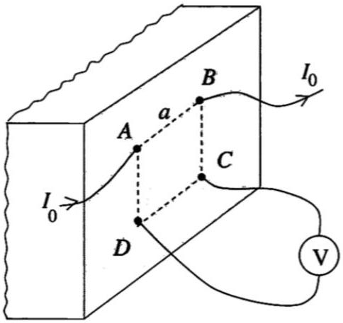
Find the resistivity $\rho$ of the medium.
Solution. The surface of the plane enforces the boundary condition $\mathbf { J } \cdot \hat { \mathbf { n } } = 0$, since current can't come out of it, which is equivalent to setting $\mathbf { E } \cdot \hat { \mathbf { n } } = 0$. Then the uniqueness theorems in E1 apply.

Now, for simplicity, suppose there is only current coming in at $A$. Then one possible solution is that J points radially outward from $A$ and has (hemi)spherical symmetry, with magnitude

$$
J \cdot 2 \pi r ^ { 2 } = I _ { 0 } \Longrightarrow J = \frac { I _ { 0 } } { 2 \pi r ^ { 2 } } .
$$

This obeys the boundary condition, so it must be the unique solution. In this case,

$$
\mathbf { E } = \frac { I _ { 0 } } { 2 \pi \sigma r ^ { 2 } } \hat { \mathbf { r } }
$$

where $\sigma$ is the conductivity of the material, which implies

$$
V _ { D } - V _ { C } = \int _ { a } ^ { \sqrt { 2 } a } \frac { I _ { 0 } } { 2 \pi \sigma r ^ { 2 } } d r = \frac { I _ { 0 } } { 2 \pi \sigma a } ( 1 - 1 / \sqrt { 2 } ) .
$$

Similarly, for the case where the current is coming out of $B$, we have

$$
V _ { D } - V _ { C } = \frac { I _ { 0 } } { 2 \pi \sigma a } ( 1 - 1 / \sqrt { 2 } ) .
$$

The actual voltage drop is the superposition of the two,

$$
\Delta V = \frac { I _ { 0 } \rho } { 2 \pi a } ( 2 - \sqrt { 2 } )
$$

where $\rho = 1 / \sigma$ is the resistivity. Then $\rho$ can be calculated as

$$
\rho = \frac { 2 \pi a \Delta V } { I _ { 0 } ( 2 - \sqrt { 2 } ) } = \frac { \pi a ( 2 + \sqrt { 2 } ) \Delta V } { I _ { 0 } } .
$$

[3] Problem 7 (MPPP 174). We aim to measure the resistivity of the material of a large, thin, homogeneous square metal plate, of which only one corner is accessible. To do this, we chose points A, B, C and D on the side edges of the plate that form the corner.
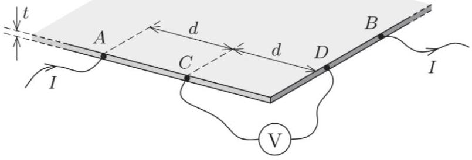
Points A and B are both $2 d$ from the corner, whereas C and D are each a distance $d$ from it. The length of the plate's sides is much greater than $d$, which, in turn, is much greater than the thickness $t$ of the plate. If a current $I$ enters the plate at point A , and leaves it at B , then the reading on a voltmeter connected between C and D is $V$. Find the resistivity $\rho$ of the plate material.

Solution. This problem is a harder than the previous one because it's harder to guess a current configuration that satisfies the boundary conditions, i.e. that the current density at the edges of the plate is parallel to the plate. The key is that we can use the following "image current" configuration to automatically satisfy the original problem's boundary conditions, but on an infinite plate.
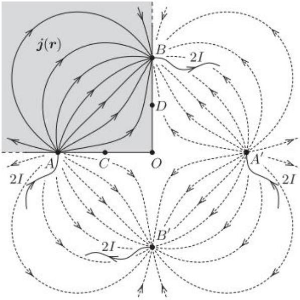

We have a new current source and sink respectively at the reflections of $A$ and $B$ in $O$. The current sources and sinks all have magnitude $2 I$, rather than $I$, because only half of the currents at $A$ and $B$ actually enter and exit the physical plate, shaded in gray.

Now, if a current $2 I$ enters the plate, the current at a distance $r$ is $\frac { 2 I } { 2 \pi r t }$, so the electric field at a distance $r$ is $\frac { \rho I } { \pi r t }$ (pointing radially outward), so the potential is $\frac { \rho I } { \pi t } \log \left( r _ { 0 } / r \right)$ for some arbitrary $r _ { 0 }$, which we'll take to be the same for all current sources and sinks. Then

$$
V _ { C } = \frac { \rho I } { \pi t } \left( \log \left( r _ { 0 } / d \right) + \log \left( r _ { 0 } / 3 d \right) - 2 \log \left( r _ { 0 } / \sqrt { 5 } d \right) \right) = \frac { \rho I } { \pi t } \log ( 5 / 3 ) .
$$

By symmetry, $V _ { C } = - V _ { D }$. Thus,

$$
V = 2 V _ { C } = \frac { 2 \rho I } { \pi t } \log ( 5 / 3 ) , \quad \rho = \frac { \pi t } { 2 \log ( 5 / 3 ) } \frac { V } { I } .
$$

Remark
Setups like those in the previous two problems are commonly used to measure resistivities, but why do they use a complicated "four terminal" setup? Wouldn't it have been easier to just attach two terminals, send a current $I$ through them, and measure the voltage drop $V$ ? The problem with this is that it also picks up the resistance $R$ of the contacts between the terminals and the material, along with the resistances of the wires. By having a pair of terminals measure voltage alone, drawing negligible current, we avoid this problem.

[4] Problem 8. [A] This problem is just for fun; the techniques used here are too advanced to appear on Olympiads. We will prove Rayleigh's monotonicity law, which states that increasing the resistance of any part of a resistor network increases the equivalent resistance between any two points. This may seem obvious, but it's actually tricky to prove. The following is the slickest way.
    (a) Consider a graph of resistors, where a battery is attached across two of the vertices, fixing their voltages. Write an expression for the total power dissipated, assuming the voltages at each vertex are $V _ { i }$ and the resistances are $R _ { i j }$.
    (b) The voltages $V _ { i }$ at all the other vertices are determined by Kirchhoff's rules. But suppose you didn't know that, or didn't want to set up those equations. Remarkably, it turns out that you can derive the exact same results by simply treating the voltages $V _ { i }$ as free to vary, and setting them to minimize the total power dissipated! Show this result. (This is an example of a variational principle, like the principle of least action in mechanics.)
    (c) For any network of resistors, show that $P = V ^ { 2 } / R$ when $V$ is the battery voltage applied across two vertices, $R$ is the equivalent resistance between them, and $P$ is the total power dissipated in the resistors. (This is intuitive, but it's worth showing in detail to assist with the next part.)
    (d) By combining all of these results, prove Rayleigh's monotonicity law.
    (e) We can use Rayleigh's monotonicity law to prove some mathematical results. Consider the resistor network shown below, where the variables label the resistances.

By considering the resistances before and after closing the switch $P Q$, show that the arithmetic mean of two numbers is at least the geometric mean.

(f) Consider the resistor network shown below.

By closing all the switches, show that the arithmetic mean of $n$ numbers is at least the harmonic mean.

Solution. (a) The power is

$$
P = \sum _ { i < j } \frac { \left( V _ { i } - V _ { j } \right) ^ { 2 } } { R _ { i j } } .
$$

Here the sum over $i < j$ counts all pairs of vertices once. If there is no direct connection between $i$ and $j$, the resistance $R _ { i j }$ is infinite.

(b) The power is minimized when its derivative is zero, and we are free to vary all voltages except for the two points where the battery is connected. Let $V _ { i }$ be one of these voltages. Then
$$
\frac { \partial P } { \partial V _ { i } } = \sum _ { j \neq i } \frac { 2 \left( V _ { i } - V _ { j } \right) } { R _ { i j } } = 0 .
$$
Now compare this to how we would solve the problem using Kirchhoff's laws. The fact that the sum of the voltage drops along a loop is zero is already accounted for, because we already have specified the voltages at each vertex. The only new equations we would write down would be charge conservation at each vertex,
$$
\sum _ { j \neq i } I _ { i j } = 0 .
$$
However, applying Ohm's law, we see this is precisely the equation that power minimization has given us!
(c) By the definition of the equivalent resistance, $V = I R$ where $I$ is the total current going through the circuit. By the definition of power, the power put in by the battery is $P = I V$, since any current going through the circuit must go through the battery. By conservation of energy, the power dissipated in the circuit is equal to the power put in by the battery. So the power dissipated is $P = I V = V ^ { 2 } / R$.

(d) Put a battery of voltage $V$ across the points we are considering. By part (c) Rayleigh's monotonicity law is equivalent to the statement that, if we increase any of the $R _ { i j }$, the total power $P$ dissipated in the resistor network goes down.
We can account for the effect of increasing one of the $R _ { i j }$ in two steps. First, suppose we do so while artificially keeping all the voltages $V _ { i }$ constant. Then by part (a), $P$ decreases. Second, in reality the voltages quickly rearrange themselves to satisfy Kirchhoff's laws, which we saw in part (b) is equivalent to minimizing the power. So this further rearrangement can only further decrease $P$. This shows the desired result.
(e) Before closing the switch, the resistance is
$$
R _ { i } = \frac { a + b } { 2 } .
$$
After closing the switch, the resistance is
$$
R _ { f } = 2 \left( \frac { 1 } { a } + \frac { 1 } { b } \right) ^ { - 1 } = \frac { 2 a b } { a + b } .
$$
Closing the switch is equivalent to decreasing $R _ { P Q }$ from infinity to zero, so $R _ { f } \leq R _ { i }$ by Rayleigh's monotonicity law. This gives
$$
\sqrt { a b } \leq \frac { a + b } { 2 }
$$
which is the AM-GM inequality.
(f) Before closing the switches,
$$
R _ { i } = \frac { 1 } { n } \sum _ { i } a _ { i }
$$
which is the arithmetic mean. After closing the switches,
$$
R _ { f } = n \left( \sum _ { i } \frac { 1 } { a _ { i } } \right) ^ { - 1 }
$$
which is the harmonic mean. Thus, the arithmetic mean is at least the harmonic mean.

## Remark

You might think that Rayleigh's monotonicity law is too obvious to require a proof; if you decrease a resistance, how could the net resistance possibly go up? In fact, this kind of non-monotonicity occurs very often! For example, Braess's paradox is the fact that adding more roads can slow down traffic, even when the total number of cars stays the same. A U.S. Physics Team coach has argued that allowing more team strategies can make a basketball team score less. For more on this subject, see the paper Paradoxical behaviour of mechanical and electrical networks or this video.

Remark
Circuit questions can get absurdly hard, but at some point they start being more about mathematical tricks than physics. As a result, I haven't included any such problems here; they tend not to appear on the USAPhO or IPhO, or in college physics, or in real life, or really anywhere besides a few competitions. On the other hand, you might find such questions fun! For some examples, see the Physics Cup problems 2013.6, 2017.2, 2018.1, and 2019.4.

## 2 RC Circuits

Next we'll briefly cover RC circuits, our first exposure to a situation genuinely changing in time.
Example 4: CPhO
The capacitors in the circuit shown below were initially neutral. Then, the circuit is allowed to reach the steady state.

After a long time, what is the charge stored on the 10 mF capacitor?

Solution
After a long time, no current flows through the capacitors, so there is effectively a single loop in the circuit. It has a total resistance $60 \Omega$ and a total emf 6 V , so the current is $I = 0.1 \mathrm {~A}$. Using this, we can straightforwardly label the voltages everywhere on the outer loop.

To finish the problem, we need to know the voltage $V _ { 0 }$ of the central node, so we need one more equation. That equation is charge conservation. We note that the central part of the circuit, containing the inner plates of the three capacitors, begins uncharged and is not directly connected to anything else, so it must remain uncharged. (Charge can't move through a capacitor!) Suppressing units, this means

$$
20 \left( 26 - V _ { 0 } \right) + 20 \left( 7 - V _ { 0 } \right) + 10 \left( 0 - V _ { 0 } \right) = 0 , \quad V _ { 0 } = \frac { 66 } { 5 } \mathrm {~V}
$$

from which we read off the answer,

$$
Q = C V = 0.132 \mathrm { C } .
$$

[3] Problem 9. USAPhO 1997, problem A3.

[3] Problem 10 (Purcell 4.18). Consider the two RC circuits below.

    (a) The circuit shown below contains two identical capacitors and two identical resistors, with initial charges as shown above at left. If the switch is closed at $t = 0$, find the charges on the capacitors as functions of time.
    (b) Now consider the same setup with an extra resistor, as shown above at right. Find the maximum charge that the right capacitor achieves. (Hint: the methods of M4 can be useful.)

Solution. (a) Let the two loop currents be $I _ { 1 }$ and $I _ { 2 }$, both counterclockwise. The loop equations are $Q _ { 1 } / C = I _ { 1 } R$ and $Q _ { 2 } / C = I _ { 2 } R$. We also have $I _ { k } = - \dot { Q } _ { k }$. Thus, $Q _ { k } + R C \dot { Q } _ { k } = 0$ for $k = 1,2$. Based on the initial conditions, we see then that the solutions are $Q _ { 1 } ( t ) = Q _ { 0 } e ^ { - t / R C }$ and $Q _ { 2 } ( t ) = 0$. (The simple reason $Q _ { 2 } ( t )$ is zero is because the middle wire effectively shorts out the right half of the circuit.)

(b) Again, with the same setup of variables, we get that
$$
\begin{aligned}
& Q _ { 1 } / C - 2 I _ { 1 } R + I _ { 2 } R = 0 \\
& Q _ { 2 } / C - 2 I _ { 2 } R + I _ { 1 } R = 0 .
\end{aligned}
$$
This is a system of two linear differential equations, which can be solved using the methods of M4. However, in this case we can just add and subtract the equations, giving
$$
\left( Q _ { 1 } + Q _ { 2 } \right) / C - \left( I _ { 1 } + I _ { 2 } \right) R = 0 , \quad \left( Q _ { 1 } - Q _ { 2 } \right) / C - 3 \left( I _ { 1 } - I _ { 2 } \right) R = 0 .
$$
That is, the sum of the two acts like an RC circuit with time constant $R C$, while the difference acts like one with time constant $3 R C$. (These are the "normal modes".) By superposing these solutions and fitting the initial conditions, we get
$$
Q _ { 1 } ( t ) = \frac { Q _ { 0 } } { 2 } \left( e ^ { - t / R C } + e ^ { - t / 3 R C } \right) , \quad Q _ { 2 } ( t ) = \frac { Q _ { 0 } } { 2 } \left( e ^ { - t / R C } - e ^ { - t / 3 R C } \right) .
$$

We want to maximize $\left| Q _ { 2 } \right|$, so setting the derivative to zero gives $t = \frac { 3 } { 2 } R C \log ( 3 )$, so

$$
\left| Q _ { 2 } \right| _ { \max } = \frac { Q _ { 0 } } { 3 \sqrt { 3 } } .
$$

[3] Problem 11. USAPhO 2004, problem A1.
[3] Problem 12 (Kalda). Three identical capacitors are placed in series and charged with a battery of $\operatorname { emf } \mathcal { E }$. Once they are fully charged, the battery is removed, and simultaneously two resistors are connected as shown.

Find the heat dissipated on each of the resistors after a long time.
Solution. Letting $q _ { 0 } = \mathcal { E } C / 3$, the initial charges on the six plates are $q _ { 0 } , - q _ { 0 } , q _ { 0 } , - q _ { 0 } , q _ { 0 }$, and $- q _ { 0 }$. After a long time, let the charges on the plates be $q _ { 1 } , - q _ { 1 } , q _ { 2 } , - q _ { 2 } , q _ { 3 } , - q _ { 3 }$. Note that all currents are 0 now, so we may effectively ignore the resistors and treat the wires as zero resistance. Therefore, the potential at points connected by wires is the same, so $q _ { 1 } = - q _ { 2 } = q _ { 3 }$. Also, by charge conservation on the two disjoint pieces $\left( q _ { 1 } , - q _ { 2 } , q _ { 3 } \right.$ and $\left. - q _ { 1 } , q _ { 2 } , - q _ { 3 } \right)$, we see
$$
q _ { 1 } - q _ { 2 } + q _ { 3 } = q _ { 0 } ,
$$
which implies $\left| q _ { 1 } \right| = \left| q _ { 2 } \right| = \left| q _ { 3 } \right| = \mathcal { E } C / 9$. The energy is $\sum \frac { 1 } { 2 } Q ^ { 2 } / C$, so the charges dropping by a factor of 3 means we lose 8/9 of the original total energy. Then by symmetry, each resistor dissipates 4/9 of the original total energy. This is
$$
\frac { 4 } { 9 } \cdot 3 \cdot \frac { ( \mathcal { E } C / 3 ) ^ { 2 } } { 2 C } = \frac { 2 } { 27 } \mathcal { E } ^ { 2 } C .
$$
[2] Problem 13 (Kalda). Find the time constant of the RC circuit shown below.

Solution. For the purposes of computing the time constant, it is equivalent to assume the capacitor is already charged, then take out the battery and see how it discharges. Thus all that matters is the resistance between the capacitor plates, which is
$$
R = R _ { 1 } + \frac { R _ { 2 } R _ { 3 } } { R _ { 2 } + R _ { 3 } } = \frac { R _ { 1 } R _ { 2 } + R _ { 1 } R _ { 3 } + R _ { 2 } R _ { 3 } } { R _ { 2 } + R _ { 3 } } ,
$$
so $\tau = C \frac { R _ { 1 } R _ { 2 } + R _ { 1 } R _ { 3 } + R _ { 2 } R _ { 3 } } { R _ { 2 } + R _ { 3 } }$.

[3] Problem 14 (MPPP 175/176). A metal sphere of radius $R$ has charge $Q$ and hangs on an insulating cord. It slowly loses charge because air has a conductivity $\sigma$. In all cases, neglect any magnetic or radiation effects.
    (a) Find the time $t$ for the charge to halve.
    (b) By dimensional analysis, $t$ is independent of the radius $R$ of the metal sphere. More generally, show that $t$ takes the same value if the metal has any shape.
    (c) Some typical values of conductivity are
$$
\sigma \sim \left\{ \begin{array} { l l }
10 ^ { - 13 } \Omega ^ { - 1 } \mathrm {~m} ^ { - 1 } & \text { air } \\
10 ^ { - 2 } \Omega ^ { - 1 } \mathrm {~m} ^ { - 1 } & \text { water } \\
10 ^ { 8 } \Omega ^ { - 1 } \mathrm {~m} ^ { - 1 } & \text { copper }
\end{array} . \right.
$$
About how long does the charge on an object last, in each of these environments?

This problem generalizes USAPhO 2010, problem A2, which you can compare.
Solution. (a) We can analyze this as an RC circuit. (The circuit is completed by the "sphere at infinity".) The capacitance is the self-capacitance of the sphere,

$$
C = 4 \pi \epsilon _ { 0 } R .
$$

The resistance is the resistance between the sphere and infinity. The air can be thought of as a set of resistors in series, with each resistor being a spherical shell of air. Then

$$
R _ { \mathrm { eq } } = \int d R = \frac { 1 } { \sigma } \int _ { R } ^ { \infty } \frac { d r } { 4 \pi r ^ { 2 } } = \frac { 1 } { 4 \pi \sigma R }
$$

This gives a time constant of

$$
\tau = R C = \frac { \epsilon _ { 0 } } { \sigma } .
$$

Therefore, the time is

$$
t = \frac { \epsilon _ { 0 } } { \sigma } \log 2 .
$$

(b) Dimensional analysis doesn't work, because a general shape is described by many dimensionless parameters. For example, if the shape was an ellipsoid, we would have to specify its eccentricity. Instead we use the following more general argument. We note that
$$
I = \oint \mathbf { J } \cdot d \mathbf { S } , \quad \Phi _ { E } = \oint \mathbf { E } \cdot d \mathbf { S }
$$
over any surface completely enclosing the object. The right-hand sides are related by $\mathbf { J } = \sigma \mathbf { E }$, and Gauss's law gives $\Phi _ { E } = Q / \epsilon _ { 0 }$. Combining these gives
$$
\dot { Q } = - \frac { \sigma } { \epsilon _ { 0 } } Q
$$
so the charge decreases exponentially with timescale $\epsilon _ { 0 } / \sigma$, completely independently of the shape. (Of course, the sphere is still special, because with the sphere we are guaranteed there are no magnetism or radiation effects (why?). For a general shape, we have to assume these effects are negligible, which may or may not be true depending on the value of $\sigma$.)

(c) The relevant timescale is $\epsilon _ { 0 } / \sigma$. Thus we find $t \sim 10 ^ { 2 } \mathrm {~s}$ for air, $t \sim 10 ^ { - 9 } \mathrm {~s}$ for water, and $t \sim 10 ^ { - 19 } \mathrm {~s}$ for copper. The last timescale is astoundingly small, and it implies that there is approximately no charge density within a metal in just about any circumstance.
[5] Problem 15. IPhO 1993, problem 1. A really neat question with real-world relevance.
[5] Problem 16. IPhO 2007, problem "orange". A combination of mechanics and RC circuits.

## 3 Computing Magnetic Fields

Idea 4
The Biot-Savart law is

$$
\mathbf { B } = \frac { \mu _ { 0 } I } { 4 \pi } \oint \frac { d \mathbf { s } \times \mathbf { r } } { r ^ { 3 } } .
$$

As a consequence, we have Ampere's law,

$$
\oint \mathbf { B } \cdot d \mathbf { s } = \mu _ { 0 } I , \quad \nabla \times \mathbf { B } = \mu _ { 0 } \mathbf { J }
$$

as well as Gauss's law for magnetism,

$$
\oint \mathbf { B } \cdot d \mathbf { S } = 0 , \quad \nabla \cdot \mathbf { B } = 0 .
$$

Idea 5
The force on a stationary wire carrying current $I$ in a magnetic field $\mathbf { B }$ is

$$
\mathbf { F } = I \int d \mathbf { s } \times \mathbf { B }
$$

The energy of a magnetic field is

$$
U = \frac { 1 } { 2 \mu _ { 0 } } \int B ^ { 2 } d V
$$

The magnetic dipole moment of a planar current loop of area $A$ and current $I$ is $m = I A$, with m directed perpendicular to the loop by the right-hand rule.

Idea 6: Magnetic Dipoles
Far from a magnetic dipole with magnetic moment $m$, its magnetic field is just the same as the electric field of an electric dipole,

$$
\mathbf { B } ( \mathbf { r } ) = \frac { \mu _ { 0 } m } { 4 \pi r ^ { 3 } } ( 2 \cos \theta \hat { \mathbf { r } } + \sin \theta \hat { \boldsymbol { \theta } } ) = \frac { \mu _ { 0 } } { 4 \pi r ^ { 3 } } ( 3 ( \mathbf { m } \cdot \hat { \mathbf { r } } ) \hat { \mathbf { r } } - \mathbf { m } ) .
$$

As with the electric dipole field, you don't need to memorize this, but you should remember that it's proportional to the dipole moment, falls off as $1 / r ^ { 3 }$, and be able to sketch it.

You should have already seen basic examples of using the Biot-Savart law in Halliday and Resnick, such as the field of a circular ring of current on its axis. We'll start with some problems that are similarly straightforward, but more technically complex.

[3] Problem 17. This is a key question which will help you understand idea 7. A spherical shell with radius $R$ and uniform surface charge density $\sigma$ spins with angular frequency $\omega$ about a diameter.
    (a) Find the magnetic field at the sphere's center.
    (b) Find the magnetic dipole moment of the sphere.
    (c) It can be shown that (1) the magnetic field inside the sphere is uniform, and (2) the magnetic field outside the sphere is exactly that of a magnetic dipole. (It requires doing some obnoxious integrals, as can be seen in section 5.4 of Griffiths.) Using this information, make a qualitatively accurate sketch of the field.
    (d) There is a closely related question in electrostatics: suppose we had two solid spheres of the same radius $R$, with volume charge densities $\pm \rho$, and the spheres were displaced by a tiny distance $d \ll R$. Qualitatively, what would the electric field of this setup look like, for $r < R$ and $r > R$ ? How does it differ from your answer to part (c)?

Solution. (a) First, we find the field due to a ring of counterclockwise current $I$ with radius $a$ in the $z = 0$ plane at a point directly above the center at some height $z$. Using the Biot-Savart law, we see that

$$
\mathbf { B } = \frac { \mu _ { 0 } I } { 4 \pi } \frac { 2 \pi a \frac { a } { \sqrt { a ^ { 2 } + z ^ { 2 } } } } { a ^ { 2 } + z ^ { 2 } } \hat { \mathbf { z } } = \frac { \mu _ { 0 } I } { 2 } \frac { a ^ { 2 } } { \left( a ^ { 2 } + z ^ { 2 } \right) ^ { 3 / 2 } } \hat { \mathbf { z } } .
$$

Let us work in spherical coordinates with the axis of rotation being the $z$ axis. Then, at angle $\theta$, we essentially have a ring of charge of radius $a = R \sin \theta , z = R \cos \theta$, and

$$
d I = \sigma R ( d \theta ) \omega ( R \sin \theta ) = \sigma R ^ { 2 } \omega \sin \theta d \theta .
$$

Therefore,

$$
d \mathbf { B } = \frac { \mu _ { 0 } \sigma R ^ { 2 } \omega \sin \theta d \theta } { 2 } \frac { R ^ { 2 } \sin ^ { 2 } \theta } { R ^ { 3 } } \hat { \mathbf { z } } = \frac { \hat { \mathbf { z } } } { 2 } \mu _ { 0 } \sigma \omega R \sin ^ { 3 } \theta d \theta .
$$

Integrating from 0 to $\pi$ to obtain the full field,

$$
\mathbf { B } = \frac { \hat { \mathbf { z } } } { 2 } \mu _ { 0 } \sigma \omega R \int _ { 0 } ^ { \pi } \sin ^ { 3 } \theta d \theta = \frac { 2 } { 3 } \mu _ { 0 } \sigma \omega R \hat { \mathbf { z } }
$$

(b) The magnetic dipole moment of a slice is
$$
d \mathbf { m } = \hat { \mathbf { z } } \pi ( R \sin \theta ) ^ { 2 } \omega \sigma R ^ { 2 } \sin \theta d \theta .
$$
Integrating this gives
$$
\mathbf { m } = \frac { 4 } { 3 } \pi \omega \sigma R ^ { 4 } \hat { \mathbf { z } } .
$$
(c) The field is as shown below.

The key feature is that the field lines of the dipole outside and the uniform field inside match up perfectly, so that every field line forms a closed loop; this is Gauss's law for magnetism.

(d) We've already seen this setup in E1. It's easy to show by the shell theorem that the electric field is uniform for $r < R$, and exactly an electric dipole field for $r > R$. The crucial difference is that in the electric case, the uniform field inside points against the dipole moment, rather than along it. As a result, the electric field switches directions upon crossing $r = R$. This reflects the fact that $\nabla \times \mathbf { E } = 0$, so that the line integral of $\mathbf { E }$ along any closed path has to vanish. If we follow a field line, this is only possible if the field switches direction. In addition, compared to the magnetic case, the field lines don't close up, because $\nabla \cdot \mathbf { E }$ isn't zero.
[2] Problem 18 (Purcell 6.12). A ring with radius $R$ carries a current $I$. Show that the magnetic field due to the ring, at a point in the plane of the ring, a distance $r$ from the center, is given by
$$
B = \frac { \mu _ { 0 } I } { 2 \pi } \int _ { 0 } ^ { \pi } \frac { ( R - r \cos \theta ) R d \theta } { \left( r ^ { 2 } + R ^ { 2 } - 2 r R \cos \theta \right) ^ { 3 / 2 } }
$$
In the $r \gg R$ limit, show that
$$
B \approx \frac { \mu _ { 0 } } { 4 \pi } \frac { m } { r ^ { 3 } }
$$
where $m = I A$ is the magnetic dipole moment of the ring, as expected from idea 6.
Solution. Let the ring be centered at the origin, and let the field point be $a \hat { \mathbf { x } }$, and say we are at an angle $\theta$. Then, $d \mathbf { l } = ( - R \sin \theta ) \hat { \mathbf { x } } + ( R \cos \theta ) \hat { \mathbf { y } }$, and
$$
\mathbf { r } = a \hat { \mathbf { x } } - R ( \cos \theta \hat { \mathbf { x } } + \sin \theta \hat { \mathbf { y } } ) = ( a - R \cos \theta ) \hat { \mathbf { x } } + ( - R \sin \theta ) \hat { \mathbf { y } } .
$$
Note that $r = | \mathbf { r } | = \sqrt { a ^ { 2 } + R ^ { 2 } - 2 a R \cos \theta }$. Therefore, by the Biot-Savart law,
$$
d \mathbf { B } = \frac { \mu _ { 0 } I } { 4 \pi } \frac { R ( R - a \cos \theta ) \hat { \mathbf { z } } d \theta } { \left( a ^ { 2 } + R ^ { 2 } - 2 a R \cos \theta \right) ^ { 3 / 2 } } ,
$$
so integrating from 0 to $2 \pi$ and noting that $\theta$ and $- \theta$ contribute the same, we arrive at the desired result. Now, to take the $r \gg R$ limit cleanly and consistently, it's best to nondimensionalize everything. Defining $x = R / r \ll 1$, we can pull dimensionful factors out of the integral to get
$$
B _ { z } = \frac { \mu _ { 0 } I } { 2 \pi } \frac { r R } { r ^ { 3 } } \int _ { 0 } ^ { \pi } \frac { x - \cos \theta } { \left( 1 + x ^ { 2 } - 2 x \cos \theta \right) ^ { 3 / 2 } } d \theta .
$$

Now, it's not immediately obvious to what order in $x$ we should expand in. If we already know the answer is proportional to $1 / r ^ { 3 }$, then we can see the answer must be first order in $x$. But if we didn't know that, we could expand to zeroth order, giving

$$
B _ { z } = \frac { \mu _ { 0 } I } { 2 \pi } \frac { R } { r ^ { 2 } } \int _ { 0 } ^ { \pi } ( - \cos \theta ) d \theta = 0
$$

The fact that the answer vanishes means we need to go to higher order to find the true answer. At first order, applying the binomial theorem, the integrand is

$$
( x - \cos \theta ) \left( 1 + x ^ { 2 } - 2 x \cos \theta \right) ^ { - 3 / 2 } \approx ( x - \cos \theta ) ( 1 + 3 x \cos \theta ) \approx - \cos \theta + x \left( 1 - 3 \cos ^ { 2 } \theta \right)
$$

where we threw away higher order terms throughout. Then

$$
B _ { z } = \frac { \mu _ { 0 } I } { 2 \pi } \frac { R ^ { 2 } } { r ^ { 3 } } \int _ { 0 } ^ { \pi } \left( 1 - 3 \cos ^ { 2 } \theta \right) d \theta
$$

Using the fact that $\cos ^ { 2 } \theta$ averages to 1/2 over a cycle, the integral is $- \pi / 2$, giving

$$
B _ { z } = - \frac { \mu _ { 0 } I } { 4 \pi } \frac { \pi R ^ { 2 } } { r ^ { 3 } } = - \frac { \mu _ { 0 } } { 4 \pi } \frac { m } { r ^ { 3 } }
$$

which has the correct magnitude.
[3] Problem 19 (Purcell 6.14). Consider a square loop with current $I$ and side length $a$ centered at the origin, with sides parallel to the $x$ and $y$ axes. Show that the magnetic field at $r \hat { \mathbf { x } }$ is $B \approx \left( \mu _ { 0 } / 4 \pi \right) \left( m / r ^ { 3 } \right)$ for $r \gg a$, as expected from idea 6. Be careful with factors of 2!

Solution. This calculation is a bit subtle. It is tempting to ignore the sides parallel to $\hat { \mathbf { x } }$, because the current is almost parallel to r, so $d \mathbf { s } \times \mathbf { r }$ is small; more precisely, it is suppressed by a power of $a / r$. The sides parallel to $\hat { \mathbf { y } }$ do each give much larger contributions, but they have opposite sign and nearly cancel out, suppressing their sum by a power of $a / r$. So all four sides need to be considered.

First consider the segments parallel to $\hat { \mathbf { x } }$. We get a factor of $( a / 2 ) / r$ from the $\sin \theta$ factor in the cross product. Similarly, $a$ appears in the Biot-Savart integral in the denominator; however, its effect here would give higher-order terms in $a / r$, which we don't want to keep since they're much smaller than the final answer. So the segments each contribute equally, for a total of

$$
B _ { 1 } = - \frac { \mu _ { 0 } I } { 4 \pi } \left( \frac { a \frac { a / 2 } { r } } { r ^ { 2 } } + \frac { a \frac { a / 2 } { r } } { r ^ { 2 } } \right) = - \frac { \mu _ { 0 } I } { 4 \pi } \frac { a ^ { 2 } } { r ^ { 3 } } .
$$

Next, the segments parallel to $\hat { \mathbf { y } }$ contribute a total of

$$
B _ { 2 } = \frac { \mu _ { 0 } I } { 4 \pi } \left( \frac { a } { ( r - a / 2 ) ^ { 2 } } - \frac { a } { ( r + a / 2 ) ^ { 2 } } \right) = \frac { \mu _ { 0 } I } { 4 \pi } \frac { 2 a ^ { 2 } } { r ^ { 3 } }
$$

where we work to the same accuracy as for $B _ { 1 }$. Adding the two contributions and using $m = I a ^ { 2 }$ gives the desired result. If you forget to count $B _ { 1 }$, you'll get an answer that is two times too big.
[3] Problem 20. USAPhO 2012, problem A3.

## Idea 7: Magnetic Monopoles

Far away from the center of the dipole, the magnetic field of a magnetic dipole has the same form as the electric field of an electric dipole. Therefore, we can often replace a magnetic dipole $m$ with a fictitious pair of "magnetic charges" $\pm q _ { m }$ separated by $d$, where $q _ { m } d = m$. This is called a "Gilbert dipole", in contrast to a true "Amperian dipole".

This was the default way to think about magnets in the 1800s, but was largely removed from American textbooks in the 1950s because it's misleading in general: magnetic charges don't actually exist in magnets, and applying this analogy will give the wrong fields inside the dipole, as you saw in problem 17 and will see another way in problem 21. However, if we only care about the field outside the magnet, the analogy works, and it's often the fastest way to solve problems. We'll return to this idea in greater depth in E8.
[3] Problem 21. USAPhO 2015, problem B2. A key problem which illustrates idea 7.
We now give a few arguments for computing fields using symmetry.

## Example 5: PPP 31

An electrically charged conducting sphere "pulses" radially, i.e. its radius changes periodically with a fixed amplitude. What is the net pattern of radiation from the sphere?

## Solution

There is no radiation. By spherical symmetry, the magnetic field can only point radially. But then this would produce a magnetic flux through a Gaussian sphere centered around the pulsing sphere, which would violate Gauss's law for magnetism. So there is no magnetic field at all, and since radiation always needs both electric and magnetic fields (as you'll see in E7), there is no radiation at all. In fact, outside the sphere the electric field is always exactly equal to $Q / 4 \pi \epsilon _ { 0 } r ^ { 2 }$, in accordance with Coulomb's law.

## Example 6

Find the magnetic field of an infinite cylindrical solenoid, of radius $R$ and $n$ turns per unit length, carrying current $I$.

## Solution

Orient the solenoid along the vertical direction and use cylindrical coordinates. By symmetry, the field must be independent of $z$. Now consider the radial component of the magnetic field $B _ { r }$. Turning the solenoid upside-down is equivalent to reversing the current. But the former does not flip $B _ { r }$ while the latter does, so we must have $B _ { r } = 0$.

Now, by rotational symmetry, the tangential component $B _ { \phi }$ must be uniform. But then Ampere's law on any circular loop gives $B _ { \phi } ( 2 \pi r ) = 0$, so we must have $B _ { \phi } = 0$ as well.

The only thing left to consider is $B _ { z }$. By applying Ampere's law to small vertical rectangles, we

see that $B _ { z }$ is constant unless that rectangle crosses the surface of the solenoid. Furthermore, $B _ { z }$ must be zero far from the solenoid, so it must be zero everywhere outside the solenoid. Now, for a rectangle of height $h$ that does cross the surface, Ampere's law gives

$$
\oint \mathbf { B } \cdot d \mathbf { s } = B _ { z } ^ { \mathrm { in } } h = \mu _ { 0 } I _ { \mathrm { enc } } = \mu _ { 0 } n I h
$$

which tells us that $B _ { z } ^ { \mathrm { in } } = \mu _ { 0 } n I$.

Example 7
Now suppose the solenoid has finite length $L \gg R$. What do the fringe fields look like?

Solution
In principle we could solve for the exact fringe field by applying the Biot-Savart law to the solenoid wire, but that would be rather complicated. Instead, let's approximate the solenoid as a stack of $N = n L$ evenly spaced circular wire loops. Each one of these loops is a magnetic dipole $\mu = \pi R ^ { 2 } I$, so the field of each loop well outside of it is just a dipole field.

Summing up all of these dipole fields is still complicated, so let's use idea 7. We can replace each wire loop with a pair of magnetic charges $\pm q _ { m }$ separated by $d$, with the same magnetic dipole moment $\mu = q _ { m } d$. We can vary $q _ { m }$ and $d$ while keeping $\mu$ fixed, so for convenience let's set $d$ equal to the spacing $1 / n$ between loops. Then the charges of adjacent dipoles cancel, leaving only charges $q _ { m } = \pm n \mu = \pm \pi R ^ { 2 } n I$ on the ends.

Thus, the fringe field of a solenoid, at distances much greater than $R$, looks like the electric field of two point charges! This is confirmed by a numeric calculation shown at left below.
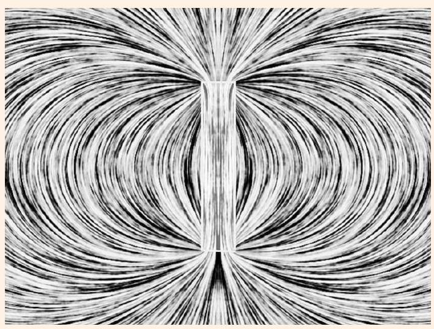
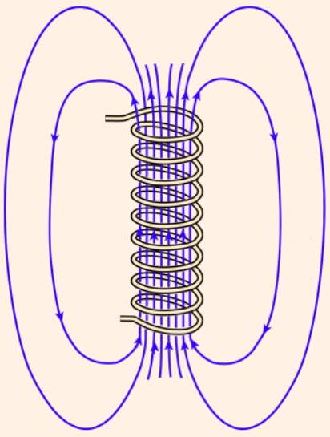
This may come as a surprise to you if you've read basic, algebra-based introductory physics textbooks. Many of them contain hand-drawn diagrams like the one shown at right above, where all the magnetic flux comes neatly out the ends of the solenoids, in straight lines. In reality, the field sprays out almost spherically symmetrically from the end, with only half the flux actually going out through the end face, while the rest exits downward through the sides. (You will show this more directly with a slick argument in problem 23.)

We can also be more quantitative. Suppose the solenoid is vertical and centered at $z = 0$. Then the field at a radius $r$ from the solenoid axis, at $z = 0$, is

$$
\mathbf { B } ( r ) = \mu _ { 0 } n I \hat { \mathbf { z } } \times \begin{cases} 1 & r < R \\ - 2 R ^ { 2 } / L ^ { 2 } & R \ll r \ll L \\ - R ^ { 2 } L / 4 r ^ { 3 } & L \ll r \end{cases}
$$

where the first line is the usual solenoid field, the second line is from applying Coulomb's law to our dipole analogy (which is only valid when $R \ll r$ ), and the third is from the dipole field of the two charges (only valid when $L \ll r$ ). As expected, in the limit $L \gg R$, the fringe field outside the solenoid is negligible. Another way of phrasing the result is that most of the upward flux through the solenoid returns through a downward field which mainly extends out to $r \sim L$. You can see all of these features in the accurate drawing above.

We can draw two lessons from this example. First, misleading diagrams are a common problem in introductory textbooks. A general rule is that the more basic a textbook is, the more pictures it'll have, but the less useful they'll be. Second, the analogy between Ampere and Gilbert dipoles is quite useful, and shows up frequently in tricky Olympiad problems.

## Remark: Real Solenoids

Real solenoids are even more complicated. First, we didn't account for the discreteness of the wires. We just treated them as forming a uniform current per length $K = n I$, which is how we wrote $I _ { \text {enc } } = n I h$. This is valid when you don't care about looking too closely, i.e. if your distance to any wire is much larger than the wire spacing $1 / n$.

Second, the fact that solenoids are made by winding real wires means there is another contribution to the current, even in the limit $n \rightarrow \infty$. The wires are wound with a small slope, since a net current $I$ still has to move along the solenoid. Another way of saying this is that the current per length along the solenoid surface is $\mathbf { K } = n I \hat { \boldsymbol { \theta } } + ( I / 2 \pi R ) \hat { \mathbf { z } }$. This causes a tangential magnetic field $B _ { \phi } = \mu _ { 0 } I / 2 \pi r$ outside the solenoid. Thus, in practice many solenoids are "counterwound": half the wires are wound evenly spaced going up the axis, and the other half are wound evenly spaced going back down the axis, which closes the loop and cancels this unwanted field.

[2] Problem 22. A toroidal solenoid is created by wrapping $N$ turns of wire around a torus with a rectangular cross section. The height of the torus is $h$, and the inner and outer radii are $a$ and $b$.
    (a) In the ideal case, the magnetic field vanishes everywhere outside the toroid, and is purely tangential inside the toroid. Find the magnetic field inside the toroid.
    (b) There is another small contribution to the magnetic field due to the winding effect mentioned above. Roughly what does the resulting extra magnetic field look like? If you didn't want this additional field, how would you design the solenoid to get rid of it?

Solution. (a) Applying Ampere's law on a circular loop gives $B ( r ) ( 2 \pi r ) = \mu _ { 0 } N I$, so

$$
B ( r ) = \frac { \mu _ { 0 } N I } { 2 \pi r } .
$$

(b) Note that the twisting of the wire adds an effective small current in the tangential direction. This looks like a current loop, so, e.g. it produces a magnetic field pointing vertically through the toroid's hole. We can remove it by using a bunch of current loops instead of a single winding wire, or by using counterwinding: after winding the wire around the toroid once clockwise, wind it around again counterclockwise.
[3] Problem 23 (Purcell 6.63). A number of simple facts about the fields of solenoids can be found by using superposition. The idea is that two solenoids of the same diameter, and length $L$, if joined end to end, make a solenoid of length $2 L$. Two semi-infinite solenoids butted together make an infinite solenoid, and so on.
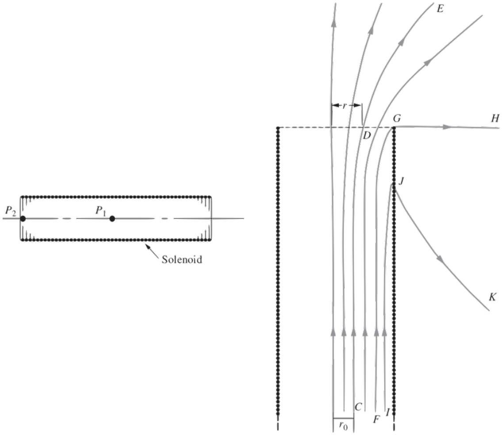
Prove the following facts.
    (a) In the finite-length solenoid shown at left above, the magnetic field on the axis at the point $P _ { 2 }$ at one end is approximately half the field at the point $P _ { 1 }$ in the center. (Is it slightly more than half, or slightly less than half?)
    (b) In the semi-infinite solenoid shown at right above, the field line FGH, which passes through the very end of the winding, is a straight line from G out to infinity.
    (c) The flux through the end face of the semi-infinite solenoid is half the flux through the coil at a large distance back in the interior.
    (d) Any field line that is a distance $r _ { 0 }$ from the axis far back in the interior of the coil exits from the end of the coil at a radius $r _ { 1 } = \sqrt { 2 } r _ { 0 }$, assuming $\sqrt { 2 } r _ { 0 }$ is less than the solenoid radius.

Solution. (a) Let $\mathbf { B } _ { 1 }$ and $\mathbf { B } _ { 2 }$ be the fields at these points, respectively. Note that $\mathbf { B } _ { 1 }$ is close to the ideal value $\mu _ { 0 } n I$, but smaller because the solenoid is not infinite. Now glue two of these solenoids together end-to-end, and consider the field at the center of this new, bigger solenoid.

By superposition, it is $2 \mathbf { B } _ { 2 }$, but also, it is close to $\mu _ { 0 } n I$, and it is slightly closer to $\mu _ { 0 } n I$ than $\mathbf { B } _ { 1 }$ is, since the combined solenoid is longer. Therefore, $\mathbf { B } _ { 2 }$ is slightly more than half of $\mathbf { B } _ { 1 }$.
(b) Let $G ^ { \prime }$ be the reflection of $G$ in the axis. Say the field line $G H$ comes out at an angle $\theta$. Then, at $G ^ { \prime }$, it also comes out with an angle $\theta$. Now, making a copy and rotating 180° and flipping the current direction, the field at $G$ becomes one pointing at $\theta$ above the horizontal (coming from $G$ at the original), and one at angle $\pi - \theta$ to the horizontal (coming from $G ^ { \prime }$ in the copy). Therefore, the field there would be non-zero right outside the solenoid, unless $\theta = 0$, in which case the fields cancel.
(c) Do the same procedure as in (a), and the flux at the glue points gets doubled to what it was originally. However, now we have an infinite solenoid, so double the flux through the end is equal to the flux in the middle.
(d) Note that (c) holds even if we take a constant disk of radius $a$ as our surface to take the flux over. Note that the flux through the disk at the edge with radius $r$ is the same as at the middle with radius $r _ { 0 }$ (same field lines). However, if we draw a disk of radius $r$ at the middle, it will have twice the flux as it did at the top, or twice the flux as with $r _ { 0 }$. However, here in the middle, the magnetic field is essentially constant, so the areas must be twice each other, so $\pi r ^ { 2 } = 2 \pi r _ { 0 } ^ { 2 }$, or $r = \sqrt { 2 } r _ { 0 }$.

[3] Problem 24 (MPPP 160). Two infinite parallel wires, a distance $d$ apart, carry electric currents along the $z$-axis with equal magnitudes but opposite directions. We can find the shape of the magnetic field lines with a neat trick, which only works for "two-dimensional" setups like this one, where the fields lie in the $x y$ plane and don't depend on $z$.

(a) Argue that if we rotated B by 90° in the $x y$ plane at each point, it would produce a valid electrostatic field $\mathbf { E }$. (Hint: consider rotating the $\mathbf { B }$ field of each wire individually.)
(b) Argue that the field lines of B are the same as the equipotentials of this artificial E, and use this to find the field lines.

This trick is also useful for fluids in two dimensions, where it swaps vortices with sources and sinks.
Solution. (a) First, we can get the intuition using a single wire. In this case,

$$
\mathbf { B } = \frac { \mu _ { 0 } I } { 2 \pi r } \hat { \boldsymbol { \theta } }
$$

in cylindrical coordinates. Upon a $90 ^ { \circ }$ rotation, $\hat { \boldsymbol { \theta } }$ turns into $\hat { \mathbf { r } }$, giving

$$
\mathbf { E } = \frac { \mu _ { 0 } I } { 2 \pi r } \hat { \mathbf { r } }
$$

which is a valid electrostatic field, as it's simply the electric field of an charged wire. So by superposition, rotating the B field of the two wires would also give a valid electrostatic field. (Of course, this isn't really physically meaningful, since electric and magnetic fields don't even have the same units. It's just a mathematical trick.)

We can also prove the correspondence more generally. The key criterion for a valid magnetostatic field is $\nabla \cdot \mathbf { B } = 0$, which for such two-dimensional setups is $\partial _ { x } B _ { x } + \partial _ { y } B _ { y } = 0$. Now, when we rotate by 90°, we define an electric field by $E _ { x } = B _ { y }$ and $E _ { y } = - B _ { x }$, which implies $\partial _ { x } E _ { y } - \partial _ { y } E _ { x } = 0$. But in such a two-dimensional setup, this is equivalent to $\nabla \times \mathbf { E } = 0$, which is the condition to have a valid electrostatic field.

(b) The field lines of B are always parallel to B. Now, this artificial E is always perpendicular to B, and equipotentials are always perpendicular to $\mathbf { E }$, so the equipotentials follow the magnetic field lines.
On the other hand, we know precisely what the potential is in this problem. By integrating the $1 / r$ field, the potential is proportional to $\log r$, so
$$
V ( r ) \propto \log \left( r _ { + } \right) - \log \left( r _ { - } \right) = \log \left( r _ { + } / r _ { - } \right)
$$
where $r _ { + }$and $r _ { - }$are the distances to the two wires. So the equipotentials have constant $r _ { + } / r _ { - }$. We've already found, when investigating the method of images for spheres in E2, that this implies the equipotentials are circles, specifically circles of Apollonius. So the magnetic field lines are circles!
[2] Problem 25 (IPhO 1996). Two straight, long conductors $C _ { + }$and $C _ { - }$, insulated from each other, carry current $I$ in the positive and the negative $\hat { \mathbf { z } }$ direction respectively. The cross sections of the conductors are circles of diameter $D$ in the $x y$ plane, with a distance $D / 2$ between the centers.
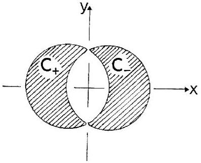
The current in each conductor is uniformly distributed. Find the magnetic field in the space between the conductors.
Solution. The answer is a uniform field $B _ { y } = 6 \mu _ { 0 } I / ( ( 2 \pi + 3 \sqrt { 3 } ) D )$. See the official solutions of IPhO 1996, problem 1(e).
[3] Problem 26 (MPPP 157). A regular tetrahedron is made of a wire with constant resistance per unit length. A long, straight wire sends current $I$ into one vertex, and another long, straight wire removes it from another vertex, as shown.
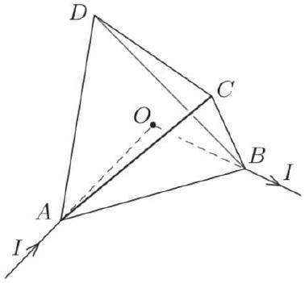
Find the magnetic field at the center of the tetrahedron.
Solution. The long straight wires contribute nothing. By symmetry $C$ and $D$ are at the same potential, so $I _ { D C } = 0$. Then the current from $A$ to $B$ just splits up into three branches, which have resistances $R _ { A C B } = R _ { A D B } = 2 R _ { A B }$. Therefore, the currents are
$$
I _ { A B } = \frac { 1 } { 2 } I , \quad I _ { A C } = I _ { A D } = I _ { C B } = I _ { D B } = \frac { 1 } { 4 } I .
$$

The field at $O$ due to the current along $A D$ is directed along the vector $\overrightarrow { C B }$. Similarly, the magnetic field due to the current along $A C$ is directed along $\overrightarrow { B D }$, and so on. By repeating this reasoning for all five contributions, we find that the magnetic field at $O$ is proportional to

$$
2 \overrightarrow { D C } + \overrightarrow { B D } + \overrightarrow { C B } + \overrightarrow { A D } + \overrightarrow { C A } = 2 \overrightarrow { D C } + \overrightarrow { C D } + \overrightarrow { C D } = 0
$$

so there is no field at $O$.
[5] Problem 27. APhO 2013, problem 1. A neat question on a cylindrical RC circuit that uses many of the techniques we've covered so far.
