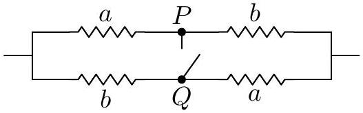
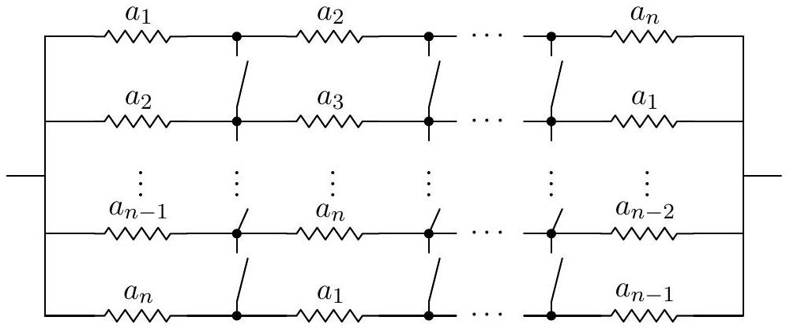
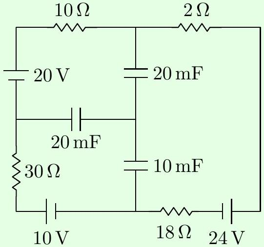
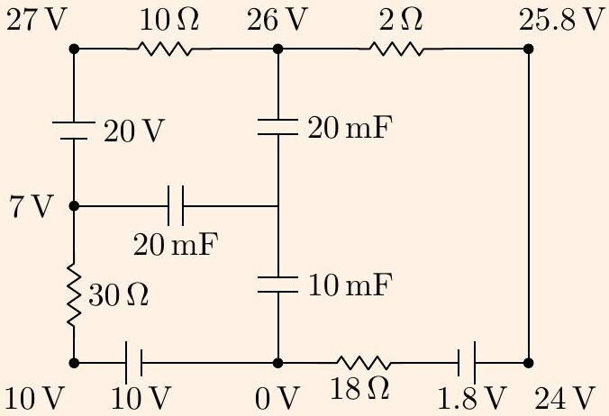
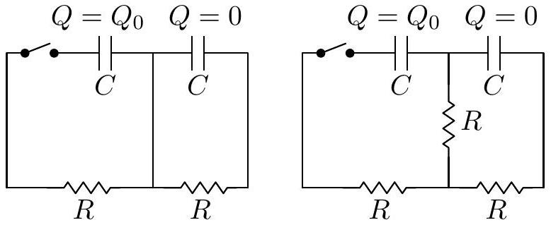
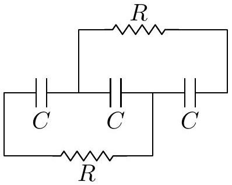
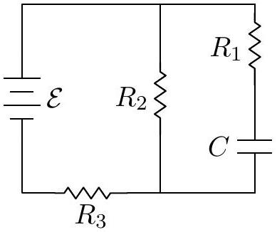
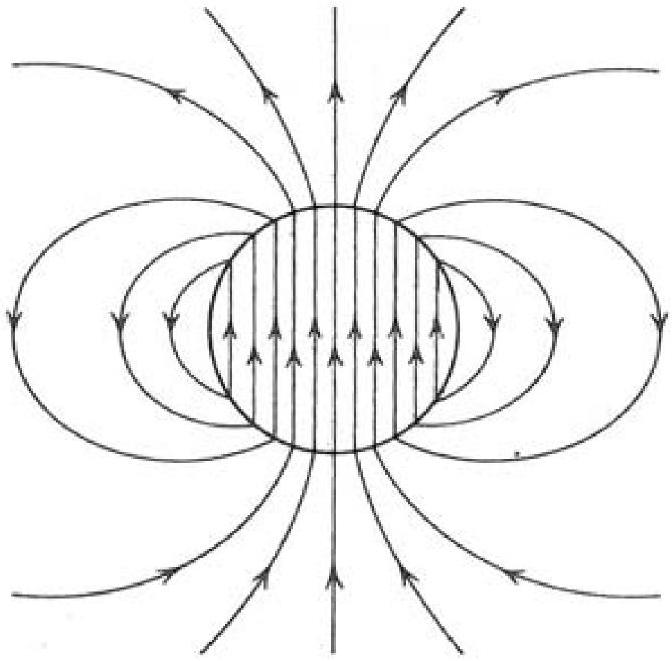

[4] Problem 8. [A] This problem is just for fun; the techniques used here are too advanced to appear on Olympiads. We will prove Rayleigh's monotonicity law, which states that increasing the resistance of any part of a resistor network increases the equivalent resistance between any two points. This may seem obvious, but it's actually tricky to prove. The following is the slickest way.
    (a) Consider a graph of resistors, where a battery is attached across two of the vertices, fixing their voltages. Write an expression for the total power dissipated, assuming the voltages at each vertex are $V _ { i }$ and the resistances are $R _ { i j }$.
    (b) The voltages $V _ { i }$ at all the other vertices are determined by Kirchhoff's rules. But suppose you didn't know that, or didn't want to set up those equations. Remarkably, it turns out that you can derive the exact same results by simply treating the voltages $V _ { i }$ as free to vary, and setting them to minimize the total power dissipated! Show this result. (This is an example of a variational principle, like the principle of least action in mechanics.)
    (c) For any network of resistors, show that $P = V ^ { 2 } / R$ when $V$ is the battery voltage applied across two vertices, $R$ is the equivalent resistance between them, and $P$ is the total power dissipated in the resistors. (This is intuitive, but it's worth showing in detail to assist with the next part.)
    (d) By combining all of these results, prove Rayleigh's monotonicity law.
    (e) We can use Rayleigh's monotonicity law to prove some mathematical results. Consider the resistor network shown below, where the variables label the resistances.

By considering the resistances before and after closing the switch $P Q$, show that the arithmetic mean of two numbers is at least the geometric mean.

(f) Consider the resistor network shown below.

By closing all the switches, show that the arithmetic mean of $n$ numbers is at least the harmonic mean.

Solution. (a) The power is

$$
P = \sum _ { i < j } \frac { \left( V _ { i } - V _ { j } \right) ^ { 2 } } { R _ { i j } } .
$$

Here the sum over $i < j$ counts all pairs of vertices once. If there is no direct connection between $i$ and $j$, the resistance $R _ { i j }$ is infinite.

(b) The power is minimized when its derivative is zero, and we are free to vary all voltages except for the two points where the battery is connected. Let $V _ { i }$ be one of these voltages. Then
$$
\frac { \partial P } { \partial V _ { i } } = \sum _ { j \neq i } \frac { 2 \left( V _ { i } - V _ { j } \right) } { R _ { i j } } = 0 .
$$
Now compare this to how we would solve the problem using Kirchhoff's laws. The fact that the sum of the voltage drops along a loop is zero is already accounted for, because we already have specified the voltages at each vertex. The only new equations we would write down would be charge conservation at each vertex,
$$
\sum _ { j \neq i } I _ { i j } = 0 .
$$
However, applying Ohm's law, we see this is precisely the equation that power minimization has given us!
(c) By the definition of the equivalent resistance, $V = I R$ where $I$ is the total current going through the circuit. By the definition of power, the power put in by the battery is $P = I V$, since any current going through the circuit must go through the battery. By conservation of energy, the power dissipated in the circuit is equal to the power put in by the battery. So the power dissipated is $P = I V = V ^ { 2 } / R$.

(d) Put a battery of voltage $V$ across the points we are considering. By part (c) Rayleigh's monotonicity law is equivalent to the statement that, if we increase any of the $R _ { i j }$, the total power $P$ dissipated in the resistor network goes down.
We can account for the effect of increasing one of the $R _ { i j }$ in two steps. First, suppose we do so while artificially keeping all the voltages $V _ { i }$ constant. Then by part (a), $P$ decreases. Second, in reality the voltages quickly rearrange themselves to satisfy Kirchhoff's laws, which we saw in part (b) is equivalent to minimizing the power. So this further rearrangement can only further decrease $P$. This shows the desired result.
(e) Before closing the switch, the resistance is
$$
R _ { i } = \frac { a + b } { 2 } .
$$
After closing the switch, the resistance is
$$
R _ { f } = 2 \left( \frac { 1 } { a } + \frac { 1 } { b } \right) ^ { - 1 } = \frac { 2 a b } { a + b } .
$$
Closing the switch is equivalent to decreasing $R _ { P Q }$ from infinity to zero, so $R _ { f } \leq R _ { i }$ by Rayleigh's monotonicity law. This gives
$$
\sqrt { a b } \leq \frac { a + b } { 2 }
$$
which is the AM-GM inequality.
(f) Before closing the switches,
$$
R _ { i } = \frac { 1 } { n } \sum _ { i } a _ { i }
$$
which is the arithmetic mean. After closing the switches,
$$
R _ { f } = n \left( \sum _ { i } \frac { 1 } { a _ { i } } \right) ^ { - 1 }
$$
which is the harmonic mean. Thus, the arithmetic mean is at least the harmonic mean.

## Remark

You might think that Rayleigh's monotonicity law is too obvious to require a proof; if you decrease a resistance, how could the net resistance possibly go up? In fact, this kind of non-monotonicity occurs very often! For example, Braess's paradox is the fact that adding more roads can slow down traffic, even when the total number of cars stays the same. A U.S. Physics Team coach has argued that allowing more team strategies can make a basketball team score less. For more on this subject, see the paper Paradoxical behaviour of mechanical and electrical networks or this video.

Remark
Circuit questions can get absurdly hard, but at some point they start being more about mathematical tricks than physics. As a result, I haven't included any such problems here; they tend not to appear on the USAPhO or IPhO, or in college physics, or in real life, or really anywhere besides a few competitions. On the other hand, you might find such questions fun! For some examples, see the Physics Cup problems 2013.6, 2017.2, 2018.1, and 2019.4.

## 2 RC Circuits

Next we'll briefly cover RC circuits, our first exposure to a situation genuinely changing in time.
Example 4: CPhO
The capacitors in the circuit shown below were initially neutral. Then, the circuit is allowed to reach the steady state.

After a long time, what is the charge stored on the 10 mF capacitor?

Solution
After a long time, no current flows through the capacitors, so there is effectively a single loop in the circuit. It has a total resistance $60 \Omega$ and a total emf 6 V , so the current is $I = 0.1 \mathrm {~A}$. Using this, we can straightforwardly label the voltages everywhere on the outer loop.

To finish the problem, we need to know the voltage $V _ { 0 }$ of the central node, so we need one more equation. That equation is charge conservation. We note that the central part of the circuit, containing the inner plates of the three capacitors, begins uncharged and is not directly connected to anything else, so it must remain uncharged. (Charge can't move through a capacitor!) Suppressing units, this means

$$
20 \left( 26 - V _ { 0 } \right) + 20 \left( 7 - V _ { 0 } \right) + 10 \left( 0 - V _ { 0 } \right) = 0 , \quad V _ { 0 } = \frac { 66 } { 5 } \mathrm {~V}
$$

from which we read off the answer,

$$
Q = C V = 0.132 \mathrm { C } .
$$

[3] Problem 9. USAPhO 1997, problem A3.

[3] Problem 10 (Purcell 4.18). Consider the two RC circuits below.

    (a) The circuit shown below contains two identical capacitors and two identical resistors, with initial charges as shown above at left. If the switch is closed at $t = 0$, find the charges on the capacitors as functions of time.
    (b) Now consider the same setup with an extra resistor, as shown above at right. Find the maximum charge that the right capacitor achieves. (Hint: the methods of M4 can be useful.)

Solution. (a) Let the two loop currents be $I _ { 1 }$ and $I _ { 2 }$, both counterclockwise. The loop equations are $Q _ { 1 } / C = I _ { 1 } R$ and $Q _ { 2 } / C = I _ { 2 } R$. We also have $I _ { k } = - \dot { Q } _ { k }$. Thus, $Q _ { k } + R C \dot { Q } _ { k } = 0$ for $k = 1,2$. Based on the initial conditions, we see then that the solutions are $Q _ { 1 } ( t ) = Q _ { 0 } e ^ { - t / R C }$ and $Q _ { 2 } ( t ) = 0$. (The simple reason $Q _ { 2 } ( t )$ is zero is because the middle wire effectively shorts out the right half of the circuit.)

(b) Again, with the same setup of variables, we get that
$$
\begin{aligned}
& Q _ { 1 } / C - 2 I _ { 1 } R + I _ { 2 } R = 0 \\
& Q _ { 2 } / C - 2 I _ { 2 } R + I _ { 1 } R = 0 .
\end{aligned}
$$
This is a system of two linear differential equations, which can be solved using the methods of M4. However, in this case we can just add and subtract the equations, giving
$$
\left( Q _ { 1 } + Q _ { 2 } \right) / C - \left( I _ { 1 } + I _ { 2 } \right) R = 0 , \quad \left( Q _ { 1 } - Q _ { 2 } \right) / C - 3 \left( I _ { 1 } - I _ { 2 } \right) R = 0 .
$$
That is, the sum of the two acts like an RC circuit with time constant $R C$, while the difference acts like one with time constant $3 R C$. (These are the "normal modes".) By superposing these solutions and fitting the initial conditions, we get
$$
Q _ { 1 } ( t ) = \frac { Q _ { 0 } } { 2 } \left( e ^ { - t / R C } + e ^ { - t / 3 R C } \right) , \quad Q _ { 2 } ( t ) = \frac { Q _ { 0 } } { 2 } \left( e ^ { - t / R C } - e ^ { - t / 3 R C } \right) .
$$

We want to maximize $\left| Q _ { 2 } \right|$, so setting the derivative to zero gives $t = \frac { 3 } { 2 } R C \log ( 3 )$, so

$$
\left| Q _ { 2 } \right| _ { \max } = \frac { Q _ { 0 } } { 3 \sqrt { 3 } } .
$$

[3] Problem 11. USAPhO 2004, problem A1.
[3] Problem 12 (Kalda). Three identical capacitors are placed in series and charged with a battery of $\operatorname { emf } \mathcal { E }$. Once they are fully charged, the battery is removed, and simultaneously two resistors are connected as shown.

Find the heat dissipated on each of the resistors after a long time.
Solution. Letting $q _ { 0 } = \mathcal { E } C / 3$, the initial charges on the six plates are $q _ { 0 } , - q _ { 0 } , q _ { 0 } , - q _ { 0 } , q _ { 0 }$, and $- q _ { 0 }$. After a long time, let the charges on the plates be $q _ { 1 } , - q _ { 1 } , q _ { 2 } , - q _ { 2 } , q _ { 3 } , - q _ { 3 }$. Note that all currents are 0 now, so we may effectively ignore the resistors and treat the wires as zero resistance. Therefore, the potential at points connected by wires is the same, so $q _ { 1 } = - q _ { 2 } = q _ { 3 }$. Also, by charge conservation on the two disjoint pieces $\left( q _ { 1 } , - q _ { 2 } , q _ { 3 } \right.$ and $\left. - q _ { 1 } , q _ { 2 } , - q _ { 3 } \right)$, we see
$$
q _ { 1 } - q _ { 2 } + q _ { 3 } = q _ { 0 } ,
$$
which implies $\left| q _ { 1 } \right| = \left| q _ { 2 } \right| = \left| q _ { 3 } \right| = \mathcal { E } C / 9$. The energy is $\sum \frac { 1 } { 2 } Q ^ { 2 } / C$, so the charges dropping by a factor of 3 means we lose 8/9 of the original total energy. Then by symmetry, each resistor dissipates 4/9 of the original total energy. This is
$$
\frac { 4 } { 9 } \cdot 3 \cdot \frac { ( \mathcal { E } C / 3 ) ^ { 2 } } { 2 C } = \frac { 2 } { 27 } \mathcal { E } ^ { 2 } C .
$$
[2] Problem 13 (Kalda). Find the time constant of the RC circuit shown below.

Solution. For the purposes of computing the time constant, it is equivalent to assume the capacitor is already charged, then take out the battery and see how it discharges. Thus all that matters is the resistance between the capacitor plates, which is
$$
R = R _ { 1 } + \frac { R _ { 2 } R _ { 3 } } { R _ { 2 } + R _ { 3 } } = \frac { R _ { 1 } R _ { 2 } + R _ { 1 } R _ { 3 } + R _ { 2 } R _ { 3 } } { R _ { 2 } + R _ { 3 } } ,
$$
so $\tau = C \frac { R _ { 1 } R _ { 2 } + R _ { 1 } R _ { 3 } + R _ { 2 } R _ { 3 } } { R _ { 2 } + R _ { 3 } }$.

[3] Problem 14 (MPPP 175/176). A metal sphere of radius $R$ has charge $Q$ and hangs on an insulating cord. It slowly loses charge because air has a conductivity $\sigma$. In all cases, neglect any magnetic or radiation effects.
    (a) Find the time $t$ for the charge to halve.
    (b) By dimensional analysis, $t$ is independent of the radius $R$ of the metal sphere. More generally, show that $t$ takes the same value if the metal has any shape.
    (c) Some typical values of conductivity are
$$
\sigma \sim \left\{ \begin{array} { l l }
10 ^ { - 13 } \Omega ^ { - 1 } \mathrm {~m} ^ { - 1 } & \text { air } \\
10 ^ { - 2 } \Omega ^ { - 1 } \mathrm {~m} ^ { - 1 } & \text { water } \\
10 ^ { 8 } \Omega ^ { - 1 } \mathrm {~m} ^ { - 1 } & \text { copper }
\end{array} . \right.
$$
About how long does the charge on an object last, in each of these environments?

This problem generalizes USAPhO 2010, problem A2, which you can compare.
Solution. (a) We can analyze this as an RC circuit. (The circuit is completed by the "sphere at infinity".) The capacitance is the self-capacitance of the sphere,

$$
C = 4 \pi \epsilon _ { 0 } R .
$$

The resistance is the resistance between the sphere and infinity. The air can be thought of as a set of resistors in series, with each resistor being a spherical shell of air. Then

$$
R _ { \mathrm { eq } } = \int d R = \frac { 1 } { \sigma } \int _ { R } ^ { \infty } \frac { d r } { 4 \pi r ^ { 2 } } = \frac { 1 } { 4 \pi \sigma R }
$$

This gives a time constant of

$$
\tau = R C = \frac { \epsilon _ { 0 } } { \sigma } .
$$

Therefore, the time is

$$
t = \frac { \epsilon _ { 0 } } { \sigma } \log 2 .
$$

(b) Dimensional analysis doesn't work, because a general shape is described by many dimensionless parameters. For example, if the shape was an ellipsoid, we would have to specify its eccentricity. Instead we use the following more general argument. We note that
$$
I = \oint \mathbf { J } \cdot d \mathbf { S } , \quad \Phi _ { E } = \oint \mathbf { E } \cdot d \mathbf { S }
$$
over any surface completely enclosing the object. The right-hand sides are related by $\mathbf { J } = \sigma \mathbf { E }$, and Gauss's law gives $\Phi _ { E } = Q / \epsilon _ { 0 }$. Combining these gives
$$
\dot { Q } = - \frac { \sigma } { \epsilon _ { 0 } } Q
$$
so the charge decreases exponentially with timescale $\epsilon _ { 0 } / \sigma$, completely independently of the shape. (Of course, the sphere is still special, because with the sphere we are guaranteed there are no magnetism or radiation effects (why?). For a general shape, we have to assume these effects are negligible, which may or may not be true depending on the value of $\sigma$.)

(c) The relevant timescale is $\epsilon _ { 0 } / \sigma$. Thus we find $t \sim 10 ^ { 2 } \mathrm {~s}$ for air, $t \sim 10 ^ { - 9 } \mathrm {~s}$ for water, and $t \sim 10 ^ { - 19 } \mathrm {~s}$ for copper. The last timescale is astoundingly small, and it implies that there is approximately no charge density within a metal in just about any circumstance.
[5] Problem 15. IPhO 1993, problem 1. A really neat question with real-world relevance.
[5] Problem 16. IPhO 2007, problem "orange". A combination of mechanics and RC circuits.

## 3 Computing Magnetic Fields

Idea 4
The Biot-Savart law is

$$
\mathbf { B } = \frac { \mu _ { 0 } I } { 4 \pi } \oint \frac { d \mathbf { s } \times \mathbf { r } } { r ^ { 3 } } .
$$

As a consequence, we have Ampere's law,

$$
\oint \mathbf { B } \cdot d \mathbf { s } = \mu _ { 0 } I , \quad \nabla \times \mathbf { B } = \mu _ { 0 } \mathbf { J }
$$

as well as Gauss's law for magnetism,

$$
\oint \mathbf { B } \cdot d \mathbf { S } = 0 , \quad \nabla \cdot \mathbf { B } = 0 .
$$

Idea 5
The force on a stationary wire carrying current $I$ in a magnetic field $\mathbf { B }$ is

$$
\mathbf { F } = I \int d \mathbf { s } \times \mathbf { B }
$$

The energy of a magnetic field is

$$
U = \frac { 1 } { 2 \mu _ { 0 } } \int B ^ { 2 } d V
$$

The magnetic dipole moment of a planar current loop of area $A$ and current $I$ is $m = I A$, with m directed perpendicular to the loop by the right-hand rule.

Idea 6: Magnetic Dipoles
Far from a magnetic dipole with magnetic moment $m$, its magnetic field is just the same as the electric field of an electric dipole,

$$
\mathbf { B } ( \mathbf { r } ) = \frac { \mu _ { 0 } m } { 4 \pi r ^ { 3 } } ( 2 \cos \theta \hat { \mathbf { r } } + \sin \theta \hat { \boldsymbol { \theta } } ) = \frac { \mu _ { 0 } } { 4 \pi r ^ { 3 } } ( 3 ( \mathbf { m } \cdot \hat { \mathbf { r } } ) \hat { \mathbf { r } } - \mathbf { m } ) .
$$

As with the electric dipole field, you don't need to memorize this, but you should remember that it's proportional to the dipole moment, falls off as $1 / r ^ { 3 }$, and be able to sketch it.

You should have already seen basic examples of using the Biot-Savart law in Halliday and Resnick, such as the field of a circular ring of current on its axis. We'll start with some problems that are similarly straightforward, but more technically complex.

[3] Problem 17. This is a key question which will help you understand idea 7. A spherical shell with radius $R$ and uniform surface charge density $\sigma$ spins with angular frequency $\omega$ about a diameter.
    (a) Find the magnetic field at the sphere's center.
    (b) Find the magnetic dipole moment of the sphere.
    (c) It can be shown that (1) the magnetic field inside the sphere is uniform, and (2) the magnetic field outside the sphere is exactly that of a magnetic dipole. (It requires doing some obnoxious integrals, as can be seen in section 5.4 of Griffiths.) Using this information, make a qualitatively accurate sketch of the field.
    (d) There is a closely related question in electrostatics: suppose we had two solid spheres of the same radius $R$, with volume charge densities $\pm \rho$, and the spheres were displaced by a tiny distance $d \ll R$. Qualitatively, what would the electric field of this setup look like, for $r < R$ and $r > R$ ? How does it differ from your answer to part (c)?

Solution. (a) First, we find the field due to a ring of counterclockwise current $I$ with radius $a$ in the $z = 0$ plane at a point directly above the center at some height $z$. Using the Biot-Savart law, we see that

$$
\mathbf { B } = \frac { \mu _ { 0 } I } { 4 \pi } \frac { 2 \pi a \frac { a } { \sqrt { a ^ { 2 } + z ^ { 2 } } } } { a ^ { 2 } + z ^ { 2 } } \hat { \mathbf { z } } = \frac { \mu _ { 0 } I } { 2 } \frac { a ^ { 2 } } { \left( a ^ { 2 } + z ^ { 2 } \right) ^ { 3 / 2 } } \hat { \mathbf { z } } .
$$

Let us work in spherical coordinates with the axis of rotation being the $z$ axis. Then, at angle $\theta$, we essentially have a ring of charge of radius $a = R \sin \theta , z = R \cos \theta$, and

$$
d I = \sigma R ( d \theta ) \omega ( R \sin \theta ) = \sigma R ^ { 2 } \omega \sin \theta d \theta .
$$

Therefore,

$$
d \mathbf { B } = \frac { \mu _ { 0 } \sigma R ^ { 2 } \omega \sin \theta d \theta } { 2 } \frac { R ^ { 2 } \sin ^ { 2 } \theta } { R ^ { 3 } } \hat { \mathbf { z } } = \frac { \hat { \mathbf { z } } } { 2 } \mu _ { 0 } \sigma \omega R \sin ^ { 3 } \theta d \theta .
$$

Integrating from 0 to $\pi$ to obtain the full field,

$$
\mathbf { B } = \frac { \hat { \mathbf { z } } } { 2 } \mu _ { 0 } \sigma \omega R \int _ { 0 } ^ { \pi } \sin ^ { 3 } \theta d \theta = \frac { 2 } { 3 } \mu _ { 0 } \sigma \omega R \hat { \mathbf { z } }
$$

(b) The magnetic dipole moment of a slice is
$$
d \mathbf { m } = \hat { \mathbf { z } } \pi ( R \sin \theta ) ^ { 2 } \omega \sigma R ^ { 2 } \sin \theta d \theta .
$$
Integrating this gives
$$
\mathbf { m } = \frac { 4 } { 3 } \pi \omega \sigma R ^ { 4 } \hat { \mathbf { z } } .
$$
(c) The field is as shown below.

The key feature is that the field lines of the dipole outside and the uniform field inside match up perfectly, so that every field line forms a closed loop; this is Gauss's law for magnetism.

(d) We've already seen this setup in E1. It's easy to show by the shell theorem that the electric field is uniform for $r < R$, and exactly an electric dipole field for $r > R$. The crucial difference is that in the electric case, the uniform field inside points against the dipole moment, rather than along it. As a result, the electric field switches directions upon crossing $r = R$. This reflects the fact that $\nabla \times \mathbf { E } = 0$, so that the line integral of $\mathbf { E }$ along any closed path has to vanish. If we follow a field line, this is only possible if the field switches direction. In addition, compared to the magnetic case, the field lines don't close up, because $\nabla \cdot \mathbf { E }$ isn't zero.
[2] Problem 18 (Purcell 6.12). A ring with radius $R$ carries a current $I$. Show that the magnetic field due to the ring, at a point in the plane of the ring, a distance $r$ from the center, is given by
$$
B = \frac { \mu _ { 0 } I } { 2 \pi } \int _ { 0 } ^ { \pi } \frac { ( R - r \cos \theta ) R d \theta } { \left( r ^ { 2 } + R ^ { 2 } - 2 r R \cos \theta \right) ^ { 3 / 2 } }
$$
In the $r \gg R$ limit, show that
$$
B \approx \frac { \mu _ { 0 } } { 4 \pi } \frac { m } { r ^ { 3 } }
$$
where $m = I A$ is the magnetic dipole moment of the ring, as expected from idea 6.
Solution. Let the ring be centered at the origin, and let the field point be $a \hat { \mathbf { x } }$, and say we are at an angle $\theta$. Then, $d \mathbf { l } = ( - R \sin \theta ) \hat { \mathbf { x } } + ( R \cos \theta ) \hat { \mathbf { y } }$, and
$$
\mathbf { r } = a \hat { \mathbf { x } } - R ( \cos \theta \hat { \mathbf { x } } + \sin \theta \hat { \mathbf { y } } ) = ( a - R \cos \theta ) \hat { \mathbf { x } } + ( - R \sin \theta ) \hat { \mathbf { y } } .
$$
Note that $r = | \mathbf { r } | = \sqrt { a ^ { 2 } + R ^ { 2 } - 2 a R \cos \theta }$. Therefore, by the Biot-Savart law,
$$
d \mathbf { B } = \frac { \mu _ { 0 } I } { 4 \pi } \frac { R ( R - a \cos \theta ) \hat { \mathbf { z } } d \theta } { \left( a ^ { 2 } + R ^ { 2 } - 2 a R \cos \theta \right) ^ { 3 / 2 } } ,
$$
so integrating from 0 to $2 \pi$ and noting that $\theta$ and $- \theta$ contribute the same, we arrive at the desired result. Now, to take the $r \gg R$ limit cleanly and consistently, it's best to nondimensionalize everything. Defining $x = R / r \ll 1$, we can pull dimensionful factors out of the integral to get
$$
B _ { z } = \frac { \mu _ { 0 } I } { 2 \pi } \frac { r R } { r ^ { 3 } } \int _ { 0 } ^ { \pi } \frac { x - \cos \theta } { \left( 1 + x ^ { 2 } - 2 x \cos \theta \right) ^ { 3 / 2 } } d \theta .
$$

Now, it's not immediately obvious to what order in $x$ we should expand in. If we already know the answer is proportional to $1 / r ^ { 3 }$, then we can see the answer must be first order in $x$. But if we didn't know that, we could expand to zeroth order, giving

$$
B _ { z } = \frac { \mu _ { 0 } I } { 2 \pi } \frac { R } { r ^ { 2 } } \int _ { 0 } ^ { \pi } ( - \cos \theta ) d \theta = 0
$$

The fact that the answer vanishes means we need to go to higher order to find the true answer. At first order, applying the binomial theorem, the integrand is

$$
( x - \cos \theta ) \left( 1 + x ^ { 2 } - 2 x \cos \theta \right) ^ { - 3 / 2 } \approx ( x - \cos \theta ) ( 1 + 3 x \cos \theta ) \approx - \cos \theta + x \left( 1 - 3 \cos ^ { 2 } \theta \right)
$$

where we threw away higher order terms throughout. Then

$$
B _ { z } = \frac { \mu _ { 0 } I } { 2 \pi } \frac { R ^ { 2 } } { r ^ { 3 } } \int _ { 0 } ^ { \pi } \left( 1 - 3 \cos ^ { 2 } \theta \right) d \theta
$$

Using the fact that $\cos ^ { 2 } \theta$ averages to 1/2 over a cycle, the integral is $- \pi / 2$, giving

$$
B _ { z } = - \frac { \mu _ { 0 } I } { 4 \pi } \frac { \pi R ^ { 2 } } { r ^ { 3 } } = - \frac { \mu _ { 0 } } { 4 \pi } \frac { m } { r ^ { 3 } }
$$

which has the correct magnitude.
[3] Problem 19 (Purcell 6.14). Consider a square loop with current $I$ and side length $a$ centered at the origin, with sides parallel to the $x$ and $y$ axes. Show that the magnetic field at $r \hat { \mathbf { x } }$ is $B \approx \left( \mu _ { 0 } / 4 \pi \right) \left( m / r ^ { 3 } \right)$ for $r \gg a$, as expected from idea 6. Be careful with factors of 2!

Solution. This calculation is a bit subtle. It is tempting to ignore the sides parallel to $\hat { \mathbf { x } }$, because the current is almost parallel to r, so $d \mathbf { s } \times \mathbf { r }$ is small; more precisely, it is suppressed by a power of $a / r$. The sides parallel to $\hat { \mathbf { y } }$ do each give much larger contributions, but they have opposite sign and nearly cancel out, suppressing their sum by a power of $a / r$. So all four sides need to be considered.

First consider the segments parallel to $\hat { \mathbf { x } }$. We get a factor of $( a / 2 ) / r$ from the $\sin \theta$ factor in the cross product. Similarly, $a$ appears in the Biot-Savart integral in the denominator; however, its effect here would give higher-order terms in $a / r$, which we don't want to keep since they're much smaller than the final answer. So the segments each contribute equally, for a total of

$$
B _ { 1 } = - \frac { \mu _ { 0 } I } { 4 \pi } \left( \frac { a \frac { a / 2 } { r } } { r ^ { 2 } } + \frac { a \frac { a / 2 } { r } } { r ^ { 2 } } \right) = - \frac { \mu _ { 0 } I } { 4 \pi } \frac { a ^ { 2 } } { r ^ { 3 } } .
$$

Next, the segments parallel to $\hat { \mathbf { y } }$ contribute a total of

$$
B _ { 2 } = \frac { \mu _ { 0 } I } { 4 \pi } \left( \frac { a } { ( r - a / 2 ) ^ { 2 } } - \frac { a } { ( r + a / 2 ) ^ { 2 } } \right) = \frac { \mu _ { 0 } I } { 4 \pi } \frac { 2 a ^ { 2 } } { r ^ { 3 } }
$$

where we work to the same accuracy as for $B _ { 1 }$. Adding the two contributions and using $m = I a ^ { 2 }$ gives the desired result. If you forget to count $B _ { 1 }$, you'll get an answer that is two times too big.
[3] Problem 20. USAPhO 2012, problem A3.

## Idea 7: Magnetic Monopoles

Far away from the center of the dipole, the magnetic field of a magnetic dipole has the same form as the electric field of an electric dipole. Therefore, we can often replace a magnetic dipole $m$ with a fictitious pair of "magnetic charges" $\pm q _ { m }$ separated by $d$, where $q _ { m } d = m$. This is called a "Gilbert dipole", in contrast to a true "Amperian dipole".

This was the default way to think about magnets in the 1800s, but was largely removed from American textbooks in the 1950s because it's misleading in general: magnetic charges don't actually exist in magnets, and applying this analogy will give the wrong fields inside the dipole, as you saw in problem 17 and will see another way in problem 21. However, if we only care about the field outside the magnet, the analogy works, and it's often the fastest way to solve problems. We'll return to this idea in greater depth in E8.
[3] Problem 21. USAPhO 2015, problem B2. A key problem which illustrates idea 7.
We now give a few arguments for computing fields using symmetry.

## Example 5: PPP 31

An electrically charged conducting sphere "pulses" radially, i.e. its radius changes periodically with a fixed amplitude. What is the net pattern of radiation from the sphere?

## Solution

There is no radiation. By spherical symmetry, the magnetic field can only point radially. But then this would produce a magnetic flux through a Gaussian sphere centered around the pulsing sphere, which would violate Gauss's law for magnetism. So there is no magnetic field at all, and since radiation always needs both electric and magnetic fields (as you'll see in E7), there is no radiation at all. In fact, outside the sphere the electric field is always exactly equal to $Q / 4 \pi \epsilon _ { 0 } r ^ { 2 }$, in accordance with Coulomb's law.
