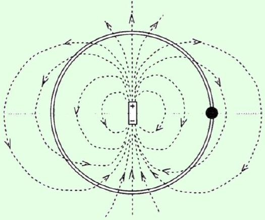
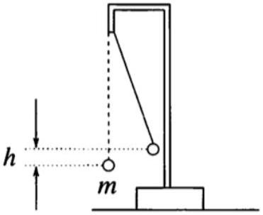
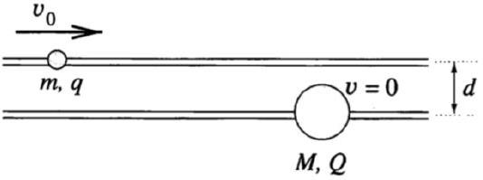
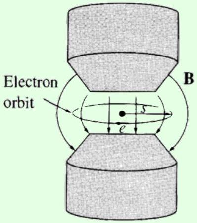
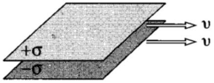
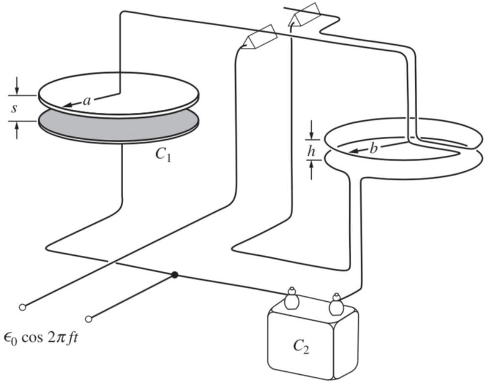
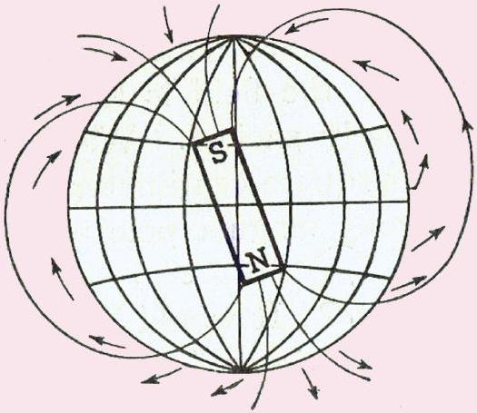
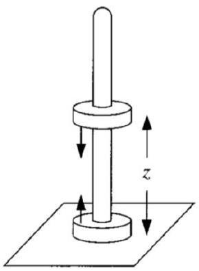
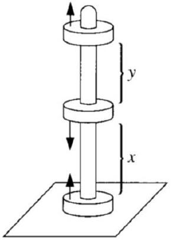
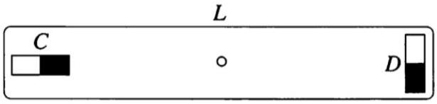

## Electromagnetism IV: Lorentz Force

The problems here mostly use material covered in previous problem sets, though chapter 5 of Purcell covers relativistic field transformations. For further interesting physical examples, see chapter II-29 of the Feynman lectures. There is a total of 84 points.

## 1 Electrostatic Forces

Idea 1: Lorentz Force
A charge $q$ in an electromagnetic field experiences the force

$$
\mathbf { F } = q ( \mathbf { E } + \mathbf { v } \times \mathbf { B } ) .
$$

In particular, a stationary wire carrying current $I$ in a magnetic field experiences the force

$$
\mathbf { F } = I \int d \mathbf { s } \times \mathbf { B }
$$

Example 1: PPP 183
A small charged bead can slide on a circular, frictionless insulating ring. A point-like electric dipole is fixed at the center of the circle with the dipole's axis lying in the plane of the circle. Initially the bead is in the plane of symmetry of the dipole, as shown.

Ignoring gravity, how does the bead move after it is released? How would the bead move if the ring weren't there?

Solution
Set up spherical coordinates so that the dipole is in the $\hat { \mathbf { z } }$ direction. Then

$$
V ( r , \theta ) = \frac { k p \cos \theta } { r ^ { 2 } } .
$$

Since the ring fixes $r$, the potential on the ring is just proportional to $\cos \theta$, which is in turn proportional to $z$. But a potential linear in $z$ is equivalent to a uniform downward field, so the bead oscillates like the mass of a pendulum, with amplitude $\pi / 2$.

The answer remains the same when the ring is removed! Conservation of energy states that

$$
\frac { k q p \cos \theta } { r ^ { 2 } } + \frac { 1 } { 2 } m v ^ { 2 } = 0 .
$$

Let $N$ be the normal force. Then accounting for radial forces gives

$$
N + q \frac { \partial V } { \partial r } = \frac { m v ^ { 2 } } { r } .
$$

However, plugging in our conservation of energy result for $v ^ { 2 }$ shows that $N = 0$, so the ring doesn't actually do anything, and it may be removed without effect.

Example 2
A parallel plate capacitor with separation $d$ and area $A$ is attached to a battery of voltage $V$. One plate moves towards the other with uniform speed $v$. Verify that energy is conserved.

Solution
The capacitance is $C = A \epsilon _ { 0 } / d$. The power supplied by the battery is

$$
P _ { \mathrm { batt } } = I V = V \frac { d Q } { d t } = V ^ { 2 } \frac { d C } { d t } .
$$

On the other hand, the rate of change of the energy stored in the capacitor is

$$
P _ { \text {cap } } = \frac { d } { d t } \left( \frac { 1 } { 2 } C V ^ { 2 } \right) = \frac { 1 } { 2 } V ^ { 2 } \frac { d C } { d t } .
$$

At first glance, there seems to be a problem. But then we remember that there is an attractive force between the plates, so the plates do work on whatever is moving them together,

$$
P _ { \mathrm { mech } } = F v = \frac { Q E } { 2 } v = \frac { Q V } { 2 d } v = \frac { 1 } { 2 } C V ^ { 2 } \frac { v } { d } = \frac { 1 } { 2 } V ^ { 2 } \frac { d C } { d t } .
$$

where $E$ is the electric field inside the capacitor. Thus, $P _ { \text {batt } } = P _ { \text {cap } } + P _ { \text {mech } }$ as required.
Technically there's energy in the magnetic field too, but it's smaller than the electric field energy by $v ^ { 2 } / c ^ { 2 }$, and thus negligible unless you're moving the plates so fast that relativity comes into play. Most problems in this problem set ignore such relativistic effects.
[2] Problem 1 (PPP 193). Two positrons are at opposite corners of a square of side $a$. The other two corners of the square are occupied by protons. All particles have charge $q$, and the proton mass $M$ is much larger than the positron mass $m$. Find the approximate speeds of the particles much later.

Solution. The idea is that since the positrons are so light, they will be extremely far away before the protons hardly move. Let $v _ { 1 }$ be their final speed. Then, energy conservation tells us that

$$
\frac { k q ^ { 2 } } { a } \left( 4 + \frac { 2 } { \sqrt { 2 } } \right) \approx \frac { k q ^ { 2 } } { \sqrt { 2 } a } + 2 \left( \frac { 1 } { 2 } m v _ { 1 } ^ { 2 } \right) .
$$

Solving for $v _ { 1 }$ yields

$$
v _ { 1 } = \sqrt { \frac { k q ^ { 2 } } { a m } ( 4 + 1 / \sqrt { 2 } ) } .
$$

The speed of the protons can be calculated by assuming that the positrons didn't even exist, since by the time the protons move appreciably, the positrons are long gone away to a very far distance. Therefore, energy conservation again tells us that the final speed $v _ { 2 }$ of the protons obeys

$$
\frac { k q ^ { 2 } } { \sqrt { 2 } a } \approx 2 \left( \frac { 1 } { 2 } M v _ { 2 } ^ { 2 } \right) , \quad v _ { 2 } = \sqrt { \frac { k q ^ { 2 } } { \sqrt { 2 } a M } } .
$$

[3] Problem 2 (PPP 114). A small positively charged ball of mass $m$ is suspended by an insulating thread of negligible mass. Another positively charged small ball is moved very slowly from a large distance until it is in the original position of the first ball. As a result, the first ball rises by $h$.

How much work has been done?
Solution. Let $r$ be the final separation of the balls, and let $L$ be the length of the string. By the inscribed angle theorem,
$$
\frac { h } { r } = \sin \theta
$$
where $\theta$ is half the angle of the string to the vertical. Now let the balls have charges $q$ and $Q$. To avoid introducing a variable for the tension, we apply force balance perpendicular to the string, so
$$
\frac { k q Q } { r ^ { 2 } } \cos \theta = m g \sin 2 \theta = 2 m g \sin \theta \cos \theta
$$
from which we conclude
$$
\frac { k q Q } { r } = 2 m g r \sin \theta = 2 m g h .
$$
Furthermore, one of the balls has been raised by a height $h$ during the process. Thus, the total work done is $3 m g h$. It's neat how all the other lengths drop out in the final answer!
[3] Problem 3 (PPP 71). Two small beads slide without friction, one on each of two long horizontal parallel fixed rods a distance $d$ apart.

The masses of the beads are $m$ and $M$ and they carry charges $q$ and $Q$. Initially, the larger mass $M$ is at rest and the other one is far away approaching it at a speed $v _ { 0 }$. For what values of $v _ { 0 }$ does the smaller bead ever get to the right of the larger bead?

Solution. When $v _ { 0 }$ is just large enough for the small bead to get to the right of the big bead, when both beads end up side-to-side, the small bead's velocity should be just a bit greater than that of the big bead for it to get past. This means the minimum possible value $v _ { m }$ of $v _ { 0 }$ should be just large enough to provide enough energy so that both beads can move together at some velocity $v$,

$$
\frac { 1 } { 2 } m v _ { m } ^ { 2 } = \frac { k q Q } { d } + \frac { 1 } { 2 } ( m + M ) v ^ { 2 } .
$$

Since the total horizontal momentum is conserved,

$$
m v _ { m } = ( m + M ) v .
$$

Thus, we have

$$
\frac { 1 } { 2 } \left( m - \frac { m ^ { 2 } } { m + M } \right) v _ { m } ^ { 2 } = \frac { k q Q } { d } , \quad v _ { m } = \sqrt { \frac { 2 k q Q } { d } \frac { m + M } { m M } } .
$$

[2] Problem 4 (PPP 192). Classically, a conductor is made of nuclei of positive charge fixed in place, and electrons that are free to move.

(a) Consider a solid conductor in a gravitational field $\mathbf { g }$. Argue that the electric field inside the conductor is not zero; find out what it is.
(b) Now suppose a positron is placed at the center of a hollow spherical conductor in a gravitational field $\mathbf { g }$. Find its initial acceleration.

Solution. (a) We usually argue that the electric field has to vanish to keep the electrons from accelerating. In this case, the electric field has to be nonzero, because otherwise the electrons will fall down. Specifically, there is a downward electric field of magnitude $m g / e$, where $e > 0$ is the magnitude of the electron charge and $m$ is the electron mass. This comes out to about $6 \times 10 ^ { - 11 } \mathrm {~V} / \mathrm { m }$, which is quite small.

You might wonder how the forces on the positive ions are balanced, since they experience both downward gravitational and electrical forces. The answer is that they're locked into a lattice, and held up by internal stresses within the lattice. These ultimately come from whatever is keeping the conductor as a whole from falling, such as a normal force from the ground.

(b) The electric field found in part (a) also exists in a cavity, as one can argue from the uniqueness theorem. So the positron has an initial downward acceleration of $2 g$. (We had to specify the positron was at the center, or else it would have an additional acceleration due to charge induction, which we could compute using image charges.)

[3] Problem 5. USAPhO 2008, problem B2. You may ignore part (c), which was removed in the final version of the exam, though you can also do it for extra practice.
[3] Problem 6. USAPhO 2019, problem B1.
[5] Problem 7. IPhO 2004, problem 1. A nice question on the dynamics of a multi-part system.

## 2 The Lorentz Force

Idea 2
Some questions below will involve special relativity. The Lorentz force law as written in idea 1 is still valid as long as F is interpreted as $d \mathbf { p } / d t$, where the relativistic momentum is

$$
\mathbf { p } = \gamma m \mathbf { v } , \quad \gamma = \frac { 1 } { \sqrt { 1 - v ^ { 2 } / c ^ { 2 } } } .
$$

The relativistic energy is also modified to

$$
E = \gamma m c ^ { 2 } = m c ^ { 2 } + \frac { 1 } { 2 } m v ^ { 2 } + \ldots .
$$

We will return to this subject in more detail in R2, but for now this is all you need.

Example 3: Kalda 163
A beam of electrons, of mass $m$ and charge $q$, is emitted with a speed $v$ almost parallel to a uniform magnetic field B. The initial velocities of the electrons have an angular spread of $\alpha \ll 1$, but after a distance $L$ the electrons converge again. Neglecting the interaction between the electrons, what is $L$ ?

Solution
Consider an electron initially traveling at an angle $\alpha$ to the magnetic field. This electron has a speed $v _ { \| } = v \cos \alpha \approx v$ parallel to the field, which is unchanged by the magnetic force. Instead, the magnetic force causes the perpendicular component $\mathbf { v } _ { \perp }$ to rotate about the B axis, so that the electron spirals along the field lines.

The acceleration of the electron has magnitude

$$
a _ { \perp } = \frac { F } { m } = \frac { q v _ { \perp } B } { m }
$$

and $\mathbf { v } _ { \perp }$ goes through a circle in velocity space of circumference $2 \pi v _ { \perp }$. After one such circle, the total perpendicular displacement is zero, so the beam refocuses. Thus we have

$$
L = \frac { 2 \pi v _ { \perp } } { a } v _ { \| } \approx \frac { 2 \pi m v } { q B } .
$$

Since the quantity $\alpha$ dropped out, this setup acts like a magnetic "lens".

Example 4: Griffiths 7.50
In a "betatron", electrons move in circles in a magnetic field. When the magnetic field is slowly increased, the accompanying electric field will impart tangential acceleration.

Suppose the field always has the same spatial profile $B ( r , t ) = B _ { 0 } ( r ) f ( t )$. For what $B _ { 0 } ( r )$ is it possible for an electron to start at rest in zero magnetic field, and then move in a circle of constant radius as the field is increased?

## Solution

The electrons experience a tangential force

$$
\dot { p } = q E = q \frac { \dot { \Phi } _ { B } } { 2 \pi r } = \frac { q r } { 2 } \dot { B } _ { \mathrm { av } }
$$

where $B _ { \mathrm { av } }$ is the average field over the orbit. Since the particles start from rest in zero field, we can integrate this to find

$$
p = \frac { q r } { 2 } B _ { \mathrm { av } } .
$$

On the other hand, the standard result for cyclotron motion is $p = q r B$, which means we must have $B = B _ { \mathrm { av } } / 2$, i.e. the field at any radius is half the average magnetic field inside,

$$
B ( r ) = \frac { 1 } { 2 } \frac { 1 } { \pi r ^ { 2 } } \int _ { 0 } ^ { r } B \left( r ^ { \prime } \right) \left( 2 \pi r ^ { \prime } \right) d r ^ { \prime }
$$

This rearranges slightly to give

$$
r ^ { 2 } B ( r ) = \int _ { 0 } ^ { r } r ^ { \prime } B \left( r ^ { \prime } \right) d r ^ { \prime }
$$

Differentiating both sides with respect to $r$, we have

$$
2 r B ( r ) + r ^ { 2 } B ^ { \prime } ( r ) = r B ( r )
$$

which simplifies to

$$
\frac { d B } { B } = - \frac { d r } { r }
$$

which means the field profile should be $B _ { 0 } ( r ) \propto 1 / r$. (Of course, a real betatron might differ since it only needs to obey $B = B _ { \mathrm { av } } / 2$ at the radii where electrons will be orbiting.)

[3] Problem 8 (Griffiths 5.17). In the lab frame, a large parallel plate capacitor with uniform surface charge $\sigma$ on the upper plate and $- \sigma$ on the lower is moving with a constant speed $v$ as shown.

(a) Find the magnetic field between the plates and also above and below them.
(b) Find the magnetic force per unit area on the upper plate, including its direction.
(c) Assuming $\sigma$ is fixed, what happens to the force per unit area between the plates in the limit $v \rightarrow c$ ? You don't need to know anything about relativity to do this.

Solution. (a) Let $\hat { \mathbf { x } }$ be the direction of the velocity. Let $\hat { \mathbf { y } }$ point into the page, and let $\hat { \mathbf { z } }$ point up. The magnetic field due to the top plane is $- \frac { 1 } { 2 } \mu _ { 0 } \sigma v \hat { \mathbf { y } }$ above the top plane and $\frac { 1 } { 2 } \mu _ { 0 } \sigma v \hat { \mathbf { y } }$ below the top plane. Similarly for the bottom plane, we have $\frac { 1 } { 2 } \mu _ { 0 } \sigma v \hat { \mathbf { y } }$ above and $- \frac { 1 } { 2 } \mu _ { 0 } \sigma v \hat { \mathbf { y } }$ below. Thus, the magnetic field is $\mu _ { 0 } \sigma v \hat { \mathbf { y } }$ between the plates, and zero outside.

(b) The force per unit area (i.e. pressure) is $\sigma v \hat { \mathbf { x } } \times \frac { 1 } { 2 } \mu _ { 0 } \sigma v \hat { \mathbf { y } } = \frac { 1 } { 2 } \mu _ { 0 } \sigma ^ { 2 } v ^ { 2 } \hat { \mathbf { z } }$. The factor of $1 / 2$ is there since it only feels a force due to the contribution of the other plate; this is the essentially the same 1/2 as we found for the pressure on a conductor in E1.
(c) The net attractive pressure is
$$
\frac { \sigma ^ { 2 } } { 2 \epsilon _ { 0 } } - \frac { \mu _ { 0 } \sigma ^ { 2 } v ^ { 2 } } { 2 } = \frac { \sigma ^ { 2 } } { 2 \epsilon _ { 0 } } \left( 1 - v ^ { 2 } / c ^ { 2 } \right)
$$
which goes to zero as $v \rightarrow c$.
You don't need to know relativity to get this result, but we can also derive it using relativity, as covered in R1 and R2. To do this, let the plates have area $A$ in the lab frame. In the plates' rest frame, they have area $A _ { 0 } = \gamma A$ (due to length contraction in the lab frame) and hence charge density $\sigma _ { 0 } = \sigma / \gamma$. In this frame, the total force is $F _ { 0 } \propto \sigma _ { 0 } ^ { 2 } A _ { 0 } = \sigma ^ { 2 } A / \gamma$. Finally, the Lorentz transformation of force gives $F = F _ { 0 } / \gamma = \sigma ^ { 2 } A / \gamma ^ { 2 }$ in the lab frame, so a pressure $P \propto \sigma ^ { 2 } / \gamma ^ { 2 }$, matching what we found above. (Though if we had instead fixed $\sigma _ { 0 }$, we would get $P \propto \sigma _ { 0 } ^ { 2 }$, independent of velocity.)
[3] Problem 9. NBPhO 2012, problem 7. An elegant Lorentz force problem with wires. (For a similar but more difficult setup, try IPhO 2020, problem 1B.)
[4] Problem 10 (Purcell 6.35/INPhO 2008.6). Consider the arrangement shown below.

The force between capacitor plates is balanced against the force between parallel wires carrying current in the same direction. A voltage alternating sinusoidally with angular frequency $\omega$ is applied to the parallel-plate capacitor $C _ { 1 }$ and also to the capacitor $C _ { 2 }$, and the current is equal to the current through the rings. Assume that $s \ll a$ and $h \ll b$.

Suppose the weights of both sides are adjusted to balance without any applied voltage, and $C _ { 2 }$ is adjusted so that the time-averaged downward forces on both sides are equal. Show that

$$
\frac { 1 } { \sqrt { \mu _ { 0 } \epsilon _ { 0 } } } = \sqrt { 2 \pi } a \omega \sqrt { \frac { b } { h } } \frac { C _ { 2 } } { C _ { 1 } } .
$$

The left-hand side is equal to $c$, as we'll show in E7, so this setup measures the speed of light.
Solution. It can be a little tricky to read the diagram. The key point is that the triangles are conductors. They represent the fulcrum of a see-saw, but they also allow the voltage to be applied across the capacitors on the left and right. The charge buildup on the capacitors on the left causes them to attract, while the current flowing through the circular wires on the right causes them to attract as well.

Let a current $I$ flow on in the right-hand side. Since $h \ll b$, the magnetic field created by the bottom circular loop at a point on the top circular loop is approximately the same as that created by an infinite wire, $B = \mu _ { 0 } I / 2 \pi h$. Thus, the force between the wires is

$$
F = ( 2 \pi b I ) \frac { \mu _ { 0 } I } { 2 \pi h } = \frac { \mu _ { 0 } b I ^ { 2 } } { h } .
$$

This force oscillates over time. The charge on the capacitor $C _ { 2 }$ is

$$
Q _ { 2 } ( t ) = C _ { 2 } \mathcal { E } _ { 0 } \cos ( \omega t )
$$

so that

$$
\left\langle I ^ { 2 } ( t ) \right\rangle = C _ { 2 } ^ { 2 } \mathcal { E } _ { 0 } ^ { 2 } \omega ^ { 2 } \left\langle \sin ^ { 2 } ( \omega t ) \right\rangle = \frac { C _ { 2 } ^ { 2 } \mathcal { E } _ { 0 } ^ { 2 } \omega ^ { 2 } } { 2 } .
$$

Thus, the average force on the right is

$$
\langle F \rangle = \frac { \mu _ { 0 } C _ { 2 } ^ { 2 } \mathcal { E } _ { 0 } ^ { 2 } \omega ^ { 2 } b } { 2 h } .
$$

On the left-hand side, the force between the plates is, by a result in E1,

$$
F = \frac { 1 } { 2 } \epsilon _ { 0 } E ^ { 2 } \left( \pi a ^ { 2 } \right)
$$

where $E$ is the electric field inside the plates, and we have

$$
\left\langle E ^ { 2 } ( t ) \right\rangle = \frac { 1 } { s ^ { 2 } } \left\langle \mathcal { E } ^ { 2 } ( t ) \right\rangle = \frac { \mathcal { E } _ { 0 } ^ { 2 } } { 2 s ^ { 2 } } .
$$

Combining these results and eliminating $s$, since it doesn't appear in the final result,

$$
\langle F \rangle = \frac { C _ { 1 } ^ { 2 } \mathcal { E } _ { 0 } ^ { 2 } } { 4 \pi a ^ { 2 } \epsilon _ { 0 } } .
$$

Equating the averaged forces gives

$$
\frac { \mu _ { 0 } C _ { 2 } ^ { 2 } \omega ^ { 2 } b } { h } = \frac { C _ { 1 } ^ { 2 } } { 2 \pi a ^ { 2 } \epsilon _ { 0 } } ,
$$

which is equivalent to the desired result.
[3] Problem 11. An electron beam is accelerated from rest by applying an electric field $E$ for a time $t$, and subsequently guided by magnetic fields. These magnetic fields are produced with a series of coils, which carry currents $I _ { i }$.

Now suppose the apparatus is repurposed to shoot proton beams. Suppose a proton beam is accelerated from rest by applying an electric field $E$ for a time $t$ (in the opposite direction). Let an electron have mass $m$ and a proton have mass $M$. Assume the voltages involved are small enough that both the electron and proton are nonrelativistic.

(a) Find the currents $I _ { i } ^ { \prime }$ needed so that the proton follows the same trajectory the electron did.
(b) How does the answer change if relativistic corrections are accounted for?

Solution. (a) The electron and proton have the same momentum $p$, and we have

$$
\left| \frac { d \mathbf { p } } { d t } \right| = q v B \sim q v I
$$

since $B \propto I$. Now, the magnetic field can only rotate the particle's momentum. Suppose at some moment it is curving in a trajectory with radius of curvature $r$, and speed $v$. Then it has instantaneous angular velocity $\omega = v / r$ along the circle tangent to its trajectory, so

$$
\left| \frac { d \mathbf { p } } { d t } \right| = \omega p .
$$

Hence we have

$$
q v I \sim \frac { v } { r } p
$$

and since $r$ is the same for both the electron and proton, we have the scaling

$$
I \propto \frac { p } { q } .
$$

By construction, the electron and the proton have the same momentum $p$, so we have $I \propto 1 / q$. That is, to accommodate the proton, we just have the flip the sign of the currents, $I _ { i } ^ { \prime } = - I _ { i }$.

(b) Every step in the solution to part (a) still works with relativity accounted for (the change of $p = m v$ to $p = \gamma m v$ doesn't matter, because we never used $p = m v$ ), so the answer is the same: we just flip the currents.
[5] Problem 12. IPhO 2000, problem 2. A solid question on the Lorentz force with real-world relevance. Requires a little relativity, namely the expressions for relativistic momentum/energy.
[4] Problem 13. 3 IPhO 1996, problem 2. An elegant problem on particles in a magnetic field. (There's a deeper principle behind the solution to this problem; see R3 for more discussion.)

## 3 Magnetic Moments

[3] Problem 14. Consider a current loop $I$ in the $x y$ plane in a constant magnetic field B.
    (a) Show that the net force on the loop is zero.
    (b) Show that the torque is
$$
\boldsymbol { \tau } = \mathbf { m } \times \mathbf { B }
$$
where the magnetic moment is
$$
\mathbf { m } = I A \hat { \mathbf { z } }
$$
where $A$ is the area of the loop. For simplicity, you can show this in the case where the current loop is a square of side length $L$, whose sides are aligned with the $x$ and $y$ axes. (The proof for a general loop shape requires some vector calculus, but you can attempt it for a challenge. You'll need the double cross product identity, $\mathbf { a } \times ( \mathbf { b } \times \mathbf { c } ) + \mathbf { b } \times ( \mathbf { c } \times \mathbf { a } ) + \mathbf { c } \times ( \mathbf { a } \times \mathbf { b } ) = 0$.)

Solution. (a) We see that

$$
\mathbf { F } = I \oint d \mathbf { s } \times \mathbf { B } = I ( \oint d \mathbf { s } ) \times \mathbf { B } = 0
$$

as desired.

(b) The magnetic moment of the square is
$$
\mathbf { m } = I L ^ { 2 } \hat { \mathbf { z } } .
$$
The torque on a side of the square is
$$
\boldsymbol { \tau } = \int \mathbf { r } \times d \mathbf { F } = I \int \mathbf { s } \times ( d \mathbf { s } \times \mathbf { B } )
$$
In particular, it's useful to pair the two sides parallel to the $x$ axis. These have opposite currents and differ only by a translation $\Delta \mathbf { r } = L \hat { \mathbf { y } }$, so adding their contributions gives a torque
$$
\tau = - I \int _ { 0 } ^ { L } ( L \hat { \mathbf { y } } ) \times ( \hat { \mathbf { x } } d x \times \mathbf { B } ) = - I L ( \hat { \mathbf { y } } \times ( \hat { \mathbf { x } } \times \mathbf { B } ) ) \int _ { 0 } ^ { L } d x = - I L ^ { 2 } ( \hat { \mathbf { y } } \times ( \hat { \mathbf { x } } \times \mathbf { B } ) ) .
$$
Similarly, the torques due to the other two sides add up to
$$
\boldsymbol { \tau } = I L ^ { 2 } ( \hat { \mathbf { x } } \times ( \hat { \mathbf { y } } \times \mathbf { B } ) ) .
$$

Manually performing the cross products, we have

$$
- \hat { \mathbf { y } } \times ( \hat { \mathbf { x } } \times \mathbf { B } ) = - B _ { y } \hat { \mathbf { x } } , \quad \hat { \mathbf { x } } \times ( \hat { \mathbf { y } } \times \mathbf { B } ) = B _ { x } \hat { \mathbf { y } } .
$$

Adding these together gives exactly the desired result, $\boldsymbol { \tau } = \mathbf { m } \times \mathbf { B }$.
For completeness, we display a fully general, vector calculus solution, valid for any loop shape. We note that along the full, closed loop, the fundamental theorem of calculus implies

$$
\oint d ( \mathbf { s } \times ( \mathbf { s } \times \mathbf { B } ) ) = 0
$$

simply because the closed loop integral of $d$ (anything) is the net change in (anything) along the loop, which is zero. Expanding with the product rule gives

$$
\oint d \mathbf { s } \times ( \mathbf { s } \times \mathbf { B } ) + \mathbf { s } \times ( d \mathbf { s } \times \mathbf { B } ) = 0 .
$$

Using these results and the double cross product identity, the torque is

$$
\begin{aligned}
\boldsymbol { \tau } & = I \oint \mathbf { s } \times ( d \mathbf { s } \times \mathbf { B } ) \\
& = - I \oint d \mathbf { s } \times ( \mathbf { B } \times \mathbf { s } ) - I \oint \mathbf { B } \times ( \mathbf { s } \times d \mathbf { s } ) \\
& = - \boldsymbol { \tau } - I \mathbf { B } \times ( \oint \mathbf { s } \times d \mathbf { s } )
\end{aligned}
$$

Now, $\mathbf { s } \times d \mathbf { s } = 2 d \mathbf { A }$, because as s moves a little along the loop it sweeps out a small triangle of area. Thus we have $2 \boldsymbol { \tau } = 2 I \mathbf { A } \times \mathbf { B }$, giving the result.

## Idea 3

The force on a small magnetic dipole m in a static magnetic field B is

$$
\mathbf { F } = \nabla ( \mathbf { m } \cdot \mathbf { B } )
$$

where the gradient acts only on B. As in problem 14, this can be shown relatively easily for a square loop, and requires some tricky vector calculus for a general current distribution.

From this, we can see that both the force and torque on a magnetic dipole can be found by differentiating the potential energy

$$
U = - \mathbf { m } \cdot \mathbf { B } .
$$

In addition, by a vector calculus identity, the force is equivalent to

$$
\mathbf { F } = ( \mathbf { m } \cdot \nabla ) \mathbf { B } + \mathbf { m } \times ( \nabla \times \mathbf { B } ) .
$$

The second term vanishes if the situation is magnetostatic, and there are no currents right on top of the dipole itself. This leaves the first term, which is relatively easy to evaluate.

All of these results also hold for electric dipoles in an electrostatic field, if we replace m with p and B with E. In more general situations, things get much more subtle; we have to account for the "hidden" momentum, to be discussed in R3.

## Remark

The expression for the potential energy above is notoriously subtle. Here's the problem: we know the Lorentz force on a charge is $q \mathbf { v } \times \mathbf { B }$, which means magnetic fields never do work. So how can they be associated with a nonzero potential energy?

There are two levels of explanation. First, suppose the magnetic dipole is made of charges moving in a loop. When such a current loop is placed in a magnetic field, and moved or rotated, mechanical work can be done on the loop. But at the same time, there will be an induced emf in the loop, which speeds up or slows down the current. The work done by these two effects perfectly cancels, so that the energy of the loop stays constant. For this kind of dipole, the expression for $U$ doesn't indicate the total energy, but only the "mechanical" potential energy, in the sense that differentiating it gives the right forces and torques. (Some further discussion of this point is in chapter II-15 of the Feynman lectures.)

On the other hand, the magnetic dipole moment of a common bar magnet doesn't come from charges moving in a loop! Instead, it comes from the intrinsic magnetic dipole moments of the unpaired electrons in the magnet. These kinds of dipole moments aren't composed of any moving subcomponents; they are an elementary and immutable property of the electron, like its mass or charge. In these cases, $U = - \mathbf { m } \cdot \mathbf { B }$ really is the total energy, and the magnetic field can do work. You won't hear much about these elementary dipole moments in introductory books, because they can only be properly understood by combining relativity and quantum mechanics, but they're responsible for most magnetic phenomena.

## Example 5

If a magnet is held over a table, it can pick up a paper clip. If the paper clip is removed, it can pick up another paper clip just as well, and this process can seemingly continue forever without any effect on the magnet. Since the magnet does work on each paper clip, doesn't this mean a permanent magnet is an infinite energy source?

## Solution

This is the kind of question that makes magnets feel so mysterious. They're basically the only everyday example of a long range force besides gravity (in fact, Kepler once thought the Sun acted on the planets like a giant magnet), and as such they've inspired countless attempts at perpetual motion machines. For centuries, many people have spent years of their lives trying to get elaborations of this example to work.

To see why this doesn't work for a bar magnet, just replace the word "magnet" with "charge". It's true that a positive charge can attract a negative charge to it. And if the negative charge is then removed, the positive charge can then attract another negative charge to it. But conservation of energy isn't violated, because the force from the positive charge is conservative: the work it does on the negative charge to draw it close is precisely the opposite of the work an external agent needs to do to pull it away. The force of a magnet on a paper clip is also conservative.

It's also interesting to consider a slightly different case. Unlike a bar magnet, an electromagnet (i.e. a magnet created by moving current in a loop) can be turned on and off with the flick of a switch. Therefore, we might suspect that the following is a perpetual motion machine:

1. Turn on the electromagnet, which costs energy $E _ { 0 }$.
2. Use it to lift a paper clip, increasing its potential energy by $m g h$.
3. Turn off the electromagnet, which costs energy $E _ { 0 }$, while holding the paper clip.
4. Move the paper clip away; we've managed to raise it higher for free.

To see the problem, note that the attractive force between the magnet and paper clip arises because the magnet induces a magnetic dipole moment in the paper clip, leading to a $( \mathbf { m } \cdot \nabla ) \mathbf { B }$ force. As the paper clip moves toward the magnet, its own dipole moment causes a changing magnetic flux through the electromagnet, and thus an emf against the current. Therefore, it costs extra energy to keep the current in the electromagnet steady. Since the $q \mathbf { v } \times \mathbf { B }$ Lorentz force doesn't do work, that energy must be precisely $m g h$, so nothing comes for free.

## Remark

A compass needle is essentially a small magnetic dipole, whose dipole moment points towards the end painted red. We can also approximate the Earth's magnetic field as a dipole field.

Since the tangential component of this dipole field points north, the red end of the compass points towards the geographic north pole, which is the Earth's magnetic south pole.

By the way, a cheap compass calibrated to work in America or Europe won't work well in Australia. The reason is that the Earth's magnetic field also has a radial component, which acts to tip the compass needle up or down. The needle needs to be appropriately weighted to stay horizontal, so that it can freely rotate, but the side that needs to be weighted differs between the hemispheres.

[3] Problem 15 (Griffiths 6.23). A familiar toy consists of donut-shaped permanent magnets which slide frictionlessly on a vertical rod.

(a)

(b)

Treat the magnets as dipoles with mass $m _ { d }$ and dipole moment m, with directions as shown above.

(a) If you put two back-to-back magnets on the rod, the upper one will "float". At what height $z$ does it float?
(b) If you now add a third magnet parallel to the bottom one as shown, find the ratio $x / y$ of the two heights, using only a scientific calculator. (Answer: 0.85.)

Solution. (a) We know that the field from a magnetic dipole is

$$
\mathbf { B } = \frac { \mu _ { 0 } m } { 4 \pi r ^ { 3 } } ( 2 \cos \theta \hat { \mathbf { r } } + \sin \theta \hat { \boldsymbol { \theta } } ) .
$$

Along the $z$-axis, this reduces to

$$
B _ { z } = \frac { \mu _ { 0 } m } { 2 \pi z ^ { 3 } } .
$$

The force on the upper magnet must balance gravity, so

$$
- \frac { \mu _ { 0 } m ^ { 2 } } { 2 \pi } \frac { d } { d z } \left( \frac { 1 } { z ^ { 3 } } \right) - m _ { d } g = 0
$$

which yields

$$
z = \left( \frac { 3 \mu _ { 0 } m ^ { 2 } } { 2 \pi m _ { d } g } \right) ^ { 1 / 4 }
$$

(b) The net force on the middle magnet comes from the field from the top and bottom magnets, along with gravity,
$$
\frac { 3 \mu _ { 0 } m ^ { 2 } } { 2 \pi } \left( \frac { 1 } { x ^ { 4 } } - \frac { 1 } { y ^ { 4 } } \right) = m _ { d } g .
$$
Similarly, the top magnet, experiences forces from the bottom and middle magnets,
$$
\frac { 3 \mu _ { 0 } m ^ { 2 } } { 2 \pi } \left( \frac { 1 } { y ^ { 4 } } - \frac { 1 } { ( y + x ) ^ { 4 } } \right) = m _ { d } g .
$$
Putting these two equations together yields
$$
\frac { 1 } { x ^ { 4 } } - \frac { 1 } { y ^ { 4 } } = \frac { 1 } { y ^ { 4 } } - \frac { 1 } { ( y + x ) ^ { 4 } } .
$$
Defining $\alpha = x / y$, we then need to solve
$$
\alpha = \left( \frac { ( 1 + \alpha ) ^ { 4 } } { 2 ( 1 + \alpha ) ^ { 4 } - 1 } \right) ^ { 1 / 4 } .
$$

We solve this using iteration, as introduced in P1. That is, we guess a reasonable value like $\alpha = 0.5$, then repeatedly plug in
$$
\left( \frac { ( 1 + \mathrm { Ans } ) ^ { 4 } } { 2 ( 1 + \mathrm { Ans } ) ^ { 4 } - 1 } \right) ^ { 1 / 4 }
$$
which yields $x / y = 0.85$.
[3] Problem 16 (PPP 89). Two identical small bar magnets are placed on opposite ends of a rod of length $L$ as shown.

    (a) Show that the torques the magnets exert on each other are not equal and opposite.
    (b) Suppose the rod is pivoted at its center, and the magnets are attached to the rod so that they can spin about their centers. If the magnets are released, the result of part (a) implies that they will begin spinning. Explain how this can be consistent with energy and angular momentum conservation, treating the latter quantitatively.

Solution. (a) Referring to the dipole fields computed in E1, the field at $D$ due to $C$ is twice that at $C$ due to $D$, so they can't possibly cancel. Worse, the directions of the torques are the same (both out of the page).

(b) Energy is conserved because there is an energy density $B ^ { 2 } / 2 \mu _ { 0 }$ stored in the magnetic field of the two magnets. As the rotational kinetic energy of the system increases, the energy stored in the field decreases to compensate.
Angular momentum conservation holds for a different reason. While electromagnetic fields can store angular momentum too, they don't in this particular case. Instead, the answer is something more familiar. The magnets also exert forces on each other, so a force from the rod is necessary to keep the magnets in place. This implies the magnets exert a torque on the rod, which begins spinning in the opposite direction. Thus, angular momentum is conserved.
To show this quantitatively, set up coordinates with the origin at the center of the rod, and the $z$-axis pointing out of the page. The total torque on the two magnets is
$$
\boldsymbol { \tau } _ { 0 } = \frac { 3 \mu _ { 0 } } { 4 \pi } \frac { m ^ { 2 } } { L ^ { 3 } } \hat { \mathbf { z } }
$$
where $m$ is the magnetic moment of each magnet. This is the rate of change of their spin angular momentum. Next, we consider forces. The force on magnet $C$ due to $D$ is
$$
\mathbf { F } _ { C D } = \left( \mathbf { m } _ { C } \cdot \nabla \right) \mathbf { B } _ { D } = m \frac { \partial \mathbf { B } _ { D } } { \partial x } = m \frac { \partial } { \partial x } \left( - \left. \frac { \mu _ { 0 } m } { 4 \pi } \frac { \hat { \mathbf { y } } } { x ^ { 3 } } \right| _ { x = - L } \right) = \frac { 3 \mu _ { 0 } } { 4 \pi } \frac { m ^ { 2 } } { L ^ { 4 } } \hat { \mathbf { y } } .
$$
This produces a torque on the rod, about its pivot point, of
$$
\boldsymbol { \tau } _ { 1 } = - \frac { 1 } { 2 } \frac { 3 \mu _ { 0 } } { 4 \pi } \frac { m ^ { 2 } } { L ^ { 3 } } \hat { \mathbf { z } } .
$$

The force on magnet $D$ due to magnet $C$ is equal and opposite, and therefore provides an equal torque $\boldsymbol { \tau } _ { 2 }$ on the rod. Therefore, the total rate of change of angular momentum is $\boldsymbol { \tau } _ { 0 } + \boldsymbol { \tau } _ { 1 } + \boldsymbol { \tau } _ { 2 } = 0$.

In introductory textbooks, you might have read that angular momentum is conserved as a consequence of the strong form of Newton's third law, which is that forces are equal and opposite, and always directed along the line separating two particles. As we've just seen, this isn't actually necessary: here we have an example of a force which isn't directed along the separation, but angular momentum is still conserved. In E7 we'll see even more exotic examples, where even the weak form of Newton's third law (i.e. that forces are equal and opposite) breaks down, but momentum remains conserved anyway, as a consequence of electromagnetic fields carrying away the excess momentum. Generally speaking, the deeper you get into physics, the less important Newton's laws become, while conservation laws remain as important as ever.

## 4 Point Charges

In this section we'll give a sampling of classic problems involving just point charges in fields; these will be a bit more mathematically advanced than the others in this problem set.
[3] Problem 17. A point charge $q$ of mass $m$ is released from rest a distance $d$ from a grounded conducting plane. Find the time until the point charge hits the plane. (Hint: use Kepler's laws.)

Solution. This is an incredibly classic problem, which has been appearing in various forms on competitions for decades. By using image charges, we see that the particle always experiences a force

$$
F = \frac { k q ^ { 2 } } { 4 z ^ { 2 } }
$$

directly towards the plane, where $z$ is its separation from the plane. Let the particle impact the plane at point $O$.

This force has the form of an inverse-square law. In particular, we would get the exact same result if the force were always directed towards $O$ (rather than always directed towards the plane),

$$
\mathbf { F } = - \frac { k q ^ { 2 } } { 4 r ^ { 2 } } \hat { \mathbf { r } } .
$$

But in this case, the problem is perfectly analogous to the central force of gravity, where $O$ serves as the location of the Sun, and one of the foci of the charge's orbit. In particular, releasing the charge from near rest and waiting for it to hit the plane corresponds to performing the first half of an extremely eccentric elliptic orbit.

The trick is now to use Kepler's third law. If the charge had performed a circular orbit of radius $d$ about $O$, then

$$
\frac { k q ^ { 2 } } { 4 d ^ { 2 } } = \frac { m v ^ { 2 } } { d } = m \omega ^ { 2 } d
$$

which gives a period of

$$
T = \frac { 2 \pi } { \omega } = 4 \pi \sqrt { \frac { m d ^ { 3 } } { k q ^ { 2 } } } .
$$

We can use Kepler's third law to find the period of the eccentric elliptic orbit the charge actually follows. This orbit has semimajor axis $d / 2$, so it has period

$$
T ^ { \prime } = \frac { T } { 2 \sqrt { 2 } } .
$$

The actual path of the charge is only the first half of this orbit, so the answer is

$$
\frac { T ^ { \prime } } { 2 } = \frac { T } { 4 \sqrt { 2 } } = \frac { \pi } { \sqrt { 2 } } \sqrt { \frac { m d ^ { 3 } } { k q ^ { 2 } } } .
$$

Of course, the problem can also be solved by directly integrating the differential equation. If you do it that way, you'll get the same integral as in a similar example, given in P1.
[3] Problem 18. A point charge of mass $m$ and charge $q$ is released from rest at the origin in the fields $\mathbf { E } = E _ { 0 } \hat { \mathbf { x } } , \mathbf { B } = B _ { 0 } \hat { \mathbf { y } }$. Find its position as a function of time by solving the differential equations given by Newton's second law, $\mathbf { F } = m \mathbf { a }$.

Solution. We will assume non-relativistic motion throughout. Note that the motion is solely in the $x z$ plane, since the electric and magnetic forces are in that plane. Newton's second law gives

$$
\begin{aligned}
\ddot { x } & = \frac { q } { m } \left( E _ { 0 } - B _ { 0 } \dot { z } \right) , \\
\ddot { z } & = \frac { q } { m } B _ { 0 } \dot { x } .
\end{aligned}
$$

Taking the time derivative of the first equation and plugging in into the second, we find

$$
\dddot { x } = - \frac { q ^ { 2 } B _ { 0 } ^ { 2 } } { m ^ { 2 } } \dot { x } ,
$$

and along with the initial condition that $\dot { x } ( 0 ) = 0$, we see that

$$
\dot { x } = v _ { 0 } \sin ( \omega t )
$$

where $v _ { 0 }$ is some yet to be determined velocity, and $\omega \equiv q B _ { 0 } / m$. Integrating, and using the initial condition that $x ( 0 ) = 0$, we see that

$$
x ( t ) = \frac { v _ { 0 } } { \omega } ( 1 - \cos ( \omega t ) ) .
$$

We also know that

$$
\ddot { z } = \omega \dot { x } = \omega v _ { 0 } \sin ( \omega t ) .
$$

Integrating twice and using the fact that $z ( 0 ) = \dot { z } ( 0 ) = 0$, we see that

$$
z ( t ) = v _ { 0 } t - \frac { v _ { 0 } } { \omega } \sin ( \omega t ) .
$$

All that is to be found now is $v _ { 0 }$. Plugging our $x$ and $z$ into the first equation, we see that

$$
v _ { 0 } \omega \cos ( \omega t ) = \frac { q } { m } \left( E _ { 0 } - B _ { 0 } v _ { 0 } ( 1 - \cos ( \omega t ) ) \right) \Longrightarrow v _ { 0 } = E _ { 0 } / B _ { 0 } .
$$

Thus, our final solution is

$$
\begin{aligned}
& x ( t ) = \frac { v _ { 0 } } { \omega } ( 1 - \cos ( \omega t ) ) , \\
& z ( t ) = v _ { 0 } t - \frac { v _ { 0 } } { \omega } \sin ( \omega t )
\end{aligned}
$$

where $v _ { 0 } = E _ { 0 } / B _ { 0 }$ and $\omega = q B _ { 0 } / m$.
Notice that while naively one might have thought the motion would be along E, on average the particle actually moves along $\mathbf { E } \times \mathbf { B }$. This is actually quite general. For example, it remains true even if there's a bit of friction; the steady state velocity turns out to be along $\mathbf { E } \times \mathbf { B }$.

The same reasoning applies to weather systems. People talk about "low pressure" and "high pressure" regions, but wouldn't the wind just go along the pressure gradient to even it out? That doesn't happen because the Coriolis force deflects the wind sideways. In this case, the pressure gradient is acting like E, and the Coriolis force behaves like a magnetic field $\mathbf { B } \| \boldsymbol { \omega } \| \hat { \mathbf { z } }$. The net effect is that in the steady state, wind tends to move along lines of constant pressure, not perpendicular to them. So a low pressure system stays low pressure but spins around.

[3] Problem 19 (Wang). Two identical particles of mass $m$ and charge $q$ are placed in the $x y$ plane with a uniform magnetic field $B \hat { \mathbf { z } }$. The particles have paths $\mathbf { r } _ { 1 } ( t )$ and $\mathbf { r } _ { 2 } ( t )$. Neglect relativistic effects, but account for the interaction between the charges.
    (a) Write down a differential equation describing the evolution of the separation $\mathbf { r } = \mathbf { r } _ { 1 } - \mathbf { r } _ { 2 }$.
    (b) Suppose that the initial conditions have been set up so that the particles orbit each other in a circle in the $x y$ plane, with constant separation $d$. What is the smallest $d$ for which this motion is possible?

Solution. (a) The equations of motion for the two particles are

$$
m \ddot { \mathbf { r } } _ { 1 } = \frac { q ^ { 2 } } { 4 \pi \epsilon _ { 0 } r ^ { 3 } } \mathbf { r } + q \dot { \mathbf { r } } _ { 1 } \times \mathbf { B } , \quad m \ddot { \mathbf { r } } _ { 2 } = - \frac { q ^ { 2 } } { 4 \pi \epsilon _ { 0 } r ^ { 3 } } \mathbf { r } + q \dot { \mathbf { r } } _ { 2 } \times \mathbf { B } .
$$

Subtracting the two, the separation between the particles evolves as

$$
m \ddot { \mathbf { r } } = \frac { q ^ { 2 } } { 2 \pi \epsilon _ { 0 } r ^ { 3 } } \mathbf { r } + q \dot { \mathbf { r } } \times \mathbf { B } .
$$

(b) Note that since $\mathbf { B }$ is along the $\hat { \mathbf { z } }$ direction, and $\mathbf { v } = \boldsymbol { \omega } \times \mathbf { r }$ where $\boldsymbol { \omega }$ is also along the $\hat { \mathbf { z } }$ direction, all three vector terms in the above equation are parallel. So we have
$$
\left( \frac { q ^ { 2 } } { 2 \pi \epsilon _ { 0 } r ^ { 3 } } + q \omega B + m \omega ^ { 2 } \right) \mathbf { r } = 0
$$
Setting the term in parentheses to zero, and noting that the separation $\mathbf { r }$ has magnitude $d$,
$$
\omega = \frac { - ( q B / m ) \pm \sqrt { ( q B / m ) ^ { 2 } - 2 q ^ { 2 } / \pi m \epsilon _ { 0 } d ^ { 3 } } } { 2 }
$$
where $\omega _ { c } = q B / m$ is the usual cyclotron angular frequency. For this equation to have a solution, the discriminant must be nonnegative, so
$$
\frac { q ^ { 2 } B ^ { 2 } } { m ^ { 2 } } \geq \frac { 2 q ^ { 2 } } { \pi m \epsilon _ { 0 } d ^ { 3 } }
$$

which gives
$$
d \geq \left( \frac { 2 m } { \pi \epsilon _ { 0 } B ^ { 2 } } \right) ^ { 1 / 3 } .
$$
For smaller $d$, the charges will always fly apart, either due to electrostatic repulsion if they're slow, or the angular momentum barrier if they're fast.
[4] Problem 20. [A] Consider a point charge of mass $m$ and charge $q$ in the field of a magnetic monopole at the origin,
$$
\mathbf { B } = \frac { g } { r ^ { 2 } } \hat { \mathbf { r } } .
$$
In this problem we'll investigate the strange motion that results.
    (a) Argue that the speed $v$ is constant.
    (b) Show that the angular momentum $\mathbf { L }$ of the charge is not conserved, but that
$$
\mathbf { V } = \mathbf { L } - q g \hat { \mathbf { r } }
$$
is. The second term is the angular momentum stored in the fields of the charge and monopole.
    (c) Show that the charge moves on the surface of a cone.

Solution. (a) The force is $q \mathbf { v } \times \mathbf { B } \perp \mathbf { v }$, so no work is done on the particle, so its speed remains the same.

(b) Note that
$$
\dot { \hat { \mathbf { r } } } = \frac { d } { d t } \frac { \mathbf { r } } { r } = \frac { \dot { \mathbf { r } } r - \dot { r } \mathbf { r } } { r ^ { 2 } } = \frac { \dot { \mathbf { r } } r - \mathbf { r } \frac { \mathbf { r } \cdot \dot { \mathbf { r } } } { r } } { r ^ { 2 } } = ( \hat { \mathbf { r } } \cdot \hat { \mathbf { r } } ) \frac { \dot { \mathbf { r } } } { r } - \left( \hat { \mathbf { r } } \cdot \frac { \dot { \mathbf { r } } } { r } \right) \hat { \mathbf { r } } = \hat { \mathbf { r } } \times \left( \frac { \dot { \mathbf { r } } } { r } \times \hat { \mathbf { r } } \right) = \frac { 1 } { r ^ { 2 } } \mathbf { r } \times ( \dot { \mathbf { r } } \times \hat { \mathbf { r } } ) .
$$
We have $\dot { \mathbf { L } } = \boldsymbol { \tau } = \mathbf { r } \times \left( q \dot { \mathbf { r } } \times \left( g / r ^ { 2 } \right) \hat { \mathbf { r } } \right) = q g \dot { \hat { \mathbf { r } } }$, so $\mathbf { L } - q g \hat { \mathbf { r } }$ is conserved.
(c) Take coordinates so that V is directed along $\hat { \mathbf { z } }$ and the particle is instantaneously in the $x z$ plane. Now take the $y$-component of the above equation, to give $L _ { y } = 0$. In components, this tells us that $x p _ { z } - z p _ { x } = 0$, or in other words that $\dot { x } / \dot { z } = x / z$. By drawing similar triangles, this implies that the particle is momentarily moving so that $x / z$ is conserved. So in general $s / z$ is conserved, where $s$ is the distance to the $z$-axis. This defines a cone.
In a typical trajectory, the charge spirals in towards the monopole along this cone, reaches some minimum distance from it, then turns around and spirals out. In fact, if the cone is "cut and unfolded" and laid flat, the trajectory is a straight line! In other words, it is a geodesic on the cone. (Some aspects of this motion were covered in USAPhO 2026, problem A2.)

One can do problem 18 slickly using field transformations, an advanced subject we will cover in R3.
Idea 4: Field Transformations
If the electromagnetic field is $( \mathbf { E } , \mathbf { B } )$ in one reference frame, then in a reference frame moving with velocity v with respect to this frame, the components of the field parallel to v are

$$
E _ { \| } ^ { \prime } = E _ { \| } , \quad B _ { \| } ^ { \prime } = B _ { \| }
$$

while the components perpendicular are

$$
\mathbf { E } _ { \perp } ^ { \prime } = \gamma \left( \mathbf { E } _ { \perp } + \mathbf { v } \times \mathbf { B } \right) , \quad \mathbf { B } _ { \perp } ^ { \prime } = \gamma \left( \mathbf { B } _ { \perp } - \frac { \mathbf { v } } { c ^ { 2 } } \times \mathbf { E } \right) .
$$

Remark: Galilean Field Transformations
The nonrelativistic limit of the field transformation is useful, but one has to be careful in deriving it. You might think, what's the need for care? Can't we just send $c \rightarrow \infty$, Taylor expand the above expressions, and call it a day? The problem with this reasoning is that there's no such thing as setting $c \rightarrow \infty$. You can't change a fundamental constant, and moreover this statement isn't even dimensionally correct, as noted in P1. What we really mean by the nonrelativistic limit is restricting our attention to some subset of possible situations, within which relativistic effects don't matter.

For example, if we have a bunch of point charges with typical speed $v$, then the nonrelativistic limit is considering only situations where $v / c$ is small. In other words, we are taking $v / c \rightarrow 0$, not $c \rightarrow \infty$. Since the magnetic field of a point charge is $v / c ^ { 2 }$ times the electric field, the magnetic field ends up small. Now if we also consider boosts with small speeds $v$, then expanding the field transformations to lowest order in $v / c$ gives

$$
\mathbf { E } ^ { \prime } = \mathbf { E } , \quad \mathbf { B } ^ { \prime } = \mathbf { B } - \frac { \mathbf { v } } { c ^ { 2 } } \times \mathbf { E } .
$$

This is the nonrelativistic limit for situations where $E / B \gg c$, also called the electric limit.
However, there's another possibility. Suppose that we have a bunch of current carrying, approximately neutral wires. In this case, it's the electric fields that are small, $E / B \ll c$. Using this in the transformations above, we arrive at the distinct result

$$
\mathbf { B } ^ { \prime } = \mathbf { B } , \quad \mathbf { E } ^ { \prime } = \mathbf { E } + \mathbf { v } \times \mathbf { B }
$$

which apply for situations where $E / B \ll c$, also called the magnetic limit.
You might think we could improve the approximation by combining the two,

$$
\mathbf { E } ^ { \prime } = \mathbf { E } + \mathbf { v } \times \mathbf { B } , \quad \mathbf { B } ^ { \prime } = \mathbf { B } - \frac { \mathbf { v } } { c ^ { 2 } } \times \mathbf { E }
$$

but this isn't self-consistent. For example, if you apply a Galilean boost with speed $v$, and then a boost with speed $- v$, you don't get back the same fields you started with! A sensible Galilean limit is only possible if $E / B \gg c$ or $E / B \ll c$, which are called the electric and magnetic limits. It's only in relativity that $E$ and $B$ can be treated on an equal footing.

By the way, whenever relativity or similarly subtle physics is involved, internet sources will be generally poor. If you search for "Galilean electrodynamics", the first result will be a journal for papers that deny relativity. If you want to learn more, just read this classic paper.
[3] Problem 21. We can use the Galilean field transformations to solve problem 18.

(a) In the magnetic limit, show that the Lorentz force stays the same between frames, as it should. Then use the field transformations to find an appropriate reference frame where the problem becomes easy.
(b) In the electric limit, show that the Lorentz force stays the same up to terms that are order $( v / c ) ^ { 2 }$ smaller, assuming $B / E \sim v / c ^ { 2 }$. (This is fine, since we're taking the limit $v / c \rightarrow 0$ anyway.) Then use the field transformations to find an appropriate reference frame where the problem becomes easy.
(c) You should have found two distinct behaviors in parts (a) and (b). One of them should look like what you found in problem 18, and the other should be very different. But the values of $E$ and $B$ in problem 18 were arbitrary, so why didn't you see the other type of behavior?

Solution. (a) Suppose a particle has velocity u in the original frame, so the force there is $\mathbf { F } = q ( \mathbf { E } + \mathbf { u } \times \mathbf { B } )$. The force in the boosted frame is $\mathbf { F } ^ { \prime } = q ( \mathbf { E } + \mathbf { v } \times \mathbf { B } + ( \mathbf { u } - \mathbf { v } ) \times \mathbf { B } ) = \mathbf { F }$. We can find a frame where there's no electric field, by letting $\mathbf { E } + \mathbf { v } \times \mathbf { B } = 0$. In this frame, the particle just orbits in a circle. (Going back to the original frame just gives back the cycloid we found earlier.)

(b) We use the same setup as (a). The boosted force is
$$
\mathbf { F } ^ { \prime } = q \left( \mathbf { E } + ( \mathbf { u } - \mathbf { v } ) \times \left( \mathbf { B } - \mathbf { v } \times \mathbf { E } / c ^ { 2 } \right) \right) = \mathbf { F } + q \left( - \mathbf { v } \times \mathbf { B } + \frac { \mathbf { v } \times \mathbf { v } \times \mathbf { E } } { c ^ { 2 } } - \frac { \mathbf { u } \times \mathbf { v } \times \mathbf { E } } { c ^ { 2 } } \right) .
$$
The extra terms are all second order in $v / c$.
We can now find a frame where there's no magnetic field, by letting $\mathbf { B } - \mathbf { v } \times \mathbf { E } / c ^ { 2 } = 0$. In this frame, the particle just accelerates straight along E. This indicates that in the original frame, the particle is always going along E, while getting deflected a bit to the side by the magnetic field.
(c) The reason is that the solution to problem 18 neglected relativistic effects. We found in that problem that the characteristic velocity of the particle during the cycloid motion is $v _ { 0 } = E / B$. So relativity can only be consistently neglected in the magnetic limit, where $v _ { 0 } \ll c$. In the electric limit, the particle necessarily becomes highly relativistic. This makes a difference because in relativity, $p = \gamma m v > m v$, but the magnetic force still is proportional to $v$, so it's harder for the magnetic force to turn the particle around.
As a followup, you might be wondering precisely what value of $E / B$ separates two types of behavior. It turns out to be precisely $E / B = c$, because when you use the exact field transformations in idea 4, you can only transform the electric field away when $E < c B$, and you can only transform the magnetic field away when $E > c B$.
In these two cases, you get circular and linear motion respectively, and the solution in the original frame follows by boosting back using the Lorentz transformation. When $E / B$ is small, you get a cycloid solution, and as $E / B$ increases, the trajectory gets more and more stretched along the direction of $\mathbf { E }$, until it gets infinitely long at $E / B = c$.

There are a number of other nice questions one can ask about the dynamics of point charges, which use more advanced concepts such as "hidden" momentum, canonical momentum, or adiabatic invariants. These ideas are collected in a section of R3.

## 5 Continuous Systems

Example 6: The Drude Model
Model a conductor as a set of electrons, of charge $q$, mass $m$, and number density $n$, which are completely free. Assume that in every small time interval $d t$, each electron has a probability $d t / \tau$ of hitting a lattice ion, which randomizes the direction of its velocity. Under these assumptions, compute the resistivity of the material.

Solution
First, suppose the electrons have some average momentum $\langle \mathbf { p } \rangle$. In time $d t$, a fraction $d t / \tau$ of them hit a lattice ion, which gives them zero average final momentum. Then the new average momentum is $( 1 - d t / \tau ) \langle \mathbf { p } \rangle$, which implies the exponential decay

$$
\frac { d \langle \mathbf { p } \rangle } { d t } = - \frac { \langle \mathbf { p } \rangle } { \tau } .
$$

On the other hand, if there is an applied field, a force term appears on the right,

$$
\frac { d \langle \mathbf { p } \rangle } { d t } = - \frac { \langle \mathbf { p } \rangle } { \tau } + q \mathbf { E }
$$

since $\mathbf { F } = d \mathbf { p } / d t$ for each individual electron. In the steady state,

$$
\langle \mathbf { p } \rangle = q \mathbf { E } \tau .
$$

The current density is

$$
\mathbf { J } = n q \langle \mathbf { v } \rangle = \frac { n q \langle \mathbf { p } \rangle } { m } = \frac { n q ^ { 2 } \tau } { m } \mathbf { E } .
$$

Thus, the resistivity in the Drude model is

$$
\rho = \frac { m } { n q ^ { 2 } \tau } .
$$

We can also compute the typical drift velocity,

$$
v = \frac { q E \tau } { m } = \frac { E } { n q \rho } .
$$

For realistic values, $v$ is a literal snail's pace; the electrons always move very slowly. But a current can get started in a circuit much faster, because when a battery is attached, each moving electron pushes on the next one along the wire. This wave of motion travels much faster than the electrons themselves.

Remark: The Drude-Sommerfeld Model
Above we tacitly assumed there was a given probability of collision per unit time, but that's not right: when a particle flies through a medium, there is instead a given probability of collision per unit length it travels. These are equivalent for electrons moving at constant speed, but intuitively, we would expect electrons to have to accelerate starting from rest after

each collision, in which case the two differ. To estimate this quickly, note that if the typical collision distance is $\ell$, the kinetic energy picked up between collisions is $m v ^ { 2 } / 2 \sim q E \ell$, giving typical speed $v \propto \sqrt { E }$. The analogue of Ohm's law would then be $I \propto \sqrt { V }$, completely contrary to observation!

The resolution is that electrons in solids really do effectively move with almost constant speed, even after collisions. This is a quantum mechanical effect, as explained in X1. The Pauli exclusion principle implies the electrons in the conductor have to occupy different quantum states, and the high density of electrons requires most of them to always have extremely high speeds, on the order of 1\% of the speed of light! The drift velocity is merely the tiny amount by which their velocities are shifted on average.
[2] Problem 22. Consider Drude theory again, but now suppose there is also a fixed magnetic field $B \hat { \mathbf { z } }$. In this case, $\mathbf { J }$ is not necessarily parallel to $\mathbf { E }$, but the relation between the two can be described by the "tensor of resistivity". That is, the components are related by

$$
E _ { i } = \sum _ { j \in \{ x , y , z \} } \rho _ { i j } J _ { j } .
$$

Calculate the coefficients $\rho _ { i j }$. Express your answers in terms of the quantities

$$
\rho _ { 0 } = \frac { m } { n q ^ { 2 } \tau } , \quad \omega _ { 0 } = \frac { q B } { m }
$$

as well as the parameter $\tau$.
Solution. The Lorentz force expression says

$$
\frac { d \langle \mathbf { p } \rangle } { d t } = - \frac { \langle \mathbf { p } \rangle } { \tau } + q ( \mathbf { E } + \mathbf { v } \times \mathbf { B } ) .
$$

In the steady state, the left-hand side vanishes, so

$$
\frac { \langle \mathbf { p } \rangle } { q \tau } = \mathbf { E } + \frac { 1 } { m } \langle \mathbf { p } \rangle \times \mathbf { B } .
$$

Switching from $\langle \mathbf { p } \rangle$ to $\mathbf { J }$ and using the variables defined gives

$$
\mathbf { E } = \rho _ { 0 } \mathbf { J } - \rho _ { 0 } \omega _ { 0 } \tau \mathbf { J } \times \hat { \mathbf { z } } .
$$

From this, we can directly read off the components of the resistivity,

$$
\rho = \left( \begin{array} { c c c }
\rho _ { 0 } & - \rho _ { 0 } \omega _ { 0 } \tau & \\
\rho _ { 0 } \omega _ { 0 } \tau & \rho _ { 0 } & \\
& & \rho _ { 0 }
\end{array} \right) .
$$

When the electric field is in the $\hat { \mathbf { z } }$ direction, the magnetic field does nothing, which makes sense.

Example 7: Griffiths 5.40
Since parallel currents attract, the currents within a single wire should contract. To estimate this, consider a long wire of radius $r$. Suppose the atomic nuclei are fixed and have uniform density, while the electrons move along the wire with speed $v$. Furthermore, assume that the electrons contract, filling a cylinder of radius $r ^ { \prime } < r$ with uniform negative charge density, and that the wire is overall neutral. Find $r ^ { \prime }$.

Solution
The contraction of the electrons produces an overall inward electric field, and hence an outward electric force on each electron, which balances the radially inward magnetic force. Specifically, equilibrium occurs when $E = v B$.

Let the charge densities of the nuclei and electrons be $\rho _ { + }$and $\rho _ { - }$. The magnetic field at radius $s \leq r ^ { \prime }$ is found by Ampere's law, which gives

$$
( 2 \pi s ) B = \mu _ { 0 } \left( \rho _ { - } v \right) \left( \pi s ^ { 2 } \right) , \quad B = \frac { \mu _ { 0 } \rho _ { - } v s } { 2 } .
$$

The electric field at this radius is found by Gauss's law, which gives

$$
( 2 \pi s ) E = \frac { 1 } { \epsilon _ { 0 } } \left( \rho _ { + } + \rho _ { - } \right) \pi s ^ { 2 } , \quad E = \frac { 1 } { 2 \epsilon _ { 0 } } \left( \rho _ { + } + \rho _ { - } \right) s .
$$

Note that both $E$ and $B$ are proportional to $s$. Then $E = v B$ can be satisfied at all $s$ simultaneously, which confirms that our assumption that $\rho _ { + }$and $\rho _ { - }$were uniform is self-consistent.

Plugging these results into $E = v B$ yields

$$
\rho _ { + } + \rho _ { - } = \rho _ { - } \left( \epsilon _ { 0 } \mu _ { 0 } v ^ { 2 } \right) = \rho _ { - } \frac { v ^ { 2 } } { c ^ { 2 } }
$$

This can be written in terms of the Lorentz factor of special relativity,

$$
\rho _ { - } = - \gamma ^ { 2 } \rho _ { + } , \quad \gamma = \frac { 1 } { \sqrt { 1 - v ^ { 2 } / c ^ { 2 } } } .
$$

Since the wire is overall neutral, $\rho _ { - } r ^ { \prime 2 } + \rho _ { + } r ^ { 2 } = 0$, so

$$
r ^ { \prime } = \frac { r } { \gamma } .
$$

For nonrelativistic motion, the contraction is extremely small. (However, in plasmas, where the positive charges are also free to move, this so-called pinch effect can be very significant.)
[2] Problem 23 (Griffiths 5.41). A current $I$ flows to the right through a rectangular bar of conducting material, in the presence of a uniform magnetic field B pointing out of the page, as shown.

B

(a) If the moving charges are positive, in what direction are they deflected by the magnetic field? This deflection results in an accumulation of charge on the upper and lower surfaces of the bar, which in turn produces an electric force to counteract the magnetic one. Equilibrium occurs when the two exactly cancel. (This phenomenon is known as the Hall effect.)
(b) Find the resulting potential difference, called the Hall voltage, between the top and bottom of the bar, in terms of $B$, the speed $v$ of the charges, and the dimensions of the bar.
(c) How would the answer change if the moving charges were negative?

When measurements were performed in the early 20th century, some metals were found to have positive moving charges! This "anomalous Hall effect" was solved by the quantum theory of solids, as you can learn in any solid state physics textbook. (It is related to the strange behavior you will see in problem 27.) Today, extensions of the Hall effect, such as the integer and fractional quantum Hall effects, remain active areas of research, and could be used to build quantum computers. We'll return to these effects in X3.

Solution. (a) Using the right-hand rule, we find they are deflected down.

(b) The electric field is $E = v B$, so $V = E t = v B t$ where $t$ is the thickness, i.e. the length in the direction perpendicular to both the current flow and to B. In equilibrium, the bottom is at a higher potential.
(c) If the current stays the same, the charges move the other direction. Since both the charge and velocity flip, the Lorentz force stays the same, so the charges are still deflected down. Thus, the sign of the charge that accumulates on the bottom is flipped, so now the top is at a higher potential. Hence measuring the Hall voltage can be used to find the sign of the charge carriers in a material.
[3] Problem 24 (Zangwill 14.16). A conducting sphere of radius $a$ is moving with speed $v \ll c$ parallel to a straight wire which carries a current $I$. The distance between the wire and the center of the sphere is $d \gg a$.

Show that the force between the wire and the sphere scales as
$$
F \sim \frac { v ^ { 2 } } { c ^ { 2 } } \frac { a ^ { 3 } } { d ^ { 3 } } \mu _ { 0 } I ^ { 2 } .
$$
Is the force attractive or repulsive?

Solution. The Lorentz force $\mathbf { v } \times \mathbf { B }$ pushes on the charges of the sphere, causing the sphere to develop an electric dipole moment, with more positive charge closer to the wire. Then, the motion of the positive and negative charge causes a secondary Lorentz force. This force almost cancels out, except that the magnetic field is stronger closer to the wire, so that we get a net attractive force.

Let's make this more quantitative, dropping all constants in the process. The Lorentz force per unit charge is

$$
v B \sim \frac { \mu _ { 0 } I v } { d } .
$$

This acts on the sphere in the same way as a uniform electric field, and we know from a problem in E2 that this induces an electric dipole moment

$$
p \sim \epsilon _ { 0 } a ^ { 3 } ( v B ) \sim \frac { 1 } { c ^ { 2 } } \frac { a ^ { 3 } I v } { d }
$$

where we used $\epsilon _ { 0 } \mu _ { 0 } = 1 / c ^ { 2 }$. Since we only want to find out how the answer scales, we can approximate the charge distribution on the sphere as a pair of opposite charges $\pm q$ separated by distance $a$, where $p \sim q a$. Then the net force on those charges is

$$
F \sim q v \left( \frac { d B } { d r } a \right) \sim p v \frac { d B } { d r } \sim p v \frac { \mu _ { 0 } I } { d ^ { 2 } } \sim \frac { v ^ { 2 } } { c ^ { 2 } } \frac { a ^ { 3 } } { d ^ { 3 } } \mu _ { 0 } I ^ { 2 }
$$

as desired. If you want to, it wouldn't be too hard to find the constant of proportionality.
Notice that the force is of order $v ^ { 2 } / c ^ { 2 }$. This implies that it cannot be found self-consistently using the Galilean field transformations discussed above. For example, we could use the magnetic limit to conclude that in the sphere's frame, there is a radial electric field $\mathbf { v } \times \mathbf { B }$. Then we would get the right answer by considering the force this field exerts on the polarized sphere. However, things start to break down when we think more carefully. For instance, how can there be a radial electric field if the wire is neutral? Doesn't that violate Gauss's law? And what about the equal and opposite force on the wire? In the sphere's frame, the sphere can only produce an electric field, and the wire is neutral, so the force vanishes!

The problem is that at this order, genuine relativistic effects come into play. As you'll see in R3, the relativistic "loss of simultaneity" effect discussed in R1 implies that in the sphere's frame, the wire actually has a nonzero charge density. This accounts for both of the paradoxes above.
[3] Problem 25. USAPhO 1997, problem B1. A nice problem on the dynamics of a plasma. (Note that the assumption made in part (e) is somewhat arbitrary, without much physical meaning. It's just made to make part (f) a bit simpler.)
[3] Problem 26. USAPhO 2019, problem A3. This is a tough but useful problem. The first half derives the so-called Child-Langmuir law, covered in problem 2.53 of Griffiths.
[3] Problem 27. USAPhO 2022, problem B3. About the weird behavior of electrons in solids.
