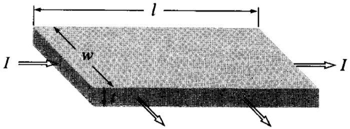
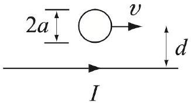

[2] Problem 22. Consider Drude theory again, but now suppose there is also a fixed magnetic field $B \hat { \mathbf { z } }$. In this case, $\mathbf { J }$ is not necessarily parallel to $\mathbf { E }$, but the relation between the two can be described by the "tensor of resistivity". That is, the components are related by

$$
E _ { i } = \sum _ { j \in \{ x , y , z \} } \rho _ { i j } J _ { j } .
$$

Calculate the coefficients $\rho _ { i j }$. Express your answers in terms of the quantities

$$
\rho _ { 0 } = \frac { m } { n q ^ { 2 } \tau } , \quad \omega _ { 0 } = \frac { q B } { m }
$$

as well as the parameter $\tau$.
Solution. The Lorentz force expression says

$$
\frac { d \langle \mathbf { p } \rangle } { d t } = - \frac { \langle \mathbf { p } \rangle } { \tau } + q ( \mathbf { E } + \mathbf { v } \times \mathbf { B } ) .
$$

In the steady state, the left-hand side vanishes, so

$$
\frac { \langle \mathbf { p } \rangle } { q \tau } = \mathbf { E } + \frac { 1 } { m } \langle \mathbf { p } \rangle \times \mathbf { B } .
$$

Switching from $\langle \mathbf { p } \rangle$ to $\mathbf { J }$ and using the variables defined gives

$$
\mathbf { E } = \rho _ { 0 } \mathbf { J } - \rho _ { 0 } \omega _ { 0 } \tau \mathbf { J } \times \hat { \mathbf { z } } .
$$

From this, we can directly read off the components of the resistivity,

$$
\rho = \left( \begin{array} { c c c }
\rho _ { 0 } & - \rho _ { 0 } \omega _ { 0 } \tau & \\
\rho _ { 0 } \omega _ { 0 } \tau & \rho _ { 0 } & \\
& & \rho _ { 0 }
\end{array} \right) .
$$

When the electric field is in the $\hat { \mathbf { z } }$ direction, the magnetic field does nothing, which makes sense.

Example 7: Griffiths 5.40
Since parallel currents attract, the currents within a single wire should contract. To estimate this, consider a long wire of radius $r$. Suppose the atomic nuclei are fixed and have uniform density, while the electrons move along the wire with speed $v$. Furthermore, assume that the electrons contract, filling a cylinder of radius $r ^ { \prime } < r$ with uniform negative charge density, and that the wire is overall neutral. Find $r ^ { \prime }$.

Solution
The contraction of the electrons produces an overall inward electric field, and hence an outward electric force on each electron, which balances the radially inward magnetic force. Specifically, equilibrium occurs when $E = v B$.

Let the charge densities of the nuclei and electrons be $\rho _ { + }$and $\rho _ { - }$. The magnetic field at radius $s \leq r ^ { \prime }$ is found by Ampere's law, which gives

$$
( 2 \pi s ) B = \mu _ { 0 } \left( \rho _ { - } v \right) \left( \pi s ^ { 2 } \right) , \quad B = \frac { \mu _ { 0 } \rho _ { - } v s } { 2 } .
$$

The electric field at this radius is found by Gauss's law, which gives

$$
( 2 \pi s ) E = \frac { 1 } { \epsilon _ { 0 } } \left( \rho _ { + } + \rho _ { - } \right) \pi s ^ { 2 } , \quad E = \frac { 1 } { 2 \epsilon _ { 0 } } \left( \rho _ { + } + \rho _ { - } \right) s .
$$

Note that both $E$ and $B$ are proportional to $s$. Then $E = v B$ can be satisfied at all $s$ simultaneously, which confirms that our assumption that $\rho _ { + }$and $\rho _ { - }$were uniform is self-consistent.

Plugging these results into $E = v B$ yields

$$
\rho _ { + } + \rho _ { - } = \rho _ { - } \left( \epsilon _ { 0 } \mu _ { 0 } v ^ { 2 } \right) = \rho _ { - } \frac { v ^ { 2 } } { c ^ { 2 } }
$$

This can be written in terms of the Lorentz factor of special relativity,

$$
\rho _ { - } = - \gamma ^ { 2 } \rho _ { + } , \quad \gamma = \frac { 1 } { \sqrt { 1 - v ^ { 2 } / c ^ { 2 } } } .
$$

Since the wire is overall neutral, $\rho _ { - } r ^ { \prime 2 } + \rho _ { + } r ^ { 2 } = 0$, so

$$
r ^ { \prime } = \frac { r } { \gamma } .
$$

For nonrelativistic motion, the contraction is extremely small. (However, in plasmas, where the positive charges are also free to move, this so-called pinch effect can be very significant.)
[2] Problem 23 (Griffiths 5.41). A current $I$ flows to the right through a rectangular bar of conducting material, in the presence of a uniform magnetic field B pointing out of the page, as shown.

B

(a) If the moving charges are positive, in what direction are they deflected by the magnetic field? This deflection results in an accumulation of charge on the upper and lower surfaces of the bar, which in turn produces an electric force to counteract the magnetic one. Equilibrium occurs when the two exactly cancel. (This phenomenon is known as the Hall effect.)
(b) Find the resulting potential difference, called the Hall voltage, between the top and bottom of the bar, in terms of $B$, the speed $v$ of the charges, and the dimensions of the bar.
(c) How would the answer change if the moving charges were negative?

When measurements were performed in the early 20th century, some metals were found to have positive moving charges! This "anomalous Hall effect" was solved by the quantum theory of solids, as you can learn in any solid state physics textbook. (It is related to the strange behavior you will see in problem 27.) Today, extensions of the Hall effect, such as the integer and fractional quantum Hall effects, remain active areas of research, and could be used to build quantum computers. We'll return to these effects in X3.

Solution. (a) Using the right-hand rule, we find they are deflected down.

(b) The electric field is $E = v B$, so $V = E t = v B t$ where $t$ is the thickness, i.e. the length in the direction perpendicular to both the current flow and to B. In equilibrium, the bottom is at a higher potential.
(c) If the current stays the same, the charges move the other direction. Since both the charge and velocity flip, the Lorentz force stays the same, so the charges are still deflected down. Thus, the sign of the charge that accumulates on the bottom is flipped, so now the top is at a higher potential. Hence measuring the Hall voltage can be used to find the sign of the charge carriers in a material.
[3] Problem 24 (Zangwill 14.16). A conducting sphere of radius $a$ is moving with speed $v \ll c$ parallel to a straight wire which carries a current $I$. The distance between the wire and the center of the sphere is $d \gg a$.

Show that the force between the wire and the sphere scales as
$$
F \sim \frac { v ^ { 2 } } { c ^ { 2 } } \frac { a ^ { 3 } } { d ^ { 3 } } \mu _ { 0 } I ^ { 2 } .
$$
Is the force attractive or repulsive?

Solution. The Lorentz force $\mathbf { v } \times \mathbf { B }$ pushes on the charges of the sphere, causing the sphere to develop an electric dipole moment, with more positive charge closer to the wire. Then, the motion of the positive and negative charge causes a secondary Lorentz force. This force almost cancels out, except that the magnetic field is stronger closer to the wire, so that we get a net attractive force.

Let's make this more quantitative, dropping all constants in the process. The Lorentz force per unit charge is

$$
v B \sim \frac { \mu _ { 0 } I v } { d } .
$$

This acts on the sphere in the same way as a uniform electric field, and we know from a problem in E2 that this induces an electric dipole moment

$$
p \sim \epsilon _ { 0 } a ^ { 3 } ( v B ) \sim \frac { 1 } { c ^ { 2 } } \frac { a ^ { 3 } I v } { d }
$$

where we used $\epsilon _ { 0 } \mu _ { 0 } = 1 / c ^ { 2 }$. Since we only want to find out how the answer scales, we can approximate the charge distribution on the sphere as a pair of opposite charges $\pm q$ separated by distance $a$, where $p \sim q a$. Then the net force on those charges is

$$
F \sim q v \left( \frac { d B } { d r } a \right) \sim p v \frac { d B } { d r } \sim p v \frac { \mu _ { 0 } I } { d ^ { 2 } } \sim \frac { v ^ { 2 } } { c ^ { 2 } } \frac { a ^ { 3 } } { d ^ { 3 } } \mu _ { 0 } I ^ { 2 }
$$

as desired. If you want to, it wouldn't be too hard to find the constant of proportionality.
Notice that the force is of order $v ^ { 2 } / c ^ { 2 }$. This implies that it cannot be found self-consistently using the Galilean field transformations discussed above. For example, we could use the magnetic limit to conclude that in the sphere's frame, there is a radial electric field $\mathbf { v } \times \mathbf { B }$. Then we would get the right answer by considering the force this field exerts on the polarized sphere. However, things start to break down when we think more carefully. For instance, how can there be a radial electric field if the wire is neutral? Doesn't that violate Gauss's law? And what about the equal and opposite force on the wire? In the sphere's frame, the sphere can only produce an electric field, and the wire is neutral, so the force vanishes!

The problem is that at this order, genuine relativistic effects come into play. As you'll see in R3, the relativistic "loss of simultaneity" effect discussed in R1 implies that in the sphere's frame, the wire actually has a nonzero charge density. This accounts for both of the paradoxes above.
[3] Problem 25. USAPhO 1997, problem B1. A nice problem on the dynamics of a plasma. (Note that the assumption made in part (e) is somewhat arbitrary, without much physical meaning. It's just made to make part (f) a bit simpler.)
[3] Problem 26. USAPhO 2019, problem A3. This is a tough but useful problem. The first half derives the so-called Child-Langmuir law, covered in problem 2.53 of Griffiths.
[3] Problem 27. USAPhO 2022, problem B3. About the weird behavior of electrons in solids.
