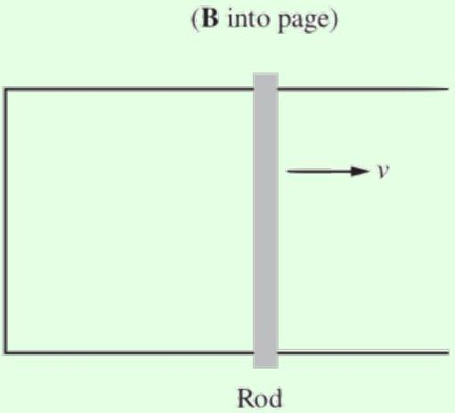
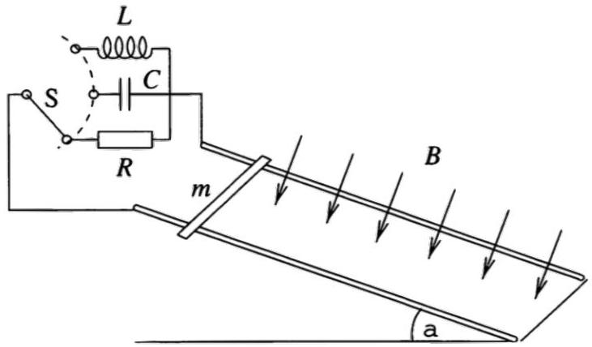
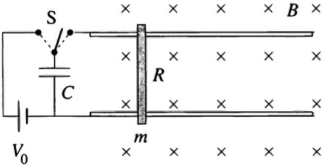

Example 1
A wire is bent into an arbitrary shape in the $x y$ plane, so that its ends are at distances $R _ { 1 }$ and $R _ { 2 }$ from the $z$-axis. The wire is rotated about the $z$-axis with angular velocity $\omega$, in a uniform magnetic field $B \hat { \mathbf { z } }$. Find the emf across the wire.

Solution
The emf is motional emf due to the magnetic force, so

$$
\mathcal { E } = \int ( \mathbf { v } \times \mathbf { B } ) \cdot d \mathbf { r }
$$

The main point of this problem is to get you acquainted with some methods for manipulating vectors. First, we'll use components. Placing the origin along the axis of rotation, we have

$$
\mathbf { v } = \boldsymbol { \omega } \times \mathbf { r } = \omega \hat { \mathbf { z } } \times ( x \hat { \mathbf { x } } + y \hat { \mathbf { y } } ) = \omega ( x \hat { \mathbf { y } } - y \hat { \mathbf { x } } )
$$

for a point on the wire at r. Evaluating the cross product with the magnetic field,

$$
\mathbf { v } \times \mathbf { B } = \omega B ( x \hat { \mathbf { y } } - y \hat { \mathbf { x } } ) \times \hat { \mathbf { z } } = \omega B ( x \hat { \mathbf { x } } + y \hat { \mathbf { y } } ) = \omega B \mathbf { r } .
$$

Therefore, we have

$$
\mathcal { E } = \omega B \int \mathbf { r } \cdot d \mathbf { r } = \frac { \omega B } { 2 } \int _ { R _ { 1 } } ^ { R _ { 2 } } d \left( r ^ { 2 } \right) = \frac { \omega B \left( R _ { 2 } ^ { 2 } - R _ { 1 } ^ { 2 } \right) } { 2 }
$$

which is independent of the wire's detailed shape.
Now let's solve the question again without components. Here it's useful to apply the double cross product, or "BAC-CAB" rule,

$$
\mathbf { a } \times ( \mathbf { b } \times \mathbf { c } ) = \mathbf { b } ( \mathbf { a } \cdot \mathbf { c } ) - \mathbf { c } ( \mathbf { a } \cdot \mathbf { b } ) .
$$

If you want to show this for yourself, note that both sides are linear in a, b, and c, so it's enough to prove it for all combinations of unit vectors they could be; this just follows from casework. We can now simplify the emf integrand as

$$
( \boldsymbol { \omega } \times \mathbf { r } ) \times \mathbf { B } = - \mathbf { B } \times ( \boldsymbol { \omega } \times \mathbf { r } ) = - \boldsymbol { \omega } ( \mathbf { B } \cdot \mathbf { r } ) + \mathbf { r } ( \mathbf { B } \cdot \boldsymbol { \omega } ) .
$$

The first term is zero since r lies in the $x y$ plane, while the second term is $\omega B \mathbf { r }$. The rest of the solution follows as above.

For problems that are essentially two-dimensional, there's not much difference in efficiency between the two methods, so you should use whatever you're more comfortable with. On the other hand, for problems with three-dimensional structure, components tend to get clunky.

## Example 2: Purcell 7.2

A conducting rod is pulled to the right at speed $v$ while maintaining a contact with two rails. A magnetic field points into the page.

An induced emf will cause a current to flow in the counterclockwise direction around the loop. Now, the magnetic force $q \mathbf { u } \times \mathbf { B }$ is perpendicular to the velocity $\mathbf { u }$ of the moving charges, so it can't do work on them. However, the magnetic force certainly looks like it's doing work. What's going on here? Is the magnetic force doing work or not? If not, then what is? There is definitely something doing work because the wire will heat up.

## Solution

A perfectly analogous question is to imagine a block sliding down a ramp with friction, at a constant velocity. Heat is produced, so something is certainly doing work. We might suspect it's the normal force, because it has a horizontal component along the block's direction of horizontal travel. However, it also has a vertical component opposite the block's direction of

vertical travel, so it of course performs no work. All it does is redirect the block's velocity; the ultimate source of energy is gravity.
Similarly, in this case, the current does not flow purely down the page, but also has a rightward component because it is carried along with the rod. Just like the normal force in the ramp example, the magnetic force is perpendicular to the velocity, and does no work. It simply redirects the velocity created by whatever is pulling the rod to the right, which is the ultimate source of energy.
[2] Problem 1 (Purcell). [A] Derive the result of idea 1 using the Lorentz force law as follows.
    (a) Let the loop be $C$ and let v be the velocity of each point on the loop. Argue that after a time $d t$, the change in flux is
$$
d \Phi = \oint _ { C } \mathbf { B } \cdot ( ( \mathbf { v } d t ) \times d \mathbf { s } ) .
$$
    (b) Using the identity $\mathbf { a } \cdot ( \mathbf { b } \times \mathbf { c } ) = - \mathbf { c } \cdot ( \mathbf { b } \times \mathbf { a } )$, show that
$$
\frac { d \Phi } { d t } = - \oint _ { C } ( \mathbf { v } \times \mathbf { B } ) \cdot d \mathbf { s }
$$
and use this to conclude the result.

Solution. (a) Consider a piece $d \mathbf { s }$ of the loop, and consider its motion over a time $d t$. The piece moves by $\mathbf { v } d t$, so we can construct a surface whose boundary is the new loop by considering the original surface, and appending these infinitesimal $d \mathbf { s }$ by $\mathbf { v } d t$ parallelograms to it. The amount of flux going through an infinitesimal parallelograms is $\mathbf { B } \cdot ( \mathbf { v } d t \times d \mathbf { s } )$. Integrating over the entire loop yields the desired result.

(b) Combining the previous parts, we have
$$
d \Phi = - \oint _ { C } ( \mathbf { v } d t \times \mathbf { B } ) \cdot d \mathbf { s }
$$
Dividing by $d t$ yields the desired result.
You might also be wondering how to prove this identity. Note that $\mathbf { a } \cdot ( \mathbf { b } \times \mathbf { c } )$ is the volume of the parallelepiped (i.e. a three-dimensional parallelogram) whose edges are a, b, and c. That's because the volume is the product of the area of the base and the height. Considering b and c to form the base gives a base area $| \mathbf { b } \times \mathbf { c } |$, and taking the dot product with a accounts for the height. The expression $\mathbf { c } \cdot ( \mathbf { b } \times \mathbf { a } )$ computes the same volume, up to a sign, with a and b forming the base. The correct sign can be found by considering a simple case, like the cube, and appropriately applying the right hand rule.
[3] Problem 2 (PPP 167). A homogeneous magnetic field B is perpendicular to a track inclined at an angle $\alpha$ to the horizontal. A frictionless conducting rod of mass $m$ and length $\ell$ straddles the two rails as shown.

How does the rod move, after being released from rest, if the circuit is closed by (a) a resistor of resistance $R$, (b) a capacitor of capacitance $C$, or (c) a coil of inductance $L$ ? In all cases, neglect the self-inductance of the closed loop formed, i.e. neglect the flux that its current puts through itself.

Solution. Suppose the speed of the rod is $v$ down the plane, and the current is $I$ going from the side closer to the reader, to the side farther. By Newton's second law, we have

$$
m \dot { v } = m g \sin \alpha - I \ell B .
$$

The motional emf is $\mathcal { E } = \ell v B$, where positive $\mathcal { E }$ works to increase $I$. Thus, we have $\dot { \mathcal { E } } = \ell B \dot { v }$, so

$$
\frac { m } { \ell B } \dot { \mathcal { E } } = m g \sin \alpha - I \ell B .
$$

All that differs between the three parts is the expression for $\mathcal { E }$.

(a) Here we have $\mathcal { E } = I R$, so
$$
\frac { m } { \ell B } R \dot { I } = m g \sin \alpha - I \ell B .
$$
The solution to this is a decaying exponential that starts at 0 and asymptotes to $I _ { f } = \frac { m g \sin \alpha } { \ell B }$. The velocity of the rod is $v = I R / \ell B$, so the terminal velocity is
$$
v _ { f } = \frac { R m g \sin \alpha } { \ell ^ { 2 } B ^ { 2 } } .
$$
(b) Here we have $\mathcal { E } = Q / C$ where $\dot { Q } = I$, so $\dot { \mathcal { E } } = I / C$. Thus,
$$
\frac { m } { \ell B C } I = m g \sin \alpha - I \ell B ,
$$
which implies the current is constant, and equal to
$$
I = \frac { m g \sin \alpha } { \ell B + \frac { m } { \ell B C } } .
$$
Note that
$$
\ell B \dot { v } = \dot { \mathcal { E } } = \frac { I } { C } .
$$
This implies that the motion is uniformly accelerated, with acceleration
$$
a = \frac { m g \sin \alpha } { m + \ell ^ { 2 } B ^ { 2 } C } .
$$

(c) Here $\mathcal { E } = L \dot { I }$, so
$$
\frac { m } { \ell B } L \ddot { I } = m g \sin \alpha - I \ell B .
$$
This is a simple harmonic motion equation with a shifted origin. Explicitly solving, using the usual techniques of M1, gives the general solution
$$
I ( t ) = \frac { m g \sin \alpha } { \ell B } + I _ { 0 } \cos ( \omega t + \phi ) , \quad \omega ^ { 2 } = \frac { \ell ^ { 2 } B ^ { 2 } } { m L } .
$$
The initial conditions are $I ( 0 ) = 0$ and $\dot { I } ( 0 ) = 0$ since $v ( 0 ) = 0$, so the particular solution is
$$
I ( t ) = \frac { m g \sin \alpha } { \ell B } ( 1 - \cos ( \omega t ) ) .
$$
Now, Faraday's law states that $\ell B \dot { x } = L \dot { I }$, and since $x ( 0 ) = 0$ and $I ( 0 ) = 0$, integrating gives
$$
x ( t ) = \frac { L } { \ell B } I = \frac { m g L \sin \alpha } { \ell ^ { 2 } B ^ { 2 } } ( 1 - \cos ( \omega t ) ) .
$$

[3] Problem 3. USAPhO 2006, problem B1.
Solution. Note that there are two minor typos in the official solution, as noted here. There should be no + $D$ term in B(ii), and for B(v) there are multiple times.
[3] Problem 4 (PPP 168). One end of a conducting horizontal track is connected to a capacitor of capacitance $C$ charged to voltage $V _ { 0 }$. The inductance of the assembly is negligible. The system is placed in a uniform vertical magnetic field $B$, as shown.

A frictionless conducting rod of mass $m$, length $\ell$, and resistance $R$ is placed perpendicularly onto the track. The capacitor is charged so that the rod is repelled from the capacitor when the switch is turned. This arrangement is known as a railgun. Neglect self-inductance throughout this problem.

(a) What is the maximum velocity of the rod, and what is the maximum possible efficiency?
(b) At the end of this process, the rail is moving to the right. Therefore, by momentum conservation, something must have experienced a force towards the left. What is it? Answer this in both the case where the magnetic field is the same everywhere, and when it only overlaps the rails, as shown above.

Solution. (a) Let $I$ be the downward current in the rod, and let $q$ be the charge on the capacitor. We see that $\dot { q } = - I$, and Kirchhoff's loop rule gives

$$
\frac { q } { C } - I R = \mathcal { E } = v \ell B
$$

Taking the derivative and plugging in $\dot { v } = I \ell B / m$ gives

$$
\dot { I } = - \left( \frac { 1 } { R C } + \frac { \ell ^ { 2 } B ^ { 2 } } { R m } \right) I .
$$

The initial condition is $I ( 0 ) = q / R C$, so

$$
I ( t ) = \frac { q } { R C } \exp \left( - t \left( \frac { 1 } { R C } + \frac { \ell ^ { 2 } B ^ { 2 } } { R m } \right) \right) .
$$

Thus, integrating $\dot { v } = I \ell B / m$ and using $v ( 0 ) = 0$ gives

$$
\begin{aligned}
v ( t ) & = \frac { q \ell B } { R C m } \left( \frac { 1 } { R C } + \frac { \ell ^ { 2 } B ^ { 2 } } { R m } \right) ^ { - 1 } \left( 1 - \exp \left( - t \left( \frac { 1 } { R C } + \frac { \ell ^ { 2 } B ^ { 2 } } { R m } \right) \right) \right) \\
& = \frac { V _ { 0 } \ell B C } { m + B ^ { 2 } \ell ^ { 2 } C } \left( 1 - \exp \left( - t \left( \frac { 1 } { R C } + \frac { \ell ^ { 2 } B ^ { 2 } } { R m } \right) \right) \right) .
\end{aligned}
$$

Thus, the rod continually accelerates, asymptotically reaching a maximum speed of

$$
v _ { \max } = \frac { V _ { 0 } \ell B C } { m + B ^ { 2 } \ell ^ { 2 } C } .
$$

The efficiency is the fraction of the initial energy converted to kinetic energy

$$
\eta = \frac { m v _ { \max } ^ { 2 } / 2 } { C V _ { 0 } ^ { 2 } / 2 } = \frac { m } { C } \frac { \ell ^ { 2 } B ^ { 2 } C ^ { 2 } } { \left( m + B ^ { 2 } \ell ^ { 2 } C \right) ^ { 2 } } = \frac { 1 } { ( p + 1 / p ) ^ { 2 } }
$$

where $p = \frac { \sqrt { m } } { \sqrt { C B } \ell }$. Thus, by the AM-GM inequality, the maximum efficiency is 1/4.

(b) Momentum is conserved in both cases. When the magnetic field is uniform, it overlaps the left end of the circuit. The current in the rod implies a return current in the left end, and thus an opposite Lorentz force on it. If the circuit is held in place, the compensating leftward momentum goes to the Earth; if it isn't held in place, the whole circuit recoils to the left.
Now suppose the magnetic field is as shown in the figure, i.e. it doesn't overlap the left part of the circuit. (It does overlap the rails, but that doesn't produce a leftward Lorentz force and so is irrelevant.) To see how momentum is conserved, we need to remember that in electrostatics and magnetostatics, forces are ultimately between charges and currents. We get used to using the Lorentz force law with a given magnetic field, but that magnetic field has to be produced by some current. That current, in turn, can feel a force due to the magnetic field produced by the current in the railgun.
If the magnetic field were the same everywhere, then we could place the currents sourcing them very far away, and thus ignore this effect. (For example, the railgun could be between two distant, infinite uniform sheets of current.) But if the magnetic field is nonhomogeneous, as it is in this case, there must be current nearby. For example, the sudden decrease of the magnetic field shown in the figure above could be achieved by having an infinite sheet of current, which is cut perpendicularly by the rails, with surface current density pointing up the page.
Finally, the current through the rail creates a magnetic field at the current sheet that points into the page. And that implies a Lorentz force to the left, precisely balancing the rightward

Lorentz force on the rail. Momentum is thus conserved; to see explicitly how Newton's third law holds up, see problem 5.50 of Griffiths.
Incidentally, you might have heard the electromagnetic field can also carry momentum. Because of this, in general we shouldn't think of charges and currents interacting with each other, since their momentum won't be conserved; Newton's third law won't hold in general. Instead, charges and currents interact with the field, and the field then interacts with other charges and currents. However, we didn't need that subtlety for this problem, because there is no electromagnetic momentum at play. We'll see setups where it does matter in E7.
[3] Problem 5. USAPhO 2012, problem B2.
Idea 2
Not all motional emfs can be found using $\mathcal { E } = - d \Phi / d t$. Sometimes, for more complex geometries where there is no clear "loop", it's easier to go back to the Lorentz force law.
