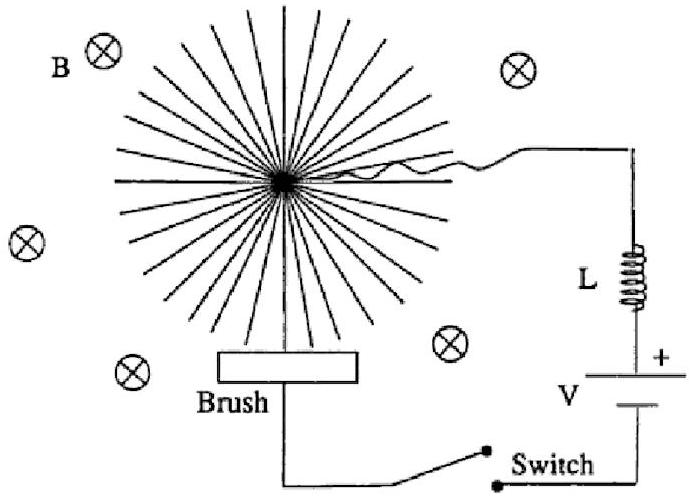
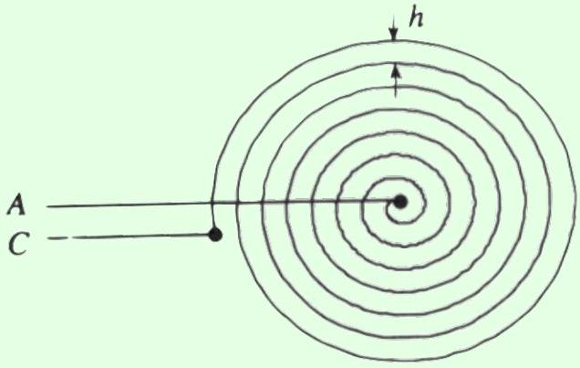
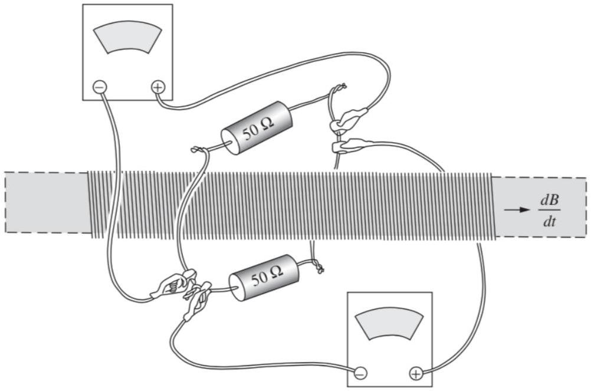
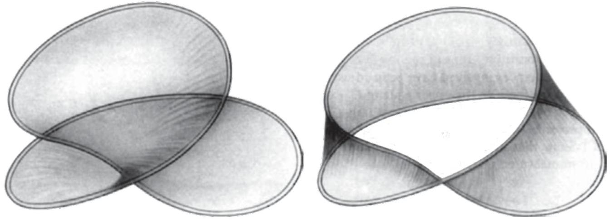
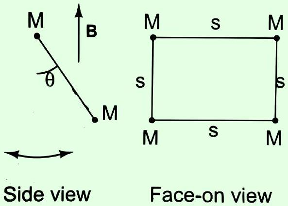
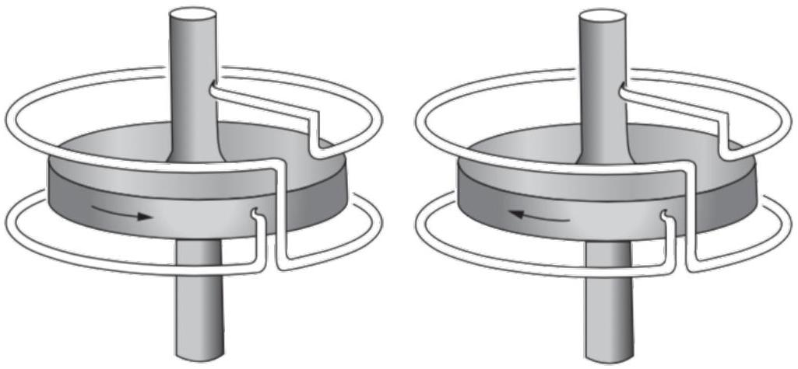
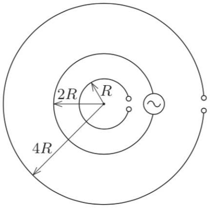
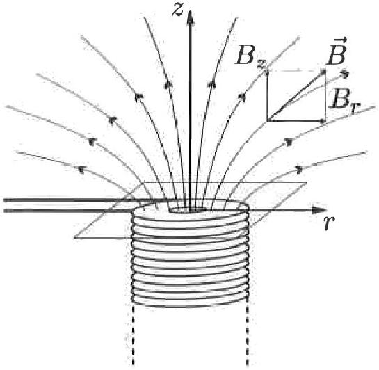
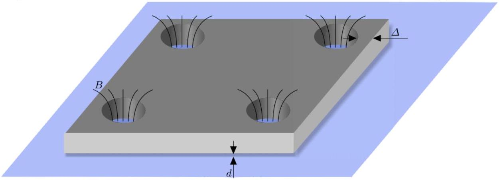

## Electromagnetism V: Induction

Chapter 7 of Purcell covers induction, as does chapter 7 of Griffiths, and chapter 8 of Wang and Ricardo, volume 2. For magnetism, see section 6.1 of Griffiths; for cool applications, see chapters II-16 and II-17 of the Feynman lectures. For a qualitative introduction to superconductivity, see appendix I of Purcell. There is a total of 89 points.

## 1 Motional EMF

Idea 1
If $\mathbf { F }$ is the force on a charge $q$, then the emf about a loop $C$ is

$$
\mathcal { E } = \frac { 1 } { q } \oint _ { C } \mathbf { F } \cdot d \mathbf { s } .
$$

For a moving closed loop in a time-independent magnetic field, the emf through the loop is

$$
\mathcal { E } = - \frac { d \Phi } { d t }
$$

where $\Phi$ is the magnetic flux through the loop. The direction of the emf produces a current that opposes the change in flux.

Example 1
A wire is bent into an arbitrary shape in the $x y$ plane, so that its ends are at distances $R _ { 1 }$ and $R _ { 2 }$ from the $z$-axis. The wire is rotated about the $z$-axis with angular velocity $\omega$, in a uniform magnetic field $B \hat { \mathbf { z } }$. Find the emf across the wire.

Solution
The emf is motional emf due to the magnetic force, so

$$
\mathcal { E } = \int ( \mathbf { v } \times \mathbf { B } ) \cdot d \mathbf { r }
$$

The main point of this problem is to get you acquainted with some methods for manipulating vectors. First, we'll use components. Placing the origin along the axis of rotation, we have

$$
\mathbf { v } = \boldsymbol { \omega } \times \mathbf { r } = \omega \hat { \mathbf { z } } \times ( x \hat { \mathbf { x } } + y \hat { \mathbf { y } } ) = \omega ( x \hat { \mathbf { y } } - y \hat { \mathbf { x } } )
$$

for a point on the wire at r. Evaluating the cross product with the magnetic field,

$$
\mathbf { v } \times \mathbf { B } = \omega B ( x \hat { \mathbf { y } } - y \hat { \mathbf { x } } ) \times \hat { \mathbf { z } } = \omega B ( x \hat { \mathbf { x } } + y \hat { \mathbf { y } } ) = \omega B \mathbf { r } .
$$

Therefore, we have

$$
\mathcal { E } = \omega B \int \mathbf { r } \cdot d \mathbf { r } = \frac { \omega B } { 2 } \int _ { R _ { 1 } } ^ { R _ { 2 } } d \left( r ^ { 2 } \right) = \frac { \omega B \left( R _ { 2 } ^ { 2 } - R _ { 1 } ^ { 2 } \right) } { 2 }
$$

which is independent of the wire's detailed shape.
Now let's solve the question again without components. Here it's useful to apply the double cross product, or "BAC-CAB" rule,

$$
\mathbf { a } \times ( \mathbf { b } \times \mathbf { c } ) = \mathbf { b } ( \mathbf { a } \cdot \mathbf { c } ) - \mathbf { c } ( \mathbf { a } \cdot \mathbf { b } ) .
$$

If you want to show this for yourself, note that both sides are linear in a, b, and c, so it's enough to prove it for all combinations of unit vectors they could be; this just follows from casework. We can now simplify the emf integrand as

$$
( \boldsymbol { \omega } \times \mathbf { r } ) \times \mathbf { B } = - \mathbf { B } \times ( \boldsymbol { \omega } \times \mathbf { r } ) = - \boldsymbol { \omega } ( \mathbf { B } \cdot \mathbf { r } ) + \mathbf { r } ( \mathbf { B } \cdot \boldsymbol { \omega } ) .
$$

The first term is zero since r lies in the $x y$ plane, while the second term is $\omega B \mathbf { r }$. The rest of the solution follows as above.

For problems that are essentially two-dimensional, there's not much difference in efficiency between the two methods, so you should use whatever you're more comfortable with. On the other hand, for problems with three-dimensional structure, components tend to get clunky.

## Example 2: Purcell 7.2

A conducting rod is pulled to the right at speed $v$ while maintaining a contact with two rails. A magnetic field points into the page.

An induced emf will cause a current to flow in the counterclockwise direction around the loop. Now, the magnetic force $q \mathbf { u } \times \mathbf { B }$ is perpendicular to the velocity $\mathbf { u }$ of the moving charges, so it can't do work on them. However, the magnetic force certainly looks like it's doing work. What's going on here? Is the magnetic force doing work or not? If not, then what is? There is definitely something doing work because the wire will heat up.

## Solution

A perfectly analogous question is to imagine a block sliding down a ramp with friction, at a constant velocity. Heat is produced, so something is certainly doing work. We might suspect it's the normal force, because it has a horizontal component along the block's direction of horizontal travel. However, it also has a vertical component opposite the block's direction of

vertical travel, so it of course performs no work. All it does is redirect the block's velocity; the ultimate source of energy is gravity.
Similarly, in this case, the current does not flow purely down the page, but also has a rightward component because it is carried along with the rod. Just like the normal force in the ramp example, the magnetic force is perpendicular to the velocity, and does no work. It simply redirects the velocity created by whatever is pulling the rod to the right, which is the ultimate source of energy.
[2] Problem 1 (Purcell). [A] Derive the result of idea 1 using the Lorentz force law as follows.
    (a) Let the loop be $C$ and let v be the velocity of each point on the loop. Argue that after a time $d t$, the change in flux is
$$
d \Phi = \oint _ { C } \mathbf { B } \cdot ( ( \mathbf { v } d t ) \times d \mathbf { s } ) .
$$
    (b) Using the identity $\mathbf { a } \cdot ( \mathbf { b } \times \mathbf { c } ) = - \mathbf { c } \cdot ( \mathbf { b } \times \mathbf { a } )$, show that
$$
\frac { d \Phi } { d t } = - \oint _ { C } ( \mathbf { v } \times \mathbf { B } ) \cdot d \mathbf { s }
$$
and use this to conclude the result.

Solution. (a) Consider a piece $d \mathbf { s }$ of the loop, and consider its motion over a time $d t$. The piece moves by $\mathbf { v } d t$, so we can construct a surface whose boundary is the new loop by considering the original surface, and appending these infinitesimal $d \mathbf { s }$ by $\mathbf { v } d t$ parallelograms to it. The amount of flux going through an infinitesimal parallelograms is $\mathbf { B } \cdot ( \mathbf { v } d t \times d \mathbf { s } )$. Integrating over the entire loop yields the desired result.

(b) Combining the previous parts, we have
$$
d \Phi = - \oint _ { C } ( \mathbf { v } d t \times \mathbf { B } ) \cdot d \mathbf { s }
$$
Dividing by $d t$ yields the desired result.
You might also be wondering how to prove this identity. Note that $\mathbf { a } \cdot ( \mathbf { b } \times \mathbf { c } )$ is the volume of the parallelepiped (i.e. a three-dimensional parallelogram) whose edges are a, b, and c. That's because the volume is the product of the area of the base and the height. Considering b and c to form the base gives a base area $| \mathbf { b } \times \mathbf { c } |$, and taking the dot product with a accounts for the height. The expression $\mathbf { c } \cdot ( \mathbf { b } \times \mathbf { a } )$ computes the same volume, up to a sign, with a and b forming the base. The correct sign can be found by considering a simple case, like the cube, and appropriately applying the right hand rule.
[3] Problem 2 (PPP 167). A homogeneous magnetic field B is perpendicular to a track inclined at an angle $\alpha$ to the horizontal. A frictionless conducting rod of mass $m$ and length $\ell$ straddles the two rails as shown.

How does the rod move, after being released from rest, if the circuit is closed by (a) a resistor of resistance $R$, (b) a capacitor of capacitance $C$, or (c) a coil of inductance $L$ ? In all cases, neglect the self-inductance of the closed loop formed, i.e. neglect the flux that its current puts through itself.

Solution. Suppose the speed of the rod is $v$ down the plane, and the current is $I$ going from the side closer to the reader, to the side farther. By Newton's second law, we have

$$
m \dot { v } = m g \sin \alpha - I \ell B .
$$

The motional emf is $\mathcal { E } = \ell v B$, where positive $\mathcal { E }$ works to increase $I$. Thus, we have $\dot { \mathcal { E } } = \ell B \dot { v }$, so

$$
\frac { m } { \ell B } \dot { \mathcal { E } } = m g \sin \alpha - I \ell B .
$$

All that differs between the three parts is the expression for $\mathcal { E }$.

(a) Here we have $\mathcal { E } = I R$, so
$$
\frac { m } { \ell B } R \dot { I } = m g \sin \alpha - I \ell B .
$$
The solution to this is a decaying exponential that starts at 0 and asymptotes to $I _ { f } = \frac { m g \sin \alpha } { \ell B }$. The velocity of the rod is $v = I R / \ell B$, so the terminal velocity is
$$
v _ { f } = \frac { R m g \sin \alpha } { \ell ^ { 2 } B ^ { 2 } } .
$$
(b) Here we have $\mathcal { E } = Q / C$ where $\dot { Q } = I$, so $\dot { \mathcal { E } } = I / C$. Thus,
$$
\frac { m } { \ell B C } I = m g \sin \alpha - I \ell B ,
$$
which implies the current is constant, and equal to
$$
I = \frac { m g \sin \alpha } { \ell B + \frac { m } { \ell B C } } .
$$
Note that
$$
\ell B \dot { v } = \dot { \mathcal { E } } = \frac { I } { C } .
$$
This implies that the motion is uniformly accelerated, with acceleration
$$
a = \frac { m g \sin \alpha } { m + \ell ^ { 2 } B ^ { 2 } C } .
$$

(c) Here $\mathcal { E } = L \dot { I }$, so
$$
\frac { m } { \ell B } L \ddot { I } = m g \sin \alpha - I \ell B .
$$
This is a simple harmonic motion equation with a shifted origin. Explicitly solving, using the usual techniques of M1, gives the general solution
$$
I ( t ) = \frac { m g \sin \alpha } { \ell B } + I _ { 0 } \cos ( \omega t + \phi ) , \quad \omega ^ { 2 } = \frac { \ell ^ { 2 } B ^ { 2 } } { m L } .
$$
The initial conditions are $I ( 0 ) = 0$ and $\dot { I } ( 0 ) = 0$ since $v ( 0 ) = 0$, so the particular solution is
$$
I ( t ) = \frac { m g \sin \alpha } { \ell B } ( 1 - \cos ( \omega t ) ) .
$$
Now, Faraday's law states that $\ell B \dot { x } = L \dot { I }$, and since $x ( 0 ) = 0$ and $I ( 0 ) = 0$, integrating gives
$$
x ( t ) = \frac { L } { \ell B } I = \frac { m g L \sin \alpha } { \ell ^ { 2 } B ^ { 2 } } ( 1 - \cos ( \omega t ) ) .
$$

[3] Problem 3. USAPhO 2006, problem B1.
Solution. Note that there are two minor typos in the official solution, as noted here. There should be no + $D$ term in B(ii), and for B(v) there are multiple times.
[3] Problem 4 (PPP 168). One end of a conducting horizontal track is connected to a capacitor of capacitance $C$ charged to voltage $V _ { 0 }$. The inductance of the assembly is negligible. The system is placed in a uniform vertical magnetic field $B$, as shown.

A frictionless conducting rod of mass $m$, length $\ell$, and resistance $R$ is placed perpendicularly onto the track. The capacitor is charged so that the rod is repelled from the capacitor when the switch is turned. This arrangement is known as a railgun. Neglect self-inductance throughout this problem.

(a) What is the maximum velocity of the rod, and what is the maximum possible efficiency?
(b) At the end of this process, the rail is moving to the right. Therefore, by momentum conservation, something must have experienced a force towards the left. What is it? Answer this in both the case where the magnetic field is the same everywhere, and when it only overlaps the rails, as shown above.

Solution. (a) Let $I$ be the downward current in the rod, and let $q$ be the charge on the capacitor. We see that $\dot { q } = - I$, and Kirchhoff's loop rule gives

$$
\frac { q } { C } - I R = \mathcal { E } = v \ell B
$$

Taking the derivative and plugging in $\dot { v } = I \ell B / m$ gives

$$
\dot { I } = - \left( \frac { 1 } { R C } + \frac { \ell ^ { 2 } B ^ { 2 } } { R m } \right) I .
$$

The initial condition is $I ( 0 ) = q / R C$, so

$$
I ( t ) = \frac { q } { R C } \exp \left( - t \left( \frac { 1 } { R C } + \frac { \ell ^ { 2 } B ^ { 2 } } { R m } \right) \right) .
$$

Thus, integrating $\dot { v } = I \ell B / m$ and using $v ( 0 ) = 0$ gives

$$
\begin{aligned}
v ( t ) & = \frac { q \ell B } { R C m } \left( \frac { 1 } { R C } + \frac { \ell ^ { 2 } B ^ { 2 } } { R m } \right) ^ { - 1 } \left( 1 - \exp \left( - t \left( \frac { 1 } { R C } + \frac { \ell ^ { 2 } B ^ { 2 } } { R m } \right) \right) \right) \\
& = \frac { V _ { 0 } \ell B C } { m + B ^ { 2 } \ell ^ { 2 } C } \left( 1 - \exp \left( - t \left( \frac { 1 } { R C } + \frac { \ell ^ { 2 } B ^ { 2 } } { R m } \right) \right) \right) .
\end{aligned}
$$

Thus, the rod continually accelerates, asymptotically reaching a maximum speed of

$$
v _ { \max } = \frac { V _ { 0 } \ell B C } { m + B ^ { 2 } \ell ^ { 2 } C } .
$$

The efficiency is the fraction of the initial energy converted to kinetic energy

$$
\eta = \frac { m v _ { \max } ^ { 2 } / 2 } { C V _ { 0 } ^ { 2 } / 2 } = \frac { m } { C } \frac { \ell ^ { 2 } B ^ { 2 } C ^ { 2 } } { \left( m + B ^ { 2 } \ell ^ { 2 } C \right) ^ { 2 } } = \frac { 1 } { ( p + 1 / p ) ^ { 2 } }
$$

where $p = \frac { \sqrt { m } } { \sqrt { C B } \ell }$. Thus, by the AM-GM inequality, the maximum efficiency is 1/4.

(b) Momentum is conserved in both cases. When the magnetic field is uniform, it overlaps the left end of the circuit. The current in the rod implies a return current in the left end, and thus an opposite Lorentz force on it. If the circuit is held in place, the compensating leftward momentum goes to the Earth; if it isn't held in place, the whole circuit recoils to the left.
Now suppose the magnetic field is as shown in the figure, i.e. it doesn't overlap the left part of the circuit. (It does overlap the rails, but that doesn't produce a leftward Lorentz force and so is irrelevant.) To see how momentum is conserved, we need to remember that in electrostatics and magnetostatics, forces are ultimately between charges and currents. We get used to using the Lorentz force law with a given magnetic field, but that magnetic field has to be produced by some current. That current, in turn, can feel a force due to the magnetic field produced by the current in the railgun.
If the magnetic field were the same everywhere, then we could place the currents sourcing them very far away, and thus ignore this effect. (For example, the railgun could be between two distant, infinite uniform sheets of current.) But if the magnetic field is nonhomogeneous, as it is in this case, there must be current nearby. For example, the sudden decrease of the magnetic field shown in the figure above could be achieved by having an infinite sheet of current, which is cut perpendicularly by the rails, with surface current density pointing up the page.
Finally, the current through the rail creates a magnetic field at the current sheet that points into the page. And that implies a Lorentz force to the left, precisely balancing the rightward

Lorentz force on the rail. Momentum is thus conserved; to see explicitly how Newton's third law holds up, see problem 5.50 of Griffiths.
Incidentally, you might have heard the electromagnetic field can also carry momentum. Because of this, in general we shouldn't think of charges and currents interacting with each other, since their momentum won't be conserved; Newton's third law won't hold in general. Instead, charges and currents interact with the field, and the field then interacts with other charges and currents. However, we didn't need that subtlety for this problem, because there is no electromagnetic momentum at play. We'll see setups where it does matter in E7.
[3] Problem 5. USAPhO 2012, problem B2.
Idea 2
Not all motional emfs can be found using $\mathcal { E } = - d \Phi / d t$. Sometimes, for more complex geometries where there is no clear "loop", it's easier to go back to the Lorentz force law.
[3] Problem 6. A wheel of radius $R$ and moment of inertia $J$ consisting of a large number of thin conducting spokes is free to rotate about an axle. A brush always makes electrical contact with one spoke at a time at the bottom of the wheel.

A battery with voltage $V$ feeds current through an inductor $L$, into the axle, through the spoke, to the brush. There is a uniform magnetic field B pointing into the plane of the paper. At time $t = 0$ the switch is closed.

(a) Find the torque on the wheel and the motional emf along a spoke, as a function of the current $I$ in the circuit and the angular velocity $\omega$ of the wheel.
(b) Solve for the full time evolution of $I ( t )$ and $\omega ( t )$. If there is a small amount of friction and resistance, then what will the final state of the system be?

This setup is an example of a homopolar motor.
Solution. (a) By integrating the force along the wire, the torque is

$$
\tau = \int _ { 0 } ^ { R } I B r d r = \frac { I B R ^ { 2 } } { 2 } .
$$

Similarly, the force per unit charge on a charge a distance $r$ from the center of the disk is $v B = \omega r B$, so the motional emf is

$$
\mathcal { E } = \int _ { 0 } ^ { R } \omega B r d r = \frac { \omega B R ^ { 2 } } { 2 }
$$

(b) Newton's second law gives the time evolution of the wheel,
$$
J \dot { \omega } = \frac { I B R ^ { 2 } } { 2 } .
$$
Kirchhoff's loop rule gives the time evolution of the circuit,
$$
V = L \dot { I } + \frac { \omega B R ^ { 2 } } { 2 } .
$$
When the switch is closed, the current and the wheel will start spinning up simultaneously. However, eventually the wheel will be rotating so fast that the back-emf starts to decrease the current through the inductor. After a while, this current goes negative and starts to slow down the wheel. Finally, once the wheel slows down enough, the current through the inductor can start increasing again. Then it turns out that both $\omega$ and $I$ go to zero, and the process starts again. In other words, both $\omega$ and $I$ oscillate in time.
Now let's see this quantitatively. Differentiating the first equation and plugging it into the second gives
$$
\ddot { \omega } + \frac { 1 } { J L } \left( \frac { B R ^ { 2 } } { 2 } \right) ^ { 2 } \omega = \frac { B R ^ { 2 } } { 2 J L } V
$$
which is a simple harmonic motion equation with solution
$$
\omega ( t ) = C \cos \Omega t + D \sin \Omega t + \frac { 2 V } { B R ^ { 2 } } , \quad \Omega = \frac { B R ^ { 2 } } { 2 \sqrt { J L } } .
$$
We know that $\omega ( 0 ) = 0$, and that initially $I = 0$, which implies $\dot { \omega } ( 0 ) = 0$. Therefore,
$$
\omega ( t ) = \frac { 2 V } { B R ^ { 2 } } ( 1 - \cos \Omega t ) .
$$
Plugging this into Kirchhoff's loop rule gives
$$
I ( t ) = \frac { V } { \Omega L } \sin \Omega t .
$$
Note that if there were a tiny bit of friction or resistance, then eventually these oscillations would damp out. We would then approach the steady state solution, which is where the backemf balances the battery's emf and almost no current flows at all, $I \approx 0$ and $\omega \approx 2 V / B R ^ { 2 }$. (Or, if we used the motor to do work, then in the steady state the current would be nonzero and the angular velocity would be somewhat lower.)
[4] Problem 7. IPhO 1990, problem 2. A neat problem on an exotic propulsion mechanism called an electrodynamic tether, which also reviews M6.

## 2 Faraday's Law

Idea 3
Faraday's law states that even for a time-dependent magnetic field, we still have

$$
\mathcal { E } = - \frac { d \Phi } { d t }
$$

In the case where the loop isn't moving but the magnetic field is changing, the emf is entirely provided by the electric field,

$$
\mathcal { E } = \oint _ { C } \mathbf { E } \cdot d \mathbf { s } .
$$

Electric fields in the presence of changing magnetic fields can thus be nonconservative, i.e. they can have a nonzero closed line integral, a situation we haven't seen in any previous problem set. The differential form of Faraday's law is

$$
\nabla \times \mathbf { E } = - \frac { \partial \mathbf { B } } { \partial t } .
$$

Example 3
A flat metal spiral, with a constant distance $h$ between coils, and $N \gg 1$ total turns is placed in a uniformly growing magnetic field $B ( t ) = \alpha t$ perpendicular to the plane of the spiral.

Find the emf induced between points $A$ and $C$.

Solution
In theory, you can imagine connecting $A$ and $C$ and finding the flux through the resulting loop, but this is hard to visualize. A better way is to imagine turning the spiral into $N$ concentric circles, connected in series. Then the emf is the sum of the emfs through each,

$$
\mathcal { E } = \sum _ { k = 1 } ^ { N } \pi ( k h ) ^ { 2 } \alpha \approx \pi h ^ { 2 } \alpha \int _ { 0 } ^ { N } d k k ^ { 2 } = \frac { \pi } { 3 } h ^ { 2 } N ^ { 3 } \alpha
$$

To see why this is valid, remember that the emfs are due to a nonconservative electric field, integrated along the length of the loop. Deforming it into a bunch of concentric circles doesn't significantly change $\mathbf { E } \cdot d \mathbf { s }$ along it, because $N$ is large, so it doesn't change the answer much.

Remark: EMF vs. Voltage
We mentioned earlier in E2 that we often care about electromotive forces, which just mean any forces that act on charges to push them around a circuit. The force due to a nonconservative electric field is another example.

When nonconservative electric fields are in play, the idea of "voltage" breaks down entirely, because you can't define it consistently. However, electrical engineers use a more pragmatic definition of voltage: to them, voltage is just whatever a voltmeter displays. In other words, what they call voltage is what we call electromotive force. This tends to lead to long and bitter semantic disputes, along with rather nonintuitive results, as you'll see below. For example, the "voltage" can be different for different voltmeters even if they are connected at the same points!

Despite this trouble, we'll go along with the standard electrical engineer nomenclature and refer to these emfs as voltages in later problem sets. For example, Kirchhoff's loop rule should properly say that the sum of the voltage drops along a loop is not zero, but rather $- d \Phi / d t$. But it is conventional to move it to the other side and call it a "voltage drop" of $d \Phi / d t$.

Remark
When we apply Faraday's law, we often use Ampere's law (without the extra displacement current term) to calculate the magnetic field. This is not generally valid, but works if the currents are in the slowly changing "quasistatic" regime, which means radiation effects are negligible. All the problems below assume this, but we'll see more subtle examples in E7.
[2] Problem 8 (Purcell 7.6). An infinite cylindrical solenoid has radius $R$ and $n$ turns per unit length. The current grows linearly with time, according to $I ( t ) = C t$. Assuming the electric field is cylindrically symmetric and purely tangential, find the electric field everywhere.

Solution. Note that $B = \mu _ { 0 } n I$ in the solenoid, so that the flux through a loop of radius $r$ varies as

$$
\frac { d \Phi _ { B } } { d t } = \mu _ { 0 } n C \pi \times \begin{cases} r ^ { 2 } & r < R \\ R ^ { 2 } & r > R \end{cases}
$$

By assumption, the electric field is

$$
\mathbf { E } = E ( r ) \hat { \boldsymbol { \phi } }
$$

and the emf is $2 \pi r E$, so we conclude

$$
E ( r ) = \frac { 1 } { 2 } \mu _ { 0 } n C \times \left\{ \begin{array} { l l }
r & r < R \\
R ^ { 2 } / r & r > R
\end{array} . \right.
$$

Note that we had to assume $\mathbf { E } = E ( r ) \hat { \phi }$. It's impossible to derive that from Maxwell's equations, because it's not true in general; as discussed in E1, you can get different results if you had different boundary conditions (such as the solenoid being inside a giant capacitor) or different initial conditions (such as somebody shining electromagnetic radiation on the solenoid using a flashlight). But this is the solution you get if none of that "extra" stuff is around.

[2] Problem 9 (Purcell 7.4). Two voltmeters are attached around a solenoid with magnetic flux $\Phi$.

Find the readings on the two voltmeters in terms of $d \Phi / d t$, paying attention to the signs.
Solution. Let the resistance of each resistor be $R$. The current in the center loop with the two resistors is $I _ { 0 } = ( d \Phi / d t ) / ( 2 R )$, and the emf across each resistor is $\mathcal { E } _ { 0 } = I _ { 0 } R = ( 1 / 2 ) d \Phi / d t$.
Each voltmeter is connected across one resistor. Now consider the loop formed by one voltmeter's wires, and the half of the center loop closest to it. Neither of these loops encloses the solenoid, so the integral of $\mathbf { E } \cdot d \mathbf { s }$ around each of them is zero. Thus, the emf across the resistor is balanced by the emf across the voltmeter, so each voltmeter reads $\pm \mathcal { E } _ { 0 }$.
The subtlety is in the signs. Suppose that $d \Phi / d t$ is positive, as indicated in the diagram. Then the induced current in the top resistor is rightward, which means the right end of the resistor is at lower potential, which means the top voltmeter reads $- \mathcal { E } _ { 0 }$. But the induced current in the bottom resistor is leftward, so by similar reasoning, the bottom voltmeter reads $\mathcal { E } _ { 0 }$. So different voltmeters, with the same probes connected at the same points, can give different results!
[2] Problem 10 (Purcell 7.28). [A] Consider the loop of wire shown below.

Suppose we want to calculate the flux of B through this loop. Two surfaces bounded by the loop are shown above. Which, if either, is the correct surface to use? If each of the two turns in the loop are approximately circles of radius $R$, then what is the flux? Generalize to an $N$-turn coil.
Solution. Remember that in the definition of the magnetic flux, one needs to define a normal vector $d \mathbf { S }$. This is arbitrary, since for any point on a surface there are two normal vectors which point in opposite directions. Applying Faraday's law requires making a consistent choice.

However, some surfaces are nonorientable, which means it is impossible to define the normal vector on the surface continuously. Concretely, what happens is that if we draw a normal vector at some point (arbitrarily picking up or down), and continuously extend this definition around the surface, we come back to the same point but with the normal vector pointing in the opposite direction. The surface on the right, which is a Mobius strip, has exactly this problem. For this reason, we can't define the flux through it at all! In order to apply Faraday's law (or Gauss's law, etc.) we always have to use orientable surfaces like the one on the left. Thankfully, for any closed loop, an orientable surface whose boundary is the loop always exists; it's called a Seifert surface.

The flux through the left surface is about $2 \pi R ^ { 2 } B$. In general, for $N$ turns, we would get a flux of about $N \pi R ^ { 2 } B$, though this gets hard to visualize in terms of surfaces.

Example 4
A square, rigid loop of wire has resistance $R$, sides of length $s$, and negligible mass. Point masses of mass $M$ are attached at each corner. The top edge of the square loop is mounted so it is horizontal, and the loop may rotate as a frictionless pendulum about a fixed axis passing through this edge. Initially the pendulum is at rest at $\theta = 0$, and a uniform magnetic field B points horizontally through the loop. The magnetic field is then quickly rotated to the vertical direction, as shown.

Describe the subsequent evolution.

Solution
The rotation of the magnetic field provides a sharp impulse that causes the pendulum to start swinging. Letting $\phi$ be the angle of the field to the horizontal,

$$
\mathcal { E } = - \frac { d \left( B _ { x } s ^ { 2 } \right) } { d t } = - B s ^ { 2 } \frac { d ( \cos \phi ) } { d t }
$$

and the torque about the axis of rotation is

$$
\tau = \left( I s B _ { y } \right) s = - \frac { s ^ { 4 } B ^ { 2 } } { R } \sin \phi \frac { d ( \cos \phi ) } { d t } .
$$

The total impulse delivered is

$$
L = \int \tau d t = \frac { s ^ { 4 } B ^ { 2 } } { R } \int _ { 0 } ^ { \pi / 2 } \sin ^ { 2 } \phi d \phi = \frac { \pi } { 4 } \frac { s ^ { 4 } B ^ { 2 } } { R }
$$

which causes an initial angular velocity $\omega = L / \left( 2 M s ^ { 2 } \right)$.

After the pendulum begins swinging, the presence of the magnetic field causes an effective drag force. To see this, note that now we have

$$
\mathcal { E } = - B s ^ { 2 } \frac { d ( \sin \theta ) } { d t }
$$

which implies

$$
\tau = I s ^ { 2 } B \cos \theta = - \frac { s ^ { 4 } B ^ { 2 } } { R } \cos ^ { 2 } \theta \frac { d \theta } { d t } .
$$

Therefore, the $\tau = I \alpha$ equation is

$$
2 M s ^ { 2 } \frac { d ^ { 2 } \theta } { d t ^ { 2 } } = - 2 M g s \sin \theta - \frac { B ^ { 2 } s ^ { 4 } } { R } \cos ^ { 2 } \theta \frac { d \theta } { d t } .
$$

If we take the small angle approximation, then we recover ordinary damped harmonic oscillations, as covered in M4.
[3] Problem 11. USAPhO 2009, problem A1.
[3] Problem 12. USAPhO 1999, problem B2.
[3] Problem 13 (Purcell). A dynamo is a generator that works as follows: a conductor is driven through a magnetic field, inducing an electromotive force in a circuit of which that conductor is part. The source of the magnetic field is the current that is caused to flow in that circuit by that electromotive force. An electrical engineer would call it a self-excited dynamo. One of the simplest dynamos conceivable is shown below.

It has only two essential parts. One part is a solid metal disk and axle which can be driven in rotation. The other is a two-turn "coil" which is stationary but is connected by sliding contacts, or "brushes", to the axle and to the rim of the revolving disk.
(a) Exactly one of the two devices pictured is, at least potentially, a dynamo. Which one?

A dynamo like the one above has a certain critical speed $\omega _ { 0 }$. If the disk revolves with an angular velocity less than $\omega _ { 0 }$, nothing happens. Only when that speed is attained is the induced $\mathcal { E }$ enough to make the current enough to make the magnetic field enough to induce an $\mathcal { E }$ of that magnitude. The critical speed can depend only on the size and shape of the conductors, the conductivity $\sigma$, and the constant $\mu _ { 0 }$. Let $d$ be some characteristic dimension expressing the size of the dynamo, such as the radius of the disk in our example.

(b) Show by a dimensional argument that $\omega _ { 0 }$ must be given by a relation of the form $\omega _ { 0 } = K / \mu _ { 0 } \sigma d ^ { 2 }$ where $K$ is some dimensionless numerical factor that depends only on the arrangement and relative size of the parts of the dynamo.
(c) Demonstrate this result again by using physical reasoning that relates the various quantities in the problem ( $R , \mathcal { E } , E , I , B$, etc.). You can ignore all numerical factors in your calculations and absorb them into the constant $K$.

For a dynamo of modest size made wholly of copper, the critical speed would be practically unattainable. It is ferromagnetism that makes possible the ordinary DC generator by providing a magnetic field much stronger than the current in the coils, unaided, could produce. For an Earth-sized dynamo, however, the critical speed is much smaller. The Earth's magnetic field is produced by a nonferromagnetic dynamo involving motions in the fluid metallic core.

Solution. (a) We claim that the second device is a dynamo. Say a current is flowing that starts at the top contact point, flows down through the rod, then flows through the disk into the other contact point, then flows back. One can check that due to the wires, the magnetic field in the disk is pointing down. Now, as the charge passes into the disk, it has some tangential velocity due to the rotation, and in the first case, the $q \mathbf { v } \times \mathbf { B }$ force is pointing opposed to the flow of current, and in the second case, it is pointing in the same direction as the current. Therefore, a current is sustainable only in the second one.
As you can see, it's not too hard to work out the answer from scratch using the right-hand rule. But in the Indian physics exam system, people are expected to answer problems like these in seconds, by memorizing additional rules that only work in special cases (such as "Fleming's right-hand rule" for generators, and "Fleming's left-hand rule" for motors). I wouldn't recommend doing that; understanding the general principle that produces an answer is much more important than remembering the answer itself.

(b) This is very routine; all you need to do is find the dimensions of $\sigma , d , \mu _ { 0 }$ and verify that the given combination is the only one that works.
(c) The key point is that there is resistance, which could hinder charge movement. The resistance goes like $R \sim 1 / \sigma d$, so we have $V = I R$, or $E d \sim I / \sigma d$, so $E \sim I / \sigma d ^ { 2 }$. We have $B \sim \mu _ { 0 } I / d$, and $E = v B \sim \left( \omega _ { 0 } d \right) \mu _ { 0 } I / d$. Therefore,
$$
I / \sigma d ^ { 2 } \sim \omega _ { 0 } \mu _ { 0 } I
$$
or $\omega _ { 0 } \sim 1 / \mu _ { 0 } \sigma d ^ { 2 }$, as desired.

The coupling of motors and generators is a fascinating subject. A crude model of the power grid can be obtained by combining problems 6 and 13 (and also making all the currents AC). For example, when you start a washing machine in your house, AC power is used to start rotating the drum, which produces a back emf that ultimately slows down the rotation of a generator in a power plant. That generator's power is carefully adjusted to produce a reliable 60.0 Hz output frequency.

In reality, the power grid is comprised of many independent generators distributed across thousands of miles. Since they are all connected, they all rotate at roughly the same frequency; any slightly slower ones will be sped up by the rest. This massive entity is sometimes called "the world's largest machine".

[3] Problem 14. 1 USAPhO 2023, problem B1. A nice problem on a particular kind of motor, which reviews almost everything covered above in this problem set.

[3] Problem 15 (MPPP 178). In general, a magnet moving near a conductor is slowed down by induction effects. Suppose that inside a long vertical, thin-walled, brass tube a strong permanent magnet falls very slowly due to these effects, taking a time $t$ to go from the top to the bottom.
    (a) Let the magnet have mass $m$, and let the tube have resistivity $\rho$, thickness $r$, and length $L$. Suppose both the magnet and tube have radius approximately $R _ { 0 }$, and let the magnet's length also be of order $R _ { 0 }$. Let the typical magnetic fields produced at the magnet's surface have magnitude $B _ { 0 }$. Find an estimate for $t$, up to dimensionless constants.
    (b) If the experiment is repeated with a copper tube of the same length but a larger diameter, the magnet takes a time $t ^ { \prime }$ to fall through. How long does it take for the magnet to fall through the tubes if they are fitted inside each other? Neglect the mutual inductance of the tubes.

Solution. (a) The magnetic flux through a horizontal slice of the tube near the magnet changes by order $B _ { 0 } R ^ { 2 }$ when the magnet moves through a distance of about $R _ { 0 }$, so

$$
\mathcal { E } \sim \frac { B _ { 0 } R _ { 0 } ^ { 2 } } { R _ { 0 } / v } \sim B _ { 0 } v R _ { 0 } .
$$

This flux change mostly happens in a vertical section of tube of length about $R _ { 0 }$. The resistance of this section of tube is

$$
R \sim \rho \frac { R _ { 0 } } { r R _ { 0 } } \sim \frac { \rho } { r } .
$$

Therefore, the power dissipated is

$$
P \sim \frac { \mathcal { E } ^ { 2 } } { R } \sim \frac { B _ { 0 } ^ { 2 } v ^ { 2 } R _ { 0 } ^ { 2 } r } { \rho } .
$$

In the steady state, this balances the rate of dissipation of gravitational potential energy, $P \sim m g v$. Combining these gives

$$
v \sim \frac { m g \rho } { R _ { 0 } ^ { 2 } B _ { 0 } ^ { 2 } r } .
$$

This gives the estimate

$$
t \sim \frac { L } { v } \sim \frac { L R _ { 0 } ^ { 2 } B _ { 0 } ^ { 2 } r } { m g \rho } .
$$

This is a pretty rough estimate; for a quantitative treatment, see this paper.

(b) Assuming the tubes contain independent eddy currents, we can think of them as just two resistors in parallel. In parallel, the inverse resistivity $1 / \rho$ adds. But $t \propto 1 / \rho$, which means $t$ adds. Thus, the new time is simply $t + t ^ { \prime }$. (This is a bit slick, but if you're concerned about its correctness you can also just run through the derivation in part (a) twice to get the result.)

Remark
In this problem set, we presented motional emf first, and emf from a changing magnetic flux second. But historically, it went the other way around, as described here. Maxwell was aware of Faraday's experiments, which stated that $\mathcal { E } = - d \Phi / d t$ for stationary loops. He then demanded that this remain true for moving loops, and deduced that there must be a force per charge of v × B. That is, Maxwell used Faraday's law to derive the Lorentz force! This is a reminder that the process of discovery is messy. When new physics is being found, the

very same fact could be a law, a derived result, or simply true by definition, depending on where you start from. And it's not clear which it'll end up being until the dust settles.

## 3 Inductance

Idea 4: General Inductance
Consider a set of loops with fluxes $\Phi _ { i }$ and currents $I _ { i }$. By linearity, they are related by

$$
\Phi _ { i } = \sum _ { j } L _ { i j } I _ { j }
$$

where the $L _ { i j }$ are called the coefficients of inductance. It can be shown that $L _ { i j } = L _ { j i }$, and we call this quantity the mutual inductance of loops $i$ and $j$. The corresponding emfs are

$$
\mathcal { E } _ { i } = \sum _ { j } L _ { i j } \dot { I } _ { j } .
$$

In contrast with capacitance, we're usually concerned with the self-inductance $L _ { i } = L _ { i i }$ of single loops; these inductors provide an emf of $L \dot { I }$ each. However, mutual inductance can also be important, as we'll see in E6.

Remark
The inductance coefficients are similar to the capacitance coefficients in E2, but more useful. For capacitors, we are typically interested in configurations with one positive and one negative plate, and the capacitance of this object is related to all of the capacitance coefficients in a complicated way, as we saw in E2. But most inductors just use self-inductance, so the inductance we care about is simply one of the coefficients, $L _ { i i }$. Moreover, the "mutual inductance" coefficients $L _ { i j }$ are also in the right form to be directly used, since they tell us how current changes in one part of the circuit impact emfs elsewhere.

A more general way to describe the difference is that $\mathcal { E }$ and $\dot { I }$ are directly measurable and controllable quantities, while the $Q$ and $V$ (i.e. the voltage relative to infinity) that the capacitance coefficients relate are less so.

Idea 5
The energy stored in a magnetic field is

$$
U = \frac { 1 } { 2 \mu _ { 0 } } \int B ^ { 2 } d V
$$

which implies the energy stored in an inductor is

$$
U = \frac { 1 } { 2 } L I ^ { 2 }
$$

where $L$ is the self-inductance.

Example 5
Compute the self-inductance of a cylindrical solenoid of radius $R$, length $H \gg R$, and $n$ turns per length.

Solution
One straightforward way to do this is to use the magnetic field energy. We have

$$
U = \frac { 1 } { 2 \mu _ { 0 } } \left( \mu _ { 0 } n I \right) ^ { 2 } \left( \pi R ^ { 2 } H \right)
$$

and setting this equal to $L I ^ { 2 } / 2$ gives

$$
L = \pi \mu _ { 0 } n ^ { 2 } R ^ { 2 } H = \mu _ { 0 } N ^ { 2 } \frac { \pi R ^ { 2 } } { H }
$$

where $N$ is the total number of turns.
We can also try to use the definition of inductance directly, $\Phi = L I$. But it's hard to imagine a surface bounded by the solenoid wires; as we saw in problem 10, even the case $N = 2$ is tricky! Instead it's better to use the form $\mathcal { E } = L \dot { I }$. We can then compute the emf across each turn of the solenoid individually, then add them together.

To compute the emf across one turn, we can replace it with a circular loop; this is valid because the emf ultimately comes from the local electric field, which shouldn't change too much if we deform the loop in this way. Then

$$
\left| \mathcal { E } _ { \text {loop } } \right| = \frac { d \Phi } { d t } = \left( \mu _ { 0 } n \dot { I } \right) \left( \pi R ^ { 2 } \right) .
$$

The inductance is hence

$$
L = \frac { N \mathcal { E } _ { \text {loop } } } { \dot { I } } = \left( \mu _ { 0 } n N \right) \left( \pi R ^ { 2 } \right) = \mu _ { 0 } N ^ { 2 } \frac { \pi R ^ { 2 } } { H }
$$

as expected.

Example 6
Find the outward pressure at the walls of the solenoid in the previous example.

Solution
An outward pressure exists because of the Lorentz force of the axial magnetic field of the solenoid acting on the circumferential currents at the walls. The force per length acting on a wire is $I B$, and the pressure is this quantity times the turns per length, so naively

$$
P = \left( \mu _ { 0 } n I \right) ( n I ) .
$$

However, this is off by a factor of 2. To see why, consider a small Amperian rectangle

that straddles the surface of the solenoid. The currents near this rectangle contribute axial magnetic fields of $\mu _ { 0 } n I / 2$ inside and $- \mu _ { 0 } n I / 2$ outside. Thus, the currents due to the entire rest of the solenoid contribute $\mu _ { 0 } n I / 2$ both inside and outside. Since a wire can't exert a force on itself, only the latter field matters, so the true answer is

$$
P = \frac { 1 } { 2 } \mu _ { 0 } n ^ { 2 } I ^ { 2 } = \frac { B ^ { 2 } } { 2 \mu _ { 0 } } .
$$

Remark: Electromagnetic Stress
The above example is like the one in E1, where we showed that the inward pressure on a conductor's surface due to electrostatic forces is $\epsilon _ { 0 } E ^ { 2 } / 2$. In fact, there's a general principle behind both: electric and magnetic fields carry a tension per unit area (i.e. a negative pressure) of magnitude $\epsilon _ { 0 } E ^ { 2 } / 2$ or $B ^ { 2 } / 2 \mu _ { 0 }$ along their directions, and a repulsion per unit area (i.e. a positive pressure) $\epsilon _ { 0 } E ^ { 2 } / 2$ or $B ^ { 2 } / 2 \mu _ { 0 }$ perpendicular to their directions. Charges and currents, such as at the walls of a solenoid or the plates of a capacitor, cause discontinuities in E or B across them, leading to a net force on them.

This isn't mentioned in introductory electromagnetism books because the proper treatment of anisotropic pressure requires tensors. However, more advanced books will introduce the Maxwell stress tensor, from which the results above can be read off.

The great experimentalist Michael Faraday was a huge fan of these results. He viewed field lines as physical objects, which he called "lines of force", that carried tension along their lengths and repelled each other. But you can't take this picture too literally, as the number of field lines is proportional to $E$ or $B$, while the stress is proportional to $E ^ { 2 }$ or $B ^ { 2 }$.

These days, we don't ascribe so much importance to field lines. The fundamental object is the field itself, and field lines are a secondary construction that often just adds mathematical complication. For example, the field of a dipole is simple, but it's not so simple to solve for the corresponding field lines. And in R3, we'll show how fields transform between frames, which implies that the very existence of a field line can depend on the reference frame.

Things get even more complicated in dynamic situations. Faraday viewed induction as a result of "cutting" magnetic field lines, and even suggested that light waves propagated along them like waves on a string. Those ideas don't really line up with the actual math, but Faraday's field line is still useful in some contexts. For instance, in plasma physics, field lines can be used to visualize magnetic reconnection.

Remark
Recall the example in E1 involving the force between two spherical balls of charge. There, we got the answer using a slightly tricky argument, where Newton's third law allowed us to use the shell theorem twice. But the idea of electromagnetic stress provides a straightforward alternative proof which also works for more general situations.

Suppose the two balls lie above and below the $x y$ plane, and additional external forces hold them both at rest. Consider as a system everything at $z > 0$, which includes the second ball and a lot of empty space. The only external forces on this system are from the attractive $\epsilon E ^ { 2 } / 2$ pressure at the $x y$ plane, and the force $F$ which holds the second ball in place. Since the momentum of the system is constant, these forces must cancel. Thus, to compute $F$ we only need to know the electric field on the $x y$ plane, for which we can clearly apply the shell theorem to both balls, replacing them with point charges.

The general idea is that electromagnetic forces on objects can be determined solely by the electromagnetic fields in the space around them. You can use this to find shorter solutions to some problems in E1.

[2] Problem 16. To check that you understand example 6, let the cylinder axis be vertical, and suppose the solenoid wires are wound at an angle $\theta$ to the horizontal. The example corresponds to $\theta = 0 ^ { \circ }$, but when $\theta = 90 ^ { \circ }$ the wires run straight up, leading to an inward pressure at the walls. Find the angle $\theta$ at which the pressure vanishes.
Solution. To avoid juggling too many variables, we'll just work in terms of the surface current density K. At the walls, we have
$$
\mathbf { K } = K _ { 0 } \sin \theta \hat { \mathbf { z } } + K _ { 0 } \cos \theta \hat { \boldsymbol { \theta } }
$$
where $K _ { 0 }$ is some constant that depends on the wire spacing. (Note that $K _ { 0 }$ is not equal to $n I$, since the wires are at an angle to the horizontal. But it won't affect the answer since everything will scale with $K _ { 0 }$.) Applying Ampere's law gives
$$
\mathbf { B } = \mu _ { 0 } K _ { 0 } \times \begin{cases} \cos \theta \hat { \mathbf { z } } & \text { inside } , \\ \sin \theta \hat { \boldsymbol { \theta } } & \text { outside } . \end{cases}
$$
By the same logic as in the example, we have an outward pressure $\left( \mu _ { 0 } K _ { 0 } ^ { 2 } / 2 \right) \cos ^ { 2 } \theta$, but now we also have an inward pressure $\left( \mu _ { 0 } K _ { 0 } ^ { 2 } / 2 \right) \sin ^ { 2 } \theta$. The two cancel when $\theta = 45 ^ { \circ }$.
[3] Problem 17. Consider a toroidal solenoid with a rectangular cross section of height $h$ and width $w , N$ turns, and inner radius $R$.
    (a) Find the self-inductance by considering the magnetic flux.
    (b) Verify that the two formulas for energy given in idea 5 are consistent in this setup.
    (c) Now suppose the current increases at a constant rate $d I / d t$. Find the magnitude of the electric field at a height $z$ above the center of the solenoid, assuming $h , w \ll R \ll z$. (Hint: write down the divergence and curl of $\mathbf { E }$ in terms of $\dot { \mathbf { B } }$ in general, and notice the similarities to the equations for B in terms of J. This allows us to use the ideas of E3 by analogy.)

Solution. (a) Symmetry and Ampere's law imply that the field inside is $B = \frac { \mu _ { 0 } N I } { 2 \pi r }$ pointing in the $\hat { \boldsymbol { \phi } }$ direction. Hence the flux through a single loop is

$$
\Phi = \frac { \mu _ { 0 } N I h } { 2 \pi } \log \frac { R + w } { R } .
$$

The inductance is

$$
L = \frac { N \Phi } { I } = \frac { \mu _ { 0 } N ^ { 2 } h } { 2 \pi } \log \frac { R + w } { R } .
$$

(b) Let's compute the total energy of the magnetic field. The magnetic field outside the solenoid is zero, and the magnetic field inside is $B = \mu _ { 0 } N I / 2 \pi r$. Now consider cylindrical shells of radius $r$, thickness $d r$, and volume $d V = 2 \pi r h d r$. The field energy is
$$
U = \int \frac { B ^ { 2 } } { 2 \mu _ { 0 } } d V = \int _ { R } ^ { R + w } \frac { \left( \mu _ { 0 } N I \right) ^ { 2 } } { 2 \mu _ { 0 } ( 2 \pi r ) ^ { 2 } } ( 2 \pi r h d r ) = \frac { \mu _ { 0 } N ^ { 2 } I ^ { 2 } h } { 4 \pi } \int _ { R } ^ { R + w } \frac { d r } { r } = \frac { \mu _ { 0 } N ^ { 2 } I ^ { 2 } h } { 4 \pi } \log \frac { R + w } { R } .
$$
Referring to the result of part (a), the expression $U = L I ^ { 2 } / 2$ yields the same result.
(c) We know $\dot { \mathbf { B } }$ and want to find $\mathbf { E }$, which in this problem is determined by the equations
$$
\nabla \times \mathbf { E } = - \dot { \mathbf { B } } , \quad \nabla \cdot \mathbf { E } = 0 .
$$
But we already know how to solve problems of this form, because the equations that govern the magnetic field in magnetostatic situations are
$$
\nabla \times \mathbf { B } = \mu _ { 0 } \mathbf { J } , \quad \nabla \cdot \mathbf { B } = 0 .
$$
So if we formally define a current $\mathbf { J } ^ { \prime }$ by $- \dot { \mathbf { B } } = \mu _ { 0 } \mathbf { J } ^ { \prime }$, and use the Biot-Savart law to solve for the corresponding $\mathbf { B } ^ { \prime }$, then that quantity will be precisely the $\mathbf { E }$ we're looking for.
Now, $- \dot { \mathbf { B } }$ is localized within the toroid, so since we're assuming the toroid is thin, we can approximate $\mathbf { J } ^ { \prime }$ as a ring of current $I ^ { \prime } = ( \Phi / I ) \dot { I } / \mu _ { 0 }$. The resulting magnetic field is
$$
\mathbf { B } ^ { \prime } = \frac { \mu _ { 0 } I ^ { \prime } } { 2 } \frac { R ^ { 2 } } { \left( z ^ { 2 } + R ^ { 2 } \right) ^ { 3 / 2 } } \hat { \mathbf { z } } = \frac { \dot { I } } { 2 } \left( \frac { \mu _ { 0 } N h } { 2 \pi } \log \frac { R + w } { R } \right) \frac { R ^ { 2 } } { \left( z ^ { 2 } + R ^ { 2 } \right) ^ { 3 / 2 } } \hat { \mathbf { z } }
$$
and this is the electric field we're looking for. (The sign isn't determined since the problem didn't specify which way the current in the solenoid went, but this doesn't affect the magnitude.) We can use $w \ll R \ll z$ to simplify more, giving an answer of
$$
E \approx \frac { \mu _ { 0 } \dot { I } } { 4 \pi } \frac { N h w R } { z ^ { 3 } } .
$$

Remark
In electromagnetism, we often have issues with divergences when we take idealized point sources. For example, the voltage near a point charge can become arbitrarily high. Similarly, the magnetic field diverges as you approach an idealized, infinitely-thin wire, which causes the self-inductance of wire loops to diverge. Of course, the resolution is that you don't actually get an infinite magnetic field as you approach a wire. A real wire has finite thickness, and its magnetic field instead goes to zero as you approach its center. (We didn't run into this problem for solenoids, because we modeled their wires as a uniform sheet of current, whose magnetic field isn't singular at all.) If a problem does involve a wire loop, it'll often circumvent this messy issue by just giving the self-inductance from the start.

[2] Problem 18. A loop of wire is bent into a long "stadium" shape, with two parallel straight edges of approximate length $\ell / 2$ connected by semicircles of diameter $d \ll \ell$.
    (a) Write down an integral expression for the self-inductance, neglecting the curved parts, and show that it diverges.

(b) Find a rough estimate for the self-inductance by taking the wire to have radius $r \ll d$ and ignoring any flux through the wire itself.

Solution. (a) We see the flux to be

$$
\Phi = \int _ { 0 } ^ { d } \frac { \mu _ { 0 } I } { 2 \pi } \left( \frac { 1 } { x } + \frac { 1 } { d - x } \right) \frac { \ell } { 2 } d x
$$

which is infinite, because the integral of $1 / x$ is logarithmically divergent.

(b) We replace the flux integral with
$$
\Phi = \int _ { r } ^ { d - r } \frac { \mu _ { 0 } I } { 2 \pi } \left( \frac { 1 } { x } + \frac { 1 } { d - x } \right) \frac { \ell } { 2 } d x
$$
This gives an inductance of
$$
L = \frac { \Phi } { I } = \frac { \mu _ { 0 } \ell } { 2 \pi } \log \left( \frac { d - r } { r } \right) \approx \frac { \mu _ { 0 } \ell } { 2 \pi } \log ( d / r ) .
$$
This still diverges in the $r \rightarrow 0$ limit, as it should, but the presence of the logarithm means that the inductance doesn't depend that strongly on $d$, for realistic values. That's why we can often get away with not mentioning the details of the wire; you'll get a similar answer as long as it's thin.

[3] Problem 19. Consider two concentric rings of radii $r$ and $R \gg r$.

(a) Compute the mutual inductance by considering a current through the larger ring.
(b) Compute the mutual inductance by considering a current through the smaller ring, and verify your results agree. (Hint: this can be done without difficult integrals.)

In general, computing mutual inductance is a hard and practically important problem; there have been whole books written on the subject.

Solution. (a) The field at the center is $\mu _ { 0 } I / 2 R$, so the flux through the small ring is $\Phi =$ $\left( \mu _ { 0 } I / 2 R \right) \pi r ^ { 2 }$, so $L _ { 12 } = \frac { \mu _ { 0 } \pi r ^ { 2 } } { 2 R }$.

(b) Consider the entire infinite plane the smaller ring lies in. The key idea is that the total flux through this plane is zero: every magnetic flux line due to the ring that goes up through the plane comes down through it somewhere else. Now decompose this plane into the part in the big ring and the part outside. We have
$$
\Phi _ { \mathrm { plane } } = \Phi _ { \mathrm { in } } + \Phi _ { \mathrm { out } } = 0
$$
which means $\Phi _ { \text {in } } = - \Phi _ { \text {out } }$. This is useful because calculating $\Phi _ { \text {in } }$ is very complicated. Calculating $\Phi _ { \text {out } }$ is easy because the whole region is far from the small ring, so its field can be approximated as a dipole field.
The field at a distance $s$ away in the plane of the rings is $\mathbf { B } = B _ { z } \hat { \mathbf { z } }$ where $B _ { z } = \frac { \mu _ { 0 } I \pi r ^ { 2 } } { 4 \pi s ^ { 3 } }$. The flux is then
$$
\left| \Phi _ { \text {in } } \right| = \left| \Phi _ { \text {out } } \right| = \frac { \mu _ { 0 } I r ^ { 2 } } { 4 } \int _ { R } ^ { \infty } \frac { 1 } { s ^ { 3 } } 2 \pi s d s = \frac { \mu _ { 0 } I \pi r ^ { 2 } } { 2 R }
$$
Dividing by $I$ gives the same result as (a), as expected.

[2] Problem 20 (MPPP 181). Three nearly complete circular loops, with radii $R , 2 R$, and $4 R$ are placed concentrically on a horizontal table, as shown.

A time-varying electric current is made to flow in the middle loop. Find the voltage induced in the largest loop at the moment when the voltage between the terminals of the smallest loop is $V _ { 0 }$.
Solution. As you might have noticed from the previous problems, inductances generally scale with one power of length. In this case, the only length scale is the radii of the rings, so the mutual inductance of the $2 R$ and $4 R$ loops is twice that of the $2 R$ and $R$ loops by dimensional analysis. Since $V _ { 0 } = L _ { R , 2 R } \dot { I } _ { 2 R }$, we have $V _ { 4 R } = L _ { 2 R , 4 R } \dot { I } _ { 2 R } = 2 V _ { 0 }$.
But there's a subtlety: in problem 18, we found that the self-inductance of a wire loop depended on the radius $r$ of the wire, so why didn't we allow it in the dimensional analysis here? The point is that the self-inductance of a wire loop depends on the flux the loop puts through itself, so it depends on the very large magnetic fields very closer to the wire. But a mutual inductance only depends on the flux one loop puts through another, and here, all points of the second loop are far away from the first loop. So the wire radius doesn't matter, just like how it didn't in problem 19.

## 4 Magnetism

In this section we'll dip a little into atomic physics and the origin of magnetism. However, a proper understanding of this subject requires quantum mechanics, as we'll cover in T3 and X3.

Idea 6
A spinning object of charge $q$ and mass $m$ carries a magnetic dipole moment $\boldsymbol { \mu }$ and angular momentum $\mathbf { J }$. If its mass and charge distributions are proportional, then $\boldsymbol { \mu }$ and $\mathbf { J }$ point in the same direction, and in classical mechanics, their ratio is always $\mu / J = q / 2 m$.

In quantum mechanics, it turns out that $\mu / J = q g / 2 m$, where the $g$-factor is an order-one number, which is about 2 for the electron. Unfortunately, there's no way to derive this result with the Olympiad syllabus, so problems about magnetism can at best make rough estimates.

Example 7
Suppose the magnetic moment of an iron atom is due to a single unpaired electron, with angular momentum of order $\hbar$. The atoms are separated by a distance $d \sim 10 ^ { - 10 } \mathrm {~m}$. Estimate the maximum magnetic field an iron magnet can produce. How does this compare to the fields that can be produced in an electromagnet?

Solution
The answer doesn't scale significantly with the physical size of the iron magnet. To see this, think in terms of electric dipoles: if you have a giant cube of electric dipoles, it's equivalent to having a fixed surface charge density $\pm \sigma$ on two of the faces. The electric field produced by such a charge density near each face is of order $\sigma / \epsilon _ { 0 }$, independent of the size of the cube.

Therefore, the only things the magnetic field can depend on are $\mu _ { 0 }$, the magnetic dipole moment $\mu$ of a single atom, and $d$. By dimensional analysis,

$$
B \sim \mu _ { 0 } \frac { \mu } { d ^ { 3 } }
$$

which can also be thought of as $\mu _ { 0 } M$, where $M$ is the magnetization density. Taking $\mu \sim e \hbar / m _ { e }$ and plugging in the numbers gives $B \sim 10 \mathrm {~T}$, which is the right order of magnitude.

Now consider the case of an electromagnet, where the field is produced by moving electrons with typical speed $v$, moving in a loop with typical size $r$. In a metal, there's on the order of one free electron per atom, so $d$ is still the same. The difference is that the field made by each electron does scale with $r$, because each has magnetic moment

$$
\mu = I A \sim \frac { e v } { r } r ^ { 2 } .
$$

Compared to the previous result, this is larger by a factor of $m v r / \hbar$. The two are comparable, for $r \sim 1 \mathrm {~m}$, if the electrons travel at the agonizingly slow velocity $v \sim 10 ^ { - 4 } \mathrm {~m} / \mathrm { s }$.

Therefore, you would get a magnetic field much larger than 10 T if you could make the electrons go at a reasonable walking speed, but that's easier said than done. The largest steady magnetic fields made in the lab are only about 40 T. Such a field carries a pressure which would rip apart a solenoid made of coiled wire,

$$
P = \frac { ( 40 \mathrm {~T} ) ^ { 2 } } { 2 \mu _ { 0 } } = 0.6 \mathrm { GPa } .
$$

For an exercise involving these pressure forces, see USAPhO 2025, problem A3.
Instead, these fields are produced in Bitter electromagnets, which are solenoids made of thick metal plates, perforated with cooling channels to dissipate the enormous heat produced by resistance. It is possible to produce higher fields temporarily, but the results will be explosive.
[3] Problem 21. USAPhO 2021, problem A3. A simple classical model of an electron.
[3] Problem 22 (USAPhO 2007). This is a rewrite of USAPhO 2007, problem B2, which has several typos and ambiguities. In this problem, we will model diamagnetism in materials classically. For simplicity, we will assume that each atom consists of a single electron of charge - $e$ and mass $m _ { e }$, orbiting a single proton of charge $e$ and mass $m _ { p } \gg m _ { e }$ in a circle of radius $R$.

(a) Find the angular velocity $\omega _ { 0 }$ of the electron's orbit. For simplicity, you may use $\omega _ { 0 }$ and $R$ in all of your answers below.

(b) When we average over many orbits of the electron, it is effectively a small current loop, which produces the field of a magnetic dipole moment. Find the magnitude $m$ of this dipole moment.

We model a diamagnetic substance with $N$ atoms to have all atoms oriented in the $x y$ plane, with half of them orbiting clockwise and the other half orbiting counterclockwise when viewed looking down along the $z$-axis. In this state, the total magnetic moment cancels out. Next, an external magnetic field $B _ { 0 } \hat { \mathbf { z } }$ is slowly turned on over a long time $\Delta t$. You may assume that $B _ { 0 }$ is small.

(c) For counterclockwise orbits, find an approximate expression for the total work done on the electrons by the induced field during this process.
(d) For counterclockwise orbits, the final angular velocity is $\omega = \omega _ { 0 } + \Delta \omega$ and the final orbit radius is $R ^ { \prime } = R + \Delta R$. Find $\Delta \omega / \omega _ { 0 }$ and $\Delta R / R$ to first order in $B _ { 0 }$.
(e) To first order in $B _ { 0 }$, find the total magnetic moment of the material, and its direction.

Solution. (a) By equating the electrostatic force to the centripetal force, we have

$$
\omega _ { 0 } = \sqrt { \frac { e ^ { 2 } } { 4 \pi \epsilon _ { 0 } m _ { e } R ^ { 3 } } } .
$$

(b) The effective current loop carries an average current $e / \left( 2 \pi / \omega _ { 0 } \right)$, and has an area of $\pi R ^ { 2 }$. Thus, we have
$$
m = \frac { e \omega _ { 0 } R ^ { 2 } } { 2 } .
$$
(c) The induced electric field at the radius of the orbit is
$$
E = \frac { 1 } { 2 \pi R } \frac { d \Phi } { d t } = \frac { B _ { 0 } R } { 2 \Delta t }
$$
so that the work done on the electrons is approximately
$$
W \approx e E \left( \omega _ { 0 } R \right) \Delta t = \frac { e \omega _ { 0 } B _ { 0 } R ^ { 2 } } { 2 } .
$$
Here we have approximated $\omega _ { 0 }$ and $R$ as constant during the process. Of course, they might change a bit, but this would give a higher-order correction, and we're considering small $B _ { 0 }$.
(d) Since the magnetic field changes slowly, the orbit stays circular. We thus have
$$
m _ { e } \omega ^ { 2 } R ^ { \prime } = \frac { e ^ { 2 } } { 4 \pi \epsilon _ { 0 } R ^ { \prime 2 } } + e R ^ { \prime } \omega B _ { 0 } .
$$
This result can be rewritten as
$$
\omega ^ { 2 } R ^ { \prime } - \frac { \omega _ { 0 } ^ { 2 } R ^ { 3 } } { R ^ { \prime 2 } } = \frac { e R ^ { \prime } \omega B _ { 0 } } { m _ { e } } .
$$
Now, we're working to first order in $B _ { 0 }$, and the right-hand side is already proportional to $B _ { 0 }$. We can thus approximate $R ^ { \prime } \approx R$ and $\omega \approx \omega _ { 0 }$ there, and then divide through by $\omega _ { 0 } ^ { 2 } R$, giving
$$
\frac { \omega ^ { 2 } } { \omega _ { 0 } ^ { 2 } } \frac { R ^ { \prime } } { R } - \frac { R ^ { 2 } } { R ^ { \prime 2 } } \approx \frac { e B _ { 0 } } { m _ { e } \omega _ { 0 } } .
$$

Expanding the left-hand side to first order in small changes gives, by the binomial theorem,

$$
2 \frac { \Delta \omega } { \omega _ { 0 } } + 3 \frac { \Delta R } { R } \approx \frac { e B _ { 0 } } { m _ { e } \omega _ { 0 } } .
$$

Next, let's consider the work done. Equating it to the change in energy gives

$$
W = - \frac { e ^ { 2 } } { 4 \pi \epsilon _ { 0 } R ^ { \prime } } + \frac { e ^ { 2 } } { 4 \pi \epsilon _ { 0 } R } + \frac { 1 } { 2 } m _ { e } R ^ { \prime 2 } \omega ^ { 2 } - \frac { 1 } { 2 } m _ { e } R ^ { 2 } \omega _ { 0 } ^ { 2 }
$$

which, by our earlier expression for $\omega _ { 0 }$, is equivalent to

$$
W = - \frac { m _ { e } \omega _ { 0 } ^ { 2 } R ^ { 3 } } { R ^ { \prime } } + \frac { 1 } { 2 } m _ { e } R ^ { 2 } \omega _ { 0 } ^ { 2 } + \frac { 1 } { 2 } m _ { e } R ^ { \prime 2 } \omega ^ { 2 } .
$$

Using our result from part (c) and dividing through by $m R ^ { 2 } \omega _ { 0 } ^ { 2 }$ gives

$$
\frac { e B _ { 0 } } { 2 m _ { e } \omega _ { 0 } } \approx - \frac { R } { R ^ { \prime } } + \frac { 1 } { 2 } + \frac { 1 } { 2 } \frac { R ^ { \prime 2 } \omega ^ { 2 } } { R ^ { 2 } \omega _ { 0 } ^ { 2 } } \approx 2 \frac { \Delta R } { R } + \frac { \Delta \omega } { \omega _ { 0 } } .
$$

Comparing this to our other equation, we conclude that to first order,

$$
\frac { \Delta R } { R } \approx 0 , \quad \frac { \Delta \omega } { \omega _ { 0 } } \approx \frac { e B _ { 0 } } { 2 m _ { e } \omega _ { 0 } } .
$$

This is a bit harder than the original USAPhO problem, where you are simply told to assume $\Delta R = 0$. As you can see, that fact can actually be derived directly.

(e) If you repeat the reasoning for the clockwise orbits, everything stays the same except that $\Delta \omega$ has opposite sign, which means that for both sets of orbits, $\Delta m$ has the same sign. As a result, the total magnetic moment becomes
$$
m _ { \mathrm { tot } } = N \frac { e ^ { 2 } R ^ { 2 } B _ { 0 } } { 4 m _ { e } } .
$$
It is directed against the applied field.
You might have some residual objections to this derivation. For instance, why are the electrons orbiting in circles, with angular velocity oriented with and against the field? For the electrons orbiting with m aligned with B, why don't they simply flip over to lower their energy? These are legitimate questions, and the truth is that any "classical" derivation of magnetic phenomena doesn't really work; you fundamentally need quantum mechanics. At best, our classical argument can give us a rough estimate of the size of the effect. For more discussion, see E8, and for an alternative derivation which uses some quantum mechanics, see R3.
[5] Problem 23. APhO 2013, problem 3. A solid question involving classical magnetic moments, which gives some intuition for the quantum behavior.

## 5 Superconductors

There are many tough Olympiad problems involving superconductors. Superconductors can be a bit intimidating at first, but they actually obey simple rules.

Idea 7
An ideal conductor has zero resistivity, which implies that the magnetic flux through any loop in the conductor is constant: attempting to change the flux instantly produces currents that cancel out the change. However, the flux can be nonzero.

A superconductor is an ideal conductor with the additional property that the magnetic field in the body of the superconductor is exactly zero, no matter what the initial conditions are; once an object becomes superconducting it forces all the existing flux out. This is known as the Meissner effect. It further implies that all the current in a superconductor is confined to its surface, and that the normal component of the magnetic field $B _ { \perp }$ is zero on the surface. Many problems involving superconductors don't even use the Meissner effect, so they would also work for ideal conductors.

Example 8: PPP 153
A superconducting uniform spring has $N$ turns of radius $R$, relaxed length $x _ { 0 }$, and spring constant $k$. The two ends of the spring are connected by a wire, and a small, steady current $I$ is made to flow through the spring. At equilibrium, what is the change in its length?

Solution
This question really is about ideal conductors, not just superconductors. The additional superconductivity property would tell us about the field inside the wires themselves (not the loops that the wires form), and thereby about some small screening currents on the surfaces of the wires. This is not important because the wires are thin compared to the spring as a whole.

In order to find the equilibrium length $x _ { \text {eq } }$, we can use the principle of virtual work. We compute how the energy changes if we slightly perturb the system. At equilibrium, this change in energy should be zero.

We have $B = \mu _ { 0 } N I / x$, so the magnetic field energy is

$$
U = \frac { B ^ { 2 } } { 2 \mu _ { 0 } } V = \frac { A I ^ { 2 } } { x } , \quad A = \frac { \mu _ { 0 } \pi R ^ { 2 } N ^ { 2 } } { 2 } .
$$

Naively, this means the magnetic field energy decreases as $x$ increases, so the spring would like to stretch. But this makes no sense, because we know that parallel currents attract, squeezing the spring. We have to recall that the spring is an ideal conductor, so when it is stretched or squeezed, the current changes to keep the flux the same. The flux is

$$
\Phi _ { B } = N \left( \pi R ^ { 2 } \right) B \propto \frac { I } { x }
$$

so we have

$$
I ( x ) = I \frac { x } { x _ { \mathrm { eq } } } , \quad U ( x ) = \frac { A I ^ { 2 } } { x _ { \mathrm { eq } } ^ { 2 } } x .
$$

The other energy contribution is $k \left( x - x _ { 0 } \right) ^ { 2 } / 2$, so setting the derivative of energy to zero,

$$
\frac { A I ^ { 2 } } { x _ { \mathrm { eq } } ^ { 2 } } = k \left( x _ { 0 } - x _ { \mathrm { eq } } \right) .
$$

Since the current is small, $x _ { 0 } \approx x _ { \mathrm { eq } }$, so we can replace $x _ { \mathrm { eq } }$ with $x _ { 0 }$ on the left-hand side, giving the answer,

$$
x _ { \mathrm { eq } } = x _ { 0 } - \frac { A I ^ { 2 } } { x _ { 0 } ^ { 2 } k } .
$$

As a sidenote, the original formulation of this question involved an external voltage source forcing the current $I$ to be constant. However, in this case using energy conservation is more subtle because one has to account for the work done by the voltage source. Here we used a superconductor, which keeps the flux constant, so that the spring can be thought of as an isolated system. The final answers are the same, since in both cases we have the same magnetic forces, which determine the spring's compression.

## Example 9

A long, thin cylinder of radius $R$ is placed in a magnetic field $B _ { 0 }$ parallel to its axis. The cylinder originally carries no current on its surface, and it is cooled until it reaches the superconducting state. Find the resulting distribution of current on its surface. Now suppose the external magnetic field is turned off; what is the new current distribution?

## Solution

Solving this question requires using both properties. The Meissner effect tells us there is no magnetic field within the body of the cylinder itself (i.e. the region from $r = R$ to $r = R + d r )$. The ideal conducting property tells us that the flux through a cross-section of the cylinder (i.e. the region from $r = 0$ to $r = R$ ) is constant, and hence equal to $\pi R ^ { 2 } B _ { 0 }$.

When the cylinder becomes superconducting, the Meissner effect kicks in, and the field within the body of the cylinder can be cancelled by a uniform surface current on the outer surface. By the same logic as we used to compute the field of a cylindrical solenoid, it is

$$
K _ { \text {out } } = - B _ { 0 } / \mu _ { 0 } .
$$

To keep the flux constant, a compensating opposite current must appear on the inner surface,

$$
K _ { \text {in } } = B _ { 0 } / \mu _ { 0 } .
$$

When we turn off the external magnetic field, the two properties imply

$$
K _ { \text {out } } = 0 , \quad K _ { \text {in } } = B _ { 0 } / \mu _ { 0 }
$$

which you should check if you're not sure.
[3] Problem 24 (MPPP 182). Two identical superconducting rings are initially very far from each other. The current in the first is $I _ { 0 }$, but there is no current in the other. The rings are now slowly

brought closer together. Find the current in the first ring when the current in the second is $I _ { 1 }$.
Solution. Since the rings are ideal conductors, the flux through each ring is conserved. Now let the mutual inductance be $M$ and the self-inductance be $L$, and let the final current through the first ring be $I _ { f }$. The flux through the second ring is still zero, so

$$
0 = I _ { f } M + I _ { 1 } L .
$$

Similarly, conservation of flux through the first ring gives

$$
I _ { 0 } L = I _ { f } L + I _ { 1 } M .
$$

Solving for $I _ { f }$ gives a quadratic equation, with solution

$$
I _ { f } = \frac { I _ { 0 } + \sqrt { I _ { 0 } ^ { 2 } + 4 I _ { 1 } ^ { 2 } } } { 2 } .
$$

[4] Problem 25 (PPP 182, Russia 2006). A thin superconducting ring of radius $r$, mass $m$, and self-inductance $L$ is supported by a piece of plastic just above the top of a long, cylindrical solenoid of radius $R \gg r$ and $n$ turns per unit length. The ring and solenoid are coaxial. When the current in the solenoid is $I _ { s }$, the magnetic field near the end of the solenoid is
$$
B _ { z } = B _ { 0 } ( 1 - \alpha z ) , \quad B _ { r } = B _ { 0 } \beta r
$$
where we put the origin at the very top of the solenoid.

    (a) Find an expression for $B _ { 0 }$. (Keep your answers below in terms of $B _ { 0 }$ to avoid clutter.)
    (b) Find $\beta$ in terms of $\alpha$. What are their signs?
    (c) Let $I$ be the current through the ring. Suppose that initially $I _ { s } = I = 0$. Find the value $I _ { c }$ of $I _ { s }$ when the ring lifts off the plastic.
    (d) Now the piece of plastic is removed and the ring is return to the same position. Initial conditions are set up so that $I _ { s } = I _ { c }$ and $I = 0$. The ring is released from rest. Find its subsequent motion, assuming for simplicity that the expressions for $B _ { z }$ and $B _ { r }$ above always hold. Express your final answers in terms of only $\alpha$ and $g$.
    (e) In reality, the expressions for $B _ { z }$ and $B _ { r }$ break down if the ring moves too far. Consider part (d) again, but now suppose the exact expressions for $B _ { z }$ and $B _ { r }$ are used. Without solving any differential equations, will the resulting motion be qualitatively similar or not?

Solution. (a) The magnetic field in the center of the solenoid is $\mu _ { 0 } n I _ { s }$. By symmetry and superposition, at the ends of the solenoid, the field at the axis is $\frac { 1 } { 2 } \mu _ { 0 } n I _ { s }$ since the two ends can be put together to make a field of $\mu _ { 0 } n I _ { s }$. (We previously saw this argument in E3.) Thus at the top of the solenoid, the field is $B _ { 0 } = \frac { 1 } { 2 } \mu _ { 0 } n I _ { s }$.

(b) From Gauss's law, we know that $\oint \mathbf { B } \cdot d \mathbf { S } = 0$. Consider a cylinder of radius $r$ and height $z$ coaxial with the solenoid. The differences between the flux of the circular faces is $- \pi r ^ { 2 } \left( B _ { 0 } - \right.$ $\left. B _ { 0 } ( 1 - \alpha z ) \right) = - \alpha z B _ { 0 } \pi r ^ { 2 }$. Since the flux that enters the cylinder must all leave through the side of the cylinder of area $2 \pi r z$, we get
$$
\alpha z B _ { 0 } \pi r ^ { 2 } = 2 \pi r z B _ { r } = 2 \pi r ^ { 2 } z \beta B _ { 0 }
$$
from which we conclude
$$
\beta = \alpha / 2 .
$$
Since flux spreads out to the side, $\beta > 0$. Thus, we also have $\alpha > 0$, which makes sense since the axial field should weaken as we get further from the solenoid.
Equivalently, we could have used the differential form $\nabla \cdot \mathbf { B } = 0$, where $B _ { x } = B _ { 0 } \beta x$ and $B _ { y } = B _ { 0 } \beta y$. Using the form of the divergence in cylindrical coordinates gives $- \alpha B _ { 0 } + 2 B _ { 0 } \beta = 0$, which leads to the same result.
(c) The applied flux through the ring will be $\Phi _ { B } = B _ { z } \pi r ^ { 2 }$, and since the ring is an ideal conductor, the induced flux must cancel out the applied flux, since the initial flux was zero. By the definition of inductance, there is a current $I = \Phi _ { B } / L$ in the ring.
The Lorentz force on the ring is $F = 2 \pi r I B _ { r }$, and the ring lifts off when it balances gravity,
$$
2 \pi r B _ { 0 } \beta r \frac { B _ { 0 } ( 1 - \alpha z ) \pi r ^ { 2 } } { L } = m g .
$$
Now setting $z = 0$ and using the result $\beta = \alpha / 2$, we get
$$
I _ { c } = \frac { 2 } { \mu _ { 0 } n \pi r ^ { 2 } } \sqrt { \frac { m g L } { \alpha } } .
$$
You could also get the same result by thinking in terms of energy, and using a "virtual work" argument, as in example 8. But that's not necessary; in that case, thinking about force was subtle (since there is an entire spring contracting at once) and thinking about energy was simple, while in this case, the energy is subtle (since there are two sources of magnetic field in the problem) and the force is simple.
(d) Now, the flux through the ring stays at $B _ { 0 } \pi r ^ { 2 }$, which means the induced current only balances the change in flux due to the change in $B _ { z }$. By reasoning similar to the previous part, we have a force on the ring of
$$
F = 2 \pi r B _ { 0 } \beta r \frac { B _ { 0 } ( - \alpha z ) \pi r ^ { 2 } } { L } - m g .
$$
Combining the results of parts (a) and (c) to eliminate $B _ { 0 }$ gives the simple result
$$
F = m g ( 1 - \alpha z )
$$

which is a simple harmonic motion equation with a shift, so that the equilibrium point is at $z = - 1 / \alpha$. Since the initial velocity is zero, we conclude
$$
z ( t ) = \frac { 1 } { \alpha } ( \cos ( \sqrt { \alpha g } t ) - 1 ) .
$$
(e) We have $\alpha \sim 1 / R$ on dimensional grounds, so the above analysis shows that the ring drops by an amount of order $R$, i.e. by an amount comparable to the solenoid's width. That makes our assumptions about the forms of $B _ { z }$ and $B _ { r }$ dubious, because they only hold on scales small compared to $R$. The key question is: when we use the exact forms of $B _ { z }$, do we still get some kind of oscillation (though not a simple harmonic one), or does the ring not oscillate at all?
To answer this question, consider the highest upward force that can be exerted on the ring. Once the ring is well inside the solenoid, $B _ { z }$ reaches its maximum value of $2 B _ { 0 } = \mu _ { 0 } n I _ { c }$. At this point, if we still had $B _ { r } = B _ { 0 } \beta r$, then the upward magnetic force would be $m g$, which is just enough to balance gravity. But as the ring goes further inside, the magnetic field spreads out less radially, so $B _ { r }$ is actually lower. Therefore, the upward magnetic force is always less than $m g$ ! The ring doesn't actually oscillate; it just falls faster and faster downward.
[4] Problem 26. IPhO 2012, problem 1C. A neat and clean problem about superconductors.
[4] Problem 27. EuPhO 2017, problem 3.
Solution. See the official solutions as usual. In retrospect, the basic idea behind this problem was introduced back in E2.
[4] Problem 28 (Physics Cup 2013). A rectangular superconducting plate of mass $m$ has four identical circular holes, one near each corner, a distance $\Delta$ from the plate's edges. Each hole carries a magnetic flux $\Phi$. The plate is put on a horizontal superconducting surface. The magnetic repulsion between the plate and the surface balances the weight of the plate when the width of the air gap beneath the plate is $d \ll \Delta$, and $d$ is much smaller than the radii of the holes. The frequency of small vertical oscillations is $f _ { 0 }$.

Next, a load of mass $M$ is put on the plate, so that the load lays on the plate, and the plate levitates above the support. What is the new frequency of small oscillations?
Solution. We think about the magnetic field energy present in between the plate and the superconducting surface. Since the field cannot penetrate the superconductor, it simply spreads out, so that it has magnitude $B ( r ) \sim \Phi / r d$ a distance $r$ from the hole. The field energy is
$$
U \sim \int B ^ { 2 } d V \sim \int \frac { d V } { r ^ { 2 } d ^ { 2 } } \sim \frac { 1 } { d } \int \frac { r d r } { r ^ { 2 } }
$$

The latter integral looks like it diverges, but we recall it is cut off by $\Lambda$ on the upper end and the radii of the holes on the lower end. The value of the integral doesn't matter, because it's just some constant, and we're only interested in the dependence on $d$, which is

$$
U \sim \frac { 1 } { d } .
$$

This potential provides a restoring force against vertical displacements,

$$
F \sim \frac { 1 } { d ^ { 2 } } .
$$

If the total mass is $m$, that means that $d \sim 1 / \sqrt { m }$ at equilibrium. About this equilibrium point, the effective spring constant is given by the derivative of $F$,

$$
k \sim \frac { 1 } { d ^ { 3 } } \sim m ^ { 3 / 2 } .
$$

Therefore, the oscillation frequency is

$$
f \sim \sqrt { k / m } \sim m ^ { 1 / 4 } .
$$

Therefore the new frequency is $f _ { 0 } ( 1 + M / m ) ^ { 1 / 4 }$. The fact that we didn't need to know any of the constants involved to get this scaling is a nice property of power-law potentials.
[5] Problem 29. IPhO 1994, problem 2. This problem tests your intuition for induction, and is good preparation for E6.

Remark
In E4, we spent a lot of time applying $F = m a$ to charges. But in this problem set, we were somehow able to find how systems of charges behave using only Maxwell's equations, without ever explicitly referring to the forces on charges. Certainly this information has to be used implicitly somewhere, so what's going on?

To investigate this, let's do a careful derivation of Kirchhoff's loop rule, for a series RLC circuit with a battery. By applying the work-kinetic energy theorem to a charge $q$ as it goes around the circuit, from one capacitor plate to the other, we have

$$
\int _ { C } \mathbf { E } \cdot d \mathbf { s } + \int _ { C } \mathbf { f } \cdot d \mathbf { s } = \frac { \Delta \mathrm { KE } } { q }
$$

where $\mathbf { f }$ is any non-electric force per charge, and the line integrals follow the path $C$ of the charge. By assumption, the battery and resistor contribute

$$
\int _ { C } \mathbf { f } \cdot d \mathbf { s } = \begin{cases} \mathcal { E } & \text { battery } \\ - I R & \text { resistor } \end{cases}
$$

where the forces are due to chemical reactions (as covered in E2) or collisions with the ions (as covered in E4). Meanwhile, Faraday's law states

$$
\oint \mathbf { E } \cdot d \mathbf { s } = \int _ { C } \mathbf { E } \cdot d \mathbf { s } + \frac { Q } { C } = - \frac { d \Phi _ { B } } { d t } = - \dot { I } L
$$

where we need to add on $Q / C$ to close the loop through the capacitor. Thus,

$$
\mathcal { E } = \dot { I } L + I R + \frac { Q } { C } + \frac { \Delta \mathrm { KE } } { q } .
$$

Now, the key point is that in a conductor, the charges are extremely light and extremely numerous; it only takes a tiny amount of kinetic energy to get an enormous current. Therefore, the energy in any circuit is dominated by the energies stored in the inductor and capacitor, while the kinetic energy of the charges is negligible. We thus set the $\Delta \mathrm { KE }$ term to zero to get the usual form of Kirchhoff's loop rule.

Most books gloss over the derivation of Kirchhoff's loop rule; for instance, Halliday, Resnick, and Krane merely prove it in the trivial case of an all-resistor circuit. Unfortunately, most purported "derivations" of it in other sources, or online, are simply wrong. For example, a common claim is that in the absence of inductors, Kirchhoff's loop rule is nothing more than the statement that $\oint \mathbf { E } \cdot d \mathbf { s } = 0$. But this doesn't explain how the term $Q / C$ can show up; since the electric field of a capacitor is conservative, its closed line integral always vanishes. The confusion only multiplies once inductors are in play.

As another note, if the work done on the charges is positive in some parts of the circuit, and negative in others, shouldn't the current wildly speed up and slow down as it goes through the wires? No, because as we saw in E2, charges strongly repel each other, so charge can't accumulate anywhere. More precisely it's because wires have negligible capacitance; in the fluid flow analogy, the fluid is incompressible.

To illustrate this point, consider a discharging $R L$ circuit, where the inductor has no resistance. As the current in the inductor decreases, it induces an electric field along the inductor wires. The charges in the circuit then redistribute themselves as they flow; as a result, the electric field in the inductor wire is almost completely cancelled, while the induced emf $\dot { I } L$ appears across the resistor. It's just like how it's possible to pull on a massless rope attached to a massive block, even though the net force on a massless object always has to be zero - an internal tension force appears to transfer the force to the block.

Above, I say "almost" because the kinetic energy of the charges does play a small role. In other situations, it's possible for it to have a big effect. For example, if you really had a completely ideal wire loop, with no resistance and no capacitance, and twisted on itself so that it had no inductance, attached to an ideal battery, then the limiting factor which stops the current from becoming infinite is this inertia. The kinetic energy of charges is proportional to $v ^ { 2 } \propto I ^ { 2 }$, so it acts like a very tiny inductance distributed throughout the wire (known as kinetic inductance), resisting changes in current. You'll see some examples in ERev where the motion of charges plays a direct role.
