## Electromagnetism VI: Circuits

AC circuits are covered in chapter 8 of Purcell, or chapter 10 of Wang and Ricardo, volume 2. Transmission lines, filters, and resonant cavities are covered physically in chapters II-22 and II-23 of the Feynman lectures, which will also build intuition for the next unit. Also see Kalda's circuits handout, an excellent resource which covers nonlinear circuit elements and much more. This problem set assumes knowledge about linear differential equations covered in M1 and M4, but you can review the relevant material in chapter 4 of Morin. If you'd like to learn much more about circuits, from the electrical engineering perspective, a nice book is Foundations of Analog and Digital Electronic Circuits by Agarwal and Lang. There is a total of 86 points.

## 1 DC RLC Circuits

Idea 1
AC circuits correspond to driven damped oscillators by the analogies

$$
Q \leftrightarrow x , \quad I \leftrightarrow v , \quad ( L , C , R ) \leftrightarrow ( m , 1 / k , b ) , \quad V _ { 0 } \leftrightarrow F _ { 0 } .
$$

Upon making these replacements, Kirchhoff's loop equation in an AC circuit becomes Newton's second law for a driven damped oscillator.

It's worth noting that there's more than one way to set up the analogy. In the theory of superconducting qubits, it turns out the natural variable is the flux $\Phi$, so practitioners like to take $\Phi \leftrightarrow x$. This implies $Q \leftrightarrow p$, and $( L , C ) \leftrightarrow ( 1 / k , m )$. An analogy is just a way of thinking, so you can use whichever is convenient for you.

Example 1
Consider a circuit with a battery of $\operatorname { emf } \mathcal { E }$, a resistor $R$, and an inductor $L$ in series, with zero initial current. Find the current $I ( t )$ and verify that energy is conserved.

Solution
Kirchhoff's loop equation is

$$
\mathcal { E } = L \frac { d I } { d t } + I R .
$$

To solve for the current, we can separate and integrate, giving

$$
\frac { d t } { L } = \frac { d I } { \mathcal { E } - I R }
$$

which yields

$$
I ( t ) = \frac { \mathcal { E } } { R } \left( 1 - e ^ { - ( R / L ) t } \right) .
$$

At long times, the inductor has no effect, since the current stops changing. To verify energy conservation we multiply Kirchhoff's loop equation by $I$, since power is emf times current,

$$
I \mathcal { E } = L I \frac { d I } { d t } + I ^ { 2 } R
$$

The left-hand side is the power output by the battery, and the two terms on the right-hand side represent the rate of increase in energy $L I ^ { 2 } / 2$ stored in the inductor, and the power dissipated in the resistor, so all power is accounted for.

Example 2
An ideal battery of voltage $\mathcal { E }$ is suddenly connected to an ideal capacitor. After a short time, the capacitor has energy $U$. How much energy has been released by the battery?

Solution
This is a variant of the two capacitor paradox, which has essentially the same solution. First let's consider how the capacitor is charged up over time. Naively, since there's no resistance or inductance, the current in the circuit instantly becomes infinite, then instantly shuts off. This isn't realistic: to understand what's actually going on, we have to account for nonideal features of the circuit, such as resistance or self-inductance. For example, if the resistance dominates (overdamping), the capacitor charges up monotonically, as in an $R C$ circuit. If the inductance dominates (underdamping), the capacitor voltage oscillates about $\mathcal { E }$, until eventually settling down due to the resistance.

At the end, the total energy on the capacitor is

$$
\int V _ { C } d Q = C \int _ { 0 } ^ { \mathcal { E } } V _ { C } d V _ { C } = \frac { 1 } { 2 } C \mathcal { E } ^ { 2 } = \frac { 1 } { 2 } \mathcal { E } Q
$$

where $Q$ is the total charge. But the work done by the battery is

$$
\int \mathcal { E } d Q = \mathcal { E } Q
$$

so the battery has released energy $2 U$. Evidently, half of it is lost, no matter how close to "ideal" the circuit is! If the tiny resistance dominates, it is lost to heat in the circuit. If there's no resistance, then it's lost to electromagnetic radiation emitted from the circuit, which provides an effective "radiation resistance". (And if we enclosed a superconducting circuit in a perfect cavity so that it can't radiate, then it would ideally perform LC oscillations forever, so it never settles down to the steady voltage described in the problem.)

In fact, this is just another example of the nonadiabatic processes you saw in T1. Instantly attaching a battery is the same kind of thing as instantly dropping a piston, and letting it bounce until it comes to a stop. Just like those nonadiabatic processes, attaching the battery in this way creates entropy; if the circuit and environment have temperature $T$, then

$$
\Delta S = \frac { \Delta Q } { T } = \frac { \mathcal { E } Q } { 2 T } .
$$

We can avoid wasting energy and producing entropy if we use an adjustable battery and gradually turn its voltage up, slowly enough so that the circuit is always near equilibrium. This is the electrical analogue of a smooth, adiabatic compression.

Remark
Suppose you wanted to account for the nonideal properties of a capacitor. In principle, the only way to get the answer exactly is to treat all the fields with Maxwell's equations and all the charges with Newton's laws. But we can often mimic nonideal effects by just adding resistors to the circuit. This has the benefit of staying within the "lumped element abstraction", where we can solve for everything with Kirchhoff's laws, which are much simpler.

But where should we add the resistors? It depends on what nonideal effect we're trying to model. For example, if we want to account for the resistance of the wires, we should add a small resistance in series with the capacitor. But if instead the capacitor is slightly leaky, we should instead add a large resistance in parallel with the capacitor. If both effects are important, we should add both. And if radiation is the main way energy is lost, this can't be modeled like a simple resistor, because the amount of radiated power depends on the rate of change of the current, not the current itself. However, it can be modeled as a real, frequency-dependent contribution to the impedance.

[3] Problem 1 (Purcell 7.46). We have found that in an LR circuit the current changes on the timescale $L / R$. In a large conducting body such as the metallic core of the Earth, the "circuit" is not easy to identify. Nevertheless, we can estimate the decay time. Suppose the current flows in a solid doughnut of square cross section, as shown, with conductivity $\sigma$.
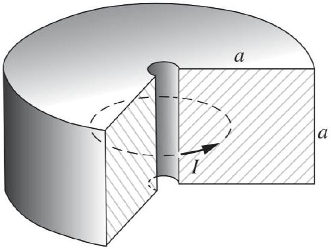
The current is spread out in some way over the cross section.
    (a) Make a rough estimate of the resistance and inductance. For the latter, it may be easiest to estimate the magnetic field at the center of the doughnut first, then use that to estimate the total magnetic field energy.
    (b) With these results, show that $\tau \sim \mu _ { 0 } a ^ { 2 } \sigma$, which also follows from dimensional analysis.
    (c) Given that the radius of the Earth is $r \sim 3000 \mathrm {~km}$ and $\sigma \sim 10 ^ { 6 } ( \Omega \cdot \mathrm {~m} ) ^ { - 1 }$, estimate $\tau$.

Solution. (a) We estimate

$$
R \sim \frac { 1 } { \sigma } \frac { \text { length } } { \text { cross-sectional area } } \sim \frac { 1 } { \sigma } \frac { a } { a ^ { 2 } } \sim \frac { 1 } { \sigma a } .
$$

The magnetic field at different points is on order $\mu _ { 0 } I / a$, so the magnetic energy is

$$
U _ { B } \sim \frac { 1 } { 2 \mu _ { 0 } } \left( \mu _ { 0 } I / a \right) ^ { 2 } a ^ { 3 }
$$

and equating this to $L I ^ { 2 } / 2$ gives $L \sim \mu _ { 0 } a$.

(b) Combining these two gives $\tau \sim L / R \sim \mu _ { 0 } a ^ { 2 } \sigma$, as desired.
(c) Plugging in the numbers gives $\tau \sim 3 \times 10 ^ { 5 }$ years. This is much shorter than the Earth's life, so some energy source must actively drive the core.
[2] Problem 2 (PPP 171). A circuit contains three identical lamps (modeled as resistors) and two identical inductors, as shown.
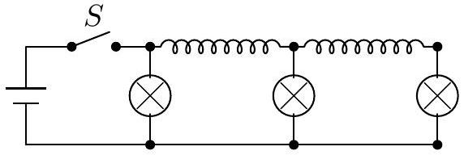
The switch $S$ is closed for a long time, then suddenly opened. Immediately afterward, what are the relative brightnesses of the lamps?
Solution. After a long time with the switch closed, the inductors act like short circuits, so the currents in the bulbs are the same. Let this current be $I$. Then the currents in the two inductors are $2 I$ and $I$.
When the switch is opened, the currents in the inductors remain the same, since they resist changes in current. This means the currents through the resistors are now $2 I , I$, and $I$. Since $P = I ^ { 2 } R$, the left bulb is 4 times brighter than the other two.
[3] Problem 3 (Kalda). A capacitor $C$ and resistor $R$ are connected in series. Rectangular voltage pulses are applied, as shown below.
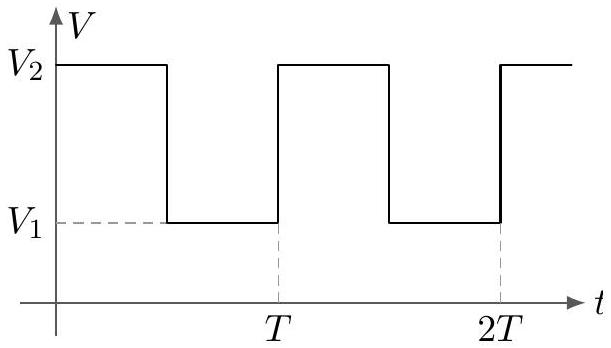
After a long time, find the average power dissipated on the resistor if (a) $T \gg R C$ and (b) $T \ll R C$.
Solution. (a) In this case, there is sufficient time for the capacitor to reach equilibrium each time the voltage switches. The energy dissipated during a switch is
$$
U = \int I V d t = \int V d Q .
$$
During a switch, the voltage across the resistor goes from $V _ { 2 } - V _ { 1 }$ to zero linearly in the charge, while the total charge transferred is $\Delta Q = \left( V _ { 2 } - V _ { 1 } \right) C$. Thus,
$$
U = \bar { V } _ { R } \Delta Q = \frac { 1 } { 2 } \left( V _ { 2 } - V _ { 1 } \right) ^ { 2 } C .
$$
This happens every time $T / 2$, so
$$
\bar { P } = \frac { \left( V _ { 2 } - V _ { 1 } \right) ^ { 2 } C } { T } .
$$

(b) In this case, the charge on the capacitor barely changes during each cycle. The average voltage across the capacitor is $\left( V _ { 1 } + V _ { 2 } \right) / 2$. Hence the magnitude of the voltage across the resistor is always approximately equal to $\left( V _ { 2 } - V _ { 1 } \right) / 2$, so
$$
\bar { P } = \frac { V _ { R } ^ { 2 } } { R } = \frac { \left( V _ { 2 } - V _ { 1 } \right) ^ { 2 } } { 4 R } .
$$
If you're curious, the answer for general $T$ is $C \left( V _ { 2 } - V _ { 1 } \right) ^ { 2 } \tanh ( T / ( 4 R C ) ) / T$.

Remark
Out of all the analogies mentioned above, why is capacitance defined "backwards", so that $C \sim 1 / k$ ? I actually have no idea, but one possibility is that large quantities should intuitively correspond to large objects. An object has to be physically large (and thereby expensive) to have a high $C$ or a high $L$, and you can easily see this on a circuit board. (Of course, this doesn't explain everything; the largest $R$ you can get is just a break in the circuit, which is neither large nor expensive.)

Another difference in the analogies is that for circuits we usually measure $I ( t )$, analogous to $v ( t )$, while for mechanical oscillators we usually measure $x ( t )$. The frequencies at which the amplitudes of $x ( t )$ and $v ( t )$ are maximized slightly differ, as discussed in M4, so there's a little ambiguity when people talk about "the" resonant frequency.

We now consider some problems involving mutual inductance.
Example 3: Griffiths 7.57
Two coils are wrapped around a cylindrical form so that the same flux passes through every turn of both coils, i.e. so that the mutual inductance is maximal. In practice this is achieved by inserting an iron core through the cylinder, which has the effect of forcing the magnetic flux to stay inside the cylinder.
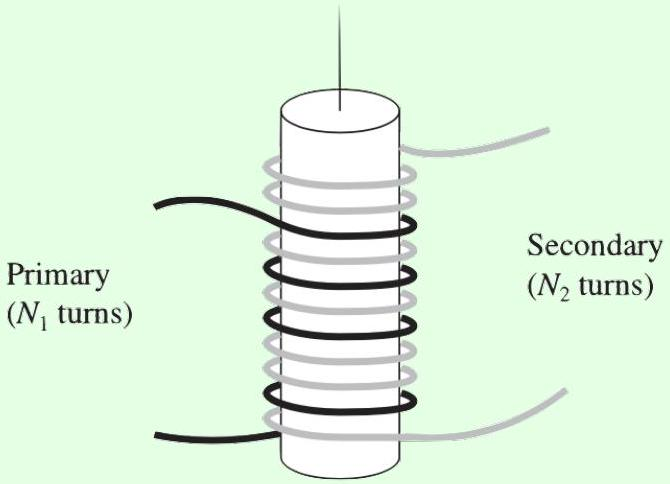
The "primary" coil has $N _ { 1 }$ turns and the secondary has $N _ { 2 }$. If the current $I$ in the primary is changing, show that the $\operatorname { emf } \mathcal { E } _ { 2 }$ in the secondary obeys

$$
\frac { \mathcal { E } _ { 2 } } { \mathcal { E } _ { 1 } } = \frac { N _ { 2 } } { N _ { 1 } }
$$

where $\mathcal { E } _ { 1 }$ is the (back) emf of the primary.

Solution
Let $\Phi$ be the flux through a single loop of either coil due to the current in the primary. Then

$$
\Phi _ { 1 } = N _ { 1 } \Phi , \quad \Phi _ { 2 } = N _ { 2 } \Phi .
$$

By Faraday's law,

$$
\mathcal { E } _ { 1 } = - N _ { 1 } \frac { d \Phi } { d t } , \quad \mathcal { E } _ { 2 } = - N _ { 2 } \frac { d \Phi } { d t }
$$

which gives the desired result. This is a primitive transformer, a device for raising or lowering the emf of an alternating current source. By choosing the appropriate number of turns, any desired secondary emf can be obtained.

We can also solve this problem more formally using what we know about inductance, which will also tell us what happens when both currents are nonzero. The emfs obey

$$
\mathcal { E } _ { 1 } = - L _ { 1 } \frac { d I _ { 1 } } { d t } - M \frac { d I _ { 2 } } { d t } , \quad \mathcal { E } _ { 2 } = - L _ { 2 } \frac { d I _ { 2 } } { d t } - M \frac { d I _ { 1 } } { d t } .
$$

We showed in E5 that $L _ { i } = \mu _ { 0 } N _ { i } ^ { 2 } \pi R ^ { 2 } / H$ for a cylindrical solenoid. (Here, $H$ stands for the length of the iron core, since this is the length over which the magnetic field exists.) As you'll show below, the maximum possible value of the mutual inductance, which is achieved by this ideal transformer, is $\sqrt { L _ { 1 } L _ { 2 } }$. Plugging in these results gives

$$
\mathcal { E } _ { 1 } = - \left( \frac { \mu _ { 0 } \pi R ^ { 2 } } { H } \right) \left( N _ { 1 } ^ { 2 } \frac { d I _ { 1 } } { d t } + N _ { 1 } N _ { 2 } \frac { d I _ { 2 } } { d t } \right) , \quad \mathcal { E } _ { 2 } = - \left( \frac { \mu _ { 0 } \pi R ^ { 2 } } { H } \right) \left( N _ { 2 } ^ { 2 } \frac { d I _ { 2 } } { d t } + N _ { 1 } N _ { 2 } \frac { d I _ { 1 } } { d t } \right) .
$$

This tells us the desired result holds for any values of the $d I _ { i } / d t$.
This result is not surprising from the standpoint of Faraday's law. The flux change through any cross-section of the iron core is the same, so the induced emf around any circle around it is the same. Thus, the emf per turn is the same between the coils, $\mathcal { E } _ { 1 } / N _ { 1 } = \mathcal { E } _ { 2 } / N _ { 2 }$, which again gives the desired result.
[3] Problem 4. Consider two inductors $L _ { i }$, with mutual inductance $M$.

(a) Show that if the inductors have currents $I _ { i }$, the total stored energy is
$$
U = \frac { 1 } { 2 } L _ { 1 } I _ { 1 } ^ { 2 } + \frac { 1 } { 2 } L _ { 2 } I _ { 2 } ^ { 2 } + M I _ { 1 } I _ { 2 } .
$$
Use this result to show that $| M | \leq \sqrt { L _ { 1 } L _ { 2 } }$.
(b) Suppose these two inductors are in series. Find their combined effective inductance.
(c) Suppose these two inductors are in parallel. Find their combined effective inductance.

Solution. (a) The differential work required to change the currents is

$$
d U = \left( L _ { 1 } \dot { J } _ { 1 } + M \dot { J } _ { 2 } \right) \left( J _ { 1 } d t \right) + \left( L _ { 2 } \dot { J } _ { 2 } + M \dot { J } _ { 1 } \right) \left( J _ { 2 } d t \right) = L _ { 1 } J _ { 1 } d J _ { 1 } + L _ { 2 } J _ { 2 } d J _ { 2 } + M d \left( J _ { 1 } J _ { 2 } \right)
$$

where $J _ { 1 } , J _ { 2 }$ are the values of the currents at some intermediate time. Therefore, the total work required is
$$
U = \frac { 1 } { 2 } L _ { 1 } I _ { 1 } ^ { 2 } + \frac { 1 } { 2 } L _ { 2 } I _ { 2 } ^ { 2 } + M I _ { 1 } I _ { 2 } .
$$
Let $x = I _ { 2 } / I _ { 1 }$, so
$$
U \propto L _ { 2 } x ^ { 2 } + 2 M x + L _ { 1 } .
$$
Physically, $U$ must be positive for all $x$. Minimizing by setting the derivative to zero, we see the minimum of $U$ is positive only if $| M | \leq \sqrt { L _ { 1 } L _ { 2 } }$. The bound is saturated for inductors that practically overlap, or more generally for any configuration where all flux that goes through one inductor also goes through the other, such as the two coils of an ideal transformer.
(b) When the inductors are in series, they have the same current. The total emf is
$$
\mathcal { E } = - \left( L _ { 1 } \frac { d I } { d t } + M \frac { d I } { d t } + L _ { 2 } \frac { d I } { d t } + M \frac { d I } { d t } \right) = - \left( L _ { 1 } + L _ { 2 } + 2 M \right) \frac { d I } { d t }
$$
which means
$$
L _ { \mathrm { eff } } = L _ { 1 } + L _ { 2 } + 2 M .
$$
Incidentally, since $L _ { \text {eff } }$ must be positive, this implies the bound $M > - \left( L _ { 1 } + L _ { 2 } \right) / 2$, though this is weaker than the bound in part (a).
(c) When the inductors are in parallel, they have the same emf, so
$$
\mathcal { E } = - L _ { 1 } \frac { d I _ { 1 } } { d t } - M \frac { d I _ { 2 } } { d t } = - L _ { 2 } \frac { d I _ { 2 } } { d t } - M \frac { d I _ { 1 } } { d t } .
$$
Solving the system gives
$$
L _ { \mathrm { eff } } = \frac { L _ { 1 } L _ { 2 } - M ^ { 2 } } { L _ { 1 } + L _ { 2 } - 2 M } .
$$
This also implies the bound $| M | < \sqrt { L _ { 1 } L _ { 2 } }$, as shown in a different way in part (a).
[3] Problem 5 (Kalda). An electrical transformer is connected as shown.
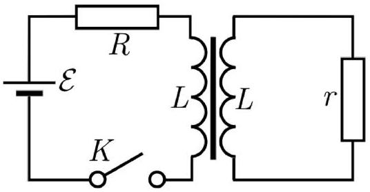
Both windings of the transformer have the same number of loops and the self-inductance of both coils is equal to $L$. There is no leakage of the magnetic field lines from the core, so that the mutual inductance is also equal to $L$.
    (a) Find the current in both loops immediately after the switch is closed.
    (b) Find the currents as a function of time.

Solution. (a) In a transformer, the flux is $\Phi = L \left( I _ { 1 } + I _ { 2 } \right)$ and $d \Phi / d t = \mathcal { E } _ { L } = L \left( d I _ { 1 } / d t + d I _ { 2 } / d t \right)$. Since $d \Phi / d t$ is finite, then initially $I _ { 1 } + I _ { 2 } = 0$. The voltage loop rule gives

$$
\mathcal { E } = I _ { 1 } R + L \left( d I _ { 1 } / d t + d I _ { 2 } / d t \right) = I _ { 1 } R - I _ { 2 } r
$$

Using the initial condition of $I _ { 1 } = - I _ { 2 }$ gives $I _ { 1 } = \mathcal { E } / ( R + r )$.

(b) The voltage loop rules give
$$
\mathcal { E } = I _ { 1 } R + L \left( d I _ { 1 } / d t + d I _ { 2 } / d t \right) , \quad L \left( d I _ { 1 } / d t + d I _ { 2 } / d t \right) + I _ { 2 } r = 0 .
$$
Let $I \equiv I _ { 1 } + I _ { 2 }$. Combining the equations give
$$
\frac { \mathcal { E } } { R } = I + \frac { L ( R + r ) } { R r } \frac { d I } { d t }
$$
which has solution
$$
I = \frac { \mathcal { E } } { R } \left( 1 - e ^ { - t / \tau } \right) , \quad \tau \equiv L \left( \frac { 1 } { r } + \frac { 1 } { R } \right) .
$$
Using $I _ { 1 } = \mathcal { E } / R - \frac { L } { R } d I / d t$ and $I _ { 2 } = - \frac { L } { r } d I / d t$, we can extract
$$
I _ { 1 } = \frac { \mathcal { E } } { R } \left( 1 - \frac { r } { r + R } e ^ { - t / \tau } \right) , \quad I _ { 2 } = - \frac { \mathcal { E } } { ( R + r ) } e ^ { - t / \tau } .
$$

## 2 AC RLC Circuits and Impedance

Idea 2: Impedance
Current and voltage can be promoted to complex quantities,

$$
V ( t ) = V _ { 0 } \cos ( \omega t + \phi ) , \quad \tilde { V } ( t ) = \tilde { V } _ { 0 } e ^ { i \omega t } , \quad \tilde { V } _ { 0 } = V _ { 0 } e ^ { i \phi }
$$

where the physical quantity is the real part. This is useful because we can relate $\tilde { V }$ and $\tilde { I }$ in all cases by $\tilde { V } = \tilde { I } Z$ where $Z$ is the impedance, and

$$
Z _ { R } = R , \quad Z _ { C } = \frac { 1 } { i \omega C } , \quad Z _ { L } = i \omega L
$$

for the three common circuit elements. Impedance is extremely useful for finding the steady state response of a circuit. If you're interested in the transients, you can find them by applying the techniques of M4 to the Kirchhoff's loop rule equation.

Idea 3: Power
Turning parameters complex and taking the real part works because we're dealing with linear equations. As a result, it doesn't work for energy or power, which are quadratic.

In particular, the power dissipated in an element is not $\operatorname { Re } ( \tilde { I } \tilde { V } )$, but rather

$$
P = I V = \operatorname { Re } ( \tilde { I } ) \operatorname { Re } ( \tilde { V } ) = I _ { 0 } V _ { 0 } \cos ( \omega t ) \cos ( \omega t + \phi )
$$

where $\phi$ is the phase angle of $Z$. To compute the average power, note that

$$
P = \frac { V _ { 0 } ^ { 2 } } { | Z | } \cos ( \omega t ) ( \cos ( \omega t ) \cos ( \phi ) - \sin ( \omega t ) \sin ( \phi ) ) .
$$

The second term averages to zero, while $\cos ^ { 2 } ( \omega t )$ averages to 1/2 as usual, so

$$
\bar { P } = \frac { 1 } { 2 } \frac { V _ { 0 } ^ { 2 } } { | Z | } \cos ( \phi ) = \frac { 1 } { 2 } I _ { 0 } V _ { 0 } \cos ( \phi )
$$

We can decompose a general impedance as $Z = R + i X$, in which case $\cos \phi = R / | Z |$, and

$$
\bar { P } = \frac { 1 } { 2 } \frac { I _ { 0 } V _ { 0 } R } { | Z | } = \frac { 1 } { 2 } I _ { 0 } ^ { 2 } R .
$$

It's conventional to define $I _ { \text {rms } } ^ { 2 } = I _ { 0 } ^ { 2 } / 2$ to be the average value of $I ^ { 2 }$, giving

$$
\bar { P } = I _ { \mathrm { rms } } ^ { 2 } R = \frac { V _ { \mathrm { rms } } ^ { 2 } } { R } .
$$

Example 4
Find the magnitude of the current through a series $R L C$ circuit with AC voltage source $V _ { 0 } \cos \omega t$.

Solution
We promote the voltage and current to complex numbers,

$$
V ( t ) = V _ { 0 } e ^ { i \omega t } .
$$

Kirchhoff's loop rule (subject to the caveats in E5) is

$$
L \dot { I } + I R + \frac { Q } { C } = V _ { 0 } e ^ { i \omega t } .
$$

This is quite similar to a damped driven harmonic oscillator, except that we want to get $I ( t )$, rather than $Q ( t )$. To get the steady state behavior, we guess

$$
I ( t ) = I _ { 0 } e ^ { i \omega t } .
$$

Then we have

$$
\dot { I } ( t ) = ( i \omega ) I _ { 0 } e ^ { i \omega t } , \quad Q ( t ) = \frac { 1 } { i \omega } I _ { 0 } e ^ { i \omega t } .
$$

Plugging this in, we find

$$
\left( i \omega L + R + \frac { 1 } { i \omega C } \right) I _ { 0 } = V _ { 0 } .
$$

Solving for the magnitude of the current gives

$$
\left| I _ { 0 } \right| = \frac { \left| V _ { 0 } \right| } { | i \omega L + R + 1 / i \omega C | } = \frac { \left| V _ { 0 } \right| } { \sqrt { R ^ { 2 } + ( \omega L - 1 / \omega C ) ^ { 2 } } }
$$

which is maximized when $\omega = 1 / \sqrt { L C }$, as we saw in M4. We could also have gotten straight to this last step by just using complex impedances.

Example 5
An imperfect voltage source consists of an ideal AC voltage source in series with an impedance $Z _ { S }$. It is attached to a load of impedance $Z _ { L }$. What value of $Z _ { L }$ maximizes the power transferred to the load?

Solution
Write the impedances as $Z _ { L } = R _ { L } + i X _ { L }$. When the impedances are purely real, it's a familiar fact that the optimum is at $R _ { S } = R _ { L }$. We consider the case of general impedance here to illustrate how to work with power. First, the current has amplitude

$$
I _ { 0 } = \frac { | V | } { \left| Z _ { S } + Z _ { L } \right| } .
$$

The average power dissipated in the load is

$$
\bar { P } = \frac { 1 } { 2 } I _ { 0 } ^ { 2 } R _ { L } \propto \frac { R _ { L } } { \left| Z _ { S } + Z _ { L } \right| ^ { 2 } } = \frac { R _ { L } } { \left( R _ { S } + R _ { L } \right) ^ { 2 } + \left( X _ { S } + X _ { L } \right) ^ { 2 } } .
$$

The denominator is minimized when $X _ { S } + X _ { L } = 0$, so the optimal real part is $R _ { L } = R _ { S }$ by the same logic as the purely real case. Thus, the highest power is achieved for $Z _ { L } = Z _ { S } ^ { * }$.

[1] Problem 6. Consider the cube of resistances $R$, capacitances $C$, and inductances $L$ shown below.
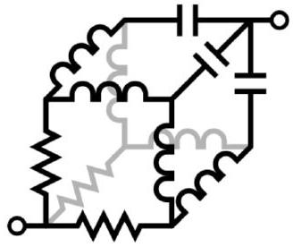
Compute the impedance between the terminals.
Solution. By symmetry, the three points close to one end have the same voltage, and the three points close to the other end have the same as well. Thus, we simplify the diagram to the following:
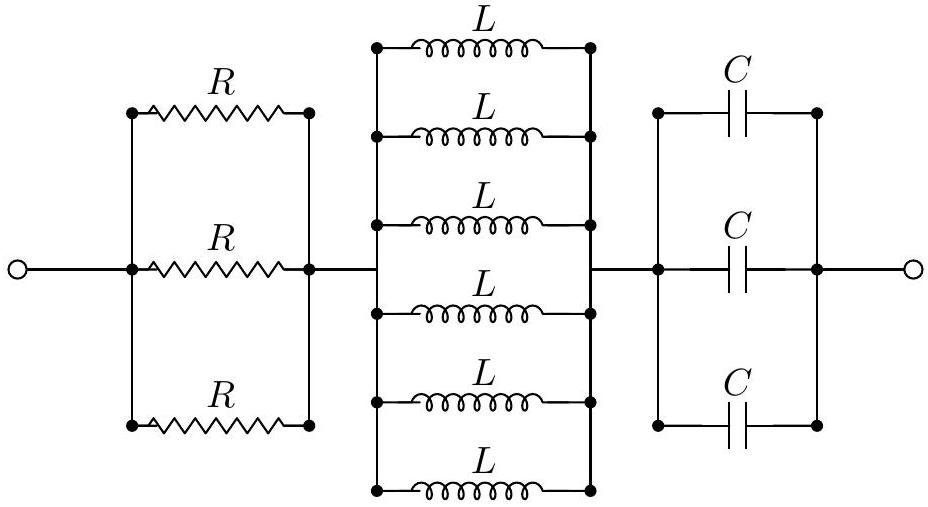
We have impedance
$$
Z = \frac { 1 } { 3 } R + \frac { 1 } { 6 } i \omega L + \frac { 1 } { 3 } \frac { 1 } { i \omega C } .
$$
[3] Problem 7. Consider an RLC circuit with a driving $V ( t ) = V _ { 0 } e ^ { i \omega t }$.

(a) Suppose the resistor, inductor, and capacitor are connected in parallel. Sketch the current $\left| I _ { 0 } \right|$ through the driver as a function of $\omega$, and compare it to the result for a standard series RLC circuit. Can you give a qualitative explanation for the difference?
(b) As we saw in M4, the quality factor for an oscillator quantifies how fast the energy in an undriven oscillator decays away. Specifically,
$$
Q = \frac { \text { average energy stored in the oscillator } } { \text { average energy dissipated per radian } } .
$$
Find the quality factor for a series RLC circuit, and confirm your answer has correct dimensions.
(c) What is the condition for a series RLC circuit to be overdamped?
(d) Find the quality factor for a parallel RLC circuit. You should find that the quality factor increases as $R$ is increased - why does this make sense?

Solution. (a) We know that $\left| I _ { 0 } \right| = \left| V _ { 0 } \right| / | Z |$, and adding the impedances in parallel gets

$$
\begin{gathered}
\frac { 1 } { Z } = \frac { 1 } { R } + \frac { 1 } { i \omega L } + i \omega C \\
\left| I _ { 0 } \right| = \frac { \left| V _ { 0 } \right| } { \omega L R } \sqrt { ( \omega L ) ^ { 2 } + R ^ { 2 } \left( 1 - \omega ^ { 2 } L C \right) ^ { 2 } }
\end{gathered}
$$

This gives a graph for a parallel RLC circuit:
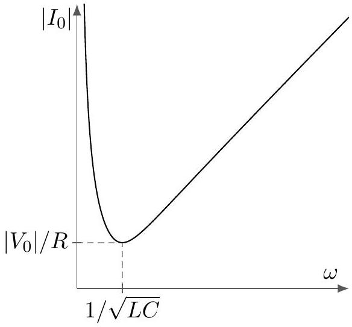
A series RLC circuit behaves the other way:
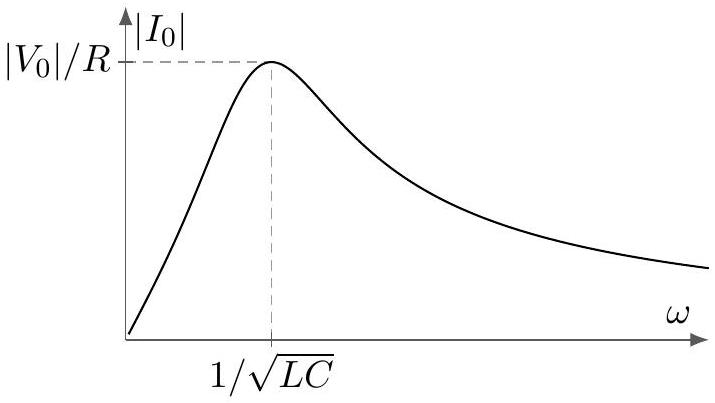

The intuition for a series RLC circuit is just as in M4, i.e. we get the most current when the system is driven at resonance, and the result is finite at resonance because the resistor absorbs the energy put in. But a parallel RLC circuit is backwards, because each component lets current through independently. The resistor's current contribution is independent of $\omega$. At high frequencies, a capacitor in parallel can let a lot of current through, because it behaves like a wire. At low frequencies, an inductor can do the same. But at the resonant frequency, the contributions of the capacitor and inductor cancel out. Or in more formal language, the applied voltage excites the normal mode corresponding to the LC oscillation, which moves zero net current through the power source.
(b) Energy will be stored in the capacitor and inductor, of $Q ^ { 2 } / 2 C$ and $\frac { 1 } { 2 } L I ^ { 2 }$ respectively. As in any harmonic oscillator, these are equal on average, so the total energy is
$$
E = 2 \times \frac { 1 } { 2 } L \left\langle I ^ { 2 } \right\rangle = L \left\langle I ^ { 2 } \right\rangle = \frac { 1 } { 2 } L I _ { 0 } ^ { 2 } .
$$
The power dissipated in the resistor is $I ^ { 2 } R$, so the average power is
$$
\langle P \rangle = \left\langle I ^ { 2 } R \right\rangle = \frac { 1 } { 2 } I _ { 0 } ^ { 2 } R
$$
Since a radian occurs in the time $1 / \omega$,
$$
Q = \frac { E } { \langle P \rangle / \omega } = \frac { \omega L } { R } = \frac { 1 } { R } \sqrt { \frac { L } { C } }
$$
where we used $\omega \approx 1 / \sqrt { L C }$. To check the dimensions, note that $\omega L$ and $R$ are both impedances, so $Q$ is dimensionless.
(c) Guessing $I ( t ) = I _ { 0 } e ^ { i \omega t }$ in the Kirchhoff loop rule (without power source) gets
$$
\begin{gathered}
i \omega L + R + \frac { 1 } { i \omega C } = 0 \\
\omega ^ { 2 } L C - i \omega R C - 1 = 0 \\
\omega = \frac { i R C \pm \sqrt { 4 L C - ( R C ) ^ { 2 } } } { 2 L C }
\end{gathered}
$$
The oscillator is overdamped when there's no real component of $\omega$ which indicates no sinusoidal oscillation, so the condition is
$$
\frac { R ^ { 2 } C } { 4 L } > 1 .
$$
In terms of the answer to part (b), this is $Q < 1 / 2$, and the requirement of a low quality factor makes sense. (However, we usually wouldn't describe such lossy systems in terms of a quality factor at all.)
(d) In the analysis for part (b), we used the fact that the current through each part of the series RLC circuit is equal. For the parallel RLC circuit, we use the fact that the voltages are equal. The average energy is
$$
E = 2 \times \frac { 1 } { 2 } C \left\langle V ^ { 2 } \right\rangle = C \left\langle V ^ { 2 } \right\rangle = \frac { C V _ { 0 } ^ { 2 } } { 2 } .
$$

The power dissipated in the resistor is $V ^ { 2 } / R$, so the average power is

$$
\langle P \rangle = \left\langle V ^ { 2 } / R \right\rangle = \frac { V _ { 0 } ^ { 2 } } { 2 R } .
$$

Since a radian occurs in the time $1 / \omega$,

$$
Q = \frac { E } { \langle P \rangle / \omega } = \omega R C = R \sqrt { \frac { C } { L } } .
$$

This is the inverse of the quality factor of a series RLC circuit. It makes sense that the quality factor increases as $R$ increases, because for very high $R$ almost no current flows through the resistor. It's just the AC analogue of the usual result in DC circuits: since $P = I ^ { 2 } R = V ^ { 2 } / R$, high-resistance resistors dissipate more when in series, and less when in parallel.

Example 6: NBPhO 2018.7
Consider the following AC circuit.
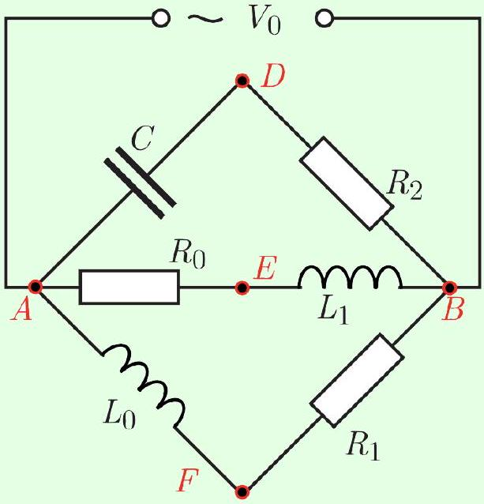
The voltage difference between $D$ and $E$ has amplitude $V _ { D E } = 7 \mathrm {~V}$. Similarly, $V _ { D F } = 15 \mathrm {~V}$ and $V _ { E F } = 20 \mathrm {~V}$. What is the magnitude of $V _ { 0 }$ ?

Solution
Treat the voltages as phasors, and let $V _ { A } = 0$, so $V _ { B } = V _ { 0 }$. Then $V _ { A F }$ is perpendicular to $V _ { F B }$, which means that $V _ { F }$ lies on the circle centered at $V _ { 0 } / 2$ with radius $V _ { 0 } / 2$. The exact same logic applies for $V _ { E }$ and $V _ { D }$. Therefore, we know that $V _ { D E } , V _ { D F }$ and $V _ { E F }$ form the three sides of a triangle, where the desired answer is the diameter of its circumcircle.

For a triangle with side lengths $a , b$, and $c$, and a circumcircle of radius $R$, Heron's formula states that the area is

$$
A = \sqrt { p ( p - a ) ( p - b ) ( p - c ) } , \quad p = \frac { 1 } { 2 } ( a + b + c ) .
$$

The area is also given by

$$
A = \frac { a b c } { 4 R } .
$$

Solving for the diameter, we have

$$
2 R = \frac { a b c } { 2 \sqrt { p ( p - a ) ( p - b ) ( p - c ) } } = 25 \mathrm {~V} .
$$

These geometric steps aren't that important; the key idea is thinking in terms of phasors.

[2] Problem 8 (Purcell 8.26). The four curves shown below are plots, in some order, of the applied voltage and the voltages across the resistor, inductor, and capacitor of a series RLC circuit.
$$
R , L , C , \mathcal { E }
$$
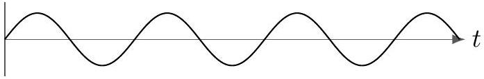
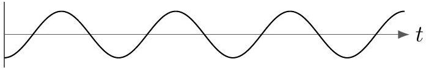
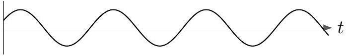
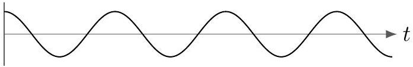
Which is which? Whose impedance is larger, the inductor's or the capacitor's?
Solution. We have $V _ { R } = R I , V _ { L } = ( i \omega L ) I$, and $V _ { C } = \frac { 1 } { i \omega C } I$. Thus, the graph of $V _ { L }$ is shifted by $\pi / 2$ to the left of that of $I$, and $V _ { C }$ is shifted by $\pi / 2$ to the right. The first, second, and fourth graphs are shifted relative to each other by multiples of $\pi / 2$, so we conclude
$$
\text { the first graph is } V _ { R } \text {, the second graph is } V _ { C } \text {, the fourth graph is } V _ { L }
$$
from which we find by process of elimination that
$$
\text { the third graph is } \mathcal { E } \text {. }
$$
Note that when the inductor and capacitor have equal impedance, $\mathcal { E }$ and $I \propto V _ { R }$ are in phase. When the inductor has a higher impedance, $\mathcal { E }$ looks more like $V _ { L }$, which "leads" the current. When the capacitor has a higher impedance, $\mathcal { E }$ looks more like $V _ { C }$, which "lags" the current. By comparing the first and third graphs, we see the phase of $\mathcal { E }$ slightly leads the current, so the inductor has higher impedance.
[2] Problem 9 (PPP 170). Consider each of the following circuits.

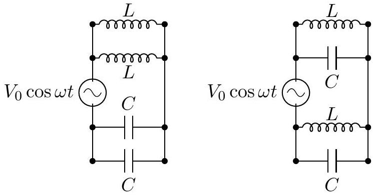
(a)

(b)

In each case, find the amplitude of the current drawn from the source as a function of $\omega / \omega _ { 0 }$, where $\omega _ { 0 } = 1 / \sqrt { L C }$.

Solution. We deal with each case separately.

(a) We see that the top two inductors are in parallel, and the bottom two capacitors are also in parallel, with the two systems being in series. Thus, the net impedance is
$$
Z = \frac { 1 } { 2 } \left( i \omega L + \frac { 1 } { i \omega C } \right) ,
$$
which has magnitude $\frac { 1 } { 2 \omega C } \left| \left( \omega / \omega _ { 0 } \right) ^ { 2 } - 1 \right|$. Thus,
$$
| I | = \frac { V _ { 0 } } { | Z | } = \frac { 2 \omega _ { 0 } C V _ { 0 } \left( \omega / \omega _ { 0 } \right) } { \left| \left( \omega / \omega _ { 0 } \right) ^ { 2 } - 1 \right| } .
$$
(b) The impedance here is
$$
Z = 2 \frac { 1 } { i \omega C + \frac { 1 } { i \omega L } }
$$
so $| Z | = \frac { 2 \omega L } { \left| \omega ^ { 2 } / \omega _ { 0 } ^ { 2 } - 1 \right| }$, so
$$
| I | = \frac { V _ { 0 } } { | Z | } = \frac { \omega _ { 0 } C V _ { 0 } \left| \left( \omega / \omega _ { 0 } \right) ^ { 2 } - 1 \right| } { 2 \left( \omega / \omega _ { 0 } \right) } .
$$
[3] Problem 10 (BAUPC 2024). Consider the following RLC circuit.
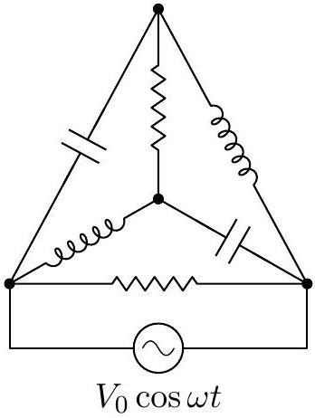
The capacitors have capacitance $C$, the inductors have inductance $L$, and the resistors have resistance $R = \sqrt { L / C }$. Furthermore, the driving angular frequency is $\omega = 1 / \sqrt { L C }$. Find the amplitude of the total current through the circuit.
Solution. See the official solutions as usual.
[3] Problem 11 (USAPhO 2026). Consider an $L C$ circuit of resonant angular frequency $\omega _ { 0 }$ involving a long solenoid of inductance $L$. The solenoid is tightly wound around a thin conducting cylindrical shell of radius $a$, thickness $t \ll a$, conductivity $\sigma$, and length $\ell$.
    (a) Assuming the shell provides the only energy loss in the circuit, and $\sigma$ is sufficiently small, find the quality factor in terms of $\omega _ { 0 } , \sigma , t , a$, and $L$.
    (b) Why does your answer to part (a) break down in the limit $\sigma \rightarrow \infty$ ?

Solution. (a) This is part (b) of USAPhO 2026, problem B3, and the answer is $Q = 2 / \left( \mu _ { 0 } \sigma t a \omega _ { 0 } \right)$, where $L$ happens to drop out. The interesting feature is that the quality factor depends on frequency, as does the associated effective resistance $R _ { \text {eff } } = \omega _ { 0 } L / Q$.
People often get used to assuming resistance is frequency-independent, since it's literally printed onto the resistors used in introductory labs. But in a realistic high-quality LC circuit, there will be multiple contributions to the effective resistance, which all depend on frequency.

(b) As $\sigma \rightarrow \infty$ we expect there to be no energy dissipation, but if you plug this into the result of part (a), you'll get $Q \rightarrow 0$, or $R _ { \text {eff } } \rightarrow \infty$.
The resolution is the "skin effect". From E1, we know that a conductor sets the static electric field inside itself to zero. For oscillating fields, it turns out the electric field is still shielded: it drops to zero as you go a distance $\delta \sim 1 / \sqrt { \sigma \omega _ { 0 } \mu _ { 0 } }$ into the material, called the skin depth. In part (a), you tacitly assumed $\delta \gg t$, so that this effect could be neglected. But as $\sigma \rightarrow \infty$, we get $\delta \ll t$ and the solenoid's induced electric field gets mostly expelled from the shell. When we account for this, we get a sensible result $Q \propto \sqrt { \sigma }$.
By the way, in practice $\sigma$ itself will depend on both frequency and temperature. This is the sort of thing that one must account for in precision physics experiments with LC circuits.
[3] Problem 12. USAPhO 2002, problem A1.
[3] Problem 13. USAPhO 2011, problem B1.

## 3 Electrical Engineering

These next problems are about using RLC circuits for practical purposes. They don't require anything not already introduced in the previous section, but they represent a different way of thinking that it's crucial to get comfortable with.

[2] Problem 14 (Feynman). In electronic circuits it is often desired to provide a sinusoidal voltage of constant amplitude but variable phase. A circuit which accomplishes this is called a phase-shifting network. One example is shown below.
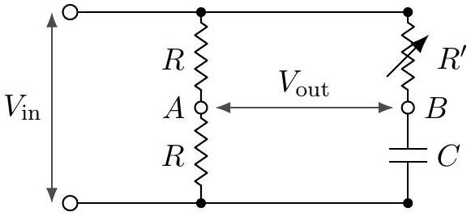
Show that the voltage measured between terminals A and B has half the amplitude of the input voltage, and a phase which may be adjusted by changing the resistance $R ^ { \prime }$.
Solution. Note that the current in the left branch is $I _ { 1 } = V _ { i } / 2 R$, so $V _ { A } = V _ { i } - I _ { 1 } R = V _ { i } / 2$. We see that
$$
V _ { B } = V _ { i } - R ^ { \prime } \frac { V _ { i } } { R ^ { \prime } + \frac { 1 } { i \omega C } } = V _ { i } \left( 1 - \frac { 1 } { 1 + \frac { 1 } { i \omega C R ^ { \prime } } } \right) .
$$
Thus,
$$
V _ { B } - V _ { A } = V _ { i } \left( \frac { 1 } { 2 } - \frac { 1 } { 1 + \frac { 1 } { i \omega C R ^ { \prime } } } \right) = \left( - \frac { V _ { i } } { 2 } \right) \frac { 1 - \frac { 1 } { i \omega C R ^ { \prime } } } { 1 + \frac { 1 } { i \omega C R ^ { \prime } } } .
$$

We thus have $\left| V _ { B } - V _ { A } \right| = V _ { i } / 2$, and the remaining fraction is $e ^ { i \phi }$ with $\phi = 2 \tan ^ { - 1 } \left( 1 / \omega C R ^ { \prime } \right)$, which can be adjusted to give any phase.

[3] Problem 15 (Kalda). The figure below shows a Maxwell's bridge, which is used for measuring the inductance $L$ and resistance $R$ of a coil.
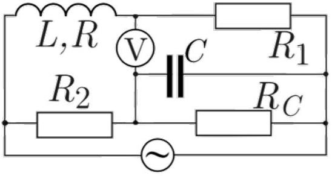
To do this, the angular frequency $\omega$ is fixed and the known parameters $R _ { 1 } , R _ { 2 } , R _ { C }$, and $C$ are adjusted until the voltmeter reads zero. Once this is done, find $R$ and $L$ in terms of the other parameters.
Solution. Suppose the unknown coil has overall impedance $Z$. It suffices to find $Z$. We see that the voltage at the top end of the voltmeter is
$$
V _ { 1 } = \mathcal { E } \frac { R _ { 1 } } { Z + R _ { 1 } } .
$$
Let $Z _ { C } = \frac { 1 } { \frac { 1 } { R _ { C } } + i \omega C }$ denote the impedance of the resistive capacitor compound. The voltage at the other end of the voltmeter is then
$$
V _ { 2 } = \mathcal { E } \frac { Z _ { C } } { Z _ { C } + R _ { 2 } } .
$$
We have $V _ { 1 } = V _ { 2 }$, so $Z / R _ { 1 } + 1 = 1 + R _ { 2 } / Z _ { C }$, so
$$
Z = R _ { 1 } R _ { 2 } \left( 1 / R _ { C } + i \omega C \right) .
$$
On the other hand, we also have $Z = R + i \omega L$, so we can read off the answers,
$$
R = R _ { 1 } R _ { 2 } / R _ { C } , \quad L = R _ { 1 } R _ { 2 } C .
$$
[5] Problem 16. An alternating voltage $V _ { 0 } \cos \omega t$ is applied to the terminals at A. The terminals at B are connected to an audio amplifier of very high input impedance. (That is, current flow into the amplifier is negligible.)
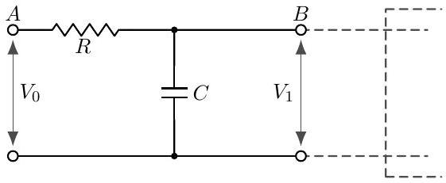
This circuit is the most primitive of "low-pass" filters.
    (a) Calculate the "gain" ratio $\left| \tilde { V } _ { 1 } \right| / V _ { 0 }$ in this filter. Show that for sufficiently high frequencies, the signal power is reduced by a factor of 4 for every doubling of the frequency.
    (b) Design a low-pass filter without using a capacitor.
    (c) Design a high-pass filter.

(d) Design a stronger low-pass filter, i.e. one which reduces the signal power by a greater factor for every doubling of the frequency.
(e) Design a band-pass filter, which suppresses both low and high frequencies, but has a constant gain for a wide range of medium frequencies. (It's okay if the constant gain is less than 1 , as we can just pass the output through an amplifier.)
(f) Design a notch filter, which suppresses a very small range of frequencies, while letting all other frequencies through.

Solution. (a) Letting the bottom be $V = 0$, we have $\left| V _ { 1 } \right| = I \left| X _ { C } \right|$ and $I = V _ { 0 } / \left| X _ { C } + R \right|$. Then

$$
g = \frac { \left| V _ { 1 } \right| } { V _ { 0 } } = \frac { \left| X _ { C } \right| } { \left| X _ { C } + R \right| } = \frac { 1 } { \sqrt { \omega ^ { 2 } R ^ { 2 } C ^ { 2 } + 1 } } .
$$

For high frequencies, $V _ { 1 } \approx V _ { 0 } / \omega R C$, so the signal power $V _ { 1 } ^ { 2 } / Z _ { 1 } \propto 1 / \omega ^ { 2 }$, so doubling the frequency will reduce the power by a factor of 4.

(b)
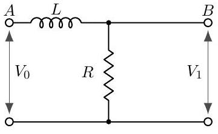

(c) Here's one possible answer. You could also take the low-pass filter in part (a) and switch the locations of the capacitor and resistor.
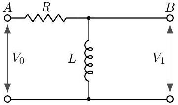
(d) This is the simplest answer, requiring only two circuit elements. Note that it works at $\omega \gg 1 / \sqrt { L C }$, while at $\omega = 1 / \sqrt { L C }$ there is a resonant peak instead of a suppression.
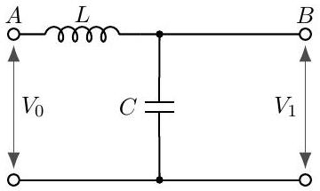
You can also chain two low pass filters, but that requires more circuit elements. Also, in order for that to work properly, you will need the resistance of the second low pass filter to be much higher than the first, for the reason discussed in the solution to part (e).
(e) Attach a low pass filter to the output of a high pass filter to get a band-pass filter. There will then be a region in the middle with constant gain. For this to work straightforwardly, it is essential that the addition of the low pass filter doesn't affect the voltage output of the high pass filter, so that we can just multiply the gains. This occurs if the low pass filter draws negligible current from the output. (In terms of the example filters above, we need the resistance in the low pass filter to be much higher than the resistance in the high pass filter.)

Another option would be to attach the output to the resistor in a series RLC circuit, but then the "band" region would be too narrow.
    (f) To suppress a certain frequency, make a circuit that looks like this:
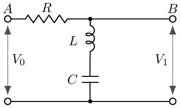
[4] Problem 17. IPhO 1984, problem 3. A nice, short problem on filters.
[2] Problem 18. Consider the same setup as problem 16, but with the resistor and capacitor switched.
    (a) Assuming that $V _ { 1 } \ll V _ { 0 }$, show that the output voltage is proportional to the derivative of the input voltage. Hence the circuit is a differentiator. (Can you relate this to the kind of filtering such a setup does?)
    (b) Design a circuit whose output is proportional to the integral of $V _ { 0 }$, again assuming $V _ { 1 } \ll V _ { 0 }$.

Solution. (a) The output voltage will be

$$
V _ { 1 } = V _ { 0 } \frac { \omega R C } { \sqrt { \omega ^ { 2 } R ^ { 2 } C ^ { 2 } + 1 } }
$$

$V _ { 1 } \ll V _ { 0 }$ means that $\omega R C \ll 1$, so $V _ { 1 } \approx V _ { 0 } \omega R C$. Since $d V _ { 0 } / d t \propto \omega V _ { 0 }$, we see that both $V _ { 1 }$ and $d V _ { 0 } / d t$ are proportional to $\omega V _ { 0 }$. Since higher frequencies are emphasized, it's also a high pass filter.

(b) Now we want $V _ { 1 } \propto V _ { 0 } / \omega$. Since the $X _ { L } \propto \omega$ and $X _ { C } \propto 1 / \omega$, and we're looking for the opposite effect, it would make sense to try replacing the capacitor with an inductor.
$$
V _ { 1 } = V _ { 0 } \frac { R } { \sqrt { R ^ { 2 } + ( \omega L ) ^ { 2 } } } .
$$
For $V _ { 1 } \ll V _ { 0 }$, which indicates $R \ll \omega L$, we get $V _ { 1 } = V _ { 0 } R / \omega L$, which gets $V _ { 1 } \propto V _ { 0 } / \omega$ as desired. This is also a low pass filter.
[3] Problem 19. A resonant cavity of the form illustrated below is an essential part of many microwave oscillators. It is a single piece of metal, which can be treated like an LC circuit.
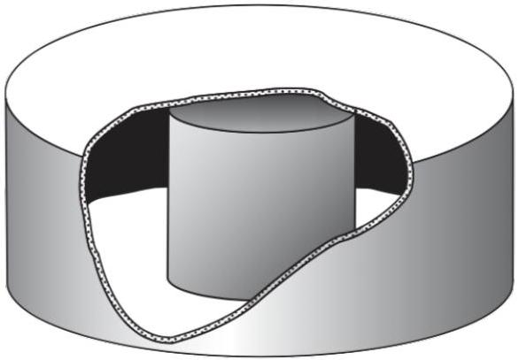
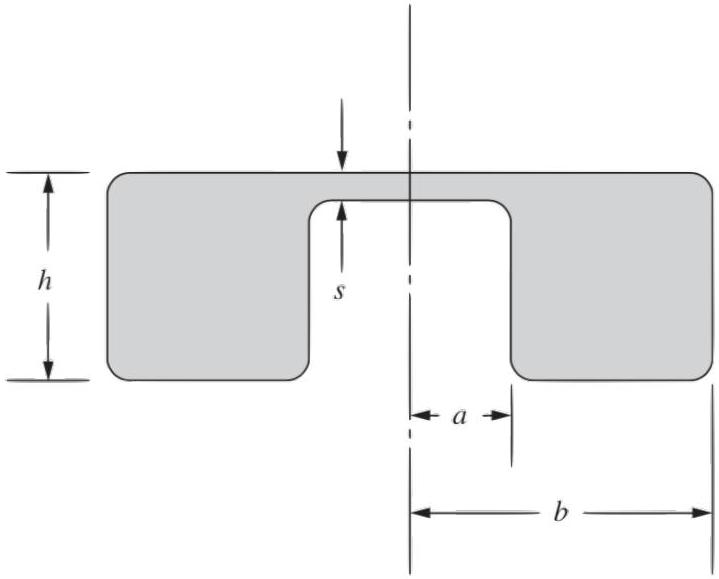

(a) Assuming that $s \ll a , b , h$, estimate the lowest resonant angular frequency of the cavity by treating it as an $L C$ circuit. It may be helpful to sketch the magnetic and electric fields.
(b) One of the most common types of cavity is a cylindrical cavity, i.e. a hollow cylinder. (It corresponds to taking $s = h$ in the above setup.) Assuming that $h \approx b$, find a reasonable estimate of the lowest resonant angular frequency $\omega$.

Solution. (a) The top of the small internal cylinder forms a small parallel plate capacitor with the top, with capacitance

$$
C = \epsilon _ { 0 } \frac { \pi a ^ { 2 } } { s } .
$$

Meanwhile, the entire rest of the cavity looks like a toroidal solenoid with one turn, which we already know has an inductance of

$$
L = \frac { \mu _ { 0 } h } { 2 \pi } \log \frac { b } { a } .
$$

Therefore we have

$$
\omega = \frac { 1 } { \sqrt { L C } } = \frac { 1 } { \sqrt { \frac { \mu _ { 0 } h } { 2 \pi } \log ( b / a ) \epsilon _ { 0 } \left( \pi a ^ { 2 } \right) / s } } = \frac { c } { a } \sqrt { \frac { 2 s } { h \log ( b / a ) } }
$$

where $c$ is the speed of light. The fields are sketched below.
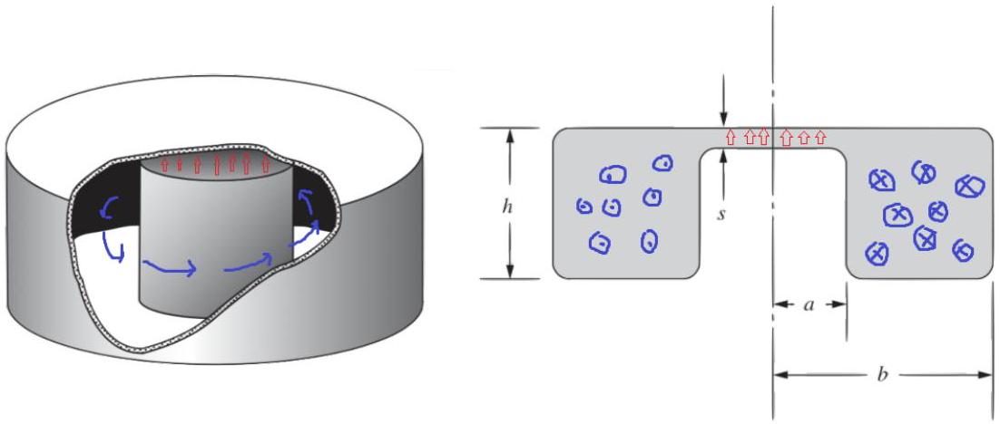

(b) If we just plug in $s = h$ above, we get
$$
\omega = \frac { c } { a } \sqrt { \frac { 2 } { \log ( b / a ) } } .
$$
However, this result is nonsense, because it depends on $a$, which has no physical meaning when $s = h$. The problem is that our heuristic picture in (a) of how the current and charge is distributed only makes sense for $s \ll h$.
A complete and rather complicated analysis would show that the lowest resonant angular frequency is
$$
\omega = c \min \left( 1.841 \left( \frac { 1 } { b ^ { 2 } } + \frac { 2.912 } { h ^ { 2 } } \right) ^ { 1 / 2 } , \frac { 2.405 } { b } \right) .
$$
In this case, we can get close by dimensional analysis, which tells us that $\omega \sim c / b$, since $b$ is the only length scale in the problem. (Recall that we assumed $h \approx b$.)

## Remark

In E3, we saw that for DC circuits, any system of resistors and ideal batteries with two ports is equivalent, from the perspective of anything connected across the ports, to either a single resistor and ideal battery in series (the Thevenin equivalent), or a single resistor and ideal current source in parallel (the Norton equivalent). From the ideas covered in this problem set, we also know that any system of resistors, inductors, and capacitors with two ports is equivalent, at a fixed angular frequency $\omega$, to a single lumped element with impedance $Z _ { \text {eq } }$. This in turn could be constructed out of a single resistor and inductor or capacitor in series.

This naturally leads to a more general question: it is possible to construct a simple "equivalent" circuit that has exactly the same $Z _ { \mathrm { eq } } ( \omega )$, for all $\omega$ ? The answer is yes. For example, consider the simple case of a circuit of only inductors and capacitors. Here's the rough idea: in this case, the equivalent impedance is always a pure imaginary, rational function of $\omega$, meaning a ratio of two polynomials in $\omega$. But rational functions can always be expanded in partial fractions. Assuming no multiple roots for simplicity, each term in the partial fraction decomposition can be mimicked with an LC circuit, and we get the sum by placing these circuits in series.

In electrical engineering, the general task of constructing a circuit with a prescribed $Z ( \omega )$ is called network synthesis; the above example is called Foster's synthesis. These techniques can be used to construct filters more elaborate than the ones you explored in problem 16.

## Remark

Power companies often transmit electricity with "three-phase power". This means that there are three "hot" electrical lines, carrying voltages

$$
V _ { 1 } ( t ) = V _ { 0 } \cos ( \omega t ) , \quad V _ { 2 } ( t ) = V _ { 0 } \cos ( \omega t + 2 \pi / 3 ) , \quad V _ { 3 } ( t ) = V _ { 0 } \cos ( \omega t + 4 \pi / 3 ) .
$$

There are several advantages to three-phase power, but one is that it supplies a constant power, as $V _ { 1 } ^ { 2 } + V _ { 2 } ^ { 2 } + V _ { 3 } ^ { 2 }$ is constant.

An ordinary American wall outlet has three holes, arranged like a face. The smaller eye is the "hot" one, with voltage $V _ { 1 } ( t )$, while the larger eye and the mouth are both grounded. Appliances are powered by the voltage difference between the eyes. Appliances that use significant power and have metal exteriors have three-prong plugs. Here, the mouth is connected directly to the exterior of the appliance, ensuring that it can't shock you, even if something goes wrong inside. If you live in an apartment building, you might also have special power outlets meant for very power-intensive appliances like dryers and heaters. In these outlets, one hole has voltage $V _ { 1 } ( t )$ and another has $V _ { 2 } ( t )$, giving an AC voltage difference of amplitude $\sqrt { 3 } V _ { 0 }$.

## 4 Normal Modes

Idea 4
A circuit with $n$ independent loops has $n$ normal modes. If we ignore resistances, the normal modes are pure sinusoids, though in all real circuits they exponentially damp over time. Just as in mechanics, the general solution for the behavior of a driven circuit is a superposition of normal mode currents and the response to the driving.

There are many ways to find the normal mode frequencies.

- One way is to pick any two points not directly connected by wires. We may imagine that across these points we have attached a current source $\tilde { I }$ which is doing nothing, $\tilde { I } = 0$. If a normal mode is present at angular frequency $\omega$, then we can have $\tilde { V } \neq 0$, even though $\tilde { I } = 0$ because current is merely sloshing around inside the circuit. Thus, the equivalent impedance $Z ( \omega )$ between these points is infinite.
- Another way is to pick two points directly connected by wires. We may imagine this wire is actually a voltage source $\tilde { V }$ which is doing nothing, $\tilde { V } = 0$. If a normal mode is present at angular frequency $\omega$, then we can have a current $\tilde { I } \neq 0$ through the wire even though $\tilde { V } = 0$, so the equivalent impedance $Z ( \omega )$ between these points is zero.
- Some LC circuits can be mapped to sets of masses and springs using the analogies in idea 1, which can help with guessing the normal modes.
- Finally, one may simply write down all of Kirchhoff's loop equations, plug in $e ^ { i \omega t }$ time dependence, and look for a solution. This boils down to solving a system of $n$ equations, or equivalently evaluating the determinant of an $n \times n$ matrix. This is rarely the best approach on an Olympiad.
- Not every problem benefits from using normal modes; for relatively simple circuits with special initial conditions, it may be better to solve Kirchhoff's loop equations directly.

Example 7: Kalda 89
Find the normal mode frequencies of the circuit below.
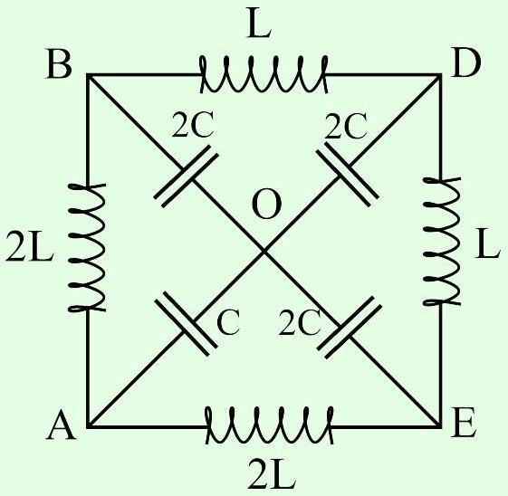

Solution
There are four independent Kirchhoff's loop equations, so we expect four normal modes. One normal mode consists of current simply flowing uniformly along the outside, along the inductors. Since the capacitors aren't involved, this normal mode has $\omega _ { 0 } = 0$.

Now we apply the first technique listed above: we pick two points not directly connected with wires, and set the impedance to infinity. By symmetry, it's best to pick $A$ and $D$. By symmetry, if any voltage is applied between $A$ and $D$, the points $B$ and $E$ will be at the same voltage. Furthermore, this point will be at the same voltage as $O$, because the remaining circuit forms a balanced Wheatstone bridge, as introduced in E3. Identifying $B$, $E$, and $O$ straightforwardly gives a simple $L C$ circuit with $L _ { \text {eff } } = ( 3 / 2 ) L$ and $C _ { \text {eff } } = ( 2 / 3 ) C$, and resonant angular frequency $\omega _ { 1 } = 1 / \sqrt { L _ { \text {eff } } C _ { \text {eff } } } = 1 / \sqrt { L C }$.

This procedure only gave one of the three remaining normal modes, so we must have missed the other two because they have zero voltage difference between $A$ and $D$. Therefore, to find the other two, we can join $A$ and $D$, leading to the simpler equivalent circuit below.
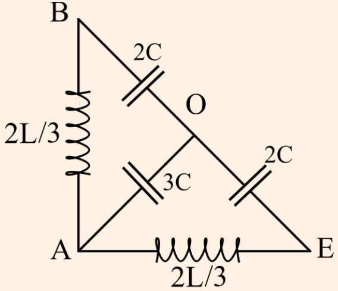
We now apply the same procedure between points $B$ and $E$. This circuit is again a balanced Wheatstone bridge, so $O$ and $A$ are at the same voltage. We then have a simple $L C$ circuit with $L _ { \text {eff } } = ( 4 / 3 ) L$ and $C _ { \text {eff } } = C$, giving $\omega _ { 2 } = \sqrt { 3 / 4 L C }$.

Again, we've missed a normal mode, so that remaining mode must have zero voltage difference between $B$ and $E$. Joining them together leads to the final equivalent circuit below.
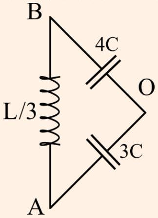
This is now a simple $L C$ circuit with $L _ { \text {eff } } = ( 1 / 3 ) L$ and $C _ { \text {eff } } = ( 12 / 7 ) C$, giving the final resonant angular frequency $\omega _ { 3 } = \sqrt { 7 / 4 L C }$.

[2] Problem 20 (Kalda). Consider the LC circuit below.

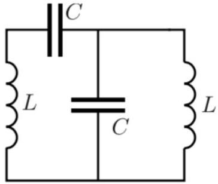
Show that the normal mode angular frequencies are $\omega = ( \sqrt { 5 } \pm 1 ) / 2 \sqrt { L C }$.
Solution. We set the impedance between the two ends of the bottom left wire to be 0, so

$$
i \omega L + \frac { 1 } { i \omega C } + \frac { 1 } { i \omega C + \frac { 1 } { i \omega L } } = 0
$$

Let $a = i \omega L$ and $b = \frac { 1 } { i \omega C }$. We have $a + b + 1 / ( 1 / a + 1 / b ) = 0$, so $( a / b ) ^ { 2 } + 3 ( a / b ) + 1 = 0$, so $\omega ^ { 2 } L C = - a / b = \frac { 3 \pm \sqrt { 5 } } { 2 }$. But note $( \sqrt { 5 } \pm 1 ) ^ { 2 } = 2 ( 3 \pm \sqrt { 5 } ) = 4 \omega ^ { 2 } L C$, which shows $\omega = ( \sqrt { 5 } \pm 1 ) / 2 \sqrt { L C }$.

[3] Problem 21 (IPhO 2014). Initially, the switch $S$ is open in the circuit shown below.
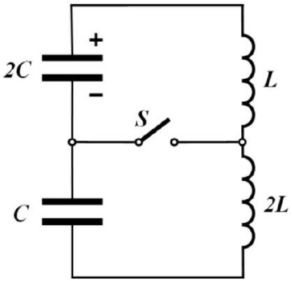
The capacitor with capacitance $2 C$ is given a charge $q _ { 0 }$, and immediately begins to discharge. At the moment when the current through the inductors reaches its maximum value, the switch $S$ is closed. Find the maximum current through the switch thereafter.

Solution. See the official solution to IPhO 2014, problem 1(c).

[5] Problem 22 (Physics Cup 2012). Find the angular frequencies of the normal modes of the circuit below, where $C _ { 1 } \ll C _ { 2 }$ and $L _ { 1 } \ll L _ { 2 }$.
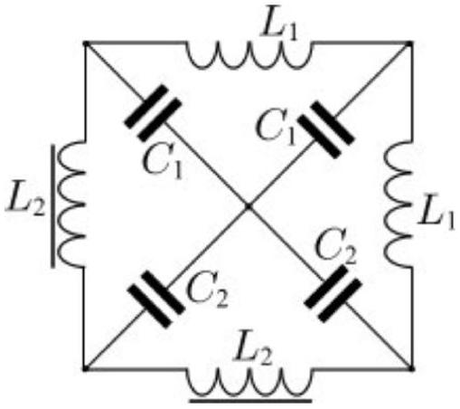
You may give all of your answers to lowest order in $C _ { 1 } / C _ { 2 }$ and $L _ { 1 } / L _ { 2 }$.
Solution. See the solutions here.

## 5 Nonlinear Circuit Elements

In this section we'll introduce nonlinear circuit elements, focusing on diodes. More exotic circuit elements will be covered in E7.

Idea 5
Many nonlinear circuit elements can be described by a current-voltage characteristic $I ( V )$. Such circuit elements have trivial time dependence, just like resistors, and working with them basically amounts to using Kirchhoff's laws as usual, plugging in $I ( V )$ where necessary.

Since the implementation details of such elements can be very complicated, and many draw power from external sources, it generally isn't productive to think of them "physically"; they are more like miniature computers than physical objects. One just has to take $I ( V )$ as given and work directly with it. Some simple examples are:

- An ideal diode acts like a wire in one direction and a break in the other, so it has
$$
I ( V ) = \begin{cases} \infty & V > 0 , \\ 0 & V < 0 . \end{cases}
$$
- Sometimes one instead takes the $I ( V )$ characteristic
$$
I ( V ) = \begin{cases} \infty & V > V _ { 0 } , \\ 0 & V < V _ { 0 } \end{cases}
$$
which means that it "costs" voltage $V _ { 0 }$ to go through the diode in the forward direction. More realistically, $I ( V )$ smoothly increases when $V$ passes $V _ { 0 }$, but you don't often see this in Olympiad problems because it makes the math very messy.
- Zener diodes can allow current in both directions. An idealized bidirectional diode has
$$
I ( V ) = \begin{cases} \infty & V > V _ { 0 } \\ 0 & - V _ { 0 } < V < V _ { 0 } , \\ - \infty & V < - V _ { 0 } \end{cases}
$$
- Many familiar objects such as fuses (wires which break when $I$ passes a threshold) and spark gaps (breaks that conduct when $V$ passes a threshold) can be thought of as nonlinear circuit elements in the same way.

Analytically, these three cases are easily handled by casework. For instance, a diode acts just like a wire for positive $V$, and just like a break for negative $V$. In each case, the circuit is no more complicated than an ordinary one with linear circuit elements. Then you put the cases together to get the full behavior.

Example 8
A capacitor of capacitance $C$ is charged so that its voltage is $V _ { c }$. The capacitor is placed in series with a resistor $R$ and a diode with $I ( V )$ characteristic

$$
I ( V ) = \begin{cases} \infty & V > V _ { 0 } , \\ 0 & V < V _ { 0 } . \end{cases}
$$

The diode is oriented so that the initial voltage across it is positive. How does the voltage across the capacitor change over time?

Solution
If $V _ { c } < V _ { 0 }$, the voltage on the capacitor is not enough to get current to flow through the diode, so nothing happens. If $V _ { c } > V _ { 0 }$, current flows, at the cost of a voltage drop $V _ { 0 }$ across the diode. Then we can simply replace the diode with a battery of $\operatorname { emf } V _ { 0 }$ oriented in the opposite direction. This system is equivalent to an ordinary RC circuit with battery, with the capacitor initially charged to higher than $V _ { 0 }$. The extra voltage exponentially decays,

$$
V ( t ) = \left( V _ { c } - V _ { 0 } \right) e ^ { - t / R C } + V _ { 0 }
$$

so that in the limit $t \rightarrow \infty$, the capacitor voltage approaches $V _ { 0 }$ and the current stops.

Idea 6
It is difficult to solve a nonlinear circuit analytically if $I ( V )$ is not very simple. In these cases:

- One can find the answer graphically as the intersection of $I ( V )$ and another curve.
- One can solve for the answer iteratively on a calculator.
- If $V$ stays within a narrow range, one can take a linear approximation to $I ( V )$. This effectively replaces the element with a battery in series with a resistor, so the problem can be solved just like those in E3.
[1] Problem 23 (Kalda). Find the current in the circuit given below.
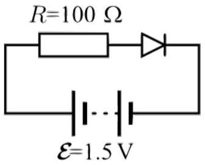
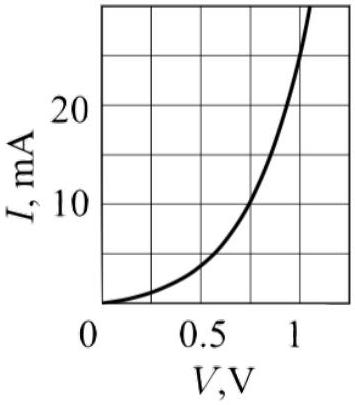
The nonlinear element is a diode with the $I ( V )$ characteristic shown.
Solution. We simply draw the line $V ( I ) = 1.5 \mathrm {~V} - ( 100 \Omega ) I$ on the graph and find the intersection, which gives $I \approx 8 \mathrm {~mA}$.

Idea 7
The power delivered to any circuit element is still $P = I V$. However, some nonlinear circuit elements can be active, providing net power to the circuit, like batteries.

Example 9: Kalda 64
The circuit below containing an ideal diode makes it possible to charge a rechargeable battery of voltage $\mathcal { E } = 12 \mathrm {~V}$ with a direct voltage source of a voltage $V _ { 0 } = 5 \mathrm {~V} < \mathcal { E }$.
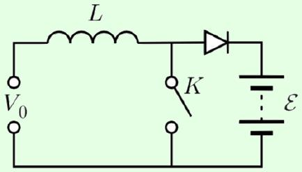
To do this, the switch K is periodically opened and closed, with the opened and closed periods having equal length $\tau = 10 \mathrm {~ms}$. Find the average charging current assuming $L = 1 \mathrm { H }$.

Solution
This system is called a boost converter. The point is that, using an inductor and a switch, one can generate emfs larger than what we put in, because the current wants to keep flowing through the inductor when the switch is opened; this allows us to get enough emf to charge the battery. This idea is also used in the ignition coils of old-fashioned cars, where a voltage large enough to ionize air is produced, making a spark and starting the engine. There's also a fluid analogue, called the hydraulic ram, used to raise water. The diode's role is just to keep current from flowing backward during the other half of the cycle.

When the switch is closed, no current can flow through the battery, and the current through the inductor builds up linearly, since there is an emf $V _ { 0 }$ across the inductor. When the switch is opened, the emf across the inductor is $V _ { 0 } - \mathcal { E } = - 7 \mathrm {~V}$, causing its current to decrease while simultaneously charging the battery. After a time (5/7) $\tau$ with the switch open, the current through the inductor falls to zero, and the diode causes current to stop flowing.

Quantitatively, while the switch is closed, the current through the inductor builds up to $V _ { 0 } \tau / L$. When the switch is open, current flows for a time $( 5 / 7 ) \tau$, linearly falling to zero, so the total charge is

$$
Q = \frac { 1 } { 2 } \frac { V _ { 0 } \tau } { L } \frac { 5 } { 7 } \tau .
$$

A cycle takes time $2 \tau$, so

$$
\bar { I } = \frac { Q } { 2 \tau } = \frac { 5 } { 28 } \frac { V _ { 0 } \tau } { L } = 8.9 \mathrm {~mA} .
$$

By the way, your phone and laptop chargers probably have rectangular bricks containing a switched-mode power supply. This consists of one part that converts the AC wall power to DC, and a second part similar to the circuit above, but set up to output a lower DC voltage. You could also use a transformer to lower the AC voltage, but a switch-mode power supply is more space-efficient, and it easily copes with a range of input AC voltages and frequencies.

[3] Problem 24. NBPhO 2010, problem 9. You should assume that $U _ { i }$ and $U _ { o }$ are positive, and that in part (i) the currents are initially zero.
[3] Problem 25 (Kalda). An alternating voltage $V = V _ { 0 } \cos ( 2 \pi \nu t )$ is applied to the leads of the circuit shown below. Treat the diode as ideal.
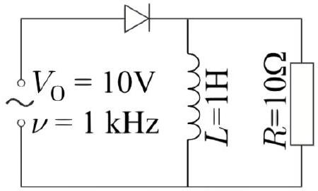
Assuming the current in the inductor begins at zero, what is the average current through the inductor at late times?

Solution. Since $\omega L \gg R$, the inductor's current changes very slowly, so we can neglect its change over any one cycle. During some cycle, let's write the steady state current in the inductor as

$$
\bar { I } _ { L } = \alpha \left( V _ { 0 } / R \right)
$$

where $\alpha = 0$ in the beginning. Let the current through the resistor be $I _ { R }$. The current through the diode is $I _ { D } = \bar { I } _ { L } + I _ { R }$. When the diode lets current through, $I _ { D } > 0$, the voltage across the inductor is

$$
V _ { L } = V _ { 0 } \cos ( 2 \pi \nu t ) .
$$

During this time, the current through the diode is a shifted sinusoid,

$$
I _ { D } = \bar { I } _ { L } + \frac { V _ { 0 } } { R } \cos ( 2 \pi \nu t )
$$

The diode blocks current once $I _ { D }$ falls to zero. Thus, for $\alpha = 0$ the diode is blocking half the time, while for $\alpha = 1$ the diode is never blocking. The situation for $\alpha \approx 0.5$ is shown below.
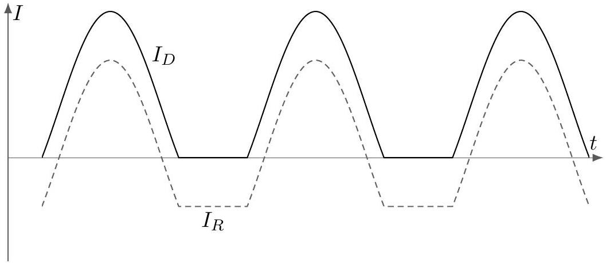

When the diode is blocking, the voltage across the inductor is

$$
V _ { L } = I _ { R } R = - \bar { I } _ { L } R .
$$

The net change in $\bar { I } _ { L }$ in one cycle is

$$
\Delta \bar { I } _ { L } = \frac { 1 } { L } \int _ { \text {cycle } } V _ { L } d t
$$

In the beginning, when $\alpha = 0$, this integral is positive because $V _ { L } ( t )$ looks like a sinusoid but with only the positive parts. As $\alpha$ increases, the integral begins to pick up part of the negative half of the sinusoid, but the overall integral is still positive, so $\alpha$ continues to increase. The final steady state is when $\alpha = 1$ and the current flows all the time. At this point, $\bar { I } _ { L } = V _ { 0 } / R = 1 \mathrm {~A}$.
[3] Problem 26. NBPhO 2008, problem 6.
[3] Problem 27. NBPhO 2013, problem 8. A circuit with a nice mechanical analogy.
[3] Problem 28. 3 IPhO 2001, problem 1c.
[3] Problem 29. USAPhO 2018, problem A2.
[4] Problem 30. EuPhO 2022, problem 2.
