## Electromagnetism VII: Electrodynamics

Chapter 9 of Purcell covers electromagnetic waves, and appendix H covers radiation by charges. For a pedagogical introduction with solved examples, see recitation 8 and recitation 9 of the MIT OCW 8.03 lectures. For more technical coverage, not necessarily relevant to the Olympiad, see chapters 7, 8, 10, 11 of Griffiths. For some lighter reading, see chapters I-28, I-32, II-18, II-20, II-21, and II-24 of the Feynman lectures. There is a total of 85 points.

## 1 More Nonlinear Circuit Elements

In this section we consider some more subtle applications of nonlinear circuit elements. First, we consider complex problems that use relatively familiar circuit elements.

[3] Problem 1. The setup below at left is called the Cockcroft-Walton voltage multiplier. It was used in 1932 to power the first particle accelerator.
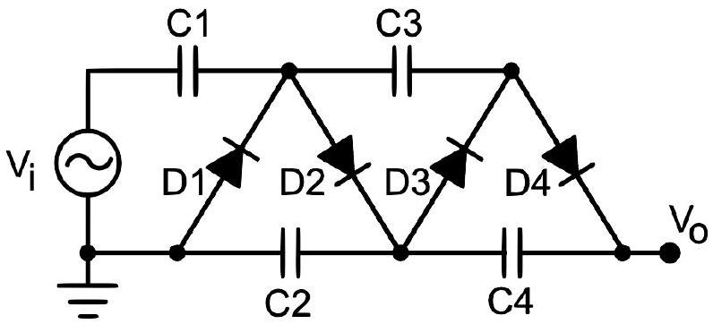
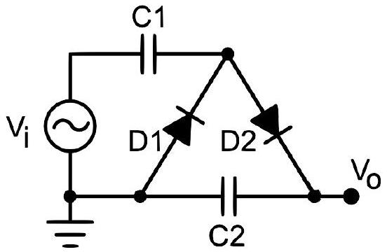
The four capacitors begin uncharged, and all have capacitance $C$. All four diodes are ideal. The voltage $V _ { i } ( t )$ alternates between $V$ and $- V$. The output voltage is $V _ { 0 }$.
    (a) To warm up, consider the simpler setup shown at right above. Suppose the applied voltage $V _ { i }$ begins at $- V$. Describe how $V _ { 0 }$ changes each time the applied voltage switches sign.
    (b) Now consider the full setup, shown at left above. After a long time, what is $V _ { 0 }$ ?

Solution. Since everything in this problem is ideal, the diodes let an arbitrary amount of current through whenever the potential difference across them is positive. In other words, they make sure the potential difference across them is zero or negative.

(a) When the applied voltage becomes $- V$, the potential at the right plate of C1 is lowered. This causes current to flow through D1, until the potential of that plate is nonnegative. When the applied voltage switches from $- V$ to $V$, the potential on the right plate of C1 is raised. This causes current to flow through D2, until the potential on the right plate of C2 is at least as high as that on the right plate of C1. (We don't have to worry much about the left plates; these are connected to ground, so they just automatically pick up opposite charges to the right plates.) Thus, the potentials on these right plates evolve as follows.
    1. $V _ { i } = - V$. This switches the potentials to $( - V , 0 )$, which means current flows through D1 until they are (0, 0).
    2. $V _ { i } = V$. This switches the potentials to $( 2 V , 0 )$. Current flows through D2 until they are $( V , V )$.

3. $V _ { i } = - V$. This switches the potentials to $( - V , V )$, so current flows through D1 until they are $( 0 , V )$.
4. $V _ { i } = V$. This switches the potentials to $( 2 V , V )$, so current flows through D2 until they are (3V/2, 3V/2).

The process continues similarly for more steps. The output voltage begins at zero, then becomes $V$ for two steps, then $3 V / 2$, then $7 V / 4$, then $15 V / 8$, and so on, asymptotically approaching $2 V$. So this setup is a voltage doubler.

(b) The actual sequence of events is complicated, but the full setup is essentially two copies of the reduced setup. After a long time, the output voltage is $4 V$. For a neat animation of how this works, using the fluid flow analogy for circuits, see this video.
[3] Problem 2 (NBPhO 2017). A Zener diode is connected to a source of alternating current as shown.
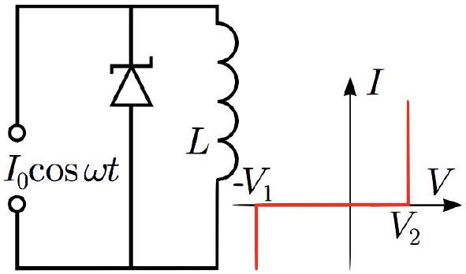
The inductance $L$ of the inductor is such that $L \omega I _ { 0 } \gg V _ { 1 } , V _ { 2 }$ where $V _ { 1 }$ and $V _ { 2 }$ are the breakdown voltages, and $V _ { 1 } > V _ { 2 }$. The $I ( V )$ characteristic of the Zener diode is shown above. Assume that a long time has passed since the current source was first turned on.
    (a) Find the average current through the inductor.
    (b) Find the peak-to-peak amplitude of the current changes $\Delta I$ in the inductor.
[4] Problem 3. NBPhO 2016, problem 4. A rather complicated problem involving several exotic circuit elements.
Next, we consider some qualitatively new behavior that can emerge from less familiar circuit elements, such as amplification, hysteresis, and instability.

Idea 1
Tunnel diodes are a variant of diodes, whose $I ( V )$ rises, falls, and rises again. That is, they have a region with negative differential resistance, $d I / d V < 0$. This allows them to amplify signals, as we'll see below, and also can make them unstable.

Example 1: NBPhO 2003
The circuit below, containing a tunnel diode, acts as a simple amplifier.

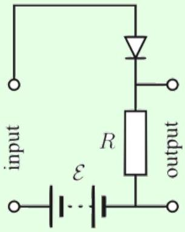
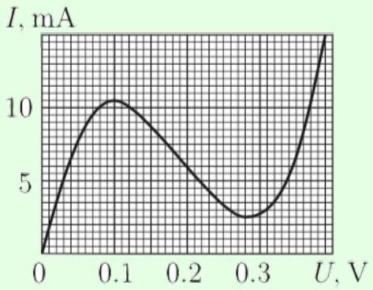
Here, $R = 10 \Omega$ and $\mathcal { E } = 0.25 \mathrm {~V}$. If a small signal voltage $V _ { \text {in } } ( t )$ is applied across the input, then an amplified and shifted version of the signal appears across the output. Find the amplification factor.

Solution
When a constant $\operatorname { emf } \mathcal { E }$ is applied, Kirchhoff's laws give

$$
\mathcal { E } = I _ { 0 } R + V \left( I _ { 0 } \right)
$$

where $V ( I )$ is the voltage characteristic of the diode.
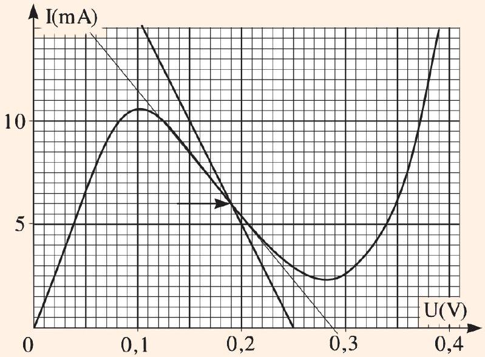
By plotting $\mathcal { E } - I R$ on the graph above, we find $I _ { 0 }$ at the intersection. (Notice the $x$-axis label: it is common to write a decimal point as a comma in Eastern Europe.) Now consider the effect of applying the signal voltage, which changes the current by $\Delta I$,

$$
\mathcal { E } + V _ { \mathrm { in } } = \left( I _ { 0 } + \Delta I \right) R + V \left( I _ { 0 } + \Delta I \right) .
$$

Since the signal voltage is small, we can Taylor expand the voltage characteristic, giving

$$
V _ { \mathrm { in } } = \Delta I \left( R + V ^ { \prime } \left( I _ { 0 } \right) \right) .
$$

This in turn tells us that

$$
V _ { \mathrm { out } } = \left( I _ { 0 } + \Delta I \right) R = V _ { \mathrm { out } } ^ { 0 } + \frac { R } { R + V ^ { \prime } \left( I _ { 0 } \right) } V _ { \mathrm { in } } .
$$

In other words, the change in $V _ { \text {out } }$ is just $V _ { \text {in } }$, times the amplification factor

$$
\frac { R } { R + V ^ { \prime } \left( I _ { 0 } \right) } = \frac { 10 } { 10 - 10 ^ { 3 } ( 0.016 ) } = - \frac { 5 } { 3 }
$$

where we read $V ^ { \prime } \left( I _ { 0 } \right)$ off the graph by drawing a tangent. The intuition here is that the circuit is like a voltage divider, but the tunnel diode acts like a negative resistance. If we had $V ^ { \prime } \left( I _ { 0 } \right)$ close to $- R$, for example, the amplification factor would have been huge. Since $V ^ { \prime } \left( I _ { 0 } \right)$ is more negative than $- R$, the signal ends up flipped.
[4] Problem 4. NBPhO 2020, problem 2. A comprehensive problem on the measurement and dynamics of tunnel diodes, which will give you a deeper understanding of negative resistance.

Solution. See the official solutions as usual. For more about stabilizing circuits with negative differential resistance, see problem 82 of Kalda's circuits handout.

Idea 2
Op amps have four terminals, and output a voltage across the last two equal to the voltage across the first two, times a very large gain. Like tunnel diodes, op amps can be unstable: increasing the input increases the output, but this in turn could increase the input again. Thus, in practice, the output and input are always wired together in a way that produces negative feedback, with changes in the output acting to decrease the input. In this case, one can think of an op amp as a tool that tries to set the input voltages equal to each other.

The internals are somewhat complicated, consisting of a lot of resistors and transistors. In general, to analyze setups with multiple complex circuit elements like these, it's better to treat them as black boxes than to try to intuit what's going on at the level of individual subelements, or electric and magnetic fields. (Of course, engineers do need to understand circuit elements at these level to design them in the first place!)
[3] Problem 5. USAPhO 2016, problem A2. This problem is a nice introduction to op amps.
Idea 3
In some nonlinear circuit elements, the function $I ( V )$ is multivalued. This indicates hysteresis: given $V$, the actual value of $I$ depends on the history of the system. The same goes for when $V ( I )$ is multivalued.
[5] Problem 6. IPhO 2016, problem 2. This problem illustrates the previous idea with a thyristor. Print out the official answer sheet and record your answers on it.

## 2 Displacement Current

Idea 4
In general, Ampere's law is

$$
\nabla \times \mathbf { B } = \mu _ { 0 } \mathbf { J } + \mu _ { 0 } \epsilon _ { 0 } \frac { \partial \mathbf { E } } { \partial t } .
$$

This is sometimes written in terms of a "displacement current" density $\mathbf { J } _ { d }$, where

$$
\nabla \times \mathbf { B } = \mu _ { 0 } \left( \mathbf { J } + \mathbf { J } _ { d } \right) , \quad \mathbf { J } _ { d } = \epsilon _ { 0 } \frac { \partial \mathbf { E } } { \partial t } .
$$

In integral form, for a surface $S$ bounded by a closed curve $C$,

$$
\oint _ { C } \mathbf { B } \cdot d \mathbf { s } = \mu _ { 0 } \int _ { S } \left( \mathbf { J } + \mathbf { J } _ { d } \right) \cdot d \mathbf { S } = \mu _ { 0 } I + \mu _ { 0 } \epsilon _ { 0 } \frac { d \Phi _ { E } } { d t } .
$$

[2] Problem 7 (Griffiths 7.34). A fat wire of radius $a$ carries a constant current $I$ uniformly distributed over its cross section. A narrow gap in the wire, of width $w \ll a$, forms a parallel plate capacitor.
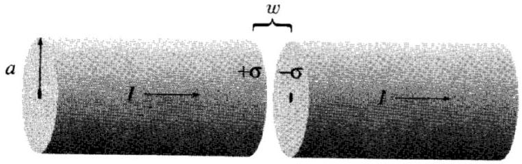
Find the magnetic field in the gap, at a distance $s < a$ from the axis.
Solution. The field in that region is $E = \sigma / \epsilon _ { 0 }$, so the displacement current density is $d \sigma / d t =$ $I / \left( \pi a ^ { 2 } \right)$, so we might as well assume that there is no gap. We see then that by Ampere's law that
$$
B \cdot 2 \pi s = \mu _ { 0 } \left( s ^ { 2 } / a ^ { 2 } \right) I , \quad B ( s ) = \frac { \mu _ { 0 } I } { 2 \pi } \frac { s } { a ^ { 2 } } .
$$
[3] Problem 8 (Purcell 9.3). A half-infinite wire carries constant current $I$ from negative infinity to the origin, where it builds up at a point charge with increasing $q$. Consider the circle shown below.
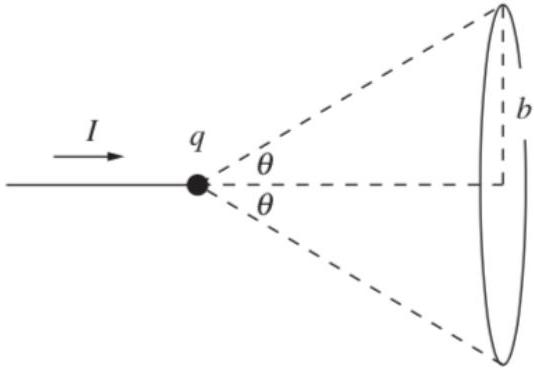
Calculate the integral $\int \mathbf { B } \cdot d \mathbf { s }$ about this circle in three ways.
    (a) Use the integrated form of Ampere's law, integrating over a surface which does not intersect the wire.
    (b) Do the same, with a surface that does intersect the wire.
    (c) Apply the Biot-Savart law to the current and displacement current.

Solution. Define coordinates such that the $z$ axis is anti-parallel to the wire, and use spherical coordinates $( r , \theta , \phi )$ with respect to this choice of the $z$ axis (we won't need $\theta$, so the choice of $x$ and $y$ axes is unimportant).

(a) Consider the surface $r = R$ and $0 \leq \theta \leq \theta _ { 0 }$ where we redefine the $\theta$ in the problem to $\theta _ { 0 }$. Note that $\mathbf { E } = \frac { q } { 4 \pi \epsilon _ { 0 } R ^ { 2 } } \hat { \mathbf { r } }$, so the displacement current at this surface is $\mathbf { J } _ { d } = \frac { I } { 4 \pi R ^ { 2 } } \hat { \mathbf { r } }$. We have
$$
\int \mathbf { B } \cdot d \mathbf { s } = \int \mu _ { 0 } \mathbf { J } _ { d } \cdot d \mathbf { S }
$$
where the second integral is over the surface we just defined. Note that the surface area of this surface is $2 \pi R ^ { 2 } \left( 1 - \cos \theta _ { 0 } \right)$, so we have
$$
\int \mathbf { B } \cdot d \mathbf { s } = \mu _ { 0 } I \frac { 1 - \cos \theta _ { 0 } } { 2 } .
$$
(b) Instead use the surface $\theta _ { 0 } \leq \theta \leq \pi$, and account for the current that pierces the surface. In the end, we get
$$
\mu _ { 0 } I - \mu _ { 0 } I \frac { 1 + \cos \theta _ { 0 } } { 2 } = \mu _ { 0 } I \frac { 1 - \cos \theta _ { 0 } } { 2 } ,
$$
which is what we got before.
(c) Since the displacement current is spherically symmetric, it doesn't produce any magnetic field at all, as we saw in an example in E3. So we consider just the wire.
Note that all the contributions from the infinitesimal pieces point in the $\hat { \boldsymbol { \phi } }$ direction, so we see that the field is
$$
B = \frac { \mu _ { 0 } I } { 4 \pi } \int _ { - \infty } ^ { - b \cot \theta _ { 0 } } \frac { b d z } { \left( b ^ { 2 } + z ^ { 2 } \right) ^ { 3 / 2 } } = \frac { \mu _ { 0 } I } { 4 \pi b } \int _ { - \infty } ^ { - \cot \theta _ { 0 } } \frac { d k } { \left( 1 + k ^ { 2 } \right) ^ { 3 / 2 } } = \frac { \mu _ { 0 } I } { 4 \pi b } \left( 1 - \cos \theta _ { 0 } \right)
$$
Thus, the integral is
$$
\int \mathbf { B } \cdot d \mathbf { s } = \frac { \mu _ { 0 } I } { 2 } \left( 1 - \cos \theta _ { 0 } \right)
$$
just as found in the previous parts.

In the previous problem, you should have found that the effect of the displacement current, in the Biot-Savart law, simply cancelled out everywhere. In fact, this cancellation is very general.

Idea 5
In any situation where $\mathbf { J }$ is constant, whether or not $\rho$ is constant, Maxwell's equations are satisfied by applying Coulomb's law to $\rho$ and the Biot-Savart law to J. You can include displacement currents in the Biot-Savart integral too, but their contributions perfectly cancel.

To see why, note that

$$
\nabla \times \mathbf { J } _ { d } = \epsilon _ { 0 } \nabla \times \frac { \partial \mathbf { E } } { \partial t } = \epsilon _ { 0 } \frac { \partial } { \partial t } ( \nabla \times \mathbf { E } ) = - \epsilon _ { 0 } \frac { \partial ^ { 2 } \mathbf { B } } { \partial t ^ { 2 } }
$$

where we used Faraday's law. When the currents are constant, the magnetic fields are also constant, so the right-hand side vanishes. Then $\nabla \times \mathbf { J } _ { d } = 0$. However, this

means that $\mathbf { J } _ { d }$ can always be written as a superposition of radial, spherically symmetric currents, and as we saw in the previous problem, such currents produce no magnetic fields.

This explains why we were able to get away with using Coulomb's law and the Biot-Savart law on previous problem sets, even in situations which were not exactly electrostatic or magnetostatic - all of these situations were "quasistatic". In general, the displacement current only matters in non-quasistatic situations involving rapid changes in J, and hence rapid changes in E and B. These are exactly the cases where significant electromagnetic radiation is produced, which is why radiation is covered in the last half of this problem set.

For more about this subtle point, see section 9.2 of Purcell, this paper and this paper.

## Example 2: MPPP 190

A parallel plate capacitor is charged and positioned above a compass as shown.
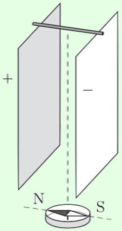
The capacitor is discharged slowly when the tops of the plates are joined using a small conducting rod. Which way is the compass needle deflected during the discharge process?

## Solution

Since the discharge is slow, the situation is quasistatic. (It would only be non-quasistatic in the case where the discharge time was comparable to the time it would take for light to cross the capacitor, a situation which is almost never achieved for $R C$ circuits.) Then we know the magnetic field due to the displacement current cancels out everywhere, so only the current $I$ in the rod matters. This current moves left to right, so by a straightforward application of the right-hand rule, we find that the compass is deflected east.

Things get more subtle if one insists on considering the displacement current anyway. A naive, incorrect argument would be to say that there is a total displacement current $I$ going right to left inside the capacitor, and since this displacement current is closer than the current in the rod, it produces a larger magnetic field, deflecting the compass west. The problem with this reasoning is that it has ignored the displacement current due to the changes in the substantial fringe fields of the capacitor. When these are accounted for, the magnetic fields due to the displacement current cancel, as argued generally above.
[3] Problem 9 (Griffiths 7.36). An alternating current $I = I _ { 0 } \cos ( \omega t )$ flows down a long straight wire

along the $\hat { \mathbf { z } }$ axis and returns along a coaxial conducting tube of radius $a$.

(a) By neglecting displacement current, show that the electric field in the tube is
$$
\mathbf { E } ( r ) = \frac { \mu _ { 0 } I _ { 0 } \omega } { 2 \pi } \sin ( \omega t ) \log \frac { a } { r } \hat { \mathbf { z } } .
$$
(b) Assuming this expression for the electric field holds, find the amplitude $I _ { d }$ of the total displacement current, and compute the ratio $I _ { d } / I _ { 0 }$.
(c) These results are approximately correct as long as $I _ { d } / I _ { 0 } \ll 1$. Show that this corresponds to requiring that the speed-of-light travel time from the wire to the tube is much shorter than the current's oscillation period.

By contrast, when $I _ { d } / I _ { 0 }$ isn't small, this solution wouldn't be approximately correct. Instead, we would have to consider the magnetic fields induced by the changing electric fields associated with the displacement current, and then the displacement currents due to the changes in those magnetic fields, and so on. The full solution would contain a propagating electromagnetic wave.

Solution. (a) Consider a rectangular Amperian loop with height $z$, with sides at radius $r$ and radius $s _ { 0 } > a$. The electric field vanishes at the outer side, so the electric field $E _ { z } ( r )$ obeys

$$
E _ { z } ( r ) = - \frac { 1 } { z } \frac { d \Phi _ { B } } { d t } = - \frac { 1 } { z } \frac { d } { d t } \int _ { r } ^ { a } \frac { \mu _ { 0 } I } { 2 \pi r ^ { \prime } } z d r ^ { \prime } = \frac { \mu _ { 0 } I _ { 0 } \omega } { 2 \pi } \sin ( \omega t ) \log \frac { a } { r } ,
$$

as desired.

(b) Note that $\mathbf { J } _ { d } ( r ) = \epsilon _ { 0 } \frac { \mu _ { 0 } I _ { 0 } \omega ^ { 2 } } { 2 \pi } \cos ( \omega t ) \log ( a / r ) \hat { \mathbf { z } }$. Thus, the amplitude is
$$
I _ { d } = \frac { \omega ^ { 2 } I } { 2 \pi c ^ { 2 } } \int _ { 0 } ^ { a } \log ( a / r ) 2 \pi r d r = \frac { \omega ^ { 2 } I a ^ { 2 } } { 4 c ^ { 2 } }
$$
(c) The ratio goes as $I _ { d } / I _ { 0 } \sim \omega ^ { 2 } a ^ { 2 } / c ^ { 2 }$, so $I _ { d }$ is significant once $1 / \omega \sim a / c$. Up to constants, these are the period and the speed of light travel time, as desired.

By the way, you might be wondering why this problem uses a cylindrical geometry, while the geometries of a spherical or infinite parallel-plane capacitor are more symmetric. Things go wrong in those cases because you need some path for the current to get from one plate to the other. For the spherical case, you can only maintain the symmetry if the current flows radially in a spherically symmetric manner. But in such cases, the magnetic field is always just zero by symmetry and Gauss's law, as we argued in E3, which ruins the point of the problem. In the parallel plate case, you could imagine the current goes from one plate to another "at infinity", but, as we saw in a similar problem in E1, the precise way you define what's happening at infinity will affect the answer! The general lesson is that cylindrical geometries are often nice for demonstrating theoretical points, because they are infinite in one direction (so you can have the current return there) but not others (so you can still unambiguously define the potential to be "zero far away"). In fact, as you get further in physics, nice setups become increasingly rare, and it will often be the case that only one setup works for demonstrating a point without technical complications.

[3] Problem 10. [A] Consider an infinite thin solenoid which initially carries no current, and a loop of wire around this solenoid of enormous radius, say one light year. At some moment, a current is suddenly made to flow through the solenoid. (This cannot be done by simply attaching a battery somewhere, because it will take a long time for the current to turn on throughout the solenoid. So instead, consider a situation where many batteries arranged around the solenoid are all attached in at once, which can be achieved by machines which have synchronized their clocks beforehand.)
A magnetic field is hence quickly produced in the solenoid, so by Faraday's law,
$$
\mathcal { E } = - \frac { d \Phi _ { B } } { d t }
$$
there should quickly be an emf in the loop of wire. But this seems to violate locality, because the motion of charges in the solenoid is quickly affecting the motion of charges in the wire loop, which is very far away. What's going on? Could there be something wrong with Faraday's law?
Solution. Faraday's law is fine. It is completely compatible with relativity - after all, the fact that Maxwell's equations obey the postulates of relativity is how we discovered it in the first place!
The real resolution is that both $\mathcal { E }$ and $\Phi _ { B }$ remain zero for about a year. At the moment the current is switched on, the changing current produces a pulse of outward-moving, radially symmetric electromagnetic radiation. This radiation has a downward-pointing magnetic field and tangential-pointing electric field. The downward-pointing magnetic field exactly cancels the flux from the upward-pointing solenoid field, so that $\Phi _ { B }$ is exactly zero until the pulse passes by the wire. (In terms of field lines, each magnetic field line going up through the solenoid returns downward. The downwardly returning field lines move outward at speed $c$.) As the pulse passes by the wire, $\Phi _ { B }$ starts to change. Accordingly, an emf appears at the very same moment, due to the tangential electric field in the pulse.
So Faraday's law is always satisfied, but in quite a subtle way! Because of subtleties like this, people sometimes advocate teaching electromagnetism without this "flux rule", but it really is quite useful in practice.
[3] Problem 11 (Griffiths 7.64). [A] Setting $\mu _ { 0 } = \epsilon _ { 0 } = 1$, Maxwell's equations read
$$
\nabla \cdot \mathbf { E } = \rho _ { e } , \quad \nabla \times \mathbf { E } = - \frac { \partial \mathbf { B } } { \partial t } , \quad \nabla \cdot \mathbf { B } = 0 , \quad \nabla \times \mathbf { B } = \mathbf { J } _ { e } + \frac { \partial \mathbf { E } } { \partial t }
$$
where $\rho _ { e }$ and $\mathbf { J } _ { e }$ are the electric charge density and electric current density.
    (a) Show that Maxwell's equations ensure the conservation of electric charge,
$$
\dot { \rho } _ { e } = - \nabla \cdot \mathbf { J } _ { e } .
$$
This is the continuity equation, and we saw versions of it for other conserved quantities in T2.
    (b) Generalize Maxwell's equations to include a magnetic charge density $\rho _ { m }$ and a magnetic current density $\mathbf { J } _ { m }$. Fix the signs by demanding that magnetic charge is conserved.
    (c) Check that the resulting equations are invariant under the duality transformation
$$
\binom { \mathbf { E } ^ { \prime } } { \mathbf { B } ^ { \prime } } = \left( \begin{array} { c c }
\cos \theta & \sin \theta \\
- \sin \theta & \cos \theta
\end{array} \right) \binom { \mathbf { E } } { \mathbf { B } } , \quad \binom { \rho _ { e } ^ { \prime } } { \rho _ { m } ^ { \prime } } = \left( \begin{array} { c c }
\cos \theta & \sin \theta \\
- \sin \theta & \cos \theta
\end{array} \right) \binom { \rho _ { e } } { \rho _ { m } }
$$
which rotates electricity into magnetism with angle $\theta$.

(d) Write down the Lorentz force law for a particle with electric and magnetic charge, using the fact that it should be invariant under the duality transformation above.

Solution. (a) Taking the time derivative of Gauss's law gives

$$
\dot { \rho } _ { e } = \nabla \cdot \dot { \mathbf { E } } .
$$

By taking the divergence of Ampere's law, we have

$$
\nabla \cdot ( \nabla \times \mathbf { B } ) = \nabla \cdot \mathbf { J } _ { e } + \nabla \cdot \dot { \mathbf { E } } .
$$

The left-hand side vanishes, because the divergence of a curl of any vector field is always zero. We thus have

$$
0 = \nabla \cdot \mathbf { J } _ { e } + \dot { \rho } _ { e }
$$

as desired.

(b) Almost by definition, we will want to have $\nabla \cdot \mathbf { B } = \rho _ { m }$. By symmetry we want something like
$$
\nabla \times \mathbf { E } = - \frac { \partial \mathbf { B } } { \partial t } \pm \mathbf { J } _ { m } .
$$
By enforcing that the divergence of the right side is zero, we learn that it is
$$
\nabla \times \mathbf { E } = - \frac { \partial \mathbf { B } } { \partial t } - \mathbf { J } _ { m } .
$$
(c) The equations can be written succinctly as
$$
\nabla \cdot \binom { \mathbf { E } } { \mathbf { B } } = \binom { \rho _ { e } } { \rho _ { m } } .
$$
Applying the rotation matrix to both sides shows that the Gauss's laws are satisfied in the primed setup. Similarly, the other two can be written as
$$
\nabla \times \binom { \mathbf { E } } { \mathbf { B } } = \left( \begin{array} { c c }
0 & - 1 \\
1 & 0
\end{array} \right) \partial _ { t } \binom { \partial _ { t } \mathbf { E } + \mathbf { J } _ { e } } { \partial _ { t } \mathbf { B } + \mathbf { J } _ { m } } .
$$
Again, the result is clear by applying the rotation transformation.
(d) We see that $\mathbf { F } = q _ { e } ( \mathbf { E } + \mathbf { v } \times \mathbf { B } ) + q _ { m } ( \mathbf { B } - \mathbf { v } \times \mathbf { E } )$. We see that
$$
\begin{aligned}
\mathbf { F } ^ { \prime } = & \left( q _ { e } \cos \theta + q _ { m } \sin \theta \right) [ ( \mathbf { E } \cos \theta + \mathbf { B } \sin \theta ) + \mathbf { v } \times ( \mathbf { B } \cos \theta - \mathbf { E } \sin \theta ) ] \\
& \quad + \left( q _ { m } \cos \theta - q _ { e } \sin \theta \right) [ ( \mathbf { B } \cos \theta - \mathbf { E } \sin \theta ) - \mathbf { v } \times ( \mathbf { E } \cos \theta + \mathbf { B } \sin \theta ) ] \\
= q _ { e } \mathbf { E } & \left( \cos ^ { 2 } \theta + \sin ^ { 2 } \theta \right) + \mathbf { v } \times \mathbf { B } \left( \cos ^ { 2 } \theta + \sin ^ { 2 } \theta \right) \\
& \quad + q _ { m } \mathbf { B } \left( \sin ^ { 2 } \theta + \cos ^ { 2 } \theta \right) + \mathbf { v } \times ( - \mathbf { E } ) \left( \sin ^ { 2 } \theta + \cos ^ { 2 } \theta \right) = \mathbf { F }
\end{aligned}
$$
as desired.

Remark
The peculiar name of $\mathbf { J } _ { d }$ is because Maxwell thought of it as a literal displacement of a jelly-like ether. In that era, all electromagnetic quantities, such as fields, charges, currents, polarizations, and magnetizations, were thought to reflect properties of a mechanical ether, such as local strains, displacements, and rotations. However, making this picture precise was known to be difficult even before the advent of relativity, which rendered ether obsolete. The best way to understand why physicists abandoned ether models is to have a look at their daunting complexity. For a nice overview, with diagrams, see chapter 4 of The Maxwellians.

## 3 Field Energy and Momentum

Idea 6
The Poynting vector

$$
\mathbf { S } = \frac { \mathbf { E } \times \mathbf { B } } { \mu _ { 0 } }
$$

gives the flux density of the energy of an electromagnetic field. That is, the flux of $\mathbf { S }$ into a closed surface is the rate of change of energy within that surface.
[3] Problem 12. USAPhO 2010, problem B2.
[3] Problem 13. USAPhO 2013, problem B2.
Remark
It's unlikely that you'll see any examples besides the ones in the above two problems, because in almost all other setups, the Poynting vector depends sensitively on the fringe fields, which are very hard to calculate. (For some work in this direction, see Energy transfer in electrical circuits: A qualitative account.) In any case, the examples above illustrate the important point that the energy of a circuit does not flow along the wire, carried by the charges; instead it flows into circuit elements from the sides. This was an important early clue of the importance of the electromagnetic field.

Remark
As proven in Poynting's theorem, the Poynting vector indeed tells us about the net flow of energy. However, this would remain true if we added a constant vector to it, or more generally any divergence-free vector field, since these wouldn't change the net flow. So which option is the "correct" one? According to everything we've learned so far, there's no absolute way to choose, and we just use the Poynting vector because it's the simplest option. However, in general relativity, the flow of energy directly influences the curvature of spacetime, so there is an unambiguous correct answer, which is indeed the Poynting vector.

Example 3
Consider two charges $q$, at positions $r \hat { \mathbf { x } }$ and $r \hat { \mathbf { y } }$ respectively, both moving with speed $v$ towards the origin. Show that the magnetic forces between them are not equal and opposite. That is, electromagnetic forces do not obey Newton's third law.

Solution
In order to find the B field produced by each charge at the location of the other, we use the Biot-Savart law and the right-hand rule. Then we use the Lorentz force and the right-hand rule again to find the magnetic forces on each charge.

For example, the B field produced by the first charge at the location of the second is along - $\hat { \mathbf { z } }$. Then the magnetic force on the second charge is parallel to $\hat { \mathbf { x } }$. The magnetic force on the first charge is parallel to $\hat { \mathbf { y } }$. And the forces are definitely nonzero, so they can't be equal and opposite.

To explain this, we recall that the point of Newton's third law is just momentum conservation. This still holds, as long as one remembers that the field carries momentum of its own. (If we want to save some version of Newton's third law, we could say that the real action-reaction pairs are the forces between the charges and the field, not the charges with each other. But the real lesson is that Newton's third law is not fundamental, momentum conservation is.)

Idea 7
The momentum density of the electromagnetic field is

$$
\mathbf { p } = \frac { \mathbf { S } } { c ^ { 2 } } .
$$

In other words, momentum density and energy flux density are just proportional. As you will see in R2, this is true in general in relativity. The angular momentum density is $\mathbf { r } \times \mathbf { p }$. For an explicit derivation that these definitions ensure the total momentum and angular momentum are conserved, see section 8.2 of Griffiths. (You might think the definitions come out of nowhere; the straightforward way to find them is to apply Noether's theorem, as you will learn in a more advanced class.)

Remark
We have already seen an example of electromagnetic field momentum at work. Back in E4, you found that in the presence of a magnetic monopole, the mechanical angular momentum $\mathbf { L }$ of a point charge was not conserved, but $\mathbf { L } - q g \hat { \mathbf { r } }$ was. In fact, this second term turns out to be exactly the angular momentum of the field, so this conservation law is simply the conservation of total angular momentum. (If you'd like to verify this explicitly, it's easiest to use spherical coordinates with the monopole at the origin and the charge along the $z$-axis, but be warned, it's fairly messy.)
[3] Problem 14 (Griffiths). A long coaxial cable of length $\ell$ consists of an inner conductor of radius $a$ and an outer conductor of radius $b$. The inner conductor carries a uniform charge per unit length

$\lambda$, and a steady current $I$ to the right; the outer conductor has the opposite charge and current.

(a) Find the electromagnetic momentum stored in the fields.
(b) In part (a) you should have found that the fields contain a nonzero momentum directed along the cable. However, this is puzzling because it appears that no net mass is transported along the cable. How is this paradox resolved? (Hint: it doesn't make sense to consider the cable in isolation, as nothing would be keeping the current going. Consider attaching a battery across the left end and a resistor across the right end.)

Solution. (a) Set up the obvious cylindrical coordinates, with $\hat { \mathbf { z } }$ directed to the right. In between the tubes the fields are

$$
\mathbf { E } = \frac { 1 } { 2 \pi \epsilon _ { 0 } } \frac { \lambda } { s } \hat { \mathbf { s } } , \quad \mathbf { B } = \frac { \mu _ { 0 } } { 2 \pi } \frac { I } { s } \hat { \boldsymbol { \phi } } ,
$$

and they are zero everywhere else. Therefore, the momentum is $\int \epsilon _ { 0 } ( \mathbf { E } \times \mathbf { B } ) d V$ or

$$
\mathbf { p } = \hat { \mathbf { z } } \frac { \mu _ { 0 } I \lambda } { 4 \pi ^ { 2 } } \int _ { a } ^ { b } \frac { 1 } { s ^ { 2 } } \ell 2 \pi s d s = \frac { \mu _ { 0 } I \lambda \ell } { 2 \pi } \log ( b / a ) \hat { \mathbf { z } }
$$

(b) As this process goes on, the battery loses energy and the resistor gains energy (i.e. heats up). Since $E = m c ^ { 2 }$, that means the resistor is gaining mass while the battery is losing mass. Thus, the momentum reflects the fact that the center of mass of the system is going to the right. (This is a concrete example of the statement of idea 7, i.e. that momentum is always accompanied by the flow of energy.)
You might also wonder about the momentum and kinetic energy carried by the electrons themselves; however, as described in a remark at the end of E5, for typical circuits this is negligible compared to the momentum and energy carried by the fields.

[3] Problem 15. In the early $20 ^ { \text {th } }$ century, physicists sought to explain the $E = m c ^ { 2 }$ rest energy in terms of electromagnetic field energy. As a concrete example, model a charged particle as a uniform spherical shell of radius $a$ and charge $q$.

(a) Find the radius $a$ so that the total field energy equals the rest energy associated with the electron mass $m$. Up to an $\mathcal { O } ( 1 )$ factor, this quantity is called the classical electron radius.
(b) If the shell moves with a small speed $v$, we expect to have $p = m v$, where $p$ is the total field momentum. Show that instead, we have $p = ( 4 / 3 ) m v$. You may use the result
$$
\mathbf { B } = \frac { \mathbf { v } } { c ^ { 2 } } \times \mathbf { E }
$$
which we will prove in R3. Many complicated ideas were put forth to explain this infamous "4/3 problem", as recounted in chapter II-28 of the Feynman lectures.

For more about the "radius" of an electron, see this blog post. For a modern discussion of the resolution of the 4/3 problem, see this paper.

Solution. (a) The electrostatic energy of a uniform spherical shell of radius $a$ is

$$
U = \frac { 1 } { 2 } q V = \frac { q ^ { 2 } } { 8 \pi \epsilon _ { 0 } a }
$$

where the factor of $1 / 2$ avoids double counting the energy. Setting $U = m c ^ { 2 }$ gives

$$
a = \frac { q ^ { 2 } } { 8 \pi \epsilon _ { 0 } m c ^ { 2 } } .
$$

(b) Note that
$$
\mathbf { S } = \frac { 1 } { \mu _ { 0 } } \mathbf { E } \times ( \mathbf { v } \times \mathbf { E } ) / c ^ { 2 } .
$$
Set up spherical coordinates where $\mathbf { v } \| \hat { \mathbf { z } }$. Letting $k = 1 / \left( 4 \pi \epsilon _ { 0 } \right)$, we then have
$$
\begin{aligned}
\int \mathbf { E } \times ( \mathbf { v } \times \mathbf { E } ) d V & = \int \left( \mathbf { v } \left( E ^ { 2 } \right) - \mathbf { E } ( \mathbf { v } \cdot \mathbf { E } ) \right) d V \\
& = ( k q ) ^ { 2 } \hat { \mathbf { z } } \int _ { a } ^ { \infty } \int _ { 0 } ^ { \pi } \int _ { 0 } ^ { 2 \pi } \left[ v / r ^ { 4 } - v \cos ^ { 2 } \theta / r ^ { 4 } \right] r ^ { 2 } \sin \theta d \phi d \theta d r \\
& = 2 \pi ( k q ) ^ { 2 } v \int _ { a } ^ { \infty } \frac { 1 } { r ^ { 2 } } \int _ { 0 } ^ { \pi } \left( \sin \theta - \cos ^ { 2 } \theta \sin \theta \right) d \theta d r \\
& = 2 \pi ( k q ) ^ { 2 } v \int _ { a } ^ { \infty } \frac { 4 } { 3 } \frac { d r } { r ^ { 2 } } = \frac { 8 } { 3 } \frac { ( k q ) ^ { 2 } \pi v } { a }
\end{aligned}
$$
The momentum is then
$$
p = \frac { 1 } { c ^ { 4 } \mu _ { 0 } } \frac { 8 } { 3 } \left( \frac { q } { 4 \pi \epsilon _ { 0 } } \right) ^ { 2 } \frac { \pi v } { a } = \frac { 4 } { 3 } \frac { 1 } { c ^ { 2 } } \frac { q ^ { 2 } } { 8 \pi \epsilon _ { 0 } a } v = \frac { 4 } { 3 } m v
$$
as stated.
[3] Problem 16 (Griffiths 8.6). A charged parallel plate capacitor is placed in a uniform magnetic field as shown.
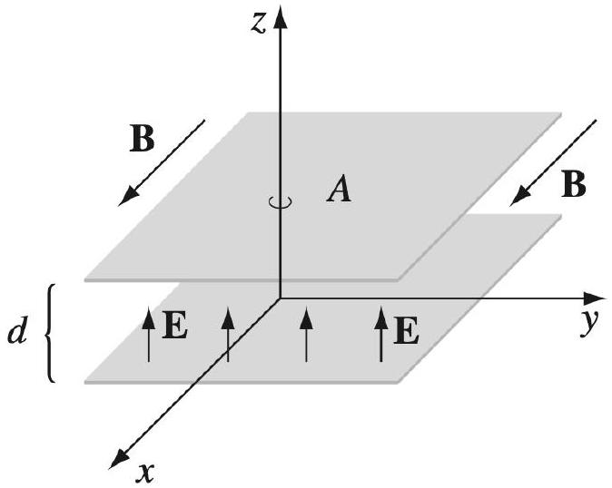
    (a) Find the electromagnetic momentum in the space between the plates.
    (b) Now a resistive wire is connected between the plates, along the $z$-axis, so that the capacitor slowly discharges. The current through the wire will experience a magnetic force; show the total impulse equals the stored momentum.
    (c) Alternatively, suppose we slowly reduced the magnetic field. Show that the total impulse delivered to the plates equals the stored momentum.

This calculation is standard and given in many textbooks, but it is actually completely wrong: we have ignored the fringe field, and when it is included the total electromagnetic momentum is half of what was naively calculated in part (a). The answer in part (b) is correct, but the other half of the impulse corresponds to a change in non-electromagnetic "hidden momentum". The most basic example of hidden momentum is covered in example 12.12 of Griffiths. For a detailed analysis of the hidden momentum in this setup, see this paper.

Solution. (a) Using the standard formula,

$$
\mathbf { p } = \epsilon _ { 0 } ( \mathbf { E } \times \mathbf { B } ) A d = \epsilon _ { 0 } E B A d \hat { \mathbf { y } } .
$$

(b) If $Q ^ { \prime }$ is the charge on the plates at any given moment, the impulse $\mathbf { j }$ is
$$
\mathbf { j } = \int _ { 0 } ^ { \infty } I ( \boldsymbol { \ell } \times \mathbf { B } ) d t = - ( d \hat { \mathbf { y } } ) \int _ { Q } ^ { 0 } B d Q ^ { \prime }
$$
Performing the integral, the total impulse is
$$
\mathbf { j } = B Q d \hat { \mathbf { y } } = \epsilon _ { 0 } E B A d \hat { \mathbf { y } }
$$
in agreement with part (a).
(c) By Faraday's law, a nonconservative electric field is generated in the setup, which pushes the plates with a net force. Note that when the situation is symmetric, the electric field is $\mathbf { E } ^ { \prime } = ( 1 / 2 ) \dot { B } d \hat { \mathbf { y } }$ at the bottom plate, and $- \mathbf { E } ^ { \prime }$ at the top plate. So the total impulse is
$$
\mathbf { j } = \int _ { 0 } ^ { \infty } \left( Q \mathbf { E } ^ { \prime } \right) + \left( ( - Q ) \left( - \mathbf { E } ^ { \prime } \right) \right) d t = \int _ { 0 } ^ { \infty } \dot { B } Q d \hat { \mathbf { y } } d t = B Q d \hat { \mathbf { y } } = \epsilon _ { 0 } E B A d \hat { \mathbf { y } }
$$
in agreement with parts (a) and (b). The answer is the same if the setup were asymmetric, i.e. if the fields had been $\mathbf { E } ^ { \prime } + \mathbf { E } _ { 0 }$ and $- \mathbf { E } ^ { \prime } + \mathbf { E } _ { 0 }$ at the top and bottom plates, because $\mathbf { E } _ { 0 }$ would not contribute to the net force.

[3] Problem 17. USAPhO 2004, problem B2. (The official solution is off by a sign in the last part. This classic setup also appears on USAPhO 2020, problem A1, and INPhO 2020, problem 2. However, the official solution to USAPhO 2020, problem A1 has factor of 2 errors.)

## 4 Electromagnetic Waves

Idea 8
Maxwell's equations have propagating wave solutions of the form

$$
\mathbf { E } = \mathbf { E } _ { 0 } e ^ { i ( \mathbf { k } \cdot \mathbf { r } - \omega t ) } , \quad \mathbf { B } = \mathbf { B } _ { 0 } e ^ { i ( \mathbf { k } \cdot \mathbf { r } - \omega t ) }
$$

where $\mathbf { E }$ and $\mathbf { B }$ are in phase, perpendicular in direction, and have magnitudes $E _ { 0 } = c B _ { 0 }$. The propagation direction k is along $\mathbf { E } \times \mathbf { B }$, and the wave speed is

$$
c = \frac { \omega } { k } = \frac { 1 } { \sqrt { \mu _ { 0 } \epsilon _ { 0 } } } .
$$

Example 4
Verify explicitly that in the absence of charges and currents, the electromagnetic field above satisfies Maxwell's equations.

Solution
First let's consider Gauss's law, $\nabla \cdot \mathbf { E } = 0$. Splitting everything explicitly into components,

$$
\begin{aligned}
\nabla \cdot \mathbf { E } & = e ^ { - i \omega t } \left( \frac { \partial } { \partial x } \left( E _ { 0 , x } e ^ { i \mathbf { k } \cdot \mathbf { r } } \right) + \frac { \partial } { \partial y } \left( E _ { 0 , y } e ^ { i \mathbf { k } \cdot \mathbf { r } } \right) + \frac { \partial } { \partial z } \left( E _ { 0 , z } e ^ { i \mathbf { k } \cdot \mathbf { r } } \right) \right) \\
& = e ^ { - i \omega t } \left( E _ { 0 , x } \frac { \partial } { \partial x } e ^ { i \mathbf { k } \cdot \mathbf { r } } + E _ { 0 , y } \frac { \partial } { \partial y } e ^ { i \mathbf { k } \cdot \mathbf { r } } + E _ { 0 , z } \frac { \partial } { \partial z } e ^ { i \mathbf { k } \cdot \mathbf { r } } \right) \\
& = e ^ { i ( \mathbf { k } \cdot \mathbf { r } - \omega t ) } \left( i E _ { 0 , x } k _ { x } + i E _ { 0 , y } k _ { y } + i E _ { 0 , z } k _ { z } \right) \\
& = i \mathbf { k } \cdot \mathbf { E } = 0
\end{aligned}
$$

since $\mathbf { k }$ is perpendicular to $\mathbf { E } _ { 0 }$. This is another example of a lesson we saw in M4. Namely, when everything is a complex exponential, differentiation is very easy. For an complex exponential in time, $e ^ { i \omega t }$, differentiation with respect to time is just multiplication by $i \omega$. Similarly, for a field which is a complex exponential in space, $e ^ { i \mathbf { k } \cdot \mathbf { r } }$, the divergence $( \nabla \cdot )$ becomes ( $i \mathbf { k } \cdot$ ).

By similar reasoning, Gauss's law for magnetism is satisfied. Next, we check Ampere's law,

$$
\nabla \times \mathbf { B } = \mu _ { 0 } \epsilon _ { 0 } \frac { \partial \mathbf { E } } { \partial t } .
$$

By the same logic as above, the curl becomes $( i \mathbf { k } \times )$, while the time derivative becomes multiplication by $- i \omega$, giving

$$
i \mathbf { k } \times \mathbf { B } = ( - i \omega ) \mu _ { 0 } \epsilon _ { 0 } \mathbf { E } .
$$

Because k, E, and B are all mutually perpendicular, the directions of both sides match. Then all that remains is to check the magnitudes,

$$
k B _ { 0 } = \omega \mu _ { 0 } \epsilon _ { 0 } E _ { 0 } .
$$

By plugging in results from above, this reduces to

$$
c ^ { 2 } = \frac { 1 } { \mu _ { 0 } \epsilon _ { 0 } }
$$

which matches what we said above. (Or, if we didn't know what $c$ was, this logic would have been a way to derive it, as Maxwell did.) The verification of Faraday's law is similar. Note that the displacement current term was essential; it wouldn't have been possible to get electromagnetic wave solutions without it.
[3] Problem 18. Consider the energy and momentum of the electromagnetic wave in idea 8.

(a) Show that the spatial average of the energy density is $\epsilon _ { 0 } E _ { 0 } ^ { 2 } / 2$. (Be careful with factors of 2.)
(b) Compute the spatial average of the momentum density $\langle \mathbf { p } \rangle$ using idea 7 .
(c) Confirm that $E = p c$ for an electromagnetic wave.

Solution. The key pitfall here is that we have to take into account the fact that for all nonlinear quantities such as these, we need to look only at the real part of the above formulas.

(a) The energy is $u = \frac { 1 } { 2 \epsilon _ { 0 } } \left( E ^ { 2 } + c ^ { 2 } B ^ { 2 } \right)$. The average value of $E ^ { 2 }$ is $E _ { 0 } ^ { 2 } / 2$ by the usual $\cos ^ { 2 } ( k x )$ averaging trick, and the average value of $B ^ { 2 }$ is $B _ { 0 } ^ { 2 } / 2$. There are two terms, so the average of their sum is $\epsilon _ { 0 } E _ { 0 } ^ { 2 } / 2$.
(b) It's $\left\langle \epsilon _ { 0 } \mathbf { E } \times \mathbf { B } \right\rangle$. Again the product has the spatial form $\cos ^ { 2 } ( k x )$, so the averaging over space gives a factor of $1 / 2$, giving $\epsilon _ { 0 } E _ { 0 } ^ { 2 } / 2 c$.
(c) This is equivalent to showing that the energy density is equal to the momentum density times $c$, which is indeed true from our results above.

[3] Problem 19. The intensity of sunlight at noon is approximately $1 \mathrm {~kW} / \mathrm { m } ^ { 2 }$.

(a) Compute the rms magnetic field strength.
(b) Compute the radiation pressure acting on a mirror lying on the ground.
(c) In terms of the Lorentz force, how is this pressure exerted on the particles in the mirror?

Solution. (a) Note that the intensity is the Poynting vector. We have $\langle S \rangle = \frac { c } { \mu _ { 0 } } B _ { \text {rms } } ^ { 2 }$, so

$$
B _ { \mathrm { rms } } \approx 2 \times 10 ^ { - 6 } \mathrm {~T} .
$$

(b) We get a factor of 2 because the radiation bounces off the mirror, giving
$$
P = \frac { 2 S } { c } = 7 \times 10 ^ { - 6 } \mathrm {~Pa} .
$$
(c) The basic idea is that the particles are accelerated in the direction of E, and thus feel a force in the direction $( \mathbf { v } \times \mathbf { B } ) \| ( \mathbf { E } \times \mathbf { B } ) \| \mathbf { S }$.
However, making this more quantitative is more subtle. For an ideal free particle, a is in phase with E, which means v is 90° out of phase with E. Since B is in phase with E, the magnetic force $\mathbf { v } \times \mathbf { B }$ has time dependence of the form $\cos ( \omega t ) \sin ( \omega t )$, which averages to zero.
On the other hand, suppose the particle is attached to a damped harmonic oscillator, and $\omega$ is at the resonant angular frequency. Then from M4 results, v is instead in phase with E, which means the magnetic force has time dependence $\cos ^ { 2 } ( \omega t )$, which doesn't average to zero.
The point is, you need some kind of other force at play to produce a phase shift between a and $\mathbf { E }$, or else the force averages to zero. And this makes perfect sense from an energy conservation standpoint: a nonzero average force means momentum is taken out of the radiation, which means part of it is absorbed. This is only possible if the absorbed energy goes somewhere else, e.g. in the damped harmonic oscillator case it is dissipated by the damping force.
This raises yet another question: how it is possible for an isolated charge to scatter radiation, in Thomson or Compton scattering? The reason is that there is another force at play, namely the radiation reaction force acting on the particle. You can read more about this subtle force in section 11.2 of Griffiths.

[3] Problem 20 (Purcell 9.7). Consider the sum of two oppositely-traveling electromagnetic waves, with electric fields

$$
\mathbf { E } _ { 1 } = E _ { 0 } \cos ( k z - \omega t ) \hat { \mathbf { x } } , \quad \mathbf { E } _ { 2 } = E _ { 0 } \cos ( k z + \omega t ) \hat { \mathbf { x } } .
$$

(a) Write down the magnetic field.
(b) Draw plots of the energy density $U ( z , t )$ for $\omega t \in \{ 0 , \pi / 4 , \pi / 2,3 \pi / 4 , \pi \}$.
(c) Plot the Poynting vector for the same values of $\omega t$, and convince yourself that it describes how the energy sloshes back and forth.

Solution. (a) The answer is

$$
\mathbf { B } = \frac { E _ { 0 } } { c } ( \cos ( k z - \omega t ) - \cos ( k z + \omega t ) ) \hat { \mathbf { y } } = \frac { 2 E _ { 0 } } { c } \sin ( k z ) \sin ( \omega t ) \hat { \mathbf { y } } .
$$

(b) For the purposes of the following plots and calculations, we set $k = \omega = E _ { 0 } = B _ { 0 } = c = \mu _ { 0 } =$ $\epsilon _ { 0 } = 1$. In these units, we have $E = \cos ( z - t ) + \cos ( z + t ) = 2 \cos ( z ) \cos ( t )$ and therefore $U = \left( E ^ { 2 } + B ^ { 2 } \right) / 2 = 2 \left( \sin ^ { 2 } ( z ) \sin ^ { 2 } ( t ) + \cos ^ { 2 } ( z ) \cos ^ { 2 } ( t ) \right)$. Plotting this gives
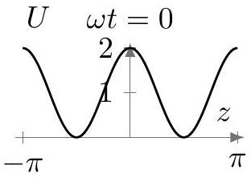
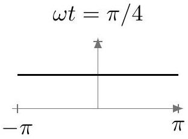
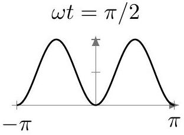
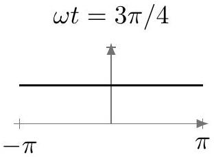
for $0 , \pi / 4 , \pi / 2$, and $3 \pi / 4$ respectively, while the result for $\pi$ is the same as for 0.
(c) The Poynting vector is proportional to $\sin ( z ) \cos ( z ) \sin ( t ) \cos ( t ) \hat { \mathbf { z } }$, which is in turn proportional to $\sin ( 2 z ) \sin ( 2 t ) \hat { \mathbf { z } }$. The plot of this at the same times as above is:
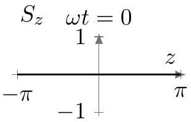
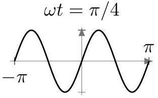
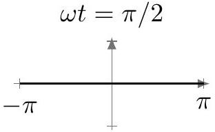
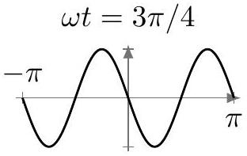

Idea 9: Larmor Formula
An accelerating charge produces electromagnetic radiation, with power

$$
P = \frac { q ^ { 2 } a ^ { 2 } } { 6 \pi \epsilon _ { 0 } c ^ { 3 } } .
$$

We'll derive it properly in R3, but a lot of it can be motivated with the techniques of P1.
The power could only depend on $q , \epsilon _ { 0 } , \mu _ { 0 }$, and properties of the particle's motion. The only combinations of the first three parameters that get rid of the electromagnetic units are $q ^ { 2 } / \epsilon _ { 0 }$ and $1 / \sqrt { \epsilon _ { 0 } \mu _ { 0 } } = c$. Since energy is proportional to the electric and magnetic fields squared, and these fields are proportional to $q$, the answer must be proportional to $q ^ { 2 } / \epsilon _ { 0 }$.

Radiation can't result from uniform velocity, by Lorentz invariance; another way to see this is that with only $v$ and $c$, there is no way to write down an expression for power with the right units! The next simplest option is radiation from acceleration, from which the most general result is $P = \left( q ^ { 2 } a ^ { 2 } / \epsilon _ { 0 } c ^ { 3 } \right) f ( v / c )$. The fact that acceleration is squared is also natural,

because acceleration is a vector, so this is the simplest way to get a rotationally invariant result. The proper derivation shows that $f ( 0 ) = 1 / 6 \pi$. When $v / c$ is substantial, there are relativistic corrections, which we will consider in R3.
[2] Problem 21 (Purcell H.2). A common classical model of an electron in an atom is to imagine it is a mass on a spring, where the spring force is due to the atomic nucleus. Suppose that such an electron, with charge $e$, is vibrating in simple harmonic motion with angular frequency $\omega$ and amplitude $A$.
    (a) Find the average rate of energy loss by radiation.
    (b) If no energy is supplied to make up the loss, how long will it take the oscillator's energy to fall to $1 / e$ of its initial value?

Numerically, this is an extremely small time, so classical models of the atom are not realistic. We will see in X1 that in quantum mechanics this problem is solved because in the ground state the electron does not move around the atom, but rather occupies a standing wave.

Solution. (a) The average value of $a ^ { 2 }$ is $A ^ { 2 } \omega ^ { 4 } / 2$, giving

$$
\langle P \rangle = \frac { e ^ { 2 } A ^ { 2 } \omega ^ { 4 } } { 12 \pi \epsilon _ { 0 } c ^ { 3 } } .
$$

(b) If $m$ is the mass of the electron, then the energy of the system is $E = \frac { 1 } { 2 } m \omega ^ { 2 } A ^ { 2 }$. We see that
$$
\dot { E } = - \frac { e ^ { 2 } \omega ^ { 4 } } { 12 \pi \epsilon _ { 0 } c ^ { 3 } } \frac { 2 } { m \omega ^ { 2 } } E = - \frac { e ^ { 2 } \omega ^ { 2 } } { 6 m \pi \epsilon _ { 0 } c ^ { 3 } } E .
$$
This is an exponential decay, with characteristic time
$$
t = \frac { 6 m \pi \epsilon _ { 0 } c ^ { 3 } } { e ^ { 2 } \omega ^ { 2 } } .
$$
[3] Problem 22 (Purcell H.3). A plane electromagnetic wave with angular frequency $\omega$ and electric field amplitude $E _ { 0 }$ is incident on an atom. As in problem 21, we model the electron as a simple harmonic oscillator, with mass $m$ and natural angular frequency $\omega _ { 0 }$.
    (a) First suppose that $\omega \gg \omega _ { 0 }$. Argue that in this case, the "spring" force on the electron can be neglected. Find the average power radiated by the electron, and show that it is equal to the power incident on a disc of area
$$
\sigma = \frac { 8 \pi } { 3 } \left( \frac { e ^ { 2 } } { 4 \pi \epsilon _ { 0 } m c ^ { 2 } } \right) ^ { 2 } .
$$
This is the Thomson scattering cross section. To an electromagnetic wave, each electron looks like it has this area.
    (b) Now suppose $\omega \ll \omega _ { 0 }$, yielding Rayleigh scattering, which describes the scattering of visible light by air. In this case, show that $\sigma \propto \omega ^ { 4 }$. This sharp frequency dependence explains why the sky is blue.

(c) Explain the meaning of the common phrase "red sky at night, sailor's delight; red sky in morning, sailor's warning". (Hint: in the cultures where this saying is used, weather patterns usually move from west to east.)

For some further discussion of Rayleigh scattering, see section 9.4 of The Art of Insight. For more about colors in the atmosphere, see this nice video.

Solution. (a) As seen in M4, the amplitude of a driven harmonic oscillator is

$$
A = \frac { F _ { 0 } / m } { \sqrt { \left( \omega _ { 0 } ^ { 2 } - \omega ^ { 2 } \right) ^ { 2 } + ( b \omega / m ) ^ { 2 } } } .
$$

Here, $b = 0$ and since $\omega \gg \omega _ { 0 }$, we have $A = e E _ { 0 } / m \omega ^ { 2 }$. Putting this into our answer in part (a) of the previous problem gets

$$
\langle P \rangle = \frac { e ^ { 2 } \omega ^ { 4 } } { 12 \pi \epsilon _ { 0 } c ^ { 3 } } \frac { e ^ { 2 } E _ { 0 } ^ { 2 } } { m ^ { 2 } \omega ^ { 4 } } = \frac { e ^ { 4 } E _ { 0 } ^ { 2 } } { 12 \pi \epsilon _ { 0 } m ^ { 2 } c ^ { 3 } }
$$

Since for electromagnetic radiation, $\langle S \rangle = \frac { 1 } { 2 } \epsilon _ { 0 } c E _ { 0 } ^ { 2 }$ so $\langle P \rangle = \sigma \langle S \rangle$, we can put this in the above expression to get

$$
\sigma = \frac { e ^ { 4 } E _ { 0 } ^ { 2 } } { 12 \pi \epsilon _ { 0 } m ^ { 2 } c ^ { 3 } } \frac { 2 } { \epsilon _ { 0 } c E _ { 0 } ^ { 2 } } = \frac { 8 \pi } { 3 } \left( \frac { e ^ { 2 } } { 4 \pi \epsilon _ { 0 } m c ^ { 2 } } \right) ^ { 2 } .
$$

(b) Now, our expression for $A$ will be $e E _ { 0 } / m \omega _ { 0 } ^ { 2 }$, which modifies the answer to
$$
\sigma = \frac { 8 \pi } { 3 } \left( \frac { e ^ { 2 } } { 4 \pi \epsilon _ { 0 } m c ^ { 2 } } \right) ^ { 2 } \frac { \omega ^ { 4 } } { \omega _ { 0 } ^ { 4 } } .
$$
In other words, higher frequencies are scattered much more. The atmosphere scatters most of the blue light from the Sun, and some of it hits your eyes, making the sky look blue.
You might wondering why the sky doesn't look violet, because the spectrum of the sky actually peaks in the violet range. It has to do with the physiology of human color vision. Your eyes contain three types of "cones", which are most sensitive to blue, green, and red. To detect color, your brain looks at how much each cone is excited. Referring to the graphic here, pure blue light excites the blue cone a lot, and the green and red cones a little. Pure violet light excites the blue cone a moderate amount, doesn't excite the green cone, and excites the red cone a small amount, due to a quirk of physiology. (That's why the color wheel wraps around, so that violet ends up feeling similar to red, even though they're as far apart in wavelength as possible.) When you account for the total excitation of the cones, due to the full spectrum of the sky, the net result is that the blue cone is excited a lot, and the green and red cones are each excited a little, so the result looks blue.
(c) See this nice explanation for details.
[3] Problem 23. USAPhO 2016, problem B2.

Remark
We noted in M7 that clouds are visible because the radiation scattered by a small droplet of $n$ water molecules grows as $n ^ { 2 }$. To understand why, note that each of the molecules performs independent Rayleigh scattering, as computed above. For separated molecules, the energy scattered just adds. However, for nearby molecules the electromagnetic waves scattered interfere constructively, so the amplitude grows as $n$ and hence the energy scattered as $n ^ { 2 }$.

This quadratic enhancement breaks down once the droplets exceed the wavelength $\lambda$ of the light. This means the maximum possible enhancement is larger for larger wavelengths, acting against the $\omega ^ { 4 }$ dependence of Rayleigh scattering. This is why clouds are white, not blue.

Radiation pressure can also have mechanical effects.
Example 5: NBPhO 2018.6
A laser pointer of power $P$ is directed at a glass cube, with refractive index $n > \sqrt { 2 }$. The surface of the cube has an anti-reflective coating, so there is no partial reflection when light enters or exits it; the laser pointer only refracts. What is the maximum force the laser pointer can exert on the cube?

Solution
The force is due to a change in momentum of the light. The greatest possible force is attained if the direction of the light is reversed, which can occur as shown, in the limit $\alpha \rightarrow 90 ^ { \circ }$.
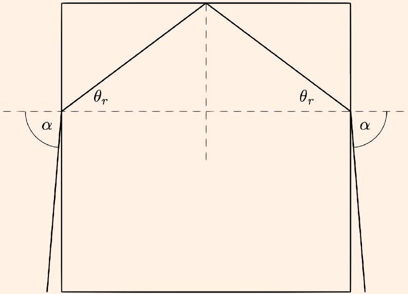
Assuming $n > \sqrt { 2 }$, we then have $\theta _ { r } < 45 ^ { \circ }$, and then the laser internally reflects when it hits the top surface of the cube. It exits in the opposite direction it came in.

If the laser pointer has power $P$, then the momentum of the laser beam per time is $P / c$. The momentum is reversed, so the force is $2 P / c$.
[3] Problem 24 (IZhO 2022). In 2018, the Nobel Prize in physics was awarded to Arthur Ashkin for the creation of the "laser tweezer", a device that allows one to hold and move transparent microscopic objects with the help of light. In one such device, a parallel beam of light from a laser

passes through a converging lens $L$ and hits a microparticle $M$, which can also be considered a converging lens. Point $F$ is the common focus of $L$ and $M$.
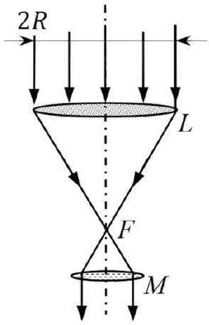
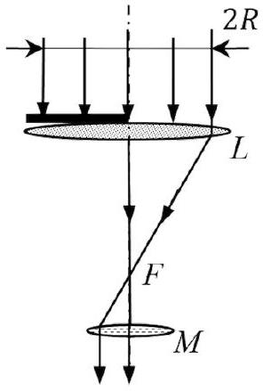
The light intensity in the beam is $I = 1.00 \mu \mathrm {~W} / \mathrm { cm } ^ { 2 }$, the beam radius is $R = 1.00 \mathrm {~cm}$, and the focal length of the lens $L$ is $F = 10.0 \mathrm {~cm}$. Ignore the absorption and reflection of light.

(a) Calculate the force acting on the microparticle, in the setup shown at left above.
(b) Next, the left half of the lens $L$ is covered by a diaphragm, as shown at right above. Calculate the force acting on the microparticle in the transverse direction of the beam.

Solution. See the official solutions of IZhO 2022.

[3] Problem 25 (Feynman). In one proposed means of space propulsion, a spaceship of mass $10 ^ { 3 } \mathrm {~kg}$ carries a thin sheet of area $100 \mathrm {~m} ^ { 2 }$. The sheet is made of highly reflective plastic film, and can be used as a solar radiation pressure "sail". The spaceship travels in a circular orbit of radius $r$, which is initially equal to the Earth's orbit radius, where the intensity of sunlight is $1400 \mathrm {~W} / \mathrm { m } ^ { 2 }$. Assume the spaceship is moving nonrelativistically and the gravitational effect of the Earth is negligible.
    (a) Find the angle at which the sail should be pointed to maximize $d r / d t$.
    (b) Assuming the sail is pointed this way, find the numeric value of $d r / d t$.
    (c) If this continues for a very long time, then $r$ will grow as $r \propto t ^ { n }$. Find the value of $n$.

Solution. (a) Since $E = - G M m / 2 r$, increasing radius as fast as possible is the same as imparting the most energy to the spaceship; in other words, we want to maximize $\mathbf { F } \cdot \mathbf { v }$. The velocity is almost purely tangential, so only the tangential component of the force contributes to the power.
Let the normal vector of the sail be at an angle $\theta$ to the radial direction. To find the net force on the sail, we can think of the reflection process in two steps: absorbing the light and reemitting it. Absorbing the light yields an outward radial force $F$. Reemitting it yields a force $F$ of the same magnitude, directed at an angle $2 \theta$ to the radial direction.

Only the second force can contribute to the power, so

$$
P = \mathbf { F } \cdot \mathbf { v } = F v \sin 2 \theta .
$$

Finally, since the radial area covered by the sail is $A \cos \theta$, we have $F = I ( A \cos \theta ) / c$, so

$$
P = \frac { 2 I A v } { c } \sin \theta \cos ^ { 2 } \theta .
$$

Setting the derivative to zero, the maximum is at $\theta = \sin ^ { - 1 } ( 1 / \sqrt { 3 } ) = 35.3 ^ { \circ }$, giving power
$$
P _ { \max } = \beta \frac { I A v } { c } , \quad \beta = \frac { 4 } { 3 \sqrt { 3 } } \approx 0.77 .
$$
Strictly speaking, the answer is very slightly different, by corrections of order $v / c$, since the spaceship is moving, but we'll neglect this here.
(b) The power is
$$
P = \frac { d E } { d t } = \frac { G M m } { 2 r ^ { 2 } } \frac { d r } { d t } .
$$
We also know from force balance that
$$
\frac { G M m } { r ^ { 2 } } = \frac { m v ^ { 2 } } { r }
$$
since the radial force from the sail is negligible, and combining these results gives
$$
\frac { d r } { d t } = \frac { \beta I A } { c } \frac { 2 r } { m v } = \frac { 2 \beta I A } { m \omega c }
$$
where $\omega = 2 \pi / ( 1$ year $)$ is the angular velocity of the Earth. Plugging in the numbers gives $d r / d t = 3.6 \mathrm {~m} / \mathrm { s }$.
(c) We have
$$
\frac { d r } { d t } \propto \frac { I r } { v } \propto \frac { \left( 1 / r ^ { 2 } \right) r } { 1 / \sqrt { r } } = \frac { 1 } { \sqrt { r } }
$$
Separating and integrating gives $t \propto r ^ { 3 / 2 }$ in the long run (i.e. when the contribution from the initial condition is negligible), so $n = 2 / 3$.

Finally, we'll consider electromagnetic wave propagation in transmission lines.
[4] Problem 26 (Griffiths 7.62, Crawford 4.8). A certain transmission line is constructed from two thin metal ribbons, of width $w$, a very small distance $h \ll w$ apart. The current travels down one strip and back along the other. In each case it spreads out uniformly over the surface of the ribbon.

(a) Find the capacitance per unit length $\mathcal { C }$, and the inductance per unit length $\mathcal { L }$.
(b) Argue that the speed of propagation of electromagnetic waves through this transmission line is of order $1 / \sqrt { \mathcal { L } \mathcal { C } }$, and evaluate this quantity.
(c) Repeat the first two parts for a coaxial transmission line, consisting of two cylinders of radii $a < b$ with the same axis of symmetry.
(d) Repeat the first two parts for a parallel-wire transmission line, consisting of two wires of radius $r$ whose axes are a distance $D \gg r$ apart.

You should find that in all cases, $1 / \sqrt { \mathcal { L } \mathcal { C } }$ is the same, yielding the same speed for electromagnetic waves. This actually holds for transmission lines with conductors of any shape, though the general proof requires some vector calculus.

Solution. Suppose the length is $\ell$.

(a) We have $C = \epsilon _ { 0 } w \ell / h$, so $\mathcal { C } = \epsilon _ { 0 } w / h$. Similarly, $L = \frac { \mu _ { 0 } h } { w } \ell$, so $\mathcal { L } = \mu _ { 0 } h / w$.
(b) The timescale to propagate a unit length is $1 / \sqrt { \mathcal { L } \mathcal { C } }$, which means the typical speed is $1 / \sqrt { \mathcal { L } \mathcal { C } }$. This also follows from dimensional analysis.
(c) The capacitance of two coaxial cylinders can be found by giving the inner cylinder a charge $Q$ and using $C = Q / V$, where
$$
V = \int E d s = \int _ { a } ^ { b } \frac { ( Q / \ell ) } { 2 \pi \epsilon _ { 0 } r } d r = \frac { Q / \ell } { 2 \pi \epsilon _ { 0 } } \log ( b / a )
$$
and therefore
$$
\mathcal { C } = \frac { 2 \pi \epsilon _ { 0 } } { \log ( b / a ) } .
$$
To find the inductance for a transmission line setup, the current will flow parallel to the axis, so by Ampere's law the field inside the region is $B = \mu _ { 0 } I / 2 \pi r$, and using $L = \Phi / I$ where $\Phi$ will be the flux going around the inner cylinder will give
$$
\Phi = \int _ { a } ^ { b } \ell \frac { \mu _ { 0 } I } { 2 \pi r } d r = \frac { \mu _ { 0 } I \ell } { 2 \pi } \log \left( \frac { b } { a } \right)
$$
and therefore
$$
\mathcal { L } = \frac { \mu _ { 0 } } { 2 \pi } \log \left( \frac { b } { a } \right) .
$$
Thus we get $1 / \sqrt { \mathcal { L } \mathcal { C } } = c$.
(d) The capacitance can be found similarly (factors of 2 appear because the negative charge/opposing current will contribute to the E and B fields too),
$$
\begin{gathered}
V = \int _ { r } ^ { D } \frac { 2 Q / \ell } { 2 \pi \epsilon _ { 0 } r } d r , \quad \mathcal { C } = \frac { \pi \epsilon _ { 0 } } { \log ( D / r ) } \\
\Phi _ { B } = \int _ { r } ^ { D } \frac { 2 \mu _ { 0 } I } { 2 \pi r } d r , \quad \mathcal { L } = \frac { \mu _ { 0 } } { \pi } \log \left( \frac { D } { r } \right)
\end{gathered}
$$
This gives $1 / \sqrt { \mathcal { L } \mathcal { C } } = c$.
[4] Problem 27. In this problem, we treat electromagnetic wave propagation through a transmission line using a "lumped element" approach, where the line is replaced with discrete capacitors and inductors, as shown. (This is an example of a network synthesis, mentioned in E6.)
(a) Calculate the characteristic impedance $Z _ { 0 } ( \omega )$ of the entire network, as shown below.
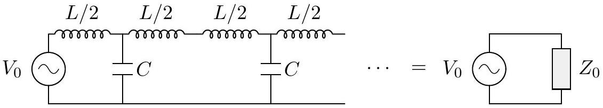

(b) The diagram below shows two adjacent sections of the ladder.
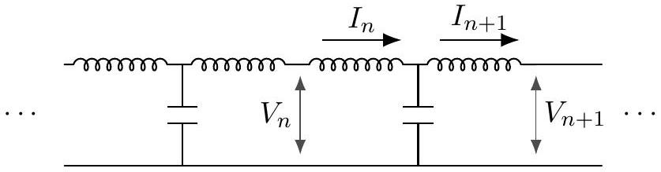
Find the ratio of the complex voltage amplitudes $V _ { n + 1 } / V _ { n }$.
(c) The AC driving attempts to create electromagnetic waves which travel through the network, to the right. It turns out that above a certain critical angular frequency $\omega _ { c }$, waves will not travel through the ladder network. Find $\omega _ { c }$. (Hint: this can be done using either the result of part (a) or part (b).)
(d) For angular frequencies $\omega \ll \omega _ { c }$, waves travel through the ladder with a constant speed. Find this speed, assuming each segment of the ladder has physical length $\ell$. (Hint: the speed of a wave obeys $v = d \omega / d k$.)
(e) You should have found in one of the earlier parts that the impedance of this infinite network can be a real number, even though it's made of parts which all have imaginary impedance. That sounds strange, but what's even stranger is that we should be able to handle this infinite circuit by taking the limit of progressively larger finite circuits, just as we did for a similar network of resistors in E2. But for any finite LC network, the impedance will be imaginary, so the limit must be imaginary too! On one hand, we should trust the finite result because all real circuits are finite. On the other hand, the real impedance we get for the infinite result certainly can be measured in real life. So what's going on?

Solution. (a) The impedance of the infinite ladder doesn't change if we add another unit onto the left. Let the inductor have impedance $Z _ { 1 } / 2$ and let the capacitor have impedance $Z _ { 2 }$. Then

$$
\frac { Z _ { 1 } } { 2 } + \frac { 1 } { \frac { 1 } { Z _ { 2 } } + \frac { 1 } { Z _ { 1 } / 2 + Z _ { 0 } } } = Z _ { 0 }
$$

which can be solved to give

$$
Z _ { 0 } = \sqrt { \left( Z _ { 1 } / 2 \right) ^ { 2 } + Z _ { 1 } Z _ { 2 } } .
$$

Since we have $Z _ { 1 } = i \omega L$ and $Z _ { 2 } = 1 / i \omega C$, we have

$$
Z _ { 0 } = \sqrt { \frac { L } { C } - \frac { \omega ^ { 2 } L ^ { 2 } } { 4 } } .
$$

(b) Each segment sees an impedance $Z _ { 0 }$ to its right, so
$$
V _ { n } = I _ { n } Z _ { 0 } , \quad V _ { n + 1 } = I _ { n + 1 } Z _ { 0 } .
$$
On the other hand, we also have
$$
V _ { n } - V _ { n + 1 } = \frac { I _ { n } Z _ { 1 } } { 2 } + \frac { I _ { n + 1 } Z _ { 1 } } { 2 }
$$
and solving these equations yields
$$
\frac { V _ { n + 1 } } { V _ { n } } = \frac { Z _ { 0 } - Z _ { 1 } / 2 } { Z _ { 0 } + Z _ { 1 } / 2 } = \frac { \sqrt { L / C - \omega ^ { 2 } L ^ { 2 } / 4 } - i \omega L / 2 } { \sqrt { L / C - \omega ^ { 2 } L ^ { 2 } / 4 } + i \omega L / 2 } = \frac { \sqrt { 4 / \omega ^ { 2 } L C - 1 } - i } { \sqrt { 4 / \omega ^ { 2 } L C - 1 } + i } .
$$

(c) First we'll find the critical angular frequency using part (b). When the square root is a real number, the numerator and denominator have equal magnitudes, so $\left| V _ { n + 1 } \right| = \left| V _ { n } \right|$, indicating wave propagation. When the square root is imaginary, the wave instead exponentially decays. The cutoff is when
$$
4 / \omega ^ { 2 } L C - 1 = 0
$$
which gives
$$
\omega _ { c } = \frac { 2 } { \sqrt { L C } } .
$$
To derive the same conclusion using the result of part (a), note that the impedance $Z _ { 0 }$ becomes real when $\omega < 2 / \sqrt { L C }$. How could one get a real impedance, which signals energy loss, if there are no resistors anywhere in the circuit? It can only happen if the driver can create electromagnetic waves, which then propagate through the network; since the network is infinite, this energy never returns to the driver. Because waves can appear for $\omega < 2 / \sqrt { L C }$, we again conclude that $\omega _ { c } = 2 / \sqrt { L C }$.
(d) In this limit, we have
$$
\frac { V _ { n + 1 } } { V _ { n } } \approx \frac { 2 / \omega \sqrt { L C } - i } { 2 / \omega \sqrt { L C } + i }
$$
and so across each unit, there is a phase shift of
$$
\delta = \omega \sqrt { L C } .
$$
Since wavenumber is phase shift per distance, $k = \delta / \ell = \omega \sqrt { L C } / \ell$, which means
$$
v = \frac { d \omega } { d k } = \frac { \ell } { \sqrt { L C } } .
$$
That is, waves in a transmission line travel with a constant speed, as we already found in problem 26. If we further plug in the $L$ and $C$ found in that problem, we would recover the speed of light.
(e) For an ideal, finite LC network, the finite result is perfectly correct: the impedance is pure imaginary. The network can't absorb net energy, because in the steady state energy propagates through the network, bounces off the other end, and comes back to the voltage source. However, when we're using transmission lines in practice, we put a load on the other end (i.e. a resistance) that absorbs the incoming wave. This introduces a real impedance to the finite circuit, and the limiting procedure works just fine, recovering a real impedance in the infinite limit.
But mathematically, in the infinite network analysis, we never needed to use the fact that a real impedance was at the end, because there was no end. You get the infinite network either by taking the limit of finite LC circuits, or by taking the limit of finite LC circuits terminated by a resistor, so how do we mathematically choose which limit gives the right answer?
The resolution is that the former limit does not even exist: as the size of the LC network is increased, the impedance keeps bouncing around, never settling down to a limit. Physically, this is because the total length of the network is changing, which changes the phase shift of the wave once it gets back to the voltage source. It's analogous to trying to compute $\lim _ { a \rightarrow \infty } \int _ { 0 } ^ { a } e ^ { i x } d x$.

To make the limit well-defined, we must introduce resistances. For example, we could add a small resistance $\Delta r$ to every inductor, which is also perfectly realistic. Now the waves gradually decay away, and in the infinite limit we get some impedance $Z ( \Delta r , \omega )$. Finally, taking the limit $\Delta r \rightarrow 0$ recovers the infinite result we derived earlier. It's precisely the same result as taking the infinite limit of LC networks terminated by resistors. We could also get the same result by giving the capacitors the small resistance.

The general lesson is that in physics, the real world supplies "regulators" that make the seemingly undefined limits well-defined. The miracle is that quite often, after we compute the answer, we can remove the regulator to get a result that doesn't depend on the regulator at all! This is surprising to the mathematician, but natural to the physicist: it means the observable behavior of real objects, which always come with many imperfections, doesn't depend on the fine details of how we choose to model them.
