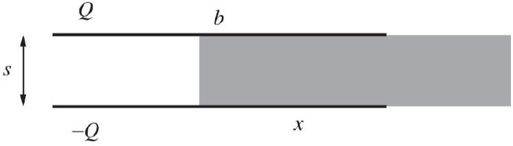

[3] Problem 3. A version of the method of images, introduced in E2, works for dielectrics. Let's suppose there is vacuum at $z > 0$, a dielectric $\kappa$ at $z < 0$, and a point charge $q$ a distance $d$ above the plane $z = 0$. We need to find the surface bound charge density $\sigma _ { b }$ that appears on the plane.
    (a) Let $E _ { 0 } ^ { z }$ be the $z$-component of the electric field due to the point charge alone. At a given point just below the plane $z = 0$, find $E ^ { z }$ in terms of $E _ { 0 } ^ { z }$ and $\sigma _ { b }$.
    (b) Use this result to solve for $\sigma _ { b }$ in terms of $E _ { 0 } ^ { z }$ and $\kappa$.
    (c) Your answer will be exactly the same as what one gets for a conductor at $z < 0$, multiplied by a $\kappa$-dependent constant. Using this information, characterize the image charge and find the force on the real charge.

Solution. (a) By an elementary application of Gauss's law, the result is

$$
E ^ { z } = E _ { 0 } ^ { z } - \frac { \sigma _ { b } } { 2 \epsilon _ { 0 } } .
$$

(b) By the definition of $\chi _ { e }$, we know that just under the plane,
$$
\sigma _ { b } = P ^ { z } = \epsilon _ { 0 } \chi _ { e } E ^ { z } .
$$
Combining this with the result of part (a) and solving for $\sigma _ { b }$ gives
$$
\sigma _ { b } = \frac { \chi _ { e } } { \chi _ { e } + 2 } \left( 2 \epsilon _ { 0 } E _ { 0 } ^ { z } \right) = \frac { \kappa - 1 } { \kappa + 1 } \left( 2 \epsilon _ { 0 } E _ { 0 } ^ { z } \right) .
$$
(c) A conductor corresponds to the limit $\kappa \rightarrow \infty$, where we simply have $\sigma _ { b } = 2 \epsilon _ { 0 } E _ { 0 } ^ { z }$, and the electric field inside the conductor vanishes. Evidently, for a general dielectric this result is multiplied by $( \kappa - 1 ) / ( \kappa + 1 )$. We therefore conclude that the image charge is $- q ( \kappa - 1 ) / ( \kappa + 1 )$, a distance $d$ below the plane. The force on the real charge is given by Coulomb's law,
$$
F = \frac { q ^ { 2 } } { 16 \pi \epsilon _ { 0 } d ^ { 2 } } \frac { \kappa - 1 } { \kappa + 1 }
$$
and is directed towards the dielectric.
[3] Problem 4 (Purcell 10.2). A rectangular capacitor with side lengths $a$ and $b$ has separation $s \ll a , b$. It is partially filled with a dielectric with dielectric constant $\kappa$. The overlap distance is $x$.

The capacitor is isolated and has constant charge $Q$.
(a) What is the energy stored in the system?
(b) Using the result of part (a), what is the force on the dielectric? Which direction does it point?
(c) Is your answer to part (b) affected by the presence of fringe fields near the interface?

Solution. (a) The system consists of two capacitors in parallel, with capacitances $C _ { 1 } = \epsilon _ { 0 } ( b -$ $x ) a / s$ and $C _ { 2 } = \kappa \epsilon _ { 0 } x a / s$. Thus,

$$
C = \epsilon _ { 0 } ( a / s ) ( ( \kappa - 1 ) x + b )
$$

which gives

$$
U = \frac { Q ^ { 2 } } { 2 C } = \frac { Q ^ { 2 } s } { 2 \epsilon _ { 0 } a ( b + ( \kappa - 1 ) x ) } .
$$

(b) Note that
$$
F = - \frac { d U } { d x } = \frac { Q ^ { 2 } s ( \kappa - 1 ) } { 2 \epsilon _ { 0 } a ( b + ( \kappa - 1 ) x ) ^ { 2 } } .
$$
The sign is positive, so it points in direction of increasing $x$, so the slab is pulled in.
(c) Fringe fields don't change the result of part (b). The presence of fringe fields does change the energy found in part (a), but this has essentially no effect on the derivative of the energy, because shifting the dielectric just shifts the fringe field over essentially unchanged.

Of course, from a force perspective, all of the force is due to the fringe fields, because those are the only fields with a horizontal component; this paper gives such a calculation. The fact that you can get the same answer, by using an energy-based derivation that doesn't depend on the fringe fields, or by a force-based derivation that relies entirely on the fringe fields, is just another example of conservation of energy giving us nontrivial information.
[3] Problem 5 (Griffiths 4.28). Two long coaxial cylindrical metal tubes of inner radius $a$ and outer radius $b$ stand vertically in a tank of dielectric oil, with susceptibility $\chi _ { e }$ and mass density $\rho$. The inner one is maintained at potential $V$, and the outer one is grounded. To what height $h$ does the oil rise in the space between the tubes?
Solution. The field in the region with no oil is $E = \frac { \lambda } { 2 \pi \epsilon _ { 0 } r }$, and with the oil is $E ^ { \prime } = \frac { \lambda ^ { \prime } } { 2 \pi \epsilon r }$ where $\lambda ^ { \prime }$ is the free charge density. Thus,

$$
V = \frac { \lambda } { 2 \pi \epsilon _ { 0 } } \log ( b / a ) ,
$$

and equating with the oil part, we get that $\lambda ^ { \prime } = \kappa \lambda$, as expected. Now, the total charge on this effective capacitor is

$$
Q = \lambda ^ { \prime } h + \lambda ( \ell - h ) = \lambda \left( \chi _ { e } h + \ell \right) ,
$$

so

$$
C = \frac { Q } { V } = 2 \pi \epsilon _ { 0 } \frac { \chi _ { e } h + \ell } { \log ( b / a ) } .
$$

We know the net force is $\frac { 1 } { 2 } V ^ { 2 } ( d C / d h )$ (note that there is not a minus sign here because of the work done by the battery, as explained in a problem in E2). The gravitational force is $\rho \pi g h \left( b ^ { 2 } - a ^ { 2 } \right)$, so equating and solving for $h$ gives

$$
h = \frac { \epsilon _ { 0 } \chi _ { e } V ^ { 2 } } { \rho \left( b ^ { 2 } - a ^ { 2 } \right) g \log ( b / a ) } .
$$

## 2 Magnetization

Idea 4
As discussed in E5, materials contain two kinds of magnetic dipole moments: the "orbital" part, due to moving electrons, and the "spin" part, due to the electrons' intrinsic magnetic moments. For most materials, in the absence of external magnetic fields, these dipole moments point in random directions, and thus sum to zero on average.

When such a material is placed in a magnetic field, two things happen at once:

- The spins partially align with the field, producing a net dipole moment along B.
- The orbits are affected by the changing field in accordance with Lenz's law, and thus produce a net dipole moment against B.

The first effect tends to be somewhat stronger, and tends to make the material paramagnetic, but it's only present in materials with unpaired electron spins. The second effect is always present, and tends to make the material diamagnetic.

This can be a bit tricky to remember, because it seems opposite to the definition of a dielectric, where the internal electric dipoles try to align with the external field. The reason it makes

sense is that inside an electric dipole, the electric field points against the dipole moment, while inside a magnetic dipole, the magnetic field points with the dipole moment, as discussed in E3. So, both dielectrics and diamagnets try to reduce the applied field within them.

Idea 5: Bound Currents
The magnetization M of a material is its magnetic dipole moment per unit volume. It corresponds to a bound current density

$$
\mathbf { J } _ { b } = \nabla \times \mathbf { M }
$$

as well as a surface bound current density

$$
\mathbf { K } _ { b } = \mathbf { M } \times \hat { \mathbf { n } }
$$

on its surface.

Example 4
Find the magnetic field of a sphere with uniform magnetization $\mathbf { M }$ and radius $R$.

Solution
In this case $\mathbf { J } _ { b }$ is zero in the sphere, while at the sphere's surface,

$$
\mathbf { K } _ { b } = \mathbf { M } \times \hat { \mathbf { r } } = M \sin \theta \hat { \boldsymbol { \phi } }
$$

where we worked in spherical coordinates and aligned M with the $z$-axis. However, this is precisely the current density of a rotating, uniformly charged sphere, as we discussed in E3. Scaling the constants appropriately, we find that inside,

$$
\mathbf { B } = \frac { 2 } { 3 } \mu _ { 0 } \mathbf { M }
$$

which should be compared with example 1. Outside, the field is exactly a magnetic dipole field, with $\mathbf { m } = \left( 4 \pi R ^ { 3 } / 3 \right) \mathbf { M }$.
