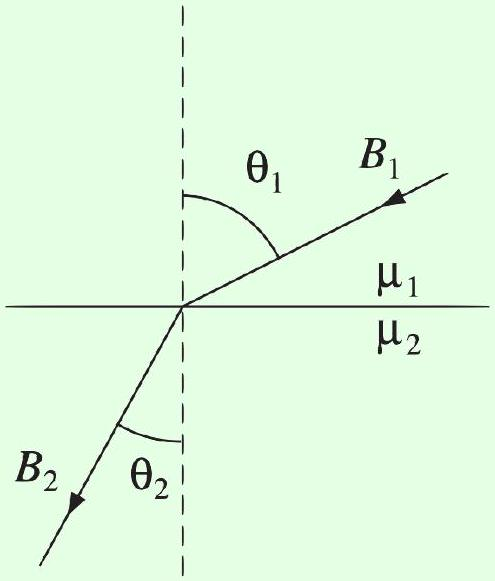
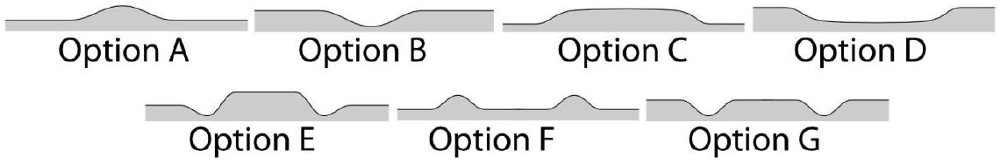
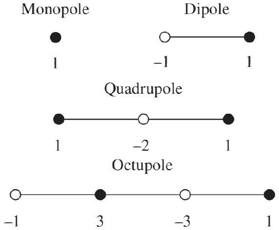
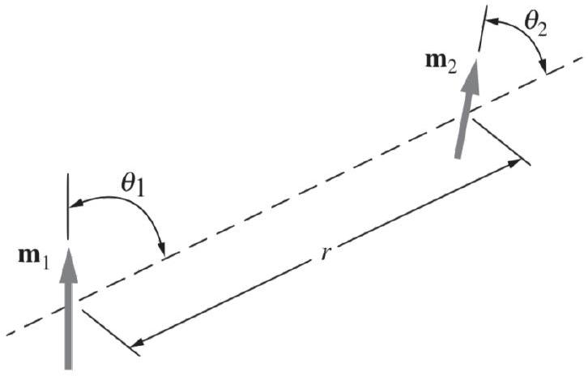

[3] Problem 10. A version of the method of images works for magnetic materials. Let's suppose there is vacuum at $z > 0$, and a material of relative permeability $\mu _ { r }$ at $z < 0$. When using the method of images, we only care about the field at $z > 0$, where $\mathbf { B }$ and $\mathbf { H }$ are proportional. So we can directly use the analogy between $\mathbf { H }$ and $\mathbf { E }$.
    (a) Suppose a magnetic charge $q _ { m }$ is a distance $d$ above the plane. By recycling your answer to problem 3, find the magnetic charge $q _ { m } ^ { \prime }$ of the image. What does it become if the material is a superconductor, or a soft ferromagnet?
    (b) Of course, magnetic charges don't actually exist, so let's instead suppose a permanent magnetic dipole moment m was a distance $d$ above the plane, with m pointing towards the plane. Characterize the image dipole, and find the force on the real dipole.
    (c) To be even more concrete, consider a very long permanent magnet of cross-sectional area $A$ and uniform magnetization $M$ along its length. When one end of the magnet is placed flat against an iron plate, what is the force between them?

Solution. (a) When we apply the analogy described in idea 7, this problem becomes exactly the same as that problem, with $\chi _ { m }$ corresponding to $\chi _ { e }$, and thus $\mu _ { r }$ corresponding to $\kappa$. We conclude that the image magnetic charge is

$$
q _ { m } ^ { \prime } = - q _ { m } \frac { \mu _ { r } - 1 } { \mu _ { r } + 1 }
$$

a distance $d$ below the plane. Note that unlike the electric case, $q _ { m } ^ { \prime }$ can have the same sign as $q _ { m }$ (for $\mu _ { r } < 1$ ), or the opposite sign (for $\mu _ { r } > 1$ ).
For a superconductor, $\mu _ { r } = 0$, we have $q _ { m } ^ { \prime } = q _ { m }$, which you might have already seen in a problem in E5. For a soft ferromagnet, $\mu _ { r } \rightarrow \infty$, we have $q _ { m } ^ { \prime } = - q _ { m }$. Both of these results are compatible with what we'd expect from example 7.

(b) In this case, there's an image dipole of magnitude
$$
m ^ { \prime } = m \frac { \left| \mu _ { r } - 1 \right| } { \mu _ { r } + 1 } .
$$
For $\mu _ { r } < 1$, it points in the opposite direction as the real dipole, while for $\mu _ { r } > 1$, it points in the same direction.
Using the formula for the force on a dipole from E4, in the presence of the dipole field of the image, we find a force towards the plane of magnitude
$$
F = \frac { 3 \mu _ { 0 } } { 2 \pi } \frac { m m ^ { \prime } } { ( 2 d ) ^ { 4 } } = \frac { 3 \mu _ { 0 } } { 32 \pi } \frac { m ^ { 2 } } { d ^ { 4 } } \frac { \mu _ { r } - 1 } { \mu _ { r } + 1 } .
$$
For $\mu _ { r } < 1$, the force is instead repulsive.
(c) Here it's easiest to use the idea of magnetic charge. We can ignore the distant end of the magnet, because it's very far away. The end of the magnet touching the fridge has a magnetic charge density $\sigma _ { m } = M$. For iron, which has $\mu _ { r } \rightarrow \infty$, the resulting image has magnetic charge density $\sigma _ { m } ^ { \prime } = - M$, so it produces a magnetic field of magnitude $B ^ { \prime } = \mu _ { 0 } \sigma _ { m } ^ { \prime } / 2$ on each side of it. Thus, the interaction force is
$$
F = B ^ { \prime } \sigma _ { m } A = \frac { \mu _ { 0 } M ^ { 2 } A } { 2 }
$$

[2] Problem 11. AuPhO 2019, problem 13. A neat explanation of how a fridge magnet works. You'll also need the accompanying answer sheets.
[5] Problem 12. Physics Cup 2024, problem 3. This relatively straightforward problem reviews almost everything we've covered so far.
Solution. See the official solutions here.

Example 7: Griffiths 6.27
How does a magnetic field line bend when it passes from one medium to another?

Solution
We say the field lines "bend" because of Gauss's law for magnetism: they can't start or end, so each one has to keep on going. Let's suppose the figure above is drawn in the $x z$ plane. Applying Gauss's law for magnetism in a small pillbox spanning the interface gives

$$
B _ { 1 } ^ { z } = B _ { 2 } ^ { z } .
$$

On the other hand, since $\nabla \times \mathbf { H }$ is zero (assuming no additional, "free" current is around), considering an Amperian loop spanning the interface gives

$$
H _ { 1 } ^ { x } = H _ { 2 } ^ { x } .
$$

Combining these results gives

$$
\frac { \tan \theta _ { 2 } } { \tan \theta _ { 1 } } = \frac { \mu _ { 2 } } { \mu _ { 1 } } .
$$

In other words, when a field line enters a medium with higher $\mu$, it bends away from the normal, and when it enters a medium with lower $\mu$, it bends towards the normal.

This statement has two limiting cases which will be important later.

- A magnetic field line can't enter a superconductor $\left( \mu _ { 2 } = 0 \right)$ at all, so field lines approaching a superconductor bend away, to become tangent to them ( $\theta _ { 1 } \rightarrow 90 ^ { \circ }$ ).

- A magnetic field line entering a soft ferromagnet $\left( \mu _ { 2 } \rightarrow \infty \right)$ bends towards it to enter along the normal direction $\left( \theta _ { 1 } \rightarrow 0 ^ { \circ } \right)$, similar to how electric field lines approach conductors. It's also possible for $\theta _ { 1 }$ to be nonzero if $\theta _ { 2 } \rightarrow 90 ^ { \circ }$, but we won't see any examples of this.
You can see both of these behaviors in the limiting cases of problem 10. In general, we conclude that magnetic field lines are "attracted" to regions of higher $\mu$, which makes sense because it helps minimize the energy. Soft ferromagnets tend to keep magnetic field lines within themselves, which is why they're used in transformers.
[2] Problem 13 (IPhO 2012 Experiment). Water is a diamagnetic substance. A powerful cylindrical magnet with field $B$ is placed below the water surface.
    (a) Which of the following shows the resulting shape of the water surface?

The magnet is roughly 2/3 as wide as each of these sketches.
    (b) Let $\rho$ be the density of the water. If the maximum change in height of the water surface has magnitude $h$, find an approximate expression for the magnetic susceptibility $\chi _ { m }$ of water.

For a very closely related, but more extreme problem, see EuPhO 2018, problem 2.
Solution. (a) For a diamagnetic substance, $\mu < \mu _ { 0 }$, so the magnetic field energy is higher when water is present. The water surface is an equipotential, so a higher magnetic field energy at some points must be compensated by a lower gravitational potential energy. Thus, the answer is option D.

(b) Equating the change in gravitational potential energy with the change in field energy, both per volume, gives
$$
\rho g h = \frac { B ^ { 2 } } { 2 \mu } - \frac { B ^ { 2 } } { 2 \mu _ { 0 } } = \frac { B ^ { 2 } } { 2 \mu \mu _ { 0 } } \left( \mu _ { 0 } - \mu \right) \approx \frac { B ^ { 2 } } { 2 \mu _ { 0 } ^ { 2 } } \left( \mu _ { 0 } - \mu \right)
$$
where the last step follows because $\mu \approx \mu _ { 0 }$. We thus have
$$
\chi _ { m } = \frac { \mu - \mu _ { 0 } } { \mu _ { 0 } } = - \frac { 2 \mu _ { 0 } \rho g h } { B ^ { 2 } } .
$$
With a strong magnet, and a measurement of $h$ accurate to about 0.1 mm, one can indeed detect this effect. Note that if you treated the dipole moment as permanent, and used a potential energy density $- \mathbf { M } \cdot \mathbf { B }$, your answer here would be off by a factor of 2 .
[3] Problem 14. NBPhO 2004, problem 6. A cute exercise with permanent magnets.
[5] Problem 15. IPhO 2022, problem 1. A series of exercises on spherical magnets, which uses almost everything covered in this section.

[4] Problem 16. Physics Cup 2012, problem 2. If you only know what's taught in American introductory courses, this problem is basically impossible. If you only know what's stated explicitly in Griffiths, it's very hard. But if you've internalized the intuition of the above examples, and the relevant section of E5 on superconductors, it should be relatively approachable.
Solution. See the solutions here.
[5] Problem 17. Physics Cup 2018, problem 3. A substantially tougher problem which requires solving some differential equations. I recommend starting from the fifth hint.

## 3 Multipoles

In this section, we explore some of the physics of dipoles and higher multipoles.
[3] Problem 18 (Purcell 10.27). Two monopoles of opposite sign form a dipole, two dipoles of opposite sign for a quadrupole, and so on. Hence we can construct arbitrarily high multipoles using the rows of Pascal's triangle.

The field of a dipole falls as $1 / r ^ { 3 }$, a quadrupole as $1 / r ^ { 4 }$, and an octupole as $1 / r ^ { 5 }$.

(a) To warm up, verify explicitly that the quadrupole field along the axis of the quadrupole starts at $1 / r ^ { 4 }$, i.e. that all lower terms cancel.
(b) [A] Prove that this cancellation occurs for general multipoles along their axis.
(c) [A] The magnitude and orientation of a dipole is specified by a vector, with three components. How many numbers are necessary to specify the magnitude and orientation of a quadrupole? (The linear quadrupoles here are just a special case of a general quadrupole.) Try to generalize to arbitrary multipoles.

Section 3.4 of Griffiths explains how to decompose an arbitrary charge distribution into multipoles.
Solution. For simplicity, we set the Coulomb constant $k$, the unit of charge, and the charge spacing all to 1.

(a) This can be done by brute force; for the general case, see the next part.
(b) A simple way to do this is to reason inductively. For example, an octupole field is nothing more than two quadrupoles whose leading terms cancel, so the leading field of an octupole has to be at least one power lower in $r$.

However, we will give an explicit proof. A $2 ^ { N }$-pole can be constructed from $N + 1$ charges, with charge $j$ placed at $x = - j$ with charge $( - 1 ) ^ { j } \binom { N } { j }$. Then the field at point $x$ is

$$
E ( x ) = \sum _ { j = 0 } ^ { N } ( - 1 ) ^ { j } \binom { N } { j } \frac { 1 } { ( x + j ) ^ { 2 } } = x ^ { - 2 } \sum _ { j = 0 } ^ { N } ( - 1 ) ^ { j } \binom { N } { j } \sum _ { k = 0 } ^ { \infty } \binom { - 2 } { k } ( j / x ) ^ { k } .
$$

We see that this can be split into sums of the form $f ( k ) = \sum _ { j = 0 } ^ { N } ( - 1 ) ^ { j } \binom { N } { j } j ^ { k }$, and the coefficient of $x ^ { - 2 - k }$ is some nonzero multiple times $f ( k )$. So it suffices to show that $f ( k ) = 0$ for all $k < N$, and $f ( N ) \neq 0$. This is an exercise in algebraic sums. The key idea is to define

$$
g ( k ) = \sum _ { j = 0 } ^ { N } ( - 1 ) ^ { j } \binom { N } { j } \binom { j } { k } = \sum _ { j = k } ^ { N } ( - 1 ) ^ { j } \binom { N } { j } \binom { j } { k } .
$$

We see that $j ^ { k }$ can be written as a linear combination of $\binom { j } { 0 } , \ldots , \binom { j } { k }$, so it suffices to show that $g ( k ) = 0$ for all $k < N$, and that $g ( N ) \neq 0$. We see that

$$
\begin{aligned}
g ( k ) & = \sum _ { j = k } ^ { N } ( - 1 ) ^ { j } \binom { N } { j } \binom { j } { k } \\
& = \sum _ { j = k } ^ { N } ( - 1 ) ^ { j } \binom { N } { k } \binom { N - k } { j - k } \\
& = \binom { N } { k } \sum _ { j = k } ^ { N } ( - 1 ) ^ { j } \binom { N - k } { j - k } \\
& = \binom { N } { k } ( - 1 ) ^ { k } \cdot \mathbf { 1 } _ { k = N }
\end{aligned}
$$

where we used the fact that $\sum _ { \ell = 0 } ^ { M } ( - 1 ) ^ { \ell } \binom { M } { \ell } = \mathbf { 1 } _ { M = 0 }$ (here $\mathbf { 1 } _ { S }$ is 1 if and only if $S$ is true, and is 0 otherwise), which follows from the binomial theorem. This completes the proof.

(c) Let's think of a general quadrupole as a superposition of two dipoles in opposite directions. Then there are three things that determine a quadrupole: the strength of the quadrupole moment (i.e. the prefactor of the $1 / r ^ { 4 }$ field), the orientation of the first dipole, and the direction the second dipole is displaced from it. This is $1 + 2 + 2 = 5$ total parameters.
Similarly, to specify an octupole, we do the same above, then specify the direction the second quadrupole is displaced, giving $5 + 2 = 7$ parameters. In general, a $2 ^ { N }$-pole has $2 N + 1$ parameters.
[3] Problem 19 (Purcell 11.23). Consider two magnetic dipoles with coplanar dipole moments.

Show that the associated potential energy is

$$
U = \frac { \mu _ { 0 } m _ { 1 } m _ { 2 } } { 4 \pi r ^ { 3 } } \left( \sin \theta _ { 1 } \sin \theta _ { 2 } - 2 \cos \theta _ { 1 } \cos \theta _ { 2 } \right) .
$$

For what orientations is this potential energy maximized or minimized?
Solution. The magnetic field from a dipole pointing in the z direction is:

$$
\mathbf { B } = \frac { \mu _ { 0 } m } { 4 \pi r ^ { 3 } } ( 2 \cos \theta \hat { \mathbf { r } } + \sin \theta \hat { \boldsymbol { \theta } } ) .
$$

Let $\hat { \mathbf { n } }$ be the unit vector perpendicular to $\hat { \mathbf { r } } ( \theta = - \pi / 2 )$. Then the field of $\mathbf { m } _ { 1 }$ is

$$
\mathbf { B } _ { 12 } = \frac { \mu _ { 0 } m _ { 1 } } { 4 \pi r ^ { 3 } } \left( 2 \cos \theta _ { 1 } \hat { \mathbf { r } } + \sin \theta _ { 1 } \hat { \mathbf { n } } \right)
$$

The potential of a dipole in a field is $U = - \mathbf { m } \cdot \mathbf { B }$. Note that $\mathbf { m } _ { 2 } = m _ { 2 } \cos \theta _ { 2 } \hat { \mathbf { r } } - m _ { 2 } \sin \theta _ { 2 } \hat { \mathbf { n } }$.

$$
U = - \mathbf { m } _ { 2 } \cdot \mathbf { B } _ { 12 } = \frac { \mu _ { 0 } m _ { 1 } m _ { 2 } } { 4 \pi r ^ { 3 } } \left( \sin \theta _ { 1 } \sin \theta _ { 2 } - 2 \cos \theta _ { 1 } \cos \theta _ { 2 } \right)
$$

as desired. To extremize this expression, we set the partial derivatives with respect to $\theta _ { 1 }$ and $\theta _ { 2 }$ equal to zero. The results are

$$
\cos \theta _ { 1 } \sin \theta _ { 2 } = - 2 \sin \theta _ { 1 } \cos \theta _ { 2 } , \quad \sin \theta _ { 1 } \cos \theta _ { 2 } = - 2 \cos \theta _ { 1 } \sin \theta _ { 2 }
$$

which implies that

$$
\cos \theta _ { 1 } \sin \theta _ { 2 } = \sin \theta _ { 1 } \cos \theta _ { 2 } = 0 .
$$

This can only hold if

$$
\cos \theta _ { 1 } = \cos \theta _ { 2 } = 0 \text { or } \sin \theta _ { 1 } = \sin \theta _ { 2 } = 0 .
$$

The first option implies both the angles are $\pm \pi / 2$, which yields a saddle point of the energy. The second option yields the global energy minimum when $\left( \theta _ { 1 } , \theta _ { 2 } \right) = ( 0,0 )$ or $( \pi , \pi )$, corresponding to aligned dipoles, and the global energy maximum when $\left( \theta _ { 1 } , \theta _ { 2 } \right) = ( 0 , \pi )$ or $( \pi , 0 )$, corresponding to anti-aligned dipoles.

[2] Problem 20 (Purcell 11.36). Three magnetic compasses are placed at the corners of a horizontal equilateral triangle. As in any ordinary compass, each compass needle is a magnetic dipole constrained to rotate in a horizontal plane. The Earth's magnetic field has been shielded. What orientation will the compass needles eventually assume? Does your result also hold for regular $N$-gons?

Solution. We claim they point in the direction of the tangents to the circumcircle of the triangle. In this case, the field at any one corner due to the compasses at the other corners points in the tangential direction, so the compasses are all aligned with the local fields.

We can show this claim by symmetry. Consider the field at a given corner of the triangle. Flipping about the axis that passes through this corner and the midpoint of the opposite side negates the dipole moments at the other two corners, so it must negate the field. But physically, the reflection operation negates the tangential component of the field. So there must only be a tangential component, i.e. the field at this corner is purely tangential. This argument holds unchanged for regular $N$-gons.
