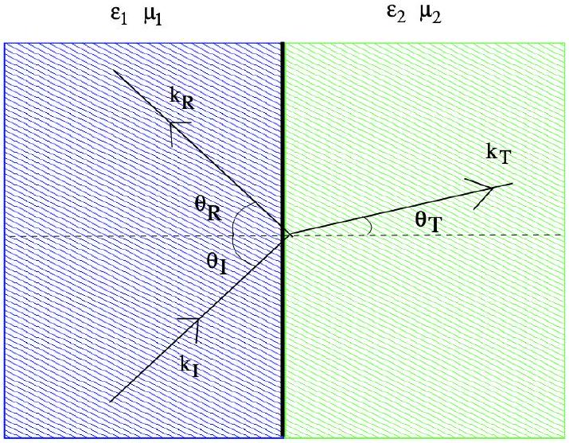

[5] Problem 22. Suppose the regions $x < 0$ and $x > 0$ are filled with material with permittivities $\epsilon _ { 1 }$ and $\epsilon _ { 2 }$, both with permeability $\mu _ { 0 }$. (As mentioned above, this is typical for most materials.) We send in an incident wave from the left with electric field $\mathbf { E } _ { i } e ^ { i \left( \mathbf { k } _ { i } \cdot \mathbf { r } - \omega _ { i } t \right) }$. The wave will be both transmitted and reflected at the interface, so the total electric field is
$$
\mathbf { E } = \begin{cases} \mathbf { E } _ { i } e ^ { i \left( \mathbf { k } _ { i } \cdot \mathbf { r } - \omega _ { i } t \right) } + \mathbf { E } _ { r } e ^ { i \left( \mathbf { k } _ { r } \cdot \mathbf { r } - \omega _ { r } t \right) } & x < 0 , \\ \mathbf { E } _ { t } e ^ { i \left( \mathbf { k } _ { t } \cdot \mathbf { r } - \omega _ { t } t \right) } & x > 0 . \end{cases}
$$
The angles with the normal are $\theta _ { i } , \theta _ { r }$, and $\theta _ { t }$ as shown. Note that since light is a transverse wave, all three electric field amplitudes above are perpendicular to their corresponding wavevector.

    (a) We can decompose every field into a part perpendicular to the interface (i.e. containing just the $x$-component), and a part parallel to the interface (containing the other components). Using Maxwell's equations, argue that at the interface, $\mathbf { E } ^ { \| }$and $B ^ { \perp }$ must be continuous. Also show that for this setup, $\mathbf { B } ^ { \| }$is also continuous.
    (b) Argue that by continuity of $\mathbf { E } ^ { \| }$at the interface, we must have
$$
\omega _ { i } = \omega _ { r } = \omega _ { i } .
$$
    (c) Further argue that $\mathbf { k } _ { i } ^ { \| } = \mathbf { k } _ { r } ^ { \| } = \mathbf { k } _ { t } ^ { \| }$, and thereby derive the laws of reflection and refraction,
$$
\theta _ { i } = \theta _ { r } , \quad n _ { 1 } \sin \theta _ { i } = n _ { 2 } \sin \theta _ { t } .
$$
This result is very general, and holds for all kinds of waves as long as we define $n _ { i } \propto 1 / v _ { i }$.
    (d) Now suppose the electric fields $\mathbf { E } _ { i } , \mathbf { E } _ { r }$, and $\mathbf { E } _ { t }$ are polarized perpendicular to the page. Then continuity of $\mathbf { E } ^ { \| }$gives
$$
E _ { i } + E _ { r } = E _ { t } .
$$

Using continuity of $\mathbf { B } ^ { \| }$, show that
$$
\frac { E _ { r } } { E _ { i } } = \frac { n _ { 1 } \cos \theta _ { i } - n _ { 2 } \cos \theta _ { t } } { n _ { 1 } \cos \theta _ { i } + n _ { 2 } \cos \theta _ { t } } , \quad \frac { E _ { t } } { E _ { i } } = \frac { 2 n _ { 1 } \cos \theta _ { i } } { n _ { 1 } \cos \theta _ { i } + n _ { 2 } \cos \theta _ { t } } .
$$
These are the Fresnel equations for light polarized perpendicular to the plane, also called " $s$-polarized" light.
(e) If $n _ { 1 } > n _ { 2 }$, then total internal reflection occurs when
$$
\sin \theta _ { i } > \frac { n _ { 2 } } { n _ { 1 } }
$$
and the wave is totally reflected. Nonetheless, $E _ { t }$ is nonzero in this regime. To make sense of this, show that the $x$-component of $\mathbf { k } _ { t }$ is imaginary in this regime, indicating that the "transmitted" wave does not propagate in the region $x > 0$, but rather exponentially decays.

Solution. (a) For $B ^ { \perp }$, consider a thin Gaussian pillbox that straddles the interface. By Gauss's law for magnetism, the magnetic flux through it must be zero. In the limit of a very thin pillbox, this ensures the continuity of $B ^ { \perp }$.
For $\mathbf { E } ^ { \| }$, consider a thin Amperian loop that straddles the interface, and consider $\oint \mathbf { E } \cdot d \mathbf { s }$. As the width of the loop goes to zero, the magnetic flux through it goes to zero, so this integral must be zero. Taking loops of various orientations, this ensures the continuity of $\mathbf { E } ^ { \| }$.
In general, $E ^ { \perp }$ and $\mathbf { B } ^ { \| }$need not be continuous, because we can have surface charges and currents at the interface. But in this case, both sides have the same $\mu _ { 0 }$, so there are no bound surface currents, so $\mathbf { B } ^ { \| }$is continuous.

(b) At the origin, $x = y = z = 0$, continuity of $\mathbf { E } ^ { \| }$gives
$$
\mathbf { E } _ { i } ^ { \| } e ^ { - i \omega _ { i } t } + \mathbf { E } _ { r } ^ { \| } e ^ { - i \omega _ { r } t } = \mathbf { E } _ { t } ^ { \| } e ^ { - i \omega _ { t } t } .
$$
Since the waves all hit the interface at an angle, none of the parallel amplitudes here vanish. Then the equation can only be satisfied if $\omega _ { i } = \omega _ { r } = \omega _ { t }$, so that all three exponentials have the same time dependence.
The deeper reason behind was mentioned in M4 and W1. The differential equation the field obeys is linear, and has no explicit time dependence. Thus, it has solutions with uniform frequency everywhere.
(c) At the interface, $x = 0$, continuity of $\mathbf { E } ^ { \| }$at time $t = 0$ gives
$$
\mathbf { E } _ { i } ^ { \| } e ^ { i \mathbf { k } _ { i } ^ { \| } \cdot \mathbf { x } } + \mathbf { E } _ { r } ^ { \| } e ^ { i \mathbf { k } _ { r } ^ { \| } \cdot \mathbf { x } } = \mathbf { E } _ { t } ^ { \| } e ^ { i \mathbf { k } _ { t } ^ { \| } \cdot \mathbf { x } } .
$$
As in part (b), this can only be true in general if $\mathbf { k } _ { i } ^ { \| } = \mathbf { k } _ { r } ^ { \| } = \mathbf { k } _ { t } ^ { \| }$.
For concreteness, let the $y$-axis point out the page, so that $\mathbf { k } _ { i } \cdot \hat { \mathbf { y } } = 0$. Then we also have $\mathbf { k } _ { r } \cdot \hat { \mathbf { y } } = \mathbf { k } _ { t } \cdot \hat { \mathbf { y } } = 0$, which implies that all three wavevectors lie in the same plane, which was implicitly assumed in the diagram above. Then equality of the $z$-components gives $k _ { i } \sin \theta _ { i } = k _ { r } \sin \theta _ { r } = k _ { t } \sin \theta _ { t }$.
In general, for an electromagnetic wave we have $\omega / k = v = c / n$, so $k = n \omega / c$. In this case, all the $\omega$ 's are the same, so plugging this in gives
$$
n _ { 1 } \sin \theta _ { i } = n _ { 1 } \sin \theta _ { r } = n _ { 2 } \sin \theta _ { t } ,
$$
which is exactly what we want.

(d) The continuity of $\mathbf { B } ^ { \| }$gives
$$
B _ { i } \cos \theta _ { i } - B _ { r } \cos \theta _ { r } = B _ { t } \cos \theta _ { t } .
$$
Since $B = E n / c$, this means
$$
E _ { i } n _ { 1 } \cos \theta _ { i } - E _ { r } n _ { 1 } \cos \theta _ { r } = E _ { t } n _ { 2 } \cos \theta _ { t } .
$$
Now with the continuity of $\mathbf { E } ^ { \| } \left( E _ { i } + E _ { r } = E _ { t } \right)$, and $\theta _ { i } = \theta _ { r }$, we have
$$
E _ { i } n _ { 1 } \cos \theta _ { i } - E _ { r } n _ { 1 } \cos \theta _ { i } = E _ { i } n _ { 2 } \cos \theta _ { t } + E _ { r } n _ { 2 } \cos \theta _ { t }
$$
which yields
$$
\frac { E _ { r } } { E _ { i } } = \frac { n _ { 1 } \cos \theta _ { i } - n _ { 2 } \cos \theta _ { t } } { n _ { 1 } \cos \theta _ { i } + n _ { 2 } \cos \theta _ { t } } , \quad \frac { E _ { t } } { E _ { i } } = \frac { 2 n _ { 1 } \cos \theta _ { i } } { n _ { 1 } \cos \theta _ { i } + n _ { 2 } \cos \theta _ { t } }
$$
as desired.
(e) In part (c) we showed that $\left( k _ { i } \right) _ { y } = \left( k _ { t } \right) _ { y }$ and $\left( k _ { i } \right) _ { z } = \left( k _ { t } \right) _ { z }$, but we also know that the magnitudes of the wavevectors obey
$$
k _ { t } = \frac { \omega } { c } n _ { 2 } , \quad k _ { i } = \frac { \omega } { c } n _ { 1 }
$$
so that $k _ { t } = \left( n _ { 2 } / n _ { 1 } \right) k _ { i }$. Solving for $\left( k _ { t } \right) _ { x }$, we have
$$
\left( k _ { t } \right) _ { x } ^ { 2 } = k _ { t } ^ { 2 } - \left( k _ { t } \right) _ { y } ^ { 2 } - \left( k _ { t } \right) _ { z } ^ { 2 } = \left( k _ { i } \frac { n _ { 2 } } { n _ { 1 } } \right) ^ { 2 } - k _ { i } ^ { 2 } \sin ^ { 2 } \theta _ { i } .
$$
Therefore, if $\sin \theta _ { i } > n _ { 2 } / n _ { 1 }$, then $\left( k _ { t } \right) _ { x } ^ { 2 }$ is negative, so that $\left( k _ { t } \right) _ { x }$ is imaginary. This kind of solution is called an evanescent wave.

Remark: Snell's Law for Particles
Above, we found the angle of refraction using the conservation of $k _ { z }$ at an interface. To relate this to the wave speed, we used that fact that $\omega$ is conserved when a wave passes an interface, so that $| \mathbf { k } | = \omega / | \mathbf { v } | \propto 1 / | \mathbf { v } |$.

However, we could also model light as a stream of nonrelativistic bullets, and the interface as dividing two regions, each with constant potential energy. In that case, the analogue of $k _ { z }$ is $p _ { z }$, which is still conserved by translational symmetry. However, now the mass $m$ is conserved when the particles pass the interface, and we have $| \mathbf { p } | = m | \mathbf { v } | \propto | \mathbf { v } |$. This gives the opposite dependence on wave velocity, so that now $n / \sin \theta$ stays the same! Hundreds of years ago, nobody could directly measure |v|, so both models were considered.
