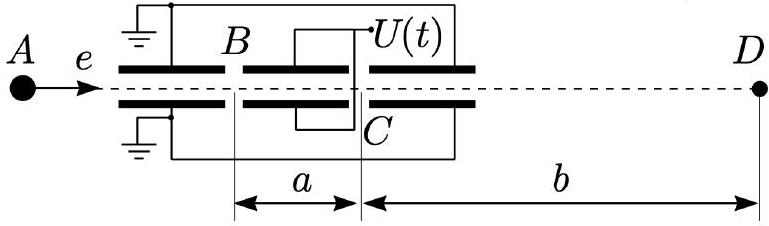

[5] Problem 23. In most common materials, $\mu \approx \mu _ { 0 }$ while $\epsilon$ depends on frequency. We'll investigate the origin of this frequency dependence below.
    (a) Model an electron in an atom as a mass $m$ with charge $q$ attached to a spring, with natural angular frequency $\omega _ { 0 }$ and a damping force $- m \gamma \mathbf { v }$, in an electric field $\mathbf { E } _ { 0 } e ^ { - i \omega t }$. Write down the equation of motion for the electron.

(b) The atomic polarizability $\alpha$ is defined by $\mathbf { p } = \alpha \mathbf { E }$. Show that
$$
\alpha = \frac { q ^ { 2 } / m } { \omega _ { 0 } ^ { 2 } - \omega ^ { 2 } - i \gamma \omega } .
$$
Now we restrict to a gas with small number density $n$, so that $n \alpha \ll \epsilon _ { 0 }$. For simplicity, you may also assume that the damping is weak, $\gamma \ll \omega _ { 0 }$. Now, the Clausius-Mossotti formula reduces to
$$
\epsilon = \epsilon _ { 0 } + n \alpha
$$
and $\alpha$ is a complex number, so we learn that $\epsilon$ is also complex.
(c) The wavevector and angular frequency are related by $k ^ { 2 } = \mu \epsilon \omega ^ { 2 }$. Explain why the fact that $\epsilon$ is complex indicates that waves can be absorbed.
(d) What value of $\omega$ maximizes the absorption rate of the electromagnetic waves? Roughly how many wavelengths does such a wave propagate before being mostly absorbed?
(e) What value of $\omega$ maximizes the speed of the electromagnetic waves, and what is that speed?
(f) Transparent objects such as glass can be modeled as having a very high resonant frequency, much higher than that of visible light. Does blue light or red light refract more when passing from air to glass?

The intuitive reason that these electrons can affect the propagation speed of light is because they emit secondary electromagnetic waves that are out of phase with the original wave; this "pushes" the phase of the composite wave forward or backward, affecting the phase velocity. A nice explanation of this can be found in chapter I. 31 of the Feynman lectures.

Solution. (a) We have

$$
m \ddot { \mathbf { r } } = - m \omega _ { 0 } ^ { 2 } \mathbf { r } - m \gamma \mathbf { v } + q \mathbf { E } _ { 0 } e ^ { - i \omega t } .
$$

(b) Suppose $\mathbf { r } = \mathbf { r } _ { 0 } e ^ { - i \omega t }$ where $\mathbf { r } _ { 0 }$ is potentially complex. Then, we see that $\mathbf { E } _ { 0 } \| \mathbf { r } _ { 0 }$ and
$$
- m \omega ^ { 2 } \mathbf { r } = - m \omega _ { 0 } ^ { 2 } \mathbf { r } + m \gamma i \omega \mathbf { r } + q \left( E _ { 0 } / r _ { 0 } \right) \mathbf { r } .
$$
Thus,
$$
\frac { E _ { 0 } } { r _ { 0 } } = \frac { m \left( \omega _ { 0 } ^ { 2 } - \omega ^ { 2 } - i \gamma \omega \right) } { q } .
$$
Using $\mathbf { p } = q \mathbf { r }$ yields the result.
(c) If $\epsilon$ is complex, then with $\mu \approx \mu _ { 0 }$ and $\omega ^ { 2 }$ being real, then $k ^ { 2 } = \mu \epsilon \omega ^ { 2 }$ will also be complex. Thus with a complex wavevector k, the field of $\mathbf { E } _ { 0 } e ^ { i ( \mathbf { k } \cdot \mathbf { x } - \omega t ) }$ will exponentially decay.
(d) The absorption arises from the imaginary part of of $k x$. With $k = \omega \sqrt { \mu \epsilon } \approx \omega \sqrt { \mu _ { 0 } \epsilon _ { 0 } } \left( 1 + \frac { n \alpha } { 2 \epsilon _ { 0 } } \right)$, the absorption rate is maximized when the imaginary part of $k$ is maximized, and
$$
\begin{gathered}
\beta \equiv \operatorname { Im } ( k ) = \operatorname { Im } \left( \frac { \omega n } { 2 c \epsilon _ { 0 } } \alpha \right) = \frac { \omega n } { 2 c \epsilon _ { 0 } } \frac { q ^ { 2 } / m } { \left( \omega _ { 0 } ^ { 2 } - \omega ^ { 2 } \right) ^ { 2 } + ( \omega \gamma ) ^ { 2 } } ( \gamma \omega ) \\
= \frac { q ^ { 2 } \gamma n } { 2 m c \epsilon _ { 0 } } \frac { \omega ^ { 2 } } { \left( \omega _ { 0 } ^ { 2 } - \omega ^ { 2 } \right) ^ { 2 } + \gamma ^ { 2 } \omega ^ { 2 } }
\end{gathered}
$$

The maximum value of this occurs when

$$
\frac { d \beta } { d \omega ^ { 2 } } \propto \left( \left( \omega _ { 0 } ^ { 2 } - \omega ^ { 2 } \right) ^ { 2 } + \gamma ^ { 2 } \omega ^ { 2 } - \omega ^ { 2 } \left( 2 \left( \omega ^ { 2 } - \omega _ { 0 } ^ { 2 } \right) + \gamma ^ { 2 } \right) \right) = 0
$$

which simplifies to yield

$$
\omega _ { 0 } ^ { 4 } - \omega ^ { 4 } = 0 .
$$

So an electromagnetic wave with angular frequency $\omega = \omega _ { 0 }$ has the maximum absorption rate. The electric field will have a factor of $e ^ { - \beta x }$, and at $\omega = \omega _ { 0 } , \beta = \frac { q ^ { 2 } n } { 2 \gamma m c \epsilon _ { 0 } }$. The value of the real wavevector $\operatorname { Re } k$ will be close to (note that $\operatorname { Re } ( \alpha ) = 0$ at $\omega = \omega _ { 0 }$ ):

$$
\operatorname { Re } ( k ) = \frac { \omega _ { 0 } } { c } \left( 1 + \operatorname { Re } \left( \frac { n \alpha } { 2 \epsilon _ { 0 } } \right) \right) = \frac { \omega _ { 0 } } { c }
$$

Then for the wave to fall off by a factor of $e$, the wave will need to travel a distance of $\frac { 1 } { \beta }$, which is $\frac { 1 } { \beta \lambda } = \frac { k } { 2 \pi \beta }$ wavelengths. Thus,

$$
\frac { k } { 2 \pi \beta } = \frac { \omega _ { 0 } \gamma m \epsilon _ { 0 } } { \pi q ^ { 2 } n }
$$

is the number of wavelengths it will travel before the amplitude gets reduced by a factor of $e$.

(e) The phase velocity is maximized when $\frac { \omega } { \operatorname { Re } k }$, or $\operatorname { Re } \frac { 1 } { \sqrt { \mu \epsilon } }$ is maximized.
$$
v _ { p } = \operatorname { Re } \frac { 1 } { \sqrt { \mu \epsilon } } \approx c \left( 1 - \operatorname { Re } \frac { 1 } { 2 } \frac { n \alpha } { \epsilon _ { 0 } } \right) = c + \frac { c q ^ { 2 } n } { 2 m \epsilon _ { 0 } } \frac { \omega ^ { 2 } - \omega _ { 0 } ^ { 2 } } { \left( \omega ^ { 2 } - \omega _ { 0 } ^ { 2 } \right) ^ { 2 } + ( \gamma \omega ) ^ { 2 } }
$$
Differentiating with respect to $\omega ^ { 2 }$ and finding where it's zero yields
$$
\begin{gathered}
\left( \omega ^ { 2 } - \omega _ { 0 } ^ { 2 } \right) ^ { 2 } + \gamma ^ { 2 } \omega ^ { 2 } - \left( \omega ^ { 2 } - \omega _ { 0 } ^ { 2 } \right) \left( 2 \left( \omega ^ { 2 } - \omega _ { 0 } ^ { 2 } \right) + \gamma ^ { 2 } \right) = 0 \\
\left( \omega ^ { 2 } - \omega _ { 0 } ^ { 2 } \right) ^ { 2 } = \omega _ { 0 } ^ { 2 } \gamma ^ { 2 } \\
\omega ^ { 2 } = \omega _ { 0 } ^ { 2 } \pm \omega _ { 0 } \gamma
\end{gathered}
$$
Looking at the original, the smaller solution yields the minimum velocity, and the larger solution yields the maximum velocity (which happens to be greater than $c$ ). The maximum phase velocity is
$$
v _ { \max } = c + \frac { c q ^ { 2 } n } { 2 m \epsilon _ { 0 } } \frac { \omega _ { 0 } \gamma } { \left( \omega _ { 0 } \gamma \right) ^ { 2 } + \gamma ^ { 2 } \left( \omega _ { 0 } ^ { 2 } + \omega _ { 0 } \gamma \right) }
$$
(f) From the previous part, we have
$$
v _ { p } = c - \frac { c q ^ { 2 } n } { 2 m \epsilon _ { 0 } } \frac { \omega _ { 0 } ^ { 2 } - \omega ^ { 2 } } { \left( \omega ^ { 2 } - \omega _ { 0 } ^ { 2 } \right) ^ { 2 } + ( \gamma \omega ) ^ { 2 } }
$$
and now we know that $\omega _ { 0 } \gg \omega$, so
$$
\frac { v _ { p } } { c } \approx 1 - \frac { q ^ { 2 } n } { 2 m \epsilon _ { 0 } } \frac { \omega _ { 0 } ^ { 2 } - \omega ^ { 2 } } { \omega _ { 0 } ^ { 4 } - 2 \omega _ { 0 } ^ { 2 } \omega ^ { 2 } + ( \gamma \omega ) ^ { 2 } } \approx 1 - \frac { q ^ { 2 } n } { 2 m \epsilon _ { 0 } \omega _ { 0 } ^ { 2 } } \left( 1 + \omega ^ { 2 } / \omega _ { 0 } ^ { 2 } \right) .
$$
Thus, increasing the frequency would decrease $v _ { p }$ and increase the index of refraction, so blue light would refract more.
[5] Problem 24. IPhO 2002, problem 1. A neat application of electromagnetic waves in matter.
[5] Problem 25. APhO 2007, problem 2. A problem on an exotic negative index of refraction.

Remark
Above, we considered the response of a medium composed of atoms, obeying $p = \alpha E$. However, this relation is just an approximation, like Hooke's law. For larger electric fields, higher order terms are necessary,

$$
p = \alpha E + \alpha ^ { \prime } E ^ { 2 } + \ldots
$$

which lead to strange effects, studied in the field of nonlinear optics. For example, suppose we send in light of angular frequency $\omega$. Then

$$
E ^ { 2 } \propto \cos ^ { 2 } ( \omega t ) = \frac { 1 + \cos ( 2 \omega t ) } { 2 } .
$$

That means that a nonlinear medium can respond to light at angular frequency $\omega$ by oscillating, and hence emitting light, at angular frequency $2 \omega$. This phenomenon is called frequency doubling, or second-harmonic generation, and converts red light to ultraviolet. Similarly, for a cubic nonlinearity, you can use trigonometric identities to show that frequency tripling can occur.

## 5 Electromagnetic Systems

In this section we'll consider problems that use everything we've covered, with a focus on technological applications and systems with multiple moving parts.

[3] Problem 26. This is a rewrite of NBPhO 2007 problem 3, which has some typos and ambiguities. Suppose particles of mass $m$, charge $e > 0$, and kinetic energy $e U _ { 0 }$ are produced at point $A$, all traveling to the right. The particles are not produced at exactly the same time, but we would like them to arrive at point $D$ at the same time. This is known as temporal focusing.

To do this, we place a pair of parallel plates along the path, with width $a$. The plates have the same time-dependent voltage $U ( t )$, while the voltage outside the plates is held at zero. Thus, the electric field is only nonzero near point $B$, where the particles enter the plates, and point $C$, where the particles exit the plates. The particles then travel a distance $b \gg a$ to point $D$.
    (a) Suppose the first particle reaches point $B$ at time $t = 0$, and that $U ( 0 ) = U ^ { \prime } ( 0 ) = 0$. Find the $U ( t )$ such that all the next particles reach point $D$ at the same time. Assume that $| U ( t ) | \ll U _ { 0 }$.
    (b) The voltage cannot become arbitrarily high, so every time $T$ it resets to zero and the process begins again. As a result, particles are periodically focused into clumps. On average, what fraction of the particles do not make it into a clump? Assume that $T$ is much larger than the time it takes a particle to cross the plates.

Solution. Here's a solution adapted for this version of the problem.

(a) Note that the particle does not accelerate when it is between the plates, even when $U ( t )$ changes, since the electric field vanishes there. The situation is analogous to a ball rolling on a flat table while the entire table is being lifted up.
Now consider the particle that enters the plates at time $t$ and exits at time $t ^ { \prime }$. It loses a kinetic energy $e U ( t )$ when it enters, then gains a kinetic energy $e U \left( t ^ { \prime } \right)$ when it exits. Therefore, if $U ( t )$ is time-dependent, the particle can have a net change in speed, which allows later particles to move faster to $D$.
To make this concrete, let $t _ { a } = a / v _ { 0 }$ and $t _ { b } = b / v _ { 0 }$, where $e U _ { 0 } = m v _ { 0 } ^ { 2 } / 2$. The approximations of the problem allow us to neglect the particles' change in speed while between the plates, since it's penalized by factors of both $a / b$ and $U ( t ) / U _ { 0 }$. Then a particle that enters the plates at time $t$ exits at time $t ^ { \prime } \approx t + t _ { a }$. The extra energy imparted must shorten the time it takes to go from $C$ to $D$ by an amount $t + t _ { 0 }$, where $t _ { 0 }$ is an arbitrary constant. Then
$$
t + t _ { 0 } \approx t _ { b } \frac { \Delta v } { v } \approx \frac { t _ { b } } { 2 } \frac { \Delta K } { e U _ { 0 } } \approx \frac { t _ { b } } { 2 } \frac { U \left( t + t _ { a } \right) - U ( t ) } { U _ { 0 } } .
$$
In other words, the finite difference of $U ( t )$ is a linear function of $t$, which means that $U ( t )$ is a quadratic polynomial. The given conditions $U ( 0 ) = U ^ { \prime } ( 0 ) = 0$ fix $U ( t ) \propto t ^ { 2 }$, and matching the coefficients of $t$ on both sides gives
$$
U ( t ) = \frac { U _ { 0 } } { t _ { a } t _ { b } } t ^ { 2 } = \frac { 2 e U _ { 0 } ^ { 2 } } { a b m } t ^ { 2 } .
$$
(b) When the voltage resets to zero, all the particles that were between the plates won't get focused correctly. So the fraction that don't get focused is approximately
$$
\frac { t _ { a } } { T } = \frac { a } { T } \sqrt { \frac { m } { 2 e U _ { 0 } } } .
$$
Note that for this solution to make sense, we need $t _ { a } \ll T$, but we also need $T$ to be short enough so that $| U ( t ) | \ll U _ { 0 }$, which corresponds to $T \ll \sqrt { t _ { a } t _ { b } }$. Both conditions can be satisfied simultaneously, since $a \ll b$.

[4] Problem 27. IPhO 2004, problem 3. A practical problem which also reviews damped/driven oscillations.
[4] Problem 28. NBPhO 2014, problem 1. A challenging problem about a complex nonlinear circuit.
[5] Problem 29. Physics Cup 2020, problem 1. (It's not stated explicitly, but you should assume the rod is an insulator with zero electric susceptibility. Alternatively, you can suppose the rod has some electric susceptibility, but it's too thin to have an effect on the dynamics of the metal balls.)

Solution. See the official solutions here.
