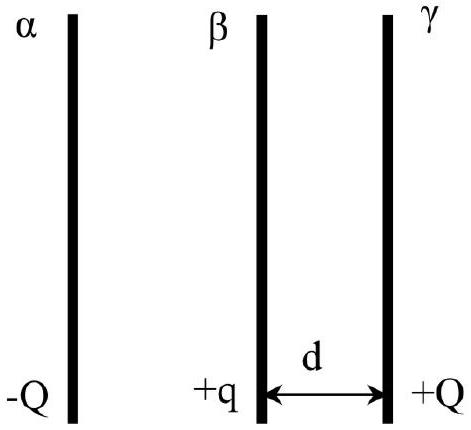
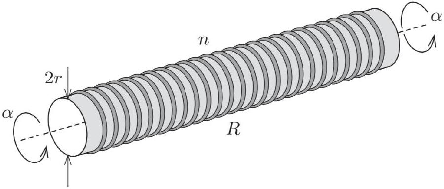
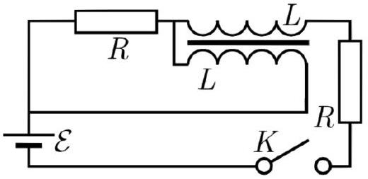

## Electromagnetism Review

There is a total of 94 points.

## 1 Electrostatics and DC Circuits

[3] Problem 1. One of the important achievements of the 19th century was the laying of undersea cables, which permitted the transmission of telegraph messages. In 1871, the 21 year old electrician Oliver Heaviside was tasked with locating a leak in the cable connecting England and Denmark. (Heaviside had been trained by his uncle-in-law Charles Wheatstone, who found many uses for the Wheatstone bridge. Heaviside later recast Maxwell's equations in the vector form we use today.)
The cable can be modeled as a uniform cylinder of known resistance $R _ { 0 }$. That is, when the cable is operating properly, then grounding one end and applying a voltage $V$ to the other leads to a steady state current of $V / R _ { 0 }$. The leak is located a fraction $\alpha$ of the way from the English side. Let the resistance between the leak point and the Earth, due to the current having to travel through the water, be $R _ { d }$. The precise value of $R _ { d }$ is also unknown. Your task, as was Heaviside's, is to find a way to measure $\alpha$ without having to dig the whole cable up.
Solution. There are various ways to solve this problem; here's what Heaviside did.

First, don't attach the Danish side to anything, and apply a voltage at the English side. By measuring the resulting current, we can measure the resistance, which in this case is
$$
R _ { 1 } = \alpha R _ { 0 } + R _ { d } .
$$
Next, attach the Danish side to ground and repeat the procedure to measure the new resistance,
$$
R _ { 2 } = \alpha R _ { 0 } + \frac { R _ { d } R _ { 0 } ( 1 - \alpha ) } { R _ { d } + R _ { 0 } ( 1 - \alpha ) } .
$$
We don't know $R _ { d }$, but we can plug the first equation into the second to eliminate it. Defining the rescaled variables $r _ { 1 } = R _ { 1 } / R _ { 0 }$ and $r _ { 2 } = R _ { 2 } / R _ { 0 }$, the second equation becomes
$$
r _ { 2 } = \alpha + \frac { \left( r _ { 1 } - \alpha \right) ( 1 - \alpha ) } { r _ { 1 } + 1 - 2 \alpha } .
$$
Clearing denominators and simplifying gives the quadratic
$$
\alpha ^ { 2 } - 2 \alpha r _ { 2 } + r _ { 2 } + r _ { 1 } r _ { 2 } - r _ { 1 } = 0
$$
and since we know $\alpha < r _ { 2 }$, the physical solution is
$$
\alpha = r _ { 2 } - \sqrt { \left( r _ { 1 } - r _ { 2 } \right) \left( 1 - r _ { 2 } \right) } .
$$
Incidentally, this result was first derived by a French telegrapher, and is called Blavier's method. Variations of this method are still used to locate breaks in cables today!

[3] Problem 2. USAPhO 2006, problem A2.

[2] Problem 3 (Kalda). Not all circuits are made of only series and parallel combinations. The Y- $\Delta$ transform is the next simplest tool you can use. Consider the two sets of resistors shown below.

The two are equivalent provided that
$$
R _ { A } = \frac { R _ { A B } R _ { A C } } { R _ { A B } + R _ { A C } + R _ { B C } } , \quad \frac { 1 } { R _ { B C } } = \frac { 1 / R _ { B } R _ { C } } { 1 / R _ { A } + 1 / R _ { B } + 1 / R _ { C } }
$$
along with cyclic permutations. As an application, consider the circuit below.

Find the current through the battery using a Y- $\Delta$ transform.
Solution. It's most convenient to apply the Y-△ transform to the top vertex, turning it from a Y into a $\Delta$ of three $9 \Omega$ resistors. At this point the circuit can be simplified using the usual series and parallel rules, giving $R _ { \mathrm { eq } } = 19 / 7 \Omega$ and thus $I = 21 / 19 \mathrm {~A}$.
[2] Problem 4. Two infinite parallel conducting plates are separated by a distance $d$. A particle of charge $q$ is placed midway between them, then displaced towards one plate by $\Delta z \ll d$. Find the force on the particle. You can give your answer in terms of the Riemann zeta function $\zeta ( s ) = \sum _ { n = 1 } ^ { \infty } 1 / n ^ { s }$.
Solution. We use the method of images. Placing the plates at $z = \pm d / 2$, there are two infinite series of image charges. Working outward, we have charges $- q$ at $d - \Delta z$ and $- d - \Delta z$, then charges $q$ at $- 2 d + \Delta z$ and $2 d + \Delta z$, then charges $- q$ at $3 d - \Delta z$ and $- 3 d - \Delta z$, then charges $q$ at $- 4 d + \Delta z$ and $4 d + \Delta z$, and so on.
The positive image charges always come in pairs centered on the location of the particle, $z = \Delta z$, so we can just consider the negative image charges. The net force from them is
$$
F = \frac { q ^ { 2 } } { 4 \pi \epsilon _ { 0 } } \sum _ { k = 1,3 , \ldots } \left( \frac { 1 } { ( k d - 2 \Delta z ) ^ { 2 } } - \frac { 1 } { ( k d + 2 \Delta z ) ^ { 2 } } \right) \approx \frac { q ^ { 2 } } { 4 \pi \epsilon _ { 0 } } \frac { 8 \Delta z } { d ^ { 3 } } \sum _ { k = 1,3 , \ldots } \frac { 1 } { k ^ { 3 } } .
$$
If we call this sum $S$, then we can relate it to the zeta function by noting that
$$
\sum _ { k = 2,4 , \ldots } \frac { 1 } { k ^ { 3 } } = \frac { 1 } { 8 } \sum _ { k = 1 } ^ { \infty } \frac { 1 } { k ^ { 3 } } = \frac { \zeta ( 3 ) } { 8 }
$$

which implies that $S + \zeta ( 3 ) / 8 = \zeta ( 3 )$. Thus, we conclude that
$$
F = 7 \zeta ( 3 ) \frac { q ^ { 2 } \Delta z } { 4 \pi \epsilon _ { 0 } d ^ { 3 } } .
$$
This force is relevant in measurements involving the oscillation frequencies of trapped ions.
[3] Problem 5. IZhO 2022, problem 1.3. A three-dimensional electrostatics problem.
Solution. See the official solutions as usual. However, due to some algebraic errors, the final result is off by a factor of $\pi$, as pointed out in Stefan Ivanov's errata. Referring to their rubric, the first 5 formulas are right, but in going to formula 6, they drop the $\cos \beta$ factor inside $d q$. Starting from formula 5, the correct solution would be to write
$$
F _ { Q } = \frac { Q d q } { 4 \pi \epsilon _ { 0 } ( \sqrt { 2 } R ) ^ { 3 } } R \cos \beta = \frac { \sigma Q } { 4 \sqrt { 2 } \pi \epsilon _ { 0 } } \cos ^ { 2 } \beta d \beta d \alpha
$$
and then perform the integral over $\beta$, yielding a factor of $\pi / 2$, to get
$$
F _ { Q } = \frac { \sigma Q } { 8 \sqrt { 2 } \epsilon _ { 0 } } d \alpha .
$$
Setting this equal to $m g d \alpha$ yields an answer of
$$
Q = \frac { 8 \sqrt { 2 } \epsilon _ { 0 } m g } { \sigma } .
$$
[5] Problem 6. IPhO 2012, problem 2. A challenging electrostatics and fluids problem; some prior exposure to surface tension is helpful. (For more about the kinds of bubbles encountered in this problem, see section 5.9 of Physics of Continuous Matter by Lautrup.)

## 2 Charges in Fields

[3] Problem 7 (BAUPC). A particle with charge $q$ and mass $m$ is initially at the origin in a region with constant magnetic field $B \hat { \mathbf { z } }$, and velocity $v _ { 0 } \hat { \mathbf { y } }$. The particle experiences a frictional force $\mathbf { F } = - \alpha \mathbf { v }$. Find the final position of the particle.
Solution. Newton's second law is $m \mathbf { a } = q \mathbf { v } \times \mathbf { B } - \alpha \mathbf { v }$, and its components are
$$
m a _ { x } = q B v _ { y } - \alpha v _ { x } , \quad m a _ { y } = - q B v _ { x } - \alpha v _ { y } .
$$
This is a set of two linear differential equations, so we can find the solution by guessing exponentials, as discussed in M4. But in this case, since we know the initial and final velocities, and only want the final position, there's an easier way. (I thank Stefan Ivanov for pointing this out.) We integrate both sides of the above equations with respect to time, from zero to infinity, to get
$$
m \Delta v _ { x } = q B \Delta y - \alpha \Delta x , \quad m \Delta v _ { y } = - q B \Delta x - \alpha \Delta y .
$$
The initial velocity is $v _ { 0 } \hat { \mathbf { y } }$, and the final velocity is zero, so
$$
\Delta v _ { x } = 0 , \quad \Delta v _ { y } = - v _ { 0 } .
$$
This yields a system of two equations, which can be solved to yield
$$
\Delta x = \frac { m v _ { 0 } q B } { ( q B ) ^ { 2 } + \alpha ^ { 2 } } , \quad \Delta y = \frac { m v _ { 0 } \alpha } { ( q B ) ^ { 2 } + \alpha ^ { 2 } } .
$$

[3] Problem 8 (APhO 2006). Two large, identical conducting plates $\alpha$ and $\beta$ with charges -Q and $+ q$ (where $Q > q > 0$ ) are parallel to each other and fixed in place. Another identical plate $\gamma$ with mass $m$ and charge $+ Q$ is parallel to the original plates at distance $d$, as shown.

The plates have surface area $A$. The plate $\gamma$ is released from rest and bounces elastically off the plate $\beta$. Assume that charges have sufficient time to redistribute between the plates during the collision. When the plate $\gamma$ returns to its original position, what is its speed?
Solution. Initially, the electric field due to the plates $\alpha$ and $\beta$ at $\gamma$ is
$$
E = \frac { Q - q } { 2 \epsilon _ { 0 } A }
$$
so the force is
$$
F = Q E = \frac { Q ( Q - q ) } { 2 \epsilon _ { 0 } A }
$$
towards plate $\beta$. During the collision, $\beta$ and $\gamma$ effectively become one plate with total charge $Q + q$. In order to shield the field of plate $\alpha$, the difference of the charges on the left end of $\beta$ and the right end of $\gamma$ must be $Q$, which means that the right end of $\gamma$ gets a charge $q / 2$, while the left end of $\beta$ gets a charge $Q + q / 2$. After the collision, the electric field due to $\alpha$ and $\beta$ is
$$
E ^ { \prime } = \frac { q } { 4 \epsilon _ { 0 } A }
$$
so the magnitude of the force is
$$
F ^ { \prime } = \frac { q } { 2 } E ^ { \prime } = \frac { q ^ { 2 } } { 8 \epsilon _ { 0 } A }
$$
away from plate $\beta$. The total work done is
$$
W = \left( F + F ^ { \prime } \right) d = \frac { d } { 8 \epsilon _ { 0 } A } ( 2 Q - q ) ^ { 2 }
$$
and setting this equal to $m v ^ { 2 } / 2$ gives
$$
v = \sqrt { \frac { d } { \epsilon _ { 0 } m A } } ( Q - q / 2 ) .
$$
[3] Problem 9. USAPhO 2017, problem A3. A real-world application of magnetism, with great historical importance. For much more on the mechanism illustrated in this question, see this article.
[3] Problem 10. USAPhO 2023, problem A2.

[3] Problem 11. NBPhO 2010, problem 1. A contrived, but nice problem involving particles in fields.
Solution. See the official solutions as usual. However, they have some typos. For part (ii), there should be a $2 \pi$ on the right-hand side of the final answer. For part (iii), $s + 2 x$ is the displacement of the red ball after the blue ball enters the field, so the final inequality should be $L > s + 2 x$.
[3] Problem 12. APhO 2003, problem 3. A short problem on a "plasma lens".
[4] Problem 13. APhO 2005, problem 2B. An elegant, tricky problem on focusing with magnetic fields. I recommend using Kai Wen Teo's modified version.
Solution. See Kai Wen Teo's solution here.
[4] Problem 14. IPhO 2011, problem 3. A problem on the interactions of charges and atoms.
[3] Problem 15. USAPhO 2017, problem B2. A series of short calculations for a real-world setup.
[5] Problem 16. IPhO 2021, problem 2. A comprehensive problem on E1 through E4.
Remark
You should almost never use a rotating frame to describe electromagnetic fields. Not only will you run into a more subtle version of the problems with field transformations, as described in E4, but basic calculus operations like the divergence, curl, and partial time derivative transform too. The result is that Maxwell's equations take on a completely different, and rather nasty form, as shown here. (It is easier to work with Maxwell's equations in general frames if you know how to express them in tensor form, as mentioned in R3. But in that case you usually wouldn't even be thinking in terms of electric and magnetic fields anyway, replacing them with the electromagnetic field strength tensor.)

Idea 1
A metal conductor is made of nuclei of positive charge, and electrons of compensating negative charge. Classically, the electrons are free to move, but the nuclei are fixed in place in the crystal lattice by strong electrostatic interactions.

[3] Problem 17 (PPP 173). A solid metal cylinder rotates with angular velocity $\omega$ about its axis of symmetry. The cylinder is in a homogeneous magnetic field B parallel to its axis.
    (a) Find the charge distribution inside the cylinder.
    (b) Is there a nonzero angular velocity for which the charge distribution is everywhere zero?

Solution. (a) Applying Newton's second law to an electron gives

$$
e E + e \omega r B = m \omega ^ { 2 } r
$$

where $m$ is the electron mass and $e$ is the electron charge, so

$$
r E + \omega r ^ { 2 } B = \frac { m \omega ^ { 2 } } { e } r ^ { 2 }
$$

But Gauss's law tells us that

$$
E ( r ) = \frac { 1 } { 2 \pi \epsilon _ { 0 } r } \int _ { 0 } ^ { r } \rho \left( r ^ { \prime } \right) 2 \pi r ^ { \prime } d r ^ { \prime } ,
$$

so taking the derivative of our previous equation with respect to $r$, we have

$$
\frac { \rho } { 2 \pi \epsilon _ { 0 } } ( 2 \pi r ) + 2 \omega r B = \frac { 2 m \omega ^ { 2 } r } { e } .
$$

Thus, it turns out we get a uniform charge,

$$
\rho = \frac { 2 \omega \epsilon _ { 0 } } { e } ( m \omega - e B ) .
$$

Note that we don't have to apply Newton's second law to the positive ions in the metal. These are locked in place by the crystal lattice; it's only the electrons that are redistributing. And of course, the metal remains overall charge neutral; the extra electrons just get pushed all the way to the surface.

(b) This occurs when $\omega = e B / m$, the cyclotron frequency. In this case the Lorentz force from the magnetic field is enough by itself to keep each electron moving in a circle.
[3] Problem 18 (MPPP 173). In 1917, T. D. Stewart and R. C. Tolman discovered that an electric current flows in any coil wound around, and attached to, a cylinder that is rotated axially with constant angular acceleration.

Consider a large number of rings of thin metallic wire, each with radius $r$ and resistance $R$. The rings have been glued in a uniform way onto a very long evacuated glass cylinder, with $n$ rings per unit length of the symmetry axis. The plane of each ring is perpendicular to that axis.
At some particular moment, the cylinder starts to accelerate around its symmetry axis with angular acceleration $\alpha$. After a certain length of time, there is a constant magnetic field $B$ at the centre of the cylinder. Find, in terms of the charge $e$ and mass $m$ of an electron, the magnitude of the field. (The matching experimental result showed that it was the electrons that were free to move in metals.)
Solution. First, we need to understand why there should be a magnetic field at all. This is puzzling, because there don't seem to be any charged objects anywhere in the problem. But we recall that microscopically, the rings are made of positive ions locked in a lattice, and negatively charged electrons free to move. If, when we rotated the ring, the positive ions moved but the electrons stayed in place, we would have a large current.
Of course, this isn't realistic, because that would mean that moving any conducting object would produce a huge current. In reality, the electrons get pulled along with the ions due to their mutual

interaction, making the current almost cancel. But since the ions are continually accelerating, the electrons are always a bit behind, so their velocities differ, and there is a small net current. (Note that in addition to this effect, electrons are pushed to the outside edge of the ring by the same effect as in problem 17, but in this problem that isn't important because the rings are thin.)

Now let's make this more concrete. It's easiest to work in the noninertial frame rotating with the cylinder. (This is okay, despite the remark above, because we're not going to say anything about the fields in this frame.) In this frame, there are centrifugal and Coriolis forces, but they only act radially, leading to a small charge separation between the inside and outside of the loop. However, the frame's angular acceleration yields a fictitious force $F = m r \alpha$ acting tangentially on the electrons. This corresponds to an emf per wire loop of

$$
\mathcal { E } = ( 2 \pi r ) \frac { F } { q } = \frac { 2 \pi m r ^ { 2 } \alpha } { e } .
$$

By Ohm's law, $\mathcal { E } = I R$, this implies a steady state current of

$$
I = \frac { 2 \pi m r ^ { 2 } \alpha } { e R } .
$$

Now return to the inertial lab frame. The current in the frame is the same, and in this frame it is due to the electrons slightly lagging in speed behind the ions. We then get

$$
B = \mu _ { 0 } n I = \frac { 2 \pi \mu _ { 0 } n m r ^ { 2 } \alpha } { e R } .
$$

[5] Problem 19. EuPhO 2023, problem 3. A neat and rather difficult question, in a setup where an eddy current can be computed exactly.

## 3 Induction

[3] Problem 20 (IPhO 2000). A thin copper wire of radius $r$ and resistivity $\rho$ is bent into a circular ring of radius $R$ of total mass $m$. It is suspended from the ceiling by a frictionless wire and set rotating with angular frequency $\omega$. The horizontal component of the local magnetic field of the Earth is $B$. Neglecting any self-induction effects and assuming that $B$ is small, find the time required for the angular frequency to halve. This is an example of "induction braking".

Solution. See the official solutions for IPhO 2000, problem 1.
[3] Problem 21. USAPhO 2024, problem A1. How wires form a real LC circuit.
[5] Problem 22. IZhO 2020, problem 3. A nice problem on electromagnetism and mechanics.
[5] Problem 23. APhO 2021, problem 3. A challenging problem on time-dependent image charges.

## 4 Circuits

[3] Problem 24. USAPhO 2007, problem A4.
[3] Problem 25. NBPhO 2009, problem 8. A review problem for RC and RL circuits.

[3] Problem 26 (Kalda). An electrical transformer is connected as shown.

Both windings of the transformer have the same number of loops and the self-inductance of both coils is equal to $L$. There is no leakage of the magnetic field lines from the core, so that the mutual inductance is also equal to $L$.
    (a) Suppose the coil windings are oriented so that if both coils have current flowing from left to right, then the magnetic fields in the transformer core cancel out. Find the currents in the resistors immediately after the switch is closed.
    (b) Find the current in the left resistor as a function of time.
    (c) Now suppose one of the coils is wound in reverse, relative to the specification of part (a). Find the current in the right resistor as a function of time.

Solution. (a) Let $I _ { 1 }$ and $I _ { 2 }$ be the currents flowing through the top and bottom coils respectively, and positive being from left to right. Then the magnetic flux is $L \left( I _ { 1 } - I _ { 2 } \right)$, which is equal to 0 at the beginning. Then Kirchhoff's rules give

$$
\mathcal { E } = \left( I _ { 1 } + I _ { 2 } \right) R + \mathcal { E } _ { L } + I _ { 1 } R \quad \left( I _ { 1 } + I _ { 2 } \right) R - \mathcal { E } _ { L } = 0
$$

Using $I _ { 1 } = I _ { 2 }$, we have $\mathcal { E } = 2 I _ { 1 } R + 2 I _ { 1 } R + I _ { 2 } R = 5 I _ { 1 } R$ giving $I _ { 1 } = \mathcal { E } / ( 5 R ) = I _ { 2 }$, so currents of $2 \mathcal { E } / 5 R$ and $\mathcal { E } / 5 R$ flow through the left and right resistors respectively.

(b) Defining $I = I _ { 1 } - I _ { 2 }$, we have $\mathcal { E } _ { L } = L \frac { d I } { d t }$, and Kirchhoff's loop rules give
$$
\mathcal { E } = 2 L \frac { d I } { d t } + I _ { 1 } R , \quad \mathcal { E } = 2 \left( 2 I _ { 1 } - I \right) R + I _ { 1 } R = 5 I _ { 1 } R - 2 I R
$$
Putting them together and simplifying yields
$$
2 \mathcal { E } = 5 L \frac { d I } { d t } + I R
$$
Solving the differential equation yields
$$
I = \frac { 2 \mathcal { E } } { R } \left( 1 - e ^ { - t R / 5 L } \right) , \quad \frac { d I } { d t } = \frac { 2 \mathcal { E } } { R ( 5 L / R ) } e ^ { - t R / 5 L } = \left( I _ { 1 } + I _ { 2 } \right) R / L .
$$
The current in the left resistor is
$$
I _ { 1 } + I _ { 2 } = \frac { 2 \mathcal { E } } { 5 R } e ^ { - t R / 5 L } .
$$
(c) Now, $\mathcal { E } _ { L } = L \frac { d I } { d t }$ and the second loop rule has the direction of $\mathcal { E } _ { L }$ reversed: $\left( I _ { 1 } + I _ { 2 } \right) R + \mathcal { E } _ { L } = 0$. Then the equations with $I \equiv I _ { 1 } + I _ { 2 }$ are
$$
\mathcal { E } = I R - I R + I _ { 1 } R = I _ { 1 } R
$$
The current through the right resistor is just $I _ { 1 }$, so the answer is
$$
I _ { 1 } = \frac { \mathcal { E } } { R } .
$$

## 5 Electrodynamics

[3] Problem 27. Consider two infinite parallel plates held at $z = h / 2$ and $z = - h / 2$, with uniform charge densities $\sigma$ and $- \sigma$ respectively, and negligible mass. The plates are initially at rest.
    (a) Both plates are uniformly accelerated by $\mathbf { a } = a \hat { \mathbf { y } }$. During this process, find the electric field induced between the plates. Assume $a$ is small, so that radiation effects can be neglected, i.e. assume the magnetic field is always approximately magnetostatic.
    (b) During this process, find the external force per unit area needed to accelerate the plates.
    (c) The acceleration stops when the plates have speed $v _ { 0 }$. Verify that the total work done is equal to the change in electromagnetic field energy.

Solution. (a) The magnetic field is $\mathbf { B } = - \mu _ { 0 } \sigma v \hat { \mathbf { x } }$ between the plates, and zero outside them, where the speed is $v = a t$. Applying Faraday's law using rectangular loops in the $y z$ plane,

$$
E _ { y } = - \mu _ { 0 } \sigma a \times \begin{cases} h / 2 & z > h / 2 \\ z & - h / 2 < z < h / 2 \\ - h / 2 & z < - h / 2 \end{cases}
$$

We always also have the usual perpendicular electric field $E _ { z }$ of a parallel plate capacitor between the plates, but this isn't relevant for part (b), since it doesn't affect the work, nor for part (c), since it stays the same.

(b) On the top plate the induced electric field produces a force per unit area $\left| E _ { y } \right| \sigma = \mu _ { 0 } \sigma ^ { 2 } a h / 2$ pointing against the acceleration. There is an identical force on the bottom plate, so the total is $\mu _ { 0 } \sigma ^ { 2 } a h$.
(c) The total work done per unit area is the force per unit area times the displacement,
$$
\frac { \text { work } } { \text { area } } = \left( \mu _ { 0 } \sigma ^ { 2 } a h \right) \frac { v _ { 0 } ^ { 2 } } { 2 a } = \frac { \mu _ { 0 } \sigma ^ { 2 } v _ { 0 } ^ { 2 } h } { 2 } .
$$
On the other hand, before and after the acceleration we have the same electric field (i.e. that of a parallel plate capacitor), while after the acceleration a magnetic field of magnitude $B = \mu _ { 0 } \sigma v _ { 0 }$ appears between the plates. This gives
$$
\frac { \text { field energy } } { \text { area } } = \frac { B ^ { 2 } h } { 2 \mu _ { 0 } } = \frac { \mu _ { 0 } \sigma ^ { 2 } v _ { 0 } ^ { 2 } h } { 2 }
$$
as expected.
[3] Problem 28. [A] Electromagnetism is symmetric under charge conjugation $C$, parity $P$, and time reversal $T$. Explicitly, this means the following: suppose there are charge and current densities $\rho ( \mathbf { r } , t )$ and $\mathbf { J } ( \mathbf { r } , t )$, which then produce fields $\mathbf { E } ( \mathbf { r } , t )$ and $\mathbf { B } ( \mathbf { r } , t )$. A test charge $q$ is acted on by these fields, taking a path $\mathbf { x } ( t )$. Under one of these symmetry transformation, all of these quantities can be changed, but the new fields should still obey Maxwell's equations, and the path of the test charge should still obey Newton's second law, $m \mathbf { a } = q ( \mathbf { E } + \mathbf { v } \times \mathbf { B } )$.

(a) Under charge conjugation, the signs of all charges are flipped. What are the new charge and current densities $\rho ^ { \prime } ( \mathbf { r } , t )$ and $\mathbf { J } ^ { \prime } ( \mathbf { r } , t )$ ? What are the new fields $\mathbf { E } ^ { \prime } ( \mathbf { r } , t )$ and $\mathbf { B } ^ { \prime } ( \mathbf { r } , t )$ ? The path of the test charge is still $\mathbf { x } ^ { \prime } ( t ) = \mathbf { x } ( t )$. Verify it still obeys Newton's second law.
(b) Under time reversal, everything at time $t$ now occurs at time $- t$. For example, $\rho ^ { \prime } ( \mathbf { r } , t ) =$ $\rho ( \mathbf { r } , - t )$. Verify the test charge's new path still obeys Newton's second law.
(c) Under parity, everything at position $\mathbf { x }$ is mapped to $- \mathbf { x }$. For example, the new path of the test charge is $\mathbf { x } ^ { \prime } ( t ) = - \mathbf { x } ( t )$. Verify its new path still obeys Newton's second law.
(d) The Poynting vector $\mathbf { S } = ( \mathbf { E } \times \mathbf { B } ) / \mu _ { 0 }$ describes the energy flow in the electromagnetic field. How does it transform under $C , P$, and $T$ ?
(e) In quantum field theory, one important but subtle quantity is the "theta term",
$$
\int d t \int d \mathbf { r } \mathbf { E } ( \mathbf { r } , t ) \cdot \mathbf { B } ( \mathbf { r } , t )
$$
where the integrals are over all time and all space. Does the theta term stay the same under $C$, or $P$, or $T$ ? How about the combined transformations $C P$ and $C P T$ ?

Solution. (a) If the charge is flipped, then the current density is flipped too, because currents are made of moving charges. Since the fields are proportional to charge and current density, both the electric and magnetic field are flipped. Thus,

$$
\rho ^ { \prime } ( \mathbf { r } , t ) = - \rho ( \mathbf { r } , t ) , \quad \mathbf { J } ^ { \prime } ( \mathbf { r } , t ) = - \mathbf { J } ( \mathbf { r } , t ) , \quad \mathbf { E } ^ { \prime } ( \mathbf { r } , t ) = - \mathbf { E } ( \mathbf { r } , t ) , \quad \mathbf { B } ^ { \prime } ( \mathbf { r } , t ) = - \mathbf { B } ( \mathbf { r } , t ) .
$$

The acceleration of the test charge stays the same. Meanwhile, the force on it stays the same too, because the fields flip and its own charge flips, $q \rightarrow - q$. Thus, Newton's second law is still satisfied.

(b) The charge density is simply moved to a flipped time,
$$
\rho ^ { \prime } ( \mathbf { r } , t ) = \rho ( \mathbf { r } , - t ) .
$$
On the other hand, the current also has its sign flipped, because currents are due to moving charges, and these charges have their velocity flipped,
$$
\mathbf { J } ^ { \prime } ( \mathbf { r } , t ) = - \mathbf { J } ( \mathbf { r } , - t ) .
$$
In a quasistatic situation, we know that $\mathbf { E }$ is sourced by $\rho$ and $\mathbf { B }$ is sourced by $\mathbf { J }$, so
$$
\mathbf { E } ^ { \prime } ( \mathbf { r } , t ) = \mathbf { E } ( \mathbf { r } , - t ) , \quad \mathbf { B } ^ { \prime } ( \mathbf { r } , t ) = - \mathbf { B } ( \mathbf { r } , - t ) .
$$
Since the path of the test charge has flipped, its velocity has flipped while its acceleration stays the same,
$$
\mathbf { x } ^ { \prime } ( t ) = \mathbf { x } ( - t ) , \quad \mathbf { v } ^ { \prime } ( t ) = - \mathbf { v } ( - t ) , \quad \mathbf { a } ^ { \prime } ( t ) = \mathbf { a } ( - t ) .
$$
Therefore, we need the Lorentz force to stay the same. Indeed, $\mathbf { E }$ hasn't flipped sign, while $\mathbf { v } \times \mathbf { B }$ has flipped sign twice.

(c) The charge density is simply moved to a flipped position,
$$
\rho ^ { \prime } ( \mathbf { r } , t ) = \rho ( - \mathbf { r } , t ) .
$$
On the other hand, the current also has its sign flipped, because currents are due to moving charges, and these charges have their velocity flipped,
$$
\mathbf { J } ^ { \prime } ( \mathbf { r } , t ) = - \mathbf { J } ( - \mathbf { r } , t ) .
$$
In a quasistatic situation, we know that $\mathbf { E }$ is sourced by $\rho$ and $\mathbf { B }$ is sourced by $\mathbf { J }$, so
$$
\mathbf { E } ^ { \prime } ( \mathbf { r } , t ) = - \mathbf { E } ( - \mathbf { r } , t ) , \quad \mathbf { B } ^ { \prime } ( \mathbf { r } , t ) = \mathbf { B } ( - \mathbf { r } , t ) .
$$
The signs here are flipped from the time reversal case, because E and B are related to $\rho$ and J by spatial derivatives, which also flip sign. (If this is confusing, consider a few examples, like a solenoid or point charge!)
The remarkable feature of this result is that we usually think of $\mathbf { E }$ and $\mathbf { B }$ as vector fields, meaning they assign a direction to every point in space. Since directions reverse under parity, we would naively expect both of them to flip sign. The reason this doesn't happen is that B is not a true vector at all, but rather a different geometric object called an axial vector. The directions of axial vectors are determined by applying the right-hand rule, which means they transform differently under parity because a right hand is mapped to a left hand.
Since the path of the test charge has flipped, its velocity and acceleration have flipped,
$$
\mathbf { x } ^ { \prime } ( t ) = - \mathbf { x } ( t ) , \quad \mathbf { v } ^ { \prime } ( t ) = - \mathbf { v } ( t ) , \quad \mathbf { a } ^ { \prime } ( t ) = - \mathbf { a } ( t ) .
$$
As expected, the Lorentz force also flips sign, because E flips sign, and $\mathbf { v } \times \mathbf { B }$ flips sign due to the $\mathbf { v }$.
(d) Under charge conjugation, both E and B flip, so the Poynting vector stays the same. This tells us that energy is emitted by the motion of reversed charges in the same way as the original charges.
Under time reversal, only $\mathbf { B }$ flips, which means $\mathbf { S } ^ { \prime } ( \mathbf { r } , t ) = - \mathbf { S } ( \mathbf { r } , - t )$. That is, energy now flows in the opposite direction. The time reverse of energy flowing out is energy flowing in.
Under parity, only $\mathbf { E }$ flips, which means $\mathbf { S } ^ { \prime } ( \mathbf { r } , t ) = - \mathbf { S } ( - \mathbf { r } , t )$. This is just the expected way a vector transforms under parity; directions are flipped.
(e) Under charge conjugation, both E and B flip, so the theta term stays the same.
Under both parity and time reversal, one of the fields flips sign, so the integral of the fields flips sign. We thus say the theta term is odd under $P$ and $T$.
Under the combined transformation $C P$, there is still one sign flip. But under $C P T$, there are two sign flips, so the theta term stays the same.
In theoretical physics, the theta term is interesting because it does not stay the same under $C P$. This is a rather unusual feature, as most of the rest of the terms in the Standard Model's Lagrangian stay the same, or approximately the same, under $C P$. On the other hand, it is a famous theorem that in any relativistic quantum field theory, everything has to stay the same under $C P T$.

## Remark

In E7, you learned that an accelerating particle emits electromagnetic radiation, and therefore loses energy. But under time reversal, an accelerating particle is still accelerating, so it still should lose energy. How can this be consistent with time reversal symmetry, which says the particle should instead gain energy?

The resolution is that when you apply time reversal, you need to time reverse everything. Suppose a particle accelerates at time $t = 0$ and emits a burst of radiation, which exists for $t > 0$. The time reverse of this process has radiation moving towards the particle at time $t < 0$, until at $t = 0$ it hits the particle and gets absorbed. The reason this seems unrealistic has nothing to do with the laws of electromagnetism, which treat both scenarios as equally valid, and everything to do with the second law of thermodynamics.
