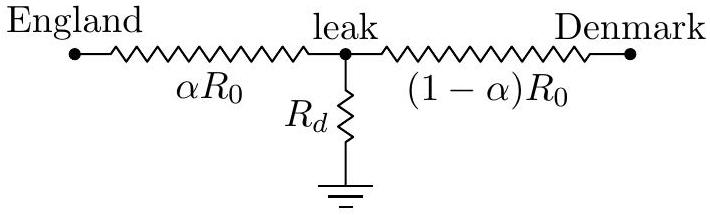
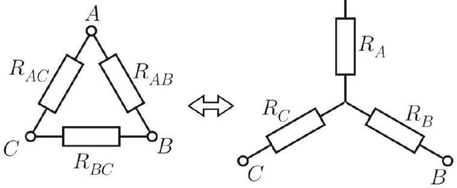
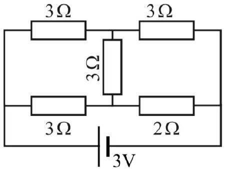

[3] Problem 1. One of the important achievements of the 19th century was the laying of undersea cables, which permitted the transmission of telegraph messages. In 1871, the 21 year old electrician Oliver Heaviside was tasked with locating a leak in the cable connecting England and Denmark. (Heaviside had been trained by his uncle-in-law Charles Wheatstone, who found many uses for the Wheatstone bridge. Heaviside later recast Maxwell's equations in the vector form we use today.)
The cable can be modeled as a uniform cylinder of known resistance $R _ { 0 }$. That is, when the cable is operating properly, then grounding one end and applying a voltage $V$ to the other leads to a steady state current of $V / R _ { 0 }$. The leak is located a fraction $\alpha$ of the way from the English side. Let the resistance between the leak point and the Earth, due to the current having to travel through the water, be $R _ { d }$. The precise value of $R _ { d }$ is also unknown. Your task, as was Heaviside's, is to find a way to measure $\alpha$ without having to dig the whole cable up.
Solution. There are various ways to solve this problem; here's what Heaviside did.

First, don't attach the Danish side to anything, and apply a voltage at the English side. By measuring the resulting current, we can measure the resistance, which in this case is
$$
R _ { 1 } = \alpha R _ { 0 } + R _ { d } .
$$
Next, attach the Danish side to ground and repeat the procedure to measure the new resistance,
$$
R _ { 2 } = \alpha R _ { 0 } + \frac { R _ { d } R _ { 0 } ( 1 - \alpha ) } { R _ { d } + R _ { 0 } ( 1 - \alpha ) } .
$$
We don't know $R _ { d }$, but we can plug the first equation into the second to eliminate it. Defining the rescaled variables $r _ { 1 } = R _ { 1 } / R _ { 0 }$ and $r _ { 2 } = R _ { 2 } / R _ { 0 }$, the second equation becomes
$$
r _ { 2 } = \alpha + \frac { \left( r _ { 1 } - \alpha \right) ( 1 - \alpha ) } { r _ { 1 } + 1 - 2 \alpha } .
$$
Clearing denominators and simplifying gives the quadratic
$$
\alpha ^ { 2 } - 2 \alpha r _ { 2 } + r _ { 2 } + r _ { 1 } r _ { 2 } - r _ { 1 } = 0
$$
and since we know $\alpha < r _ { 2 }$, the physical solution is
$$
\alpha = r _ { 2 } - \sqrt { \left( r _ { 1 } - r _ { 2 } \right) \left( 1 - r _ { 2 } \right) } .
$$
Incidentally, this result was first derived by a French telegrapher, and is called Blavier's method. Variations of this method are still used to locate breaks in cables today!

[3] Problem 2. USAPhO 2006, problem A2.

[2] Problem 3 (Kalda). Not all circuits are made of only series and parallel combinations. The Y- $\Delta$ transform is the next simplest tool you can use. Consider the two sets of resistors shown below.

The two are equivalent provided that
$$
R _ { A } = \frac { R _ { A B } R _ { A C } } { R _ { A B } + R _ { A C } + R _ { B C } } , \quad \frac { 1 } { R _ { B C } } = \frac { 1 / R _ { B } R _ { C } } { 1 / R _ { A } + 1 / R _ { B } + 1 / R _ { C } }
$$
along with cyclic permutations. As an application, consider the circuit below.

Find the current through the battery using a Y- $\Delta$ transform.
Solution. It's most convenient to apply the Y-△ transform to the top vertex, turning it from a Y into a $\Delta$ of three $9 \Omega$ resistors. At this point the circuit can be simplified using the usual series and parallel rules, giving $R _ { \mathrm { eq } } = 19 / 7 \Omega$ and thus $I = 21 / 19 \mathrm {~A}$.
