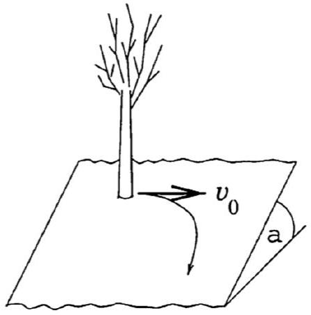

Example 4
A rabbit begins at the origin, and the fox begins at the point $( 0 , - a )$. The rabbit begins running east, with a constant speed $v \hat { \mathbf { x } }$. At the same time, the fox begins chasing the rabbit, always moving towards it with speed $v$. After a long time, the rabbit and fox simply follow each other in a straight line, with a constant separation $d$. What is $d$ ?

Solution
This is the simplest example of a pursuit problem. Physicists and mathematicians have been posing them for centuries, though most are too mathematically involved for Olympiads.

Here, the trick to realize that if the displacement between the rabbit and fox is $\mathbf { r } ( t ) =$ $( x ( t ) , y ( t ) )$, then the quantity $r + x$ is conserved. To see this, let $\theta$ be the angle between the rabbit and fox's velocity vectors. Then

$$
\frac { d r } { d t } = - v + v \cos \theta
$$

because of the fox's chasing and rabbit's motion, and

$$
\frac { d x } { d t } = v - v \cos \theta
$$

because of the rabbit's motion and fox's chasing. Then $r + x$ is constant. Initially $r + x =$ $a + 0 = a$, and after a long time $r = x = d$, so the final separation is $d = a / 2$.
[2] Problem 19. Suppose the fox in the above example instead has speed $u > v$. How long does it take to catch the rabbit?

Solution. We can simply modify the logic of the example. Now the equations of motion are

$$
\frac { d r } { d t } = - u + v \cos \theta , \quad \frac { d x } { d t } = v - u \cos \theta .
$$

Combining these equations, we can cancel out $\theta$ to get

$$
u \frac { d r } { d t } + v \frac { d x } { d t } = v ^ { 2 } - u ^ { 2 } .
$$

This can now easily be integrated between the initial and final times. During this time, the change in $r$ is $- a$, while the change in $x$ is zero, so

$$
- a u = \left( v ^ { 2 } - u ^ { 2 } \right) t , \quad t = \frac { u a } { u ^ { 2 } - v ^ { 2 } } .
$$

This is much easier than solving for the full trajectory; if you're curious what it looks like, you can find it in this paper, which was written by a past coach of the U.S. Physics Team.

[2] Problem 20 (PPP 85). A child is at rest on an icy hill, which may be modeled as an inclined plane.

The coefficient of friction $\mu _ { k } = \mu _ { s }$ is such that if the child gets the tiniest push, she will begin sliding down the plane. Now suppose the child gets a horizontal push, with initial speed $v _ { 0 }$. What is the child's final speed?
Solution. This is identical to example 4. Specifically, the displacement between the rabbit and fox there corresponds to the velocity of the child here. At every increment of time $d t$, the velocity changes in two ways: it shrinks along its direction by $\mu g \cos \theta d t$ due to friction (corresponding to the fox) and it gains a component $g \sin \theta d t$ in a fixed direction due to gravity (corresponding to the rabbit). Furthermore, the problem statement implies the coefficient of friction is just enough to prevent sliding from rest, so that $\mu = \tan \theta$ and these two magnitudes are equal. Thus, the problem is exactly analogous to example 4 (with an extra time derivative) and the answer is $v _ { 0 } / 2$.
Again, it's possible to solve for the full trajectory, but it's quite difficult and messy. You can find the full result in this paper.
[4] Problem 21. EuPhO 2023, problem 2. (Warning: compared to most EuPhO problems, the algebra will be uncharacteristically messy.)

## 3 Motion in Two Dimensions

Idea 6
Often, motion in two dimensions can be treated as two independent one-dimensional problems. A change of reference frame may be necessary first.

Idea 7
In problems involving an inclined plane, don't draw the inclination angle $\theta$ near 45°, because it will be easy to confuse the angles $\theta$ and $90 ^ { \circ } - \theta$.
