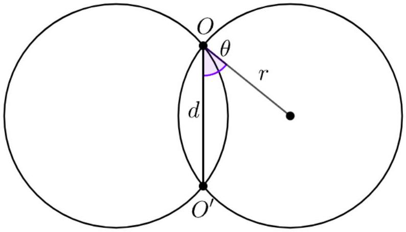
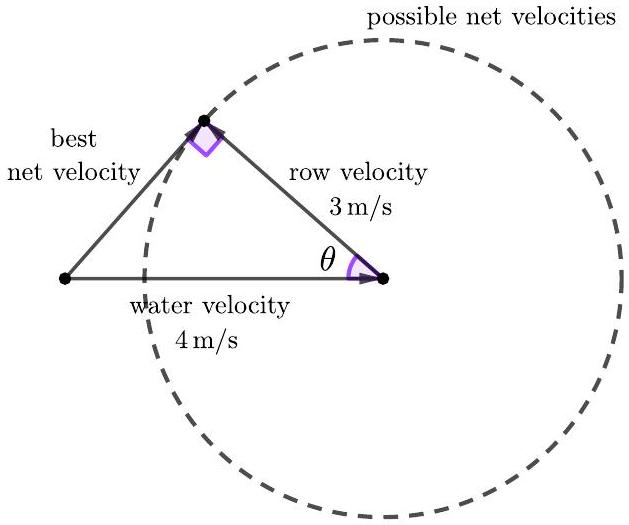
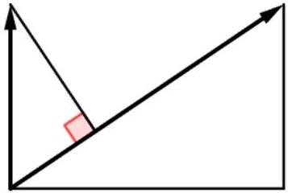

## Mechanics I: Kinematics

See chapters 3 and 4 of Morin for material on solving differential equations. For general review on kinematics, see chapter 1 of Kleppner and Kolenkow. For fun, see chapters I-1 through I-8 of the Feynman lectures. There is a total of 92 points.

## 1 Motion in One Dimension

Example 1
When a projectile moves slowly through air, the drag is linear in the velocity, $F = - \alpha m v$. Find the velocity $v ( t )$ of a projectile thrown upward at time $t = 0$ with speed $v _ { 0 }$.

Solution
We write Newton's second law as

$$
\frac { d v } { d t } = - g - \alpha v
$$

and multiply through by $d t$. Integrating both sides from the initial condition to time $t _ { f }$ gives

$$
\int _ { v _ { 0 } } ^ { v \left( t _ { f } \right) } \frac { d v } { g + \alpha v } = - \int _ { 0 } ^ { t _ { f } } d t .
$$

Performing the integrals gives

$$
\left. \frac { 1 } { \alpha } \log ( g + \alpha v ) \right| _ { v _ { 0 } } ^ { v \left( t _ { f } \right) } = - t _ { f } .
$$

Renaming $t _ { f }$ to $t$ and solving for $v$ yields

$$
v ( t ) = e ^ { - \alpha t } v _ { 0 } + \frac { g } { \alpha } \left( e ^ { - \alpha t } - 1 \right) .
$$

This renaming is necessary because we don't want to confuse $t$, the dummy variable that we are integrating over, with $t _ { f }$, the time at which we want to evaluate the velocity; $t$ ranges from zero to $t _ { f }$. Unfortunately, often people just call both of these $t$, so you need to watch out.

[2] Problem 1. Let's investigate some features of this solution.
    (a) By using results from P1, verify that $v ( t )$ makes sense for both small times and large times.
    (b) If the projectile is then caught at the launch point, did it spend more time going up or down?
    (c) Without calculating, think for a moment and guess: is the total time longer or shorter than for a projectile without drag?

Solution. (a) For small times $( \alpha t \ll 1 )$, we have

$$
v ( t ) \approx ( 1 - \alpha t ) v _ { 0 } + \frac { g } { \alpha } ( - \alpha t ) = v _ { 0 } - \left( g + \alpha v _ { 0 } \right) t
$$

which makes sense, since it's just the result of uniform acceleration $g + \alpha v _ { 0 }$, under the initial net force. For large times $( \alpha t \gg 1 )$, the exponentials decay away and we get $v ( t ) \approx - g / \alpha$, which is the terminal velocity.
(b) For a fixed height, consider how fast the projectile is moving when it passes that point going up or down. Since the gravitational potential energy is the same, and the drag force does only negative work, it must be going slower on the way down. Since it's going slower at every point going down, the trip down has to take longer.
(c) It's not obvious, since the drag force makes the projectile turn around faster, but then slows it on the way down. It turns out that the total time is always shorter with linear drag.
In fact, this is quite difficult to guess, as the case of linear drag is precisely on the boundary between two possible answers. That is, if the drag force is proportional to $| v | ^ { n }$, then it turns out that the trajectory with drag always takes less time for $n \geq 1$, but for $n < 1$ it depends on the initial speed. (This makes intuitive sense, as when $n$ is high, the drag force rises quickly with speed. The speed will tend to be higher on the way up than the way down, so the effect of the drag force is more important on the upward part, where it points down.) You can find proofs of all these statements here.
[3] Problem 2. Now assume quadratic drag, $F = - \alpha m v ^ { 2 }$, which applies for fast-moving projectiles.
(a) Integrate Newton's second law to get an implicit equation for $v ( t )$ with the same initial conditions as above. That is, you don't need to solve for $v ( t )$, as it'll just make things messy.
(b) Your equation will only be valid when the projectile is going up; explain why.
(c) Find $v ( t )$ for an object released from rest at time $t = 0$. (Hint: if needed, look up some standard integrals involving hyperbolic trigonometric functions. But don't worry about memorizing the results, since in competitions, any nontrivial integral needed will usually be given to you.)
(d) Integrate your answer to part (c) with respect to time to find $y ( t )$, and verify that the answer makes sense at both small and large times.

Some people only call this quadratic case drag; they call the linear case viscous resistance. This is because they behave fundamentally differently at the microscopic level, as we will explore in M7.

Solution. (a) Newton's second law is

$$
\frac { d v } { d t } = - g - \alpha v ^ { 2 } .
$$

By the same reasoning as before, we find

$$
\int _ { v _ { 0 } } ^ { v ( t ) } \frac { d v ^ { \prime } } { g + \alpha v ^ { \prime 2 } } = - \int _ { 0 } ^ { t } d t ^ { \prime } = - t
$$

By nondimensionalizing the integral as described in P1, the left-hand side is

$$
- t = \frac { 1 } { \sqrt { \alpha g } } \int _ { v _ { 0 } \sqrt { \alpha / g } } ^ { v ( t ) \sqrt { \alpha / g } } \frac { d x } { 1 + x ^ { 2 } } = \frac { 1 } { \sqrt { \alpha g } } \left( \tan ^ { - 1 } \left( v ( t ) \sqrt { \frac { \alpha } { g } } \right) - \tan ^ { - 1 } \left( v _ { 0 } \sqrt { \frac { \alpha } { g } } \right) \right)
$$

where I pulled out a factor of $1 / \sqrt { \alpha g }$ to get the right overall dimensions, then used dimensional analysis again to convert the integration bounds to dimensionless numbers. (You can also do this by ordinary $u$-substitution if you prefer.) This is essentially the final result. It can be solved for $v ( t )$, but that just makes it look worse.

(b) The reason the equation only makes sense when the projectile is going up is that the force should always oppose the direction of motion, so we really wanted to solve $F = - m \alpha | v | v$. Equivalently, the sign of $\alpha$ changes when the direction of the velocity changes. This means our solution really should have two separate cases.
(c) By the same reasoning, we have
$$
\int _ { 0 } ^ { v ( t ) } \frac { d v ^ { \prime } } { g - \alpha v ^ { \prime 2 } } = - t
$$
where the changes are the initial condition and the sign of $\alpha$. The left-hand side is
$$
\frac { 1 } { \sqrt { \alpha g } } \int _ { 0 } ^ { v ( t ) \sqrt { \alpha / g } } \frac { d x } { 1 - x ^ { 2 } } = \frac { 1 } { \sqrt { \alpha g } } \left( \tanh ^ { - 1 } \left( v ( t ) \sqrt { \frac { \alpha } { g } } \right) \right) .
$$
If you don't know this hyperbolic trig integral, you could also derive it by expanding $1 / \left( 1 - x ^ { 2 } \right)$ in partial fractions and integrating each term. You will get a bunch of logarithms, which is equivalent to the hyperbolic tangent. However, if you don't know what the hyperbolic tangent is, you should look it up now, because such functions will be useful later!
Because of the simpler initial condition, we can get an explicit solution,
$$
v ( t ) = - \sqrt { \frac { g } { \alpha } } \tanh ( \sqrt { \alpha g } t ) .
$$
The speed approaches $\sqrt { g / \alpha }$ with a timescale $1 / \sqrt { \alpha g }$, a fact we could also have deduced by physical intuition and dimensional analysis. Actually, another way to arrive at this result is by just substituting $\alpha \rightarrow - \alpha$ in the answer for part (a)! This will produce the tangent of an imaginary number, which is in fact how the hyperbolic tangent is defined.
(d) Integrating with respect to time gives
$$
y ( t ) = - \frac { 1 } { \alpha } \log ( \cosh ( \sqrt { \alpha g } t ) ) .
$$
In the large $t$ limit, the cosh grows exponentially, so that
$$
y ( t ) \approx - \frac { 1 } { \alpha } \sqrt { \alpha g } t = - \sqrt { \frac { g } { \alpha } } t
$$
which is just motion at the terminal velocity. In the small $t$ limit, we can approximate
$$
y ( t ) \approx - \frac { 1 } { \alpha } \log \left( \frac { e ^ { \sqrt { \alpha g } t } + e ^ { - \sqrt { \alpha g } t } } { 2 } \right) \approx - \frac { 1 } { \alpha } \log \left( 1 + \alpha g t ^ { 2 } / 2 \right) \approx - \frac { g t ^ { 2 } } { 2 }
$$
as expected, as drag is negligible in this regime. And of course, when we say that $t$ is large or small, we really mean that $\sqrt { \alpha g } t \gg 1$ or $\sqrt { \alpha g } t \ll 1$ respectively.
[3] Problem 3. A projectile of mass $m$ is dropped from a height $h$ above the ground. It falls and bounces elastically, experiencing the same quadratic drag as in problem 2. Find the maximum height to which it subsequently rises. (Hint: don't try to use your results from problem 2.)

Solution. The reason you shouldn't try to use the results from problem 2 is that they are in terms of time. Given how complicated the implicit expressions for $v ( t )$ are, the expressions for $x ( t )$ would be extremely clunky. And they're not necessary, because in this problem we don't care about the time-dependence at all; we just want to know the final height.

Another way to say this is that we aren't interested in $v ( t )$, we're interested in $v ( x )$. While the projectile is moving downward, we can integrate $d v / d x$ to find the speed $v _ { 0 }$ at the moment it hits the ground. Then, when it's moving upward, we integrate $d v / d x$ until it has zero speed again, which is its final height. This will be a lot simpler than integrating $d v / d t$.

For the upward and downward trajectories, Newton's second law says

$$
\frac { d v } { d t } = - g \pm \alpha v ^ { 2 }
$$

and multiplying both sides by $d t / d x$ gives

$$
\frac { d v } { d x } = - \frac { g } { v } \pm \alpha v .
$$

Separating and integrating, on the way down we have

$$
\int _ { h } ^ { 0 } d x = \int _ { 0 } ^ { - v _ { 0 } } \frac { d v } { \alpha v - g / v } = \frac { 1 } { \alpha } \int _ { 0 } ^ { - v _ { 0 } } \frac { v d v } { v ^ { 2 } - g / \alpha } .
$$

Carrying out the integral and simplifying,

$$
h = - \frac { 1 } { 2 \alpha } \log \left( 1 - \alpha v _ { 0 } ^ { 2 } / g \right) .
$$

Now, on the way up, we have

$$
\int _ { 0 } ^ { h ^ { \prime } } d x = \int _ { v _ { 0 } } ^ { 0 } \frac { d v } { - g / v - \alpha v } = \frac { 1 } { \alpha } \int _ { 0 } ^ { v _ { 0 } } \frac { v d v } { v ^ { 2 } + g / \alpha }
$$

and carrying out the integral gives

$$
h ^ { \prime } = \frac { 1 } { 2 \alpha } \log \left( 1 + \alpha v _ { 0 } ^ { 2 } / g \right) .
$$

Combining the two equations gives

$$
h ^ { \prime } = \frac { 1 } { 2 \alpha } \log \left( 2 - e ^ { - 2 \alpha h } \right)
$$

which you can check has the right limits. Note that $g$ drops out, as required by dimensional analysis.
Remark
How does the top speed $v$ of a rowboat depend on the number $N$ of rowers? A light, fastmoving rowboat experiences quadratic friction, so that the drag force on it is proportional to $v ^ { 2 } A$, where $A$ is the submerged cross-sectional area of the boat. A boat designed for $N$ rowers will have a submerged volume $V \propto N$, and a streamlined shape so that $A \propto V ^ { 2 / 3 }$. Thus, the required power input is

$$
P = F v \propto v ^ { 3 } N ^ { 2 / 3 } .
$$

The power output by the rowers scales as $N$, and combining these results gives the amazingly weak dependence $v \propto N ^ { 1 / 9 }$, which agrees decently with Olympic rowing times. This estimate is from the fun book 100 Essential Things You Didn't Know About Sport by Barrow.

## Idea 1

An ordinary differential equation is any equation involving a quantity $x ( t )$ and its derivatives. In physics, we are usually concerned with differential equations which are at most secondorder, meaning it can contain $x$, its first derivative $\dot { x } = v$, and its second derivative $\ddot { x } = a$, but no higher derivatives. This implies the solution can be determined by an initial position and initial velocity. (First-order differential equations require only an initial position, and can often be solved by separation and integration.)

Here we will also focus on the case where the differential equation is also linear and homogeneous, meaning that each term is directly proportional to $x , \dot { x }$, or $\ddot { x }$. For example, a damped driven harmonic oscillator is described by

$$
m \ddot { x } = - b \dot { x } - k x .
$$

Solutions to such differential equations obey the superposition principle: if $x _ { 1 } ( t )$ and $x _ { 2 } ( t )$ are both solutions, so is $c _ { 1 } x _ { 1 } ( t ) + c _ { 2 } x _ { 2 } ( t )$. The superposition principle still applies if the coefficients $m , b$, and $k$ depend on time, but we'll focus on the time-translation invariant case.

If we added a driving force $f ( t )$ to the above equation, the differential equation would no longer be homogeneous. We'll discuss this case further in M4.

## Idea 2

Linear, homogeneous, time-translation invariant differential equations can all be solved by one method. First, note that we can promote $x ( t )$ to a complex variable $\tilde { x } ( t )$ and solve the differential equation over the complex numbers. As long as we have a complex solution, we can recover a real solution by taking the real part. We then guess a complex exponential

$$
\tilde { x } ( t ) = e ^ { i \omega t } .
$$

Plugging this into the differential equation will yield the allowed values of $\omega$, and the general solution can be found by superposing the complex exponentials. This works for almost all such equations; you'll handle the rest in problem 7.

## Example 2

Solve the simple harmonic oscillator, $m \ddot { x } + k x = 0$, using the above principles.

## Solution

First, we pass to a complex differential equation,

$$
m \ddot { \tilde { x } } + k \tilde { x } = 0 .
$$

We guess $\tilde { x } ( t ) = e ^ { i \omega t }$. Plugging this in and using the chain rule gives

$$
m ( i \omega ) ^ { 2 } e ^ { i \omega t } + k e ^ { i \omega t } = 0
$$

and canceling $e ^ { i \omega t }$ and solving gives two solutions,

$$
\omega = \pm \omega _ { 0 } , \quad \omega _ { 0 } = \sqrt { k / m } .
$$

Since this is a second-order linear differential equation, the general solution is given by the superposition of these two complex exponentials,

$$
\tilde { x } ( t ) = A e ^ { i \omega _ { 0 } t } + B e ^ { - i \omega _ { 0 } t }
$$

where $A$ and $B$ are general complex numbers. The real part of $\tilde { x } ( t )$ satisfies the original real differential equation $m a + k x = 0$, and is

$$
\operatorname { Re } \tilde { x } ( t ) = C \cos \left( \omega _ { 0 } t \right) + D \sin \left( \omega _ { 0 } t \right)
$$

where $C$ and $D$ are real numbers, i.e. a general sinusoid with angular frequency $\omega _ { 0 }$.
[1] Problem 4. Find $C$ and $D$ in terms of $A$ and $B$.
Solution. Let $A = a _ { A } + i b _ { A }$ and $B = a _ { B } + i b _ { B }$ where $a _ { i } , b _ { i }$ are real. Applying Euler's formula,

$$
\operatorname { Re } \tilde { x } ( t ) = \left( a _ { A } + a _ { B } \right) \cos \left( \omega _ { 0 } t \right) + \left( - b _ { A } + b _ { B } \right) \sin \left( \omega _ { 0 } t \right)
$$

from which we read off

$$
C = \operatorname { Re } ( A + B ) , \quad D = \operatorname { Im } ( B - A ) .
$$

[2] Problem 5. Now introduce a damping force and solve the differential equation for the damped harmonic oscillator, $m \ddot { x } + b \dot { x } + k x = 0$, using the same procedure, assuming $b$ is small. (See section 4.3 of Morin if you have trouble with this. We'll consider this system in more detail in M4.)

Solution. Guessing an exponential, every time derivative yields a factor of $i \omega$, so

$$
m ( i \omega ) ^ { 2 } + b ( i \omega ) + k = 0 .
$$

Using the quadratic formula,

$$
\omega = \frac { - i b \pm \sqrt { 4 k m - b ^ { 2 } } } { - 2 m } .
$$

In other words, we have

$$
\omega = \pm \omega _ { d } + \frac { i b } { 2 m } , \quad \omega _ { d } = \sqrt { \frac { k } { m } - \frac { b ^ { 2 } } { 4 m ^ { 2 } } } .
$$

The oscillation is slightly slowed down, and the frequency has an imaginary part, corresponding to exponential decay. The general solution is

$$
x ( t ) = e ^ { - b t / ( 2 m ) } \left( C \cos \left( \omega _ { d } t \right) + D \sin \left( \omega _ { d } t \right) \right) .
$$

[3] Problem 6. USAPhO 2012, problem B1.

[3] Problem 7. Above, we mentioned that guessing an exponential works almost all the time. The reason is because at the end of the day, the exponential cancels out and we're left with a polynomial in $\omega$, which has just the right number of roots. But if there are repeated roots, there are fewer distinct solutions for $\omega$, and hence not enough solutions.
    (a) Write down a second order differential equation with a double root $\omega$, and find its general solution. (Hint: to help find a good guess, consider the simple case $d ^ { 2 } x / d t ^ { 2 } = 0$, where $\omega = 0$ is the double root. Then generalize your guess to nonzero $\omega$ and check that it works.)
    (b) You should find that the solution qualitatively changes when you have an exact double root. However, in the limit where we have two roots that are very close together, $\omega \pm \Delta \omega$ with $\Delta \omega \ll \omega$, we should get approximately the same solution. Explicitly show how this works. When would you prefer to use either one?
    (c) [A] Consider the most general $n ^ { \text {th } }$ order, linear homogeneous time-translation invariant differential equation
$$
\left( a _ { n } \frac { d ^ { n } } { d t ^ { n } } + a _ { n - 1 } \frac { d ^ { n - 1 } } { d t ^ { n - 1 } } + \ldots + a _ { 1 } \frac { d } { d t } + a _ { 0 } \right) x = 0 .
$$
What does the general solution look like?

Solution. (a) In the case of a double root $\omega = 0$, the differential equation is $d ^ { 2 } x / d t ^ { 2 } = 0$. The solution we get by guessing an exponential is $x ( t ) = e ^ { i ( 0 ) t } = 1$, which is a constant. The other solution is linear, $x ( t ) = t e ^ { i ( 0 ) t } = t$.
This leads us to guess that for a double root $\omega$, the two independent solutions are $e ^ { i \omega t }$ and $t e ^ { i \omega t }$. In other words, we guess that the differential equation

$$
\frac { d ^ { 2 } x } { d t ^ { 2 } } - 2 i \omega \frac { d x } { d t } - \omega ^ { 2 } x = 0
$$

has the general solution

$$
x ( t ) = ( A + B t ) e ^ { i \omega t } .
$$

Plugging this in shows that it indeed works.

(b) For two close but distinct roots, the general solution is
$$
x ( t ) = C e ^ { i ( \omega + \Delta \omega ) t } + D e ^ { i ( \omega - \Delta \omega ) t }
$$
which superficially looks very different from the answer to part (a). However, note that
$$
x ( t ) = e ^ { i \omega t } \left( C e ^ { i \Delta \omega t } + D e ^ { - i \Delta \omega t } \right) = e ^ { i \omega t } ( ( C + D ) \cos ( \Delta \omega t ) + i ( C - D ) \sin ( \Delta \omega t ) ) .
$$
For short times, $\Delta \omega t \ll 1$, we have $\cos ( \Delta \omega t ) \approx 1$ and $\sin ( \Delta \omega t ) \approx \Delta \omega t$, up to quadratic and higher terms, so
$$
x ( t ) \approx e ^ { i \omega t } ( ( C + D ) + i ( C - D ) \Delta \omega t )
$$
from which we can identify
$$
A \leftrightarrow C + D , \quad B \leftrightarrow i ( C - D ) \Delta \omega .
$$
Intuitively, the $B t$ term comes from superposing two complex exponentials with opposite sign. Initially, they just cancel out, but over time the difference builds up, leading to an oscillation

with a linearly growing amplitude. (You can see this kind of envelope behavior in two weakly coupled pendulums, a system which has two nearby oscillation frequencies. We'll return to this subject in M4.) Of course, once you get to the point $\Delta \omega t \sim 1$, the two solutions will start to noticeably differ. The envelope of the oscillation in part (b) will start decreasing, while that of part (a) will keep growing forever.
So, which solution should we actually use? Math courses teach that the solution of part (a) should be used if and only if the roots are exactly equal. But in real physical systems, no two things are ever exactly equal. But does that mean the solution of part (a) should never be used in practice? Of course not!
Instead, as physicists, we should use the description that's more useful in a given context. If $\Delta \omega \ll \omega$, and we're only measuring for a short time $\Delta \omega t \ll 1$, then the solution in part (a) is intuitive and approximately right. We can read off what the motion looks like directly from the parameters $A$ and $B$. On the other hand, the "exact" description using $C$ and $D$ is clunky: to get a reasonable value of $B$ (without a huge value of $A$ ), we would need to tune $C$ and $D$ to be both huge, but almost exactly opposite each other. Then $x ( t )$ would have to be computed by adding two terms that almost cancel out, which is both less intuitive and less numerically accurate. So in this case we would prefer using the description in terms of $A$ and $B$, though of course, if we wanted a result valid for $\Delta \omega t \gtrsim 1$, we would have to use $C$ and $D$.
(c) Guessing $e ^ { i \omega t }$ gives
$$
a _ { n } ( i \omega ) ^ { n } + a _ { n - 1 } ( i \omega ) ^ { n - 1 } + \ldots + a _ { 0 } = 0 .
$$
In the case where the roots are distinct, there are $n$ possible values for $\omega$, and hence $n$ parameters in our trial solution,
$$
x ( t ) = \sum _ { i = 1 } ^ { n } A _ { i } e ^ { i \omega _ { i } t } .
$$
Since the differential equation has order $n$, there are $n$ parameters needed to specify the solution, so this is the general solution. If $\omega _ { i }$ is a double root, then both $e ^ { i \omega _ { i } t }$ and $t e ^ { i \omega _ { i } t }$ are solutions. For a triple root, $t ^ { 2 } e ^ { i \omega _ { i } t }$ is also a solution, and so on.

## Remark

You might be wondering how to solve more general differential equations. In M4, we will consider three extensions of the above techniques. We'll use the idea of normal modes to solve systems of such differential equations, add driving forces to make the equations inhomogeneous, and use the adiabatic theorem to approximately solve non-time-translationinvariant equations where the coefficients change slowly in time.

Of course, this just scratches the surface of the subject, and solving more general differential equations can be orders of magnitude harder. We won't try to solve nonlinear differential equations, as there is no general technique for doing so, and the answer is often an obscure special function. (However, such equations will occasionally appear in later problems.) On the other hand, linear differential equations with general time-dependence are more approachable, and the following problem illustrates the most basic method for solving them.

[3] Problem 8. [A] Some linear, homogeneous, non-time-translation-invariant differential equations can be solved by simply guessing a power series. For this problem, don't worry about dimensional analysis; assume all variables have already been redefined to be dimensionless.

(a) As a warmup, consider the differential equation $\dot { x } = k x$ for constant $k$, which we already know how to solve. By plugging in the ansatz
$$
x ( t ) = \sum _ { n = 0 } ^ { \infty } a _ { n } t ^ { n }
$$
with unknown constant coefficients $a _ { n }$, find the solution with $x ( 0 ) = 1$.
(b) Now consider the non-time-translation-invariant differential equation
$$
t ^ { 2 } \ddot { x } + t \dot { x } + t ^ { 2 } x = 0
$$
which is called Bessel's differential equation of order zero. By using the same ansatz, find the unique solution with $x ( 0 ) = 1$ and $\dot { x } ( 0 ) = 0$.

Solution. (a) Plugging the ansatz in gives

$$
\sum _ { n = 0 } ^ { \infty } n a _ { n } t ^ { n - 1 } = k \sum _ { n = 0 } ^ { \infty } a _ { n } t ^ { n } .
$$

Shifting the sum on the left-hand side, we have

$$
\sum _ { n = 0 } ^ { \infty } \left( k a _ { n } - ( n + 1 ) a _ { n + 1 } \right) t ^ { n } = 0 .
$$

For this quantity to be zero for all $t$, each term in the sum must individually be zero, so

$$
a _ { n + 1 } = \frac { k } { n + 1 } a _ { n } .
$$

The initial condition $x ( 0 ) = 1$ tells us that $a _ { 0 } = 1$, from which we conclude

$$
a _ { 1 } = k , \quad a _ { 2 } = \frac { k ^ { 2 } } { 2 } , \quad a _ { 3 } = \frac { k ^ { 3 } } { 6 } , \ldots
$$

or more generally,

$$
x ( t ) = \sum _ { n = 0 } ^ { \infty } \frac { k ^ { n } } { n ! } t ^ { n } = e ^ { k t }
$$

which is just as expected.

(b) Plugging the ansatz in gives
$$
\sum _ { n = 0 } ^ { \infty } \left( n ( n - 1 ) a _ { n } t ^ { n } + n a _ { n } t ^ { n } + a _ { n } t ^ { n + 2 } \right) = 0 .
$$
Simplifying and shifting the sum as in part (a) gives
$$
\sum _ { n = 0 } ^ { \infty } n ^ { 2 } a _ { n } t ^ { n } + \sum _ { n = 2 } ^ { \infty } a _ { n - 2 } t ^ { n } = 0 .
$$
The $n = 0$ equation is automatic, while the $n = 1$ equation gives $a _ { 1 } = 0$, consistent with the initial condition $\dot { x } ( 0 ) = 0$. For $n \geq 2$, we have the recursion relation $a _ { n } = - a _ { n - 2 } / n ^ { 2 }$. The

remaining initial condition gives $a _ { 0 } = 1$, from which we conclude the $a _ { 2 n + 1 }$ are all zero. We then have

$$
a _ { 2 } = - \frac { 1 } { 2 ^ { 2 } } , \quad a _ { 4 } = \frac { 1 } { 2 ^ { 2 } 4 ^ { 2 } } , \quad a _ { 6 } = - \frac { 1 } { 2 ^ { 2 } 4 ^ { 2 } 6 ^ { 2 } } , \ldots
$$

from which we conclude

$$
x ( t ) = \sum _ { m = 0 } ^ { \infty } \frac { ( - 1 ) ^ { m } } { ( m ! ) ^ { 2 } } \left( \frac { t } { 2 } \right) ^ { 2 m } .
$$

This function is known as the Bessel function of the first kind, of zeroth order, $J _ { 0 } ( t )$.

## 2 Tricks

In this section we'll consider some kinematics problems that require cleverness, not computation.
Idea 3
Many problems can be solved by a clever choice of reference frame. It is often useful to go to the frame moving with one of the objects in the problem, or to go into a frame that makes the motion in the problem more symmetric. For the purposes of kinematics it can even be useful to use noninertial reference frames, such as a falling frame where projectiles don't accelerate, or a rotating frame, though this will introduce fictitious forces into the dynamics. It is also useful to tilt the coordinate axes to be parallel to various objects.

Example 3: $F = m a 2022$ B4
A firework explodes, sending shells in all directions. Suppose the shells are all launched with the same speed, and ignore air resistance, but not gravity. What shape do the shells make?

Solution
In the absence of gravity, the shells would always form a sphere. Adding gravity simply shifts all of their locations downward by $g t ^ { 2 } / 2$, so the shape is still always a sphere.
[1] Problem 9 (KoMaL 2019). A cannon A is at the edge of a cliff with a 800 m drop. Cannon B is on the ground below the cliff and 600 m horizontally away from it. Cannon A shoots a cannonball directly towards cannon B at 60 m/s. Cannon B shoots a cannonball directly towards cannon A at 40 m/s. Will the two cannonballs hit each other in midair?

Solution. Work in the frame freely falling with the cannonballs. In this case, the balls have a relative velocity of 100 m/s and initial separation of 1000 m, so it takes 10 s to collide. If there were no gravity, this collision would occur at a point $( 2 / 5 ) ( 800 \mathrm {~m} ) = 320 \mathrm {~m}$ above the ground. However, because of gravity both balls have fallen by an extra $g t ^ { 2 } / 2 = 500 \mathrm {~m}$ by this time. Hence the balls hit the ground before they can hit each other in midair.
[2] Problem 10 (Wang). Two particles are released in gravitational acceleration $g$ with leftward and rightward speeds $v _ { 1 }$ and $v _ { 2 }$. Find the distance between them when their velocities are perpendicular.

Solution. After time $t$, the velocity vectors are $\left( - v _ { 1 } , - g t \right)$ and $\left( v _ { 2 } , - g t \right)$. These are perpendicular when the dot product is zero, so $v _ { 1 } v _ { 2 } = ( g t ) ^ { 2 }$, which you can also show with basic geometry. Thus,

$$
t = \frac { \sqrt { v _ { 1 } v _ { 2 } } } { g } .
$$

To compute the distance, we can just work in the frame falling with the masses. Then it's clear that the acceleration $g$ doesn't matter, and the distance is just

$$
d = \left( v _ { 1 } + v _ { 2 } \right) t = \frac { \left( v _ { 1 } + v _ { 2 } \right) \sqrt { v _ { 1 } v _ { 2 } } } { g } .
$$

[3] Problem 11 (Kalda). Two intersecting circles of radius $r$ have centers a distance $a$ apart. If one circle moves towards the other with speed $v$, what is the speed of one of the points of intersection?

Solution. Work in the frame where the circles are moving towards each other with speed $v / 2$. Then by the Pythagorean theorem, the speed of the point of intersection is

$$
\left| \frac { d } { d t } \sqrt { r ^ { 2 } - ( a / 2 ) ^ { 2 } } \right| = \frac { a v } { 4 \sqrt { r ^ { 2 } - a ^ { 2 } / 4 } }
$$

where we used $d a / d t = - v$. However, we're not done yet, because the speed of the point of intersection depends on the frame; we need to go back to the original frame. Using the Pythagorean theorem again, the answer is

$$
\sqrt { \left( \frac { a v } { 4 \sqrt { r ^ { 2 } - a ^ { 2 } / 4 } } \right) ^ { 2 } + \left( \frac { v } { 2 } \right) ^ { 2 } } = \frac { v } { 2 } \frac { 1 } { \sqrt { 1 - ( a / 2 r ) ^ { 2 } } } .
$$

[2] Problem 12 (Kalda). A mirror rotates about an axis passing through it, with angular speed $\omega$. A stationary point source of light sits at a distance $a$ from the rotation axis. What is the speed of its mirror image?

Solution. Work in the frame rotating with the mirror. Because the image is always flipped across the mirror with respect to the source, since the source rotates with angular velocity $- \omega$, the image rotates with angular velocity $\omega$. Then the relative angular velocity of the source and image is $2 \omega$, which holds in all frames. Thus, in the original frame the image has angular velocity $2 \omega$ and speed $2 \omega a$.
[2] Problem 13 (Kalda). Two circles of radius $r$ intersect at the point $O$. One of the circles rotates about the point $O$ with constant angular speed $\omega$. The other point of intersection $O ^ { \prime }$ is originally a distance $d$ from $O$. Find the speed of $O ^ { \prime }$ as a function of time.

Solution. Remarkably, the answer does not depend on the time! Let $d$ be the distance between the points of intersection, and work in the rotating frame where the circles rotate with angular velocities $\omega / 2$ and $- \omega / 2$ about $O$.

Since $\dot { \theta } = \omega / 2$ and $\cos \theta = d / 2 r$, we have

$$
- \frac { \omega } { 2 } \sin \theta = \frac { \dot { d } } { 2 r } , \quad \dot { d } = - r \omega \sin \theta .
$$

This is the vertical velocity of $O ^ { \prime }$. Now we need to go back to the original frame, which involves rotating with angular velocity $\omega / 2$ about $O$. Then $O ^ { \prime }$ picks up a horizontal velocity of $( 2 r \cos \theta ) ( \omega / 2 )$ for a total speed of

$$
v = \sqrt { r ^ { 2 } \omega ^ { 2 } \sin ^ { 2 } \theta + r ^ { 2 } \omega ^ { 2 } \cos ^ { 2 } \theta } = r \omega
$$

which is constant. The geometrical reason is that the second intersection point rotates around the nonrotating circle with uniform angular velocity $\omega$, as you can show by some angle chasing.

Idea 4
It can be useful to think about the motion from a different perspective. For example, you can work in "velocity space", i.e. directly think about how the velocity vector evolves over time, or the set of possible velocity vectors. You can also think in "spacetime", i.e. visualize the process on a space where time is one of the axes.

[2] Problem 14 (PPP 3). A boat can travel at a speed of 3 m/s on still water. A boatman wants to cross a river while covering the shortest possible distance.
    (a) In what direction should he row if the speed of the water is 2 m/s?
    (b) How about if it is 4 m/s?

Solution. (a) The boatman can completely cancel out the horizontal velocity of the water. He should row an angle $\cos ^ { - 1 } ( 2 / 3 )$ from the upstream direction, so that the boat moves directly across the river.

(b) The boatman cannot cancel out the horizontal velocity. Instead, the set of possible velocities forms a circle in velocity space, as shown. (I thank Stefan Ivanov for providing this figure.)

By taking the velocity with the angle closest to directly across the river, we see the boatman should row an angle $\cos ^ { - 1 } ( 3 / 4 )$ from the upstream direction.

Idea 5
In problems with friction, the best reference frame to use is almost always the frame of whatever is causing the friction.

[2] Problem 15 (Kalda). A block is pushed onto a conveyor belt. The belt is moving with speed $1 \mathrm {~m} / \mathrm { s }$, and the block's initial speed is $2 \mathrm {~m} / \mathrm { s }$, with initial velocity perpendicular to that of the belt. During the subsequent motion, what is the minimum speed of the block with respect to the ground?
Solution. Work in the frame of the belt. In this frame, the initial velocity of the ground and block are shown as arrows below.

Friction causes the block's velocity to shrink to zero in this frame. The block has the minimal relative speed with the ground when the tips of the two vectors are as close as possible, which is when they form the right triangle shown above. Using similar triangles, the relative speed at this point is $( 2 / \sqrt { 5 } ) \mathrm { m } / \mathrm { s }$.
[2] Problem 16 (Kalda). A boy enters a patch of ice with a coefficient of friction $\mu$ with speed $v$. By running on the ice, the boy turns his velocity vector by 90° in the minimum possible time, so that his final speed is also $v$. What is the minimum possible time, and what kind of curve is the trajectory? Assume the normal force with the ice is constant.
Solution. If you have a given initial and final position, and want to go between them with a fixed speed in the shortest possible time, then you should move in a straight line, i.e. have a velocity with constant direction. Similarly, if you have a given initial and final velocity, then the fastest way to go between them with a fixed magnitude of acceleration is to have an acceleration with constant direction. This is an example of reasoning in "velocity space", which is useful for many problems.
The acceleration has magnitude $\mu g$, and the change in velocity has magnitude $\sqrt { 2 } v$. Thus, $t = \sqrt { 2 } v / \mu g$. Since the acceleration vector is constant, the trajectory is a parabola.
There are many other "optimal turning" problems. For a much tougher relative of this problem, see Physics Cup 2022, problem 2, and for an explanation of the general theory, see this paper.
[2] Problem 17 (PPP 5). Four snails travel with constant velocity on a plane. The velocities are chosen so that three snails never meet at once, and no two of the velocities are equal. Since time $t = - \infty$, five of the $\binom { 4 } { 2 }$ possible encounters have already occurred. Must the sixth also occur?
Solution. It's a bit tricky to visualize what's going on in the plane; instead think about what's going on in spacetime. The spacetime here is three-dimensional, and the paths of the snails are lines through it, called worldlines; two snails will encounter each other if their worldlines intersect. For some set of three of the snails, all three possible encounters occur; moreover, the problem states that they cannot all meet at once. Thus, their worldlines must lie on a plane in spacetime.
Now consider the fourth snail's worldline. If it doesn't lie in this plane, then it can only intersect at most one of the other three, because three snails never meet at once. We know at least five encounters occur, so this can't be the case. Thus, the fourth snail's worldline has to lie in the plane. Finally, since no two of the velocities are equal, this worldline isn't parallel to any of the other

three, so it has to intersect all three, giving six collisions. So if five collisions occur, under the given conditions, then a sixth must also occur.
[2] Problem 18. Six bugs are placed at the vertices of a regular hexagon with side length $s$. At time $t = 0$ each bug starts moving directly towards the next with speed $v$. At what time do they collide?

Solution. By symmetry, the bugs always remain in a hexagon shape, but this hexagon rotates and shrinks. We want to know the time when it collapses completely.

We can first do this by considering how the distance between adjacent bugs changes in an infinitesimal time $d t$. The first bug moves a distance $v d t$ towards the second. The second moves a distance $( \sqrt { 3 } / 2 ) v d t$ to the side, and a distance $( v / 2 ) d t$ directly away from the first. The side-to-side motion doesn't contribute to the change in distance (one can use the Pythagorean theorem and binomial theorem to show it is second order, and hence negligible for infinitesimals), so we ignore it. Then the rate of change of distance between the bugs is just $v - v / 2 = v / 2$, so the bugs meet at $t = 2 s / v$.

Another method is to note that all the bugs meet in the center of the original hexagon, so we can consider the component of velocity for each bug directed towards the center. This is always $v / 2$ by the hexagonal symmetry, and the original distance from the center is $s$, so the bugs again meet in time $t = 2 s / v$.

It's trivial to generalize this problem to a regular $n$-gon. For a trickier twist, see Physics Cup 2025, problem 2.

Example 4
A rabbit begins at the origin, and the fox begins at the point $( 0 , - a )$. The rabbit begins running east, with a constant speed $v \hat { \mathbf { x } }$. At the same time, the fox begins chasing the rabbit, always moving towards it with speed $v$. After a long time, the rabbit and fox simply follow each other in a straight line, with a constant separation $d$. What is $d$ ?

Solution
This is the simplest example of a pursuit problem. Physicists and mathematicians have been posing them for centuries, though most are too mathematically involved for Olympiads.

Here, the trick to realize that if the displacement between the rabbit and fox is $\mathbf { r } ( t ) =$ $( x ( t ) , y ( t ) )$, then the quantity $r + x$ is conserved. To see this, let $\theta$ be the angle between the rabbit and fox's velocity vectors. Then

$$
\frac { d r } { d t } = - v + v \cos \theta
$$

because of the fox's chasing and rabbit's motion, and

$$
\frac { d x } { d t } = v - v \cos \theta
$$

because of the rabbit's motion and fox's chasing. Then $r + x$ is constant. Initially $r + x =$ $a + 0 = a$, and after a long time $r = x = d$, so the final separation is $d = a / 2$.
[2] Problem 19. Suppose the fox in the above example instead has speed $u > v$. How long does it take to catch the rabbit?

Solution. We can simply modify the logic of the example. Now the equations of motion are

$$
\frac { d r } { d t } = - u + v \cos \theta , \quad \frac { d x } { d t } = v - u \cos \theta .
$$

Combining these equations, we can cancel out $\theta$ to get

$$
u \frac { d r } { d t } + v \frac { d x } { d t } = v ^ { 2 } - u ^ { 2 } .
$$

This can now easily be integrated between the initial and final times. During this time, the change in $r$ is $- a$, while the change in $x$ is zero, so

$$
- a u = \left( v ^ { 2 } - u ^ { 2 } \right) t , \quad t = \frac { u a } { u ^ { 2 } - v ^ { 2 } } .
$$

This is much easier than solving for the full trajectory; if you're curious what it looks like, you can find it in this paper, which was written by a past coach of the U.S. Physics Team.

[2] Problem 20 (PPP 85). A child is at rest on an icy hill, which may be modeled as an inclined plane.

The coefficient of friction $\mu _ { k } = \mu _ { s }$ is such that if the child gets the tiniest push, she will begin sliding down the plane. Now suppose the child gets a horizontal push, with initial speed $v _ { 0 }$. What is the child's final speed?
Solution. This is identical to example 4. Specifically, the displacement between the rabbit and fox there corresponds to the velocity of the child here. At every increment of time $d t$, the velocity changes in two ways: it shrinks along its direction by $\mu g \cos \theta d t$ due to friction (corresponding to the fox) and it gains a component $g \sin \theta d t$ in a fixed direction due to gravity (corresponding to the rabbit). Furthermore, the problem statement implies the coefficient of friction is just enough to prevent sliding from rest, so that $\mu = \tan \theta$ and these two magnitudes are equal. Thus, the problem is exactly analogous to example 4 (with an extra time derivative) and the answer is $v _ { 0 } / 2$.
Again, it's possible to solve for the full trajectory, but it's quite difficult and messy. You can find the full result in this paper.
[4] Problem 21. EuPhO 2023, problem 2. (Warning: compared to most EuPhO problems, the algebra will be uncharacteristically messy.)

## 3 Motion in Two Dimensions

Idea 6
Often, motion in two dimensions can be treated as two independent one-dimensional problems. A change of reference frame may be necessary first.

Idea 7
In problems involving an inclined plane, don't draw the inclination angle $\theta$ near 45°, because it will be easy to confuse the angles $\theta$ and $90 ^ { \circ } - \theta$.

Example 5
Consider projectile motion where wind provides a constant horizontal force $F$. At what angle should a projectile of mass $m$ be launched in order to return to the thrower?

Solution
The horizontal force acts like an effective horizontal gravitational acceleration of $F / m$, so that gravity is effectively tilted an angle $\tan ^ { - 1 } ( F / m g )$ away from the vertical. One must launch the projectile directly "upward" with respect to this effective gravitational field, so the launch angle is an angle $\tan ^ { - 1 } ( F / m g )$ from the vertical, pointed into the wind.

For a related problem, see the infamous $F = m a 2014$ problem 19.

Example 6: $F = m a 2022$ A 23
For projectiles, the force of air resistance can be modeled as proportional to the speed ("linear drag") or proportional to the square of the speed ("quadratic drag"), depending on the circumstances. Two identical objects, $A$ and $B$, are dropped from the same height $h$ simultaneously, but object $A$ is given an initial horizontal velocity $v$. The objects hit the ground at times $t _ { A }$ and $t _ { B }$. How do these times compare, assuming linear or quadratic drag?

Solution
For linear drag, the horizontal and vertical components of the motion are independent,

$$
a _ { x } = - b v _ { x } , \quad a _ { y } = - g - b v _ { y }
$$

for some coefficient $b$. That means the time to hit the ground, which depends on the vertical motion, is independent of the initial horizontal velocity, so $t _ { A } = t _ { B }$. But for quadratic drag,

$$
a _ { y } = - g - b v _ { y } | v |
$$

which means the upward drag force is larger when the horizontal velocity is larger, so $t _ { A } > t _ { B }$.
Since the components are independent for linear drag, it's not too hard to write down an expression for the trajectory, by recycling the results of example 1. But for quadratic drag, the results of problem 2 won't help much; the two-dimensional problem is much harder.

[1] Problem 22 (Quarterfinal 2002). A cart is rigged with a vertical cannon so that, when the cart is stationary on a horizontal track, the cannonball is fired straight up and lands back in the cannon. In each of the following situations, does the cannonball land back in the cannon, in front of it, or behind it?
    (a) The cart is moving on a frictionless horizontal track with speed $v$.
    (b) The cart is accelerating down a frictionless inclined track with angle $\theta$.
    (c) The cart is accelerating down an inclined track with angle $\theta$, and friction slows it down.

Solution. (a) The motion in the $x$ and $y$ directions is independent. In the $x$ direction, both the cannonball and cart just continue moving with speed $v$, so the cannonball lands right back into the cannon.

(b) Work in the tilted frame where the $x$ axis is parallel to the track. In the $x$ direction, both the cannonball and cart start with the same speed and accelerate with the same acceleration $g \sin \theta$, so the cannonball lands right back into the cannon, again.
(c) In this case the cart accelerates less, so the cannonball lands in front.
[2] Problem 23 (Kalda). Two balls at points $A$ and $B$ are released from rest at the same moment, from the locations shown below. All surfaces are frictionless.

If it takes time $t _ { A }$ and $t _ { B }$ for the balls to hit the ground, at what time was the distance between the balls the smallest?
Solution. Both balls have a downward acceleration of $g \sin ^ { 2 } \alpha$, and they have leftward and rightward accelerations of $g ^ { \prime } = g \sin \alpha \cos \alpha$. Since the balls always have the same vertical speed, we can ignore the vertical motion entirely. The distance between the balls is thus smallest when their horizontal separation is zero.
Let the total horizontal distances the balls travel be $d _ { A }$ and $d _ { B }$. Then
$$
d _ { A } = \frac { 1 } { 2 } g ^ { \prime } t _ { A } ^ { 2 } , \quad d _ { B } = \frac { 1 } { 2 } g ^ { \prime } t _ { B } ^ { 2 }
$$
and we are looking for the time $t$ where
$$
\frac { d _ { A } - d _ { B } } { 2 } = \frac { 1 } { 2 } g ^ { \prime } t ^ { 2 } .
$$
Solving these equations for $t$ gives
$$
t = \sqrt { \frac { t _ { A } ^ { 2 } - t _ { B } ^ { 2 } } { 2 } } .
$$

[2] Problem 24 (Kalda). Two planar frictionless walls are placed at right angles, where wall $A$ makes an angle $\alpha$ to the horizontal. A perfectly elastic ball is released from rest at a point a distance $a$ from wall $A$ and $b$ from wall $B$.

After a long time, what is the ratio of the number of times the ball has bounced against wall $B$ to the number of times it has bounced against wall $A$ ?
Solution. In the coordinate system tilted by angle $\alpha$, the motions in the $x$ and $y$ directions are independent, because collisions with wall $A$ leave $v _ { x }$ unchanged and vice versa. In the $y$ direction, the ball simply bounces up and down with uniform acceleration $g \cos \alpha$ and bounce height $a$, so
$$
\Delta t _ { A } = 2 \sqrt { \frac { 2 a } { g \cos \alpha } } .
$$
By similar reasoning, in the $x$ direction
$$
\Delta t _ { B } = 2 \sqrt { \frac { 2 b } { g \sin \alpha } } .
$$
Thus the answer is
$$
\frac { \Delta t _ { A } } { \Delta t _ { B } } = \sqrt { \frac { a \sin \alpha } { b \cos \alpha } } .
$$
When this ratio is a rational number, the ball eventually returns to its starting point. If it isn't, it never does; instead it eventually explores all of the space permitted by energy conservation, i.e. it eventually passes arbitrarily close to any point in the rectangle $0 \leq x \leq b$ and $0 \leq y \leq a$.
[2] Problem 25. USAPhO 2004, problem A4.
[3] Problem 26 (NBPhO 2010). A sprinkler can be modeled as a small hemisphere on the ground. Water shoots out from the hemisphere in all directions, with speed $v$ perpendicular to the hemisphere.
    (a) Find the total surface area of ground watered by the sprinkler.
    (b) At what distance from the sprinkler does the ground get the wettest?

Solution. (a) The range of the sprinkler is maximized at 45° and is equal to $v ^ { 2 } / g$. Then the area is $\pi \left( v ^ { 2 } / g \right) ^ { 2 } = \pi v ^ { 4 } / g ^ { 2 }$.

(b) The outermost circle, at radius $v ^ { 2 } / g$, gets by far the wettest. This is because a maximum of radius is achieved here, so a large range of launch angles gets to near this radius. (It's the same reason that balls thrown upward spend the most time near the very top of their trajectories.)
This idea is a little tricky, but very general; for instance, it's the principle behind the formation of caustics such as rainbows, as we'll see in $\mathbf { W 3 }$. It is also the way in which classical mechanics

emerges from quantum mechanics: classically things follow the trajectory of least action because it's a caustic of the quantum sum over all trajectories. So if you continue in physics, you'll see this beautiful little idea over and over again, in richer and richer settings! For an Olympiad problem that gives a bit more detail about caustics in optics, see here.
[3] Problem 27. USAPhO 2023, problem A1. A neat exercise on collisions and projectile motion.
Example 7
A bug flies towards a light with constant speed $v$, always making an angle $\alpha$ with the radial direction. If the initial distance to the lamp is $L$ and the radius of the lamp is $R$, through what total angle does it turn before hitting the lamp?

Solution
In this case we can't avoid solving differential equations, but they're not too hard. It's easiest to work in polar coordinates, with the center of the lamp at the origin. By decomposing the velocity into radial and tangential components, we have

$$
\frac { d r } { d t } = - v \cos \alpha , \quad r \frac { d \theta } { d t } = v \sin \alpha
$$

We only care about the path, not the time-dependence, so we divide these equations to get

$$
\frac { d r } { d \theta } = - \frac { r } { \tan \alpha }
$$

where we manipulated differentials as in P1. Separating and integrating,

$$
- \int _ { L } ^ { R } \frac { d r } { r } = \frac { \Delta \theta } { \tan \alpha }
$$

which tells us that

$$
\Delta \theta = ( \tan \alpha ) \log \frac { L } { R } .
$$

The shape traced out is a logarithmic spiral.

[2] Problem 28. The pilot of a supersonic jet airplane wishes to make a big noise at the origin by flying around it in a path such that all of the noise he makes is heard simultaneously at the origin. The jet travels with Mach number $M > 1$, meaning that its speed is $M$ times the speed of sound. If the pilot starts at $( r , \theta ) = ( a , 0 )$, find the pilot's path $r ( \theta )$.
Solution. In order for the sound to reach the origin simultaneously, we must have $r ( t ) = a - c t$, so that the sound all reaches the origin at time $a / c$. On the other hand, we have
$$
( M c ) ^ { 2 } = \dot { r } ^ { 2 } + r ^ { 2 } \dot { \theta } ^ { 2 } = c ^ { 2 } + r ^ { 2 } \dot { \theta } ^ { 2 } .
$$
This is a bit messy because we have two functions of time, but we can eliminate time by using
$$
\dot { \theta } = \frac { d \theta } { d r } \frac { d r } { d t } = - c \frac { d \theta } { d r } .
$$

Plugging this in above, we have

$$
M ^ { 2 } - 1 = r ^ { 2 } \left( \frac { d \theta } { d r } \right) ^ { 2 }
$$

and separating and integrating gives

$$
\int _ { a } ^ { r } \frac { d r ^ { \prime } } { r ^ { \prime } } = \pm \int _ { 0 } ^ { \theta } \frac { d \theta ^ { \prime } } { \sqrt { M ^ { 2 } - 1 } } , \quad r ( \theta ) = a e ^ { \pm \theta / \sqrt { M ^ { 2 } - 1 } }
$$

The ± sign ambiguity above came from taking a square root, and physically means that the pilot can choose to fly clockwise or counterclockwise.

[4] Problem 29. Consider a mass $m$ on a table attached to a spring at the origin with zero relaxed length, which exerts the force
$$
\mathbf { F } = - k \mathbf { r }
$$
on the mass. We will find the general solution for $\mathbf { r } ( t ) = ( x ( t ) , y ( t ) )$ in two different ways.
    (a) Directly write down the answer, using the fact that the $x$ and $y$ coordinates are independent.
    (b) Sketch a representative sample of solutions. What kind of curve does the trajectory follow?
    (c) ★ Here's a more unusual way to arrive at the same answer. Go to a noninertial reference frame rotating with angular velocity $\omega _ { 0 }$ about the origin, so that the centrifugal force cancels out the spring force. In this frame, the only relevant force is the Coriolis force $- 2 m \boldsymbol { \omega } _ { 0 } \times \mathbf { v }$. Find the general solution in this frame, then transform back to the original frame and show that you get the same answer as in part (a). (This can get a bit messy; the easiest way is to treat the plane as the complex plane, i.e. work in terms of the variable $r = x + i y$.)

Solution. (a) We have a separate equation for each component,

$$
\frac { d ^ { 2 } x } { d t ^ { 2 } } = - \frac { k } { m } x , \quad \frac { d ^ { 2 } y } { d t ^ { 2 } } = - \frac { k } { m } y .
$$

Both describe a harmonic oscillator with angular frequency $\omega _ { 0 } = \sqrt { k / m }$. Then the general solution can be written as

$$
x ( t ) = A \cos \left( \omega _ { 0 } t + \phi _ { 1 } \right) , \quad y ( t ) = B \sin \left( \omega _ { 0 } t + \phi _ { 2 } \right) .
$$

In general, it is very rare for the $x$ and $y$ coordinates to be independent. Another example of this type is projectile motion in linear drag, $\mathbf { F } = - k \mathbf { v }$. In these cases the 2D or 3D problem is no harder than the 1D version, but we're rarely so lucky.

(b) In the case where $\phi _ { 1 } = \phi _ { 2 } = 0$ and $A = B$, the mass moves in a circle centered at the origin. More generally, when the angles $\phi _ { i }$ are unequal, the mass can move in an ellipse with center at the origin.
(c) The centrifugal force is $m \omega _ { 0 } ^ { 2 } \mathbf { r }$, so to cancel the spring force we need to choose $\omega _ { 0 } = \sqrt { k / m }$. Now, in the rotating frame, the Coriolis force acts just like a magnetic field: it's always perpendicular to the motion, so the solution is circular motion. The angular frequency $\omega _ { c }$ of that circular motion satisfies
$$
2 m \omega _ { 0 } v = \frac { m v ^ { 2 } } { r } = m \omega _ { c } v
$$

from which we conclude $\omega _ { c } = 2 \omega _ { 0 }$. So in complex notation,

$$
r ( t ) = r _ { 0 } + r _ { 1 } e ^ { 2 i \omega _ { 0 } t }
$$

in the rotating frame. We can return to the original frame by simply multiplying by $e ^ { - i \omega _ { 0 } t }$, to give

$$
r ( t ) = r _ { 0 } e ^ { - i \omega _ { 0 } t } + r _ { 1 } e ^ { i \omega _ { 0 } t } .
$$

Taking real and imaginary parts and letting $r _ { i } = a _ { i } + i b _ { i }$,

$$
x ( t ) = \left( a _ { 0 } + a _ { 1 } \right) \cos \left( \omega _ { 0 } t \right) + \left( b _ { 0 } - b _ { 1 } \right) \sin \left( \omega _ { 0 } t \right) , \quad y ( t ) = \left( b _ { 0 } + b _ { 1 } \right) \cos \left( \omega _ { 0 } t \right) + \left( a _ { 1 } - a _ { 0 } \right) \sin \left( \omega _ { 0 } t \right) .
$$

This is the same as our result for part (a), after you use the sine and cosine addition formulas and appropriately redefine the parameters. Evidently, elliptical motion is just the superposition of two opposite circular motions! (In general, complex numbers are a useful way to deal with magnetic or Coriolis forces for motion in a plane, where B or $\boldsymbol { \omega }$ points perpendicular to the plane. In these cases the force lies in the plane perpendicular to the velocity, so it's just proportional to $i \dot { r }$, which is nice and simple; we'll see this idea again later.)

## 4 Optimal Launching

Finally, we'll consider projectile motion questions that involve optimization. These are rare on the USAPhO, but they are quite fun problems, with occasionally very slick solutions.

Example 8
A bug wishes to jump over a cylindrical log of radius $R$ lying on the ground, so that it just grazes the top of the log horizontally as it passes by. What is the minimum launch speed $v$ required to do this?

Solution
Let $P$ be the point at the top of the log. For the bug to be moving horizontally at $P$, energy conservation applied to the vertical motion gives an initial $v _ { y }$ obeying

$$
\frac { 1 } { 2 } m v _ { y } ^ { 2 } = 2 m g R , \quad v _ { y } = 2 \sqrt { g R } .
$$

Thus, we need to find the minimum $v _ { x }$ for the motion to be possible. If $v _ { x }$ is too low, the hypothetical trajectory of the bug will instead pass through the log. At the lowest possible $v _ { x }$, the bug's trajectory is not just tangent to the log at point $P$, but also has the same radius of curvature (i.e. the trajectory and the log's shape have the same first and second derivatives).

For uniform motion in a circle of radius $r$, the acceleration is $a = v ^ { 2 } / r$. Conversely, when an object follows a trajectory of instantaneous radius of curvature $r$, its acceleration component normal to the path must be $a = v ^ { 2 } / r$. So applying this to the bug at $P$ gives

$$
g = \frac { v _ { x } ^ { 2 } } { R } , \quad v _ { x } = \sqrt { g R } .
$$

Thus, the minimum initial speed is

$$
v = \sqrt { v _ { x } ^ { 2 } + v _ { y } ^ { 2 } } = \sqrt { 5 g R } .
$$

This radius of curvature trick doesn't come up often, but it's cool when it does.
[2] Problem 30. NBPhO 2020, problem 3. A nice warmup for the problems below.
[3] Problem 31. An object is launched from the top of a hill, where the ground lies an angle $\phi$ below the horizontal. Show that the range of a projectile is maximized if it is launched along the angle bisector of the vertical and the ground.

Solution. This is a straightforward if messy problem; we'll show one of many ways to set it up. Setting the origin at the launch point and using ordinary horizontal/vertical coordinates, the object hits the hill when $\tan \phi = - y / x$. Using results for projectile trajectories from the preliminary problem set, we have

$$
\frac { y } { x } = - \tan \phi = \tan \theta - \frac { g x } { 2 v ^ { 2 } \cos ^ { 2 } \theta }
$$

where $\theta$ is the launch angle from the horizontal. Solving for $x$,

$$
x = \frac { 2 v ^ { 2 } \cos ^ { 2 } \theta } { g } ( \tan \theta + \tan \phi ) \propto \sin \theta \cos \theta + \cos ^ { 2 } \theta \tan \phi .
$$

To maximize the range, we want to maximize $x$, so setting the derivative to zero gives

$$
0 = \cos ^ { 2 } \theta - \sin ^ { 2 } \theta - 2 \sin \theta \cos \theta \tan \phi
$$

which simplifies to

$$
\tan ( 2 \theta ) = \frac { 1 } { \tan \phi } = \tan \left( \frac { \pi } { 2 } - \phi \right) , \quad \theta = \frac { ( \pi / 2 ) - \phi } { 2 }
$$

as desired. This famous problem was first posed by Torricelli in the 1640s, and solved by Halley in the 1690s.
[3] Problem 32 (PPP 35). A point $P$ is located above an inclined plane with angle $\alpha$. It is possible to reach the plane by sliding under gravity down a straight frictionless wire, joining $P$ to some point $P ^ { \prime }$ on the plane. Geometrically, how should $P ^ { \prime }$ be chosen so as to minimize the time taken? (Hint: think about the set of points that can be reached for all possible angles of the wire, after time $t$.)

Solution. Suppose the wire is at angle $\theta$ with respect to the vertical. Then, the distance traveled in time $t$ is $\frac { 1 } { 2 } ( g \cos \theta ) t ^ { 2 }$. Putting the origin at $P$, for a fixed $t$, the locus of all reached points is of the form $r \propto \cos \theta$, which is the polar representation of a circle whose topmost point is $P$, with a diameter of $\frac { 1 } { 2 } g t ^ { 2 }$, as shown below.

Therefore, $P ^ { \prime }$ is the point where one of these circles is tangent to the incline. Thus, the wire should be at an angle of $\alpha / 2$ to the vertical.

Idea 8
Since mechanics is time-reversible, and the speed of a projectile only depends on its height and not the path taken, finding the way to reach point B from point A with the lowest possible initial speed is the same as finding the way to reach point A from point B with the lowest possible initial speed.

[4] Problem 33. Two fences of heights $h _ { 1 }$ and $h _ { 2 }$ are erected on a horizontal plain, so that the straight-line distance between the tops of the fences is $d$. Show that the minimum speed needed to throw a projectile over both fences is $\sqrt { g \left( h _ { 1 } + h _ { 2 } + d \right) }$.
Solution. It's tricky to think about how to throw the projectile starting from the ground, because you need to figure out where to launch and at what angle, under the condition that the trajectory just touches the tops of both fences. Instead, imagine the projectile starts at the top of the higher fence; the goal is then to throw it with minimal energy so that it just touches the top of the lower fence. Later the projectile will reach the ground, but we don't have to worry about where. Since mechanics is time-reversible, its speed at this point (which is found easily by energy conservation) will be the minimal possible speed.
Now there are many ways to do this problem. A very slick solution, which requires no computation at all, is presented in problem 34. However, we'll present a more direct attack for completeness. Note that if you want to hit the top of the lower fence with the minimum velocity, it's equivalent to maximizing your throwing range down an inclined plane, namely the plane that connects the tops of the two fences. Then the optimal launch angle is along the angle bisector, as we found in problem 31. Using the same starting point as the solution to that problem, we have
$$
- \frac { h } { \sqrt { d ^ { 2 } - h ^ { 2 } } } = \tan \theta - \frac { g \sqrt { d ^ { 2 } - h ^ { 2 } } } { 2 v ^ { 2 } \cos ^ { 2 } \theta }
$$
where we let $h = h _ { 2 } - h _ { 1 } > 0$. That solution gives a simple expression for $\tan 2 \theta$, so we massage this equation to
$$
\frac { g } { v ^ { 2 } } = \frac { \sin 2 \theta } { \sqrt { d ^ { 2 } - h ^ { 2 } } } + \frac { h } { d ^ { 2 } - h ^ { 2 } } ( 1 + \cos 2 \theta ) .
$$
We then plug in our previous results, which are
$$
\sin 2 \theta = \frac { \sqrt { d ^ { 2 } - h ^ { 2 } } } { d } , \quad \cos 2 \theta = \frac { h } { d }
$$

to get the result

$$
v ^ { 2 } = ( d - h ) g = \left( d + h _ { 1 } - h _ { 2 } \right) g .
$$

By energy conservation, the speed at the ground is

$$
v _ { 0 } ^ { 2 } = v ^ { 2 } + 2 h _ { 2 } g = \left( d + h _ { 1 } + h _ { 2 } \right) g
$$

as desired.
[4] Problem 34. Problems 31 and 33 can be solved with pure geometry. To do this, consider the set of points, in two dimensions, that a projectile can reach with a fixed initial speed $v$ and a fixed launch point. It turns out that the boundary of this set (i.e. the curve of points that a projectile can just barely reach) is a vertical parabola with its focus at the launch point. A parabola is defined as the set of points whose distance to the focus equals the distance to a line, called the directrix.

(a) Show that trajectories that touch this parabola must be tangent to it.
(b) Show that if any point is reached with the smallest possible initial speed, then the initial velocity must be perpendicular to the final velocity.
(c) Using the geometric definition of a parabola, recover the answers to problems 31 and 33.

If you really like this kind of thing, you can try Physics Cup 2019, problem 3, with solutions here.
Solution. (a) This is just because the parabola is defined to be the boundary of the set of points you can hit. If the trajectory weren't tangent to the parabola, you would be able to hit a point outside the parabola by continuing it either forwards or backwards.

(b) Let $\mathbf { v } _ { i }$ be the initial velocity and $\hat { \mathbf { v } } _ { \perp }$ be a unit vector in the perpendicular direction. If we replace the initial velocity by $\mathbf { v } _ { i } + \epsilon \hat { \mathbf { v } } _ { \perp }$, where $\epsilon$ is infinitesimal, then the speed isn't changed, which implies that the new trajectory should remain inside the parabola. Now suppose the original projectile's velocity is $\mathbf { v } _ { f }$ when it is tangent to the parabola, at position $\mathbf { r } _ { f }$. Then at the same time, the new projectile's position is $\mathbf { r } _ { f } + t \in \hat { \mathbf { v } } _ { \perp }$. In order to keep this inside the parabola for all infinitesimal $\epsilon$, both positive and negative, $t \in \hat { \mathbf { v } } _ { \perp }$ must be tangent to the parabola at this point. Hence $\hat { \mathbf { v } } _ { \perp }$ is parallel to $\mathbf { v } _ { f }$, so $\mathbf { v } _ { i }$ is perpendicular to $\mathbf { v } _ { f }$, as desired.
(c) A parabola is the set of points equidistant from a focus $F$ and a line, called the directrix. In this case, the directrix is horizontal, as shown below.

We showed in part (a) that the final velocity $\mathbf { v } _ { f }$ is tangent to the parabola. Therefore, it must point along the angle bisector between the downward vertical and the downward direction along the plane, because this is the direction along which the distance from the focus and directrix will be increased at the same rate. (You can show, by looking at some angles, that

this is equivalent to the so-called "reflective property of the parabola", which states that a light beam sent in perpendicular to the directrix will reflect off the parabola to the focus.)
We showed in part (b) that $\mathbf { v } _ { i }$ is perpendicular to $\mathbf { v } _ { f }$, which means it is along the angle bisector between the upward vertical and the downward direction along the plane. That is precisely the result we found in problem 31.
As for problem 33, imagine the projectile is launched from the top of the second fence. To see the points we can hit, we draw a parabola with focus at that point. At the minimum launching velocity, the parabola should just touch the top of the first fence, as shown below.

The horizontal line shown above is the directrix, and we have $x = v _ { 2 } ^ { 2 } / 2 g$ where $v _ { 2 }$ is the launching velocity from $h _ { 2 }$.
From the picture, we read off $d + h _ { 1 } = 2 x + h _ { 2 }$. (The picture is drawn with $h _ { 1 } > h _ { 2 }$, while in the previous explicit calculation we assumed $h _ { 1 } < h _ { 2 }$. But it doesn't really matter, as the geometric derivation works the same either way!) Thus the launching velocity at $h _ { 2 }$ satisfies $v _ { 2 } ^ { 2 } / g = d + h _ { 1 } - h _ { 2 }$. We actually care about the launch velocity $v _ { 0 }$ from the ground, and by energy conservation, we have

$$
\frac { 1 } { 2 } v _ { 0 } ^ { 2 } = \frac { 1 } { 2 } v _ { 2 } ^ { 2 } + g h _ { 2 } .
$$

Solving for $v _ { 0 }$ gives the answer,

$$
v _ { 0 } = \sqrt { g \left( d + h _ { 1 } + h _ { 2 } \right) } .
$$

[3] Problem 35. IPhO 2012, problem 1A.

## 5 Reading Graphs

In some kinematics problems, you'll have to infer what's going on from a diagram. To make progress, you'll have to print out the diagram to make measurements directly on it.
[3] Problem 36. NBPhO 2015, problem 6.
[3] Problem 37. NBPhO 2008, problem 3.
Remark
For a harder problem from the same genre, see EuPhO 2019, problem 3. Almost all competitors received zero points on it, largely because it relies on a specialized trick introduced earlier in this problem set. You can try it for entertainment if you have time and really like

kinematics.
