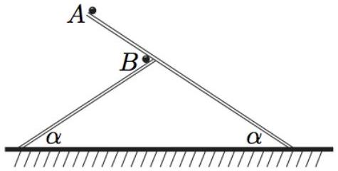
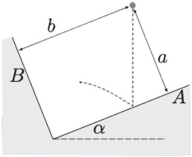

[1] Problem 22 (Quarterfinal 2002). A cart is rigged with a vertical cannon so that, when the cart is stationary on a horizontal track, the cannonball is fired straight up and lands back in the cannon. In each of the following situations, does the cannonball land back in the cannon, in front of it, or behind it?
    (a) The cart is moving on a frictionless horizontal track with speed $v$.
    (b) The cart is accelerating down a frictionless inclined track with angle $\theta$.
    (c) The cart is accelerating down an inclined track with angle $\theta$, and friction slows it down.

Solution. (a) The motion in the $x$ and $y$ directions is independent. In the $x$ direction, both the cannonball and cart just continue moving with speed $v$, so the cannonball lands right back into the cannon.

(b) Work in the tilted frame where the $x$ axis is parallel to the track. In the $x$ direction, both the cannonball and cart start with the same speed and accelerate with the same acceleration $g \sin \theta$, so the cannonball lands right back into the cannon, again.
(c) In this case the cart accelerates less, so the cannonball lands in front.
[2] Problem 23 (Kalda). Two balls at points $A$ and $B$ are released from rest at the same moment, from the locations shown below. All surfaces are frictionless.

If it takes time $t _ { A }$ and $t _ { B }$ for the balls to hit the ground, at what time was the distance between the balls the smallest?
Solution. Both balls have a downward acceleration of $g \sin ^ { 2 } \alpha$, and they have leftward and rightward accelerations of $g ^ { \prime } = g \sin \alpha \cos \alpha$. Since the balls always have the same vertical speed, we can ignore the vertical motion entirely. The distance between the balls is thus smallest when their horizontal separation is zero.
Let the total horizontal distances the balls travel be $d _ { A }$ and $d _ { B }$. Then
$$
d _ { A } = \frac { 1 } { 2 } g ^ { \prime } t _ { A } ^ { 2 } , \quad d _ { B } = \frac { 1 } { 2 } g ^ { \prime } t _ { B } ^ { 2 }
$$
and we are looking for the time $t$ where
$$
\frac { d _ { A } - d _ { B } } { 2 } = \frac { 1 } { 2 } g ^ { \prime } t ^ { 2 } .
$$
Solving these equations for $t$ gives
$$
t = \sqrt { \frac { t _ { A } ^ { 2 } - t _ { B } ^ { 2 } } { 2 } } .
$$

[2] Problem 24 (Kalda). Two planar frictionless walls are placed at right angles, where wall $A$ makes an angle $\alpha$ to the horizontal. A perfectly elastic ball is released from rest at a point a distance $a$ from wall $A$ and $b$ from wall $B$.

After a long time, what is the ratio of the number of times the ball has bounced against wall $B$ to the number of times it has bounced against wall $A$ ?
Solution. In the coordinate system tilted by angle $\alpha$, the motions in the $x$ and $y$ directions are independent, because collisions with wall $A$ leave $v _ { x }$ unchanged and vice versa. In the $y$ direction, the ball simply bounces up and down with uniform acceleration $g \cos \alpha$ and bounce height $a$, so
$$
\Delta t _ { A } = 2 \sqrt { \frac { 2 a } { g \cos \alpha } } .
$$
By similar reasoning, in the $x$ direction
$$
\Delta t _ { B } = 2 \sqrt { \frac { 2 b } { g \sin \alpha } } .
$$
Thus the answer is
$$
\frac { \Delta t _ { A } } { \Delta t _ { B } } = \sqrt { \frac { a \sin \alpha } { b \cos \alpha } } .
$$
When this ratio is a rational number, the ball eventually returns to its starting point. If it isn't, it never does; instead it eventually explores all of the space permitted by energy conservation, i.e. it eventually passes arbitrarily close to any point in the rectangle $0 \leq x \leq b$ and $0 \leq y \leq a$.
[2] Problem 25. USAPhO 2004, problem A4.
[3] Problem 26 (NBPhO 2010). A sprinkler can be modeled as a small hemisphere on the ground. Water shoots out from the hemisphere in all directions, with speed $v$ perpendicular to the hemisphere.
    (a) Find the total surface area of ground watered by the sprinkler.
    (b) At what distance from the sprinkler does the ground get the wettest?

Solution. (a) The range of the sprinkler is maximized at 45° and is equal to $v ^ { 2 } / g$. Then the area is $\pi \left( v ^ { 2 } / g \right) ^ { 2 } = \pi v ^ { 4 } / g ^ { 2 }$.

(b) The outermost circle, at radius $v ^ { 2 } / g$, gets by far the wettest. This is because a maximum of radius is achieved here, so a large range of launch angles gets to near this radius. (It's the same reason that balls thrown upward spend the most time near the very top of their trajectories.)
This idea is a little tricky, but very general; for instance, it's the principle behind the formation of caustics such as rainbows, as we'll see in $\mathbf { W 3 }$. It is also the way in which classical mechanics

emerges from quantum mechanics: classically things follow the trajectory of least action because it's a caustic of the quantum sum over all trajectories. So if you continue in physics, you'll see this beautiful little idea over and over again, in richer and richer settings! For an Olympiad problem that gives a bit more detail about caustics in optics, see here.
[3] Problem 27. USAPhO 2023, problem A1. A neat exercise on collisions and projectile motion.
