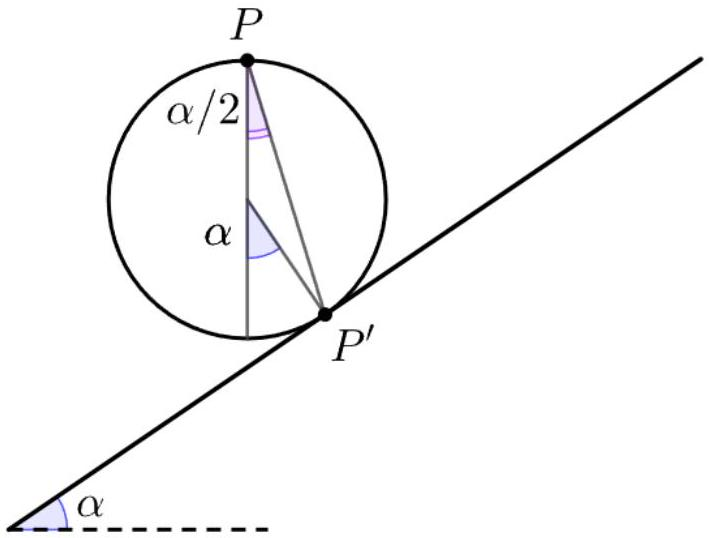

[3] Problem 31. An object is launched from the top of a hill, where the ground lies an angle $\phi$ below the horizontal. Show that the range of a projectile is maximized if it is launched along the angle bisector of the vertical and the ground.

Solution. This is a straightforward if messy problem; we'll show one of many ways to set it up. Setting the origin at the launch point and using ordinary horizontal/vertical coordinates, the object hits the hill when $\tan \phi = - y / x$. Using results for projectile trajectories from the preliminary problem set, we have

$$
\frac { y } { x } = - \tan \phi = \tan \theta - \frac { g x } { 2 v ^ { 2 } \cos ^ { 2 } \theta }
$$

where $\theta$ is the launch angle from the horizontal. Solving for $x$,

$$
x = \frac { 2 v ^ { 2 } \cos ^ { 2 } \theta } { g } ( \tan \theta + \tan \phi ) \propto \sin \theta \cos \theta + \cos ^ { 2 } \theta \tan \phi .
$$

To maximize the range, we want to maximize $x$, so setting the derivative to zero gives

$$
0 = \cos ^ { 2 } \theta - \sin ^ { 2 } \theta - 2 \sin \theta \cos \theta \tan \phi
$$

which simplifies to

$$
\tan ( 2 \theta ) = \frac { 1 } { \tan \phi } = \tan \left( \frac { \pi } { 2 } - \phi \right) , \quad \theta = \frac { ( \pi / 2 ) - \phi } { 2 }
$$

as desired. This famous problem was first posed by Torricelli in the 1640s, and solved by Halley in the 1690s.
[3] Problem 32 (PPP 35). A point $P$ is located above an inclined plane with angle $\alpha$. It is possible to reach the plane by sliding under gravity down a straight frictionless wire, joining $P$ to some point $P ^ { \prime }$ on the plane. Geometrically, how should $P ^ { \prime }$ be chosen so as to minimize the time taken? (Hint: think about the set of points that can be reached for all possible angles of the wire, after time $t$.)

Solution. Suppose the wire is at angle $\theta$ with respect to the vertical. Then, the distance traveled in time $t$ is $\frac { 1 } { 2 } ( g \cos \theta ) t ^ { 2 }$. Putting the origin at $P$, for a fixed $t$, the locus of all reached points is of the form $r \propto \cos \theta$, which is the polar representation of a circle whose topmost point is $P$, with a diameter of $\frac { 1 } { 2 } g t ^ { 2 }$, as shown below.

Therefore, $P ^ { \prime }$ is the point where one of these circles is tangent to the incline. Thus, the wire should be at an angle of $\alpha / 2$ to the vertical.

Idea 8
Since mechanics is time-reversible, and the speed of a projectile only depends on its height and not the path taken, finding the way to reach point B from point A with the lowest possible initial speed is the same as finding the way to reach point A from point B with the lowest possible initial speed.
