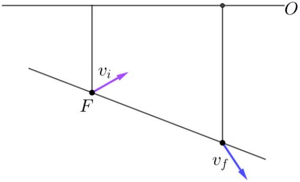
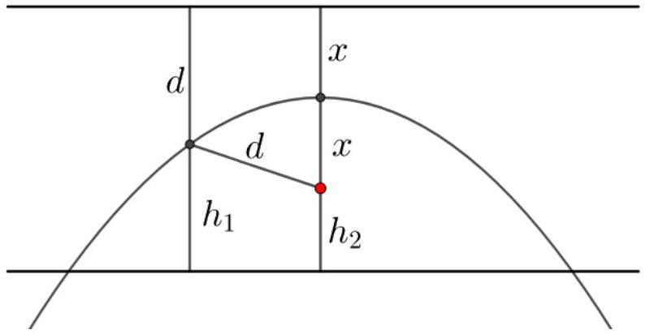

[4] Problem 33. Two fences of heights $h _ { 1 }$ and $h _ { 2 }$ are erected on a horizontal plain, so that the straight-line distance between the tops of the fences is $d$. Show that the minimum speed needed to throw a projectile over both fences is $\sqrt { g \left( h _ { 1 } + h _ { 2 } + d \right) }$.
Solution. It's tricky to think about how to throw the projectile starting from the ground, because you need to figure out where to launch and at what angle, under the condition that the trajectory just touches the tops of both fences. Instead, imagine the projectile starts at the top of the higher fence; the goal is then to throw it with minimal energy so that it just touches the top of the lower fence. Later the projectile will reach the ground, but we don't have to worry about where. Since mechanics is time-reversible, its speed at this point (which is found easily by energy conservation) will be the minimal possible speed.
Now there are many ways to do this problem. A very slick solution, which requires no computation at all, is presented in problem 34. However, we'll present a more direct attack for completeness. Note that if you want to hit the top of the lower fence with the minimum velocity, it's equivalent to maximizing your throwing range down an inclined plane, namely the plane that connects the tops of the two fences. Then the optimal launch angle is along the angle bisector, as we found in problem 31. Using the same starting point as the solution to that problem, we have
$$
- \frac { h } { \sqrt { d ^ { 2 } - h ^ { 2 } } } = \tan \theta - \frac { g \sqrt { d ^ { 2 } - h ^ { 2 } } } { 2 v ^ { 2 } \cos ^ { 2 } \theta }
$$
where we let $h = h _ { 2 } - h _ { 1 } > 0$. That solution gives a simple expression for $\tan 2 \theta$, so we massage this equation to
$$
\frac { g } { v ^ { 2 } } = \frac { \sin 2 \theta } { \sqrt { d ^ { 2 } - h ^ { 2 } } } + \frac { h } { d ^ { 2 } - h ^ { 2 } } ( 1 + \cos 2 \theta ) .
$$
We then plug in our previous results, which are
$$
\sin 2 \theta = \frac { \sqrt { d ^ { 2 } - h ^ { 2 } } } { d } , \quad \cos 2 \theta = \frac { h } { d }
$$

to get the result

$$
v ^ { 2 } = ( d - h ) g = \left( d + h _ { 1 } - h _ { 2 } \right) g .
$$

By energy conservation, the speed at the ground is

$$
v _ { 0 } ^ { 2 } = v ^ { 2 } + 2 h _ { 2 } g = \left( d + h _ { 1 } + h _ { 2 } \right) g
$$

as desired.
[4] Problem 34. Problems 31 and 33 can be solved with pure geometry. To do this, consider the set of points, in two dimensions, that a projectile can reach with a fixed initial speed $v$ and a fixed launch point. It turns out that the boundary of this set (i.e. the curve of points that a projectile can just barely reach) is a vertical parabola with its focus at the launch point. A parabola is defined as the set of points whose distance to the focus equals the distance to a line, called the directrix.

(a) Show that trajectories that touch this parabola must be tangent to it.
(b) Show that if any point is reached with the smallest possible initial speed, then the initial velocity must be perpendicular to the final velocity.
(c) Using the geometric definition of a parabola, recover the answers to problems 31 and 33.

If you really like this kind of thing, you can try Physics Cup 2019, problem 3, with solutions here.
Solution. (a) This is just because the parabola is defined to be the boundary of the set of points you can hit. If the trajectory weren't tangent to the parabola, you would be able to hit a point outside the parabola by continuing it either forwards or backwards.

(b) Let $\mathbf { v } _ { i }$ be the initial velocity and $\hat { \mathbf { v } } _ { \perp }$ be a unit vector in the perpendicular direction. If we replace the initial velocity by $\mathbf { v } _ { i } + \epsilon \hat { \mathbf { v } } _ { \perp }$, where $\epsilon$ is infinitesimal, then the speed isn't changed, which implies that the new trajectory should remain inside the parabola. Now suppose the original projectile's velocity is $\mathbf { v } _ { f }$ when it is tangent to the parabola, at position $\mathbf { r } _ { f }$. Then at the same time, the new projectile's position is $\mathbf { r } _ { f } + t \in \hat { \mathbf { v } } _ { \perp }$. In order to keep this inside the parabola for all infinitesimal $\epsilon$, both positive and negative, $t \in \hat { \mathbf { v } } _ { \perp }$ must be tangent to the parabola at this point. Hence $\hat { \mathbf { v } } _ { \perp }$ is parallel to $\mathbf { v } _ { f }$, so $\mathbf { v } _ { i }$ is perpendicular to $\mathbf { v } _ { f }$, as desired.
(c) A parabola is the set of points equidistant from a focus $F$ and a line, called the directrix. In this case, the directrix is horizontal, as shown below.

We showed in part (a) that the final velocity $\mathbf { v } _ { f }$ is tangent to the parabola. Therefore, it must point along the angle bisector between the downward vertical and the downward direction along the plane, because this is the direction along which the distance from the focus and directrix will be increased at the same rate. (You can show, by looking at some angles, that

this is equivalent to the so-called "reflective property of the parabola", which states that a light beam sent in perpendicular to the directrix will reflect off the parabola to the focus.)
We showed in part (b) that $\mathbf { v } _ { i }$ is perpendicular to $\mathbf { v } _ { f }$, which means it is along the angle bisector between the upward vertical and the downward direction along the plane. That is precisely the result we found in problem 31.
As for problem 33, imagine the projectile is launched from the top of the second fence. To see the points we can hit, we draw a parabola with focus at that point. At the minimum launching velocity, the parabola should just touch the top of the first fence, as shown below.

The horizontal line shown above is the directrix, and we have $x = v _ { 2 } ^ { 2 } / 2 g$ where $v _ { 2 }$ is the launching velocity from $h _ { 2 }$.
From the picture, we read off $d + h _ { 1 } = 2 x + h _ { 2 }$. (The picture is drawn with $h _ { 1 } > h _ { 2 }$, while in the previous explicit calculation we assumed $h _ { 1 } < h _ { 2 }$. But it doesn't really matter, as the geometric derivation works the same either way!) Thus the launching velocity at $h _ { 2 }$ satisfies $v _ { 2 } ^ { 2 } / g = d + h _ { 1 } - h _ { 2 }$. We actually care about the launch velocity $v _ { 0 }$ from the ground, and by energy conservation, we have

$$
\frac { 1 } { 2 } v _ { 0 } ^ { 2 } = \frac { 1 } { 2 } v _ { 2 } ^ { 2 } + g h _ { 2 } .
$$

Solving for $v _ { 0 }$ gives the answer,

$$
v _ { 0 } = \sqrt { g \left( d + h _ { 1 } + h _ { 2 } \right) } .
$$

[3] Problem 35. IPhO 2012, problem 1A.

## 5 Reading Graphs

In some kinematics problems, you'll have to infer what's going on from a diagram. To make progress, you'll have to print out the diagram to make measurements directly on it.
[3] Problem 36. NBPhO 2015, problem 6.
[3] Problem 37. NBPhO 2008, problem 3.
Remark
For a harder problem from the same genre, see EuPhO 2019, problem 3. Almost all competitors received zero points on it, largely because it relies on a specialized trick introduced earlier in this problem set. You can try it for entertainment if you have time and really like

kinematics.
