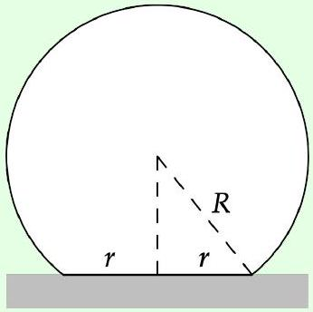

## Example 17

A solid ball of radius $R$, density $\rho$, and Young's modulus $Y$ rests on a hard table. Because of its weight, it deforms slightly, so that the area in contact with the table is a circle of radius $r$.

Estimate $r$, assuming that it is much smaller than $R$.

Solution
Recall from P1 that the Young's modulus is defined by

$$
Y = \frac { \text { stress } } { \text { strain } } = \frac { \text { restoring force/cross-sectional area } } { \text { change in length/length } }
$$

and has dimensions of pressure. By dimensional analysis, you can show that

$$
r = R f ( \rho g R / Y )
$$

but dimensional analysis alone can't tell us anything more about $f$. Moreover, an exact analysis using forces would be very difficult, because different parts of the ball are compressed in different amounts, and in different directions; there's little symmetry here.

Instead, we'll roughly estimate the stress and strain near the bottom of the ball. For the part directly in contact with the table, we have

$$
\text { stress } \sim F / r ^ { 2 } \sim \rho g R ^ { 3 } / r ^ { 2 }
$$

because the normal pressure has to balance gravity. This is the pressure exactly at the bottom of the ball; at heights much greater than $r$, the pressure will be smaller because it can spread out over a wider horizontal surface area. Since stress is proportional to strain, that means the part of the ball that is significantly strained has typical height $r$. (This is an example of Saint-Venant's principle, which states that strain is generally confined near the location that external forces are applied.) So in that region, the strain must be

$$
\text { strain } \sim \delta / r \sim r / R
$$

where $\delta$ is the vertical deformation. Using the definition of the Young's modulus, we conclude

$$
r \propto R \left( \frac { \rho g R } { Y } \right) ^ { 1 / 3 } .
$$

We can also phrase this result in terms of force and displacement. We have $\delta \sim r ^ { 2 } / R$, and the total force that pushes the ball into the table is $F \sim \rho g R ^ { 3 }$, so

$$
F \propto Y R ^ { 1 / 2 } \delta ^ { 3 / 2 } .
$$

The restoring force is not linear in $\delta$, so it doesn't obey Hooke's law.
As mentioned above, contact mechanics is the study of how normal and other forces behave for realistic, deformable solids. In this example, we considered "Hertzian contact". For much more, see Contact Mechanics by Johnson, and Contact Mechanics and Friction by Popov.
[4] Problem 35. NBPhO 2006, problem 5. A tough problem on a deforming object.
